# Diagram: shipment_core/shipment_service/serverless.shipmentPublic.yml

> Auto-generated by Obscura crawlers

## Mermaid

```mermaid
flowchart LR
  Provider[AWS Provider<br/>runtime: python3.13<br/>arch: arm64]:::provider --> VPC[VPC]
  Provider --> Env[Environment Variables]
  Provider --> IAM[IAM Role]
  IAM --> Policies[Managed Policies + Inline Statements]
  Policies -->|Allow: lambda:sns/sqs/s3/secrets| AllowActions1((Allow Actions))
  Policies -->|Allow: ssm:GetParameter*| AllowSSM((SSM Parameters ARNs))
  Policies -->|Allow: kms:Decrypt| AllowKMS((KMS Key ARN))
  Policies -->|Deny: logs:Create/Put| DenyLogs((Deny CloudWatch Writes))

  subgraph Functions [Functions]
    direction TB
    F1["v1_proxy_shipment<br/>handler: shipment_service/proxy_endpoints.v1_shipment<br/>HTTP POST /rest/api/v1/shipment"]:::fn
    F2["v1_proxy_shipment_status<br/>handler: shipment_service/proxy_endpoints.v1_shipment_status<br/>HTTP POST /rest/api/v1/status"]:::fn
    F3["v2_post_put_shipment<br/>handler: shipment_service/v2/post_put_shipment.lambda_handler<br/>HTTP POST/PUT /rest/v2/tl/shipment"]:::fn
    F4["v2_delete_shipment<br/>handler: shipment_service/v2/delete_shipment.lambda_handler<br/>HTTP DELETE /rest/v2/tl/shipment"]:::fn
    F5["v2_post_shipment_status<br/>handler: shipment_service/v2/post_shipment_status.lambda_handler<br/>HTTP POST /rest/v2/tl/shipment/event"]:::fn
    F6["v2_patch_shipment<br/>handler: shipment_service/v2/patch_shipment.lambda_handler<br/>HTTP PATCH /rest/v2/tl/shipment"]:::fn
    F7["v2_post_supplemental_shipment<br/>handler: shipment_service/v2/post_supplemental_shipment.lambda_handler<br/>HTTP POST/DELETE /rest/v2/tl/supplemental-shipment"]:::fn
  end

  Provider --> Functions
  IAM --> Functions
  Env --> Functions

  classDef provider fill:#f9f,stroke:#333,stroke-width:1px;
  classDef fn fill:#bbf,stroke:#333,stroke-width:1px;
  classDef awsResource fill:#efe,stroke:#333,stroke-width:1px;
```

### SVG

<svg id="container" width="4699.859375" xmlns="http://www.w3.org/2000/svg" class="flowchart" height="749.8125" viewBox="0 0 4699.859375 749.8125" role="graphics-document document" aria-roledescription="flowchart-v2"><g><marker id="container_flowchart-v2-pointEnd" class="marker flowchart-v2" viewBox="0 0 10 10" refX="5" refY="5" markerUnits="userSpaceOnUse" markerWidth="8" markerHeight="8" orient="auto"><path d="M 0 0 L 10 5 L 0 10 z" class="arrowMarkerPath" style="stroke-width: 1; stroke-dasharray: 1, 0;"></path></marker><marker id="container_flowchart-v2-pointStart" class="marker flowchart-v2" viewBox="0 0 10 10" refX="4.5" refY="5" markerUnits="userSpaceOnUse" markerWidth="8" markerHeight="8" orient="auto"><path d="M 0 5 L 10 10 L 10 0 z" class="arrowMarkerPath" style="stroke-width: 1; stroke-dasharray: 1, 0;"></path></marker><marker id="container_flowchart-v2-circleEnd" class="marker flowchart-v2" viewBox="0 0 10 10" refX="11" refY="5" markerUnits="userSpaceOnUse" markerWidth="11" markerHeight="11" orient="auto"><circle cx="5" cy="5" r="5" class="arrowMarkerPath" style="stroke-width: 1; stroke-dasharray: 1, 0;"></circle></marker><marker id="container_flowchart-v2-circleStart" class="marker flowchart-v2" viewBox="0 0 10 10" refX="-1" refY="5" markerUnits="userSpaceOnUse" markerWidth="11" markerHeight="11" orient="auto"><circle cx="5" cy="5" r="5" class="arrowMarkerPath" style="stroke-width: 1; stroke-dasharray: 1, 0;"></circle></marker><marker id="container_flowchart-v2-crossEnd" class="marker cross flowchart-v2" viewBox="0 0 11 11" refX="12" refY="5.2" markerUnits="userSpaceOnUse" markerWidth="11" markerHeight="11" orient="auto"><path d="M 1,1 l 9,9 M 10,1 l -9,9" class="arrowMarkerPath" style="stroke-width: 2; stroke-dasharray: 1, 0;"></path></marker><marker id="container_flowchart-v2-crossStart" class="marker cross flowchart-v2" viewBox="0 0 11 11" refX="-1" refY="5.2" markerUnits="userSpaceOnUse" markerWidth="11" markerHeight="11" orient="auto"><path d="M 1,1 l 9,9 M 10,1 l -9,9" class="arrowMarkerPath" style="stroke-width: 2; stroke-dasharray: 1, 0;"></path></marker><g class="root"><g class="clusters"></g><g class="edgePaths"><path d="M178.085,110.523L187.568,103.523C197.051,96.523,216.018,82.523,240.317,75.523C264.617,68.523,294.25,68.523,309.066,68.523L323.883,68.523" id="L_Provider_VPC_0" class="edge-thickness-normal edge-pattern-solid edge-thickness-normal edge-pattern-solid flowchart-link" style=";" data-edge="true" data-et="edge" data-id="L_Provider_VPC_0" data-points="W3sieCI6MTc4LjA4NDY3NzQxOTM1NDgyLCJ5IjoxMTAuNTIzNDM3NX0seyJ4IjoyMzQuOTg0Mzc1LCJ5Ijo2OC41MjM0Mzc1fSx7IngiOjMyNy44ODI4MTI1LCJ5Ijo2OC41MjM0Mzc1fV0=" marker-end="url(#container_flowchart-v2-pointEnd)"></path><path d="M209.984,195.791L214.151,197.205C218.318,198.618,226.651,201.446,234.318,202.86C241.984,204.273,248.984,204.273,252.484,204.273L255.984,204.273" id="L_Provider_Env_0" class="edge-thickness-normal edge-pattern-solid edge-thickness-normal edge-pattern-solid flowchart-link" style=";" data-edge="true" data-et="edge" data-id="L_Provider_Env_0" data-points="W3sieCI6MjA5Ljk4NDM3NSwieSI6MTk1Ljc5MDc2ODY4MzcyOTE0fSx7IngiOjIzNC45ODQzNzUsInkiOjIwNC4yNzM0Mzc1fSx7IngiOjI1OS45ODQzNzUsInkiOjIwNC4yNzM0Mzc1fV0=" marker-end="url(#container_flowchart-v2-pointEnd)"></path><path d="M142.9,212.523L158.248,235.607C173.595,258.69,204.29,304.857,231.491,327.94C258.693,351.023,282.401,351.023,294.255,351.023L306.109,351.023" id="L_Provider_IAM_0" class="edge-thickness-normal edge-pattern-solid edge-thickness-normal edge-pattern-solid flowchart-link" style=";" data-edge="true" data-et="edge" data-id="L_Provider_IAM_0" data-points="W3sieCI6MTQyLjkwMDM3NTE2NDkwNzY0LCJ5IjoyMTIuNTIzNDM3NX0seyJ4IjoyMzQuOTg0Mzc1LCJ5IjozNTEuMDIzNDM3NX0seyJ4IjozMTAuMTA5Mzc1LCJ5IjozNTEuMDIzNDM3NX1d" marker-end="url(#container_flowchart-v2-pointEnd)"></path><path d="M415.857,378.023L431.204,387.357C446.55,396.69,477.244,415.357,784.265,424.69C1091.286,434.023,1674.635,434.023,1966.31,434.023L2257.984,434.023" id="L_IAM_Policies_0" class="edge-thickness-normal edge-pattern-solid edge-thickness-normal edge-pattern-solid flowchart-link" style=";" data-edge="true" data-et="edge" data-id="L_IAM_Policies_0" data-points="W3sieCI6NDE1Ljg1NjkyNzcxMDg0MzM3LCJ5IjozNzguMDIzNDM3NX0seyJ4Ijo1MDcuOTM3NSwieSI6NDM0LjAyMzQzNzV9LHsieCI6MjI2MS45ODQzNzUsInkiOjQzNC4wMjM0Mzc1fV0=" marker-end="url(#container_flowchart-v2-pointEnd)"></path><path d="M2521.984,409.773L2830.992,352.13C3140,294.487,3758.016,179.2,4093.773,121.557C4429.531,63.914,4483.031,63.914,4509.781,63.914L4536.531,63.914" id="L_Policies_AllowActions1_0" class="edge-thickness-normal edge-pattern-solid edge-thickness-normal edge-pattern-solid flowchart-link" style=";" data-edge="true" data-et="edge" data-id="L_Policies_AllowActions1_0" data-points="W3sieCI6MjUyMS45ODQzNzUsInkiOjQwOS43NzI4OTIxMzQyMzA4Nn0seyJ4Ijo0Mzc2LjAzMTI1LCJ5Ijo2My45MTQwNjI1fSx7IngiOjQ1NDAuNTMxMjUsInkiOjYzLjkxNDA2MjV9XQ==" marker-end="url(#container_flowchart-v2-pointEnd)"></path><path d="M2521.984,422.341L2830.992,394.574C3140,366.806,3758.016,311.27,4088.775,283.502C4419.534,255.734,4463.036,255.734,4484.788,255.734L4506.539,255.734" id="L_Policies_AllowSSM_0" class="edge-thickness-normal edge-pattern-solid edge-thickness-normal edge-pattern-solid flowchart-link" style=";" data-edge="true" data-et="edge" data-id="L_Policies_AllowSSM_0" data-points="W3sieCI6MjUyMS45ODQzNzUsInkiOjQyMi4zNDE0NjY0NjU0MTk1fSx7IngiOjQzNzYuMDMxMjUsInkiOjI1NS43MzQzNzV9LHsieCI6NDUxMC41MzkwNjI1LCJ5IjoyNTUuNzM0Mzc1fV0=" marker-end="url(#container_flowchart-v2-pointEnd)"></path><path d="M2521.984,434.829L2830.992,436.743C3140,438.657,3758.016,442.485,4093.98,444.399C4429.945,446.313,4483.859,446.313,4510.816,446.313L4537.773,446.313" id="L_Policies_AllowKMS_0" class="edge-thickness-normal edge-pattern-solid edge-thickness-normal edge-pattern-solid flowchart-link" style=";" data-edge="true" data-et="edge" data-id="L_Policies_AllowKMS_0" data-points="W3sieCI6MjUyMS45ODQzNzUsInkiOjQzNC44Mjg2NDkzODU0Mjk4Nn0seyJ4Ijo0Mzc2LjAzMTI1LCJ5Ijo0NDYuMzEyNX0seyJ4Ijo0NTQxLjc3MzQzNzUsInkiOjQ0Ni4zMTI1fV0=" marker-end="url(#container_flowchart-v2-pointEnd)"></path><path d="M2521.984,447.939L2830.992,481.015C3140,514.092,3758.016,580.245,4087.19,613.322C4416.365,646.398,4456.698,646.398,4476.865,646.398L4497.031,646.398" id="L_Policies_DenyLogs_0" class="edge-thickness-normal edge-pattern-solid edge-thickness-normal edge-pattern-solid flowchart-link" style=";" data-edge="true" data-et="edge" data-id="L_Policies_DenyLogs_0" data-points="W3sieCI6MjUyMS45ODQzNzUsInkiOjQ0Ny45Mzg4MDkzMzMxMzc4fSx7IngiOjQzNzYuMDMxMjUsInkiOjY0Ni4zOTg0Mzc1fSx7IngiOjQ1MDEuMDMxMjUsInkiOjY0Ni4zOTg0Mzc1fV0=" marker-end="url(#container_flowchart-v2-pointEnd)"></path><path d="M209.984,136.675L214.151,135.649C218.318,134.624,226.651,132.574,253.564,131.549C280.477,130.523,325.969,130.523,371.461,130.523C416.953,130.523,462.445,130.523,521.711,132.733C580.977,134.943,654.016,139.362,690.536,141.572L727.056,143.782" id="L_Provider_Functions_0" class="edge-thickness-normal edge-pattern-solid edge-thickness-normal edge-pattern-solid flowchart-link" style=";" data-edge="true" data-et="edge" data-id="L_Provider_Functions_0" data-points="W3sieCI6MjA5Ljk4NDM3NSwieSI6MTM2LjY3NDYxMjU0ODA1NjA1fSx7IngiOjIzNC45ODQzNzUsInkiOjEzMC41MjM0Mzc1fSx7IngiOjM3MS40NjA5Mzc1LCJ5IjoxMzAuNTIzNDM3NX0seyJ4Ijo1MDcuOTM3NSwieSI6MTMwLjUyMzQzNzV9LHsieCI6NzMxLjA0ODMxNDE0NDczNjksInkiOjE0NC4wMjM0Mzc1fV0=" marker-end="url(#container_flowchart-v2-pointEnd)"></path><path d="M400.362,324.023L418.291,307.273C436.22,290.523,472.079,257.023,493.508,240.312C514.938,223.601,521.938,223.679,525.438,223.718L528.938,223.758" id="L_IAM_Functions_0" class="edge-thickness-normal edge-pattern-solid edge-thickness-normal edge-pattern-solid flowchart-link" style=";" data-edge="true" data-et="edge" data-id="L_IAM_Functions_0" data-points="W3sieCI6NDAwLjM2MTg1NjYxNzY0NzA1LCJ5IjozMjQuMDIzNDM3NX0seyJ4Ijo1MDcuOTM3NSwieSI6MjIzLjUyMzQzNzV9LHsieCI6NTMyLjkzNzUsInkiOjIyMy44MDIwOTI5ODcyNzM5fV0=" marker-end="url(#container_flowchart-v2-pointEnd)"></path><path d="M400.94,231.273L418.773,247.607C436.606,263.94,472.272,296.607,493.605,312.783C514.939,328.958,521.94,328.644,525.441,328.486L528.942,328.329" id="L_Env_Functions_0" class="edge-thickness-normal edge-pattern-solid edge-thickness-normal edge-pattern-solid flowchart-link" style=";" data-edge="true" data-et="edge" data-id="L_Env_Functions_0" data-points="W3sieCI6NDAwLjkzOTg3NTAwMDAwMDAzLCJ5IjoyMzEuMjczNDM3NX0seyJ4Ijo1MDcuOTM3NSwieSI6MzI5LjI3MzQzNzV9LHsieCI6NTMyLjkzNzUsInkiOjMyOC4xNDg4NjM1NjkyMTZ9XQ==" marker-end="url(#container_flowchart-v2-pointEnd)"></path></g><g class="edgeLabels"><g class="edgeLabel"><g class="label" data-id="L_Provider_VPC_0" transform="translate(0, 0)"><foreignObject width="0" height="0">

</foreignObject></g></g><g class="edgeLabel"><g class="label" data-id="L_Provider_Env_0" transform="translate(0, 0)"><foreignObject width="0" height="0">

</foreignObject></g></g><g class="edgeLabel"><g class="label" data-id="L_Provider_IAM_0" transform="translate(0, 0)"><foreignObject width="0" height="0">

</foreignObject></g></g><g class="edgeLabel"><g class="label" data-id="L_IAM_Policies_0" transform="translate(0, 0)"><foreignObject width="0" height="0">

</foreignObject></g></g><g class="edgeLabel" transform="translate(4376.03125, 63.9140625)"><g class="label" data-id="L_Policies_AllowActions1_0" transform="translate(-100, -24)"><foreignObject width="200" height="48">

Allow: lambda:sns/sqs/s3/secrets

</foreignObject></g></g><g class="edgeLabel" transform="translate(4376.03125, 255.734375)"><g class="label" data-id="L_Policies_AllowSSM_0" transform="translate(-92.9921875, -12)"><foreignObject width="185.984375" height="24">

Allow: ssm:GetParameter*

</foreignObject></g></g><g class="edgeLabel" transform="translate(4376.03125, 446.3125)"><g class="label" data-id="L_Policies_AllowKMS_0" transform="translate(-68.3203125, -12)"><foreignObject width="136.640625" height="24">

Allow: kms:Decrypt

</foreignObject></g></g><g class="edgeLabel" transform="translate(4376.03125, 646.3984375)"><g class="label" data-id="L_Policies_DenyLogs_0" transform="translate(-77.9921875, -12)"><foreignObject width="155.984375" height="24">

Deny: logs:Create/Put

</foreignObject></g></g><g class="edgeLabel"><g class="label" data-id="L_Provider_Functions_0" transform="translate(0, 0)"><foreignObject width="0" height="0">

</foreignObject></g></g><g class="edgeLabel"><g class="label" data-id="L_IAM_Functions_0" transform="translate(0, 0)"><foreignObject width="0" height="0">

</foreignObject></g></g><g class="edgeLabel"><g class="label" data-id="L_Env_Functions_0" transform="translate(0, 0)"><foreignObject width="0" height="0">

</foreignObject></g></g></g><g class="nodes"><g class="root" transform="translate(524.9375, 136.0234375)"><g class="clusters"><g class="cluster" id="Functions" data-look="classic"><rect style="" x="8" y="8" width="3718.09375" height="201"></rect><g class="cluster-label" transform="translate(1832, 8)"><foreignObject width="70.09375" height="24">

Functions

</foreignObject></g></g></g><g class="edgePaths"></g><g class="edgeLabels"></g><g class="nodes"><g class="node default fn" id="flowchart-F1-16" transform="translate(248.6875, 108.5)"><rect class="basic label-container" style="fill:#bbf !important;stroke:#333 !important;stroke-width:1px !important" x="-205.6875" y="-63" width="411.375" height="126"></rect><g class="label" style="" transform="translate(-175.6875, -48)"><rect></rect><foreignObject width="351.375" height="96">

v1_proxy_shipment handler: shipment_service/proxy_endpoints.v1_shipment HTTP POST /rest/api/v1/shipment

</foreignObject></g></g><g class="node default fn" id="flowchart-F2-17" transform="translate(736.421875, 108.5)"><rect class="basic label-container" style="fill:#bbf !important;stroke:#333 !important;stroke-width:1px !important" x="-232.046875" y="-63" width="464.09375" height="126"></rect><g class="label" style="" transform="translate(-202.046875, -48)"><rect></rect><foreignObject width="404.09375" height="96">

v1_proxy_shipment_status handler: shipment_service/proxy_endpoints.v1_shipment_status HTTP POST /rest/api/v1/status

</foreignObject></g></g><g class="node default fn" id="flowchart-F3-18" transform="translate(1260.6484375, 108.5)"><rect class="basic label-container" style="fill:#bbf !important;stroke:#333 !important;stroke-width:1px !important" x="-242.1796875" y="-63" width="484.359375" height="126"></rect><g class="label" style="" transform="translate(-212.1796875, -48)"><rect></rect><foreignObject width="424.359375" height="96">

v2_post_put_shipment handler: shipment_service/v2/post_put_shipment.lambda_handler HTTP POST/PUT /rest/v2/tl/shipment

</foreignObject></g></g><g class="node default fn" id="flowchart-F4-19" transform="translate(1785.125, 108.5)"><rect class="basic label-container" style="fill:#bbf !important;stroke:#333 !important;stroke-width:1px !important" x="-232.296875" y="-63" width="464.59375" height="126"></rect><g class="label" style="" transform="translate(-202.296875, -48)"><rect></rect><foreignObject width="404.59375" height="96">

v2_delete_shipment handler: shipment_service/v2/delete_shipment.lambda_handler HTTP DELETE /rest/v2/tl/shipment

</foreignObject></g></g><g class="node default fn" id="flowchart-F5-20" transform="translate(2319.4765625, 108.5)"><rect class="basic label-container" style="fill:#bbf !important;stroke:#333 !important;stroke-width:1px !important" x="-252.0546875" y="-63" width="504.109375" height="126"></rect><g class="label" style="" transform="translate(-222.0546875, -48)"><rect></rect><foreignObject width="444.109375" height="96">

v2_post_shipment_status handler: shipment_service/v2/post_shipment_status.lambda_handler HTTP POST /rest/v2/tl/shipment/event

</foreignObject></g></g><g class="node default fn" id="flowchart-F6-21" transform="translate(2851.515625, 108.5)"><rect class="basic label-container" style="fill:#bbf !important;stroke:#333 !important;stroke-width:1px !important" x="-229.984375" y="-63" width="459.96875" height="126"></rect><g class="label" style="" transform="translate(-199.984375, -48)"><rect></rect><foreignObject width="399.96875" height="96">

v2_patch_shipment handler: shipment_service/v2/patch_shipment.lambda_handler HTTP PATCH /rest/v2/tl/shipment

</foreignObject></g></g><g class="node default fn" id="flowchart-F7-22" transform="translate(3411.296875, 108.5)"><rect class="basic label-container" style="fill:#bbf !important;stroke:#333 !important;stroke-width:1px !important" x="-279.796875" y="-63" width="559.59375" height="126"></rect><g class="label" style="" transform="translate(-249.796875, -48)"><rect></rect><foreignObject width="499.59375" height="96">

v2_post_supplemental_shipment handler: shipment_service/v2/post_supplemental_shipment.lambda_handler HTTP POST/DELETE /rest/v2/tl/supplemental-shipment

</foreignObject></g></g></g></g><g class="node default provider" id="flowchart-Provider-0" transform="translate(108.9921875, 161.5234375)"><rect class="basic label-container" style="fill:#f9f !important;stroke:#333 !important;stroke-width:1px !important" x="-100.9921875" y="-51" width="201.984375" height="102"></rect><g class="label" style="" transform="translate(-70.9921875, -36)"><rect></rect><foreignObject width="141.984375" height="72">

AWS Provider runtime: python3.13 arch: arm64

</foreignObject></g></g><g class="node default" id="flowchart-VPC-1" transform="translate(371.4609375, 68.5234375)"><rect class="basic label-container" style="" x="-43.578125" y="-27" width="87.15625" height="54"></rect><g class="label" style="" transform="translate(-13.578125, -12)"><rect></rect><foreignObject width="27.15625" height="24">

VPC

</foreignObject></g></g><g class="node default" id="flowchart-Env-3" transform="translate(371.4609375, 204.2734375)"><rect class="basic label-container" style="" x="-111.4765625" y="-27" width="222.953125" height="54"></rect><g class="label" style="" transform="translate(-81.4765625, -12)"><rect></rect><foreignObject width="162.953125" height="24">

Environment Variables

</foreignObject></g></g><g class="node default" id="flowchart-IAM-5" transform="translate(371.4609375, 351.0234375)"><rect class="basic label-container" style="" x="-61.3515625" y="-27" width="122.703125" height="54"></rect><g class="label" style="" transform="translate(-31.3515625, -12)"><rect></rect><foreignObject width="62.703125" height="24">

IAM Role

</foreignObject></g></g><g class="node default" id="flowchart-Policies-7" transform="translate(2391.984375, 434.0234375)"><rect class="basic label-container" style="" x="-130" y="-39" width="260" height="78"></rect><g class="label" style="" transform="translate(-100, -24)"><rect></rect><foreignObject width="200" height="48">

Managed Policies + Inline Statements

</foreignObject></g></g><g class="node default" id="flowchart-AllowActions1-9" transform="translate(4596.4453125, 63.9140625)"><circle class="basic label-container" style="" r="55.9140625" cx="0" cy="0"></circle><g class="label" style="" transform="translate(-48.4140625, -12)"><rect></rect><foreignObject width="96.828125" height="24">

Allow Actions

</foreignObject></g></g><g class="node default" id="flowchart-AllowSSM-11" transform="translate(4596.4453125, 255.734375)"><circle class="basic label-container" style="" r="85.90625" cx="0" cy="0"></circle><g class="label" style="" transform="translate(-78.40625, -12)"><rect></rect><foreignObject width="156.8125" height="24">

SSM Parameters ARNs

</foreignObject></g></g><g class="node default" id="flowchart-AllowKMS-13" transform="translate(4596.4453125, 446.3125)"><circle class="basic label-container" style="" r="54.671875" cx="0" cy="0"></circle><g class="label" style="" transform="translate(-47.171875, -12)"><rect></rect><foreignObject width="94.34375" height="24">

KMS Key ARN

</foreignObject></g></g><g class="node default" id="flowchart-DenyLogs-15" transform="translate(4596.4453125, 646.3984375)"><circle class="basic label-container" style="" r="95.4140625" cx="0" cy="0"></circle><g class="label" style="" transform="translate(-87.9140625, -12)"><rect></rect><foreignObject width="175.828125" height="24">

Deny CloudWatch Writes

</foreignObject></g></g></g></g></g></svg>
