# Diagram: shipment_core/shipment_service/serverless.shipment_noproxy.yml

> Auto-generated by Obscura crawlers

## Mermaid

```mermaid
flowchart LR
  subgraph Service["service: shipments"]
    direction TB
    Provider[("provider: aws\nruntime: python3.13\narch: arm64\ntimeout:300")]
    Env["Environment\nCARBONCOPY_*, DD_*, AWS_STAGE, ACCOUNT_ID, SERVICE"]
    IAM["IAM Role\nmanagedPolicies + statements\n(Allow lambda/sns/sqs/s3/secrets/ssm/kms; Deny specific logs)"]
  end

  subgraph Functions["Lambda functions"]
    direction LR
    create_shipments["create_shipments\nPOST/PUT/DELETE /shipments/{shipment_id}"]
    asset_assign["asset_assign\nPUT /shipments/{shipment_id}/asset_assign"]
    location_update["location_update\nPUT /shipments/{shipment_id}/location_update"]
    rail_update["rail_update\nPUT /shipments/{shipment_id}/rail_update"]
    window_time["window_time\nPUT /shipments/{shipment_id}/update_window_timing"]
    ltl_update["ltl_update\nPUT /shipments/{shipment_id}/ltl_update"]
    intermodal_update["intermodal_update\nPUT /shipments/{shipment_id}/intermodal_update"]
    general_mode_update["general_mode_update\nPUT /shipments/{shipment_id}/general_mode_update"]
    asn["asn\nPUT /shipments/{shipment_id}/asn"]
    unload["unload\nPUT /shipments/{shipment_id}/unload"]
    shipments_patch["shipments_patch\nPATCH /shipment"]
    proxy_shipments["proxy_shipments\nPOST /shipments"]
    proxy_shipment_status["proxy_shipment_status\nPOST /shipment_statuses"]
    unknown_code["unknown_code\nPUT /shipments/{shipment_id}/unknown_code"]
    update_route_timing["update_route_timing\n(no http event)"]
    deferred_processing["deferred_processing\nScheduled rate(60 minutes)"]
    get_events["get_events\nGET /events & /versioned/events & /versioned/{version}/events ..."]
    get_shipment_mode["get_shipment_mode\nGET /shipment_type"]
    post_trip_shipment["post_trip_shipment\nPOST/PUT /trip"]
    delete_trip["delete_trip\nDELETE /trip"]
    add_backfill_event["add_backfill_event\nPOST /shipment/backfill"]
    backfill_shipment["backfill_shipment\n(long timeout)"]
    shipment_co2_emission["shipment_co2_emission\nSQS consumer"]
    route_book["route-book\nANY /shipment/route_book"]
    consume_route_book["consume_route_book\nSQS consumer"]
    shipment_event_consumer["shipment_event_consumer"]
    post_bulk_shipment_updates["post-bulk-shipment-updates\nPOST /post_bulk_shipment_updates"]
    get_shipment_system_configuration["get_shipment_system_configuration"]
    shipment_exception_consumer["shipment_exception_consumer\nSQS consumer"]
  end

  Service --> Provider
  Service --> Env
  Service --> IAM
  IAM --> Functions

  %% Group HTTP-triggered functions
  subgraph HTTP["HTTP Endpoints"]
    direction TB
    create_shipments
    asset_assign
    location_update
    rail_update
    window_time
    ltl_update
    intermodal_update
    general_mode_update
    asn
    unload
    shipments_patch
    proxy_shipments
    proxy_shipment_status
    unknown_code
    get_events
    get_shipment_mode
    post_trip_shipment
    delete_trip
    add_backfill_event
    route_book
    post_bulk_shipment_updates
  end

  %% Group Scheduled / SQS / Other triggers
  subgraph OtherTriggers["Scheduled / SQS / Internal"]
    direction TB
    deferred_processing
    shipment_co2_emission
    consume_route_book
    shipment_event_consumer
    shipment_exception_consumer
    backfill_shipment
    update_route_timing
    get_shipment_system_configuration
  end

  %% Flows: client -> HTTP -> Lambda -> downstream resources
  Client["Client / API Gateway"] -->|HTTP| HTTP
  Scheduled["CloudWatch Events / Scheduler"] -->|schedule| deferred_processing
  SQS["SQS Queues"] -->|messages| shipment_co2_emission
  SQS -->|messages| consume_route_book
  SQS -->|messages| shipment_exception_consumer
  HTTP -->|invokes| Functions
  OtherTriggers -->|invokes| Functions

  %% Outputs and Resources
  subgraph Resources["AWS Resources"]
    direction LR
    SSM["SSM Parameters"]
    KMS["KMS Key"]
    Secrets["SecretsManager"]
    S3["S3 PutObject"]
    SNS["SNS Topics"]
    CloudWatch["CloudWatch Logs (restricted)"]
    Outputs["CloudFormation Outputs\nmultimodalExclusionaryStatusCodes"]
  end

  Functions --> SSM
  Functions --> KMS
  Functions --> Secrets
  Functions --> S3
  Functions --> SNS
  Functions --> CloudWatch
  Provider --> Outputs

  classDef svc fill:#f9f,stroke:#333,stroke-width:1px;
  class Service svc
  class Functions,HTTP,OtherTriggers,Resources stroke:#333,stroke-width:1px;
```

### SVG

<svg id="container" width="1810.84375" xmlns="http://www.w3.org/2000/svg" class="flowchart" height="4090" viewBox="0 0 1810.84375 4090" role="graphics-document document" aria-roledescription="flowchart-v2"><g><marker id="container_flowchart-v2-pointEnd" class="marker flowchart-v2" viewBox="0 0 10 10" refX="5" refY="5" markerUnits="userSpaceOnUse" markerWidth="8" markerHeight="8" orient="auto"><path d="M 0 0 L 10 5 L 0 10 z" class="arrowMarkerPath" style="stroke-width: 1; stroke-dasharray: 1, 0;"></path></marker><marker id="container_flowchart-v2-pointStart" class="marker flowchart-v2" viewBox="0 0 10 10" refX="4.5" refY="5" markerUnits="userSpaceOnUse" markerWidth="8" markerHeight="8" orient="auto"><path d="M 0 5 L 10 10 L 10 0 z" class="arrowMarkerPath" style="stroke-width: 1; stroke-dasharray: 1, 0;"></path></marker><marker id="container_flowchart-v2-circleEnd" class="marker flowchart-v2" viewBox="0 0 10 10" refX="11" refY="5" markerUnits="userSpaceOnUse" markerWidth="11" markerHeight="11" orient="auto"><circle cx="5" cy="5" r="5" class="arrowMarkerPath" style="stroke-width: 1; stroke-dasharray: 1, 0;"></circle></marker><marker id="container_flowchart-v2-circleStart" class="marker flowchart-v2" viewBox="0 0 10 10" refX="-1" refY="5" markerUnits="userSpaceOnUse" markerWidth="11" markerHeight="11" orient="auto"><circle cx="5" cy="5" r="5" class="arrowMarkerPath" style="stroke-width: 1; stroke-dasharray: 1, 0;"></circle></marker><marker id="container_flowchart-v2-crossEnd" class="marker cross flowchart-v2" viewBox="0 0 11 11" refX="12" refY="5.2" markerUnits="userSpaceOnUse" markerWidth="11" markerHeight="11" orient="auto"><path d="M 1,1 l 9,9 M 10,1 l -9,9" class="arrowMarkerPath" style="stroke-width: 2; stroke-dasharray: 1, 0;"></path></marker><marker id="container_flowchart-v2-crossStart" class="marker cross flowchart-v2" viewBox="0 0 11 11" refX="-1" refY="5.2" markerUnits="userSpaceOnUse" markerWidth="11" markerHeight="11" orient="auto"><path d="M 1,1 l 9,9 M 10,1 l -9,9" class="arrowMarkerPath" style="stroke-width: 2; stroke-dasharray: 1, 0;"></path></marker><g class="root"><g class="clusters"><g class="cluster stroke:#333,stroke-width:1px" id="Resources" data-look="classic"><rect style="" x="1353.046875" y="8" width="449.796875" height="4074"></rect><g class="cluster-label" transform="translate(1523.59375, 8)"><foreignObject width="108.703125" height="24">

AWS Resources

</foreignObject></g></g><g class="cluster stroke:#333,stroke-width:1px" id="Functions" data-look="classic"><rect style="" x="823.328125" y="30" width="479.71875" height="3958"></rect><g class="cluster-label" transform="translate(997.9765625, 30)"><foreignObject width="130.421875" height="24">

Lambda functions

</foreignObject></g></g><g class="cluster svc" id="Service" data-look="classic"><rect style="fill:#f9f !important;stroke:#333 !important;stroke-width:1px !important" x="8" y="1951.393383026123" width="695.46875" height="417.2132339477539"></rect><g class="cluster-label" transform="translate(288.328125, 1951.393383026123)"><foreignObject width="134.8125" height="24">

service: shipments

</foreignObject></g></g></g><g class="edgePaths"><path d="M243.891,149.893L251.803,149.893C259.716,149.893,275.542,149.893,306.469,149.893C337.396,149.893,383.424,149.893,406.439,149.893L429.453,149.893" id="L_Client_HTTP_0" class="edge-thickness-normal edge-pattern-solid edge-thickness-normal edge-pattern-solid flowchart-link" style=";" data-edge="true" data-et="edge" data-id="L_Client_HTTP_0" data-points="W3sieCI6MjQzLjg5MDYyNSwieSI6MTQ5Ljg5MzM4MzAyNjEyMzA1fSx7IngiOjI5MS4zNjcxODc1LCJ5IjoxNDkuODkzMzgzMDI2MTIzMDV9LHsieCI6NDMzLjQ1MzEyNSwieSI6MTQ5Ljg5MzM4MzAyNjEyMzA1fV0=" marker-end="url(#container_flowchart-v2-pointEnd)"></path><path d="M636.602,1209.393L647.746,1209.393C658.891,1209.393,681.18,1209.393,702.313,1382.828C723.445,1556.262,743.422,1903.131,763.398,2076.566C783.375,2250,803.352,2250,827.138,2250C850.924,2250,878.521,2250,892.319,2250L906.117,2250" id="L_Scheduled_deferred_processing_0" class="edge-thickness-normal edge-pattern-solid edge-thickness-normal edge-pattern-solid flowchart-link" style=";" data-edge="true" data-et="edge" data-id="L_Scheduled_deferred_processing_0" data-points="W3sieCI6NjM2LjYwMTU2MjUsInkiOjEyMDkuMzkzMzgzMDI2MTIzfSx7IngiOjcwMy40Njg3NSwieSI6MTIwOS4zOTMzODMwMjYxMjN9LHsieCI6NzYzLjM5ODQzNzUsInkiOjIyNTB9LHsieCI6ODIzLjMyODEyNSwieSI6MjI1MH0seyJ4Ijo5MTAuMTE3MTg3NSwieSI6MjI1MH1d" marker-end="url(#container_flowchart-v2-pointEnd)"></path><path d="M580.273,3772.49L600.806,3771.343C621.339,3770.196,662.404,3767.901,692.924,3667.486C723.445,3567.071,743.422,3368.536,763.398,3269.268C783.375,3170,803.352,3170,829.02,3170C854.688,3170,886.047,3170,901.727,3170L917.406,3170" id="L_SQS_shipment_co2_emission_0" class="edge-thickness-normal edge-pattern-solid edge-thickness-normal edge-pattern-solid flowchart-link" style=";" data-edge="true" data-et="edge" data-id="L_SQS_shipment_co2_emission_0" data-points="W3sieCI6NTgwLjI3MzQzNzUsInkiOjM3NzIuNDkwMTgzNzgyMDgzNX0seyJ4Ijo3MDMuNDY4NzUsInkiOjM3NjUuNjA2NjE2OTczODc3fSx7IngiOjc2My4zOTg0Mzc1LCJ5IjozMTcwfSx7IngiOjgyMy4zMjgxMjUsInkiOjMxNzB9LHsieCI6OTIxLjQwNjI1LCJ5IjozMTcwfV0=" marker-end="url(#container_flowchart-v2-pointEnd)"></path><path d="M548.455,3803.607L574.291,3820.273C600.126,3836.94,651.798,3870.273,687.621,3807.339C723.445,3744.404,743.422,3585.202,763.398,3505.601C783.375,3426,803.352,3426,830.452,3426C857.552,3426,891.776,3426,908.888,3426L926,3426" id="L_SQS_consume_route_book_0" class="edge-thickness-normal edge-pattern-solid edge-thickness-normal edge-pattern-solid flowchart-link" style=";" data-edge="true" data-et="edge" data-id="L_SQS_consume_route_book_0" data-points="W3sieCI6NTQ4LjQ1NTIxNjUzNTQzMzEsInkiOjM4MDMuNjA2NjE2OTczODc3fSx7IngiOjcwMy40Njg3NSwieSI6MzkwMy42MDY2MTY5NzM4Nzd9LHsieCI6NzYzLjM5ODQzNzUsInkiOjM0MjZ9LHsieCI6ODIzLjMyODEyNSwieSI6MzQyNn0seyJ4Ijo5MzAsInkiOjM0MjZ9XQ==" marker-end="url(#container_flowchart-v2-pointEnd)"></path><path d="M522.739,3803.607L552.86,3854.006C582.982,3904.404,643.225,4005.202,683.335,4023.601C723.445,4042,743.422,3978,763.398,3946C783.375,3914,803.352,3914,824.626,3914C845.901,3914,868.474,3914,879.76,3914L891.047,3914" id="L_SQS_shipment_exception_consumer_0" class="edge-thickness-normal edge-pattern-solid edge-thickness-normal edge-pattern-solid flowchart-link" style=";" data-edge="true" data-et="edge" data-id="L_SQS_shipment_exception_consumer_0" data-points="W3sieCI6NTIyLjczODU0MTM3MjA5MzcsInkiOjM4MDMuNjA2NjE2OTczODc3fSx7IngiOjcwMy40Njg3NSwieSI6NDEwNn0seyJ4Ijo3NjMuMzk4NDM3NSwieSI6MzkxNH0seyJ4Ijo4MjMuMzI4MTI1LCJ5IjozOTE0fSx7IngiOjg5NS4wNDY4NzUsInkiOjM5MTR9XQ==" marker-end="url(#container_flowchart-v2-pointEnd)"></path><path d="M212.417,2229.655L225.575,2242.629C238.734,2255.603,265.05,2281.552,314.081,2294.526C363.112,2307.5,434.857,2307.5,503.54,2307.5C572.224,2307.5,637.846,2307.5,680.646,2590.917C723.445,2874.333,743.422,3441.167,763.398,3724.583C783.375,4008,803.352,4008,853.316,4008C903.281,4008,983.234,4008,1063.188,4008C1143.141,4008,1223.094,4008,1267.237,4008C1311.38,4008,1319.714,4008,1328.047,4008C1336.38,4008,1344.714,4008,1352.38,4008C1360.047,4008,1367.047,4008,1370.547,4008L1374.047,4008" id="L_Provider_Outputs_0" class="edge-thickness-normal edge-pattern-solid edge-thickness-normal edge-pattern-solid flowchart-link" style=";" data-edge="true" data-et="edge" data-id="L_Provider_Outputs_0" data-points="W3sieCI6MjEyLjQxNjgxOTYzNDU4OTczLCJ5IjoyMjI5LjY1NDYwNDY0MjY0OTd9LHsieCI6MjkxLjM2NzE4NzUsInkiOjIzMDcuNX0seyJ4Ijo1MDYuNjAxNTYyNSwieSI6MjMwNy41fSx7IngiOjcwMy40Njg3NSwieSI6MjMwNy41fSx7IngiOjc2My4zOTg0Mzc1LCJ5Ijo0MDA4fSx7IngiOjgyMy4zMjgxMjUsInkiOjQwMDh9LHsieCI6MTA2My4xODc1LCJ5Ijo0MDA4fSx7IngiOjEzMDMuMDQ2ODc1LCJ5Ijo0MDA4fSx7IngiOjEzMjguMDQ2ODc1LCJ5Ijo0MDA4fSx7IngiOjEzNTMuMDQ2ODc1LCJ5Ijo0MDA4fSx7IngiOjEzNzguMDQ2ODc1LCJ5Ijo0MDA4fV0=" marker-end="url(#container_flowchart-v2-pointEnd)"></path><path d="M194.743,2231.88Z" id="L_Service_Provider_0" class="edge-thickness-normal edge-pattern-solid edge-thickness-normal edge-pattern-solid flowchart-link" style=";" data-edge="true" data-et="edge" data-id="L_Service_Provider_0" data-points="W3sieCI6OTAuMjU2NzQ5ODQ5MTk4NzMsInkiOjIyMzEuODgwMzExNzQxMDgyfSx7IngiOjMzLCJ5IjoyMzEwLjMwODgyMjYzMTgzNn0seyJ4IjozMywieSI6MjMyOS40NTc3MTk4MDI4NTY0fSx7IngiOjE0MC41LCJ5IjoyMzQ4LjYwNjYxNjk3Mzg3N30seyJ4IjoyNDgsInkiOjIzMjkuNDU3NzE5ODAyODU2NH0seyJ4IjoyNDgsInkiOjIzMTAuMzA4ODIyNjMxODM2fSx7IngiOjE5MC43NDMyNTAxNTA4MDEyNiwieSI6MjIzMS44ODAzMTE3NDEwODJ9XQ==" marker-end="url(#container_flowchart-v2-pointEnd)"></path><path d="M368.195,2045.5Z" id="L_Service_Env_0" class="edge-thickness-normal edge-pattern-solid edge-thickness-normal edge-pattern-solid flowchart-link" style=";" data-edge="true" data-et="edge" data-id="L_Service_Env_0" data-points="W3sieCI6MjI0LjMwMzg5NzI2MDE0MTc1LCJ5IjoyMTA1LjE5NDMwNjkzNjkzOH0seyJ4IjoyOTEuMzY3MTg3NSwieSI6MjA0NS41fSx7IngiOjM2NC4xOTUzMTI1LCJ5IjoyMDQ1LjV9XQ==" marker-end="url(#container_flowchart-v2-pointEnd)"></path><path d="M338.734,2209.5Z" id="L_Service_IAM_0" class="edge-thickness-normal edge-pattern-solid edge-thickness-normal edge-pattern-solid flowchart-link" style=";" data-edge="true" data-et="edge" data-id="L_Service_IAM_0" data-points="W3sieCI6MjQ4LCJ5IjoyMTk3LjEzOTUzMTg3MzAyNTZ9LHsieCI6MjkxLjM2NzE4NzUsInkiOjIyMDkuNX0seyJ4IjozMzQuNzM0Mzc1LCJ5IjoyMjA5LjV9XQ==" marker-end="url(#container_flowchart-v2-pointEnd)"></path><path d="M678.469,2209.5L682.635,2209.5C686.802,2209.5,695.135,2209.5,709.29,1889.917C723.445,1570.333,743.422,931.167,762.732,611.583C782.042,292,800.685,292,810.007,292L819.328,292" id="L_IAM_Functions_0" class="edge-thickness-normal edge-pattern-solid edge-thickness-normal edge-pattern-solid flowchart-link" style=";" data-edge="true" data-et="edge" data-id="L_IAM_Functions_0" data-points="W3sieCI6Njc4LjQ2ODc1LCJ5IjoyMjA5LjV9LHsieCI6NzAzLjQ2ODc1LCJ5IjoyMjA5LjV9LHsieCI6NzYzLjM5ODQzNzUsInkiOjI5Mn0seyJ4Ijo4MjMuMzI4MTI1LCJ5IjoyOTJ9LHsieCI6ODkxLjkyOTY4NzUsInkiOjMwMi44NjgyODIxOTY1OTk2fV0=" marker-end="url(#container_flowchart-v2-pointEnd)"></path><path d="M579.75,149.893L600.37,149.893C620.99,149.893,662.229,149.893,692.837,201.346C723.445,252.798,743.422,355.702,762.732,407.154C782.042,458.607,800.685,458.607,810.007,458.607L819.328,458.607" id="L_HTTP_Functions_0" class="edge-thickness-normal edge-pattern-solid edge-thickness-normal edge-pattern-solid flowchart-link" style=";" data-edge="true" data-et="edge" data-id="L_HTTP_Functions_0" data-points="W3sieCI6NTc5Ljc1LCJ5IjoxNDkuODkzMzgzMDI2MTIzMDV9LHsieCI6NzAzLjQ2ODc1LCJ5IjoxNDkuODkzMzgzMDI2MTIzMDV9LHsieCI6NzYzLjM5ODQzNzUsInkiOjQ1OC42MDY2MTY5NzM4NzY5NX0seyJ4Ijo4MjMuMzI4MTI1LCJ5Ijo0NTguNjA2NjE2OTczODc2OTV9LHsieCI6OTkwLjQ1MDA2MzU4MjU1NTYsInkiOjM2OX1d" marker-end="url(#container_flowchart-v2-pointEnd)"></path><path d="M620.344,239.893L634.198,239.893C648.052,239.893,675.76,239.893,699.603,405.828C723.445,571.762,743.422,903.631,762.732,1069.566C782.042,1235.5,800.685,1235.5,810.007,1235.5L819.328,1235.5" id="L_OtherTriggers_Functions_0" class="edge-thickness-normal edge-pattern-solid edge-thickness-normal edge-pattern-solid flowchart-link" style=";" data-edge="true" data-et="edge" data-id="L_OtherTriggers_Functions_0" data-points="W3sieCI6NjIwLjM0Mzc1LCJ5IjoyMzkuODkzMzgzMDI2MTIzMDV9LHsieCI6NzAzLjQ2ODc1LCJ5IjoyMzkuODkzMzgzMDI2MTIzMDV9LHsieCI6NzYzLjM5ODQzNzUsInkiOjEyMzUuNX0seyJ4Ijo4MjMuMzI4MTI1LCJ5IjoxMjM1LjV9LHsieCI6MTA1Mi44NTY3MjYyNTYyMTIxLCJ5IjozNjl9XQ==" marker-end="url(#container_flowchart-v2-pointEnd)"></path><path d="M1303.047,70L1307.214,70C1311.38,70,1319.714,70,1328.047,70C1336.38,70,1344.714,70,1371.087,70C1397.461,70,1441.875,70,1464.082,70L1486.289,70" id="L_Functions_SSM_0" class="edge-thickness-normal edge-pattern-solid edge-thickness-normal edge-pattern-solid flowchart-link" style=";" data-edge="true" data-et="edge" data-id="L_Functions_SSM_0" data-points="W3sieCI6MTA5OS4xNjY0MDYyNSwieSI6MjkxfSx7IngiOjEzMDMuMDQ2ODc1LCJ5Ijo3MH0seyJ4IjoxMzI4LjA0Njg3NSwieSI6NzB9LHsieCI6MTM1My4wNDY4NzUsInkiOjcwfSx7IngiOjE0OTAuMjg5MDYyNSwieSI6NzB9XQ==" marker-end="url(#container_flowchart-v2-pointEnd)"></path><path d="M1303.047,174L1307.214,174C1311.38,174,1319.714,174,1328.047,174C1336.38,174,1344.714,174,1375.669,174C1406.625,174,1460.203,174,1486.992,174L1513.781,174" id="L_Functions_KMS_0" class="edge-thickness-normal edge-pattern-solid edge-thickness-normal edge-pattern-solid flowchart-link" style=";" data-edge="true" data-et="edge" data-id="L_Functions_KMS_0" data-points="W3sieCI6MTEyMy4xNTIzNDM3NSwieSI6MjkxfSx7IngiOjEzMDMuMDQ2ODc1LCJ5IjoxNzR9LHsieCI6MTMyOC4wNDY4NzUsInkiOjE3NH0seyJ4IjoxMzUzLjA0Njg3NSwieSI6MTc0fSx7IngiOjE1MTcuNzgxMjUsInkiOjE3NH1d" marker-end="url(#container_flowchart-v2-pointEnd)"></path><path d="M1303.047,278L1307.214,278C1311.38,278,1319.714,278,1328.047,278C1336.38,278,1344.714,278,1371.13,278C1397.547,278,1442.047,278,1464.297,278L1486.547,278" id="L_Functions_Secrets_0" class="edge-thickness-normal edge-pattern-solid edge-thickness-normal edge-pattern-solid flowchart-link" style=";" data-edge="true" data-et="edge" data-id="L_Functions_Secrets_0" data-points="W3sieCI6MTIzNC40NDUzMTI1LCJ5IjoyOTIuODcyMzg2MTYzNzY3OH0seyJ4IjoxMzAzLjA0Njg3NSwieSI6Mjc4fSx7IngiOjEzMjguMDQ2ODc1LCJ5IjoyNzh9LHsieCI6MTM1My4wNDY4NzUsInkiOjI3OH0seyJ4IjoxNDkwLjU0Njg3NSwieSI6Mjc4fV0=" marker-end="url(#container_flowchart-v2-pointEnd)"></path><path d="M1303.047,1995L1307.214,1995C1311.38,1995,1319.714,1995,1328.047,1995C1336.38,1995,1344.714,1995,1373.021,1995C1401.328,1995,1449.609,1995,1473.75,1995L1497.891,1995" id="L_Functions_S3_0" class="edge-thickness-normal edge-pattern-solid edge-thickness-normal edge-pattern-solid flowchart-link" style=";" data-edge="true" data-et="edge" data-id="L_Functions_S3_0" data-points="W3sieCI6MTA2OC44MDU4Mjc3MDI3MDI4LCJ5IjozNjl9LHsieCI6MTMwMy4wNDY4NzUsInkiOjE5OTV9LHsieCI6MTMyOC4wNDY4NzUsInkiOjE5OTV9LHsieCI6MTM1My4wNDY4NzUsInkiOjE5OTV9LHsieCI6MTUwMS44OTA2MjUsInkiOjE5OTV9XQ==" marker-end="url(#container_flowchart-v2-pointEnd)"></path><path d="M1303.047,2099L1307.214,2099C1311.38,2099,1319.714,2099,1328.047,2099C1336.38,2099,1344.714,2099,1374.156,2099C1403.599,2099,1454.151,2099,1479.427,2099L1504.703,2099" id="L_Functions_SNS_0" class="edge-thickness-normal edge-pattern-solid edge-thickness-normal edge-pattern-solid flowchart-link" style=";" data-edge="true" data-et="edge" data-id="L_Functions_SNS_0" data-points="W3sieCI6MTA2OC40NzU1MjQ2NjA4MjU0LCJ5IjozNjl9LHsieCI6MTMwMy4wNDY4NzUsInkiOjIwOTl9LHsieCI6MTMyOC4wNDY4NzUsInkiOjIwOTl9LHsieCI6MTM1My4wNDY4NzUsInkiOjIwOTl9LHsieCI6MTUwOC43MDMxMjUsInkiOjIwOTl9XQ==" marker-end="url(#container_flowchart-v2-pointEnd)"></path><path d="M1303.047,2215L1307.214,2215C1311.38,2215,1319.714,2215,1328.047,2215C1336.38,2215,1344.714,2215,1364.03,2215C1383.346,2215,1413.646,2215,1428.796,2215L1443.945,2215" id="L_Functions_CloudWatch_0" class="edge-thickness-normal edge-pattern-solid edge-thickness-normal edge-pattern-solid flowchart-link" style=";" data-edge="true" data-et="edge" data-id="L_Functions_CloudWatch_0" data-points="W3sieCI6MTA2OC4xNTAxMDc3NTg2MjA2LCJ5IjozNjl9LHsieCI6MTMwMy4wNDY4NzUsInkiOjIyMTV9LHsieCI6MTMyOC4wNDY4NzUsInkiOjIyMTV9LHsieCI6MTM1My4wNDY4NzUsInkiOjIyMTV9LHsieCI6MTQ0Ny45NDUzMTI1LCJ5IjoyMjE1fV0=" marker-end="url(#container_flowchart-v2-pointEnd)"></path></g><g class="edgeLabels"><g class="edgeLabel" transform="translate(291.3671875, 149.89338302612305)"><g class="label" data-id="L_Client_HTTP_0" transform="translate(-18.3671875, -12)"><foreignObject width="36.734375" height="24">

HTTP

</foreignObject></g></g><g class="edgeLabel" transform="translate(763.3984375, 2250)"><g class="label" data-id="L_Scheduled_deferred_processing_0" transform="translate(-32.71875, -12)"><foreignObject width="65.4375" height="24">

schedule

</foreignObject></g></g><g class="edgeLabel" transform="translate(763.3984375, 3170)"><g class="label" data-id="L_SQS_shipment_co2_emission_0" transform="translate(-34.9296875, -12)"><foreignObject width="69.859375" height="24">

messages

</foreignObject></g></g><g class="edgeLabel" transform="translate(763.3984375, 3426)"><g class="label" data-id="L_SQS_consume_route_book_0" transform="translate(-34.9296875, -12)"><foreignObject width="69.859375" height="24">

messages

</foreignObject></g></g><g class="edgeLabel" transform="translate(763.3984375, 3914)"><g class="label" data-id="L_SQS_shipment_exception_consumer_0" transform="translate(-34.9296875, -12)"><foreignObject width="69.859375" height="24">

messages

</foreignObject></g></g><g class="edgeLabel"><g class="label" data-id="L_Provider_Outputs_0" transform="translate(0, 0)"><foreignObject width="0" height="0">

</foreignObject></g></g><g class="edgeLabel"><g class="label" data-id="L_Service_Provider_0" transform="translate(0, 0)"><foreignObject width="0" height="0">

</foreignObject></g></g><g class="edgeLabel"><g class="label" data-id="L_Service_Env_0" transform="translate(0, 0)"><foreignObject width="0" height="0">

</foreignObject></g></g><g class="edgeLabel"><g class="label" data-id="L_Service_IAM_0" transform="translate(0, 0)"><foreignObject width="0" height="0">

</foreignObject></g></g><g class="edgeLabel"><g class="label" data-id="L_IAM_Functions_0" transform="translate(0, 0)"><foreignObject width="0" height="0">

</foreignObject></g></g><g class="edgeLabel" transform="translate(727.35546, 272.93998)"><g class="label" data-id="L_HTTP_Functions_0" transform="translate(-27.5859375, -12)"><foreignObject width="55.171875" height="24">

invokes

</foreignObject></g></g><g class="edgeLabel" transform="translate(732.73674, 726.11999)"><g class="label" data-id="L_OtherTriggers_Functions_0" transform="translate(-27.5859375, -12)"><foreignObject width="55.171875" height="24">

invokes

</foreignObject></g></g><g class="edgeLabel"><g class="label" data-id="L_Functions_SSM_0" transform="translate(0, 0)"><foreignObject width="0" height="0">

</foreignObject></g></g><g class="edgeLabel"><g class="label" data-id="L_Functions_KMS_0" transform="translate(0, 0)"><foreignObject width="0" height="0">

</foreignObject></g></g><g class="edgeLabel"><g class="label" data-id="L_Functions_Secrets_0" transform="translate(0, 0)"><foreignObject width="0" height="0">

</foreignObject></g></g><g class="edgeLabel"><g class="label" data-id="L_Functions_S3_0" transform="translate(0, 0)"><foreignObject width="0" height="0">

</foreignObject></g></g><g class="edgeLabel"><g class="label" data-id="L_Functions_SNS_0" transform="translate(0, 0)"><foreignObject width="0" height="0">

</foreignObject></g></g><g class="edgeLabel"><g class="label" data-id="L_Functions_CloudWatch_0" transform="translate(0, 0)"><foreignObject width="0" height="0">

</foreignObject></g></g></g><g class="nodes"><g class="node stroke:#333,stroke-width:1px" id="OtherTriggers" transform="translate(506.6015625, 239.89338302612305)"><rect class="basic label-container" style="" x="-113.7421875" y="-20" width="227.484375" height="40"></rect><g class="label" style="" transform="translate(-97.7421875, -12)"><rect></rect><foreignObject width="195.484375" height="24">

Scheduled / SQS / Internal

</foreignObject></g></g><g class="node stroke:#333,stroke-width:1px" id="HTTP" transform="translate(506.6015625, 149.89338302612305)"><rect class="basic label-container" style="" x="-73.1484375" y="-20" width="146.296875" height="40"></rect><g class="label" style="" transform="translate(-57.1484375, -12)"><rect></rect><foreignObject width="114.296875" height="24">

HTTP Endpoints

</foreignObject></g></g><g class="node default" id="flowchart-Provider-0" transform="translate(140.5, 2166.5)"><path d="M0,15.808823529411764 a107.5,15.808823529411764 0,0,0 215,0 a107.5,15.808823529411764 0,0,0 -215,0 l0,102.80882352941177 a107.5,15.808823529411764 0,0,0 215,0 l0,-102.80882352941177" class="basic label-container" style="" transform="translate(-107.5, -67.21323529411765)"></path><g class="label" style="" transform="translate(-100, -26)"><rect></rect><foreignObject width="200" height="72">

provider: aws\nruntime: python3.13\narch: arm64\ntimeout:300

</foreignObject></g></g><g class="node default" id="flowchart-Env-1" transform="translate(506.6015625, 2045.5)"><rect class="basic label-container" style="" x="-142.40625" y="-51" width="284.8125" height="102"></rect><g class="label" style="" transform="translate(-112.40625, -36)"><rect></rect><foreignObject width="224.8125" height="72">

Environment\nCARBONCOPY_*, DD_*, AWS_STAGE, ACCOUNT_ID, SERVICE

</foreignObject></g></g><g class="node default" id="flowchart-IAM-2" transform="translate(506.6015625, 2209.5)"><rect class="basic label-container" style="" x="-171.8671875" y="-63" width="343.734375" height="126"></rect><g class="label" style="" transform="translate(-141.8671875, -48)"><rect></rect><foreignObject width="283.734375" height="96">

IAM Role\nmanagedPolicies + statements\n(Allow lambda/sns/sqs/s3/secrets/ssm/kms; Deny specific logs)

</foreignObject></g></g><g class="node default" id="flowchart-create_shipments-3" transform="translate(1063.1875, 330)"><rect class="basic label-container" style="" x="-171.2578125" y="-39" width="342.515625" height="78"></rect><g class="label" style="" transform="translate(-141.2578125, -24)"><rect></rect><foreignObject width="282.515625" height="48">

create_shipments\nPOST/PUT/DELETE /shipments/{shipment_id}

</foreignObject></g></g><g class="node default" id="flowchart-asset_assign-4" transform="translate(1063.1875, 458)"><rect class="basic label-container" style="" x="-176.0546875" y="-39" width="352.109375" height="78"></rect><g class="label" style="" transform="translate(-146.0546875, -24)"><rect></rect><foreignObject width="292.109375" height="48">

asset_assign\nPUT /shipments/{shipment_id}/asset_assign

</foreignObject></g></g><g class="node default" id="flowchart-location_update-5" transform="translate(1063.1875, 586)"><rect class="basic label-container" style="" x="-190.0234375" y="-39" width="380.046875" height="78"></rect><g class="label" style="" transform="translate(-160.0234375, -24)"><rect></rect><foreignObject width="320.046875" height="48">

location_update\nPUT /shipments/{shipment_id}/location_update

</foreignObject></g></g><g class="node default" id="flowchart-rail_update-6" transform="translate(1063.1875, 714)"><rect class="basic label-container" style="" x="-171.96875" y="-39" width="343.9375" height="78"></rect><g class="label" style="" transform="translate(-141.96875, -24)"><rect></rect><foreignObject width="283.9375" height="48">

rail_update\nPUT /shipments/{shipment_id}/rail_update

</foreignObject></g></g><g class="node default" id="flowchart-window_time-7" transform="translate(1063.1875, 842)"><rect class="basic label-container" style="" x="-214.859375" y="-39" width="429.71875" height="78"></rect><g class="label" style="" transform="translate(-184.859375, -24)"><rect></rect><foreignObject width="369.71875" height="48">

window_time\nPUT /shipments/{shipment_id}/update_window_timing

</foreignObject></g></g><g class="node default" id="flowchart-ltl_update-8" transform="translate(1063.1875, 970)"><rect class="basic label-container" style="" x="-167.9453125" y="-39" width="335.890625" height="78"></rect><g class="label" style="" transform="translate(-137.9453125, -24)"><rect></rect><foreignObject width="275.890625" height="48">

ltl_update\nPUT /shipments/{shipment_id}/ltl_update

</foreignObject></g></g><g class="node default" id="flowchart-intermodal_update-9" transform="translate(1063.1875, 1098)"><rect class="basic label-container" style="" x="-200.53125" y="-39" width="401.0625" height="78"></rect><g class="label" style="" transform="translate(-170.53125, -24)"><rect></rect><foreignObject width="341.0625" height="48">

intermodal_update\nPUT /shipments/{shipment_id}/intermodal_update

</foreignObject></g></g><g class="node default" id="flowchart-general_mode_update-10" transform="translate(1063.1875, 1226)"><rect class="basic label-container" style="" x="-211.7421875" y="-39" width="423.484375" height="78"></rect><g class="label" style="" transform="translate(-181.7421875, -24)"><rect></rect><foreignObject width="363.484375" height="48">

general_mode_update\nPUT /shipments/{shipment_id}/general_mode_update

</foreignObject></g></g><g class="node default" id="flowchart-asn-11" transform="translate(1063.1875, 1354)"><rect class="basic label-container" style="" x="-143.0703125" y="-39" width="286.140625" height="78"></rect><g class="label" style="" transform="translate(-113.0703125, -24)"><rect></rect><foreignObject width="226.140625" height="48">

asn\nPUT /shipments/{shipment_id}/asn

</foreignObject></g></g><g class="node default" id="flowchart-unload-12" transform="translate(1063.1875, 1482)"><rect class="basic label-container" style="" x="-155.9140625" y="-39" width="311.828125" height="78"></rect><g class="label" style="" transform="translate(-125.9140625, -24)"><rect></rect><foreignObject width="251.828125" height="48">

unload\nPUT /shipments/{shipment_id}/unload

</foreignObject></g></g><g class="node default" id="flowchart-shipments_patch-13" transform="translate(1063.1875, 1610)"><rect class="basic label-container" style="" x="-130" y="-39" width="260" height="78"></rect><g class="label" style="" transform="translate(-100, -24)"><rect></rect><foreignObject width="200" height="48">

shipments_patch\nPATCH /shipment

</foreignObject></g></g><g class="node default" id="flowchart-proxy_shipments-14" transform="translate(1063.1875, 1738)"><rect class="basic label-container" style="" x="-130" y="-39" width="260" height="78"></rect><g class="label" style="" transform="translate(-100, -24)"><rect></rect><foreignObject width="200" height="48">

proxy_shipments\nPOST /shipments

</foreignObject></g></g><g class="node default" id="flowchart-proxy_shipment_status-15" transform="translate(1063.1875, 1866)"><rect class="basic label-container" style="" x="-143.6796875" y="-39" width="287.359375" height="78"></rect><g class="label" style="" transform="translate(-113.6796875, -24)"><rect></rect><foreignObject width="227.359375" height="48">

proxy_shipment_status\nPOST /shipment_statuses

</foreignObject></g></g><g class="node default" id="flowchart-unknown_code-16" transform="translate(1063.1875, 1994)"><rect class="basic label-container" style="" x="-185.234375" y="-39" width="370.46875" height="78"></rect><g class="label" style="" transform="translate(-155.234375, -24)"><rect></rect><foreignObject width="310.46875" height="48">

unknown_code\nPUT /shipments/{shipment_id}/unknown_code

</foreignObject></g></g><g class="node default" id="flowchart-update_route_timing-17" transform="translate(1063.1875, 2122)"><rect class="basic label-container" style="" x="-130" y="-39" width="260" height="78"></rect><g class="label" style="" transform="translate(-100, -24)"><rect></rect><foreignObject width="200" height="48">

update_route_timing\n(no http event)

</foreignObject></g></g><g class="node default" id="flowchart-deferred_processing-18" transform="translate(1063.1875, 2250)"><rect class="basic label-container" style="" x="-153.0703125" y="-39" width="306.140625" height="78"></rect><g class="label" style="" transform="translate(-123.0703125, -24)"><rect></rect><foreignObject width="246.140625" height="48">

deferred_processing\nScheduled rate(60 minutes)

</foreignObject></g></g><g class="node default" id="flowchart-get_events-19" transform="translate(1063.1875, 2402)"><rect class="basic label-container" style="" x="-135.40625" y="-63" width="270.8125" height="126"></rect><g class="label" style="" transform="translate(-105.40625, -48)"><rect></rect><foreignObject width="210.8125" height="96">

get_events\nGET /events &amp; /versioned/events &amp; /versioned/{version}/events ...

</foreignObject></g></g><g class="node default" id="flowchart-get_shipment_mode-20" transform="translate(1063.1875, 2554)"><rect class="basic label-container" style="" x="-130" y="-39" width="260" height="78"></rect><g class="label" style="" transform="translate(-100, -24)"><rect></rect><foreignObject width="200" height="48">

get_shipment_mode\nGET /shipment_type

</foreignObject></g></g><g class="node default" id="flowchart-post_trip_shipment-21" transform="translate(1063.1875, 2682)"><rect class="basic label-container" style="" x="-148.25" y="-39" width="296.5" height="78"></rect><g class="label" style="" transform="translate(-118.25, -24)"><rect></rect><foreignObject width="236.5" height="48">

post_trip_shipment\nPOST/PUT /trip

</foreignObject></g></g><g class="node default" id="flowchart-delete_trip-22" transform="translate(1063.1875, 2798)"><rect class="basic label-container" style="" x="-123.3515625" y="-27" width="246.703125" height="54"></rect><g class="label" style="" transform="translate(-93.3515625, -12)"><rect></rect><foreignObject width="186.703125" height="24">

delete_trip\nDELETE /trip

</foreignObject></g></g><g class="node default" id="flowchart-add_backfill_event-23" transform="translate(1063.1875, 2914)"><rect class="basic label-container" style="" x="-130" y="-39" width="260" height="78"></rect><g class="label" style="" transform="translate(-100, -24)"><rect></rect><foreignObject width="200" height="48">

add_backfill_event\nPOST /shipment/backfill

</foreignObject></g></g><g class="node default" id="flowchart-backfill_shipment-24" transform="translate(1063.1875, 3042)"><rect class="basic label-container" style="" x="-130" y="-39" width="260" height="78"></rect><g class="label" style="" transform="translate(-100, -24)"><rect></rect><foreignObject width="200" height="48">

backfill_shipment\n(long timeout)

</foreignObject></g></g><g class="node default" id="flowchart-shipment_co2_emission-25" transform="translate(1063.1875, 3170)"><rect class="basic label-container" style="" x="-141.78125" y="-39" width="283.5625" height="78"></rect><g class="label" style="" transform="translate(-111.78125, -24)"><rect></rect><foreignObject width="223.5625" height="48">

shipment_co2_emission\nSQS consumer

</foreignObject></g></g><g class="node default" id="flowchart-route_book-26" transform="translate(1063.1875, 3298)"><rect class="basic label-container" style="" x="-130" y="-39" width="260" height="78"></rect><g class="label" style="" transform="translate(-100, -24)"><rect></rect><foreignObject width="200" height="48">

route-book\nANY /shipment/route_book

</foreignObject></g></g><g class="node default" id="flowchart-consume_route_book-27" transform="translate(1063.1875, 3426)"><rect class="basic label-container" style="" x="-133.1875" y="-39" width="266.375" height="78"></rect><g class="label" style="" transform="translate(-103.1875, -24)"><rect></rect><foreignObject width="206.375" height="48">

consume_route_book\nSQS consumer

</foreignObject></g></g><g class="node default" id="flowchart-shipment_event_consumer-28" transform="translate(1063.1875, 3542)"><rect class="basic label-container" style="" x="-128.1171875" y="-27" width="256.234375" height="54"></rect><g class="label" style="" transform="translate(-98.1171875, -12)"><rect></rect><foreignObject width="196.234375" height="24">

shipment_event_consumer

</foreignObject></g></g><g class="node default" id="flowchart-post_bulk_shipment_updates-29" transform="translate(1063.1875, 3670)"><rect class="basic label-container" style="" x="-141.765625" y="-51" width="283.53125" height="102"></rect><g class="label" style="" transform="translate(-111.765625, -36)"><rect></rect><foreignObject width="223.53125" height="72">

post-bulk-shipment-updates\nPOST /post_bulk_shipment_updates

</foreignObject></g></g><g class="node default" id="flowchart-get_shipment_system_configuration-30" transform="translate(1063.1875, 3798)"><rect class="basic label-container" style="" x="-161.0546875" y="-27" width="322.109375" height="54"></rect><g class="label" style="" transform="translate(-131.0546875, -12)"><rect></rect><foreignObject width="262.109375" height="24">

get_shipment_system_configuration

</foreignObject></g></g><g class="node default" id="flowchart-shipment_exception_consumer-31" transform="translate(1063.1875, 3914)"><rect class="basic label-container" style="" x="-168.140625" y="-39" width="336.28125" height="78"></rect><g class="label" style="" transform="translate(-138.140625, -24)"><rect></rect><foreignObject width="276.28125" height="48">

shipment_exception_consumer\nSQS consumer

</foreignObject></g></g><g class="node default" id="flowchart-Client-69" transform="translate(140.5, 149.89338302612305)"><rect class="basic label-container" style="" x="-103.390625" y="-27" width="206.78125" height="54"></rect><g class="label" style="" transform="translate(-73.390625, -12)"><rect></rect><foreignObject width="146.78125" height="24">

Client / API Gateway

</foreignObject></g></g><g class="node default" id="flowchart-Scheduled-71" transform="translate(506.6015625, 1209.393383026123)"><rect class="basic label-container" style="" x="-130" y="-39" width="260" height="78"></rect><g class="label" style="" transform="translate(-100, -24)"><rect></rect><foreignObject width="200" height="48">

CloudWatch Events / Scheduler

</foreignObject></g></g><g class="node default" id="flowchart-SQS-73" transform="translate(506.6015625, 3776.606616973877)"><rect class="basic label-container" style="" x="-73.671875" y="-27" width="147.34375" height="54"></rect><g class="label" style="" transform="translate(-43.671875, -12)"><rect></rect><foreignObject width="87.34375" height="24">

SQS Queues

</foreignObject></g></g><g class="node default" id="flowchart-SSM-83" transform="translate(1577.9453125, 70)"><rect class="basic label-container" style="" x="-87.65625" y="-27" width="175.3125" height="54"></rect><g class="label" style="" transform="translate(-57.65625, -12)"><rect></rect><foreignObject width="115.3125" height="24">

SSM Parameters

</foreignObject></g></g><g class="node default" id="flowchart-KMS-84" transform="translate(1577.9453125, 174)"><rect class="basic label-container" style="" x="-60.1640625" y="-27" width="120.328125" height="54"></rect><g class="label" style="" transform="translate(-30.1640625, -12)"><rect></rect><foreignObject width="60.328125" height="24">

KMS Key

</foreignObject></g></g><g class="node default" id="flowchart-Secrets-85" transform="translate(1577.9453125, 278)"><rect class="basic label-container" style="" x="-87.3984375" y="-27" width="174.796875" height="54"></rect><g class="label" style="" transform="translate(-57.3984375, -12)"><rect></rect><foreignObject width="114.796875" height="24">

SecretsManager

</foreignObject></g></g><g class="node default" id="flowchart-S3-86" transform="translate(1577.9453125, 1995)"><rect class="basic label-container" style="" x="-76.0546875" y="-27" width="152.109375" height="54"></rect><g class="label" style="" transform="translate(-46.0546875, -12)"><rect></rect><foreignObject width="92.109375" height="24">

S3 PutObject

</foreignObject></g></g><g class="node default" id="flowchart-SNS-87" transform="translate(1577.9453125, 2099)"><rect class="basic label-container" style="" x="-69.2421875" y="-27" width="138.484375" height="54"></rect><g class="label" style="" transform="translate(-39.2421875, -12)"><rect></rect><foreignObject width="78.484375" height="24">

SNS Topics

</foreignObject></g></g><g class="node default" id="flowchart-CloudWatch-88" transform="translate(1577.9453125, 2215)"><rect class="basic label-container" style="" x="-130" y="-39" width="260" height="78"></rect><g class="label" style="" transform="translate(-100, -24)"><rect></rect><foreignObject width="200" height="48">

CloudWatch Logs (restricted)

</foreignObject></g></g><g class="node default" id="flowchart-Outputs-89" transform="translate(1577.9453125, 4008)"><rect class="basic label-container" style="" x="-199.8984375" y="-39" width="399.796875" height="78"></rect><g class="label" style="" transform="translate(-169.8984375, -24)"><rect></rect><foreignObject width="339.796875" height="48">

CloudFormation Outputs\nmultimodalExclusionaryStatusCodes

</foreignObject></g></g></g></g></g></svg>
