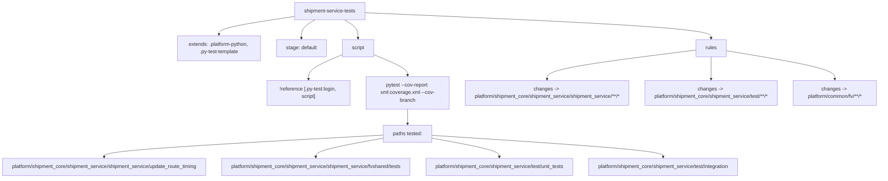
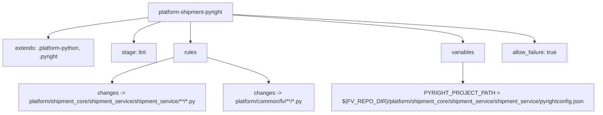

# Diagram: shipment_core/shipment_service/shipment_service/.gitlab-ci.yml

> Auto-generated by Obscura crawlers

## Diagram 1

### SVG

<svg id="container" width="2880.40234375" xmlns="http://www.w3.org/2000/svg" class="flowchart" height="558" viewBox="0 0 2880.40234375 558" role="graphics-document document" aria-roledescription="flowchart-v2"><g><marker id="container_flowchart-v2-pointEnd" class="marker flowchart-v2" viewBox="0 0 10 10" refX="5" refY="5" markerUnits="userSpaceOnUse" markerWidth="8" markerHeight="8" orient="auto"><path d="M 0 0 L 10 5 L 0 10 z" class="arrowMarkerPath" style="stroke-width: 1; stroke-dasharray: 1, 0;"></path></marker><marker id="container_flowchart-v2-pointStart" class="marker flowchart-v2" viewBox="0 0 10 10" refX="4.5" refY="5" markerUnits="userSpaceOnUse" markerWidth="8" markerHeight="8" orient="auto"><path d="M 0 5 L 10 10 L 10 0 z" class="arrowMarkerPath" style="stroke-width: 1; stroke-dasharray: 1, 0;"></path></marker><marker id="container_flowchart-v2-circleEnd" class="marker flowchart-v2" viewBox="0 0 10 10" refX="11" refY="5" markerUnits="userSpaceOnUse" markerWidth="11" markerHeight="11" orient="auto"><circle cx="5" cy="5" r="5" class="arrowMarkerPath" style="stroke-width: 1; stroke-dasharray: 1, 0;"></circle></marker><marker id="container_flowchart-v2-circleStart" class="marker flowchart-v2" viewBox="0 0 10 10" refX="-1" refY="5" markerUnits="userSpaceOnUse" markerWidth="11" markerHeight="11" orient="auto"><circle cx="5" cy="5" r="5" class="arrowMarkerPath" style="stroke-width: 1; stroke-dasharray: 1, 0;"></circle></marker><marker id="container_flowchart-v2-crossEnd" class="marker cross flowchart-v2" viewBox="0 0 11 11" refX="12" refY="5.2" markerUnits="userSpaceOnUse" markerWidth="11" markerHeight="11" orient="auto"><path d="M 1,1 l 9,9 M 10,1 l -9,9" class="arrowMarkerPath" style="stroke-width: 2; stroke-dasharray: 1, 0;"></path></marker><marker id="container_flowchart-v2-crossStart" class="marker cross flowchart-v2" viewBox="0 0 11 11" refX="-1" refY="5.2" markerUnits="userSpaceOnUse" markerWidth="11" markerHeight="11" orient="auto"><path d="M 1,1 l 9,9 M 10,1 l -9,9" class="arrowMarkerPath" style="stroke-width: 2; stroke-dasharray: 1, 0;"></path></marker><g class="root"><g class="clusters"></g><g class="edgePaths"><path d="M982.984,51.866L943.682,57.722C904.379,63.577,825.773,75.289,786.471,84.644C747.168,94,747.168,101,747.168,104.5L747.168,108" id="L_A_B_0" class="edge-thickness-normal edge-pattern-solid edge-thickness-normal edge-pattern-solid flowchart-link" style=";" data-edge="true" data-et="edge" data-id="L_A_B_0" data-points="W3sieCI6OTgyLjk4NDM3NSwieSI6NTEuODY1OTk3MzgxMDU2M30seyJ4Ijo3NDcuMTY3OTY4NzUsInkiOjg3fSx7IngiOjc0Ny4xNjc5Njg3NSwieSI6MTEyfV0=" marker-end="url(#container_flowchart-v2-pointEnd)"></path><path d="M1049.532,62L1042.332,66.167C1035.132,70.333,1020.732,78.667,1013.532,88.333C1006.332,98,1006.332,109,1006.332,114.5L1006.332,120" id="L_A_C_0" class="edge-thickness-normal edge-pattern-solid edge-thickness-normal edge-pattern-solid flowchart-link" style=";" data-edge="true" data-et="edge" data-id="L_A_C_0" data-points="W3sieCI6MTA0OS41MzE3NzU4NDEzNDYyLCJ5Ijo2Mn0seyJ4IjoxMDA2LjMzMjAzMTI1LCJ5Ijo4N30seyJ4IjoxMDA2LjMzMjAzMTI1LCJ5IjoxMjR9XQ==" marker-end="url(#container_flowchart-v2-pointEnd)"></path><path d="M1142.843,62L1150.043,66.167C1157.243,70.333,1171.643,78.667,1178.843,88.333C1186.043,98,1186.043,109,1186.043,114.5L1186.043,120" id="L_A_D_0" class="edge-thickness-normal edge-pattern-solid edge-thickness-normal edge-pattern-solid flowchart-link" style=";" data-edge="true" data-et="edge" data-id="L_A_D_0" data-points="W3sieCI6MTE0Mi44NDMyMjQxNTg2NTM4LCJ5Ijo2Mn0seyJ4IjoxMTg2LjA0Mjk2ODc1LCJ5Ijo4N30seyJ4IjoxMTg2LjA0Mjk2ODc1LCJ5IjoxMjR9XQ==" marker-end="url(#container_flowchart-v2-pointEnd)"></path><path d="M1135.496,171.871L1118.087,179.059C1100.678,186.247,1065.861,200.624,1048.452,213.312C1031.043,226,1031.043,237,1031.043,242.5L1031.043,248" id="L_D_D1_0" class="edge-thickness-normal edge-pattern-solid edge-thickness-normal edge-pattern-solid flowchart-link" style=";" data-edge="true" data-et="edge" data-id="L_D_D1_0" data-points="W3sieCI6MTEzNS40OTYwOTM3NSwieSI6MTcxLjg3MDk2Nzc0MTkzNTV9LHsieCI6MTAzMS4wNDI5Njg3NSwieSI6MjE1fSx7IngiOjEwMzEuMDQyOTY4NzUsInkiOjI1Mn1d" marker-end="url(#container_flowchart-v2-pointEnd)"></path><path d="M1236.59,171.871L1253.999,179.059C1271.408,186.247,1306.225,200.624,1323.634,211.312C1341.043,222,1341.043,229,1341.043,232.5L1341.043,236" id="L_D_D2_0" class="edge-thickness-normal edge-pattern-solid edge-thickness-normal edge-pattern-solid flowchart-link" style=";" data-edge="true" data-et="edge" data-id="L_D_D2_0" data-points="W3sieCI6MTIzNi41ODk4NDM3NSwieSI6MTcxLjg3MDk2Nzc0MTkzNTV9LHsieCI6MTM0MS4wNDI5Njg3NSwieSI6MjE1fSx7IngiOjEzNDEuMDQyOTY4NzUsInkiOjI0MH1d" marker-end="url(#container_flowchart-v2-pointEnd)"></path><path d="M1341.043,342L1341.043,346.167C1341.043,350.333,1341.043,358.667,1341.043,366.333C1341.043,374,1341.043,381,1341.043,384.5L1341.043,388" id="L_D2_D3_0" class="edge-thickness-normal edge-pattern-solid edge-thickness-normal edge-pattern-solid flowchart-link" style=";" data-edge="true" data-et="edge" data-id="L_D2_D3_0" data-points="W3sieCI6MTM0MS4wNDI5Njg3NSwieSI6MzQyfSx7IngiOjEzNDEuMDQyOTY4NzUsInkiOjM2N30seyJ4IjoxMzQxLjA0Mjk2ODc1LCJ5IjozOTJ9XQ==" marker-end="url(#container_flowchart-v2-pointEnd)"></path><path d="M1263.887,423.018L1110.314,431.015C956.742,439.012,649.598,455.006,496.025,466.503C342.453,478,342.453,485,342.453,488.5L342.453,492" id="L_D3_P1_0" class="edge-thickness-normal edge-pattern-solid edge-thickness-normal edge-pattern-solid flowchart-link" style=";" data-edge="true" data-et="edge" data-id="L_D3_P1_0" data-points="W3sieCI6MTI2My44ODY3MTg3NSwieSI6NDIzLjAxNzc5MDcxMjY4NDd9LHsieCI6MzQyLjQ1MzEyNSwieSI6NDcxfSx7IngiOjM0Mi40NTMxMjUsInkiOjQ5Nn1d" marker-end="url(#container_flowchart-v2-pointEnd)"></path><path d="M1263.887,432.247L1226.268,438.706C1188.648,445.165,1113.41,458.082,1075.791,468.041C1038.172,478,1038.172,485,1038.172,488.5L1038.172,492" id="L_D3_P2_0" class="edge-thickness-normal edge-pattern-solid edge-thickness-normal edge-pattern-solid flowchart-link" style=";" data-edge="true" data-et="edge" data-id="L_D3_P2_0" data-points="W3sieCI6MTI2My44ODY3MTg3NSwieSI6NDMyLjI0Njk3MjMzNTA3NDV9LHsieCI6MTAzOC4xNzE4NzUsInkiOjQ3MX0seyJ4IjoxMDM4LjE3MTg3NSwieSI6NDk2fV0=" marker-end="url(#container_flowchart-v2-pointEnd)"></path><path d="M1418.199,432.247L1455.818,438.706C1493.438,445.165,1568.676,458.082,1606.295,468.041C1643.914,478,1643.914,485,1643.914,488.5L1643.914,492" id="L_D3_P3_0" class="edge-thickness-normal edge-pattern-solid edge-thickness-normal edge-pattern-solid flowchart-link" style=";" data-edge="true" data-et="edge" data-id="L_D3_P3_0" data-points="W3sieCI6MTQxOC4xOTkyMTg3NSwieSI6NDMyLjI0Njk3MjMzNTA3NDV9LHsieCI6MTY0My45MTQwNjI1LCJ5Ijo0NzF9LHsieCI6MTY0My45MTQwNjI1LCJ5Ijo0OTZ9XQ==" marker-end="url(#container_flowchart-v2-pointEnd)"></path><path d="M1418.199,423.743L1546.337,431.619C1674.474,439.495,1930.749,455.248,2058.886,466.624C2187.023,478,2187.023,485,2187.023,488.5L2187.023,492" id="L_D3_P4_0" class="edge-thickness-normal edge-pattern-solid edge-thickness-normal edge-pattern-solid flowchart-link" style=";" data-edge="true" data-et="edge" data-id="L_D3_P4_0" data-points="W3sieCI6MTQxOC4xOTkyMTg3NSwieSI6NDIzLjc0MjU3NDAyODg0MDR9LHsieCI6MjE4Ny4wMjM0Mzc1LCJ5Ijo0NzF9LHsieCI6MjE4Ny4wMjM0Mzc1LCJ5Ijo0OTZ9XQ==" marker-end="url(#container_flowchart-v2-pointEnd)"></path><path d="M1209.391,39.734L1397.756,47.612C1586.121,55.49,1962.852,71.245,2151.217,84.622C2339.582,98,2339.582,109,2339.582,114.5L2339.582,120" id="L_A_E_0" class="edge-thickness-normal edge-pattern-solid edge-thickness-normal edge-pattern-solid flowchart-link" style=";" data-edge="true" data-et="edge" data-id="L_A_E_0" data-points="W3sieCI6MTIwOS4zOTA2MjUsInkiOjM5LjczNDI2NzY0NTU4OTY2fSx7IngiOjIzMzkuNTgyMDMxMjUsInkiOjg3fSx7IngiOjIzMzkuNTgyMDMxMjUsInkiOjEyNH1d" marker-end="url(#container_flowchart-v2-pointEnd)"></path><path d="M2291.434,156.647L2208.512,166.373C2125.59,176.098,1959.746,195.549,1876.824,210.775C1793.902,226,1793.902,237,1793.902,242.5L1793.902,248" id="L_E_R1_0" class="edge-thickness-normal edge-pattern-solid edge-thickness-normal edge-pattern-solid flowchart-link" style=";" data-edge="true" data-et="edge" data-id="L_E_R1_0" data-points="W3sieCI6MjI5MS40MzM1OTM3NSwieSI6MTU2LjY0NzA4NTc3MzE4OTk5fSx7IngiOjE3OTMuOTAyMzQzNzUsInkiOjIxNX0seyJ4IjoxNzkzLjkwMjM0Mzc1LCJ5IjoyNTJ9XQ==" marker-end="url(#container_flowchart-v2-pointEnd)"></path><path d="M2339.582,178L2339.582,184.167C2339.582,190.333,2339.582,202.667,2339.582,214.333C2339.582,226,2339.582,237,2339.582,242.5L2339.582,248" id="L_E_R2_0" class="edge-thickness-normal edge-pattern-solid edge-thickness-normal edge-pattern-solid flowchart-link" style=";" data-edge="true" data-et="edge" data-id="L_E_R2_0" data-points="W3sieCI6MjMzOS41ODIwMzEyNSwieSI6MTc4fSx7IngiOjIzMzkuNTgyMDMxMjUsInkiOjIxNX0seyJ4IjoyMzM5LjU4MjAzMTI1LCJ5IjoyNTJ9XQ==" marker-end="url(#container_flowchart-v2-pointEnd)"></path><path d="M2387.73,158.65L2446.842,168.042C2505.954,177.433,2624.178,196.217,2683.29,211.108C2742.402,226,2742.402,237,2742.402,242.5L2742.402,248" id="L_E_R3_0" class="edge-thickness-normal edge-pattern-solid edge-thickness-normal edge-pattern-solid flowchart-link" style=";" data-edge="true" data-et="edge" data-id="L_E_R3_0" data-points="W3sieCI6MjM4Ny43MzA0Njg3NSwieSI6MTU4LjY0OTgxMjg0MzA0MDI4fSx7IngiOjI3NDIuNDAyMzQzNzUsInkiOjIxNX0seyJ4IjoyNzQyLjQwMjM0Mzc1LCJ5IjoyNTJ9XQ==" marker-end="url(#container_flowchart-v2-pointEnd)"></path></g><g class="edgeLabels"><g class="edgeLabel"><g class="label" data-id="L_A_B_0" transform="translate(0, 0)"><foreignObject width="0" height="0">

</foreignObject></g></g><g class="edgeLabel"><g class="label" data-id="L_A_C_0" transform="translate(0, 0)"><foreignObject width="0" height="0">

</foreignObject></g></g><g class="edgeLabel"><g class="label" data-id="L_A_D_0" transform="translate(0, 0)"><foreignObject width="0" height="0">

</foreignObject></g></g><g class="edgeLabel"><g class="label" data-id="L_D_D1_0" transform="translate(0, 0)"><foreignObject width="0" height="0">

</foreignObject></g></g><g class="edgeLabel"><g class="label" data-id="L_D_D2_0" transform="translate(0, 0)"><foreignObject width="0" height="0">

</foreignObject></g></g><g class="edgeLabel"><g class="label" data-id="L_D2_D3_0" transform="translate(0, 0)"><foreignObject width="0" height="0">

</foreignObject></g></g><g class="edgeLabel"><g class="label" data-id="L_D3_P1_0" transform="translate(0, 0)"><foreignObject width="0" height="0">

</foreignObject></g></g><g class="edgeLabel"><g class="label" data-id="L_D3_P2_0" transform="translate(0, 0)"><foreignObject width="0" height="0">

</foreignObject></g></g><g class="edgeLabel"><g class="label" data-id="L_D3_P3_0" transform="translate(0, 0)"><foreignObject width="0" height="0">

</foreignObject></g></g><g class="edgeLabel"><g class="label" data-id="L_D3_P4_0" transform="translate(0, 0)"><foreignObject width="0" height="0">

</foreignObject></g></g><g class="edgeLabel"><g class="label" data-id="L_A_E_0" transform="translate(0, 0)"><foreignObject width="0" height="0">

</foreignObject></g></g><g class="edgeLabel"><g class="label" data-id="L_E_R1_0" transform="translate(0, 0)"><foreignObject width="0" height="0">

</foreignObject></g></g><g class="edgeLabel"><g class="label" data-id="L_E_R2_0" transform="translate(0, 0)"><foreignObject width="0" height="0">

</foreignObject></g></g><g class="edgeLabel"><g class="label" data-id="L_E_R3_0" transform="translate(0, 0)"><foreignObject width="0" height="0">

</foreignObject></g></g></g><g class="nodes"><g class="node default" id="flowchart-A-0" transform="translate(1096.1875, 35)"><rect class="basic label-container" style="" x="-113.203125" y="-27" width="226.40625" height="54"></rect><g class="label" style="" transform="translate(-83.203125, -12)"><rect></rect><foreignObject width="166.40625" height="24">

shipment-service-tests

</foreignObject></g></g><g class="node default" id="flowchart-B-1" transform="translate(747.16796875, 151)"><rect class="basic label-container" style="" x="-130" y="-39" width="260" height="78"></rect><g class="label" style="" transform="translate(-100, -24)"><rect></rect><foreignObject width="200" height="48">

extends: .platform-python, .py-test-template

</foreignObject></g></g><g class="node default" id="flowchart-C-3" transform="translate(1006.33203125, 151)"><rect class="basic label-container" style="" x="-79.1640625" y="-27" width="158.328125" height="54"></rect><g class="label" style="" transform="translate(-49.1640625, -12)"><rect></rect><foreignObject width="98.328125" height="24">

stage: default

</foreignObject></g></g><g class="node default" id="flowchart-D-5" transform="translate(1186.04296875, 151)"><rect class="basic label-container" style="" x="-50.546875" y="-27" width="101.09375" height="54"></rect><g class="label" style="" transform="translate(-20.546875, -12)"><rect></rect><foreignObject width="41.09375" height="24">

script

</foreignObject></g></g><g class="node default" id="flowchart-D1-7" transform="translate(1031.04296875, 291)"><rect class="basic label-container" style="" x="-130" y="-39" width="260" height="78"></rect><g class="label" style="" transform="translate(-100, -24)"><rect></rect><foreignObject width="200" height="48">

!reference [.py-test:login, script]

</foreignObject></g></g><g class="node default" id="flowchart-D2-9" transform="translate(1341.04296875, 291)"><rect class="basic label-container" style="" x="-130" y="-51" width="260" height="102"></rect><g class="label" style="" transform="translate(-100, -36)"><rect></rect><foreignObject width="200" height="72">

pytest --cov-report xml:coverage.xml --cov-branch

</foreignObject></g></g><g class="node default" id="flowchart-D3-11" transform="translate(1341.04296875, 419)"><rect class="basic label-container" style="" x="-77.15625" y="-27" width="154.3125" height="54"></rect><g class="label" style="" transform="translate(-47.15625, -12)"><rect></rect><foreignObject width="94.3125" height="24">

paths tested:

</foreignObject></g></g><g class="node default" id="flowchart-P1-13" transform="translate(342.453125, 523)"><rect class="basic label-container" style="" x="-334.453125" y="-27" width="668.90625" height="54"></rect><g class="label" style="" transform="translate(-304.453125, -12)"><rect></rect><foreignObject width="608.90625" height="24">

platform/shipment_core/shipment_service/shipment_service/update_route_timing

</foreignObject></g></g><g class="node default" id="flowchart-P2-15" transform="translate(1038.171875, 523)"><rect class="basic label-container" style="" x="-311.265625" y="-27" width="622.53125" height="54"></rect><g class="label" style="" transform="translate(-281.265625, -12)"><rect></rect><foreignObject width="562.53125" height="24">

platform/shipment_core/shipment_service/shipment_service/fvshared/tests

</foreignObject></g></g><g class="node default" id="flowchart-P3-17" transform="translate(1643.9140625, 523)"><rect class="basic label-container" style="" x="-244.4765625" y="-27" width="488.953125" height="54"></rect><g class="label" style="" transform="translate(-214.4765625, -12)"><rect></rect><foreignObject width="428.953125" height="24">

platform/shipment_core/shipment_service/test/unit_tests

</foreignObject></g></g><g class="node default" id="flowchart-P4-19" transform="translate(2187.0234375, 523)"><rect class="basic label-container" style="" x="-248.6328125" y="-27" width="497.265625" height="54"></rect><g class="label" style="" transform="translate(-218.6328125, -12)"><rect></rect><foreignObject width="437.265625" height="24">

platform/shipment_core/shipment_service/test/integration

</foreignObject></g></g><g class="node default" id="flowchart-E-21" transform="translate(2339.58203125, 151)"><rect class="basic label-container" style="" x="-48.1484375" y="-27" width="96.296875" height="54"></rect><g class="label" style="" transform="translate(-18.1484375, -12)"><rect></rect><foreignObject width="36.296875" height="24">

rules

</foreignObject></g></g><g class="node default" id="flowchart-R1-23" transform="translate(1793.90234375, 291)"><rect class="basic label-container" style="" x="-272.859375" y="-39" width="545.71875" height="78"></rect><g class="label" style="" transform="translate(-242.859375, -24)"><rect></rect><foreignObject width="485.71875" height="48">

changes -&gt; platform/shipment_core/shipment_service/shipment_service/**/*

</foreignObject></g></g><g class="node default" id="flowchart-R2-25" transform="translate(2339.58203125, 291)"><rect class="basic label-container" style="" x="-222.8203125" y="-39" width="445.640625" height="78"></rect><g class="label" style="" transform="translate(-192.8203125, -24)"><rect></rect><foreignObject width="385.640625" height="48">

changes -&gt; platform/shipment_core/shipment_service/test/**/*

</foreignObject></g></g><g class="node default" id="flowchart-R3-27" transform="translate(2742.40234375, 291)"><rect class="basic label-container" style="" x="-130" y="-39" width="260" height="78"></rect><g class="label" style="" transform="translate(-100, -24)"><rect></rect><foreignObject width="200" height="48">

changes -&gt; platform/common/fv/**/*

</foreignObject></g></g></g></g></g></svg>

## Diagram 2

### SVG

<svg id="container" width="1742.578125" xmlns="http://www.w3.org/2000/svg" class="flowchart" height="326" viewBox="0 0 1742.578125 326" role="graphics-document document" aria-roledescription="flowchart-v2"><g><marker id="container_flowchart-v2-pointEnd" class="marker flowchart-v2" viewBox="0 0 10 10" refX="5" refY="5" markerUnits="userSpaceOnUse" markerWidth="8" markerHeight="8" orient="auto"><path d="M 0 0 L 10 5 L 0 10 z" class="arrowMarkerPath" style="stroke-width: 1; stroke-dasharray: 1, 0;"></path></marker><marker id="container_flowchart-v2-pointStart" class="marker flowchart-v2" viewBox="0 0 10 10" refX="4.5" refY="5" markerUnits="userSpaceOnUse" markerWidth="8" markerHeight="8" orient="auto"><path d="M 0 5 L 10 10 L 10 0 z" class="arrowMarkerPath" style="stroke-width: 1; stroke-dasharray: 1, 0;"></path></marker><marker id="container_flowchart-v2-circleEnd" class="marker flowchart-v2" viewBox="0 0 10 10" refX="11" refY="5" markerUnits="userSpaceOnUse" markerWidth="11" markerHeight="11" orient="auto"><circle cx="5" cy="5" r="5" class="arrowMarkerPath" style="stroke-width: 1; stroke-dasharray: 1, 0;"></circle></marker><marker id="container_flowchart-v2-circleStart" class="marker flowchart-v2" viewBox="0 0 10 10" refX="-1" refY="5" markerUnits="userSpaceOnUse" markerWidth="11" markerHeight="11" orient="auto"><circle cx="5" cy="5" r="5" class="arrowMarkerPath" style="stroke-width: 1; stroke-dasharray: 1, 0;"></circle></marker><marker id="container_flowchart-v2-crossEnd" class="marker cross flowchart-v2" viewBox="0 0 11 11" refX="12" refY="5.2" markerUnits="userSpaceOnUse" markerWidth="11" markerHeight="11" orient="auto"><path d="M 1,1 l 9,9 M 10,1 l -9,9" class="arrowMarkerPath" style="stroke-width: 2; stroke-dasharray: 1, 0;"></path></marker><marker id="container_flowchart-v2-crossStart" class="marker cross flowchart-v2" viewBox="0 0 11 11" refX="-1" refY="5.2" markerUnits="userSpaceOnUse" markerWidth="11" markerHeight="11" orient="auto"><path d="M 1,1 l 9,9 M 10,1 l -9,9" class="arrowMarkerPath" style="stroke-width: 2; stroke-dasharray: 1, 0;"></path></marker><g class="root"><g class="clusters"></g><g class="edgePaths"><path d="M419.453,51.221L372.544,57.184C325.635,63.147,231.818,75.074,184.909,84.537C138,94,138,101,138,104.5L138,108" id="L_X_Y_0" class="edge-thickness-normal edge-pattern-solid edge-thickness-normal edge-pattern-solid flowchart-link" style=";" data-edge="true" data-et="edge" data-id="L_X_Y_0" data-points="W3sieCI6NDE5LjQ1MzEyNSwieSI6NTEuMjIxMDEyNjI0MzgxNjd9LHsieCI6MTM4LCJ5Ijo4N30seyJ4IjoxMzgsInkiOjExMn1d" marker-end="url(#container_flowchart-v2-pointEnd)"></path><path d="M462.108,62L448.999,66.167C435.89,70.333,409.671,78.667,396.562,88.333C383.453,98,383.453,109,383.453,114.5L383.453,120" id="L_X_Z_0" class="edge-thickness-normal edge-pattern-solid edge-thickness-normal edge-pattern-solid flowchart-link" style=";" data-edge="true" data-et="edge" data-id="L_X_Z_0" data-points="W3sieCI6NDYyLjEwNzcyMjM1NTc2OTIsInkiOjYyfSx7IngiOjM4My40NTMxMjUsInkiOjg3fSx7IngiOjM4My40NTMxMjUsInkiOjEyNH1d" marker-end="url(#container_flowchart-v2-pointEnd)"></path><path d="M547.055,62L547.055,66.167C547.055,70.333,547.055,78.667,547.055,88.333C547.055,98,547.055,109,547.055,114.5L547.055,120" id="L_X_V_0" class="edge-thickness-normal edge-pattern-solid edge-thickness-normal edge-pattern-solid flowchart-link" style=";" data-edge="true" data-et="edge" data-id="L_X_V_0" data-points="W3sieCI6NTQ3LjA1NDY4NzUsInkiOjYyfSx7IngiOjU0Ny4wNTQ2ODc1LCJ5Ijo4N30seyJ4Ijo1NDcuMDU0Njg3NSwieSI6MTI0fV0=" marker-end="url(#container_flowchart-v2-pointEnd)"></path><path d="M498.906,164.172L467.941,172.644C436.977,181.115,375.047,198.057,344.082,210.029C313.117,222,313.117,229,313.117,232.5L313.117,236" id="L_V_S1_0" class="edge-thickness-normal edge-pattern-solid edge-thickness-normal edge-pattern-solid flowchart-link" style=";" data-edge="true" data-et="edge" data-id="L_V_S1_0" data-points="W3sieCI6NDk4LjkwNjI1LCJ5IjoxNjQuMTcyMzIxNjY3MTExOTN9LHsieCI6MzEzLjExNzE4NzUsInkiOjIxNX0seyJ4IjozMTMuMTE3MTg3NSwieSI6MjQwfV0=" marker-end="url(#container_flowchart-v2-pointEnd)"></path><path d="M595.203,164.172L626.168,172.644C657.133,181.115,719.063,198.057,750.027,210.029C780.992,222,780.992,229,780.992,232.5L780.992,236" id="L_V_S2_0" class="edge-thickness-normal edge-pattern-solid edge-thickness-normal edge-pattern-solid flowchart-link" style=";" data-edge="true" data-et="edge" data-id="L_V_S2_0" data-points="W3sieCI6NTk1LjIwMzEyNSwieSI6MTY0LjE3MjMyMTY2NzExMTkzfSx7IngiOjc4MC45OTIxODc1LCJ5IjoyMTV9LHsieCI6NzgwLjk5MjE4NzUsInkiOjI0MH1d" marker-end="url(#container_flowchart-v2-pointEnd)"></path><path d="M674.656,43.259L787.281,50.55C899.906,57.84,1125.156,72.42,1237.781,85.21C1350.406,98,1350.406,109,1350.406,114.5L1350.406,120" id="L_X_W_0" class="edge-thickness-normal edge-pattern-solid edge-thickness-normal edge-pattern-solid flowchart-link" style=";" data-edge="true" data-et="edge" data-id="L_X_W_0" data-points="W3sieCI6Njc0LjY1NjI1LCJ5Ijo0My4yNTk0OTg3Nzk1MjcxOH0seyJ4IjoxMzUwLjQwNjI1LCJ5Ijo4N30seyJ4IjoxMzUwLjQwNjI1LCJ5IjoxMjR9XQ==" marker-end="url(#container_flowchart-v2-pointEnd)"></path><path d="M1350.406,178L1350.406,184.167C1350.406,190.333,1350.406,202.667,1350.406,212.333C1350.406,222,1350.406,229,1350.406,232.5L1350.406,236" id="L_W_VAR_0" class="edge-thickness-normal edge-pattern-solid edge-thickness-normal edge-pattern-solid flowchart-link" style=";" data-edge="true" data-et="edge" data-id="L_W_VAR_0" data-points="W3sieCI6MTM1MC40MDYyNSwieSI6MTc4fSx7IngiOjEzNTAuNDA2MjUsInkiOjIxNX0seyJ4IjoxMzUwLjQwNjI1LCJ5IjoyNDB9XQ==" marker-end="url(#container_flowchart-v2-pointEnd)"></path><path d="M674.656,41.557L822.038,49.131C969.419,56.705,1264.182,71.852,1411.564,84.926C1558.945,98,1558.945,109,1558.945,114.5L1558.945,120" id="L_X_AF_0" class="edge-thickness-normal edge-pattern-solid edge-thickness-normal edge-pattern-solid flowchart-link" style=";" data-edge="true" data-et="edge" data-id="L_X_AF_0" data-points="W3sieCI6Njc0LjY1NjI1LCJ5Ijo0MS41NTczMTA3MjcxMzUxNn0seyJ4IjoxNTU4Ljk0NTMxMjUsInkiOjg3fSx7IngiOjE1NTguOTQ1MzEyNSwieSI6MTI0fV0=" marker-end="url(#container_flowchart-v2-pointEnd)"></path></g><g class="edgeLabels"><g class="edgeLabel"><g class="label" data-id="L_X_Y_0" transform="translate(0, 0)"><foreignObject width="0" height="0">

</foreignObject></g></g><g class="edgeLabel"><g class="label" data-id="L_X_Z_0" transform="translate(0, 0)"><foreignObject width="0" height="0">

</foreignObject></g></g><g class="edgeLabel"><g class="label" data-id="L_X_V_0" transform="translate(0, 0)"><foreignObject width="0" height="0">

</foreignObject></g></g><g class="edgeLabel"><g class="label" data-id="L_V_S1_0" transform="translate(0, 0)"><foreignObject width="0" height="0">

</foreignObject></g></g><g class="edgeLabel"><g class="label" data-id="L_V_S2_0" transform="translate(0, 0)"><foreignObject width="0" height="0">

</foreignObject></g></g><g class="edgeLabel"><g class="label" data-id="L_X_W_0" transform="translate(0, 0)"><foreignObject width="0" height="0">

</foreignObject></g></g><g class="edgeLabel"><g class="label" data-id="L_W_VAR_0" transform="translate(0, 0)"><foreignObject width="0" height="0">

</foreignObject></g></g><g class="edgeLabel"><g class="label" data-id="L_X_AF_0" transform="translate(0, 0)"><foreignObject width="0" height="0">

</foreignObject></g></g></g><g class="nodes"><g class="node default" id="flowchart-X-0" transform="translate(547.0546875, 35)"><rect class="basic label-container" style="" x="-127.6015625" y="-27" width="255.203125" height="54"></rect><g class="label" style="" transform="translate(-97.6015625, -12)"><rect></rect><foreignObject width="195.203125" height="24">

platform-shipment-pyright

</foreignObject></g></g><g class="node default" id="flowchart-Y-1" transform="translate(138, 151)"><rect class="basic label-container" style="" x="-130" y="-39" width="260" height="78"></rect><g class="label" style="" transform="translate(-100, -24)"><rect></rect><foreignObject width="200" height="48">

extends: .platform-python, .pyright

</foreignObject></g></g><g class="node default" id="flowchart-Z-3" transform="translate(383.453125, 151)"><rect class="basic label-container" style="" x="-65.453125" y="-27" width="130.90625" height="54"></rect><g class="label" style="" transform="translate(-35.453125, -12)"><rect></rect><foreignObject width="70.90625" height="24">

stage: lint

</foreignObject></g></g><g class="node default" id="flowchart-V-5" transform="translate(547.0546875, 151)"><rect class="basic label-container" style="" x="-48.1484375" y="-27" width="96.296875" height="54"></rect><g class="label" style="" transform="translate(-18.1484375, -12)"><rect></rect><foreignObject width="36.296875" height="24">

rules

</foreignObject></g></g><g class="node default" id="flowchart-S1-7" transform="translate(313.1171875, 279)"><rect class="basic label-container" style="" x="-282.6328125" y="-39" width="565.265625" height="78"></rect><g class="label" style="" transform="translate(-252.6328125, -24)"><rect></rect><foreignObject width="505.265625" height="48">

changes -&gt; platform/shipment_core/shipment_service/shipment_service/**/*.py

</foreignObject></g></g><g class="node default" id="flowchart-S2-9" transform="translate(780.9921875, 279)"><rect class="basic label-container" style="" x="-135.2421875" y="-39" width="270.484375" height="78"></rect><g class="label" style="" transform="translate(-105.2421875, -24)"><rect></rect><foreignObject width="210.484375" height="48">

changes -&gt; platform/common/fv/**/*.py

</foreignObject></g></g><g class="node default" id="flowchart-W-11" transform="translate(1350.40625, 151)"><rect class="basic label-container" style="" x="-63.015625" y="-27" width="126.03125" height="54"></rect><g class="label" style="" transform="translate(-33.015625, -12)"><rect></rect><foreignObject width="66.03125" height="24">

variables

</foreignObject></g></g><g class="node default" id="flowchart-VAR-13" transform="translate(1350.40625, 279)"><rect class="basic label-container" style="" x="-384.171875" y="-39" width="768.34375" height="78"></rect><g class="label" style="" transform="translate(-354.171875, -24)"><rect></rect><foreignObject width="708.34375" height="48">

PYRIGHT_PROJECT_PATH = ${FV_REPO_DIR}/platform/shipment_core/shipment_service/shipment_service/pyrightconfig.json

</foreignObject></g></g><g class="node default" id="flowchart-AF-15" transform="translate(1558.9453125, 151)"><rect class="basic label-container" style="" x="-95.5234375" y="-27" width="191.046875" height="54"></rect><g class="label" style="" transform="translate(-65.5234375, -12)"><rect></rect><foreignObject width="131.046875" height="24">

allow_failure: true

</foreignObject></g></g></g></g></g></svg>
