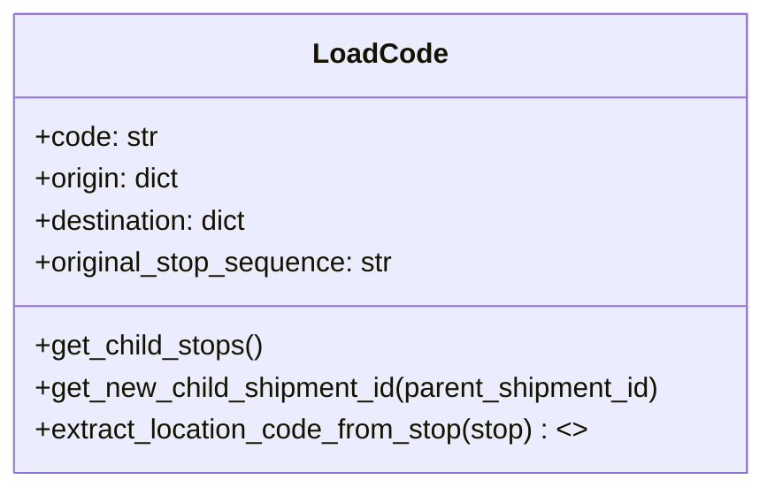

# Diagram: shipment_core/shipment_service/shipment_service/asn/LoadCode.py

> Auto-generated by Obscura crawlers

## Mermaid

### SVG

<svg id="container" width="444.171875" xmlns="http://www.w3.org/2000/svg" class="classDiagram" height="280" viewBox="0 0 444.171875 280" role="graphics-document document" aria-roledescription="class"><g><defs><marker id="container_class-aggregationStart" class="marker aggregation class" refX="18" refY="7" markerWidth="190" markerHeight="240" orient="auto"><path d="M 18,7 L9,13 L1,7 L9,1 Z"></path></marker></defs><defs><marker id="container_class-aggregationEnd" class="marker aggregation class" refX="1" refY="7" markerWidth="20" markerHeight="28" orient="auto"><path d="M 18,7 L9,13 L1,7 L9,1 Z"></path></marker></defs><defs><marker id="container_class-extensionStart" class="marker extension class" refX="18" refY="7" markerWidth="190" markerHeight="240" orient="auto"><path d="M 1,7 L18,13 V 1 Z"></path></marker></defs><defs><marker id="container_class-extensionEnd" class="marker extension class" refX="1" refY="7" markerWidth="20" markerHeight="28" orient="auto"><path d="M 1,1 V 13 L18,7 Z"></path></marker></defs><defs><marker id="container_class-compositionStart" class="marker composition class" refX="18" refY="7" markerWidth="190" markerHeight="240" orient="auto"><path d="M 18,7 L9,13 L1,7 L9,1 Z"></path></marker></defs><defs><marker id="container_class-compositionEnd" class="marker composition class" refX="1" refY="7" markerWidth="20" markerHeight="28" orient="auto"><path d="M 18,7 L9,13 L1,7 L9,1 Z"></path></marker></defs><defs><marker id="container_class-dependencyStart" class="marker dependency class" refX="6" refY="7" markerWidth="190" markerHeight="240" orient="auto"><path d="M 5,7 L9,13 L1,7 L9,1 Z"></path></marker></defs><defs><marker id="container_class-dependencyEnd" class="marker dependency class" refX="13" refY="7" markerWidth="20" markerHeight="28" orient="auto"><path d="M 18,7 L9,13 L14,7 L9,1 Z"></path></marker></defs><defs><marker id="container_class-lollipopStart" class="marker lollipop class" refX="13" refY="7" markerWidth="190" markerHeight="240" orient="auto"><circle stroke="black" fill="transparent" cx="7" cy="7" r="6"></circle></marker></defs><defs><marker id="container_class-lollipopEnd" class="marker lollipop class" refX="1" refY="7" markerWidth="190" markerHeight="240" orient="auto"><circle stroke="black" fill="transparent" cx="7" cy="7" r="6"></circle></marker></defs><g class="root"><g class="clusters"></g><g class="edgePaths"></g><g class="edgeLabels"></g><g class="nodes"><g class="node default" id="classId-LoadCode-0" transform="translate(222.0859375, 140)"><g class="basic label-container"><path d="M-214.0859375 -132 L214.0859375 -132 L214.0859375 132 L-214.0859375 132" stroke="none" stroke-width="0" fill="#ECECFF" style=""></path><path d="M-214.0859375 -132 C-107.50022872342839 -132, -0.9145199468567853 -132, 214.0859375 -132 M-214.0859375 -132 C-80.06684171010335 -132, 53.952254079793306 -132, 214.0859375 -132 M214.0859375 -132 C214.0859375 -58.44830416863739, 214.0859375 15.103391662725215, 214.0859375 132 M214.0859375 -132 C214.0859375 -44.27563734086898, 214.0859375 43.448725318262035, 214.0859375 132 M214.0859375 132 C103.80227754560194 132, -6.481382408796122 132, -214.0859375 132 M214.0859375 132 C92.77771237274803 132, -28.530512754503945 132, -214.0859375 132 M-214.0859375 132 C-214.0859375 68.82236556790573, -214.0859375 5.644731135811455, -214.0859375 -132 M-214.0859375 132 C-214.0859375 69.6352448753442, -214.0859375 7.270489750688384, -214.0859375 -132" stroke="#9370DB" stroke-width="1.3" fill="none" stroke-dasharray="0 0" style=""></path></g><g class="annotation-group text" transform="translate(0, -108)"></g><g class="label-group text" transform="translate(-36.015625, -108)"><g class="label" style="font-weight: bolder" transform="translate(0,-12)"><foreignObject width="72.03125" height="24">

LoadCode

</foreignObject></g></g><g class="members-group text" transform="translate(-202.0859375, -60)"><g class="label" style="" transform="translate(0,-12)"><foreignObject width="70.453125" height="24">

+code: str

</foreignObject></g><g class="label" style="" transform="translate(0,12)"><foreignObject width="85.8125" height="24">

+origin: dict

</foreignObject></g><g class="label" style="" transform="translate(0,36)"><foreignObject width="126.71875" height="24">

+destination: dict

</foreignObject></g><g class="label" style="" transform="translate(0,60)"><foreignObject width="208.359375" height="24">

+original_stop_sequence: str

</foreignObject></g></g><g class="methods-group text" transform="translate(-202.0859375, 60)"><g class="label" style="" transform="translate(0,-12)"><foreignObject width="132.28125" height="24">

+get_child_stops()

</foreignObject></g><g class="label" style="" transform="translate(0,12)"><foreignObject width="368.15625" height="24">

+get_new_child_shipment_id(parent_shipment_id)

</foreignObject></g><g class="label" style="" transform="translate(0,36)"><foreignObject width="320.625" height="24">

+extract_location_code_from_stop(stop) : &lt;&gt;

</foreignObject></g></g><g class="divider" style=""><path d="M-214.0859375 -84 C-70.77151078481762 -84, 72.54291593036476 -84, 214.0859375 -84 M-214.0859375 -84 C-104.63197863014204 -84, 4.821980239715913 -84, 214.0859375 -84" stroke="#9370DB" stroke-width="1.3" fill="none" stroke-dasharray="0 0" style=""></path></g><g class="divider" style=""><path d="M-214.0859375 36 C-112.0296106543475 36, -9.973283808694987 36, 214.0859375 36 M-214.0859375 36 C-113.41908303150328 36, -12.752228563006554 36, 214.0859375 36" stroke="#9370DB" stroke-width="1.3" fill="none" stroke-dasharray="0 0" style=""></path></g></g></g></g></g></svg>
