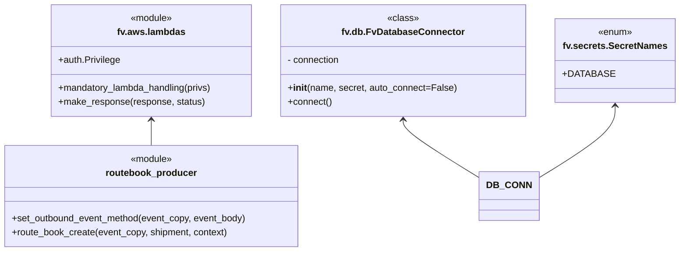

# Diagram: shipment_core/shipment_service/shipment_service/asn/route_book_v2.py


> Auto-generated by Obscura crawlers

## Diagram 1

```mermaid
flowchart LR
    A[lambda_handler(event, context, audit_refs)] --> B[deepcopy(event) -> event_copy]
    B --> C[event_copy.get("body") -> event_body]
    C --> D[routebook_producer.set_outbound_event_method(event_copy, event_body) -> shipment]
    D --> E[routebook_producer.route_book_create(event_copy, shipment, context) -> response]
    E --> F[fv.aws.lambdas.make_response(response, 200) -> return]
    subgraph ENV
      AWS_STAGE["AWS_STAGE env var"]
      APP_NAME["APP_NAME = route_book_v2"]
    end
    subgraph INIT
      DB_CONN["fv.db.FvDatabaseConnector('route_book_v2', SecretNames.DATABASE)"]
    end
    A --- ENV
    A --- INIT
```

> SVG rendering failed for this diagram.

## Diagram 2



### SVG

<svg id="container" width="1146.34375" xmlns="http://www.w3.org/2000/svg" class="classDiagram" height="432" viewBox="0 0 1146.34375 432" role="graphics-document document" aria-roledescription="class"><style>#container{font-family:"trebuchet ms",verdana,arial,sans-serif;font-size:16px;fill:#333;}@keyframes edge-animation-frame{from{stroke-dashoffset:0;}}@keyframes dash{to{stroke-dashoffset:0;}}#container .edge-animation-slow{stroke-dasharray:9,5!important;stroke-dashoffset:900;animation:dash 50s linear infinite;stroke-linecap:round;}#container .edge-animation-fast{stroke-dasharray:9,5!important;stroke-dashoffset:900;animation:dash 20s linear infinite;stroke-linecap:round;}#container .error-icon{fill:#552222;}#container .error-text{fill:#552222;stroke:#552222;}#container .edge-thickness-normal{stroke-width:1px;}#container .edge-thickness-thick{stroke-width:3.5px;}#container .edge-pattern-solid{stroke-dasharray:0;}#container .edge-thickness-invisible{stroke-width:0;fill:none;}#container .edge-pattern-dashed{stroke-dasharray:3;}#container .edge-pattern-dotted{stroke-dasharray:2;}#container .marker{fill:#333333;stroke:#333333;}#container .marker.cross{stroke:#333333;}#container svg{font-family:"trebuchet ms",verdana,arial,sans-serif;font-size:16px;}#container p{margin:0;}#container g.classGroup text{fill:#9370DB;stroke:none;font-family:"trebuchet ms",verdana,arial,sans-serif;font-size:10px;}#container g.classGroup text .title{font-weight:bolder;}#container .nodeLabel,#container .edgeLabel{color:#131300;}#container .edgeLabel .label rect{fill:#ECECFF;}#container .label text{fill:#131300;}#container .labelBkg{background:#ECECFF;}#container .edgeLabel .label span{background:#ECECFF;}#container .classTitle{font-weight:bolder;}#container .node rect,#container .node circle,#container .node ellipse,#container .node polygon,#container .node path{fill:#ECECFF;stroke:#9370DB;stroke-width:1px;}#container .divider{stroke:#9370DB;stroke-width:1;}#container g.clickable{cursor:pointer;}#container g.classGroup rect{fill:#ECECFF;stroke:#9370DB;}#container g.classGroup line{stroke:#9370DB;stroke-width:1;}#container .classLabel .box{stroke:none;stroke-width:0;fill:#ECECFF;opacity:0.5;}#container .classLabel .label{fill:#9370DB;font-size:10px;}#container .relation{stroke:#333333;stroke-width:1;fill:none;}#container .dashed-line{stroke-dasharray:3;}#container .dotted-line{stroke-dasharray:1 2;}#container #compositionStart,#container .composition{fill:#333333!important;stroke:#333333!important;stroke-width:1;}#container #compositionEnd,#container .composition{fill:#333333!important;stroke:#333333!important;stroke-width:1;}#container #dependencyStart,#container .dependency{fill:#333333!important;stroke:#333333!important;stroke-width:1;}#container #dependencyStart,#container .dependency{fill:#333333!important;stroke:#333333!important;stroke-width:1;}#container #extensionStart,#container .extension{fill:transparent!important;stroke:#333333!important;stroke-width:1;}#container #extensionEnd,#container .extension{fill:transparent!important;stroke:#333333!important;stroke-width:1;}#container #aggregationStart,#container .aggregation{fill:transparent!important;stroke:#333333!important;stroke-width:1;}#container #aggregationEnd,#container .aggregation{fill:transparent!important;stroke:#333333!important;stroke-width:1;}#container #lollipopStart,#container .lollipop{fill:#ECECFF!important;stroke:#333333!important;stroke-width:1;}#container #lollipopEnd,#container .lollipop{fill:#ECECFF!important;stroke:#333333!important;stroke-width:1;}#container .edgeTerminals{font-size:11px;line-height:initial;}#container .classTitleText{text-anchor:middle;font-size:18px;fill:#333;}#container .label-icon{display:inline-block;height:1em;overflow:visible;vertical-align:-0.125em;}#container .node .label-icon path{fill:currentColor;stroke:revert;stroke-width:revert;}#container :root{--mermaid-font-family:"trebuchet ms",verdana,arial,sans-serif;}</style><g><defs><marker id="container_class-aggregationStart" class="marker aggregation class" refX="18" refY="7" markerWidth="190" markerHeight="240" orient="auto"><path d="M 18,7 L9,13 L1,7 L9,1 Z"></path></marker></defs><defs><marker id="container_class-aggregationEnd" class="marker aggregation class" refX="1" refY="7" markerWidth="20" markerHeight="28" orient="auto"><path d="M 18,7 L9,13 L1,7 L9,1 Z"></path></marker></defs><defs><marker id="container_class-extensionStart" class="marker extension class" refX="18" refY="7" markerWidth="190" markerHeight="240" orient="auto"><path d="M 1,7 L18,13 V 1 Z"></path></marker></defs><defs><marker id="container_class-extensionEnd" class="marker extension class" refX="1" refY="7" markerWidth="20" markerHeight="28" orient="auto"><path d="M 1,1 V 13 L18,7 Z"></path></marker></defs><defs><marker id="container_class-compositionStart" class="marker composition class" refX="18" refY="7" markerWidth="190" markerHeight="240" orient="auto"><path d="M 18,7 L9,13 L1,7 L9,1 Z"></path></marker></defs><defs><marker id="container_class-compositionEnd" class="marker composition class" refX="1" refY="7" markerWidth="20" markerHeight="28" orient="auto"><path d="M 18,7 L9,13 L1,7 L9,1 Z"></path></marker></defs><defs><marker id="container_class-dependencyStart" class="marker dependency class" refX="6" refY="7" markerWidth="190" markerHeight="240" orient="auto"><path d="M 5,7 L9,13 L1,7 L9,1 Z"></path></marker></defs><defs><marker id="container_class-dependencyEnd" class="marker dependency class" refX="13" refY="7" markerWidth="20" markerHeight="28" orient="auto"><path d="M 18,7 L9,13 L14,7 L9,1 Z"></path></marker></defs><defs><marker id="container_class-lollipopStart" class="marker lollipop class" refX="13" refY="7" markerWidth="190" markerHeight="240" orient="auto"><circle stroke="black" fill="transparent" cx="7" cy="7" r="6"></circle></marker></defs><defs><marker id="container_class-lollipopEnd" class="marker lollipop class" refX="1" refY="7" markerWidth="190" markerHeight="240" orient="auto"><circle stroke="black" fill="transparent" cx="7" cy="7" r="6"></circle></marker></defs><g class="root"><g class="clusters"></g><g class="edgePaths"><path d="M261.543,206L261.543,209.167C261.543,212.333,261.543,218.667,261.543,226C261.543,233.333,261.543,241.667,261.543,245.833L261.543,250" id="id_fv.aws.lambdas_routebook_producer_1" class="edge-thickness-normal edge-pattern-solid relation" style=";;;" data-edge="true" data-et="edge" data-id="id_fv.aws.lambdas_routebook_producer_1" data-points="W3sieCI6MjYxLjU0Mjk2ODc1LCJ5IjoyMDB9LHsieCI6MjYxLjU0Mjk2ODc1LCJ5IjoyMjV9LHsieCI6MjYxLjU0Mjk2ODc1LCJ5IjoyNTB9XQ==" marker-start="url(#container_class-dependencyStart)"></path><path d="M689.777,206L689.777,209.167C689.777,212.333,689.777,218.667,711.339,235.572C732.9,252.477,776.023,279.954,797.585,293.693L819.146,307.431" id="id_fv.db.FvDatabaseConnector_DB_CONN_2" class="edge-thickness-normal edge-pattern-solid relation" style=";;;" data-edge="true" data-et="edge" data-id="id_fv.db.FvDatabaseConnector_DB_CONN_2" data-points="W3sieCI6Njg5Ljc3NzM0Mzc1LCJ5IjoyMDB9LHsieCI6Njg5Ljc3NzM0Mzc1LCJ5IjoyMjV9LHsieCI6ODE5LjE0NjQ4NDM3NSwieSI6MzA3LjQzMTAxNDM2NzE0NTU2fV0=" marker-start="url(#container_class-dependencyStart)"></path><path d="M1041.328,182L1041.328,189.167C1041.328,196.333,1041.328,210.667,1019.767,231.572C998.205,252.477,955.082,279.954,933.521,293.693L911.959,307.431" id="id_fv.secrets.SecretNames_DB_CONN_3" class="edge-thickness-normal edge-pattern-solid relation" style=";;;" data-edge="true" data-et="edge" data-id="id_fv.secrets.SecretNames_DB_CONN_3" data-points="W3sieCI6MTA0MS4zMjgxMjUsInkiOjE3Nn0seyJ4IjoxMDQxLjMyODEyNSwieSI6MjI1fSx7IngiOjkxMS45NTg5ODQzNzUsInkiOjMwNy40MzEwMTQzNjcxNDU1Nn1d" marker-start="url(#container_class-dependencyStart)"></path></g><g class="edgeLabels"><g class="edgeLabel"><g class="label" data-id="id_fv.aws.lambdas_routebook_producer_1" transform="translate(0, 0)"><foreignObject width="0" height="0"><div xmlns="http://www.w3.org/1999/xhtml" class="labelBkg" style="display: table-cell; white-space: nowrap; line-height: 1.5; max-width: 200px; text-align: center;"><span class="edgeLabel"></span></div></foreignObject></g></g><g class="edgeLabel"><g class="label" data-id="id_fv.db.FvDatabaseConnector_DB_CONN_2" transform="translate(0, 0)"><foreignObject width="0" height="0"><div xmlns="http://www.w3.org/1999/xhtml" class="labelBkg" style="display: table-cell; white-space: nowrap; line-height: 1.5; max-width: 200px; text-align: center;"><span class="edgeLabel"></span></div></foreignObject></g></g><g class="edgeLabel"><g class="label" data-id="id_fv.secrets.SecretNames_DB_CONN_3" transform="translate(0, 0)"><foreignObject width="0" height="0"><div xmlns="http://www.w3.org/1999/xhtml" class="labelBkg" style="display: table-cell; white-space: nowrap; line-height: 1.5; max-width: 200px; text-align: center;"><span class="edgeLabel"></span></div></foreignObject></g></g></g><g class="nodes"><g class="node default" id="classId-fv.aws.lambdas-0" transform="translate(261.54296875, 104)"><g class="basic label-container"><path d="M-173.69921875 -96 L173.69921875 -96 L173.69921875 96 L-173.69921875 96" stroke="none" stroke-width="0" fill="#ECECFF" style=""></path><path d="M-173.69921875 -96 C-46.772791407753985 -96, 80.15363593449203 -96, 173.69921875 -96 M-173.69921875 -96 C-80.66990128977088 -96, 12.359416170458246 -96, 173.69921875 -96 M173.69921875 -96 C173.69921875 -45.719760227611864, 173.69921875 4.560479544776271, 173.69921875 96 M173.69921875 -96 C173.69921875 -53.88750233587956, 173.69921875 -11.77500467175912, 173.69921875 96 M173.69921875 96 C90.63892332270184 96, 7.5786278954036845 96, -173.69921875 96 M173.69921875 96 C78.34808090257474 96, -17.003056944850528 96, -173.69921875 96 M-173.69921875 96 C-173.69921875 28.048800089236593, -173.69921875 -39.902399821526814, -173.69921875 -96 M-173.69921875 96 C-173.69921875 49.625722944038074, -173.69921875 3.251445888076148, -173.69921875 -96" stroke="#9370DB" stroke-width="1.3" fill="none" stroke-dasharray="0 0" style=""></path></g><g class="annotation-group text" transform="translate(-36.6015625, -72)"><g class="label" style="" transform="translate(0,-12)"><foreignObject width="73.203125" height="24"><div xmlns="http://www.w3.org/1999/xhtml" style="display: table-cell; white-space: nowrap; line-height: 1.5; max-width: 123px; text-align: center;"><span class="nodeLabel markdown-node-label" style=""><p>«module»</p></span></div></foreignObject></g></g><g class="label-group text" transform="translate(-55.8984375, -48)"><g class="label" style="font-weight: bolder" transform="translate(0,-12)"><foreignObject width="111.796875" height="24"><div xmlns="http://www.w3.org/1999/xhtml" style="display: table-cell; white-space: nowrap; line-height: 1.5; max-width: 160px; text-align: center;"><span class="nodeLabel markdown-node-label" style=""><p>fv.aws.lambdas</p></span></div></foreignObject></g></g><g class="members-group text" transform="translate(-161.69921875, 0)"><g class="label" style="" transform="translate(0,-12)"><foreignObject width="106.921875" height="24"><div xmlns="http://www.w3.org/1999/xhtml" style="display: table-cell; white-space: nowrap; line-height: 1.5; max-width: 164px; text-align: center;"><span class="nodeLabel markdown-node-label" style=""><p>+auth.Privilege</p></span></div></foreignObject></g></g><g class="methods-group text" transform="translate(-161.69921875, 48)"><g class="label" style="" transform="translate(0,-12)"><foreignObject width="267.5" height="24"><div xmlns="http://www.w3.org/1999/xhtml" style="display: table-cell; white-space: nowrap; line-height: 1.5; max-width: 325px; text-align: center;"><span class="nodeLabel markdown-node-label" style=""><p>+mandatory_lambda_handling(privs)</p></span></div></foreignObject></g><g class="label" style="" transform="translate(0,12)"><foreignObject width="250.46875" height="24"><div xmlns="http://www.w3.org/1999/xhtml" style="display: table-cell; white-space: nowrap; line-height: 1.5; max-width: 308px; text-align: center;"><span class="nodeLabel markdown-node-label" style=""><p>+make_response(response, status)</p></span></div></foreignObject></g></g><g class="divider" style=""><path d="M-173.69921875 -24 C-80.49227951426897 -24, 12.714659721462056 -24, 173.69921875 -24 M-173.69921875 -24 C-71.71241382591097 -24, 30.274391098178057 -24, 173.69921875 -24" stroke="#9370DB" stroke-width="1.3" fill="none" stroke-dasharray="0 0" style=""></path></g><g class="divider" style=""><path d="M-173.69921875 24 C-77.35834942729217 24, 18.982519895415663 24, 173.69921875 24 M-173.69921875 24 C-94.62947088529388 24, -15.559723020587768 24, 173.69921875 24" stroke="#9370DB" stroke-width="1.3" fill="none" stroke-dasharray="0 0" style=""></path></g></g><g class="node default" id="classId-fv.db.FvDatabaseConnector-1" transform="translate(689.77734375, 104)"><g class="basic label-container"><path d="M-204.53515625 -96 L204.53515625 -96 L204.53515625 96 L-204.53515625 96" stroke="none" stroke-width="0" fill="#ECECFF" style=""></path><path d="M-204.53515625 -96 C-55.399316254455584 -96, 93.73652374108883 -96, 204.53515625 -96 M-204.53515625 -96 C-96.1536560650223 -96, 12.227844119955392 -96, 204.53515625 -96 M204.53515625 -96 C204.53515625 -27.268759692483002, 204.53515625 41.462480615033996, 204.53515625 96 M204.53515625 -96 C204.53515625 -29.85884087440148, 204.53515625 36.28231825119704, 204.53515625 96 M204.53515625 96 C120.02517278272906 96, 35.515189315458116 96, -204.53515625 96 M204.53515625 96 C105.60008959661141 96, 6.665022943222823 96, -204.53515625 96 M-204.53515625 96 C-204.53515625 41.7567016268046, -204.53515625 -12.486596746390802, -204.53515625 -96 M-204.53515625 96 C-204.53515625 30.478079547824393, -204.53515625 -35.043840904351214, -204.53515625 -96" stroke="#9370DB" stroke-width="1.3" fill="none" stroke-dasharray="0 0" style=""></path></g><g class="annotation-group text" transform="translate(-26.765625, -72)"><g class="label" style="" transform="translate(0,-12)"><foreignObject width="53.53125" height="24"><div xmlns="http://www.w3.org/1999/xhtml" style="display: table-cell; white-space: nowrap; line-height: 1.5; max-width: 104px; text-align: center;"><span class="nodeLabel markdown-node-label" style=""><p>«class»</p></span></div></foreignObject></g></g><g class="label-group text" transform="translate(-99.1953125, -48)"><g class="label" style="font-weight: bolder" transform="translate(0,-12)"><foreignObject width="198.390625" height="24"><div xmlns="http://www.w3.org/1999/xhtml" style="display: table-cell; white-space: nowrap; line-height: 1.5; max-width: 246px; text-align: center;"><span class="nodeLabel markdown-node-label" style=""><p>fv.db.FvDatabaseConnector</p></span></div></foreignObject></g></g><g class="members-group text" transform="translate(-192.53515625, 0)"><g class="label" style="" transform="translate(0,-12)"><foreignObject width="91.5" height="24"><div xmlns="http://www.w3.org/1999/xhtml" style="display: table-cell; white-space: nowrap; line-height: 1.5; max-width: 149px; text-align: center;"><span class="nodeLabel markdown-node-label" style=""><p>- connection</p></span></div></foreignObject></g></g><g class="methods-group text" transform="translate(-192.53515625, 48)"><g class="label" style="" transform="translate(0,-12)"><foreignObject width="285.875" height="24"><div xmlns="http://www.w3.org/1999/xhtml" style="display: table-cell; white-space: nowrap; line-height: 1.5; max-width: 375px; text-align: center;"><span class="nodeLabel markdown-node-label" style=""><p>+<strong>init</strong>(name, secret, auto_connect=False)</p></span></div></foreignObject></g><g class="label" style="" transform="translate(0,12)"><foreignObject width="75.921875" height="24"><div xmlns="http://www.w3.org/1999/xhtml" style="display: table-cell; white-space: nowrap; line-height: 1.5; max-width: 133px; text-align: center;"><span class="nodeLabel markdown-node-label" style=""><p>+connect()</p></span></div></foreignObject></g></g><g class="divider" style=""><path d="M-204.53515625 -24 C-79.24531455012105 -24, 46.0445271497579 -24, 204.53515625 -24 M-204.53515625 -24 C-110.40975893549262 -24, -16.284361620985237 -24, 204.53515625 -24" stroke="#9370DB" stroke-width="1.3" fill="none" stroke-dasharray="0 0" style=""></path></g><g class="divider" style=""><path d="M-204.53515625 24 C-67.46868380458614 24, 69.59778864082773 24, 204.53515625 24 M-204.53515625 24 C-41.51511222362333 24, 121.50493180275333 24, 204.53515625 24" stroke="#9370DB" stroke-width="1.3" fill="none" stroke-dasharray="0 0" style=""></path></g></g><g class="node default" id="classId-fv.secrets.SecretNames-2" transform="translate(1041.328125, 104)"><g class="basic label-container"><path d="M-97.015625 -72 L97.015625 -72 L97.015625 72 L-97.015625 72" stroke="none" stroke-width="0" fill="#ECECFF" style=""></path><path d="M-97.015625 -72 C-55.19149149186602 -72, -13.367357983732035 -72, 97.015625 -72 M-97.015625 -72 C-49.3954106561987 -72, -1.775196312397398 -72, 97.015625 -72 M97.015625 -72 C97.015625 -25.190370130943613, 97.015625 21.619259738112774, 97.015625 72 M97.015625 -72 C97.015625 -39.03607269709331, 97.015625 -6.07214539418662, 97.015625 72 M97.015625 72 C31.98851484102613 72, -33.03859531794774 72, -97.015625 72 M97.015625 72 C44.06142261918912 72, -8.892779761621753 72, -97.015625 72 M-97.015625 72 C-97.015625 30.379344767053162, -97.015625 -11.241310465893676, -97.015625 -72 M-97.015625 72 C-97.015625 31.966480144911962, -97.015625 -8.067039710176076, -97.015625 -72" stroke="#9370DB" stroke-width="1.3" fill="none" stroke-dasharray="0 0" style=""></path></g><g class="annotation-group text" transform="translate(-29.53125, -48)"><g class="label" style="" transform="translate(0,-12)"><foreignObject width="59.0625" height="24"><div xmlns="http://www.w3.org/1999/xhtml" style="display: table-cell; white-space: nowrap; line-height: 1.5; max-width: 109px; text-align: center;"><span class="nodeLabel markdown-node-label" style=""><p>«enum»</p></span></div></foreignObject></g></g><g class="label-group text" transform="translate(-85.015625, -24)"><g class="label" style="font-weight: bolder" transform="translate(0,-12)"><foreignObject width="170.03125" height="24"><div xmlns="http://www.w3.org/1999/xhtml" style="display: table-cell; white-space: nowrap; line-height: 1.5; max-width: 217px; text-align: center;"><span class="nodeLabel markdown-node-label" style=""><p>fv.secrets.SecretNames</p></span></div></foreignObject></g></g><g class="members-group text" transform="translate(-85.015625, 24)"><g class="label" style="" transform="translate(0,-12)"><foreignObject width="79.234375" height="24"><div xmlns="http://www.w3.org/1999/xhtml" style="display: table-cell; white-space: nowrap; line-height: 1.5; max-width: 137px; text-align: center;"><span class="nodeLabel markdown-node-label" style=""><p>+DATABASE</p></span></div></foreignObject></g></g><g class="methods-group text" transform="translate(-85.015625, 72)"></g><g class="divider" style=""><path d="M-97.015625 0 C-48.35324039589072 0, 0.30914420821855515 0, 97.015625 0 M-97.015625 0 C-49.07414109362234 0, -1.132657187244675 0, 97.015625 0" stroke="#9370DB" stroke-width="1.3" fill="none" stroke-dasharray="0 0" style=""></path></g><g class="divider" style=""><path d="M-97.015625 48 C-40.08991558311388 48, 16.835793833772243 48, 97.015625 48 M-97.015625 48 C-54.89295587999389 48, -12.770286759987783 48, 97.015625 48" stroke="#9370DB" stroke-width="1.3" fill="none" stroke-dasharray="0 0" style=""></path></g></g><g class="node default" id="classId-routebook_producer-3" transform="translate(261.54296875, 337)"><g class="basic label-container"><path d="M-253.54296875 -87 L253.54296875 -87 L253.54296875 87 L-253.54296875 87" stroke="none" stroke-width="0" fill="#ECECFF" style=""></path><path d="M-253.54296875 -87 C-123.64274525309045 -87, 6.257478243819094 -87, 253.54296875 -87 M-253.54296875 -87 C-114.40522646591916 -87, 24.732515818161687 -87, 253.54296875 -87 M253.54296875 -87 C253.54296875 -45.45595604941456, 253.54296875 -3.91191209882912, 253.54296875 87 M253.54296875 -87 C253.54296875 -39.78602474785927, 253.54296875 7.427950504281455, 253.54296875 87 M253.54296875 87 C126.93222578914404 87, 0.32148282828808306 87, -253.54296875 87 M253.54296875 87 C133.08405913118477 87, 12.625149512369546 87, -253.54296875 87 M-253.54296875 87 C-253.54296875 25.464362142455954, -253.54296875 -36.07127571508809, -253.54296875 -87 M-253.54296875 87 C-253.54296875 51.88243102675531, -253.54296875 16.764862053510626, -253.54296875 -87" stroke="#9370DB" stroke-width="1.3" fill="none" stroke-dasharray="0 0" style=""></path></g><g class="annotation-group text" transform="translate(-36.6015625, -63)"><g class="label" style="" transform="translate(0,-12)"><foreignObject width="73.203125" height="24"><div xmlns="http://www.w3.org/1999/xhtml" style="display: table-cell; white-space: nowrap; line-height: 1.5; max-width: 123px; text-align: center;"><span class="nodeLabel markdown-node-label" style=""><p>«module»</p></span></div></foreignObject></g></g><g class="label-group text" transform="translate(-75.3671875, -39)"><g class="label" style="font-weight: bolder" transform="translate(0,-12)"><foreignObject width="150.734375" height="24"><div xmlns="http://www.w3.org/1999/xhtml" style="display: table-cell; white-space: nowrap; line-height: 1.5; max-width: 200px; text-align: center;"><span class="nodeLabel markdown-node-label" style=""><p>routebook_producer</p></span></div></foreignObject></g></g><g class="members-group text" transform="translate(-241.54296875, 9)"></g><g class="methods-group text" transform="translate(-241.54296875, 39)"><g class="label" style="" transform="translate(0,-12)"><foreignObject width="407.71875" height="24"><div xmlns="http://www.w3.org/1999/xhtml" style="display: table-cell; white-space: nowrap; line-height: 1.5; max-width: 465px; text-align: center;"><span class="nodeLabel markdown-node-label" style=""><p>+set_outbound_event_method(event_copy, event_body)</p></span></div></foreignObject></g><g class="label" style="" transform="translate(0,12)"><foreignObject width="374.265625" height="24"><div xmlns="http://www.w3.org/1999/xhtml" style="display: table-cell; white-space: nowrap; line-height: 1.5; max-width: 432px; text-align: center;"><span class="nodeLabel markdown-node-label" style=""><p>+route_book_create(event_copy, shipment, context)</p></span></div></foreignObject></g></g><g class="divider" style=""><path d="M-253.54296875 -15 C-107.95424191610186 -15, 37.63448491779627 -15, 253.54296875 -15 M-253.54296875 -15 C-132.68431799076205 -15, -11.825667231524108 -15, 253.54296875 -15" stroke="#9370DB" stroke-width="1.3" fill="none" stroke-dasharray="0 0" style=""></path></g><g class="divider" style=""><path d="M-253.54296875 9 C-87.59055486129876 9, 78.36185902740249 9, 253.54296875 9 M-253.54296875 9 C-148.3761124637502 9, -43.20925617750041 9, 253.54296875 9" stroke="#9370DB" stroke-width="1.3" fill="none" stroke-dasharray="0 0" style=""></path></g></g><g class="node default" id="classId-DB_CONN-4" transform="translate(865.552734375, 337)"><g class="basic label-container"><path d="M-46.40625 -42 L46.40625 -42 L46.40625 42 L-46.40625 42" stroke="none" stroke-width="0" fill="#ECECFF" style=""></path><path d="M-46.40625 -42 C-12.654661518465737 -42, 21.096926963068526 -42, 46.40625 -42 M-46.40625 -42 C-9.72019195621234 -42, 26.96586608757532 -42, 46.40625 -42 M46.40625 -42 C46.40625 -20.733503099270713, 46.40625 0.5329938014585736, 46.40625 42 M46.40625 -42 C46.40625 -24.658635044778066, 46.40625 -7.317270089556132, 46.40625 42 M46.40625 42 C14.433245822259838 42, -17.539758355480323 42, -46.40625 42 M46.40625 42 C26.412617054584018 42, 6.418984109168036 42, -46.40625 42 M-46.40625 42 C-46.40625 10.888744204978515, -46.40625 -20.22251159004297, -46.40625 -42 M-46.40625 42 C-46.40625 24.707028658849758, -46.40625 7.414057317699516, -46.40625 -42" stroke="#9370DB" stroke-width="1.3" fill="none" stroke-dasharray="0 0" style=""></path></g><g class="annotation-group text" transform="translate(0, -18)"></g><g class="label-group text" transform="translate(-34.40625, -18)"><g class="label" style="font-weight: bolder" transform="translate(0,-12)"><foreignObject width="68.8125" height="24"><div xmlns="http://www.w3.org/1999/xhtml" style="display: table-cell; white-space: nowrap; line-height: 1.5; max-width: 119px; text-align: center;"><span class="nodeLabel markdown-node-label" style=""><p>DB_CONN</p></span></div></foreignObject></g></g><g class="members-group text" transform="translate(-34.40625, 30)"></g><g class="methods-group text" transform="translate(-34.40625, 60)"></g><g class="divider" style=""><path d="M-46.40625 6 C-26.775424767709477 6, -7.144599535418955 6, 46.40625 6 M-46.40625 6 C-26.925932608480064 6, -7.445615216960128 6, 46.40625 6" stroke="#9370DB" stroke-width="1.3" fill="none" stroke-dasharray="0 0" style=""></path></g><g class="divider" style=""><path d="M-46.40625 24 C-15.265247716196079 24, 15.875754567607842 24, 46.40625 24 M-46.40625 24 C-17.518933617242997 24, 11.368382765514006 24, 46.40625 24" stroke="#9370DB" stroke-width="1.3" fill="none" stroke-dasharray="0 0" style=""></path></g></g></g></g></g></svg>
