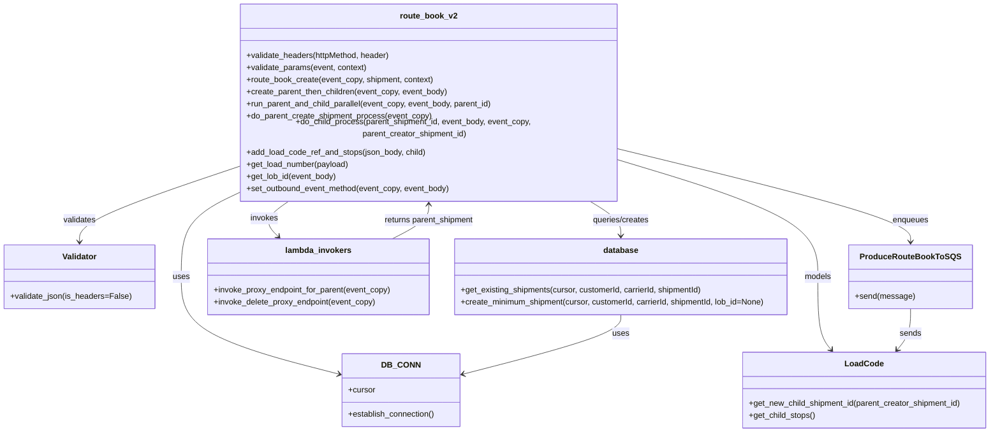

# Diagram: shipment_core/shipment_service/shipment_service/asn/routebook_producer.py


> Auto-generated by Obscura crawlers

## Diagram 1



### SVG

<svg id="container" width="1968.99609375" xmlns="http://www.w3.org/2000/svg" class="classDiagram" height="830" viewBox="0 0 1968.99609375 830" role="graphics-document document" aria-roledescription="class"><style>#container{font-family:"trebuchet ms",verdana,arial,sans-serif;font-size:16px;fill:#333;}@keyframes edge-animation-frame{from{stroke-dashoffset:0;}}@keyframes dash{to{stroke-dashoffset:0;}}#container .edge-animation-slow{stroke-dasharray:9,5!important;stroke-dashoffset:900;animation:dash 50s linear infinite;stroke-linecap:round;}#container .edge-animation-fast{stroke-dasharray:9,5!important;stroke-dashoffset:900;animation:dash 20s linear infinite;stroke-linecap:round;}#container .error-icon{fill:#552222;}#container .error-text{fill:#552222;stroke:#552222;}#container .edge-thickness-normal{stroke-width:1px;}#container .edge-thickness-thick{stroke-width:3.5px;}#container .edge-pattern-solid{stroke-dasharray:0;}#container .edge-thickness-invisible{stroke-width:0;fill:none;}#container .edge-pattern-dashed{stroke-dasharray:3;}#container .edge-pattern-dotted{stroke-dasharray:2;}#container .marker{fill:#333333;stroke:#333333;}#container .marker.cross{stroke:#333333;}#container svg{font-family:"trebuchet ms",verdana,arial,sans-serif;font-size:16px;}#container p{margin:0;}#container g.classGroup text{fill:#9370DB;stroke:none;font-family:"trebuchet ms",verdana,arial,sans-serif;font-size:10px;}#container g.classGroup text .title{font-weight:bolder;}#container .nodeLabel,#container .edgeLabel{color:#131300;}#container .edgeLabel .label rect{fill:#ECECFF;}#container .label text{fill:#131300;}#container .labelBkg{background:#ECECFF;}#container .edgeLabel .label span{background:#ECECFF;}#container .classTitle{font-weight:bolder;}#container .node rect,#container .node circle,#container .node ellipse,#container .node polygon,#container .node path{fill:#ECECFF;stroke:#9370DB;stroke-width:1px;}#container .divider{stroke:#9370DB;stroke-width:1;}#container g.clickable{cursor:pointer;}#container g.classGroup rect{fill:#ECECFF;stroke:#9370DB;}#container g.classGroup line{stroke:#9370DB;stroke-width:1;}#container .classLabel .box{stroke:none;stroke-width:0;fill:#ECECFF;opacity:0.5;}#container .classLabel .label{fill:#9370DB;font-size:10px;}#container .relation{stroke:#333333;stroke-width:1;fill:none;}#container .dashed-line{stroke-dasharray:3;}#container .dotted-line{stroke-dasharray:1 2;}#container #compositionStart,#container .composition{fill:#333333!important;stroke:#333333!important;stroke-width:1;}#container #compositionEnd,#container .composition{fill:#333333!important;stroke:#333333!important;stroke-width:1;}#container #dependencyStart,#container .dependency{fill:#333333!important;stroke:#333333!important;stroke-width:1;}#container #dependencyStart,#container .dependency{fill:#333333!important;stroke:#333333!important;stroke-width:1;}#container #extensionStart,#container .extension{fill:transparent!important;stroke:#333333!important;stroke-width:1;}#container #extensionEnd,#container .extension{fill:transparent!important;stroke:#333333!important;stroke-width:1;}#container #aggregationStart,#container .aggregation{fill:transparent!important;stroke:#333333!important;stroke-width:1;}#container #aggregationEnd,#container .aggregation{fill:transparent!important;stroke:#333333!important;stroke-width:1;}#container #lollipopStart,#container .lollipop{fill:#ECECFF!important;stroke:#333333!important;stroke-width:1;}#container #lollipopEnd,#container .lollipop{fill:#ECECFF!important;stroke:#333333!important;stroke-width:1;}#container .edgeTerminals{font-size:11px;line-height:initial;}#container .classTitleText{text-anchor:middle;font-size:18px;fill:#333;}#container .label-icon{display:inline-block;height:1em;overflow:visible;vertical-align:-0.125em;}#container .node .label-icon path{fill:currentColor;stroke:revert;stroke-width:revert;}#container :root{--mermaid-font-family:"trebuchet ms",verdana,arial,sans-serif;}</style><g><defs><marker id="container_class-aggregationStart" class="marker aggregation class" refX="18" refY="7" markerWidth="190" markerHeight="240" orient="auto"><path d="M 18,7 L9,13 L1,7 L9,1 Z"></path></marker></defs><defs><marker id="container_class-aggregationEnd" class="marker aggregation class" refX="1" refY="7" markerWidth="20" markerHeight="28" orient="auto"><path d="M 18,7 L9,13 L1,7 L9,1 Z"></path></marker></defs><defs><marker id="container_class-extensionStart" class="marker extension class" refX="18" refY="7" markerWidth="190" markerHeight="240" orient="auto"><path d="M 1,7 L18,13 V 1 Z"></path></marker></defs><defs><marker id="container_class-extensionEnd" class="marker extension class" refX="1" refY="7" markerWidth="20" markerHeight="28" orient="auto"><path d="M 1,1 V 13 L18,7 Z"></path></marker></defs><defs><marker id="container_class-compositionStart" class="marker composition class" refX="18" refY="7" markerWidth="190" markerHeight="240" orient="auto"><path d="M 18,7 L9,13 L1,7 L9,1 Z"></path></marker></defs><defs><marker id="container_class-compositionEnd" class="marker composition class" refX="1" refY="7" markerWidth="20" markerHeight="28" orient="auto"><path d="M 18,7 L9,13 L1,7 L9,1 Z"></path></marker></defs><defs><marker id="container_class-dependencyStart" class="marker dependency class" refX="6" refY="7" markerWidth="190" markerHeight="240" orient="auto"><path d="M 5,7 L9,13 L1,7 L9,1 Z"></path></marker></defs><defs><marker id="container_class-dependencyEnd" class="marker dependency class" refX="13" refY="7" markerWidth="20" markerHeight="28" orient="auto"><path d="M 18,7 L9,13 L14,7 L9,1 Z"></path></marker></defs><defs><marker id="container_class-lollipopStart" class="marker lollipop class" refX="13" refY="7" markerWidth="190" markerHeight="240" orient="auto"><circle stroke="black" fill="transparent" cx="7" cy="7" r="6"></circle></marker></defs><defs><marker id="container_class-lollipopEnd" class="marker lollipop class" refX="1" refY="7" markerWidth="190" markerHeight="240" orient="auto"><circle stroke="black" fill="transparent" cx="7" cy="7" r="6"></circle></marker></defs><g class="root"><g class="clusters"></g><g class="edgePaths"><path d="M462.742,362.513L444.727,370.594C426.711,378.676,390.68,394.838,372.664,421.586C354.648,448.333,354.648,485.667,354.648,523C354.648,560.333,354.648,597.667,407.458,629.822C460.267,661.976,565.885,688.953,618.694,702.441L671.503,715.929" id="id_route_book_v2_DB_CONN_1" class="edge-thickness-normal edge-pattern-solid relation" style=";;;" data-edge="true" data-et="edge" data-id="id_route_book_v2_DB_CONN_1" data-points="W3sieCI6NDYyLjc0MjE4NzUsInkiOjM2Mi41MTMzMzY1NzIyMzQxNX0seyJ4IjozNTQuNjQ4NDM3NSwieSI6NDExfSx7IngiOjM1NC42NDg0Mzc1LCJ5Ijo1MjN9LHsieCI6MzU0LjY0ODQzNzUsInkiOjYzNX0seyJ4Ijo2NzcuMzE2NDA2MjUsInkiOjcxNy40MTM4ODk1NTY5OTg3fV0=" marker-end="url(#container_class-dependencyEnd)"></path><path d="M462.742,312.996L411.548,329.33C360.354,345.664,257.966,378.332,206.772,401.833C155.578,425.333,155.578,439.667,155.578,446.833L155.578,454" id="id_route_book_v2_Validator_2" class="edge-thickness-normal edge-pattern-solid relation" style=";;;" data-edge="true" data-et="edge" data-id="id_route_book_v2_Validator_2" data-points="W3sieCI6NDYyLjc0MjE4NzUsInkiOjMxMi45OTY0OTg5NjA0NTE4NX0seyJ4IjoxNTUuNTc4MTI1LCJ5Ijo0MTF9LHsieCI6MTU1LjU3ODEyNSwieSI6NDYwfV0=" marker-end="url(#container_class-dependencyEnd)"></path><path d="M1227.469,278.467L1324.031,300.555C1420.594,322.644,1613.719,366.822,1710.281,396.078C1806.844,425.333,1806.844,439.667,1806.844,446.833L1806.844,454" id="id_route_book_v2_ProduceRouteBookToSQS_3" class="edge-thickness-normal edge-pattern-solid relation" style=";;;" data-edge="true" data-et="edge" data-id="id_route_book_v2_ProduceRouteBookToSQS_3" data-points="W3sieCI6MTIyNy40Njg3NSwieSI6Mjc4LjQ2NjU0MjEwOTIxNzl9LHsieCI6MTgwNi44NDM3NSwieSI6NDExfSx7IngiOjE4MDYuODQzNzUsInkiOjQ2MH1d" marker-end="url(#container_class-dependencyEnd)"></path><path d="M1227.469,298.365L1294.324,317.137C1361.18,335.91,1494.891,373.455,1561.746,410.894C1628.602,448.333,1628.602,485.667,1628.602,523C1628.602,560.333,1628.602,597.667,1632.886,621.718C1637.17,645.768,1645.739,656.537,1650.023,661.921L1654.307,667.305" id="id_route_book_v2_LoadCode_4" class="edge-thickness-normal edge-pattern-solid relation" style=";;;" data-edge="true" data-et="edge" data-id="id_route_book_v2_LoadCode_4" data-points="W3sieCI6MTIyNy40Njg3NSwieSI6Mjk4LjM2NDgyNjEyNDg5MDk1fSx7IngiOjE2MjguNjAxNTYyNSwieSI6NDExfSx7IngiOjE2MjguNjAxNTYyNSwieSI6NTIzfSx7IngiOjE2MjguNjAxNTYyNSwieSI6NjM1fSx7IngiOjE2NTguMDQzMzUyMzk5NTUzNywieSI6NjcyfV0=" marker-end="url(#container_class-dependencyEnd)"></path><path d="M569.91,374L560.637,380.167C551.363,386.333,532.816,398.667,529.004,410.293C525.192,421.919,536.115,432.839,541.576,438.298L547.038,443.758" id="id_route_book_v2_lambda_invokers_5" class="edge-thickness-normal edge-pattern-solid relation" style=";;;" data-edge="true" data-et="edge" data-id="id_route_book_v2_lambda_invokers_5" data-points="W3sieCI6NTY5LjkxMDEyMDczODYzNjQsInkiOjM3NH0seyJ4Ijo1MTQuMjY5NTMxMjUsInkiOjQxMX0seyJ4Ijo1NTEuMjgxMTQ1MzY4MzAzNiwieSI6NDQ4fV0=" marker-end="url(#container_class-dependencyEnd)"></path><path d="M1166.645,374L1177.481,380.167C1188.316,386.333,1209.986,398.667,1220.821,410C1231.656,421.333,1231.656,431.667,1231.656,436.833L1231.656,442" id="id_route_book_v2_database_6" class="edge-thickness-normal edge-pattern-solid relation" style=";;;" data-edge="true" data-et="edge" data-id="id_route_book_v2_database_6" data-points="W3sieCI6MTE2Ni42NDU0MzY3ODk3NzI3LCJ5IjozNzR9LHsieCI6MTIzMS42NTYyNSwieSI6NDExfSx7IngiOjEyMzEuNjU2MjUsInkiOjQ0OH1d" marker-end="url(#container_class-dependencyEnd)"></path><path d="M1806.844,586L1806.844,594.167C1806.844,602.333,1806.844,618.667,1802.559,632.218C1798.275,645.768,1789.707,656.537,1785.422,661.921L1781.138,667.305" id="id_ProduceRouteBookToSQS_LoadCode_7" class="edge-thickness-normal edge-pattern-solid relation" style=";;;" data-edge="true" data-et="edge" data-id="id_ProduceRouteBookToSQS_LoadCode_7" data-points="W3sieCI6MTgwNi44NDM3NSwieSI6NTg2fSx7IngiOjE4MDYuODQzNzUsInkiOjYzNX0seyJ4IjoxNzc3LjQwMTk2MDEwMDQ0NjMsInkiOjY3Mn1d" marker-end="url(#container_class-dependencyEnd)"></path><path d="M772.823,448L784.87,441.833C796.917,435.667,821.011,423.333,833.058,412C845.105,400.667,845.105,390.333,845.105,385.167L845.105,380" id="id_lambda_invokers_route_book_v2_8" class="edge-thickness-normal edge-pattern-solid relation" style=";;;" data-edge="true" data-et="edge" data-id="id_lambda_invokers_route_book_v2_8" data-points="W3sieCI6NzcyLjgyMzA2NzgwMTMzOTIsInkiOjQ0OH0seyJ4Ijo4NDUuMTA1NDY4NzUsInkiOjQxMX0seyJ4Ijo4NDUuMTA1NDY4NzUsInkiOjM3NH1d" marker-end="url(#container_class-dependencyEnd)"></path><path d="M1231.656,598L1231.656,604.167C1231.656,610.333,1231.656,622.667,1178.847,642.322C1126.038,661.976,1020.42,688.953,967.611,702.441L914.802,715.929" id="id_database_DB_CONN_9" class="edge-thickness-normal edge-pattern-solid relation" style=";;;" data-edge="true" data-et="edge" data-id="id_database_DB_CONN_9" data-points="W3sieCI6MTIzMS42NTYyNSwieSI6NTk4fSx7IngiOjEyMzEuNjU2MjUsInkiOjYzNX0seyJ4Ijo5MDguOTg4MjgxMjUsInkiOjcxNy40MTM4ODk1NTY5OTg3fV0=" marker-end="url(#container_class-dependencyEnd)"></path></g><g class="edgeLabels"><g class="edgeLabel" transform="translate(354.6484375, 523)"><g class="label" data-id="id_route_book_v2_DB_CONN_1" transform="translate(-16.4921875, -12)"><foreignObject width="32.984375" height="24"><div xmlns="http://www.w3.org/1999/xhtml" class="labelBkg" style="display: table-cell; white-space: nowrap; line-height: 1.5; max-width: 200px; text-align: center;"><span class="edgeLabel"><p>uses</p></span></div></foreignObject></g></g><g class="edgeLabel" transform="translate(155.578125, 411)"><g class="label" data-id="id_route_book_v2_Validator_2" transform="translate(-32.6875, -12)"><foreignObject width="65.375" height="24"><div xmlns="http://www.w3.org/1999/xhtml" class="labelBkg" style="display: table-cell; white-space: nowrap; line-height: 1.5; max-width: 200px; text-align: center;"><span class="edgeLabel"><p>validates</p></span></div></foreignObject></g></g><g class="edgeLabel" transform="translate(1806.84375, 411)"><g class="label" data-id="id_route_book_v2_ProduceRouteBookToSQS_3" transform="translate(-35.6015625, -12)"><foreignObject width="71.203125" height="24"><div xmlns="http://www.w3.org/1999/xhtml" class="labelBkg" style="display: table-cell; white-space: nowrap; line-height: 1.5; max-width: 200px; text-align: center;"><span class="edgeLabel"><p>enqueues</p></span></div></foreignObject></g></g><g class="edgeLabel" transform="translate(1628.6015625, 523)"><g class="label" data-id="id_route_book_v2_LoadCode_4" transform="translate(-26.7578125, -12)"><foreignObject width="53.515625" height="24"><div xmlns="http://www.w3.org/1999/xhtml" class="labelBkg" style="display: table-cell; white-space: nowrap; line-height: 1.5; max-width: 200px; text-align: center;"><span class="edgeLabel"><p>models</p></span></div></foreignObject></g></g><g class="edgeLabel" transform="translate(520.30059, 406.98945)"><g class="label" data-id="id_route_book_v2_lambda_invokers_5" transform="translate(-27.5859375, -12)"><foreignObject width="55.171875" height="24"><div xmlns="http://www.w3.org/1999/xhtml" class="labelBkg" style="display: table-cell; white-space: nowrap; line-height: 1.5; max-width: 200px; text-align: center;"><span class="edgeLabel"><p>invokes</p></span></div></foreignObject></g></g><g class="edgeLabel" transform="translate(1231.65625, 411)"><g class="label" data-id="id_route_book_v2_database_6" transform="translate(-57.171875, -12)"><foreignObject width="114.34375" height="24"><div xmlns="http://www.w3.org/1999/xhtml" class="labelBkg" style="display: table-cell; white-space: nowrap; line-height: 1.5; max-width: 200px; text-align: center;"><span class="edgeLabel"><p>queries/creates</p></span></div></foreignObject></g></g><g class="edgeLabel" transform="translate(1806.84375, 635)"><g class="label" data-id="id_ProduceRouteBookToSQS_LoadCode_7" transform="translate(-21.3046875, -12)"><foreignObject width="42.609375" height="24"><div xmlns="http://www.w3.org/1999/xhtml" class="labelBkg" style="display: table-cell; white-space: nowrap; line-height: 1.5; max-width: 200px; text-align: center;"><span class="edgeLabel"><p>sends</p></span></div></foreignObject></g></g><g class="edgeLabel" transform="translate(845.10546875, 411)"><g class="label" data-id="id_lambda_invokers_route_book_v2_8" transform="translate(-90.578125, -12)"><foreignObject width="181.15625" height="24"><div xmlns="http://www.w3.org/1999/xhtml" class="labelBkg" style="display: table-cell; white-space: nowrap; line-height: 1.5; max-width: 200px; text-align: center;"><span class="edgeLabel"><p>returns parent_shipment</p></span></div></foreignObject></g></g><g class="edgeLabel" transform="translate(1231.65625, 635)"><g class="label" data-id="id_database_DB_CONN_9" transform="translate(-16.4921875, -12)"><foreignObject width="32.984375" height="24"><div xmlns="http://www.w3.org/1999/xhtml" class="labelBkg" style="display: table-cell; white-space: nowrap; line-height: 1.5; max-width: 200px; text-align: center;"><span class="edgeLabel"><p>uses</p></span></div></foreignObject></g></g></g><g class="nodes"><g class="node default" id="classId-route_book_v2-0" transform="translate(845.10546875, 191)"><g class="basic label-container"><path d="M-382.36328125 -183 L382.36328125 -183 L382.36328125 183 L-382.36328125 183" stroke="none" stroke-width="0" fill="#ECECFF" style=""></path><path d="M-382.36328125 -183 C-180.11687936474925 -183, 22.129522520501496 -183, 382.36328125 -183 M-382.36328125 -183 C-135.56073632959001 -183, 111.24180859081997 -183, 382.36328125 -183 M382.36328125 -183 C382.36328125 -70.98766962948424, 382.36328125 41.02466074103151, 382.36328125 183 M382.36328125 -183 C382.36328125 -108.42188589135911, 382.36328125 -33.84377178271822, 382.36328125 183 M382.36328125 183 C130.5598473468481 183, -121.2435865563038 183, -382.36328125 183 M382.36328125 183 C161.34458781024804 183, -59.67410562950391 183, -382.36328125 183 M-382.36328125 183 C-382.36328125 61.03187496374706, -382.36328125 -60.936250072505885, -382.36328125 -183 M-382.36328125 183 C-382.36328125 64.61264112966091, -382.36328125 -53.77471774067817, -382.36328125 -183" stroke="#9370DB" stroke-width="1.3" fill="none" stroke-dasharray="0 0" style=""></path></g><g class="annotation-group text" transform="translate(0, -159)"></g><g class="label-group text" transform="translate(-54.1953125, -159)"><g class="label" style="font-weight: bolder" transform="translate(0,-12)"><foreignObject width="108.390625" height="24"><div xmlns="http://www.w3.org/1999/xhtml" style="display: table-cell; white-space: nowrap; line-height: 1.5; max-width: 157px; text-align: center;"><span class="nodeLabel markdown-node-label" style=""><p>route_book_v2</p></span></div></foreignObject></g></g><g class="members-group text" transform="translate(-370.36328125, -111)"></g><g class="methods-group text" transform="translate(-370.36328125, -81)"><g class="label" style="" transform="translate(0,-12)"><foreignObject width="287.265625" height="24"><div xmlns="http://www.w3.org/1999/xhtml" style="display: table-cell; white-space: nowrap; line-height: 1.5; max-width: 345px; text-align: center;"><span class="nodeLabel markdown-node-label" style=""><p>+validate_headers(httpMethod, header)</p></span></div></foreignObject></g><g class="label" style="" transform="translate(0,12)"><foreignObject width="239.8125" height="24"><div xmlns="http://www.w3.org/1999/xhtml" style="display: table-cell; white-space: nowrap; line-height: 1.5; max-width: 297px; text-align: center;"><span class="nodeLabel markdown-node-label" style=""><p>+validate_params(event, context)</p></span></div></foreignObject></g><g class="label" style="" transform="translate(0,36)"><foreignObject width="374.265625" height="24"><div xmlns="http://www.w3.org/1999/xhtml" style="display: table-cell; white-space: nowrap; line-height: 1.5; max-width: 432px; text-align: center;"><span class="nodeLabel markdown-node-label" style=""><p>+route_book_create(event_copy, shipment, context)</p></span></div></foreignObject></g><g class="label" style="" transform="translate(0,60)"><foreignObject width="402.296875" height="24"><div xmlns="http://www.w3.org/1999/xhtml" style="display: table-cell; white-space: nowrap; line-height: 1.5; max-width: 460px; text-align: center;"><span class="nodeLabel markdown-node-label" style=""><p>+create_parent_then_children(event_copy, event_body)</p></span></div></foreignObject></g><g class="label" style="" transform="translate(0,84)"><foreignObject width="493.90625" height="24"><div xmlns="http://www.w3.org/1999/xhtml" style="display: table-cell; white-space: nowrap; line-height: 1.5; max-width: 551px; text-align: center;"><span class="nodeLabel markdown-node-label" style=""><p>+run_parent_and_child_parallel(event_copy, event_body, parent_id)</p></span></div></foreignObject></g><g class="label" style="" transform="translate(0,108)"><foreignObject width="368.21875" height="24"><div xmlns="http://www.w3.org/1999/xhtml" style="display: table-cell; white-space: nowrap; line-height: 1.5; max-width: 426px; text-align: center;"><span class="nodeLabel markdown-node-label" style=""><p>+do_parent_create_shipment_process(event_copy)</p></span></div></foreignObject></g><g class="label" style="" transform="translate(0,132)"><foreignObject width="686.53125" height="24"><div xmlns="http://www.w3.org/1999/xhtml" style="display: table-cell; white-space: nowrap; line-height: 1.5; max-width: 744px; text-align: center;"><span class="nodeLabel markdown-node-label" style=""><p>+do_child_process(parent_shipment_id, event_body, event_copy, parent_creator_shipment_id)</p></span></div></foreignObject></g><g class="label" style="" transform="translate(0,156)"><foreignObject width="358.75" height="24"><div xmlns="http://www.w3.org/1999/xhtml" style="display: table-cell; white-space: nowrap; line-height: 1.5; max-width: 416px; text-align: center;"><span class="nodeLabel markdown-node-label" style=""><p>+add_load_code_ref_and_stops(json_body, child)</p></span></div></foreignObject></g><g class="label" style="" transform="translate(0,180)"><foreignObject width="204.015625" height="24"><div xmlns="http://www.w3.org/1999/xhtml" style="display: table-cell; white-space: nowrap; line-height: 1.5; max-width: 261px; text-align: center;"><span class="nodeLabel markdown-node-label" style=""><p>+get_load_number(payload)</p></span></div></foreignObject></g><g class="label" style="" transform="translate(0,204)"><foreignObject width="179.5625" height="24"><div xmlns="http://www.w3.org/1999/xhtml" style="display: table-cell; white-space: nowrap; line-height: 1.5; max-width: 237px; text-align: center;"><span class="nodeLabel markdown-node-label" style=""><p>+get_lob_id(event_body)</p></span></div></foreignObject></g><g class="label" style="" transform="translate(0,228)"><foreignObject width="407.71875" height="24"><div xmlns="http://www.w3.org/1999/xhtml" style="display: table-cell; white-space: nowrap; line-height: 1.5; max-width: 465px; text-align: center;"><span class="nodeLabel markdown-node-label" style=""><p>+set_outbound_event_method(event_copy, event_body)</p></span></div></foreignObject></g></g><g class="divider" style=""><path d="M-382.36328125 -135 C-79.17564963865414 -135, 224.01198197269173 -135, 382.36328125 -135 M-382.36328125 -135 C-155.61253522948277 -135, 71.13821079103445 -135, 382.36328125 -135" stroke="#9370DB" stroke-width="1.3" fill="none" stroke-dasharray="0 0" style=""></path></g><g class="divider" style=""><path d="M-382.36328125 -111 C-228.2658589868661 -111, -74.16843672373221 -111, 382.36328125 -111 M-382.36328125 -111 C-166.23615472227533 -111, 49.89097180544934 -111, 382.36328125 -111" stroke="#9370DB" stroke-width="1.3" fill="none" stroke-dasharray="0 0" style=""></path></g></g><g class="node default" id="classId-DB_CONN-1" transform="translate(793.15234375, 747)"><g class="basic label-container"><path d="M-115.8359375 -72 L115.8359375 -72 L115.8359375 72 L-115.8359375 72" stroke="none" stroke-width="0" fill="#ECECFF" style=""></path><path d="M-115.8359375 -72 C-64.34587934121294 -72, -12.85582118242587 -72, 115.8359375 -72 M-115.8359375 -72 C-52.433000343722874 -72, 10.969936812554252 -72, 115.8359375 -72 M115.8359375 -72 C115.8359375 -35.625831403643815, 115.8359375 0.7483371927123699, 115.8359375 72 M115.8359375 -72 C115.8359375 -38.10907010085128, 115.8359375 -4.218140201702553, 115.8359375 72 M115.8359375 72 C49.131327146277286 72, -17.573283207445428 72, -115.8359375 72 M115.8359375 72 C62.738189937982945 72, 9.64044237596589 72, -115.8359375 72 M-115.8359375 72 C-115.8359375 40.70107841808165, -115.8359375 9.402156836163307, -115.8359375 -72 M-115.8359375 72 C-115.8359375 23.123220733971237, -115.8359375 -25.753558532057525, -115.8359375 -72" stroke="#9370DB" stroke-width="1.3" fill="none" stroke-dasharray="0 0" style=""></path></g><g class="annotation-group text" transform="translate(0, -48)"></g><g class="label-group text" transform="translate(-34.40625, -48)"><g class="label" style="font-weight: bolder" transform="translate(0,-12)"><foreignObject width="68.8125" height="24"><div xmlns="http://www.w3.org/1999/xhtml" style="display: table-cell; white-space: nowrap; line-height: 1.5; max-width: 119px; text-align: center;"><span class="nodeLabel markdown-node-label" style=""><p>DB_CONN</p></span></div></foreignObject></g></g><g class="members-group text" transform="translate(-103.8359375, 0)"><g class="label" style="" transform="translate(0,-12)"><foreignObject width="53.71875" height="24"><div xmlns="http://www.w3.org/1999/xhtml" style="display: table-cell; white-space: nowrap; line-height: 1.5; max-width: 112px; text-align: center;"><span class="nodeLabel markdown-node-label" style=""><p>+cursor</p></span></div></foreignObject></g></g><g class="methods-group text" transform="translate(-103.8359375, 48)"><g class="label" style="" transform="translate(0,-12)"><foreignObject width="173.265625" height="24"><div xmlns="http://www.w3.org/1999/xhtml" style="display: table-cell; white-space: nowrap; line-height: 1.5; max-width: 231px; text-align: center;"><span class="nodeLabel markdown-node-label" style=""><p>+establish_connection()</p></span></div></foreignObject></g></g><g class="divider" style=""><path d="M-115.8359375 -24 C-36.96885016682111 -24, 41.898237166357774 -24, 115.8359375 -24 M-115.8359375 -24 C-64.49368979513925 -24, -13.151442090278493 -24, 115.8359375 -24" stroke="#9370DB" stroke-width="1.3" fill="none" stroke-dasharray="0 0" style=""></path></g><g class="divider" style=""><path d="M-115.8359375 24 C-53.406186654803655 24, 9.02356419039269 24, 115.8359375 24 M-115.8359375 24 C-53.93089902826838 24, 7.974139443463244 24, 115.8359375 24" stroke="#9370DB" stroke-width="1.3" fill="none" stroke-dasharray="0 0" style=""></path></g></g><g class="node default" id="classId-Validator-2" transform="translate(155.578125, 523)"><g class="basic label-container"><path d="M-147.578125 -63 L147.578125 -63 L147.578125 63 L-147.578125 63" stroke="none" stroke-width="0" fill="#ECECFF" style=""></path><path d="M-147.578125 -63 C-88.17307361616864 -63, -28.768022232337273 -63, 147.578125 -63 M-147.578125 -63 C-60.608252033104264 -63, 26.36162093379147 -63, 147.578125 -63 M147.578125 -63 C147.578125 -29.07662208357651, 147.578125 4.846755832846981, 147.578125 63 M147.578125 -63 C147.578125 -29.142522932796247, 147.578125 4.714954134407506, 147.578125 63 M147.578125 63 C65.21188343983266 63, -17.154358120334678 63, -147.578125 63 M147.578125 63 C80.21035921701302 63, 12.842593434026043 63, -147.578125 63 M-147.578125 63 C-147.578125 23.078353318091757, -147.578125 -16.843293363816485, -147.578125 -63 M-147.578125 63 C-147.578125 31.6281525073067, -147.578125 0.25630501461340316, -147.578125 -63" stroke="#9370DB" stroke-width="1.3" fill="none" stroke-dasharray="0 0" style=""></path></g><g class="annotation-group text" transform="translate(0, -39)"></g><g class="label-group text" transform="translate(-33.1875, -39)"><g class="label" style="font-weight: bolder" transform="translate(0,-12)"><foreignObject width="66.375" height="24"><div xmlns="http://www.w3.org/1999/xhtml" style="display: table-cell; white-space: nowrap; line-height: 1.5; max-width: 116px; text-align: center;"><span class="nodeLabel markdown-node-label" style=""><p>Validator</p></span></div></foreignObject></g></g><g class="members-group text" transform="translate(-135.578125, 9)"></g><g class="methods-group text" transform="translate(-135.578125, 39)"><g class="label" style="" transform="translate(0,-12)"><foreignObject width="237.96875" height="24"><div xmlns="http://www.w3.org/1999/xhtml" style="display: table-cell; white-space: nowrap; line-height: 1.5; max-width: 295px; text-align: center;"><span class="nodeLabel markdown-node-label" style=""><p>+validate_json(is_headers=False)</p></span></div></foreignObject></g></g><g class="divider" style=""><path d="M-147.578125 -15 C-85.68810795856032 -15, -23.79809091712066 -15, 147.578125 -15 M-147.578125 -15 C-32.49753042509926 -15, 82.58306414980149 -15, 147.578125 -15" stroke="#9370DB" stroke-width="1.3" fill="none" stroke-dasharray="0 0" style=""></path></g><g class="divider" style=""><path d="M-147.578125 9 C-40.11714925491076 9, 67.34382649017849 9, 147.578125 9 M-147.578125 9 C-72.04073605075516 9, 3.4966528984896854 9, 147.578125 9" stroke="#9370DB" stroke-width="1.3" fill="none" stroke-dasharray="0 0" style=""></path></g></g><g class="node default" id="classId-ProduceRouteBookToSQS-3" transform="translate(1806.84375, 523)"><g class="basic label-container"><path d="M-116.484375 -63 L116.484375 -63 L116.484375 63 L-116.484375 63" stroke="none" stroke-width="0" fill="#ECECFF" style=""></path><path d="M-116.484375 -63 C-28.572258432754083 -63, 59.339858134491834 -63, 116.484375 -63 M-116.484375 -63 C-39.10606633467134 -63, 38.27224233065732 -63, 116.484375 -63 M116.484375 -63 C116.484375 -20.22327265363233, 116.484375 22.553454692735343, 116.484375 63 M116.484375 -63 C116.484375 -33.2837785297829, 116.484375 -3.5675570595658, 116.484375 63 M116.484375 63 C35.65494456798275 63, -45.174485864034494 63, -116.484375 63 M116.484375 63 C36.240198291203455 63, -44.00397841759309 63, -116.484375 63 M-116.484375 63 C-116.484375 36.59584705533079, -116.484375 10.191694110661587, -116.484375 -63 M-116.484375 63 C-116.484375 26.351399642672007, -116.484375 -10.297200714655986, -116.484375 -63" stroke="#9370DB" stroke-width="1.3" fill="none" stroke-dasharray="0 0" style=""></path></g><g class="annotation-group text" transform="translate(0, -39)"></g><g class="label-group text" transform="translate(-93.09375, -39)"><g class="label" style="font-weight: bolder" transform="translate(0,-12)"><foreignObject width="186.1875" height="24"><div xmlns="http://www.w3.org/1999/xhtml" style="display: table-cell; white-space: nowrap; line-height: 1.5; max-width: 233px; text-align: center;"><span class="nodeLabel markdown-node-label" style=""><p>ProduceRouteBookToSQS</p></span></div></foreignObject></g></g><g class="members-group text" transform="translate(-104.484375, 9)"></g><g class="methods-group text" transform="translate(-104.484375, 39)"><g class="label" style="" transform="translate(0,-12)"><foreignObject width="115.875" height="24"><div xmlns="http://www.w3.org/1999/xhtml" style="display: table-cell; white-space: nowrap; line-height: 1.5; max-width: 173px; text-align: center;"><span class="nodeLabel markdown-node-label" style=""><p>+send(message)</p></span></div></foreignObject></g></g><g class="divider" style=""><path d="M-116.484375 -15 C-55.78393229381537 -15, 4.916510412369263 -15, 116.484375 -15 M-116.484375 -15 C-29.849811852518286 -15, 56.78475129496343 -15, 116.484375 -15" stroke="#9370DB" stroke-width="1.3" fill="none" stroke-dasharray="0 0" style=""></path></g><g class="divider" style=""><path d="M-116.484375 9 C-47.91920655654032 9, 20.645961886919366 9, 116.484375 9 M-116.484375 9 C-36.04956343345269 9, 44.38524813309462 9, 116.484375 9" stroke="#9370DB" stroke-width="1.3" fill="none" stroke-dasharray="0 0" style=""></path></g></g><g class="node default" id="classId-LoadCode-4" transform="translate(1717.72265625, 747)"><g class="basic label-container"><path d="M-243.2734375 -75 L243.2734375 -75 L243.2734375 75 L-243.2734375 75" stroke="none" stroke-width="0" fill="#ECECFF" style=""></path><path d="M-243.2734375 -75 C-67.32967469553003 -75, 108.61408810893994 -75, 243.2734375 -75 M-243.2734375 -75 C-122.3790764796697 -75, -1.4847154593394123 -75, 243.2734375 -75 M243.2734375 -75 C243.2734375 -40.194724691524925, 243.2734375 -5.38944938304985, 243.2734375 75 M243.2734375 -75 C243.2734375 -37.8936289635533, 243.2734375 -0.7872579271065945, 243.2734375 75 M243.2734375 75 C108.09449994377866 75, -27.084437612442684 75, -243.2734375 75 M243.2734375 75 C105.2778896062147 75, -32.7176582875706 75, -243.2734375 75 M-243.2734375 75 C-243.2734375 19.920122173356845, -243.2734375 -35.15975565328631, -243.2734375 -75 M-243.2734375 75 C-243.2734375 39.74098600608091, -243.2734375 4.481972012161819, -243.2734375 -75" stroke="#9370DB" stroke-width="1.3" fill="none" stroke-dasharray="0 0" style=""></path></g><g class="annotation-group text" transform="translate(0, -51)"></g><g class="label-group text" transform="translate(-36.015625, -51)"><g class="label" style="font-weight: bolder" transform="translate(0,-12)"><foreignObject width="72.03125" height="24"><div xmlns="http://www.w3.org/1999/xhtml" style="display: table-cell; white-space: nowrap; line-height: 1.5; max-width: 121px; text-align: center;"><span class="nodeLabel markdown-node-label" style=""><p>LoadCode</p></span></div></foreignObject></g></g><g class="members-group text" transform="translate(-231.2734375, -3)"></g><g class="methods-group text" transform="translate(-231.2734375, 27)"><g class="label" style="" transform="translate(0,-12)"><foreignObject width="426.53125" height="24"><div xmlns="http://www.w3.org/1999/xhtml" style="display: table-cell; white-space: nowrap; line-height: 1.5; max-width: 484px; text-align: center;"><span class="nodeLabel markdown-node-label" style=""><p>+get_new_child_shipment_id(parent_creator_shipment_id)</p></span></div></foreignObject></g><g class="label" style="" transform="translate(0,12)"><foreignObject width="132.28125" height="24"><div xmlns="http://www.w3.org/1999/xhtml" style="display: table-cell; white-space: nowrap; line-height: 1.5; max-width: 190px; text-align: center;"><span class="nodeLabel markdown-node-label" style=""><p>+get_child_stops()</p></span></div></foreignObject></g></g><g class="divider" style=""><path d="M-243.2734375 -27 C-56.06465471322974 -27, 131.14412807354051 -27, 243.2734375 -27 M-243.2734375 -27 C-81.89916965222179 -27, 79.47509819555643 -27, 243.2734375 -27" stroke="#9370DB" stroke-width="1.3" fill="none" stroke-dasharray="0 0" style=""></path></g><g class="divider" style=""><path d="M-243.2734375 -3 C-119.76801969857254 -3, 3.737398102854911 -3, 243.2734375 -3 M-243.2734375 -3 C-88.05936856519818 -3, 67.15470036960363 -3, 243.2734375 -3" stroke="#9370DB" stroke-width="1.3" fill="none" stroke-dasharray="0 0" style=""></path></g></g><g class="node default" id="classId-lambda_invokers-5" transform="translate(626.3046875, 523)"><g class="basic label-container"><path d="M-220.1640625 -75 L220.1640625 -75 L220.1640625 75 L-220.1640625 75" stroke="none" stroke-width="0" fill="#ECECFF" style=""></path><path d="M-220.1640625 -75 C-113.96883239082665 -75, -7.773602281653297 -75, 220.1640625 -75 M-220.1640625 -75 C-100.58249608740134 -75, 18.999070325197323 -75, 220.1640625 -75 M220.1640625 -75 C220.1640625 -34.45607182969687, 220.1640625 6.087856340606265, 220.1640625 75 M220.1640625 -75 C220.1640625 -15.801905141463166, 220.1640625 43.39618971707367, 220.1640625 75 M220.1640625 75 C128.69819983621866 75, 37.232337172437326 75, -220.1640625 75 M220.1640625 75 C131.39212415227996 75, 42.62018580455995 75, -220.1640625 75 M-220.1640625 75 C-220.1640625 43.865243515914145, -220.1640625 12.730487031828282, -220.1640625 -75 M-220.1640625 75 C-220.1640625 43.64878537314598, -220.1640625 12.297570746291953, -220.1640625 -75" stroke="#9370DB" stroke-width="1.3" fill="none" stroke-dasharray="0 0" style=""></path></g><g class="annotation-group text" transform="translate(0, -51)"></g><g class="label-group text" transform="translate(-62.84375, -51)"><g class="label" style="font-weight: bolder" transform="translate(0,-12)"><foreignObject width="125.6875" height="24"><div xmlns="http://www.w3.org/1999/xhtml" style="display: table-cell; white-space: nowrap; line-height: 1.5; max-width: 174px; text-align: center;"><span class="nodeLabel markdown-node-label" style=""><p>lambda_invokers</p></span></div></foreignObject></g></g><g class="members-group text" transform="translate(-208.1640625, -3)"></g><g class="methods-group text" transform="translate(-208.1640625, 27)"><g class="label" style="" transform="translate(0,-12)"><foreignObject width="353.484375" height="24"><div xmlns="http://www.w3.org/1999/xhtml" style="display: table-cell; white-space: nowrap; line-height: 1.5; max-width: 411px; text-align: center;"><span class="nodeLabel markdown-node-label" style=""><p>+invoke_proxy_endpoint_for_parent(event_copy)</p></span></div></foreignObject></g><g class="label" style="" transform="translate(0,12)"><foreignObject width="323.65625" height="24"><div xmlns="http://www.w3.org/1999/xhtml" style="display: table-cell; white-space: nowrap; line-height: 1.5; max-width: 381px; text-align: center;"><span class="nodeLabel markdown-node-label" style=""><p>+invoke_delete_proxy_endpoint(event_copy)</p></span></div></foreignObject></g></g><g class="divider" style=""><path d="M-220.1640625 -27 C-93.19231429617943 -27, 33.779433907641135 -27, 220.1640625 -27 M-220.1640625 -27 C-98.07518916045542 -27, 24.013684179089154 -27, 220.1640625 -27" stroke="#9370DB" stroke-width="1.3" fill="none" stroke-dasharray="0 0" style=""></path></g><g class="divider" style=""><path d="M-220.1640625 -3 C-93.00370533465629 -3, 34.15665183068742 -3, 220.1640625 -3 M-220.1640625 -3 C-101.42895669081942 -3, 17.306149118361162 -3, 220.1640625 -3" stroke="#9370DB" stroke-width="1.3" fill="none" stroke-dasharray="0 0" style=""></path></g></g><g class="node default" id="classId-database-6" transform="translate(1231.65625, 523)"><g class="basic label-container"><path d="M-335.1875 -75 L335.1875 -75 L335.1875 75 L-335.1875 75" stroke="none" stroke-width="0" fill="#ECECFF" style=""></path><path d="M-335.1875 -75 C-90.96661905754584 -75, 153.25426188490832 -75, 335.1875 -75 M-335.1875 -75 C-78.32287032029069 -75, 178.54175935941862 -75, 335.1875 -75 M335.1875 -75 C335.1875 -25.12008824185991, 335.1875 24.75982351628018, 335.1875 75 M335.1875 -75 C335.1875 -17.928522830264036, 335.1875 39.14295433947193, 335.1875 75 M335.1875 75 C157.6093723457716 75, -19.96875530845682 75, -335.1875 75 M335.1875 75 C200.7337859390866 75, 66.2800718781732 75, -335.1875 75 M-335.1875 75 C-335.1875 18.92047654285696, -335.1875 -37.15904691428608, -335.1875 -75 M-335.1875 75 C-335.1875 17.76206207322852, -335.1875 -39.47587585354296, -335.1875 -75" stroke="#9370DB" stroke-width="1.3" fill="none" stroke-dasharray="0 0" style=""></path></g><g class="annotation-group text" transform="translate(0, -51)"></g><g class="label-group text" transform="translate(-33.84375, -51)"><g class="label" style="font-weight: bolder" transform="translate(0,-12)"><foreignObject width="67.6875" height="24"><div xmlns="http://www.w3.org/1999/xhtml" style="display: table-cell; white-space: nowrap; line-height: 1.5; max-width: 117px; text-align: center;"><span class="nodeLabel markdown-node-label" style=""><p>database</p></span></div></foreignObject></g></g><g class="members-group text" transform="translate(-323.1875, -3)"></g><g class="methods-group text" transform="translate(-323.1875, 27)"><g class="label" style="" transform="translate(0,-12)"><foreignObject width="485.234375" height="24"><div xmlns="http://www.w3.org/1999/xhtml" style="display: table-cell; white-space: nowrap; line-height: 1.5; max-width: 543px; text-align: center;"><span class="nodeLabel markdown-node-label" style=""><p>+get_existing_shipments(cursor, customerId, carrierId, shipmentId)</p></span></div></foreignObject></g><g class="label" style="" transform="translate(0,12)"><foreignObject width="612.53125" height="24"><div xmlns="http://www.w3.org/1999/xhtml" style="display: table-cell; white-space: nowrap; line-height: 1.5; max-width: 670px; text-align: center;"><span class="nodeLabel markdown-node-label" style=""><p>+create_minimum_shipment(cursor, customerId, carrierId, shipmentId, lob_id=None)</p></span></div></foreignObject></g></g><g class="divider" style=""><path d="M-335.1875 -27 C-103.04832991017429 -27, 129.09084017965142 -27, 335.1875 -27 M-335.1875 -27 C-95.0731384404429 -27, 145.0412231191142 -27, 335.1875 -27" stroke="#9370DB" stroke-width="1.3" fill="none" stroke-dasharray="0 0" style=""></path></g><g class="divider" style=""><path d="M-335.1875 -3 C-192.56540919399018 -3, -49.943318387980355 -3, 335.1875 -3 M-335.1875 -3 C-194.98500821928624 -3, -54.782516438572486 -3, 335.1875 -3" stroke="#9370DB" stroke-width="1.3" fill="none" stroke-dasharray="0 0" style=""></path></g></g></g></g></g></svg>

## Diagram 2

```mermaid
flowchart TD
  A[route_book_create(event_copy, shipment, context)] --> B{validate_params}
  B --> C[validated event_body]
  C --> D{shipment present?}
  D -- Yes --> E[run_parent_and_child_parallel(event_copy,event_body,parent_id)]
  D -- No --> F[create_parent_then_children(event_copy,event_body)]
  E --> E1[do_child_process(parent_id,...)]
  E --> E2[do_parent_create_shipment_process(event_copy)]
  F --> F1[do_parent_create_shipment_process(event_copy)]
  F --> F2[do_child_process(parent_shipment.id,...)]
  subgraph ParentCreation
    E2 --> LI[lambda_invokers.invoke_proxy_endpoint_for_parent or delete]
    F1 --> LI
    LI --> PS[parent_shipment]
  end
  subgraph ChildProcessing
    E1 --> G[get_load_number(event_body)]
    F2 --> G
    G --> H{for each LoadCode child}
    H --> I[deepcopy event_copy; set child shipment ids and parentShipmentId]
    I --> J[add_load_code_ref_and_stops(payload, child)]
    J --> K[route_book.send(sqs_message)]
  end
```

> SVG rendering failed for this diagram.
