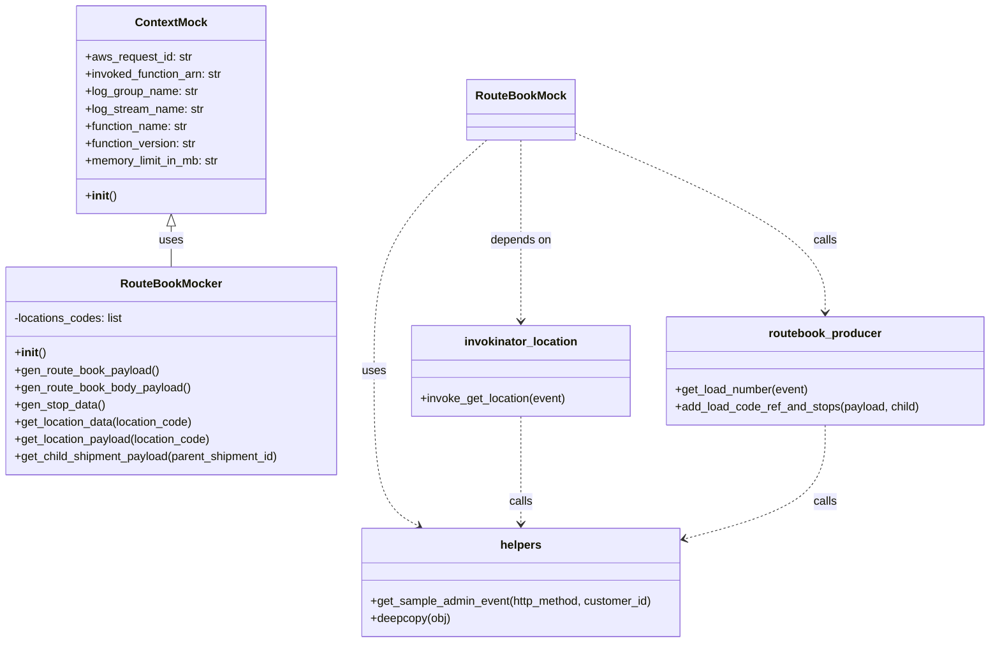
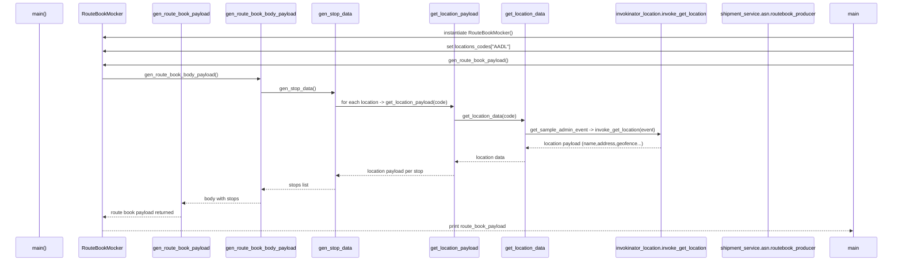
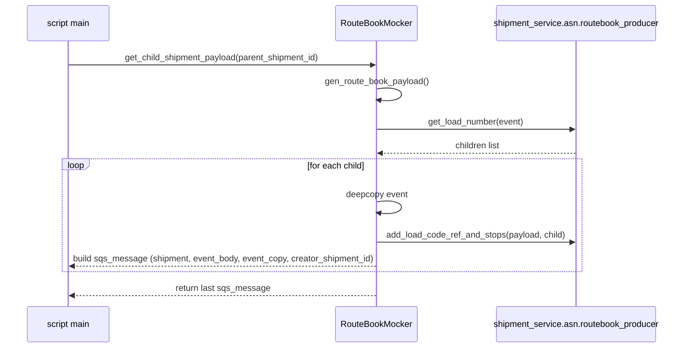

# Diagram: shipment_core/shipment_service/shipment_service/asn/tests/routebook_mock.py

> Auto-generated by Obscura crawlers

## Diagram 1

### SVG

<svg id="container" width="1378.375" xmlns="http://www.w3.org/2000/svg" class="classDiagram" height="890" viewBox="0 0 1378.375 890" role="graphics-document document" aria-roledescription="class"><g><defs><marker id="container_class-aggregationStart" class="marker aggregation class" refX="18" refY="7" markerWidth="190" markerHeight="240" orient="auto"><path d="M 18,7 L9,13 L1,7 L9,1 Z"></path></marker></defs><defs><marker id="container_class-aggregationEnd" class="marker aggregation class" refX="1" refY="7" markerWidth="20" markerHeight="28" orient="auto"><path d="M 18,7 L9,13 L1,7 L9,1 Z"></path></marker></defs><defs><marker id="container_class-extensionStart" class="marker extension class" refX="18" refY="7" markerWidth="190" markerHeight="240" orient="auto"><path d="M 1,7 L18,13 V 1 Z"></path></marker></defs><defs><marker id="container_class-extensionEnd" class="marker extension class" refX="1" refY="7" markerWidth="20" markerHeight="28" orient="auto"><path d="M 1,1 V 13 L18,7 Z"></path></marker></defs><defs><marker id="container_class-compositionStart" class="marker composition class" refX="18" refY="7" markerWidth="190" markerHeight="240" orient="auto"><path d="M 18,7 L9,13 L1,7 L9,1 Z"></path></marker></defs><defs><marker id="container_class-compositionEnd" class="marker composition class" refX="1" refY="7" markerWidth="20" markerHeight="28" orient="auto"><path d="M 18,7 L9,13 L1,7 L9,1 Z"></path></marker></defs><defs><marker id="container_class-dependencyStart" class="marker dependency class" refX="6" refY="7" markerWidth="190" markerHeight="240" orient="auto"><path d="M 5,7 L9,13 L1,7 L9,1 Z"></path></marker></defs><defs><marker id="container_class-dependencyEnd" class="marker dependency class" refX="13" refY="7" markerWidth="20" markerHeight="28" orient="auto"><path d="M 18,7 L9,13 L14,7 L9,1 Z"></path></marker></defs><defs><marker id="container_class-lollipopStart" class="marker lollipop class" refX="13" refY="7" markerWidth="190" markerHeight="240" orient="auto"><circle stroke="black" fill="transparent" cx="7" cy="7" r="6"></circle></marker></defs><defs><marker id="container_class-lollipopEnd" class="marker lollipop class" refX="1" refY="7" markerWidth="190" markerHeight="240" orient="auto"><circle stroke="black" fill="transparent" cx="7" cy="7" r="6"></circle></marker></defs><g class="root"><g class="clusters"></g><g class="edgePaths"><path d="M240.551,313.25L240.551,316.542C240.551,319.833,240.551,326.417,240.551,335.875C240.551,345.333,240.551,357.667,240.551,363.833L240.551,370" id="id_ContextMock_RouteBookMocker_1" class="edge-thickness-normal edge-pattern-solid relation" style=";;;" data-edge="true" data-et="edge" data-id="id_ContextMock_RouteBookMocker_1" data-points="W3sieCI6MjQwLjU1MDc4MTI1LCJ5IjoyOTZ9LHsieCI6MjQwLjU1MDc4MTI1LCJ5IjozMzN9LHsieCI6MjQwLjU1MDc4MTI1LCJ5IjozNzB9XQ==" marker-start="url(#container_class-extensionStart)"></path><path d="M727.914,194L727.914,217.167C727.914,240.333,727.914,286.667,727.914,328.5C727.914,370.333,727.914,407.667,727.914,426.333L727.914,445" id="id_RouteBookMock_invokinator_location_2" class="edge-thickness-normal edge-pattern-dashed relation" style=";;;" data-edge="true" data-et="edge" data-id="id_RouteBookMock_invokinator_location_2" data-points="W3sieCI6NzI3LjkxNDA2MjUsInkiOjE5NH0seyJ4Ijo3MjcuOTE0MDYyNSwieSI6MzMzfSx7IngiOjcyNy45MTQwNjI1LCJ5Ijo0NTF9XQ==" marker-end="url(#container_class-dependencyEnd)"></path><path d="M799.25,182.586L857.718,207.655C916.186,232.724,1033.122,282.862,1091.59,324.598C1150.059,366.333,1150.059,399.667,1150.059,416.333L1150.059,433" id="id_RouteBookMock_routebook_producer_3" class="edge-thickness-normal edge-pattern-dashed relation" style=";;;" data-edge="true" data-et="edge" data-id="id_RouteBookMock_routebook_producer_3" data-points="W3sieCI6Nzk5LjI1LCJ5IjoxODIuNTg2MjE4MDY0Mzg0Nzh9LHsieCI6MTE1MC4wNTg1OTM3NSwieSI6MzMzfSx7IngiOjExNTAuMDU4NTkzNzUsInkiOjQzOX1d" marker-end="url(#container_class-dependencyEnd)"></path><path d="M680.735,194L654.711,217.167C628.688,240.333,576.641,286.667,550.617,340C524.594,393.333,524.594,453.667,524.594,514C524.594,574.333,524.594,634.667,534.913,670.518C545.231,706.368,565.869,717.737,576.188,723.421L586.507,729.105" id="id_RouteBookMock_helpers_4" class="edge-thickness-normal edge-pattern-dashed relation" style=";;;" data-edge="true" data-et="edge" data-id="id_RouteBookMock_helpers_4" data-points="W3sieCI6NjgwLjczNDc2MzQ2Njg1MDgsInkiOjE5NH0seyJ4Ijo1MjQuNTkzNzUsInkiOjMzM30seyJ4Ijo1MjQuNTkzNzUsInkiOjUxNH0seyJ4Ijo1MjQuNTkzNzUsInkiOjY5NX0seyJ4Ijo1OTEuNzYyMDY3NTIyMzIxNCwieSI6NzMyfV0=" marker-end="url(#container_class-dependencyEnd)"></path><path d="M727.914,577L727.914,596.667C727.914,616.333,727.914,655.667,727.914,680.5C727.914,705.333,727.914,715.667,727.914,720.833L727.914,726" id="id_invokinator_location_helpers_5" class="edge-thickness-normal edge-pattern-dashed relation" style=";;;" data-edge="true" data-et="edge" data-id="id_invokinator_location_helpers_5" data-points="W3sieCI6NzI3LjkxNDA2MjUsInkiOjU3N30seyJ4Ijo3MjcuOTE0MDYyNSwieSI6Njk1fSx7IngiOjcyNy45MTQwNjI1LCJ5Ijo3MzJ9XQ==" marker-end="url(#container_class-dependencyEnd)"></path><path d="M1150.059,589L1150.059,606.667C1150.059,624.333,1150.059,659.667,1117.931,685.857C1085.803,712.048,1021.547,729.096,989.419,737.62L957.292,746.143" id="id_routebook_producer_helpers_6" class="edge-thickness-normal edge-pattern-dashed relation" style=";;;" data-edge="true" data-et="edge" data-id="id_routebook_producer_helpers_6" data-points="W3sieCI6MTE1MC4wNTg1OTM3NSwieSI6NTg5fSx7IngiOjExNTAuMDU4NTkzNzUsInkiOjY5NX0seyJ4Ijo5NTEuNDkyMTg3NSwieSI6NzQ3LjY4MjA0NTczMDA0Mjl9XQ==" marker-end="url(#container_class-dependencyEnd)"></path></g><g class="edgeLabels"><g class="edgeLabel" transform="translate(240.55078125, 333)"><g class="label" data-id="id_ContextMock_RouteBookMocker_1" transform="translate(-16.4921875, -12)"><foreignObject width="32.984375" height="24">

uses

</foreignObject></g></g><g class="edgeLabel" transform="translate(727.9140625, 333)"><g class="label" data-id="id_RouteBookMock_invokinator_location_2" transform="translate(-42.9453125, -12)"><foreignObject width="85.890625" height="24">

depends on

</foreignObject></g></g><g class="edgeLabel" transform="translate(1150.05859375, 333)"><g class="label" data-id="id_RouteBookMock_routebook_producer_3" transform="translate(-16.4453125, -12)"><foreignObject width="32.890625" height="24">

calls

</foreignObject></g></g><g class="edgeLabel" transform="translate(524.59375, 514)"><g class="label" data-id="id_RouteBookMock_helpers_4" transform="translate(-16.4921875, -12)"><foreignObject width="32.984375" height="24">

uses

</foreignObject></g></g><g class="edgeLabel" transform="translate(727.9140625, 695)"><g class="label" data-id="id_invokinator_location_helpers_5" transform="translate(-16.4453125, -12)"><foreignObject width="32.890625" height="24">

calls

</foreignObject></g></g><g class="edgeLabel" transform="translate(1150.05859375, 695)"><g class="label" data-id="id_routebook_producer_helpers_6" transform="translate(-16.4453125, -12)"><foreignObject width="32.890625" height="24">

calls

</foreignObject></g></g></g><g class="nodes"><g class="node default" id="classId-ContextMock-0" transform="translate(240.55078125, 152)"><g class="basic label-container"><path d="M-132.55078125 -144 L132.55078125 -144 L132.55078125 144 L-132.55078125 144" stroke="none" stroke-width="0" fill="#ECECFF" style=""></path><path d="M-132.55078125 -144 C-31.12303641987836 -144, 70.30470841024328 -144, 132.55078125 -144 M-132.55078125 -144 C-36.68160484104226 -144, 59.187571567915484 -144, 132.55078125 -144 M132.55078125 -144 C132.55078125 -73.72263310095624, 132.55078125 -3.4452662019124887, 132.55078125 144 M132.55078125 -144 C132.55078125 -36.21045882818885, 132.55078125 71.5790823436223, 132.55078125 144 M132.55078125 144 C28.200202154975813 144, -76.15037694004837 144, -132.55078125 144 M132.55078125 144 C64.29850440268521 144, -3.9537724446295783 144, -132.55078125 144 M-132.55078125 144 C-132.55078125 53.79703889105144, -132.55078125 -36.405922217897114, -132.55078125 -144 M-132.55078125 144 C-132.55078125 74.49527828681639, -132.55078125 4.990556573632773, -132.55078125 -144" stroke="#9370DB" stroke-width="1.3" fill="none" stroke-dasharray="0 0" style=""></path></g><g class="annotation-group text" transform="translate(0, -120)"></g><g class="label-group text" transform="translate(-47.3828125, -120)"><g class="label" style="font-weight: bolder" transform="translate(0,-12)"><foreignObject width="94.765625" height="24">

ContextMock

</foreignObject></g></g><g class="members-group text" transform="translate(-120.55078125, -72)"><g class="label" style="" transform="translate(0,-12)"><foreignObject width="148.484375" height="24">

+aws_request_id: str

</foreignObject></g><g class="label" style="" transform="translate(0,12)"><foreignObject width="193.71875" height="24">

+invoked_function_arn: str

</foreignObject></g><g class="label" style="" transform="translate(0,36)"><foreignObject width="156.984375" height="24">

+log_group_name: str

</foreignObject></g><g class="label" style="" transform="translate(0,60)"><foreignObject width="164.90625" height="24">

+log_stream_name: str

</foreignObject></g><g class="label" style="" transform="translate(0,84)"><foreignObject width="144.796875" height="24">

+function_name: str

</foreignObject></g><g class="label" style="" transform="translate(0,108)"><foreignObject width="156.96875" height="24">

+function_version: str

</foreignObject></g><g class="label" style="" transform="translate(0,132)"><foreignObject width="189.65625" height="24">

+memory_limit_in_mb: str

</foreignObject></g></g><g class="methods-group text" transform="translate(-120.55078125, 120)"><g class="label" style="" transform="translate(0,-12)"><foreignObject width="42.796875" height="24">

+<strong>init</strong>()

</foreignObject></g></g><g class="divider" style=""><path d="M-132.55078125 -96 C-75.95163199597954 -96, -19.352482741959093 -96, 132.55078125 -96 M-132.55078125 -96 C-57.46806738375834 -96, 17.614646482483323 -96, 132.55078125 -96" stroke="#9370DB" stroke-width="1.3" fill="none" stroke-dasharray="0 0" style=""></path></g><g class="divider" style=""><path d="M-132.55078125 96 C-39.242352010136 96, 54.066077229727995 96, 132.55078125 96 M-132.55078125 96 C-79.33721838552111 96, -26.123655521042238 96, 132.55078125 96" stroke="#9370DB" stroke-width="1.3" fill="none" stroke-dasharray="0 0" style=""></path></g></g><g class="node default" id="classId-RouteBookMocker-1" transform="translate(240.55078125, 514)"><g class="basic label-container"><path d="M-232.55078125 -144 L232.55078125 -144 L232.55078125 144 L-232.55078125 144" stroke="none" stroke-width="0" fill="#ECECFF" style=""></path><path d="M-232.55078125 -144 C-50.80380300865312 -144, 130.94317523269376 -144, 232.55078125 -144 M-232.55078125 -144 C-139.1539766056729 -144, -45.75717196134582 -144, 232.55078125 -144 M232.55078125 -144 C232.55078125 -58.713258265245, 232.55078125 26.573483469509995, 232.55078125 144 M232.55078125 -144 C232.55078125 -39.114238359563984, 232.55078125 65.77152328087203, 232.55078125 144 M232.55078125 144 C130.57026851975377 144, 28.589755789507507 144, -232.55078125 144 M232.55078125 144 C120.1846628128584 144, 7.818544375716812 144, -232.55078125 144 M-232.55078125 144 C-232.55078125 74.10624811714194, -232.55078125 4.21249623428389, -232.55078125 -144 M-232.55078125 144 C-232.55078125 46.096441733062576, -232.55078125 -51.80711653387485, -232.55078125 -144" stroke="#9370DB" stroke-width="1.3" fill="none" stroke-dasharray="0 0" style=""></path></g><g class="annotation-group text" transform="translate(0, -120)"></g><g class="label-group text" transform="translate(-66.8515625, -120)"><g class="label" style="font-weight: bolder" transform="translate(0,-12)"><foreignObject width="133.703125" height="24">

RouteBookMocker

</foreignObject></g></g><g class="members-group text" transform="translate(-220.55078125, -72)"><g class="label" style="" transform="translate(0,-12)"><foreignObject width="153.71875" height="24">

-locations_codes: list

</foreignObject></g></g><g class="methods-group text" transform="translate(-220.55078125, -24)"><g class="label" style="" transform="translate(0,-12)"><foreignObject width="42.796875" height="24">

+<strong>init</strong>()

</foreignObject></g><g class="label" style="" transform="translate(0,12)"><foreignObject width="201.890625" height="24">

+gen_route_book_payload()

</foreignObject></g><g class="label" style="" transform="translate(0,36)"><foreignObject width="246.03125" height="24">

+gen_route_book_body_payload()

</foreignObject></g><g class="label" style="" transform="translate(0,60)"><foreignObject width="125.015625" height="24">

+gen_stop_data()

</foreignObject></g><g class="label" style="" transform="translate(0,84)"><foreignObject width="250.984375" height="24">

+get_location_data(location_code)

</foreignObject></g><g class="label" style="" transform="translate(0,108)"><foreignObject width="276.40625" height="24">

+get_location_payload(location_code)

</foreignObject></g><g class="label" style="" transform="translate(0,132)"><foreignObject width="374.25" height="24">

+get_child_shipment_payload(parent_shipment_id)

</foreignObject></g></g><g class="divider" style=""><path d="M-232.55078125 -96 C-78.3003491677706 -96, 75.95008291445879 -96, 232.55078125 -96 M-232.55078125 -96 C-54.7514420966543 -96, 123.0478970566914 -96, 232.55078125 -96" stroke="#9370DB" stroke-width="1.3" fill="none" stroke-dasharray="0 0" style=""></path></g><g class="divider" style=""><path d="M-232.55078125 -48 C-137.58036731656705 -48, -42.6099533831341 -48, 232.55078125 -48 M-232.55078125 -48 C-126.3894681210313 -48, -20.2281549920626 -48, 232.55078125 -48" stroke="#9370DB" stroke-width="1.3" fill="none" stroke-dasharray="0 0" style=""></path></g></g><g class="node default" id="classId-invokinator_location-2" transform="translate(727.9140625, 514)"><g class="basic label-container"><path d="M-151.828125 -63 L151.828125 -63 L151.828125 63 L-151.828125 63" stroke="none" stroke-width="0" fill="#ECECFF" style=""></path><path d="M-151.828125 -63 C-58.78907269786065 -63, 34.24997960427871 -63, 151.828125 -63 M-151.828125 -63 C-44.67363191827637 -63, 62.48086116344726 -63, 151.828125 -63 M151.828125 -63 C151.828125 -22.36546255525012, 151.828125 18.269074889499763, 151.828125 63 M151.828125 -63 C151.828125 -15.450604071243767, 151.828125 32.09879185751247, 151.828125 63 M151.828125 63 C80.72348280506078 63, 9.618840610121566 63, -151.828125 63 M151.828125 63 C53.671041749386006 63, -44.48604150122799 63, -151.828125 63 M-151.828125 63 C-151.828125 23.222009362548754, -151.828125 -16.555981274902493, -151.828125 -63 M-151.828125 63 C-151.828125 13.456269347626666, -151.828125 -36.08746130474667, -151.828125 -63" stroke="#9370DB" stroke-width="1.3" fill="none" stroke-dasharray="0 0" style=""></path></g><g class="annotation-group text" transform="translate(0, -39)"></g><g class="label-group text" transform="translate(-75.25, -39)"><g class="label" style="font-weight: bolder" transform="translate(0,-12)"><foreignObject width="150.5" height="24">

invokinator_location

</foreignObject></g></g><g class="members-group text" transform="translate(-139.828125, 9)"></g><g class="methods-group text" transform="translate(-139.828125, 39)"><g class="label" style="" transform="translate(0,-12)"><foreignObject width="204.40625" height="24">

+invoke_get_location(event)

</foreignObject></g></g><g class="divider" style=""><path d="M-151.828125 -15 C-86.85746062595663 -15, -21.886796251913267 -15, 151.828125 -15 M-151.828125 -15 C-50.12042019159075 -15, 51.58728461681849 -15, 151.828125 -15" stroke="#9370DB" stroke-width="1.3" fill="none" stroke-dasharray="0 0" style=""></path></g><g class="divider" style=""><path d="M-151.828125 9 C-59.851392325656505 9, 32.12534034868699 9, 151.828125 9 M-151.828125 9 C-86.60218738885149 9, -21.37624977770298 9, 151.828125 9" stroke="#9370DB" stroke-width="1.3" fill="none" stroke-dasharray="0 0" style=""></path></g></g><g class="node default" id="classId-routebook_producer-3" transform="translate(1150.05859375, 514)"><g class="basic label-container"><path d="M-220.31640625 -75 L220.31640625 -75 L220.31640625 75 L-220.31640625 75" stroke="none" stroke-width="0" fill="#ECECFF" style=""></path><path d="M-220.31640625 -75 C-49.60868390877667 -75, 121.09903843244666 -75, 220.31640625 -75 M-220.31640625 -75 C-94.31693694385237 -75, 31.682532362295262 -75, 220.31640625 -75 M220.31640625 -75 C220.31640625 -26.80264328286296, 220.31640625 21.39471343427408, 220.31640625 75 M220.31640625 -75 C220.31640625 -31.60346349844314, 220.31640625 11.793073003113719, 220.31640625 75 M220.31640625 75 C78.05715336114608 75, -64.20209952770784 75, -220.31640625 75 M220.31640625 75 C131.82920635728144 75, 43.34200646456287 75, -220.31640625 75 M-220.31640625 75 C-220.31640625 34.28875340509144, -220.31640625 -6.422493189817118, -220.31640625 -75 M-220.31640625 75 C-220.31640625 19.004538196771648, -220.31640625 -36.990923606456704, -220.31640625 -75" stroke="#9370DB" stroke-width="1.3" fill="none" stroke-dasharray="0 0" style=""></path></g><g class="annotation-group text" transform="translate(0, -51)"></g><g class="label-group text" transform="translate(-75.3671875, -51)"><g class="label" style="font-weight: bolder" transform="translate(0,-12)"><foreignObject width="150.734375" height="24">

routebook_producer

</foreignObject></g></g><g class="members-group text" transform="translate(-208.31640625, -3)"></g><g class="methods-group text" transform="translate(-208.31640625, 27)"><g class="label" style="" transform="translate(0,-12)"><foreignObject width="186.59375" height="24">

+get_load_number(event)

</foreignObject></g><g class="label" style="" transform="translate(0,12)"><foreignObject width="341.265625" height="24">

+add_load_code_ref_and_stops(payload, child)

</foreignObject></g></g><g class="divider" style=""><path d="M-220.31640625 -27 C-71.43414821556894 -27, 77.44810981886212 -27, 220.31640625 -27 M-220.31640625 -27 C-91.34354665566471 -27, 37.62931293867058 -27, 220.31640625 -27" stroke="#9370DB" stroke-width="1.3" fill="none" stroke-dasharray="0 0" style=""></path></g><g class="divider" style=""><path d="M-220.31640625 -3 C-128.293459908837 -3, -36.270513567674016 -3, 220.31640625 -3 M-220.31640625 -3 C-78.40532028918494 -3, 63.505765671630115 -3, 220.31640625 -3" stroke="#9370DB" stroke-width="1.3" fill="none" stroke-dasharray="0 0" style=""></path></g></g><g class="node default" id="classId-helpers-4" transform="translate(727.9140625, 807)"><g class="basic label-container"><path d="M-223.578125 -75 L223.578125 -75 L223.578125 75 L-223.578125 75" stroke="none" stroke-width="0" fill="#ECECFF" style=""></path><path d="M-223.578125 -75 C-110.27444708499193 -75, 3.0292308300161324 -75, 223.578125 -75 M-223.578125 -75 C-122.68522466073114 -75, -21.792324321462274 -75, 223.578125 -75 M223.578125 -75 C223.578125 -33.09264937069997, 223.578125 8.814701258600067, 223.578125 75 M223.578125 -75 C223.578125 -24.300286039745195, 223.578125 26.39942792050961, 223.578125 75 M223.578125 75 C93.88824566787471 75, -35.80163366425057 75, -223.578125 75 M223.578125 75 C78.52472489606117 75, -66.52867520787765 75, -223.578125 75 M-223.578125 75 C-223.578125 40.98231739386637, -223.578125 6.964634787732734, -223.578125 -75 M-223.578125 75 C-223.578125 39.53336279127668, -223.578125 4.06672558255336, -223.578125 -75" stroke="#9370DB" stroke-width="1.3" fill="none" stroke-dasharray="0 0" style=""></path></g><g class="annotation-group text" transform="translate(0, -51)"></g><g class="label-group text" transform="translate(-27.578125, -51)"><g class="label" style="font-weight: bolder" transform="translate(0,-12)"><foreignObject width="55.15625" height="24">

helpers

</foreignObject></g></g><g class="members-group text" transform="translate(-211.578125, -3)"></g><g class="methods-group text" transform="translate(-211.578125, 27)"><g class="label" style="" transform="translate(0,-12)"><foreignObject width="395.578125" height="24">

+get_sample_admin_event(http_method, customer_id)

</foreignObject></g><g class="label" style="" transform="translate(0,12)"><foreignObject width="112.1875" height="24">

+deepcopy(obj)

</foreignObject></g></g><g class="divider" style=""><path d="M-223.578125 -27 C-52.21976865525056 -27, 119.13858768949888 -27, 223.578125 -27 M-223.578125 -27 C-128.16257367528206 -27, -32.74702235056412 -27, 223.578125 -27" stroke="#9370DB" stroke-width="1.3" fill="none" stroke-dasharray="0 0" style=""></path></g><g class="divider" style=""><path d="M-223.578125 -3 C-97.20367711767555 -3, 29.170770764648893 -3, 223.578125 -3 M-223.578125 -3 C-81.60134843874411 -3, 60.37542812251178 -3, 223.578125 -3" stroke="#9370DB" stroke-width="1.3" fill="none" stroke-dasharray="0 0" style=""></path></g></g><g class="node default" id="classId-RouteBookMock-5" transform="translate(727.9140625, 152)"><g class="basic label-container"><path d="M-71.3359375 -42 L71.3359375 -42 L71.3359375 42 L-71.3359375 42" stroke="none" stroke-width="0" fill="#ECECFF" style=""></path><path d="M-71.3359375 -42 C-35.365796582075696 -42, 0.6043443358486087 -42, 71.3359375 -42 M-71.3359375 -42 C-26.005083309412306 -42, 19.325770881175387 -42, 71.3359375 -42 M71.3359375 -42 C71.3359375 -15.96068544076238, 71.3359375 10.078629118475241, 71.3359375 42 M71.3359375 -42 C71.3359375 -13.787602322297229, 71.3359375 14.424795355405543, 71.3359375 42 M71.3359375 42 C23.922179728040305 42, -23.49157804391939 42, -71.3359375 42 M71.3359375 42 C27.464106844419547 42, -16.407723811160906 42, -71.3359375 42 M-71.3359375 42 C-71.3359375 19.412820691136222, -71.3359375 -3.174358617727556, -71.3359375 -42 M-71.3359375 42 C-71.3359375 22.431800250481317, -71.3359375 2.863600500962633, -71.3359375 -42" stroke="#9370DB" stroke-width="1.3" fill="none" stroke-dasharray="0 0" style=""></path></g><g class="annotation-group text" transform="translate(0, -18)"></g><g class="label-group text" transform="translate(-59.3359375, -18)"><g class="label" style="font-weight: bolder" transform="translate(0,-12)"><foreignObject width="118.671875" height="24">

RouteBookMock

</foreignObject></g></g><g class="members-group text" transform="translate(-59.3359375, 30)"></g><g class="methods-group text" transform="translate(-59.3359375, 60)"></g><g class="divider" style=""><path d="M-71.3359375 6 C-22.33322090173582 6, 26.669495696528358 6, 71.3359375 6 M-71.3359375 6 C-18.956886872239387 6, 33.422163755521225 6, 71.3359375 6" stroke="#9370DB" stroke-width="1.3" fill="none" stroke-dasharray="0 0" style=""></path></g><g class="divider" style=""><path d="M-71.3359375 24 C-19.638062955131325 24, 32.05981158973735 24, 71.3359375 24 M-71.3359375 24 C-30.414801350011516 24, 10.506334799976969 24, 71.3359375 24" stroke="#9370DB" stroke-width="1.3" fill="none" stroke-dasharray="0 0" style=""></path></g></g></g></g></g></svg>

## Diagram 2

### SVG

<svg id="container" width="3057" xmlns="http://www.w3.org/2000/svg" height="891" viewBox="-50 -10 3057 891" role="graphics-document document" aria-roledescription="sequence"><g><rect x="2807" y="805" fill="#eaeaea" stroke="#666" width="150" height="65" name="main" rx="3" ry="3" class="actor actor-bottom"></rect><text x="2882" y="837.5" dominant-baseline="central" alignment-baseline="central" class="actor actor-box" style="text-anchor: middle; font-size: 16px; font-weight: 400;"><tspan x="2882" dy="0">main</tspan></text></g><g><rect x="2427" y="805" fill="#eaeaea" stroke="#666" width="330" height="65" name="Producer" rx="3" ry="3" class="actor actor-bottom"></rect><text x="2592" y="837.5" dominant-baseline="central" alignment-baseline="central" class="actor actor-box" style="text-anchor: middle; font-size: 16px; font-weight: 400;"><tspan x="2592" dy="0">shipment_service.asn.routebook_producer</tspan></text></g><g><rect x="2059" y="805" fill="#eaeaea" stroke="#666" width="318" height="65" name="Invokable" rx="3" ry="3" class="actor actor-bottom"></rect><text x="2218" y="837.5" dominant-baseline="central" alignment-baseline="central" class="actor actor-box" style="text-anchor: middle; font-size: 16px; font-weight: 400;"><tspan x="2218" dy="0">invokinator_location.invoke_get_location</tspan></text></g><g><rect x="1667.5" y="805" fill="#eaeaea" stroke="#666" width="151" height="65" name="LocData" rx="3" ry="3" class="actor actor-bottom"></rect><text x="1743" y="837.5" dominant-baseline="central" alignment-baseline="central" class="actor actor-box" style="text-anchor: middle; font-size: 16px; font-weight: 400;"><tspan x="1743" dy="0">get_location_data</tspan></text></g><g><rect x="1409" y="805" fill="#eaeaea" stroke="#666" width="176" height="65" name="LocPayload" rx="3" ry="3" class="actor actor-bottom"></rect><text x="1497" y="837.5" dominant-baseline="central" alignment-baseline="central" class="actor actor-box" style="text-anchor: middle; font-size: 16px; font-weight: 400;"><tspan x="1497" dy="0">get_location_payload</tspan></text></g><g><rect x="1005" y="805" fill="#eaeaea" stroke="#666" width="150" height="65" name="Stops" rx="3" ry="3" class="actor actor-bottom"></rect><text x="1080" y="837.5" dominant-baseline="central" alignment-baseline="central" class="actor actor-box" style="text-anchor: middle; font-size: 16px; font-weight: 400;"><tspan x="1080" dy="0">gen_stop_data</tspan></text></g><g><rect x="707" y="805" fill="#eaeaea" stroke="#666" width="248" height="65" name="Body" rx="3" ry="3" class="actor actor-bottom"></rect><text x="831" y="837.5" dominant-baseline="central" alignment-baseline="central" class="actor actor-box" style="text-anchor: middle; font-size: 16px; font-weight: 400;"><tspan x="831" dy="0">gen_route_book_body_payload</tspan></text></g><g><rect x="453" y="805" fill="#eaeaea" stroke="#666" width="204" height="65" name="Payload" rx="3" ry="3" class="actor actor-bottom"></rect><text x="555" y="837.5" dominant-baseline="central" alignment-baseline="central" class="actor actor-box" style="text-anchor: middle; font-size: 16px; font-weight: 400;"><tspan x="555" dy="0">gen_route_book_payload</tspan></text></g><g><rect x="200" y="805" fill="#eaeaea" stroke="#666" width="152" height="65" name="Mocker" rx="3" ry="3" class="actor actor-bottom"></rect><text x="276" y="837.5" dominant-baseline="central" alignment-baseline="central" class="actor actor-box" style="text-anchor: middle; font-size: 16px; font-weight: 400;"><tspan x="276" dy="0">RouteBookMocker</tspan></text></g><g><rect x="0" y="805" fill="#eaeaea" stroke="#666" width="150" height="65" name="Main" rx="3" ry="3" class="actor actor-bottom"></rect><text x="75" y="837.5" dominant-baseline="central" alignment-baseline="central" class="actor actor-box" style="text-anchor: middle; font-size: 16px; font-weight: 400;"><tspan x="75" dy="0">main()</tspan></text></g><g><line id="actor9" x1="2882" y1="65" x2="2882" y2="805" class="actor-line 200" stroke-width="0.5px" stroke="#999" name="main"></line><g id="root-9"><rect x="2807" y="0" fill="#eaeaea" stroke="#666" width="150" height="65" name="main" rx="3" ry="3" class="actor actor-top"></rect><text x="2882" y="32.5" dominant-baseline="central" alignment-baseline="central" class="actor actor-box" style="text-anchor: middle; font-size: 16px; font-weight: 400;"><tspan x="2882" dy="0">main</tspan></text></g></g><g><line id="actor8" x1="2592" y1="65" x2="2592" y2="805" class="actor-line 200" stroke-width="0.5px" stroke="#999" name="Producer"></line><g id="root-8"><rect x="2427" y="0" fill="#eaeaea" stroke="#666" width="330" height="65" name="Producer" rx="3" ry="3" class="actor actor-top"></rect><text x="2592" y="32.5" dominant-baseline="central" alignment-baseline="central" class="actor actor-box" style="text-anchor: middle; font-size: 16px; font-weight: 400;"><tspan x="2592" dy="0">shipment_service.asn.routebook_producer</tspan></text></g></g><g><line id="actor7" x1="2218" y1="65" x2="2218" y2="805" class="actor-line 200" stroke-width="0.5px" stroke="#999" name="Invokable"></line><g id="root-7"><rect x="2059" y="0" fill="#eaeaea" stroke="#666" width="318" height="65" name="Invokable" rx="3" ry="3" class="actor actor-top"></rect><text x="2218" y="32.5" dominant-baseline="central" alignment-baseline="central" class="actor actor-box" style="text-anchor: middle; font-size: 16px; font-weight: 400;"><tspan x="2218" dy="0">invokinator_location.invoke_get_location</tspan></text></g></g><g><line id="actor6" x1="1743" y1="65" x2="1743" y2="805" class="actor-line 200" stroke-width="0.5px" stroke="#999" name="LocData"></line><g id="root-6"><rect x="1667.5" y="0" fill="#eaeaea" stroke="#666" width="151" height="65" name="LocData" rx="3" ry="3" class="actor actor-top"></rect><text x="1743" y="32.5" dominant-baseline="central" alignment-baseline="central" class="actor actor-box" style="text-anchor: middle; font-size: 16px; font-weight: 400;"><tspan x="1743" dy="0">get_location_data</tspan></text></g></g><g><line id="actor5" x1="1497" y1="65" x2="1497" y2="805" class="actor-line 200" stroke-width="0.5px" stroke="#999" name="LocPayload"></line><g id="root-5"><rect x="1409" y="0" fill="#eaeaea" stroke="#666" width="176" height="65" name="LocPayload" rx="3" ry="3" class="actor actor-top"></rect><text x="1497" y="32.5" dominant-baseline="central" alignment-baseline="central" class="actor actor-box" style="text-anchor: middle; font-size: 16px; font-weight: 400;"><tspan x="1497" dy="0">get_location_payload</tspan></text></g></g><g><line id="actor4" x1="1080" y1="65" x2="1080" y2="805" class="actor-line 200" stroke-width="0.5px" stroke="#999" name="Stops"></line><g id="root-4"><rect x="1005" y="0" fill="#eaeaea" stroke="#666" width="150" height="65" name="Stops" rx="3" ry="3" class="actor actor-top"></rect><text x="1080" y="32.5" dominant-baseline="central" alignment-baseline="central" class="actor actor-box" style="text-anchor: middle; font-size: 16px; font-weight: 400;"><tspan x="1080" dy="0">gen_stop_data</tspan></text></g></g><g><line id="actor3" x1="831" y1="65" x2="831" y2="805" class="actor-line 200" stroke-width="0.5px" stroke="#999" name="Body"></line><g id="root-3"><rect x="707" y="0" fill="#eaeaea" stroke="#666" width="248" height="65" name="Body" rx="3" ry="3" class="actor actor-top"></rect><text x="831" y="32.5" dominant-baseline="central" alignment-baseline="central" class="actor actor-box" style="text-anchor: middle; font-size: 16px; font-weight: 400;"><tspan x="831" dy="0">gen_route_book_body_payload</tspan></text></g></g><g><line id="actor2" x1="555" y1="65" x2="555" y2="805" class="actor-line 200" stroke-width="0.5px" stroke="#999" name="Payload"></line><g id="root-2"><rect x="453" y="0" fill="#eaeaea" stroke="#666" width="204" height="65" name="Payload" rx="3" ry="3" class="actor actor-top"></rect><text x="555" y="32.5" dominant-baseline="central" alignment-baseline="central" class="actor actor-box" style="text-anchor: middle; font-size: 16px; font-weight: 400;"><tspan x="555" dy="0">gen_route_book_payload</tspan></text></g></g><g><line id="actor1" x1="276" y1="65" x2="276" y2="805" class="actor-line 200" stroke-width="0.5px" stroke="#999" name="Mocker"></line><g id="root-1"><rect x="200" y="0" fill="#eaeaea" stroke="#666" width="152" height="65" name="Mocker" rx="3" ry="3" class="actor actor-top"></rect><text x="276" y="32.5" dominant-baseline="central" alignment-baseline="central" class="actor actor-box" style="text-anchor: middle; font-size: 16px; font-weight: 400;"><tspan x="276" dy="0">RouteBookMocker</tspan></text></g></g><g><line id="actor0" x1="75" y1="65" x2="75" y2="805" class="actor-line 200" stroke-width="0.5px" stroke="#999" name="Main"></line><g id="root-0"><rect x="0" y="0" fill="#eaeaea" stroke="#666" width="150" height="65" name="Main" rx="3" ry="3" class="actor actor-top"></rect><text x="75" y="32.5" dominant-baseline="central" alignment-baseline="central" class="actor actor-box" style="text-anchor: middle; font-size: 16px; font-weight: 400;"><tspan x="75" dy="0">main()</tspan></text></g></g><g></g><defs><symbol id="computer" width="24" height="24"><path transform="scale(.5)" d="M2 2v13h20v-13h-20zm18 11h-16v-9h16v9zm-10.228 6l.466-1h3.524l.467 1h-4.457zm14.228 3h-24l2-6h2.104l-1.33 4h18.45l-1.297-4h2.073l2 6zm-5-10h-14v-7h14v7z"></path></symbol></defs><defs><symbol id="database" fill-rule="evenodd" clip-rule="evenodd"><path transform="scale(.5)" d="M12.258.001l.256.004.255.005.253.008.251.01.249.012.247.015.246.016.242.019.241.02.239.023.236.024.233.027.231.028.229.031.225.032.223.034.22.036.217.038.214.04.211.041.208.043.205.045.201.046.198.048.194.05.191.051.187.053.183.054.18.056.175.057.172.059.168.06.163.061.16.063.155.064.15.066.074.033.073.033.071.034.07.034.069.035.068.035.067.035.066.035.064.036.064.036.062.036.06.036.06.037.058.037.058.037.055.038.055.038.053.038.052.038.051.039.05.039.048.039.047.039.045.04.044.04.043.04.041.04.04.041.039.041.037.041.036.041.034.041.033.042.032.042.03.042.029.042.027.042.026.043.024.043.023.043.021.043.02.043.018.044.017.043.015.044.013.044.012.044.011.045.009.044.007.045.006.045.004.045.002.045.001.045v17l-.001.045-.002.045-.004.045-.006.045-.007.045-.009.044-.011.045-.012.044-.013.044-.015.044-.017.043-.018.044-.02.043-.021.043-.023.043-.024.043-.026.043-.027.042-.029.042-.03.042-.032.042-.033.042-.034.041-.036.041-.037.041-.039.041-.04.041-.041.04-.043.04-.044.04-.045.04-.047.039-.048.039-.05.039-.051.039-.052.038-.053.038-.055.038-.055.038-.058.037-.058.037-.06.037-.06.036-.062.036-.064.036-.064.036-.066.035-.067.035-.068.035-.069.035-.07.034-.071.034-.073.033-.074.033-.15.066-.155.064-.16.063-.163.061-.168.06-.172.059-.175.057-.18.056-.183.054-.187.053-.191.051-.194.05-.198.048-.201.046-.205.045-.208.043-.211.041-.214.04-.217.038-.22.036-.223.034-.225.032-.229.031-.231.028-.233.027-.236.024-.239.023-.241.02-.242.019-.246.016-.247.015-.249.012-.251.01-.253.008-.255.005-.256.004-.258.001-.258-.001-.256-.004-.255-.005-.253-.008-.251-.01-.249-.012-.247-.015-.245-.016-.243-.019-.241-.02-.238-.023-.236-.024-.234-.027-.231-.028-.228-.031-.226-.032-.223-.034-.22-.036-.217-.038-.214-.04-.211-.041-.208-.043-.204-.045-.201-.046-.198-.048-.195-.05-.19-.051-.187-.053-.184-.054-.179-.056-.176-.057-.172-.059-.167-.06-.164-.061-.159-.063-.155-.064-.151-.066-.074-.033-.072-.033-.072-.034-.07-.034-.069-.035-.068-.035-.067-.035-.066-.035-.064-.036-.063-.036-.062-.036-.061-.036-.06-.037-.058-.037-.057-.037-.056-.038-.055-.038-.053-.038-.052-.038-.051-.039-.049-.039-.049-.039-.046-.039-.046-.04-.044-.04-.043-.04-.041-.04-.04-.041-.039-.041-.037-.041-.036-.041-.034-.041-.033-.042-.032-.042-.03-.042-.029-.042-.027-.042-.026-.043-.024-.043-.023-.043-.021-.043-.02-.043-.018-.044-.017-.043-.015-.044-.013-.044-.012-.044-.011-.045-.009-.044-.007-.045-.006-.045-.004-.045-.002-.045-.001-.045v-17l.001-.045.002-.045.004-.045.006-.045.007-.045.009-.044.011-.045.012-.044.013-.044.015-.044.017-.043.018-.044.02-.043.021-.043.023-.043.024-.043.026-.043.027-.042.029-.042.03-.042.032-.042.033-.042.034-.041.036-.041.037-.041.039-.041.04-.041.041-.04.043-.04.044-.04.046-.04.046-.039.049-.039.049-.039.051-.039.052-.038.053-.038.055-.038.056-.038.057-.037.058-.037.06-.037.061-.036.062-.036.063-.036.064-.036.066-.035.067-.035.068-.035.069-.035.07-.034.072-.034.072-.033.074-.033.151-.066.155-.064.159-.063.164-.061.167-.06.172-.059.176-.057.179-.056.184-.054.187-.053.19-.051.195-.05.198-.048.201-.046.204-.045.208-.043.211-.041.214-.04.217-.038.22-.036.223-.034.226-.032.228-.031.231-.028.234-.027.236-.024.238-.023.241-.02.243-.019.245-.016.247-.015.249-.012.251-.01.253-.008.255-.005.256-.004.258-.001.258.001zm-9.258 20.499v.01l.001.021.003.021.004.022.005.021.006.022.007.022.009.023.01.022.011.023.012.023.013.023.015.023.016.024.017.023.018.024.019.024.021.024.022.025.023.024.024.025.052.049.056.05.061.051.066.051.07.051.075.051.079.052.084.052.088.052.092.052.097.052.102.051.105.052.11.052.114.051.119.051.123.051.127.05.131.05.135.05.139.048.144.049.147.047.152.047.155.047.16.045.163.045.167.043.171.043.176.041.178.041.183.039.187.039.19.037.194.035.197.035.202.033.204.031.209.03.212.029.216.027.219.025.222.024.226.021.23.02.233.018.236.016.24.015.243.012.246.01.249.008.253.005.256.004.259.001.26-.001.257-.004.254-.005.25-.008.247-.011.244-.012.241-.014.237-.016.233-.018.231-.021.226-.021.224-.024.22-.026.216-.027.212-.028.21-.031.205-.031.202-.034.198-.034.194-.036.191-.037.187-.039.183-.04.179-.04.175-.042.172-.043.168-.044.163-.045.16-.046.155-.046.152-.047.148-.048.143-.049.139-.049.136-.05.131-.05.126-.05.123-.051.118-.052.114-.051.11-.052.106-.052.101-.052.096-.052.092-.052.088-.053.083-.051.079-.052.074-.052.07-.051.065-.051.06-.051.056-.05.051-.05.023-.024.023-.025.021-.024.02-.024.019-.024.018-.024.017-.024.015-.023.014-.024.013-.023.012-.023.01-.023.01-.022.008-.022.006-.022.006-.022.004-.022.004-.021.001-.021.001-.021v-4.127l-.077.055-.08.053-.083.054-.085.053-.087.052-.09.052-.093.051-.095.05-.097.05-.1.049-.102.049-.105.048-.106.047-.109.047-.111.046-.114.045-.115.045-.118.044-.12.043-.122.042-.124.042-.126.041-.128.04-.13.04-.132.038-.134.038-.135.037-.138.037-.139.035-.142.035-.143.034-.144.033-.147.032-.148.031-.15.03-.151.03-.153.029-.154.027-.156.027-.158.026-.159.025-.161.024-.162.023-.163.022-.165.021-.166.02-.167.019-.169.018-.169.017-.171.016-.173.015-.173.014-.175.013-.175.012-.177.011-.178.01-.179.008-.179.008-.181.006-.182.005-.182.004-.184.003-.184.002h-.37l-.184-.002-.184-.003-.182-.004-.182-.005-.181-.006-.179-.008-.179-.008-.178-.01-.176-.011-.176-.012-.175-.013-.173-.014-.172-.015-.171-.016-.17-.017-.169-.018-.167-.019-.166-.02-.165-.021-.163-.022-.162-.023-.161-.024-.159-.025-.157-.026-.156-.027-.155-.027-.153-.029-.151-.03-.15-.03-.148-.031-.146-.032-.145-.033-.143-.034-.141-.035-.14-.035-.137-.037-.136-.037-.134-.038-.132-.038-.13-.04-.128-.04-.126-.041-.124-.042-.122-.042-.12-.044-.117-.043-.116-.045-.113-.045-.112-.046-.109-.047-.106-.047-.105-.048-.102-.049-.1-.049-.097-.05-.095-.05-.093-.052-.09-.051-.087-.052-.085-.053-.083-.054-.08-.054-.077-.054v4.127zm0-5.654v.011l.001.021.003.021.004.021.005.022.006.022.007.022.009.022.01.022.011.023.012.023.013.023.015.024.016.023.017.024.018.024.019.024.021.024.022.024.023.025.024.024.052.05.056.05.061.05.066.051.07.051.075.052.079.051.084.052.088.052.092.052.097.052.102.052.105.052.11.051.114.051.119.052.123.05.127.051.131.05.135.049.139.049.144.048.147.048.152.047.155.046.16.045.163.045.167.044.171.042.176.042.178.04.183.04.187.038.19.037.194.036.197.034.202.033.204.032.209.03.212.028.216.027.219.025.222.024.226.022.23.02.233.018.236.016.24.014.243.012.246.01.249.008.253.006.256.003.259.001.26-.001.257-.003.254-.006.25-.008.247-.01.244-.012.241-.015.237-.016.233-.018.231-.02.226-.022.224-.024.22-.025.216-.027.212-.029.21-.03.205-.032.202-.033.198-.035.194-.036.191-.037.187-.039.183-.039.179-.041.175-.042.172-.043.168-.044.163-.045.16-.045.155-.047.152-.047.148-.048.143-.048.139-.05.136-.049.131-.05.126-.051.123-.051.118-.051.114-.052.11-.052.106-.052.101-.052.096-.052.092-.052.088-.052.083-.052.079-.052.074-.051.07-.052.065-.051.06-.05.056-.051.051-.049.023-.025.023-.024.021-.025.02-.024.019-.024.018-.024.017-.024.015-.023.014-.023.013-.024.012-.022.01-.023.01-.023.008-.022.006-.022.006-.022.004-.021.004-.022.001-.021.001-.021v-4.139l-.077.054-.08.054-.083.054-.085.052-.087.053-.09.051-.093.051-.095.051-.097.05-.1.049-.102.049-.105.048-.106.047-.109.047-.111.046-.114.045-.115.044-.118.044-.12.044-.122.042-.124.042-.126.041-.128.04-.13.039-.132.039-.134.038-.135.037-.138.036-.139.036-.142.035-.143.033-.144.033-.147.033-.148.031-.15.03-.151.03-.153.028-.154.028-.156.027-.158.026-.159.025-.161.024-.162.023-.163.022-.165.021-.166.02-.167.019-.169.018-.169.017-.171.016-.173.015-.173.014-.175.013-.175.012-.177.011-.178.009-.179.009-.179.007-.181.007-.182.005-.182.004-.184.003-.184.002h-.37l-.184-.002-.184-.003-.182-.004-.182-.005-.181-.007-.179-.007-.179-.009-.178-.009-.176-.011-.176-.012-.175-.013-.173-.014-.172-.015-.171-.016-.17-.017-.169-.018-.167-.019-.166-.02-.165-.021-.163-.022-.162-.023-.161-.024-.159-.025-.157-.026-.156-.027-.155-.028-.153-.028-.151-.03-.15-.03-.148-.031-.146-.033-.145-.033-.143-.033-.141-.035-.14-.036-.137-.036-.136-.037-.134-.038-.132-.039-.13-.039-.128-.04-.126-.041-.124-.042-.122-.043-.12-.043-.117-.044-.116-.044-.113-.046-.112-.046-.109-.046-.106-.047-.105-.048-.102-.049-.1-.049-.097-.05-.095-.051-.093-.051-.09-.051-.087-.053-.085-.052-.083-.054-.08-.054-.077-.054v4.139zm0-5.666v.011l.001.02.003.022.004.021.005.022.006.021.007.022.009.023.01.022.011.023.012.023.013.023.015.023.016.024.017.024.018.023.019.024.021.025.022.024.023.024.024.025.052.05.056.05.061.05.066.051.07.051.075.052.079.051.084.052.088.052.092.052.097.052.102.052.105.051.11.052.114.051.119.051.123.051.127.05.131.05.135.05.139.049.144.048.147.048.152.047.155.046.16.045.163.045.167.043.171.043.176.042.178.04.183.04.187.038.19.037.194.036.197.034.202.033.204.032.209.03.212.028.216.027.219.025.222.024.226.021.23.02.233.018.236.017.24.014.243.012.246.01.249.008.253.006.256.003.259.001.26-.001.257-.003.254-.006.25-.008.247-.01.244-.013.241-.014.237-.016.233-.018.231-.02.226-.022.224-.024.22-.025.216-.027.212-.029.21-.03.205-.032.202-.033.198-.035.194-.036.191-.037.187-.039.183-.039.179-.041.175-.042.172-.043.168-.044.163-.045.16-.045.155-.047.152-.047.148-.048.143-.049.139-.049.136-.049.131-.051.126-.05.123-.051.118-.052.114-.051.11-.052.106-.052.101-.052.096-.052.092-.052.088-.052.083-.052.079-.052.074-.052.07-.051.065-.051.06-.051.056-.05.051-.049.023-.025.023-.025.021-.024.02-.024.019-.024.018-.024.017-.024.015-.023.014-.024.013-.023.012-.023.01-.022.01-.023.008-.022.006-.022.006-.022.004-.022.004-.021.001-.021.001-.021v-4.153l-.077.054-.08.054-.083.053-.085.053-.087.053-.09.051-.093.051-.095.051-.097.05-.1.049-.102.048-.105.048-.106.048-.109.046-.111.046-.114.046-.115.044-.118.044-.12.043-.122.043-.124.042-.126.041-.128.04-.13.039-.132.039-.134.038-.135.037-.138.036-.139.036-.142.034-.143.034-.144.033-.147.032-.148.032-.15.03-.151.03-.153.028-.154.028-.156.027-.158.026-.159.024-.161.024-.162.023-.163.023-.165.021-.166.02-.167.019-.169.018-.169.017-.171.016-.173.015-.173.014-.175.013-.175.012-.177.01-.178.01-.179.009-.179.007-.181.006-.182.006-.182.004-.184.003-.184.001-.185.001-.185-.001-.184-.001-.184-.003-.182-.004-.182-.006-.181-.006-.179-.007-.179-.009-.178-.01-.176-.01-.176-.012-.175-.013-.173-.014-.172-.015-.171-.016-.17-.017-.169-.018-.167-.019-.166-.02-.165-.021-.163-.023-.162-.023-.161-.024-.159-.024-.157-.026-.156-.027-.155-.028-.153-.028-.151-.03-.15-.03-.148-.032-.146-.032-.145-.033-.143-.034-.141-.034-.14-.036-.137-.036-.136-.037-.134-.038-.132-.039-.13-.039-.128-.041-.126-.041-.124-.041-.122-.043-.12-.043-.117-.044-.116-.044-.113-.046-.112-.046-.109-.046-.106-.048-.105-.048-.102-.048-.1-.05-.097-.049-.095-.051-.093-.051-.09-.052-.087-.052-.085-.053-.083-.053-.08-.054-.077-.054v4.153zm8.74-8.179l-.257.004-.254.005-.25.008-.247.011-.244.012-.241.014-.237.016-.233.018-.231.021-.226.022-.224.023-.22.026-.216.027-.212.028-.21.031-.205.032-.202.033-.198.034-.194.036-.191.038-.187.038-.183.04-.179.041-.175.042-.172.043-.168.043-.163.045-.16.046-.155.046-.152.048-.148.048-.143.048-.139.049-.136.05-.131.05-.126.051-.123.051-.118.051-.114.052-.11.052-.106.052-.101.052-.096.052-.092.052-.088.052-.083.052-.079.052-.074.051-.07.052-.065.051-.06.05-.056.05-.051.05-.023.025-.023.024-.021.024-.02.025-.019.024-.018.024-.017.023-.015.024-.014.023-.013.023-.012.023-.01.023-.01.022-.008.022-.006.023-.006.021-.004.022-.004.021-.001.021-.001.021.001.021.001.021.004.021.004.022.006.021.006.023.008.022.01.022.01.023.012.023.013.023.014.023.015.024.017.023.018.024.019.024.02.025.021.024.023.024.023.025.051.05.056.05.06.05.065.051.07.052.074.051.079.052.083.052.088.052.092.052.096.052.101.052.106.052.11.052.114.052.118.051.123.051.126.051.131.05.136.05.139.049.143.048.148.048.152.048.155.046.16.046.163.045.168.043.172.043.175.042.179.041.183.04.187.038.191.038.194.036.198.034.202.033.205.032.21.031.212.028.216.027.22.026.224.023.226.022.231.021.233.018.237.016.241.014.244.012.247.011.25.008.254.005.257.004.26.001.26-.001.257-.004.254-.005.25-.008.247-.011.244-.012.241-.014.237-.016.233-.018.231-.021.226-.022.224-.023.22-.026.216-.027.212-.028.21-.031.205-.032.202-.033.198-.034.194-.036.191-.038.187-.038.183-.04.179-.041.175-.042.172-.043.168-.043.163-.045.16-.046.155-.046.152-.048.148-.048.143-.048.139-.049.136-.05.131-.05.126-.051.123-.051.118-.051.114-.052.11-.052.106-.052.101-.052.096-.052.092-.052.088-.052.083-.052.079-.052.074-.051.07-.052.065-.051.06-.05.056-.05.051-.05.023-.025.023-.024.021-.024.02-.025.019-.024.018-.024.017-.023.015-.024.014-.023.013-.023.012-.023.01-.023.01-.022.008-.022.006-.023.006-.021.004-.022.004-.021.001-.021.001-.021-.001-.021-.001-.021-.004-.021-.004-.022-.006-.021-.006-.023-.008-.022-.01-.022-.01-.023-.012-.023-.013-.023-.014-.023-.015-.024-.017-.023-.018-.024-.019-.024-.02-.025-.021-.024-.023-.024-.023-.025-.051-.05-.056-.05-.06-.05-.065-.051-.07-.052-.074-.051-.079-.052-.083-.052-.088-.052-.092-.052-.096-.052-.101-.052-.106-.052-.11-.052-.114-.052-.118-.051-.123-.051-.126-.051-.131-.05-.136-.05-.139-.049-.143-.048-.148-.048-.152-.048-.155-.046-.16-.046-.163-.045-.168-.043-.172-.043-.175-.042-.179-.041-.183-.04-.187-.038-.191-.038-.194-.036-.198-.034-.202-.033-.205-.032-.21-.031-.212-.028-.216-.027-.22-.026-.224-.023-.226-.022-.231-.021-.233-.018-.237-.016-.241-.014-.244-.012-.247-.011-.25-.008-.254-.005-.257-.004-.26-.001-.26.001z"></path></symbol></defs><defs><symbol id="clock" width="24" height="24"><path transform="scale(.5)" d="M12 2c5.514 0 10 4.486 10 10s-4.486 10-10 10-10-4.486-10-10 4.486-10 10-10zm0-2c-6.627 0-12 5.373-12 12s5.373 12 12 12 12-5.373 12-12-5.373-12-12-12zm5.848 12.459c.202.038.202.333.001.372-1.907.361-6.045 1.111-6.547 1.111-.719 0-1.301-.582-1.301-1.301 0-.512.77-5.447 1.125-7.445.034-.192.312-.181.343.014l.985 6.238 5.394 1.011z"></path></symbol></defs><defs><marker id="arrowhead" refX="7.9" refY="5" markerUnits="userSpaceOnUse" markerWidth="12" markerHeight="12" orient="auto-start-reverse"><path d="M -1 0 L 10 5 L 0 10 z"></path></marker></defs><defs><marker id="crosshead" markerWidth="15" markerHeight="8" orient="auto" refX="4" refY="4.5"><path fill="none" stroke="#000000" stroke-width="1pt" d="M 1,2 L 6,7 M 6,2 L 1,7" style="stroke-dasharray: 0, 0;"></path></marker></defs><defs><marker id="filled-head" refX="15.5" refY="7" markerWidth="20" markerHeight="28" orient="auto"><path d="M 18,7 L9,13 L14,7 L9,1 Z"></path></marker></defs><defs><marker id="sequencenumber" refX="15" refY="15" markerWidth="60" markerHeight="40" orient="auto"><circle cx="15" cy="15" r="6"></circle></marker></defs><text x="1581" y="80" text-anchor="middle" dominant-baseline="middle" alignment-baseline="middle" class="messageText" dy="1em" style="font-size: 16px; font-weight: 400;">instantiate RouteBookMocker()</text><line x1="2881" y1="113" x2="280" y2="113" class="messageLine0" stroke-width="2" stroke="none" marker-end="url(#arrowhead)" style="fill: none;"></line><text x="1581" y="128" text-anchor="middle" dominant-baseline="middle" alignment-baseline="middle" class="messageText" dy="1em" style="font-size: 16px; font-weight: 400;">set locations_codes["AADL"]</text><line x1="2881" y1="161" x2="280" y2="161" class="messageLine0" stroke-width="2" stroke="none" marker-end="url(#arrowhead)" style="fill: none;"></line><text x="1581" y="176" text-anchor="middle" dominant-baseline="middle" alignment-baseline="middle" class="messageText" dy="1em" style="font-size: 16px; font-weight: 400;">gen_route_book_payload()</text><line x1="2881" y1="209" x2="280" y2="209" class="messageLine0" stroke-width="2" stroke="none" marker-end="url(#arrowhead)" style="fill: none;"></line><text x="552" y="224" text-anchor="middle" dominant-baseline="middle" alignment-baseline="middle" class="messageText" dy="1em" style="font-size: 16px; font-weight: 400;">gen_route_book_body_payload()</text><line x1="277" y1="257" x2="827" y2="257" class="messageLine0" stroke-width="2" stroke="none" marker-end="url(#arrowhead)" style="fill: none;"></line><text x="954" y="272" text-anchor="middle" dominant-baseline="middle" alignment-baseline="middle" class="messageText" dy="1em" style="font-size: 16px; font-weight: 400;">gen_stop_data()</text><line x1="832" y1="305" x2="1076" y2="305" class="messageLine0" stroke-width="2" stroke="none" marker-end="url(#arrowhead)" style="fill: none;"></line><text x="1287" y="320" text-anchor="middle" dominant-baseline="middle" alignment-baseline="middle" class="messageText" dy="1em" style="font-size: 16px; font-weight: 400;">for each location -&gt; get_location_payload(code)</text><line x1="1081" y1="353" x2="1493" y2="353" class="messageLine0" stroke-width="2" stroke="none" marker-end="url(#arrowhead)" style="fill: none;"></line><text x="1619" y="368" text-anchor="middle" dominant-baseline="middle" alignment-baseline="middle" class="messageText" dy="1em" style="font-size: 16px; font-weight: 400;">get_location_data(code)</text><line x1="1498" y1="401" x2="1739" y2="401" class="messageLine0" stroke-width="2" stroke="none" marker-end="url(#arrowhead)" style="fill: none;"></line><text x="1979" y="416" text-anchor="middle" dominant-baseline="middle" alignment-baseline="middle" class="messageText" dy="1em" style="font-size: 16px; font-weight: 400;">get_sample_admin_event -&gt; invoke_get_location(event)</text><line x1="1744" y1="449" x2="2214" y2="449" class="messageLine0" stroke-width="2" stroke="none" marker-end="url(#arrowhead)" style="fill: none;"></line><text x="1982" y="464" text-anchor="middle" dominant-baseline="middle" alignment-baseline="middle" class="messageText" dy="1em" style="font-size: 16px; font-weight: 400;">location payload (name,address,geofence...)</text><line x1="2217" y1="497" x2="1747" y2="497" class="messageLine1" stroke-width="2" stroke="none" marker-end="url(#arrowhead)" style="stroke-dasharray: 3, 3; fill: none;"></line><text x="1622" y="512" text-anchor="middle" dominant-baseline="middle" alignment-baseline="middle" class="messageText" dy="1em" style="font-size: 16px; font-weight: 400;">location data</text><line x1="1742" y1="545" x2="1501" y2="545" class="messageLine1" stroke-width="2" stroke="none" marker-end="url(#arrowhead)" style="stroke-dasharray: 3, 3; fill: none;"></line><text x="1290" y="560" text-anchor="middle" dominant-baseline="middle" alignment-baseline="middle" class="messageText" dy="1em" style="font-size: 16px; font-weight: 400;">location payload per stop</text><line x1="1496" y1="593" x2="1084" y2="593" class="messageLine1" stroke-width="2" stroke="none" marker-end="url(#arrowhead)" style="stroke-dasharray: 3, 3; fill: none;"></line><text x="957" y="608" text-anchor="middle" dominant-baseline="middle" alignment-baseline="middle" class="messageText" dy="1em" style="font-size: 16px; font-weight: 400;">stops list</text><line x1="1079" y1="641" x2="835" y2="641" class="messageLine1" stroke-width="2" stroke="none" marker-end="url(#arrowhead)" style="stroke-dasharray: 3, 3; fill: none;"></line><text x="695" y="656" text-anchor="middle" dominant-baseline="middle" alignment-baseline="middle" class="messageText" dy="1em" style="font-size: 16px; font-weight: 400;">body with stops</text><line x1="830" y1="689" x2="559" y2="689" class="messageLine1" stroke-width="2" stroke="none" marker-end="url(#arrowhead)" style="stroke-dasharray: 3, 3; fill: none;"></line><text x="417" y="704" text-anchor="middle" dominant-baseline="middle" alignment-baseline="middle" class="messageText" dy="1em" style="font-size: 16px; font-weight: 400;">route book payload returned</text><line x1="554" y1="737" x2="280" y2="737" class="messageLine1" stroke-width="2" stroke="none" marker-end="url(#arrowhead)" style="stroke-dasharray: 3, 3; fill: none;"></line><text x="1578" y="752" text-anchor="middle" dominant-baseline="middle" alignment-baseline="middle" class="messageText" dy="1em" style="font-size: 16px; font-weight: 400;">print route_book_payload</text><line x1="277" y1="785" x2="2878" y2="785" class="messageLine1" stroke-width="2" stroke="none" marker-end="url(#arrowhead)" style="stroke-dasharray: 3, 3; fill: none;"></line></svg>

## Diagram 3

### SVG

<svg id="container" width="1374" xmlns="http://www.w3.org/2000/svg" height="670" viewBox="-50 -10 1374 670" role="graphics-document document" aria-roledescription="sequence"><g><rect x="944" y="584" fill="#eaeaea" stroke="#666" width="330" height="65" name="Producer" rx="3" ry="3" class="actor actor-bottom"></rect><text x="1109" y="616.5" dominant-baseline="central" alignment-baseline="central" class="actor actor-box" style="text-anchor: middle; font-size: 16px; font-weight: 400;"><tspan x="1109" dy="0">shipment_service.asn.routebook_producer</tspan></text></g><g><rect x="629" y="584" fill="#eaeaea" stroke="#666" width="152" height="65" name="Route" rx="3" ry="3" class="actor actor-bottom"></rect><text x="705" y="616.5" dominant-baseline="central" alignment-baseline="central" class="actor actor-box" style="text-anchor: middle; font-size: 16px; font-weight: 400;"><tspan x="705" dy="0">RouteBookMocker</tspan></text></g><g><rect x="0" y="584" fill="#eaeaea" stroke="#666" width="150" height="65" name="Caller" rx="3" ry="3" class="actor actor-bottom"></rect><text x="75" y="616.5" dominant-baseline="central" alignment-baseline="central" class="actor actor-box" style="text-anchor: middle; font-size: 16px; font-weight: 400;"><tspan x="75" dy="0">script main</tspan></text></g><g><line id="actor2" x1="1109" y1="65" x2="1109" y2="584" class="actor-line 200" stroke-width="0.5px" stroke="#999" name="Producer"></line><g id="root-2"><rect x="944" y="0" fill="#eaeaea" stroke="#666" width="330" height="65" name="Producer" rx="3" ry="3" class="actor actor-top"></rect><text x="1109" y="32.5" dominant-baseline="central" alignment-baseline="central" class="actor actor-box" style="text-anchor: middle; font-size: 16px; font-weight: 400;"><tspan x="1109" dy="0">shipment_service.asn.routebook_producer</tspan></text></g></g><g><line id="actor1" x1="705" y1="65" x2="705" y2="584" class="actor-line 200" stroke-width="0.5px" stroke="#999" name="Route"></line><g id="root-1"><rect x="629" y="0" fill="#eaeaea" stroke="#666" width="152" height="65" name="Route" rx="3" ry="3" class="actor actor-top"></rect><text x="705" y="32.5" dominant-baseline="central" alignment-baseline="central" class="actor actor-box" style="text-anchor: middle; font-size: 16px; font-weight: 400;"><tspan x="705" dy="0">RouteBookMocker</tspan></text></g></g><g><line id="actor0" x1="75" y1="65" x2="75" y2="584" class="actor-line 200" stroke-width="0.5px" stroke="#999" name="Caller"></line><g id="root-0"><rect x="0" y="0" fill="#eaeaea" stroke="#666" width="150" height="65" name="Caller" rx="3" ry="3" class="actor actor-top"></rect><text x="75" y="32.5" dominant-baseline="central" alignment-baseline="central" class="actor actor-box" style="text-anchor: middle; font-size: 16px; font-weight: 400;"><tspan x="75" dy="0">script main</tspan></text></g></g><g></g><defs><symbol id="computer" width="24" height="24"><path transform="scale(.5)" d="M2 2v13h20v-13h-20zm18 11h-16v-9h16v9zm-10.228 6l.466-1h3.524l.467 1h-4.457zm14.228 3h-24l2-6h2.104l-1.33 4h18.45l-1.297-4h2.073l2 6zm-5-10h-14v-7h14v7z"></path></symbol></defs><defs><symbol id="database" fill-rule="evenodd" clip-rule="evenodd"><path transform="scale(.5)" d="M12.258.001l.256.004.255.005.253.008.251.01.249.012.247.015.246.016.242.019.241.02.239.023.236.024.233.027.231.028.229.031.225.032.223.034.22.036.217.038.214.04.211.041.208.043.205.045.201.046.198.048.194.05.191.051.187.053.183.054.18.056.175.057.172.059.168.06.163.061.16.063.155.064.15.066.074.033.073.033.071.034.07.034.069.035.068.035.067.035.066.035.064.036.064.036.062.036.06.036.06.037.058.037.058.037.055.038.055.038.053.038.052.038.051.039.05.039.048.039.047.039.045.04.044.04.043.04.041.04.04.041.039.041.037.041.036.041.034.041.033.042.032.042.03.042.029.042.027.042.026.043.024.043.023.043.021.043.02.043.018.044.017.043.015.044.013.044.012.044.011.045.009.044.007.045.006.045.004.045.002.045.001.045v17l-.001.045-.002.045-.004.045-.006.045-.007.045-.009.044-.011.045-.012.044-.013.044-.015.044-.017.043-.018.044-.02.043-.021.043-.023.043-.024.043-.026.043-.027.042-.029.042-.03.042-.032.042-.033.042-.034.041-.036.041-.037.041-.039.041-.04.041-.041.04-.043.04-.044.04-.045.04-.047.039-.048.039-.05.039-.051.039-.052.038-.053.038-.055.038-.055.038-.058.037-.058.037-.06.037-.06.036-.062.036-.064.036-.064.036-.066.035-.067.035-.068.035-.069.035-.07.034-.071.034-.073.033-.074.033-.15.066-.155.064-.16.063-.163.061-.168.06-.172.059-.175.057-.18.056-.183.054-.187.053-.191.051-.194.05-.198.048-.201.046-.205.045-.208.043-.211.041-.214.04-.217.038-.22.036-.223.034-.225.032-.229.031-.231.028-.233.027-.236.024-.239.023-.241.02-.242.019-.246.016-.247.015-.249.012-.251.01-.253.008-.255.005-.256.004-.258.001-.258-.001-.256-.004-.255-.005-.253-.008-.251-.01-.249-.012-.247-.015-.245-.016-.243-.019-.241-.02-.238-.023-.236-.024-.234-.027-.231-.028-.228-.031-.226-.032-.223-.034-.22-.036-.217-.038-.214-.04-.211-.041-.208-.043-.204-.045-.201-.046-.198-.048-.195-.05-.19-.051-.187-.053-.184-.054-.179-.056-.176-.057-.172-.059-.167-.06-.164-.061-.159-.063-.155-.064-.151-.066-.074-.033-.072-.033-.072-.034-.07-.034-.069-.035-.068-.035-.067-.035-.066-.035-.064-.036-.063-.036-.062-.036-.061-.036-.06-.037-.058-.037-.057-.037-.056-.038-.055-.038-.053-.038-.052-.038-.051-.039-.049-.039-.049-.039-.046-.039-.046-.04-.044-.04-.043-.04-.041-.04-.04-.041-.039-.041-.037-.041-.036-.041-.034-.041-.033-.042-.032-.042-.03-.042-.029-.042-.027-.042-.026-.043-.024-.043-.023-.043-.021-.043-.02-.043-.018-.044-.017-.043-.015-.044-.013-.044-.012-.044-.011-.045-.009-.044-.007-.045-.006-.045-.004-.045-.002-.045-.001-.045v-17l.001-.045.002-.045.004-.045.006-.045.007-.045.009-.044.011-.045.012-.044.013-.044.015-.044.017-.043.018-.044.02-.043.021-.043.023-.043.024-.043.026-.043.027-.042.029-.042.03-.042.032-.042.033-.042.034-.041.036-.041.037-.041.039-.041.04-.041.041-.04.043-.04.044-.04.046-.04.046-.039.049-.039.049-.039.051-.039.052-.038.053-.038.055-.038.056-.038.057-.037.058-.037.06-.037.061-.036.062-.036.063-.036.064-.036.066-.035.067-.035.068-.035.069-.035.07-.034.072-.034.072-.033.074-.033.151-.066.155-.064.159-.063.164-.061.167-.06.172-.059.176-.057.179-.056.184-.054.187-.053.19-.051.195-.05.198-.048.201-.046.204-.045.208-.043.211-.041.214-.04.217-.038.22-.036.223-.034.226-.032.228-.031.231-.028.234-.027.236-.024.238-.023.241-.02.243-.019.245-.016.247-.015.249-.012.251-.01.253-.008.255-.005.256-.004.258-.001.258.001zm-9.258 20.499v.01l.001.021.003.021.004.022.005.021.006.022.007.022.009.023.01.022.011.023.012.023.013.023.015.023.016.024.017.023.018.024.019.024.021.024.022.025.023.024.024.025.052.049.056.05.061.051.066.051.07.051.075.051.079.052.084.052.088.052.092.052.097.052.102.051.105.052.11.052.114.051.119.051.123.051.127.05.131.05.135.05.139.048.144.049.147.047.152.047.155.047.16.045.163.045.167.043.171.043.176.041.178.041.183.039.187.039.19.037.194.035.197.035.202.033.204.031.209.03.212.029.216.027.219.025.222.024.226.021.23.02.233.018.236.016.24.015.243.012.246.01.249.008.253.005.256.004.259.001.26-.001.257-.004.254-.005.25-.008.247-.011.244-.012.241-.014.237-.016.233-.018.231-.021.226-.021.224-.024.22-.026.216-.027.212-.028.21-.031.205-.031.202-.034.198-.034.194-.036.191-.037.187-.039.183-.04.179-.04.175-.042.172-.043.168-.044.163-.045.16-.046.155-.046.152-.047.148-.048.143-.049.139-.049.136-.05.131-.05.126-.05.123-.051.118-.052.114-.051.11-.052.106-.052.101-.052.096-.052.092-.052.088-.053.083-.051.079-.052.074-.052.07-.051.065-.051.06-.051.056-.05.051-.05.023-.024.023-.025.021-.024.02-.024.019-.024.018-.024.017-.024.015-.023.014-.024.013-.023.012-.023.01-.023.01-.022.008-.022.006-.022.006-.022.004-.022.004-.021.001-.021.001-.021v-4.127l-.077.055-.08.053-.083.054-.085.053-.087.052-.09.052-.093.051-.095.05-.097.05-.1.049-.102.049-.105.048-.106.047-.109.047-.111.046-.114.045-.115.045-.118.044-.12.043-.122.042-.124.042-.126.041-.128.04-.13.04-.132.038-.134.038-.135.037-.138.037-.139.035-.142.035-.143.034-.144.033-.147.032-.148.031-.15.03-.151.03-.153.029-.154.027-.156.027-.158.026-.159.025-.161.024-.162.023-.163.022-.165.021-.166.02-.167.019-.169.018-.169.017-.171.016-.173.015-.173.014-.175.013-.175.012-.177.011-.178.01-.179.008-.179.008-.181.006-.182.005-.182.004-.184.003-.184.002h-.37l-.184-.002-.184-.003-.182-.004-.182-.005-.181-.006-.179-.008-.179-.008-.178-.01-.176-.011-.176-.012-.175-.013-.173-.014-.172-.015-.171-.016-.17-.017-.169-.018-.167-.019-.166-.02-.165-.021-.163-.022-.162-.023-.161-.024-.159-.025-.157-.026-.156-.027-.155-.027-.153-.029-.151-.03-.15-.03-.148-.031-.146-.032-.145-.033-.143-.034-.141-.035-.14-.035-.137-.037-.136-.037-.134-.038-.132-.038-.13-.04-.128-.04-.126-.041-.124-.042-.122-.042-.12-.044-.117-.043-.116-.045-.113-.045-.112-.046-.109-.047-.106-.047-.105-.048-.102-.049-.1-.049-.097-.05-.095-.05-.093-.052-.09-.051-.087-.052-.085-.053-.083-.054-.08-.054-.077-.054v4.127zm0-5.654v.011l.001.021.003.021.004.021.005.022.006.022.007.022.009.022.01.022.011.023.012.023.013.023.015.024.016.023.017.024.018.024.019.024.021.024.022.024.023.025.024.024.052.05.056.05.061.05.066.051.07.051.075.052.079.051.084.052.088.052.092.052.097.052.102.052.105.052.11.051.114.051.119.052.123.05.127.051.131.05.135.049.139.049.144.048.147.048.152.047.155.046.16.045.163.045.167.044.171.042.176.042.178.04.183.04.187.038.19.037.194.036.197.034.202.033.204.032.209.03.212.028.216.027.219.025.222.024.226.022.23.02.233.018.236.016.24.014.243.012.246.01.249.008.253.006.256.003.259.001.26-.001.257-.003.254-.006.25-.008.247-.01.244-.012.241-.015.237-.016.233-.018.231-.02.226-.022.224-.024.22-.025.216-.027.212-.029.21-.03.205-.032.202-.033.198-.035.194-.036.191-.037.187-.039.183-.039.179-.041.175-.042.172-.043.168-.044.163-.045.16-.045.155-.047.152-.047.148-.048.143-.048.139-.05.136-.049.131-.05.126-.051.123-.051.118-.051.114-.052.11-.052.106-.052.101-.052.096-.052.092-.052.088-.052.083-.052.079-.052.074-.051.07-.052.065-.051.06-.05.056-.051.051-.049.023-.025.023-.024.021-.025.02-.024.019-.024.018-.024.017-.024.015-.023.014-.023.013-.024.012-.022.01-.023.01-.023.008-.022.006-.022.006-.022.004-.021.004-.022.001-.021.001-.021v-4.139l-.077.054-.08.054-.083.054-.085.052-.087.053-.09.051-.093.051-.095.051-.097.05-.1.049-.102.049-.105.048-.106.047-.109.047-.111.046-.114.045-.115.044-.118.044-.12.044-.122.042-.124.042-.126.041-.128.04-.13.039-.132.039-.134.038-.135.037-.138.036-.139.036-.142.035-.143.033-.144.033-.147.033-.148.031-.15.03-.151.03-.153.028-.154.028-.156.027-.158.026-.159.025-.161.024-.162.023-.163.022-.165.021-.166.02-.167.019-.169.018-.169.017-.171.016-.173.015-.173.014-.175.013-.175.012-.177.011-.178.009-.179.009-.179.007-.181.007-.182.005-.182.004-.184.003-.184.002h-.37l-.184-.002-.184-.003-.182-.004-.182-.005-.181-.007-.179-.007-.179-.009-.178-.009-.176-.011-.176-.012-.175-.013-.173-.014-.172-.015-.171-.016-.17-.017-.169-.018-.167-.019-.166-.02-.165-.021-.163-.022-.162-.023-.161-.024-.159-.025-.157-.026-.156-.027-.155-.028-.153-.028-.151-.03-.15-.03-.148-.031-.146-.033-.145-.033-.143-.033-.141-.035-.14-.036-.137-.036-.136-.037-.134-.038-.132-.039-.13-.039-.128-.04-.126-.041-.124-.042-.122-.043-.12-.043-.117-.044-.116-.044-.113-.046-.112-.046-.109-.046-.106-.047-.105-.048-.102-.049-.1-.049-.097-.05-.095-.051-.093-.051-.09-.051-.087-.053-.085-.052-.083-.054-.08-.054-.077-.054v4.139zm0-5.666v.011l.001.02.003.022.004.021.005.022.006.021.007.022.009.023.01.022.011.023.012.023.013.023.015.023.016.024.017.024.018.023.019.024.021.025.022.024.023.024.024.025.052.05.056.05.061.05.066.051.07.051.075.052.079.051.084.052.088.052.092.052.097.052.102.052.105.051.11.052.114.051.119.051.123.051.127.05.131.05.135.05.139.049.144.048.147.048.152.047.155.046.16.045.163.045.167.043.171.043.176.042.178.04.183.04.187.038.19.037.194.036.197.034.202.033.204.032.209.03.212.028.216.027.219.025.222.024.226.021.23.02.233.018.236.017.24.014.243.012.246.01.249.008.253.006.256.003.259.001.26-.001.257-.003.254-.006.25-.008.247-.01.244-.013.241-.014.237-.016.233-.018.231-.02.226-.022.224-.024.22-.025.216-.027.212-.029.21-.03.205-.032.202-.033.198-.035.194-.036.191-.037.187-.039.183-.039.179-.041.175-.042.172-.043.168-.044.163-.045.16-.045.155-.047.152-.047.148-.048.143-.049.139-.049.136-.049.131-.051.126-.05.123-.051.118-.052.114-.051.11-.052.106-.052.101-.052.096-.052.092-.052.088-.052.083-.052.079-.052.074-.052.07-.051.065-.051.06-.051.056-.05.051-.049.023-.025.023-.025.021-.024.02-.024.019-.024.018-.024.017-.024.015-.023.014-.024.013-.023.012-.023.01-.022.01-.023.008-.022.006-.022.006-.022.004-.022.004-.021.001-.021.001-.021v-4.153l-.077.054-.08.054-.083.053-.085.053-.087.053-.09.051-.093.051-.095.051-.097.05-.1.049-.102.048-.105.048-.106.048-.109.046-.111.046-.114.046-.115.044-.118.044-.12.043-.122.043-.124.042-.126.041-.128.04-.13.039-.132.039-.134.038-.135.037-.138.036-.139.036-.142.034-.143.034-.144.033-.147.032-.148.032-.15.03-.151.03-.153.028-.154.028-.156.027-.158.026-.159.024-.161.024-.162.023-.163.023-.165.021-.166.02-.167.019-.169.018-.169.017-.171.016-.173.015-.173.014-.175.013-.175.012-.177.01-.178.01-.179.009-.179.007-.181.006-.182.006-.182.004-.184.003-.184.001-.185.001-.185-.001-.184-.001-.184-.003-.182-.004-.182-.006-.181-.006-.179-.007-.179-.009-.178-.01-.176-.01-.176-.012-.175-.013-.173-.014-.172-.015-.171-.016-.17-.017-.169-.018-.167-.019-.166-.02-.165-.021-.163-.023-.162-.023-.161-.024-.159-.024-.157-.026-.156-.027-.155-.028-.153-.028-.151-.03-.15-.03-.148-.032-.146-.032-.145-.033-.143-.034-.141-.034-.14-.036-.137-.036-.136-.037-.134-.038-.132-.039-.13-.039-.128-.041-.126-.041-.124-.041-.122-.043-.12-.043-.117-.044-.116-.044-.113-.046-.112-.046-.109-.046-.106-.048-.105-.048-.102-.048-.1-.05-.097-.049-.095-.051-.093-.051-.09-.052-.087-.052-.085-.053-.083-.053-.08-.054-.077-.054v4.153zm8.74-8.179l-.257.004-.254.005-.25.008-.247.011-.244.012-.241.014-.237.016-.233.018-.231.021-.226.022-.224.023-.22.026-.216.027-.212.028-.21.031-.205.032-.202.033-.198.034-.194.036-.191.038-.187.038-.183.04-.179.041-.175.042-.172.043-.168.043-.163.045-.16.046-.155.046-.152.048-.148.048-.143.048-.139.049-.136.05-.131.05-.126.051-.123.051-.118.051-.114.052-.11.052-.106.052-.101.052-.096.052-.092.052-.088.052-.083.052-.079.052-.074.051-.07.052-.065.051-.06.05-.056.05-.051.05-.023.025-.023.024-.021.024-.02.025-.019.024-.018.024-.017.023-.015.024-.014.023-.013.023-.012.023-.01.023-.01.022-.008.022-.006.023-.006.021-.004.022-.004.021-.001.021-.001.021.001.021.001.021.004.021.004.022.006.021.006.023.008.022.01.022.01.023.012.023.013.023.014.023.015.024.017.023.018.024.019.024.02.025.021.024.023.024.023.025.051.05.056.05.06.05.065.051.07.052.074.051.079.052.083.052.088.052.092.052.096.052.101.052.106.052.11.052.114.052.118.051.123.051.126.051.131.05.136.05.139.049.143.048.148.048.152.048.155.046.16.046.163.045.168.043.172.043.175.042.179.041.183.04.187.038.191.038.194.036.198.034.202.033.205.032.21.031.212.028.216.027.22.026.224.023.226.022.231.021.233.018.237.016.241.014.244.012.247.011.25.008.254.005.257.004.26.001.26-.001.257-.004.254-.005.25-.008.247-.011.244-.012.241-.014.237-.016.233-.018.231-.021.226-.022.224-.023.22-.026.216-.027.212-.028.21-.031.205-.032.202-.033.198-.034.194-.036.191-.038.187-.038.183-.04.179-.041.175-.042.172-.043.168-.043.163-.045.16-.046.155-.046.152-.048.148-.048.143-.048.139-.049.136-.05.131-.05.126-.051.123-.051.118-.051.114-.052.11-.052.106-.052.101-.052.096-.052.092-.052.088-.052.083-.052.079-.052.074-.051.07-.052.065-.051.06-.05.056-.05.051-.05.023-.025.023-.024.021-.024.02-.025.019-.024.018-.024.017-.023.015-.024.014-.023.013-.023.012-.023.01-.023.01-.022.008-.022.006-.023.006-.021.004-.022.004-.021.001-.021.001-.021-.001-.021-.001-.021-.004-.021-.004-.022-.006-.021-.006-.023-.008-.022-.01-.022-.01-.023-.012-.023-.013-.023-.014-.023-.015-.024-.017-.023-.018-.024-.019-.024-.02-.025-.021-.024-.023-.024-.023-.025-.051-.05-.056-.05-.06-.05-.065-.051-.07-.052-.074-.051-.079-.052-.083-.052-.088-.052-.092-.052-.096-.052-.101-.052-.106-.052-.11-.052-.114-.052-.118-.051-.123-.051-.126-.051-.131-.05-.136-.05-.139-.049-.143-.048-.148-.048-.152-.048-.155-.046-.16-.046-.163-.045-.168-.043-.172-.043-.175-.042-.179-.041-.183-.04-.187-.038-.191-.038-.194-.036-.198-.034-.202-.033-.205-.032-.21-.031-.212-.028-.216-.027-.22-.026-.224-.023-.226-.022-.231-.021-.233-.018-.237-.016-.241-.014-.244-.012-.247-.011-.25-.008-.254-.005-.257-.004-.26-.001-.26.001z"></path></symbol></defs><defs><symbol id="clock" width="24" height="24"><path transform="scale(.5)" d="M12 2c5.514 0 10 4.486 10 10s-4.486 10-10 10-10-4.486-10-10 4.486-10 10-10zm0-2c-6.627 0-12 5.373-12 12s5.373 12 12 12 12-5.373 12-12-5.373-12-12-12zm5.848 12.459c.202.038.202.333.001.372-1.907.361-6.045 1.111-6.547 1.111-.719 0-1.301-.582-1.301-1.301 0-.512.77-5.447 1.125-7.445.034-.192.312-.181.343.014l.985 6.238 5.394 1.011z"></path></symbol></defs><defs><marker id="arrowhead" refX="7.9" refY="5" markerUnits="userSpaceOnUse" markerWidth="12" markerHeight="12" orient="auto-start-reverse"><path d="M -1 0 L 10 5 L 0 10 z"></path></marker></defs><defs><marker id="crosshead" markerWidth="15" markerHeight="8" orient="auto" refX="4" refY="4.5"><path fill="none" stroke="#000000" stroke-width="1pt" d="M 1,2 L 6,7 M 6,2 L 1,7" style="stroke-dasharray: 0, 0;"></path></marker></defs><defs><marker id="filled-head" refX="15.5" refY="7" markerWidth="20" markerHeight="28" orient="auto"><path d="M 18,7 L9,13 L14,7 L9,1 Z"></path></marker></defs><defs><marker id="sequencenumber" refX="15" refY="15" markerWidth="60" markerHeight="40" orient="auto"><circle cx="15" cy="15" r="6"></circle></marker></defs><g><line x1="64" y1="297" x2="1120" y2="297" class="loopLine"></line><line x1="1120" y1="297" x2="1120" y2="516" class="loopLine"></line><line x1="64" y1="516" x2="1120" y2="516" class="loopLine"></line><line x1="64" y1="297" x2="64" y2="516" class="loopLine"></line><polygon points="64,297 114,297 114,310 105.6,317 64,317" class="labelBox"></polygon><text x="89" y="310" text-anchor="middle" dominant-baseline="middle" alignment-baseline="middle" class="labelText" style="font-size: 16px; font-weight: 400;">loop</text><text x="617" y="315" text-anchor="middle" class="loopText" style="font-size: 16px; font-weight: 400;"><tspan x="617">[for each child]</tspan></text></g><text x="389" y="80" text-anchor="middle" dominant-baseline="middle" alignment-baseline="middle" class="messageText" dy="1em" style="font-size: 16px; font-weight: 400;">get_child_shipment_payload(parent_shipment_id)</text><line x1="76" y1="113" x2="701" y2="113" class="messageLine0" stroke-width="2" stroke="none" marker-end="url(#arrowhead)" style="fill: none;"></line><text x="706" y="128" text-anchor="middle" dominant-baseline="middle" alignment-baseline="middle" class="messageText" dy="1em" style="font-size: 16px; font-weight: 400;">gen_route_book_payload()</text><path d="M 706,161 C 766,151 766,191 706,181" class="messageLine0" stroke-width="2" stroke="none" marker-end="url(#arrowhead)" style="fill: none;"></path><text x="906" y="206" text-anchor="middle" dominant-baseline="middle" alignment-baseline="middle" class="messageText" dy="1em" style="font-size: 16px; font-weight: 400;">get_load_number(event)</text><line x1="706" y1="239" x2="1105" y2="239" class="messageLine0" stroke-width="2" stroke="none" marker-end="url(#arrowhead)" style="fill: none;"></line><text x="909" y="254" text-anchor="middle" dominant-baseline="middle" alignment-baseline="middle" class="messageText" dy="1em" style="font-size: 16px; font-weight: 400;">children list</text><line x1="1108" y1="287" x2="709" y2="287" class="messageLine1" stroke-width="2" stroke="none" marker-end="url(#arrowhead)" style="stroke-dasharray: 3, 3; fill: none;"></line><text x="706" y="347" text-anchor="middle" dominant-baseline="middle" alignment-baseline="middle" class="messageText" dy="1em" style="font-size: 16px; font-weight: 400;">deepcopy event</text><path d="M 706,380 C 766,370 766,410 706,400" class="messageLine0" stroke-width="2" stroke="none" marker-end="url(#arrowhead)" style="fill: none;"></path><text x="906" y="425" text-anchor="middle" dominant-baseline="middle" alignment-baseline="middle" class="messageText" dy="1em" style="font-size: 16px; font-weight: 400;">add_load_code_ref_and_stops(payload, child)</text><line x1="706" y1="458" x2="1105" y2="458" class="messageLine0" stroke-width="2" stroke="none" marker-end="url(#arrowhead)" style="fill: none;"></line><text x="392" y="473" text-anchor="middle" dominant-baseline="middle" alignment-baseline="middle" class="messageText" dy="1em" style="font-size: 16px; font-weight: 400;">build sqs_message (shipment, event_body, event_copy, creator_shipment_id)</text><line x1="704" y1="506" x2="79" y2="506" class="messageLine1" stroke-width="2" stroke="none" marker-end="url(#arrowhead)" style="stroke-dasharray: 3, 3; fill: none;"></line><text x="392" y="531" text-anchor="middle" dominant-baseline="middle" alignment-baseline="middle" class="messageText" dy="1em" style="font-size: 16px; font-weight: 400;">return last sqs_message</text><line x1="704" y1="564" x2="79" y2="564" class="messageLine1" stroke-width="2" stroke="none" marker-end="url(#arrowhead)" style="stroke-dasharray: 3, 3; fill: none;"></line></svg>
