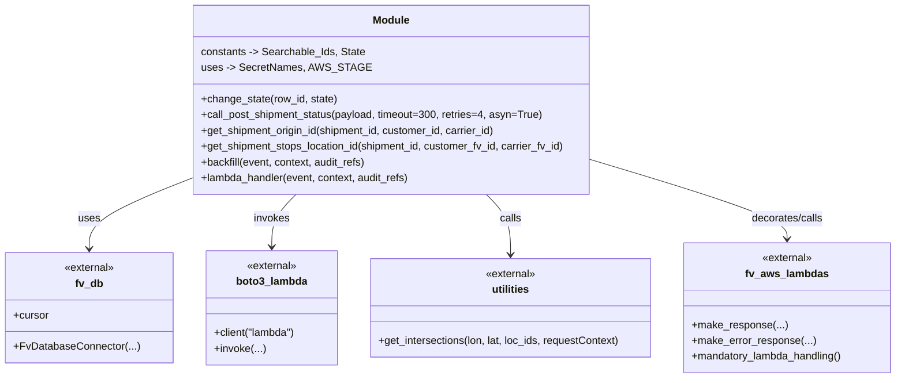

# Diagram: shipment_core/shipment_service/shipment_service/backfill/backfill_shipment.py


> Auto-generated by Obscura crawlers

## Diagram 1



> SVG rendering failed for this diagram.

## Diagram 2

```mermaid
flowchart TD
    Start([start])
    A[Receive event: dispatch_id, external_id, additional_data]
    B[Parse external_id -> carrier_id|customer_id|shipment_id]
    C[Clone additional_data -> backfill_body, locations, new_body]
    D[get_shipment_origin_id(shipment_id,customer,carrier)]
    E[get_shipment_stops_location_id(shipment_id,customer,carrier)]
    F[Iterate locations in reverse order\ncall utilities.get_intersections()]
    G{Match found containing origin?}
    H[arrive_at_origin_position set\ncollect locs_to_care_about]
    I[Compute locs_to_care_about_shifted\nand locations_left]
    J{len_locations_left > 200?}
    K[Sample locations to ~200 using pick_ratio]
    L[For each location in locations_left:\nprepare new_body.location & eventDetail\ncall_post_shipment_status(asyn flag)\nhandle non-2xx -> make_error_response]
    M[change_state(dispatch_id, State.COMPLETE)]
    N[change_state(dispatch_id, State.NO_ARRIVAL)]
    O[change_state(dispatch_id, State.FAILURE)]
    P[lambda_handler wrapper catches exceptions]

    Start --> A --> B --> C --> D --> E --> F --> G
    G -- yes --> H --> I --> J
    J -- yes --> K --> L
    J -- no --> L
    L --> M --> End([end])
    G -- no --> N --> End
    P -.-> O
    P --> Start
```

> SVG rendering failed for this diagram.
