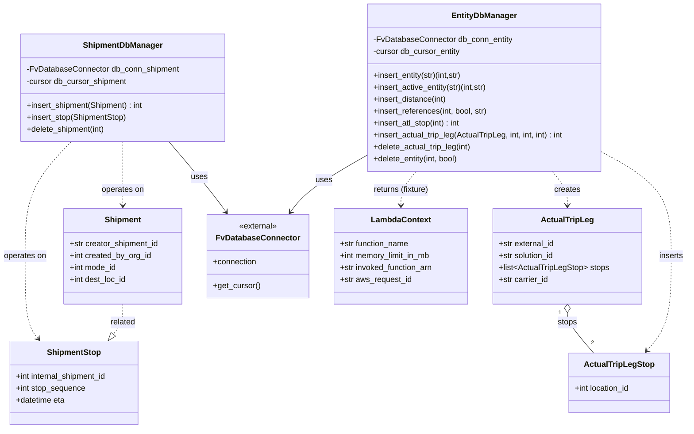

# Diagram: shipment_core/shipment_service/shipment_service/eta/conftest.py

> Auto-generated by Obscura crawlers

## Mermaid

### SVG

<svg id="container" width="1376.3125" xmlns="http://www.w3.org/2000/svg" class="classDiagram" height="860" viewBox="0 0 1376.3125 860" role="graphics-document document" aria-roledescription="class"><g><defs><marker id="container_class-aggregationStart" class="marker aggregation class" refX="18" refY="7" markerWidth="190" markerHeight="240" orient="auto"><path d="M 18,7 L9,13 L1,7 L9,1 Z"></path></marker></defs><defs><marker id="container_class-aggregationEnd" class="marker aggregation class" refX="1" refY="7" markerWidth="20" markerHeight="28" orient="auto"><path d="M 18,7 L9,13 L1,7 L9,1 Z"></path></marker></defs><defs><marker id="container_class-extensionStart" class="marker extension class" refX="18" refY="7" markerWidth="190" markerHeight="240" orient="auto"><path d="M 1,7 L18,13 V 1 Z"></path></marker></defs><defs><marker id="container_class-extensionEnd" class="marker extension class" refX="1" refY="7" markerWidth="20" markerHeight="28" orient="auto"><path d="M 1,1 V 13 L18,7 Z"></path></marker></defs><defs><marker id="container_class-compositionStart" class="marker composition class" refX="18" refY="7" markerWidth="190" markerHeight="240" orient="auto"><path d="M 18,7 L9,13 L1,7 L9,1 Z"></path></marker></defs><defs><marker id="container_class-compositionEnd" class="marker composition class" refX="1" refY="7" markerWidth="20" markerHeight="28" orient="auto"><path d="M 18,7 L9,13 L1,7 L9,1 Z"></path></marker></defs><defs><marker id="container_class-dependencyStart" class="marker dependency class" refX="6" refY="7" markerWidth="190" markerHeight="240" orient="auto"><path d="M 5,7 L9,13 L1,7 L9,1 Z"></path></marker></defs><defs><marker id="container_class-dependencyEnd" class="marker dependency class" refX="13" refY="7" markerWidth="20" markerHeight="28" orient="auto"><path d="M 18,7 L9,13 L14,7 L9,1 Z"></path></marker></defs><defs><marker id="container_class-lollipopStart" class="marker lollipop class" refX="13" refY="7" markerWidth="190" markerHeight="240" orient="auto"><circle stroke="black" fill="transparent" cx="7" cy="7" r="6"></circle></marker></defs><defs><marker id="container_class-lollipopEnd" class="marker lollipop class" refX="1" refY="7" markerWidth="190" markerHeight="240" orient="auto"><circle stroke="black" fill="transparent" cx="7" cy="7" r="6"></circle></marker></defs><g class="root"><g class="clusters"></g><g class="edgePaths"><path d="M1136.402,627.25L1136.402,630.542C1136.402,633.833,1136.402,640.417,1145.105,653.875C1153.808,667.333,1171.213,687.667,1179.916,697.833L1188.618,708" id="id_ActualTripLeg_ActualTripLegStop_1" class="edge-thickness-normal edge-pattern-solid relation" style=";;;" data-edge="true" data-et="edge" data-id="id_ActualTripLeg_ActualTripLegStop_1" data-points="W3sieCI6MTEzNi40MDIzNDM3NSwieSI6NjEwfSx7IngiOjExMzYuNDAyMzQzNzUsInkiOjY0N30seyJ4IjoxMTg4LjYxODQzMDM5NzcyNzMsInkiOjcwOH1d" marker-start="url(#container_class-aggregationStart)"></path><path d="M341.642,284L355.4,300.167C369.158,316.333,396.674,348.667,415.665,372.185C434.656,395.704,445.123,410.408,450.356,417.76L455.59,425.112" id="id_ShipmentDbManager_FvDatabaseConnector_2" class="edge-thickness-normal edge-pattern-solid relation" style=";;;" data-edge="true" data-et="edge" data-id="id_ShipmentDbManager_FvDatabaseConnector_2" data-points="W3sieCI6MzQxLjY0MjQxNjE1ODUzNjYsInkiOjI4NH0seyJ4Ijo0MjQuMTg5NDUzMTI1LCJ5IjozODF9LHsieCI6NDU5LjA2OTI4NDUzOTQ3MzcsInkiOjQzMH1d" marker-end="url(#container_class-dependencyEnd)"></path><path d="M731.756,313.365L712.212,324.638C692.669,335.91,653.581,358.455,628.749,377.082C603.918,395.71,593.341,410.419,588.053,417.774L582.764,425.129" id="id_EntityDbManager_FvDatabaseConnector_3" class="edge-thickness-normal edge-pattern-solid relation" style=";;;" data-edge="true" data-et="edge" data-id="id_EntityDbManager_FvDatabaseConnector_3" data-points="W3sieCI6NzMxLjc1NTg1OTM3NSwieSI6MzEzLjM2NTExODA5Mzc5MzZ9LHsieCI6NjE0LjQ5NDE0MDYyNSwieSI6MzgxfSx7IngiOjU3OS4yNjE3MTg3NSwieSI6NDMwfV0=" marker-end="url(#container_class-dependencyEnd)"></path><path d="M249.734,284L249.734,300.167C249.734,316.333,249.734,348.667,249.734,370C249.734,391.333,249.734,401.667,249.734,406.833L249.734,412" id="id_ShipmentDbManager_Shipment_4" class="edge-thickness-normal edge-pattern-dashed relation" style=";;;" data-edge="true" data-et="edge" data-id="id_ShipmentDbManager_Shipment_4" data-points="W3sieCI6MjQ5LjczNDM3NSwieSI6Mjg0fSx7IngiOjI0OS43MzQzNzUsInkiOjM4MX0seyJ4IjoyNDkuNzM0Mzc1LCJ5Ijo0MTh9XQ==" marker-end="url(#container_class-dependencyEnd)"></path><path d="M145.188,284L129.538,300.167C113.888,316.333,82.589,348.667,66.939,387C51.289,425.333,51.289,469.667,51.289,514C51.289,558.333,51.289,602.667,55.712,630.227C60.134,657.787,68.98,668.574,73.403,673.967L77.825,679.36" id="id_ShipmentDbManager_ShipmentStop_5" class="edge-thickness-normal edge-pattern-dashed relation" style=";;;" data-edge="true" data-et="edge" data-id="id_ShipmentDbManager_ShipmentStop_5" data-points="W3sieCI6MTQ1LjE4NzU3NjIxOTUxMjIsInkiOjI4NH0seyJ4Ijo1MS4yODkwNjI1LCJ5IjozODF9LHsieCI6NTEuMjg5MDYyNSwieSI6NTE0fSx7IngiOjUxLjI4OTA2MjUsInkiOjY0N30seyJ4Ijo4MS42Mjk4NzQ3NDE3MzU1MywieSI6Njg0fV0=" marker-end="url(#container_class-dependencyEnd)"></path><path d="M1106.353,344L1111.361,350.167C1116.369,356.333,1126.386,368.667,1131.394,380C1136.402,391.333,1136.402,401.667,1136.402,406.833L1136.402,412" id="id_EntityDbManager_ActualTripLeg_6" class="edge-thickness-normal edge-pattern-dashed relation" style=";;;" data-edge="true" data-et="edge" data-id="id_EntityDbManager_ActualTripLeg_6" data-points="W3sieCI6MTEwNi4zNTI4ODY4MTQwMjQ1LCJ5IjozNDR9LHsieCI6MTEzNi40MDIzNDM3NSwieSI6MzgxfSx7IngiOjExMzYuNDAyMzQzNzUsInkiOjQxOH1d" marker-end="url(#container_class-dependencyEnd)"></path><path d="M833.471,344L828.463,350.167C823.455,356.333,813.438,368.667,808.43,380C803.422,391.333,803.422,401.667,803.422,406.833L803.422,412" id="id_EntityDbManager_LambdaContext_7" class="edge-thickness-normal edge-pattern-dashed relation" style=";;;" data-edge="true" data-et="edge" data-id="id_EntityDbManager_LambdaContext_7" data-points="W3sieCI6ODMzLjQ3MTMzMTkzNTk3NTYsInkiOjM0NH0seyJ4Ijo4MDMuNDIxODc1LCJ5IjozODF9LHsieCI6ODAzLjQyMTg3NSwieSI6NDE4fV0=" marker-end="url(#container_class-dependencyEnd)"></path><path d="M249.734,610L249.734,616.167C249.734,622.333,249.734,634.667,246.501,644.777C243.267,654.887,236.799,662.774,233.565,666.718L230.332,670.661" id="id_Shipment_ShipmentStop_8" class="edge-thickness-normal edge-pattern-dashed relation" style=";;;" data-edge="true" data-et="edge" data-id="id_Shipment_ShipmentStop_8" data-points="W3sieCI6MjQ5LjczNDM3NSwieSI6NjEwfSx7IngiOjI0OS43MzQzNzUsInkiOjY0N30seyJ4IjoyMTkuMzkzNTYyNzU4MjY0NDcsInkiOjY4NH1d" marker-end="url(#container_class-extensionEnd)"></path><path d="M1208.068,306.665L1230.649,319.054C1253.23,331.443,1298.393,356.222,1320.974,390.778C1343.555,425.333,1343.555,469.667,1343.555,514C1343.555,558.333,1343.555,602.667,1335.502,634.24C1327.45,665.814,1311.345,684.628,1303.293,694.035L1295.24,703.442" id="id_EntityDbManager_ActualTripLegStop_9" class="edge-thickness-normal edge-pattern-dashed relation" style=";;;" data-edge="true" data-et="edge" data-id="id_EntityDbManager_ActualTripLegStop_9" data-points="W3sieCI6MTIwOC4wNjgzNTkzNzUsInkiOjMwNi42NjUwNjM2NDE4Mjg1fSx7IngiOjEzNDMuNTU0Njg3NSwieSI6MzgxfSx7IngiOjEzNDMuNTU0Njg3NSwieSI6NTE0fSx7IngiOjEzNDMuNTU0Njg3NSwieSI6NjQ3fSx7IngiOjEyOTEuMzM4NjAwODUyMjcyNywieSI6NzA4fV0=" marker-end="url(#container_class-dependencyEnd)"></path></g><g class="edgeLabels"><g class="edgeLabel" transform="translate(1136.40234375, 647)"><g class="label" data-id="id_ActualTripLeg_ActualTripLegStop_1" transform="translate(-19.6640625, -12)"><foreignObject width="39.328125" height="24">

stops

</foreignObject></g></g><g class="edgeLabel" transform="translate(402.40613, 355.40269)"><g class="label" data-id="id_ShipmentDbManager_FvDatabaseConnector_2" transform="translate(-16.4921875, -12)"><foreignObject width="32.984375" height="24">

uses

</foreignObject></g></g><g class="edgeLabel" transform="translate(646.98557, 362.25941)"><g class="label" data-id="id_EntityDbManager_FvDatabaseConnector_3" transform="translate(-16.4921875, -12)"><foreignObject width="32.984375" height="24">

uses

</foreignObject></g></g><g class="edgeLabel" transform="translate(249.734375, 381)"><g class="label" data-id="id_ShipmentDbManager_Shipment_4" transform="translate(-43.2890625, -12)"><foreignObject width="86.578125" height="24">

operates on

</foreignObject></g></g><g class="edgeLabel" transform="translate(51.2890625, 514)"><g class="label" data-id="id_ShipmentDbManager_ShipmentStop_5" transform="translate(-43.2890625, -12)"><foreignObject width="86.578125" height="24">

operates on

</foreignObject></g></g><g class="edgeLabel" transform="translate(1136.40234375, 381)"><g class="label" data-id="id_EntityDbManager_ActualTripLeg_6" transform="translate(-26.171875, -12)"><foreignObject width="52.34375" height="24">

creates

</foreignObject></g></g><g class="edgeLabel" transform="translate(803.421875, 381)"><g class="label" data-id="id_EntityDbManager_LambdaContext_7" transform="translate(-56.8046875, -12)"><foreignObject width="113.609375" height="24">

returns (fixture)

</foreignObject></g></g><g class="edgeLabel" transform="translate(249.734375, 647)"><g class="label" data-id="id_Shipment_ShipmentStop_8" transform="translate(-25.78125, -12)"><foreignObject width="51.5625" height="24">

related

</foreignObject></g></g><g class="edgeLabel" transform="translate(1343.5546875, 514)"><g class="label" data-id="id_EntityDbManager_ActualTripLegStop_9" transform="translate(-24.7578125, -12)"><foreignObject width="49.515625" height="24">

inserts

</foreignObject></g></g><g class="edgeTerminals" transform="translate(1121.402341875, 627.4999983928572)"><g class="inner" transform="translate(0, 0)"><foreignObject style="width: 9px; height: 12px;">
1
</foreignObject></g></g><g class="edgeTerminals" transform="translate(1183.6336028336564, 679.9511435913062)"><g class="inner" transform="translate(0, 0)"></g><foreignObject style="width: 9px; height: 12px;">
2
</foreignObject></g></g><g class="nodes"><g class="node default" id="classId-ActualTripLegStop-0" transform="translate(1239.978515625, 768)"><g class="basic label-container"><path d="M-102.18359375 -60 L102.18359375 -60 L102.18359375 60 L-102.18359375 60" stroke="none" stroke-width="0" fill="#ECECFF" style=""></path><path d="M-102.18359375 -60 C-60.48897667840276 -60, -18.794359606805514 -60, 102.18359375 -60 M-102.18359375 -60 C-26.213850438031812 -60, 49.755892873936375 -60, 102.18359375 -60 M102.18359375 -60 C102.18359375 -33.054017624119105, 102.18359375 -6.10803524823821, 102.18359375 60 M102.18359375 -60 C102.18359375 -28.880402082820037, 102.18359375 2.2391958343599256, 102.18359375 60 M102.18359375 60 C59.982494419635735 60, 17.78139508927147 60, -102.18359375 60 M102.18359375 60 C44.17345972569432 60, -13.836674298611356 60, -102.18359375 60 M-102.18359375 60 C-102.18359375 20.972775844805902, -102.18359375 -18.054448310388196, -102.18359375 -60 M-102.18359375 60 C-102.18359375 33.46015835606636, -102.18359375 6.920316712132717, -102.18359375 -60" stroke="#9370DB" stroke-width="1.3" fill="none" stroke-dasharray="0 0" style=""></path></g><g class="annotation-group text" transform="translate(0, -36)"></g><g class="label-group text" transform="translate(-66.9140625, -36)"><g class="label" style="font-weight: bolder" transform="translate(0,-12)"><foreignObject width="133.828125" height="24">

ActualTripLegStop

</foreignObject></g></g><g class="members-group text" transform="translate(-90.18359375, 12)"><g class="label" style="" transform="translate(0,-12)"><foreignObject width="113.453125" height="24">

+int location_id

</foreignObject></g></g><g class="methods-group text" transform="translate(-90.18359375, 60)"></g><g class="divider" style=""><path d="M-102.18359375 -12 C-31.056312683471518 -12, 40.070968383056965 -12, 102.18359375 -12 M-102.18359375 -12 C-58.33590202587553 -12, -14.488210301751053 -12, 102.18359375 -12" stroke="#9370DB" stroke-width="1.3" fill="none" stroke-dasharray="0 0" style=""></path></g><g class="divider" style=""><path d="M-102.18359375 36 C-42.48028209419995 36, 17.2230295616001 36, 102.18359375 36 M-102.18359375 36 C-46.03919224398349 36, 10.105209262033014 36, 102.18359375 36" stroke="#9370DB" stroke-width="1.3" fill="none" stroke-dasharray="0 0" style=""></path></g></g><g class="node default" id="classId-ActualTripLeg-1" transform="translate(1136.40234375, 514)"><g class="basic label-container"><path d="M-147.39453125 -96 L147.39453125 -96 L147.39453125 96 L-147.39453125 96" stroke="none" stroke-width="0" fill="#ECECFF" style=""></path><path d="M-147.39453125 -96 C-77.13686632437268 -96, -6.8792013987453515 -96, 147.39453125 -96 M-147.39453125 -96 C-62.37617399560082 -96, 22.642183258798354 -96, 147.39453125 -96 M147.39453125 -96 C147.39453125 -42.66033921387964, 147.39453125 10.679321572240724, 147.39453125 96 M147.39453125 -96 C147.39453125 -44.41950137052643, 147.39453125 7.160997258947134, 147.39453125 96 M147.39453125 96 C55.600520511728604 96, -36.19349022654279 96, -147.39453125 96 M147.39453125 96 C64.26010817849725 96, -18.874314893005504 96, -147.39453125 96 M-147.39453125 96 C-147.39453125 53.761110585651814, -147.39453125 11.522221171303627, -147.39453125 -96 M-147.39453125 96 C-147.39453125 54.84893974512286, -147.39453125 13.697879490245725, -147.39453125 -96" stroke="#9370DB" stroke-width="1.3" fill="none" stroke-dasharray="0 0" style=""></path></g><g class="annotation-group text" transform="translate(0, -72)"></g><g class="label-group text" transform="translate(-49.9453125, -72)"><g class="label" style="font-weight: bolder" transform="translate(0,-12)"><foreignObject width="99.890625" height="24">

ActualTripLeg

</foreignObject></g></g><g class="members-group text" transform="translate(-135.39453125, -24)"><g class="label" style="" transform="translate(0,-12)"><foreignObject width="113.4375" height="24">

+str external_id

</foreignObject></g><g class="label" style="" transform="translate(0,12)"><foreignObject width="113.875" height="24">

+str solution_id

</foreignObject></g><g class="label" style="" transform="translate(0,36)"><foreignObject width="220.84375" height="24">

+list&lt;ActualTripLegStop&gt; stops

</foreignObject></g><g class="label" style="" transform="translate(0,60)"><foreignObject width="100.734375" height="24">

+str carrier_id

</foreignObject></g></g><g class="methods-group text" transform="translate(-135.39453125, 96)"></g><g class="divider" style=""><path d="M-147.39453125 -48 C-78.17960775032944 -48, -8.964684250658877 -48, 147.39453125 -48 M-147.39453125 -48 C-83.6813024913028 -48, -19.96807373260559 -48, 147.39453125 -48" stroke="#9370DB" stroke-width="1.3" fill="none" stroke-dasharray="0 0" style=""></path></g><g class="divider" style=""><path d="M-147.39453125 72 C-57.0851395188848 72, 33.2242522122304 72, 147.39453125 72 M-147.39453125 72 C-64.6927508444631 72, 18.00902956107379 72, 147.39453125 72" stroke="#9370DB" stroke-width="1.3" fill="none" stroke-dasharray="0 0" style=""></path></g></g><g class="node default" id="classId-ShipmentStop-2" transform="translate(150.51171875, 768)"><g class="basic label-container"><path d="M-132.0390625 -84 L132.0390625 -84 L132.0390625 84 L-132.0390625 84" stroke="none" stroke-width="0" fill="#ECECFF" style=""></path><path d="M-132.0390625 -84 C-69.05328322672975 -84, -6.067503953459493 -84, 132.0390625 -84 M-132.0390625 -84 C-43.7769127484416 -84, 44.485237003116794 -84, 132.0390625 -84 M132.0390625 -84 C132.0390625 -22.22109407046039, 132.0390625 39.55781185907922, 132.0390625 84 M132.0390625 -84 C132.0390625 -23.24158011210381, 132.0390625 37.51683977579238, 132.0390625 84 M132.0390625 84 C42.81076284966852 84, -46.41753680066296 84, -132.0390625 84 M132.0390625 84 C77.3414687781231 84, 22.643875056246188 84, -132.0390625 84 M-132.0390625 84 C-132.0390625 32.034587606752595, -132.0390625 -19.93082478649481, -132.0390625 -84 M-132.0390625 84 C-132.0390625 29.602160918778658, -132.0390625 -24.795678162442684, -132.0390625 -84" stroke="#9370DB" stroke-width="1.3" fill="none" stroke-dasharray="0 0" style=""></path></g><g class="annotation-group text" transform="translate(0, -60)"></g><g class="label-group text" transform="translate(-52.078125, -60)"><g class="label" style="font-weight: bolder" transform="translate(0,-12)"><foreignObject width="104.15625" height="24">

ShipmentStop

</foreignObject></g></g><g class="members-group text" transform="translate(-120.0390625, -12)"><g class="label" style="" transform="translate(0,-12)"><foreignObject width="188" height="24">

+int internal_shipment_id

</foreignObject></g><g class="label" style="" transform="translate(0,12)"><foreignObject width="140.96875" height="24">

+int stop_sequence

</foreignObject></g><g class="label" style="" transform="translate(0,36)"><foreignObject width="100.5625" height="24">

+datetime eta

</foreignObject></g></g><g class="methods-group text" transform="translate(-120.0390625, 84)"></g><g class="divider" style=""><path d="M-132.0390625 -36 C-67.01656180221005 -36, -1.9940611044200978 -36, 132.0390625 -36 M-132.0390625 -36 C-40.53669677371791 -36, 50.96566895256419 -36, 132.0390625 -36" stroke="#9370DB" stroke-width="1.3" fill="none" stroke-dasharray="0 0" style=""></path></g><g class="divider" style=""><path d="M-132.0390625 60 C-43.23630392235194 60, 45.56645465529613 60, 132.0390625 60 M-132.0390625 60 C-27.643979967058655 60, 76.75110256588269 60, 132.0390625 60" stroke="#9370DB" stroke-width="1.3" fill="none" stroke-dasharray="0 0" style=""></path></g></g><g class="node default" id="classId-Shipment-3" transform="translate(249.734375, 514)"><g class="basic label-container"><path d="M-120.15625 -96 L120.15625 -96 L120.15625 96 L-120.15625 96" stroke="none" stroke-width="0" fill="#ECECFF" style=""></path><path d="M-120.15625 -96 C-67.72320802180062 -96, -15.290166043601246 -96, 120.15625 -96 M-120.15625 -96 C-26.707748810329292 -96, 66.74075237934142 -96, 120.15625 -96 M120.15625 -96 C120.15625 -29.752571229358296, 120.15625 36.49485754128341, 120.15625 96 M120.15625 -96 C120.15625 -43.359616576825125, 120.15625 9.28076684634975, 120.15625 96 M120.15625 96 C48.20976052001615 96, -23.736728959967706 96, -120.15625 96 M120.15625 96 C62.96240632522752 96, 5.7685626504550385 96, -120.15625 96 M-120.15625 96 C-120.15625 53.6207301849417, -120.15625 11.241460369883399, -120.15625 -96 M-120.15625 96 C-120.15625 29.32875785556459, -120.15625 -37.34248428887082, -120.15625 -96" stroke="#9370DB" stroke-width="1.3" fill="none" stroke-dasharray="0 0" style=""></path></g><g class="annotation-group text" transform="translate(0, -72)"></g><g class="label-group text" transform="translate(-35.109375, -72)"><g class="label" style="font-weight: bolder" transform="translate(0,-12)"><foreignObject width="70.21875" height="24">

Shipment

</foreignObject></g></g><g class="members-group text" transform="translate(-108.15625, -24)"><g class="label" style="" transform="translate(0,-12)"><foreignObject width="181.203125" height="24">

+str creator_shipment_id

</foreignObject></g><g class="label" style="" transform="translate(0,12)"><foreignObject width="165.546875" height="24">

+int created_by_org_id

</foreignObject></g><g class="label" style="" transform="translate(0,36)"><foreignObject width="95.3125" height="24">

+int mode_id

</foreignObject></g><g class="label" style="" transform="translate(0,60)"><foreignObject width="115.59375" height="24">

+int dest_loc_id

</foreignObject></g></g><g class="methods-group text" transform="translate(-108.15625, 96)"></g><g class="divider" style=""><path d="M-120.15625 -48 C-33.20307879978172 -48, 53.75009240043656 -48, 120.15625 -48 M-120.15625 -48 C-32.973914383164725 -48, 54.20842123367055 -48, 120.15625 -48" stroke="#9370DB" stroke-width="1.3" fill="none" stroke-dasharray="0 0" style=""></path></g><g class="divider" style=""><path d="M-120.15625 72 C-61.56286154103895 72, -2.969473082077897 72, 120.15625 72 M-120.15625 72 C-44.65949744152881 72, 30.837255116942373 72, 120.15625 72" stroke="#9370DB" stroke-width="1.3" fill="none" stroke-dasharray="0 0" style=""></path></g></g><g class="node default" id="classId-FvDatabaseConnector-4" transform="translate(518.86328125, 514)"><g class="basic label-container"><path d="M-98.97265625 -84 L98.97265625 -84 L98.97265625 84 L-98.97265625 84" stroke="none" stroke-width="0" fill="#ECECFF" style=""></path><path d="M-98.97265625 -84 C-41.171827008468895 -84, 16.62900223306221 -84, 98.97265625 -84 M-98.97265625 -84 C-46.980030726035935 -84, 5.012594797928131 -84, 98.97265625 -84 M98.97265625 -84 C98.97265625 -29.5060573744994, 98.97265625 24.987885251001202, 98.97265625 84 M98.97265625 -84 C98.97265625 -20.066814971035, 98.97265625 43.86637005793, 98.97265625 84 M98.97265625 84 C45.12665306005689 84, -8.719350129886223 84, -98.97265625 84 M98.97265625 84 C54.9704280224609 84, 10.968199794921802 84, -98.97265625 84 M-98.97265625 84 C-98.97265625 48.38535466286698, -98.97265625 12.77070932573396, -98.97265625 -84 M-98.97265625 84 C-98.97265625 30.210408508200445, -98.97265625 -23.57918298359911, -98.97265625 -84" stroke="#9370DB" stroke-width="1.3" fill="none" stroke-dasharray="0 0" style=""></path></g><g class="annotation-group text" transform="translate(-38.65625, -60)"><g class="label" style="" transform="translate(0,-12)"><foreignObject width="77.3125" height="24">

«external»

</foreignObject></g></g><g class="label-group text" transform="translate(-79.3046875, -36)"><g class="label" style="font-weight: bolder" transform="translate(0,-12)"><foreignObject width="158.609375" height="24">

FvDatabaseConnector

</foreignObject></g></g><g class="members-group text" transform="translate(-86.97265625, 12)"><g class="label" style="" transform="translate(0,-12)"><foreignObject width="88.796875" height="24">

+connection

</foreignObject></g></g><g class="methods-group text" transform="translate(-86.97265625, 60)"><g class="label" style="" transform="translate(0,-12)"><foreignObject width="94.640625" height="24">

+get_cursor()

</foreignObject></g></g><g class="divider" style=""><path d="M-98.97265625 -12 C-32.65964337302627 -12, 33.65336950394746 -12, 98.97265625 -12 M-98.97265625 -12 C-32.07116071294274 -12, 34.830334824114516 -12, 98.97265625 -12" stroke="#9370DB" stroke-width="1.3" fill="none" stroke-dasharray="0 0" style=""></path></g><g class="divider" style=""><path d="M-98.97265625 36 C-48.7317642185613 36, 1.509127812877395 36, 98.97265625 36 M-98.97265625 36 C-32.66270547356831 36, 33.64724530286338 36, 98.97265625 36" stroke="#9370DB" stroke-width="1.3" fill="none" stroke-dasharray="0 0" style=""></path></g></g><g class="node default" id="classId-ShipmentDbManager-5" transform="translate(249.734375, 176)"><g class="basic label-container"><path d="M-203.40234375 -108 L203.40234375 -108 L203.40234375 108 L-203.40234375 108" stroke="none" stroke-width="0" fill="#ECECFF" style=""></path><path d="M-203.40234375 -108 C-98.49013462078167 -108, 6.422074508436651 -108, 203.40234375 -108 M-203.40234375 -108 C-101.668791173062 -108, 0.06476140387599116 -108, 203.40234375 -108 M203.40234375 -108 C203.40234375 -32.37731550597945, 203.40234375 43.24536898804109, 203.40234375 108 M203.40234375 -108 C203.40234375 -21.963284817923594, 203.40234375 64.07343036415281, 203.40234375 108 M203.40234375 108 C95.01888555734686 108, -13.364572635306274 108, -203.40234375 108 M203.40234375 108 C98.7109073089316 108, -5.980529132136809 108, -203.40234375 108 M-203.40234375 108 C-203.40234375 41.380772658835554, -203.40234375 -25.238454682328893, -203.40234375 -108 M-203.40234375 108 C-203.40234375 28.594502492118806, -203.40234375 -50.81099501576239, -203.40234375 -108" stroke="#9370DB" stroke-width="1.3" fill="none" stroke-dasharray="0 0" style=""></path></g><g class="annotation-group text" transform="translate(0, -84)"></g><g class="label-group text" transform="translate(-76.5390625, -84)"><g class="label" style="font-weight: bolder" transform="translate(0,-12)"><foreignObject width="153.078125" height="24">

ShipmentDbManager

</foreignObject></g></g><g class="members-group text" transform="translate(-191.40234375, -36)"><g class="label" style="" transform="translate(0,-12)"><foreignObject width="306.265625" height="24">

-FvDatabaseConnector db_conn_shipment

</foreignObject></g><g class="label" style="" transform="translate(0,12)"><foreignObject width="204.390625" height="24">

-cursor db_cursor_shipment

</foreignObject></g></g><g class="methods-group text" transform="translate(-191.40234375, 36)"><g class="label" style="" transform="translate(0,-12)"><foreignObject width="238.84375" height="24">

+insert_shipment(Shipment) : int

</foreignObject></g><g class="label" style="" transform="translate(0,12)"><foreignObject width="203.375" height="24">

+insert_stop(ShipmentStop)

</foreignObject></g><g class="label" style="" transform="translate(0,36)"><foreignObject width="160.34375" height="24">

+delete_shipment(int)

</foreignObject></g></g><g class="divider" style=""><path d="M-203.40234375 -60 C-104.29080660641634 -60, -5.1792694628326785 -60, 203.40234375 -60 M-203.40234375 -60 C-93.9651712148721 -60, 15.4720013202558 -60, 203.40234375 -60" stroke="#9370DB" stroke-width="1.3" fill="none" stroke-dasharray="0 0" style=""></path></g><g class="divider" style=""><path d="M-203.40234375 12 C-74.7373346495232 12, 53.92767445095359 12, 203.40234375 12 M-203.40234375 12 C-67.82342529818385 12, 67.7554931536323 12, 203.40234375 12" stroke="#9370DB" stroke-width="1.3" fill="none" stroke-dasharray="0 0" style=""></path></g></g><g class="node default" id="classId-EntityDbManager-6" transform="translate(969.912109375, 176)"><g class="basic label-container"><path d="M-238.15625 -168 L238.15625 -168 L238.15625 168 L-238.15625 168" stroke="none" stroke-width="0" fill="#ECECFF" style=""></path><path d="M-238.15625 -168 C-81.75510068792042 -168, 74.64604862415916 -168, 238.15625 -168 M-238.15625 -168 C-53.2958013921446 -168, 131.5646472157108 -168, 238.15625 -168 M238.15625 -168 C238.15625 -81.63284160781717, 238.15625 4.73431678436566, 238.15625 168 M238.15625 -168 C238.15625 -76.77447539264055, 238.15625 14.451049214718893, 238.15625 168 M238.15625 168 C91.84758177536412 168, -54.46108644927176 168, -238.15625 168 M238.15625 168 C72.61068832400943 168, -92.93487335198114 168, -238.15625 168 M-238.15625 168 C-238.15625 68.59267782648789, -238.15625 -30.814644347024227, -238.15625 -168 M-238.15625 168 C-238.15625 82.61971433809073, -238.15625 -2.7605713238185388, -238.15625 -168" stroke="#9370DB" stroke-width="1.3" fill="none" stroke-dasharray="0 0" style=""></path></g><g class="annotation-group text" transform="translate(0, -144)"></g><g class="label-group text" transform="translate(-62.71875, -144)"><g class="label" style="font-weight: bolder" transform="translate(0,-12)"><foreignObject width="125.4375" height="24">

EntityDbManager

</foreignObject></g></g><g class="members-group text" transform="translate(-226.15625, -96)"><g class="label" style="" transform="translate(0,-12)"><foreignObject width="279.453125" height="24">

-FvDatabaseConnector db_conn_entity

</foreignObject></g><g class="label" style="" transform="translate(0,12)"><foreignObject width="177.578125" height="24">

-cursor db_cursor_entity

</foreignObject></g></g><g class="methods-group text" transform="translate(-226.15625, -24)"><g class="label" style="" transform="translate(0,-12)"><foreignObject width="183.1875" height="24">

+insert_entity(str)(int,str)

</foreignObject></g><g class="label" style="" transform="translate(0,12)"><foreignObject width="234.046875" height="24">

+insert_active_entity(str)(int,str)

</foreignObject></g><g class="label" style="" transform="translate(0,36)"><foreignObject width="149.40625" height="24">

+insert_distance(int)

</foreignObject></g><g class="label" style="" transform="translate(0,60)"><foreignObject width="232.609375" height="24">

+insert_references(int, bool, str)

</foreignObject></g><g class="label" style="" transform="translate(0,84)"><foreignObject width="179.21875" height="24">

+insert_atl_stop(int) : int

</foreignObject></g><g class="label" style="" transform="translate(0,108)"><foreignObject width="389.59375" height="24">

+insert_actual_trip_leg(ActualTripLeg, int, int, int) : int

</foreignObject></g><g class="label" style="" transform="translate(0,132)"><foreignObject width="199.703125" height="24">

+delete_actual_trip_leg(int)

</foreignObject></g><g class="label" style="" transform="translate(0,156)"><foreignObject width="174.546875" height="24">

+delete_entity(int, bool)

</foreignObject></g></g><g class="divider" style=""><path d="M-238.15625 -120 C-71.49315672896833 -120, 95.16993654206334 -120, 238.15625 -120 M-238.15625 -120 C-80.30481816342589 -120, 77.54661367314822 -120, 238.15625 -120" stroke="#9370DB" stroke-width="1.3" fill="none" stroke-dasharray="0 0" style=""></path></g><g class="divider" style=""><path d="M-238.15625 -48 C-141.24278809803116 -48, -44.32932619606234 -48, 238.15625 -48 M-238.15625 -48 C-81.23088496391082 -48, 75.69448007217835 -48, 238.15625 -48" stroke="#9370DB" stroke-width="1.3" fill="none" stroke-dasharray="0 0" style=""></path></g></g><g class="node default" id="classId-LambdaContext-7" transform="translate(803.421875, 514)"><g class="basic label-container"><path d="M-135.5859375 -96 L135.5859375 -96 L135.5859375 96 L-135.5859375 96" stroke="none" stroke-width="0" fill="#ECECFF" style=""></path><path d="M-135.5859375 -96 C-39.615750397961364 -96, 56.35443670407727 -96, 135.5859375 -96 M-135.5859375 -96 C-35.886738266884905 -96, 63.81246096623019 -96, 135.5859375 -96 M135.5859375 -96 C135.5859375 -24.32042490701336, 135.5859375 47.35915018597328, 135.5859375 96 M135.5859375 -96 C135.5859375 -34.78934184686119, 135.5859375 26.421316306277618, 135.5859375 96 M135.5859375 96 C75.47431305345211 96, 15.3626886069042 96, -135.5859375 96 M135.5859375 96 C58.90791800013629 96, -17.770101499727417 96, -135.5859375 96 M-135.5859375 96 C-135.5859375 38.34891992923789, -135.5859375 -19.302160141524226, -135.5859375 -96 M-135.5859375 96 C-135.5859375 27.08063879670597, -135.5859375 -41.83872240658806, -135.5859375 -96" stroke="#9370DB" stroke-width="1.3" fill="none" stroke-dasharray="0 0" style=""></path></g><g class="annotation-group text" transform="translate(0, -72)"></g><g class="label-group text" transform="translate(-57.296875, -72)"><g class="label" style="font-weight: bolder" transform="translate(0,-12)"><foreignObject width="114.59375" height="24">

LambdaContext

</foreignObject></g></g><g class="members-group text" transform="translate(-123.5859375, -24)"><g class="label" style="" transform="translate(0,-12)"><foreignObject width="141.1875" height="24">

+str function_name

</foreignObject></g><g class="label" style="" transform="translate(0,12)"><foreignObject width="186.0625" height="24">

+int memory_limit_in_mb

</foreignObject></g><g class="label" style="" transform="translate(0,36)"><foreignObject width="189.875" height="24">

+str invoked_function_arn

</foreignObject></g><g class="label" style="" transform="translate(0,60)"><foreignObject width="144.890625" height="24">

+str aws_request_id

</foreignObject></g></g><g class="methods-group text" transform="translate(-123.5859375, 96)"></g><g class="divider" style=""><path d="M-135.5859375 -48 C-74.18172347362506 -48, -12.777509447250125 -48, 135.5859375 -48 M-135.5859375 -48 C-30.966824248164144 -48, 73.65228900367171 -48, 135.5859375 -48" stroke="#9370DB" stroke-width="1.3" fill="none" stroke-dasharray="0 0" style=""></path></g><g class="divider" style=""><path d="M-135.5859375 72 C-45.297589482036784 72, 44.99075853592643 72, 135.5859375 72 M-135.5859375 72 C-40.79731627856252 72, 53.99130494287496 72, 135.5859375 72" stroke="#9370DB" stroke-width="1.3" fill="none" stroke-dasharray="0 0" style=""></path></g></g></g></g></g></svg>
