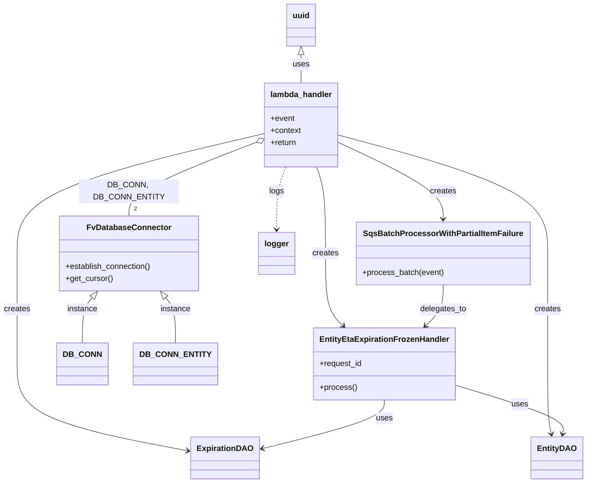

# Diagram: shipment_core/shipment_service/shipment_service/eta/consumers/entity_eta_expiration_frozen_consumer.py


> Auto-generated by Obscura crawlers

## Diagram 1



### SVG

<svg id="container" width="1133.25" xmlns="http://www.w3.org/2000/svg" class="classDiagram" height="966" viewBox="0 0 1133.25 966" role="graphics-document document" aria-roledescription="class"><style>#container{font-family:"trebuchet ms",verdana,arial,sans-serif;font-size:16px;fill:#333;}@keyframes edge-animation-frame{from{stroke-dashoffset:0;}}@keyframes dash{to{stroke-dashoffset:0;}}#container .edge-animation-slow{stroke-dasharray:9,5!important;stroke-dashoffset:900;animation:dash 50s linear infinite;stroke-linecap:round;}#container .edge-animation-fast{stroke-dasharray:9,5!important;stroke-dashoffset:900;animation:dash 20s linear infinite;stroke-linecap:round;}#container .error-icon{fill:#552222;}#container .error-text{fill:#552222;stroke:#552222;}#container .edge-thickness-normal{stroke-width:1px;}#container .edge-thickness-thick{stroke-width:3.5px;}#container .edge-pattern-solid{stroke-dasharray:0;}#container .edge-thickness-invisible{stroke-width:0;fill:none;}#container .edge-pattern-dashed{stroke-dasharray:3;}#container .edge-pattern-dotted{stroke-dasharray:2;}#container .marker{fill:#333333;stroke:#333333;}#container .marker.cross{stroke:#333333;}#container svg{font-family:"trebuchet ms",verdana,arial,sans-serif;font-size:16px;}#container p{margin:0;}#container g.classGroup text{fill:#9370DB;stroke:none;font-family:"trebuchet ms",verdana,arial,sans-serif;font-size:10px;}#container g.classGroup text .title{font-weight:bolder;}#container .nodeLabel,#container .edgeLabel{color:#131300;}#container .edgeLabel .label rect{fill:#ECECFF;}#container .label text{fill:#131300;}#container .labelBkg{background:#ECECFF;}#container .edgeLabel .label span{background:#ECECFF;}#container .classTitle{font-weight:bolder;}#container .node rect,#container .node circle,#container .node ellipse,#container .node polygon,#container .node path{fill:#ECECFF;stroke:#9370DB;stroke-width:1px;}#container .divider{stroke:#9370DB;stroke-width:1;}#container g.clickable{cursor:pointer;}#container g.classGroup rect{fill:#ECECFF;stroke:#9370DB;}#container g.classGroup line{stroke:#9370DB;stroke-width:1;}#container .classLabel .box{stroke:none;stroke-width:0;fill:#ECECFF;opacity:0.5;}#container .classLabel .label{fill:#9370DB;font-size:10px;}#container .relation{stroke:#333333;stroke-width:1;fill:none;}#container .dashed-line{stroke-dasharray:3;}#container .dotted-line{stroke-dasharray:1 2;}#container #compositionStart,#container .composition{fill:#333333!important;stroke:#333333!important;stroke-width:1;}#container #compositionEnd,#container .composition{fill:#333333!important;stroke:#333333!important;stroke-width:1;}#container #dependencyStart,#container .dependency{fill:#333333!important;stroke:#333333!important;stroke-width:1;}#container #dependencyStart,#container .dependency{fill:#333333!important;stroke:#333333!important;stroke-width:1;}#container #extensionStart,#container .extension{fill:transparent!important;stroke:#333333!important;stroke-width:1;}#container #extensionEnd,#container .extension{fill:transparent!important;stroke:#333333!important;stroke-width:1;}#container #aggregationStart,#container .aggregation{fill:transparent!important;stroke:#333333!important;stroke-width:1;}#container #aggregationEnd,#container .aggregation{fill:transparent!important;stroke:#333333!important;stroke-width:1;}#container #lollipopStart,#container .lollipop{fill:#ECECFF!important;stroke:#333333!important;stroke-width:1;}#container #lollipopEnd,#container .lollipop{fill:#ECECFF!important;stroke:#333333!important;stroke-width:1;}#container .edgeTerminals{font-size:11px;line-height:initial;}#container .classTitleText{text-anchor:middle;font-size:18px;fill:#333;}#container .label-icon{display:inline-block;height:1em;overflow:visible;vertical-align:-0.125em;}#container .node .label-icon path{fill:currentColor;stroke:revert;stroke-width:revert;}#container :root{--mermaid-font-family:"trebuchet ms",verdana,arial,sans-serif;}</style><g><defs><marker id="container_class-aggregationStart" class="marker aggregation class" refX="18" refY="7" markerWidth="190" markerHeight="240" orient="auto"><path d="M 18,7 L9,13 L1,7 L9,1 Z"></path></marker></defs><defs><marker id="container_class-aggregationEnd" class="marker aggregation class" refX="1" refY="7" markerWidth="20" markerHeight="28" orient="auto"><path d="M 18,7 L9,13 L1,7 L9,1 Z"></path></marker></defs><defs><marker id="container_class-extensionStart" class="marker extension class" refX="18" refY="7" markerWidth="190" markerHeight="240" orient="auto"><path d="M 1,7 L18,13 V 1 Z"></path></marker></defs><defs><marker id="container_class-extensionEnd" class="marker extension class" refX="1" refY="7" markerWidth="20" markerHeight="28" orient="auto"><path d="M 1,1 V 13 L18,7 Z"></path></marker></defs><defs><marker id="container_class-compositionStart" class="marker composition class" refX="18" refY="7" markerWidth="190" markerHeight="240" orient="auto"><path d="M 18,7 L9,13 L1,7 L9,1 Z"></path></marker></defs><defs><marker id="container_class-compositionEnd" class="marker composition class" refX="1" refY="7" markerWidth="20" markerHeight="28" orient="auto"><path d="M 18,7 L9,13 L1,7 L9,1 Z"></path></marker></defs><defs><marker id="container_class-dependencyStart" class="marker dependency class" refX="6" refY="7" markerWidth="190" markerHeight="240" orient="auto"><path d="M 5,7 L9,13 L1,7 L9,1 Z"></path></marker></defs><defs><marker id="container_class-dependencyEnd" class="marker dependency class" refX="13" refY="7" markerWidth="20" markerHeight="28" orient="auto"><path d="M 18,7 L9,13 L14,7 L9,1 Z"></path></marker></defs><defs><marker id="container_class-lollipopStart" class="marker lollipop class" refX="13" refY="7" markerWidth="190" markerHeight="240" orient="auto"><circle stroke="black" fill="transparent" cx="7" cy="7" r="6"></circle></marker></defs><defs><marker id="container_class-lollipopEnd" class="marker lollipop class" refX="1" refY="7" markerWidth="190" markerHeight="240" orient="auto"><circle stroke="black" fill="transparent" cx="7" cy="7" r="6"></circle></marker></defs><g class="root"><g class="clusters"></g><g class="edgePaths"><path d="M487.055,285.988L447.151,302.157C407.246,318.325,327.436,350.663,287.532,374.998C247.627,399.333,247.627,415.667,247.627,423.833L247.627,432" id="id_lambda_handler_FvDatabaseConnector_1" class="edge-thickness-normal edge-pattern-solid relation" style=";;;" data-edge="true" data-et="edge" data-id="id_lambda_handler_FvDatabaseConnector_1" data-points="W3sieCI6NTAzLjA0Mjk2ODc1LCJ5IjoyNzkuNTEwMTgzNjgxMTE5Nn0seyJ4IjoyNDcuNjI2OTUzMTI1LCJ5IjozODN9LHsieCI6MjQ3LjYyNjk1MzEyNSwieSI6NDMyfV0=" marker-start="url(#container_class-aggregationStart)"></path><path d="M503.043,267.882L424.898,287.068C346.753,306.255,190.462,344.627,112.317,384.48C34.172,424.333,34.172,465.667,34.172,505C34.172,544.333,34.172,581.667,34.172,618.5C34.172,655.333,34.172,691.667,34.172,728C34.172,764.333,34.172,800.667,89.418,829.692C144.663,858.717,255.155,880.433,310.4,891.292L365.646,902.15" id="id_lambda_handler_ExpirationDAO_2" class="edge-thickness-normal edge-pattern-solid relation" style=";;;" data-edge="true" data-et="edge" data-id="id_lambda_handler_ExpirationDAO_2" data-points="W3sieCI6NTAzLjA0Mjk2ODc1LCJ5IjoyNjcuODgxODYxMzE3MDI2NzN9LHsieCI6MzQuMTcxODc1LCJ5IjozODN9LHsieCI6MzQuMTcxODc1LCJ5Ijo1MDd9LHsieCI6MzQuMTcxODc1LCJ5Ijo2MTl9LHsieCI6MzQuMTcxODc1LCJ5Ijo3Mjh9LHsieCI6MzQuMTcxODc1LCJ5Ijo4Mzd9LHsieCI6MzcxLjUzMzIwMzEyNSwieSI6OTAzLjMwNzM2MjI1MjM2MDN9XQ==" marker-end="url(#container_class-dependencyEnd)"></path><path d="M648.707,270.074L716.993,288.895C785.28,307.716,921.853,345.358,990.139,384.846C1058.426,424.333,1058.426,465.667,1058.426,505C1058.426,544.333,1058.426,581.667,1058.426,618.5C1058.426,655.333,1058.426,691.667,1058.426,728C1058.426,764.333,1058.426,800.667,1059.625,824.026C1060.824,847.385,1063.223,857.769,1064.422,862.962L1065.621,868.154" id="id_lambda_handler_EntityDAO_3" class="edge-thickness-normal edge-pattern-solid relation" style=";;;" data-edge="true" data-et="edge" data-id="id_lambda_handler_EntityDAO_3" data-points="W3sieCI6NjQ4LjcwNzAzMTI1LCJ5IjoyNzAuMDczODY2OTAxOTYxNH0seyJ4IjoxMDU4LjQyNTc4MTI1LCJ5IjozODN9LHsieCI6MTA1OC40MjU3ODEyNSwieSI6NTA3fSx7IngiOjEwNTguNDI1NzgxMjUsInkiOjYxOX0seyJ4IjoxMDU4LjQyNTc4MTI1LCJ5Ijo3Mjh9LHsieCI6MTA1OC40MjU3ODEyNSwieSI6ODM3fSx7IngiOjEwNjYuOTcxNDIwMDk0OTM2OCwieSI6ODc0fV0=" marker-end="url(#container_class-dependencyEnd)"></path><path d="M606.331,334L609.292,342.167C612.253,350.333,618.176,366.667,621.137,395.5C624.098,424.333,624.098,465.667,624.098,505C624.098,544.333,624.098,581.667,629.885,605.812C635.672,629.958,647.246,640.917,653.033,646.396L658.82,651.875" id="id_lambda_handler_EntityEtaExpirationFrozenHandler_4" class="edge-thickness-normal edge-pattern-solid relation" style=";;;" data-edge="true" data-et="edge" data-id="id_lambda_handler_EntityEtaExpirationFrozenHandler_4" data-points="W3sieCI6NjA2LjMzMTQxNDQ3MzY4NDIsInkiOjMzNH0seyJ4Ijo2MjQuMDk3NjU2MjUsInkiOjM4M30seyJ4Ijo2MjQuMDk3NjU2MjUsInkiOjUwN30seyJ4Ijo2MjQuMDk3NjU2MjUsInkiOjYxOX0seyJ4Ijo2NjMuMTc2Nzg0NjkwMzY3LCJ5Ijo2NTZ9XQ==" marker-end="url(#container_class-dependencyEnd)"></path><path d="M648.707,284.785L682.98,301.154C717.254,317.523,785.801,350.262,820.074,375.797C854.348,401.333,854.348,419.667,854.348,428.833L854.348,438" id="id_lambda_handler_SqsBatchProcessorWithPartialItemFailure_5" class="edge-thickness-normal edge-pattern-solid relation" style=";;;" data-edge="true" data-et="edge" data-id="id_lambda_handler_SqsBatchProcessorWithPartialItemFailure_5" data-points="W3sieCI6NjQ4LjcwNzAzMTI1LCJ5IjoyODQuNzg0OTU5ODExNDcxNn0seyJ4Ijo4NTQuMzQ3NjU2MjUsInkiOjM4M30seyJ4Ijo4NTQuMzQ3NjU2MjUsInkiOjQ0NH1d" marker-end="url(#container_class-dependencyEnd)"></path><path d="M545.419,334L542.458,342.167C539.497,350.333,533.574,366.667,530.613,387.5C527.652,408.333,527.652,433.667,527.652,446.333L527.652,459" id="id_lambda_handler_logger_6" class="edge-thickness-normal edge-pattern-dashed relation" style=";;;" data-edge="true" data-et="edge" data-id="id_lambda_handler_logger_6" data-points="W3sieCI6NTQ1LjQxODU4NTUyNjMxNTgsInkiOjMzNH0seyJ4Ijo1MjcuNjUyMzQzNzUsInkiOjM4M30seyJ4Ijo1MjcuNjUyMzQzNzUsInkiOjQ2NX1d" marker-end="url(#container_class-dependencyEnd)"></path><path d="M739.223,800L739.223,806.167C739.223,812.333,739.223,824.667,700.435,840.943C661.647,857.219,584.071,877.437,545.283,887.546L506.495,897.656" id="id_EntityEtaExpirationFrozenHandler_ExpirationDAO_7" class="edge-thickness-normal edge-pattern-solid relation" style=";;;" data-edge="true" data-et="edge" data-id="id_EntityEtaExpirationFrozenHandler_ExpirationDAO_7" data-points="W3sieCI6NzM5LjIyMjY1NjI1LCJ5Ijo4MDB9LHsieCI6NzM5LjIyMjY1NjI1LCJ5Ijo4Mzd9LHsieCI6NTAwLjY4OTQ1MzEyNSwieSI6ODk5LjE2ODk4MzEzNzEyNn1d" marker-end="url(#container_class-dependencyEnd)"></path><path d="M874.129,769.341L910.927,780.617C947.725,791.894,1021.322,814.447,1056.921,830.916C1092.52,847.385,1090.121,857.769,1088.922,862.962L1087.723,868.154" id="id_EntityEtaExpirationFrozenHandler_EntityDAO_8" class="edge-thickness-normal edge-pattern-solid relation" style=";;;" data-edge="true" data-et="edge" data-id="id_EntityEtaExpirationFrozenHandler_EntityDAO_8" data-points="W3sieCI6ODc0LjEyODkwNjI1LCJ5Ijo3NjkuMzQwOTQ3NTI3OTQ5Mn0seyJ4IjoxMDk0LjkxNzk2ODc1LCJ5Ijo4Mzd9LHsieCI6MTA4Ni4zNzIzMjk5MDUwNjMyLCJ5Ijo4NzR9XQ==" marker-end="url(#container_class-dependencyEnd)"></path><path d="M854.348,570L854.348,578.167C854.348,586.333,854.348,602.667,848.561,616.312C842.774,629.958,831.2,640.917,825.413,646.396L819.625,651.875" id="id_SqsBatchProcessorWithPartialItemFailure_EntityEtaExpirationFrozenHandler_9" class="edge-thickness-normal edge-pattern-solid relation" style=";;;" data-edge="true" data-et="edge" data-id="id_SqsBatchProcessorWithPartialItemFailure_EntityEtaExpirationFrozenHandler_9" data-points="W3sieCI6ODU0LjM0NzY1NjI1LCJ5Ijo1NzB9LHsieCI6ODU0LjM0NzY1NjI1LCJ5Ijo2MTl9LHsieCI6ODE1LjI2ODUyNzgwOTYzMywieSI6NjU2fV0=" marker-end="url(#container_class-dependencyEnd)"></path><path d="M179.45,595.675L176.462,599.563C173.473,603.45,167.495,611.225,164.506,626.279C161.518,641.333,161.518,663.667,161.518,674.833L161.518,686" id="id_FvDatabaseConnector_DB_CONN_10" class="edge-thickness-normal edge-pattern-solid relation" style=";;;" data-edge="true" data-et="edge" data-id="id_FvDatabaseConnector_DB_CONN_10" data-points="W3sieCI6MTg5Ljk2NDQyNTIyMzIxNDI4LCJ5Ijo1ODJ9LHsieCI6MTYxLjUxNzU3ODEyNSwieSI6NjE5fSx7IngiOjE2MS41MTc1NzgxMjUsInkiOjY4Nn1d" marker-start="url(#container_class-extensionStart)"></path><path d="M315.804,595.675L318.792,599.563C321.781,603.45,327.759,611.225,330.748,626.279C333.736,641.333,333.736,663.667,333.736,674.833L333.736,686" id="id_FvDatabaseConnector_DB_CONN_ENTITY_11" class="edge-thickness-normal edge-pattern-solid relation" style=";;;" data-edge="true" data-et="edge" data-id="id_FvDatabaseConnector_DB_CONN_ENTITY_11" data-points="W3sieCI6MzA1LjI4OTQ4MTAyNjc4NTcsInkiOjU4Mn0seyJ4IjozMzMuNzM2MzI4MTI1LCJ5Ijo2MTl9LHsieCI6MzMzLjczNjMyODEyNSwieSI6Njg2fV0=" marker-start="url(#container_class-extensionStart)"></path><path d="M575.875,109.25L575.875,112.542C575.875,115.833,575.875,122.417,575.875,131.875C575.875,141.333,575.875,153.667,575.875,159.833L575.875,166" id="id_uuid_lambda_handler_12" class="edge-thickness-normal edge-pattern-solid relation" style=";;;" data-edge="true" data-et="edge" data-id="id_uuid_lambda_handler_12" data-points="W3sieCI6NTc1Ljg3NSwieSI6OTJ9LHsieCI6NTc1Ljg3NSwieSI6MTI5fSx7IngiOjU3NS44NzUsInkiOjE2Nn1d" marker-start="url(#container_class-extensionStart)"></path></g><g class="edgeLabels"><g class="edgeLabel" transform="translate(247.626953125, 383)"><g class="label" data-id="id_lambda_handler_FvDatabaseConnector_1" transform="translate(-100, -24)"><foreignObject width="200" height="48"><div xmlns="http://www.w3.org/1999/xhtml" class="labelBkg" style="display: table; white-space: break-spaces; line-height: 1.5; max-width: 200px; text-align: center; width: 200px;"><span class="edgeLabel"><p>DB_CONN, DB_CONN_ENTITY</p></span></div></foreignObject></g></g><g class="edgeLabel" transform="translate(34.171875, 619)"><g class="label" data-id="id_lambda_handler_ExpirationDAO_2" transform="translate(-26.171875, -12)"><foreignObject width="52.34375" height="24"><div xmlns="http://www.w3.org/1999/xhtml" class="labelBkg" style="display: table-cell; white-space: nowrap; line-height: 1.5; max-width: 200px; text-align: center;"><span class="edgeLabel"><p>creates</p></span></div></foreignObject></g></g><g class="edgeLabel" transform="translate(1058.42578125, 619)"><g class="label" data-id="id_lambda_handler_EntityDAO_3" transform="translate(-26.171875, -12)"><foreignObject width="52.34375" height="24"><div xmlns="http://www.w3.org/1999/xhtml" class="labelBkg" style="display: table-cell; white-space: nowrap; line-height: 1.5; max-width: 200px; text-align: center;"><span class="edgeLabel"><p>creates</p></span></div></foreignObject></g></g><g class="edgeLabel" transform="translate(624.09765625, 507)"><g class="label" data-id="id_lambda_handler_EntityEtaExpirationFrozenHandler_4" transform="translate(-26.171875, -12)"><foreignObject width="52.34375" height="24"><div xmlns="http://www.w3.org/1999/xhtml" class="labelBkg" style="display: table-cell; white-space: nowrap; line-height: 1.5; max-width: 200px; text-align: center;"><span class="edgeLabel"><p>creates</p></span></div></foreignObject></g></g><g class="edgeLabel" transform="translate(854.34765625, 383)"><g class="label" data-id="id_lambda_handler_SqsBatchProcessorWithPartialItemFailure_5" transform="translate(-26.171875, -12)"><foreignObject width="52.34375" height="24"><div xmlns="http://www.w3.org/1999/xhtml" class="labelBkg" style="display: table-cell; white-space: nowrap; line-height: 1.5; max-width: 200px; text-align: center;"><span class="edgeLabel"><p>creates</p></span></div></foreignObject></g></g><g class="edgeLabel" transform="translate(527.65234375, 383)"><g class="label" data-id="id_lambda_handler_logger_6" transform="translate(-14.8203125, -12)"><foreignObject width="29.640625" height="24"><div xmlns="http://www.w3.org/1999/xhtml" class="labelBkg" style="display: table-cell; white-space: nowrap; line-height: 1.5; max-width: 200px; text-align: center;"><span class="edgeLabel"><p>logs</p></span></div></foreignObject></g></g><g class="edgeLabel" transform="translate(739.22265625, 837)"><g class="label" data-id="id_EntityEtaExpirationFrozenHandler_ExpirationDAO_7" transform="translate(-16.4921875, -12)"><foreignObject width="32.984375" height="24"><div xmlns="http://www.w3.org/1999/xhtml" class="labelBkg" style="display: table-cell; white-space: nowrap; line-height: 1.5; max-width: 200px; text-align: center;"><span class="edgeLabel"><p>uses</p></span></div></foreignObject></g></g><g class="edgeLabel" transform="translate(1002.6772, 808.73355)"><g class="label" data-id="id_EntityEtaExpirationFrozenHandler_EntityDAO_8" transform="translate(-16.4921875, -12)"><foreignObject width="32.984375" height="24"><div xmlns="http://www.w3.org/1999/xhtml" class="labelBkg" style="display: table-cell; white-space: nowrap; line-height: 1.5; max-width: 200px; text-align: center;"><span class="edgeLabel"><p>uses</p></span></div></foreignObject></g></g><g class="edgeLabel" transform="translate(854.34765625, 619)"><g class="label" data-id="id_SqsBatchProcessorWithPartialItemFailure_EntityEtaExpirationFrozenHandler_9" transform="translate(-46.3125, -12)"><foreignObject width="92.625" height="24"><div xmlns="http://www.w3.org/1999/xhtml" class="labelBkg" style="display: table-cell; white-space: nowrap; line-height: 1.5; max-width: 200px; text-align: center;"><span class="edgeLabel"><p>delegates_to</p></span></div></foreignObject></g></g><g class="edgeLabel" transform="translate(161.517578125, 619)"><g class="label" data-id="id_FvDatabaseConnector_DB_CONN_10" transform="translate(-30.578125, -12)"><foreignObject width="61.15625" height="24"><div xmlns="http://www.w3.org/1999/xhtml" class="labelBkg" style="display: table-cell; white-space: nowrap; line-height: 1.5; max-width: 200px; text-align: center;"><span class="edgeLabel"><p>instance</p></span></div></foreignObject></g></g><g class="edgeLabel" transform="translate(333.736328125, 619)"><g class="label" data-id="id_FvDatabaseConnector_DB_CONN_ENTITY_11" transform="translate(-30.578125, -12)"><foreignObject width="61.15625" height="24"><div xmlns="http://www.w3.org/1999/xhtml" class="labelBkg" style="display: table-cell; white-space: nowrap; line-height: 1.5; max-width: 200px; text-align: center;"><span class="edgeLabel"><p>instance</p></span></div></foreignObject></g></g><g class="edgeLabel" transform="translate(575.875, 129)"><g class="label" data-id="id_uuid_lambda_handler_12" transform="translate(-16.4921875, -12)"><foreignObject width="32.984375" height="24"><div xmlns="http://www.w3.org/1999/xhtml" class="labelBkg" style="display: table-cell; white-space: nowrap; line-height: 1.5; max-width: 200px; text-align: center;"><span class="edgeLabel"><p>uses</p></span></div></foreignObject></g></g><g class="edgeTerminals" transform="translate(257.6269515624999, 409.4999986607143)"><g class="inner" transform="translate(0, 0)"></g><foreignObject style="width: 9px; height: 12px;"><div xmlns="http://www.w3.org/1999/xhtml" style="display: inline-block; padding-right: 1px; white-space: nowrap;"><span class="edgeLabel">2</span></div></foreignObject></g></g><g class="nodes"><g class="node default" id="classId-lambda_handler-0" transform="translate(575.875, 250)"><g class="basic label-container"><path d="M-72.83203125 -84 L72.83203125 -84 L72.83203125 84 L-72.83203125 84" stroke="none" stroke-width="0" fill="#ECECFF" style=""></path><path d="M-72.83203125 -84 C-30.49058156587393 -84, 11.850868118252137 -84, 72.83203125 -84 M-72.83203125 -84 C-29.70930022148908 -84, 13.41343080702184 -84, 72.83203125 -84 M72.83203125 -84 C72.83203125 -46.93721490552799, 72.83203125 -9.874429811055975, 72.83203125 84 M72.83203125 -84 C72.83203125 -21.370293792870413, 72.83203125 41.259412414259174, 72.83203125 84 M72.83203125 84 C39.14768344626139 84, 5.463335642522779 84, -72.83203125 84 M72.83203125 84 C31.26570871402305 84, -10.300613821953903 84, -72.83203125 84 M-72.83203125 84 C-72.83203125 40.4950089185539, -72.83203125 -3.0099821628922, -72.83203125 -84 M-72.83203125 84 C-72.83203125 42.84584435001121, -72.83203125 1.691688700022425, -72.83203125 -84" stroke="#9370DB" stroke-width="1.3" fill="none" stroke-dasharray="0 0" style=""></path></g><g class="annotation-group text" transform="translate(0, -60)"></g><g class="label-group text" transform="translate(-59.9765625, -60)"><g class="label" style="font-weight: bolder" transform="translate(0,-12)"><foreignObject width="119.953125" height="24"><div xmlns="http://www.w3.org/1999/xhtml" style="display: table-cell; white-space: nowrap; line-height: 1.5; max-width: 170px; text-align: center;"><span class="nodeLabel markdown-node-label" style=""><p>lambda_handler</p></span></div></foreignObject></g></g><g class="members-group text" transform="translate(-60.83203125, -12)"><g class="label" style="" transform="translate(0,-12)"><foreignObject width="48.328125" height="24"><div xmlns="http://www.w3.org/1999/xhtml" style="display: table-cell; white-space: nowrap; line-height: 1.5; max-width: 106px; text-align: center;"><span class="nodeLabel markdown-node-label" style=""><p>+event</p></span></div></foreignObject></g><g class="label" style="" transform="translate(0,12)"><foreignObject width="61.6875" height="24"><div xmlns="http://www.w3.org/1999/xhtml" style="display: table-cell; white-space: nowrap; line-height: 1.5; max-width: 119px; text-align: center;"><span class="nodeLabel markdown-node-label" style=""><p>+context</p></span></div></foreignObject></g><g class="label" style="" transform="translate(0,36)"><foreignObject width="53.046875" height="24"><div xmlns="http://www.w3.org/1999/xhtml" style="display: table-cell; white-space: nowrap; line-height: 1.5; max-width: 110px; text-align: center;"><span class="nodeLabel markdown-node-label" style=""><p>+return</p></span></div></foreignObject></g></g><g class="methods-group text" transform="translate(-60.83203125, 84)"></g><g class="divider" style=""><path d="M-72.83203125 -36 C-25.632260742293354 -36, 21.56750976541329 -36, 72.83203125 -36 M-72.83203125 -36 C-21.55553846637291 -36, 29.720954317254183 -36, 72.83203125 -36" stroke="#9370DB" stroke-width="1.3" fill="none" stroke-dasharray="0 0" style=""></path></g><g class="divider" style=""><path d="M-72.83203125 60 C-24.53491832296853 60, 23.76219460406294 60, 72.83203125 60 M-72.83203125 60 C-28.727819132569323 60, 15.376392984861354 60, 72.83203125 60" stroke="#9370DB" stroke-width="1.3" fill="none" stroke-dasharray="0 0" style=""></path></g></g><g class="node default" id="classId-FvDatabaseConnector-1" transform="translate(247.626953125, 507)"><g class="basic label-container"><path d="M-138.28515625 -75 L138.28515625 -75 L138.28515625 75 L-138.28515625 75" stroke="none" stroke-width="0" fill="#ECECFF" style=""></path><path d="M-138.28515625 -75 C-49.91807708689538 -75, 38.44900207620924 -75, 138.28515625 -75 M-138.28515625 -75 C-72.81045524075356 -75, -7.33575423150711 -75, 138.28515625 -75 M138.28515625 -75 C138.28515625 -22.369540635834618, 138.28515625 30.260918728330765, 138.28515625 75 M138.28515625 -75 C138.28515625 -16.79212243033753, 138.28515625 41.41575513932494, 138.28515625 75 M138.28515625 75 C66.80863348351865 75, -4.6678892829627046 75, -138.28515625 75 M138.28515625 75 C46.118351208186425 75, -46.04845383362715 75, -138.28515625 75 M-138.28515625 75 C-138.28515625 20.808216055713814, -138.28515625 -33.38356788857237, -138.28515625 -75 M-138.28515625 75 C-138.28515625 20.30473314744708, -138.28515625 -34.39053370510584, -138.28515625 -75" stroke="#9370DB" stroke-width="1.3" fill="none" stroke-dasharray="0 0" style=""></path></g><g class="annotation-group text" transform="translate(0, -51)"></g><g class="label-group text" transform="translate(-79.3046875, -51)"><g class="label" style="font-weight: bolder" transform="translate(0,-12)"><foreignObject width="158.609375" height="24"><div xmlns="http://www.w3.org/1999/xhtml" style="display: table-cell; white-space: nowrap; line-height: 1.5; max-width: 207px; text-align: center;"><span class="nodeLabel markdown-node-label" style=""><p>FvDatabaseConnector</p></span></div></foreignObject></g></g><g class="members-group text" transform="translate(-126.28515625, -3)"></g><g class="methods-group text" transform="translate(-126.28515625, 27)"><g class="label" style="" transform="translate(0,-12)"><foreignObject width="173.265625" height="24"><div xmlns="http://www.w3.org/1999/xhtml" style="display: table-cell; white-space: nowrap; line-height: 1.5; max-width: 231px; text-align: center;"><span class="nodeLabel markdown-node-label" style=""><p>+establish_connection()</p></span></div></foreignObject></g><g class="label" style="" transform="translate(0,12)"><foreignObject width="94.640625" height="24"><div xmlns="http://www.w3.org/1999/xhtml" style="display: table-cell; white-space: nowrap; line-height: 1.5; max-width: 152px; text-align: center;"><span class="nodeLabel markdown-node-label" style=""><p>+get_cursor()</p></span></div></foreignObject></g></g><g class="divider" style=""><path d="M-138.28515625 -27 C-66.90436172064355 -27, 4.4764328087129 -27, 138.28515625 -27 M-138.28515625 -27 C-78.54415552377158 -27, -18.803154797543158 -27, 138.28515625 -27" stroke="#9370DB" stroke-width="1.3" fill="none" stroke-dasharray="0 0" style=""></path></g><g class="divider" style=""><path d="M-138.28515625 -3 C-73.51144009164344 -3, -8.737723933286873 -3, 138.28515625 -3 M-138.28515625 -3 C-58.883467666587364 -3, 20.51822091682527 -3, 138.28515625 -3" stroke="#9370DB" stroke-width="1.3" fill="none" stroke-dasharray="0 0" style=""></path></g></g><g class="node default" id="classId-ExpirationDAO-2" transform="translate(436.111328125, 916)"><g class="basic label-container"><path d="M-64.578125 -42 L64.578125 -42 L64.578125 42 L-64.578125 42" stroke="none" stroke-width="0" fill="#ECECFF" style=""></path><path d="M-64.578125 -42 C-14.184034212475645 -42, 36.21005657504871 -42, 64.578125 -42 M-64.578125 -42 C-29.94076798383076 -42, 4.69658903233848 -42, 64.578125 -42 M64.578125 -42 C64.578125 -11.727931592481436, 64.578125 18.544136815037128, 64.578125 42 M64.578125 -42 C64.578125 -20.604010694811308, 64.578125 0.7919786103773845, 64.578125 42 M64.578125 42 C36.593671292571806 42, 8.609217585143611 42, -64.578125 42 M64.578125 42 C31.234485914801702 42, -2.1091531703965956 42, -64.578125 42 M-64.578125 42 C-64.578125 8.916437482850334, -64.578125 -24.167125034299332, -64.578125 -42 M-64.578125 42 C-64.578125 16.883576621184588, -64.578125 -8.232846757630824, -64.578125 -42" stroke="#9370DB" stroke-width="1.3" fill="none" stroke-dasharray="0 0" style=""></path></g><g class="annotation-group text" transform="translate(0, -18)"></g><g class="label-group text" transform="translate(-52.578125, -18)"><g class="label" style="font-weight: bolder" transform="translate(0,-12)"><foreignObject width="105.15625" height="24"><div xmlns="http://www.w3.org/1999/xhtml" style="display: table-cell; white-space: nowrap; line-height: 1.5; max-width: 154px; text-align: center;"><span class="nodeLabel markdown-node-label" style=""><p>ExpirationDAO</p></span></div></foreignObject></g></g><g class="members-group text" transform="translate(-52.578125, 30)"></g><g class="methods-group text" transform="translate(-52.578125, 60)"></g><g class="divider" style=""><path d="M-64.578125 6 C-34.41932534160849 6, -4.260525683216983 6, 64.578125 6 M-64.578125 6 C-17.476715185758508 6, 29.624694628482985 6, 64.578125 6" stroke="#9370DB" stroke-width="1.3" fill="none" stroke-dasharray="0 0" style=""></path></g><g class="divider" style=""><path d="M-64.578125 24 C-34.47231158871113 24, -4.366498177422258 24, 64.578125 24 M-64.578125 24 C-13.516529465693232 24, 37.54506606861354 24, 64.578125 24" stroke="#9370DB" stroke-width="1.3" fill="none" stroke-dasharray="0 0" style=""></path></g></g><g class="node default" id="classId-EntityDAO-3" transform="translate(1076.671875, 916)"><g class="basic label-container"><path d="M-48.578125 -42 L48.578125 -42 L48.578125 42 L-48.578125 42" stroke="none" stroke-width="0" fill="#ECECFF" style=""></path><path d="M-48.578125 -42 C-10.493601628478352 -42, 27.590921743043296 -42, 48.578125 -42 M-48.578125 -42 C-25.492683133897867 -42, -2.407241267795733 -42, 48.578125 -42 M48.578125 -42 C48.578125 -9.94687010677, 48.578125 22.10625978646, 48.578125 42 M48.578125 -42 C48.578125 -22.490833419836736, 48.578125 -2.9816668396734727, 48.578125 42 M48.578125 42 C24.496239323623747 42, 0.4143536472474949 42, -48.578125 42 M48.578125 42 C23.76026215760673 42, -1.057600684786543 42, -48.578125 42 M-48.578125 42 C-48.578125 8.921975782942773, -48.578125 -24.156048434114453, -48.578125 -42 M-48.578125 42 C-48.578125 23.066387388362536, -48.578125 4.132774776725071, -48.578125 -42" stroke="#9370DB" stroke-width="1.3" fill="none" stroke-dasharray="0 0" style=""></path></g><g class="annotation-group text" transform="translate(0, -18)"></g><g class="label-group text" transform="translate(-36.578125, -18)"><g class="label" style="font-weight: bolder" transform="translate(0,-12)"><foreignObject width="73.15625" height="24"><div xmlns="http://www.w3.org/1999/xhtml" style="display: table-cell; white-space: nowrap; line-height: 1.5; max-width: 122px; text-align: center;"><span class="nodeLabel markdown-node-label" style=""><p>EntityDAO</p></span></div></foreignObject></g></g><g class="members-group text" transform="translate(-36.578125, 30)"></g><g class="methods-group text" transform="translate(-36.578125, 60)"></g><g class="divider" style=""><path d="M-48.578125 6 C-16.907743931332618 6, 14.762637137334764 6, 48.578125 6 M-48.578125 6 C-16.96667168278259 6, 14.644781634434821 6, 48.578125 6" stroke="#9370DB" stroke-width="1.3" fill="none" stroke-dasharray="0 0" style=""></path></g><g class="divider" style=""><path d="M-48.578125 24 C-22.813339513566117 24, 2.9514459728677664 24, 48.578125 24 M-48.578125 24 C-19.714272728488464 24, 9.149579543023073 24, 48.578125 24" stroke="#9370DB" stroke-width="1.3" fill="none" stroke-dasharray="0 0" style=""></path></g></g><g class="node default" id="classId-EntityEtaExpirationFrozenHandler-4" transform="translate(739.22265625, 728)"><g class="basic label-container"><path d="M-134.90625 -72 L134.90625 -72 L134.90625 72 L-134.90625 72" stroke="none" stroke-width="0" fill="#ECECFF" style=""></path><path d="M-134.90625 -72 C-45.82818856180843 -72, 43.24987287638314 -72, 134.90625 -72 M-134.90625 -72 C-75.44453567248681 -72, -15.98282134497363 -72, 134.90625 -72 M134.90625 -72 C134.90625 -14.605482139608696, 134.90625 42.78903572078261, 134.90625 72 M134.90625 -72 C134.90625 -39.13885233187203, 134.90625 -6.2777046637440606, 134.90625 72 M134.90625 72 C52.100089205289834 72, -30.706071589420333 72, -134.90625 72 M134.90625 72 C41.027195843432 72, -52.851858313136006 72, -134.90625 72 M-134.90625 72 C-134.90625 30.477515172537203, -134.90625 -11.044969654925595, -134.90625 -72 M-134.90625 72 C-134.90625 22.82274713854484, -134.90625 -26.354505722910318, -134.90625 -72" stroke="#9370DB" stroke-width="1.3" fill="none" stroke-dasharray="0 0" style=""></path></g><g class="annotation-group text" transform="translate(0, -48)"></g><g class="label-group text" transform="translate(-122.90625, -48)"><g class="label" style="font-weight: bolder" transform="translate(0,-12)"><foreignObject width="245.8125" height="24"><div xmlns="http://www.w3.org/1999/xhtml" style="display: table-cell; white-space: nowrap; line-height: 1.5; max-width: 294px; text-align: center;"><span class="nodeLabel markdown-node-label" style=""><p>EntityEtaExpirationFrozenHandler</p></span></div></foreignObject></g></g><g class="members-group text" transform="translate(-122.90625, 0)"><g class="label" style="" transform="translate(0,-12)"><foreignObject width="85.65625" height="24"><div xmlns="http://www.w3.org/1999/xhtml" style="display: table-cell; white-space: nowrap; line-height: 1.5; max-width: 143px; text-align: center;"><span class="nodeLabel markdown-node-label" style=""><p>+request_id</p></span></div></foreignObject></g></g><g class="methods-group text" transform="translate(-122.90625, 48)"><g class="label" style="" transform="translate(0,-12)"><foreignObject width="73.734375" height="24"><div xmlns="http://www.w3.org/1999/xhtml" style="display: table-cell; white-space: nowrap; line-height: 1.5; max-width: 131px; text-align: center;"><span class="nodeLabel markdown-node-label" style=""><p>+process()</p></span></div></foreignObject></g></g><g class="divider" style=""><path d="M-134.90625 -24 C-42.01896170270423 -24, 50.86832659459154 -24, 134.90625 -24 M-134.90625 -24 C-30.43438103148995 -24, 74.0374879370201 -24, 134.90625 -24" stroke="#9370DB" stroke-width="1.3" fill="none" stroke-dasharray="0 0" style=""></path></g><g class="divider" style=""><path d="M-134.90625 24 C-71.88410801743436 24, -8.8619660348687 24, 134.90625 24 M-134.90625 24 C-76.21663388414211 24, -17.527017768284225 24, 134.90625 24" stroke="#9370DB" stroke-width="1.3" fill="none" stroke-dasharray="0 0" style=""></path></g></g><g class="node default" id="classId-SqsBatchProcessorWithPartialItemFailure-5" transform="translate(854.34765625, 507)"><g class="basic label-container"><path d="M-169.078125 -63 L169.078125 -63 L169.078125 63 L-169.078125 63" stroke="none" stroke-width="0" fill="#ECECFF" style=""></path><path d="M-169.078125 -63 C-94.90429843735886 -63, -20.730471874717722 -63, 169.078125 -63 M-169.078125 -63 C-46.1270185667569 -63, 76.8240878664862 -63, 169.078125 -63 M169.078125 -63 C169.078125 -21.37957888633356, 169.078125 20.240842227332877, 169.078125 63 M169.078125 -63 C169.078125 -22.76400401953064, 169.078125 17.471991960938723, 169.078125 63 M169.078125 63 C67.53937644188503 63, -33.99937211622995 63, -169.078125 63 M169.078125 63 C95.39366071770283 63, 21.70919643540566 63, -169.078125 63 M-169.078125 63 C-169.078125 32.03782682640188, -169.078125 1.0756536528037586, -169.078125 -63 M-169.078125 63 C-169.078125 33.60781559953149, -169.078125 4.215631199062983, -169.078125 -63" stroke="#9370DB" stroke-width="1.3" fill="none" stroke-dasharray="0 0" style=""></path></g><g class="annotation-group text" transform="translate(0, -39)"></g><g class="label-group text" transform="translate(-151.46875, -39)"><g class="label" style="font-weight: bolder" transform="translate(0,-12)"><foreignObject width="302.9375" height="24"><div xmlns="http://www.w3.org/1999/xhtml" style="display: table-cell; white-space: nowrap; line-height: 1.5; max-width: 348px; text-align: center;"><span class="nodeLabel markdown-node-label" style=""><p>SqsBatchProcessorWithPartialItemFailure</p></span></div></foreignObject></g></g><g class="members-group text" transform="translate(-157.078125, 9)"></g><g class="methods-group text" transform="translate(-157.078125, 39)"><g class="label" style="" transform="translate(0,-12)"><foreignObject width="162.6875" height="24"><div xmlns="http://www.w3.org/1999/xhtml" style="display: table-cell; white-space: nowrap; line-height: 1.5; max-width: 220px; text-align: center;"><span class="nodeLabel markdown-node-label" style=""><p>+process_batch(event)</p></span></div></foreignObject></g></g><g class="divider" style=""><path d="M-169.078125 -15 C-97.52369091893965 -15, -25.9692568378793 -15, 169.078125 -15 M-169.078125 -15 C-49.34831354234747 -15, 70.38149791530506 -15, 169.078125 -15" stroke="#9370DB" stroke-width="1.3" fill="none" stroke-dasharray="0 0" style=""></path></g><g class="divider" style=""><path d="M-169.078125 9 C-53.939307329292944 9, 61.19951034141411 9, 169.078125 9 M-169.078125 9 C-43.16880735094537 9, 82.74051029810926 9, 169.078125 9" stroke="#9370DB" stroke-width="1.3" fill="none" stroke-dasharray="0 0" style=""></path></g></g><g class="node default" id="classId-uuid-6" transform="translate(575.875, 50)"><g class="basic label-container"><path d="M-28.2109375 -42 L28.2109375 -42 L28.2109375 42 L-28.2109375 42" stroke="none" stroke-width="0" fill="#ECECFF" style=""></path><path d="M-28.2109375 -42 C-15.94141474344883 -42, -3.671891986897659 -42, 28.2109375 -42 M-28.2109375 -42 C-16.811585449499848 -42, -5.412233398999696 -42, 28.2109375 -42 M28.2109375 -42 C28.2109375 -23.63930020668884, 28.2109375 -5.278600413377681, 28.2109375 42 M28.2109375 -42 C28.2109375 -19.053285392831395, 28.2109375 3.8934292143372105, 28.2109375 42 M28.2109375 42 C16.40179762481776 42, 4.592657749635521 42, -28.2109375 42 M28.2109375 42 C14.521661597118628 42, 0.8323856942372565 42, -28.2109375 42 M-28.2109375 42 C-28.2109375 21.871014600378157, -28.2109375 1.7420292007563134, -28.2109375 -42 M-28.2109375 42 C-28.2109375 11.968382589972542, -28.2109375 -18.063234820054916, -28.2109375 -42" stroke="#9370DB" stroke-width="1.3" fill="none" stroke-dasharray="0 0" style=""></path></g><g class="annotation-group text" transform="translate(0, -18)"></g><g class="label-group text" transform="translate(-16.2109375, -18)"><g class="label" style="font-weight: bolder" transform="translate(0,-12)"><foreignObject width="32.421875" height="24"><div xmlns="http://www.w3.org/1999/xhtml" style="display: table-cell; white-space: nowrap; line-height: 1.5; max-width: 83px; text-align: center;"><span class="nodeLabel markdown-node-label" style=""><p>uuid</p></span></div></foreignObject></g></g><g class="members-group text" transform="translate(-16.2109375, 30)"></g><g class="methods-group text" transform="translate(-16.2109375, 60)"></g><g class="divider" style=""><path d="M-28.2109375 6 C-7.106307385399024 6, 13.998322729201952 6, 28.2109375 6 M-28.2109375 6 C-12.013072568294668 6, 4.184792363410665 6, 28.2109375 6" stroke="#9370DB" stroke-width="1.3" fill="none" stroke-dasharray="0 0" style=""></path></g><g class="divider" style=""><path d="M-28.2109375 24 C-11.632467703319815 24, 4.94600209336037 24, 28.2109375 24 M-28.2109375 24 C-13.953633205871233 24, 0.3036710882575342 24, 28.2109375 24" stroke="#9370DB" stroke-width="1.3" fill="none" stroke-dasharray="0 0" style=""></path></g></g><g class="node default" id="classId-logger-7" transform="translate(527.65234375, 507)"><g class="basic label-container"><path d="M-35.2734375 -42 L35.2734375 -42 L35.2734375 42 L-35.2734375 42" stroke="none" stroke-width="0" fill="#ECECFF" style=""></path><path d="M-35.2734375 -42 C-7.977339661766852 -42, 19.318758176466297 -42, 35.2734375 -42 M-35.2734375 -42 C-20.0333798143894 -42, -4.793322128778801 -42, 35.2734375 -42 M35.2734375 -42 C35.2734375 -11.308870870786873, 35.2734375 19.382258258426255, 35.2734375 42 M35.2734375 -42 C35.2734375 -20.409310582995346, 35.2734375 1.1813788340093083, 35.2734375 42 M35.2734375 42 C8.921088645491846 42, -17.43126020901631 42, -35.2734375 42 M35.2734375 42 C17.258501864378637 42, -0.756433771242726 42, -35.2734375 42 M-35.2734375 42 C-35.2734375 11.090887402069491, -35.2734375 -19.818225195861018, -35.2734375 -42 M-35.2734375 42 C-35.2734375 9.342254505284721, -35.2734375 -23.315490989430558, -35.2734375 -42" stroke="#9370DB" stroke-width="1.3" fill="none" stroke-dasharray="0 0" style=""></path></g><g class="annotation-group text" transform="translate(0, -18)"></g><g class="label-group text" transform="translate(-23.2734375, -18)"><g class="label" style="font-weight: bolder" transform="translate(0,-12)"><foreignObject width="46.546875" height="24"><div xmlns="http://www.w3.org/1999/xhtml" style="display: table-cell; white-space: nowrap; line-height: 1.5; max-width: 96px; text-align: center;"><span class="nodeLabel markdown-node-label" style=""><p>logger</p></span></div></foreignObject></g></g><g class="members-group text" transform="translate(-23.2734375, 30)"></g><g class="methods-group text" transform="translate(-23.2734375, 60)"></g><g class="divider" style=""><path d="M-35.2734375 6 C-12.433111753636933 6, 10.407213992726135 6, 35.2734375 6 M-35.2734375 6 C-10.18140001712634 6, 14.910637465747321 6, 35.2734375 6" stroke="#9370DB" stroke-width="1.3" fill="none" stroke-dasharray="0 0" style=""></path></g><g class="divider" style=""><path d="M-35.2734375 24 C-8.672306633334767 24, 17.928824233330467 24, 35.2734375 24 M-35.2734375 24 C-18.560374648285777 24, -1.847311796571553 24, 35.2734375 24" stroke="#9370DB" stroke-width="1.3" fill="none" stroke-dasharray="0 0" style=""></path></g></g><g class="node default" id="classId-DB_CONN-8" transform="translate(161.517578125, 728)"><g class="basic label-container"><path d="M-46.40625 -42 L46.40625 -42 L46.40625 42 L-46.40625 42" stroke="none" stroke-width="0" fill="#ECECFF" style=""></path><path d="M-46.40625 -42 C-25.83753913966681 -42, -5.2688282793336185 -42, 46.40625 -42 M-46.40625 -42 C-15.334950313839574 -42, 15.736349372320852 -42, 46.40625 -42 M46.40625 -42 C46.40625 -11.126028044000531, 46.40625 19.747943911998938, 46.40625 42 M46.40625 -42 C46.40625 -19.72338004343158, 46.40625 2.553239913136842, 46.40625 42 M46.40625 42 C21.962479836548862 42, -2.4812903269022755 42, -46.40625 42 M46.40625 42 C27.080392230498255 42, 7.75453446099651 42, -46.40625 42 M-46.40625 42 C-46.40625 22.663098682965384, -46.40625 3.326197365930767, -46.40625 -42 M-46.40625 42 C-46.40625 9.856309070572571, -46.40625 -22.287381858854857, -46.40625 -42" stroke="#9370DB" stroke-width="1.3" fill="none" stroke-dasharray="0 0" style=""></path></g><g class="annotation-group text" transform="translate(0, -18)"></g><g class="label-group text" transform="translate(-34.40625, -18)"><g class="label" style="font-weight: bolder" transform="translate(0,-12)"><foreignObject width="68.8125" height="24"><div xmlns="http://www.w3.org/1999/xhtml" style="display: table-cell; white-space: nowrap; line-height: 1.5; max-width: 119px; text-align: center;"><span class="nodeLabel markdown-node-label" style=""><p>DB_CONN</p></span></div></foreignObject></g></g><g class="members-group text" transform="translate(-34.40625, 30)"></g><g class="methods-group text" transform="translate(-34.40625, 60)"></g><g class="divider" style=""><path d="M-46.40625 6 C-18.637608149628424 6, 9.131033700743153 6, 46.40625 6 M-46.40625 6 C-19.048098935173567 6, 8.310052129652867 6, 46.40625 6" stroke="#9370DB" stroke-width="1.3" fill="none" stroke-dasharray="0 0" style=""></path></g><g class="divider" style=""><path d="M-46.40625 24 C-22.550039052632737 24, 1.3061718947345256 24, 46.40625 24 M-46.40625 24 C-16.77706193408804 24, 12.852126131823923 24, 46.40625 24" stroke="#9370DB" stroke-width="1.3" fill="none" stroke-dasharray="0 0" style=""></path></g></g><g class="node default" id="classId-DB_CONN_ENTITY-9" transform="translate(333.736328125, 728)"><g class="basic label-container"><path d="M-75.8125 -42 L75.8125 -42 L75.8125 42 L-75.8125 42" stroke="none" stroke-width="0" fill="#ECECFF" style=""></path><path d="M-75.8125 -42 C-28.8463579303453 -42, 18.119784139309402 -42, 75.8125 -42 M-75.8125 -42 C-22.568140327502654 -42, 30.676219344994692 -42, 75.8125 -42 M75.8125 -42 C75.8125 -11.366938555439503, 75.8125 19.266122889120993, 75.8125 42 M75.8125 -42 C75.8125 -9.910655063326104, 75.8125 22.178689873347793, 75.8125 42 M75.8125 42 C18.03419546216231 42, -39.74410907567538 42, -75.8125 42 M75.8125 42 C29.419145209163368 42, -16.974209581673264 42, -75.8125 42 M-75.8125 42 C-75.8125 20.61503626099506, -75.8125 -0.7699274780098833, -75.8125 -42 M-75.8125 42 C-75.8125 15.70576955798051, -75.8125 -10.58846088403898, -75.8125 -42" stroke="#9370DB" stroke-width="1.3" fill="none" stroke-dasharray="0 0" style=""></path></g><g class="annotation-group text" transform="translate(0, -18)"></g><g class="label-group text" transform="translate(-63.8125, -18)"><g class="label" style="font-weight: bolder" transform="translate(0,-12)"><foreignObject width="127.625" height="24"><div xmlns="http://www.w3.org/1999/xhtml" style="display: table-cell; white-space: nowrap; line-height: 1.5; max-width: 177px; text-align: center;"><span class="nodeLabel markdown-node-label" style=""><p>DB_CONN_ENTITY</p></span></div></foreignObject></g></g><g class="members-group text" transform="translate(-63.8125, 30)"></g><g class="methods-group text" transform="translate(-63.8125, 60)"></g><g class="divider" style=""><path d="M-75.8125 6 C-28.4483292823515 6, 18.915841435296997 6, 75.8125 6 M-75.8125 6 C-18.517228567178414 6, 38.77804286564317 6, 75.8125 6" stroke="#9370DB" stroke-width="1.3" fill="none" stroke-dasharray="0 0" style=""></path></g><g class="divider" style=""><path d="M-75.8125 24 C-31.758038044757456 24, 12.296423910485089 24, 75.8125 24 M-75.8125 24 C-24.458617718539863 24, 26.895264562920275 24, 75.8125 24" stroke="#9370DB" stroke-width="1.3" fill="none" stroke-dasharray="0 0" style=""></path></g></g></g></g></g></svg>

## Diagram 2

```mermaid
flowchart TD
  Event["SQS Event / Lambda trigger"] --> LogStart[Logger.info("event coming in")]
  LogStart --> InstantiateDAOs[Create ExpirationDAO, EntityDAO]
  InstantiateDAOs --> EstablishDBConns["DB_CONN.establish_connection()\nDB_CONN_ENTITY.establish_connection()"]
  EstablishDBConns --> CreateRequestID["request_id = uuid.uuid4()"]
  CreateRequestID --> CreateHandler["EntityEtaExpirationFrozenHandler(request_id, expiration_dao, entity_dao, DB_CONN.get_cursor(), DB_CONN_ENTITY.get_cursor())"]
  CreateHandler --> CreateSQSProcessor["SqsBatchProcessorWithPartialItemFailure(handler)"]
  CreateSQSProcessor --> ProcessBatch["sqs_processor.process_batch(event)"]
  ProcessBatch --> ReturnResult["Return processing result"]
  ProcessBatch -->|errors captured| Rollbar["rollbar.lambda_function wrapper"]
  Rollbar --> ReturnResult
```

> SVG rendering failed for this diagram.
