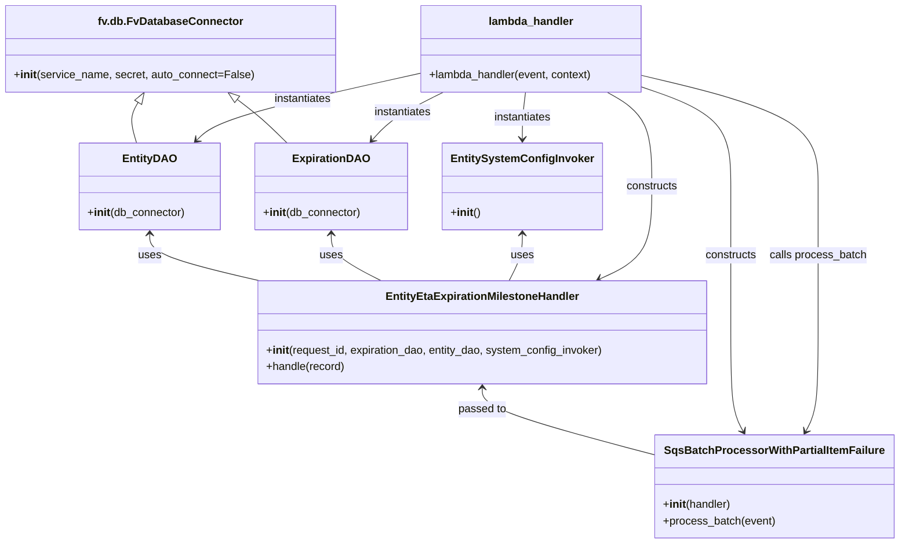

# Diagram: shipment_core/shipment_service/shipment_service/eta/consumers/entity_eta_expiration_milestone_consumer.py


> Auto-generated by Obscura crawlers

## Diagram 1



### SVG

<svg id="container" width="1284.001953125" xmlns="http://www.w3.org/2000/svg" class="classDiagram" height="790" viewBox="0 0 1284.001953125 790" role="graphics-document document" aria-roledescription="class"><style>#container{font-family:"trebuchet ms",verdana,arial,sans-serif;font-size:16px;fill:#333;}@keyframes edge-animation-frame{from{stroke-dashoffset:0;}}@keyframes dash{to{stroke-dashoffset:0;}}#container .edge-animation-slow{stroke-dasharray:9,5!important;stroke-dashoffset:900;animation:dash 50s linear infinite;stroke-linecap:round;}#container .edge-animation-fast{stroke-dasharray:9,5!important;stroke-dashoffset:900;animation:dash 20s linear infinite;stroke-linecap:round;}#container .error-icon{fill:#552222;}#container .error-text{fill:#552222;stroke:#552222;}#container .edge-thickness-normal{stroke-width:1px;}#container .edge-thickness-thick{stroke-width:3.5px;}#container .edge-pattern-solid{stroke-dasharray:0;}#container .edge-thickness-invisible{stroke-width:0;fill:none;}#container .edge-pattern-dashed{stroke-dasharray:3;}#container .edge-pattern-dotted{stroke-dasharray:2;}#container .marker{fill:#333333;stroke:#333333;}#container .marker.cross{stroke:#333333;}#container svg{font-family:"trebuchet ms",verdana,arial,sans-serif;font-size:16px;}#container p{margin:0;}#container g.classGroup text{fill:#9370DB;stroke:none;font-family:"trebuchet ms",verdana,arial,sans-serif;font-size:10px;}#container g.classGroup text .title{font-weight:bolder;}#container .nodeLabel,#container .edgeLabel{color:#131300;}#container .edgeLabel .label rect{fill:#ECECFF;}#container .label text{fill:#131300;}#container .labelBkg{background:#ECECFF;}#container .edgeLabel .label span{background:#ECECFF;}#container .classTitle{font-weight:bolder;}#container .node rect,#container .node circle,#container .node ellipse,#container .node polygon,#container .node path{fill:#ECECFF;stroke:#9370DB;stroke-width:1px;}#container .divider{stroke:#9370DB;stroke-width:1;}#container g.clickable{cursor:pointer;}#container g.classGroup rect{fill:#ECECFF;stroke:#9370DB;}#container g.classGroup line{stroke:#9370DB;stroke-width:1;}#container .classLabel .box{stroke:none;stroke-width:0;fill:#ECECFF;opacity:0.5;}#container .classLabel .label{fill:#9370DB;font-size:10px;}#container .relation{stroke:#333333;stroke-width:1;fill:none;}#container .dashed-line{stroke-dasharray:3;}#container .dotted-line{stroke-dasharray:1 2;}#container #compositionStart,#container .composition{fill:#333333!important;stroke:#333333!important;stroke-width:1;}#container #compositionEnd,#container .composition{fill:#333333!important;stroke:#333333!important;stroke-width:1;}#container #dependencyStart,#container .dependency{fill:#333333!important;stroke:#333333!important;stroke-width:1;}#container #dependencyStart,#container .dependency{fill:#333333!important;stroke:#333333!important;stroke-width:1;}#container #extensionStart,#container .extension{fill:transparent!important;stroke:#333333!important;stroke-width:1;}#container #extensionEnd,#container .extension{fill:transparent!important;stroke:#333333!important;stroke-width:1;}#container #aggregationStart,#container .aggregation{fill:transparent!important;stroke:#333333!important;stroke-width:1;}#container #aggregationEnd,#container .aggregation{fill:transparent!important;stroke:#333333!important;stroke-width:1;}#container #lollipopStart,#container .lollipop{fill:#ECECFF!important;stroke:#333333!important;stroke-width:1;}#container #lollipopEnd,#container .lollipop{fill:#ECECFF!important;stroke:#333333!important;stroke-width:1;}#container .edgeTerminals{font-size:11px;line-height:initial;}#container .classTitleText{text-anchor:middle;font-size:18px;fill:#333;}#container .label-icon{display:inline-block;height:1em;overflow:visible;vertical-align:-0.125em;}#container .node .label-icon path{fill:currentColor;stroke:revert;stroke-width:revert;}#container :root{--mermaid-font-family:"trebuchet ms",verdana,arial,sans-serif;}</style><g><defs><marker id="container_class-aggregationStart" class="marker aggregation class" refX="18" refY="7" markerWidth="190" markerHeight="240" orient="auto"><path d="M 18,7 L9,13 L1,7 L9,1 Z"></path></marker></defs><defs><marker id="container_class-aggregationEnd" class="marker aggregation class" refX="1" refY="7" markerWidth="20" markerHeight="28" orient="auto"><path d="M 18,7 L9,13 L1,7 L9,1 Z"></path></marker></defs><defs><marker id="container_class-extensionStart" class="marker extension class" refX="18" refY="7" markerWidth="190" markerHeight="240" orient="auto"><path d="M 1,7 L18,13 V 1 Z"></path></marker></defs><defs><marker id="container_class-extensionEnd" class="marker extension class" refX="1" refY="7" markerWidth="20" markerHeight="28" orient="auto"><path d="M 1,1 V 13 L18,7 Z"></path></marker></defs><defs><marker id="container_class-compositionStart" class="marker composition class" refX="18" refY="7" markerWidth="190" markerHeight="240" orient="auto"><path d="M 18,7 L9,13 L1,7 L9,1 Z"></path></marker></defs><defs><marker id="container_class-compositionEnd" class="marker composition class" refX="1" refY="7" markerWidth="20" markerHeight="28" orient="auto"><path d="M 18,7 L9,13 L1,7 L9,1 Z"></path></marker></defs><defs><marker id="container_class-dependencyStart" class="marker dependency class" refX="6" refY="7" markerWidth="190" markerHeight="240" orient="auto"><path d="M 5,7 L9,13 L1,7 L9,1 Z"></path></marker></defs><defs><marker id="container_class-dependencyEnd" class="marker dependency class" refX="13" refY="7" markerWidth="20" markerHeight="28" orient="auto"><path d="M 18,7 L9,13 L14,7 L9,1 Z"></path></marker></defs><defs><marker id="container_class-lollipopStart" class="marker lollipop class" refX="13" refY="7" markerWidth="190" markerHeight="240" orient="auto"><circle stroke="black" fill="transparent" cx="7" cy="7" r="6"></circle></marker></defs><defs><marker id="container_class-lollipopEnd" class="marker lollipop class" refX="1" refY="7" markerWidth="190" markerHeight="240" orient="auto"><circle stroke="black" fill="transparent" cx="7" cy="7" r="6"></circle></marker></defs><g class="root"><g class="clusters"></g><g class="edgePaths"><path d="M193.112,148.601L190.763,152.334C188.414,156.067,183.717,163.534,183.308,173.433C182.899,183.333,186.779,195.667,188.719,201.833L190.659,208" id="id_fv.db.FvDatabaseConnector_EntityDAO_1" class="edge-thickness-normal edge-pattern-solid relation" style=";;;" data-edge="true" data-et="edge" data-id="id_fv.db.FvDatabaseConnector_EntityDAO_1" data-points="W3sieCI6MjAyLjI5NzczNDM3NSwieSI6MTM0fSx7IngiOjE3OS4wMTk1MzEyNSwieSI6MTcxfSx7IngiOjE5MC42NTg2MzI4MTI1LCJ5IjoyMDh9XQ==" marker-start="url(#container_class-extensionStart)"></path><path d="M337.83,144.493L343.595,148.911C349.36,153.329,360.889,162.164,372.76,172.749C384.631,183.333,396.845,195.667,402.951,201.833L409.058,208" id="id_fv.db.FvDatabaseConnector_ExpirationDAO_2" class="edge-thickness-normal edge-pattern-solid relation" style=";;;" data-edge="true" data-et="edge" data-id="id_fv.db.FvDatabaseConnector_ExpirationDAO_2" data-points="W3sieCI6MzI0LjEzODc1LCJ5IjoxMzR9LHsieCI6MzcyLjQxNzk2ODc1LCJ5IjoxNzF9LHsieCI6NDA5LjA1ODA4NTkzNzUsInkiOjIwOH1d" marker-start="url(#container_class-extensionStart)"></path><path d="M210.477,340L210.477,345.167C210.477,350.333,210.477,360.667,236.371,372C262.266,383.333,314.056,395.667,339.951,401.833L365.846,408" id="id_EntityDAO_EntityEtaExpirationMilestoneHandler_3" class="edge-thickness-normal edge-pattern-solid relation" style=";;;" data-edge="true" data-et="edge" data-id="id_EntityDAO_EntityEtaExpirationMilestoneHandler_3" data-points="W3sieCI6MjEwLjQ3NjU2MjUsInkiOjMzNH0seyJ4IjoyMTAuNDc2NTYyNSwieSI6MzcxfSx7IngiOjM2NS44NDU3MjA1NjM2MTYwNiwieSI6NDA4fV0=" marker-start="url(#container_class-dependencyStart)"></path><path d="M471.445,340L471.445,345.167C471.445,350.333,471.445,360.667,482.971,372C494.497,383.333,517.549,395.667,529.076,401.833L540.602,408" id="id_ExpirationDAO_EntityEtaExpirationMilestoneHandler_4" class="edge-thickness-normal edge-pattern-solid relation" style=";;;" data-edge="true" data-et="edge" data-id="id_ExpirationDAO_EntityEtaExpirationMilestoneHandler_4" data-points="W3sieCI6NDcxLjQ0NTMxMjUsInkiOjMzNH0seyJ4Ijo0NzEuNDQ1MzEyNSwieSI6MzcxfSx7IngiOjU0MC42MDE1Nzk5Mzg2MTYsInkiOjQwOH1d" marker-start="url(#container_class-dependencyStart)"></path><path d="M741.25,340L741.25,345.167C741.25,350.333,741.25,360.667,737.921,372C734.591,383.333,727.933,395.667,724.604,401.833L721.274,408" id="id_EntitySystemConfigInvoker_EntityEtaExpirationMilestoneHandler_5" class="edge-thickness-normal edge-pattern-solid relation" style=";;;" data-edge="true" data-et="edge" data-id="id_EntitySystemConfigInvoker_EntityEtaExpirationMilestoneHandler_5" data-points="W3sieCI6NzQxLjI1LCJ5IjozMzR9LHsieCI6NzQxLjI1LCJ5IjozNzF9LHsieCI6NzIxLjI3NDM2MTc0NjY1MTgsInkiOjQwOH1d" marker-start="url(#container_class-dependencyStart)"></path><path d="M680.783,564L680.783,569.167C680.783,574.333,680.783,584.667,723.627,601.094C766.471,617.521,852.158,640.041,895.002,651.302L937.846,662.562" id="id_EntityEtaExpirationMilestoneHandler_SqsBatchProcessorWithPartialItemFailure_6" class="edge-thickness-normal edge-pattern-solid relation" style=";;;" data-edge="true" data-et="edge" data-id="id_EntityEtaExpirationMilestoneHandler_SqsBatchProcessorWithPartialItemFailure_6" data-points="W3sieCI6NjgwLjc4MzIwMzEyNSwieSI6NTU4fSx7IngiOjY4MC43ODMyMDMxMjUsInkiOjU5NX0seyJ4Ijo5MzcuODQ1NzAzMTI1LCJ5Ijo2NjIuNTYyMjA0Mzc3OTU2M31d" marker-start="url(#container_class-dependencyStart)"></path><path d="M597.256,107.032L549.297,117.693C501.339,128.354,405.421,149.677,352.06,165.795C298.698,181.912,287.892,192.824,282.489,198.281L277.086,203.737" id="id_lambda_handler_EntityDAO_7" class="edge-thickness-normal edge-pattern-solid relation" style=";;;" data-edge="true" data-et="edge" data-id="id_lambda_handler_EntityDAO_7" data-points="W3sieCI6NTk3LjI1NTg1OTM3NSwieSI6MTA3LjAzMTUyMjA0NTg5MzY3fSx7IngiOjMwOS41MDM5MDYyNSwieSI6MTcxfSx7IngiOjI3Mi44NjM3ODkwNjI1LCJ5IjoyMDh9XQ==" marker-end="url(#container_class-dependencyEnd)"></path><path d="M629.618,134L616.921,140.167C604.223,146.333,578.828,158.667,561.709,170.227C544.59,181.787,535.746,192.573,531.324,197.967L526.902,203.36" id="id_lambda_handler_ExpirationDAO_8" class="edge-thickness-normal edge-pattern-solid relation" style=";;;" data-edge="true" data-et="edge" data-id="id_lambda_handler_ExpirationDAO_8" data-points="W3sieCI6NjI5LjYxODE4MzU5Mzc1LCJ5IjoxMzR9LHsieCI6NTUzLjQzMzU5Mzc1LCJ5IjoxNzF9LHsieCI6NTIzLjA5NzkyOTY4NzUsInkiOjIwOH1d" marker-end="url(#container_class-dependencyEnd)"></path><path d="M747.943,134L746.827,140.167C745.712,146.333,743.481,158.667,742.365,170C741.25,181.333,741.25,191.667,741.25,196.833L741.25,202" id="id_lambda_handler_EntitySystemConfigInvoker_9" class="edge-thickness-normal edge-pattern-solid relation" style=";;;" data-edge="true" data-et="edge" data-id="id_lambda_handler_EntitySystemConfigInvoker_9" data-points="W3sieCI6NzQ3Ljk0MjUxOTUzMTI1LCJ5IjoxMzR9LHsieCI6NzQxLjI1LCJ5IjoxNzF9LHsieCI6NzQxLjI1LCJ5IjoyMDh9XQ==" marker-end="url(#container_class-dependencyEnd)"></path><path d="M863.336,134L873.516,140.167C883.695,146.333,904.055,158.667,914.234,181.5C924.414,204.333,924.414,237.667,924.414,271C924.414,304.333,924.414,337.667,911.908,360.082C899.403,382.498,874.392,393.996,861.886,399.745L849.38,405.494" id="id_lambda_handler_EntityEtaExpirationMilestoneHandler_10" class="edge-thickness-normal edge-pattern-solid relation" style=";;;" data-edge="true" data-et="edge" data-id="id_lambda_handler_EntityEtaExpirationMilestoneHandler_10" data-points="W3sieCI6ODYzLjMzNTg3ODkwNjI1LCJ5IjoxMzR9LHsieCI6OTI0LjQxNDA2MjUsInkiOjE3MX0seyJ4Ijo5MjQuNDE0MDYyNSwieSI6MjcxfSx7IngiOjkyNC40MTQwNjI1LCJ5IjozNzF9LHsieCI6ODQzLjkyODg2Nzg4NTA0NDYsInkiOjQwOH1d" marker-end="url(#container_class-dependencyEnd)"></path><path d="M921.42,128.195L941.637,135.329C961.855,142.463,1002.29,156.732,1022.507,180.532C1042.725,204.333,1042.725,237.667,1042.725,271C1042.725,304.333,1042.725,337.667,1042.725,373C1042.725,408.333,1042.725,445.667,1042.725,483C1042.725,520.333,1042.725,557.667,1045.762,581.632C1048.8,605.598,1054.875,616.196,1057.912,621.495L1060.949,626.795" id="id_lambda_handler_SqsBatchProcessorWithPartialItemFailure_11" class="edge-thickness-normal edge-pattern-solid relation" style=";;;" data-edge="true" data-et="edge" data-id="id_lambda_handler_SqsBatchProcessorWithPartialItemFailure_11" data-points="W3sieCI6OTIxLjQxOTkyMTg3NSwieSI6MTI4LjE5NDY0NjIyOTM0MDk4fSx7IngiOjEwNDIuNzI0NjA5Mzc1LCJ5IjoxNzF9LHsieCI6MTA0Mi43MjQ2MDkzNzUsInkiOjI3MX0seyJ4IjoxMDQyLjcyNDYwOTM3NSwieSI6MzcxfSx7IngiOjEwNDIuNzI0NjA5Mzc1LCJ5Ijo0ODN9LHsieCI6MTA0Mi43MjQ2MDkzNzUsInkiOjU5NX0seyJ4IjoxMDYzLjkzMzI3OTg1NDkxMDgsInkiOjYzMn1d" marker-end="url(#container_class-dependencyEnd)"></path><path d="M921.42,110.361L963.037,120.467C1004.654,130.574,1087.889,150.787,1129.506,177.56C1171.123,204.333,1171.123,237.667,1171.123,271C1171.123,304.333,1171.123,337.667,1171.123,373C1171.123,408.333,1171.123,445.667,1171.123,483C1171.123,520.333,1171.123,557.667,1168.086,581.632C1165.048,605.598,1158.973,616.196,1155.936,621.495L1152.898,626.795" id="id_lambda_handler_SqsBatchProcessorWithPartialItemFailure_12" class="edge-thickness-normal edge-pattern-solid relation" style=";;;" data-edge="true" data-et="edge" data-id="id_lambda_handler_SqsBatchProcessorWithPartialItemFailure_12" data-points="W3sieCI6OTIxLjQxOTkyMTg3NSwieSI6MTEwLjM2MDgyNDE1NTQ5Njc0fSx7IngiOjExNzEuMTIzMDQ2ODc1LCJ5IjoxNzF9LHsieCI6MTE3MS4xMjMwNDY4NzUsInkiOjI3MX0seyJ4IjoxMTcxLjEyMzA0Njg3NSwieSI6MzcxfSx7IngiOjExNzEuMTIzMDQ2ODc1LCJ5Ijo0ODN9LHsieCI6MTE3MS4xMjMwNDY4NzUsInkiOjU5NX0seyJ4IjoxMTQ5LjkxNDM3NjM5NTA4OTIsInkiOjYzMn1d" marker-end="url(#container_class-dependencyEnd)"></path></g><g class="edgeLabels"><g class="edgeLabel"><g class="label" data-id="id_fv.db.FvDatabaseConnector_EntityDAO_1" transform="translate(0, 0)"><foreignObject width="0" height="0"><div xmlns="http://www.w3.org/1999/xhtml" class="labelBkg" style="display: table-cell; white-space: nowrap; line-height: 1.5; max-width: 200px; text-align: center;"><span class="edgeLabel"></span></div></foreignObject></g></g><g class="edgeLabel"><g class="label" data-id="id_fv.db.FvDatabaseConnector_ExpirationDAO_2" transform="translate(0, 0)"><foreignObject width="0" height="0"><div xmlns="http://www.w3.org/1999/xhtml" class="labelBkg" style="display: table-cell; white-space: nowrap; line-height: 1.5; max-width: 200px; text-align: center;"><span class="edgeLabel"></span></div></foreignObject></g></g><g class="edgeLabel" transform="translate(210.4765625, 371)"><g class="label" data-id="id_EntityDAO_EntityEtaExpirationMilestoneHandler_3" transform="translate(-16.4921875, -12)"><foreignObject width="32.984375" height="24"><div xmlns="http://www.w3.org/1999/xhtml" class="labelBkg" style="display: table-cell; white-space: nowrap; line-height: 1.5; max-width: 200px; text-align: center;"><span class="edgeLabel"><p>uses</p></span></div></foreignObject></g></g><g class="edgeLabel" transform="translate(471.4453125, 371)"><g class="label" data-id="id_ExpirationDAO_EntityEtaExpirationMilestoneHandler_4" transform="translate(-16.4921875, -12)"><foreignObject width="32.984375" height="24"><div xmlns="http://www.w3.org/1999/xhtml" class="labelBkg" style="display: table-cell; white-space: nowrap; line-height: 1.5; max-width: 200px; text-align: center;"><span class="edgeLabel"><p>uses</p></span></div></foreignObject></g></g><g class="edgeLabel" transform="translate(741.25, 371)"><g class="label" data-id="id_EntitySystemConfigInvoker_EntityEtaExpirationMilestoneHandler_5" transform="translate(-16.4921875, -12)"><foreignObject width="32.984375" height="24"><div xmlns="http://www.w3.org/1999/xhtml" class="labelBkg" style="display: table-cell; white-space: nowrap; line-height: 1.5; max-width: 200px; text-align: center;"><span class="edgeLabel"><p>uses</p></span></div></foreignObject></g></g><g class="edgeLabel" transform="translate(680.783203125, 595)"><g class="label" data-id="id_EntityEtaExpirationMilestoneHandler_SqsBatchProcessorWithPartialItemFailure_6" transform="translate(-35.046875, -12)"><foreignObject width="70.09375" height="24"><div xmlns="http://www.w3.org/1999/xhtml" class="labelBkg" style="display: table-cell; white-space: nowrap; line-height: 1.5; max-width: 200px; text-align: center;"><span class="edgeLabel"><p>passed to</p></span></div></foreignObject></g></g><g class="edgeLabel" transform="translate(427.96429, 144.66575)"><g class="label" data-id="id_lambda_handler_EntityDAO_7" transform="translate(-42.9140625, -12)"><foreignObject width="85.828125" height="24"><div xmlns="http://www.w3.org/1999/xhtml" class="labelBkg" style="display: table-cell; white-space: nowrap; line-height: 1.5; max-width: 200px; text-align: center;"><span class="edgeLabel"><p>instantiates</p></span></div></foreignObject></g></g><g class="edgeLabel" transform="translate(570.00646, 162.95118)"><g class="label" data-id="id_lambda_handler_ExpirationDAO_8" transform="translate(-42.9140625, -12)"><foreignObject width="85.828125" height="24"><div xmlns="http://www.w3.org/1999/xhtml" class="labelBkg" style="display: table-cell; white-space: nowrap; line-height: 1.5; max-width: 200px; text-align: center;"><span class="edgeLabel"><p>instantiates</p></span></div></foreignObject></g></g><g class="edgeLabel" transform="translate(741.25, 171)"><g class="label" data-id="id_lambda_handler_EntitySystemConfigInvoker_9" transform="translate(-42.9140625, -12)"><foreignObject width="85.828125" height="24"><div xmlns="http://www.w3.org/1999/xhtml" class="labelBkg" style="display: table-cell; white-space: nowrap; line-height: 1.5; max-width: 200px; text-align: center;"><span class="edgeLabel"><p>instantiates</p></span></div></foreignObject></g></g><g class="edgeLabel" transform="translate(924.4140625, 271)"><g class="label" data-id="id_lambda_handler_EntityEtaExpirationMilestoneHandler_10" transform="translate(-37.84375, -12)"><foreignObject width="75.6875" height="24"><div xmlns="http://www.w3.org/1999/xhtml" class="labelBkg" style="display: table-cell; white-space: nowrap; line-height: 1.5; max-width: 200px; text-align: center;"><span class="edgeLabel"><p>constructs</p></span></div></foreignObject></g></g><g class="edgeLabel" transform="translate(1042.724609375, 371)"><g class="label" data-id="id_lambda_handler_SqsBatchProcessorWithPartialItemFailure_11" transform="translate(-37.84375, -12)"><foreignObject width="75.6875" height="24"><div xmlns="http://www.w3.org/1999/xhtml" class="labelBkg" style="display: table-cell; white-space: nowrap; line-height: 1.5; max-width: 200px; text-align: center;"><span class="edgeLabel"><p>constructs</p></span></div></foreignObject></g></g><g class="edgeLabel" transform="translate(1171.123046875, 371)"><g class="label" data-id="id_lambda_handler_SqsBatchProcessorWithPartialItemFailure_12" transform="translate(-70.5546875, -12)"><foreignObject width="141.109375" height="24"><div xmlns="http://www.w3.org/1999/xhtml" class="labelBkg" style="display: table-cell; white-space: nowrap; line-height: 1.5; max-width: 200px; text-align: center;"><span class="edgeLabel"><p>calls process_batch</p></span></div></foreignObject></g></g></g><g class="nodes"><g class="node default" id="classId-fv.db.FvDatabaseConnector-0" transform="translate(241.93359375, 71)"><g class="basic label-container"><path d="M-233.93359375 -63 L233.93359375 -63 L233.93359375 63 L-233.93359375 63" stroke="none" stroke-width="0" fill="#ECECFF" style=""></path><path d="M-233.93359375 -63 C-73.39557204286928 -63, 87.14244966426145 -63, 233.93359375 -63 M-233.93359375 -63 C-115.16214723781601 -63, 3.60929927436797 -63, 233.93359375 -63 M233.93359375 -63 C233.93359375 -25.72738576406192, 233.93359375 11.545228471876158, 233.93359375 63 M233.93359375 -63 C233.93359375 -32.44829615541049, 233.93359375 -1.896592310820985, 233.93359375 63 M233.93359375 63 C109.69007743843972 63, -14.55343887312057 63, -233.93359375 63 M233.93359375 63 C49.145739201361295 63, -135.6421153472774 63, -233.93359375 63 M-233.93359375 63 C-233.93359375 13.229253340029679, -233.93359375 -36.54149331994064, -233.93359375 -63 M-233.93359375 63 C-233.93359375 36.060097244670516, -233.93359375 9.120194489341031, -233.93359375 -63" stroke="#9370DB" stroke-width="1.3" fill="none" stroke-dasharray="0 0" style=""></path></g><g class="annotation-group text" transform="translate(0, -39)"></g><g class="label-group text" transform="translate(-99.1953125, -39)"><g class="label" style="font-weight: bolder" transform="translate(0,-12)"><foreignObject width="198.390625" height="24"><div xmlns="http://www.w3.org/1999/xhtml" style="display: table-cell; white-space: nowrap; line-height: 1.5; max-width: 246px; text-align: center;"><span class="nodeLabel markdown-node-label" style=""><p>fv.db.FvDatabaseConnector</p></span></div></foreignObject></g></g><g class="members-group text" transform="translate(-221.93359375, 9)"></g><g class="methods-group text" transform="translate(-221.93359375, 39)"><g class="label" style="" transform="translate(0,-12)"><foreignObject width="344.671875" height="24"><div xmlns="http://www.w3.org/1999/xhtml" style="display: table-cell; white-space: nowrap; line-height: 1.5; max-width: 433px; text-align: center;"><span class="nodeLabel markdown-node-label" style=""><p>+<strong>init</strong>(service_name, secret, auto_connect=False)</p></span></div></foreignObject></g></g><g class="divider" style=""><path d="M-233.93359375 -15 C-128.05616617105804 -15, -22.178738592116076 -15, 233.93359375 -15 M-233.93359375 -15 C-53.09177868087113 -15, 127.75003638825774 -15, 233.93359375 -15" stroke="#9370DB" stroke-width="1.3" fill="none" stroke-dasharray="0 0" style=""></path></g><g class="divider" style=""><path d="M-233.93359375 9 C-131.86272916249038 9, -29.791864574980735 9, 233.93359375 9 M-233.93359375 9 C-104.88521176404464 9, 24.16317022191072 9, 233.93359375 9" stroke="#9370DB" stroke-width="1.3" fill="none" stroke-dasharray="0 0" style=""></path></g></g><g class="node default" id="classId-EntityDAO-1" transform="translate(210.4765625, 271)"><g class="basic label-container"><path d="M-101.484375 -63 L101.484375 -63 L101.484375 63 L-101.484375 63" stroke="none" stroke-width="0" fill="#ECECFF" style=""></path><path d="M-101.484375 -63 C-44.90333941318923 -63, 11.677696173621541 -63, 101.484375 -63 M-101.484375 -63 C-55.13906181050117 -63, -8.793748621002337 -63, 101.484375 -63 M101.484375 -63 C101.484375 -33.180338156044684, 101.484375 -3.3606763120893746, 101.484375 63 M101.484375 -63 C101.484375 -22.24300786405044, 101.484375 18.51398427189912, 101.484375 63 M101.484375 63 C39.01485089275913 63, -23.454673214481744 63, -101.484375 63 M101.484375 63 C54.6234616990297 63, 7.762548398059394 63, -101.484375 63 M-101.484375 63 C-101.484375 34.11550831160717, -101.484375 5.2310166232143445, -101.484375 -63 M-101.484375 63 C-101.484375 12.778929450145121, -101.484375 -37.44214109970976, -101.484375 -63" stroke="#9370DB" stroke-width="1.3" fill="none" stroke-dasharray="0 0" style=""></path></g><g class="annotation-group text" transform="translate(0, -39)"></g><g class="label-group text" transform="translate(-36.578125, -39)"><g class="label" style="font-weight: bolder" transform="translate(0,-12)"><foreignObject width="73.15625" height="24"><div xmlns="http://www.w3.org/1999/xhtml" style="display: table-cell; white-space: nowrap; line-height: 1.5; max-width: 122px; text-align: center;"><span class="nodeLabel markdown-node-label" style=""><p>EntityDAO</p></span></div></foreignObject></g></g><g class="members-group text" transform="translate(-89.484375, 9)"></g><g class="methods-group text" transform="translate(-89.484375, 39)"><g class="label" style="" transform="translate(0,-12)"><foreignObject width="142.390625" height="24"><div xmlns="http://www.w3.org/1999/xhtml" style="display: table-cell; white-space: nowrap; line-height: 1.5; max-width: 231px; text-align: center;"><span class="nodeLabel markdown-node-label" style=""><p>+<strong>init</strong>(db_connector)</p></span></div></foreignObject></g></g><g class="divider" style=""><path d="M-101.484375 -15 C-47.74035977420624 -15, 6.00365545158752 -15, 101.484375 -15 M-101.484375 -15 C-22.32124441791389 -15, 56.84188616417222 -15, 101.484375 -15" stroke="#9370DB" stroke-width="1.3" fill="none" stroke-dasharray="0 0" style=""></path></g><g class="divider" style=""><path d="M-101.484375 9 C-34.66362907874405 9, 32.1571168425119 9, 101.484375 9 M-101.484375 9 C-23.511471346683805 9, 54.46143230663239 9, 101.484375 9" stroke="#9370DB" stroke-width="1.3" fill="none" stroke-dasharray="0 0" style=""></path></g></g><g class="node default" id="classId-ExpirationDAO-2" transform="translate(471.4453125, 271)"><g class="basic label-container"><path d="M-109.484375 -63 L109.484375 -63 L109.484375 63 L-109.484375 63" stroke="none" stroke-width="0" fill="#ECECFF" style=""></path><path d="M-109.484375 -63 C-42.54457026804495 -63, 24.3952344639101 -63, 109.484375 -63 M-109.484375 -63 C-52.108882619107696 -63, 5.266609761784608 -63, 109.484375 -63 M109.484375 -63 C109.484375 -23.50578944681093, 109.484375 15.98842110637814, 109.484375 63 M109.484375 -63 C109.484375 -33.20970074706648, 109.484375 -3.4194014941329556, 109.484375 63 M109.484375 63 C62.386321912294896 63, 15.288268824589792 63, -109.484375 63 M109.484375 63 C40.273202243815604 63, -28.937970512368793 63, -109.484375 63 M-109.484375 63 C-109.484375 36.109022742513716, -109.484375 9.218045485027432, -109.484375 -63 M-109.484375 63 C-109.484375 33.9923769014768, -109.484375 4.984753802953598, -109.484375 -63" stroke="#9370DB" stroke-width="1.3" fill="none" stroke-dasharray="0 0" style=""></path></g><g class="annotation-group text" transform="translate(0, -39)"></g><g class="label-group text" transform="translate(-52.578125, -39)"><g class="label" style="font-weight: bolder" transform="translate(0,-12)"><foreignObject width="105.15625" height="24"><div xmlns="http://www.w3.org/1999/xhtml" style="display: table-cell; white-space: nowrap; line-height: 1.5; max-width: 154px; text-align: center;"><span class="nodeLabel markdown-node-label" style=""><p>ExpirationDAO</p></span></div></foreignObject></g></g><g class="members-group text" transform="translate(-97.484375, 9)"></g><g class="methods-group text" transform="translate(-97.484375, 39)"><g class="label" style="" transform="translate(0,-12)"><foreignObject width="142.390625" height="24"><div xmlns="http://www.w3.org/1999/xhtml" style="display: table-cell; white-space: nowrap; line-height: 1.5; max-width: 231px; text-align: center;"><span class="nodeLabel markdown-node-label" style=""><p>+<strong>init</strong>(db_connector)</p></span></div></foreignObject></g></g><g class="divider" style=""><path d="M-109.484375 -15 C-27.258490070429588 -15, 54.967394859140825 -15, 109.484375 -15 M-109.484375 -15 C-40.1345003610176 -15, 29.2153742779648 -15, 109.484375 -15" stroke="#9370DB" stroke-width="1.3" fill="none" stroke-dasharray="0 0" style=""></path></g><g class="divider" style=""><path d="M-109.484375 9 C-65.08323176697692 9, -20.68208853395383 9, 109.484375 9 M-109.484375 9 C-31.939747950383705 9, 45.60487909923259 9, 109.484375 9" stroke="#9370DB" stroke-width="1.3" fill="none" stroke-dasharray="0 0" style=""></path></g></g><g class="node default" id="classId-EntitySystemConfigInvoker-3" transform="translate(741.25, 271)"><g class="basic label-container"><path d="M-110.3203125 -63 L110.3203125 -63 L110.3203125 63 L-110.3203125 63" stroke="none" stroke-width="0" fill="#ECECFF" style=""></path><path d="M-110.3203125 -63 C-63.34617300181111 -63, -16.37203350362222 -63, 110.3203125 -63 M-110.3203125 -63 C-44.519104543345236 -63, 21.282103413309528 -63, 110.3203125 -63 M110.3203125 -63 C110.3203125 -37.51074305125165, 110.3203125 -12.021486102503296, 110.3203125 63 M110.3203125 -63 C110.3203125 -34.45889142102435, 110.3203125 -5.917782842048695, 110.3203125 63 M110.3203125 63 C34.89592645803218 63, -40.52845958393564 63, -110.3203125 63 M110.3203125 63 C51.80787603732873 63, -6.704560425342535 63, -110.3203125 63 M-110.3203125 63 C-110.3203125 34.0654551004884, -110.3203125 5.1309102009768, -110.3203125 -63 M-110.3203125 63 C-110.3203125 31.188862644894076, -110.3203125 -0.6222747102118475, -110.3203125 -63" stroke="#9370DB" stroke-width="1.3" fill="none" stroke-dasharray="0 0" style=""></path></g><g class="annotation-group text" transform="translate(0, -39)"></g><g class="label-group text" transform="translate(-98.3203125, -39)"><g class="label" style="font-weight: bolder" transform="translate(0,-12)"><foreignObject width="196.640625" height="24"><div xmlns="http://www.w3.org/1999/xhtml" style="display: table-cell; white-space: nowrap; line-height: 1.5; max-width: 243px; text-align: center;"><span class="nodeLabel markdown-node-label" style=""><p>EntitySystemConfigInvoker</p></span></div></foreignObject></g></g><g class="members-group text" transform="translate(-98.3203125, 9)"></g><g class="methods-group text" transform="translate(-98.3203125, 39)"><g class="label" style="" transform="translate(0,-12)"><foreignObject width="42.796875" height="24"><div xmlns="http://www.w3.org/1999/xhtml" style="display: table-cell; white-space: nowrap; line-height: 1.5; max-width: 132px; text-align: center;"><span class="nodeLabel markdown-node-label" style=""><p>+<strong>init</strong>()</p></span></div></foreignObject></g></g><g class="divider" style=""><path d="M-110.3203125 -15 C-54.38310116686252 -15, 1.5541101662749668 -15, 110.3203125 -15 M-110.3203125 -15 C-31.73611765001874 -15, 46.84807719996252 -15, 110.3203125 -15" stroke="#9370DB" stroke-width="1.3" fill="none" stroke-dasharray="0 0" style=""></path></g><g class="divider" style=""><path d="M-110.3203125 9 C-24.164577435374795 9, 61.99115762925041 9, 110.3203125 9 M-110.3203125 9 C-28.555038255063238 9, 53.210235989873524 9, 110.3203125 9" stroke="#9370DB" stroke-width="1.3" fill="none" stroke-dasharray="0 0" style=""></path></g></g><g class="node default" id="classId-EntityEtaExpirationMilestoneHandler-4" transform="translate(680.783203125, 483)"><g class="basic label-container"><path d="M-326.94140625 -75 L326.94140625 -75 L326.94140625 75 L-326.94140625 75" stroke="none" stroke-width="0" fill="#ECECFF" style=""></path><path d="M-326.94140625 -75 C-94.87519064334828 -75, 137.19102496330345 -75, 326.94140625 -75 M-326.94140625 -75 C-145.88421226846577 -75, 35.17298171306845 -75, 326.94140625 -75 M326.94140625 -75 C326.94140625 -36.72436061942522, 326.94140625 1.551278761149561, 326.94140625 75 M326.94140625 -75 C326.94140625 -21.624346959599862, 326.94140625 31.751306080800276, 326.94140625 75 M326.94140625 75 C109.35342638760395 75, -108.23455347479211 75, -326.94140625 75 M326.94140625 75 C78.99442379966129 75, -168.95255865067742 75, -326.94140625 75 M-326.94140625 75 C-326.94140625 20.422803492323453, -326.94140625 -34.154393015353094, -326.94140625 -75 M-326.94140625 75 C-326.94140625 29.94989366830012, -326.94140625 -15.100212663399759, -326.94140625 -75" stroke="#9370DB" stroke-width="1.3" fill="none" stroke-dasharray="0 0" style=""></path></g><g class="annotation-group text" transform="translate(0, -51)"></g><g class="label-group text" transform="translate(-134.8984375, -51)"><g class="label" style="font-weight: bolder" transform="translate(0,-12)"><foreignObject width="269.796875" height="24"><div xmlns="http://www.w3.org/1999/xhtml" style="display: table-cell; white-space: nowrap; line-height: 1.5; max-width: 318px; text-align: center;"><span class="nodeLabel markdown-node-label" style=""><p>EntityEtaExpirationMilestoneHandler</p></span></div></foreignObject></g></g><g class="members-group text" transform="translate(-314.94140625, -3)"></g><g class="methods-group text" transform="translate(-314.94140625, 27)"><g class="label" style="" transform="translate(0,-12)"><foreignObject width="494.984375" height="24"><div xmlns="http://www.w3.org/1999/xhtml" style="display: table-cell; white-space: nowrap; line-height: 1.5; max-width: 584px; text-align: center;"><span class="nodeLabel markdown-node-label" style=""><p>+<strong>init</strong>(request_id, expiration_dao, entity_dao, system_config_invoker)</p></span></div></foreignObject></g><g class="label" style="" transform="translate(0,12)"><foreignObject width="115.0625" height="24"><div xmlns="http://www.w3.org/1999/xhtml" style="display: table-cell; white-space: nowrap; line-height: 1.5; max-width: 172px; text-align: center;"><span class="nodeLabel markdown-node-label" style=""><p>+handle(record)</p></span></div></foreignObject></g></g><g class="divider" style=""><path d="M-326.94140625 -27 C-187.92352175664536 -27, -48.905637263290714 -27, 326.94140625 -27 M-326.94140625 -27 C-118.03004733508035 -27, 90.88131157983929 -27, 326.94140625 -27" stroke="#9370DB" stroke-width="1.3" fill="none" stroke-dasharray="0 0" style=""></path></g><g class="divider" style=""><path d="M-326.94140625 -3 C-69.78886005617375 -3, 187.3636861376525 -3, 326.94140625 -3 M-326.94140625 -3 C-159.33357289169805 -3, 8.274260466603891 -3, 326.94140625 -3" stroke="#9370DB" stroke-width="1.3" fill="none" stroke-dasharray="0 0" style=""></path></g></g><g class="node default" id="classId-SqsBatchProcessorWithPartialItemFailure-5" transform="translate(1106.923828125, 707)"><g class="basic label-container"><path d="M-169.078125 -75 L169.078125 -75 L169.078125 75 L-169.078125 75" stroke="none" stroke-width="0" fill="#ECECFF" style=""></path><path d="M-169.078125 -75 C-47.810395260648505 -75, 73.45733447870299 -75, 169.078125 -75 M-169.078125 -75 C-74.55708813083051 -75, 19.963948738338985 -75, 169.078125 -75 M169.078125 -75 C169.078125 -21.81139110423507, 169.078125 31.37721779152986, 169.078125 75 M169.078125 -75 C169.078125 -36.836288251028975, 169.078125 1.3274234979420498, 169.078125 75 M169.078125 75 C40.879622274287215 75, -87.31888045142557 75, -169.078125 75 M169.078125 75 C33.84192993051519 75, -101.39426513896962 75, -169.078125 75 M-169.078125 75 C-169.078125 39.30898672201913, -169.078125 3.617973444038256, -169.078125 -75 M-169.078125 75 C-169.078125 34.242579311087034, -169.078125 -6.514841377825931, -169.078125 -75" stroke="#9370DB" stroke-width="1.3" fill="none" stroke-dasharray="0 0" style=""></path></g><g class="annotation-group text" transform="translate(0, -51)"></g><g class="label-group text" transform="translate(-151.46875, -51)"><g class="label" style="font-weight: bolder" transform="translate(0,-12)"><foreignObject width="302.9375" height="24"><div xmlns="http://www.w3.org/1999/xhtml" style="display: table-cell; white-space: nowrap; line-height: 1.5; max-width: 348px; text-align: center;"><span class="nodeLabel markdown-node-label" style=""><p>SqsBatchProcessorWithPartialItemFailure</p></span></div></foreignObject></g></g><g class="members-group text" transform="translate(-157.078125, -3)"></g><g class="methods-group text" transform="translate(-157.078125, 27)"><g class="label" style="" transform="translate(0,-12)"><foreignObject width="99.328125" height="24"><div xmlns="http://www.w3.org/1999/xhtml" style="display: table-cell; white-space: nowrap; line-height: 1.5; max-width: 188px; text-align: center;"><span class="nodeLabel markdown-node-label" style=""><p>+<strong>init</strong>(handler)</p></span></div></foreignObject></g><g class="label" style="" transform="translate(0,12)"><foreignObject width="162.6875" height="24"><div xmlns="http://www.w3.org/1999/xhtml" style="display: table-cell; white-space: nowrap; line-height: 1.5; max-width: 220px; text-align: center;"><span class="nodeLabel markdown-node-label" style=""><p>+process_batch(event)</p></span></div></foreignObject></g></g><g class="divider" style=""><path d="M-169.078125 -27 C-63.1974382923413 -27, 42.683248415317394 -27, 169.078125 -27 M-169.078125 -27 C-93.65599959524644 -27, -18.233874190492884 -27, 169.078125 -27" stroke="#9370DB" stroke-width="1.3" fill="none" stroke-dasharray="0 0" style=""></path></g><g class="divider" style=""><path d="M-169.078125 -3 C-67.52234399016271 -3, 34.03343701967458 -3, 169.078125 -3 M-169.078125 -3 C-66.36787460392624 -3, 36.34237579214752 -3, 169.078125 -3" stroke="#9370DB" stroke-width="1.3" fill="none" stroke-dasharray="0 0" style=""></path></g></g><g class="node default" id="classId-lambda_handler-6" transform="translate(759.337890625, 71)"><g class="basic label-container"><path d="M-162.08203125 -63 L162.08203125 -63 L162.08203125 63 L-162.08203125 63" stroke="none" stroke-width="0" fill="#ECECFF" style=""></path><path d="M-162.08203125 -63 C-76.14426225803714 -63, 9.79350673392571 -63, 162.08203125 -63 M-162.08203125 -63 C-37.24919006091429 -63, 87.58365112817143 -63, 162.08203125 -63 M162.08203125 -63 C162.08203125 -27.778864074085895, 162.08203125 7.44227185182821, 162.08203125 63 M162.08203125 -63 C162.08203125 -34.869580799118125, 162.08203125 -6.739161598236251, 162.08203125 63 M162.08203125 63 C66.77339434429294 63, -28.535242561414123 63, -162.08203125 63 M162.08203125 63 C52.74076925779596 63, -56.60049273440808 63, -162.08203125 63 M-162.08203125 63 C-162.08203125 18.893383920264995, -162.08203125 -25.21323215947001, -162.08203125 -63 M-162.08203125 63 C-162.08203125 13.022343585440197, -162.08203125 -36.955312829119606, -162.08203125 -63" stroke="#9370DB" stroke-width="1.3" fill="none" stroke-dasharray="0 0" style=""></path></g><g class="annotation-group text" transform="translate(0, -39)"></g><g class="label-group text" transform="translate(-59.9765625, -39)"><g class="label" style="font-weight: bolder" transform="translate(0,-12)"><foreignObject width="119.953125" height="24"><div xmlns="http://www.w3.org/1999/xhtml" style="display: table-cell; white-space: nowrap; line-height: 1.5; max-width: 170px; text-align: center;"><span class="nodeLabel markdown-node-label" style=""><p>lambda_handler</p></span></div></foreignObject></g></g><g class="members-group text" transform="translate(-150.08203125, 9)"></g><g class="methods-group text" transform="translate(-150.08203125, 39)"><g class="label" style="" transform="translate(0,-12)"><foreignObject width="240.1875" height="24"><div xmlns="http://www.w3.org/1999/xhtml" style="display: table-cell; white-space: nowrap; line-height: 1.5; max-width: 298px; text-align: center;"><span class="nodeLabel markdown-node-label" style=""><p>+lambda_handler(event, context)</p></span></div></foreignObject></g></g><g class="divider" style=""><path d="M-162.08203125 -15 C-70.87491574232646 -15, 20.33219976534707 -15, 162.08203125 -15 M-162.08203125 -15 C-77.80164902790877 -15, 6.4787331941824675 -15, 162.08203125 -15" stroke="#9370DB" stroke-width="1.3" fill="none" stroke-dasharray="0 0" style=""></path></g><g class="divider" style=""><path d="M-162.08203125 9 C-33.689001907086606 9, 94.70402743582679 9, 162.08203125 9 M-162.08203125 9 C-48.903193569256885 9, 64.27564411148623 9, 162.08203125 9" stroke="#9370DB" stroke-width="1.3" fill="none" stroke-dasharray="0 0" style=""></path></g></g></g></g></g></svg>

## Diagram 2

```mermaid
flowchart TD
  A[Event] --> B[lambda_handler(event, context)]
  B --> C{log event}
  C --> D[Create DB_CONN_ENTITY (FvDatabaseConnector)]
  C --> E[Create DB_CONN_ENTITY_TRACKING (FvDatabaseConnector)]
  D --> F[Instantiate EntityDAO(DB_CONN_ENTITY)]
  D --> G[Instantiate ExpirationDAO(DB_CONN_ENTITY)]
  B --> H[Instantiate EntitySystemConfigInvoker]
  F --> I[Create request_id (uuid)]
  G --> I
  I --> J[Instantiate EntityEtaExpirationMilestoneHandler(request_id, expiration_dao, entity_dao, system_config_invoker)]
  J --> K[Instantiate SqsBatchProcessorWithPartialItemFailure(handler)]
  K --> L[call process_batch(event)]
  L --> M[Return processor result]
  M --> N[Lambda response]
```

> SVG rendering failed for this diagram.
