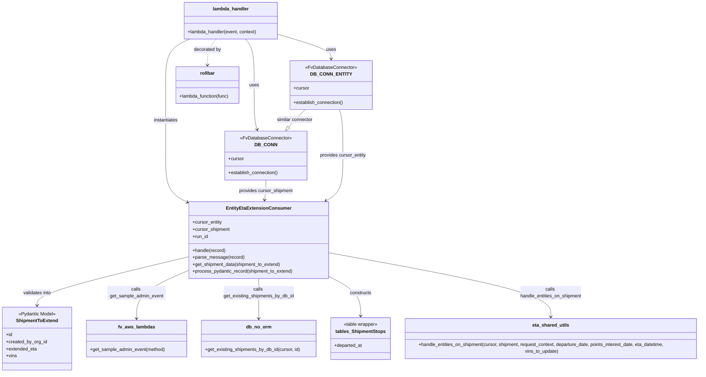

# Diagram: shipment_core/shipment_service/shipment_service/eta/consumers/entity_eta_extension_consumer.py

> Auto-generated by Obscura crawlers

## Mermaid

### SVG

<svg id="container" width="2460.7421875" xmlns="http://www.w3.org/2000/svg" class="classDiagram" height="1278" viewBox="0 0 2460.7421875 1278" role="graphics-document document" aria-roledescription="class"><g><defs><marker id="container_class-aggregationStart" class="marker aggregation class" refX="18" refY="7" markerWidth="190" markerHeight="240" orient="auto"><path d="M 18,7 L9,13 L1,7 L9,1 Z"></path></marker></defs><defs><marker id="container_class-aggregationEnd" class="marker aggregation class" refX="1" refY="7" markerWidth="20" markerHeight="28" orient="auto"><path d="M 18,7 L9,13 L1,7 L9,1 Z"></path></marker></defs><defs><marker id="container_class-extensionStart" class="marker extension class" refX="18" refY="7" markerWidth="190" markerHeight="240" orient="auto"><path d="M 1,7 L18,13 V 1 Z"></path></marker></defs><defs><marker id="container_class-extensionEnd" class="marker extension class" refX="1" refY="7" markerWidth="20" markerHeight="28" orient="auto"><path d="M 1,1 V 13 L18,7 Z"></path></marker></defs><defs><marker id="container_class-compositionStart" class="marker composition class" refX="18" refY="7" markerWidth="190" markerHeight="240" orient="auto"><path d="M 18,7 L9,13 L1,7 L9,1 Z"></path></marker></defs><defs><marker id="container_class-compositionEnd" class="marker composition class" refX="1" refY="7" markerWidth="20" markerHeight="28" orient="auto"><path d="M 18,7 L9,13 L1,7 L9,1 Z"></path></marker></defs><defs><marker id="container_class-dependencyStart" class="marker dependency class" refX="6" refY="7" markerWidth="190" markerHeight="240" orient="auto"><path d="M 5,7 L9,13 L1,7 L9,1 Z"></path></marker></defs><defs><marker id="container_class-dependencyEnd" class="marker dependency class" refX="13" refY="7" markerWidth="20" markerHeight="28" orient="auto"><path d="M 18,7 L9,13 L14,7 L9,1 Z"></path></marker></defs><defs><marker id="container_class-lollipopStart" class="marker lollipop class" refX="13" refY="7" markerWidth="190" markerHeight="240" orient="auto"><circle stroke="black" fill="transparent" cx="7" cy="7" r="6"></circle></marker></defs><defs><marker id="container_class-lollipopEnd" class="marker lollipop class" refX="1" refY="7" markerWidth="190" markerHeight="240" orient="auto"><circle stroke="black" fill="transparent" cx="7" cy="7" r="6"></circle></marker></defs><g class="root"><g class="clusters"></g><g class="edgePaths"><path d="M837.984,134L842.998,140.167C848.012,146.333,858.04,158.667,863.054,185C868.068,211.333,868.068,251.667,868.068,292C868.068,332.333,868.068,372.667,869.868,398.055C871.667,423.442,875.266,433.885,877.065,439.106L878.864,444.327" id="id_lambda_handler_DB_CONN_1" class="edge-thickness-normal edge-pattern-solid relation" style=";;;" data-edge="true" data-et="edge" data-id="id_lambda_handler_DB_CONN_1" data-points="W3sieCI6ODM3Ljk4NDE3OTY4NzUsInkiOjEzNH0seyJ4Ijo4NjguMDY4MzU5Mzc1LCJ5IjoxNzF9LHsieCI6ODY4LjA2ODM1OTM3NSwieSI6MjkyfSx7IngiOjg2OC4wNjgzNTkzNzUsInkiOjQxM30seyJ4Ijo4ODAuODE5MzYwMTQ5NzkzNCwieSI6NDUwfV0=" marker-end="url(#container_class-dependencyEnd)"></path><path d="M948.842,117.457L979.976,126.381C1011.11,135.305,1073.378,153.152,1104.512,167.243C1135.646,181.333,1135.646,191.667,1135.646,196.833L1135.646,202" id="id_lambda_handler_DB_CONN_ENTITY_2" class="edge-thickness-normal edge-pattern-solid relation" style=";;;" data-edge="true" data-et="edge" data-id="id_lambda_handler_DB_CONN_ENTITY_2" data-points="W3sieCI6OTQ4Ljg0MTc5Njg3NSwieSI6MTE3LjQ1NjkyMjEyOTU0MTUxfSx7IngiOjExMzUuNjQ2NDg0Mzc1LCJ5IjoxNzF9LHsieCI6MTEzNS42NDY0ODQzNzUsInkiOjIwOH1d" marker-end="url(#container_class-dependencyEnd)"></path><path d="M643.477,134L629.452,140.167C615.426,146.333,587.376,158.667,573.351,185C559.326,211.333,559.326,251.667,559.326,292C559.326,332.333,559.326,372.667,559.326,413C559.326,453.333,559.326,493.667,559.326,534C559.326,574.333,559.326,614.667,572.885,641.883C586.443,669.099,613.56,683.198,627.118,690.247L640.677,697.296" id="id_lambda_handler_EntityEtaExtensionConsumer_3" class="edge-thickness-normal edge-pattern-solid relation" style=";;;" data-edge="true" data-et="edge" data-id="id_lambda_handler_EntityEtaExtensionConsumer_3" data-points="W3sieCI6NjQzLjQ3NjYwMTU2MjUsInkiOjEzNH0seyJ4Ijo1NTkuMzI2MTcxODc1LCJ5IjoxNzF9LHsieCI6NTU5LjMyNjE3MTg3NSwieSI6MjkyfSx7IngiOjU1OS4zMjYxNzE4NzUsInkiOjQxM30seyJ4Ijo1NTkuMzI2MTcxODc1LCJ5Ijo1MzR9LHsieCI6NTU5LjMyNjE3MTg3NSwieSI6NjU1fSx7IngiOjY0NiwieSI6NzAwLjA2NDE2MTgwNDU1ODJ9XQ==" marker-end="url(#container_class-dependencyEnd)"></path><path d="M646,880.831L559.199,901.526C472.397,922.221,298.794,963.61,211.993,991.472C125.191,1019.333,125.191,1033.667,125.191,1040.833L125.191,1048" id="id_EntityEtaExtensionConsumer_ShipmentToExtend_4" class="edge-thickness-normal edge-pattern-solid relation" style=";;;" data-edge="true" data-et="edge" data-id="id_EntityEtaExtensionConsumer_ShipmentToExtend_4" data-points="W3sieCI6NjQ2LCJ5Ijo4ODAuODMxMjk5MjAyNDY5N30seyJ4IjoxMjUuMTkxNDA2MjUsInkiOjEwMDV9LHsieCI6MTI1LjE5MTQwNjI1LCJ5IjoxMDU0fV0=" marker-end="url(#container_class-dependencyEnd)"></path><path d="M646,926.76L615.751,939.8C585.503,952.84,525.005,978.92,494.757,1006.627C464.508,1034.333,464.508,1063.667,464.508,1078.333L464.508,1093" id="id_EntityEtaExtensionConsumer_fv_aws_lambdas_5" class="edge-thickness-normal edge-pattern-solid relation" style=";;;" data-edge="true" data-et="edge" data-id="id_EntityEtaExtensionConsumer_fv_aws_lambdas_5" data-points="W3sieCI6NjQ2LCJ5Ijo5MjYuNzYwMDQwOTM1OTQ0NX0seyJ4Ijo0NjQuNTA3ODEyNSwieSI6MTAwNX0seyJ4Ijo0NjQuNTA3ODEyNSwieSI6MTA5OX1d" marker-end="url(#container_class-dependencyEnd)"></path><path d="M884.371,956L884.371,964.167C884.371,972.333,884.371,988.667,884.371,1011.5C884.371,1034.333,884.371,1063.667,884.371,1078.333L884.371,1093" id="id_EntityEtaExtensionConsumer_db_no_orm_6" class="edge-thickness-normal edge-pattern-solid relation" style=";;;" data-edge="true" data-et="edge" data-id="id_EntityEtaExtensionConsumer_db_no_orm_6" data-points="W3sieCI6ODg0LjM3MTA5Mzc1LCJ5Ijo5NTZ9LHsieCI6ODg0LjM3MTA5Mzc1LCJ5IjoxMDA1fSx7IngiOjg4NC4zNzEwOTM3NSwieSI6MTA5OX1d" marker-end="url(#container_class-dependencyEnd)"></path><path d="M1122.742,947.477L1141.25,957.064C1159.758,966.651,1196.773,985.826,1215.281,1008.58C1233.789,1031.333,1233.789,1057.667,1233.789,1070.833L1233.789,1084" id="id_EntityEtaExtensionConsumer_tables_ShipmentStops_7" class="edge-thickness-normal edge-pattern-solid relation" style=";;;" data-edge="true" data-et="edge" data-id="id_EntityEtaExtensionConsumer_tables_ShipmentStops_7" data-points="W3sieCI6MTEyMi43NDIxODc1LCJ5Ijo5NDcuNDc3MjQ0NTI0OTM1NX0seyJ4IjoxMjMzLjc4OTA2MjUsInkiOjEwMDV9LHsieCI6MTIzMy43ODkwNjI1LCJ5IjoxMDkwfV0=" marker-end="url(#container_class-dependencyEnd)"></path><path d="M1122.742,865.697L1255.469,888.914C1388.197,912.131,1653.651,958.566,1786.378,996.449C1919.105,1034.333,1919.105,1063.667,1919.105,1078.333L1919.105,1093" id="id_EntityEtaExtensionConsumer_eta_shared_utils_8" class="edge-thickness-normal edge-pattern-solid relation" style=";;;" data-edge="true" data-et="edge" data-id="id_EntityEtaExtensionConsumer_eta_shared_utils_8" data-points="W3sieCI6MTEyMi43NDIxODc1LCJ5Ijo4NjUuNjk2ODUzODEyMTE5N30seyJ4IjoxOTE5LjEwNTQ2ODc1LCJ5IjoxMDA1fSx7IngiOjE5MTkuMTA1NDY4NzUsInkiOjEwOTl9XQ==" marker-end="url(#container_class-dependencyEnd)"></path><path d="M735.535,134L730.521,140.167C725.507,146.333,715.479,158.667,710.465,173.5C705.451,188.333,705.451,205.667,705.451,214.333L705.451,223" id="id_lambda_handler_rollbar_9" class="edge-thickness-normal edge-pattern-dashed relation" style=";;;" data-edge="true" data-et="edge" data-id="id_lambda_handler_rollbar_9" data-points="W3sieCI6NzM1LjUzNTM1MTU2MjUsInkiOjEzNH0seyJ4Ijo3MDUuNDUxMTcxODc1LCJ5IjoxNzF9LHsieCI6NzA1LjQ1MTE3MTg3NSwieSI6MjI5fV0=" marker-end="url(#container_class-dependencyEnd)"></path><path d="M1046.11,376L1039.537,382.167C1032.964,388.333,1019.818,400.667,1010.103,410.756C1000.389,420.845,994.106,428.69,990.965,432.613L987.823,436.536" id="id_DB_CONN_ENTITY_DB_CONN_10" class="edge-thickness-normal edge-pattern-solid relation" style=";;;" data-edge="true" data-et="edge" data-id="id_DB_CONN_ENTITY_DB_CONN_10" data-points="W3sieCI6MTA0Ni4xMTAzOTE5MTYzMjIyLCJ5IjozNzZ9LHsieCI6MTAwNi42NzE4NzUsInkiOjQxM30seyJ4Ijo5NzcuMDM5OTgyNTY3MTQ4NywieSI6NDUwfV0=" marker-end="url(#container_class-extensionEnd)"></path><path d="M909.768,618L909.768,624.167C909.768,630.333,909.768,642.667,908.989,654.011C908.211,665.356,906.655,675.711,905.877,680.889L905.099,686.067" id="id_DB_CONN_EntityEtaExtensionConsumer_11" class="edge-thickness-normal edge-pattern-solid relation" style=";;;" data-edge="true" data-et="edge" data-id="id_DB_CONN_EntityEtaExtensionConsumer_11" data-points="W3sieCI6OTA5Ljc2NzU3ODEyNSwieSI6NjE4fSx7IngiOjkwOS43Njc1NzgxMjUsInkiOjY1NX0seyJ4Ijo5MDQuMjA3NDAxMDcyNDg1MywieSI6NjkyfV0=" marker-end="url(#container_class-dependencyEnd)"></path><path d="M1164.595,376L1166.72,382.167C1168.845,388.333,1173.095,400.667,1175.221,427C1177.346,453.333,1177.346,493.667,1177.346,534C1177.346,574.333,1177.346,614.667,1167.522,640.5C1157.697,666.334,1138.049,677.668,1128.225,683.335L1118.401,689.002" id="id_DB_CONN_ENTITY_EntityEtaExtensionConsumer_12" class="edge-thickness-normal edge-pattern-solid relation" style=";;;" data-edge="true" data-et="edge" data-id="id_DB_CONN_ENTITY_EntityEtaExtensionConsumer_12" data-points="W3sieCI6MTE2NC41OTQ3MDIzNTAyMDY3LCJ5IjozNzZ9LHsieCI6MTE3Ny4zNDU3MDMxMjUsInkiOjQxM30seyJ4IjoxMTc3LjM0NTcwMzEyNSwieSI6NTM0fSx7IngiOjExNzcuMzQ1NzAzMTI1LCJ5Ijo2NTV9LHsieCI6MTExMy4yMDMzMzMwMjUxNDgsInkiOjY5Mn1d" marker-end="url(#container_class-dependencyEnd)"></path></g><g class="edgeLabels"><g class="edgeLabel" transform="translate(868.068359375, 292)"><g class="label" data-id="id_lambda_handler_DB_CONN_1" transform="translate(-16.4921875, -12)"><foreignObject width="32.984375" height="24">

uses

</foreignObject></g></g><g class="edgeLabel" transform="translate(1135.646484375, 171)"><g class="label" data-id="id_lambda_handler_DB_CONN_ENTITY_2" transform="translate(-16.4921875, -12)"><foreignObject width="32.984375" height="24">

uses

</foreignObject></g></g><g class="edgeLabel" transform="translate(559.326171875, 413)"><g class="label" data-id="id_lambda_handler_EntityEtaExtensionConsumer_3" transform="translate(-42.9140625, -12)"><foreignObject width="85.828125" height="24">

instantiates

</foreignObject></g></g><g class="edgeLabel" transform="translate(125.19140625, 1005)"><g class="label" data-id="id_EntityEtaExtensionConsumer_ShipmentToExtend_4" transform="translate(-49.1875, -12)"><foreignObject width="98.375" height="24">

validates into

</foreignObject></g></g><g class="edgeLabel" transform="translate(464.5078125, 1005)"><g class="label" data-id="id_EntityEtaExtensionConsumer_fv_aws_lambdas_5" transform="translate(-100, -24)"><foreignObject width="200" height="48">

calls get_sample_admin_event

</foreignObject></g></g><g class="edgeLabel" transform="translate(884.37109375, 1005)"><g class="label" data-id="id_EntityEtaExtensionConsumer_db_no_orm_6" transform="translate(-122.578125, -24)"><foreignObject width="245.15625" height="48">

calls get_existing_shipments_by_db_id

</foreignObject></g></g><g class="edgeLabel" transform="translate(1233.7890625, 1005)"><g class="label" data-id="id_EntityEtaExtensionConsumer_tables_ShipmentStops_7" transform="translate(-37.84375, -12)"><foreignObject width="75.6875" height="24">

constructs

</foreignObject></g></g><g class="edgeLabel" transform="translate(1919.10546875, 1005)"><g class="label" data-id="id_EntityEtaExtensionConsumer_eta_shared_utils_8" transform="translate(-108.03125, -24)"><foreignObject width="216.0625" height="48">

calls handle_entities_on_shipment

</foreignObject></g></g><g class="edgeLabel" transform="translate(705.451171875, 171)"><g class="label" data-id="id_lambda_handler_rollbar_9" transform="translate(-47.328125, -12)"><foreignObject width="94.65625" height="24">

decorated by

</foreignObject></g></g><g class="edgeLabel" transform="translate(1009.10576, 410.7166)"><g class="label" data-id="id_DB_CONN_ENTITY_DB_CONN_10" transform="translate(-63.3984375, -12)"><foreignObject width="126.796875" height="24">

similar connector

</foreignObject></g></g><g class="edgeLabel" transform="translate(909.767578125, 655)"><g class="label" data-id="id_DB_CONN_EntityEtaExtensionConsumer_11" transform="translate(-94.046875, -12)"><foreignObject width="188.09375" height="24">

provides cursor_shipment

</foreignObject></g></g><g class="edgeLabel" transform="translate(1177.345703125, 534)"><g class="label" data-id="id_DB_CONN_ENTITY_EntityEtaExtensionConsumer_12" transform="translate(-80.6328125, -12)"><foreignObject width="161.265625" height="24">

provides cursor_entity

</foreignObject></g></g></g><g class="nodes"><g class="node default" id="classId-EntityEtaExtensionConsumer-0" transform="translate(884.37109375, 824)"><g class="basic label-container"><path d="M-238.37109375 -132 L238.37109375 -132 L238.37109375 132 L-238.37109375 132" stroke="none" stroke-width="0" fill="#ECECFF" style=""></path><path d="M-238.37109375 -132 C-129.23728802020912 -132, -20.103482290418214 -132, 238.37109375 -132 M-238.37109375 -132 C-52.67602543429061 -132, 133.01904288141878 -132, 238.37109375 -132 M238.37109375 -132 C238.37109375 -43.2392073686225, 238.37109375 45.521585262754996, 238.37109375 132 M238.37109375 -132 C238.37109375 -35.87642341267404, 238.37109375 60.24715317465191, 238.37109375 132 M238.37109375 132 C92.34968375447656 132, -53.67172624104688 132, -238.37109375 132 M238.37109375 132 C133.10656540166673 132, 27.842037053333456 132, -238.37109375 132 M-238.37109375 132 C-238.37109375 74.03758970065329, -238.37109375 16.075179401306556, -238.37109375 -132 M-238.37109375 132 C-238.37109375 56.63887829225905, -238.37109375 -18.7222434154819, -238.37109375 -132" stroke="#9370DB" stroke-width="1.3" fill="none" stroke-dasharray="0 0" style=""></path></g><g class="annotation-group text" transform="translate(0, -108)"></g><g class="label-group text" transform="translate(-104.9609375, -108)"><g class="label" style="font-weight: bolder" transform="translate(0,-12)"><foreignObject width="209.921875" height="24">

EntityEtaExtensionConsumer

</foreignObject></g></g><g class="members-group text" transform="translate(-226.37109375, -60)"><g class="label" style="" transform="translate(0,-12)"><foreignObject width="102.390625" height="24">

+cursor_entity

</foreignObject></g><g class="label" style="" transform="translate(0,12)"><foreignObject width="129.203125" height="24">

+cursor_shipment

</foreignObject></g><g class="label" style="" transform="translate(0,36)"><foreignObject width="55.25" height="24">

+run_id

</foreignObject></g></g><g class="methods-group text" transform="translate(-226.37109375, 36)"><g class="label" style="" transform="translate(0,-12)"><foreignObject width="115.0625" height="24">

+handle(record)

</foreignObject></g><g class="label" style="" transform="translate(0,12)"><foreignObject width="175.265625" height="24">

+parse_message(record)

</foreignObject></g><g class="label" style="" transform="translate(0,36)"><foreignObject width="306.875" height="24">

+get_shipment_data(shipment_to_extend)

</foreignObject></g><g class="label" style="" transform="translate(0,60)"><foreignObject width="347.78125" height="24">

+process_pydantic_record(shipment_to_extend)

</foreignObject></g></g><g class="divider" style=""><path d="M-238.37109375 -84 C-101.85692955791288 -84, 34.657234634174245 -84, 238.37109375 -84 M-238.37109375 -84 C-118.17457984424036 -84, 2.021934061519289 -84, 238.37109375 -84" stroke="#9370DB" stroke-width="1.3" fill="none" stroke-dasharray="0 0" style=""></path></g><g class="divider" style=""><path d="M-238.37109375 12 C-53.01521804136013 12, 132.34065766727974 12, 238.37109375 12 M-238.37109375 12 C-49.334943591425116 12, 139.70120656714977 12, 238.37109375 12" stroke="#9370DB" stroke-width="1.3" fill="none" stroke-dasharray="0 0" style=""></path></g></g><g class="node default" id="classId-ShipmentToExtend-1" transform="translate(125.19140625, 1162)"><g class="basic label-container"><path d="M-117.19140625 -108 L117.19140625 -108 L117.19140625 108 L-117.19140625 108" stroke="none" stroke-width="0" fill="#ECECFF" style=""></path><path d="M-117.19140625 -108 C-42.41341595349803 -108, 32.36457434300394 -108, 117.19140625 -108 M-117.19140625 -108 C-39.03638903967857 -108, 39.118628170642864 -108, 117.19140625 -108 M117.19140625 -108 C117.19140625 -54.53755508483013, 117.19140625 -1.0751101696602632, 117.19140625 108 M117.19140625 -108 C117.19140625 -37.656290891987524, 117.19140625 32.68741821602495, 117.19140625 108 M117.19140625 108 C69.71629038273423 108, 22.241174515468444 108, -117.19140625 108 M117.19140625 108 C35.74533125409609 108, -45.70074374180783 108, -117.19140625 108 M-117.19140625 108 C-117.19140625 45.11036314846966, -117.19140625 -17.77927370306068, -117.19140625 -108 M-117.19140625 108 C-117.19140625 49.31250275195719, -117.19140625 -9.37499449608562, -117.19140625 -108" stroke="#9370DB" stroke-width="1.3" fill="none" stroke-dasharray="0 0" style=""></path></g><g class="annotation-group text" transform="translate(-64.9375, -84)"><g class="label" style="" transform="translate(0,-12)"><foreignObject width="129.875" height="24">

«Pydantic Model»

</foreignObject></g></g><g class="label-group text" transform="translate(-68.7421875, -60)"><g class="label" style="font-weight: bolder" transform="translate(0,-12)"><foreignObject width="137.484375" height="24">

ShipmentToExtend

</foreignObject></g></g><g class="members-group text" transform="translate(-105.19140625, -12)"><g class="label" style="" transform="translate(0,-12)"><foreignObject width="22.078125" height="24">

+id

</foreignObject></g><g class="label" style="" transform="translate(0,12)"><foreignObject width="141.640625" height="24">

+created_by_org_id

</foreignObject></g><g class="label" style="" transform="translate(0,36)"><foreignObject width="106.90625" height="24">

+extended_eta

</foreignObject></g><g class="label" style="" transform="translate(0,60)"><foreignObject width="37.0625" height="24">

+vins

</foreignObject></g></g><g class="methods-group text" transform="translate(-105.19140625, 108)"></g><g class="divider" style=""><path d="M-117.19140625 -36 C-70.1719306638228 -36, -23.152455077645612 -36, 117.19140625 -36 M-117.19140625 -36 C-26.62386979893523 -36, 63.94366665212954 -36, 117.19140625 -36" stroke="#9370DB" stroke-width="1.3" fill="none" stroke-dasharray="0 0" style=""></path></g><g class="divider" style=""><path d="M-117.19140625 84 C-45.252093607149845 84, 26.68721903570031 84, 117.19140625 84 M-117.19140625 84 C-34.56436732704255 84, 48.06267159591491 84, 117.19140625 84" stroke="#9370DB" stroke-width="1.3" fill="none" stroke-dasharray="0 0" style=""></path></g></g><g class="node default" id="classId-DB_CONN-2" transform="translate(909.767578125, 534)"><g class="basic label-container"><path d="M-142.31640625 -84 L142.31640625 -84 L142.31640625 84 L-142.31640625 84" stroke="none" stroke-width="0" fill="#ECECFF" style=""></path><path d="M-142.31640625 -84 C-44.04014458710158 -84, 54.23611707579684 -84, 142.31640625 -84 M-142.31640625 -84 C-58.03156208287608 -84, 26.253282084247843 -84, 142.31640625 -84 M142.31640625 -84 C142.31640625 -43.05124759530542, 142.31640625 -2.1024951906108384, 142.31640625 84 M142.31640625 -84 C142.31640625 -25.46561061785303, 142.31640625 33.06877876429394, 142.31640625 84 M142.31640625 84 C37.804016001213355 84, -66.70837424757329 84, -142.31640625 84 M142.31640625 84 C30.612965045155264 84, -81.09047615968947 84, -142.31640625 84 M-142.31640625 84 C-142.31640625 38.81274477822714, -142.31640625 -6.3745104435457165, -142.31640625 -84 M-142.31640625 84 C-142.31640625 28.924479150661483, -142.31640625 -26.151041698677034, -142.31640625 -84" stroke="#9370DB" stroke-width="1.3" fill="none" stroke-dasharray="0 0" style=""></path></g><g class="annotation-group text" transform="translate(-87.3671875, -60)"><g class="label" style="" transform="translate(0,-12)"><foreignObject width="174.734375" height="24">

«FvDatabaseConnector»

</foreignObject></g></g><g class="label-group text" transform="translate(-34.40625, -36)"><g class="label" style="font-weight: bolder" transform="translate(0,-12)"><foreignObject width="68.8125" height="24">

DB_CONN

</foreignObject></g></g><g class="members-group text" transform="translate(-130.31640625, 12)"><g class="label" style="" transform="translate(0,-12)"><foreignObject width="53.71875" height="24">

+cursor

</foreignObject></g></g><g class="methods-group text" transform="translate(-130.31640625, 60)"><g class="label" style="" transform="translate(0,-12)"><foreignObject width="173.265625" height="24">

+establish_connection()

</foreignObject></g></g><g class="divider" style=""><path d="M-142.31640625 -12 C-79.82225046190607 -12, -17.328094673812117 -12, 142.31640625 -12 M-142.31640625 -12 C-81.80118707096231 -12, -21.285967891924628 -12, 142.31640625 -12" stroke="#9370DB" stroke-width="1.3" fill="none" stroke-dasharray="0 0" style=""></path></g><g class="divider" style=""><path d="M-142.31640625 36 C-44.924682380381725 36, 52.46704148923655 36, 142.31640625 36 M-142.31640625 36 C-75.82135864463396 36, -9.326311039267921 36, 142.31640625 36" stroke="#9370DB" stroke-width="1.3" fill="none" stroke-dasharray="0 0" style=""></path></g></g><g class="node default" id="classId-DB_CONN_ENTITY-3" transform="translate(1135.646484375, 292)"><g class="basic label-container"><path d="M-142.31640625 -84 L142.31640625 -84 L142.31640625 84 L-142.31640625 84" stroke="none" stroke-width="0" fill="#ECECFF" style=""></path><path d="M-142.31640625 -84 C-69.65652051723202 -84, 3.0033652155359505 -84, 142.31640625 -84 M-142.31640625 -84 C-45.99801808649076 -84, 50.32037007701848 -84, 142.31640625 -84 M142.31640625 -84 C142.31640625 -29.243660274327212, 142.31640625 25.512679451345576, 142.31640625 84 M142.31640625 -84 C142.31640625 -45.18570509869658, 142.31640625 -6.3714101973931605, 142.31640625 84 M142.31640625 84 C41.37916349913141 84, -59.55807925173718 84, -142.31640625 84 M142.31640625 84 C58.328747320334074 84, -25.658911609331852 84, -142.31640625 84 M-142.31640625 84 C-142.31640625 49.595751007617366, -142.31640625 15.191502015234732, -142.31640625 -84 M-142.31640625 84 C-142.31640625 26.90894690680676, -142.31640625 -30.182106186386477, -142.31640625 -84" stroke="#9370DB" stroke-width="1.3" fill="none" stroke-dasharray="0 0" style=""></path></g><g class="annotation-group text" transform="translate(-87.3671875, -60)"><g class="label" style="" transform="translate(0,-12)"><foreignObject width="174.734375" height="24">

«FvDatabaseConnector»

</foreignObject></g></g><g class="label-group text" transform="translate(-63.8125, -36)"><g class="label" style="font-weight: bolder" transform="translate(0,-12)"><foreignObject width="127.625" height="24">

DB_CONN_ENTITY

</foreignObject></g></g><g class="members-group text" transform="translate(-130.31640625, 12)"><g class="label" style="" transform="translate(0,-12)"><foreignObject width="53.71875" height="24">

+cursor

</foreignObject></g></g><g class="methods-group text" transform="translate(-130.31640625, 60)"><g class="label" style="" transform="translate(0,-12)"><foreignObject width="173.265625" height="24">

+establish_connection()

</foreignObject></g></g><g class="divider" style=""><path d="M-142.31640625 -12 C-68.78587083080372 -12, 4.744664588392567 -12, 142.31640625 -12 M-142.31640625 -12 C-41.020438324169234 -12, 60.27552960166153 -12, 142.31640625 -12" stroke="#9370DB" stroke-width="1.3" fill="none" stroke-dasharray="0 0" style=""></path></g><g class="divider" style=""><path d="M-142.31640625 36 C-60.34541086468688 36, 21.625584520626234 36, 142.31640625 36 M-142.31640625 36 C-42.51803786560764 36, 57.28033051878472 36, 142.31640625 36" stroke="#9370DB" stroke-width="1.3" fill="none" stroke-dasharray="0 0" style=""></path></g></g><g class="node default" id="classId-lambda_handler-4" transform="translate(786.759765625, 71)"><g class="basic label-container"><path d="M-162.08203125 -63 L162.08203125 -63 L162.08203125 63 L-162.08203125 63" stroke="none" stroke-width="0" fill="#ECECFF" style=""></path><path d="M-162.08203125 -63 C-81.25108757324476 -63, -0.42014389648952033 -63, 162.08203125 -63 M-162.08203125 -63 C-34.10988018245824 -63, 93.86227088508352 -63, 162.08203125 -63 M162.08203125 -63 C162.08203125 -28.683551997987202, 162.08203125 5.632896004025596, 162.08203125 63 M162.08203125 -63 C162.08203125 -34.45000821253177, 162.08203125 -5.900016425063541, 162.08203125 63 M162.08203125 63 C47.766344033668304 63, -66.54934318266339 63, -162.08203125 63 M162.08203125 63 C37.565959338986204 63, -86.95011257202759 63, -162.08203125 63 M-162.08203125 63 C-162.08203125 16.15430310442914, -162.08203125 -30.69139379114172, -162.08203125 -63 M-162.08203125 63 C-162.08203125 25.11393189445483, -162.08203125 -12.772136211090341, -162.08203125 -63" stroke="#9370DB" stroke-width="1.3" fill="none" stroke-dasharray="0 0" style=""></path></g><g class="annotation-group text" transform="translate(0, -39)"></g><g class="label-group text" transform="translate(-59.9765625, -39)"><g class="label" style="font-weight: bolder" transform="translate(0,-12)"><foreignObject width="119.953125" height="24">

lambda_handler

</foreignObject></g></g><g class="members-group text" transform="translate(-150.08203125, 9)"></g><g class="methods-group text" transform="translate(-150.08203125, 39)"><g class="label" style="" transform="translate(0,-12)"><foreignObject width="240.1875" height="24">

+lambda_handler(event, context)

</foreignObject></g></g><g class="divider" style=""><path d="M-162.08203125 -15 C-94.41302099266657 -15, -26.74401073533315 -15, 162.08203125 -15 M-162.08203125 -15 C-88.16368094368661 -15, -14.245330637373229 -15, 162.08203125 -15" stroke="#9370DB" stroke-width="1.3" fill="none" stroke-dasharray="0 0" style=""></path></g><g class="divider" style=""><path d="M-162.08203125 9 C-42.05624389801778 9, 77.96954345396443 9, 162.08203125 9 M-162.08203125 9 C-51.41254566523061 9, 59.25693991953878 9, 162.08203125 9" stroke="#9370DB" stroke-width="1.3" fill="none" stroke-dasharray="0 0" style=""></path></g></g><g class="node default" id="classId-db_no_orm-5" transform="translate(884.37109375, 1162)"><g class="basic label-container"><path d="M-197.73828125 -63 L197.73828125 -63 L197.73828125 63 L-197.73828125 63" stroke="none" stroke-width="0" fill="#ECECFF" style=""></path><path d="M-197.73828125 -63 C-116.06385760158506 -63, -34.38943395317011 -63, 197.73828125 -63 M-197.73828125 -63 C-89.82580048126717 -63, 18.08668028746567 -63, 197.73828125 -63 M197.73828125 -63 C197.73828125 -36.67873750891381, 197.73828125 -10.357475017827625, 197.73828125 63 M197.73828125 -63 C197.73828125 -25.87698894308261, 197.73828125 11.246022113834783, 197.73828125 63 M197.73828125 63 C106.29164366260372 63, 14.845006075207436 63, -197.73828125 63 M197.73828125 63 C55.01163020080318 63, -87.71502084839364 63, -197.73828125 63 M-197.73828125 63 C-197.73828125 21.581960590916708, -197.73828125 -19.836078818166584, -197.73828125 -63 M-197.73828125 63 C-197.73828125 30.828081410413446, -197.73828125 -1.3438371791731072, -197.73828125 -63" stroke="#9370DB" stroke-width="1.3" fill="none" stroke-dasharray="0 0" style=""></path></g><g class="annotation-group text" transform="translate(0, -39)"></g><g class="label-group text" transform="translate(-41.3515625, -39)"><g class="label" style="font-weight: bolder" transform="translate(0,-12)"><foreignObject width="82.703125" height="24">

db_no_orm

</foreignObject></g></g><g class="members-group text" transform="translate(-185.73828125, 9)"></g><g class="methods-group text" transform="translate(-185.73828125, 39)"><g class="label" style="" transform="translate(0,-12)"><foreignObject width="330.125" height="24">

+get_existing_shipments_by_db_id(cursor, id)

</foreignObject></g></g><g class="divider" style=""><path d="M-197.73828125 -15 C-64.33895780230083 -15, 69.06036564539835 -15, 197.73828125 -15 M-197.73828125 -15 C-57.54977372781181 -15, 82.63873379437638 -15, 197.73828125 -15" stroke="#9370DB" stroke-width="1.3" fill="none" stroke-dasharray="0 0" style=""></path></g><g class="divider" style=""><path d="M-197.73828125 9 C-72.68583169177144 9, 52.36661786645712 9, 197.73828125 9 M-197.73828125 9 C-94.4870665572581 9, 8.764148135483794 9, 197.73828125 9" stroke="#9370DB" stroke-width="1.3" fill="none" stroke-dasharray="0 0" style=""></path></g></g><g class="node default" id="classId-tables_ShipmentStops-6" transform="translate(1233.7890625, 1162)"><g class="basic label-container"><path d="M-101.6796875 -72 L101.6796875 -72 L101.6796875 72 L-101.6796875 72" stroke="none" stroke-width="0" fill="#ECECFF" style=""></path><path d="M-101.6796875 -72 C-36.241636535953475 -72, 29.19641442809305 -72, 101.6796875 -72 M-101.6796875 -72 C-57.8035695960656 -72, -13.9274516921312 -72, 101.6796875 -72 M101.6796875 -72 C101.6796875 -20.39213037619875, 101.6796875 31.2157392476025, 101.6796875 72 M101.6796875 -72 C101.6796875 -39.75619653722634, 101.6796875 -7.512393074452675, 101.6796875 72 M101.6796875 72 C43.17898916947812 72, -15.321709161043756 72, -101.6796875 72 M101.6796875 72 C54.45180875595942 72, 7.2239300119188385 72, -101.6796875 72 M-101.6796875 72 C-101.6796875 39.306158810502176, -101.6796875 6.612317621004351, -101.6796875 -72 M-101.6796875 72 C-101.6796875 28.107363837411896, -101.6796875 -15.785272325176209, -101.6796875 -72" stroke="#9370DB" stroke-width="1.3" fill="none" stroke-dasharray="0 0" style=""></path></g><g class="annotation-group text" transform="translate(-59.6171875, -48)"><g class="label" style="" transform="translate(0,-12)"><foreignObject width="119.234375" height="24">

«table wrapper»

</foreignObject></g></g><g class="label-group text" transform="translate(-82.546875, -24)"><g class="label" style="font-weight: bolder" transform="translate(0,-12)"><foreignObject width="165.09375" height="24">

tables_ShipmentStops

</foreignObject></g></g><g class="members-group text" transform="translate(-89.6796875, 24)"><g class="label" style="" transform="translate(0,-12)"><foreignObject width="96.8125" height="24">

+departed_at

</foreignObject></g></g><g class="methods-group text" transform="translate(-89.6796875, 72)"></g><g class="divider" style=""><path d="M-101.6796875 0 C-31.586440693073754 0, 38.50680611385249 0, 101.6796875 0 M-101.6796875 0 C-42.01178038837124 0, 17.656126723257515 0, 101.6796875 0" stroke="#9370DB" stroke-width="1.3" fill="none" stroke-dasharray="0 0" style=""></path></g><g class="divider" style=""><path d="M-101.6796875 48 C-53.54564798245561 48, -5.411608464911225 48, 101.6796875 48 M-101.6796875 48 C-39.93425571796304 48, 21.81117606407392 48, 101.6796875 48" stroke="#9370DB" stroke-width="1.3" fill="none" stroke-dasharray="0 0" style=""></path></g></g><g class="node default" id="classId-fv_aws_lambdas-7" transform="translate(464.5078125, 1162)"><g class="basic label-container"><path d="M-172.125 -63 L172.125 -63 L172.125 63 L-172.125 63" stroke="none" stroke-width="0" fill="#ECECFF" style=""></path><path d="M-172.125 -63 C-92.608534761131 -63, -13.092069522261994 -63, 172.125 -63 M-172.125 -63 C-90.72990586437044 -63, -9.334811728740874 -63, 172.125 -63 M172.125 -63 C172.125 -36.570391376275495, 172.125 -10.140782752550997, 172.125 63 M172.125 -63 C172.125 -26.22371964875861, 172.125 10.55256070248278, 172.125 63 M172.125 63 C86.07629793079481 63, 0.027595861589617243 63, -172.125 63 M172.125 63 C37.880675900499796 63, -96.36364819900041 63, -172.125 63 M-172.125 63 C-172.125 34.184905693260504, -172.125 5.369811386521, -172.125 -63 M-172.125 63 C-172.125 20.60668285826653, -172.125 -21.786634283466938, -172.125 -63" stroke="#9370DB" stroke-width="1.3" fill="none" stroke-dasharray="0 0" style=""></path></g><g class="annotation-group text" transform="translate(0, -39)"></g><g class="label-group text" transform="translate(-60.0625, -39)"><g class="label" style="font-weight: bolder" transform="translate(0,-12)"><foreignObject width="120.125" height="24">

fv_aws_lambdas

</foreignObject></g></g><g class="members-group text" transform="translate(-160.125, 9)"></g><g class="methods-group text" transform="translate(-160.125, 39)"><g class="label" style="" transform="translate(0,-12)"><foreignObject width="260.1875" height="24">

+get_sample_admin_event(method)

</foreignObject></g></g><g class="divider" style=""><path d="M-172.125 -15 C-44.00885516022993 -15, 84.10728967954014 -15, 172.125 -15 M-172.125 -15 C-34.44916831657707 -15, 103.22666336684586 -15, 172.125 -15" stroke="#9370DB" stroke-width="1.3" fill="none" stroke-dasharray="0 0" style=""></path></g><g class="divider" style=""><path d="M-172.125 9 C-49.58102936524543 9, 72.96294126950914 9, 172.125 9 M-172.125 9 C-59.692185452473225 9, 52.74062909505355 9, 172.125 9" stroke="#9370DB" stroke-width="1.3" fill="none" stroke-dasharray="0 0" style=""></path></g></g><g class="node default" id="classId-eta_shared_utils-8" transform="translate(1919.10546875, 1162)"><g class="basic label-container"><path d="M-533.63671875 -63 L533.63671875 -63 L533.63671875 63 L-533.63671875 63" stroke="none" stroke-width="0" fill="#ECECFF" style=""></path><path d="M-533.63671875 -63 C-300.8157686413795 -63, -67.99481853275904 -63, 533.63671875 -63 M-533.63671875 -63 C-131.59643464194437 -63, 270.44384946611126 -63, 533.63671875 -63 M533.63671875 -63 C533.63671875 -36.46418680798618, 533.63671875 -9.928373615972369, 533.63671875 63 M533.63671875 -63 C533.63671875 -33.0032839338824, 533.63671875 -3.006567867764808, 533.63671875 63 M533.63671875 63 C254.60612091976918 63, -24.424476910461635 63, -533.63671875 63 M533.63671875 63 C115.68918103785217 63, -302.25835667429567 63, -533.63671875 63 M-533.63671875 63 C-533.63671875 18.619825734873537, -533.63671875 -25.760348530252926, -533.63671875 -63 M-533.63671875 63 C-533.63671875 18.848387446942994, -533.63671875 -25.303225106114013, -533.63671875 -63" stroke="#9370DB" stroke-width="1.3" fill="none" stroke-dasharray="0 0" style=""></path></g><g class="annotation-group text" transform="translate(0, -39)"></g><g class="label-group text" transform="translate(-61.1640625, -39)"><g class="label" style="font-weight: bolder" transform="translate(0,-12)"><foreignObject width="122.328125" height="24">

eta_shared_utils

</foreignObject></g></g><g class="members-group text" transform="translate(-521.63671875, 9)"></g><g class="methods-group text" transform="translate(-521.63671875, 39)"><g class="label" style="" transform="translate(0,-12)"><foreignObject width="982.109375" height="24">

+handle_entities_on_shipment(cursor, shipment, request_context, departure_date, points_interest_date, eta_datetime, vins_to_update)

</foreignObject></g></g><g class="divider" style=""><path d="M-533.63671875 -15 C-123.75595786218992 -15, 286.12480302562017 -15, 533.63671875 -15 M-533.63671875 -15 C-230.04326750615814 -15, 73.55018373768371 -15, 533.63671875 -15" stroke="#9370DB" stroke-width="1.3" fill="none" stroke-dasharray="0 0" style=""></path></g><g class="divider" style=""><path d="M-533.63671875 9 C-239.75689769401475 9, 54.12292336197049 9, 533.63671875 9 M-533.63671875 9 C-159.36546981154328 9, 214.90577912691344 9, 533.63671875 9" stroke="#9370DB" stroke-width="1.3" fill="none" stroke-dasharray="0 0" style=""></path></g></g><g class="node default" id="classId-rollbar-9" transform="translate(705.451171875, 292)"><g class="basic label-container"><path d="M-111.125 -63 L111.125 -63 L111.125 63 L-111.125 63" stroke="none" stroke-width="0" fill="#ECECFF" style=""></path><path d="M-111.125 -63 C-41.729158957033576 -63, 27.666682085932848 -63, 111.125 -63 M-111.125 -63 C-51.49004167006683 -63, 8.14491665986634 -63, 111.125 -63 M111.125 -63 C111.125 -15.396408590324853, 111.125 32.207182819350294, 111.125 63 M111.125 -63 C111.125 -23.896875334193915, 111.125 15.20624933161217, 111.125 63 M111.125 63 C26.499357520755254 63, -58.12628495848949 63, -111.125 63 M111.125 63 C36.019358785662334 63, -39.08628242867533 63, -111.125 63 M-111.125 63 C-111.125 19.375890506658088, -111.125 -24.248218986683824, -111.125 -63 M-111.125 63 C-111.125 18.318883850258032, -111.125 -26.362232299483935, -111.125 -63" stroke="#9370DB" stroke-width="1.3" fill="none" stroke-dasharray="0 0" style=""></path></g><g class="annotation-group text" transform="translate(0, -39)"></g><g class="label-group text" transform="translate(-24.6875, -39)"><g class="label" style="font-weight: bolder" transform="translate(0,-12)"><foreignObject width="49.375" height="24">

rollbar

</foreignObject></g></g><g class="members-group text" transform="translate(-99.125, 9)"></g><g class="methods-group text" transform="translate(-99.125, 39)"><g class="label" style="" transform="translate(0,-12)"><foreignObject width="173.5625" height="24">

+lambda_function(func)

</foreignObject></g></g><g class="divider" style=""><path d="M-111.125 -15 C-44.38847295422062 -15, 22.348054091558765 -15, 111.125 -15 M-111.125 -15 C-31.394018022600676 -15, 48.33696395479865 -15, 111.125 -15" stroke="#9370DB" stroke-width="1.3" fill="none" stroke-dasharray="0 0" style=""></path></g><g class="divider" style=""><path d="M-111.125 9 C-43.57971502145661 9, 23.965569957086785 9, 111.125 9 M-111.125 9 C-56.11733014162488 9, -1.1096602832497666 9, 111.125 9" stroke="#9370DB" stroke-width="1.3" fill="none" stroke-dasharray="0 0" style=""></path></g></g></g></g></g></svg>
