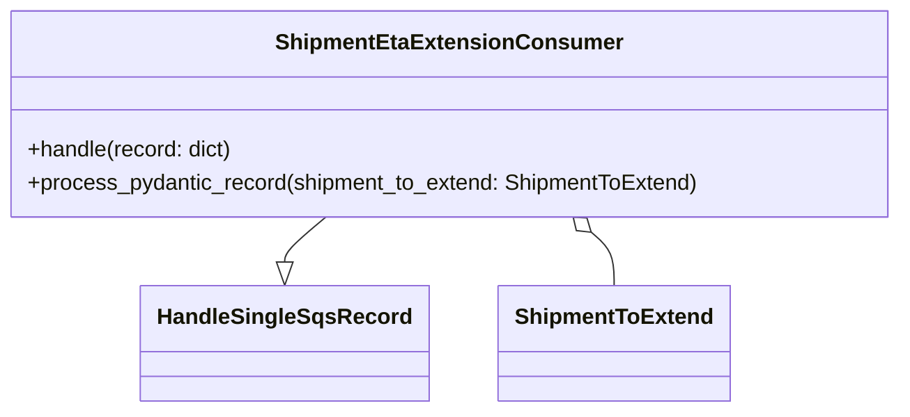

# Diagram: shipment_core/shipment_service/shipment_service/eta/consumers/shipment_eta_extension_consumer.py


> Auto-generated by Obscura crawlers

## Diagram 1



### SVG

<svg id="container" width="650.6015625" xmlns="http://www.w3.org/2000/svg" class="classDiagram" height="300" viewBox="0 0 650.6015625 300" role="graphics-document document" aria-roledescription="class"><style>#container{font-family:"trebuchet ms",verdana,arial,sans-serif;font-size:16px;fill:#333;}@keyframes edge-animation-frame{from{stroke-dashoffset:0;}}@keyframes dash{to{stroke-dashoffset:0;}}#container .edge-animation-slow{stroke-dasharray:9,5!important;stroke-dashoffset:900;animation:dash 50s linear infinite;stroke-linecap:round;}#container .edge-animation-fast{stroke-dasharray:9,5!important;stroke-dashoffset:900;animation:dash 20s linear infinite;stroke-linecap:round;}#container .error-icon{fill:#552222;}#container .error-text{fill:#552222;stroke:#552222;}#container .edge-thickness-normal{stroke-width:1px;}#container .edge-thickness-thick{stroke-width:3.5px;}#container .edge-pattern-solid{stroke-dasharray:0;}#container .edge-thickness-invisible{stroke-width:0;fill:none;}#container .edge-pattern-dashed{stroke-dasharray:3;}#container .edge-pattern-dotted{stroke-dasharray:2;}#container .marker{fill:#333333;stroke:#333333;}#container .marker.cross{stroke:#333333;}#container svg{font-family:"trebuchet ms",verdana,arial,sans-serif;font-size:16px;}#container p{margin:0;}#container g.classGroup text{fill:#9370DB;stroke:none;font-family:"trebuchet ms",verdana,arial,sans-serif;font-size:10px;}#container g.classGroup text .title{font-weight:bolder;}#container .nodeLabel,#container .edgeLabel{color:#131300;}#container .edgeLabel .label rect{fill:#ECECFF;}#container .label text{fill:#131300;}#container .labelBkg{background:#ECECFF;}#container .edgeLabel .label span{background:#ECECFF;}#container .classTitle{font-weight:bolder;}#container .node rect,#container .node circle,#container .node ellipse,#container .node polygon,#container .node path{fill:#ECECFF;stroke:#9370DB;stroke-width:1px;}#container .divider{stroke:#9370DB;stroke-width:1;}#container g.clickable{cursor:pointer;}#container g.classGroup rect{fill:#ECECFF;stroke:#9370DB;}#container g.classGroup line{stroke:#9370DB;stroke-width:1;}#container .classLabel .box{stroke:none;stroke-width:0;fill:#ECECFF;opacity:0.5;}#container .classLabel .label{fill:#9370DB;font-size:10px;}#container .relation{stroke:#333333;stroke-width:1;fill:none;}#container .dashed-line{stroke-dasharray:3;}#container .dotted-line{stroke-dasharray:1 2;}#container #compositionStart,#container .composition{fill:#333333!important;stroke:#333333!important;stroke-width:1;}#container #compositionEnd,#container .composition{fill:#333333!important;stroke:#333333!important;stroke-width:1;}#container #dependencyStart,#container .dependency{fill:#333333!important;stroke:#333333!important;stroke-width:1;}#container #dependencyStart,#container .dependency{fill:#333333!important;stroke:#333333!important;stroke-width:1;}#container #extensionStart,#container .extension{fill:transparent!important;stroke:#333333!important;stroke-width:1;}#container #extensionEnd,#container .extension{fill:transparent!important;stroke:#333333!important;stroke-width:1;}#container #aggregationStart,#container .aggregation{fill:transparent!important;stroke:#333333!important;stroke-width:1;}#container #aggregationEnd,#container .aggregation{fill:transparent!important;stroke:#333333!important;stroke-width:1;}#container #lollipopStart,#container .lollipop{fill:#ECECFF!important;stroke:#333333!important;stroke-width:1;}#container #lollipopEnd,#container .lollipop{fill:#ECECFF!important;stroke:#333333!important;stroke-width:1;}#container .edgeTerminals{font-size:11px;line-height:initial;}#container .classTitleText{text-anchor:middle;font-size:18px;fill:#333;}#container .label-icon{display:inline-block;height:1em;overflow:visible;vertical-align:-0.125em;}#container .node .label-icon path{fill:currentColor;stroke:revert;stroke-width:revert;}#container :root{--mermaid-font-family:"trebuchet ms",verdana,arial,sans-serif;}</style><g><defs><marker id="container_class-aggregationStart" class="marker aggregation class" refX="18" refY="7" markerWidth="190" markerHeight="240" orient="auto"><path d="M 18,7 L9,13 L1,7 L9,1 Z"></path></marker></defs><defs><marker id="container_class-aggregationEnd" class="marker aggregation class" refX="1" refY="7" markerWidth="20" markerHeight="28" orient="auto"><path d="M 18,7 L9,13 L1,7 L9,1 Z"></path></marker></defs><defs><marker id="container_class-extensionStart" class="marker extension class" refX="18" refY="7" markerWidth="190" markerHeight="240" orient="auto"><path d="M 1,7 L18,13 V 1 Z"></path></marker></defs><defs><marker id="container_class-extensionEnd" class="marker extension class" refX="1" refY="7" markerWidth="20" markerHeight="28" orient="auto"><path d="M 1,1 V 13 L18,7 Z"></path></marker></defs><defs><marker id="container_class-compositionStart" class="marker composition class" refX="18" refY="7" markerWidth="190" markerHeight="240" orient="auto"><path d="M 18,7 L9,13 L1,7 L9,1 Z"></path></marker></defs><defs><marker id="container_class-compositionEnd" class="marker composition class" refX="1" refY="7" markerWidth="20" markerHeight="28" orient="auto"><path d="M 18,7 L9,13 L1,7 L9,1 Z"></path></marker></defs><defs><marker id="container_class-dependencyStart" class="marker dependency class" refX="6" refY="7" markerWidth="190" markerHeight="240" orient="auto"><path d="M 5,7 L9,13 L1,7 L9,1 Z"></path></marker></defs><defs><marker id="container_class-dependencyEnd" class="marker dependency class" refX="13" refY="7" markerWidth="20" markerHeight="28" orient="auto"><path d="M 18,7 L9,13 L14,7 L9,1 Z"></path></marker></defs><defs><marker id="container_class-lollipopStart" class="marker lollipop class" refX="13" refY="7" markerWidth="190" markerHeight="240" orient="auto"><circle stroke="black" fill="transparent" cx="7" cy="7" r="6"></circle></marker></defs><defs><marker id="container_class-lollipopEnd" class="marker lollipop class" refX="1" refY="7" markerWidth="190" markerHeight="240" orient="auto"><circle stroke="black" fill="transparent" cx="7" cy="7" r="6"></circle></marker></defs><g class="root"><g class="clusters"></g><g class="edgePaths"><path d="M239.118,158L234.33,162.167C229.542,166.333,219.966,174.667,215.179,180.125C210.391,185.583,210.391,188.167,210.391,189.458L210.391,190.75" id="id_ShipmentEtaExtensionConsumer_HandleSingleSqsRecord_1" class="edge-thickness-normal edge-pattern-solid relation" style=";;;" data-edge="true" data-et="edge" data-id="id_ShipmentEtaExtensionConsumer_HandleSingleSqsRecord_1" data-points="W3sieCI6MjM5LjExODE2NDA2MjUsInkiOjE1OH0seyJ4IjoyMTAuMzkwNjI1LCJ5IjoxODN9LHsieCI6MjEwLjM5MDYyNSwieSI6MjA4fV0=" marker-end="url(#container_class-extensionEnd)"></path><path d="M424.496,169.324L427.115,171.603C429.734,173.883,434.973,178.441,437.592,184.887C440.211,191.333,440.211,199.667,440.211,203.833L440.211,208" id="id_ShipmentEtaExtensionConsumer_ShipmentToExtend_2" class="edge-thickness-normal edge-pattern-solid relation" style=";;;" data-edge="true" data-et="edge" data-id="id_ShipmentEtaExtensionConsumer_ShipmentToExtend_2" data-points="W3sieCI6NDExLjQ4MzM5ODQzNzUsInkiOjE1OH0seyJ4Ijo0NDAuMjEwOTM3NSwieSI6MTgzfSx7IngiOjQ0MC4yMTA5Mzc1LCJ5IjoyMDh9XQ==" marker-start="url(#container_class-aggregationStart)"></path></g><g class="edgeLabels"><g class="edgeLabel"><g class="label" data-id="id_ShipmentEtaExtensionConsumer_HandleSingleSqsRecord_1" transform="translate(0, 0)"><foreignObject width="0" height="0"><div xmlns="http://www.w3.org/1999/xhtml" class="labelBkg" style="display: table-cell; white-space: nowrap; line-height: 1.5; max-width: 200px; text-align: center;"><span class="edgeLabel"></span></div></foreignObject></g></g><g class="edgeLabel"><g class="label" data-id="id_ShipmentEtaExtensionConsumer_ShipmentToExtend_2" transform="translate(0, 0)"><foreignObject width="0" height="0"><div xmlns="http://www.w3.org/1999/xhtml" class="labelBkg" style="display: table-cell; white-space: nowrap; line-height: 1.5; max-width: 200px; text-align: center;"><span class="edgeLabel"></span></div></foreignObject></g></g></g><g class="nodes"><g class="node default" id="classId-HandleSingleSqsRecord-0" transform="translate(210.390625, 250)"><g class="basic label-container"><path d="M-99.078125 -42 L99.078125 -42 L99.078125 42 L-99.078125 42" stroke="none" stroke-width="0" fill="#ECECFF" style=""></path><path d="M-99.078125 -42 C-27.254550792825654 -42, 44.56902341434869 -42, 99.078125 -42 M-99.078125 -42 C-50.406871944644955 -42, -1.7356188892899098 -42, 99.078125 -42 M99.078125 -42 C99.078125 -22.06527896806726, 99.078125 -2.1305579361345224, 99.078125 42 M99.078125 -42 C99.078125 -13.988706613657708, 99.078125 14.022586772684583, 99.078125 42 M99.078125 42 C58.85073829634035 42, 18.623351592680706 42, -99.078125 42 M99.078125 42 C39.49498203019787 42, -20.088160939604265 42, -99.078125 42 M-99.078125 42 C-99.078125 13.828119793957583, -99.078125 -14.343760412084833, -99.078125 -42 M-99.078125 42 C-99.078125 16.366579324666766, -99.078125 -9.266841350666468, -99.078125 -42" stroke="#9370DB" stroke-width="1.3" fill="none" stroke-dasharray="0 0" style=""></path></g><g class="annotation-group text" transform="translate(0, -18)"></g><g class="label-group text" transform="translate(-87.078125, -18)"><g class="label" style="font-weight: bolder" transform="translate(0,-12)"><foreignObject width="174.15625" height="24"><div xmlns="http://www.w3.org/1999/xhtml" style="display: table-cell; white-space: nowrap; line-height: 1.5; max-width: 222px; text-align: center;"><span class="nodeLabel markdown-node-label" style=""><p>HandleSingleSqsRecord</p></span></div></foreignObject></g></g><g class="members-group text" transform="translate(-87.078125, 30)"></g><g class="methods-group text" transform="translate(-87.078125, 60)"></g><g class="divider" style=""><path d="M-99.078125 6 C-30.35424259694713 6, 38.36963980610574 6, 99.078125 6 M-99.078125 6 C-46.19590930363705 6, 6.686306392725896 6, 99.078125 6" stroke="#9370DB" stroke-width="1.3" fill="none" stroke-dasharray="0 0" style=""></path></g><g class="divider" style=""><path d="M-99.078125 24 C-35.25830544575075 24, 28.5615141084985 24, 99.078125 24 M-99.078125 24 C-24.689048255183906 24, 49.70002848963219 24, 99.078125 24" stroke="#9370DB" stroke-width="1.3" fill="none" stroke-dasharray="0 0" style=""></path></g></g><g class="node default" id="classId-ShipmentEtaExtensionConsumer-1" transform="translate(325.30078125, 83)"><g class="basic label-container"><path d="M-317.30078125 -75 L317.30078125 -75 L317.30078125 75 L-317.30078125 75" stroke="none" stroke-width="0" fill="#ECECFF" style=""></path><path d="M-317.30078125 -75 C-170.9147477288159 -75, -24.528714207631822 -75, 317.30078125 -75 M-317.30078125 -75 C-181.23709489241048 -75, -45.173408534820965 -75, 317.30078125 -75 M317.30078125 -75 C317.30078125 -30.213726819201078, 317.30078125 14.572546361597844, 317.30078125 75 M317.30078125 -75 C317.30078125 -15.04199068776014, 317.30078125 44.91601862447972, 317.30078125 75 M317.30078125 75 C93.69957163562015 75, -129.9016379787597 75, -317.30078125 75 M317.30078125 75 C184.27063385223312 75, 51.240486454466236 75, -317.30078125 75 M-317.30078125 75 C-317.30078125 26.401094535069006, -317.30078125 -22.197810929861987, -317.30078125 -75 M-317.30078125 75 C-317.30078125 22.221866136371155, -317.30078125 -30.55626772725769, -317.30078125 -75" stroke="#9370DB" stroke-width="1.3" fill="none" stroke-dasharray="0 0" style=""></path></g><g class="annotation-group text" transform="translate(0, -51)"></g><g class="label-group text" transform="translate(-118.7890625, -51)"><g class="label" style="font-weight: bolder" transform="translate(0,-12)"><foreignObject width="237.578125" height="24"><div xmlns="http://www.w3.org/1999/xhtml" style="display: table-cell; white-space: nowrap; line-height: 1.5; max-width: 287px; text-align: center;"><span class="nodeLabel markdown-node-label" style=""><p>ShipmentEtaExtensionConsumer</p></span></div></foreignObject></g></g><g class="members-group text" transform="translate(-305.30078125, -3)"></g><g class="methods-group text" transform="translate(-305.30078125, 27)"><g class="label" style="" transform="translate(0,-12)"><foreignObject width="150.640625" height="24"><div xmlns="http://www.w3.org/1999/xhtml" style="display: table-cell; white-space: nowrap; line-height: 1.5; max-width: 208px; text-align: center;"><span class="nodeLabel markdown-node-label" style=""><p>+handle(record: dict)</p></span></div></foreignObject></g><g class="label" style="" transform="translate(0,12)"><foreignObject width="491.8125" height="24"><div xmlns="http://www.w3.org/1999/xhtml" style="display: table-cell; white-space: nowrap; line-height: 1.5; max-width: 549px; text-align: center;"><span class="nodeLabel markdown-node-label" style=""><p>+process_pydantic_record(shipment_to_extend: ShipmentToExtend)</p></span></div></foreignObject></g></g><g class="divider" style=""><path d="M-317.30078125 -27 C-74.27026848126923 -27, 168.76024428746155 -27, 317.30078125 -27 M-317.30078125 -27 C-117.00761625580083 -27, 83.28554873839835 -27, 317.30078125 -27" stroke="#9370DB" stroke-width="1.3" fill="none" stroke-dasharray="0 0" style=""></path></g><g class="divider" style=""><path d="M-317.30078125 -3 C-174.4466562195468 -3, -31.59253118909362 -3, 317.30078125 -3 M-317.30078125 -3 C-133.19930924049916 -3, 50.90216276900168 -3, 317.30078125 -3" stroke="#9370DB" stroke-width="1.3" fill="none" stroke-dasharray="0 0" style=""></path></g></g><g class="node default" id="classId-ShipmentToExtend-2" transform="translate(440.2109375, 250)"><g class="basic label-container"><path d="M-80.7421875 -42 L80.7421875 -42 L80.7421875 42 L-80.7421875 42" stroke="none" stroke-width="0" fill="#ECECFF" style=""></path><path d="M-80.7421875 -42 C-40.3172966289002 -42, 0.10759424219959612 -42, 80.7421875 -42 M-80.7421875 -42 C-40.08415903685333 -42, 0.5738694262933421 -42, 80.7421875 -42 M80.7421875 -42 C80.7421875 -9.064839686707849, 80.7421875 23.870320626584302, 80.7421875 42 M80.7421875 -42 C80.7421875 -14.21641452389131, 80.7421875 13.567170952217381, 80.7421875 42 M80.7421875 42 C25.518266375248437 42, -29.705654749503125 42, -80.7421875 42 M80.7421875 42 C26.618240768909786 42, -27.50570596218043 42, -80.7421875 42 M-80.7421875 42 C-80.7421875 23.044488750045222, -80.7421875 4.088977500090444, -80.7421875 -42 M-80.7421875 42 C-80.7421875 17.4210918472359, -80.7421875 -7.1578163055282005, -80.7421875 -42" stroke="#9370DB" stroke-width="1.3" fill="none" stroke-dasharray="0 0" style=""></path></g><g class="annotation-group text" transform="translate(0, -18)"></g><g class="label-group text" transform="translate(-68.7421875, -18)"><g class="label" style="font-weight: bolder" transform="translate(0,-12)"><foreignObject width="137.484375" height="24"><div xmlns="http://www.w3.org/1999/xhtml" style="display: table-cell; white-space: nowrap; line-height: 1.5; max-width: 186px; text-align: center;"><span class="nodeLabel markdown-node-label" style=""><p>ShipmentToExtend</p></span></div></foreignObject></g></g><g class="members-group text" transform="translate(-68.7421875, 30)"></g><g class="methods-group text" transform="translate(-68.7421875, 60)"></g><g class="divider" style=""><path d="M-80.7421875 6 C-24.743574531479517 6, 31.255038437040966 6, 80.7421875 6 M-80.7421875 6 C-28.01638038647598 6, 24.70942672704804 6, 80.7421875 6" stroke="#9370DB" stroke-width="1.3" fill="none" stroke-dasharray="0 0" style=""></path></g><g class="divider" style=""><path d="M-80.7421875 24 C-30.047861128245884 24, 20.64646524350823 24, 80.7421875 24 M-80.7421875 24 C-44.259358855089786 24, -7.776530210179573 24, 80.7421875 24" stroke="#9370DB" stroke-width="1.3" fill="none" stroke-dasharray="0 0" style=""></path></g></g></g></g></g></svg>

## Diagram 2

```mermaid
flowchart TD
    Rollbar[rollbar.lambda_function decorator] --> LambdaHandler(lambda_handler)
    Event[Lambda Event\n{ Records: [...] }] --> LambdaHandler
    LambdaHandler --> CheckCount{Records count == 1?}
    CheckCount -- No --> LogErr1[logger.error("Expected exactly one SQS message")]
    CheckCount -- No --> RaiseValErr[raise ValueError]
    CheckCount -- Yes --> GetRecord[record = event["Records"][0]]
    GetRecord --> Instantiate[handler = ShipmentEtaExtensionConsumer()]
    Instantiate --> CallHandle[handler.handle(record)]
    CallHandle --> ParseMsg[parse_message(record) -> message]
    ParseMsg --> LogAttempt[logger.info("Attempting to process record")]
    LogAttempt --> TryValidate[try: ShipmentToExtend(**message)]
    TryValidate -- ValidationError --> LogInvalid[logger.error("Invalid ShipmentToExtend payload")]
    LogInvalid --> RaiseValidation[raise]
    TryValidate -- Success --> ProcessPydantic[process_pydantic_record(shipment_to_extend)]
    ProcessPydantic --> Now[now = datetime.now(tz=UTC)]
    ProcessPydantic --> StartSpan[tracer.start_as_current_span("extend_eta")]
    StartSpan --> NewShipmentEta[eta_utils.new_shipment_eta(...)]
    NewShipmentEta --> LogSuccess[logger.info("Success")]
    LogSuccess --> ReturnSuccess[return {"status":"success"}]
```

> SVG rendering failed for this diagram.
