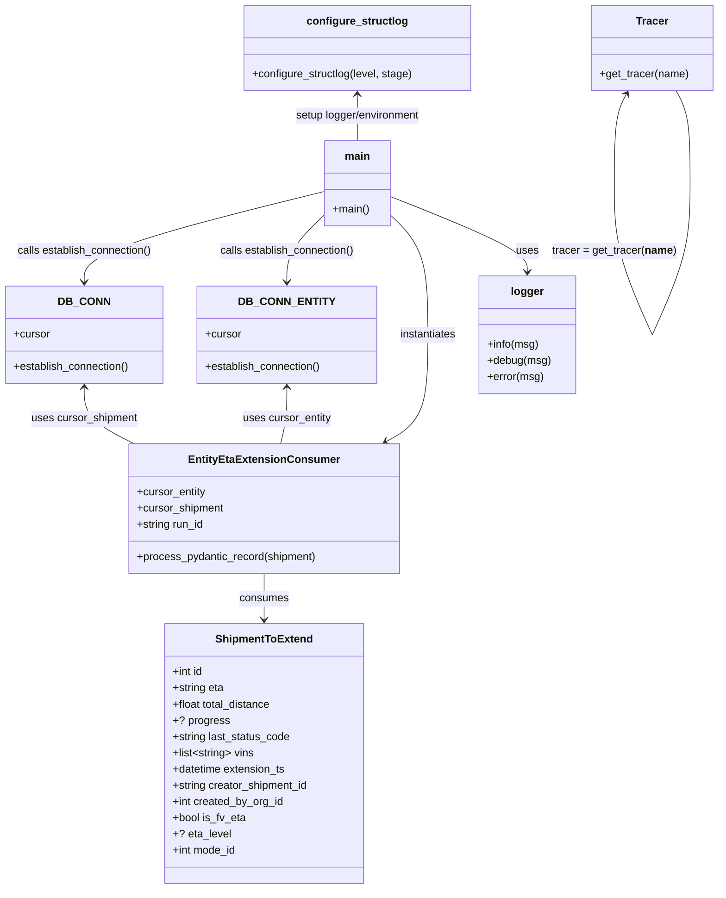

# Diagram: shipment_core/shipment_service/shipment_service/eta/consumers/tests/manual_consumer_runner.py

> Auto-generated by Obscura crawlers

## Mermaid

### SVG

<svg id="container" width="1057.38671875" xmlns="http://www.w3.org/2000/svg" class="classDiagram" height="1338" viewBox="0 0 1057.38671875 1338" role="graphics-document document" aria-roledescription="class"><g><defs><marker id="container_class-aggregationStart" class="marker aggregation class" refX="18" refY="7" markerWidth="190" markerHeight="240" orient="auto"><path d="M 18,7 L9,13 L1,7 L9,1 Z"></path></marker></defs><defs><marker id="container_class-aggregationEnd" class="marker aggregation class" refX="1" refY="7" markerWidth="20" markerHeight="28" orient="auto"><path d="M 18,7 L9,13 L1,7 L9,1 Z"></path></marker></defs><defs><marker id="container_class-extensionStart" class="marker extension class" refX="18" refY="7" markerWidth="190" markerHeight="240" orient="auto"><path d="M 1,7 L18,13 V 1 Z"></path></marker></defs><defs><marker id="container_class-extensionEnd" class="marker extension class" refX="1" refY="7" markerWidth="20" markerHeight="28" orient="auto"><path d="M 1,1 V 13 L18,7 Z"></path></marker></defs><defs><marker id="container_class-compositionStart" class="marker composition class" refX="18" refY="7" markerWidth="190" markerHeight="240" orient="auto"><path d="M 18,7 L9,13 L1,7 L9,1 Z"></path></marker></defs><defs><marker id="container_class-compositionEnd" class="marker composition class" refX="1" refY="7" markerWidth="20" markerHeight="28" orient="auto"><path d="M 18,7 L9,13 L1,7 L9,1 Z"></path></marker></defs><defs><marker id="container_class-dependencyStart" class="marker dependency class" refX="6" refY="7" markerWidth="190" markerHeight="240" orient="auto"><path d="M 5,7 L9,13 L1,7 L9,1 Z"></path></marker></defs><defs><marker id="container_class-dependencyEnd" class="marker dependency class" refX="13" refY="7" markerWidth="20" markerHeight="28" orient="auto"><path d="M 18,7 L9,13 L14,7 L9,1 Z"></path></marker></defs><defs><marker id="container_class-lollipopStart" class="marker lollipop class" refX="13" refY="7" markerWidth="190" markerHeight="240" orient="auto"><circle stroke="black" fill="transparent" cx="7" cy="7" r="6"></circle></marker></defs><defs><marker id="container_class-lollipopEnd" class="marker lollipop class" refX="1" refY="7" markerWidth="190" markerHeight="240" orient="auto"><circle stroke="black" fill="transparent" cx="7" cy="7" r="6"></circle></marker></defs><g class="root"><g class="clusters"></g><g class="edgePaths"><path d="M476.098,284.515L417.387,300.929C358.677,317.343,241.257,350.172,182.546,376.252C123.836,402.333,123.836,421.667,123.836,431.333L123.836,441" id="id_main_DB_CONN_1" class="edge-thickness-normal edge-pattern-solid relation" style=";;;" data-edge="true" data-et="edge" data-id="id_main_DB_CONN_1" data-points="W3sieCI6NDc2LjA5NzY1NjI1LCJ5IjoyODQuNTE0ODMxMjEwODc0MjZ9LHsieCI6MTIzLjgzNTkzNzUsInkiOjM4M30seyJ4IjoxMjMuODM1OTM3NSwieSI6NDQ3fV0=" marker-end="url(#container_class-dependencyEnd)"></path><path d="M476.098,322.945L466.783,332.954C457.469,342.963,438.84,362.982,429.525,382.658C420.211,402.333,420.211,421.667,420.211,431.333L420.211,441" id="id_main_DB_CONN_ENTITY_2" class="edge-thickness-normal edge-pattern-solid relation" style=";;;" data-edge="true" data-et="edge" data-id="id_main_DB_CONN_ENTITY_2" data-points="W3sieCI6NDc2LjA5NzY1NjI1LCJ5IjozMjIuOTQ1MTMxNTQ5MzU5MTN9LHsieCI6NDIwLjIxMDkzNzUsInkiOjM4M30seyJ4Ijo0MjAuMjEwOTM3NSwieSI6NDQ3fV0=" marker-end="url(#container_class-dependencyEnd)"></path><path d="M572.777,322.945L582.092,332.954C591.406,342.963,610.035,362.982,619.35,395.658C628.664,428.333,628.664,473.667,628.664,517C628.664,560.333,628.664,601.667,618.316,628.018C607.968,654.37,587.272,665.741,576.924,671.426L566.577,677.111" id="id_main_EntityEtaExtensionConsumer_3" class="edge-thickness-normal edge-pattern-solid relation" style=";;;" data-edge="true" data-et="edge" data-id="id_main_EntityEtaExtensionConsumer_3" data-points="W3sieCI6NTcyLjc3NzM0Mzc1LCJ5IjozMjIuOTQ1MTMxNTQ5MzU5MTN9LHsieCI6NjI4LjY2NDA2MjUsInkiOjM4M30seyJ4Ijo2MjguNjY0MDYyNSwieSI6NTE5fSx7IngiOjYyOC42NjQwNjI1LCJ5Ijo2NDN9LHsieCI6NTYxLjMxNzkzMzUwNTYzOTEsInkiOjY4MH1d" marker-end="url(#container_class-dependencyEnd)"></path><path d="M386.582,872L386.582,878.167C386.582,884.333,386.582,896.667,386.582,908C386.582,919.333,386.582,929.667,386.582,934.833L386.582,940" id="id_EntityEtaExtensionConsumer_ShipmentToExtend_4" class="edge-thickness-normal edge-pattern-solid relation" style=";;;" data-edge="true" data-et="edge" data-id="id_EntityEtaExtensionConsumer_ShipmentToExtend_4" data-points="W3sieCI6Mzg2LjU4MjAzMTI1LCJ5Ijo4NzJ9LHsieCI6Mzg2LjU4MjAzMTI1LCJ5Ijo5MDl9LHsieCI6Mzg2LjU4MjAzMTI1LCJ5Ijo5NDZ9XQ==" marker-end="url(#container_class-dependencyEnd)"></path><path d="M922.217,139.244L919.274,144.537C916.331,149.829,910.445,160.415,907.502,182.366C904.559,204.317,904.559,237.633,904.559,254.292L904.559,270.95" id="Tracer-cyclic-special-1" class="edge-thickness-normal edge-pattern-solid relation" style=";;;" data-edge="true" data-et="edge" data-id="Tracer-cyclic-special-1" data-points="W3sieCI6OTI1LjEzMjYxNzE4NzUsInkiOjEzNH0seyJ4Ijo5MDQuNTU4NTkzNzUsInkiOjE3MX0seyJ4Ijo5MDQuNTU4NTkzNzUsInkiOjI3MC45NDk5OTk5OTkyNTQ5NH1d" marker-start="url(#container_class-dependencyStart)"></path><path d="M904.559,271.05L904.559,289.708C904.559,308.367,904.559,345.683,913.823,387C923.087,428.317,941.615,473.633,950.879,496.292L960.144,518.95" id="Tracer-cyclic-special-mid" class="edge-thickness-normal edge-pattern-solid relation" style=";;;" data-edge="true" data-et="edge" data-id="Tracer-cyclic-special-mid" data-points="W3sieCI6OTA0LjU1ODU5Mzc1LCJ5IjoyNzEuMDUwMDAwMDAwNzQ1MDZ9LHsieCI6OTA0LjU1ODU5Mzc1LCJ5IjozODN9LHsieCI6OTYwLjE0MzYxOTMxMjY1NDksInkiOjUxOC45NDk5OTk5OTkyNTQ5fV0="></path><path d="M960.185,518.95L969.449,496.292C978.713,473.633,997.241,428.317,1006.505,386.992C1015.77,345.667,1015.77,308.333,1015.77,273C1015.77,237.667,1015.77,204.333,1012.341,181.5C1008.912,158.667,1002.054,146.333,998.625,140.167L995.196,134" id="Tracer-cyclic-special-2" class="edge-thickness-normal edge-pattern-solid relation" style=";;;" data-edge="true" data-et="edge" data-id="Tracer-cyclic-special-2" data-points="W3sieCI6OTYwLjE4NDUwNTY4NzM0NTEsInkiOjUxOC45NDk5OTk5OTkyNTQ5fSx7IngiOjEwMTUuNzY5NTMxMjUsInkiOjM4M30seyJ4IjoxMDE1Ljc2OTUzMTI1LCJ5IjoyNzF9LHsieCI6MTAxNS43Njk1MzEyNSwieSI6MTcxfSx7IngiOjk5NS4xOTU1MDc4MTI1LCJ5IjoxMzR9XQ=="></path><path d="M524.438,140L524.438,145.167C524.438,150.333,524.438,160.667,524.438,172C524.438,183.333,524.438,195.667,524.438,201.833L524.438,208" id="id_configure_structlog_main_6" class="edge-thickness-normal edge-pattern-solid relation" style=";;;" data-edge="true" data-et="edge" data-id="id_configure_structlog_main_6" data-points="W3sieCI6NTI0LjQzNzUsInkiOjEzNH0seyJ4Ijo1MjQuNDM3NSwieSI6MTcxfSx7IngiOjUyNC40Mzc1LCJ5IjoyMDh9XQ==" marker-start="url(#container_class-dependencyStart)"></path><path d="M572.777,292.449L606.79,307.541C640.803,322.633,708.829,352.816,742.842,375.075C776.855,397.333,776.855,411.667,776.855,418.833L776.855,426" id="id_main_logger_7" class="edge-thickness-normal edge-pattern-solid relation" style=";;;" data-edge="true" data-et="edge" data-id="id_main_logger_7" data-points="W3sieCI6NTcyLjc3NzM0Mzc1LCJ5IjoyOTIuNDQ4Nzk5ODg4NTc3NjR9LHsieCI6Nzc2Ljg1NTQ2ODc1LCJ5IjozODN9LHsieCI6Nzc2Ljg1NTQ2ODc1LCJ5Ijo0MzJ9XQ==" marker-end="url(#container_class-dependencyEnd)"></path><path d="M123.836,597L123.836,604.667C123.836,612.333,123.836,627.667,136.018,641.5C148.201,655.333,172.566,667.667,184.748,673.833L196.931,680" id="id_DB_CONN_EntityEtaExtensionConsumer_8" class="edge-thickness-normal edge-pattern-solid relation" style=";;;" data-edge="true" data-et="edge" data-id="id_DB_CONN_EntityEtaExtensionConsumer_8" data-points="W3sieCI6MTIzLjgzNTkzNzUsInkiOjU5MX0seyJ4IjoxMjMuODM1OTM3NSwieSI6NjQzfSx7IngiOjE5Ni45MzA3MTU0NjA1MjYzMywieSI6NjgwfV0=" marker-start="url(#container_class-dependencyStart)"></path><path d="M420.211,597L420.211,604.667C420.211,612.333,420.211,627.667,418.652,641.5C417.092,655.333,413.974,667.667,412.415,673.833L410.856,680" id="id_DB_CONN_ENTITY_EntityEtaExtensionConsumer_9" class="edge-thickness-normal edge-pattern-solid relation" style=";;;" data-edge="true" data-et="edge" data-id="id_DB_CONN_ENTITY_EntityEtaExtensionConsumer_9" data-points="W3sieCI6NDIwLjIxMDkzNzUsInkiOjU5MX0seyJ4Ijo0MjAuMjEwOTM3NSwieSI6NjQzfSx7IngiOjQxMC44NTU1Mjc0OTA2MDE1LCJ5Ijo2ODB9XQ==" marker-start="url(#container_class-dependencyStart)"></path></g><g class="edgeLabels"><g class="edgeLabel" transform="translate(123.8359375, 383)"><g class="label" data-id="id_main_DB_CONN_1" transform="translate(-100, -24)"><foreignObject width="200" height="48">

calls establish_connection()

</foreignObject></g></g><g class="edgeLabel" transform="translate(420.2109375, 383)"><g class="label" data-id="id_main_DB_CONN_ENTITY_2" transform="translate(-100, -24)"><foreignObject width="200" height="48">

calls establish_connection()

</foreignObject></g></g><g class="edgeLabel" transform="translate(628.6640625, 519)"><g class="label" data-id="id_main_EntityEtaExtensionConsumer_3" transform="translate(-42.9140625, -12)"><foreignObject width="85.828125" height="24">

instantiates

</foreignObject></g></g><g class="edgeLabel" transform="translate(386.58203125, 909)"><g class="label" data-id="id_EntityEtaExtensionConsumer_ShipmentToExtend_4" transform="translate(-36.375, -12)"><foreignObject width="72.75" height="24">

consumes

</foreignObject></g></g><g class="edgeLabel"><g class="label" data-id="Tracer-cyclic-special-1" transform="translate(0, 0)"><foreignObject width="0" height="0">

</foreignObject></g></g><g class="edgeLabel" transform="translate(904.55859375, 383)"><g class="label" data-id="Tracer-cyclic-special-mid" transform="translate(-91.2109375, -12)"><foreignObject width="182.421875" height="24">

tracer = get_tracer(<strong>name</strong>)

</foreignObject></g></g><g class="edgeLabel"><g class="label" data-id="Tracer-cyclic-special-2" transform="translate(0, 0)"><foreignObject width="0" height="0">

</foreignObject></g></g><g class="edgeLabel" transform="translate(524.4375, 171)"><g class="label" data-id="id_configure_structlog_main_6" transform="translate(-94.59375, -12)"><foreignObject width="189.1875" height="24">

setup logger/environment

</foreignObject></g></g><g class="edgeLabel" transform="translate(776.85546875, 383)"><g class="label" data-id="id_main_logger_7" transform="translate(-16.4921875, -12)"><foreignObject width="32.984375" height="24">

uses

</foreignObject></g></g><g class="edgeLabel" transform="translate(123.8359375, 643)"><g class="label" data-id="id_DB_CONN_EntityEtaExtensionConsumer_8" transform="translate(-79.21875, -12)"><foreignObject width="158.4375" height="24">

uses cursor_shipment

</foreignObject></g></g><g class="edgeLabel" transform="translate(420.2109375, 643)"><g class="label" data-id="id_DB_CONN_ENTITY_EntityEtaExtensionConsumer_9" transform="translate(-65.8125, -12)"><foreignObject width="131.625" height="24">

uses cursor_entity

</foreignObject></g></g></g><g class="nodes"><g class="node default" id="classId-ShipmentToExtend-0" transform="translate(386.58203125, 1138)"><g class="basic label-container"><path d="M-148.08203125 -192 L148.08203125 -192 L148.08203125 192 L-148.08203125 192" stroke="none" stroke-width="0" fill="#ECECFF" style=""></path><path d="M-148.08203125 -192 C-78.48123326218061 -192, -8.880435274361218 -192, 148.08203125 -192 M-148.08203125 -192 C-50.444056550526184 -192, 47.19391814894763 -192, 148.08203125 -192 M148.08203125 -192 C148.08203125 -105.62196143357933, 148.08203125 -19.24392286715866, 148.08203125 192 M148.08203125 -192 C148.08203125 -85.15013515148894, 148.08203125 21.69972969702212, 148.08203125 192 M148.08203125 192 C57.97551300693647 192, -32.131005236127066 192, -148.08203125 192 M148.08203125 192 C35.502442969795396 192, -77.07714531040921 192, -148.08203125 192 M-148.08203125 192 C-148.08203125 74.88991989138157, -148.08203125 -42.22016021723687, -148.08203125 -192 M-148.08203125 192 C-148.08203125 58.0299510483172, -148.08203125 -75.9400979033656, -148.08203125 -192" stroke="#9370DB" stroke-width="1.3" fill="none" stroke-dasharray="0 0" style=""></path></g><g class="annotation-group text" transform="translate(0, -168)"></g><g class="label-group text" transform="translate(-68.7421875, -168)"><g class="label" style="font-weight: bolder" transform="translate(0,-12)"><foreignObject width="137.484375" height="24">

ShipmentToExtend

</foreignObject></g></g><g class="members-group text" transform="translate(-136.08203125, -120)"><g class="label" style="" transform="translate(0,-12)"><foreignObject width="45.96875" height="24">

+int id

</foreignObject></g><g class="label" style="" transform="translate(0,12)"><foreignObject width="76.953125" height="24">

+string eta

</foreignObject></g><g class="label" style="" transform="translate(0,36)"><foreignObject width="148.171875" height="24">

+float total_distance

</foreignObject></g><g class="label" style="" transform="translate(0,60)"><foreignObject width="80.6875" height="24">

+? progress

</foreignObject></g><g class="label" style="" transform="translate(0,84)"><foreignObject width="175.625" height="24">

+string last_status_code

</foreignObject></g><g class="label" style="" transform="translate(0,108)"><foreignObject width="121.546875" height="24">

+list&lt;string&gt; vins

</foreignObject></g><g class="label" style="" transform="translate(0,132)"><foreignObject width="169.40625" height="24">

+datetime extension_ts

</foreignObject></g><g class="label" style="" transform="translate(0,156)"><foreignObject width="203.421875" height="24">

+string creator_shipment_id

</foreignObject></g><g class="label" style="" transform="translate(0,180)"><foreignObject width="165.546875" height="24">

+int created_by_org_id

</foreignObject></g><g class="label" style="" transform="translate(0,204)"><foreignObject width="108.609375" height="24">

+bool is_fv_eta

</foreignObject></g><g class="label" style="" transform="translate(0,228)"><foreignObject width="84.34375" height="24">

+? eta_level

</foreignObject></g><g class="label" style="" transform="translate(0,252)"><foreignObject width="95.3125" height="24">

+int mode_id

</foreignObject></g></g><g class="methods-group text" transform="translate(-136.08203125, 192)"></g><g class="divider" style=""><path d="M-148.08203125 -144 C-49.24894520916463 -144, 49.58414083167074 -144, 148.08203125 -144 M-148.08203125 -144 C-86.89361093469219 -144, -25.705190619384396 -144, 148.08203125 -144" stroke="#9370DB" stroke-width="1.3" fill="none" stroke-dasharray="0 0" style=""></path></g><g class="divider" style=""><path d="M-148.08203125 168 C-88.25999669209287 168, -28.437962134185724 168, 148.08203125 168 M-148.08203125 168 C-39.517680186620424 168, 69.04667087675915 168, 148.08203125 168" stroke="#9370DB" stroke-width="1.3" fill="none" stroke-dasharray="0 0" style=""></path></g></g><g class="node default" id="classId-EntityEtaExtensionConsumer-1" transform="translate(386.58203125, 776)"><g class="basic label-container"><path d="M-198.32421875 -96 L198.32421875 -96 L198.32421875 96 L-198.32421875 96" stroke="none" stroke-width="0" fill="#ECECFF" style=""></path><path d="M-198.32421875 -96 C-94.46566478069569 -96, 9.39288918860862 -96, 198.32421875 -96 M-198.32421875 -96 C-113.84906333278163 -96, -29.37390791556325 -96, 198.32421875 -96 M198.32421875 -96 C198.32421875 -40.65807803567489, 198.32421875 14.68384392865022, 198.32421875 96 M198.32421875 -96 C198.32421875 -25.368835725723628, 198.32421875 45.262328548552745, 198.32421875 96 M198.32421875 96 C104.31513723607793 96, 10.306055722155861 96, -198.32421875 96 M198.32421875 96 C114.19672927855339 96, 30.069239807106783 96, -198.32421875 96 M-198.32421875 96 C-198.32421875 48.80745391767059, -198.32421875 1.6149078353411852, -198.32421875 -96 M-198.32421875 96 C-198.32421875 25.178731836512142, -198.32421875 -45.642536326975716, -198.32421875 -96" stroke="#9370DB" stroke-width="1.3" fill="none" stroke-dasharray="0 0" style=""></path></g><g class="annotation-group text" transform="translate(0, -72)"></g><g class="label-group text" transform="translate(-104.9609375, -72)"><g class="label" style="font-weight: bolder" transform="translate(0,-12)"><foreignObject width="209.921875" height="24">

EntityEtaExtensionConsumer

</foreignObject></g></g><g class="members-group text" transform="translate(-186.32421875, -24)"><g class="label" style="" transform="translate(0,-12)"><foreignObject width="102.390625" height="24">

+cursor_entity

</foreignObject></g><g class="label" style="" transform="translate(0,12)"><foreignObject width="129.203125" height="24">

+cursor_shipment

</foreignObject></g><g class="label" style="" transform="translate(0,36)"><foreignObject width="101.125" height="24">

+string run_id

</foreignObject></g></g><g class="methods-group text" transform="translate(-186.32421875, 72)"><g class="label" style="" transform="translate(0,-12)"><foreignObject width="267.6875" height="24">

+process_pydantic_record(shipment)

</foreignObject></g></g><g class="divider" style=""><path d="M-198.32421875 -48 C-45.82335964228497 -48, 106.67749946543006 -48, 198.32421875 -48 M-198.32421875 -48 C-93.67111012295956 -48, 10.981998504080877 -48, 198.32421875 -48" stroke="#9370DB" stroke-width="1.3" fill="none" stroke-dasharray="0 0" style=""></path></g><g class="divider" style=""><path d="M-198.32421875 48 C-109.72967053458983 48, -21.135122319179658 48, 198.32421875 48 M-198.32421875 48 C-62.94436743380609 48, 72.43548388238781 48, 198.32421875 48" stroke="#9370DB" stroke-width="1.3" fill="none" stroke-dasharray="0 0" style=""></path></g></g><g class="node default" id="classId-DB_CONN-2" transform="translate(123.8359375, 519)"><g class="basic label-container"><path d="M-115.8359375 -72 L115.8359375 -72 L115.8359375 72 L-115.8359375 72" stroke="none" stroke-width="0" fill="#ECECFF" style=""></path><path d="M-115.8359375 -72 C-38.66413594602727 -72, 38.507665607945455 -72, 115.8359375 -72 M-115.8359375 -72 C-61.9078936955841 -72, -7.9798498911682 -72, 115.8359375 -72 M115.8359375 -72 C115.8359375 -19.624328772188733, 115.8359375 32.751342455622535, 115.8359375 72 M115.8359375 -72 C115.8359375 -43.01163599562291, 115.8359375 -14.02327199124582, 115.8359375 72 M115.8359375 72 C53.09514845730247 72, -9.645640585395057 72, -115.8359375 72 M115.8359375 72 C35.59401840577627 72, -44.647900688447464 72, -115.8359375 72 M-115.8359375 72 C-115.8359375 33.57515434402982, -115.8359375 -4.8496913119403615, -115.8359375 -72 M-115.8359375 72 C-115.8359375 31.800952771945987, -115.8359375 -8.398094456108026, -115.8359375 -72" stroke="#9370DB" stroke-width="1.3" fill="none" stroke-dasharray="0 0" style=""></path></g><g class="annotation-group text" transform="translate(0, -48)"></g><g class="label-group text" transform="translate(-34.40625, -48)"><g class="label" style="font-weight: bolder" transform="translate(0,-12)"><foreignObject width="68.8125" height="24">

DB_CONN

</foreignObject></g></g><g class="members-group text" transform="translate(-103.8359375, 0)"><g class="label" style="" transform="translate(0,-12)"><foreignObject width="53.71875" height="24">

+cursor

</foreignObject></g></g><g class="methods-group text" transform="translate(-103.8359375, 48)"><g class="label" style="" transform="translate(0,-12)"><foreignObject width="173.265625" height="24">

+establish_connection()

</foreignObject></g></g><g class="divider" style=""><path d="M-115.8359375 -24 C-51.17188170218803 -24, 13.492174095623938 -24, 115.8359375 -24 M-115.8359375 -24 C-39.472829393463954 -24, 36.89027871307209 -24, 115.8359375 -24" stroke="#9370DB" stroke-width="1.3" fill="none" stroke-dasharray="0 0" style=""></path></g><g class="divider" style=""><path d="M-115.8359375 24 C-56.359156543738685 24, 3.1176244125226305 24, 115.8359375 24 M-115.8359375 24 C-64.29678028557524 24, -12.757623071150476 24, 115.8359375 24" stroke="#9370DB" stroke-width="1.3" fill="none" stroke-dasharray="0 0" style=""></path></g></g><g class="node default" id="classId-DB_CONN_ENTITY-3" transform="translate(420.2109375, 519)"><g class="basic label-container"><path d="M-130.5390625 -72 L130.5390625 -72 L130.5390625 72 L-130.5390625 72" stroke="none" stroke-width="0" fill="#ECECFF" style=""></path><path d="M-130.5390625 -72 C-37.02655660126007 -72, 56.48594929747986 -72, 130.5390625 -72 M-130.5390625 -72 C-30.494716124484555 -72, 69.54963025103089 -72, 130.5390625 -72 M130.5390625 -72 C130.5390625 -39.874879578278076, 130.5390625 -7.749759156556152, 130.5390625 72 M130.5390625 -72 C130.5390625 -21.50993358741723, 130.5390625 28.98013282516554, 130.5390625 72 M130.5390625 72 C39.22527835856256 72, -52.088505782874876 72, -130.5390625 72 M130.5390625 72 C60.71186897383899 72, -9.115324552322022 72, -130.5390625 72 M-130.5390625 72 C-130.5390625 39.393074533451106, -130.5390625 6.786149066902212, -130.5390625 -72 M-130.5390625 72 C-130.5390625 30.67684251770894, -130.5390625 -10.646314964582118, -130.5390625 -72" stroke="#9370DB" stroke-width="1.3" fill="none" stroke-dasharray="0 0" style=""></path></g><g class="annotation-group text" transform="translate(0, -48)"></g><g class="label-group text" transform="translate(-63.8125, -48)"><g class="label" style="font-weight: bolder" transform="translate(0,-12)"><foreignObject width="127.625" height="24">

DB_CONN_ENTITY

</foreignObject></g></g><g class="members-group text" transform="translate(-118.5390625, 0)"><g class="label" style="" transform="translate(0,-12)"><foreignObject width="53.71875" height="24">

+cursor

</foreignObject></g></g><g class="methods-group text" transform="translate(-118.5390625, 48)"><g class="label" style="" transform="translate(0,-12)"><foreignObject width="173.265625" height="24">

+establish_connection()

</foreignObject></g></g><g class="divider" style=""><path d="M-130.5390625 -24 C-35.425404708404784 -24, 59.68825308319043 -24, 130.5390625 -24 M-130.5390625 -24 C-27.878377607097732 -24, 74.78230728580454 -24, 130.5390625 -24" stroke="#9370DB" stroke-width="1.3" fill="none" stroke-dasharray="0 0" style=""></path></g><g class="divider" style=""><path d="M-130.5390625 24 C-47.33448507542036 24, 35.87009234915928 24, 130.5390625 24 M-130.5390625 24 C-32.988159454060806 24, 64.56274359187839 24, 130.5390625 24" stroke="#9370DB" stroke-width="1.3" fill="none" stroke-dasharray="0 0" style=""></path></g></g><g class="node default" id="classId-Tracer-4" transform="translate(960.1640625, 71)"><g class="basic label-container"><path d="M-89.22265625 -63 L89.22265625 -63 L89.22265625 63 L-89.22265625 63" stroke="none" stroke-width="0" fill="#ECECFF" style=""></path><path d="M-89.22265625 -63 C-49.36801208625066 -63, -9.513367922501317 -63, 89.22265625 -63 M-89.22265625 -63 C-46.84535475727171 -63, -4.468053264543414 -63, 89.22265625 -63 M89.22265625 -63 C89.22265625 -15.428713353084639, 89.22265625 32.14257329383072, 89.22265625 63 M89.22265625 -63 C89.22265625 -20.485864174262964, 89.22265625 22.02827165147407, 89.22265625 63 M89.22265625 63 C49.50120003151135 63, 9.779743813022705 63, -89.22265625 63 M89.22265625 63 C34.90164757049826 63, -19.419361109003475 63, -89.22265625 63 M-89.22265625 63 C-89.22265625 34.56536679585428, -89.22265625 6.130733591708562, -89.22265625 -63 M-89.22265625 63 C-89.22265625 13.027000705016093, -89.22265625 -36.945998589967814, -89.22265625 -63" stroke="#9370DB" stroke-width="1.3" fill="none" stroke-dasharray="0 0" style=""></path></g><g class="annotation-group text" transform="translate(0, -39)"></g><g class="label-group text" transform="translate(-22.6953125, -39)"><g class="label" style="font-weight: bolder" transform="translate(0,-12)"><foreignObject width="45.390625" height="24">

Tracer

</foreignObject></g></g><g class="members-group text" transform="translate(-77.22265625, 9)"></g><g class="methods-group text" transform="translate(-77.22265625, 39)"><g class="label" style="" transform="translate(0,-12)"><foreignObject width="131.75" height="24">

+get_tracer(name)

</foreignObject></g></g><g class="divider" style=""><path d="M-89.22265625 -15 C-18.739456534967246 -15, 51.74374318006551 -15, 89.22265625 -15 M-89.22265625 -15 C-43.1796881064157 -15, 2.863280037168593 -15, 89.22265625 -15" stroke="#9370DB" stroke-width="1.3" fill="none" stroke-dasharray="0 0" style=""></path></g><g class="divider" style=""><path d="M-89.22265625 9 C-44.13147041636036 9, 0.9597154172792841 9, 89.22265625 9 M-89.22265625 9 C-47.24949919213168 9, -5.276342134263359 9, 89.22265625 9" stroke="#9370DB" stroke-width="1.3" fill="none" stroke-dasharray="0 0" style=""></path></g></g><g class="node default" id="classId-configure_structlog-5" transform="translate(524.4375, 71)"><g class="basic label-container"><path d="M-166.94921875 -63 L166.94921875 -63 L166.94921875 63 L-166.94921875 63" stroke="none" stroke-width="0" fill="#ECECFF" style=""></path><path d="M-166.94921875 -63 C-84.382894724262 -63, -1.8165706985240035 -63, 166.94921875 -63 M-166.94921875 -63 C-34.38740013725655 -63, 98.1744184754869 -63, 166.94921875 -63 M166.94921875 -63 C166.94921875 -31.749017402011862, 166.94921875 -0.4980348040237246, 166.94921875 63 M166.94921875 -63 C166.94921875 -15.559508739160776, 166.94921875 31.880982521678447, 166.94921875 63 M166.94921875 63 C92.88877809253907 63, 18.82833743507814 63, -166.94921875 63 M166.94921875 63 C62.24702048857006 63, -42.455177772859884 63, -166.94921875 63 M-166.94921875 63 C-166.94921875 17.807827842351827, -166.94921875 -27.384344315296346, -166.94921875 -63 M-166.94921875 63 C-166.94921875 31.03718522717204, -166.94921875 -0.9256295456559229, -166.94921875 -63" stroke="#9370DB" stroke-width="1.3" fill="none" stroke-dasharray="0 0" style=""></path></g><g class="annotation-group text" transform="translate(0, -39)"></g><g class="label-group text" transform="translate(-71.0390625, -39)"><g class="label" style="font-weight: bolder" transform="translate(0,-12)"><foreignObject width="142.078125" height="24">

configure_structlog

</foreignObject></g></g><g class="members-group text" transform="translate(-154.94921875, 9)"></g><g class="methods-group text" transform="translate(-154.94921875, 39)"><g class="label" style="" transform="translate(0,-12)"><foreignObject width="238.859375" height="24">

+configure_structlog(level, stage)

</foreignObject></g></g><g class="divider" style=""><path d="M-166.94921875 -15 C-78.4517437339029 -15, 10.045731282194197 -15, 166.94921875 -15 M-166.94921875 -15 C-93.80702606833017 -15, -20.664833386660348 -15, 166.94921875 -15" stroke="#9370DB" stroke-width="1.3" fill="none" stroke-dasharray="0 0" style=""></path></g><g class="divider" style=""><path d="M-166.94921875 9 C-94.55390962203579 9, -22.158600494071578 9, 166.94921875 9 M-166.94921875 9 C-93.8363137925406 9, -20.723408835081187 9, 166.94921875 9" stroke="#9370DB" stroke-width="1.3" fill="none" stroke-dasharray="0 0" style=""></path></g></g><g class="node default" id="classId-logger-6" transform="translate(776.85546875, 519)"><g class="basic label-container"><path d="M-70.27734375 -87 L70.27734375 -87 L70.27734375 87 L-70.27734375 87" stroke="none" stroke-width="0" fill="#ECECFF" style=""></path><path d="M-70.27734375 -87 C-22.183624607141496 -87, 25.910094535717008 -87, 70.27734375 -87 M-70.27734375 -87 C-20.554142020909083 -87, 29.169059708181834 -87, 70.27734375 -87 M70.27734375 -87 C70.27734375 -30.681891717123108, 70.27734375 25.636216565753784, 70.27734375 87 M70.27734375 -87 C70.27734375 -27.641139142222357, 70.27734375 31.717721715555285, 70.27734375 87 M70.27734375 87 C23.324184149793318 87, -23.628975450413364 87, -70.27734375 87 M70.27734375 87 C29.64872827125518 87, -10.97988720748964 87, -70.27734375 87 M-70.27734375 87 C-70.27734375 43.10781974642095, -70.27734375 -0.7843605071580981, -70.27734375 -87 M-70.27734375 87 C-70.27734375 25.965077097991937, -70.27734375 -35.069845804016126, -70.27734375 -87" stroke="#9370DB" stroke-width="1.3" fill="none" stroke-dasharray="0 0" style=""></path></g><g class="annotation-group text" transform="translate(0, -63)"></g><g class="label-group text" transform="translate(-23.2734375, -63)"><g class="label" style="font-weight: bolder" transform="translate(0,-12)"><foreignObject width="46.546875" height="24">

logger

</foreignObject></g></g><g class="members-group text" transform="translate(-58.27734375, -15)"></g><g class="methods-group text" transform="translate(-58.27734375, 15)"><g class="label" style="" transform="translate(0,-12)"><foreignObject width="76.296875" height="24">

+info(msg)

</foreignObject></g><g class="label" style="" transform="translate(0,12)"><foreignObject width="93.28125" height="24">

+debug(msg)

</foreignObject></g><g class="label" style="" transform="translate(0,36)"><foreignObject width="83.96875" height="24">

+error(msg)

</foreignObject></g></g><g class="divider" style=""><path d="M-70.27734375 -39 C-14.503492875725385 -39, 41.27035799854923 -39, 70.27734375 -39 M-70.27734375 -39 C-40.35410086494338 -39, -10.430857979886767 -39, 70.27734375 -39" stroke="#9370DB" stroke-width="1.3" fill="none" stroke-dasharray="0 0" style=""></path></g><g class="divider" style=""><path d="M-70.27734375 -15 C-26.621688663721564 -15, 17.033966422556873 -15, 70.27734375 -15 M-70.27734375 -15 C-41.03420942246629 -15, -11.791075094932587 -15, 70.27734375 -15" stroke="#9370DB" stroke-width="1.3" fill="none" stroke-dasharray="0 0" style=""></path></g></g><g class="node default" id="classId-main-7" transform="translate(524.4375, 271)"><g class="basic label-container"><path d="M-48.33984375 -63 L48.33984375 -63 L48.33984375 63 L-48.33984375 63" stroke="none" stroke-width="0" fill="#ECECFF" style=""></path><path d="M-48.33984375 -63 C-25.49154892821194 -63, -2.643254106423882 -63, 48.33984375 -63 M-48.33984375 -63 C-27.826864892018367 -63, -7.313886034036734 -63, 48.33984375 -63 M48.33984375 -63 C48.33984375 -32.6622391505233, 48.33984375 -2.3244783010465966, 48.33984375 63 M48.33984375 -63 C48.33984375 -37.08993498681454, 48.33984375 -11.179869973629089, 48.33984375 63 M48.33984375 63 C17.224356847990897 63, -13.891130054018205 63, -48.33984375 63 M48.33984375 63 C26.198022292799934 63, 4.056200835599867 63, -48.33984375 63 M-48.33984375 63 C-48.33984375 17.92655425083621, -48.33984375 -27.146891498327577, -48.33984375 -63 M-48.33984375 63 C-48.33984375 29.45441031390748, -48.33984375 -4.091179372185039, -48.33984375 -63" stroke="#9370DB" stroke-width="1.3" fill="none" stroke-dasharray="0 0" style=""></path></g><g class="annotation-group text" transform="translate(0, -39)"></g><g class="label-group text" transform="translate(-18.0234375, -39)"><g class="label" style="font-weight: bolder" transform="translate(0,-12)"><foreignObject width="36.046875" height="24">

main

</foreignObject></g></g><g class="members-group text" transform="translate(-36.33984375, 9)"></g><g class="methods-group text" transform="translate(-36.33984375, 39)"><g class="label" style="" transform="translate(0,-12)"><foreignObject width="54.65625" height="24">

+main()

</foreignObject></g></g><g class="divider" style=""><path d="M-48.33984375 -15 C-10.425754211256617 -15, 27.488335327486766 -15, 48.33984375 -15 M-48.33984375 -15 C-13.248556375673104 -15, 21.842730998653792 -15, 48.33984375 -15" stroke="#9370DB" stroke-width="1.3" fill="none" stroke-dasharray="0 0" style=""></path></g><g class="divider" style=""><path d="M-48.33984375 9 C-11.095138940583162 9, 26.149565868833676 9, 48.33984375 9 M-48.33984375 9 C-22.584260783969626 9, 3.1713221820607487 9, 48.33984375 9" stroke="#9370DB" stroke-width="1.3" fill="none" stroke-dasharray="0 0" style=""></path></g></g><g class="label edgeLabel" id="Tracer---Tracer---1" transform="translate(904.55859375, 271)"><rect width="0.1" height="0.1"></rect><g class="label" style="" transform="translate(0, 0)"><rect></rect><foreignObject width="0" height="0">

</foreignObject></g></g><g class="label edgeLabel" id="Tracer---Tracer---2" transform="translate(960.1640625, 519)"><rect width="0.1" height="0.1"></rect><g class="label" style="" transform="translate(0, 0)"><rect></rect><foreignObject width="0" height="0">

</foreignObject></g></g></g></g></g></svg>
