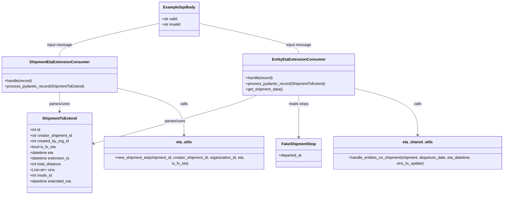
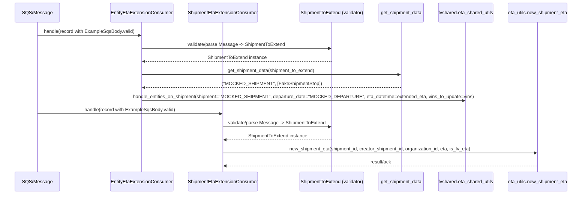

# Diagram: shipment_core/shipment_service/shipment_service/eta/consumers/tests/test_eta_extension_consumers.py

> Auto-generated by Obscura crawlers

## Diagram 1

### SVG

<svg id="container" width="2146.2578125" xmlns="http://www.w3.org/2000/svg" class="classDiagram" height="818" viewBox="0 0 2146.2578125 818" role="graphics-document document" aria-roledescription="class"><g><defs><marker id="container_class-aggregationStart" class="marker aggregation class" refX="18" refY="7" markerWidth="190" markerHeight="240" orient="auto"><path d="M 18,7 L9,13 L1,7 L9,1 Z"></path></marker></defs><defs><marker id="container_class-aggregationEnd" class="marker aggregation class" refX="1" refY="7" markerWidth="20" markerHeight="28" orient="auto"><path d="M 18,7 L9,13 L1,7 L9,1 Z"></path></marker></defs><defs><marker id="container_class-extensionStart" class="marker extension class" refX="18" refY="7" markerWidth="190" markerHeight="240" orient="auto"><path d="M 1,7 L18,13 V 1 Z"></path></marker></defs><defs><marker id="container_class-extensionEnd" class="marker extension class" refX="1" refY="7" markerWidth="20" markerHeight="28" orient="auto"><path d="M 1,1 V 13 L18,7 Z"></path></marker></defs><defs><marker id="container_class-compositionStart" class="marker composition class" refX="18" refY="7" markerWidth="190" markerHeight="240" orient="auto"><path d="M 18,7 L9,13 L1,7 L9,1 Z"></path></marker></defs><defs><marker id="container_class-compositionEnd" class="marker composition class" refX="1" refY="7" markerWidth="20" markerHeight="28" orient="auto"><path d="M 18,7 L9,13 L1,7 L9,1 Z"></path></marker></defs><defs><marker id="container_class-dependencyStart" class="marker dependency class" refX="6" refY="7" markerWidth="190" markerHeight="240" orient="auto"><path d="M 5,7 L9,13 L1,7 L9,1 Z"></path></marker></defs><defs><marker id="container_class-dependencyEnd" class="marker dependency class" refX="13" refY="7" markerWidth="20" markerHeight="28" orient="auto"><path d="M 18,7 L9,13 L14,7 L9,1 Z"></path></marker></defs><defs><marker id="container_class-lollipopStart" class="marker lollipop class" refX="13" refY="7" markerWidth="190" markerHeight="240" orient="auto"><circle stroke="black" fill="transparent" cx="7" cy="7" r="6"></circle></marker></defs><defs><marker id="container_class-lollipopEnd" class="marker lollipop class" refX="1" refY="7" markerWidth="190" markerHeight="240" orient="auto"><circle stroke="black" fill="transparent" cx="7" cy="7" r="6"></circle></marker></defs><g class="root"><g class="clusters"></g><g class="edgePaths"><path d="M1082.612,400L1069.886,406.167C1057.16,412.333,1031.708,424.667,916.232,458.576C800.755,492.485,595.254,547.969,492.504,575.712L389.754,603.454" id="id_EntityEtaExtensionConsumer_ShipmentToExtend_1" class="edge-thickness-normal edge-pattern-solid relation" style=";;;" data-edge="true" data-et="edge" data-id="id_EntityEtaExtensionConsumer_ShipmentToExtend_1" data-points="W3sieCI6MTA4Mi42MTIwNjg0MjIzNzksInkiOjQwMH0seyJ4IjoxMDA2LjI1NTg1OTM3NSwieSI6NDM3fSx7IngiOjM4My45NjA5Mzc1LCJ5Ijo2MDUuMDE3Nzg4MDEwMTM1Mn1d" marker-end="url(#container_class-dependencyEnd)"></path><path d="M246.988,388L246.988,396.167C246.988,404.333,246.988,420.667,246.988,434C246.988,447.333,246.988,457.667,246.988,462.833L246.988,468" id="id_ShipmentEtaExtensionConsumer_ShipmentToExtend_2" class="edge-thickness-normal edge-pattern-solid relation" style=";;;" data-edge="true" data-et="edge" data-id="id_ShipmentEtaExtensionConsumer_ShipmentToExtend_2" data-points="W3sieCI6MjQ2Ljk4ODI4MTI1LCJ5IjozODh9LHsieCI6MjQ2Ljk4ODI4MTI1LCJ5Ijo0Mzd9LHsieCI6MjQ2Ljk4ODI4MTI1LCJ5Ijo0NzR9XQ==" marker-end="url(#container_class-dependencyEnd)"></path><path d="M1262.152,400L1262.152,406.167C1262.152,412.333,1262.152,424.667,1262.152,454C1262.152,483.333,1262.152,529.667,1262.152,552.833L1262.152,576" id="id_EntityEtaExtensionConsumer_FakeShipmentStop_3" class="edge-thickness-normal edge-pattern-solid relation" style=";;;" data-edge="true" data-et="edge" data-id="id_EntityEtaExtensionConsumer_FakeShipmentStop_3" data-points="W3sieCI6MTI2Mi4xNTIzNDM3NSwieSI6NDAwfSx7IngiOjEyNjIuMTUyMzQzNzUsInkiOjQzN30seyJ4IjoxMjYyLjE1MjM0Mzc1LCJ5Ijo1ODJ9XQ==" marker-end="url(#container_class-dependencyEnd)"></path><path d="M1494.227,369.381L1540.615,380.651C1587.004,391.921,1679.781,414.46,1726.17,448.397C1772.559,482.333,1772.559,527.667,1772.559,550.333L1772.559,573" id="id_EntityEtaExtensionConsumer_eta_shared_utils_4" class="edge-thickness-normal edge-pattern-solid relation" style=";;;" data-edge="true" data-et="edge" data-id="id_EntityEtaExtensionConsumer_eta_shared_utils_4" data-points="W3sieCI6MTQ5NC4yMjY1NjI1LCJ5IjozNjkuMzgwOTc3MTYyNzk5MjR9LHsieCI6MTc3Mi41NTg1OTM3NSwieSI6NDM3fSx7IngiOjE3NzIuNTU4NTkzNzUsInkiOjU3OX1d" marker-end="url(#container_class-dependencyEnd)"></path><path d="M485.977,369.05L534.264,380.375C582.552,391.7,679.128,414.35,727.415,448.342C775.703,482.333,775.703,527.667,775.703,550.333L775.703,573" id="id_ShipmentEtaExtensionConsumer_eta_utils_5" class="edge-thickness-normal edge-pattern-solid relation" style=";;;" data-edge="true" data-et="edge" data-id="id_ShipmentEtaExtensionConsumer_eta_utils_5" data-points="W3sieCI6NDg1Ljk3NjU2MjUsInkiOjM2OS4wNTAxNTEwODg2NTF9LHsieCI6Nzc1LjcwMzEyNSwieSI6NDM3fSx7IngiOjc3NS43MDMxMjUsInkiOjU3OX1d" marker-end="url(#container_class-dependencyEnd)"></path><path d="M671.066,97.932L600.387,113.11C529.707,128.288,388.348,158.644,317.668,181.989C246.988,205.333,246.988,221.667,246.988,229.833L246.988,238" id="id_ExampleSqsBody_ShipmentEtaExtensionConsumer_6" class="edge-thickness-normal edge-pattern-solid relation" style=";;;" data-edge="true" data-et="edge" data-id="id_ExampleSqsBody_ShipmentEtaExtensionConsumer_6" data-points="W3sieCI6NjcxLjA2NjQwNjI1LCJ5Ijo5Ny45MzE5MzA2NDU0NDY3OH0seyJ4IjoyNDYuOTg4MjgxMjUsInkiOjE4OX0seyJ4IjoyNDYuOTg4MjgxMjUsInkiOjIzOH1d"></path><path d="M838.074,97.932L908.754,113.11C979.434,128.288,1120.793,158.644,1191.473,179.989C1262.152,201.333,1262.152,213.667,1262.152,219.833L1262.152,226" id="id_ExampleSqsBody_EntityEtaExtensionConsumer_7" class="edge-thickness-normal edge-pattern-solid relation" style=";;;" data-edge="true" data-et="edge" data-id="id_ExampleSqsBody_EntityEtaExtensionConsumer_7" data-points="W3sieCI6ODM4LjA3NDIxODc1LCJ5Ijo5Ny45MzE5MzA2NDU0NDY3OH0seyJ4IjoxMjYyLjE1MjM0Mzc1LCJ5IjoxODl9LHsieCI6MTI2Mi4xNTIzNDM3NSwieSI6MjI2fV0="></path></g><g class="edgeLabels"><g class="edgeLabel" transform="translate(736.06604, 509.95045)"><g class="label" data-id="id_EntityEtaExtensionConsumer_ShipmentToExtend_1" transform="translate(-44.234375, -12)"><foreignObject width="88.46875" height="24">

parses/uses

</foreignObject></g></g><g class="edgeLabel" transform="translate(246.98828125, 437)"><g class="label" data-id="id_ShipmentEtaExtensionConsumer_ShipmentToExtend_2" transform="translate(-44.234375, -12)"><foreignObject width="88.46875" height="24">

parses/uses

</foreignObject></g></g><g class="edgeLabel" transform="translate(1262.15234375, 437)"><g class="label" data-id="id_EntityEtaExtensionConsumer_FakeShipmentStop_3" transform="translate(-41.7890625, -12)"><foreignObject width="83.578125" height="24">

reads stops

</foreignObject></g></g><g class="edgeLabel" transform="translate(1772.55859375, 437)"><g class="label" data-id="id_EntityEtaExtensionConsumer_eta_shared_utils_4" transform="translate(-16.4453125, -12)"><foreignObject width="32.890625" height="24">

calls

</foreignObject></g></g><g class="edgeLabel" transform="translate(775.703125, 437)"><g class="label" data-id="id_ShipmentEtaExtensionConsumer_eta_utils_5" transform="translate(-16.4453125, -12)"><foreignObject width="32.890625" height="24">

calls

</foreignObject></g></g><g class="edgeLabel" transform="translate(246.98828125, 189)"><g class="label" data-id="id_ExampleSqsBody_ShipmentEtaExtensionConsumer_6" transform="translate(-52.5546875, -12)"><foreignObject width="105.109375" height="24">

input message

</foreignObject></g></g><g class="edgeLabel" transform="translate(1262.15234375, 189)"><g class="label" data-id="id_ExampleSqsBody_EntityEtaExtensionConsumer_7" transform="translate(-52.5546875, -12)"><foreignObject width="105.109375" height="24">

input message

</foreignObject></g></g></g><g class="nodes"><g class="node default" id="classId-ShipmentToExtend-0" transform="translate(246.98828125, 642)"><g class="basic label-container"><path d="M-136.97265625 -168 L136.97265625 -168 L136.97265625 168 L-136.97265625 168" stroke="none" stroke-width="0" fill="#ECECFF" style=""></path><path d="M-136.97265625 -168 C-75.22666035909754 -168, -13.480664468195073 -168, 136.97265625 -168 M-136.97265625 -168 C-39.462066858748116 -168, 58.04852253250377 -168, 136.97265625 -168 M136.97265625 -168 C136.97265625 -75.0835792238848, 136.97265625 17.832841552230406, 136.97265625 168 M136.97265625 -168 C136.97265625 -69.3759897673904, 136.97265625 29.248020465219213, 136.97265625 168 M136.97265625 168 C77.7830677061394 168, 18.59347916227881 168, -136.97265625 168 M136.97265625 168 C50.49619837577866 168, -35.98025949844268 168, -136.97265625 168 M-136.97265625 168 C-136.97265625 66.35589594143961, -136.97265625 -35.288208117120774, -136.97265625 -168 M-136.97265625 168 C-136.97265625 48.22825302129657, -136.97265625 -71.54349395740687, -136.97265625 -168" stroke="#9370DB" stroke-width="1.3" fill="none" stroke-dasharray="0 0" style=""></path></g><g class="annotation-group text" transform="translate(0, -144)"></g><g class="label-group text" transform="translate(-68.7421875, -144)"><g class="label" style="font-weight: bolder" transform="translate(0,-12)"><foreignObject width="137.484375" height="24">

ShipmentToExtend

</foreignObject></g></g><g class="members-group text" transform="translate(-124.97265625, -96)"><g class="label" style="" transform="translate(0,-12)"><foreignObject width="45.96875" height="24">

+int id

</foreignObject></g><g class="label" style="" transform="translate(0,12)"><foreignObject width="181.203125" height="24">

+str creator_shipment_id

</foreignObject></g><g class="label" style="" transform="translate(0,36)"><foreignObject width="165.546875" height="24">

+int created_by_org_id

</foreignObject></g><g class="label" style="" transform="translate(0,60)"><foreignObject width="108.609375" height="24">

+bool is_fv_eta

</foreignObject></g><g class="label" style="" transform="translate(0,84)"><foreignObject width="100.5625" height="24">

+datetime eta

</foreignObject></g><g class="label" style="" transform="translate(0,108)"><foreignObject width="169.40625" height="24">

+datetime extension_ts

</foreignObject></g><g class="label" style="" transform="translate(0,132)"><foreignObject width="135.015625" height="24">

+int total_distance

</foreignObject></g><g class="label" style="" transform="translate(0,156)"><foreignObject width="102.609375" height="24">

+List&lt;str&gt; vins

</foreignObject></g><g class="label" style="" transform="translate(0,180)"><foreignObject width="95.3125" height="24">

+int mode_id

</foreignObject></g><g class="label" style="" transform="translate(0,204)"><foreignObject width="176.390625" height="24">

+datetime extended_eta

</foreignObject></g></g><g class="methods-group text" transform="translate(-124.97265625, 168)"></g><g class="divider" style=""><path d="M-136.97265625 -120 C-65.82907726648709 -120, 5.31450171702582 -120, 136.97265625 -120 M-136.97265625 -120 C-35.61202504168152 -120, 65.74860616663696 -120, 136.97265625 -120" stroke="#9370DB" stroke-width="1.3" fill="none" stroke-dasharray="0 0" style=""></path></g><g class="divider" style=""><path d="M-136.97265625 144 C-50.27289862041485 144, 36.4268590091703 144, 136.97265625 144 M-136.97265625 144 C-79.69420019053962 144, -22.41574413107925 144, 136.97265625 144" stroke="#9370DB" stroke-width="1.3" fill="none" stroke-dasharray="0 0" style=""></path></g></g><g class="node default" id="classId-EntityEtaExtensionConsumer-1" transform="translate(1262.15234375, 313)"><g class="basic label-container"><path d="M-232.07421875 -87 L232.07421875 -87 L232.07421875 87 L-232.07421875 87" stroke="none" stroke-width="0" fill="#ECECFF" style=""></path><path d="M-232.07421875 -87 C-86.92664022388152 -87, 58.22093830223696 -87, 232.07421875 -87 M-232.07421875 -87 C-69.06635022610601 -87, 93.94151829778798 -87, 232.07421875 -87 M232.07421875 -87 C232.07421875 -38.86520825165972, 232.07421875 9.269583496680553, 232.07421875 87 M232.07421875 -87 C232.07421875 -21.916364133207367, 232.07421875 43.16727173358527, 232.07421875 87 M232.07421875 87 C96.39145253892357 87, -39.29131367215285 87, -232.07421875 87 M232.07421875 87 C78.72801641486589 87, -74.61818592026822 87, -232.07421875 87 M-232.07421875 87 C-232.07421875 48.77975593776863, -232.07421875 10.559511875537254, -232.07421875 -87 M-232.07421875 87 C-232.07421875 51.39264299213511, -232.07421875 15.785285984270217, -232.07421875 -87" stroke="#9370DB" stroke-width="1.3" fill="none" stroke-dasharray="0 0" style=""></path></g><g class="annotation-group text" transform="translate(0, -63)"></g><g class="label-group text" transform="translate(-104.9609375, -63)"><g class="label" style="font-weight: bolder" transform="translate(0,-12)"><foreignObject width="209.921875" height="24">

EntityEtaExtensionConsumer

</foreignObject></g></g><g class="members-group text" transform="translate(-220.07421875, -15)"></g><g class="methods-group text" transform="translate(-220.07421875, 15)"><g class="label" style="" transform="translate(0,-12)"><foreignObject width="115.0625" height="24">

+handle(record)

</foreignObject></g><g class="label" style="" transform="translate(0,12)"><foreignObject width="335.1875" height="24">

+process_pydantic_record(ShipmentToExtend)

</foreignObject></g><g class="label" style="" transform="translate(0,36)"><foreignObject width="158.328125" height="24">

+get_shipment_data()

</foreignObject></g></g><g class="divider" style=""><path d="M-232.07421875 -39 C-80.97110415376306 -39, 70.13201044247387 -39, 232.07421875 -39 M-232.07421875 -39 C-120.50301653193787 -39, -8.931814313875748 -39, 232.07421875 -39" stroke="#9370DB" stroke-width="1.3" fill="none" stroke-dasharray="0 0" style=""></path></g><g class="divider" style=""><path d="M-232.07421875 -15 C-84.48787830236023 -15, 63.09846214527954 -15, 232.07421875 -15 M-232.07421875 -15 C-62.47052032094376 -15, 107.13317810811247 -15, 232.07421875 -15" stroke="#9370DB" stroke-width="1.3" fill="none" stroke-dasharray="0 0" style=""></path></g></g><g class="node default" id="classId-ShipmentEtaExtensionConsumer-2" transform="translate(246.98828125, 313)"><g class="basic label-container"><path d="M-238.98828125 -75 L238.98828125 -75 L238.98828125 75 L-238.98828125 75" stroke="none" stroke-width="0" fill="#ECECFF" style=""></path><path d="M-238.98828125 -75 C-133.23383926319153 -75, -27.479397276383054 -75, 238.98828125 -75 M-238.98828125 -75 C-119.23433221322358 -75, 0.5196168235528376 -75, 238.98828125 -75 M238.98828125 -75 C238.98828125 -19.342802972917802, 238.98828125 36.314394054164396, 238.98828125 75 M238.98828125 -75 C238.98828125 -39.484267130612416, 238.98828125 -3.968534261224832, 238.98828125 75 M238.98828125 75 C139.6469545162517 75, 40.30562778250342 75, -238.98828125 75 M238.98828125 75 C131.4320298394521 75, 23.875778428904198 75, -238.98828125 75 M-238.98828125 75 C-238.98828125 40.6405095985267, -238.98828125 6.281019197053396, -238.98828125 -75 M-238.98828125 75 C-238.98828125 22.442012477554954, -238.98828125 -30.115975044890092, -238.98828125 -75" stroke="#9370DB" stroke-width="1.3" fill="none" stroke-dasharray="0 0" style=""></path></g><g class="annotation-group text" transform="translate(0, -51)"></g><g class="label-group text" transform="translate(-118.7890625, -51)"><g class="label" style="font-weight: bolder" transform="translate(0,-12)"><foreignObject width="237.578125" height="24">

ShipmentEtaExtensionConsumer

</foreignObject></g></g><g class="members-group text" transform="translate(-226.98828125, -3)"></g><g class="methods-group text" transform="translate(-226.98828125, 27)"><g class="label" style="" transform="translate(0,-12)"><foreignObject width="115.0625" height="24">

+handle(record)

</foreignObject></g><g class="label" style="" transform="translate(0,12)"><foreignObject width="335.1875" height="24">

+process_pydantic_record(ShipmentToExtend)

</foreignObject></g></g><g class="divider" style=""><path d="M-238.98828125 -27 C-113.89280851241632 -27, 11.202664225167354 -27, 238.98828125 -27 M-238.98828125 -27 C-63.817601849305305 -27, 111.35307755138939 -27, 238.98828125 -27" stroke="#9370DB" stroke-width="1.3" fill="none" stroke-dasharray="0 0" style=""></path></g><g class="divider" style=""><path d="M-238.98828125 -3 C-138.433611505945 -3, -37.87894176189005 -3, 238.98828125 -3 M-238.98828125 -3 C-91.1999553683267 -3, 56.588370513346604 -3, 238.98828125 -3" stroke="#9370DB" stroke-width="1.3" fill="none" stroke-dasharray="0 0" style=""></path></g></g><g class="node default" id="classId-ExampleSqsBody-3" transform="translate(754.5703125, 80)"><g class="basic label-container"><path d="M-83.50390625 -72 L83.50390625 -72 L83.50390625 72 L-83.50390625 72" stroke="none" stroke-width="0" fill="#ECECFF" style=""></path><path d="M-83.50390625 -72 C-42.841896040857314 -72, -2.1798858317146284 -72, 83.50390625 -72 M-83.50390625 -72 C-36.33450359495336 -72, 10.834899060093278 -72, 83.50390625 -72 M83.50390625 -72 C83.50390625 -40.10904746201919, 83.50390625 -8.21809492403839, 83.50390625 72 M83.50390625 -72 C83.50390625 -41.516006246551726, 83.50390625 -11.032012493103458, 83.50390625 72 M83.50390625 72 C38.94992474181233 72, -5.6040567663753365 72, -83.50390625 72 M83.50390625 72 C32.45964824602352 72, -18.58460975795296 72, -83.50390625 72 M-83.50390625 72 C-83.50390625 42.83543440079907, -83.50390625 13.670868801598147, -83.50390625 -72 M-83.50390625 72 C-83.50390625 14.90312112554173, -83.50390625 -42.19375774891654, -83.50390625 -72" stroke="#9370DB" stroke-width="1.3" fill="none" stroke-dasharray="0 0" style=""></path></g><g class="annotation-group text" transform="translate(0, -48)"></g><g class="label-group text" transform="translate(-62.6484375, -48)"><g class="label" style="font-weight: bolder" transform="translate(0,-12)"><foreignObject width="125.296875" height="24">

ExampleSqsBody

</foreignObject></g></g><g class="members-group text" transform="translate(-71.50390625, 0)"><g class="label" style="" transform="translate(0,-12)"><foreignObject width="66.578125" height="24">

+str valid

</foreignObject></g><g class="label" style="" transform="translate(0,12)"><foreignObject width="80.359375" height="24">

+str invalid

</foreignObject></g></g><g class="methods-group text" transform="translate(-71.50390625, 72)"></g><g class="divider" style=""><path d="M-83.50390625 -24 C-29.36650778348271 -24, 24.77089068303458 -24, 83.50390625 -24 M-83.50390625 -24 C-24.978453239879705 -24, 33.54699977024059 -24, 83.50390625 -24" stroke="#9370DB" stroke-width="1.3" fill="none" stroke-dasharray="0 0" style=""></path></g><g class="divider" style=""><path d="M-83.50390625 48 C-16.93920983656497 48, 49.62548657687006 48, 83.50390625 48 M-83.50390625 48 C-47.542377854550054 48, -11.580849459100108 48, 83.50390625 48" stroke="#9370DB" stroke-width="1.3" fill="none" stroke-dasharray="0 0" style=""></path></g></g><g class="node default" id="classId-FakeShipmentStop-4" transform="translate(1262.15234375, 642)"><g class="basic label-container"><path d="M-94.70703125 -60 L94.70703125 -60 L94.70703125 60 L-94.70703125 60" stroke="none" stroke-width="0" fill="#ECECFF" style=""></path><path d="M-94.70703125 -60 C-46.033635675930356 -60, 2.639759898139289 -60, 94.70703125 -60 M-94.70703125 -60 C-55.14242935177003 -60, -15.577827453540067 -60, 94.70703125 -60 M94.70703125 -60 C94.70703125 -25.17367556979891, 94.70703125 9.65264886040218, 94.70703125 60 M94.70703125 -60 C94.70703125 -24.569351871429348, 94.70703125 10.861296257141305, 94.70703125 60 M94.70703125 60 C52.39637590142959 60, 10.085720552859186 60, -94.70703125 60 M94.70703125 60 C50.40649231750886 60, 6.105953385017713 60, -94.70703125 60 M-94.70703125 60 C-94.70703125 25.180647057487093, -94.70703125 -9.638705885025814, -94.70703125 -60 M-94.70703125 60 C-94.70703125 33.63117784554194, -94.70703125 7.26235569108389, -94.70703125 -60" stroke="#9370DB" stroke-width="1.3" fill="none" stroke-dasharray="0 0" style=""></path></g><g class="annotation-group text" transform="translate(0, -36)"></g><g class="label-group text" transform="translate(-68.6015625, -36)"><g class="label" style="font-weight: bolder" transform="translate(0,-12)"><foreignObject width="137.203125" height="24">

FakeShipmentStop

</foreignObject></g></g><g class="members-group text" transform="translate(-82.70703125, 12)"><g class="label" style="" transform="translate(0,-12)"><foreignObject width="96.8125" height="24">

+departed_at

</foreignObject></g></g><g class="methods-group text" transform="translate(-82.70703125, 60)"></g><g class="divider" style=""><path d="M-94.70703125 -12 C-31.871292629198003 -12, 30.964445991603995 -12, 94.70703125 -12 M-94.70703125 -12 C-19.340956780803197 -12, 56.02511768839361 -12, 94.70703125 -12" stroke="#9370DB" stroke-width="1.3" fill="none" stroke-dasharray="0 0" style=""></path></g><g class="divider" style=""><path d="M-94.70703125 36 C-46.114264869357356 36, 2.4785015112852875 36, 94.70703125 36 M-94.70703125 36 C-53.22243284035478 36, -11.737834430709555 36, 94.70703125 36" stroke="#9370DB" stroke-width="1.3" fill="none" stroke-dasharray="0 0" style=""></path></g></g><g class="node default" id="classId-eta_shared_utils-5" transform="translate(1772.55859375, 642)"><g class="basic label-container"><path d="M-365.69921875 -63 L365.69921875 -63 L365.69921875 63 L-365.69921875 63" stroke="none" stroke-width="0" fill="#ECECFF" style=""></path><path d="M-365.69921875 -63 C-203.74340776851832 -63, -41.78759678703665 -63, 365.69921875 -63 M-365.69921875 -63 C-182.04595775298566 -63, 1.6073032440286852 -63, 365.69921875 -63 M365.69921875 -63 C365.69921875 -22.861831907382665, 365.69921875 17.27633618523467, 365.69921875 63 M365.69921875 -63 C365.69921875 -37.08373872865329, 365.69921875 -11.167477457306568, 365.69921875 63 M365.69921875 63 C78.36682434654637 63, -208.96557005690727 63, -365.69921875 63 M365.69921875 63 C132.3466071910276 63, -101.0060043679448 63, -365.69921875 63 M-365.69921875 63 C-365.69921875 20.28371536735986, -365.69921875 -22.43256926528028, -365.69921875 -63 M-365.69921875 63 C-365.69921875 36.79219960061496, -365.69921875 10.584399201229914, -365.69921875 -63" stroke="#9370DB" stroke-width="1.3" fill="none" stroke-dasharray="0 0" style=""></path></g><g class="annotation-group text" transform="translate(0, -39)"></g><g class="label-group text" transform="translate(-61.1640625, -39)"><g class="label" style="font-weight: bolder" transform="translate(0,-12)"><foreignObject width="122.328125" height="24">

eta_shared_utils

</foreignObject></g></g><g class="members-group text" transform="translate(-353.69921875, 9)"></g><g class="methods-group text" transform="translate(-353.69921875, 39)"><g class="label" style="" transform="translate(0,-12)"><foreignObject width="646.234375" height="24">

+handle_entities_on_shipment(shipment, departure_date, eta_datetime, vins_to_update)

</foreignObject></g></g><g class="divider" style=""><path d="M-365.69921875 -15 C-155.66676131425913 -15, 54.36569612148173 -15, 365.69921875 -15 M-365.69921875 -15 C-140.58920084017583 -15, 84.52081706964833 -15, 365.69921875 -15" stroke="#9370DB" stroke-width="1.3" fill="none" stroke-dasharray="0 0" style=""></path></g><g class="divider" style=""><path d="M-365.69921875 9 C-182.01466371734534 9, 1.6698913153093145 9, 365.69921875 9 M-365.69921875 9 C-152.0015398399717 9, 61.696139070056574 9, 365.69921875 9" stroke="#9370DB" stroke-width="1.3" fill="none" stroke-dasharray="0 0" style=""></path></g></g><g class="node default" id="classId-eta_utils-6" transform="translate(775.703125, 642)"><g class="basic label-container"><path d="M-341.7421875 -63 L341.7421875 -63 L341.7421875 63 L-341.7421875 63" stroke="none" stroke-width="0" fill="#ECECFF" style=""></path><path d="M-341.7421875 -63 C-154.1678670187797 -63, 33.406453462440595 -63, 341.7421875 -63 M-341.7421875 -63 C-194.6811458266549 -63, -47.620104153309796 -63, 341.7421875 -63 M341.7421875 -63 C341.7421875 -17.49477446648269, 341.7421875 28.010451067034623, 341.7421875 63 M341.7421875 -63 C341.7421875 -14.710665166361238, 341.7421875 33.578669667277524, 341.7421875 63 M341.7421875 63 C198.7670456257856 63, 55.791903751571226 63, -341.7421875 63 M341.7421875 63 C81.73958792258026 63, -178.2630116548395 63, -341.7421875 63 M-341.7421875 63 C-341.7421875 23.84958120159743, -341.7421875 -15.300837596805138, -341.7421875 -63 M-341.7421875 63 C-341.7421875 21.173488331102412, -341.7421875 -20.653023337795176, -341.7421875 -63" stroke="#9370DB" stroke-width="1.3" fill="none" stroke-dasharray="0 0" style=""></path></g><g class="annotation-group text" transform="translate(0, -39)"></g><g class="label-group text" transform="translate(-31.953125, -39)"><g class="label" style="font-weight: bolder" transform="translate(0,-12)"><foreignObject width="63.90625" height="24">

eta_utils

</foreignObject></g></g><g class="members-group text" transform="translate(-329.7421875, 9)"></g><g class="methods-group text" transform="translate(-329.7421875, 39)"><g class="label" style="" transform="translate(0,-12)"><foreignObject width="627.53125" height="24">

+new_shipment_eta(shipment_id, creator_shipment_id, organization_id, eta, is_fv_eta)

</foreignObject></g></g><g class="divider" style=""><path d="M-341.7421875 -15 C-154.5975953567812 -15, 32.5469967864376 -15, 341.7421875 -15 M-341.7421875 -15 C-158.75706754051168 -15, 24.22805241897663 -15, 341.7421875 -15" stroke="#9370DB" stroke-width="1.3" fill="none" stroke-dasharray="0 0" style=""></path></g><g class="divider" style=""><path d="M-341.7421875 9 C-137.63898100361405 9, 66.4642254927719 9, 341.7421875 9 M-341.7421875 9 C-127.98253677092845 9, 85.7771139581431 9, 341.7421875 9" stroke="#9370DB" stroke-width="1.3" fill="none" stroke-dasharray="0 0" style=""></path></g></g></g></g></g></svg>

## Diagram 2

### SVG

<svg id="container" width="2104.5" xmlns="http://www.w3.org/2000/svg" height="699" viewBox="-50 -10 2104.5 699" role="graphics-document document" aria-roledescription="sequence"><g><rect x="1780.5" y="613" fill="#eaeaea" stroke="#666" width="224" height="65" name="ETA" rx="3" ry="3" class="actor actor-bottom"></rect><text x="1892.5" y="645.5" dominant-baseline="central" alignment-baseline="central" class="actor actor-box" style="text-anchor: middle; font-size: 16px; font-weight: 400;"><tspan x="1892.5" dy="0">eta_utils.new_shipment_eta</tspan></text></g><g><rect x="1523.5" y="613" fill="#eaeaea" stroke="#666" width="207" height="65" name="Shared" rx="3" ry="3" class="actor actor-bottom"></rect><text x="1627" y="645.5" dominant-baseline="central" alignment-baseline="central" class="actor actor-box" style="text-anchor: middle; font-size: 16px; font-weight: 400;"><tspan x="1627" dy="0">fvshared.eta_shared_utils</tspan></text></g><g><rect x="1313.5" y="613" fill="#eaeaea" stroke="#666" width="160" height="65" name="DB" rx="3" ry="3" class="actor actor-bottom"></rect><text x="1393.5" y="645.5" dominant-baseline="central" alignment-baseline="central" class="actor actor-box" style="text-anchor: middle; font-size: 16px; font-weight: 400;"><tspan x="1393.5" dy="0">get_shipment_data</tspan></text></g><g><rect x="1028.5" y="613" fill="#eaeaea" stroke="#666" width="235" height="65" name="Pydantic" rx="3" ry="3" class="actor actor-bottom"></rect><text x="1146" y="645.5" dominant-baseline="central" alignment-baseline="central" class="actor actor-box" style="text-anchor: middle; font-size: 16px; font-weight: 400;"><tspan x="1146" dy="0">ShipmentToExtend (validator)</tspan></text></g><g><rect x="617.5" y="613" fill="#eaeaea" stroke="#666" width="257" height="65" name="ShipmentConsumer" rx="3" ry="3" class="actor actor-bottom"></rect><text x="746" y="645.5" dominant-baseline="central" alignment-baseline="central" class="actor actor-box" style="text-anchor: middle; font-size: 16px; font-weight: 400;"><tspan x="746" dy="0">ShipmentEtaExtensionConsumer</tspan></text></g><g><rect x="338.5" y="613" fill="#eaeaea" stroke="#666" width="229" height="65" name="EntityConsumer" rx="3" ry="3" class="actor actor-bottom"></rect><text x="453" y="645.5" dominant-baseline="central" alignment-baseline="central" class="actor actor-box" style="text-anchor: middle; font-size: 16px; font-weight: 400;"><tspan x="453" dy="0">EntityEtaExtensionConsumer</tspan></text></g><g><rect x="0" y="613" fill="#eaeaea" stroke="#666" width="150" height="65" name="SQS" rx="3" ry="3" class="actor actor-bottom"></rect><text x="75" y="645.5" dominant-baseline="central" alignment-baseline="central" class="actor actor-box" style="text-anchor: middle; font-size: 16px; font-weight: 400;"><tspan x="75" dy="0">SQS/Message</tspan></text></g><g><line id="actor6" x1="1892.5" y1="65" x2="1892.5" y2="613" class="actor-line 200" stroke-width="0.5px" stroke="#999" name="ETA"></line><g id="root-6"><rect x="1780.5" y="0" fill="#eaeaea" stroke="#666" width="224" height="65" name="ETA" rx="3" ry="3" class="actor actor-top"></rect><text x="1892.5" y="32.5" dominant-baseline="central" alignment-baseline="central" class="actor actor-box" style="text-anchor: middle; font-size: 16px; font-weight: 400;"><tspan x="1892.5" dy="0">eta_utils.new_shipment_eta</tspan></text></g></g><g><line id="actor5" x1="1627" y1="65" x2="1627" y2="613" class="actor-line 200" stroke-width="0.5px" stroke="#999" name="Shared"></line><g id="root-5"><rect x="1523.5" y="0" fill="#eaeaea" stroke="#666" width="207" height="65" name="Shared" rx="3" ry="3" class="actor actor-top"></rect><text x="1627" y="32.5" dominant-baseline="central" alignment-baseline="central" class="actor actor-box" style="text-anchor: middle; font-size: 16px; font-weight: 400;"><tspan x="1627" dy="0">fvshared.eta_shared_utils</tspan></text></g></g><g><line id="actor4" x1="1393.5" y1="65" x2="1393.5" y2="613" class="actor-line 200" stroke-width="0.5px" stroke="#999" name="DB"></line><g id="root-4"><rect x="1313.5" y="0" fill="#eaeaea" stroke="#666" width="160" height="65" name="DB" rx="3" ry="3" class="actor actor-top"></rect><text x="1393.5" y="32.5" dominant-baseline="central" alignment-baseline="central" class="actor actor-box" style="text-anchor: middle; font-size: 16px; font-weight: 400;"><tspan x="1393.5" dy="0">get_shipment_data</tspan></text></g></g><g><line id="actor3" x1="1146" y1="65" x2="1146" y2="613" class="actor-line 200" stroke-width="0.5px" stroke="#999" name="Pydantic"></line><g id="root-3"><rect x="1028.5" y="0" fill="#eaeaea" stroke="#666" width="235" height="65" name="Pydantic" rx="3" ry="3" class="actor actor-top"></rect><text x="1146" y="32.5" dominant-baseline="central" alignment-baseline="central" class="actor actor-box" style="text-anchor: middle; font-size: 16px; font-weight: 400;"><tspan x="1146" dy="0">ShipmentToExtend (validator)</tspan></text></g></g><g><line id="actor2" x1="746" y1="65" x2="746" y2="613" class="actor-line 200" stroke-width="0.5px" stroke="#999" name="ShipmentConsumer"></line><g id="root-2"><rect x="617.5" y="0" fill="#eaeaea" stroke="#666" width="257" height="65" name="ShipmentConsumer" rx="3" ry="3" class="actor actor-top"></rect><text x="746" y="32.5" dominant-baseline="central" alignment-baseline="central" class="actor actor-box" style="text-anchor: middle; font-size: 16px; font-weight: 400;"><tspan x="746" dy="0">ShipmentEtaExtensionConsumer</tspan></text></g></g><g><line id="actor1" x1="453" y1="65" x2="453" y2="613" class="actor-line 200" stroke-width="0.5px" stroke="#999" name="EntityConsumer"></line><g id="root-1"><rect x="338.5" y="0" fill="#eaeaea" stroke="#666" width="229" height="65" name="EntityConsumer" rx="3" ry="3" class="actor actor-top"></rect><text x="453" y="32.5" dominant-baseline="central" alignment-baseline="central" class="actor actor-box" style="text-anchor: middle; font-size: 16px; font-weight: 400;"><tspan x="453" dy="0">EntityEtaExtensionConsumer</tspan></text></g></g><g><line id="actor0" x1="75" y1="65" x2="75" y2="613" class="actor-line 200" stroke-width="0.5px" stroke="#999" name="SQS"></line><g id="root-0"><rect x="0" y="0" fill="#eaeaea" stroke="#666" width="150" height="65" name="SQS" rx="3" ry="3" class="actor actor-top"></rect><text x="75" y="32.5" dominant-baseline="central" alignment-baseline="central" class="actor actor-box" style="text-anchor: middle; font-size: 16px; font-weight: 400;"><tspan x="75" dy="0">SQS/Message</tspan></text></g></g><g></g><defs><symbol id="computer" width="24" height="24"><path transform="scale(.5)" d="M2 2v13h20v-13h-20zm18 11h-16v-9h16v9zm-10.228 6l.466-1h3.524l.467 1h-4.457zm14.228 3h-24l2-6h2.104l-1.33 4h18.45l-1.297-4h2.073l2 6zm-5-10h-14v-7h14v7z"></path></symbol></defs><defs><symbol id="database" fill-rule="evenodd" clip-rule="evenodd"><path transform="scale(.5)" d="M12.258.001l.256.004.255.005.253.008.251.01.249.012.247.015.246.016.242.019.241.02.239.023.236.024.233.027.231.028.229.031.225.032.223.034.22.036.217.038.214.04.211.041.208.043.205.045.201.046.198.048.194.05.191.051.187.053.183.054.18.056.175.057.172.059.168.06.163.061.16.063.155.064.15.066.074.033.073.033.071.034.07.034.069.035.068.035.067.035.066.035.064.036.064.036.062.036.06.036.06.037.058.037.058.037.055.038.055.038.053.038.052.038.051.039.05.039.048.039.047.039.045.04.044.04.043.04.041.04.04.041.039.041.037.041.036.041.034.041.033.042.032.042.03.042.029.042.027.042.026.043.024.043.023.043.021.043.02.043.018.044.017.043.015.044.013.044.012.044.011.045.009.044.007.045.006.045.004.045.002.045.001.045v17l-.001.045-.002.045-.004.045-.006.045-.007.045-.009.044-.011.045-.012.044-.013.044-.015.044-.017.043-.018.044-.02.043-.021.043-.023.043-.024.043-.026.043-.027.042-.029.042-.03.042-.032.042-.033.042-.034.041-.036.041-.037.041-.039.041-.04.041-.041.04-.043.04-.044.04-.045.04-.047.039-.048.039-.05.039-.051.039-.052.038-.053.038-.055.038-.055.038-.058.037-.058.037-.06.037-.06.036-.062.036-.064.036-.064.036-.066.035-.067.035-.068.035-.069.035-.07.034-.071.034-.073.033-.074.033-.15.066-.155.064-.16.063-.163.061-.168.06-.172.059-.175.057-.18.056-.183.054-.187.053-.191.051-.194.05-.198.048-.201.046-.205.045-.208.043-.211.041-.214.04-.217.038-.22.036-.223.034-.225.032-.229.031-.231.028-.233.027-.236.024-.239.023-.241.02-.242.019-.246.016-.247.015-.249.012-.251.01-.253.008-.255.005-.256.004-.258.001-.258-.001-.256-.004-.255-.005-.253-.008-.251-.01-.249-.012-.247-.015-.245-.016-.243-.019-.241-.02-.238-.023-.236-.024-.234-.027-.231-.028-.228-.031-.226-.032-.223-.034-.22-.036-.217-.038-.214-.04-.211-.041-.208-.043-.204-.045-.201-.046-.198-.048-.195-.05-.19-.051-.187-.053-.184-.054-.179-.056-.176-.057-.172-.059-.167-.06-.164-.061-.159-.063-.155-.064-.151-.066-.074-.033-.072-.033-.072-.034-.07-.034-.069-.035-.068-.035-.067-.035-.066-.035-.064-.036-.063-.036-.062-.036-.061-.036-.06-.037-.058-.037-.057-.037-.056-.038-.055-.038-.053-.038-.052-.038-.051-.039-.049-.039-.049-.039-.046-.039-.046-.04-.044-.04-.043-.04-.041-.04-.04-.041-.039-.041-.037-.041-.036-.041-.034-.041-.033-.042-.032-.042-.03-.042-.029-.042-.027-.042-.026-.043-.024-.043-.023-.043-.021-.043-.02-.043-.018-.044-.017-.043-.015-.044-.013-.044-.012-.044-.011-.045-.009-.044-.007-.045-.006-.045-.004-.045-.002-.045-.001-.045v-17l.001-.045.002-.045.004-.045.006-.045.007-.045.009-.044.011-.045.012-.044.013-.044.015-.044.017-.043.018-.044.02-.043.021-.043.023-.043.024-.043.026-.043.027-.042.029-.042.03-.042.032-.042.033-.042.034-.041.036-.041.037-.041.039-.041.04-.041.041-.04.043-.04.044-.04.046-.04.046-.039.049-.039.049-.039.051-.039.052-.038.053-.038.055-.038.056-.038.057-.037.058-.037.06-.037.061-.036.062-.036.063-.036.064-.036.066-.035.067-.035.068-.035.069-.035.07-.034.072-.034.072-.033.074-.033.151-.066.155-.064.159-.063.164-.061.167-.06.172-.059.176-.057.179-.056.184-.054.187-.053.19-.051.195-.05.198-.048.201-.046.204-.045.208-.043.211-.041.214-.04.217-.038.22-.036.223-.034.226-.032.228-.031.231-.028.234-.027.236-.024.238-.023.241-.02.243-.019.245-.016.247-.015.249-.012.251-.01.253-.008.255-.005.256-.004.258-.001.258.001zm-9.258 20.499v.01l.001.021.003.021.004.022.005.021.006.022.007.022.009.023.01.022.011.023.012.023.013.023.015.023.016.024.017.023.018.024.019.024.021.024.022.025.023.024.024.025.052.049.056.05.061.051.066.051.07.051.075.051.079.052.084.052.088.052.092.052.097.052.102.051.105.052.11.052.114.051.119.051.123.051.127.05.131.05.135.05.139.048.144.049.147.047.152.047.155.047.16.045.163.045.167.043.171.043.176.041.178.041.183.039.187.039.19.037.194.035.197.035.202.033.204.031.209.03.212.029.216.027.219.025.222.024.226.021.23.02.233.018.236.016.24.015.243.012.246.01.249.008.253.005.256.004.259.001.26-.001.257-.004.254-.005.25-.008.247-.011.244-.012.241-.014.237-.016.233-.018.231-.021.226-.021.224-.024.22-.026.216-.027.212-.028.21-.031.205-.031.202-.034.198-.034.194-.036.191-.037.187-.039.183-.04.179-.04.175-.042.172-.043.168-.044.163-.045.16-.046.155-.046.152-.047.148-.048.143-.049.139-.049.136-.05.131-.05.126-.05.123-.051.118-.052.114-.051.11-.052.106-.052.101-.052.096-.052.092-.052.088-.053.083-.051.079-.052.074-.052.07-.051.065-.051.06-.051.056-.05.051-.05.023-.024.023-.025.021-.024.02-.024.019-.024.018-.024.017-.024.015-.023.014-.024.013-.023.012-.023.01-.023.01-.022.008-.022.006-.022.006-.022.004-.022.004-.021.001-.021.001-.021v-4.127l-.077.055-.08.053-.083.054-.085.053-.087.052-.09.052-.093.051-.095.05-.097.05-.1.049-.102.049-.105.048-.106.047-.109.047-.111.046-.114.045-.115.045-.118.044-.12.043-.122.042-.124.042-.126.041-.128.04-.13.04-.132.038-.134.038-.135.037-.138.037-.139.035-.142.035-.143.034-.144.033-.147.032-.148.031-.15.03-.151.03-.153.029-.154.027-.156.027-.158.026-.159.025-.161.024-.162.023-.163.022-.165.021-.166.02-.167.019-.169.018-.169.017-.171.016-.173.015-.173.014-.175.013-.175.012-.177.011-.178.01-.179.008-.179.008-.181.006-.182.005-.182.004-.184.003-.184.002h-.37l-.184-.002-.184-.003-.182-.004-.182-.005-.181-.006-.179-.008-.179-.008-.178-.01-.176-.011-.176-.012-.175-.013-.173-.014-.172-.015-.171-.016-.17-.017-.169-.018-.167-.019-.166-.02-.165-.021-.163-.022-.162-.023-.161-.024-.159-.025-.157-.026-.156-.027-.155-.027-.153-.029-.151-.03-.15-.03-.148-.031-.146-.032-.145-.033-.143-.034-.141-.035-.14-.035-.137-.037-.136-.037-.134-.038-.132-.038-.13-.04-.128-.04-.126-.041-.124-.042-.122-.042-.12-.044-.117-.043-.116-.045-.113-.045-.112-.046-.109-.047-.106-.047-.105-.048-.102-.049-.1-.049-.097-.05-.095-.05-.093-.052-.09-.051-.087-.052-.085-.053-.083-.054-.08-.054-.077-.054v4.127zm0-5.654v.011l.001.021.003.021.004.021.005.022.006.022.007.022.009.022.01.022.011.023.012.023.013.023.015.024.016.023.017.024.018.024.019.024.021.024.022.024.023.025.024.024.052.05.056.05.061.05.066.051.07.051.075.052.079.051.084.052.088.052.092.052.097.052.102.052.105.052.11.051.114.051.119.052.123.05.127.051.131.05.135.049.139.049.144.048.147.048.152.047.155.046.16.045.163.045.167.044.171.042.176.042.178.04.183.04.187.038.19.037.194.036.197.034.202.033.204.032.209.03.212.028.216.027.219.025.222.024.226.022.23.02.233.018.236.016.24.014.243.012.246.01.249.008.253.006.256.003.259.001.26-.001.257-.003.254-.006.25-.008.247-.01.244-.012.241-.015.237-.016.233-.018.231-.02.226-.022.224-.024.22-.025.216-.027.212-.029.21-.03.205-.032.202-.033.198-.035.194-.036.191-.037.187-.039.183-.039.179-.041.175-.042.172-.043.168-.044.163-.045.16-.045.155-.047.152-.047.148-.048.143-.048.139-.05.136-.049.131-.05.126-.051.123-.051.118-.051.114-.052.11-.052.106-.052.101-.052.096-.052.092-.052.088-.052.083-.052.079-.052.074-.051.07-.052.065-.051.06-.05.056-.051.051-.049.023-.025.023-.024.021-.025.02-.024.019-.024.018-.024.017-.024.015-.023.014-.023.013-.024.012-.022.01-.023.01-.023.008-.022.006-.022.006-.022.004-.021.004-.022.001-.021.001-.021v-4.139l-.077.054-.08.054-.083.054-.085.052-.087.053-.09.051-.093.051-.095.051-.097.05-.1.049-.102.049-.105.048-.106.047-.109.047-.111.046-.114.045-.115.044-.118.044-.12.044-.122.042-.124.042-.126.041-.128.04-.13.039-.132.039-.134.038-.135.037-.138.036-.139.036-.142.035-.143.033-.144.033-.147.033-.148.031-.15.03-.151.03-.153.028-.154.028-.156.027-.158.026-.159.025-.161.024-.162.023-.163.022-.165.021-.166.02-.167.019-.169.018-.169.017-.171.016-.173.015-.173.014-.175.013-.175.012-.177.011-.178.009-.179.009-.179.007-.181.007-.182.005-.182.004-.184.003-.184.002h-.37l-.184-.002-.184-.003-.182-.004-.182-.005-.181-.007-.179-.007-.179-.009-.178-.009-.176-.011-.176-.012-.175-.013-.173-.014-.172-.015-.171-.016-.17-.017-.169-.018-.167-.019-.166-.02-.165-.021-.163-.022-.162-.023-.161-.024-.159-.025-.157-.026-.156-.027-.155-.028-.153-.028-.151-.03-.15-.03-.148-.031-.146-.033-.145-.033-.143-.033-.141-.035-.14-.036-.137-.036-.136-.037-.134-.038-.132-.039-.13-.039-.128-.04-.126-.041-.124-.042-.122-.043-.12-.043-.117-.044-.116-.044-.113-.046-.112-.046-.109-.046-.106-.047-.105-.048-.102-.049-.1-.049-.097-.05-.095-.051-.093-.051-.09-.051-.087-.053-.085-.052-.083-.054-.08-.054-.077-.054v4.139zm0-5.666v.011l.001.02.003.022.004.021.005.022.006.021.007.022.009.023.01.022.011.023.012.023.013.023.015.023.016.024.017.024.018.023.019.024.021.025.022.024.023.024.024.025.052.05.056.05.061.05.066.051.07.051.075.052.079.051.084.052.088.052.092.052.097.052.102.052.105.051.11.052.114.051.119.051.123.051.127.05.131.05.135.05.139.049.144.048.147.048.152.047.155.046.16.045.163.045.167.043.171.043.176.042.178.04.183.04.187.038.19.037.194.036.197.034.202.033.204.032.209.03.212.028.216.027.219.025.222.024.226.021.23.02.233.018.236.017.24.014.243.012.246.01.249.008.253.006.256.003.259.001.26-.001.257-.003.254-.006.25-.008.247-.01.244-.013.241-.014.237-.016.233-.018.231-.02.226-.022.224-.024.22-.025.216-.027.212-.029.21-.03.205-.032.202-.033.198-.035.194-.036.191-.037.187-.039.183-.039.179-.041.175-.042.172-.043.168-.044.163-.045.16-.045.155-.047.152-.047.148-.048.143-.049.139-.049.136-.049.131-.051.126-.05.123-.051.118-.052.114-.051.11-.052.106-.052.101-.052.096-.052.092-.052.088-.052.083-.052.079-.052.074-.052.07-.051.065-.051.06-.051.056-.05.051-.049.023-.025.023-.025.021-.024.02-.024.019-.024.018-.024.017-.024.015-.023.014-.024.013-.023.012-.023.01-.022.01-.023.008-.022.006-.022.006-.022.004-.022.004-.021.001-.021.001-.021v-4.153l-.077.054-.08.054-.083.053-.085.053-.087.053-.09.051-.093.051-.095.051-.097.05-.1.049-.102.048-.105.048-.106.048-.109.046-.111.046-.114.046-.115.044-.118.044-.12.043-.122.043-.124.042-.126.041-.128.04-.13.039-.132.039-.134.038-.135.037-.138.036-.139.036-.142.034-.143.034-.144.033-.147.032-.148.032-.15.03-.151.03-.153.028-.154.028-.156.027-.158.026-.159.024-.161.024-.162.023-.163.023-.165.021-.166.02-.167.019-.169.018-.169.017-.171.016-.173.015-.173.014-.175.013-.175.012-.177.01-.178.01-.179.009-.179.007-.181.006-.182.006-.182.004-.184.003-.184.001-.185.001-.185-.001-.184-.001-.184-.003-.182-.004-.182-.006-.181-.006-.179-.007-.179-.009-.178-.01-.176-.01-.176-.012-.175-.013-.173-.014-.172-.015-.171-.016-.17-.017-.169-.018-.167-.019-.166-.02-.165-.021-.163-.023-.162-.023-.161-.024-.159-.024-.157-.026-.156-.027-.155-.028-.153-.028-.151-.03-.15-.03-.148-.032-.146-.032-.145-.033-.143-.034-.141-.034-.14-.036-.137-.036-.136-.037-.134-.038-.132-.039-.13-.039-.128-.041-.126-.041-.124-.041-.122-.043-.12-.043-.117-.044-.116-.044-.113-.046-.112-.046-.109-.046-.106-.048-.105-.048-.102-.048-.1-.05-.097-.049-.095-.051-.093-.051-.09-.052-.087-.052-.085-.053-.083-.053-.08-.054-.077-.054v4.153zm8.74-8.179l-.257.004-.254.005-.25.008-.247.011-.244.012-.241.014-.237.016-.233.018-.231.021-.226.022-.224.023-.22.026-.216.027-.212.028-.21.031-.205.032-.202.033-.198.034-.194.036-.191.038-.187.038-.183.04-.179.041-.175.042-.172.043-.168.043-.163.045-.16.046-.155.046-.152.048-.148.048-.143.048-.139.049-.136.05-.131.05-.126.051-.123.051-.118.051-.114.052-.11.052-.106.052-.101.052-.096.052-.092.052-.088.052-.083.052-.079.052-.074.051-.07.052-.065.051-.06.05-.056.05-.051.05-.023.025-.023.024-.021.024-.02.025-.019.024-.018.024-.017.023-.015.024-.014.023-.013.023-.012.023-.01.023-.01.022-.008.022-.006.023-.006.021-.004.022-.004.021-.001.021-.001.021.001.021.001.021.004.021.004.022.006.021.006.023.008.022.01.022.01.023.012.023.013.023.014.023.015.024.017.023.018.024.019.024.02.025.021.024.023.024.023.025.051.05.056.05.06.05.065.051.07.052.074.051.079.052.083.052.088.052.092.052.096.052.101.052.106.052.11.052.114.052.118.051.123.051.126.051.131.05.136.05.139.049.143.048.148.048.152.048.155.046.16.046.163.045.168.043.172.043.175.042.179.041.183.04.187.038.191.038.194.036.198.034.202.033.205.032.21.031.212.028.216.027.22.026.224.023.226.022.231.021.233.018.237.016.241.014.244.012.247.011.25.008.254.005.257.004.26.001.26-.001.257-.004.254-.005.25-.008.247-.011.244-.012.241-.014.237-.016.233-.018.231-.021.226-.022.224-.023.22-.026.216-.027.212-.028.21-.031.205-.032.202-.033.198-.034.194-.036.191-.038.187-.038.183-.04.179-.041.175-.042.172-.043.168-.043.163-.045.16-.046.155-.046.152-.048.148-.048.143-.048.139-.049.136-.05.131-.05.126-.051.123-.051.118-.051.114-.052.11-.052.106-.052.101-.052.096-.052.092-.052.088-.052.083-.052.079-.052.074-.051.07-.052.065-.051.06-.05.056-.05.051-.05.023-.025.023-.024.021-.024.02-.025.019-.024.018-.024.017-.023.015-.024.014-.023.013-.023.012-.023.01-.023.01-.022.008-.022.006-.023.006-.021.004-.022.004-.021.001-.021.001-.021-.001-.021-.001-.021-.004-.021-.004-.022-.006-.021-.006-.023-.008-.022-.01-.022-.01-.023-.012-.023-.013-.023-.014-.023-.015-.024-.017-.023-.018-.024-.019-.024-.02-.025-.021-.024-.023-.024-.023-.025-.051-.05-.056-.05-.06-.05-.065-.051-.07-.052-.074-.051-.079-.052-.083-.052-.088-.052-.092-.052-.096-.052-.101-.052-.106-.052-.11-.052-.114-.052-.118-.051-.123-.051-.126-.051-.131-.05-.136-.05-.139-.049-.143-.048-.148-.048-.152-.048-.155-.046-.16-.046-.163-.045-.168-.043-.172-.043-.175-.042-.179-.041-.183-.04-.187-.038-.191-.038-.194-.036-.198-.034-.202-.033-.205-.032-.21-.031-.212-.028-.216-.027-.22-.026-.224-.023-.226-.022-.231-.021-.233-.018-.237-.016-.241-.014-.244-.012-.247-.011-.25-.008-.254-.005-.257-.004-.26-.001-.26.001z"></path></symbol></defs><defs><symbol id="clock" width="24" height="24"><path transform="scale(.5)" d="M12 2c5.514 0 10 4.486 10 10s-4.486 10-10 10-10-4.486-10-10 4.486-10 10-10zm0-2c-6.627 0-12 5.373-12 12s5.373 12 12 12 12-5.373 12-12-5.373-12-12-12zm5.848 12.459c.202.038.202.333.001.372-1.907.361-6.045 1.111-6.547 1.111-.719 0-1.301-.582-1.301-1.301 0-.512.77-5.447 1.125-7.445.034-.192.312-.181.343.014l.985 6.238 5.394 1.011z"></path></symbol></defs><defs><marker id="arrowhead" refX="7.9" refY="5" markerUnits="userSpaceOnUse" markerWidth="12" markerHeight="12" orient="auto-start-reverse"><path d="M -1 0 L 10 5 L 0 10 z"></path></marker></defs><defs><marker id="crosshead" markerWidth="15" markerHeight="8" orient="auto" refX="4" refY="4.5"><path fill="none" stroke="#000000" stroke-width="1pt" d="M 1,2 L 6,7 M 6,2 L 1,7" style="stroke-dasharray: 0, 0;"></path></marker></defs><defs><marker id="filled-head" refX="15.5" refY="7" markerWidth="20" markerHeight="28" orient="auto"><path d="M 18,7 L9,13 L14,7 L9,1 Z"></path></marker></defs><defs><marker id="sequencenumber" refX="15" refY="15" markerWidth="60" markerHeight="40" orient="auto"><circle cx="15" cy="15" r="6"></circle></marker></defs><text x="263" y="80" text-anchor="middle" dominant-baseline="middle" alignment-baseline="middle" class="messageText" dy="1em" style="font-size: 16px; font-weight: 400;">handle(record with ExampleSqsBody.valid)</text><line x1="76" y1="113" x2="449" y2="113" class="messageLine0" stroke-width="2" stroke="none" marker-end="url(#arrowhead)" style="fill: none;"></line><text x="798" y="128" text-anchor="middle" dominant-baseline="middle" alignment-baseline="middle" class="messageText" dy="1em" style="font-size: 16px; font-weight: 400;">validate/parse Message -&gt; ShipmentToExtend</text><line x1="454" y1="161" x2="1142" y2="161" class="messageLine0" stroke-width="2" stroke="none" marker-end="url(#arrowhead)" style="fill: none;"></line><text x="801" y="176" text-anchor="middle" dominant-baseline="middle" alignment-baseline="middle" class="messageText" dy="1em" style="font-size: 16px; font-weight: 400;">ShipmentToExtend instance</text><line x1="1145" y1="209" x2="457" y2="209" class="messageLine1" stroke-width="2" stroke="none" marker-end="url(#arrowhead)" style="stroke-dasharray: 3, 3; fill: none;"></line><text x="922" y="224" text-anchor="middle" dominant-baseline="middle" alignment-baseline="middle" class="messageText" dy="1em" style="font-size: 16px; font-weight: 400;">get_shipment_data(shipment_to_extend)</text><line x1="454" y1="257" x2="1389.5" y2="257" class="messageLine0" stroke-width="2" stroke="none" marker-end="url(#arrowhead)" style="fill: none;"></line><text x="925" y="272" text-anchor="middle" dominant-baseline="middle" alignment-baseline="middle" class="messageText" dy="1em" style="font-size: 16px; font-weight: 400;">("MOCKED_SHIPMENT", [FakeShipmentStop])</text><line x1="1392.5" y1="305" x2="457" y2="305" class="messageLine1" stroke-width="2" stroke="none" marker-end="url(#arrowhead)" style="stroke-dasharray: 3, 3; fill: none;"></line><text x="1039" y="320" text-anchor="middle" dominant-baseline="middle" alignment-baseline="middle" class="messageText" dy="1em" style="font-size: 16px; font-weight: 400;">handle_entities_on_shipment(shipment="MOCKED_SHIPMENT", departure_date="MOCKED_DEPARTURE", eta_datetime=extended_eta, vins_to_update=vins)</text><line x1="454" y1="353" x2="1623" y2="353" class="messageLine0" stroke-width="2" stroke="none" marker-end="url(#arrowhead)" style="fill: none;"></line><text x="409" y="368" text-anchor="middle" dominant-baseline="middle" alignment-baseline="middle" class="messageText" dy="1em" style="font-size: 16px; font-weight: 400;">handle(record with ExampleSqsBody.valid)</text><line x1="76" y1="401" x2="742" y2="401" class="messageLine0" stroke-width="2" stroke="none" marker-end="url(#arrowhead)" style="fill: none;"></line><text x="945" y="416" text-anchor="middle" dominant-baseline="middle" alignment-baseline="middle" class="messageText" dy="1em" style="font-size: 16px; font-weight: 400;">validate/parse Message -&gt; ShipmentToExtend</text><line x1="747" y1="449" x2="1142" y2="449" class="messageLine0" stroke-width="2" stroke="none" marker-end="url(#arrowhead)" style="fill: none;"></line><text x="948" y="464" text-anchor="middle" dominant-baseline="middle" alignment-baseline="middle" class="messageText" dy="1em" style="font-size: 16px; font-weight: 400;">ShipmentToExtend instance</text><line x1="1145" y1="497" x2="750" y2="497" class="messageLine1" stroke-width="2" stroke="none" marker-end="url(#arrowhead)" style="stroke-dasharray: 3, 3; fill: none;"></line><text x="1318" y="512" text-anchor="middle" dominant-baseline="middle" alignment-baseline="middle" class="messageText" dy="1em" style="font-size: 16px; font-weight: 400;">new_shipment_eta(shipment_id, creator_shipment_id, organization_id, eta, is_fv_eta)</text><line x1="747" y1="545" x2="1888.5" y2="545" class="messageLine0" stroke-width="2" stroke="none" marker-end="url(#arrowhead)" style="fill: none;"></line><text x="1321" y="560" text-anchor="middle" dominant-baseline="middle" alignment-baseline="middle" class="messageText" dy="1em" style="font-size: 16px; font-weight: 400;">result/ack</text><line x1="1891.5" y1="593" x2="750" y2="593" class="messageLine1" stroke-width="2" stroke="none" marker-end="url(#arrowhead)" style="stroke-dasharray: 3, 3; fill: none;"></line></svg>
