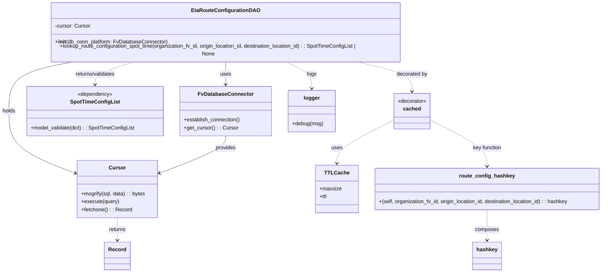

# Diagram: shipment_core/shipment_service/shipment_service/eta/db/eta_route_configuration_dao.py

> Auto-generated by Obscura crawlers

## Mermaid

### SVG

<svg id="container" width="1828.28515625" xmlns="http://www.w3.org/2000/svg" class="classDiagram" height="814" viewBox="0 0 1828.28515625 814" role="graphics-document document" aria-roledescription="class"><g><defs><marker id="container_class-aggregationStart" class="marker aggregation class" refX="18" refY="7" markerWidth="190" markerHeight="240" orient="auto"><path d="M 18,7 L9,13 L1,7 L9,1 Z"></path></marker></defs><defs><marker id="container_class-aggregationEnd" class="marker aggregation class" refX="1" refY="7" markerWidth="20" markerHeight="28" orient="auto"><path d="M 18,7 L9,13 L1,7 L9,1 Z"></path></marker></defs><defs><marker id="container_class-extensionStart" class="marker extension class" refX="18" refY="7" markerWidth="190" markerHeight="240" orient="auto"><path d="M 1,7 L18,13 V 1 Z"></path></marker></defs><defs><marker id="container_class-extensionEnd" class="marker extension class" refX="1" refY="7" markerWidth="20" markerHeight="28" orient="auto"><path d="M 1,1 V 13 L18,7 Z"></path></marker></defs><defs><marker id="container_class-compositionStart" class="marker composition class" refX="18" refY="7" markerWidth="190" markerHeight="240" orient="auto"><path d="M 18,7 L9,13 L1,7 L9,1 Z"></path></marker></defs><defs><marker id="container_class-compositionEnd" class="marker composition class" refX="1" refY="7" markerWidth="20" markerHeight="28" orient="auto"><path d="M 18,7 L9,13 L1,7 L9,1 Z"></path></marker></defs><defs><marker id="container_class-dependencyStart" class="marker dependency class" refX="6" refY="7" markerWidth="190" markerHeight="240" orient="auto"><path d="M 5,7 L9,13 L1,7 L9,1 Z"></path></marker></defs><defs><marker id="container_class-dependencyEnd" class="marker dependency class" refX="13" refY="7" markerWidth="20" markerHeight="28" orient="auto"><path d="M 18,7 L9,13 L14,7 L9,1 Z"></path></marker></defs><defs><marker id="container_class-lollipopStart" class="marker lollipop class" refX="13" refY="7" markerWidth="190" markerHeight="240" orient="auto"><circle stroke="black" fill="transparent" cx="7" cy="7" r="6"></circle></marker></defs><defs><marker id="container_class-lollipopEnd" class="marker lollipop class" refX="1" refY="7" markerWidth="190" markerHeight="240" orient="auto"><circle stroke="black" fill="transparent" cx="7" cy="7" r="6"></circle></marker></defs><g class="root"><g class="clusters"></g><g class="edgePaths"><path d="M683.957,176L683.957,182.167C683.957,188.333,683.957,200.667,683.957,212C683.957,223.333,683.957,233.667,683.957,238.833L683.957,244" id="id_EtaRouteConfigurationDAO_FvDatabaseConnector_1" class="edge-thickness-normal edge-pattern-solid relation" style=";;;" data-edge="true" data-et="edge" data-id="id_EtaRouteConfigurationDAO_FvDatabaseConnector_1" data-points="W3sieCI6NjgzLjk1NzAzMTI1LCJ5IjoxNzZ9LHsieCI6NjgzLjk1NzAzMTI1LCJ5IjoyMTN9LHsieCI6NjgzLjk1NzAzMTI1LCJ5IjoyNTB9XQ==" marker-end="url(#container_class-dependencyEnd)"></path><path d="M228.712,176L195.291,182.167C161.871,188.333,95.029,200.667,61.608,225.5C28.188,250.333,28.188,287.667,28.188,325C28.188,362.333,28.188,399.667,61.607,430.972C95.026,462.277,161.864,487.554,195.283,500.193L228.702,512.831" id="id_EtaRouteConfigurationDAO_Cursor_2" class="edge-thickness-normal edge-pattern-solid relation" style=";;;" data-edge="true" data-et="edge" data-id="id_EtaRouteConfigurationDAO_Cursor_2" data-points="W3sieCI6MjI4LjcxMjA2NzQwNzAyNDgsInkiOjE3Nn0seyJ4IjoyOC4xODc1LCJ5IjoyMTN9LHsieCI6MjguMTg3NSwieSI6MzI1fSx7IngiOjI4LjE4NzUsInkiOjQzN30seyJ4IjoyMzQuMzE0NDUzMTI1LCJ5Ijo1MTQuOTUzNDMwMTg5OTYwNX1d" marker-end="url(#container_class-dependencyEnd)"></path><path d="M1074.65,176L1103.331,182.167C1132.013,188.333,1189.377,200.667,1218.058,215.5C1246.74,230.333,1246.74,247.667,1246.74,256.333L1246.74,265" id="id_EtaRouteConfigurationDAO_cached_3" class="edge-thickness-normal edge-pattern-dashed relation" style=";;;" data-edge="true" data-et="edge" data-id="id_EtaRouteConfigurationDAO_cached_3" data-points="W3sieCI6MTA3NC42NDk1MDI4NDA5MDksInkiOjE3Nn0seyJ4IjoxMjQ2Ljc0MDIzNDM3NSwieSI6MjEzfSx7IngiOjEyNDYuNzQwMjM0Mzc1LCJ5IjoyNzF9XQ==" marker-end="url(#container_class-dependencyEnd)"></path><path d="M1190.678,352.48L1161.94,366.567C1133.202,380.654,1075.726,408.827,1046.988,430.58C1018.25,452.333,1018.25,467.667,1018.25,475.333L1018.25,483" id="id_cached_TTLCache_4" class="edge-thickness-normal edge-pattern-dashed relation" style=";;;" data-edge="true" data-et="edge" data-id="id_cached_TTLCache_4" data-points="W3sieCI6MTE5MC42Nzc3MzQzNzUsInkiOjM1Mi40ODAzODY3MDk2MzQ0fSx7IngiOjEwMTguMjUsInkiOjQzN30seyJ4IjoxMDE4LjI1LCJ5Ijo0ODl9XQ==" marker-end="url(#container_class-dependencyEnd)"></path><path d="M410.135,176L390.033,182.167C369.931,188.333,329.727,200.667,309.625,212C289.523,223.333,289.523,233.667,289.523,238.833L289.523,244" id="id_EtaRouteConfigurationDAO_SpotTimeConfigList_5" class="edge-thickness-normal edge-pattern-dashed relation" style=";;;" data-edge="true" data-et="edge" data-id="id_EtaRouteConfigurationDAO_SpotTimeConfigList_5" data-points="W3sieCI6NDEwLjEzNTM2Mjg2MTU3MDIzLCJ5IjoxNzZ9LHsieCI6Mjg5LjUyMzQzNzUsInkiOjIxM30seyJ4IjoyODkuNTIzNDM3NSwieSI6MjUwfV0=" marker-end="url(#container_class-dependencyEnd)"></path><path d="M863.455,176L876.632,182.167C889.81,188.333,916.165,200.667,929.342,214C942.52,227.333,942.52,241.667,942.52,248.833L942.52,256" id="id_EtaRouteConfigurationDAO_logger_6" class="edge-thickness-normal edge-pattern-dashed relation" style=";;;" data-edge="true" data-et="edge" data-id="id_EtaRouteConfigurationDAO_logger_6" data-points="W3sieCI6ODYzLjQ1NDk2NTEzNDI5NzUsInkiOjE3Nn0seyJ4Ijo5NDIuNTE5NTMxMjUsInkiOjIxM30seyJ4Ijo5NDIuNTE5NTMxMjUsInkiOjI2Mn1d" marker-end="url(#container_class-dependencyEnd)"></path><path d="M1302.803,352.48L1331.541,366.567C1360.279,380.654,1417.755,408.827,1446.493,432.08C1475.23,455.333,1475.23,473.667,1475.23,482.833L1475.23,492" id="id_cached_route_config_hashkey_7" class="edge-thickness-normal edge-pattern-dashed relation" style=";;;" data-edge="true" data-et="edge" data-id="id_cached_route_config_hashkey_7" data-points="W3sieCI6MTMwMi44MDI3MzQzNzUsInkiOjM1Mi40ODAzODY3MDk2MzQ0fSx7IngiOjE0NzUuMjMwNDY4NzUsInkiOjQzN30seyJ4IjoxNDc1LjIzMDQ2ODc1LCJ5Ijo0OTh9XQ==" marker-end="url(#container_class-dependencyEnd)"></path><path d="M1475.23,624L1475.23,634.167C1475.23,644.333,1475.23,664.667,1475.23,680C1475.23,695.333,1475.23,705.667,1475.23,710.833L1475.23,716" id="id_route_config_hashkey_hashkey_8" class="edge-thickness-normal edge-pattern-dashed relation" style=";;;" data-edge="true" data-et="edge" data-id="id_route_config_hashkey_hashkey_8" data-points="W3sieCI6MTQ3NS4yMzA0Njg3NSwieSI6NjI0fSx7IngiOjE0NzUuMjMwNDY4NzUsInkiOjY4NX0seyJ4IjoxNDc1LjIzMDQ2ODc1LCJ5Ijo3MjJ9XQ==" marker-end="url(#container_class-dependencyEnd)"></path><path d="M356.072,648L356.072,654.167C356.072,660.333,356.072,672.667,356.072,684C356.072,695.333,356.072,705.667,356.072,710.833L356.072,716" id="id_Cursor_Record_9" class="edge-thickness-normal edge-pattern-dashed relation" style=";;;" data-edge="true" data-et="edge" data-id="id_Cursor_Record_9" data-points="W3sieCI6MzU2LjA3MjI2NTYyNSwieSI6NjQ4fSx7IngiOjM1Ni4wNzIyNjU2MjUsInkiOjY4NX0seyJ4IjozNTYuMDcyMjY1NjI1LCJ5Ijo3MjJ9XQ==" marker-end="url(#container_class-dependencyEnd)"></path><path d="M683.957,400L683.957,406.167C683.957,412.333,683.957,424.667,650.538,443.472C617.119,462.277,550.28,487.554,516.861,500.193L483.442,512.831" id="id_FvDatabaseConnector_Cursor_10" class="edge-thickness-normal edge-pattern-solid relation" style=";;;" data-edge="true" data-et="edge" data-id="id_FvDatabaseConnector_Cursor_10" data-points="W3sieCI6NjgzLjk1NzAzMTI1LCJ5Ijo0MDB9LHsieCI6NjgzLjk1NzAzMTI1LCJ5Ijo0Mzd9LHsieCI6NDc3LjgzMDA3ODEyNSwieSI6NTE0Ljk1MzQzMDE4OTk2MDV9XQ==" marker-end="url(#container_class-dependencyEnd)"></path></g><g class="edgeLabels"><g class="edgeLabel" transform="translate(683.95703125, 213)"><g class="label" data-id="id_EtaRouteConfigurationDAO_FvDatabaseConnector_1" transform="translate(-16.4921875, -12)"><foreignObject width="32.984375" height="24">

uses

</foreignObject></g></g><g class="edgeLabel" transform="translate(28.1875, 325)"><g class="label" data-id="id_EtaRouteConfigurationDAO_Cursor_2" transform="translate(-20.1875, -12)"><foreignObject width="40.375" height="24">

holds

</foreignObject></g></g><g class="edgeLabel" transform="translate(1246.740234375, 213)"><g class="label" data-id="id_EtaRouteConfigurationDAO_cached_3" transform="translate(-47.328125, -12)"><foreignObject width="94.65625" height="24">

decorated by

</foreignObject></g></g><g class="edgeLabel" transform="translate(1018.25, 437)"><g class="label" data-id="id_cached_TTLCache_4" transform="translate(-16.4921875, -12)"><foreignObject width="32.984375" height="24">

uses

</foreignObject></g></g><g class="edgeLabel" transform="translate(289.5234375, 213)"><g class="label" data-id="id_EtaRouteConfigurationDAO_SpotTimeConfigList_5" transform="translate(-62.9453125, -12)"><foreignObject width="125.890625" height="24">

returns/validates

</foreignObject></g></g><g class="edgeLabel" transform="translate(942.51953125, 213)"><g class="label" data-id="id_EtaRouteConfigurationDAO_logger_6" transform="translate(-14.8203125, -12)"><foreignObject width="29.640625" height="24">

logs

</foreignObject></g></g><g class="edgeLabel" transform="translate(1475.23046875, 437)"><g class="label" data-id="id_cached_route_config_hashkey_7" transform="translate(-44.765625, -12)"><foreignObject width="89.53125" height="24">

key function

</foreignObject></g></g><g class="edgeLabel" transform="translate(1475.23046875, 685)"><g class="label" data-id="id_route_config_hashkey_hashkey_8" transform="translate(-36.453125, -12)"><foreignObject width="72.90625" height="24">

composes

</foreignObject></g></g><g class="edgeLabel" transform="translate(356.072265625, 685)"><g class="label" data-id="id_Cursor_Record_9" transform="translate(-26.265625, -12)"><foreignObject width="52.53125" height="24">

returns

</foreignObject></g></g><g class="edgeLabel" transform="translate(683.95703125, 437)"><g class="label" data-id="id_FvDatabaseConnector_Cursor_10" transform="translate(-31.3125, -12)"><foreignObject width="62.625" height="24">

provides

</foreignObject></g></g></g><g class="nodes"><g class="node default" id="classId-EtaRouteConfigurationDAO-0" transform="translate(683.95703125, 92)"><g class="basic label-container"><path d="M-544.4453125 -84 L544.4453125 -84 L544.4453125 84 L-544.4453125 84" stroke="none" stroke-width="0" fill="#ECECFF" style=""></path><path d="M-544.4453125 -84 C-125.54106442188515 -84, 293.3631836562297 -84, 544.4453125 -84 M-544.4453125 -84 C-305.0172086107384 -84, -65.58910472147676 -84, 544.4453125 -84 M544.4453125 -84 C544.4453125 -18.178105728199697, 544.4453125 47.64378854360061, 544.4453125 84 M544.4453125 -84 C544.4453125 -22.992916924176185, 544.4453125 38.01416615164763, 544.4453125 84 M544.4453125 84 C320.44952956805486 84, 96.45374663610971 84, -544.4453125 84 M544.4453125 84 C283.0119259179239 84, 21.578539335847836 84, -544.4453125 84 M-544.4453125 84 C-544.4453125 28.292921481330787, -544.4453125 -27.414157037338427, -544.4453125 -84 M-544.4453125 84 C-544.4453125 20.45680596974899, -544.4453125 -43.08638806050202, -544.4453125 -84" stroke="#9370DB" stroke-width="1.3" fill="none" stroke-dasharray="0 0" style=""></path></g><g class="annotation-group text" transform="translate(0, -60)"></g><g class="label-group text" transform="translate(-97.53125, -60)"><g class="label" style="font-weight: bolder" transform="translate(0,-12)"><foreignObject width="195.0625" height="24">

EtaRouteConfigurationDAO

</foreignObject></g></g><g class="members-group text" transform="translate(-532.4453125, -12)"><g class="label" style="" transform="translate(0,-12)"><foreignObject width="107.359375" height="24">

-cursor: Cursor

</foreignObject></g></g><g class="methods-group text" transform="translate(-532.4453125, 36)"><g class="label" style="" transform="translate(0,-12)"><foreignObject width="341.015625" height="24">

+<strong>init</strong>(db_conn_platform: FvDatabaseConnector)

</foreignObject></g><g class="label" style="" transform="translate(0,12)"><foreignObject width="967.359375" height="24">

+lookup_route_configuration_spot_time(organization_fv_id, origin_location_id, destination_location_id) : : SpotTimeConfigList | None

</foreignObject></g></g><g class="divider" style=""><path d="M-544.4453125 -36 C-301.2076203090347 -36, -57.96992811806945 -36, 544.4453125 -36 M-544.4453125 -36 C-214.86580665030596 -36, 114.71369919938809 -36, 544.4453125 -36" stroke="#9370DB" stroke-width="1.3" fill="none" stroke-dasharray="0 0" style=""></path></g><g class="divider" style=""><path d="M-544.4453125 12 C-181.53315915143753 12, 181.37899419712494 12, 544.4453125 12 M-544.4453125 12 C-274.9529301453801 12, -5.460547790760188 12, 544.4453125 12" stroke="#9370DB" stroke-width="1.3" fill="none" stroke-dasharray="0 0" style=""></path></g></g><g class="node default" id="classId-FvDatabaseConnector-1" transform="translate(683.95703125, 325)"><g class="basic label-container"><path d="M-138.28515625 -75 L138.28515625 -75 L138.28515625 75 L-138.28515625 75" stroke="none" stroke-width="0" fill="#ECECFF" style=""></path><path d="M-138.28515625 -75 C-52.99016171710005 -75, 32.3048328157999 -75, 138.28515625 -75 M-138.28515625 -75 C-56.527114609951056 -75, 25.230927030097888 -75, 138.28515625 -75 M138.28515625 -75 C138.28515625 -27.704397849935276, 138.28515625 19.591204300129448, 138.28515625 75 M138.28515625 -75 C138.28515625 -24.23308488395851, 138.28515625 26.533830232082977, 138.28515625 75 M138.28515625 75 C47.05161666751212 75, -44.18192291497576 75, -138.28515625 75 M138.28515625 75 C35.16611729801019 75, -67.95292165397962 75, -138.28515625 75 M-138.28515625 75 C-138.28515625 29.31314336071575, -138.28515625 -16.373713278568502, -138.28515625 -75 M-138.28515625 75 C-138.28515625 27.752479057849392, -138.28515625 -19.495041884301216, -138.28515625 -75" stroke="#9370DB" stroke-width="1.3" fill="none" stroke-dasharray="0 0" style=""></path></g><g class="annotation-group text" transform="translate(0, -51)"></g><g class="label-group text" transform="translate(-79.3046875, -51)"><g class="label" style="font-weight: bolder" transform="translate(0,-12)"><foreignObject width="158.609375" height="24">

FvDatabaseConnector

</foreignObject></g></g><g class="members-group text" transform="translate(-126.28515625, -3)"></g><g class="methods-group text" transform="translate(-126.28515625, 27)"><g class="label" style="" transform="translate(0,-12)"><foreignObject width="173.265625" height="24">

+establish_connection()

</foreignObject></g><g class="label" style="" transform="translate(0,12)"><foreignObject width="161.96875" height="24">

+get_cursor() : : Cursor

</foreignObject></g></g><g class="divider" style=""><path d="M-138.28515625 -27 C-41.889441266989834 -27, 54.50627371602033 -27, 138.28515625 -27 M-138.28515625 -27 C-48.709478930655735 -27, 40.86619838868853 -27, 138.28515625 -27" stroke="#9370DB" stroke-width="1.3" fill="none" stroke-dasharray="0 0" style=""></path></g><g class="divider" style=""><path d="M-138.28515625 -3 C-75.73736312661578 -3, -13.189570003231552 -3, 138.28515625 -3 M-138.28515625 -3 C-39.87690762645384 -3, 58.531340997092315 -3, 138.28515625 -3" stroke="#9370DB" stroke-width="1.3" fill="none" stroke-dasharray="0 0" style=""></path></g></g><g class="node default" id="classId-Cursor-2" transform="translate(356.072265625, 561)"><g class="basic label-container"><path d="M-121.7578125 -87 L121.7578125 -87 L121.7578125 87 L-121.7578125 87" stroke="none" stroke-width="0" fill="#ECECFF" style=""></path><path d="M-121.7578125 -87 C-30.841866743239393 -87, 60.074079013521214 -87, 121.7578125 -87 M-121.7578125 -87 C-39.06280605989318 -87, 43.632200380213646 -87, 121.7578125 -87 M121.7578125 -87 C121.7578125 -47.5369656417437, 121.7578125 -8.073931283487397, 121.7578125 87 M121.7578125 -87 C121.7578125 -48.982645139144964, 121.7578125 -10.965290278289928, 121.7578125 87 M121.7578125 87 C29.522258050162307 87, -62.713296399675386 87, -121.7578125 87 M121.7578125 87 C28.22330819738312 87, -65.31119610523376 87, -121.7578125 87 M-121.7578125 87 C-121.7578125 43.640053708136634, -121.7578125 0.2801074162732675, -121.7578125 -87 M-121.7578125 87 C-121.7578125 28.038398816376613, -121.7578125 -30.923202367246773, -121.7578125 -87" stroke="#9370DB" stroke-width="1.3" fill="none" stroke-dasharray="0 0" style=""></path></g><g class="annotation-group text" transform="translate(0, -63)"></g><g class="label-group text" transform="translate(-23.90625, -63)"><g class="label" style="font-weight: bolder" transform="translate(0,-12)"><foreignObject width="47.8125" height="24">

Cursor

</foreignObject></g></g><g class="members-group text" transform="translate(-109.7578125, -15)"></g><g class="methods-group text" transform="translate(-109.7578125, 15)"><g class="label" style="" transform="translate(0,-12)"><foreignObject width="195.609375" height="24">

+mogrify(sql, data) : : bytes

</foreignObject></g><g class="label" style="" transform="translate(0,12)"><foreignObject width="115.96875" height="24">

+execute(query)

</foreignObject></g><g class="label" style="" transform="translate(0,36)"><foreignObject width="152.53125" height="24">

+fetchone() : : Record

</foreignObject></g></g><g class="divider" style=""><path d="M-121.7578125 -39 C-71.80718841902049 -39, -21.856564338040968 -39, 121.7578125 -39 M-121.7578125 -39 C-37.362222021537136 -39, 47.03336845692573 -39, 121.7578125 -39" stroke="#9370DB" stroke-width="1.3" fill="none" stroke-dasharray="0 0" style=""></path></g><g class="divider" style=""><path d="M-121.7578125 -15 C-41.13949923452374 -15, 39.47881403095252 -15, 121.7578125 -15 M-121.7578125 -15 C-45.056022222157765 -15, 31.64576805568447 -15, 121.7578125 -15" stroke="#9370DB" stroke-width="1.3" fill="none" stroke-dasharray="0 0" style=""></path></g></g><g class="node default" id="classId-SpotTimeConfigList-3" transform="translate(289.5234375, 325)"><g class="basic label-container"><path d="M-206.1484375 -75 L206.1484375 -75 L206.1484375 75 L-206.1484375 75" stroke="none" stroke-width="0" fill="#ECECFF" style=""></path><path d="M-206.1484375 -75 C-107.17645904122467 -75, -8.20448058244935 -75, 206.1484375 -75 M-206.1484375 -75 C-94.86919446515738 -75, 16.410048569685245 -75, 206.1484375 -75 M206.1484375 -75 C206.1484375 -21.082250943808695, 206.1484375 32.83549811238261, 206.1484375 75 M206.1484375 -75 C206.1484375 -42.465085818609765, 206.1484375 -9.93017163721953, 206.1484375 75 M206.1484375 75 C88.38122704992351 75, -29.38598340015298 75, -206.1484375 75 M206.1484375 75 C106.62017528481952 75, 7.091913069639048 75, -206.1484375 75 M-206.1484375 75 C-206.1484375 24.71308101986792, -206.1484375 -25.573837960264157, -206.1484375 -75 M-206.1484375 75 C-206.1484375 29.982762800995054, -206.1484375 -15.034474398009891, -206.1484375 -75" stroke="#9370DB" stroke-width="1.3" fill="none" stroke-dasharray="0 0" style=""></path></g><g class="annotation-group text" transform="translate(-53.5078125, -51)"><g class="label" style="" transform="translate(0,-12)"><foreignObject width="107.015625" height="24">

«dependency»

</foreignObject></g></g><g class="label-group text" transform="translate(-71.109375, -27)"><g class="label" style="font-weight: bolder" transform="translate(0,-12)"><foreignObject width="142.21875" height="24">

SpotTimeConfigList

</foreignObject></g></g><g class="members-group text" transform="translate(-194.1484375, 21)"></g><g class="methods-group text" transform="translate(-194.1484375, 51)"><g class="label" style="" transform="translate(0,-12)"><foreignObject width="317.1875" height="24">

+model_validate(dict) : : SpotTimeConfigList

</foreignObject></g></g><g class="divider" style=""><path d="M-206.1484375 -3 C-42.92174679142198 -3, 120.30494391715604 -3, 206.1484375 -3 M-206.1484375 -3 C-41.421847134094065 -3, 123.30474323181187 -3, 206.1484375 -3" stroke="#9370DB" stroke-width="1.3" fill="none" stroke-dasharray="0 0" style=""></path></g><g class="divider" style=""><path d="M-206.1484375 21 C-64.64593687785339 21, 76.85656374429323 21, 206.1484375 21 M-206.1484375 21 C-44.725631159649424 21, 116.69717518070115 21, 206.1484375 21" stroke="#9370DB" stroke-width="1.3" fill="none" stroke-dasharray="0 0" style=""></path></g></g><g class="node default" id="classId-TTLCache-4" transform="translate(1018.25, 561)"><g class="basic label-container"><path d="M-61.92578125 -72 L61.92578125 -72 L61.92578125 72 L-61.92578125 72" stroke="none" stroke-width="0" fill="#ECECFF" style=""></path><path d="M-61.92578125 -72 C-20.690765763070928 -72, 20.544249723858144 -72, 61.92578125 -72 M-61.92578125 -72 C-22.843601168328256 -72, 16.23857891334349 -72, 61.92578125 -72 M61.92578125 -72 C61.92578125 -31.773834780148192, 61.92578125 8.452330439703616, 61.92578125 72 M61.92578125 -72 C61.92578125 -15.646195931006162, 61.92578125 40.70760813798768, 61.92578125 72 M61.92578125 72 C23.354546780768572 72, -15.216687688462855 72, -61.92578125 72 M61.92578125 72 C15.39894502432007 72, -31.12789120135986 72, -61.92578125 72 M-61.92578125 72 C-61.92578125 35.49410339434849, -61.92578125 -1.011793211303015, -61.92578125 -72 M-61.92578125 72 C-61.92578125 17.000141111414848, -61.92578125 -37.999717777170304, -61.92578125 -72" stroke="#9370DB" stroke-width="1.3" fill="none" stroke-dasharray="0 0" style=""></path></g><g class="annotation-group text" transform="translate(0, -48)"></g><g class="label-group text" transform="translate(-34.1796875, -48)"><g class="label" style="font-weight: bolder" transform="translate(0,-12)"><foreignObject width="68.359375" height="24">

TTLCache

</foreignObject></g></g><g class="members-group text" transform="translate(-49.92578125, 0)"><g class="label" style="" transform="translate(0,-12)"><foreignObject width="65.671875" height="24">

+maxsize

</foreignObject></g><g class="label" style="" transform="translate(0,12)"><foreignObject width="23.984375" height="24">

+ttl

</foreignObject></g></g><g class="methods-group text" transform="translate(-49.92578125, 72)"></g><g class="divider" style=""><path d="M-61.92578125 -24 C-14.756314504987579 -24, 32.41315224002484 -24, 61.92578125 -24 M-61.92578125 -24 C-29.344680580232513 -24, 3.236420089534974 -24, 61.92578125 -24" stroke="#9370DB" stroke-width="1.3" fill="none" stroke-dasharray="0 0" style=""></path></g><g class="divider" style=""><path d="M-61.92578125 48 C-31.18715656962798 48, -0.44853188925596044 48, 61.92578125 48 M-61.92578125 48 C-25.637808813735774 48, 10.650163622528453 48, 61.92578125 48" stroke="#9370DB" stroke-width="1.3" fill="none" stroke-dasharray="0 0" style=""></path></g></g><g class="node default" id="classId-cached-5" transform="translate(1246.740234375, 325)"><g class="basic label-container"><path d="M-56.0625 -54 L56.0625 -54 L56.0625 54 L-56.0625 54" stroke="none" stroke-width="0" fill="#ECECFF" style=""></path><path d="M-56.0625 -54 C-14.945316622428962 -54, 26.171866755142076 -54, 56.0625 -54 M-56.0625 -54 C-30.57575306393462 -54, -5.08900612786924 -54, 56.0625 -54 M56.0625 -54 C56.0625 -20.083951738822826, 56.0625 13.832096522354348, 56.0625 54 M56.0625 -54 C56.0625 -20.957033494349226, 56.0625 12.085933011301549, 56.0625 54 M56.0625 54 C24.484797123064826 54, -7.0929057538703475 54, -56.0625 54 M56.0625 54 C19.412504077390984 54, -17.23749184521803 54, -56.0625 54 M-56.0625 54 C-56.0625 17.373909603180756, -56.0625 -19.252180793638487, -56.0625 -54 M-56.0625 54 C-56.0625 23.734855815875374, -56.0625 -6.530288368249252, -56.0625 -54" stroke="#9370DB" stroke-width="1.3" fill="none" stroke-dasharray="0 0" style=""></path></g><g class="annotation-group text" transform="translate(-44.0625, -30)"><g class="label" style="" transform="translate(0,-12)"><foreignObject width="88.125" height="24">

«decorator»

</foreignObject></g></g><g class="label-group text" transform="translate(-25.8046875, -6)"><g class="label" style="font-weight: bolder" transform="translate(0,-12)"><foreignObject width="51.609375" height="24">

cached

</foreignObject></g></g><g class="members-group text" transform="translate(-44.0625, 42)"></g><g class="methods-group text" transform="translate(-44.0625, 72)"></g><g class="divider" style=""><path d="M-56.0625 18 C-25.09400707991452 18, 5.874485840170962 18, 56.0625 18 M-56.0625 18 C-18.164120692364115 18, 19.73425861527177 18, 56.0625 18" stroke="#9370DB" stroke-width="1.3" fill="none" stroke-dasharray="0 0" style=""></path></g><g class="divider" style=""><path d="M-56.0625 36 C-13.42152645803393 36, 29.21944708393214 36, 56.0625 36 M-56.0625 36 C-27.652806376127515 36, 0.7568872477449702 36, 56.0625 36" stroke="#9370DB" stroke-width="1.3" fill="none" stroke-dasharray="0 0" style=""></path></g></g><g class="node default" id="classId-route_config_hashkey-6" transform="translate(1475.23046875, 561)"><g class="basic label-container"><path d="M-345.0546875 -63 L345.0546875 -63 L345.0546875 63 L-345.0546875 63" stroke="none" stroke-width="0" fill="#ECECFF" style=""></path><path d="M-345.0546875 -63 C-75.64528960860173 -63, 193.76410828279654 -63, 345.0546875 -63 M-345.0546875 -63 C-94.01859674075354 -63, 157.01749401849293 -63, 345.0546875 -63 M345.0546875 -63 C345.0546875 -31.26117680049913, 345.0546875 0.4776463990017419, 345.0546875 63 M345.0546875 -63 C345.0546875 -26.378107964763217, 345.0546875 10.243784070473566, 345.0546875 63 M345.0546875 63 C198.07154747570476 63, 51.08840745140952 63, -345.0546875 63 M345.0546875 63 C90.5140173850697 63, -164.0266527298606 63, -345.0546875 63 M-345.0546875 63 C-345.0546875 37.34435703590871, -345.0546875 11.688714071817415, -345.0546875 -63 M-345.0546875 63 C-345.0546875 23.001801108760887, -345.0546875 -16.996397782478226, -345.0546875 -63" stroke="#9370DB" stroke-width="1.3" fill="none" stroke-dasharray="0 0" style=""></path></g><g class="annotation-group text" transform="translate(0, -39)"></g><g class="label-group text" transform="translate(-80.015625, -39)"><g class="label" style="font-weight: bolder" transform="translate(0,-12)"><foreignObject width="160.03125" height="24">

route_config_hashkey

</foreignObject></g></g><g class="members-group text" transform="translate(-333.0546875, 9)"></g><g class="methods-group text" transform="translate(-333.0546875, 39)"><g class="label" style="" transform="translate(0,-12)"><foreignObject width="586.09375" height="24">

+(self, organization_fv_id, origin_location_id, destination_location_id) : : hashkey

</foreignObject></g></g><g class="divider" style=""><path d="M-345.0546875 -15 C-128.43800998257382 -15, 88.17866753485237 -15, 345.0546875 -15 M-345.0546875 -15 C-163.91724740205274 -15, 17.220192695894525 -15, 345.0546875 -15" stroke="#9370DB" stroke-width="1.3" fill="none" stroke-dasharray="0 0" style=""></path></g><g class="divider" style=""><path d="M-345.0546875 9 C-70.92727849665539 9, 203.20013050668922 9, 345.0546875 9 M-345.0546875 9 C-119.90785350161698 9, 105.23898049676603 9, 345.0546875 9" stroke="#9370DB" stroke-width="1.3" fill="none" stroke-dasharray="0 0" style=""></path></g></g><g class="node default" id="classId-logger-7" transform="translate(942.51953125, 325)"><g class="basic label-container"><path d="M-70.27734375 -63 L70.27734375 -63 L70.27734375 63 L-70.27734375 63" stroke="none" stroke-width="0" fill="#ECECFF" style=""></path><path d="M-70.27734375 -63 C-36.15407315165345 -63, -2.0308025533068985 -63, 70.27734375 -63 M-70.27734375 -63 C-41.828364116258854 -63, -13.3793844825177 -63, 70.27734375 -63 M70.27734375 -63 C70.27734375 -31.412250789887153, 70.27734375 0.1754984202256935, 70.27734375 63 M70.27734375 -63 C70.27734375 -30.718350138826054, 70.27734375 1.5632997223478924, 70.27734375 63 M70.27734375 63 C33.42701632251123 63, -3.423311104977543 63, -70.27734375 63 M70.27734375 63 C39.8982876002367 63, 9.519231450473391 63, -70.27734375 63 M-70.27734375 63 C-70.27734375 17.6548978643223, -70.27734375 -27.690204271355398, -70.27734375 -63 M-70.27734375 63 C-70.27734375 21.3305145036485, -70.27734375 -20.338970992702997, -70.27734375 -63" stroke="#9370DB" stroke-width="1.3" fill="none" stroke-dasharray="0 0" style=""></path></g><g class="annotation-group text" transform="translate(0, -39)"></g><g class="label-group text" transform="translate(-23.2734375, -39)"><g class="label" style="font-weight: bolder" transform="translate(0,-12)"><foreignObject width="46.546875" height="24">

logger

</foreignObject></g></g><g class="members-group text" transform="translate(-58.27734375, 9)"></g><g class="methods-group text" transform="translate(-58.27734375, 39)"><g class="label" style="" transform="translate(0,-12)"><foreignObject width="93.28125" height="24">

+debug(msg)

</foreignObject></g></g><g class="divider" style=""><path d="M-70.27734375 -15 C-41.1738071707005 -15, -12.070270591401005 -15, 70.27734375 -15 M-70.27734375 -15 C-41.70163613047832 -15, -13.125928510956648 -15, 70.27734375 -15" stroke="#9370DB" stroke-width="1.3" fill="none" stroke-dasharray="0 0" style=""></path></g><g class="divider" style=""><path d="M-70.27734375 9 C-18.185375757773976 9, 33.90659223445205 9, 70.27734375 9 M-70.27734375 9 C-28.122590849275348 9, 14.032162051449305 9, 70.27734375 9" stroke="#9370DB" stroke-width="1.3" fill="none" stroke-dasharray="0 0" style=""></path></g></g><g class="node default" id="classId-hashkey-8" transform="translate(1475.23046875, 764)"><g class="basic label-container"><path d="M-42.2109375 -42 L42.2109375 -42 L42.2109375 42 L-42.2109375 42" stroke="none" stroke-width="0" fill="#ECECFF" style=""></path><path d="M-42.2109375 -42 C-11.88550572730701 -42, 18.43992604538598 -42, 42.2109375 -42 M-42.2109375 -42 C-12.510925563807977 -42, 17.189086372384047 -42, 42.2109375 -42 M42.2109375 -42 C42.2109375 -8.72770818504307, 42.2109375 24.54458362991386, 42.2109375 42 M42.2109375 -42 C42.2109375 -18.65406775069532, 42.2109375 4.6918644986093625, 42.2109375 42 M42.2109375 42 C11.69254206793239 42, -18.82585336413522 42, -42.2109375 42 M42.2109375 42 C9.672343001869926 42, -22.866251496260148 42, -42.2109375 42 M-42.2109375 42 C-42.2109375 14.24678116364531, -42.2109375 -13.506437672709382, -42.2109375 -42 M-42.2109375 42 C-42.2109375 11.13808300158994, -42.2109375 -19.72383399682012, -42.2109375 -42" stroke="#9370DB" stroke-width="1.3" fill="none" stroke-dasharray="0 0" style=""></path></g><g class="annotation-group text" transform="translate(0, -18)"></g><g class="label-group text" transform="translate(-30.2109375, -18)"><g class="label" style="font-weight: bolder" transform="translate(0,-12)"><foreignObject width="60.421875" height="24">

hashkey

</foreignObject></g></g><g class="members-group text" transform="translate(-30.2109375, 30)"></g><g class="methods-group text" transform="translate(-30.2109375, 60)"></g><g class="divider" style=""><path d="M-42.2109375 6 C-13.153685347353985 6, 15.90356680529203 6, 42.2109375 6 M-42.2109375 6 C-16.99383955519624 6, 8.223258389607523 6, 42.2109375 6" stroke="#9370DB" stroke-width="1.3" fill="none" stroke-dasharray="0 0" style=""></path></g><g class="divider" style=""><path d="M-42.2109375 24 C-11.10474654464005 24, 20.0014444107199 24, 42.2109375 24 M-42.2109375 24 C-23.07966500217152 24, -3.9483925043430403 24, 42.2109375 24" stroke="#9370DB" stroke-width="1.3" fill="none" stroke-dasharray="0 0" style=""></path></g></g><g class="node default" id="classId-Record-9" transform="translate(356.072265625, 764)"><g class="basic label-container"><path d="M-37.3515625 -42 L37.3515625 -42 L37.3515625 42 L-37.3515625 42" stroke="none" stroke-width="0" fill="#ECECFF" style=""></path><path d="M-37.3515625 -42 C-19.973524936094226 -42, -2.595487372188451 -42, 37.3515625 -42 M-37.3515625 -42 C-15.350737755151684 -42, 6.650086989696632 -42, 37.3515625 -42 M37.3515625 -42 C37.3515625 -18.666341653503455, 37.3515625 4.66731669299309, 37.3515625 42 M37.3515625 -42 C37.3515625 -8.647431578261362, 37.3515625 24.705136843477277, 37.3515625 42 M37.3515625 42 C14.370420965429425 42, -8.61072056914115 42, -37.3515625 42 M37.3515625 42 C19.682526885112186 42, 2.013491270224371 42, -37.3515625 42 M-37.3515625 42 C-37.3515625 24.82470069241931, -37.3515625 7.649401384838619, -37.3515625 -42 M-37.3515625 42 C-37.3515625 25.164282698067005, -37.3515625 8.32856539613401, -37.3515625 -42" stroke="#9370DB" stroke-width="1.3" fill="none" stroke-dasharray="0 0" style=""></path></g><g class="annotation-group text" transform="translate(0, -18)"></g><g class="label-group text" transform="translate(-25.3515625, -18)"><g class="label" style="font-weight: bolder" transform="translate(0,-12)"><foreignObject width="50.703125" height="24">

Record

</foreignObject></g></g><g class="members-group text" transform="translate(-25.3515625, 30)"></g><g class="methods-group text" transform="translate(-25.3515625, 60)"></g><g class="divider" style=""><path d="M-37.3515625 6 C-17.666350612611552 6, 2.0188612747768957 6, 37.3515625 6 M-37.3515625 6 C-14.493254993542124 6, 8.365052512915753 6, 37.3515625 6" stroke="#9370DB" stroke-width="1.3" fill="none" stroke-dasharray="0 0" style=""></path></g><g class="divider" style=""><path d="M-37.3515625 24 C-12.663859212795732 24, 12.023844074408537 24, 37.3515625 24 M-37.3515625 24 C-9.08288278999586 24, 19.18579692000828 24, 37.3515625 24" stroke="#9370DB" stroke-width="1.3" fill="none" stroke-dasharray="0 0" style=""></path></g></g></g></g></g></svg>
