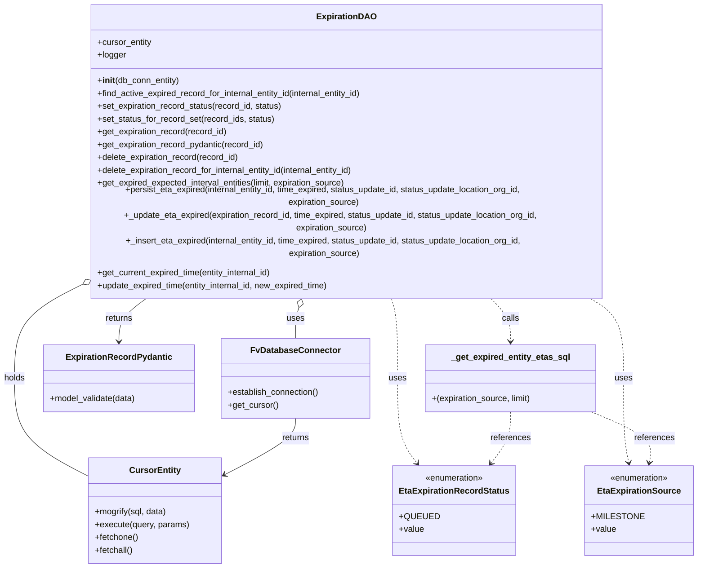

# Diagram: shipment_core/shipment_service/shipment_service/eta/db/expiration.py

> Auto-generated by Obscura crawlers

## Mermaid

### SVG

<svg id="container" width="1296.38671875" xmlns="http://www.w3.org/2000/svg" class="classDiagram" height="992" viewBox="0 0 1296.38671875 992" role="graphics-document document" aria-roledescription="class"><g><defs><marker id="container_class-aggregationStart" class="marker aggregation class" refX="18" refY="7" markerWidth="190" markerHeight="240" orient="auto"><path d="M 18,7 L9,13 L1,7 L9,1 Z"></path></marker></defs><defs><marker id="container_class-aggregationEnd" class="marker aggregation class" refX="1" refY="7" markerWidth="20" markerHeight="28" orient="auto"><path d="M 18,7 L9,13 L1,7 L9,1 Z"></path></marker></defs><defs><marker id="container_class-extensionStart" class="marker extension class" refX="18" refY="7" markerWidth="190" markerHeight="240" orient="auto"><path d="M 1,7 L18,13 V 1 Z"></path></marker></defs><defs><marker id="container_class-extensionEnd" class="marker extension class" refX="1" refY="7" markerWidth="20" markerHeight="28" orient="auto"><path d="M 1,1 V 13 L18,7 Z"></path></marker></defs><defs><marker id="container_class-compositionStart" class="marker composition class" refX="18" refY="7" markerWidth="190" markerHeight="240" orient="auto"><path d="M 18,7 L9,13 L1,7 L9,1 Z"></path></marker></defs><defs><marker id="container_class-compositionEnd" class="marker composition class" refX="1" refY="7" markerWidth="20" markerHeight="28" orient="auto"><path d="M 18,7 L9,13 L1,7 L9,1 Z"></path></marker></defs><defs><marker id="container_class-dependencyStart" class="marker dependency class" refX="6" refY="7" markerWidth="190" markerHeight="240" orient="auto"><path d="M 5,7 L9,13 L1,7 L9,1 Z"></path></marker></defs><defs><marker id="container_class-dependencyEnd" class="marker dependency class" refX="13" refY="7" markerWidth="20" markerHeight="28" orient="auto"><path d="M 18,7 L9,13 L14,7 L9,1 Z"></path></marker></defs><defs><marker id="container_class-lollipopStart" class="marker lollipop class" refX="13" refY="7" markerWidth="190" markerHeight="240" orient="auto"><circle stroke="black" fill="transparent" cx="7" cy="7" r="6"></circle></marker></defs><defs><marker id="container_class-lollipopEnd" class="marker lollipop class" refX="1" refY="7" markerWidth="190" markerHeight="240" orient="auto"><circle stroke="black" fill="transparent" cx="7" cy="7" r="6"></circle></marker></defs><g class="root"><g class="clusters"></g><g class="edgePaths"><path d="M559.956,504.319L558.775,507.766C557.594,511.213,555.233,518.106,554.052,527.72C552.871,537.333,552.871,549.667,552.871,555.833L552.871,562" id="id_ExpirationDAO_FvDatabaseConnector_1" class="edge-thickness-normal edge-pattern-solid relation" style=";;;" data-edge="true" data-et="edge" data-id="id_ExpirationDAO_FvDatabaseConnector_1" data-points="W3sieCI6NTY1LjU0NTc1Mzg5MjE0OCwieSI6NDg4fSx7IngiOjU1Mi44NzEwOTM3NSwieSI6NTI1fSx7IngiOjU1Mi44NzEwOTM3NSwieSI6NTYyfV0=" marker-start="url(#container_class-aggregationStart)"></path><path d="M130.129,479.424L113.139,487.02C96.149,494.616,62.168,509.808,45.178,536.071C28.188,562.333,28.188,599.667,28.188,637C28.188,674.333,28.188,711.667,51.398,742.366C74.609,773.065,121.03,797.13,144.241,809.163L167.451,821.195" id="id_ExpirationDAO_CursorEntity_2" class="edge-thickness-normal edge-pattern-solid relation" style=";;;" data-edge="true" data-et="edge" data-id="id_ExpirationDAO_CursorEntity_2" data-points="W3sieCI6MTQ1Ljg3Njk1MzEyNSwieSI6NDcyLjM4MzA4OTM5MTkzODE0fSx7IngiOjI4LjE4NzUsInkiOjUyNX0seyJ4IjoyOC4xODc1LCJ5Ijo2Mzd9LHsieCI6MjguMTg3NSwieSI6NzQ5fSx7IngiOjE2Ny40NTExNzE4NzUsInkiOjgyMS4xOTUzNTU4MzIwMTE4fV0=" marker-start="url(#container_class-aggregationStart)"></path><path d="M552.871,712L552.871,718.167C552.871,724.333,552.871,736.667,530.548,754.406C508.225,772.145,463.58,795.289,441.257,806.862L418.934,818.434" id="id_FvDatabaseConnector_CursorEntity_3" class="edge-thickness-normal edge-pattern-solid relation" style=";;;" data-edge="true" data-et="edge" data-id="id_FvDatabaseConnector_CursorEntity_3" data-points="W3sieCI6NTUyLjg3MTA5Mzc1LCJ5Ijo3MTJ9LHsieCI6NTUyLjg3MTA5Mzc1LCJ5Ijo3NDl9LHsieCI6NDEzLjYwNzQyMTg3NSwieSI6ODIxLjE5NTM1NTgzMjAxMTh9XQ==" marker-end="url(#container_class-dependencyEnd)"></path><path d="M280.586,488L271.152,494.167C261.718,500.333,242.849,512.667,233.415,526C223.98,539.333,223.98,553.667,223.98,560.833L223.98,568" id="id_ExpirationDAO_ExpirationRecordPydantic_4" class="edge-thickness-normal edge-pattern-solid relation" style=";;;" data-edge="true" data-et="edge" data-id="id_ExpirationDAO_ExpirationRecordPydantic_4" data-points="W3sieCI6MjgwLjU4NjM2NzYxMDU1OTYsInkiOjQ4OH0seyJ4IjoyMjMuOTgwNDY4NzUsInkiOjUyNX0seyJ4IjoyMjMuOTgwNDY4NzUsInkiOjU3NH1d" marker-end="url(#container_class-dependencyEnd)"></path><path d="M729.974,488L732.086,494.167C734.199,500.333,738.424,512.667,740.536,537.5C742.648,562.333,742.648,599.667,742.648,637C742.648,674.333,742.648,711.667,748.788,738.211C754.927,764.756,767.205,780.512,773.345,788.389L779.484,796.267" id="id_ExpirationDAO_EtaExpirationRecordStatus_5" class="edge-thickness-normal edge-pattern-dashed relation" style=";;;" data-edge="true" data-et="edge" data-id="id_ExpirationDAO_EtaExpirationRecordStatus_5" data-points="W3sieCI6NzI5Ljk3Mzc3NzM1Nzg1MiwieSI6NDg4fSx7IngiOjc0Mi42NDg0Mzc1LCJ5Ijo1MjV9LHsieCI6NzQyLjY0ODQzNzUsInkiOjYzN30seyJ4Ijo3NDIuNjQ4NDM3NSwieSI6NzQ5fSx7IngiOjc4My4xNzE4NzUsInkiOjgwMX1d" marker-end="url(#container_class-dependencyEnd)"></path><path d="M1097.284,488L1108.835,494.167C1120.385,500.333,1143.485,512.667,1155.036,537.5C1166.586,562.333,1166.586,599.667,1166.586,637C1166.586,674.333,1166.586,711.667,1168.221,738.022C1169.855,764.377,1173.124,779.754,1174.759,787.443L1176.394,795.131" id="id_ExpirationDAO_EtaExpirationSource_6" class="edge-thickness-normal edge-pattern-dashed relation" style=";;;" data-edge="true" data-et="edge" data-id="id_ExpirationDAO_EtaExpirationSource_6" data-points="W3sieCI6MTA5Ny4yODQyNDY2NzE5MzE0LCJ5Ijo0ODh9LHsieCI6MTE2Ni41ODU5Mzc1LCJ5Ijo1MjV9LHsieCI6MTE2Ni41ODU5Mzc1LCJ5Ijo2Mzd9LHsieCI6MTE2Ni41ODU5Mzc1LCJ5Ijo3NDl9LHsieCI6MTE3Ny42NDEzMTQzMzgyMzU0LCJ5Ijo4MDF9XQ==" marker-end="url(#container_class-dependencyEnd)"></path><path d="M954.617,700L954.617,708.167C954.617,716.333,954.617,732.667,948.478,748.711C942.339,764.756,930.06,780.512,923.921,788.389L917.782,796.267" id="id__get_expired_entity_etas_sql_EtaExpirationRecordStatus_7" class="edge-thickness-normal edge-pattern-dashed relation" style=";;;" data-edge="true" data-et="edge" data-id="id__get_expired_entity_etas_sql_EtaExpirationRecordStatus_7" data-points="W3sieCI6OTU0LjYxNzE4NzUsInkiOjcwMH0seyJ4Ijo5NTQuNjE3MTg3NSwieSI6NzQ5fSx7IngiOjkxNC4wOTM3NSwieSI6ODAxfV0=" marker-end="url(#container_class-dependencyEnd)"></path><path d="M1106.378,700L1126.051,708.167C1145.723,716.333,1185.069,732.667,1203.107,748.522C1221.145,764.377,1217.876,779.754,1216.241,787.443L1214.606,795.131" id="id__get_expired_entity_etas_sql_EtaExpirationSource_8" class="edge-thickness-normal edge-pattern-dashed relation" style=";;;" data-edge="true" data-et="edge" data-id="id__get_expired_entity_etas_sql_EtaExpirationSource_8" data-points="W3sieCI6MTEwNi4zNzc5Mjk2ODc1LCJ5Ijo3MDB9LHsieCI6MTIyNC40MTQwNjI1LCJ5Ijo3NDl9LHsieCI6MTIxMy4zNTg2ODU2NjE3NjQ2LCJ5Ijo4MDF9XQ==" marker-end="url(#container_class-dependencyEnd)"></path><path d="M913.629,488L920.46,494.167C927.292,500.333,940.954,512.667,947.786,526C954.617,539.333,954.617,553.667,954.617,560.833L954.617,568" id="id_ExpirationDAO__get_expired_entity_etas_sql_9" class="edge-thickness-normal edge-pattern-dashed relation" style=";;;" data-edge="true" data-et="edge" data-id="id_ExpirationDAO__get_expired_entity_etas_sql_9" data-points="W3sieCI6OTEzLjYyOTAxMjAxNDg5MTcsInkiOjQ4OH0seyJ4Ijo5NTQuNjE3MTg3NSwieSI6NTI1fSx7IngiOjk1NC42MTcxODc1LCJ5Ijo1NzR9XQ==" marker-end="url(#container_class-dependencyEnd)"></path></g><g class="edgeLabels"><g class="edgeLabel" transform="translate(552.87109375, 525)"><g class="label" data-id="id_ExpirationDAO_FvDatabaseConnector_1" transform="translate(-16.4921875, -12)"><foreignObject width="32.984375" height="24">

uses

</foreignObject></g></g><g class="edgeLabel" transform="translate(28.1875, 637)"><g class="label" data-id="id_ExpirationDAO_CursorEntity_2" transform="translate(-20.1875, -12)"><foreignObject width="40.375" height="24">

holds

</foreignObject></g></g><g class="edgeLabel" transform="translate(552.87109375, 749)"><g class="label" data-id="id_FvDatabaseConnector_CursorEntity_3" transform="translate(-26.265625, -12)"><foreignObject width="52.53125" height="24">

returns

</foreignObject></g></g><g class="edgeLabel" transform="translate(223.98046875, 525)"><g class="label" data-id="id_ExpirationDAO_ExpirationRecordPydantic_4" transform="translate(-26.265625, -12)"><foreignObject width="52.53125" height="24">

returns

</foreignObject></g></g><g class="edgeLabel" transform="translate(742.6484375, 637)"><g class="label" data-id="id_ExpirationDAO_EtaExpirationRecordStatus_5" transform="translate(-16.4921875, -12)"><foreignObject width="32.984375" height="24">

uses

</foreignObject></g></g><g class="edgeLabel" transform="translate(1166.5859375, 637)"><g class="label" data-id="id_ExpirationDAO_EtaExpirationSource_6" transform="translate(-16.4921875, -12)"><foreignObject width="32.984375" height="24">

uses

</foreignObject></g></g><g class="edgeLabel" transform="translate(954.6171875, 749)"><g class="label" data-id="id__get_expired_entity_etas_sql_EtaExpirationRecordStatus_7" transform="translate(-37.828125, -12)"><foreignObject width="75.65625" height="24">

references

</foreignObject></g></g><g class="edgeLabel" transform="translate(1224.4140625, 749)"><g class="label" data-id="id__get_expired_entity_etas_sql_EtaExpirationSource_8" transform="translate(-37.828125, -12)"><foreignObject width="75.65625" height="24">

references

</foreignObject></g></g><g class="edgeLabel" transform="translate(954.6171875, 525)"><g class="label" data-id="id_ExpirationDAO__get_expired_entity_etas_sql_9" transform="translate(-16.4453125, -12)"><foreignObject width="32.890625" height="24">

calls

</foreignObject></g></g></g><g class="nodes"><g class="node default" id="classId-ExpirationDAO-0" transform="translate(647.759765625, 248)"><g class="basic label-container"><path d="M-501.8828125 -240 L501.8828125 -240 L501.8828125 240 L-501.8828125 240" stroke="none" stroke-width="0" fill="#ECECFF" style=""></path><path d="M-501.8828125 -240 C-117.76865303838969 -240, 266.3455064232206 -240, 501.8828125 -240 M-501.8828125 -240 C-110.29541839363009 -240, 281.2919757127398 -240, 501.8828125 -240 M501.8828125 -240 C501.8828125 -57.0085888774104, 501.8828125 125.9828222451792, 501.8828125 240 M501.8828125 -240 C501.8828125 -138.85621882069415, 501.8828125 -37.712437641388306, 501.8828125 240 M501.8828125 240 C235.82873590320315 240, -30.225340693593694 240, -501.8828125 240 M501.8828125 240 C250.48934140636263 240, -0.9041296872747466 240, -501.8828125 240 M-501.8828125 240 C-501.8828125 87.62237238832114, -501.8828125 -64.75525522335772, -501.8828125 -240 M-501.8828125 240 C-501.8828125 138.55470497358664, -501.8828125 37.10940994717325, -501.8828125 -240" stroke="#9370DB" stroke-width="1.3" fill="none" stroke-dasharray="0 0" style=""></path></g><g class="annotation-group text" transform="translate(0, -216)"></g><g class="label-group text" transform="translate(-52.578125, -216)"><g class="label" style="font-weight: bolder" transform="translate(0,-12)"><foreignObject width="105.15625" height="24">

ExpirationDAO

</foreignObject></g></g><g class="members-group text" transform="translate(-489.8828125, -168)"><g class="label" style="" transform="translate(0,-12)"><foreignObject width="102.390625" height="24">

+cursor_entity

</foreignObject></g><g class="label" style="" transform="translate(0,12)"><foreignObject width="53.21875" height="24">

+logger

</foreignObject></g></g><g class="methods-group text" transform="translate(-489.8828125, -96)"><g class="label" style="" transform="translate(0,-12)"><foreignObject width="154.921875" height="24">

+<strong>init</strong>(db_conn_entity)

</foreignObject></g><g class="label" style="" transform="translate(0,12)"><foreignObject width="507.484375" height="24">

+find_active_expired_record_for_internal_entity_id(internal_entity_id)

</foreignObject></g><g class="label" style="" transform="translate(0,36)"><foreignObject width="350.625" height="24">

+set_expiration_record_status(record_id, status)

</foreignObject></g><g class="label" style="" transform="translate(0,60)"><foreignObject width="333.828125" height="24">

+set_status_for_record_set(record_ids, status)

</foreignObject></g><g class="label" style="" transform="translate(0,84)"><foreignObject width="246.03125" height="24">

+get_expiration_record(record_id)

</foreignObject></g><g class="label" style="" transform="translate(0,108)"><foreignObject width="317.171875" height="24">

+get_expiration_record_pydantic(record_id)

</foreignObject></g><g class="label" style="" transform="translate(0,132)"><foreignObject width="269.015625" height="24">

+delete_expiration_record(record_id)

</foreignObject></g><g class="label" style="" transform="translate(0,156)"><foreignObject width="493.625" height="24">

+delete_expiration_record_for_internal_entity_id(internal_entity_id)

</foreignObject></g><g class="label" style="" transform="translate(0,180)"><foreignObject width="474.859375" height="24">

+get_expired_expected_interval_entities(limit, expiration_source)

</foreignObject></g><g class="label" style="" transform="translate(0,204)"><foreignObject width="896.890625" height="24">

+persist_eta_expired(internal_entity_id, time_expired, status_update_id, status_update_location_org_id, expiration_source)

</foreignObject></g><g class="label" style="" transform="translate(0,228)"><foreignObject width="927.1875" height="24">

+_update_eta_expired(expiration_record_id, time_expired, status_update_id, status_update_location_org_id, expiration_source)

</foreignObject></g><g class="label" style="" transform="translate(0,252)"><foreignObject width="896.5625" height="24">

+_insert_eta_expired(internal_entity_id, time_expired, status_update_id, status_update_location_org_id, expiration_source)

</foreignObject></g><g class="label" style="" transform="translate(0,276)"><foreignObject width="333.640625" height="24">

+get_current_expired_time(entity_internal_id)

</foreignObject></g><g class="label" style="" transform="translate(0,300)"><foreignObject width="441.9375" height="24">

+update_expired_time(entity_internal_id, new_expired_time)

</foreignObject></g></g><g class="divider" style=""><path d="M-501.8828125 -192 C-161.47692521439564 -192, 178.92896207120873 -192, 501.8828125 -192 M-501.8828125 -192 C-124.3082362327815 -192, 253.266340034437 -192, 501.8828125 -192" stroke="#9370DB" stroke-width="1.3" fill="none" stroke-dasharray="0 0" style=""></path></g><g class="divider" style=""><path d="M-501.8828125 -120 C-136.37637277822847 -120, 229.13006694354306 -120, 501.8828125 -120 M-501.8828125 -120 C-129.87264706147147 -120, 242.13751837705706 -120, 501.8828125 -120" stroke="#9370DB" stroke-width="1.3" fill="none" stroke-dasharray="0 0" style=""></path></g></g><g class="node default" id="classId-FvDatabaseConnector-1" transform="translate(552.87109375, 637)"><g class="basic label-container"><path d="M-138.28515625 -75 L138.28515625 -75 L138.28515625 75 L-138.28515625 75" stroke="none" stroke-width="0" fill="#ECECFF" style=""></path><path d="M-138.28515625 -75 C-75.95789166494808 -75, -13.630627079896172 -75, 138.28515625 -75 M-138.28515625 -75 C-44.90351530407881 -75, 48.47812564184238 -75, 138.28515625 -75 M138.28515625 -75 C138.28515625 -32.295084406259356, 138.28515625 10.409831187481288, 138.28515625 75 M138.28515625 -75 C138.28515625 -29.733333923957822, 138.28515625 15.533332152084355, 138.28515625 75 M138.28515625 75 C42.881973892433436 75, -52.52120846513313 75, -138.28515625 75 M138.28515625 75 C33.17059941608609 75, -71.94395741782782 75, -138.28515625 75 M-138.28515625 75 C-138.28515625 39.748091296380586, -138.28515625 4.496182592761173, -138.28515625 -75 M-138.28515625 75 C-138.28515625 23.386035412793774, -138.28515625 -28.227929174412452, -138.28515625 -75" stroke="#9370DB" stroke-width="1.3" fill="none" stroke-dasharray="0 0" style=""></path></g><g class="annotation-group text" transform="translate(0, -51)"></g><g class="label-group text" transform="translate(-79.3046875, -51)"><g class="label" style="font-weight: bolder" transform="translate(0,-12)"><foreignObject width="158.609375" height="24">

FvDatabaseConnector

</foreignObject></g></g><g class="members-group text" transform="translate(-126.28515625, -3)"></g><g class="methods-group text" transform="translate(-126.28515625, 27)"><g class="label" style="" transform="translate(0,-12)"><foreignObject width="173.265625" height="24">

+establish_connection()

</foreignObject></g><g class="label" style="" transform="translate(0,12)"><foreignObject width="94.640625" height="24">

+get_cursor()

</foreignObject></g></g><g class="divider" style=""><path d="M-138.28515625 -27 C-59.62516237870729 -27, 19.034831492585425 -27, 138.28515625 -27 M-138.28515625 -27 C-59.54070688661011 -27, 19.20374247677978 -27, 138.28515625 -27" stroke="#9370DB" stroke-width="1.3" fill="none" stroke-dasharray="0 0" style=""></path></g><g class="divider" style=""><path d="M-138.28515625 -3 C-72.67827572761234 -3, -7.07139520522469 -3, 138.28515625 -3 M-138.28515625 -3 C-41.490357283393436 -3, 55.30444168321313 -3, 138.28515625 -3" stroke="#9370DB" stroke-width="1.3" fill="none" stroke-dasharray="0 0" style=""></path></g></g><g class="node default" id="classId-CursorEntity-2" transform="translate(290.529296875, 885)"><g class="basic label-container"><path d="M-123.078125 -99 L123.078125 -99 L123.078125 99 L-123.078125 99" stroke="none" stroke-width="0" fill="#ECECFF" style=""></path><path d="M-123.078125 -99 C-29.497072087609354 -99, 64.08398082478129 -99, 123.078125 -99 M-123.078125 -99 C-53.57728191620859 -99, 15.923561167582818 -99, 123.078125 -99 M123.078125 -99 C123.078125 -41.19668463022782, 123.078125 16.606630739544357, 123.078125 99 M123.078125 -99 C123.078125 -48.35410868407041, 123.078125 2.291782631859178, 123.078125 99 M123.078125 99 C72.72165575072204 99, 22.36518650144407 99, -123.078125 99 M123.078125 99 C58.60148084356693 99, -5.875163312866135 99, -123.078125 99 M-123.078125 99 C-123.078125 48.88870814068698, -123.078125 -1.2225837186260406, -123.078125 -99 M-123.078125 99 C-123.078125 25.377441768227698, -123.078125 -48.245116463544605, -123.078125 -99" stroke="#9370DB" stroke-width="1.3" fill="none" stroke-dasharray="0 0" style=""></path></g><g class="annotation-group text" transform="translate(0, -75)"></g><g class="label-group text" transform="translate(-45.1875, -75)"><g class="label" style="font-weight: bolder" transform="translate(0,-12)"><foreignObject width="90.375" height="24">

CursorEntity

</foreignObject></g></g><g class="members-group text" transform="translate(-111.078125, -27)"></g><g class="methods-group text" transform="translate(-111.078125, 3)"><g class="label" style="" transform="translate(0,-12)"><foreignObject width="136.171875" height="24">

+mogrify(sql, data)

</foreignObject></g><g class="label" style="" transform="translate(0,12)"><foreignObject width="176.96875" height="24">

+execute(query, params)

</foreignObject></g><g class="label" style="" transform="translate(0,36)"><foreignObject width="82.046875" height="24">

+fetchone()

</foreignObject></g><g class="label" style="" transform="translate(0,60)"><foreignObject width="72.515625" height="24">

+fetchall()

</foreignObject></g></g><g class="divider" style=""><path d="M-123.078125 -51 C-70.67972128375469 -51, -18.281317567509376 -51, 123.078125 -51 M-123.078125 -51 C-46.76217162866931 -51, 29.553781742661386 -51, 123.078125 -51" stroke="#9370DB" stroke-width="1.3" fill="none" stroke-dasharray="0 0" style=""></path></g><g class="divider" style=""><path d="M-123.078125 -27 C-51.90628121684969 -27, 19.265562566300616 -27, 123.078125 -27 M-123.078125 -27 C-69.09986248569525 -27, -15.12159997139051 -27, 123.078125 -27" stroke="#9370DB" stroke-width="1.3" fill="none" stroke-dasharray="0 0" style=""></path></g></g><g class="node default" id="classId-ExpirationRecordPydantic-3" transform="translate(223.98046875, 637)"><g class="basic label-container"><path d="M-140.60546875 -63 L140.60546875 -63 L140.60546875 63 L-140.60546875 63" stroke="none" stroke-width="0" fill="#ECECFF" style=""></path><path d="M-140.60546875 -63 C-46.56040502969654 -63, 47.48465869060692 -63, 140.60546875 -63 M-140.60546875 -63 C-55.98830533195216 -63, 28.628858086095676 -63, 140.60546875 -63 M140.60546875 -63 C140.60546875 -22.285308150807836, 140.60546875 18.429383698384328, 140.60546875 63 M140.60546875 -63 C140.60546875 -25.06620564459366, 140.60546875 12.867588710812683, 140.60546875 63 M140.60546875 63 C35.93485050635161 63, -68.73576773729678 63, -140.60546875 63 M140.60546875 63 C28.22381651524249 63, -84.15783571951502 63, -140.60546875 63 M-140.60546875 63 C-140.60546875 26.959269739605936, -140.60546875 -9.081460520788127, -140.60546875 -63 M-140.60546875 63 C-140.60546875 26.41188347178729, -140.60546875 -10.176233056425417, -140.60546875 -63" stroke="#9370DB" stroke-width="1.3" fill="none" stroke-dasharray="0 0" style=""></path></g><g class="annotation-group text" transform="translate(0, -39)"></g><g class="label-group text" transform="translate(-94.4453125, -39)"><g class="label" style="font-weight: bolder" transform="translate(0,-12)"><foreignObject width="188.890625" height="24">

ExpirationRecordPydantic

</foreignObject></g></g><g class="members-group text" transform="translate(-128.60546875, 9)"></g><g class="methods-group text" transform="translate(-128.60546875, 39)"><g class="label" style="" transform="translate(0,-12)"><foreignObject width="162.765625" height="24">

+model_validate(data)

</foreignObject></g></g><g class="divider" style=""><path d="M-140.60546875 -15 C-32.873610217015624 -15, 74.85824831596875 -15, 140.60546875 -15 M-140.60546875 -15 C-53.14614038974368 -15, 34.313187970512644 -15, 140.60546875 -15" stroke="#9370DB" stroke-width="1.3" fill="none" stroke-dasharray="0 0" style=""></path></g><g class="divider" style=""><path d="M-140.60546875 9 C-39.87765153161233 9, 60.85016568677534 9, 140.60546875 9 M-140.60546875 9 C-35.686848091566944 9, 69.23177256686611 9, 140.60546875 9" stroke="#9370DB" stroke-width="1.3" fill="none" stroke-dasharray="0 0" style=""></path></g></g><g class="node default" id="classId-EtaExpirationRecordStatus-4" transform="translate(848.6328125, 885)"><g class="basic label-container"><path d="M-109.546875 -84 L109.546875 -84 L109.546875 84 L-109.546875 84" stroke="none" stroke-width="0" fill="#ECECFF" style=""></path><path d="M-109.546875 -84 C-36.3721214388286 -84, 36.8026321223428 -84, 109.546875 -84 M-109.546875 -84 C-35.734216371916375 -84, 38.07844225616725 -84, 109.546875 -84 M109.546875 -84 C109.546875 -35.19714099222452, 109.546875 13.605718015550963, 109.546875 84 M109.546875 -84 C109.546875 -29.457012271653383, 109.546875 25.085975456693234, 109.546875 84 M109.546875 84 C64.41446446028304 84, 19.282053920566085 84, -109.546875 84 M109.546875 84 C26.488380537555713 84, -56.570113924888574 84, -109.546875 84 M-109.546875 84 C-109.546875 32.511700030209845, -109.546875 -18.97659993958031, -109.546875 -84 M-109.546875 84 C-109.546875 36.79951765893158, -109.546875 -10.400964682136845, -109.546875 -84" stroke="#9370DB" stroke-width="1.3" fill="none" stroke-dasharray="0 0" style=""></path></g><g class="annotation-group text" transform="translate(-55.5546875, -60)"><g class="label" style="" transform="translate(0,-12)"><foreignObject width="111.109375" height="24">

«enumeration»

</foreignObject></g></g><g class="label-group text" transform="translate(-97.546875, -36)"><g class="label" style="font-weight: bolder" transform="translate(0,-12)"><foreignObject width="195.09375" height="24">

EtaExpirationRecordStatus

</foreignObject></g></g><g class="members-group text" transform="translate(-97.546875, 12)"><g class="label" style="" transform="translate(0,-12)"><foreignObject width="67.65625" height="24">

+QUEUED

</foreignObject></g><g class="label" style="" transform="translate(0,12)"><foreignObject width="46.71875" height="24">

+value

</foreignObject></g></g><g class="methods-group text" transform="translate(-97.546875, 84)"></g><g class="divider" style=""><path d="M-109.546875 -12 C-44.00322888317764 -12, 21.540417233644717 -12, 109.546875 -12 M-109.546875 -12 C-30.332735212931638 -12, 48.881404574136724 -12, 109.546875 -12" stroke="#9370DB" stroke-width="1.3" fill="none" stroke-dasharray="0 0" style=""></path></g><g class="divider" style=""><path d="M-109.546875 60 C-63.84877943891701 60, -18.150683877834027 60, 109.546875 60 M-109.546875 60 C-49.467427766334616 60, 10.612019467330768 60, 109.546875 60" stroke="#9370DB" stroke-width="1.3" fill="none" stroke-dasharray="0 0" style=""></path></g></g><g class="node default" id="classId-EtaExpirationSource-5" transform="translate(1195.5, 885)"><g class="basic label-container"><path d="M-92.88671875 -84 L92.88671875 -84 L92.88671875 84 L-92.88671875 84" stroke="none" stroke-width="0" fill="#ECECFF" style=""></path><path d="M-92.88671875 -84 C-37.98781101280386 -84, 16.91109672439228 -84, 92.88671875 -84 M-92.88671875 -84 C-51.27165985141817 -84, -9.656600952836342 -84, 92.88671875 -84 M92.88671875 -84 C92.88671875 -40.42643576676365, 92.88671875 3.1471284664726937, 92.88671875 84 M92.88671875 -84 C92.88671875 -17.28029045316829, 92.88671875 49.43941909366342, 92.88671875 84 M92.88671875 84 C52.37745025832262 84, 11.868181766645236 84, -92.88671875 84 M92.88671875 84 C24.86005722231073 84, -43.16660430537854 84, -92.88671875 84 M-92.88671875 84 C-92.88671875 38.60017718556277, -92.88671875 -6.799645628874458, -92.88671875 -84 M-92.88671875 84 C-92.88671875 23.69075754523108, -92.88671875 -36.61848490953784, -92.88671875 -84" stroke="#9370DB" stroke-width="1.3" fill="none" stroke-dasharray="0 0" style=""></path></g><g class="annotation-group text" transform="translate(-55.5546875, -60)"><g class="label" style="" transform="translate(0,-12)"><foreignObject width="111.109375" height="24">

«enumeration»

</foreignObject></g></g><g class="label-group text" transform="translate(-73.6015625, -36)"><g class="label" style="font-weight: bolder" transform="translate(0,-12)"><foreignObject width="147.203125" height="24">

EtaExpirationSource

</foreignObject></g></g><g class="members-group text" transform="translate(-80.88671875, 12)"><g class="label" style="" transform="translate(0,-12)"><foreignObject width="88.171875" height="24">

+MILESTONE

</foreignObject></g><g class="label" style="" transform="translate(0,12)"><foreignObject width="46.71875" height="24">

+value

</foreignObject></g></g><g class="methods-group text" transform="translate(-80.88671875, 84)"></g><g class="divider" style=""><path d="M-92.88671875 -12 C-20.883084036784282 -12, 51.120550676431435 -12, 92.88671875 -12 M-92.88671875 -12 C-46.96470198870613 -12, -1.0426852274122638 -12, 92.88671875 -12" stroke="#9370DB" stroke-width="1.3" fill="none" stroke-dasharray="0 0" style=""></path></g><g class="divider" style=""><path d="M-92.88671875 60 C-47.59801397435717 60, -2.3093091987143453 60, 92.88671875 60 M-92.88671875 60 C-44.13322357807689 60, 4.620271593846226 60, 92.88671875 60" stroke="#9370DB" stroke-width="1.3" fill="none" stroke-dasharray="0 0" style=""></path></g></g><g class="node default" id="classId-_get_expired_entity_etas_sql-6" transform="translate(954.6171875, 637)"><g class="basic label-container"><path d="M-160.4765625 -63 L160.4765625 -63 L160.4765625 63 L-160.4765625 63" stroke="none" stroke-width="0" fill="#ECECFF" style=""></path><path d="M-160.4765625 -63 C-67.17266528855998 -63, 26.131231922880033 -63, 160.4765625 -63 M-160.4765625 -63 C-36.445036031242466 -63, 87.58649043751507 -63, 160.4765625 -63 M160.4765625 -63 C160.4765625 -31.74792812938303, 160.4765625 -0.4958562587660609, 160.4765625 63 M160.4765625 -63 C160.4765625 -17.810962269626337, 160.4765625 27.378075460747326, 160.4765625 63 M160.4765625 63 C72.74609029793523 63, -14.984381904129549 63, -160.4765625 63 M160.4765625 63 C89.37771766733964 63, 18.278872834679277 63, -160.4765625 63 M-160.4765625 63 C-160.4765625 31.921777758261122, -160.4765625 0.8435555165222439, -160.4765625 -63 M-160.4765625 63 C-160.4765625 20.349138540008894, -160.4765625 -22.30172291998221, -160.4765625 -63" stroke="#9370DB" stroke-width="1.3" fill="none" stroke-dasharray="0 0" style=""></path></g><g class="annotation-group text" transform="translate(0, -39)"></g><g class="label-group text" transform="translate(-107.59375, -39)"><g class="label" style="font-weight: bolder" transform="translate(0,-12)"><foreignObject width="215.1875" height="24">

_get_expired_entity_etas_sql

</foreignObject></g></g><g class="members-group text" transform="translate(-148.4765625, 9)"></g><g class="methods-group text" transform="translate(-148.4765625, 39)"><g class="label" style="" transform="translate(0,-12)"><foreignObject width="189.359375" height="24">

+(expiration_source, limit)

</foreignObject></g></g><g class="divider" style=""><path d="M-160.4765625 -15 C-91.09769213521537 -15, -21.718821770430736 -15, 160.4765625 -15 M-160.4765625 -15 C-84.3444007121479 -15, -8.212238924295804 -15, 160.4765625 -15" stroke="#9370DB" stroke-width="1.3" fill="none" stroke-dasharray="0 0" style=""></path></g><g class="divider" style=""><path d="M-160.4765625 9 C-46.72814235763195 9, 67.0202777847361 9, 160.4765625 9 M-160.4765625 9 C-82.2931510391297 9, -4.1097395782593935 9, 160.4765625 9" stroke="#9370DB" stroke-width="1.3" fill="none" stroke-dasharray="0 0" style=""></path></g></g></g></g></g></svg>
