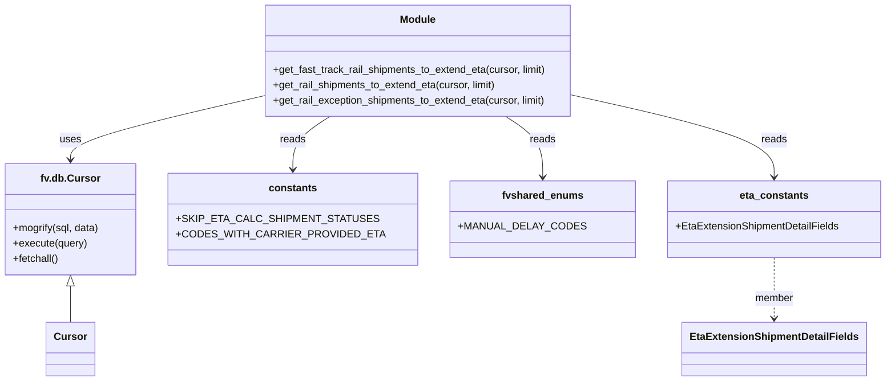

# Diagram: shipment_core/shipment_service/shipment_service/eta/db/shipment_rail_db_extension_queries.py


> Auto-generated by Obscura crawlers

## Diagram 1

```mermaid
flowchart TD
    A[get_fast_track_rail_shipments_to_extend_eta(cursor, limit)] -->|builds SQL| B[SELECT s.id, ss.stop_sequence, ss.eta, s.shipment_details]
    B --> C[FROM active_shipment s JOIN shipment_stops ss (max stop_sequence)]
    C --> D[WHERE s.mode_id = 2 AND ss.eta IS NOT NULL]
    D --> E[now() within tstzrange(ss.eta - 2h, ss.eta + 24h)]
    D --> F[s.active_status NOT IN skip_eta_for_statuses]
    D --> G[EXISTS recent shipment_statuses meeting filters]
    D --> H[NOT EXISTS unresolved shipment_exceptions type (38,39)]
    A --> I[mogrify sql with data & execute; return cursor.fetchall()]
```

> SVG rendering failed for this diagram.

## Diagram 2

```mermaid
flowchart TD
    J[get_rail_shipments_to_extend_eta(cursor, limit)] -->|builds SQL| K[SELECT s.id, ss.stop_sequence, ss.eta, s.shipment_details]
    K --> L[FROM active_shipment s JOIN shipment_stops ss (max stop_sequence)]
    L --> M[WHERE s.mode_id = 2 AND ss.eta IS NOT NULL]
    M --> N[s.active_status NOT IN skip_eta_for_statuses]
    M --> O[shipment_details DAILY field null OR older than now_utc() - 24h]
    M --> P[NOT EXISTS recent shipment_statuses meeting filters]
    M --> Q[NOT EXISTS unresolved shipment_exceptions type (38,39)]
    J --> R[mogrify sql with data & execute; return cursor.fetchall()]
```

> SVG rendering failed for this diagram.

## Diagram 3

```mermaid
flowchart TD
    S[get_rail_exception_shipments_to_extend_eta(cursor, limit)] -->|builds SQL| T[SELECT s.id, se.shipment_exception_type_id, ss.stop_sequence, ss.eta, s.shipment_details]
    T --> U[FROM active_shipment s JOIN shipment_exceptions se JOIN shipment_stops ss (max stop_sequence)]
    U --> V[WHERE s.mode_id = 2 AND ss.eta IS NOT NULL]
    V --> W[s.active_status NOT IN skip_eta_for_statuses]
    V --> X[se.resolved_at IS NULL AND se.shipment_exception_type_id IN (38,39)]
    V --> Y[shipment_details EXCEPTION field null OR older than 1 day]
    S --> Z[mogrify sql with data & execute; return cursor.fetchall()]
```

> SVG rendering failed for this diagram.

## Diagram 4



### SVG

<svg id="container" width="1300.1171875" xmlns="http://www.w3.org/2000/svg" class="classDiagram" height="596" viewBox="0 0 1300.1171875 596" role="graphics-document document" aria-roledescription="class"><style>#container{font-family:"trebuchet ms",verdana,arial,sans-serif;font-size:16px;fill:#333;}@keyframes edge-animation-frame{from{stroke-dashoffset:0;}}@keyframes dash{to{stroke-dashoffset:0;}}#container .edge-animation-slow{stroke-dasharray:9,5!important;stroke-dashoffset:900;animation:dash 50s linear infinite;stroke-linecap:round;}#container .edge-animation-fast{stroke-dasharray:9,5!important;stroke-dashoffset:900;animation:dash 20s linear infinite;stroke-linecap:round;}#container .error-icon{fill:#552222;}#container .error-text{fill:#552222;stroke:#552222;}#container .edge-thickness-normal{stroke-width:1px;}#container .edge-thickness-thick{stroke-width:3.5px;}#container .edge-pattern-solid{stroke-dasharray:0;}#container .edge-thickness-invisible{stroke-width:0;fill:none;}#container .edge-pattern-dashed{stroke-dasharray:3;}#container .edge-pattern-dotted{stroke-dasharray:2;}#container .marker{fill:#333333;stroke:#333333;}#container .marker.cross{stroke:#333333;}#container svg{font-family:"trebuchet ms",verdana,arial,sans-serif;font-size:16px;}#container p{margin:0;}#container g.classGroup text{fill:#9370DB;stroke:none;font-family:"trebuchet ms",verdana,arial,sans-serif;font-size:10px;}#container g.classGroup text .title{font-weight:bolder;}#container .nodeLabel,#container .edgeLabel{color:#131300;}#container .edgeLabel .label rect{fill:#ECECFF;}#container .label text{fill:#131300;}#container .labelBkg{background:#ECECFF;}#container .edgeLabel .label span{background:#ECECFF;}#container .classTitle{font-weight:bolder;}#container .node rect,#container .node circle,#container .node ellipse,#container .node polygon,#container .node path{fill:#ECECFF;stroke:#9370DB;stroke-width:1px;}#container .divider{stroke:#9370DB;stroke-width:1;}#container g.clickable{cursor:pointer;}#container g.classGroup rect{fill:#ECECFF;stroke:#9370DB;}#container g.classGroup line{stroke:#9370DB;stroke-width:1;}#container .classLabel .box{stroke:none;stroke-width:0;fill:#ECECFF;opacity:0.5;}#container .classLabel .label{fill:#9370DB;font-size:10px;}#container .relation{stroke:#333333;stroke-width:1;fill:none;}#container .dashed-line{stroke-dasharray:3;}#container .dotted-line{stroke-dasharray:1 2;}#container #compositionStart,#container .composition{fill:#333333!important;stroke:#333333!important;stroke-width:1;}#container #compositionEnd,#container .composition{fill:#333333!important;stroke:#333333!important;stroke-width:1;}#container #dependencyStart,#container .dependency{fill:#333333!important;stroke:#333333!important;stroke-width:1;}#container #dependencyStart,#container .dependency{fill:#333333!important;stroke:#333333!important;stroke-width:1;}#container #extensionStart,#container .extension{fill:transparent!important;stroke:#333333!important;stroke-width:1;}#container #extensionEnd,#container .extension{fill:transparent!important;stroke:#333333!important;stroke-width:1;}#container #aggregationStart,#container .aggregation{fill:transparent!important;stroke:#333333!important;stroke-width:1;}#container #aggregationEnd,#container .aggregation{fill:transparent!important;stroke:#333333!important;stroke-width:1;}#container #lollipopStart,#container .lollipop{fill:#ECECFF!important;stroke:#333333!important;stroke-width:1;}#container #lollipopEnd,#container .lollipop{fill:#ECECFF!important;stroke:#333333!important;stroke-width:1;}#container .edgeTerminals{font-size:11px;line-height:initial;}#container .classTitleText{text-anchor:middle;font-size:18px;fill:#333;}#container .label-icon{display:inline-block;height:1em;overflow:visible;vertical-align:-0.125em;}#container .node .label-icon path{fill:currentColor;stroke:revert;stroke-width:revert;}#container :root{--mermaid-font-family:"trebuchet ms",verdana,arial,sans-serif;}</style><g><defs><marker id="container_class-aggregationStart" class="marker aggregation class" refX="18" refY="7" markerWidth="190" markerHeight="240" orient="auto"><path d="M 18,7 L9,13 L1,7 L9,1 Z"></path></marker></defs><defs><marker id="container_class-aggregationEnd" class="marker aggregation class" refX="1" refY="7" markerWidth="20" markerHeight="28" orient="auto"><path d="M 18,7 L9,13 L1,7 L9,1 Z"></path></marker></defs><defs><marker id="container_class-extensionStart" class="marker extension class" refX="18" refY="7" markerWidth="190" markerHeight="240" orient="auto"><path d="M 1,7 L18,13 V 1 Z"></path></marker></defs><defs><marker id="container_class-extensionEnd" class="marker extension class" refX="1" refY="7" markerWidth="20" markerHeight="28" orient="auto"><path d="M 1,1 V 13 L18,7 Z"></path></marker></defs><defs><marker id="container_class-compositionStart" class="marker composition class" refX="18" refY="7" markerWidth="190" markerHeight="240" orient="auto"><path d="M 18,7 L9,13 L1,7 L9,1 Z"></path></marker></defs><defs><marker id="container_class-compositionEnd" class="marker composition class" refX="1" refY="7" markerWidth="20" markerHeight="28" orient="auto"><path d="M 18,7 L9,13 L1,7 L9,1 Z"></path></marker></defs><defs><marker id="container_class-dependencyStart" class="marker dependency class" refX="6" refY="7" markerWidth="190" markerHeight="240" orient="auto"><path d="M 5,7 L9,13 L1,7 L9,1 Z"></path></marker></defs><defs><marker id="container_class-dependencyEnd" class="marker dependency class" refX="13" refY="7" markerWidth="20" markerHeight="28" orient="auto"><path d="M 18,7 L9,13 L14,7 L9,1 Z"></path></marker></defs><defs><marker id="container_class-lollipopStart" class="marker lollipop class" refX="13" refY="7" markerWidth="190" markerHeight="240" orient="auto"><circle stroke="black" fill="transparent" cx="7" cy="7" r="6"></circle></marker></defs><defs><marker id="container_class-lollipopEnd" class="marker lollipop class" refX="1" refY="7" markerWidth="190" markerHeight="240" orient="auto"><circle stroke="black" fill="transparent" cx="7" cy="7" r="6"></circle></marker></defs><g class="root"><g class="clusters"></g><g class="edgePaths"><path d="M365.223,155.303L322.669,165.919C280.116,176.536,195.009,197.768,152.456,213.551C109.902,229.333,109.902,239.667,109.902,244.833L109.902,250" id="id_Module_fv.db.Cursor_1" class="edge-thickness-normal edge-pattern-solid relation" style=";;;" data-edge="true" data-et="edge" data-id="id_Module_fv.db.Cursor_1" data-points="W3sieCI6MzY1LjIyMjY1NjI1LCJ5IjoxNTUuMzAzMzU4OTUzODA0NTV9LHsieCI6MTA5LjkwMjM0Mzc1LCJ5IjoyMTl9LHsieCI6MTA5LjkwMjM0Mzc1LCJ5IjoyNTZ9XQ==" marker-end="url(#container_class-dependencyEnd)"></path><path d="M484.346,182L475.656,188.167C466.966,194.333,449.587,206.667,440.897,220.5C432.207,234.333,432.207,249.667,432.207,257.333L432.207,265" id="id_Module_constants_2" class="edge-thickness-normal edge-pattern-solid relation" style=";;;" data-edge="true" data-et="edge" data-id="id_Module_constants_2" data-points="W3sieCI6NDg0LjM0NTUxNDExMjkwMzIzLCJ5IjoxODJ9LHsieCI6NDMyLjIwNzAzMTI1LCJ5IjoyMTl9LHsieCI6NDMyLjIwNzAzMTI1LCJ5IjoyNzF9XQ==" marker-end="url(#container_class-dependencyEnd)"></path><path d="M729.537,182L738.227,188.167C746.917,194.333,764.296,206.667,772.986,222.5C781.676,238.333,781.676,257.667,781.676,267.333L781.676,277" id="id_Module_fvshared_enums_3" class="edge-thickness-normal edge-pattern-solid relation" style=";;;" data-edge="true" data-et="edge" data-id="id_Module_fvshared_enums_3" data-points="W3sieCI6NzI5LjUzNzI5ODM4NzA5NjgsInkiOjE4Mn0seyJ4Ijo3ODEuNjc1NzgxMjUsInkiOjIxOX0seyJ4Ijo3ODEuNjc1NzgxMjUsInkiOjI4M31d" marker-end="url(#container_class-dependencyEnd)"></path><path d="M848.66,152.697L894.955,163.748C941.25,174.798,1033.84,196.899,1080.135,217.616C1126.43,238.333,1126.43,257.667,1126.43,267.333L1126.43,277" id="id_Module_eta_constants_4" class="edge-thickness-normal edge-pattern-solid relation" style=";;;" data-edge="true" data-et="edge" data-id="id_Module_eta_constants_4" data-points="W3sieCI6ODQ4LjY2MDE1NjI1LCJ5IjoxNTIuNjk3NDAzNTQ0NjU0MDd9LHsieCI6MTEyNi40Mjk2ODc1LCJ5IjoyMTl9LHsieCI6MTEyNi40Mjk2ODc1LCJ5IjoyODN9XQ==" marker-end="url(#container_class-dependencyEnd)"></path><path d="M109.902,447.25L109.902,450.542C109.902,453.833,109.902,460.417,109.902,469.875C109.902,479.333,109.902,491.667,109.902,497.833L109.902,504" id="id_fv.db.Cursor_Cursor_5" class="edge-thickness-normal edge-pattern-solid relation" style=";;;" data-edge="true" data-et="edge" data-id="id_fv.db.Cursor_Cursor_5" data-points="W3sieCI6MTA5LjkwMjM0Mzc1LCJ5Ijo0MzB9LHsieCI6MTA5LjkwMjM0Mzc1LCJ5Ijo0Njd9LHsieCI6MTA5LjkwMjM0Mzc1LCJ5Ijo1MDR9XQ==" marker-start="url(#container_class-extensionStart)"></path><path d="M1126.43,403L1126.43,413.667C1126.43,424.333,1126.43,445.667,1126.43,461.5C1126.43,477.333,1126.43,487.667,1126.43,492.833L1126.43,498" id="id_eta_constants_EtaExtensionShipmentDetailFields_6" class="edge-thickness-normal edge-pattern-dashed relation" style=";;;" data-edge="true" data-et="edge" data-id="id_eta_constants_EtaExtensionShipmentDetailFields_6" data-points="W3sieCI6MTEyNi40Mjk2ODc1LCJ5Ijo0MDN9LHsieCI6MTEyNi40Mjk2ODc1LCJ5Ijo0Njd9LHsieCI6MTEyNi40Mjk2ODc1LCJ5Ijo1MDR9XQ==" marker-end="url(#container_class-dependencyEnd)"></path></g><g class="edgeLabels"><g class="edgeLabel" transform="translate(109.90234375, 219)"><g class="label" data-id="id_Module_fv.db.Cursor_1" transform="translate(-16.4921875, -12)"><foreignObject width="32.984375" height="24"><div xmlns="http://www.w3.org/1999/xhtml" class="labelBkg" style="display: table-cell; white-space: nowrap; line-height: 1.5; max-width: 200px; text-align: center;"><span class="edgeLabel"><p>uses</p></span></div></foreignObject></g></g><g class="edgeLabel" transform="translate(432.20703125, 219)"><g class="label" data-id="id_Module_constants_2" transform="translate(-20.0078125, -12)"><foreignObject width="40.015625" height="24"><div xmlns="http://www.w3.org/1999/xhtml" class="labelBkg" style="display: table-cell; white-space: nowrap; line-height: 1.5; max-width: 200px; text-align: center;"><span class="edgeLabel"><p>reads</p></span></div></foreignObject></g></g><g class="edgeLabel" transform="translate(781.67578125, 219)"><g class="label" data-id="id_Module_fvshared_enums_3" transform="translate(-20.0078125, -12)"><foreignObject width="40.015625" height="24"><div xmlns="http://www.w3.org/1999/xhtml" class="labelBkg" style="display: table-cell; white-space: nowrap; line-height: 1.5; max-width: 200px; text-align: center;"><span class="edgeLabel"><p>reads</p></span></div></foreignObject></g></g><g class="edgeLabel" transform="translate(1126.4296875, 219)"><g class="label" data-id="id_Module_eta_constants_4" transform="translate(-20.0078125, -12)"><foreignObject width="40.015625" height="24"><div xmlns="http://www.w3.org/1999/xhtml" class="labelBkg" style="display: table-cell; white-space: nowrap; line-height: 1.5; max-width: 200px; text-align: center;"><span class="edgeLabel"><p>reads</p></span></div></foreignObject></g></g><g class="edgeLabel"><g class="label" data-id="id_fv.db.Cursor_Cursor_5" transform="translate(0, 0)"><foreignObject width="0" height="0"><div xmlns="http://www.w3.org/1999/xhtml" class="labelBkg" style="display: table-cell; white-space: nowrap; line-height: 1.5; max-width: 200px; text-align: center;"><span class="edgeLabel"></span></div></foreignObject></g></g><g class="edgeLabel" transform="translate(1126.4296875, 467)"><g class="label" data-id="id_eta_constants_EtaExtensionShipmentDetailFields_6" transform="translate(-30.2734375, -12)"><foreignObject width="60.546875" height="24"><div xmlns="http://www.w3.org/1999/xhtml" class="labelBkg" style="display: table-cell; white-space: nowrap; line-height: 1.5; max-width: 200px; text-align: center;"><span class="edgeLabel"><p>member</p></span></div></foreignObject></g></g></g><g class="nodes"><g class="node default" id="classId-Module-0" transform="translate(606.94140625, 95)"><g class="basic label-container"><path d="M-241.71875 -87 L241.71875 -87 L241.71875 87 L-241.71875 87" stroke="none" stroke-width="0" fill="#ECECFF" style=""></path><path d="M-241.71875 -87 C-112.31670074933297 -87, 17.085348501334067 -87, 241.71875 -87 M-241.71875 -87 C-103.40912854037606 -87, 34.90049291924788 -87, 241.71875 -87 M241.71875 -87 C241.71875 -18.314297788061978, 241.71875 50.371404423876044, 241.71875 87 M241.71875 -87 C241.71875 -40.30858859315431, 241.71875 6.3828228136913765, 241.71875 87 M241.71875 87 C53.01454965444478 87, -135.68965069111044 87, -241.71875 87 M241.71875 87 C143.8447982188864 87, 45.97084643777285 87, -241.71875 87 M-241.71875 87 C-241.71875 40.63493496014853, -241.71875 -5.7301300797029455, -241.71875 -87 M-241.71875 87 C-241.71875 37.654258001117284, -241.71875 -11.691483997765431, -241.71875 -87" stroke="#9370DB" stroke-width="1.3" fill="none" stroke-dasharray="0 0" style=""></path></g><g class="annotation-group text" transform="translate(0, -63)"></g><g class="label-group text" transform="translate(-27.09375, -63)"><g class="label" style="font-weight: bolder" transform="translate(0,-12)"><foreignObject width="54.1875" height="24"><div xmlns="http://www.w3.org/1999/xhtml" style="display: table-cell; white-space: nowrap; line-height: 1.5; max-width: 104px; text-align: center;"><span class="nodeLabel markdown-node-label" style=""><p>Module</p></span></div></foreignObject></g></g><g class="members-group text" transform="translate(-229.71875, -15)"></g><g class="methods-group text" transform="translate(-229.71875, 15)"><g class="label" style="" transform="translate(0,-12)"><foreignObject width="432.328125" height="24"><div xmlns="http://www.w3.org/1999/xhtml" style="display: table-cell; white-space: nowrap; line-height: 1.5; max-width: 490px; text-align: center;"><span class="nodeLabel markdown-node-label" style=""><p>+get_fast_track_rail_shipments_to_extend_eta(cursor, limit)</p></span></div></foreignObject></g><g class="label" style="" transform="translate(0,12)"><foreignObject width="353.59375" height="24"><div xmlns="http://www.w3.org/1999/xhtml" style="display: table-cell; white-space: nowrap; line-height: 1.5; max-width: 411px; text-align: center;"><span class="nodeLabel markdown-node-label" style=""><p>+get_rail_shipments_to_extend_eta(cursor, limit)</p></span></div></foreignObject></g><g class="label" style="" transform="translate(0,36)"><foreignObject width="432.34375" height="24"><div xmlns="http://www.w3.org/1999/xhtml" style="display: table-cell; white-space: nowrap; line-height: 1.5; max-width: 490px; text-align: center;"><span class="nodeLabel markdown-node-label" style=""><p>+get_rail_exception_shipments_to_extend_eta(cursor, limit)</p></span></div></foreignObject></g></g><g class="divider" style=""><path d="M-241.71875 -39 C-106.72619536280163 -39, 28.266359274396734 -39, 241.71875 -39 M-241.71875 -39 C-107.77368975508898 -39, 26.17137048982204 -39, 241.71875 -39" stroke="#9370DB" stroke-width="1.3" fill="none" stroke-dasharray="0 0" style=""></path></g><g class="divider" style=""><path d="M-241.71875 -15 C-82.8133410033507 -15, 76.0920679932986 -15, 241.71875 -15 M-241.71875 -15 C-144.66129438690842 -15, -47.60383877381685 -15, 241.71875 -15" stroke="#9370DB" stroke-width="1.3" fill="none" stroke-dasharray="0 0" style=""></path></g></g><g class="node default" id="classId-fv.db.Cursor-1" transform="translate(109.90234375, 343)"><g class="basic label-container"><path d="M-101.90234375 -87 L101.90234375 -87 L101.90234375 87 L-101.90234375 87" stroke="none" stroke-width="0" fill="#ECECFF" style=""></path><path d="M-101.90234375 -87 C-22.776567180925326 -87, 56.34920938814935 -87, 101.90234375 -87 M-101.90234375 -87 C-22.91125455747951 -87, 56.07983463504098 -87, 101.90234375 -87 M101.90234375 -87 C101.90234375 -38.822548226302956, 101.90234375 9.354903547394088, 101.90234375 87 M101.90234375 -87 C101.90234375 -20.18836604290614, 101.90234375 46.62326791418772, 101.90234375 87 M101.90234375 87 C57.716189372026484 87, 13.530034994052969 87, -101.90234375 87 M101.90234375 87 C39.12870949045986 87, -23.644924769080276 87, -101.90234375 87 M-101.90234375 87 C-101.90234375 42.46792013981498, -101.90234375 -2.064159720370043, -101.90234375 -87 M-101.90234375 87 C-101.90234375 51.151782637457984, -101.90234375 15.303565274915968, -101.90234375 -87" stroke="#9370DB" stroke-width="1.3" fill="none" stroke-dasharray="0 0" style=""></path></g><g class="annotation-group text" transform="translate(0, -63)"></g><g class="label-group text" transform="translate(-43.6328125, -63)"><g class="label" style="font-weight: bolder" transform="translate(0,-12)"><foreignObject width="87.265625" height="24"><div xmlns="http://www.w3.org/1999/xhtml" style="display: table-cell; white-space: nowrap; line-height: 1.5; max-width: 136px; text-align: center;"><span class="nodeLabel markdown-node-label" style=""><p>fv.db.Cursor</p></span></div></foreignObject></g></g><g class="members-group text" transform="translate(-89.90234375, -15)"></g><g class="methods-group text" transform="translate(-89.90234375, 15)"><g class="label" style="" transform="translate(0,-12)"><foreignObject width="136.171875" height="24"><div xmlns="http://www.w3.org/1999/xhtml" style="display: table-cell; white-space: nowrap; line-height: 1.5; max-width: 194px; text-align: center;"><span class="nodeLabel markdown-node-label" style=""><p>+mogrify(sql, data)</p></span></div></foreignObject></g><g class="label" style="" transform="translate(0,12)"><foreignObject width="115.96875" height="24"><div xmlns="http://www.w3.org/1999/xhtml" style="display: table-cell; white-space: nowrap; line-height: 1.5; max-width: 173px; text-align: center;"><span class="nodeLabel markdown-node-label" style=""><p>+execute(query)</p></span></div></foreignObject></g><g class="label" style="" transform="translate(0,36)"><foreignObject width="72.515625" height="24"><div xmlns="http://www.w3.org/1999/xhtml" style="display: table-cell; white-space: nowrap; line-height: 1.5; max-width: 130px; text-align: center;"><span class="nodeLabel markdown-node-label" style=""><p>+fetchall()</p></span></div></foreignObject></g></g><g class="divider" style=""><path d="M-101.90234375 -39 C-29.268833505644096 -39, 43.36467673871181 -39, 101.90234375 -39 M-101.90234375 -39 C-24.551144808720068 -39, 52.800054132559865 -39, 101.90234375 -39" stroke="#9370DB" stroke-width="1.3" fill="none" stroke-dasharray="0 0" style=""></path></g><g class="divider" style=""><path d="M-101.90234375 -15 C-48.08039950192001 -15, 5.741544746159974 -15, 101.90234375 -15 M-101.90234375 -15 C-26.067395740230822 -15, 49.767552269538356 -15, 101.90234375 -15" stroke="#9370DB" stroke-width="1.3" fill="none" stroke-dasharray="0 0" style=""></path></g></g><g class="node default" id="classId-constants-2" transform="translate(432.20703125, 343)"><g class="basic label-container"><path d="M-170.40234375 -72 L170.40234375 -72 L170.40234375 72 L-170.40234375 72" stroke="none" stroke-width="0" fill="#ECECFF" style=""></path><path d="M-170.40234375 -72 C-39.67077736513872 -72, 91.06078901972256 -72, 170.40234375 -72 M-170.40234375 -72 C-101.70346616760162 -72, -33.00458858520324 -72, 170.40234375 -72 M170.40234375 -72 C170.40234375 -14.855205675624745, 170.40234375 42.28958864875051, 170.40234375 72 M170.40234375 -72 C170.40234375 -22.569095442782775, 170.40234375 26.86180911443445, 170.40234375 72 M170.40234375 72 C92.99399743295736 72, 15.585651115914715 72, -170.40234375 72 M170.40234375 72 C93.27346129788158 72, 16.144578845763164 72, -170.40234375 72 M-170.40234375 72 C-170.40234375 18.686960059204154, -170.40234375 -34.62607988159169, -170.40234375 -72 M-170.40234375 72 C-170.40234375 15.813008770628997, -170.40234375 -40.373982458742006, -170.40234375 -72" stroke="#9370DB" stroke-width="1.3" fill="none" stroke-dasharray="0 0" style=""></path></g><g class="annotation-group text" transform="translate(0, -48)"></g><g class="label-group text" transform="translate(-35.7734375, -48)"><g class="label" style="font-weight: bolder" transform="translate(0,-12)"><foreignObject width="71.546875" height="24"><div xmlns="http://www.w3.org/1999/xhtml" style="display: table-cell; white-space: nowrap; line-height: 1.5; max-width: 121px; text-align: center;"><span class="nodeLabel markdown-node-label" style=""><p>constants</p></span></div></foreignObject></g></g><g class="members-group text" transform="translate(-158.40234375, 0)"><g class="label" style="" transform="translate(0,-12)"><foreignObject width="270.796875" height="24"><div xmlns="http://www.w3.org/1999/xhtml" style="display: table-cell; white-space: nowrap; line-height: 1.5; max-width: 328px; text-align: center;"><span class="nodeLabel markdown-node-label" style=""><p>+SKIP_ETA_CALC_SHIPMENT_STATUSES</p></span></div></foreignObject></g><g class="label" style="" transform="translate(0,12)"><foreignObject width="281.03125" height="24"><div xmlns="http://www.w3.org/1999/xhtml" style="display: table-cell; white-space: nowrap; line-height: 1.5; max-width: 339px; text-align: center;"><span class="nodeLabel markdown-node-label" style=""><p>+CODES_WITH_CARRIER_PROVIDED_ETA</p></span></div></foreignObject></g></g><g class="methods-group text" transform="translate(-158.40234375, 72)"></g><g class="divider" style=""><path d="M-170.40234375 -24 C-34.12524707204557 -24, 102.15184960590886 -24, 170.40234375 -24 M-170.40234375 -24 C-73.28141601933133 -24, 23.839511711337337 -24, 170.40234375 -24" stroke="#9370DB" stroke-width="1.3" fill="none" stroke-dasharray="0 0" style=""></path></g><g class="divider" style=""><path d="M-170.40234375 48 C-65.55396512168356 48, 39.29441350663288 48, 170.40234375 48 M-170.40234375 48 C-72.74098212446957 48, 24.920379501060864 48, 170.40234375 48" stroke="#9370DB" stroke-width="1.3" fill="none" stroke-dasharray="0 0" style=""></path></g></g><g class="node default" id="classId-fvshared_enums-3" transform="translate(781.67578125, 343)"><g class="basic label-container"><path d="M-129.06640625 -60 L129.06640625 -60 L129.06640625 60 L-129.06640625 60" stroke="none" stroke-width="0" fill="#ECECFF" style=""></path><path d="M-129.06640625 -60 C-39.791445336355565 -60, 49.48351557728887 -60, 129.06640625 -60 M-129.06640625 -60 C-35.52870060008466 -60, 58.00900504983068 -60, 129.06640625 -60 M129.06640625 -60 C129.06640625 -33.295332549672025, 129.06640625 -6.590665099344044, 129.06640625 60 M129.06640625 -60 C129.06640625 -16.567292086495534, 129.06640625 26.86541582700893, 129.06640625 60 M129.06640625 60 C46.264312343850904 60, -36.53778156229819 60, -129.06640625 60 M129.06640625 60 C36.60456839734428 60, -55.85726945531144 60, -129.06640625 60 M-129.06640625 60 C-129.06640625 34.951951993971576, -129.06640625 9.90390398794316, -129.06640625 -60 M-129.06640625 60 C-129.06640625 35.48688482495954, -129.06640625 10.973769649919078, -129.06640625 -60" stroke="#9370DB" stroke-width="1.3" fill="none" stroke-dasharray="0 0" style=""></path></g><g class="annotation-group text" transform="translate(0, -36)"></g><g class="label-group text" transform="translate(-60.1640625, -36)"><g class="label" style="font-weight: bolder" transform="translate(0,-12)"><foreignObject width="120.328125" height="24"><div xmlns="http://www.w3.org/1999/xhtml" style="display: table-cell; white-space: nowrap; line-height: 1.5; max-width: 169px; text-align: center;"><span class="nodeLabel markdown-node-label" style=""><p>fvshared_enums</p></span></div></foreignObject></g></g><g class="members-group text" transform="translate(-117.06640625, 12)"><g class="label" style="" transform="translate(0,-12)"><foreignObject width="173.96875" height="24"><div xmlns="http://www.w3.org/1999/xhtml" style="display: table-cell; white-space: nowrap; line-height: 1.5; max-width: 232px; text-align: center;"><span class="nodeLabel markdown-node-label" style=""><p>+MANUAL_DELAY_CODES</p></span></div></foreignObject></g></g><g class="methods-group text" transform="translate(-117.06640625, 60)"></g><g class="divider" style=""><path d="M-129.06640625 -12 C-56.67692244661927 -12, 15.712561356761455 -12, 129.06640625 -12 M-129.06640625 -12 C-38.440365726571954 -12, 52.18567479685609 -12, 129.06640625 -12" stroke="#9370DB" stroke-width="1.3" fill="none" stroke-dasharray="0 0" style=""></path></g><g class="divider" style=""><path d="M-129.06640625 36 C-64.87474119640576 36, -0.6830761428115295 36, 129.06640625 36 M-129.06640625 36 C-65.75704406846395 36, -2.447681886927924 36, 129.06640625 36" stroke="#9370DB" stroke-width="1.3" fill="none" stroke-dasharray="0 0" style=""></path></g></g><g class="node default" id="classId-eta_constants-4" transform="translate(1126.4296875, 343)"><g class="basic label-container"><path d="M-165.6875 -60 L165.6875 -60 L165.6875 60 L-165.6875 60" stroke="none" stroke-width="0" fill="#ECECFF" style=""></path><path d="M-165.6875 -60 C-45.114134501051126 -60, 75.45923099789775 -60, 165.6875 -60 M-165.6875 -60 C-65.54303724297901 -60, 34.60142551404198 -60, 165.6875 -60 M165.6875 -60 C165.6875 -16.512668529563108, 165.6875 26.974662940873785, 165.6875 60 M165.6875 -60 C165.6875 -15.343562079803668, 165.6875 29.312875840392664, 165.6875 60 M165.6875 60 C54.656302018016206 60, -56.37489596396759 60, -165.6875 60 M165.6875 60 C76.05229847777633 60, -13.582903044447335 60, -165.6875 60 M-165.6875 60 C-165.6875 20.78621899460667, -165.6875 -18.42756201078666, -165.6875 -60 M-165.6875 60 C-165.6875 17.50060131905437, -165.6875 -24.998797361891263, -165.6875 -60" stroke="#9370DB" stroke-width="1.3" fill="none" stroke-dasharray="0 0" style=""></path></g><g class="annotation-group text" transform="translate(0, -36)"></g><g class="label-group text" transform="translate(-51.5625, -36)"><g class="label" style="font-weight: bolder" transform="translate(0,-12)"><foreignObject width="103.125" height="24"><div xmlns="http://www.w3.org/1999/xhtml" style="display: table-cell; white-space: nowrap; line-height: 1.5; max-width: 152px; text-align: center;"><span class="nodeLabel markdown-node-label" style=""><p>eta_constants</p></span></div></foreignObject></g></g><g class="members-group text" transform="translate(-153.6875, 12)"><g class="label" style="" transform="translate(0,-12)"><foreignObject width="255.8125" height="24"><div xmlns="http://www.w3.org/1999/xhtml" style="display: table-cell; white-space: nowrap; line-height: 1.5; max-width: 313px; text-align: center;"><span class="nodeLabel markdown-node-label" style=""><p>+EtaExtensionShipmentDetailFields</p></span></div></foreignObject></g></g><g class="methods-group text" transform="translate(-153.6875, 60)"></g><g class="divider" style=""><path d="M-165.6875 -12 C-48.29413822560372 -12, 69.09922354879257 -12, 165.6875 -12 M-165.6875 -12 C-77.03038273159756 -12, 11.62673453680489 -12, 165.6875 -12" stroke="#9370DB" stroke-width="1.3" fill="none" stroke-dasharray="0 0" style=""></path></g><g class="divider" style=""><path d="M-165.6875 36 C-67.44926879375207 36, 30.788962412495863 36, 165.6875 36 M-165.6875 36 C-45.803477243691106 36, 74.08054551261779 36, 165.6875 36" stroke="#9370DB" stroke-width="1.3" fill="none" stroke-dasharray="0 0" style=""></path></g></g><g class="node default" id="classId-Cursor-5" transform="translate(109.90234375, 546)"><g class="basic label-container"><path d="M-35.90625 -42 L35.90625 -42 L35.90625 42 L-35.90625 42" stroke="none" stroke-width="0" fill="#ECECFF" style=""></path><path d="M-35.90625 -42 C-10.325545033549393 -42, 15.255159932901215 -42, 35.90625 -42 M-35.90625 -42 C-13.226218362325174 -42, 9.453813275349653 -42, 35.90625 -42 M35.90625 -42 C35.90625 -24.083789264216357, 35.90625 -6.167578528432713, 35.90625 42 M35.90625 -42 C35.90625 -12.635812758458474, 35.90625 16.72837448308305, 35.90625 42 M35.90625 42 C17.933851755519665 42, -0.03854648896066948 42, -35.90625 42 M35.90625 42 C21.233476528971487 42, 6.560703057942977 42, -35.90625 42 M-35.90625 42 C-35.90625 24.334899327093026, -35.90625 6.669798654186053, -35.90625 -42 M-35.90625 42 C-35.90625 11.261728867802866, -35.90625 -19.47654226439427, -35.90625 -42" stroke="#9370DB" stroke-width="1.3" fill="none" stroke-dasharray="0 0" style=""></path></g><g class="annotation-group text" transform="translate(0, -18)"></g><g class="label-group text" transform="translate(-23.90625, -18)"><g class="label" style="font-weight: bolder" transform="translate(0,-12)"><foreignObject width="47.8125" height="24"><div xmlns="http://www.w3.org/1999/xhtml" style="display: table-cell; white-space: nowrap; line-height: 1.5; max-width: 98px; text-align: center;"><span class="nodeLabel markdown-node-label" style=""><p>Cursor</p></span></div></foreignObject></g></g><g class="members-group text" transform="translate(-23.90625, 30)"></g><g class="methods-group text" transform="translate(-23.90625, 60)"></g><g class="divider" style=""><path d="M-35.90625 6 C-18.203917291530512 6, -0.5015845830610246 6, 35.90625 6 M-35.90625 6 C-9.372732706946707 6, 17.160784586106587 6, 35.90625 6" stroke="#9370DB" stroke-width="1.3" fill="none" stroke-dasharray="0 0" style=""></path></g><g class="divider" style=""><path d="M-35.90625 24 C-11.838972099003392 24, 12.228305801993216 24, 35.90625 24 M-35.90625 24 C-16.4254438916059 24, 3.055362216788197 24, 35.90625 24" stroke="#9370DB" stroke-width="1.3" fill="none" stroke-dasharray="0 0" style=""></path></g></g><g class="node default" id="classId-EtaExtensionShipmentDetailFields-6" transform="translate(1126.4296875, 546)"><g class="basic label-container"><path d="M-137.203125 -42 L137.203125 -42 L137.203125 42 L-137.203125 42" stroke="none" stroke-width="0" fill="#ECECFF" style=""></path><path d="M-137.203125 -42 C-67.05990269517855 -42, 3.083319609642899 -42, 137.203125 -42 M-137.203125 -42 C-74.77407063328005 -42, -12.345016266560094 -42, 137.203125 -42 M137.203125 -42 C137.203125 -9.225474064762153, 137.203125 23.549051870475694, 137.203125 42 M137.203125 -42 C137.203125 -11.668194323404343, 137.203125 18.663611353191314, 137.203125 42 M137.203125 42 C35.026570780211856 42, -67.14998343957629 42, -137.203125 42 M137.203125 42 C38.00369778826453 42, -61.19572942347094 42, -137.203125 42 M-137.203125 42 C-137.203125 11.223651283541564, -137.203125 -19.552697432916872, -137.203125 -42 M-137.203125 42 C-137.203125 21.33705880695767, -137.203125 0.6741176139153424, -137.203125 -42" stroke="#9370DB" stroke-width="1.3" fill="none" stroke-dasharray="0 0" style=""></path></g><g class="annotation-group text" transform="translate(0, -18)"></g><g class="label-group text" transform="translate(-125.203125, -18)"><g class="label" style="font-weight: bolder" transform="translate(0,-12)"><foreignObject width="250.40625" height="24"><div xmlns="http://www.w3.org/1999/xhtml" style="display: table-cell; white-space: nowrap; line-height: 1.5; max-width: 298px; text-align: center;"><span class="nodeLabel markdown-node-label" style=""><p>EtaExtensionShipmentDetailFields</p></span></div></foreignObject></g></g><g class="members-group text" transform="translate(-125.203125, 30)"></g><g class="methods-group text" transform="translate(-125.203125, 60)"></g><g class="divider" style=""><path d="M-137.203125 6 C-64.2215771028674 6, 8.7599707942652 6, 137.203125 6 M-137.203125 6 C-43.870392350459966 6, 49.46234029908007 6, 137.203125 6" stroke="#9370DB" stroke-width="1.3" fill="none" stroke-dasharray="0 0" style=""></path></g><g class="divider" style=""><path d="M-137.203125 24 C-69.84503185119155 24, -2.4869387023830996 24, 137.203125 24 M-137.203125 24 C-64.9029202824861 24, 7.397284435027814 24, 137.203125 24" stroke="#9370DB" stroke-width="1.3" fill="none" stroke-dasharray="0 0" style=""></path></g></g></g></g></g></svg>
