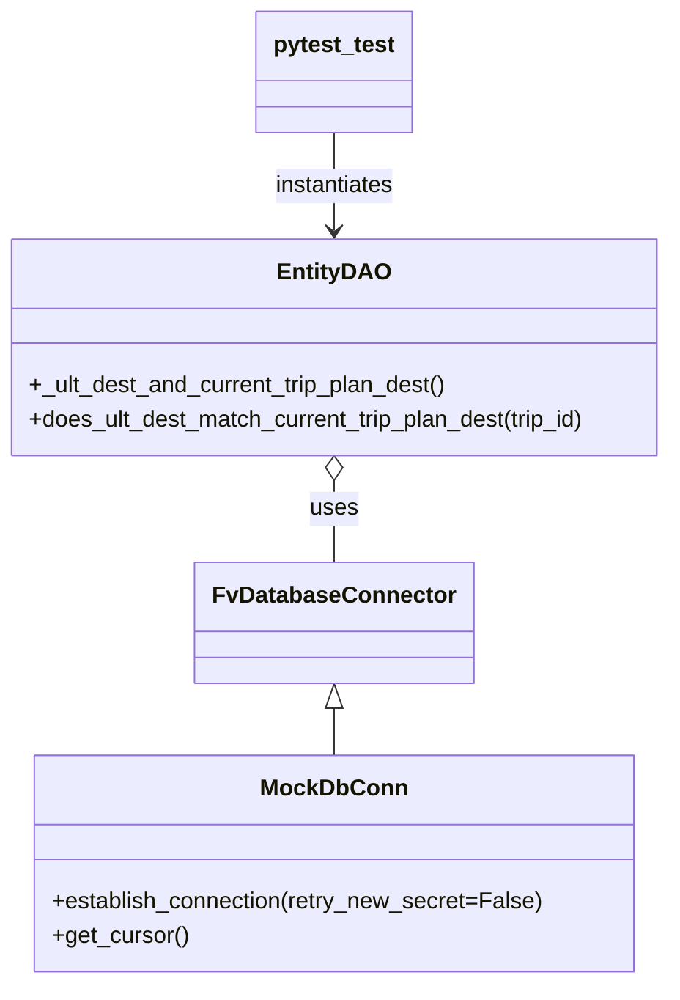

# Diagram: shipment_core/shipment_service/shipment_service/eta/db/tests/test_eta_db_queries.py


> Auto-generated by Obscura crawlers

## Diagram 1



### SVG

<svg id="container" width="472.625" xmlns="http://www.w3.org/2000/svg" class="classDiagram" height="682" viewBox="0 0 472.625 682" role="graphics-document document" aria-roledescription="class"><style>#container{font-family:"trebuchet ms",verdana,arial,sans-serif;font-size:16px;fill:#333;}@keyframes edge-animation-frame{from{stroke-dashoffset:0;}}@keyframes dash{to{stroke-dashoffset:0;}}#container .edge-animation-slow{stroke-dasharray:9,5!important;stroke-dashoffset:900;animation:dash 50s linear infinite;stroke-linecap:round;}#container .edge-animation-fast{stroke-dasharray:9,5!important;stroke-dashoffset:900;animation:dash 20s linear infinite;stroke-linecap:round;}#container .error-icon{fill:#552222;}#container .error-text{fill:#552222;stroke:#552222;}#container .edge-thickness-normal{stroke-width:1px;}#container .edge-thickness-thick{stroke-width:3.5px;}#container .edge-pattern-solid{stroke-dasharray:0;}#container .edge-thickness-invisible{stroke-width:0;fill:none;}#container .edge-pattern-dashed{stroke-dasharray:3;}#container .edge-pattern-dotted{stroke-dasharray:2;}#container .marker{fill:#333333;stroke:#333333;}#container .marker.cross{stroke:#333333;}#container svg{font-family:"trebuchet ms",verdana,arial,sans-serif;font-size:16px;}#container p{margin:0;}#container g.classGroup text{fill:#9370DB;stroke:none;font-family:"trebuchet ms",verdana,arial,sans-serif;font-size:10px;}#container g.classGroup text .title{font-weight:bolder;}#container .nodeLabel,#container .edgeLabel{color:#131300;}#container .edgeLabel .label rect{fill:#ECECFF;}#container .label text{fill:#131300;}#container .labelBkg{background:#ECECFF;}#container .edgeLabel .label span{background:#ECECFF;}#container .classTitle{font-weight:bolder;}#container .node rect,#container .node circle,#container .node ellipse,#container .node polygon,#container .node path{fill:#ECECFF;stroke:#9370DB;stroke-width:1px;}#container .divider{stroke:#9370DB;stroke-width:1;}#container g.clickable{cursor:pointer;}#container g.classGroup rect{fill:#ECECFF;stroke:#9370DB;}#container g.classGroup line{stroke:#9370DB;stroke-width:1;}#container .classLabel .box{stroke:none;stroke-width:0;fill:#ECECFF;opacity:0.5;}#container .classLabel .label{fill:#9370DB;font-size:10px;}#container .relation{stroke:#333333;stroke-width:1;fill:none;}#container .dashed-line{stroke-dasharray:3;}#container .dotted-line{stroke-dasharray:1 2;}#container #compositionStart,#container .composition{fill:#333333!important;stroke:#333333!important;stroke-width:1;}#container #compositionEnd,#container .composition{fill:#333333!important;stroke:#333333!important;stroke-width:1;}#container #dependencyStart,#container .dependency{fill:#333333!important;stroke:#333333!important;stroke-width:1;}#container #dependencyStart,#container .dependency{fill:#333333!important;stroke:#333333!important;stroke-width:1;}#container #extensionStart,#container .extension{fill:transparent!important;stroke:#333333!important;stroke-width:1;}#container #extensionEnd,#container .extension{fill:transparent!important;stroke:#333333!important;stroke-width:1;}#container #aggregationStart,#container .aggregation{fill:transparent!important;stroke:#333333!important;stroke-width:1;}#container #aggregationEnd,#container .aggregation{fill:transparent!important;stroke:#333333!important;stroke-width:1;}#container #lollipopStart,#container .lollipop{fill:#ECECFF!important;stroke:#333333!important;stroke-width:1;}#container #lollipopEnd,#container .lollipop{fill:#ECECFF!important;stroke:#333333!important;stroke-width:1;}#container .edgeTerminals{font-size:11px;line-height:initial;}#container .classTitleText{text-anchor:middle;font-size:18px;fill:#333;}#container .label-icon{display:inline-block;height:1em;overflow:visible;vertical-align:-0.125em;}#container .node .label-icon path{fill:currentColor;stroke:revert;stroke-width:revert;}#container :root{--mermaid-font-family:"trebuchet ms",verdana,arial,sans-serif;}</style><g><defs><marker id="container_class-aggregationStart" class="marker aggregation class" refX="18" refY="7" markerWidth="190" markerHeight="240" orient="auto"><path d="M 18,7 L9,13 L1,7 L9,1 Z"></path></marker></defs><defs><marker id="container_class-aggregationEnd" class="marker aggregation class" refX="1" refY="7" markerWidth="20" markerHeight="28" orient="auto"><path d="M 18,7 L9,13 L1,7 L9,1 Z"></path></marker></defs><defs><marker id="container_class-extensionStart" class="marker extension class" refX="18" refY="7" markerWidth="190" markerHeight="240" orient="auto"><path d="M 1,7 L18,13 V 1 Z"></path></marker></defs><defs><marker id="container_class-extensionEnd" class="marker extension class" refX="1" refY="7" markerWidth="20" markerHeight="28" orient="auto"><path d="M 1,1 V 13 L18,7 Z"></path></marker></defs><defs><marker id="container_class-compositionStart" class="marker composition class" refX="18" refY="7" markerWidth="190" markerHeight="240" orient="auto"><path d="M 18,7 L9,13 L1,7 L9,1 Z"></path></marker></defs><defs><marker id="container_class-compositionEnd" class="marker composition class" refX="1" refY="7" markerWidth="20" markerHeight="28" orient="auto"><path d="M 18,7 L9,13 L1,7 L9,1 Z"></path></marker></defs><defs><marker id="container_class-dependencyStart" class="marker dependency class" refX="6" refY="7" markerWidth="190" markerHeight="240" orient="auto"><path d="M 5,7 L9,13 L1,7 L9,1 Z"></path></marker></defs><defs><marker id="container_class-dependencyEnd" class="marker dependency class" refX="13" refY="7" markerWidth="20" markerHeight="28" orient="auto"><path d="M 18,7 L9,13 L14,7 L9,1 Z"></path></marker></defs><defs><marker id="container_class-lollipopStart" class="marker lollipop class" refX="13" refY="7" markerWidth="190" markerHeight="240" orient="auto"><circle stroke="black" fill="transparent" cx="7" cy="7" r="6"></circle></marker></defs><defs><marker id="container_class-lollipopEnd" class="marker lollipop class" refX="1" refY="7" markerWidth="190" markerHeight="240" orient="auto"><circle stroke="black" fill="transparent" cx="7" cy="7" r="6"></circle></marker></defs><g class="root"><g class="clusters"></g><g class="edgePaths"><path d="M236.313,491.25L236.313,492.542C236.313,493.833,236.313,496.417,236.313,501.875C236.313,507.333,236.313,515.667,236.313,519.833L236.313,524" id="id_FvDatabaseConnector_MockDbConn_1" class="edge-thickness-normal edge-pattern-solid relation" style=";;;" data-edge="true" data-et="edge" data-id="id_FvDatabaseConnector_MockDbConn_1" data-points="W3sieCI6MjM2LjMxMjUsInkiOjQ3NH0seyJ4IjoyMzYuMzEyNSwieSI6NDk5fSx7IngiOjIzNi4zMTI1LCJ5Ijo1MjR9XQ==" marker-start="url(#container_class-extensionStart)"></path><path d="M236.313,333.25L236.313,336.542C236.313,339.833,236.313,346.417,236.313,355.875C236.313,365.333,236.313,377.667,236.313,383.833L236.313,390" id="id_EntityDAO_FvDatabaseConnector_2" class="edge-thickness-normal edge-pattern-solid relation" style=";;;" data-edge="true" data-et="edge" data-id="id_EntityDAO_FvDatabaseConnector_2" data-points="W3sieCI6MjM2LjMxMjUsInkiOjMxNn0seyJ4IjoyMzYuMzEyNSwieSI6MzUzfSx7IngiOjIzNi4zMTI1LCJ5IjozOTB9XQ==" marker-start="url(#container_class-aggregationStart)"></path><path d="M236.313,92L236.313,98.167C236.313,104.333,236.313,116.667,236.313,128C236.313,139.333,236.313,149.667,236.313,154.833L236.313,160" id="id_pytest_test_EntityDAO_3" class="edge-thickness-normal edge-pattern-solid relation" style=";;;" data-edge="true" data-et="edge" data-id="id_pytest_test_EntityDAO_3" data-points="W3sieCI6MjM2LjMxMjUsInkiOjkyfSx7IngiOjIzNi4zMTI1LCJ5IjoxMjl9LHsieCI6MjM2LjMxMjUsInkiOjE2Nn1d" marker-end="url(#container_class-dependencyEnd)"></path></g><g class="edgeLabels"><g class="edgeLabel"><g class="label" data-id="id_FvDatabaseConnector_MockDbConn_1" transform="translate(0, 0)"><foreignObject width="0" height="0"><div xmlns="http://www.w3.org/1999/xhtml" class="labelBkg" style="display: table-cell; white-space: nowrap; line-height: 1.5; max-width: 200px; text-align: center;"><span class="edgeLabel"></span></div></foreignObject></g></g><g class="edgeLabel" transform="translate(236.3125, 353)"><g class="label" data-id="id_EntityDAO_FvDatabaseConnector_2" transform="translate(-16.4921875, -12)"><foreignObject width="32.984375" height="24"><div xmlns="http://www.w3.org/1999/xhtml" class="labelBkg" style="display: table-cell; white-space: nowrap; line-height: 1.5; max-width: 200px; text-align: center;"><span class="edgeLabel"><p>uses</p></span></div></foreignObject></g></g><g class="edgeLabel" transform="translate(236.3125, 129)"><g class="label" data-id="id_pytest_test_EntityDAO_3" transform="translate(-42.9140625, -12)"><foreignObject width="85.828125" height="24"><div xmlns="http://www.w3.org/1999/xhtml" class="labelBkg" style="display: table-cell; white-space: nowrap; line-height: 1.5; max-width: 200px; text-align: center;"><span class="edgeLabel"><p>instantiates</p></span></div></foreignObject></g></g></g><g class="nodes"><g class="node default" id="classId-FvDatabaseConnector-0" transform="translate(236.3125, 432)"><g class="basic label-container"><path d="M-91.3046875 -42 L91.3046875 -42 L91.3046875 42 L-91.3046875 42" stroke="none" stroke-width="0" fill="#ECECFF" style=""></path><path d="M-91.3046875 -42 C-30.66895999552071 -42, 29.966767508958583 -42, 91.3046875 -42 M-91.3046875 -42 C-23.406521724100656 -42, 44.49164405179869 -42, 91.3046875 -42 M91.3046875 -42 C91.3046875 -9.701508968099162, 91.3046875 22.596982063801676, 91.3046875 42 M91.3046875 -42 C91.3046875 -21.400066974842662, 91.3046875 -0.8001339496853248, 91.3046875 42 M91.3046875 42 C22.90072039075281 42, -45.50324671849438 42, -91.3046875 42 M91.3046875 42 C52.59330128191363 42, 13.881915063827265 42, -91.3046875 42 M-91.3046875 42 C-91.3046875 12.957251702160242, -91.3046875 -16.085496595679516, -91.3046875 -42 M-91.3046875 42 C-91.3046875 12.48289450496232, -91.3046875 -17.03421099007536, -91.3046875 -42" stroke="#9370DB" stroke-width="1.3" fill="none" stroke-dasharray="0 0" style=""></path></g><g class="annotation-group text" transform="translate(0, -18)"></g><g class="label-group text" transform="translate(-79.3046875, -18)"><g class="label" style="font-weight: bolder" transform="translate(0,-12)"><foreignObject width="158.609375" height="24"><div xmlns="http://www.w3.org/1999/xhtml" style="display: table-cell; white-space: nowrap; line-height: 1.5; max-width: 207px; text-align: center;"><span class="nodeLabel markdown-node-label" style=""><p>FvDatabaseConnector</p></span></div></foreignObject></g></g><g class="members-group text" transform="translate(-79.3046875, 30)"></g><g class="methods-group text" transform="translate(-79.3046875, 60)"></g><g class="divider" style=""><path d="M-91.3046875 6 C-30.787764124907284 6, 29.729159250185432 6, 91.3046875 6 M-91.3046875 6 C-45.42352068507626 6, 0.45764612984747544 6, 91.3046875 6" stroke="#9370DB" stroke-width="1.3" fill="none" stroke-dasharray="0 0" style=""></path></g><g class="divider" style=""><path d="M-91.3046875 24 C-19.51393845255771 24, 52.27681059488458 24, 91.3046875 24 M-91.3046875 24 C-23.460804391099984 24, 44.38307871780003 24, 91.3046875 24" stroke="#9370DB" stroke-width="1.3" fill="none" stroke-dasharray="0 0" style=""></path></g></g><g class="node default" id="classId-EntityDAO-1" transform="translate(236.3125, 241)"><g class="basic label-container"><path d="M-228.3125 -75 L228.3125 -75 L228.3125 75 L-228.3125 75" stroke="none" stroke-width="0" fill="#ECECFF" style=""></path><path d="M-228.3125 -75 C-52.0040579007958 -75, 124.3043841984084 -75, 228.3125 -75 M-228.3125 -75 C-114.31922692065706 -75, -0.3259538413141172 -75, 228.3125 -75 M228.3125 -75 C228.3125 -35.21447949435774, 228.3125 4.571041011284521, 228.3125 75 M228.3125 -75 C228.3125 -17.712501180300222, 228.3125 39.574997639399555, 228.3125 75 M228.3125 75 C92.94698384871293 75, -42.418532302574135 75, -228.3125 75 M228.3125 75 C122.98599586970012 75, 17.659491739400238 75, -228.3125 75 M-228.3125 75 C-228.3125 17.07358150432701, -228.3125 -40.85283699134598, -228.3125 -75 M-228.3125 75 C-228.3125 32.99388938761568, -228.3125 -9.012221224768638, -228.3125 -75" stroke="#9370DB" stroke-width="1.3" fill="none" stroke-dasharray="0 0" style=""></path></g><g class="annotation-group text" transform="translate(0, -51)"></g><g class="label-group text" transform="translate(-36.578125, -51)"><g class="label" style="font-weight: bolder" transform="translate(0,-12)"><foreignObject width="73.15625" height="24"><div xmlns="http://www.w3.org/1999/xhtml" style="display: table-cell; white-space: nowrap; line-height: 1.5; max-width: 122px; text-align: center;"><span class="nodeLabel markdown-node-label" style=""><p>EntityDAO</p></span></div></foreignObject></g></g><g class="members-group text" transform="translate(-216.3125, -3)"></g><g class="methods-group text" transform="translate(-216.3125, 27)"><g class="label" style="" transform="translate(0,-12)"><foreignObject width="294.28125" height="24"><div xmlns="http://www.w3.org/1999/xhtml" style="display: table-cell; white-space: nowrap; line-height: 1.5; max-width: 352px; text-align: center;"><span class="nodeLabel markdown-node-label" style=""><p>+_ult_dest_and_current_trip_plan_dest()</p></span></div></foreignObject></g><g class="label" style="" transform="translate(0,12)"><foreignObject width="396.046875" height="24"><div xmlns="http://www.w3.org/1999/xhtml" style="display: table-cell; white-space: nowrap; line-height: 1.5; max-width: 453px; text-align: center;"><span class="nodeLabel markdown-node-label" style=""><p>+does_ult_dest_match_current_trip_plan_dest(trip_id)</p></span></div></foreignObject></g></g><g class="divider" style=""><path d="M-228.3125 -27 C-103.0442354333114 -27, 22.2240291333772 -27, 228.3125 -27 M-228.3125 -27 C-101.6046622010499 -27, 25.10317559790019 -27, 228.3125 -27" stroke="#9370DB" stroke-width="1.3" fill="none" stroke-dasharray="0 0" style=""></path></g><g class="divider" style=""><path d="M-228.3125 -3 C-67.47080132564466 -3, 93.37089734871068 -3, 228.3125 -3 M-228.3125 -3 C-132.1004242416809 -3, -35.88834848336185 -3, 228.3125 -3" stroke="#9370DB" stroke-width="1.3" fill="none" stroke-dasharray="0 0" style=""></path></g></g><g class="node default" id="classId-MockDbConn-2" transform="translate(236.3125, 599)"><g class="basic label-container"><path d="M-206.40234375 -75 L206.40234375 -75 L206.40234375 75 L-206.40234375 75" stroke="none" stroke-width="0" fill="#ECECFF" style=""></path><path d="M-206.40234375 -75 C-76.99259867708679 -75, 52.41714639582642 -75, 206.40234375 -75 M-206.40234375 -75 C-87.01107733558904 -75, 32.38018907882193 -75, 206.40234375 -75 M206.40234375 -75 C206.40234375 -34.711052610029604, 206.40234375 5.577894779940792, 206.40234375 75 M206.40234375 -75 C206.40234375 -15.401847589067827, 206.40234375 44.196304821864345, 206.40234375 75 M206.40234375 75 C59.221584280608255 75, -87.95917518878349 75, -206.40234375 75 M206.40234375 75 C120.70836121393229 75, 35.014378677864585 75, -206.40234375 75 M-206.40234375 75 C-206.40234375 40.33391292503224, -206.40234375 5.6678258500644745, -206.40234375 -75 M-206.40234375 75 C-206.40234375 19.456199365524576, -206.40234375 -36.08760126895085, -206.40234375 -75" stroke="#9370DB" stroke-width="1.3" fill="none" stroke-dasharray="0 0" style=""></path></g><g class="annotation-group text" transform="translate(0, -51)"></g><g class="label-group text" transform="translate(-47.5390625, -51)"><g class="label" style="font-weight: bolder" transform="translate(0,-12)"><foreignObject width="95.078125" height="24"><div xmlns="http://www.w3.org/1999/xhtml" style="display: table-cell; white-space: nowrap; line-height: 1.5; max-width: 144px; text-align: center;"><span class="nodeLabel markdown-node-label" style=""><p>MockDbConn</p></span></div></foreignObject></g></g><g class="members-group text" transform="translate(-194.40234375, -3)"></g><g class="methods-group text" transform="translate(-194.40234375, 27)"><g class="label" style="" transform="translate(0,-12)"><foreignObject width="341.265625" height="24"><div xmlns="http://www.w3.org/1999/xhtml" style="display: table-cell; white-space: nowrap; line-height: 1.5; max-width: 399px; text-align: center;"><span class="nodeLabel markdown-node-label" style=""><p>+establish_connection(retry_new_secret=False)</p></span></div></foreignObject></g><g class="label" style="" transform="translate(0,12)"><foreignObject width="94.640625" height="24"><div xmlns="http://www.w3.org/1999/xhtml" style="display: table-cell; white-space: nowrap; line-height: 1.5; max-width: 152px; text-align: center;"><span class="nodeLabel markdown-node-label" style=""><p>+get_cursor()</p></span></div></foreignObject></g></g><g class="divider" style=""><path d="M-206.40234375 -27 C-74.10322697096527 -27, 58.19588980806947 -27, 206.40234375 -27 M-206.40234375 -27 C-41.75027519091313 -27, 122.90179336817374 -27, 206.40234375 -27" stroke="#9370DB" stroke-width="1.3" fill="none" stroke-dasharray="0 0" style=""></path></g><g class="divider" style=""><path d="M-206.40234375 -3 C-77.2426847236049 -3, 51.91697430279021 -3, 206.40234375 -3 M-206.40234375 -3 C-70.87432722633307 -3, 64.65368929733387 -3, 206.40234375 -3" stroke="#9370DB" stroke-width="1.3" fill="none" stroke-dasharray="0 0" style=""></path></g></g><g class="node default" id="classId-pytest_test-3" transform="translate(236.3125, 50)"><g class="basic label-container"><path d="M-53.484375 -42 L53.484375 -42 L53.484375 42 L-53.484375 42" stroke="none" stroke-width="0" fill="#ECECFF" style=""></path><path d="M-53.484375 -42 C-20.95401265126904 -42, 11.576349697461922 -42, 53.484375 -42 M-53.484375 -42 C-10.718642988007304 -42, 32.04708902398539 -42, 53.484375 -42 M53.484375 -42 C53.484375 -18.225860626889588, 53.484375 5.548278746220824, 53.484375 42 M53.484375 -42 C53.484375 -11.963318769635862, 53.484375 18.073362460728276, 53.484375 42 M53.484375 42 C12.594457788028905 42, -28.29545942394219 42, -53.484375 42 M53.484375 42 C14.930822921329984 42, -23.622729157340032 42, -53.484375 42 M-53.484375 42 C-53.484375 16.49317924549467, -53.484375 -9.013641509010661, -53.484375 -42 M-53.484375 42 C-53.484375 14.356359435631234, -53.484375 -13.287281128737533, -53.484375 -42" stroke="#9370DB" stroke-width="1.3" fill="none" stroke-dasharray="0 0" style=""></path></g><g class="annotation-group text" transform="translate(0, -18)"></g><g class="label-group text" transform="translate(-41.484375, -18)"><g class="label" style="font-weight: bolder" transform="translate(0,-12)"><foreignObject width="82.96875" height="24"><div xmlns="http://www.w3.org/1999/xhtml" style="display: table-cell; white-space: nowrap; line-height: 1.5; max-width: 131px; text-align: center;"><span class="nodeLabel markdown-node-label" style=""><p>pytest_test</p></span></div></foreignObject></g></g><g class="members-group text" transform="translate(-41.484375, 30)"></g><g class="methods-group text" transform="translate(-41.484375, 60)"></g><g class="divider" style=""><path d="M-53.484375 6 C-28.585812787846322 6, -3.6872505756926444 6, 53.484375 6 M-53.484375 6 C-26.194559958536217 6, 1.0952550829275651 6, 53.484375 6" stroke="#9370DB" stroke-width="1.3" fill="none" stroke-dasharray="0 0" style=""></path></g><g class="divider" style=""><path d="M-53.484375 24 C-21.091408084613825 24, 11.30155883077235 24, 53.484375 24 M-53.484375 24 C-28.759148616186028 24, -4.033922232372056 24, 53.484375 24" stroke="#9370DB" stroke-width="1.3" fill="none" stroke-dasharray="0 0" style=""></path></g></g></g></g></g></svg>

## Diagram 2

```mermaid
flowchart LR
A[Test cases] --> B{param values}
B --> C[(2,2) => True]
B --> D[(1,2) => False]
B --> E[(None,2) => False]
B --> F[(1,None) => False]
B --> G[None => False]
C --> H[monkeypatch set mock_db]
D --> H
E --> H
F --> H
G --> H
H --> I[EntityDAO(MockDbConn())]
I --> J[mock_db returns value]
J --> K[entity_dao.does_ult_dest_match_current_trip_plan_dest(1)]
K --> L[assert equals expected]
```

> SVG rendering failed for this diagram.
