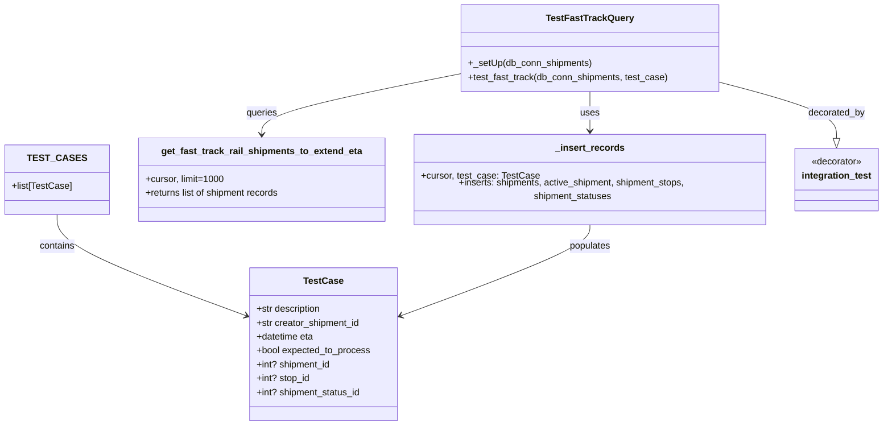

# Diagram: shipment_core/shipment_service/shipment_service/eta/db/tests/test_shipment_rail_extension_queries.py

> Auto-generated by Obscura crawlers

## Mermaid

### SVG

<svg id="container" width="1526.7265625" xmlns="http://www.w3.org/2000/svg" class="classDiagram" height="722" viewBox="0 0 1526.7265625 722" role="graphics-document document" aria-roledescription="class"><g><defs><marker id="container_class-aggregationStart" class="marker aggregation class" refX="18" refY="7" markerWidth="190" markerHeight="240" orient="auto"><path d="M 18,7 L9,13 L1,7 L9,1 Z"></path></marker></defs><defs><marker id="container_class-aggregationEnd" class="marker aggregation class" refX="1" refY="7" markerWidth="20" markerHeight="28" orient="auto"><path d="M 18,7 L9,13 L1,7 L9,1 Z"></path></marker></defs><defs><marker id="container_class-extensionStart" class="marker extension class" refX="18" refY="7" markerWidth="190" markerHeight="240" orient="auto"><path d="M 1,7 L18,13 V 1 Z"></path></marker></defs><defs><marker id="container_class-extensionEnd" class="marker extension class" refX="1" refY="7" markerWidth="20" markerHeight="28" orient="auto"><path d="M 1,1 V 13 L18,7 Z"></path></marker></defs><defs><marker id="container_class-compositionStart" class="marker composition class" refX="18" refY="7" markerWidth="190" markerHeight="240" orient="auto"><path d="M 18,7 L9,13 L1,7 L9,1 Z"></path></marker></defs><defs><marker id="container_class-compositionEnd" class="marker composition class" refX="1" refY="7" markerWidth="20" markerHeight="28" orient="auto"><path d="M 18,7 L9,13 L1,7 L9,1 Z"></path></marker></defs><defs><marker id="container_class-dependencyStart" class="marker dependency class" refX="6" refY="7" markerWidth="190" markerHeight="240" orient="auto"><path d="M 5,7 L9,13 L1,7 L9,1 Z"></path></marker></defs><defs><marker id="container_class-dependencyEnd" class="marker dependency class" refX="13" refY="7" markerWidth="20" markerHeight="28" orient="auto"><path d="M 18,7 L9,13 L14,7 L9,1 Z"></path></marker></defs><defs><marker id="container_class-lollipopStart" class="marker lollipop class" refX="13" refY="7" markerWidth="190" markerHeight="240" orient="auto"><circle stroke="black" fill="transparent" cx="7" cy="7" r="6"></circle></marker></defs><defs><marker id="container_class-lollipopEnd" class="marker lollipop class" refX="1" refY="7" markerWidth="190" markerHeight="240" orient="auto"><circle stroke="black" fill="transparent" cx="7" cy="7" r="6"></circle></marker></defs><g class="root"><g class="clusters"></g><g class="edgePaths"><path d="M93.461,364L93.461,372.167C93.461,380.333,93.461,396.667,148.33,424.916C203.199,453.166,312.938,493.331,367.807,513.414L422.676,533.497" id="id_TEST_CASES_TestCase_1" class="edge-thickness-normal edge-pattern-solid relation" style=";;;" data-edge="true" data-et="edge" data-id="id_TEST_CASES_TestCase_1" data-points="W3sieCI6OTMuNDYwOTM3NSwieSI6MzY0fSx7IngiOjkzLjQ2MDkzNzUsInkiOjQxM30seyJ4Ijo0MjguMzEwNTQ2ODc1LCJ5Ijo1MzUuNTU5MjYwMDg5NTkxMn1d" marker-end="url(#container_class-dependencyEnd)"></path><path d="M1016.926,158L1016.926,164.167C1016.926,170.333,1016.926,182.667,1016.926,194C1016.926,205.333,1016.926,215.667,1016.926,220.833L1016.926,226" id="id_TestFastTrackQuery__insert_records_2" class="edge-thickness-normal edge-pattern-solid relation" style=";;;" data-edge="true" data-et="edge" data-id="id_TestFastTrackQuery__insert_records_2" data-points="W3sieCI6MTAxNi45MjU3ODEyNSwieSI6MTU4fSx7IngiOjEwMTYuOTI1NzgxMjUsInkiOjE5NX0seyJ4IjoxMDE2LjkyNTc4MTI1LCJ5IjoyMzJ9XQ==" marker-end="url(#container_class-dependencyEnd)"></path><path d="M795.836,126.139L737.017,137.616C678.198,149.093,560.56,172.046,501.741,188.69C442.922,205.333,442.922,215.667,442.922,220.833L442.922,226" id="id_TestFastTrackQuery_get_fast_track_rail_shipments_to_extend_eta_3" class="edge-thickness-normal edge-pattern-solid relation" style=";;;" data-edge="true" data-et="edge" data-id="id_TestFastTrackQuery_get_fast_track_rail_shipments_to_extend_eta_3" data-points="W3sieCI6Nzk1LjgzNTkzNzUsInkiOjEyNi4xMzkxODgxMzE2MTM4OH0seyJ4Ijo0NDIuOTIxODc1LCJ5IjoxOTV9LHsieCI6NDQyLjkyMTg3NSwieSI6MjMyfV0=" marker-end="url(#container_class-dependencyEnd)"></path><path d="M1016.926,376L1016.926,382.167C1016.926,388.333,1016.926,400.667,962.057,426.916C907.187,453.166,797.449,493.331,742.58,513.414L687.711,533.497" id="id__insert_records_TestCase_4" class="edge-thickness-normal edge-pattern-solid relation" style=";;;" data-edge="true" data-et="edge" data-id="id__insert_records_TestCase_4" data-points="W3sieCI6MTAxNi45MjU3ODEyNSwieSI6Mzc2fSx7IngiOjEwMTYuOTI1NzgxMjUsInkiOjQxM30seyJ4Ijo2ODIuMDc2MTcxODc1LCJ5Ijo1MzUuNTU5MjYwMDg5NTkxMn1d" marker-end="url(#container_class-dependencyEnd)"></path><path d="M1238.016,140.466L1272.984,149.555C1307.953,158.644,1377.891,176.822,1412.859,192.203C1447.828,207.583,1447.828,220.167,1447.828,226.458L1447.828,232.75" id="id_TestFastTrackQuery_integration_test_5" class="edge-thickness-normal edge-pattern-solid relation" style=";;;" data-edge="true" data-et="edge" data-id="id_TestFastTrackQuery_integration_test_5" data-points="W3sieCI6MTIzOC4wMTU2MjUsInkiOjE0MC40NjU2MDE3OTg1NTEzOH0seyJ4IjoxNDQ3LjgyODEyNSwieSI6MTk1fSx7IngiOjE0NDcuODI4MTI1LCJ5IjoyNTB9XQ==" marker-end="url(#container_class-extensionEnd)"></path></g><g class="edgeLabels"><g class="edgeLabel" transform="translate(93.4609375, 413)"><g class="label" data-id="id_TEST_CASES_TestCase_1" transform="translate(-30.890625, -12)"><foreignObject width="61.78125" height="24">

contains

</foreignObject></g></g><g class="edgeLabel" transform="translate(1016.92578125, 195)"><g class="label" data-id="id_TestFastTrackQuery__insert_records_2" transform="translate(-16.4921875, -12)"><foreignObject width="32.984375" height="24">

uses

</foreignObject></g></g><g class="edgeLabel" transform="translate(442.921875, 195)"><g class="label" data-id="id_TestFastTrackQuery_get_fast_track_rail_shipments_to_extend_eta_3" transform="translate(-27.2421875, -12)"><foreignObject width="54.484375" height="24">

queries

</foreignObject></g></g><g class="edgeLabel" transform="translate(1016.92578125, 413)"><g class="label" data-id="id__insert_records_TestCase_4" transform="translate(-36.359375, -12)"><foreignObject width="72.71875" height="24">

populates

</foreignObject></g></g><g class="edgeLabel" transform="translate(1447.828125, 195)"><g class="label" data-id="id_TestFastTrackQuery_integration_test_5" transform="translate(-49.375, -12)"><foreignObject width="98.75" height="24">

decorated_by

</foreignObject></g></g></g><g class="nodes"><g class="node default" id="classId-TestCase-0" transform="translate(555.193359375, 582)"><g class="basic label-container"><path d="M-126.8828125 -132 L126.8828125 -132 L126.8828125 132 L-126.8828125 132" stroke="none" stroke-width="0" fill="#ECECFF" style=""></path><path d="M-126.8828125 -132 C-48.04042204821401 -132, 30.801968403571976 -132, 126.8828125 -132 M-126.8828125 -132 C-45.42906054573142 -132, 36.024691408537166 -132, 126.8828125 -132 M126.8828125 -132 C126.8828125 -66.14620906452492, 126.8828125 -0.29241812904984954, 126.8828125 132 M126.8828125 -132 C126.8828125 -75.8487439956235, 126.8828125 -19.697487991247, 126.8828125 132 M126.8828125 132 C37.34422250259213 132, -52.19436749481574 132, -126.8828125 132 M126.8828125 132 C27.859959767387295 132, -71.16289296522541 132, -126.8828125 132 M-126.8828125 132 C-126.8828125 26.448176400202016, -126.8828125 -79.10364719959597, -126.8828125 -132 M-126.8828125 132 C-126.8828125 31.774453046275923, -126.8828125 -68.45109390744815, -126.8828125 -132" stroke="#9370DB" stroke-width="1.3" fill="none" stroke-dasharray="0 0" style=""></path></g><g class="annotation-group text" transform="translate(0, -108)"></g><g class="label-group text" transform="translate(-32.359375, -108)"><g class="label" style="font-weight: bolder" transform="translate(0,-12)"><foreignObject width="64.71875" height="24">

TestCase

</foreignObject></g></g><g class="members-group text" transform="translate(-114.8828125, -60)"><g class="label" style="" transform="translate(0,-12)"><foreignObject width="114.265625" height="24">

+str description

</foreignObject></g><g class="label" style="" transform="translate(0,12)"><foreignObject width="181.203125" height="24">

+str creator_shipment_id

</foreignObject></g><g class="label" style="" transform="translate(0,36)"><foreignObject width="100.5625" height="24">

+datetime eta

</foreignObject></g><g class="label" style="" transform="translate(0,60)"><foreignObject width="197.40625" height="24">

+bool expected_to_process

</foreignObject></g><g class="label" style="" transform="translate(0,84)"><foreignObject width="129.609375" height="24">

+int? shipment_id

</foreignObject></g><g class="label" style="" transform="translate(0,108)"><foreignObject width="92.703125" height="24">

+int? stop_id

</foreignObject></g><g class="label" style="" transform="translate(0,132)"><foreignObject width="182.015625" height="24">

+int? shipment_status_id

</foreignObject></g></g><g class="methods-group text" transform="translate(-114.8828125, 132)"></g><g class="divider" style=""><path d="M-126.8828125 -84 C-37.852903011417794 -84, 51.17700647716441 -84, 126.8828125 -84 M-126.8828125 -84 C-27.40593169907801 -84, 72.07094910184398 -84, 126.8828125 -84" stroke="#9370DB" stroke-width="1.3" fill="none" stroke-dasharray="0 0" style=""></path></g><g class="divider" style=""><path d="M-126.8828125 108 C-53.3574544808739 108, 20.167903538252204 108, 126.8828125 108 M-126.8828125 108 C-39.87499116361262 108, 47.13283017277476 108, 126.8828125 108" stroke="#9370DB" stroke-width="1.3" fill="none" stroke-dasharray="0 0" style=""></path></g></g><g class="node default" id="classId-_insert_records-1" transform="translate(1016.92578125, 304)"><g class="basic label-container"><path d="M-310.00390625 -72 L310.00390625 -72 L310.00390625 72 L-310.00390625 72" stroke="none" stroke-width="0" fill="#ECECFF" style=""></path><path d="M-310.00390625 -72 C-166.12543200566535 -72, -22.24695776133069 -72, 310.00390625 -72 M-310.00390625 -72 C-65.69431363772932 -72, 178.61527897454135 -72, 310.00390625 -72 M310.00390625 -72 C310.00390625 -18.100789797075706, 310.00390625 35.79842040584859, 310.00390625 72 M310.00390625 -72 C310.00390625 -23.457449851923705, 310.00390625 25.08510029615259, 310.00390625 72 M310.00390625 72 C183.73499095641372 72, 57.46607566282745 72, -310.00390625 72 M310.00390625 72 C145.83720773584787 72, -18.32949077830426 72, -310.00390625 72 M-310.00390625 72 C-310.00390625 22.483735026461297, -310.00390625 -27.032529947077407, -310.00390625 -72 M-310.00390625 72 C-310.00390625 15.365588707617668, -310.00390625 -41.26882258476466, -310.00390625 -72" stroke="#9370DB" stroke-width="1.3" fill="none" stroke-dasharray="0 0" style=""></path></g><g class="annotation-group text" transform="translate(0, -48)"></g><g class="label-group text" transform="translate(-57.1328125, -48)"><g class="label" style="font-weight: bolder" transform="translate(0,-12)"><foreignObject width="114.265625" height="24">

_insert_records

</foreignObject></g></g><g class="members-group text" transform="translate(-298.00390625, 0)"><g class="label" style="" transform="translate(0,-12)"><foreignObject width="199.21875" height="24">

+cursor, test_case: TestCase

</foreignObject></g><g class="label" style="" transform="translate(0,12)"><foreignObject width="538.875" height="24">

+inserts: shipments, active_shipment, shipment_stops, shipment_statuses

</foreignObject></g></g><g class="methods-group text" transform="translate(-298.00390625, 72)"></g><g class="divider" style=""><path d="M-310.00390625 -24 C-158.58978689362363 -24, -7.17566753724725 -24, 310.00390625 -24 M-310.00390625 -24 C-156.68677381162223 -24, -3.3696413732444626 -24, 310.00390625 -24" stroke="#9370DB" stroke-width="1.3" fill="none" stroke-dasharray="0 0" style=""></path></g><g class="divider" style=""><path d="M-310.00390625 48 C-73.9256158206085 48, 162.152674608783 48, 310.00390625 48 M-310.00390625 48 C-158.77173775912763 48, -7.5395692682552635 48, 310.00390625 48" stroke="#9370DB" stroke-width="1.3" fill="none" stroke-dasharray="0 0" style=""></path></g></g><g class="node default" id="classId-TestFastTrackQuery-2" transform="translate(1016.92578125, 83)"><g class="basic label-container"><path d="M-221.08984375 -75 L221.08984375 -75 L221.08984375 75 L-221.08984375 75" stroke="none" stroke-width="0" fill="#ECECFF" style=""></path><path d="M-221.08984375 -75 C-60.086179069906734 -75, 100.91748561018653 -75, 221.08984375 -75 M-221.08984375 -75 C-112.1544187150253 -75, -3.218993680050602 -75, 221.08984375 -75 M221.08984375 -75 C221.08984375 -44.004647495495774, 221.08984375 -13.009294990991549, 221.08984375 75 M221.08984375 -75 C221.08984375 -34.412608874171205, 221.08984375 6.174782251657589, 221.08984375 75 M221.08984375 75 C111.347998683255 75, 1.6061536165099994 75, -221.08984375 75 M221.08984375 75 C121.10960485880365 75, 21.1293659676073 75, -221.08984375 75 M-221.08984375 75 C-221.08984375 31.60668293932717, -221.08984375 -11.786634121345656, -221.08984375 -75 M-221.08984375 75 C-221.08984375 25.434804397511222, -221.08984375 -24.130391204977556, -221.08984375 -75" stroke="#9370DB" stroke-width="1.3" fill="none" stroke-dasharray="0 0" style=""></path></g><g class="annotation-group text" transform="translate(0, -51)"></g><g class="label-group text" transform="translate(-71.4296875, -51)"><g class="label" style="font-weight: bolder" transform="translate(0,-12)"><foreignObject width="142.859375" height="24">

TestFastTrackQuery

</foreignObject></g></g><g class="members-group text" transform="translate(-209.08984375, -3)"></g><g class="methods-group text" transform="translate(-209.08984375, 27)"><g class="label" style="" transform="translate(0,-12)"><foreignObject width="213.875" height="24">

+_setUp(db_conn_shipments)

</foreignObject></g><g class="label" style="" transform="translate(0,12)"><foreignObject width="346.75" height="24">

+test_fast_track(db_conn_shipments, test_case)

</foreignObject></g></g><g class="divider" style=""><path d="M-221.08984375 -27 C-87.01479632383158 -27, 47.06025110233685 -27, 221.08984375 -27 M-221.08984375 -27 C-122.06216287954217 -27, -23.034482009084343 -27, 221.08984375 -27" stroke="#9370DB" stroke-width="1.3" fill="none" stroke-dasharray="0 0" style=""></path></g><g class="divider" style=""><path d="M-221.08984375 -3 C-96.01100302800279 -3, 29.06783769399442 -3, 221.08984375 -3 M-221.08984375 -3 C-97.08439708922236 -3, 26.921049571555272 -3, 221.08984375 -3" stroke="#9370DB" stroke-width="1.3" fill="none" stroke-dasharray="0 0" style=""></path></g></g><g class="node default" id="classId-get_fast_track_rail_shipments_to_extend_eta-3" transform="translate(442.921875, 304)"><g class="basic label-container"><path d="M-214 -72 L214 -72 L214 72 L-214 72" stroke="none" stroke-width="0" fill="#ECECFF" style=""></path><path d="M-214 -72 C-100.92851991735337 -72, 12.14296016529326 -72, 214 -72 M-214 -72 C-48.82228100250333 -72, 116.35543799499334 -72, 214 -72 M214 -72 C214 -23.398777988186104, 214 25.20244402362779, 214 72 M214 -72 C214 -34.9822190786711, 214 2.035561842657799, 214 72 M214 72 C112.63112335143062 72, 11.262246702861233 72, -214 72 M214 72 C101.16788542059467 72, -11.664229158810656 72, -214 72 M-214 72 C-214 35.152571558346, -214 -1.694856883308006, -214 -72 M-214 72 C-214 23.547858810491235, -214 -24.90428237901753, -214 -72" stroke="#9370DB" stroke-width="1.3" fill="none" stroke-dasharray="0 0" style=""></path></g><g class="annotation-group text" transform="translate(0, -48)"></g><g class="label-group text" transform="translate(-167.09375, -48)"><g class="label" style="font-weight: bolder" transform="translate(0,-12)"><foreignObject width="334.1875" height="24">

get_fast_track_rail_shipments_to_extend_eta

</foreignObject></g></g><g class="members-group text" transform="translate(-202, 0)"><g class="label" style="" transform="translate(0,-12)"><foreignObject width="135.109375" height="24">

+cursor, limit=1000

</foreignObject></g><g class="label" style="" transform="translate(0,12)"><foreignObject width="236.90625" height="24">

+returns list of shipment records

</foreignObject></g></g><g class="methods-group text" transform="translate(-202, 72)"></g><g class="divider" style=""><path d="M-214 -24 C-107.90100358371213 -24, -1.8020071674242502 -24, 214 -24 M-214 -24 C-112.23112215806265 -24, -10.462244316125293 -24, 214 -24" stroke="#9370DB" stroke-width="1.3" fill="none" stroke-dasharray="0 0" style=""></path></g><g class="divider" style=""><path d="M-214 48 C-103.232401650013 48, 7.535196699973994 48, 214 48 M-214 48 C-94.79111864826727 48, 24.417762703465456 48, 214 48" stroke="#9370DB" stroke-width="1.3" fill="none" stroke-dasharray="0 0" style=""></path></g></g><g class="node default" id="classId-TEST_CASES-4" transform="translate(93.4609375, 304)"><g class="basic label-container"><path d="M-85.4609375 -60 L85.4609375 -60 L85.4609375 60 L-85.4609375 60" stroke="none" stroke-width="0" fill="#ECECFF" style=""></path><path d="M-85.4609375 -60 C-22.50395890526852 -60, 40.45301968946296 -60, 85.4609375 -60 M-85.4609375 -60 C-26.351483841041976 -60, 32.75796981791605 -60, 85.4609375 -60 M85.4609375 -60 C85.4609375 -29.18975064510598, 85.4609375 1.6204987097880377, 85.4609375 60 M85.4609375 -60 C85.4609375 -15.287981229362437, 85.4609375 29.424037541275126, 85.4609375 60 M85.4609375 60 C34.02695704256545 60, -17.4070234148691 60, -85.4609375 60 M85.4609375 60 C29.00195297568486 60, -27.457031548630283 60, -85.4609375 60 M-85.4609375 60 C-85.4609375 35.94399252483973, -85.4609375 11.88798504967945, -85.4609375 -60 M-85.4609375 60 C-85.4609375 25.713623817140906, -85.4609375 -8.572752365718188, -85.4609375 -60" stroke="#9370DB" stroke-width="1.3" fill="none" stroke-dasharray="0 0" style=""></path></g><g class="annotation-group text" transform="translate(0, -36)"></g><g class="label-group text" transform="translate(-43.21875, -36)"><g class="label" style="font-weight: bolder" transform="translate(0,-12)"><foreignObject width="86.4375" height="24">

TEST_CASES

</foreignObject></g></g><g class="members-group text" transform="translate(-73.4609375, 12)"><g class="label" style="" transform="translate(0,-12)"><foreignObject width="103.703125" height="24">

+list[TestCase]

</foreignObject></g></g><g class="methods-group text" transform="translate(-73.4609375, 60)"></g><g class="divider" style=""><path d="M-85.4609375 -12 C-39.97164981327221 -12, 5.517637873455584 -12, 85.4609375 -12 M-85.4609375 -12 C-29.995389388342254 -12, 25.470158723315492 -12, 85.4609375 -12" stroke="#9370DB" stroke-width="1.3" fill="none" stroke-dasharray="0 0" style=""></path></g><g class="divider" style=""><path d="M-85.4609375 36 C-36.368015607519744 36, 12.724906284960511 36, 85.4609375 36 M-85.4609375 36 C-39.16014962346901 36, 7.140638253061979 36, 85.4609375 36" stroke="#9370DB" stroke-width="1.3" fill="none" stroke-dasharray="0 0" style=""></path></g></g><g class="node default" id="classId-integration_test-5" transform="translate(1447.828125, 304)"><g class="basic label-container"><path d="M-70.8984375 -54 L70.8984375 -54 L70.8984375 54 L-70.8984375 54" stroke="none" stroke-width="0" fill="#ECECFF" style=""></path><path d="M-70.8984375 -54 C-20.036658703859274 -54, 30.825120092281452 -54, 70.8984375 -54 M-70.8984375 -54 C-23.825976899538546 -54, 23.24648370092291 -54, 70.8984375 -54 M70.8984375 -54 C70.8984375 -28.804477405648193, 70.8984375 -3.6089548112963854, 70.8984375 54 M70.8984375 -54 C70.8984375 -27.75997972558075, 70.8984375 -1.5199594511614976, 70.8984375 54 M70.8984375 54 C19.27779860616893 54, -32.34284028766214 54, -70.8984375 54 M70.8984375 54 C30.537939446849656 54, -9.822558606300689 54, -70.8984375 54 M-70.8984375 54 C-70.8984375 11.408168966412894, -70.8984375 -31.18366206717421, -70.8984375 -54 M-70.8984375 54 C-70.8984375 20.989745278548327, -70.8984375 -12.020509442903347, -70.8984375 -54" stroke="#9370DB" stroke-width="1.3" fill="none" stroke-dasharray="0 0" style=""></path></g><g class="annotation-group text" transform="translate(-44.0625, -30)"><g class="label" style="" transform="translate(0,-12)"><foreignObject width="88.125" height="24">

«decorator»

</foreignObject></g></g><g class="label-group text" transform="translate(-58.8984375, -6)"><g class="label" style="font-weight: bolder" transform="translate(0,-12)"><foreignObject width="117.796875" height="24">

integration_test

</foreignObject></g></g><g class="members-group text" transform="translate(-58.8984375, 42)"></g><g class="methods-group text" transform="translate(-58.8984375, 72)"></g><g class="divider" style=""><path d="M-70.8984375 18 C-34.20217029583293 18, 2.494096908334143 18, 70.8984375 18 M-70.8984375 18 C-34.365336651747725 18, 2.1677641965045495 18, 70.8984375 18" stroke="#9370DB" stroke-width="1.3" fill="none" stroke-dasharray="0 0" style=""></path></g><g class="divider" style=""><path d="M-70.8984375 36 C-20.535282659923986 36, 29.827872180152028 36, 70.8984375 36 M-70.8984375 36 C-19.56737067127773 36, 31.763696157444542 36, 70.8984375 36" stroke="#9370DB" stroke-width="1.3" fill="none" stroke-dasharray="0 0" style=""></path></g></g></g></g></g></svg>
