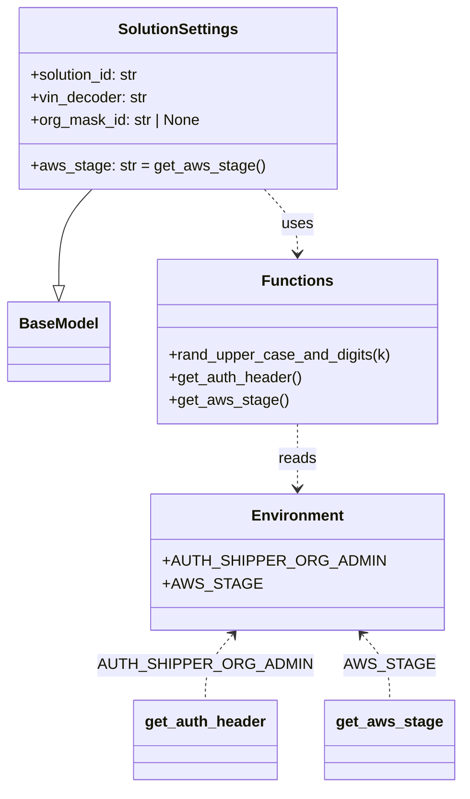

# Diagram: shipment_core/shipment_service/shipment_service/eta/e2e/common.py


> Auto-generated by Obscura crawlers

## Diagram 1



### SVG

<svg id="container" width="477.2421875" xmlns="http://www.w3.org/2000/svg" class="classDiagram" height="832" viewBox="0 0 477.2421875 832" role="graphics-document document" aria-roledescription="class"><style>#container{font-family:"trebuchet ms",verdana,arial,sans-serif;font-size:16px;fill:#333;}@keyframes edge-animation-frame{from{stroke-dashoffset:0;}}@keyframes dash{to{stroke-dashoffset:0;}}#container .edge-animation-slow{stroke-dasharray:9,5!important;stroke-dashoffset:900;animation:dash 50s linear infinite;stroke-linecap:round;}#container .edge-animation-fast{stroke-dasharray:9,5!important;stroke-dashoffset:900;animation:dash 20s linear infinite;stroke-linecap:round;}#container .error-icon{fill:#552222;}#container .error-text{fill:#552222;stroke:#552222;}#container .edge-thickness-normal{stroke-width:1px;}#container .edge-thickness-thick{stroke-width:3.5px;}#container .edge-pattern-solid{stroke-dasharray:0;}#container .edge-thickness-invisible{stroke-width:0;fill:none;}#container .edge-pattern-dashed{stroke-dasharray:3;}#container .edge-pattern-dotted{stroke-dasharray:2;}#container .marker{fill:#333333;stroke:#333333;}#container .marker.cross{stroke:#333333;}#container svg{font-family:"trebuchet ms",verdana,arial,sans-serif;font-size:16px;}#container p{margin:0;}#container g.classGroup text{fill:#9370DB;stroke:none;font-family:"trebuchet ms",verdana,arial,sans-serif;font-size:10px;}#container g.classGroup text .title{font-weight:bolder;}#container .nodeLabel,#container .edgeLabel{color:#131300;}#container .edgeLabel .label rect{fill:#ECECFF;}#container .label text{fill:#131300;}#container .labelBkg{background:#ECECFF;}#container .edgeLabel .label span{background:#ECECFF;}#container .classTitle{font-weight:bolder;}#container .node rect,#container .node circle,#container .node ellipse,#container .node polygon,#container .node path{fill:#ECECFF;stroke:#9370DB;stroke-width:1px;}#container .divider{stroke:#9370DB;stroke-width:1;}#container g.clickable{cursor:pointer;}#container g.classGroup rect{fill:#ECECFF;stroke:#9370DB;}#container g.classGroup line{stroke:#9370DB;stroke-width:1;}#container .classLabel .box{stroke:none;stroke-width:0;fill:#ECECFF;opacity:0.5;}#container .classLabel .label{fill:#9370DB;font-size:10px;}#container .relation{stroke:#333333;stroke-width:1;fill:none;}#container .dashed-line{stroke-dasharray:3;}#container .dotted-line{stroke-dasharray:1 2;}#container #compositionStart,#container .composition{fill:#333333!important;stroke:#333333!important;stroke-width:1;}#container #compositionEnd,#container .composition{fill:#333333!important;stroke:#333333!important;stroke-width:1;}#container #dependencyStart,#container .dependency{fill:#333333!important;stroke:#333333!important;stroke-width:1;}#container #dependencyStart,#container .dependency{fill:#333333!important;stroke:#333333!important;stroke-width:1;}#container #extensionStart,#container .extension{fill:transparent!important;stroke:#333333!important;stroke-width:1;}#container #extensionEnd,#container .extension{fill:transparent!important;stroke:#333333!important;stroke-width:1;}#container #aggregationStart,#container .aggregation{fill:transparent!important;stroke:#333333!important;stroke-width:1;}#container #aggregationEnd,#container .aggregation{fill:transparent!important;stroke:#333333!important;stroke-width:1;}#container #lollipopStart,#container .lollipop{fill:#ECECFF!important;stroke:#333333!important;stroke-width:1;}#container #lollipopEnd,#container .lollipop{fill:#ECECFF!important;stroke:#333333!important;stroke-width:1;}#container .edgeTerminals{font-size:11px;line-height:initial;}#container .classTitleText{text-anchor:middle;font-size:18px;fill:#333;}#container .label-icon{display:inline-block;height:1em;overflow:visible;vertical-align:-0.125em;}#container .node .label-icon path{fill:currentColor;stroke:revert;stroke-width:revert;}#container :root{--mermaid-font-family:"trebuchet ms",verdana,arial,sans-serif;}</style><g><defs><marker id="container_class-aggregationStart" class="marker aggregation class" refX="18" refY="7" markerWidth="190" markerHeight="240" orient="auto"><path d="M 18,7 L9,13 L1,7 L9,1 Z"></path></marker></defs><defs><marker id="container_class-aggregationEnd" class="marker aggregation class" refX="1" refY="7" markerWidth="20" markerHeight="28" orient="auto"><path d="M 18,7 L9,13 L1,7 L9,1 Z"></path></marker></defs><defs><marker id="container_class-extensionStart" class="marker extension class" refX="18" refY="7" markerWidth="190" markerHeight="240" orient="auto"><path d="M 1,7 L18,13 V 1 Z"></path></marker></defs><defs><marker id="container_class-extensionEnd" class="marker extension class" refX="1" refY="7" markerWidth="20" markerHeight="28" orient="auto"><path d="M 1,1 V 13 L18,7 Z"></path></marker></defs><defs><marker id="container_class-compositionStart" class="marker composition class" refX="18" refY="7" markerWidth="190" markerHeight="240" orient="auto"><path d="M 18,7 L9,13 L1,7 L9,1 Z"></path></marker></defs><defs><marker id="container_class-compositionEnd" class="marker composition class" refX="1" refY="7" markerWidth="20" markerHeight="28" orient="auto"><path d="M 18,7 L9,13 L1,7 L9,1 Z"></path></marker></defs><defs><marker id="container_class-dependencyStart" class="marker dependency class" refX="6" refY="7" markerWidth="190" markerHeight="240" orient="auto"><path d="M 5,7 L9,13 L1,7 L9,1 Z"></path></marker></defs><defs><marker id="container_class-dependencyEnd" class="marker dependency class" refX="13" refY="7" markerWidth="20" markerHeight="28" orient="auto"><path d="M 18,7 L9,13 L14,7 L9,1 Z"></path></marker></defs><defs><marker id="container_class-lollipopStart" class="marker lollipop class" refX="13" refY="7" markerWidth="190" markerHeight="240" orient="auto"><circle stroke="black" fill="transparent" cx="7" cy="7" r="6"></circle></marker></defs><defs><marker id="container_class-lollipopEnd" class="marker lollipop class" refX="1" refY="7" markerWidth="190" markerHeight="240" orient="auto"><circle stroke="black" fill="transparent" cx="7" cy="7" r="6"></circle></marker></defs><g class="root"><g class="clusters"></g><g class="edgePaths"><path d="M94.627,200L88.869,206.167C83.111,212.333,71.594,224.667,65.836,241.625C60.078,258.583,60.078,280.167,60.078,290.958L60.078,301.75" id="id_SolutionSettings_BaseModel_1" class="edge-thickness-normal edge-pattern-solid relation" style=";;;" data-edge="true" data-et="edge" data-id="id_SolutionSettings_BaseModel_1" data-points="W3sieCI6OTQuNjI3MDcwNjA2MjAzLCJ5IjoyMDB9LHsieCI6NjAuMDc4MTI1LCJ5IjoyMzd9LHsieCI6NjAuMDc4MTI1LCJ5IjozMTl9XQ==" marker-end="url(#container_class-extensionEnd)"></path><path d="M273.908,200L279.666,206.167C285.424,212.333,296.941,224.667,302.699,236C308.457,247.333,308.457,257.667,308.457,262.833L308.457,268" id="id_SolutionSettings_Functions_2" class="edge-thickness-normal edge-pattern-dashed relation" style=";;;" data-edge="true" data-et="edge" data-id="id_SolutionSettings_Functions_2" data-points="W3sieCI6MjczLjkwODA4NTY0Mzc5NywieSI6MjAwfSx7IngiOjMwOC40NTcwMzEyNSwieSI6MjM3fSx7IngiOjMwOC40NTcwMzEyNSwieSI6Mjc0fV0=" marker-end="url(#container_class-dependencyEnd)"></path><path d="M308.457,448L308.457,454.167C308.457,460.333,308.457,472.667,308.457,484C308.457,495.333,308.457,505.667,308.457,510.833L308.457,516" id="id_Functions_Environment_3" class="edge-thickness-normal edge-pattern-dashed relation" style=";;;" data-edge="true" data-et="edge" data-id="id_Functions_Environment_3" data-points="W3sieCI6MzA4LjQ1NzAzMTI1LCJ5Ijo0NDh9LHsieCI6MzA4LjQ1NzAzMTI1LCJ5Ijo0ODV9LHsieCI6MzA4LjQ1NzAzMTI1LCJ5Ijo1MjJ9XQ==" marker-end="url(#container_class-dependencyEnd)"></path><path d="M241.738,670.522L237.019,675.935C232.3,681.348,222.861,692.174,218.141,703.754C213.422,715.333,213.422,727.667,213.422,733.833L213.422,740" id="id_Environment_get_auth_header_4" class="edge-thickness-normal edge-pattern-dashed relation" style=";;;" data-edge="true" data-et="edge" data-id="id_Environment_get_auth_header_4" data-points="W3sieCI6MjQ1LjY4MTUxNTE5NDk1NDEzLCJ5Ijo2NjZ9LHsieCI6MjEzLjQyMTg3NSwieSI6NzAzfSx7IngiOjIxMy40MjE4NzUsInkiOjc0MH1d" marker-start="url(#container_class-dependencyStart)"></path><path d="M375.176,670.522L379.895,675.935C384.614,681.348,394.053,692.174,398.773,703.754C403.492,715.333,403.492,727.667,403.492,733.833L403.492,740" id="id_Environment_get_aws_stage_5" class="edge-thickness-normal edge-pattern-dashed relation" style=";;;" data-edge="true" data-et="edge" data-id="id_Environment_get_aws_stage_5" data-points="W3sieCI6MzcxLjIzMjU0NzMwNTA0NTg0LCJ5Ijo2NjZ9LHsieCI6NDAzLjQ5MjE4NzUsInkiOjcwM30seyJ4Ijo0MDMuNDkyMTg3NSwieSI6NzQwfV0=" marker-start="url(#container_class-dependencyStart)"></path></g><g class="edgeLabels"><g class="edgeLabel"><g class="label" data-id="id_SolutionSettings_BaseModel_1" transform="translate(0, 0)"><foreignObject width="0" height="0"><div xmlns="http://www.w3.org/1999/xhtml" class="labelBkg" style="display: table-cell; white-space: nowrap; line-height: 1.5; max-width: 200px; text-align: center;"><span class="edgeLabel"></span></div></foreignObject></g></g><g class="edgeLabel" transform="translate(308.45703125, 237)"><g class="label" data-id="id_SolutionSettings_Functions_2" transform="translate(-16.4921875, -12)"><foreignObject width="32.984375" height="24"><div xmlns="http://www.w3.org/1999/xhtml" class="labelBkg" style="display: table-cell; white-space: nowrap; line-height: 1.5; max-width: 200px; text-align: center;"><span class="edgeLabel"><p>uses</p></span></div></foreignObject></g></g><g class="edgeLabel" transform="translate(308.45703125, 485)"><g class="label" data-id="id_Functions_Environment_3" transform="translate(-20.0078125, -12)"><foreignObject width="40.015625" height="24"><div xmlns="http://www.w3.org/1999/xhtml" class="labelBkg" style="display: table-cell; white-space: nowrap; line-height: 1.5; max-width: 200px; text-align: center;"><span class="edgeLabel"><p>reads</p></span></div></foreignObject></g></g><g class="edgeLabel" transform="translate(213.421875, 703)"><g class="label" data-id="id_Environment_get_auth_header_4" transform="translate(-101.0390625, -12)"><foreignObject width="202.078125" height="24"><div xmlns="http://www.w3.org/1999/xhtml" class="labelBkg" style="display: table; white-space: break-spaces; line-height: 1.5; max-width: 200px; text-align: center; width: 200px;"><span class="edgeLabel"><p>AUTH_SHIPPER_ORG_ADMIN</p></span></div></foreignObject></g></g><g class="edgeLabel" transform="translate(403.4921875, 703)"><g class="label" data-id="id_Environment_get_aws_stage_5" transform="translate(-40.984375, -12)"><foreignObject width="81.96875" height="24"><div xmlns="http://www.w3.org/1999/xhtml" class="labelBkg" style="display: table-cell; white-space: nowrap; line-height: 1.5; max-width: 200px; text-align: center;"><span class="edgeLabel"><p>AWS_STAGE</p></span></div></foreignObject></g></g></g><g class="nodes"><g class="node default" id="classId-BaseModel-0" transform="translate(60.078125, 361)"><g class="basic label-container"><path d="M-52.078125 -42 L52.078125 -42 L52.078125 42 L-52.078125 42" stroke="none" stroke-width="0" fill="#ECECFF" style=""></path><path d="M-52.078125 -42 C-28.54171251881304 -42, -5.005300037626078 -42, 52.078125 -42 M-52.078125 -42 C-25.443034604944323 -42, 1.192055790111354 -42, 52.078125 -42 M52.078125 -42 C52.078125 -13.623232599670107, 52.078125 14.753534800659786, 52.078125 42 M52.078125 -42 C52.078125 -17.855389980777545, 52.078125 6.28922003844491, 52.078125 42 M52.078125 42 C28.0901066596516 42, 4.102088319303199 42, -52.078125 42 M52.078125 42 C15.831603043226302 42, -20.414918913547396 42, -52.078125 42 M-52.078125 42 C-52.078125 13.380806782014702, -52.078125 -15.238386435970597, -52.078125 -42 M-52.078125 42 C-52.078125 15.056117638750113, -52.078125 -11.887764722499774, -52.078125 -42" stroke="#9370DB" stroke-width="1.3" fill="none" stroke-dasharray="0 0" style=""></path></g><g class="annotation-group text" transform="translate(0, -18)"></g><g class="label-group text" transform="translate(-40.078125, -18)"><g class="label" style="font-weight: bolder" transform="translate(0,-12)"><foreignObject width="80.15625" height="24"><div xmlns="http://www.w3.org/1999/xhtml" style="display: table-cell; white-space: nowrap; line-height: 1.5; max-width: 130px; text-align: center;"><span class="nodeLabel markdown-node-label" style=""><p>BaseModel</p></span></div></foreignObject></g></g><g class="members-group text" transform="translate(-40.078125, 30)"></g><g class="methods-group text" transform="translate(-40.078125, 60)"></g><g class="divider" style=""><path d="M-52.078125 6 C-31.005298724465593 6, -9.932472448931186 6, 52.078125 6 M-52.078125 6 C-13.505806277085632 6, 25.066512445828735 6, 52.078125 6" stroke="#9370DB" stroke-width="1.3" fill="none" stroke-dasharray="0 0" style=""></path></g><g class="divider" style=""><path d="M-52.078125 24 C-26.269682520430052 24, -0.4612400408601047 24, 52.078125 24 M-52.078125 24 C-20.73046746669963 24, 10.617190066600742 24, 52.078125 24" stroke="#9370DB" stroke-width="1.3" fill="none" stroke-dasharray="0 0" style=""></path></g></g><g class="node default" id="classId-SolutionSettings-1" transform="translate(184.267578125, 104)"><g class="basic label-container"><path d="M-162.90625 -96 L162.90625 -96 L162.90625 96 L-162.90625 96" stroke="none" stroke-width="0" fill="#ECECFF" style=""></path><path d="M-162.90625 -96 C-87.19800462278245 -96, -11.489759245564898 -96, 162.90625 -96 M-162.90625 -96 C-66.5105365319305 -96, 29.885176936139004 -96, 162.90625 -96 M162.90625 -96 C162.90625 -34.30048013492248, 162.90625 27.39903973015504, 162.90625 96 M162.90625 -96 C162.90625 -49.84903252016936, 162.90625 -3.6980650403387187, 162.90625 96 M162.90625 96 C34.901411318390444 96, -93.10342736321911 96, -162.90625 96 M162.90625 96 C42.162213743770764 96, -78.58182251245847 96, -162.90625 96 M-162.90625 96 C-162.90625 50.96228717277603, -162.90625 5.92457434555206, -162.90625 -96 M-162.90625 96 C-162.90625 38.392750534740365, -162.90625 -19.21449893051927, -162.90625 -96" stroke="#9370DB" stroke-width="1.3" fill="none" stroke-dasharray="0 0" style=""></path></g><g class="annotation-group text" transform="translate(0, -72)"></g><g class="label-group text" transform="translate(-61.078125, -72)"><g class="label" style="font-weight: bolder" transform="translate(0,-12)"><foreignObject width="122.15625" height="24"><div xmlns="http://www.w3.org/1999/xhtml" style="display: table-cell; white-space: nowrap; line-height: 1.5; max-width: 170px; text-align: center;"><span class="nodeLabel markdown-node-label" style=""><p>SolutionSettings</p></span></div></foreignObject></g></g><g class="members-group text" transform="translate(-150.90625, -24)"><g class="label" style="" transform="translate(0,-12)"><foreignObject width="117.71875" height="24"><div xmlns="http://www.w3.org/1999/xhtml" style="display: table-cell; white-space: nowrap; line-height: 1.5; max-width: 176px; text-align: center;"><span class="nodeLabel markdown-node-label" style=""><p>+solution_id: str</p></span></div></foreignObject></g><g class="label" style="" transform="translate(0,12)"><foreignObject width="124.6875" height="24"><div xmlns="http://www.w3.org/1999/xhtml" style="display: table-cell; white-space: nowrap; line-height: 1.5; max-width: 183px; text-align: center;"><span class="nodeLabel markdown-node-label" style=""><p>+vin_decoder: str</p></span></div></foreignObject></g><g class="label" style="" transform="translate(0,36)"><foreignObject width="181.09375" height="24"><div xmlns="http://www.w3.org/1999/xhtml" style="display: table-cell; white-space: nowrap; line-height: 1.5; max-width: 238px; text-align: center;"><span class="nodeLabel markdown-node-label" style=""><p>+org_mask_id: str | None</p></span></div></foreignObject></g></g><g class="methods-group text" transform="translate(-150.90625, 72)"><g class="label" style="" transform="translate(0,-12)"><foreignObject width="240.734375" height="24"><div xmlns="http://www.w3.org/1999/xhtml" style="display: table-cell; white-space: nowrap; line-height: 1.5; max-width: 298px; text-align: center;"><span class="nodeLabel markdown-node-label" style=""><p>+aws_stage: str = get_aws_stage()</p></span></div></foreignObject></g></g><g class="divider" style=""><path d="M-162.90625 -48 C-38.92345404740014 -48, 85.05934190519972 -48, 162.90625 -48 M-162.90625 -48 C-56.079470906680854 -48, 50.74730818663829 -48, 162.90625 -48" stroke="#9370DB" stroke-width="1.3" fill="none" stroke-dasharray="0 0" style=""></path></g><g class="divider" style=""><path d="M-162.90625 48 C-93.21801983328933 48, -23.529789666578665 48, 162.90625 48 M-162.90625 48 C-49.251051599525354 48, 64.40414680094929 48, 162.90625 48" stroke="#9370DB" stroke-width="1.3" fill="none" stroke-dasharray="0 0" style=""></path></g></g><g class="node default" id="classId-Functions-2" transform="translate(308.45703125, 361)"><g class="basic label-container"><path d="M-146.30078125 -87 L146.30078125 -87 L146.30078125 87 L-146.30078125 87" stroke="none" stroke-width="0" fill="#ECECFF" style=""></path><path d="M-146.30078125 -87 C-79.05426468556392 -87, -11.807748121127844 -87, 146.30078125 -87 M-146.30078125 -87 C-82.4080716579507 -87, -18.515362065901414 -87, 146.30078125 -87 M146.30078125 -87 C146.30078125 -38.21548363006289, 146.30078125 10.569032739874217, 146.30078125 87 M146.30078125 -87 C146.30078125 -25.390424645368277, 146.30078125 36.219150709263445, 146.30078125 87 M146.30078125 87 C59.95927562388991 87, -26.382230002220183 87, -146.30078125 87 M146.30078125 87 C48.275671371768 87, -49.749438506464 87, -146.30078125 87 M-146.30078125 87 C-146.30078125 33.56340785487975, -146.30078125 -19.873184290240502, -146.30078125 -87 M-146.30078125 87 C-146.30078125 21.92989663735132, -146.30078125 -43.14020672529736, -146.30078125 -87" stroke="#9370DB" stroke-width="1.3" fill="none" stroke-dasharray="0 0" style=""></path></g><g class="annotation-group text" transform="translate(0, -63)"></g><g class="label-group text" transform="translate(-35.1328125, -63)"><g class="label" style="font-weight: bolder" transform="translate(0,-12)"><foreignObject width="70.265625" height="24"><div xmlns="http://www.w3.org/1999/xhtml" style="display: table-cell; white-space: nowrap; line-height: 1.5; max-width: 120px; text-align: center;"><span class="nodeLabel markdown-node-label" style=""><p>Functions</p></span></div></foreignObject></g></g><g class="members-group text" transform="translate(-134.30078125, -15)"></g><g class="methods-group text" transform="translate(-134.30078125, 15)"><g class="label" style="" transform="translate(0,-12)"><foreignObject width="233.46875" height="24"><div xmlns="http://www.w3.org/1999/xhtml" style="display: table-cell; white-space: nowrap; line-height: 1.5; max-width: 291px; text-align: center;"><span class="nodeLabel markdown-node-label" style=""><p>+rand_upper_case_and_digits(k)</p></span></div></foreignObject></g><g class="label" style="" transform="translate(0,12)"><foreignObject width="141.515625" height="24"><div xmlns="http://www.w3.org/1999/xhtml" style="display: table-cell; white-space: nowrap; line-height: 1.5; max-width: 199px; text-align: center;"><span class="nodeLabel markdown-node-label" style=""><p>+get_auth_header()</p></span></div></foreignObject></g><g class="label" style="" transform="translate(0,36)"><foreignObject width="122.953125" height="24"><div xmlns="http://www.w3.org/1999/xhtml" style="display: table-cell; white-space: nowrap; line-height: 1.5; max-width: 180px; text-align: center;"><span class="nodeLabel markdown-node-label" style=""><p>+get_aws_stage()</p></span></div></foreignObject></g></g><g class="divider" style=""><path d="M-146.30078125 -39 C-78.70958754753629 -39, -11.118393845072575 -39, 146.30078125 -39 M-146.30078125 -39 C-35.55545076638299 -39, 75.18987971723402 -39, 146.30078125 -39" stroke="#9370DB" stroke-width="1.3" fill="none" stroke-dasharray="0 0" style=""></path></g><g class="divider" style=""><path d="M-146.30078125 -15 C-74.41441005450667 -15, -2.52803885901335 -15, 146.30078125 -15 M-146.30078125 -15 C-31.842154289101273 -15, 82.61647267179745 -15, 146.30078125 -15" stroke="#9370DB" stroke-width="1.3" fill="none" stroke-dasharray="0 0" style=""></path></g></g><g class="node default" id="classId-Environment-3" transform="translate(308.45703125, 594)"><g class="basic label-container"><path d="M-140.04296875 -72 L140.04296875 -72 L140.04296875 72 L-140.04296875 72" stroke="none" stroke-width="0" fill="#ECECFF" style=""></path><path d="M-140.04296875 -72 C-42.161353785954006 -72, 55.72026117809199 -72, 140.04296875 -72 M-140.04296875 -72 C-80.6806780452763 -72, -21.318387340552576 -72, 140.04296875 -72 M140.04296875 -72 C140.04296875 -18.97088900230618, 140.04296875 34.05822199538764, 140.04296875 72 M140.04296875 -72 C140.04296875 -21.792245313994016, 140.04296875 28.415509372011968, 140.04296875 72 M140.04296875 72 C58.04870898857507 72, -23.945550772849856 72, -140.04296875 72 M140.04296875 72 C28.214753428837938 72, -83.61346189232412 72, -140.04296875 72 M-140.04296875 72 C-140.04296875 36.76417031100747, -140.04296875 1.5283406220149374, -140.04296875 -72 M-140.04296875 72 C-140.04296875 36.298203688307204, -140.04296875 0.5964073766144082, -140.04296875 -72" stroke="#9370DB" stroke-width="1.3" fill="none" stroke-dasharray="0 0" style=""></path></g><g class="annotation-group text" transform="translate(0, -48)"></g><g class="label-group text" transform="translate(-46.1953125, -48)"><g class="label" style="font-weight: bolder" transform="translate(0,-12)"><foreignObject width="92.390625" height="24"><div xmlns="http://www.w3.org/1999/xhtml" style="display: table-cell; white-space: nowrap; line-height: 1.5; max-width: 142px; text-align: center;"><span class="nodeLabel markdown-node-label" style=""><p>Environment</p></span></div></foreignObject></g></g><g class="members-group text" transform="translate(-128.04296875, 0)"><g class="label" style="" transform="translate(0,-12)"><foreignObject width="209.890625" height="24"><div xmlns="http://www.w3.org/1999/xhtml" style="display: table-cell; white-space: nowrap; line-height: 1.5; max-width: 267px; text-align: center;"><span class="nodeLabel markdown-node-label" style=""><p>+AUTH_SHIPPER_ORG_ADMIN</p></span></div></foreignObject></g><g class="label" style="" transform="translate(0,12)"><foreignObject width="89.796875" height="24"><div xmlns="http://www.w3.org/1999/xhtml" style="display: table-cell; white-space: nowrap; line-height: 1.5; max-width: 147px; text-align: center;"><span class="nodeLabel markdown-node-label" style=""><p>+AWS_STAGE</p></span></div></foreignObject></g></g><g class="methods-group text" transform="translate(-128.04296875, 72)"></g><g class="divider" style=""><path d="M-140.04296875 -24 C-80.41758919828175 -24, -20.792209646563492 -24, 140.04296875 -24 M-140.04296875 -24 C-55.85327847293334 -24, 28.33641180413332 -24, 140.04296875 -24" stroke="#9370DB" stroke-width="1.3" fill="none" stroke-dasharray="0 0" style=""></path></g><g class="divider" style=""><path d="M-140.04296875 48 C-45.90210441788058 48, 48.23875991423884 48, 140.04296875 48 M-140.04296875 48 C-43.08087935852885 48, 53.881210032942306 48, 140.04296875 48" stroke="#9370DB" stroke-width="1.3" fill="none" stroke-dasharray="0 0" style=""></path></g></g><g class="node default" id="classId-get_auth_header-4" transform="translate(213.421875, 782)"><g class="basic label-container"><path d="M-74.3203125 -42 L74.3203125 -42 L74.3203125 42 L-74.3203125 42" stroke="none" stroke-width="0" fill="#ECECFF" style=""></path><path d="M-74.3203125 -42 C-21.208966475364235 -42, 31.90237954927153 -42, 74.3203125 -42 M-74.3203125 -42 C-29.752556060612363 -42, 14.815200378775273 -42, 74.3203125 -42 M74.3203125 -42 C74.3203125 -11.175380504631484, 74.3203125 19.649238990737032, 74.3203125 42 M74.3203125 -42 C74.3203125 -18.054647906550244, 74.3203125 5.890704186899512, 74.3203125 42 M74.3203125 42 C36.14723192621682 42, -2.025848647566363 42, -74.3203125 42 M74.3203125 42 C26.6665018072435 42, -20.987308885513002 42, -74.3203125 42 M-74.3203125 42 C-74.3203125 19.129091188918355, -74.3203125 -3.741817622163289, -74.3203125 -42 M-74.3203125 42 C-74.3203125 21.459858945197762, -74.3203125 0.9197178903955248, -74.3203125 -42" stroke="#9370DB" stroke-width="1.3" fill="none" stroke-dasharray="0 0" style=""></path></g><g class="annotation-group text" transform="translate(0, -18)"></g><g class="label-group text" transform="translate(-62.3203125, -18)"><g class="label" style="font-weight: bolder" transform="translate(0,-12)"><foreignObject width="124.640625" height="24"><div xmlns="http://www.w3.org/1999/xhtml" style="display: table-cell; white-space: nowrap; line-height: 1.5; max-width: 174px; text-align: center;"><span class="nodeLabel markdown-node-label" style=""><p>get_auth_header</p></span></div></foreignObject></g></g><g class="members-group text" transform="translate(-62.3203125, 30)"></g><g class="methods-group text" transform="translate(-62.3203125, 60)"></g><g class="divider" style=""><path d="M-74.3203125 6 C-36.54289327500201 6, 1.2345259499959838 6, 74.3203125 6 M-74.3203125 6 C-31.546805834886733 6, 11.226700830226534 6, 74.3203125 6" stroke="#9370DB" stroke-width="1.3" fill="none" stroke-dasharray="0 0" style=""></path></g><g class="divider" style=""><path d="M-74.3203125 24 C-25.030592689486205 24, 24.25912712102759 24, 74.3203125 24 M-74.3203125 24 C-34.334109588191744 24, 5.652093323616512 24, 74.3203125 24" stroke="#9370DB" stroke-width="1.3" fill="none" stroke-dasharray="0 0" style=""></path></g></g><g class="node default" id="classId-get_aws_stage-5" transform="translate(403.4921875, 782)"><g class="basic label-container"><path d="M-65.75 -42 L65.75 -42 L65.75 42 L-65.75 42" stroke="none" stroke-width="0" fill="#ECECFF" style=""></path><path d="M-65.75 -42 C-14.786311726830448 -42, 36.177376546339104 -42, 65.75 -42 M-65.75 -42 C-25.625924320726178 -42, 14.498151358547645 -42, 65.75 -42 M65.75 -42 C65.75 -16.806251400464006, 65.75 8.387497199071987, 65.75 42 M65.75 -42 C65.75 -10.803087238506851, 65.75 20.393825522986297, 65.75 42 M65.75 42 C34.735680131398034 42, 3.7213602627960682 42, -65.75 42 M65.75 42 C25.269876631381784 42, -15.210246737236432 42, -65.75 42 M-65.75 42 C-65.75 18.392060311874346, -65.75 -5.2158793762513085, -65.75 -42 M-65.75 42 C-65.75 24.071854476557878, -65.75 6.143708953115755, -65.75 -42" stroke="#9370DB" stroke-width="1.3" fill="none" stroke-dasharray="0 0" style=""></path></g><g class="annotation-group text" transform="translate(0, -18)"></g><g class="label-group text" transform="translate(-53.75, -18)"><g class="label" style="font-weight: bolder" transform="translate(0,-12)"><foreignObject width="107.5" height="24"><div xmlns="http://www.w3.org/1999/xhtml" style="display: table-cell; white-space: nowrap; line-height: 1.5; max-width: 155px; text-align: center;"><span class="nodeLabel markdown-node-label" style=""><p>get_aws_stage</p></span></div></foreignObject></g></g><g class="members-group text" transform="translate(-53.75, 30)"></g><g class="methods-group text" transform="translate(-53.75, 60)"></g><g class="divider" style=""><path d="M-65.75 6 C-20.71496193949165 6, 24.320076121016697 6, 65.75 6 M-65.75 6 C-20.69034554365399 6, 24.36930891269202 6, 65.75 6" stroke="#9370DB" stroke-width="1.3" fill="none" stroke-dasharray="0 0" style=""></path></g><g class="divider" style=""><path d="M-65.75 24 C-16.869674369641857 24, 32.01065126071629 24, 65.75 24 M-65.75 24 C-14.17483685301245 24, 37.4003262939751 24, 65.75 24" stroke="#9370DB" stroke-width="1.3" fill="none" stroke-dasharray="0 0" style=""></path></g></g></g></g></g></svg>

## Diagram 2

```mermaid
flowchart TD
    Start([Start]) --> LD[load_dotenv()]
    LD --> GA[get_aws_stage()]
    GA -->|reads AWS_STAGE| CV{AWS_STAGE in ["dev","dev2"]}
    CV -->|yes| AS[return aws_stage]
    CV -->|no| ERR1[(AssertionError)]
    LD --> GH[get_auth_header()]
    GH -->|reads AUTH_SHIPPER_ORG_ADMIN| CH{AUTH_SHIPPER_ORG_ADMIN present?}
    CH -->|yes| AH[return Authorization header]
    CH -->|no| ERR1
    AS --> SI[Instantiate SolutionSettings]
    SI --> AS_CALL[get_aws_stage() called]
    SI --> END([Ready])
    Utils[rand_upper_case_and_digits(k)]:::util
    classDef util fill:#f9f,stroke:#333,stroke-width:1px
```

> SVG rendering failed for this diagram.
