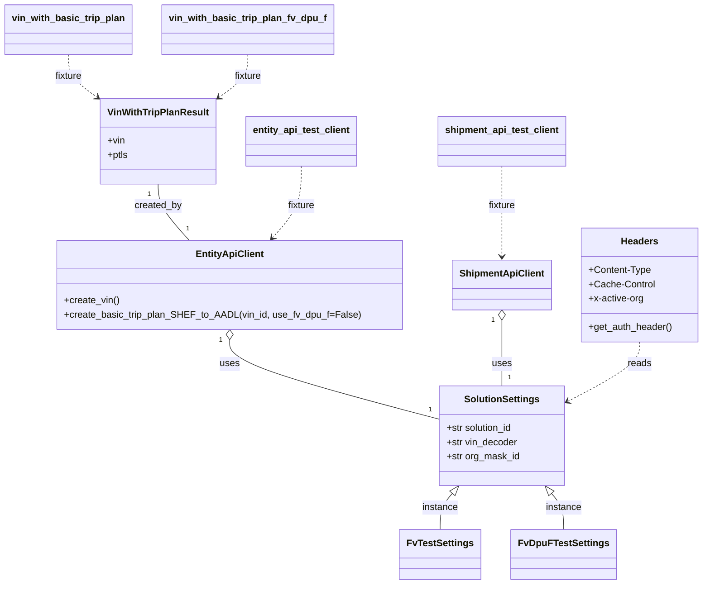

# Diagram: shipment_core/shipment_service/shipment_service/eta/e2e/conftest.py


> Auto-generated by Obscura crawlers

## Diagram 1



### SVG

<svg id="container" width="1156.123046875" xmlns="http://www.w3.org/2000/svg" class="classDiagram" height="984" viewBox="0 0 1156.123046875 984" role="graphics-document document" aria-roledescription="class"><style>#container{font-family:"trebuchet ms",verdana,arial,sans-serif;font-size:16px;fill:#333;}@keyframes edge-animation-frame{from{stroke-dashoffset:0;}}@keyframes dash{to{stroke-dashoffset:0;}}#container .edge-animation-slow{stroke-dasharray:9,5!important;stroke-dashoffset:900;animation:dash 50s linear infinite;stroke-linecap:round;}#container .edge-animation-fast{stroke-dasharray:9,5!important;stroke-dashoffset:900;animation:dash 20s linear infinite;stroke-linecap:round;}#container .error-icon{fill:#552222;}#container .error-text{fill:#552222;stroke:#552222;}#container .edge-thickness-normal{stroke-width:1px;}#container .edge-thickness-thick{stroke-width:3.5px;}#container .edge-pattern-solid{stroke-dasharray:0;}#container .edge-thickness-invisible{stroke-width:0;fill:none;}#container .edge-pattern-dashed{stroke-dasharray:3;}#container .edge-pattern-dotted{stroke-dasharray:2;}#container .marker{fill:#333333;stroke:#333333;}#container .marker.cross{stroke:#333333;}#container svg{font-family:"trebuchet ms",verdana,arial,sans-serif;font-size:16px;}#container p{margin:0;}#container g.classGroup text{fill:#9370DB;stroke:none;font-family:"trebuchet ms",verdana,arial,sans-serif;font-size:10px;}#container g.classGroup text .title{font-weight:bolder;}#container .nodeLabel,#container .edgeLabel{color:#131300;}#container .edgeLabel .label rect{fill:#ECECFF;}#container .label text{fill:#131300;}#container .labelBkg{background:#ECECFF;}#container .edgeLabel .label span{background:#ECECFF;}#container .classTitle{font-weight:bolder;}#container .node rect,#container .node circle,#container .node ellipse,#container .node polygon,#container .node path{fill:#ECECFF;stroke:#9370DB;stroke-width:1px;}#container .divider{stroke:#9370DB;stroke-width:1;}#container g.clickable{cursor:pointer;}#container g.classGroup rect{fill:#ECECFF;stroke:#9370DB;}#container g.classGroup line{stroke:#9370DB;stroke-width:1;}#container .classLabel .box{stroke:none;stroke-width:0;fill:#ECECFF;opacity:0.5;}#container .classLabel .label{fill:#9370DB;font-size:10px;}#container .relation{stroke:#333333;stroke-width:1;fill:none;}#container .dashed-line{stroke-dasharray:3;}#container .dotted-line{stroke-dasharray:1 2;}#container #compositionStart,#container .composition{fill:#333333!important;stroke:#333333!important;stroke-width:1;}#container #compositionEnd,#container .composition{fill:#333333!important;stroke:#333333!important;stroke-width:1;}#container #dependencyStart,#container .dependency{fill:#333333!important;stroke:#333333!important;stroke-width:1;}#container #dependencyStart,#container .dependency{fill:#333333!important;stroke:#333333!important;stroke-width:1;}#container #extensionStart,#container .extension{fill:transparent!important;stroke:#333333!important;stroke-width:1;}#container #extensionEnd,#container .extension{fill:transparent!important;stroke:#333333!important;stroke-width:1;}#container #aggregationStart,#container .aggregation{fill:transparent!important;stroke:#333333!important;stroke-width:1;}#container #aggregationEnd,#container .aggregation{fill:transparent!important;stroke:#333333!important;stroke-width:1;}#container #lollipopStart,#container .lollipop{fill:#ECECFF!important;stroke:#333333!important;stroke-width:1;}#container #lollipopEnd,#container .lollipop{fill:#ECECFF!important;stroke:#333333!important;stroke-width:1;}#container .edgeTerminals{font-size:11px;line-height:initial;}#container .classTitleText{text-anchor:middle;font-size:18px;fill:#333;}#container .label-icon{display:inline-block;height:1em;overflow:visible;vertical-align:-0.125em;}#container .node .label-icon path{fill:currentColor;stroke:revert;stroke-width:revert;}#container :root{--mermaid-font-family:"trebuchet ms",verdana,arial,sans-serif;}</style><g><defs><marker id="container_class-aggregationStart" class="marker aggregation class" refX="18" refY="7" markerWidth="190" markerHeight="240" orient="auto"><path d="M 18,7 L9,13 L1,7 L9,1 Z"></path></marker></defs><defs><marker id="container_class-aggregationEnd" class="marker aggregation class" refX="1" refY="7" markerWidth="20" markerHeight="28" orient="auto"><path d="M 18,7 L9,13 L1,7 L9,1 Z"></path></marker></defs><defs><marker id="container_class-extensionStart" class="marker extension class" refX="18" refY="7" markerWidth="190" markerHeight="240" orient="auto"><path d="M 1,7 L18,13 V 1 Z"></path></marker></defs><defs><marker id="container_class-extensionEnd" class="marker extension class" refX="1" refY="7" markerWidth="20" markerHeight="28" orient="auto"><path d="M 1,1 V 13 L18,7 Z"></path></marker></defs><defs><marker id="container_class-compositionStart" class="marker composition class" refX="18" refY="7" markerWidth="190" markerHeight="240" orient="auto"><path d="M 18,7 L9,13 L1,7 L9,1 Z"></path></marker></defs><defs><marker id="container_class-compositionEnd" class="marker composition class" refX="1" refY="7" markerWidth="20" markerHeight="28" orient="auto"><path d="M 18,7 L9,13 L1,7 L9,1 Z"></path></marker></defs><defs><marker id="container_class-dependencyStart" class="marker dependency class" refX="6" refY="7" markerWidth="190" markerHeight="240" orient="auto"><path d="M 5,7 L9,13 L1,7 L9,1 Z"></path></marker></defs><defs><marker id="container_class-dependencyEnd" class="marker dependency class" refX="13" refY="7" markerWidth="20" markerHeight="28" orient="auto"><path d="M 18,7 L9,13 L14,7 L9,1 Z"></path></marker></defs><defs><marker id="container_class-lollipopStart" class="marker lollipop class" refX="13" refY="7" markerWidth="190" markerHeight="240" orient="auto"><circle stroke="black" fill="transparent" cx="7" cy="7" r="6"></circle></marker></defs><defs><marker id="container_class-lollipopEnd" class="marker lollipop class" refX="1" refY="7" markerWidth="190" markerHeight="240" orient="auto"><circle stroke="black" fill="transparent" cx="7" cy="7" r="6"></circle></marker></defs><g class="root"><g class="clusters"></g><g class="edgePaths"><path d="M742.246,831.327L739.004,835.272C735.761,839.218,729.276,847.109,726.034,857.221C722.791,867.333,722.791,879.667,722.791,885.833L722.791,892" id="id_SolutionSettings_FvTestSettings_1" class="edge-thickness-normal edge-pattern-solid relation" style=";;;" data-edge="true" data-et="edge" data-id="id_SolutionSettings_FvTestSettings_1" data-points="W3sieCI6NzUzLjE5ODcxODM2MjYwMzQsInkiOjgxOH0seyJ4Ijo3MjIuNzkxMDE1NjI1LCJ5Ijo4NTV9LHsieCI6NzIyLjc5MTAxNTYyNSwieSI6ODkyfV0=" marker-start="url(#container_class-extensionStart)"></path><path d="M902.219,831.327L905.461,835.272C908.704,839.218,915.189,847.109,918.431,857.221C921.674,867.333,921.674,879.667,921.674,885.833L921.674,892" id="id_SolutionSettings_FvDpuFTestSettings_2" class="edge-thickness-normal edge-pattern-solid relation" style=";;;" data-edge="true" data-et="edge" data-id="id_SolutionSettings_FvDpuFTestSettings_2" data-points="W3sieCI6ODkxLjI2NjEyNTM4NzM5NjYsInkiOjgxOH0seyJ4Ijo5MjEuNjczODI4MTI1LCJ5Ijo4NTV9LHsieCI6OTIxLjY3MzgyODEyNSwieSI6ODkyfV0=" marker-start="url(#container_class-extensionStart)"></path><path d="M375.488,572.25L375.488,579.042C375.488,585.833,375.488,599.417,432.526,621.657C489.564,643.897,603.641,674.795,660.679,690.243L717.717,705.692" id="id_EntityApiClient_SolutionSettings_3" class="edge-thickness-normal edge-pattern-solid relation" style=";;;" data-edge="true" data-et="edge" data-id="id_EntityApiClient_SolutionSettings_3" data-points="W3sieCI6Mzc1LjQ4ODI4MTI1LCJ5Ijo1NTV9LHsieCI6Mzc1LjQ4ODI4MTI1LCJ5Ijo2MTN9LHsieCI6NzE3LjcxNjc5Njg3NSwieSI6NzA1LjY5MjA5NTE1MDI0MDd9XQ==" marker-start="url(#container_class-aggregationStart)"></path><path d="M822.232,539.25L822.232,551.542C822.232,563.833,822.232,588.417,822.232,606.875C822.232,625.333,822.232,637.667,822.232,643.833L822.232,650" id="id_ShipmentApiClient_SolutionSettings_4" class="edge-thickness-normal edge-pattern-solid relation" style=";;;" data-edge="true" data-et="edge" data-id="id_ShipmentApiClient_SolutionSettings_4" data-points="W3sieCI6ODIyLjIzMjQyMTg3NSwieSI6NTIyfSx7IngiOjgyMi4yMzI0MjE4NzUsInkiOjYxM30seyJ4Ijo4MjIuMjMyNDIxODc1LCJ5Ijo2NTB9XQ==" marker-start="url(#container_class-aggregationStart)"></path><path d="M257.824,310L257.824,316.167C257.824,322.333,257.824,334.667,266.376,350.5C274.928,366.333,292.032,385.667,300.584,395.333L309.136,405" id="id_VinWithTripPlanResult_EntityApiClient_5" class="edge-thickness-normal edge-pattern-solid relation" style=";;;" data-edge="true" data-et="edge" data-id="id_VinWithTripPlanResult_EntityApiClient_5" data-points="W3sieCI6MjU3LjgyNDIxODc1LCJ5IjozMTB9LHsieCI6MjU3LjgyNDIxODc1LCJ5IjozNDd9LHsieCI6MzA5LjEzNjM2NjMwNjM5MSwieSI6NDA1fV0="></path><path d="M1050.244,576L1050.244,582.167C1050.244,588.333,1050.244,600.667,1030.545,617.287C1010.845,633.908,971.447,654.816,951.747,665.27L932.048,675.724" id="id_Headers_SolutionSettings_6" class="edge-thickness-normal edge-pattern-dashed relation" style=";;;" data-edge="true" data-et="edge" data-id="id_Headers_SolutionSettings_6" data-points="W3sieCI6MTA1MC4yNDQxNDA2MjUsInkiOjU3Nn0seyJ4IjoxMDUwLjI0NDE0MDYyNSwieSI6NjEzfSx7IngiOjkyNi43NDgwNDY4NzUsInkiOjY3OC41MzYyMjUxODAzMTIyfV0=" marker-end="url(#container_class-dependencyEnd)"></path><path d="M493.152,280L493.152,291.167C493.152,302.333,493.152,324.667,485.263,344.751C477.374,364.835,461.595,382.671,453.705,391.588L445.816,400.506" id="id_entity_api_test_client_EntityApiClient_7" class="edge-thickness-normal edge-pattern-dashed relation" style=";;;" data-edge="true" data-et="edge" data-id="id_entity_api_test_client_EntityApiClient_7" data-points="W3sieCI6NDkzLjE1MjM0Mzc1LCJ5IjoyODB9LHsieCI6NDkzLjE1MjM0Mzc1LCJ5IjozNDd9LHsieCI6NDQxLjg0MDE5NjE5MzYwOSwieSI6NDA1fV0=" marker-end="url(#container_class-dependencyEnd)"></path><path d="M822.232,280L822.232,291.167C822.232,302.333,822.232,324.667,822.232,350C822.232,375.333,822.232,403.667,822.232,417.833L822.232,432" id="id_shipment_api_test_client_ShipmentApiClient_8" class="edge-thickness-normal edge-pattern-dashed relation" style=";;;" data-edge="true" data-et="edge" data-id="id_shipment_api_test_client_ShipmentApiClient_8" data-points="W3sieCI6ODIyLjIzMjQyMTg3NSwieSI6MjgwfSx7IngiOjgyMi4yMzI0MjE4NzUsInkiOjM0N30seyJ4Ijo4MjIuMjMyNDIxODc1LCJ5Ijo0Mzh9XQ==" marker-end="url(#container_class-dependencyEnd)"></path><path d="M111.484,92L111.484,98.167C111.484,104.333,111.484,116.667,119.458,128.772C127.431,140.878,143.378,152.756,151.351,158.695L159.325,164.634" id="id_vin_with_basic_trip_plan_VinWithTripPlanResult_9" class="edge-thickness-normal edge-pattern-dashed relation" style=";;;" data-edge="true" data-et="edge" data-id="id_vin_with_basic_trip_plan_VinWithTripPlanResult_9" data-points="W3sieCI6MTExLjQ4NDM3NSwieSI6OTJ9LHsieCI6MTExLjQ4NDM3NSwieSI6MTI5fSx7IngiOjE2NC4xMzY3MTg3NSwieSI6MTY4LjIxNzY1NDc1MjY4OTMzfV0=" marker-end="url(#container_class-dependencyEnd)"></path><path d="M404.164,92L404.164,98.167C404.164,104.333,404.164,116.667,396.191,128.772C388.217,140.878,372.27,152.756,364.297,158.695L356.324,164.634" id="id_vin_with_basic_trip_plan_fv_dpu_f_VinWithTripPlanResult_10" class="edge-thickness-normal edge-pattern-dashed relation" style=";;;" data-edge="true" data-et="edge" data-id="id_vin_with_basic_trip_plan_fv_dpu_f_VinWithTripPlanResult_10" data-points="W3sieCI6NDA0LjE2NDA2MjUsInkiOjkyfSx7IngiOjQwNC4xNjQwNjI1LCJ5IjoxMjl9LHsieCI6MzUxLjUxMTcxODc1LCJ5IjoxNjguMjE3NjU0NzUyNjg5MzN9XQ==" marker-end="url(#container_class-dependencyEnd)"></path></g><g class="edgeLabels"><g class="edgeLabel" transform="translate(722.791015625, 855)"><g class="label" data-id="id_SolutionSettings_FvTestSettings_1" transform="translate(-30.578125, -12)"><foreignObject width="61.15625" height="24"><div xmlns="http://www.w3.org/1999/xhtml" class="labelBkg" style="display: table-cell; white-space: nowrap; line-height: 1.5; max-width: 200px; text-align: center;"><span class="edgeLabel"><p>instance</p></span></div></foreignObject></g></g><g class="edgeLabel" transform="translate(921.673828125, 855)"><g class="label" data-id="id_SolutionSettings_FvDpuFTestSettings_2" transform="translate(-30.578125, -12)"><foreignObject width="61.15625" height="24"><div xmlns="http://www.w3.org/1999/xhtml" class="labelBkg" style="display: table-cell; white-space: nowrap; line-height: 1.5; max-width: 200px; text-align: center;"><span class="edgeLabel"><p>instance</p></span></div></foreignObject></g></g><g class="edgeLabel" transform="translate(375.48828125, 613)"><g class="label" data-id="id_EntityApiClient_SolutionSettings_3" transform="translate(-16.4921875, -12)"><foreignObject width="32.984375" height="24"><div xmlns="http://www.w3.org/1999/xhtml" class="labelBkg" style="display: table-cell; white-space: nowrap; line-height: 1.5; max-width: 200px; text-align: center;"><span class="edgeLabel"><p>uses</p></span></div></foreignObject></g></g><g class="edgeLabel" transform="translate(822.232421875, 613)"><g class="label" data-id="id_ShipmentApiClient_SolutionSettings_4" transform="translate(-16.4921875, -12)"><foreignObject width="32.984375" height="24"><div xmlns="http://www.w3.org/1999/xhtml" class="labelBkg" style="display: table-cell; white-space: nowrap; line-height: 1.5; max-width: 200px; text-align: center;"><span class="edgeLabel"><p>uses</p></span></div></foreignObject></g></g><g class="edgeLabel" transform="translate(257.82421875, 347)"><g class="label" data-id="id_VinWithTripPlanResult_EntityApiClient_5" transform="translate(-40.0390625, -12)"><foreignObject width="80.078125" height="24"><div xmlns="http://www.w3.org/1999/xhtml" class="labelBkg" style="display: table-cell; white-space: nowrap; line-height: 1.5; max-width: 200px; text-align: center;"><span class="edgeLabel"><p>created_by</p></span></div></foreignObject></g></g><g class="edgeLabel" transform="translate(1050.244140625, 613)"><g class="label" data-id="id_Headers_SolutionSettings_6" transform="translate(-20.0078125, -12)"><foreignObject width="40.015625" height="24"><div xmlns="http://www.w3.org/1999/xhtml" class="labelBkg" style="display: table-cell; white-space: nowrap; line-height: 1.5; max-width: 200px; text-align: center;"><span class="edgeLabel"><p>reads</p></span></div></foreignObject></g></g><g class="edgeLabel" transform="translate(493.15234375, 347)"><g class="label" data-id="id_entity_api_test_client_EntityApiClient_7" transform="translate(-23.234375, -12)"><foreignObject width="46.46875" height="24"><div xmlns="http://www.w3.org/1999/xhtml" class="labelBkg" style="display: table-cell; white-space: nowrap; line-height: 1.5; max-width: 200px; text-align: center;"><span class="edgeLabel"><p>fixture</p></span></div></foreignObject></g></g><g class="edgeLabel" transform="translate(822.232421875, 347)"><g class="label" data-id="id_shipment_api_test_client_ShipmentApiClient_8" transform="translate(-23.234375, -12)"><foreignObject width="46.46875" height="24"><div xmlns="http://www.w3.org/1999/xhtml" class="labelBkg" style="display: table-cell; white-space: nowrap; line-height: 1.5; max-width: 200px; text-align: center;"><span class="edgeLabel"><p>fixture</p></span></div></foreignObject></g></g><g class="edgeLabel" transform="translate(111.484375, 129)"><g class="label" data-id="id_vin_with_basic_trip_plan_VinWithTripPlanResult_9" transform="translate(-23.234375, -12)"><foreignObject width="46.46875" height="24"><div xmlns="http://www.w3.org/1999/xhtml" class="labelBkg" style="display: table-cell; white-space: nowrap; line-height: 1.5; max-width: 200px; text-align: center;"><span class="edgeLabel"><p>fixture</p></span></div></foreignObject></g></g><g class="edgeLabel" transform="translate(404.1640625, 129)"><g class="label" data-id="id_vin_with_basic_trip_plan_fv_dpu_f_VinWithTripPlanResult_10" transform="translate(-23.234375, -12)"><foreignObject width="46.46875" height="24"><div xmlns="http://www.w3.org/1999/xhtml" class="labelBkg" style="display: table-cell; white-space: nowrap; line-height: 1.5; max-width: 200px; text-align: center;"><span class="edgeLabel"><p>fixture</p></span></div></foreignObject></g></g><g class="edgeTerminals" transform="translate(360.488280625, 572.4999994642857)"><g class="inner" transform="translate(0, 0)"><foreignObject style="width: 9px; height: 12px;"><div xmlns="http://www.w3.org/1999/xhtml" style="display: inline-block; padding-right: 1px; white-space: nowrap;"><span class="edgeLabel">1</span></div></foreignObject></g></g><g class="edgeTerminals" transform="translate(807.2324209375, 539.4999991964286)"><g class="inner" transform="translate(0, 0)"><foreignObject style="width: 9px; height: 12px;"><div xmlns="http://www.w3.org/1999/xhtml" style="display: inline-block; padding-right: 1px; white-space: nowrap;"><span class="edgeLabel">1</span></div></foreignObject></g></g><g class="edgeTerminals" transform="translate(242.82421937499998, 327.5000005357143)"><g class="inner" transform="translate(0, 0)"><foreignObject style="width: 9px; height: 12px;"><div xmlns="http://www.w3.org/1999/xhtml" style="display: inline-block; padding-right: 1px; white-space: nowrap;"><span class="edgeLabel">1</span></div></foreignObject></g></g><g class="edgeTerminals" transform="translate(699.7468372674963, 681.6387429775491)"><g class="inner" transform="translate(0, 0)"></g><foreignObject style="width: 9px; height: 12px;"><div xmlns="http://www.w3.org/1999/xhtml" style="display: inline-block; padding-right: 1px; white-space: nowrap;"><span class="edgeLabel">1</span></div></foreignObject></g><g class="edgeTerminals" transform="translate(832.2324209375, 627.4999991964286)"><g class="inner" transform="translate(0, 0)"></g><foreignObject style="width: 9px; height: 12px;"><div xmlns="http://www.w3.org/1999/xhtml" style="display: inline-block; padding-right: 1px; white-space: nowrap;"><span class="edgeLabel">1</span></div></foreignObject></g><g class="edgeTerminals" transform="translate(303.7752780687109, 376.95396737200383)"><g class="inner" transform="translate(0, 0)"></g><foreignObject style="width: 9px; height: 12px;"><div xmlns="http://www.w3.org/1999/xhtml" style="display: inline-block; padding-right: 1px; white-space: nowrap;"><span class="edgeLabel">1</span></div></foreignObject></g></g><g class="nodes"><g class="node default" id="classId-SolutionSettings-0" transform="translate(822.232421875, 734)"><g class="basic label-container"><path d="M-104.515625 -84 L104.515625 -84 L104.515625 84 L-104.515625 84" stroke="none" stroke-width="0" fill="#ECECFF" style=""></path><path d="M-104.515625 -84 C-46.43912348662596 -84, 11.637378026748081 -84, 104.515625 -84 M-104.515625 -84 C-61.26445964547179 -84, -18.013294290943577 -84, 104.515625 -84 M104.515625 -84 C104.515625 -44.434726741001526, 104.515625 -4.869453482003053, 104.515625 84 M104.515625 -84 C104.515625 -36.747841988922914, 104.515625 10.504316022154171, 104.515625 84 M104.515625 84 C21.51735646273191 84, -61.48091207453618 84, -104.515625 84 M104.515625 84 C26.94109158972678 84, -50.63344182054644 84, -104.515625 84 M-104.515625 84 C-104.515625 42.368754419136316, -104.515625 0.7375088382726318, -104.515625 -84 M-104.515625 84 C-104.515625 26.071453341952385, -104.515625 -31.85709331609523, -104.515625 -84" stroke="#9370DB" stroke-width="1.3" fill="none" stroke-dasharray="0 0" style=""></path></g><g class="annotation-group text" transform="translate(0, -60)"></g><g class="label-group text" transform="translate(-61.078125, -60)"><g class="label" style="font-weight: bolder" transform="translate(0,-12)"><foreignObject width="122.15625" height="24"><div xmlns="http://www.w3.org/1999/xhtml" style="display: table-cell; white-space: nowrap; line-height: 1.5; max-width: 170px; text-align: center;"><span class="nodeLabel markdown-node-label" style=""><p>SolutionSettings</p></span></div></foreignObject></g></g><g class="members-group text" transform="translate(-92.515625, -12)"><g class="label" style="" transform="translate(0,-12)"><foreignObject width="113.875" height="24"><div xmlns="http://www.w3.org/1999/xhtml" style="display: table-cell; white-space: nowrap; line-height: 1.5; max-width: 171px; text-align: center;"><span class="nodeLabel markdown-node-label" style=""><p>+str solution_id</p></span></div></foreignObject></g><g class="label" style="" transform="translate(0,12)"><foreignObject width="120.84375" height="24"><div xmlns="http://www.w3.org/1999/xhtml" style="display: table-cell; white-space: nowrap; line-height: 1.5; max-width: 179px; text-align: center;"><span class="nodeLabel markdown-node-label" style=""><p>+str vin_decoder</p></span></div></foreignObject></g><g class="label" style="" transform="translate(0,36)"><foreignObject width="123.953125" height="24"><div xmlns="http://www.w3.org/1999/xhtml" style="display: table-cell; white-space: nowrap; line-height: 1.5; max-width: 181px; text-align: center;"><span class="nodeLabel markdown-node-label" style=""><p>+str org_mask_id</p></span></div></foreignObject></g></g><g class="methods-group text" transform="translate(-92.515625, 84)"></g><g class="divider" style=""><path d="M-104.515625 -36 C-26.5310200445129 -36, 51.4535849109742 -36, 104.515625 -36 M-104.515625 -36 C-41.860333953185574 -36, 20.794957093628852 -36, 104.515625 -36" stroke="#9370DB" stroke-width="1.3" fill="none" stroke-dasharray="0 0" style=""></path></g><g class="divider" style=""><path d="M-104.515625 60 C-42.76199037268079 60, 18.991644254638416 60, 104.515625 60 M-104.515625 60 C-25.074499778526203 60, 54.366625442947594 60, 104.515625 60" stroke="#9370DB" stroke-width="1.3" fill="none" stroke-dasharray="0 0" style=""></path></g></g><g class="node default" id="classId-EntityApiClient-1" transform="translate(375.48828125, 480)"><g class="basic label-container"><path d="M-281.67578125 -75 L281.67578125 -75 L281.67578125 75 L-281.67578125 75" stroke="none" stroke-width="0" fill="#ECECFF" style=""></path><path d="M-281.67578125 -75 C-127.30665474569247 -75, 27.06247175861506 -75, 281.67578125 -75 M-281.67578125 -75 C-68.49220343590707 -75, 144.69137437818586 -75, 281.67578125 -75 M281.67578125 -75 C281.67578125 -30.86907280904785, 281.67578125 13.2618543819043, 281.67578125 75 M281.67578125 -75 C281.67578125 -19.3031280370434, 281.67578125 36.3937439259132, 281.67578125 75 M281.67578125 75 C69.74552361307158 75, -142.18473402385683 75, -281.67578125 75 M281.67578125 75 C80.46109121351344 75, -120.75359882297312 75, -281.67578125 75 M-281.67578125 75 C-281.67578125 31.888961239398014, -281.67578125 -11.222077521203971, -281.67578125 -75 M-281.67578125 75 C-281.67578125 16.481419709155496, -281.67578125 -42.03716058168901, -281.67578125 -75" stroke="#9370DB" stroke-width="1.3" fill="none" stroke-dasharray="0 0" style=""></path></g><g class="annotation-group text" transform="translate(0, -51)"></g><g class="label-group text" transform="translate(-54.3046875, -51)"><g class="label" style="font-weight: bolder" transform="translate(0,-12)"><foreignObject width="108.609375" height="24"><div xmlns="http://www.w3.org/1999/xhtml" style="display: table-cell; white-space: nowrap; line-height: 1.5; max-width: 157px; text-align: center;"><span class="nodeLabel markdown-node-label" style=""><p>EntityApiClient</p></span></div></foreignObject></g></g><g class="members-group text" transform="translate(-269.67578125, -3)"></g><g class="methods-group text" transform="translate(-269.67578125, 27)"><g class="label" style="" transform="translate(0,-12)"><foreignObject width="92.5" height="24"><div xmlns="http://www.w3.org/1999/xhtml" style="display: table-cell; white-space: nowrap; line-height: 1.5; max-width: 150px; text-align: center;"><span class="nodeLabel markdown-node-label" style=""><p>+create_vin()</p></span></div></foreignObject></g><g class="label" style="" transform="translate(0,12)"><foreignObject width="485.046875" height="24"><div xmlns="http://www.w3.org/1999/xhtml" style="display: table-cell; white-space: nowrap; line-height: 1.5; max-width: 542px; text-align: center;"><span class="nodeLabel markdown-node-label" style=""><p>+create_basic_trip_plan_SHEF_to_AADL(vin_id, use_fv_dpu_f=False)</p></span></div></foreignObject></g></g><g class="divider" style=""><path d="M-281.67578125 -27 C-146.58428395489443 -27, -11.492786659788862 -27, 281.67578125 -27 M-281.67578125 -27 C-160.28493035000633 -27, -38.8940794500127 -27, 281.67578125 -27" stroke="#9370DB" stroke-width="1.3" fill="none" stroke-dasharray="0 0" style=""></path></g><g class="divider" style=""><path d="M-281.67578125 -3 C-111.39503180049056 -3, 58.885717649018886 -3, 281.67578125 -3 M-281.67578125 -3 C-108.55707594832296 -3, 64.56162935335408 -3, 281.67578125 -3" stroke="#9370DB" stroke-width="1.3" fill="none" stroke-dasharray="0 0" style=""></path></g></g><g class="node default" id="classId-ShipmentApiClient-2" transform="translate(822.232421875, 480)"><g class="basic label-container"><path d="M-80.1328125 -42 L80.1328125 -42 L80.1328125 42 L-80.1328125 42" stroke="none" stroke-width="0" fill="#ECECFF" style=""></path><path d="M-80.1328125 -42 C-33.01124949921388 -42, 14.110313501572236 -42, 80.1328125 -42 M-80.1328125 -42 C-31.118561781438146 -42, 17.89568893712371 -42, 80.1328125 -42 M80.1328125 -42 C80.1328125 -23.53944162037204, 80.1328125 -5.0788832407440765, 80.1328125 42 M80.1328125 -42 C80.1328125 -18.226833188557922, 80.1328125 5.5463336228841555, 80.1328125 42 M80.1328125 42 C28.824394853665602 42, -22.484022792668796 42, -80.1328125 42 M80.1328125 42 C44.88606847928624 42, 9.639324458572474 42, -80.1328125 42 M-80.1328125 42 C-80.1328125 10.575405980278223, -80.1328125 -20.849188039443554, -80.1328125 -42 M-80.1328125 42 C-80.1328125 14.709022226200357, -80.1328125 -12.581955547599286, -80.1328125 -42" stroke="#9370DB" stroke-width="1.3" fill="none" stroke-dasharray="0 0" style=""></path></g><g class="annotation-group text" transform="translate(0, -18)"></g><g class="label-group text" transform="translate(-68.1328125, -18)"><g class="label" style="font-weight: bolder" transform="translate(0,-12)"><foreignObject width="136.265625" height="24"><div xmlns="http://www.w3.org/1999/xhtml" style="display: table-cell; white-space: nowrap; line-height: 1.5; max-width: 185px; text-align: center;"><span class="nodeLabel markdown-node-label" style=""><p>ShipmentApiClient</p></span></div></foreignObject></g></g><g class="members-group text" transform="translate(-68.1328125, 30)"></g><g class="methods-group text" transform="translate(-68.1328125, 60)"></g><g class="divider" style=""><path d="M-80.1328125 6 C-45.73556595995523 6, -11.338319419910462 6, 80.1328125 6 M-80.1328125 6 C-42.16810824794983 6, -4.203403995899663 6, 80.1328125 6" stroke="#9370DB" stroke-width="1.3" fill="none" stroke-dasharray="0 0" style=""></path></g><g class="divider" style=""><path d="M-80.1328125 24 C-27.806647662818953 24, 24.519517174362093 24, 80.1328125 24 M-80.1328125 24 C-35.82893846937159 24, 8.474935561256814 24, 80.1328125 24" stroke="#9370DB" stroke-width="1.3" fill="none" stroke-dasharray="0 0" style=""></path></g></g><g class="node default" id="classId-VinWithTripPlanResult-3" transform="translate(257.82421875, 238)"><g class="basic label-container"><path d="M-93.6875 -72 L93.6875 -72 L93.6875 72 L-93.6875 72" stroke="none" stroke-width="0" fill="#ECECFF" style=""></path><path d="M-93.6875 -72 C-40.8273173779063 -72, 12.032865244187406 -72, 93.6875 -72 M-93.6875 -72 C-48.34659136956703 -72, -3.005682739134059 -72, 93.6875 -72 M93.6875 -72 C93.6875 -19.092957271216868, 93.6875 33.814085457566264, 93.6875 72 M93.6875 -72 C93.6875 -23.256687791937047, 93.6875 25.486624416125906, 93.6875 72 M93.6875 72 C44.2509926093342 72, -5.185514781331605 72, -93.6875 72 M93.6875 72 C26.326165928036687 72, -41.035168143926626 72, -93.6875 72 M-93.6875 72 C-93.6875 36.05682906134604, -93.6875 0.11365812269208675, -93.6875 -72 M-93.6875 72 C-93.6875 27.537499865531814, -93.6875 -16.925000268936373, -93.6875 -72" stroke="#9370DB" stroke-width="1.3" fill="none" stroke-dasharray="0 0" style=""></path></g><g class="annotation-group text" transform="translate(0, -48)"></g><g class="label-group text" transform="translate(-81.6875, -48)"><g class="label" style="font-weight: bolder" transform="translate(0,-12)"><foreignObject width="163.375" height="24"><div xmlns="http://www.w3.org/1999/xhtml" style="display: table-cell; white-space: nowrap; line-height: 1.5; max-width: 211px; text-align: center;"><span class="nodeLabel markdown-node-label" style=""><p>VinWithTripPlanResult</p></span></div></foreignObject></g></g><g class="members-group text" transform="translate(-81.6875, 0)"><g class="label" style="" transform="translate(0,-12)"><foreignObject width="29.59375" height="24"><div xmlns="http://www.w3.org/1999/xhtml" style="display: table-cell; white-space: nowrap; line-height: 1.5; max-width: 87px; text-align: center;"><span class="nodeLabel markdown-node-label" style=""><p>+vin</p></span></div></foreignObject></g><g class="label" style="" transform="translate(0,12)"><foreignObject width="35.265625" height="24"><div xmlns="http://www.w3.org/1999/xhtml" style="display: table-cell; white-space: nowrap; line-height: 1.5; max-width: 93px; text-align: center;"><span class="nodeLabel markdown-node-label" style=""><p>+ptls</p></span></div></foreignObject></g></g><g class="methods-group text" transform="translate(-81.6875, 72)"></g><g class="divider" style=""><path d="M-93.6875 -24 C-27.147602653675122 -24, 39.392294692649756 -24, 93.6875 -24 M-93.6875 -24 C-53.82841833510821 -24, -13.969336670216421 -24, 93.6875 -24" stroke="#9370DB" stroke-width="1.3" fill="none" stroke-dasharray="0 0" style=""></path></g><g class="divider" style=""><path d="M-93.6875 48 C-40.33516063266163 48, 13.017178734676733 48, 93.6875 48 M-93.6875 48 C-48.54652869734825 48, -3.405557394696501 48, 93.6875 48" stroke="#9370DB" stroke-width="1.3" fill="none" stroke-dasharray="0 0" style=""></path></g></g><g class="node default" id="classId-Headers-4" transform="translate(1050.244140625, 480)"><g class="basic label-container"><path d="M-97.87890625 -96 L97.87890625 -96 L97.87890625 96 L-97.87890625 96" stroke="none" stroke-width="0" fill="#ECECFF" style=""></path><path d="M-97.87890625 -96 C-38.36759807167137 -96, 21.143710106657267 -96, 97.87890625 -96 M-97.87890625 -96 C-37.733999178252375 -96, 22.41090789349525 -96, 97.87890625 -96 M97.87890625 -96 C97.87890625 -48.433320867319225, 97.87890625 -0.8666417346384492, 97.87890625 96 M97.87890625 -96 C97.87890625 -41.1606241103397, 97.87890625 13.678751779320606, 97.87890625 96 M97.87890625 96 C36.97506260260383 96, -23.928781044792345 96, -97.87890625 96 M97.87890625 96 C57.639611012777856 96, 17.40031577555571 96, -97.87890625 96 M-97.87890625 96 C-97.87890625 22.335770878448983, -97.87890625 -51.328458243102034, -97.87890625 -96 M-97.87890625 96 C-97.87890625 50.14409519309692, -97.87890625 4.288190386193847, -97.87890625 -96" stroke="#9370DB" stroke-width="1.3" fill="none" stroke-dasharray="0 0" style=""></path></g><g class="annotation-group text" transform="translate(0, -72)"></g><g class="label-group text" transform="translate(-30.2421875, -72)"><g class="label" style="font-weight: bolder" transform="translate(0,-12)"><foreignObject width="60.484375" height="24"><div xmlns="http://www.w3.org/1999/xhtml" style="display: table-cell; white-space: nowrap; line-height: 1.5; max-width: 110px; text-align: center;"><span class="nodeLabel markdown-node-label" style=""><p>Headers</p></span></div></foreignObject></g></g><g class="members-group text" transform="translate(-85.87890625, -24)"><g class="label" style="" transform="translate(0,-12)"><foreignObject width="103.5" height="24"><div xmlns="http://www.w3.org/1999/xhtml" style="display: table-cell; white-space: nowrap; line-height: 1.5; max-width: 161px; text-align: center;"><span class="nodeLabel markdown-node-label" style=""><p>+Content-Type</p></span></div></foreignObject></g><g class="label" style="" transform="translate(0,12)"><foreignObject width="110.546875" height="24"><div xmlns="http://www.w3.org/1999/xhtml" style="display: table-cell; white-space: nowrap; line-height: 1.5; max-width: 168px; text-align: center;"><span class="nodeLabel markdown-node-label" style=""><p>+Cache-Control</p></span></div></foreignObject></g><g class="label" style="" transform="translate(0,36)"><foreignObject width="94.0625" height="24"><div xmlns="http://www.w3.org/1999/xhtml" style="display: table-cell; white-space: nowrap; line-height: 1.5; max-width: 152px; text-align: center;"><span class="nodeLabel markdown-node-label" style=""><p>+x-active-org</p></span></div></foreignObject></g></g><g class="methods-group text" transform="translate(-85.87890625, 72)"><g class="label" style="" transform="translate(0,-12)"><foreignObject width="141.515625" height="24"><div xmlns="http://www.w3.org/1999/xhtml" style="display: table-cell; white-space: nowrap; line-height: 1.5; max-width: 199px; text-align: center;"><span class="nodeLabel markdown-node-label" style=""><p>+get_auth_header()</p></span></div></foreignObject></g></g><g class="divider" style=""><path d="M-97.87890625 -48 C-37.03430952118501 -48, 23.810287207629983 -48, 97.87890625 -48 M-97.87890625 -48 C-54.74920563997094 -48, -11.619505029941877 -48, 97.87890625 -48" stroke="#9370DB" stroke-width="1.3" fill="none" stroke-dasharray="0 0" style=""></path></g><g class="divider" style=""><path d="M-97.87890625 48 C-57.489825528394356 48, -17.10074480678871 48, 97.87890625 48 M-97.87890625 48 C-26.073693861287012 48, 45.731518527425976 48, 97.87890625 48" stroke="#9370DB" stroke-width="1.3" fill="none" stroke-dasharray="0 0" style=""></path></g></g><g class="node default" id="classId-FvTestSettings-5" transform="translate(722.791015625, 934)"><g class="basic label-container"><path d="M-65.2109375 -42 L65.2109375 -42 L65.2109375 42 L-65.2109375 42" stroke="none" stroke-width="0" fill="#ECECFF" style=""></path><path d="M-65.2109375 -42 C-36.48474362069584 -42, -7.758549741391683 -42, 65.2109375 -42 M-65.2109375 -42 C-25.70142895796136 -42, 13.808079584077277 -42, 65.2109375 -42 M65.2109375 -42 C65.2109375 -20.087714720011668, 65.2109375 1.8245705599766637, 65.2109375 42 M65.2109375 -42 C65.2109375 -12.911634633064715, 65.2109375 16.17673073387057, 65.2109375 42 M65.2109375 42 C15.300271232903079 42, -34.61039503419384 42, -65.2109375 42 M65.2109375 42 C21.443227212248438 42, -22.324483075503124 42, -65.2109375 42 M-65.2109375 42 C-65.2109375 16.26956780471036, -65.2109375 -9.460864390579282, -65.2109375 -42 M-65.2109375 42 C-65.2109375 17.29093730464074, -65.2109375 -7.418125390718522, -65.2109375 -42" stroke="#9370DB" stroke-width="1.3" fill="none" stroke-dasharray="0 0" style=""></path></g><g class="annotation-group text" transform="translate(0, -18)"></g><g class="label-group text" transform="translate(-53.2109375, -18)"><g class="label" style="font-weight: bolder" transform="translate(0,-12)"><foreignObject width="106.421875" height="24"><div xmlns="http://www.w3.org/1999/xhtml" style="display: table-cell; white-space: nowrap; line-height: 1.5; max-width: 153px; text-align: center;"><span class="nodeLabel markdown-node-label" style=""><p>FvTestSettings</p></span></div></foreignObject></g></g><g class="members-group text" transform="translate(-53.2109375, 30)"></g><g class="methods-group text" transform="translate(-53.2109375, 60)"></g><g class="divider" style=""><path d="M-65.2109375 6 C-24.133046726793054 6, 16.94484404641389 6, 65.2109375 6 M-65.2109375 6 C-22.972066634378834 6, 19.266804231242332 6, 65.2109375 6" stroke="#9370DB" stroke-width="1.3" fill="none" stroke-dasharray="0 0" style=""></path></g><g class="divider" style=""><path d="M-65.2109375 24 C-23.861862054909302 24, 17.487213390181395 24, 65.2109375 24 M-65.2109375 24 C-27.527865190239957 24, 10.155207119520085 24, 65.2109375 24" stroke="#9370DB" stroke-width="1.3" fill="none" stroke-dasharray="0 0" style=""></path></g></g><g class="node default" id="classId-FvDpuFTestSettings-6" transform="translate(921.673828125, 934)"><g class="basic label-container"><path d="M-83.671875 -42 L83.671875 -42 L83.671875 42 L-83.671875 42" stroke="none" stroke-width="0" fill="#ECECFF" style=""></path><path d="M-83.671875 -42 C-21.52906639207614 -42, 40.61374221584772 -42, 83.671875 -42 M-83.671875 -42 C-39.9475860721338 -42, 3.7767028557323954 -42, 83.671875 -42 M83.671875 -42 C83.671875 -11.323160887283983, 83.671875 19.353678225432034, 83.671875 42 M83.671875 -42 C83.671875 -17.817912130422453, 83.671875 6.364175739155094, 83.671875 42 M83.671875 42 C48.39608332814469 42, 13.120291656289382 42, -83.671875 42 M83.671875 42 C38.986598505329034 42, -5.698677989341931 42, -83.671875 42 M-83.671875 42 C-83.671875 22.53141038565507, -83.671875 3.062820771310143, -83.671875 -42 M-83.671875 42 C-83.671875 23.183046963591014, -83.671875 4.366093927182028, -83.671875 -42" stroke="#9370DB" stroke-width="1.3" fill="none" stroke-dasharray="0 0" style=""></path></g><g class="annotation-group text" transform="translate(0, -18)"></g><g class="label-group text" transform="translate(-71.671875, -18)"><g class="label" style="font-weight: bolder" transform="translate(0,-12)"><foreignObject width="143.34375" height="24"><div xmlns="http://www.w3.org/1999/xhtml" style="display: table-cell; white-space: nowrap; line-height: 1.5; max-width: 190px; text-align: center;"><span class="nodeLabel markdown-node-label" style=""><p>FvDpuFTestSettings</p></span></div></foreignObject></g></g><g class="members-group text" transform="translate(-71.671875, 30)"></g><g class="methods-group text" transform="translate(-71.671875, 60)"></g><g class="divider" style=""><path d="M-83.671875 6 C-39.217254524410066 6, 5.237365951179868 6, 83.671875 6 M-83.671875 6 C-43.97200479958981 6, -4.272134599179623 6, 83.671875 6" stroke="#9370DB" stroke-width="1.3" fill="none" stroke-dasharray="0 0" style=""></path></g><g class="divider" style=""><path d="M-83.671875 24 C-23.212256888753885 24, 37.24736122249223 24, 83.671875 24 M-83.671875 24 C-46.726430464282 24, -9.780985928563993 24, 83.671875 24" stroke="#9370DB" stroke-width="1.3" fill="none" stroke-dasharray="0 0" style=""></path></g></g><g class="node default" id="classId-entity_api_test_client-7" transform="translate(493.15234375, 238)"><g class="basic label-container"><path d="M-91.640625 -42 L91.640625 -42 L91.640625 42 L-91.640625 42" stroke="none" stroke-width="0" fill="#ECECFF" style=""></path><path d="M-91.640625 -42 C-36.070880116587006 -42, 19.49886476682599 -42, 91.640625 -42 M-91.640625 -42 C-19.705913253366006 -42, 52.22879849326799 -42, 91.640625 -42 M91.640625 -42 C91.640625 -15.677236326668652, 91.640625 10.645527346662696, 91.640625 42 M91.640625 -42 C91.640625 -9.58966790875865, 91.640625 22.8206641824827, 91.640625 42 M91.640625 42 C30.92300312833796 42, -29.79461874332408 42, -91.640625 42 M91.640625 42 C39.724263074287876 42, -12.192098851424248 42, -91.640625 42 M-91.640625 42 C-91.640625 9.651955706359416, -91.640625 -22.696088587281167, -91.640625 -42 M-91.640625 42 C-91.640625 16.99611836933384, -91.640625 -8.007763261332322, -91.640625 -42" stroke="#9370DB" stroke-width="1.3" fill="none" stroke-dasharray="0 0" style=""></path></g><g class="annotation-group text" transform="translate(0, -18)"></g><g class="label-group text" transform="translate(-79.640625, -18)"><g class="label" style="font-weight: bolder" transform="translate(0,-12)"><foreignObject width="159.28125" height="24"><div xmlns="http://www.w3.org/1999/xhtml" style="display: table-cell; white-space: nowrap; line-height: 1.5; max-width: 207px; text-align: center;"><span class="nodeLabel markdown-node-label" style=""><p>entity_api_test_client</p></span></div></foreignObject></g></g><g class="members-group text" transform="translate(-79.640625, 30)"></g><g class="methods-group text" transform="translate(-79.640625, 60)"></g><g class="divider" style=""><path d="M-91.640625 6 C-30.1088507698695 6, 31.422923460261003 6, 91.640625 6 M-91.640625 6 C-41.18784388298078 6, 9.264937234038442 6, 91.640625 6" stroke="#9370DB" stroke-width="1.3" fill="none" stroke-dasharray="0 0" style=""></path></g><g class="divider" style=""><path d="M-91.640625 24 C-44.016539233839616 24, 3.607546532320768 24, 91.640625 24 M-91.640625 24 C-34.59195615979632 24, 22.456712680407364 24, 91.640625 24" stroke="#9370DB" stroke-width="1.3" fill="none" stroke-dasharray="0 0" style=""></path></g></g><g class="node default" id="classId-shipment_api_test_client-8" transform="translate(822.232421875, 238)"><g class="basic label-container"><path d="M-104.7109375 -42 L104.7109375 -42 L104.7109375 42 L-104.7109375 42" stroke="none" stroke-width="0" fill="#ECECFF" style=""></path><path d="M-104.7109375 -42 C-45.27036553724855 -42, 14.170206425502897 -42, 104.7109375 -42 M-104.7109375 -42 C-52.51362184038733 -42, -0.3163061807746601 -42, 104.7109375 -42 M104.7109375 -42 C104.7109375 -9.667555736483102, 104.7109375 22.664888527033796, 104.7109375 42 M104.7109375 -42 C104.7109375 -8.505518865410757, 104.7109375 24.988962269178487, 104.7109375 42 M104.7109375 42 C58.847117588881865 42, 12.98329767776373 42, -104.7109375 42 M104.7109375 42 C46.46161662138691 42, -11.787704257226181 42, -104.7109375 42 M-104.7109375 42 C-104.7109375 21.286094767783396, -104.7109375 0.5721895355667925, -104.7109375 -42 M-104.7109375 42 C-104.7109375 23.598314984705027, -104.7109375 5.196629969410054, -104.7109375 -42" stroke="#9370DB" stroke-width="1.3" fill="none" stroke-dasharray="0 0" style=""></path></g><g class="annotation-group text" transform="translate(0, -18)"></g><g class="label-group text" transform="translate(-92.7109375, -18)"><g class="label" style="font-weight: bolder" transform="translate(0,-12)"><foreignObject width="185.421875" height="24"><div xmlns="http://www.w3.org/1999/xhtml" style="display: table-cell; white-space: nowrap; line-height: 1.5; max-width: 234px; text-align: center;"><span class="nodeLabel markdown-node-label" style=""><p>shipment_api_test_client</p></span></div></foreignObject></g></g><g class="members-group text" transform="translate(-92.7109375, 30)"></g><g class="methods-group text" transform="translate(-92.7109375, 60)"></g><g class="divider" style=""><path d="M-104.7109375 6 C-34.043175553684236 6, 36.62458639263153 6, 104.7109375 6 M-104.7109375 6 C-51.671394162455066 6, 1.3681491750898687 6, 104.7109375 6" stroke="#9370DB" stroke-width="1.3" fill="none" stroke-dasharray="0 0" style=""></path></g><g class="divider" style=""><path d="M-104.7109375 24 C-40.89647181578471 24, 22.917993868430585 24, 104.7109375 24 M-104.7109375 24 C-54.02611283601707 24, -3.3412881720341403 24, 104.7109375 24" stroke="#9370DB" stroke-width="1.3" fill="none" stroke-dasharray="0 0" style=""></path></g></g><g class="node default" id="classId-vin_with_basic_trip_plan-9" transform="translate(111.484375, 50)"><g class="basic label-container"><path d="M-103.484375 -42 L103.484375 -42 L103.484375 42 L-103.484375 42" stroke="none" stroke-width="0" fill="#ECECFF" style=""></path><path d="M-103.484375 -42 C-42.924406383734386 -42, 17.63556223253123 -42, 103.484375 -42 M-103.484375 -42 C-29.385366547905406 -42, 44.71364190418919 -42, 103.484375 -42 M103.484375 -42 C103.484375 -21.828731623452093, 103.484375 -1.657463246904186, 103.484375 42 M103.484375 -42 C103.484375 -19.615639028554437, 103.484375 2.7687219428911263, 103.484375 42 M103.484375 42 C42.137732436243844 42, -19.20891012751231 42, -103.484375 42 M103.484375 42 C23.914369540299873 42, -55.655635919400254 42, -103.484375 42 M-103.484375 42 C-103.484375 16.312136236600395, -103.484375 -9.37572752679921, -103.484375 -42 M-103.484375 42 C-103.484375 11.550126194678242, -103.484375 -18.899747610643516, -103.484375 -42" stroke="#9370DB" stroke-width="1.3" fill="none" stroke-dasharray="0 0" style=""></path></g><g class="annotation-group text" transform="translate(0, -18)"></g><g class="label-group text" transform="translate(-91.484375, -18)"><g class="label" style="font-weight: bolder" transform="translate(0,-12)"><foreignObject width="182.96875" height="24"><div xmlns="http://www.w3.org/1999/xhtml" style="display: table-cell; white-space: nowrap; line-height: 1.5; max-width: 231px; text-align: center;"><span class="nodeLabel markdown-node-label" style=""><p>vin_with_basic_trip_plan</p></span></div></foreignObject></g></g><g class="members-group text" transform="translate(-91.484375, 30)"></g><g class="methods-group text" transform="translate(-91.484375, 60)"></g><g class="divider" style=""><path d="M-103.484375 6 C-50.20894306499363 6, 3.0664888700127335 6, 103.484375 6 M-103.484375 6 C-25.164486891752517 6, 53.155401216494965 6, 103.484375 6" stroke="#9370DB" stroke-width="1.3" fill="none" stroke-dasharray="0 0" style=""></path></g><g class="divider" style=""><path d="M-103.484375 24 C-41.03264080576056 24, 21.419093388478885 24, 103.484375 24 M-103.484375 24 C-40.066556440270006 24, 23.35126211945999 24, 103.484375 24" stroke="#9370DB" stroke-width="1.3" fill="none" stroke-dasharray="0 0" style=""></path></g></g><g class="node default" id="classId-vin_with_basic_trip_plan_fv_dpu_f-10" transform="translate(404.1640625, 50)"><g class="basic label-container"><path d="M-139.1953125 -42 L139.1953125 -42 L139.1953125 42 L-139.1953125 42" stroke="none" stroke-width="0" fill="#ECECFF" style=""></path><path d="M-139.1953125 -42 C-58.69979152037678 -42, 21.795729459246445 -42, 139.1953125 -42 M-139.1953125 -42 C-65.42041570394784 -42, 8.354481092104322 -42, 139.1953125 -42 M139.1953125 -42 C139.1953125 -24.864796860682183, 139.1953125 -7.729593721364367, 139.1953125 42 M139.1953125 -42 C139.1953125 -9.03474745659863, 139.1953125 23.93050508680274, 139.1953125 42 M139.1953125 42 C53.65339228699946 42, -31.888527926001075 42, -139.1953125 42 M139.1953125 42 C56.80039219654111 42, -25.594528106917778 42, -139.1953125 42 M-139.1953125 42 C-139.1953125 14.000764984923048, -139.1953125 -13.998470030153904, -139.1953125 -42 M-139.1953125 42 C-139.1953125 18.768305882576826, -139.1953125 -4.463388234846349, -139.1953125 -42" stroke="#9370DB" stroke-width="1.3" fill="none" stroke-dasharray="0 0" style=""></path></g><g class="annotation-group text" transform="translate(0, -18)"></g><g class="label-group text" transform="translate(-127.1953125, -18)"><g class="label" style="font-weight: bolder" transform="translate(0,-12)"><foreignObject width="254.390625" height="24"><div xmlns="http://www.w3.org/1999/xhtml" style="display: table-cell; white-space: nowrap; line-height: 1.5; max-width: 303px; text-align: center;"><span class="nodeLabel markdown-node-label" style=""><p>vin_with_basic_trip_plan_fv_dpu_f</p></span></div></foreignObject></g></g><g class="members-group text" transform="translate(-127.1953125, 30)"></g><g class="methods-group text" transform="translate(-127.1953125, 60)"></g><g class="divider" style=""><path d="M-139.1953125 6 C-47.58515055169542 6, 44.02501139660916 6, 139.1953125 6 M-139.1953125 6 C-67.3472287483283 6, 4.500855003343389 6, 139.1953125 6" stroke="#9370DB" stroke-width="1.3" fill="none" stroke-dasharray="0 0" style=""></path></g><g class="divider" style=""><path d="M-139.1953125 24 C-39.887435299602785 24, 59.42044190079443 24, 139.1953125 24 M-139.1953125 24 C-74.67633931462593 24, -10.15736612925187 24, 139.1953125 24" stroke="#9370DB" stroke-width="1.3" fill="none" stroke-dasharray="0 0" style=""></path></g></g></g></g></g></svg>

## Diagram 2

```mermaid
flowchart LR
    Start([start])
    Call{Call predicate()}
    Check{Result truthy?}
    Sleep[/sleep interval_seconds/]
    Inc[/increment attempt counter/]
    Success([return value])
    Fail([raise AssertionError])
    Start --> Call
    Call --> Check
    Check -- yes --> Success
    Check -- no --> Inc
    Inc --> Sleep
    Sleep --> Call
    Call -->|exhausted attempts| Fail
```

> SVG rendering failed for this diagram.
