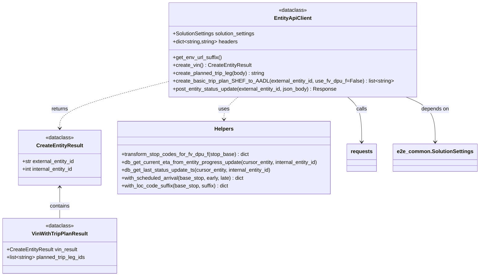

# Diagram: shipment_core/shipment_service/shipment_service/eta/e2e/entity_helper.py


> Auto-generated by Obscura crawlers

## Diagram 1



> SVG rendering failed for this diagram.

## Diagram 2

```mermaid
flowchart LR
    A[create_basic_trip_plan_SHEF_to_AADL(external_entity_id)] --> B{use_fv_dpu_f?}
    B -- yes --> C[transform stop bases with suffix _F]
    B -- no --> D[use original stop bases]
    C --> E[with_scheduled_arrival for origin, stops, destination]
    D --> E
    E --> F[assemble carrier_info]
    F --> G[create_planned_trip_leg: plant_to_port (Truck)]
    F --> H[create_planned_trip_leg: port_to_port (Ocean)]
    F --> I[create_planned_trip_leg: port_to_rail (Rail)]
    F --> J[create_planned_trip_leg: rail_to_dealer (Rail)]
    G --> K[return list of trip leg ids]
    H --> K
    I --> K
    J --> K

    subgraph StopBases
        SB1[SHEFFIELD_ORIGIN_BASE]
        SB2[PORT_OF_LONDON_STOP_BASE]
        SB3[PORT_OF_NEWARK_STOP_BASE]
        SB4[DETROIT_LOGISTICS_STOP_BASE]
        SB5[DETROIT_TRANSPORT_STOP_BASE]
        SB6[AADL_STOP_BASE]
    end

    D --> SB1 & SB2 & SB3 & SB4 & SB5 & SB6
    C --> SB1 & SB2 & SB3 & SB4 & SB5 & SB6
```

> SVG rendering failed for this diagram.
