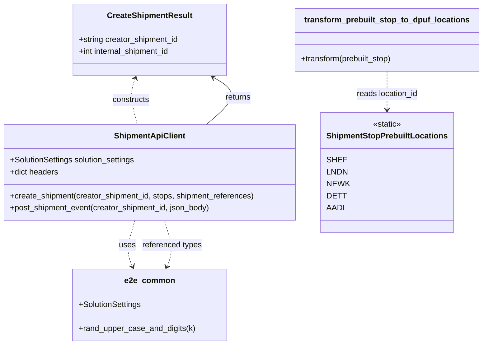

# Diagram: shipment_core/shipment_service/shipment_service/eta/e2e/shipments_helper.py


> Auto-generated by Obscura crawlers

## Diagram 1



### SVG

<svg id="container" width="969.3515625" xmlns="http://www.w3.org/2000/svg" class="classDiagram" height="692" viewBox="0 0 969.3515625 692" role="graphics-document document" aria-roledescription="class"><style>#container{font-family:"trebuchet ms",verdana,arial,sans-serif;font-size:16px;fill:#333;}@keyframes edge-animation-frame{from{stroke-dashoffset:0;}}@keyframes dash{to{stroke-dashoffset:0;}}#container .edge-animation-slow{stroke-dasharray:9,5!important;stroke-dashoffset:900;animation:dash 50s linear infinite;stroke-linecap:round;}#container .edge-animation-fast{stroke-dasharray:9,5!important;stroke-dashoffset:900;animation:dash 20s linear infinite;stroke-linecap:round;}#container .error-icon{fill:#552222;}#container .error-text{fill:#552222;stroke:#552222;}#container .edge-thickness-normal{stroke-width:1px;}#container .edge-thickness-thick{stroke-width:3.5px;}#container .edge-pattern-solid{stroke-dasharray:0;}#container .edge-thickness-invisible{stroke-width:0;fill:none;}#container .edge-pattern-dashed{stroke-dasharray:3;}#container .edge-pattern-dotted{stroke-dasharray:2;}#container .marker{fill:#333333;stroke:#333333;}#container .marker.cross{stroke:#333333;}#container svg{font-family:"trebuchet ms",verdana,arial,sans-serif;font-size:16px;}#container p{margin:0;}#container g.classGroup text{fill:#9370DB;stroke:none;font-family:"trebuchet ms",verdana,arial,sans-serif;font-size:10px;}#container g.classGroup text .title{font-weight:bolder;}#container .nodeLabel,#container .edgeLabel{color:#131300;}#container .edgeLabel .label rect{fill:#ECECFF;}#container .label text{fill:#131300;}#container .labelBkg{background:#ECECFF;}#container .edgeLabel .label span{background:#ECECFF;}#container .classTitle{font-weight:bolder;}#container .node rect,#container .node circle,#container .node ellipse,#container .node polygon,#container .node path{fill:#ECECFF;stroke:#9370DB;stroke-width:1px;}#container .divider{stroke:#9370DB;stroke-width:1;}#container g.clickable{cursor:pointer;}#container g.classGroup rect{fill:#ECECFF;stroke:#9370DB;}#container g.classGroup line{stroke:#9370DB;stroke-width:1;}#container .classLabel .box{stroke:none;stroke-width:0;fill:#ECECFF;opacity:0.5;}#container .classLabel .label{fill:#9370DB;font-size:10px;}#container .relation{stroke:#333333;stroke-width:1;fill:none;}#container .dashed-line{stroke-dasharray:3;}#container .dotted-line{stroke-dasharray:1 2;}#container #compositionStart,#container .composition{fill:#333333!important;stroke:#333333!important;stroke-width:1;}#container #compositionEnd,#container .composition{fill:#333333!important;stroke:#333333!important;stroke-width:1;}#container #dependencyStart,#container .dependency{fill:#333333!important;stroke:#333333!important;stroke-width:1;}#container #dependencyStart,#container .dependency{fill:#333333!important;stroke:#333333!important;stroke-width:1;}#container #extensionStart,#container .extension{fill:transparent!important;stroke:#333333!important;stroke-width:1;}#container #extensionEnd,#container .extension{fill:transparent!important;stroke:#333333!important;stroke-width:1;}#container #aggregationStart,#container .aggregation{fill:transparent!important;stroke:#333333!important;stroke-width:1;}#container #aggregationEnd,#container .aggregation{fill:transparent!important;stroke:#333333!important;stroke-width:1;}#container #lollipopStart,#container .lollipop{fill:#ECECFF!important;stroke:#333333!important;stroke-width:1;}#container #lollipopEnd,#container .lollipop{fill:#ECECFF!important;stroke:#333333!important;stroke-width:1;}#container .edgeTerminals{font-size:11px;line-height:initial;}#container .classTitleText{text-anchor:middle;font-size:18px;fill:#333;}#container .label-icon{display:inline-block;height:1em;overflow:visible;vertical-align:-0.125em;}#container .node .label-icon path{fill:currentColor;stroke:revert;stroke-width:revert;}#container :root{--mermaid-font-family:"trebuchet ms",verdana,arial,sans-serif;}</style><g><defs><marker id="container_class-aggregationStart" class="marker aggregation class" refX="18" refY="7" markerWidth="190" markerHeight="240" orient="auto"><path d="M 18,7 L9,13 L1,7 L9,1 Z"></path></marker></defs><defs><marker id="container_class-aggregationEnd" class="marker aggregation class" refX="1" refY="7" markerWidth="20" markerHeight="28" orient="auto"><path d="M 18,7 L9,13 L1,7 L9,1 Z"></path></marker></defs><defs><marker id="container_class-extensionStart" class="marker extension class" refX="18" refY="7" markerWidth="190" markerHeight="240" orient="auto"><path d="M 1,7 L18,13 V 1 Z"></path></marker></defs><defs><marker id="container_class-extensionEnd" class="marker extension class" refX="1" refY="7" markerWidth="20" markerHeight="28" orient="auto"><path d="M 1,1 V 13 L18,7 Z"></path></marker></defs><defs><marker id="container_class-compositionStart" class="marker composition class" refX="18" refY="7" markerWidth="190" markerHeight="240" orient="auto"><path d="M 18,7 L9,13 L1,7 L9,1 Z"></path></marker></defs><defs><marker id="container_class-compositionEnd" class="marker composition class" refX="1" refY="7" markerWidth="20" markerHeight="28" orient="auto"><path d="M 18,7 L9,13 L1,7 L9,1 Z"></path></marker></defs><defs><marker id="container_class-dependencyStart" class="marker dependency class" refX="6" refY="7" markerWidth="190" markerHeight="240" orient="auto"><path d="M 5,7 L9,13 L1,7 L9,1 Z"></path></marker></defs><defs><marker id="container_class-dependencyEnd" class="marker dependency class" refX="13" refY="7" markerWidth="20" markerHeight="28" orient="auto"><path d="M 18,7 L9,13 L14,7 L9,1 Z"></path></marker></defs><defs><marker id="container_class-lollipopStart" class="marker lollipop class" refX="13" refY="7" markerWidth="190" markerHeight="240" orient="auto"><circle stroke="black" fill="transparent" cx="7" cy="7" r="6"></circle></marker></defs><defs><marker id="container_class-lollipopEnd" class="marker lollipop class" refX="1" refY="7" markerWidth="190" markerHeight="240" orient="auto"><circle stroke="black" fill="transparent" cx="7" cy="7" r="6"></circle></marker></defs><g class="root"><g class="clusters"></g><g class="edgePaths"><path d="M413.869,250L425.65,239.833C437.43,229.667,460.991,209.333,463.338,193.514C465.684,177.695,446.815,166.389,437.38,160.736L427.946,155.084" id="id_ShipmentApiClient_CreateShipmentResult_1" class="edge-thickness-normal edge-pattern-solid relation" style=";;;" data-edge="true" data-et="edge" data-id="id_ShipmentApiClient_CreateShipmentResult_1" data-points="W3sieCI6NDEzLjg2ODk1NDAyMDcwMDY0LCJ5IjoyNTB9LHsieCI6NDg0LjU1MjczNDM3NSwieSI6MTg5fSx7IngiOjQyMi43OTg3NzQzNjkyNjYxLCJ5IjoxNTJ9XQ==" marker-end="url(#container_class-dependencyEnd)"></path><path d="M272.937,442L269.793,452.167C266.648,462.333,260.359,482.667,259.555,498.087C258.751,513.506,263.431,524.013,265.772,529.266L268.112,534.519" id="id_ShipmentApiClient_e2e_common_2" class="edge-thickness-normal edge-pattern-dashed relation" style=";;;" data-edge="true" data-et="edge" data-id="id_ShipmentApiClient_e2e_common_2" data-points="W3sieCI6MjcyLjkzNzAyNzI2OTEwODMsInkiOjQ0Mn0seyJ4IjoyNTQuMDcwMzEyNSwieSI6NTAzfSx7IngiOjI3MC41NTM1MDQ4NzM4NTMyLCJ5Ijo1NDB9XQ==" marker-end="url(#container_class-dependencyEnd)"></path><path d="M775.641,143L775.641,150.667C775.641,158.333,775.641,173.667,775.641,186.5C775.641,199.333,775.641,209.667,775.641,214.833L775.641,220" id="id_transform_prebuilt_stop_to_dpuf_locations_ShipmentStopPrebuiltLocations_3" class="edge-thickness-normal edge-pattern-dashed relation" style=";;;" data-edge="true" data-et="edge" data-id="id_transform_prebuilt_stop_to_dpuf_locations_ShipmentStopPrebuiltLocations_3" data-points="W3sieCI6Nzc1LjY0MDYyNSwieSI6MTQzfSx7IngiOjc3NS42NDA2MjUsInkiOjE4OX0seyJ4Ijo3NzUuNjQwNjI1LCJ5IjoyMjZ9XQ==" marker-end="url(#container_class-dependencyEnd)"></path><path d="M272.69,157.598L270.671,162.832C268.651,168.065,264.613,178.533,265.317,193.933C266.021,209.333,271.467,229.667,274.191,239.833L276.914,250" id="id_CreateShipmentResult_ShipmentApiClient_4" class="edge-thickness-normal edge-pattern-dashed relation" style=";;;" data-edge="true" data-et="edge" data-id="id_CreateShipmentResult_ShipmentApiClient_4" data-points="W3sieCI6Mjc0Ljg0OTY2MzEzMDczMzksInkiOjE1Mn0seyJ4IjoyNjAuNTc0MjE4NzUsInkiOjE4OX0seyJ4IjoyNzYuOTEzOTM4MDk3MTMzOCwieSI6MjUwfV0=" marker-start="url(#container_class-dependencyStart)"></path><path d="M337.146,534.519L339.486,529.266C341.826,524.013,346.507,513.506,345.703,498.087C344.899,482.667,338.61,462.333,335.465,452.167L332.321,442" id="id_e2e_common_ShipmentApiClient_5" class="edge-thickness-normal edge-pattern-dashed relation" style=";;;" data-edge="true" data-et="edge" data-id="id_e2e_common_ShipmentApiClient_5" data-points="W3sieCI6MzM0LjcwNDMwNzYyNjE0NjgsInkiOjU0MH0seyJ4IjozNTEuMTg3NSwieSI6NTAzfSx7IngiOjMzMi4zMjA3ODUyMzA4OTE3LCJ5Ijo0NDJ9XQ==" marker-start="url(#container_class-dependencyStart)"></path></g><g class="edgeLabels"><g class="edgeLabel" transform="translate(476.46126, 195.98293)"><g class="label" data-id="id_ShipmentApiClient_CreateShipmentResult_1" transform="translate(-26.265625, -12)"><foreignObject width="52.53125" height="24"><div xmlns="http://www.w3.org/1999/xhtml" class="labelBkg" style="display: table-cell; white-space: nowrap; line-height: 1.5; max-width: 200px; text-align: center;"><span class="edgeLabel"><p>returns</p></span></div></foreignObject></g></g><g class="edgeLabel" transform="translate(257.51938, 491.84844)"><g class="label" data-id="id_ShipmentApiClient_e2e_common_2" transform="translate(-16.4921875, -12)"><foreignObject width="32.984375" height="24"><div xmlns="http://www.w3.org/1999/xhtml" class="labelBkg" style="display: table-cell; white-space: nowrap; line-height: 1.5; max-width: 200px; text-align: center;"><span class="edgeLabel"><p>uses</p></span></div></foreignObject></g></g><g class="edgeLabel" transform="translate(775.640625, 189)"><g class="label" data-id="id_transform_prebuilt_stop_to_dpuf_locations_ShipmentStopPrebuiltLocations_3" transform="translate(-62.8984375, -12)"><foreignObject width="125.796875" height="24"><div xmlns="http://www.w3.org/1999/xhtml" class="labelBkg" style="display: table-cell; white-space: nowrap; line-height: 1.5; max-width: 200px; text-align: center;"><span class="edgeLabel"><p>reads location_id</p></span></div></foreignObject></g></g><g class="edgeLabel" transform="translate(263.61342, 200.34606)"><g class="label" data-id="id_CreateShipmentResult_ShipmentApiClient_4" transform="translate(-37.84375, -12)"><foreignObject width="75.6875" height="24"><div xmlns="http://www.w3.org/1999/xhtml" class="labelBkg" style="display: table-cell; white-space: nowrap; line-height: 1.5; max-width: 200px; text-align: center;"><span class="edgeLabel"><p>constructs</p></span></div></foreignObject></g></g><g class="edgeLabel" transform="translate(347.73843, 491.84844)"><g class="label" data-id="id_e2e_common_ShipmentApiClient_5" transform="translate(-60.625, -12)"><foreignObject width="121.25" height="24"><div xmlns="http://www.w3.org/1999/xhtml" class="labelBkg" style="display: table-cell; white-space: nowrap; line-height: 1.5; max-width: 200px; text-align: center;"><span class="edgeLabel"><p>referenced types</p></span></div></foreignObject></g></g></g><g class="nodes"><g class="node default" id="classId-CreateShipmentResult-0" transform="translate(302.62890625, 80)"><g class="basic label-container"><path d="M-154.609375 -72 L154.609375 -72 L154.609375 72 L-154.609375 72" stroke="none" stroke-width="0" fill="#ECECFF" style=""></path><path d="M-154.609375 -72 C-32.300286612730375 -72, 90.00880177453925 -72, 154.609375 -72 M-154.609375 -72 C-49.16753671004801 -72, 56.27430157990398 -72, 154.609375 -72 M154.609375 -72 C154.609375 -14.558774692046612, 154.609375 42.88245061590678, 154.609375 72 M154.609375 -72 C154.609375 -42.24527943160295, 154.609375 -12.490558863205898, 154.609375 72 M154.609375 72 C71.20379061978768 72, -12.201793760424636 72, -154.609375 72 M154.609375 72 C40.77223099002036 72, -73.06491301995928 72, -154.609375 72 M-154.609375 72 C-154.609375 25.48810039107086, -154.609375 -21.023799217858283, -154.609375 -72 M-154.609375 72 C-154.609375 24.496390176843377, -154.609375 -23.007219646313246, -154.609375 -72" stroke="#9370DB" stroke-width="1.3" fill="none" stroke-dasharray="0 0" style=""></path></g><g class="annotation-group text" transform="translate(0, -48)"></g><g class="label-group text" transform="translate(-81.796875, -48)"><g class="label" style="font-weight: bolder" transform="translate(0,-12)"><foreignObject width="163.59375" height="24"><div xmlns="http://www.w3.org/1999/xhtml" style="display: table-cell; white-space: nowrap; line-height: 1.5; max-width: 211px; text-align: center;"><span class="nodeLabel markdown-node-label" style=""><p>CreateShipmentResult</p></span></div></foreignObject></g></g><g class="members-group text" transform="translate(-142.609375, 0)"><g class="label" style="" transform="translate(0,-12)"><foreignObject width="203.421875" height="24"><div xmlns="http://www.w3.org/1999/xhtml" style="display: table-cell; white-space: nowrap; line-height: 1.5; max-width: 261px; text-align: center;"><span class="nodeLabel markdown-node-label" style=""><p>+string creator_shipment_id</p></span></div></foreignObject></g><g class="label" style="" transform="translate(0,12)"><foreignObject width="188" height="24"><div xmlns="http://www.w3.org/1999/xhtml" style="display: table-cell; white-space: nowrap; line-height: 1.5; max-width: 245px; text-align: center;"><span class="nodeLabel markdown-node-label" style=""><p>+int internal_shipment_id</p></span></div></foreignObject></g></g><g class="methods-group text" transform="translate(-142.609375, 72)"></g><g class="divider" style=""><path d="M-154.609375 -24 C-50.604266693768324 -24, 53.40084161246335 -24, 154.609375 -24 M-154.609375 -24 C-69.43362301847642 -24, 15.74212896304715 -24, 154.609375 -24" stroke="#9370DB" stroke-width="1.3" fill="none" stroke-dasharray="0 0" style=""></path></g><g class="divider" style=""><path d="M-154.609375 48 C-81.40100259324821 48, -8.192630186496416 48, 154.609375 48 M-154.609375 48 C-51.89725557611321 48, 50.81486384777358 48, 154.609375 48" stroke="#9370DB" stroke-width="1.3" fill="none" stroke-dasharray="0 0" style=""></path></g></g><g class="node default" id="classId-ShipmentApiClient-1" transform="translate(302.62890625, 346)"><g class="basic label-container"><path d="M-294.62890625 -96 L294.62890625 -96 L294.62890625 96 L-294.62890625 96" stroke="none" stroke-width="0" fill="#ECECFF" style=""></path><path d="M-294.62890625 -96 C-95.70711066026283 -96, 103.21468492947434 -96, 294.62890625 -96 M-294.62890625 -96 C-114.32958287784055 -96, 65.9697404943189 -96, 294.62890625 -96 M294.62890625 -96 C294.62890625 -48.83225199928524, 294.62890625 -1.6645039985704813, 294.62890625 96 M294.62890625 -96 C294.62890625 -46.667080999853994, 294.62890625 2.6658380002920126, 294.62890625 96 M294.62890625 96 C106.34763418490354 96, -81.93363788019292 96, -294.62890625 96 M294.62890625 96 C128.0410392632853 96, -38.546827723429374 96, -294.62890625 96 M-294.62890625 96 C-294.62890625 27.275162027005848, -294.62890625 -41.449675945988304, -294.62890625 -96 M-294.62890625 96 C-294.62890625 26.388922474971736, -294.62890625 -43.22215505005653, -294.62890625 -96" stroke="#9370DB" stroke-width="1.3" fill="none" stroke-dasharray="0 0" style=""></path></g><g class="annotation-group text" transform="translate(0, -72)"></g><g class="label-group text" transform="translate(-68.1328125, -72)"><g class="label" style="font-weight: bolder" transform="translate(0,-12)"><foreignObject width="136.265625" height="24"><div xmlns="http://www.w3.org/1999/xhtml" style="display: table-cell; white-space: nowrap; line-height: 1.5; max-width: 185px; text-align: center;"><span class="nodeLabel markdown-node-label" style=""><p>ShipmentApiClient</p></span></div></foreignObject></g></g><g class="members-group text" transform="translate(-282.62890625, -24)"><g class="label" style="" transform="translate(0,-12)"><foreignObject width="256.6875" height="24"><div xmlns="http://www.w3.org/1999/xhtml" style="display: table-cell; white-space: nowrap; line-height: 1.5; max-width: 314px; text-align: center;"><span class="nodeLabel markdown-node-label" style=""><p>+SolutionSettings solution_settings</p></span></div></foreignObject></g><g class="label" style="" transform="translate(0,12)"><foreignObject width="98.078125" height="24"><div xmlns="http://www.w3.org/1999/xhtml" style="display: table-cell; white-space: nowrap; line-height: 1.5; max-width: 155px; text-align: center;"><span class="nodeLabel markdown-node-label" style=""><p>+dict headers</p></span></div></foreignObject></g></g><g class="methods-group text" transform="translate(-282.62890625, 48)"><g class="label" style="" transform="translate(0,-12)"><foreignObject width="497.125" height="24"><div xmlns="http://www.w3.org/1999/xhtml" style="display: table-cell; white-space: nowrap; line-height: 1.5; max-width: 554px; text-align: center;"><span class="nodeLabel markdown-node-label" style=""><p>+create_shipment(creator_shipment_id, stops, shipment_references)</p></span></div></foreignObject></g><g class="label" style="" transform="translate(0,12)"><foreignObject width="408.46875" height="24"><div xmlns="http://www.w3.org/1999/xhtml" style="display: table-cell; white-space: nowrap; line-height: 1.5; max-width: 466px; text-align: center;"><span class="nodeLabel markdown-node-label" style=""><p>+post_shipment_event(creator_shipment_id, json_body)</p></span></div></foreignObject></g></g><g class="divider" style=""><path d="M-294.62890625 -48 C-81.27615031198641 -48, 132.07660562602717 -48, 294.62890625 -48 M-294.62890625 -48 C-158.76916845708348 -48, -22.909430664166962 -48, 294.62890625 -48" stroke="#9370DB" stroke-width="1.3" fill="none" stroke-dasharray="0 0" style=""></path></g><g class="divider" style=""><path d="M-294.62890625 24 C-169.22459898095872 24, -43.820291711917406 24, 294.62890625 24 M-294.62890625 24 C-161.09813968884853 24, -27.567373127697067 24, 294.62890625 24" stroke="#9370DB" stroke-width="1.3" fill="none" stroke-dasharray="0 0" style=""></path></g></g><g class="node default" id="classId-ShipmentStopPrebuiltLocations-2" transform="translate(775.640625, 346)"><g class="basic label-container"><path d="M-128.3828125 -120 L128.3828125 -120 L128.3828125 120 L-128.3828125 120" stroke="none" stroke-width="0" fill="#ECECFF" style=""></path><path d="M-128.3828125 -120 C-29.48398033421313 -120, 69.41485183157374 -120, 128.3828125 -120 M-128.3828125 -120 C-51.49205972734714 -120, 25.39869304530572 -120, 128.3828125 -120 M128.3828125 -120 C128.3828125 -58.5964191904253, 128.3828125 2.8071616191493973, 128.3828125 120 M128.3828125 -120 C128.3828125 -57.994441283162715, 128.3828125 4.0111174336745705, 128.3828125 120 M128.3828125 120 C70.46343162013144 120, 12.544050740262904 120, -128.3828125 120 M128.3828125 120 C35.1068796226058 120, -58.169053254788395 120, -128.3828125 120 M-128.3828125 120 C-128.3828125 42.49138814802268, -128.3828125 -35.01722370395464, -128.3828125 -120 M-128.3828125 120 C-128.3828125 50.35063673201364, -128.3828125 -19.29872653597272, -128.3828125 -120" stroke="#9370DB" stroke-width="1.3" fill="none" stroke-dasharray="0 0" style=""></path></g><g class="annotation-group text" transform="translate(-29.0234375, -96)"><g class="label" style="" transform="translate(0,-12)"><foreignObject width="58.046875" height="24"><div xmlns="http://www.w3.org/1999/xhtml" style="display: table-cell; white-space: nowrap; line-height: 1.5; max-width: 108px; text-align: center;"><span class="nodeLabel markdown-node-label" style=""><p>«static»</p></span></div></foreignObject></g></g><g class="label-group text" transform="translate(-116.3828125, -72)"><g class="label" style="font-weight: bolder" transform="translate(0,-12)"><foreignObject width="232.765625" height="24"><div xmlns="http://www.w3.org/1999/xhtml" style="display: table-cell; white-space: nowrap; line-height: 1.5; max-width: 280px; text-align: center;"><span class="nodeLabel markdown-node-label" style=""><p>ShipmentStopPrebuiltLocations</p></span></div></foreignObject></g></g><g class="members-group text" transform="translate(-116.3828125, -24)"><g class="label" style="" transform="translate(0,-12)"><foreignObject width="36.03125" height="24"><div xmlns="http://www.w3.org/1999/xhtml" style="display: table-cell; white-space: nowrap; line-height: 1.5; max-width: 86px; text-align: center;"><span class="nodeLabel markdown-node-label" style=""><p>SHEF</p></span></div></foreignObject></g><g class="label" style="" transform="translate(0,12)"><foreignObject width="40.140625" height="24"><div xmlns="http://www.w3.org/1999/xhtml" style="display: table-cell; white-space: nowrap; line-height: 1.5; max-width: 90px; text-align: center;"><span class="nodeLabel markdown-node-label" style=""><p>LNDN</p></span></div></foreignObject></g><g class="label" style="" transform="translate(0,36)"><foreignObject width="42.140625" height="24"><div xmlns="http://www.w3.org/1999/xhtml" style="display: table-cell; white-space: nowrap; line-height: 1.5; max-width: 93px; text-align: center;"><span class="nodeLabel markdown-node-label" style=""><p>NEWK</p></span></div></foreignObject></g><g class="label" style="" transform="translate(0,60)"><foreignObject width="35.421875" height="24"><div xmlns="http://www.w3.org/1999/xhtml" style="display: table-cell; white-space: nowrap; line-height: 1.5; max-width: 86px; text-align: center;"><span class="nodeLabel markdown-node-label" style=""><p>DETT</p></span></div></foreignObject></g><g class="label" style="" transform="translate(0,84)"><foreignObject width="36.609375" height="24"><div xmlns="http://www.w3.org/1999/xhtml" style="display: table-cell; white-space: nowrap; line-height: 1.5; max-width: 87px; text-align: center;"><span class="nodeLabel markdown-node-label" style=""><p>AADL</p></span></div></foreignObject></g></g><g class="methods-group text" transform="translate(-116.3828125, 120)"></g><g class="divider" style=""><path d="M-128.3828125 -48 C-61.35701036679653 -48, 5.66879176640694 -48, 128.3828125 -48 M-128.3828125 -48 C-67.52590728029682 -48, -6.669002060593655 -48, 128.3828125 -48" stroke="#9370DB" stroke-width="1.3" fill="none" stroke-dasharray="0 0" style=""></path></g><g class="divider" style=""><path d="M-128.3828125 96 C-57.51470604017467 96, 13.353400419650654 96, 128.3828125 96 M-128.3828125 96 C-71.91593195451009 96, -15.449051409020171 96, 128.3828125 96" stroke="#9370DB" stroke-width="1.3" fill="none" stroke-dasharray="0 0" style=""></path></g></g><g class="node default" id="classId-e2e_common-3" transform="translate(302.62890625, 612)"><g class="basic label-container"><path d="M-152.5546875 -72 L152.5546875 -72 L152.5546875 72 L-152.5546875 72" stroke="none" stroke-width="0" fill="#ECECFF" style=""></path><path d="M-152.5546875 -72 C-47.54582658015413 -72, 57.463034339691745 -72, 152.5546875 -72 M-152.5546875 -72 C-76.13721042859306 -72, 0.2802666428138707 -72, 152.5546875 -72 M152.5546875 -72 C152.5546875 -22.343047307045367, 152.5546875 27.313905385909266, 152.5546875 72 M152.5546875 -72 C152.5546875 -33.90878716187393, 152.5546875 4.182425676252137, 152.5546875 72 M152.5546875 72 C67.49589155744194 72, -17.562904385116127 72, -152.5546875 72 M152.5546875 72 C75.16153927431944 72, -2.2316089513611246 72, -152.5546875 72 M-152.5546875 72 C-152.5546875 20.40354294985766, -152.5546875 -31.192914100284682, -152.5546875 -72 M-152.5546875 72 C-152.5546875 27.4551184729444, -152.5546875 -17.089763054111202, -152.5546875 -72" stroke="#9370DB" stroke-width="1.3" fill="none" stroke-dasharray="0 0" style=""></path></g><g class="annotation-group text" transform="translate(0, -48)"></g><g class="label-group text" transform="translate(-47.640625, -48)"><g class="label" style="font-weight: bolder" transform="translate(0,-12)"><foreignObject width="95.28125" height="24"><div xmlns="http://www.w3.org/1999/xhtml" style="display: table-cell; white-space: nowrap; line-height: 1.5; max-width: 145px; text-align: center;"><span class="nodeLabel markdown-node-label" style=""><p>e2e_common</p></span></div></foreignObject></g></g><g class="members-group text" transform="translate(-140.5546875, 0)"><g class="label" style="" transform="translate(0,-12)"><foreignObject width="126.984375" height="24"><div xmlns="http://www.w3.org/1999/xhtml" style="display: table-cell; white-space: nowrap; line-height: 1.5; max-width: 184px; text-align: center;"><span class="nodeLabel markdown-node-label" style=""><p>+SolutionSettings</p></span></div></foreignObject></g></g><g class="methods-group text" transform="translate(-140.5546875, 48)"><g class="label" style="" transform="translate(0,-12)"><foreignObject width="233.46875" height="24"><div xmlns="http://www.w3.org/1999/xhtml" style="display: table-cell; white-space: nowrap; line-height: 1.5; max-width: 291px; text-align: center;"><span class="nodeLabel markdown-node-label" style=""><p>+rand_upper_case_and_digits(k)</p></span></div></foreignObject></g></g><g class="divider" style=""><path d="M-152.5546875 -24 C-90.21260070007617 -24, -27.870513900152332 -24, 152.5546875 -24 M-152.5546875 -24 C-74.767260820497 -24, 3.020165859005999 -24, 152.5546875 -24" stroke="#9370DB" stroke-width="1.3" fill="none" stroke-dasharray="0 0" style=""></path></g><g class="divider" style=""><path d="M-152.5546875 24 C-80.36005122081562 24, -8.16541494163124 24, 152.5546875 24 M-152.5546875 24 C-43.75849300391786 24, 65.03770149216427 24, 152.5546875 24" stroke="#9370DB" stroke-width="1.3" fill="none" stroke-dasharray="0 0" style=""></path></g></g><g class="node default" id="classId-transform_prebuilt_stop_to_dpuf_locations-4" transform="translate(775.640625, 80)"><g class="basic label-container"><path d="M-185.7109375 -63 L185.7109375 -63 L185.7109375 63 L-185.7109375 63" stroke="none" stroke-width="0" fill="#ECECFF" style=""></path><path d="M-185.7109375 -63 C-102.89796748079685 -63, -20.0849974615937 -63, 185.7109375 -63 M-185.7109375 -63 C-64.27041634862222 -63, 57.17010480275556 -63, 185.7109375 -63 M185.7109375 -63 C185.7109375 -16.813528585081094, 185.7109375 29.37294282983781, 185.7109375 63 M185.7109375 -63 C185.7109375 -34.98688314487171, 185.7109375 -6.973766289743416, 185.7109375 63 M185.7109375 63 C83.07383491345412 63, -19.563267673091758 63, -185.7109375 63 M185.7109375 63 C107.10020360344731 63, 28.489469706894624 63, -185.7109375 63 M-185.7109375 63 C-185.7109375 13.236296726441331, -185.7109375 -36.52740654711734, -185.7109375 -63 M-185.7109375 63 C-185.7109375 15.03914564061293, -185.7109375 -32.92170871877414, -185.7109375 -63" stroke="#9370DB" stroke-width="1.3" fill="none" stroke-dasharray="0 0" style=""></path></g><g class="annotation-group text" transform="translate(0, -39)"></g><g class="label-group text" transform="translate(-159.875, -39)"><g class="label" style="font-weight: bolder" transform="translate(0,-12)"><foreignObject width="319.75" height="24"><div xmlns="http://www.w3.org/1999/xhtml" style="display: table-cell; white-space: nowrap; line-height: 1.5; max-width: 366px; text-align: center;"><span class="nodeLabel markdown-node-label" style=""><p>transform_prebuilt_stop_to_dpuf_locations</p></span></div></foreignObject></g></g><g class="members-group text" transform="translate(-173.7109375, 9)"></g><g class="methods-group text" transform="translate(-173.7109375, 39)"><g class="label" style="" transform="translate(0,-12)"><foreignObject width="187.546875" height="24"><div xmlns="http://www.w3.org/1999/xhtml" style="display: table-cell; white-space: nowrap; line-height: 1.5; max-width: 245px; text-align: center;"><span class="nodeLabel markdown-node-label" style=""><p>+transform(prebuilt_stop)</p></span></div></foreignObject></g></g><g class="divider" style=""><path d="M-185.7109375 -15 C-63.8806874245919 -15, 57.949562650816205 -15, 185.7109375 -15 M-185.7109375 -15 C-105.5683235282112 -15, -25.42570955642239 -15, 185.7109375 -15" stroke="#9370DB" stroke-width="1.3" fill="none" stroke-dasharray="0 0" style=""></path></g><g class="divider" style=""><path d="M-185.7109375 9 C-77.26368698508269 9, 31.18356352983463 9, 185.7109375 9 M-185.7109375 9 C-62.75594851279192 9, 60.199040474416165 9, 185.7109375 9" stroke="#9370DB" stroke-width="1.3" fill="none" stroke-dasharray="0 0" style=""></path></g></g></g></g></g></svg>

## Diagram 2

```mermaid
flowchart LR
    Start([Start])
    CallCreate[/"create_shipment(creator_shipment_id, stops, shipment_references)"/]
    BuildReq[Prepare request payload and headers\ninclude X-WSS-fvShipmentId]
    PUT[requests.put to /ws/rest/v2/tl/shipment]
    APIResp[(HTTP response)]
    Check200{response.status_code == 200}
    ParseJSON[resp_json = response.json()]
    ExtractCreator[creator_shipment_id := resp_json.shipment.creator_shipment_id]
    ExtractInternal[id := resp_json.shipment.id]
    ReturnResult[Return CreateShipmentResult(creator_shipment_id, internal_shipment_id)]
    AssertFail[/assert (raise) if status != 200/]

    Start --> CallCreate --> BuildReq --> PUT --> APIResp --> Check200
    Check200 -- yes --> ParseJSON --> ExtractCreator --> ExtractInternal --> ReturnResult --> End([End])
    Check200 -- no --> AssertFail --> End
```

> SVG rendering failed for this diagram.

## Diagram 3

```mermaid
flowchart LR
    StartEvent([Start])
    CallPost[/"post_shipment_event(creator_shipment_id, json_body)"/]
    BuildPost[Prepare POST headers with X-WSS-fvShipmentId]
    POST[requests.post to /ws/rest/v2/tl/shipment/event]
    PostResp[(HTTP response)]
    Check201{response.status_code == 201}
    ReturnResp[Return response]

    StartEvent --> CallPost --> BuildPost --> POST --> PostResp --> Check201
    Check201 -- yes --> ReturnResp --> End2([End])
    Check201 -- no --> AssertPostFail[/assert (raise) if status != 201/] --> End2
```

> SVG rendering failed for this diagram.
