# Diagram: shipment_core/shipment_service/shipment_service/eta/e2e/test_eta_milestone_update.py

> Auto-generated by Obscura crawlers

## Mermaid

```mermaid
classDiagram
    class test_blacklisted_milestones_clear_expiration {
        +entity_api_test_client: EntityApiClient
        +vin_with_basic_trip_plan: VinWithTripPlanResult
        +db_conn_entity: FvDatabaseConnector
    }
    class test_sequential_milestones_update {
        +entity_api_test_client: EntityApiClient
        +vin_with_basic_trip_plan: VinWithTripPlanResult
        +db_conn_entity: FvDatabaseConnector
    }
    class test_milestone_doesnt_overwrite_newer_shipments_progress_update {
        +shipment_api_test_client: ShipmentApiClient
        +entity_api_test_client: EntityApiClient
        +vin_with_basic_trip_plan: VinWithTripPlanResult
        +db_conn_entity: FvDatabaseConnector
    }
    class test_rail_delivery_causes_eta_update {
        +shipment_api_test_client: ShipmentApiClient
        +entity_api_test_client: EntityApiClient
        +vin_with_basic_trip_plan: VinWithTripPlanResult
        +db_conn_entity: FvDatabaseConnector
    }

    class EntityApiClient {
        +post_entity_status_update(external_entity_id, json_body)
    }
    class ShipmentApiClient {
        +create_shipment(creator_shipment_id, stops, shipment_references)
        +post_shipment_event(creator_shipment_id, json_body)
    }
    class VinWithTripPlanResult {
        +vin_result
    }
    class FvDatabaseConnector {
        +get_cursor()
    }
    class ExpirationDAO {
        +find_active_expired_record_for_internal_entity_id(internal_id)
    }
    class helpers {
        +adapt_dt_with_tz(dt_str)
        +db_get_current_eta_from_entity_progress_update(cursor_entity, internal_entity_id)
        +db_get_last_status_update_ts(cursor_entity, internal_entity_id)
        +assert_truthy_eventually(callable, times, interval_seconds)
        +generate_creator_shipment_id()
        +get_shipment_stop_obj(location, early_arrival, late_arrival, is_load)
    }

    %% Associations
    test_blacklisted_milestones_clear_expiration --> EntityApiClient : uses
    test_blacklisted_milestones_clear_expiration --> VinWithTripPlanResult : reads
    test_blacklisted_milestones_clear_expiration --> FvDatabaseConnector : uses
    test_blacklisted_milestones_clear_expiration --> ExpirationDAO : instantiates

    test_sequential_milestones_update --> EntityApiClient : uses
    test_sequential_milestones_update --> VinWithTripPlanResult : reads
    test_sequential_milestones_update --> FvDatabaseConnector : uses
    test_sequential_milestones_update --> helpers : calls adapt_dt_with_tz, db_get_*

    test_milestone_doesnt_overwrite_newer_shipments_progress_update --> ShipmentApiClient : uses
    test_milestone_doesnt_overwrite_newer_shipments_progress_update --> EntityApiClient : uses
    test_milestone_doesnt_overwrite_newer_shipments_progress_update --> helpers : calls generate_creator_shipment_id, db_get_*, get_shipment_stop_obj

    test_rail_delivery_causes_eta_update --> ShipmentApiClient : uses
    test_rail_delivery_causes_eta_update --> EntityApiClient : uses
    test_rail_delivery_causes_eta_update --> helpers : calls db_get_current_eta_from_entity_progress_update

    EntityApiClient ..> VinWithTripPlanResult : posts status for
    ShipmentApiClient ..> VinWithTripPlanResult : references XVIN
    ExpirationDAO --> FvDatabaseConnector : requires
    helpers --> FvDatabaseConnector : uses cursor for db_get_* functions

    %% Notes as relationships for timeline-like flow
    test_sequential_milestones_update --> ExpirationDAO : interacts (via DB) 
    test_milestone_doesnt_overwrite_newer_shipments_progress_update --> ShipmentApiClient : posts shipment events
    test_milestone_doesnt_overwrite_newer_shipments_progress_update --> EntityApiClient : posts status updates
```

### SVG

<svg id="container" width="3452.453125" xmlns="http://www.w3.org/2000/svg" class="classDiagram" height="824" viewBox="0 0 3452.453125 824" role="graphics-document document" aria-roledescription="class"><g><defs><marker id="container_class-aggregationStart" class="marker aggregation class" refX="18" refY="7" markerWidth="190" markerHeight="240" orient="auto"><path d="M 18,7 L9,13 L1,7 L9,1 Z"></path></marker></defs><defs><marker id="container_class-aggregationEnd" class="marker aggregation class" refX="1" refY="7" markerWidth="20" markerHeight="28" orient="auto"><path d="M 18,7 L9,13 L1,7 L9,1 Z"></path></marker></defs><defs><marker id="container_class-extensionStart" class="marker extension class" refX="18" refY="7" markerWidth="190" markerHeight="240" orient="auto"><path d="M 1,7 L18,13 V 1 Z"></path></marker></defs><defs><marker id="container_class-extensionEnd" class="marker extension class" refX="1" refY="7" markerWidth="20" markerHeight="28" orient="auto"><path d="M 1,1 V 13 L18,7 Z"></path></marker></defs><defs><marker id="container_class-compositionStart" class="marker composition class" refX="18" refY="7" markerWidth="190" markerHeight="240" orient="auto"><path d="M 18,7 L9,13 L1,7 L9,1 Z"></path></marker></defs><defs><marker id="container_class-compositionEnd" class="marker composition class" refX="1" refY="7" markerWidth="20" markerHeight="28" orient="auto"><path d="M 18,7 L9,13 L1,7 L9,1 Z"></path></marker></defs><defs><marker id="container_class-dependencyStart" class="marker dependency class" refX="6" refY="7" markerWidth="190" markerHeight="240" orient="auto"><path d="M 5,7 L9,13 L1,7 L9,1 Z"></path></marker></defs><defs><marker id="container_class-dependencyEnd" class="marker dependency class" refX="13" refY="7" markerWidth="20" markerHeight="28" orient="auto"><path d="M 18,7 L9,13 L14,7 L9,1 Z"></path></marker></defs><defs><marker id="container_class-lollipopStart" class="marker lollipop class" refX="13" refY="7" markerWidth="190" markerHeight="240" orient="auto"><circle stroke="black" fill="transparent" cx="7" cy="7" r="6"></circle></marker></defs><defs><marker id="container_class-lollipopEnd" class="marker lollipop class" refX="1" refY="7" markerWidth="190" markerHeight="240" orient="auto"><circle stroke="black" fill="transparent" cx="7" cy="7" r="6"></circle></marker></defs><g class="root"><g class="clusters"></g><g class="edgePaths"><path d="M2861.961,131.373L2625.883,154.978C2389.805,178.582,1917.648,225.791,1637.887,271.117C1358.126,316.443,1270.759,359.886,1227.076,381.607L1183.392,403.329" id="id_test_blacklisted_milestones_clear_expiration_EntityApiClient_1" class="edge-thickness-normal edge-pattern-solid relation" style=";;;" data-edge="true" data-et="edge" data-id="id_test_blacklisted_milestones_clear_expiration_EntityApiClient_1" data-points="W3sieCI6Mjg2MS45NjA5Mzc1LCJ5IjoxMzEuMzczNDIwOTY4NzAzNjR9LHsieCI6MTQ0NS40OTIxODc1LCJ5IjoyNzN9LHsieCI6MTE3OC4wMTk3NDA1MTMzOTMsInkiOjQwNn1d" marker-end="url(#container_class-dependencyEnd)"></path><path d="M2861.961,135.727L2664.535,158.605C2467.109,181.484,2072.257,227.242,1874.83,282.788C1677.404,338.333,1677.404,403.667,1677.404,465C1677.404,526.333,1677.404,583.667,1624.272,626.56C1571.139,669.454,1464.874,697.908,1411.741,712.135L1358.608,726.362" id="id_test_blacklisted_milestones_clear_expiration_VinWithTripPlanResult_2" class="edge-thickness-normal edge-pattern-solid relation" style=";;;" data-edge="true" data-et="edge" data-id="id_test_blacklisted_milestones_clear_expiration_VinWithTripPlanResult_2" data-points="W3sieCI6Mjg2MS45NjA5Mzc1LCJ5IjoxMzUuNzI2NTAxMTc1MjI1ODV9LHsieCI6MTY3Ny40MDQyOTY4NzUsInkiOjI3M30seyJ4IjoxNjc3LjQwNDI5Njg3NSwieSI6NDY5fSx7IngiOjE2NzcuNDA0Mjk2ODc1LCJ5Ijo2NDF9LHsieCI6MTM1Mi44MTI1LCJ5Ijo3MjcuOTEzODkxMDgwOTI1OX1d" marker-end="url(#container_class-dependencyEnd)"></path><path d="M3280.983,188L3305.479,202.167C3329.976,216.333,3378.968,244.667,3403.465,291.5C3427.961,338.333,3427.961,403.667,3427.961,465C3427.961,526.333,3427.961,583.667,3389.591,625.166C3351.22,666.665,3274.48,692.331,3236.109,705.163L3197.739,717.996" id="id_test_blacklisted_milestones_clear_expiration_FvDatabaseConnector_3" class="edge-thickness-normal edge-pattern-solid relation" style=";;;" data-edge="true" data-et="edge" data-id="id_test_blacklisted_milestones_clear_expiration_FvDatabaseConnector_3" data-points="W3sieCI6MzI4MC45ODMwODA2MjEzMDE3LCJ5IjoxODh9LHsieCI6MzQyNy45NjA5Mzc1LCJ5IjoyNzN9LHsieCI6MzQyNy45NjA5Mzc1LCJ5Ijo0Njl9LHsieCI6MzQyNy45NjA5Mzc1LCJ5Ijo2NDF9LHsieCI6MzE5Mi4wNDg4MjgxMjUsInkiOjcxOS44OTkyNDgyMjU1NDM5fV0=" marker-end="url(#container_class-dependencyEnd)"></path><path d="M3135.734,188L3135.734,202.167C3135.734,216.333,3135.734,244.667,3121.812,280.163C3107.889,315.659,3080.044,358.317,3066.122,379.646L3052.199,400.976" id="id_test_blacklisted_milestones_clear_expiration_ExpirationDAO_4" class="edge-thickness-normal edge-pattern-solid relation" style=";;;" data-edge="true" data-et="edge" data-id="id_test_blacklisted_milestones_clear_expiration_ExpirationDAO_4" data-points="W3sieCI6MzEzNS43MzQzNzUsInkiOjE4OH0seyJ4IjozMTM1LjczNDM3NSwieSI6MjczfSx7IngiOjMwNDguOTE5NjQyODU3MTQyNywieSI6NDA2fV0=" marker-end="url(#container_class-dependencyEnd)"></path><path d="M2264.768,141.518L2114.976,163.432C1965.184,185.345,1665.6,229.173,1481.066,272.724C1296.533,316.276,1227.05,359.552,1192.308,381.19L1157.567,402.828" id="id_test_sequential_milestones_update_EntityApiClient_5" class="edge-thickness-normal edge-pattern-solid relation" style=";;;" data-edge="true" data-et="edge" data-id="id_test_sequential_milestones_update_EntityApiClient_5" data-points="W3sieCI6MjI2NC43Njc1NzgxMjUsInkiOjE0MS41MTgwOTMxNDgwNTM5fSx7IngiOjEzNjYuMDE1NjI1LCJ5IjoyNzN9LHsieCI6MTE1Mi40NzM3MDI1NjY5NjQyLCJ5Ijo0MDZ9XQ==" marker-end="url(#container_class-dependencyEnd)"></path><path d="M2264.768,151.953L2156.871,172.127C2048.975,192.302,1833.182,232.651,1725.285,285.492C1617.389,338.333,1617.389,403.667,1617.389,465C1617.389,526.333,1617.389,583.667,1574.247,625.82C1531.106,667.974,1444.822,694.947,1401.681,708.434L1358.539,721.921" id="id_test_sequential_milestones_update_VinWithTripPlanResult_6" class="edge-thickness-normal edge-pattern-solid relation" style=";;;" data-edge="true" data-et="edge" data-id="id_test_sequential_milestones_update_VinWithTripPlanResult_6" data-points="W3sieCI6MjI2NC43Njc1NzgxMjUsInkiOjE1MS45NTI1NTAzMjgwMjg5Nn0seyJ4IjoxNjE3LjM4ODY3MTg3NSwieSI6MjczfSx7IngiOjE2MTcuMzg4NjcxODc1LCJ5Ijo0Njl9LHsieCI6MTYxNy4zODg2NzE4NzUsInkiOjY0MX0seyJ4IjoxMzUyLjgxMjUsInkiOjcyMy43MTE1MTU1MDE3NDE4fV0=" marker-end="url(#container_class-dependencyEnd)"></path><path d="M2777.682,157.816L2869.166,177.013C2960.65,196.211,3143.618,234.605,3235.102,286.469C3326.586,338.333,3326.586,403.667,3326.586,465C3326.586,526.333,3326.586,583.667,3305.065,622.656C3283.544,661.645,3240.501,682.289,3218.98,692.612L3197.459,702.934" id="id_test_sequential_milestones_update_FvDatabaseConnector_7" class="edge-thickness-normal edge-pattern-solid relation" style=";;;" data-edge="true" data-et="edge" data-id="id_test_sequential_milestones_update_FvDatabaseConnector_7" data-points="W3sieCI6Mjc3Ny42ODE2NDA2MjUsInkiOjE1Ny44MTU4OTIwMzIxNTc1NH0seyJ4IjozMzI2LjU4NTkzNzUsInkiOjI3M30seyJ4IjozMzI2LjU4NTkzNzUsInkiOjQ2OX0seyJ4IjozMzI2LjU4NTkzNzUsInkiOjY0MX0seyJ4IjozMTkyLjA0ODgyODEyNSwieSI6NzA1LjUyOTAxOTYzMDgwMzh9XQ==" marker-end="url(#container_class-dependencyEnd)"></path><path d="M2521.225,188L2521.225,202.167C2521.225,216.333,2521.225,244.667,2504.969,270.42C2488.714,296.172,2456.203,319.345,2439.948,330.931L2423.693,342.517" id="id_test_sequential_milestones_update_helpers_8" class="edge-thickness-normal edge-pattern-solid relation" style=";;;" data-edge="true" data-et="edge" data-id="id_test_sequential_milestones_update_helpers_8" data-points="W3sieCI6MjUyMS4yMjQ2MDkzNzUsInkiOjE4OH0seyJ4IjoyNTIxLjIyNDYwOTM3NSwieSI6MjczfSx7IngiOjI0MTguODA2OTU5NTAyNTUxLCJ5IjozNDZ9XQ==" marker-end="url(#container_class-dependencyEnd)"></path><path d="M593.46,200L585.388,212.167C577.316,224.333,561.172,248.667,528.936,280.371C496.701,312.076,448.375,351.152,424.212,370.69L400.049,390.227" id="id_test_milestone_doesnt_overwrite_newer_shipments_progress_update_ShipmentApiClient_9" class="edge-thickness-normal edge-pattern-solid relation" style=";;;" data-edge="true" data-et="edge" data-id="id_test_milestone_doesnt_overwrite_newer_shipments_progress_update_ShipmentApiClient_9" data-points="W3sieCI6NTkzLjQ2MDAzNjA1NzY5MjMsInkiOjIwMH0seyJ4Ijo1NDUuMDI3MzQzNzUsInkiOjI3M30seyJ4IjozOTUuMzgzNDEwMzk1NDA4MiwieSI6Mzk0fV0=" marker-end="url(#container_class-dependencyEnd)"></path><path d="M976.586,186.308L1032.66,200.757C1088.734,215.206,1200.883,244.103,1228.159,280.119C1255.436,316.134,1197.841,359.269,1169.043,380.836L1140.245,402.403" id="id_test_milestone_doesnt_overwrite_newer_shipments_progress_update_EntityApiClient_10" class="edge-thickness-normal edge-pattern-solid relation" style=";;;" data-edge="true" data-et="edge" data-id="id_test_milestone_doesnt_overwrite_newer_shipments_progress_update_EntityApiClient_10" data-points="W3sieCI6OTc2LjU4NTkzNzUsInkiOjE4Ni4zMDgyOTkzMzU5MzR9LHsieCI6MTMxMy4wMzEyNSwieSI6MjczfSx7IngiOjExMzUuNDQzMDEwNjAyNjc4NywieSI6NDA2fV0=" marker-end="url(#container_class-dependencyEnd)"></path><path d="M976.586,137.125L1194.962,159.771C1413.338,182.417,1850.09,227.708,2066.148,261.542C2282.207,295.375,2277.572,317.75,2275.254,328.937L2272.937,340.125" id="id_test_milestone_doesnt_overwrite_newer_shipments_progress_update_helpers_11" class="edge-thickness-normal edge-pattern-solid relation" style=";;;" data-edge="true" data-et="edge" data-id="id_test_milestone_doesnt_overwrite_newer_shipments_progress_update_helpers_11" data-points="W3sieCI6OTc2LjU4NTkzNzUsInkiOjEzNy4xMjU0OTk2MDk4OTk4fSx7IngiOjIyODYuODQxNzk2ODc1LCJ5IjoyNzN9LHsieCI6MjI3MS43MTk3ODYzNTIwNDEsInkiOjM0Nn1d" marker-end="url(#container_class-dependencyEnd)"></path><path d="M1026.586,159.296L937.495,178.246C848.405,197.197,670.224,235.099,562.339,273.497C454.455,311.895,416.867,350.79,398.072,370.238L379.278,389.685" id="id_test_rail_delivery_causes_eta_update_ShipmentApiClient_12" class="edge-thickness-normal edge-pattern-solid relation" style=";;;" data-edge="true" data-et="edge" data-id="id_test_rail_delivery_causes_eta_update_ShipmentApiClient_12" data-points="W3sieCI6MTAyNi41ODU5Mzc1LCJ5IjoxNTkuMjk1NTI0Mzg0MDY4MTN9LHsieCI6NDkyLjA0Mjk2ODc1LCJ5IjoyNzN9LHsieCI6Mzc1LjEwODc3NzEwNDU5MTgsInkiOjM5NH1d" marker-end="url(#container_class-dependencyEnd)"></path><path d="M1271.49,200L1269.583,212.167C1267.676,224.333,1263.861,248.667,1239.077,282.315C1214.293,315.964,1168.54,358.929,1145.663,380.411L1122.786,401.893" id="id_test_rail_delivery_causes_eta_update_EntityApiClient_13" class="edge-thickness-normal edge-pattern-solid relation" style=";;;" data-edge="true" data-et="edge" data-id="id_test_rail_delivery_causes_eta_update_EntityApiClient_13" data-points="W3sieCI6MTI3MS40OTAyNDU5MzE5NTI2LCJ5IjoyMDB9LHsieCI6MTI2MC4wNDY4NzUsInkiOjI3M30seyJ4IjoxMTE4LjQxMjMxODYzODM5MywieSI6NDA2fV0=" marker-end="url(#container_class-dependencyEnd)"></path><path d="M1546.492,168.161L1617.286,185.634C1688.08,203.107,1829.668,238.054,1916.717,267.113C2003.766,296.172,2036.277,319.345,2052.532,330.931L2068.788,342.517" id="id_test_rail_delivery_causes_eta_update_helpers_14" class="edge-thickness-normal edge-pattern-solid relation" style=";;;" data-edge="true" data-et="edge" data-id="id_test_rail_delivery_causes_eta_update_helpers_14" data-points="W3sieCI6MTU0Ni40OTIxODc1LCJ5IjoxNjguMTYwOTQ3MDE1NjE3MTh9LHsieCI6MTk3MS4yNTU4NTkzNzUsInkiOjI3M30seyJ4IjoyMDczLjY3MzUwOTI0NzQ0OSwieSI6MzQ2fV0=" marker-end="url(#container_class-dependencyEnd)"></path><path d="M1051.322,532L1051.322,550.167C1051.322,568.333,1051.322,604.667,1069.461,632.61C1087.6,660.553,1123.878,680.106,1142.017,689.882L1160.156,699.658" id="id_EntityApiClient_VinWithTripPlanResult_15" class="edge-thickness-normal edge-pattern-dashed relation" style=";;;" data-edge="true" data-et="edge" data-id="id_EntityApiClient_VinWithTripPlanResult_15" data-points="W3sieCI6MTA1MS4zMjIyNjU2MjUsInkiOjUzMn0seyJ4IjoxMDUxLjMyMjI2NTYyNSwieSI6NjQxfSx7IngiOjExNjUuNDM3NSwieSI6NzAyLjUwNDk5NTUzNTUwNDV9XQ==" marker-end="url(#container_class-dependencyEnd)"></path><path d="M302.629,544L302.629,560.167C302.629,576.333,302.629,608.667,445.437,641.555C588.245,674.444,873.862,707.888,1016.67,724.61L1159.478,741.332" id="id_ShipmentApiClient_VinWithTripPlanResult_16" class="edge-thickness-normal edge-pattern-dashed relation" style=";;;" data-edge="true" data-et="edge" data-id="id_ShipmentApiClient_VinWithTripPlanResult_16" data-points="W3sieCI6MzAyLjYyODkwNjI1LCJ5Ijo1NDR9LHsieCI6MzAyLjYyODkwNjI1LCJ5Ijo2NDF9LHsieCI6MTE2NS40Mzc1LCJ5Ijo3NDIuMDI5NzUxMzMwMzM1OH1d" marker-end="url(#container_class-dependencyEnd)"></path><path d="M3007.797,532L3007.797,550.167C3007.797,568.333,3007.797,604.667,3013.409,630.204C3019.022,655.742,3030.247,670.484,3035.859,677.855L3041.472,685.226" id="id_ExpirationDAO_FvDatabaseConnector_17" class="edge-thickness-normal edge-pattern-solid relation" style=";;;" data-edge="true" data-et="edge" data-id="id_ExpirationDAO_FvDatabaseConnector_17" data-points="W3sieCI6MzAwNy43OTY4NzUsInkiOjUzMn0seyJ4IjozMDA3Ljc5Njg3NSwieSI6NjQxfSx7IngiOjMwNDUuMTA2NTY3MzgyODEyNSwieSI6NjkwfV0=" marker-end="url(#container_class-dependencyEnd)"></path><path d="M2246.24,592L2246.24,600.167C2246.24,608.333,2246.24,624.667,2369.893,649.187C2493.545,673.708,2740.85,706.416,2864.503,722.77L2988.155,739.123" id="id_helpers_FvDatabaseConnector_18" class="edge-thickness-normal edge-pattern-solid relation" style=";;;" data-edge="true" data-et="edge" data-id="id_helpers_FvDatabaseConnector_18" data-points="W3sieCI6MjI0Ni4yNDAyMzQzNzUsInkiOjU5Mn0seyJ4IjoyMjQ2LjI0MDIzNDM3NSwieSI6NjQxfSx7IngiOjI5OTQuMTAzNTE1NjI1LCJ5Ijo3MzkuOTEwMTcxMTMzMzU0OX1d" marker-end="url(#container_class-dependencyEnd)"></path><path d="M2646.983,188L2668.192,202.167C2689.401,216.333,2731.82,244.667,2778.677,280.357C2825.535,316.048,2876.832,359.095,2902.48,380.619L2928.128,402.143" id="id_test_sequential_milestones_update_ExpirationDAO_19" class="edge-thickness-normal edge-pattern-solid relation" style=";;;" data-edge="true" data-et="edge" data-id="id_test_sequential_milestones_update_ExpirationDAO_19" data-points="W3sieCI6MjY0Ni45ODI4ODQxNTMxMDY2LCJ5IjoxODh9LHsieCI6Mjc3NC4yMzgyODEyNSwieSI6MjczfSx7IngiOjI5MzIuNzI0NDY5ODY2MDcxNiwieSI6NDA2fV0=" marker-end="url(#container_class-dependencyEnd)"></path><path d="M407.018,200L375.317,212.167C343.616,224.333,280.214,248.667,256.942,280.084C233.67,311.501,250.527,350.002,258.956,369.253L267.385,388.504" id="id_test_milestone_doesnt_overwrite_newer_shipments_progress_update_ShipmentApiClient_20" class="edge-thickness-normal edge-pattern-solid relation" style=";;;" data-edge="true" data-et="edge" data-id="id_test_milestone_doesnt_overwrite_newer_shipments_progress_update_ShipmentApiClient_20" data-points="W3sieCI6NDA3LjAxODQ2ODAxMDM1NTA0LCJ5IjoyMDB9LHsieCI6MjE2LjgxMjUsInkiOjI3M30seyJ4IjoyNjkuNzkwOTk1Njk1MTUzMSwieSI6Mzk0fV0=" marker-end="url(#container_class-dependencyEnd)"></path><path d="M657.152,200L657.152,212.167C657.152,224.333,657.152,248.667,700.836,282.555C744.519,316.443,831.886,359.886,875.569,381.607L919.252,403.329" id="id_test_milestone_doesnt_overwrite_newer_shipments_progress_update_EntityApiClient_21" class="edge-thickness-normal edge-pattern-solid relation" style=";;;" data-edge="true" data-et="edge" data-id="id_test_milestone_doesnt_overwrite_newer_shipments_progress_update_EntityApiClient_21" data-points="W3sieCI6NjU3LjE1MjM0Mzc1LCJ5IjoyMDB9LHsieCI6NjU3LjE1MjM0Mzc1LCJ5IjoyNzN9LHsieCI6OTI0LjYyNDc5MDczNjYwNzEsInkiOjQwNn1d" marker-end="url(#container_class-dependencyEnd)"></path></g><g class="edgeLabels"><g class="edgeLabel" transform="translate(2005.1102, 217.04622)"><g class="label" data-id="id_test_blacklisted_milestones_clear_expiration_EntityApiClient_1" transform="translate(-16.4921875, -12)"><foreignObject width="32.984375" height="24">

uses

</foreignObject></g></g><g class="edgeLabel" transform="translate(1677.404296875, 469)"><g class="label" data-id="id_test_blacklisted_milestones_clear_expiration_VinWithTripPlanResult_2" transform="translate(-20.0078125, -12)"><foreignObject width="40.015625" height="24">

reads

</foreignObject></g></g><g class="edgeLabel" transform="translate(3427.9609375, 469)"><g class="label" data-id="id_test_blacklisted_milestones_clear_expiration_FvDatabaseConnector_3" transform="translate(-16.4921875, -12)"><foreignObject width="32.984375" height="24">

uses

</foreignObject></g></g><g class="edgeLabel" transform="translate(3135.734375, 273)"><g class="label" data-id="id_test_blacklisted_milestones_clear_expiration_ExpirationDAO_4" transform="translate(-42.9140625, -12)"><foreignObject width="85.828125" height="24">

instantiates

</foreignObject></g></g><g class="edgeLabel" transform="translate(1366.015625, 273)"><g class="label" data-id="id_test_sequential_milestones_update_EntityApiClient_5" transform="translate(-16.4921875, -12)"><foreignObject width="32.984375" height="24">

uses

</foreignObject></g></g><g class="edgeLabel" transform="translate(1617.388671875, 469)"><g class="label" data-id="id_test_sequential_milestones_update_VinWithTripPlanResult_6" transform="translate(-20.0078125, -12)"><foreignObject width="40.015625" height="24">

reads

</foreignObject></g></g><g class="edgeLabel" transform="translate(3326.5859375, 469)"><g class="label" data-id="id_test_sequential_milestones_update_FvDatabaseConnector_7" transform="translate(-16.4921875, -12)"><foreignObject width="32.984375" height="24">

uses

</foreignObject></g></g><g class="edgeLabel" transform="translate(2521.224609375, 273)"><g class="label" data-id="id_test_sequential_milestones_update_helpers_8" transform="translate(-100, -24)"><foreignObject width="200" height="48">

calls adapt_dt_with_tz, db_get_*

</foreignObject></g></g><g class="edgeLabel" transform="translate(504.26646, 305.95868)"><g class="label" data-id="id_test_milestone_doesnt_overwrite_newer_shipments_progress_update_ShipmentApiClient_9" transform="translate(-16.4921875, -12)"><foreignObject width="32.984375" height="24">

uses

</foreignObject></g></g><g class="edgeLabel" transform="translate(1252.23501, 257.33466)"><g class="label" data-id="id_test_milestone_doesnt_overwrite_newer_shipments_progress_update_EntityApiClient_10" transform="translate(-16.4921875, -12)"><foreignObject width="32.984375" height="24">

uses

</foreignObject></g></g><g class="edgeLabel" transform="translate(2286.841796875, 273)"><g class="label" data-id="id_test_milestone_doesnt_overwrite_newer_shipments_progress_update_helpers_11" transform="translate(-114.3828125, -48)"><foreignObject width="228.765625" height="96">

calls generate_creator_shipment_id, db_get_*, get_shipment_stop_obj

</foreignObject></g></g><g class="edgeLabel" transform="translate(492.04296875, 273)"><g class="label" data-id="id_test_rail_delivery_causes_eta_update_ShipmentApiClient_12" transform="translate(-16.4921875, -12)"><foreignObject width="32.984375" height="24">

uses

</foreignObject></g></g><g class="edgeLabel" transform="translate(1216.16223, 314.20927)"><g class="label" data-id="id_test_rail_delivery_causes_eta_update_EntityApiClient_13" transform="translate(-16.4921875, -12)"><foreignObject width="32.984375" height="24">

uses

</foreignObject></g></g><g class="edgeLabel" transform="translate(1819.92742, 235.64951)"><g class="label" data-id="id_test_rail_delivery_causes_eta_update_helpers_14" transform="translate(-181.203125, -24)"><foreignObject width="362.40625" height="48">

calls db_get_current_eta_from_entity_progress_update

</foreignObject></g></g><g class="edgeLabel" transform="translate(1051.322265625, 641)"><g class="label" data-id="id_EntityApiClient_VinWithTripPlanResult_15" transform="translate(-56.5859375, -12)"><foreignObject width="113.171875" height="24">

posts status for

</foreignObject></g></g><g class="edgeLabel" transform="translate(302.62890625, 641)"><g class="label" data-id="id_ShipmentApiClient_VinWithTripPlanResult_16" transform="translate(-56.5390625, -12)"><foreignObject width="113.078125" height="24">

references XVIN

</foreignObject></g></g><g class="edgeLabel" transform="translate(3007.796875, 641)"><g class="label" data-id="id_ExpirationDAO_FvDatabaseConnector_17" transform="translate(-29.8515625, -12)"><foreignObject width="59.703125" height="24">

requires

</foreignObject></g></g><g class="edgeLabel" transform="translate(2246.240234375, 641)"><g class="label" data-id="id_helpers_FvDatabaseConnector_18" transform="translate(-100, -24)"><foreignObject width="200" height="48">

uses cursor for db_get_* functions

</foreignObject></g></g><g class="edgeLabel" transform="translate(2774.23828125, 273)"><g class="label" data-id="id_test_sequential_milestones_update_ExpirationDAO_19" transform="translate(-61.671875, -12)"><foreignObject width="123.34375" height="24">

interacts (via DB)

</foreignObject></g></g><g class="edgeLabel" transform="translate(250.25581, 260.16464)"><g class="label" data-id="id_test_milestone_doesnt_overwrite_newer_shipments_progress_update_ShipmentApiClient_20" transform="translate(-82.15625, -12)"><foreignObject width="164.3125" height="24">

posts shipment events

</foreignObject></g></g><g class="edgeLabel" transform="translate(657.15234375, 273)"><g class="label" data-id="id_test_milestone_doesnt_overwrite_newer_shipments_progress_update_EntityApiClient_21" transform="translate(-75.6328125, -12)"><foreignObject width="151.265625" height="24">

posts status updates

</foreignObject></g></g></g><g class="nodes"><g class="node default" id="classId-test_blacklisted_milestones_clear_expiration-0" transform="translate(3135.734375, 104)"><g class="basic label-container"><path d="M-273.7734375 -84 L273.7734375 -84 L273.7734375 84 L-273.7734375 84" stroke="none" stroke-width="0" fill="#ECECFF" style=""></path><path d="M-273.7734375 -84 C-153.85482357475541 -84, -33.93620964951086 -84, 273.7734375 -84 M-273.7734375 -84 C-59.39338149012727 -84, 154.98667451974546 -84, 273.7734375 -84 M273.7734375 -84 C273.7734375 -42.298513428596166, 273.7734375 -0.5970268571923327, 273.7734375 84 M273.7734375 -84 C273.7734375 -45.96806629626833, 273.7734375 -7.936132592536666, 273.7734375 84 M273.7734375 84 C134.60941355166744 84, -4.554610396665112 84, -273.7734375 84 M273.7734375 84 C112.46276490584256 84, -48.847907688314876 84, -273.7734375 84 M-273.7734375 84 C-273.7734375 36.59349049899511, -273.7734375 -10.813019002009781, -273.7734375 -84 M-273.7734375 84 C-273.7734375 30.021119489774236, -273.7734375 -23.957761020451528, -273.7734375 -84" stroke="#9370DB" stroke-width="1.3" fill="none" stroke-dasharray="0 0" style=""></path></g><g class="annotation-group text" transform="translate(0, -60)"></g><g class="label-group text" transform="translate(-165.859375, -60)"><g class="label" style="font-weight: bolder" transform="translate(0,-12)"><foreignObject width="331.71875" height="24">

test_blacklisted_milestones_clear_expiration

</foreignObject></g></g><g class="members-group text" transform="translate(-261.7734375, -12)"><g class="label" style="" transform="translate(0,-12)"><foreignObject width="279.234375" height="24">

+entity_api_test_client: EntityApiClient

</foreignObject></g><g class="label" style="" transform="translate(0,12)"><foreignObject width="357.6875" height="24">

+vin_with_basic_trip_plan: VinWithTripPlanResult

</foreignObject></g><g class="label" style="" transform="translate(0,36)"><foreignObject width="284.890625" height="24">

+db_conn_entity: FvDatabaseConnector

</foreignObject></g></g><g class="methods-group text" transform="translate(-261.7734375, 84)"></g><g class="divider" style=""><path d="M-273.7734375 -36 C-128.91211504869344 -36, 15.949207402613126 -36, 273.7734375 -36 M-273.7734375 -36 C-102.67632690253717 -36, 68.42078369492566 -36, 273.7734375 -36" stroke="#9370DB" stroke-width="1.3" fill="none" stroke-dasharray="0 0" style=""></path></g><g class="divider" style=""><path d="M-273.7734375 60 C-95.12832883061103 60, 83.51677983877795 60, 273.7734375 60 M-273.7734375 60 C-115.26138932939244 60, 43.25065884121511 60, 273.7734375 60" stroke="#9370DB" stroke-width="1.3" fill="none" stroke-dasharray="0 0" style=""></path></g></g><g class="node default" id="classId-test_sequential_milestones_update-1" transform="translate(2521.224609375, 104)"><g class="basic label-container"><path d="M-256.45703125 -84 L256.45703125 -84 L256.45703125 84 L-256.45703125 84" stroke="none" stroke-width="0" fill="#ECECFF" style=""></path><path d="M-256.45703125 -84 C-116.32019111216897 -84, 23.81664902566206 -84, 256.45703125 -84 M-256.45703125 -84 C-130.1273293391364 -84, -3.7976274282728184 -84, 256.45703125 -84 M256.45703125 -84 C256.45703125 -38.840245212283975, 256.45703125 6.3195095754320505, 256.45703125 84 M256.45703125 -84 C256.45703125 -33.60519239639707, 256.45703125 16.789615207205856, 256.45703125 84 M256.45703125 84 C108.12928989938513 84, -40.198451451229744 84, -256.45703125 84 M256.45703125 84 C147.12012296961433 84, 37.78321468922863 84, -256.45703125 84 M-256.45703125 84 C-256.45703125 47.08524472785339, -256.45703125 10.170489455706786, -256.45703125 -84 M-256.45703125 84 C-256.45703125 30.46840473655731, -256.45703125 -23.06319052688538, -256.45703125 -84" stroke="#9370DB" stroke-width="1.3" fill="none" stroke-dasharray="0 0" style=""></path></g><g class="annotation-group text" transform="translate(0, -60)"></g><g class="label-group text" transform="translate(-131.2265625, -60)"><g class="label" style="font-weight: bolder" transform="translate(0,-12)"><foreignObject width="262.453125" height="24">

test_sequential_milestones_update

</foreignObject></g></g><g class="members-group text" transform="translate(-244.45703125, -12)"><g class="label" style="" transform="translate(0,-12)"><foreignObject width="279.234375" height="24">

+entity_api_test_client: EntityApiClient

</foreignObject></g><g class="label" style="" transform="translate(0,12)"><foreignObject width="357.6875" height="24">

+vin_with_basic_trip_plan: VinWithTripPlanResult

</foreignObject></g><g class="label" style="" transform="translate(0,36)"><foreignObject width="284.890625" height="24">

+db_conn_entity: FvDatabaseConnector

</foreignObject></g></g><g class="methods-group text" transform="translate(-244.45703125, 84)"></g><g class="divider" style=""><path d="M-256.45703125 -36 C-147.93516857138582 -36, -39.413305892771604 -36, 256.45703125 -36 M-256.45703125 -36 C-63.787295980536186 -36, 128.88243928892763 -36, 256.45703125 -36" stroke="#9370DB" stroke-width="1.3" fill="none" stroke-dasharray="0 0" style=""></path></g><g class="divider" style=""><path d="M-256.45703125 60 C-53.74754548535668 60, 148.96194027928664 60, 256.45703125 60 M-256.45703125 60 C-114.75033169763122 60, 26.95636785473755 60, 256.45703125 60" stroke="#9370DB" stroke-width="1.3" fill="none" stroke-dasharray="0 0" style=""></path></g></g><g class="node default" id="classId-test_milestone_doesnt_overwrite_newer_shipments_progress_update-2" transform="translate(657.15234375, 104)"><g class="basic label-container"><path d="M-319.43359375 -96 L319.43359375 -96 L319.43359375 96 L-319.43359375 96" stroke="none" stroke-width="0" fill="#ECECFF" style=""></path><path d="M-319.43359375 -96 C-101.75153861374761 -96, 115.93051652250477 -96, 319.43359375 -96 M-319.43359375 -96 C-113.36636626884899 -96, 92.70086121230202 -96, 319.43359375 -96 M319.43359375 -96 C319.43359375 -50.53617530442323, 319.43359375 -5.072350608846463, 319.43359375 96 M319.43359375 -96 C319.43359375 -22.51030943716343, 319.43359375 50.97938112567314, 319.43359375 96 M319.43359375 96 C182.00423437572886 96, 44.57487500145771 96, -319.43359375 96 M319.43359375 96 C158.70904852268256 96, -2.01549670463487 96, -319.43359375 96 M-319.43359375 96 C-319.43359375 32.46846307025844, -319.43359375 -31.063073859483126, -319.43359375 -96 M-319.43359375 96 C-319.43359375 28.720211175902364, -319.43359375 -38.55957764819527, -319.43359375 -96" stroke="#9370DB" stroke-width="1.3" fill="none" stroke-dasharray="0 0" style=""></path></g><g class="annotation-group text" transform="translate(0, -72)"></g><g class="label-group text" transform="translate(-257.1796875, -72)"><g class="label" style="font-weight: bolder" transform="translate(0,-12)"><foreignObject width="514.359375" height="24">

test_milestone_doesnt_overwrite_newer_shipments_progress_update

</foreignObject></g></g><g class="members-group text" transform="translate(-307.43359375, -24)"><g class="label" style="" transform="translate(0,-12)"><foreignObject width="334.28125" height="24">

+shipment_api_test_client: ShipmentApiClient

</foreignObject></g><g class="label" style="" transform="translate(0,12)"><foreignObject width="279.234375" height="24">

+entity_api_test_client: EntityApiClient

</foreignObject></g><g class="label" style="" transform="translate(0,36)"><foreignObject width="357.6875" height="24">

+vin_with_basic_trip_plan: VinWithTripPlanResult

</foreignObject></g><g class="label" style="" transform="translate(0,60)"><foreignObject width="284.890625" height="24">

+db_conn_entity: FvDatabaseConnector

</foreignObject></g></g><g class="methods-group text" transform="translate(-307.43359375, 96)"></g><g class="divider" style=""><path d="M-319.43359375 -48 C-64.37342065764307 -48, 190.68675243471387 -48, 319.43359375 -48 M-319.43359375 -48 C-131.38492535953313 -48, 56.663743030933745 -48, 319.43359375 -48" stroke="#9370DB" stroke-width="1.3" fill="none" stroke-dasharray="0 0" style=""></path></g><g class="divider" style=""><path d="M-319.43359375 72 C-190.91712609088182 72, -62.400658431763645 72, 319.43359375 72 M-319.43359375 72 C-65.03247754354632 72, 189.36863866290736 72, 319.43359375 72" stroke="#9370DB" stroke-width="1.3" fill="none" stroke-dasharray="0 0" style=""></path></g></g><g class="node default" id="classId-test_rail_delivery_causes_eta_update-3" transform="translate(1286.5390625, 104)"><g class="basic label-container"><path d="M-259.953125 -96 L259.953125 -96 L259.953125 96 L-259.953125 96" stroke="none" stroke-width="0" fill="#ECECFF" style=""></path><path d="M-259.953125 -96 C-154.63803193087767 -96, -49.32293886175535 -96, 259.953125 -96 M-259.953125 -96 C-123.78888920958897 -96, 12.375346580822054 -96, 259.953125 -96 M259.953125 -96 C259.953125 -55.99125576416617, 259.953125 -15.982511528332338, 259.953125 96 M259.953125 -96 C259.953125 -52.547057341103866, 259.953125 -9.094114682207731, 259.953125 96 M259.953125 96 C124.209982930233 96, -11.533159139534007 96, -259.953125 96 M259.953125 96 C142.6942941104595 96, 25.435463220919047 96, -259.953125 96 M-259.953125 96 C-259.953125 37.97891768941245, -259.953125 -20.042164621175104, -259.953125 -96 M-259.953125 96 C-259.953125 30.336706187511936, -259.953125 -35.32658762497613, -259.953125 -96" stroke="#9370DB" stroke-width="1.3" fill="none" stroke-dasharray="0 0" style=""></path></g><g class="annotation-group text" transform="translate(0, -72)"></g><g class="label-group text" transform="translate(-138.21875, -72)"><g class="label" style="font-weight: bolder" transform="translate(0,-12)"><foreignObject width="276.4375" height="24">

test_rail_delivery_causes_eta_update

</foreignObject></g></g><g class="members-group text" transform="translate(-247.953125, -24)"><g class="label" style="" transform="translate(0,-12)"><foreignObject width="334.28125" height="24">

+shipment_api_test_client: ShipmentApiClient

</foreignObject></g><g class="label" style="" transform="translate(0,12)"><foreignObject width="279.234375" height="24">

+entity_api_test_client: EntityApiClient

</foreignObject></g><g class="label" style="" transform="translate(0,36)"><foreignObject width="357.6875" height="24">

+vin_with_basic_trip_plan: VinWithTripPlanResult

</foreignObject></g><g class="label" style="" transform="translate(0,60)"><foreignObject width="284.890625" height="24">

+db_conn_entity: FvDatabaseConnector

</foreignObject></g></g><g class="methods-group text" transform="translate(-247.953125, 96)"></g><g class="divider" style=""><path d="M-259.953125 -48 C-105.53620462334203 -48, 48.88071575331594 -48, 259.953125 -48 M-259.953125 -48 C-68.930151401257 -48, 122.09282219748599 -48, 259.953125 -48" stroke="#9370DB" stroke-width="1.3" fill="none" stroke-dasharray="0 0" style=""></path></g><g class="divider" style=""><path d="M-259.953125 72 C-68.06621007404644 72, 123.82070485190712 72, 259.953125 72 M-259.953125 72 C-61.145195451771684 72, 137.66273409645663 72, 259.953125 72" stroke="#9370DB" stroke-width="1.3" fill="none" stroke-dasharray="0 0" style=""></path></g></g><g class="node default" id="classId-EntityApiClient-4" transform="translate(1051.322265625, 469)"><g class="basic label-container"><path d="M-252.29296875 -63 L252.29296875 -63 L252.29296875 63 L-252.29296875 63" stroke="none" stroke-width="0" fill="#ECECFF" style=""></path><path d="M-252.29296875 -63 C-146.94095118920632 -63, -41.588933628412605 -63, 252.29296875 -63 M-252.29296875 -63 C-119.28911753020193 -63, 13.71473368959613 -63, 252.29296875 -63 M252.29296875 -63 C252.29296875 -22.64443629591954, 252.29296875 17.71112740816092, 252.29296875 63 M252.29296875 -63 C252.29296875 -21.52650735489103, 252.29296875 19.94698529021794, 252.29296875 63 M252.29296875 63 C133.91569971113643 63, 15.538430672272852 63, -252.29296875 63 M252.29296875 63 C132.51177882341756 63, 12.730588896835087 63, -252.29296875 63 M-252.29296875 63 C-252.29296875 16.878705245862868, -252.29296875 -29.242589508274264, -252.29296875 -63 M-252.29296875 63 C-252.29296875 25.472596169200187, -252.29296875 -12.054807661599625, -252.29296875 -63" stroke="#9370DB" stroke-width="1.3" fill="none" stroke-dasharray="0 0" style=""></path></g><g class="annotation-group text" transform="translate(0, -39)"></g><g class="label-group text" transform="translate(-54.3046875, -39)"><g class="label" style="font-weight: bolder" transform="translate(0,-12)"><foreignObject width="108.609375" height="24">

EntityApiClient

</foreignObject></g></g><g class="members-group text" transform="translate(-240.29296875, 9)"></g><g class="methods-group text" transform="translate(-240.29296875, 39)"><g class="label" style="" transform="translate(0,-12)"><foreignObject width="426.28125" height="24">

+post_entity_status_update(external_entity_id, json_body)

</foreignObject></g></g><g class="divider" style=""><path d="M-252.29296875 -15 C-53.50016736308871 -15, 145.2926340238226 -15, 252.29296875 -15 M-252.29296875 -15 C-102.3683374474202 -15, 47.556293855159595 -15, 252.29296875 -15" stroke="#9370DB" stroke-width="1.3" fill="none" stroke-dasharray="0 0" style=""></path></g><g class="divider" style=""><path d="M-252.29296875 9 C-125.66102915913754 9, 0.9709104317249171 9, 252.29296875 9 M-252.29296875 9 C-130.1132213475727 9, -7.933473945145408 9, 252.29296875 9" stroke="#9370DB" stroke-width="1.3" fill="none" stroke-dasharray="0 0" style=""></path></g></g><g class="node default" id="classId-ShipmentApiClient-5" transform="translate(302.62890625, 469)"><g class="basic label-container"><path d="M-294.62890625 -75 L294.62890625 -75 L294.62890625 75 L-294.62890625 75" stroke="none" stroke-width="0" fill="#ECECFF" style=""></path><path d="M-294.62890625 -75 C-76.72038516377535 -75, 141.1881359224493 -75, 294.62890625 -75 M-294.62890625 -75 C-147.7824278481918 -75, -0.9359494463835745 -75, 294.62890625 -75 M294.62890625 -75 C294.62890625 -33.09428446254222, 294.62890625 8.81143107491556, 294.62890625 75 M294.62890625 -75 C294.62890625 -16.345342746743313, 294.62890625 42.309314506513374, 294.62890625 75 M294.62890625 75 C124.25862655561667 75, -46.111653138766656 75, -294.62890625 75 M294.62890625 75 C101.91628843833294 75, -90.79632937333412 75, -294.62890625 75 M-294.62890625 75 C-294.62890625 26.71903178159804, -294.62890625 -21.56193643680392, -294.62890625 -75 M-294.62890625 75 C-294.62890625 15.301823870006395, -294.62890625 -44.39635225998721, -294.62890625 -75" stroke="#9370DB" stroke-width="1.3" fill="none" stroke-dasharray="0 0" style=""></path></g><g class="annotation-group text" transform="translate(0, -51)"></g><g class="label-group text" transform="translate(-68.1328125, -51)"><g class="label" style="font-weight: bolder" transform="translate(0,-12)"><foreignObject width="136.265625" height="24">

ShipmentApiClient

</foreignObject></g></g><g class="members-group text" transform="translate(-282.62890625, -3)"></g><g class="methods-group text" transform="translate(-282.62890625, 27)"><g class="label" style="" transform="translate(0,-12)"><foreignObject width="497.125" height="24">

+create_shipment(creator_shipment_id, stops, shipment_references)

</foreignObject></g><g class="label" style="" transform="translate(0,12)"><foreignObject width="408.46875" height="24">

+post_shipment_event(creator_shipment_id, json_body)

</foreignObject></g></g><g class="divider" style=""><path d="M-294.62890625 -27 C-142.26814440898397 -27, 10.092617432032057 -27, 294.62890625 -27 M-294.62890625 -27 C-176.76239367332255 -27, -58.89588109664507 -27, 294.62890625 -27" stroke="#9370DB" stroke-width="1.3" fill="none" stroke-dasharray="0 0" style=""></path></g><g class="divider" style=""><path d="M-294.62890625 -3 C-66.78462686513177 -3, 161.05965251973646 -3, 294.62890625 -3 M-294.62890625 -3 C-175.048533676164 -3, -55.468161102328 -3, 294.62890625 -3" stroke="#9370DB" stroke-width="1.3" fill="none" stroke-dasharray="0 0" style=""></path></g></g><g class="node default" id="classId-VinWithTripPlanResult-6" transform="translate(1259.125, 753)"><g class="basic label-container"><path d="M-93.6875 -60 L93.6875 -60 L93.6875 60 L-93.6875 60" stroke="none" stroke-width="0" fill="#ECECFF" style=""></path><path d="M-93.6875 -60 C-24.223866099709184 -60, 45.23976780058163 -60, 93.6875 -60 M-93.6875 -60 C-25.194617315400905 -60, 43.29826536919819 -60, 93.6875 -60 M93.6875 -60 C93.6875 -24.272832748116855, 93.6875 11.45433450376629, 93.6875 60 M93.6875 -60 C93.6875 -32.357332745102795, 93.6875 -4.714665490205583, 93.6875 60 M93.6875 60 C33.39878047474041 60, -26.889939050519175 60, -93.6875 60 M93.6875 60 C46.47330645564558 60, -0.7408870887088455 60, -93.6875 60 M-93.6875 60 C-93.6875 13.206491778431683, -93.6875 -33.58701644313663, -93.6875 -60 M-93.6875 60 C-93.6875 28.519267652416282, -93.6875 -2.961464695167436, -93.6875 -60" stroke="#9370DB" stroke-width="1.3" fill="none" stroke-dasharray="0 0" style=""></path></g><g class="annotation-group text" transform="translate(0, -36)"></g><g class="label-group text" transform="translate(-81.6875, -36)"><g class="label" style="font-weight: bolder" transform="translate(0,-12)"><foreignObject width="163.375" height="24">

VinWithTripPlanResult

</foreignObject></g></g><g class="members-group text" transform="translate(-81.6875, 12)"><g class="label" style="" transform="translate(0,-12)"><foreignObject width="79.578125" height="24">

+vin_result

</foreignObject></g></g><g class="methods-group text" transform="translate(-81.6875, 60)"></g><g class="divider" style=""><path d="M-93.6875 -12 C-45.965641931138634 -12, 1.7562161377227312 -12, 93.6875 -12 M-93.6875 -12 C-23.97606773059995 -12, 45.7353645388001 -12, 93.6875 -12" stroke="#9370DB" stroke-width="1.3" fill="none" stroke-dasharray="0 0" style=""></path></g><g class="divider" style=""><path d="M-93.6875 36 C-48.99569411162339 36, -4.303888223246787 36, 93.6875 36 M-93.6875 36 C-28.360251241584862 36, 36.966997516830276 36, 93.6875 36" stroke="#9370DB" stroke-width="1.3" fill="none" stroke-dasharray="0 0" style=""></path></g></g><g class="node default" id="classId-FvDatabaseConnector-7" transform="translate(3093.076171875, 753)"><g class="basic label-container"><path d="M-98.97265625 -63 L98.97265625 -63 L98.97265625 63 L-98.97265625 63" stroke="none" stroke-width="0" fill="#ECECFF" style=""></path><path d="M-98.97265625 -63 C-30.488957063572116 -63, 37.99474212285577 -63, 98.97265625 -63 M-98.97265625 -63 C-42.85208837956727 -63, 13.26847949086546 -63, 98.97265625 -63 M98.97265625 -63 C98.97265625 -35.25891674209345, 98.97265625 -7.517833484186895, 98.97265625 63 M98.97265625 -63 C98.97265625 -29.54331886780561, 98.97265625 3.9133622643887804, 98.97265625 63 M98.97265625 63 C27.017427459528633 63, -44.93780133094273 63, -98.97265625 63 M98.97265625 63 C37.0127388559767 63, -24.9471785380466 63, -98.97265625 63 M-98.97265625 63 C-98.97265625 20.851396797418445, -98.97265625 -21.29720640516311, -98.97265625 -63 M-98.97265625 63 C-98.97265625 30.442687854537496, -98.97265625 -2.1146242909250077, -98.97265625 -63" stroke="#9370DB" stroke-width="1.3" fill="none" stroke-dasharray="0 0" style=""></path></g><g class="annotation-group text" transform="translate(0, -39)"></g><g class="label-group text" transform="translate(-79.3046875, -39)"><g class="label" style="font-weight: bolder" transform="translate(0,-12)"><foreignObject width="158.609375" height="24">

FvDatabaseConnector

</foreignObject></g></g><g class="members-group text" transform="translate(-86.97265625, 9)"></g><g class="methods-group text" transform="translate(-86.97265625, 39)"><g class="label" style="" transform="translate(0,-12)"><foreignObject width="94.640625" height="24">

+get_cursor()

</foreignObject></g></g><g class="divider" style=""><path d="M-98.97265625 -15 C-20.461352960715203 -15, 58.049950328569594 -15, 98.97265625 -15 M-98.97265625 -15 C-41.4821869973461 -15, 16.008282255307805 -15, 98.97265625 -15" stroke="#9370DB" stroke-width="1.3" fill="none" stroke-dasharray="0 0" style=""></path></g><g class="divider" style=""><path d="M-98.97265625 9 C-50.012487989282455 9, -1.0523197285649104 9, 98.97265625 9 M-98.97265625 9 C-45.528651349646786 9, 7.915353550706428 9, 98.97265625 9" stroke="#9370DB" stroke-width="1.3" fill="none" stroke-dasharray="0 0" style=""></path></g></g><g class="node default" id="classId-ExpirationDAO-8" transform="translate(3007.796875, 469)"><g class="basic label-container"><path d="M-267.296875 -63 L267.296875 -63 L267.296875 63 L-267.296875 63" stroke="none" stroke-width="0" fill="#ECECFF" style=""></path><path d="M-267.296875 -63 C-63.59679052258272 -63, 140.10329395483456 -63, 267.296875 -63 M-267.296875 -63 C-151.93339934984417 -63, -36.56992369968833 -63, 267.296875 -63 M267.296875 -63 C267.296875 -23.439002432659237, 267.296875 16.121995134681526, 267.296875 63 M267.296875 -63 C267.296875 -31.746910983852704, 267.296875 -0.49382196770540787, 267.296875 63 M267.296875 63 C78.48448472867719 63, -110.32790554264562 63, -267.296875 63 M267.296875 63 C89.65610176878491 63, -87.98467146243019 63, -267.296875 63 M-267.296875 63 C-267.296875 24.577116488561934, -267.296875 -13.845767022876132, -267.296875 -63 M-267.296875 63 C-267.296875 27.27182878870037, -267.296875 -8.456342422599263, -267.296875 -63" stroke="#9370DB" stroke-width="1.3" fill="none" stroke-dasharray="0 0" style=""></path></g><g class="annotation-group text" transform="translate(0, -39)"></g><g class="label-group text" transform="translate(-52.578125, -39)"><g class="label" style="font-weight: bolder" transform="translate(0,-12)"><foreignObject width="105.15625" height="24">

ExpirationDAO

</foreignObject></g></g><g class="members-group text" transform="translate(-255.296875, 9)"></g><g class="methods-group text" transform="translate(-255.296875, 39)"><g class="label" style="" transform="translate(0,-12)"><foreignObject width="458.015625" height="24">

+find_active_expired_record_for_internal_entity_id(internal_id)

</foreignObject></g></g><g class="divider" style=""><path d="M-267.296875 -15 C-153.67365044055163 -15, -40.05042588110325 -15, 267.296875 -15 M-267.296875 -15 C-89.3919448151004 -15, 88.5129853697992 -15, 267.296875 -15" stroke="#9370DB" stroke-width="1.3" fill="none" stroke-dasharray="0 0" style=""></path></g><g class="divider" style=""><path d="M-267.296875 9 C-141.4018766757223 9, -15.506878351444612 9, 267.296875 9 M-267.296875 9 C-105.46147959587603 9, 56.37391580824794 9, 267.296875 9" stroke="#9370DB" stroke-width="1.3" fill="none" stroke-dasharray="0 0" style=""></path></g></g><g class="node default" id="classId-helpers-9" transform="translate(2246.240234375, 469)"><g class="basic label-container"><path d="M-331.4921875 -123 L331.4921875 -123 L331.4921875 123 L-331.4921875 123" stroke="none" stroke-width="0" fill="#ECECFF" style=""></path><path d="M-331.4921875 -123 C-177.87047878487328 -123, -24.24877006974657 -123, 331.4921875 -123 M-331.4921875 -123 C-138.69722303717307 -123, 54.09774142565385 -123, 331.4921875 -123 M331.4921875 -123 C331.4921875 -28.03529600749053, 331.4921875 66.92940798501894, 331.4921875 123 M331.4921875 -123 C331.4921875 -72.80255948659351, 331.4921875 -22.605118973187018, 331.4921875 123 M331.4921875 123 C95.34671305555838 123, -140.79876138888324 123, -331.4921875 123 M331.4921875 123 C102.8038198802569 123, -125.88454773948621 123, -331.4921875 123 M-331.4921875 123 C-331.4921875 48.20378206766824, -331.4921875 -26.592435864663514, -331.4921875 -123 M-331.4921875 123 C-331.4921875 43.88295651731352, -331.4921875 -35.23408696537297, -331.4921875 -123" stroke="#9370DB" stroke-width="1.3" fill="none" stroke-dasharray="0 0" style=""></path></g><g class="annotation-group text" transform="translate(0, -99)"></g><g class="label-group text" transform="translate(-27.578125, -99)"><g class="label" style="font-weight: bolder" transform="translate(0,-12)"><foreignObject width="55.15625" height="24">

helpers

</foreignObject></g></g><g class="members-group text" transform="translate(-319.4921875, -51)"></g><g class="methods-group text" transform="translate(-319.4921875, -21)"><g class="label" style="" transform="translate(0,-12)"><foreignObject width="186.71875" height="24">

+adapt_dt_with_tz(dt_str)

</foreignObject></g><g class="label" style="" transform="translate(0,12)"><foreignObject width="611.40625" height="24">

+db_get_current_eta_from_entity_progress_update(cursor_entity, internal_entity_id)

</foreignObject></g><g class="label" style="" transform="translate(0,36)"><foreignObject width="466.015625" height="24">

+db_get_last_status_update_ts(cursor_entity, internal_entity_id)

</foreignObject></g><g class="label" style="" transform="translate(0,60)"><foreignObject width="432.921875" height="24">

+assert_truthy_eventually(callable, times, interval_seconds)

</foreignObject></g><g class="label" style="" transform="translate(0,84)"><foreignObject width="239.046875" height="24">

+generate_creator_shipment_id()

</foreignObject></g><g class="label" style="" transform="translate(0,108)"><foreignObject width="495.71875" height="24">

+get_shipment_stop_obj(location, early_arrival, late_arrival, is_load)

</foreignObject></g></g><g class="divider" style=""><path d="M-331.4921875 -75 C-154.62246138090623 -75, 22.24726473818754 -75, 331.4921875 -75 M-331.4921875 -75 C-92.39776919401322 -75, 146.69664911197356 -75, 331.4921875 -75" stroke="#9370DB" stroke-width="1.3" fill="none" stroke-dasharray="0 0" style=""></path></g><g class="divider" style=""><path d="M-331.4921875 -51 C-93.89471149859969 -51, 143.70276450280062 -51, 331.4921875 -51 M-331.4921875 -51 C-133.28423646523072 -51, 64.92371456953856 -51, 331.4921875 -51" stroke="#9370DB" stroke-width="1.3" fill="none" stroke-dasharray="0 0" style=""></path></g></g></g></g></g></svg>
