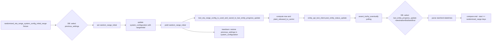
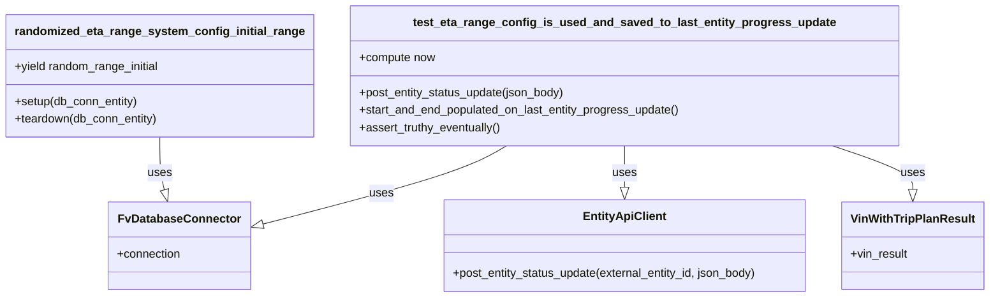

# Diagram: shipment_core/shipment_service/shipment_service/eta/e2e/test_eta_range.py

> Auto-generated by Obscura crawlers

## Diagram 1

### SVG

<svg id="container" width="4370.359375" xmlns="http://www.w3.org/2000/svg" class="flowchart" height="375.8671875" viewBox="0 0 4370.359375 375.8671875" role="graphics-document document" aria-roledescription="flowchart-v2"><g><marker id="container_flowchart-v2-pointEnd" class="marker flowchart-v2" viewBox="0 0 10 10" refX="5" refY="5" markerUnits="userSpaceOnUse" markerWidth="8" markerHeight="8" orient="auto"><path d="M 0 0 L 10 5 L 0 10 z" class="arrowMarkerPath" style="stroke-width: 1; stroke-dasharray: 1, 0;"></path></marker><marker id="container_flowchart-v2-pointStart" class="marker flowchart-v2" viewBox="0 0 10 10" refX="4.5" refY="5" markerUnits="userSpaceOnUse" markerWidth="8" markerHeight="8" orient="auto"><path d="M 0 5 L 10 10 L 10 0 z" class="arrowMarkerPath" style="stroke-width: 1; stroke-dasharray: 1, 0;"></path></marker><marker id="container_flowchart-v2-circleEnd" class="marker flowchart-v2" viewBox="0 0 10 10" refX="11" refY="5" markerUnits="userSpaceOnUse" markerWidth="11" markerHeight="11" orient="auto"><circle cx="5" cy="5" r="5" class="arrowMarkerPath" style="stroke-width: 1; stroke-dasharray: 1, 0;"></circle></marker><marker id="container_flowchart-v2-circleStart" class="marker flowchart-v2" viewBox="0 0 10 10" refX="-1" refY="5" markerUnits="userSpaceOnUse" markerWidth="11" markerHeight="11" orient="auto"><circle cx="5" cy="5" r="5" class="arrowMarkerPath" style="stroke-width: 1; stroke-dasharray: 1, 0;"></circle></marker><marker id="container_flowchart-v2-crossEnd" class="marker cross flowchart-v2" viewBox="0 0 11 11" refX="12" refY="5.2" markerUnits="userSpaceOnUse" markerWidth="11" markerHeight="11" orient="auto"><path d="M 1,1 l 9,9 M 10,1 l -9,9" class="arrowMarkerPath" style="stroke-width: 2; stroke-dasharray: 1, 0;"></path></marker><marker id="container_flowchart-v2-crossStart" class="marker cross flowchart-v2" viewBox="0 0 11 11" refX="-1" refY="5.2" markerUnits="userSpaceOnUse" markerWidth="11" markerHeight="11" orient="auto"><path d="M 1,1 l 9,9 M 10,1 l -9,9" class="arrowMarkerPath" style="stroke-width: 2; stroke-dasharray: 1, 0;"></path></marker><g class="root"><g class="clusters"></g><g class="edgePaths"><path d="M447.203,228.867L451.37,228.867C455.536,228.867,463.87,228.867,471.536,228.867C479.203,228.867,486.203,228.867,489.703,228.867L493.203,228.867" id="L_A_B_0" class="edge-thickness-normal edge-pattern-solid edge-thickness-normal edge-pattern-solid flowchart-link" style=";" data-edge="true" data-et="edge" data-id="L_A_B_0" data-points="W3sieCI6NDQ3LjIwMzEyNSwieSI6MjI4Ljg2NzE4NzV9LHsieCI6NDcyLjIwMzEyNSwieSI6MjI4Ljg2NzE4NzV9LHsieCI6NDk3LjIwMzEyNSwieSI6MjI4Ljg2NzE4NzV9XQ==" marker-end="url(#container_flowchart-v2-pointEnd)"></path><path d="M775.203,228.867L779.37,228.867C783.536,228.867,791.87,228.867,799.536,228.867C807.203,228.867,814.203,228.867,817.703,228.867L821.203,228.867" id="L_B_C_0" class="edge-thickness-normal edge-pattern-solid edge-thickness-normal edge-pattern-solid flowchart-link" style=";" data-edge="true" data-et="edge" data-id="L_B_C_0" data-points="W3sieCI6Nzc1LjIwMzEyNSwieSI6MjI4Ljg2NzE4NzV9LHsieCI6ODAwLjIwMzEyNSwieSI6MjI4Ljg2NzE4NzV9LHsieCI6ODI1LjIwMzEyNSwieSI6MjI4Ljg2NzE4NzV9XQ==" marker-end="url(#container_flowchart-v2-pointEnd)"></path><path d="M1066.453,228.867L1070.62,228.867C1074.786,228.867,1083.12,228.867,1090.786,228.867C1098.453,228.867,1105.453,228.867,1108.953,228.867L1112.453,228.867" id="L_C_D_0" class="edge-thickness-normal edge-pattern-solid edge-thickness-normal edge-pattern-solid flowchart-link" style=";" data-edge="true" data-et="edge" data-id="L_C_D_0" data-points="W3sieCI6MTA2Ni40NTMxMjUsInkiOjIyOC44NjcxODc1fSx7IngiOjEwOTEuNDUzMTI1LCJ5IjoyMjguODY3MTg3NX0seyJ4IjoxMTE2LjQ1MzEyNSwieSI6MjI4Ljg2NzE4NzV9XQ==" marker-end="url(#container_flowchart-v2-pointEnd)"></path><path d="M1376.453,228.867L1380.62,228.867C1384.786,228.867,1393.12,228.867,1400.786,228.867C1408.453,228.867,1415.453,228.867,1418.953,228.867L1422.453,228.867" id="L_D_E_0" class="edge-thickness-normal edge-pattern-solid edge-thickness-normal edge-pattern-solid flowchart-link" style=";" data-edge="true" data-et="edge" data-id="L_D_E_0" data-points="W3sieCI6MTM3Ni40NTMxMjUsInkiOjIyOC44NjcxODc1fSx7IngiOjE0MDEuNDUzMTI1LCJ5IjoyMjguODY3MTg3NX0seyJ4IjoxNDI2LjQ1MzEyNSwieSI6MjI4Ljg2NzE4NzV9XQ==" marker-end="url(#container_flowchart-v2-pointEnd)"></path><path d="M1617.978,201.867L1632.651,195.701C1647.324,189.534,1676.67,177.201,1694.843,171.034C1713.016,164.867,1720.016,164.867,1723.516,164.867L1727.016,164.867" id="L_E_F_0" class="edge-thickness-normal edge-pattern-solid edge-thickness-normal edge-pattern-solid flowchart-link" style=";" data-edge="true" data-et="edge" data-id="L_E_F_0" data-points="W3sieCI6MTYxNy45NzgwMjczNDM3NSwieSI6MjAxLjg2NzE4NzV9LHsieCI6MTcwNi4wMTU2MjUsInkiOjE2NC44NjcxODc1fSx7IngiOjE3MzEuMDE1NjI1LCJ5IjoxNjQuODY3MTg3NX1d" marker-end="url(#container_flowchart-v2-pointEnd)"></path><path d="M2334.625,164.867L2338.792,164.867C2342.958,164.867,2351.292,164.867,2358.958,164.867C2366.625,164.867,2373.625,164.867,2377.125,164.867L2380.625,164.867" id="L_F_G_0" class="edge-thickness-normal edge-pattern-solid edge-thickness-normal edge-pattern-solid flowchart-link" style=";" data-edge="true" data-et="edge" data-id="L_F_G_0" data-points="W3sieCI6MjMzNC42MjUsInkiOjE2NC44NjcxODc1fSx7IngiOjIzNTkuNjI1LCJ5IjoxNjQuODY3MTg3NX0seyJ4IjoyMzg0LjYyNSwieSI6MTY0Ljg2NzE4NzV9XQ==" marker-end="url(#container_flowchart-v2-pointEnd)"></path><path d="M2644.625,164.867L2648.792,164.867C2652.958,164.867,2661.292,164.867,2668.958,164.867C2676.625,164.867,2683.625,164.867,2687.125,164.867L2690.625,164.867" id="L_G_H_0" class="edge-thickness-normal edge-pattern-solid edge-thickness-normal edge-pattern-solid flowchart-link" style=";" data-edge="true" data-et="edge" data-id="L_G_H_0" data-points="W3sieCI6MjY0NC42MjUsInkiOjE2NC44NjcxODc1fSx7IngiOjI2NjkuNjI1LCJ5IjoxNjQuODY3MTg3NX0seyJ4IjoyNjk0LjYyNSwieSI6MTY0Ljg2NzE4NzV9XQ==" marker-end="url(#container_flowchart-v2-pointEnd)"></path><path d="M3108.266,164.867L3112.432,164.867C3116.599,164.867,3124.932,164.867,3132.682,164.937C3140.433,165.008,3147.599,165.148,3151.183,165.219L3154.766,165.289" id="L_H_I_0" class="edge-thickness-normal edge-pattern-solid edge-thickness-normal edge-pattern-solid flowchart-link" style=";" data-edge="true" data-et="edge" data-id="L_H_I_0" data-points="W3sieCI6MzEwOC4yNjU2MjUsInkiOjE2NC44NjcxODc1fSx7IngiOjMxMzMuMjY1NjI1LCJ5IjoxNjQuODY3MTg3NX0seyJ4IjozMTU4Ljc2NTYyNSwieSI6MTY1LjM2NzE4NzV9XQ==" marker-end="url(#container_flowchart-v2-pointEnd)"></path><path d="M3388.766,165.367L3392.849,165.284C3396.932,165.201,3405.099,165.034,3412.682,164.951C3420.266,164.867,3427.266,164.867,3430.766,164.867L3434.266,164.867" id="L_I_J_0" class="edge-thickness-normal edge-pattern-solid edge-thickness-normal edge-pattern-solid flowchart-link" style=";" data-edge="true" data-et="edge" data-id="L_I_J_0" data-points="W3sieCI6MzM4OC43NjU2MjUsInkiOjE2NS4zNjcxODc1fSx7IngiOjM0MTMuMjY1NjI1LCJ5IjoxNjQuODY3MTg3NX0seyJ4IjozNDM4LjI2NTYyNSwieSI6MTY0Ljg2NzE4NzV9XQ==" marker-end="url(#container_flowchart-v2-pointEnd)"></path><path d="M3752,164.867L3756.167,164.867C3760.333,164.867,3768.667,164.867,3776.333,164.867C3784,164.867,3791,164.867,3794.5,164.867L3798,164.867" id="L_J_K_0" class="edge-thickness-normal edge-pattern-solid edge-thickness-normal edge-pattern-solid flowchart-link" style=";" data-edge="true" data-et="edge" data-id="L_J_K_0" data-points="W3sieCI6Mzc1MiwieSI6MTY0Ljg2NzE4NzV9LHsieCI6Mzc3NywieSI6MTY0Ljg2NzE4NzV9LHsieCI6MzgwMiwieSI6MTY0Ljg2NzE4NzV9XQ==" marker-end="url(#container_flowchart-v2-pointEnd)"></path><path d="M4052.359,164.867L4056.526,164.867C4060.693,164.867,4069.026,164.867,4076.693,164.867C4084.359,164.867,4091.359,164.867,4094.859,164.867L4098.359,164.867" id="L_K_L_0" class="edge-thickness-normal edge-pattern-solid edge-thickness-normal edge-pattern-solid flowchart-link" style=";" data-edge="true" data-et="edge" data-id="L_K_L_0" data-points="W3sieCI6NDA1Mi4zNTkzNzUsInkiOjE2NC44NjcxODc1fSx7IngiOjQwNzcuMzU5Mzc1LCJ5IjoxNjQuODY3MTg3NX0seyJ4Ijo0MTAyLjM1OTM3NSwieSI6MTY0Ljg2NzE4NzV9XQ==" marker-end="url(#container_flowchart-v2-pointEnd)"></path><path d="M1617.978,255.867L1632.651,262.034C1647.324,268.201,1676.67,280.534,1723.477,286.701C1770.284,292.867,1834.552,292.867,1866.686,292.867L1898.82,292.867" id="L_E_M_0" class="edge-thickness-normal edge-pattern-solid edge-thickness-normal edge-pattern-solid flowchart-link" style=";" data-edge="true" data-et="edge" data-id="L_E_M_0" data-points="W3sieCI6MTYxNy45NzgwMjczNDM3NSwieSI6MjU1Ljg2NzE4NzV9LHsieCI6MTcwNi4wMTU2MjUsInkiOjI5Mi44NjcxODc1fSx7IngiOjE5MDIuODIwMzEyNSwieSI6MjkyLjg2NzE4NzV9XQ==" marker-end="url(#container_flowchart-v2-pointEnd)"></path></g><g class="edgeLabels"><g class="edgeLabel"><g class="label" data-id="L_A_B_0" transform="translate(0, 0)"><foreignObject width="0" height="0">

</foreignObject></g></g><g class="edgeLabel"><g class="label" data-id="L_B_C_0" transform="translate(0, 0)"><foreignObject width="0" height="0">

</foreignObject></g></g><g class="edgeLabel"><g class="label" data-id="L_C_D_0" transform="translate(0, 0)"><foreignObject width="0" height="0">

</foreignObject></g></g><g class="edgeLabel"><g class="label" data-id="L_D_E_0" transform="translate(0, 0)"><foreignObject width="0" height="0">

</foreignObject></g></g><g class="edgeLabel"><g class="label" data-id="L_E_F_0" transform="translate(0, 0)"><foreignObject width="0" height="0">

</foreignObject></g></g><g class="edgeLabel"><g class="label" data-id="L_F_G_0" transform="translate(0, 0)"><foreignObject width="0" height="0">

</foreignObject></g></g><g class="edgeLabel"><g class="label" data-id="L_G_H_0" transform="translate(0, 0)"><foreignObject width="0" height="0">

</foreignObject></g></g><g class="edgeLabel"><g class="label" data-id="L_H_I_0" transform="translate(0, 0)"><foreignObject width="0" height="0">

</foreignObject></g></g><g class="edgeLabel"><g class="label" data-id="L_I_J_0" transform="translate(0, 0)"><foreignObject width="0" height="0">

</foreignObject></g></g><g class="edgeLabel"><g class="label" data-id="L_J_K_0" transform="translate(0, 0)"><foreignObject width="0" height="0">

</foreignObject></g></g><g class="edgeLabel"><g class="label" data-id="L_K_L_0" transform="translate(0, 0)"><foreignObject width="0" height="0">

</foreignObject></g></g><g class="edgeLabel"><g class="label" data-id="L_E_M_0" transform="translate(0, 0)"><foreignObject width="0" height="0">

</foreignObject></g></g></g><g class="nodes"><g class="node default" id="flowchart-A-0" transform="translate(227.6015625, 228.8671875)"><rect class="basic label-container" style="" x="-219.6015625" y="-39" width="439.203125" height="78"></rect><g class="label" style="" transform="translate(-189.6015625, -24)"><rect></rect><foreignObject width="379.203125" height="48">

randomized_eta_range_system_config_initial_range fixture

</foreignObject></g></g><g class="node default" id="flowchart-B-1" transform="translate(636.203125, 228.8671875)"><polygon points="139,0 278,-139 139,-278 0,-139" class="label-container" transform="translate(-138.5, 139)"></polygon><g class="label" style="" transform="translate(-100, -24)"><rect></rect><foreignObject width="200" height="48">

DB: select previous_settings

</foreignObject></g></g><g class="node default" id="flowchart-C-3" transform="translate(945.828125, 228.8671875)"><rect class="basic label-container" style="" x="-120.625" y="-27" width="241.25" height="54"></rect><g class="label" style="" transform="translate(-90.625, -12)"><rect></rect><foreignObject width="181.25" height="24">

set random_range_initial

</foreignObject></g></g><g class="node default" id="flowchart-D-5" transform="translate(1246.453125, 228.8671875)"><rect class="basic label-container" style="" x="-130" y="-51" width="260" height="102"></rect><g class="label" style="" transform="translate(-100, -36)"><rect></rect><foreignObject width="200" height="72">

update system_configuration with rangeInitial

</foreignObject></g></g><g class="node default" id="flowchart-E-7" transform="translate(1553.734375, 228.8671875)"><rect class="basic label-container" style="" x="-127.28125" y="-27" width="254.5625" height="54"></rect><g class="label" style="" transform="translate(-97.28125, -12)"><rect></rect><foreignObject width="194.5625" height="24">

yield random_range_initial

</foreignObject></g></g><g class="node default" id="flowchart-F-9" transform="translate(2032.8203125, 164.8671875)"><rect class="basic label-container" style="" x="-301.8046875" y="-27" width="603.609375" height="54"></rect><g class="label" style="" transform="translate(-271.8046875, -12)"><rect></rect><foreignObject width="543.609375" height="24">

test_eta_range_config_is_used_and_saved_to_last_entity_progress_update

</foreignObject></g></g><g class="node default" id="flowchart-G-11" transform="translate(2514.625, 164.8671875)"><rect class="basic label-container" style="" x="-130" y="-39" width="260" height="78"></rect><g class="label" style="" transform="translate(-100, -24)"><rect></rect><foreignObject width="200" height="48">

compute now and plant_released_to_carrier

</foreignObject></g></g><g class="node default" id="flowchart-H-13" transform="translate(2901.4453125, 164.8671875)"><rect class="basic label-container" style="" x="-206.8203125" y="-27" width="413.640625" height="54"></rect><g class="label" style="" transform="translate(-176.8203125, -12)"><rect></rect><foreignObject width="353.640625" height="24">

entity_api_test_client.post_entity_status_update

</foreignObject></g></g><g class="node default" id="flowchart-I-15" transform="translate(3273.265625, 164.8671875)"><g class="basic label-container outer-path"><path d="M-110 -39 C-48.099245644921766 -39, 13.801508710156469 -39, 110 -39 C110 -39, 110 -39, 110 -39 C110.11436580688137 -38.99526979523794, 110.22873161376273 -38.990539590475876, 110.41289672736166 -38.98292246503335 C110.56017553379932 -38.96456418095613, 110.70745434023699 -38.94620589687891, 110.82297295140367 -38.93180651701361 C110.90576898878705 -38.91444601358998, 110.9885650261704 -38.89708551016635, 111.227427435704 -38.84700132969665 C111.3760630842596 -38.80275057987582, 111.5246987328152 -38.75849983005499, 111.62349734602341 -38.729086208503176 C111.71612719655704 -38.69294192866518, 111.80875704709068 -38.65679764882718, 112.00847712326485 -38.57886663327529 C112.14304552823248 -38.51308014874943, 112.27761393320009 -38.447293664223565, 112.37973696518537 -38.39736875603244 C112.47267317637959 -38.34199079427887, 112.5656093875738 -38.28661283252529, 112.73474079061214 -38.185832391312644 C112.8348835283095 -38.11433185089034, 112.93502626600687 -38.04283131046803, 113.07106356344833 -37.94570254698197 C113.13612792107251 -37.890595847082416, 113.2011922786967 -37.835489147182855, 113.3864078581287 -37.67861955336566 C113.44691131324278 -37.61811609825158, 113.50741476835685 -37.55761264313752, 113.67861955336566 -37.386407858128706 C113.77896931528855 -37.267925118114285, 113.87931907721143 -37.149442378099856, 113.94570254698196 -37.07106356344834 C114.02227832045297 -36.96381251959067, 114.09885409392398 -36.856561475732995, 114.18583239131264 -36.734740790612136 C114.24909641027995 -36.62857006779097, 114.31236042924725 -36.5223993449698, 114.39736875603245 -36.379736965185366 C114.43867905854484 -36.295235390767964, 114.47998936105722 -36.210733816350555, 114.57886663327528 -36.008477123264846 C114.61680270731462 -35.91125529774096, 114.65473878135396 -35.814033472217076, 114.72908620850318 -35.62349734602342 C114.7572264707634 -35.5289758712799, 114.78536673302361 -35.43445439653637, 114.84700132969665 -35.227427435703994 C114.86614101248483 -35.136146102843654, 114.885280695273 -35.044864769983306, 114.93180651701361 -34.82297295140367 C114.94523049093564 -34.71527950638612, 114.95865446485767 -34.607586061368565, 114.98292246503335 -34.41289672736166 C114.98682018798242 -34.31865847500423, 114.99071791093148 -34.2244202226468, 115 -34 C115 -34, 115 -34, 115 -34 C115 -16.907493112849014, 115 0.18501377430197152, 115 34 C115 34, 115 34, 115 34 C114.99543021960766 34.1104871032293, 114.99086043921531 34.22097420645861, 114.98292246503335 34.41289672736166 C114.9658098131121 34.55018248562445, 114.94869716119085 34.68746824388723, 114.93180651701361 34.82297295140367 C114.91339717792837 34.91077111542638, 114.89498783884314 34.99856927944908, 114.84700132969665 35.227427435703994 C114.80007051792776 35.385065253656286, 114.75313970615889 35.54270307160858, 114.72908620850318 35.62349734602342 C114.69401886838344 35.71336723659702, 114.65895152826371 35.803237127170625, 114.57886663327528 36.008477123264846 C114.53999336444497 36.08799366560746, 114.50112009561465 36.16751020795009, 114.39736875603245 36.379736965185366 C114.32684882702239 36.4980846762305, 114.25632889801231 36.61643238727564, 114.18583239131264 36.734740790612136 C114.13620108211069 36.80425376421532, 114.08656977290872 36.8737667378185, 113.94570254698196 37.07106356344834 C113.85273448860013 37.18083074256098, 113.75976643021832 37.29059792167361, 113.67861955336566 37.386407858128706 C113.61187792275346 37.45314948874091, 113.54513629214125 37.51989111935311, 113.3864078581287 37.67861955336566 C113.29749391762306 37.75392581958031, 113.20857997711741 37.82923208579496, 113.07106356344833 37.94570254698197 C112.96687535092087 38.020091500915505, 112.86268713839341 38.094480454849034, 112.73474079061214 38.185832391312644 C112.60100941099836 38.26551899710754, 112.46727803138458 38.34520560290243, 112.37973696518537 38.39736875603244 C112.28077359529286 38.44574899954969, 112.18181022540034 38.494129243066936, 112.00847712326485 38.57886663327529 C111.8743251150582 38.631212909313916, 111.74017310685156 38.68355918535255, 111.62349734602341 38.729086208503176 C111.50631005996439 38.763974375157495, 111.38912277390536 38.798862541811815, 111.227427435704 38.84700132969665 C111.10620500300152 38.87241900093384, 110.98498257029904 38.897836672171024, 110.82297295140367 38.93180651701361 C110.70074647894941 38.94704203091643, 110.57852000649515 38.96227754481925, 110.41289672736166 38.98292246503335 C110.32942628693037 38.98637482798681, 110.2459558464991 38.98982719094026, 110 39 C110 39, 110 39, 110 39 C48.88509979090928 39, -12.22980041818144 39, -110 39 C-110 39, -110 39, -110 39 C-110.11502979469115 38.99524233249898, -110.23005958938232 38.990484664997965, -110.41289672736166 38.98292246503335 C-110.57110561497454 38.963201747758475, -110.72931450258743 38.943481030483596, -110.82297295140367 38.93180651701361 C-110.91157721709347 38.91322815618297, -111.00018148278326 38.894649795352315, -111.227427435704 38.84700132969665 C-111.33794670442282 38.814098317815024, -111.44846597314165 38.7811953059334, -111.62349734602341 38.729086208503176 C-111.72965533477745 38.68766323275119, -111.83581332353147 38.64624025699921, -112.00847712326485 38.57886663327529 C-112.13944141622221 38.51484209174823, -112.27040570917958 38.45081755022117, -112.37973696518537 38.39736875603245 C-112.51243642865805 38.31829703879241, -112.64513589213072 38.23922532155236, -112.73474079061214 38.185832391312644 C-112.84556802498457 38.1067032668914, -112.95639525935701 38.02757414247016, -113.07106356344833 37.94570254698197 C-113.16944796452063 37.862375209824435, -113.26783236559292 37.7790478726669, -113.3864078581287 37.67861955336566 C-113.45663798871901 37.60838942277535, -113.52686811930933 37.53815929218504, -113.67861955336566 37.386407858128706 C-113.76327990169915 37.28644957373501, -113.84794025003264 37.18649128934132, -113.94570254698196 37.07106356344834 C-114.0326449536706 36.94929314638053, -114.11958736035923 36.82752272931272, -114.18583239131264 36.734740790612136 C-114.26117274672015 36.608303360271954, -114.33651310212764 36.48186592993178, -114.39736875603245 36.379736965185366 C-114.45218945790488 36.2675994271584, -114.50701015977732 36.15546188913143, -114.57886663327528 36.008477123264846 C-114.61234324584626 35.922683918012986, -114.64581985841724 35.836890712761125, -114.72908620850318 35.62349734602342 C-114.770276814233 35.485140540278, -114.81146741996282 35.346783734532586, -114.84700132969665 35.227427435703994 C-114.87362453836244 35.100455531366435, -114.90024774702822 34.97348362702888, -114.93180651701361 34.82297295140367 C-114.94926553448592 34.68290848546127, -114.96672455195821 34.54284401951887, -114.98292246503335 34.41289672736166 C-114.98962473079129 34.25085088159038, -114.99632699654921 34.08880503581909, -115 34 C-115 34, -115 34, -115 34 C-115 15.837914336457466, -115 -2.324171327085068, -115 -34 C-115 -34, -115 -34, -115 -34 C-114.9944723787516 -34.13364555997219, -114.98894475750319 -34.26729111994438, -114.98292246503335 -34.41289672736166 C-114.96620035149333 -34.54704940268415, -114.94947823795331 -34.681202078006635, -114.93180651701361 -34.82297295140367 C-114.90921909136574 -34.930697323946305, -114.88663166571787 -35.03842169648894, -114.84700132969665 -35.227427435703994 C-114.8210277643638 -35.31467110375889, -114.79505419903096 -35.401914771813786, -114.72908620850318 -35.62349734602342 C-114.69071496643416 -35.72183441162755, -114.65234372436512 -35.820171477231675, -114.57886663327528 -36.008477123264846 C-114.5278149794335 -36.11290495031718, -114.47676332559172 -36.217332777369506, -114.39736875603245 -36.379736965185366 C-114.34917079731494 -36.460623576549516, -114.30097283859745 -36.54151018791366, -114.18583239131264 -36.734740790612136 C-114.10586080927438 -36.846747960292255, -114.0258892272361 -36.95875512997238, -113.94570254698196 -37.07106356344834 C-113.85680644656321 -37.17602299087883, -113.76791034614445 -37.280982418309314, -113.67861955336566 -37.386407858128706 C-113.60974014024025 -37.45528727125412, -113.54086072711483 -37.52416668437953, -113.3864078581287 -37.67861955336566 C-113.30534343877991 -37.747277614287256, -113.22427901943111 -37.81593567520886, -113.07106356344833 -37.94570254698197 C-112.94419170233071 -38.03628731471328, -112.81731984121309 -38.126872082444585, -112.73474079061214 -38.185832391312644 C-112.6324801655389 -38.24676649774364, -112.53021954046567 -38.30770060417465, -112.37973696518537 -38.39736875603245 C-112.23219384398458 -38.469498192820446, -112.08465072278378 -38.54162762960844, -112.00847712326485 -38.57886663327528 C-111.87538899446108 -38.63079778228273, -111.7423008656573 -38.68272893129018, -111.62349734602341 -38.729086208503176 C-111.50696283375487 -38.76378003597996, -111.39042832148633 -38.79847386345675, -111.227427435704 -38.84700132969665 C-111.12527072400518 -38.86842133963001, -111.02311401230635 -38.88984134956336, -110.82297295140367 -38.93180651701361 C-110.7110359187499 -38.94575945358286, -110.59909888609614 -38.9597123901521, -110.41289672736167 -38.98292246503335 C-110.30504896971715 -38.98738308128482, -110.19720121207263 -38.99184369753629, -110 -39 C-110 -39, -110 -39, -110 -39" stroke="none" stroke-width="0" fill="#ECECFF" style=""></path><path d="M-110 -39 C-23.707587764099827 -39, 62.584824471800346 -39, 110 -39 M-110 -39 C-46.1647210605885 -39, 17.670557878823004 -39, 110 -39 M110 -39 C110 -39, 110 -39, 110 -39 M110 -39 C110 -39, 110 -39, 110 -39 M110 -39 C110.12461120744265 -38.99484604233621, 110.24922241488531 -38.98969208467242, 110.41289672736166 -38.98292246503335 M110 -39 C110.13704732449784 -38.99433168073006, 110.27409464899569 -38.98866336146013, 110.41289672736166 -38.98292246503335 M110.41289672736166 -38.98292246503335 C110.55005423995193 -38.96582579891851, 110.68721175254221 -38.94872913280367, 110.82297295140367 -38.93180651701361 M110.41289672736166 -38.98292246503335 C110.55010622684033 -38.96581931875963, 110.687315726319 -38.9487161724859, 110.82297295140367 -38.93180651701361 M110.82297295140367 -38.93180651701361 C110.9613474606824 -38.902792433514016, 111.09972196996115 -38.87377835001442, 111.227427435704 -38.84700132969665 M110.82297295140367 -38.93180651701361 C110.92259104560259 -38.910918799194604, 111.02220913980152 -38.8900310813756, 111.227427435704 -38.84700132969665 M111.227427435704 -38.84700132969665 C111.35067163634288 -38.81030994144399, 111.47391583698176 -38.773618553191326, 111.62349734602341 -38.729086208503176 M111.227427435704 -38.84700132969665 C111.36190058105905 -38.80696693976024, 111.49637372641409 -38.76693254982382, 111.62349734602341 -38.729086208503176 M111.62349734602341 -38.729086208503176 C111.75201809678471 -38.678937255938266, 111.880538847546 -38.628788303373355, 112.00847712326485 -38.57886663327529 M111.62349734602341 -38.729086208503176 C111.74605686923785 -38.681263334145136, 111.86861639245228 -38.633440459787096, 112.00847712326485 -38.57886663327529 M112.00847712326485 -38.57886663327529 C112.12631484948884 -38.52125927919643, 112.24415257571282 -38.46365192511757, 112.37973696518537 -38.39736875603244 M112.00847712326485 -38.57886663327529 C112.14664358733597 -38.51132116483643, 112.28481005140708 -38.44377569639758, 112.37973696518537 -38.39736875603244 M112.37973696518537 -38.39736875603244 C112.52018755278655 -38.313678371321245, 112.66063814038773 -38.22998798661005, 112.73474079061214 -38.185832391312644 M112.37973696518537 -38.39736875603244 C112.46781606761738 -38.34488500289584, 112.55589517004937 -38.29240124975924, 112.73474079061214 -38.185832391312644 M112.73474079061214 -38.185832391312644 C112.80382876301857 -38.13650452713272, 112.872916735425 -38.08717666295281, 113.07106356344833 -37.94570254698197 M112.73474079061214 -38.185832391312644 C112.80964232099313 -38.13235372652036, 112.88454385137415 -38.07887506172807, 113.07106356344833 -37.94570254698197 M113.07106356344833 -37.94570254698197 C113.16281510072572 -37.86799295889577, 113.25456663800311 -37.790283370809576, 113.3864078581287 -37.67861955336566 M113.07106356344833 -37.94570254698197 C113.14317181030329 -37.884629977224634, 113.21528005715824 -37.82355740746729, 113.3864078581287 -37.67861955336566 M113.3864078581287 -37.67861955336566 C113.4746735270686 -37.59035388442576, 113.5629391960085 -37.50208821548586, 113.67861955336566 -37.386407858128706 M113.3864078581287 -37.67861955336566 C113.46742039277753 -37.597607018716836, 113.54843292742635 -37.51659448406802, 113.67861955336566 -37.386407858128706 M113.67861955336566 -37.386407858128706 C113.75900718026136 -37.291494366403846, 113.83939480715705 -37.196580874678986, 113.94570254698196 -37.07106356344834 M113.67861955336566 -37.386407858128706 C113.78310036215795 -37.26304760029225, 113.88758117095024 -37.1396873424558, 113.94570254698196 -37.07106356344834 M113.94570254698196 -37.07106356344834 C114.00769407358912 -36.98423902825164, 114.06968560019627 -36.897414493054946, 114.18583239131264 -36.734740790612136 M113.94570254698196 -37.07106356344834 C114.02887458409462 -36.95457387753638, 114.1120466212073 -36.83808419162443, 114.18583239131264 -36.734740790612136 M114.18583239131264 -36.734740790612136 C114.2364728165587 -36.64975519152895, 114.28711324180478 -36.56476959244577, 114.39736875603245 -36.379736965185366 M114.18583239131264 -36.734740790612136 C114.23901879912125 -36.64548248148984, 114.29220520692988 -36.55622417236755, 114.39736875603245 -36.379736965185366 M114.39736875603245 -36.379736965185366 C114.4363300409728 -36.300040383012, 114.47529132591315 -36.220343800838634, 114.57886663327528 -36.008477123264846 M114.39736875603245 -36.379736965185366 C114.45110956233094 -36.269808388861755, 114.50485036862945 -36.15987981253815, 114.57886663327528 -36.008477123264846 M114.57886663327528 -36.008477123264846 C114.6240167312501 -35.8927673388749, 114.66916682922489 -35.77705755448495, 114.72908620850318 -35.62349734602342 M114.57886663327528 -36.008477123264846 C114.61447030060101 -35.917232743860595, 114.65007396792676 -35.825988364456336, 114.72908620850318 -35.62349734602342 M114.72908620850318 -35.62349734602342 C114.7696804026102 -35.487143851605374, 114.81027459671722 -35.35079035718733, 114.84700132969665 -35.227427435703994 M114.72908620850318 -35.62349734602342 C114.77224698396698 -35.47852285679555, 114.81540775943078 -35.33354836756769, 114.84700132969665 -35.227427435703994 M114.84700132969665 -35.227427435703994 C114.86587288516648 -35.13742486066145, 114.8847444406363 -35.0474222856189, 114.93180651701361 -34.82297295140367 M114.84700132969665 -35.227427435703994 C114.88063283253604 -35.06703144381364, 114.91426433537544 -34.90663545192329, 114.93180651701361 -34.82297295140367 M114.93180651701361 -34.82297295140367 C114.94479636310211 -34.71876228445487, 114.9577862091906 -34.614551617506066, 114.98292246503335 -34.41289672736166 M114.93180651701361 -34.82297295140367 C114.94435261656729 -34.722322228278344, 114.95689871612095 -34.62167150515302, 114.98292246503335 -34.41289672736166 M114.98292246503335 -34.41289672736166 C114.98914209348224 -34.26251997585939, 114.99536172193113 -34.11214322435712, 115 -34 M114.98292246503335 -34.41289672736166 C114.9880444934899 -34.289057496975694, 114.99316652194643 -34.16521826658972, 115 -34 M115 -34 C115 -34, 115 -34, 115 -34 M115 -34 C115 -34, 115 -34, 115 -34 M115 -34 C115 -12.615213188637874, 115 8.769573622724252, 115 34 M115 -34 C115 -10.064511514631661, 115 13.870976970736677, 115 34 M115 34 C115 34, 115 34, 115 34 M115 34 C115 34, 115 34, 115 34 M115 34 C114.9947328277258 34.12734848435201, 114.98946565545158 34.25469696870403, 114.98292246503335 34.41289672736166 M115 34 C114.99626234173405 34.09036824512544, 114.99252468346812 34.18073649025087, 114.98292246503335 34.41289672736166 M114.98292246503335 34.41289672736166 C114.9703632645021 34.51365255270322, 114.95780406397084 34.61440837804477, 114.93180651701361 34.82297295140367 M114.98292246503335 34.41289672736166 C114.96595921678009 34.5489838989915, 114.94899596852683 34.68507107062135, 114.93180651701361 34.82297295140367 M114.93180651701361 34.82297295140367 C114.90903914980737 34.93155550458952, 114.88627178260111 35.04013805777536, 114.84700132969665 35.227427435703994 M114.93180651701361 34.82297295140367 C114.9144212734002 34.90588698016255, 114.89703602978678 34.988801008921435, 114.84700132969665 35.227427435703994 M114.84700132969665 35.227427435703994 C114.81275937752685 35.342444125572, 114.77851742535704 35.45746081544001, 114.72908620850318 35.62349734602342 M114.84700132969665 35.227427435703994 C114.8126175861812 35.342920394306496, 114.77823384266577 35.458413352909005, 114.72908620850318 35.62349734602342 M114.72908620850318 35.62349734602342 C114.6747487308874 35.76275236652687, 114.62041125327164 35.90200738703032, 114.57886663327528 36.008477123264846 M114.72908620850318 35.62349734602342 C114.67418488650493 35.76419737583699, 114.61928356450667 35.90489740565056, 114.57886663327528 36.008477123264846 M114.57886663327528 36.008477123264846 C114.5241806674893 36.12033905422181, 114.46949470170333 36.23220098517877, 114.39736875603245 36.379736965185366 M114.57886663327528 36.008477123264846 C114.5083988101299 36.15262135943371, 114.43793098698451 36.29676559560258, 114.39736875603245 36.379736965185366 M114.39736875603245 36.379736965185366 C114.32786498087349 36.496379350033564, 114.25836120571451 36.613021734881755, 114.18583239131264 36.734740790612136 M114.39736875603245 36.379736965185366 C114.3343905711302 36.48542799655174, 114.27141238622796 36.591119027918126, 114.18583239131264 36.734740790612136 M114.18583239131264 36.734740790612136 C114.09959265227756 36.85552706039793, 114.0133529132425 36.97631333018372, 113.94570254698196 37.07106356344834 M114.18583239131264 36.734740790612136 C114.10433905701468 36.84887930694339, 114.02284572271672 36.96301782327463, 113.94570254698196 37.07106356344834 M113.94570254698196 37.07106356344834 C113.86084139132196 37.17125894060444, 113.77598023566195 37.27145431776054, 113.67861955336566 37.386407858128706 M113.94570254698196 37.07106356344834 C113.88576114510774 37.141836242907424, 113.82581974323352 37.212608922366506, 113.67861955336566 37.386407858128706 M113.67861955336566 37.386407858128706 C113.61888021496178 37.44614719653259, 113.55914087655789 37.50588653493648, 113.3864078581287 37.67861955336566 M113.67861955336566 37.386407858128706 C113.61397812171492 37.45104928977945, 113.54933669006418 37.51569072143019, 113.3864078581287 37.67861955336566 M113.3864078581287 37.67861955336566 C113.2752393635103 37.772774465439134, 113.16407086889188 37.86692937751261, 113.07106356344833 37.94570254698197 M113.3864078581287 37.67861955336566 C113.29669635161491 37.75460132353156, 113.20698484510113 37.830583093697456, 113.07106356344833 37.94570254698197 M113.07106356344833 37.94570254698197 C112.99830150164584 37.997653660569874, 112.92553943984333 38.049604774157785, 112.73474079061214 38.185832391312644 M113.07106356344833 37.94570254698197 C113.00131410527764 37.99550270291977, 112.93156464710695 38.04530285885758, 112.73474079061214 38.185832391312644 M112.73474079061214 38.185832391312644 C112.6438283478909 38.24000444880506, 112.55291590516967 38.294176506297475, 112.37973696518537 38.39736875603244 M112.73474079061214 38.185832391312644 C112.63413201016378 38.245782211992335, 112.53352322971543 38.30573203267202, 112.37973696518537 38.39736875603244 M112.37973696518537 38.39736875603244 C112.28270587170371 38.44480436717308, 112.18567477822204 38.492239978313705, 112.00847712326485 38.57886663327529 M112.37973696518537 38.39736875603244 C112.2550060716914 38.45834597424881, 112.13027517819742 38.51932319246517, 112.00847712326485 38.57886663327529 M112.00847712326485 38.57886663327529 C111.93052323565698 38.60928433460944, 111.8525693480491 38.639702035943586, 111.62349734602341 38.729086208503176 M112.00847712326485 38.57886663327529 C111.92137828879326 38.61285270394871, 111.83427945432166 38.64683877462214, 111.62349734602341 38.729086208503176 M111.62349734602341 38.729086208503176 C111.50664755555303 38.763873898367414, 111.38979776508263 38.79866158823165, 111.227427435704 38.84700132969665 M111.62349734602341 38.729086208503176 C111.49335298216604 38.76783186435094, 111.36320861830866 38.8065775201987, 111.227427435704 38.84700132969665 M111.227427435704 38.84700132969665 C111.08689706201054 38.876467450428166, 110.94636668831708 38.905933571159686, 110.82297295140367 38.93180651701361 M111.227427435704 38.84700132969665 C111.11593667800695 38.87037848326429, 111.00444592030988 38.89375563683193, 110.82297295140367 38.93180651701361 M110.82297295140367 38.93180651701361 C110.6841058069176 38.94911628852202, 110.54523866243153 38.966426060030436, 110.41289672736166 38.98292246503335 M110.82297295140367 38.93180651701361 C110.67452072546858 38.95031106767865, 110.5260684995335 38.96881561834368, 110.41289672736166 38.98292246503335 M110.41289672736166 38.98292246503335 C110.31707943624605 38.986885497508545, 110.22126214513044 38.990848529983744, 110 39 M110.41289672736166 38.98292246503335 C110.30749990519054 38.98728170984379, 110.20210308301942 38.99164095465424, 110 39 M110 39 C110 39, 110 39, 110 39 M110 39 C110 39, 110 39, 110 39 M110 39 C56.016986452236985 39, 2.03397290447397 39, -110 39 M110 39 C55.492042653245775 39, 0.9840853064915507 39, -110 39 M-110 39 C-110 39, -110 39, -110 39 M-110 39 C-110 39, -110 39, -110 39 M-110 39 C-110.1381086653287 38.99428778334859, -110.27621733065742 38.98857556669718, -110.41289672736166 38.98292246503335 M-110 39 C-110.14892197341763 38.99384054161777, -110.29784394683526 38.98768108323554, -110.41289672736166 38.98292246503335 M-110.41289672736166 38.98292246503335 C-110.51348294703203 38.970384405826955, -110.61406916670241 38.95784634662056, -110.82297295140367 38.93180651701361 M-110.41289672736166 38.98292246503335 C-110.57165612688503 38.9631331265204, -110.7304155264084 38.94334378800744, -110.82297295140367 38.93180651701361 M-110.82297295140367 38.93180651701361 C-110.95666360081958 38.90377453565023, -111.09035425023549 38.87574255428685, -111.227427435704 38.84700132969665 M-110.82297295140367 38.93180651701361 C-110.9491589558446 38.90534809422741, -111.07534496028552 38.87888967144122, -111.227427435704 38.84700132969665 M-111.227427435704 38.84700132969665 C-111.38234782357797 38.80087953191411, -111.53726821145194 38.75475773413157, -111.62349734602341 38.729086208503176 M-111.227427435704 38.84700132969665 C-111.38369489193748 38.8004784922877, -111.53996234817096 38.75395565487875, -111.62349734602341 38.729086208503176 M-111.62349734602341 38.729086208503176 C-111.73269978979837 38.68647528271568, -111.84190223357334 38.643864356928184, -112.00847712326485 38.57886663327529 M-111.62349734602341 38.729086208503176 C-111.7712935573007 38.671415947905466, -111.91908976857796 38.61374568730775, -112.00847712326485 38.57886663327529 M-112.00847712326485 38.57886663327529 C-112.15305151741663 38.50818851870605, -112.29762591156842 38.4375104041368, -112.37973696518537 38.39736875603245 M-112.00847712326485 38.57886663327529 C-112.10378789394076 38.53227203670764, -112.19909866461667 38.48567744013999, -112.37973696518537 38.39736875603245 M-112.37973696518537 38.39736875603245 C-112.47076172466049 38.34312977228146, -112.56178648413561 38.288890788530466, -112.73474079061214 38.185832391312644 M-112.37973696518537 38.39736875603245 C-112.46533048836164 38.34636608665416, -112.55092401153793 38.295363417275865, -112.73474079061214 38.185832391312644 M-112.73474079061214 38.185832391312644 C-112.8141419231839 38.129141072305764, -112.89354305575564 38.07244975329889, -113.07106356344833 37.94570254698197 M-112.73474079061214 38.185832391312644 C-112.82565673755744 38.120919652864856, -112.91657268450274 38.05600691441707, -113.07106356344833 37.94570254698197 M-113.07106356344833 37.94570254698197 C-113.16323953836675 37.867633478551014, -113.25541551328517 37.789564410120065, -113.3864078581287 37.67861955336566 M-113.07106356344833 37.94570254698197 C-113.15975657964889 37.870583394109026, -113.24844959584945 37.79546424123609, -113.3864078581287 37.67861955336566 M-113.3864078581287 37.67861955336566 C-113.45628353323386 37.608743878260505, -113.52615920833901 37.53886820315535, -113.67861955336566 37.386407858128706 M-113.3864078581287 37.67861955336566 C-113.48877440205361 37.57625300944075, -113.59114094597852 37.47388646551585, -113.67861955336566 37.386407858128706 M-113.67861955336566 37.386407858128706 C-113.76736860745561 37.281622047970565, -113.85611766154557 37.176836237812424, -113.94570254698196 37.07106356344834 M-113.67861955336566 37.386407858128706 C-113.7679652670232 37.28091757335031, -113.85731098068074 37.17542728857192, -113.94570254698196 37.07106356344834 M-113.94570254698196 37.07106356344834 C-114.03005619564034 36.952918927596386, -114.11440984429872 36.834774291744424, -114.18583239131264 36.734740790612136 M-113.94570254698196 37.07106356344834 C-114.03645831405504 36.94395220285103, -114.12721408112812 36.81684084225372, -114.18583239131264 36.734740790612136 M-114.18583239131264 36.734740790612136 C-114.26713075018907 36.598304540323554, -114.34842910906548 36.46186829003498, -114.39736875603245 36.379736965185366 M-114.18583239131264 36.734740790612136 C-114.25959899772006 36.610944451868825, -114.33336560412747 36.487148113125514, -114.39736875603245 36.379736965185366 M-114.39736875603245 36.379736965185366 C-114.46046862272297 36.2506641248381, -114.5235684894135 36.12159128449084, -114.57886663327528 36.008477123264846 M-114.39736875603245 36.379736965185366 C-114.43838023101513 36.29584665225003, -114.47939170599783 36.211956339314696, -114.57886663327528 36.008477123264846 M-114.57886663327528 36.008477123264846 C-114.62970822386674 35.8781812933718, -114.68054981445819 35.74788546347877, -114.72908620850318 35.62349734602342 M-114.57886663327528 36.008477123264846 C-114.61957748202545 35.904144159605664, -114.66028833077563 35.799811195946475, -114.72908620850318 35.62349734602342 M-114.72908620850318 35.62349734602342 C-114.75883455052977 35.523574426559264, -114.78858289255635 35.4236515070951, -114.84700132969665 35.227427435703994 M-114.72908620850318 35.62349734602342 C-114.7582145677403 35.525656912039814, -114.78734292697742 35.42781647805621, -114.84700132969665 35.227427435703994 M-114.84700132969665 35.227427435703994 C-114.86722918887875 35.13095635164849, -114.88745704806085 35.03448526759299, -114.93180651701361 34.82297295140367 M-114.84700132969665 35.227427435703994 C-114.87372673524061 35.099968132105055, -114.90045214078457 34.97250882850612, -114.93180651701361 34.82297295140367 M-114.93180651701361 34.82297295140367 C-114.94669189586646 34.70355542732577, -114.96157727471932 34.584137903247864, -114.98292246503335 34.41289672736166 M-114.93180651701361 34.82297295140367 C-114.94943877744203 34.68151864882442, -114.96707103787044 34.540064346245174, -114.98292246503335 34.41289672736166 M-114.98292246503335 34.41289672736166 C-114.98694067992268 34.31574524848128, -114.99095889481202 34.218593769600886, -115 34 M-114.98292246503335 34.41289672736166 C-114.98951224570436 34.25357052024787, -114.99610202637537 34.09424431313407, -115 34 M-115 34 C-115 34, -115 34, -115 34 M-115 34 C-115 34, -115 34, -115 34 M-115 34 C-115 9.374975773530586, -115 -15.250048452938827, -115 -34 M-115 34 C-115 17.782427892219882, -115 1.5648557844397644, -115 -34 M-115 -34 C-115 -34, -115 -34, -115 -34 M-115 -34 C-115 -34, -115 -34, -115 -34 M-115 -34 C-114.99571258181604 -34.10366021445403, -114.99142516363207 -34.20732042890806, -114.98292246503335 -34.41289672736166 M-115 -34 C-114.9946401288009 -34.129589737717595, -114.98928025760179 -34.25917947543518, -114.98292246503335 -34.41289672736166 M-114.98292246503335 -34.41289672736166 C-114.97022131878059 -34.51479130817487, -114.95752017252781 -34.61668588898808, -114.93180651701361 -34.82297295140367 M-114.98292246503335 -34.41289672736166 C-114.9663725053982 -34.545668302929634, -114.94982254576304 -34.67843987849761, -114.93180651701361 -34.82297295140367 M-114.93180651701361 -34.82297295140367 C-114.90074432480908 -34.97111533899563, -114.86968213260457 -35.1192577265876, -114.84700132969665 -35.227427435703994 M-114.93180651701361 -34.82297295140367 C-114.91439525679061 -34.90601105906318, -114.89698399656761 -34.989049166722694, -114.84700132969665 -35.227427435703994 M-114.84700132969665 -35.227427435703994 C-114.82085369056709 -35.31525580733513, -114.79470605143753 -35.40308417896626, -114.72908620850318 -35.62349734602342 M-114.84700132969665 -35.227427435703994 C-114.81614104946429 -35.331085289763344, -114.78528076923193 -35.4347431438227, -114.72908620850318 -35.62349734602342 M-114.72908620850318 -35.62349734602342 C-114.6980721085146 -35.70297967239024, -114.66705800852601 -35.782461998757064, -114.57886663327528 -36.008477123264846 M-114.72908620850318 -35.62349734602342 C-114.68785874429408 -35.72915428163497, -114.64663128008497 -35.83481121724652, -114.57886663327528 -36.008477123264846 M-114.57886663327528 -36.008477123264846 C-114.51243703236844 -36.14436104381628, -114.44600743146158 -36.280244964367725, -114.39736875603245 -36.379736965185366 M-114.57886663327528 -36.008477123264846 C-114.53643387861393 -36.09527471025121, -114.49400112395257 -36.18207229723758, -114.39736875603245 -36.379736965185366 M-114.39736875603245 -36.379736965185366 C-114.3208434380371 -36.50816301933607, -114.24431812004175 -36.63658907348677, -114.18583239131264 -36.734740790612136 M-114.39736875603245 -36.379736965185366 C-114.32455722483326 -36.50193048092028, -114.25174569363405 -36.62412399665519, -114.18583239131264 -36.734740790612136 M-114.18583239131264 -36.734740790612136 C-114.120689315994 -36.82597934441752, -114.05554624067537 -36.917217898222894, -113.94570254698196 -37.07106356344834 M-114.18583239131264 -36.734740790612136 C-114.11085360383224 -36.839755116422374, -114.03587481635185 -36.94476944223261, -113.94570254698196 -37.07106356344834 M-113.94570254698196 -37.07106356344834 C-113.85158438621242 -37.18218866588419, -113.75746622544288 -37.29331376832003, -113.67861955336566 -37.386407858128706 M-113.94570254698196 -37.07106356344834 C-113.86007795200315 -37.172160331704866, -113.77445335702433 -37.27325709996139, -113.67861955336566 -37.386407858128706 M-113.67861955336566 -37.386407858128706 C-113.60559322880034 -37.45943418269403, -113.53256690423501 -37.53246050725935, -113.3864078581287 -37.67861955336566 M-113.67861955336566 -37.386407858128706 C-113.60155271850209 -37.46347469299228, -113.52448588363852 -37.54054152785585, -113.3864078581287 -37.67861955336566 M-113.3864078581287 -37.67861955336566 C-113.30967775012442 -37.74360663983589, -113.23294764212014 -37.80859372630612, -113.07106356344833 -37.94570254698197 M-113.3864078581287 -37.67861955336566 C-113.27234934420558 -37.77522218693127, -113.15829083028247 -37.87182482049689, -113.07106356344833 -37.94570254698197 M-113.07106356344833 -37.94570254698197 C-112.96251164678974 -38.0232071257805, -112.85395973013114 -38.10071170457904, -112.73474079061214 -38.185832391312644 M-113.07106356344833 -37.94570254698197 C-112.94912561872452 -38.032764566117955, -112.8271876740007 -38.11982658525394, -112.73474079061214 -38.185832391312644 M-112.73474079061214 -38.185832391312644 C-112.62687075507077 -38.250108980876675, -112.5190007195294 -38.314385570440706, -112.37973696518537 -38.39736875603245 M-112.73474079061214 -38.185832391312644 C-112.60188210159455 -38.26499898638365, -112.46902341257697 -38.344165581454654, -112.37973696518537 -38.39736875603245 M-112.37973696518537 -38.39736875603245 C-112.27547330081697 -38.4483401556283, -112.17120963644857 -38.49931155522416, -112.00847712326485 -38.57886663327528 M-112.37973696518537 -38.39736875603245 C-112.27878655052089 -38.44672040654657, -112.1778361358564 -38.49607205706069, -112.00847712326485 -38.57886663327528 M-112.00847712326485 -38.57886663327528 C-111.88793300440122 -38.625903094415314, -111.7673888855376 -38.672939555555345, -111.62349734602341 -38.729086208503176 M-112.00847712326485 -38.57886663327528 C-111.88599956549649 -38.62665752461702, -111.76352200772814 -38.674448415958764, -111.62349734602341 -38.729086208503176 M-111.62349734602341 -38.729086208503176 C-111.47831804071538 -38.77230796035597, -111.33313873540735 -38.81552971220875, -111.227427435704 -38.84700132969665 M-111.62349734602341 -38.729086208503176 C-111.51209218563689 -38.76225296176136, -111.40068702525035 -38.79541971501955, -111.227427435704 -38.84700132969665 M-111.227427435704 -38.84700132969665 C-111.10004734843793 -38.87371012532229, -110.97266726117186 -38.90041892094793, -110.82297295140367 -38.93180651701361 M-111.227427435704 -38.84700132969665 C-111.13682124664147 -38.865999449717044, -111.04621505757895 -38.884997569737436, -110.82297295140367 -38.93180651701361 M-110.82297295140367 -38.93180651701361 C-110.71703676345366 -38.9450114490706, -110.61110057550366 -38.95821638112759, -110.41289672736167 -38.98292246503335 M-110.82297295140367 -38.93180651701361 C-110.68271193945472 -38.94929003392008, -110.54245092750577 -38.966773550826545, -110.41289672736167 -38.98292246503335 M-110.41289672736167 -38.98292246503335 C-110.31081580941515 -38.98714456303058, -110.20873489146864 -38.991366661027826, -110 -39 M-110.41289672736167 -38.98292246503335 C-110.3134507998984 -38.98703557901804, -110.21400487243514 -38.991148693002735, -110 -39 M-110 -39 C-110 -39, -110 -39, -110 -39 M-110 -39 C-110 -39, -110 -39, -110 -39" stroke="#9370DB" stroke-width="1.3" fill="none" stroke-dasharray="0 0" style=""></path></g><g class="label" style="" transform="translate(-100, -24)"><rect></rect><foreignObject width="200" height="48">

assert_truthy_eventually polling

</foreignObject></g></g><g class="node default" id="flowchart-J-17" transform="translate(3595.1328125, 164.8671875)"><polygon points="156.8671875,0 313.734375,-156.8671875 156.8671875,-313.734375 0,-156.8671875" class="label-container" transform="translate(-156.3671875, 156.8671875)"></polygon><g class="label" style="" transform="translate(-105.8671875, -36)"><rect></rect><foreignObject width="211.734375" height="72">

DB: select last_entity_progress_update-&gt;destinationEtaStart/End

</foreignObject></g></g><g class="node default" id="flowchart-K-19" transform="translate(3927.1796875, 164.8671875)"><rect class="basic label-container" style="" x="-125.1796875" y="-27" width="250.359375" height="54"></rect><g class="label" style="" transform="translate(-95.1796875, -12)"><rect></rect><foreignObject width="190.359375" height="24">

parse start/end datetimes

</foreignObject></g></g><g class="node default" id="flowchart-L-21" transform="translate(4232.359375, 164.8671875)"><rect class="basic label-container" style="" x="-130" y="-39" width="260" height="78"></rect><g class="label" style="" transform="translate(-100, -24)"><rect></rect><foreignObject width="200" height="48">

compare end - start == randomized_range days

</foreignObject></g></g><g class="node default" id="flowchart-M-23" transform="translate(2032.8203125, 292.8671875)"><rect class="basic label-container" style="" x="-130" y="-51" width="260" height="102"></rect><g class="label" style="" transform="translate(-100, -36)"><rect></rect><foreignObject width="200" height="72">

teardown: restore previous_settings in system_configuration

</foreignObject></g></g></g></g></g></svg>

## Diagram 2

### SVG

<svg id="container" width="1345.328125" xmlns="http://www.w3.org/2000/svg" class="classDiagram" height="408" viewBox="0 0 1345.328125 408" role="graphics-document document" aria-roledescription="class"><g><defs><marker id="container_class-aggregationStart" class="marker aggregation class" refX="18" refY="7" markerWidth="190" markerHeight="240" orient="auto"><path d="M 18,7 L9,13 L1,7 L9,1 Z"></path></marker></defs><defs><marker id="container_class-aggregationEnd" class="marker aggregation class" refX="1" refY="7" markerWidth="20" markerHeight="28" orient="auto"><path d="M 18,7 L9,13 L1,7 L9,1 Z"></path></marker></defs><defs><marker id="container_class-extensionStart" class="marker extension class" refX="18" refY="7" markerWidth="190" markerHeight="240" orient="auto"><path d="M 1,7 L18,13 V 1 Z"></path></marker></defs><defs><marker id="container_class-extensionEnd" class="marker extension class" refX="1" refY="7" markerWidth="20" markerHeight="28" orient="auto"><path d="M 1,1 V 13 L18,7 Z"></path></marker></defs><defs><marker id="container_class-compositionStart" class="marker composition class" refX="18" refY="7" markerWidth="190" markerHeight="240" orient="auto"><path d="M 18,7 L9,13 L1,7 L9,1 Z"></path></marker></defs><defs><marker id="container_class-compositionEnd" class="marker composition class" refX="1" refY="7" markerWidth="20" markerHeight="28" orient="auto"><path d="M 18,7 L9,13 L1,7 L9,1 Z"></path></marker></defs><defs><marker id="container_class-dependencyStart" class="marker dependency class" refX="6" refY="7" markerWidth="190" markerHeight="240" orient="auto"><path d="M 5,7 L9,13 L1,7 L9,1 Z"></path></marker></defs><defs><marker id="container_class-dependencyEnd" class="marker dependency class" refX="13" refY="7" markerWidth="20" markerHeight="28" orient="auto"><path d="M 18,7 L9,13 L14,7 L9,1 Z"></path></marker></defs><defs><marker id="container_class-lollipopStart" class="marker lollipop class" refX="13" refY="7" markerWidth="190" markerHeight="240" orient="auto"><circle stroke="black" fill="transparent" cx="7" cy="7" r="6"></circle></marker></defs><defs><marker id="container_class-lollipopEnd" class="marker lollipop class" refX="1" refY="7" markerWidth="190" markerHeight="240" orient="auto"><circle stroke="black" fill="transparent" cx="7" cy="7" r="6"></circle></marker></defs><g class="root"><g class="clusters"></g><g class="edgePaths"><path d="M216.098,188L216.098,196.167C216.098,204.333,216.098,220.667,217.128,232.721C218.157,244.775,220.217,252.55,221.247,256.438L222.277,260.325" id="id_randomized_eta_range_system_config_initial_range_FvDatabaseConnector_1" class="edge-thickness-normal edge-pattern-solid relation" style=";;;" data-edge="true" data-et="edge" data-id="id_randomized_eta_range_system_config_initial_range_FvDatabaseConnector_1" data-points="W3sieCI6MjE2LjA5NzY1NjI1LCJ5IjoxODh9LHsieCI6MjE2LjA5NzY1NjI1LCJ5IjoyMzd9LHsieCI6MjI2LjY5NDUzMTI1LCJ5IjoyNzd9XQ==" marker-end="url(#container_class-extensionEnd)"></path><path d="M847.66,200L847.66,206.167C847.66,212.333,847.66,224.667,847.66,234.125C847.66,243.583,847.66,250.167,847.66,253.458L847.66,256.75" id="id_test_eta_range_config_is_used_and_saved_to_last_entity_progress_update_EntityApiClient_2" class="edge-thickness-normal edge-pattern-solid relation" style=";;;" data-edge="true" data-et="edge" data-id="id_test_eta_range_config_is_used_and_saved_to_last_entity_progress_update_EntityApiClient_2" data-points="W3sieCI6ODQ3LjY2MDE1NjI1LCJ5IjoyMDB9LHsieCI6ODQ3LjY2MDE1NjI1LCJ5IjoyMzd9LHsieCI6ODQ3LjY2MDE1NjI1LCJ5IjoyNzR9XQ==" marker-end="url(#container_class-extensionEnd)"></path><path d="M1133.481,200L1151.841,206.167C1170.201,212.333,1206.921,224.667,1225.281,234.625C1243.641,244.583,1243.641,252.167,1243.641,255.958L1243.641,259.75" id="id_test_eta_range_config_is_used_and_saved_to_last_entity_progress_update_VinWithTripPlanResult_3" class="edge-thickness-normal edge-pattern-solid relation" style=";;;" data-edge="true" data-et="edge" data-id="id_test_eta_range_config_is_used_and_saved_to_last_entity_progress_update_VinWithTripPlanResult_3" data-points="W3sieCI6MTEzMy40ODA2NDQ5NzE4MDQ0LCJ5IjoyMDB9LHsieCI6MTI0My42NDA2MjUsInkiOjIzN30seyJ4IjoxMjQzLjY0MDYyNSwieSI6Mjc3fV0=" marker-end="url(#container_class-extensionEnd)"></path><path d="M684.775,200L674.312,206.167C663.849,212.333,642.922,224.667,588.013,242.548C533.104,260.429,444.213,283.858,399.767,295.573L355.321,307.287" id="id_test_eta_range_config_is_used_and_saved_to_last_entity_progress_update_FvDatabaseConnector_4" class="edge-thickness-normal edge-pattern-solid relation" style=";;;" data-edge="true" data-et="edge" data-id="id_test_eta_range_config_is_used_and_saved_to_last_entity_progress_update_FvDatabaseConnector_4" data-points="W3sieCI6Njg0Ljc3NDgxNzkwNDEzNTQsInkiOjIwMH0seyJ4Ijo2MjEuOTk2MDkzNzUsInkiOjIzN30seyJ4IjozMzguNjQwNjI1LCJ5IjozMTEuNjgzOTIyMjQ2OTMxOX1d" marker-end="url(#container_class-extensionEnd)"></path></g><g class="edgeLabels"><g class="edgeLabel" transform="translate(216.09765625, 237)"><g class="label" data-id="id_randomized_eta_range_system_config_initial_range_FvDatabaseConnector_1" transform="translate(-16.4921875, -12)"><foreignObject width="32.984375" height="24">

uses

</foreignObject></g></g><g class="edgeLabel" transform="translate(847.66015625, 237)"><g class="label" data-id="id_test_eta_range_config_is_used_and_saved_to_last_entity_progress_update_EntityApiClient_2" transform="translate(-16.4921875, -12)"><foreignObject width="32.984375" height="24">

uses

</foreignObject></g></g><g class="edgeLabel" transform="translate(1243.640625, 237)"><g class="label" data-id="id_test_eta_range_config_is_used_and_saved_to_last_entity_progress_update_VinWithTripPlanResult_3" transform="translate(-16.4921875, -12)"><foreignObject width="32.984375" height="24">

uses

</foreignObject></g></g><g class="edgeLabel" transform="translate(515.55058, 265.05581)"><g class="label" data-id="id_test_eta_range_config_is_used_and_saved_to_last_entity_progress_update_FvDatabaseConnector_4" transform="translate(-16.4921875, -12)"><foreignObject width="32.984375" height="24">

uses

</foreignObject></g></g></g><g class="nodes"><g class="node default" id="classId-randomized_eta_range_system_config_initial_range-0" transform="translate(216.09765625, 104)"><g class="basic label-container"><path d="M-208.09765625 -84 L208.09765625 -84 L208.09765625 84 L-208.09765625 84" stroke="none" stroke-width="0" fill="#ECECFF" style=""></path><path d="M-208.09765625 -84 C-83.43695403368473 -84, 41.223748182630544 -84, 208.09765625 -84 M-208.09765625 -84 C-104.64010476654099 -84, -1.1825532830819725 -84, 208.09765625 -84 M208.09765625 -84 C208.09765625 -37.83473709453565, 208.09765625 8.330525810928705, 208.09765625 84 M208.09765625 -84 C208.09765625 -30.245912944238427, 208.09765625 23.508174111523147, 208.09765625 84 M208.09765625 84 C51.21010245115309 84, -105.67745134769382 84, -208.09765625 84 M208.09765625 84 C61.38775701954512 84, -85.32214221090976 84, -208.09765625 84 M-208.09765625 84 C-208.09765625 42.14754141452157, -208.09765625 0.2950828290431389, -208.09765625 -84 M-208.09765625 84 C-208.09765625 17.724613034040374, -208.09765625 -48.55077393191925, -208.09765625 -84" stroke="#9370DB" stroke-width="1.3" fill="none" stroke-dasharray="0 0" style=""></path></g><g class="annotation-group text" transform="translate(0, -60)"></g><g class="label-group text" transform="translate(-189.8046875, -60)"><g class="label" style="font-weight: bolder" transform="translate(0,-12)"><foreignObject width="379.609375" height="24">

randomized_eta_range_system_config_initial_range

</foreignObject></g></g><g class="members-group text" transform="translate(-196.09765625, -12)"><g class="label" style="" transform="translate(0,-12)"><foreignObject width="202.390625" height="24">

+yield random_range_initial

</foreignObject></g></g><g class="methods-group text" transform="translate(-196.09765625, 36)"><g class="label" style="" transform="translate(0,-12)"><foreignObject width="171.265625" height="24">

+setup(db_conn_entity)

</foreignObject></g><g class="label" style="" transform="translate(0,12)"><foreignObject width="198.671875" height="24">

+teardown(db_conn_entity)

</foreignObject></g></g><g class="divider" style=""><path d="M-208.09765625 -36 C-76.42372083205481 -36, 55.250214585890376 -36, 208.09765625 -36 M-208.09765625 -36 C-79.5387161894293 -36, 49.02022387114141 -36, 208.09765625 -36" stroke="#9370DB" stroke-width="1.3" fill="none" stroke-dasharray="0 0" style=""></path></g><g class="divider" style=""><path d="M-208.09765625 12 C-102.21638320714001 12, 3.6648898357199755 12, 208.09765625 12 M-208.09765625 12 C-69.5223516867967 12, 69.05295287640661 12, 208.09765625 12" stroke="#9370DB" stroke-width="1.3" fill="none" stroke-dasharray="0 0" style=""></path></g></g><g class="node default" id="classId-test_eta_range_config_is_used_and_saved_to_last_entity_progress_update-1" transform="translate(847.66015625, 104)"><g class="basic label-container"><path d="M-373.46484375 -96 L373.46484375 -96 L373.46484375 96 L-373.46484375 96" stroke="none" stroke-width="0" fill="#ECECFF" style=""></path><path d="M-373.46484375 -96 C-184.0168575949343 -96, 5.4311285601314125 -96, 373.46484375 -96 M-373.46484375 -96 C-84.79793382102218 -96, 203.86897610795563 -96, 373.46484375 -96 M373.46484375 -96 C373.46484375 -30.564058198235884, 373.46484375 34.87188360352823, 373.46484375 96 M373.46484375 -96 C373.46484375 -55.263928620670896, 373.46484375 -14.527857241341792, 373.46484375 96 M373.46484375 96 C112.98919834075139 96, -147.48644706849723 96, -373.46484375 96 M373.46484375 96 C216.74325326263983 96, 60.02166277527965 96, -373.46484375 96 M-373.46484375 96 C-373.46484375 23.614130041311768, -373.46484375 -48.771739917376465, -373.46484375 -96 M-373.46484375 96 C-373.46484375 31.835768686661496, -373.46484375 -32.32846262667701, -373.46484375 -96" stroke="#9370DB" stroke-width="1.3" fill="none" stroke-dasharray="0 0" style=""></path></g><g class="annotation-group text" transform="translate(0, -72)"></g><g class="label-group text" transform="translate(-276.1796875, -72)"><g class="label" style="font-weight: bolder" transform="translate(0,-12)"><foreignObject width="552.359375" height="24">

test_eta_range_config_is_used_and_saved_to_last_entity_progress_update

</foreignObject></g></g><g class="members-group text" transform="translate(-361.46484375, -24)"><g class="label" style="" transform="translate(0,-12)"><foreignObject width="105.875" height="24">

+compute now

</foreignObject></g></g><g class="methods-group text" transform="translate(-361.46484375, 24)"><g class="label" style="" transform="translate(0,-12)"><foreignObject width="287.53125" height="24">

+post_entity_status_update(json_body)

</foreignObject></g><g class="label" style="" transform="translate(0,12)"><foreignObject width="446.75" height="24">

+start_and_end_populated_on_last_entity_progress_update()

</foreignObject></g><g class="label" style="" transform="translate(0,36)"><foreignObject width="197.09375" height="24">

+assert_truthy_eventually()

</foreignObject></g></g><g class="divider" style=""><path d="M-373.46484375 -48 C-115.63422589769897 -48, 142.19639195460206 -48, 373.46484375 -48 M-373.46484375 -48 C-158.82542840797157 -48, 55.81398693405686 -48, 373.46484375 -48" stroke="#9370DB" stroke-width="1.3" fill="none" stroke-dasharray="0 0" style=""></path></g><g class="divider" style=""><path d="M-373.46484375 0 C-84.43406022249457 0, 204.59672330501087 0, 373.46484375 0 M-373.46484375 0 C-203.13336882482764 0, -32.80189389965528 0, 373.46484375 0" stroke="#9370DB" stroke-width="1.3" fill="none" stroke-dasharray="0 0" style=""></path></g></g><g class="node default" id="classId-EntityApiClient-2" transform="translate(847.66015625, 337)"><g class="basic label-container"><path d="M-252.29296875 -63 L252.29296875 -63 L252.29296875 63 L-252.29296875 63" stroke="none" stroke-width="0" fill="#ECECFF" style=""></path><path d="M-252.29296875 -63 C-98.66678531003942 -63, 54.95939812992117 -63, 252.29296875 -63 M-252.29296875 -63 C-80.12824067364608 -63, 92.03648740270785 -63, 252.29296875 -63 M252.29296875 -63 C252.29296875 -26.30317866725275, 252.29296875 10.393642665494497, 252.29296875 63 M252.29296875 -63 C252.29296875 -14.511387280235013, 252.29296875 33.977225439529974, 252.29296875 63 M252.29296875 63 C126.99582409229988 63, 1.698679434599768 63, -252.29296875 63 M252.29296875 63 C127.66398333071959 63, 3.034997911439177 63, -252.29296875 63 M-252.29296875 63 C-252.29296875 16.226699449072697, -252.29296875 -30.546601101854606, -252.29296875 -63 M-252.29296875 63 C-252.29296875 23.660252940365908, -252.29296875 -15.679494119268185, -252.29296875 -63" stroke="#9370DB" stroke-width="1.3" fill="none" stroke-dasharray="0 0" style=""></path></g><g class="annotation-group text" transform="translate(0, -39)"></g><g class="label-group text" transform="translate(-54.3046875, -39)"><g class="label" style="font-weight: bolder" transform="translate(0,-12)"><foreignObject width="108.609375" height="24">

EntityApiClient

</foreignObject></g></g><g class="members-group text" transform="translate(-240.29296875, 9)"></g><g class="methods-group text" transform="translate(-240.29296875, 39)"><g class="label" style="" transform="translate(0,-12)"><foreignObject width="426.28125" height="24">

+post_entity_status_update(external_entity_id, json_body)

</foreignObject></g></g><g class="divider" style=""><path d="M-252.29296875 -15 C-116.60740407489982 -15, 19.078160600200363 -15, 252.29296875 -15 M-252.29296875 -15 C-140.93582218374877 -15, -29.578675617497566 -15, 252.29296875 -15" stroke="#9370DB" stroke-width="1.3" fill="none" stroke-dasharray="0 0" style=""></path></g><g class="divider" style=""><path d="M-252.29296875 9 C-147.3195936083323 9, -42.346218466664595 9, 252.29296875 9 M-252.29296875 9 C-122.86593925195467 9, 6.561090246090657 9, 252.29296875 9" stroke="#9370DB" stroke-width="1.3" fill="none" stroke-dasharray="0 0" style=""></path></g></g><g class="node default" id="classId-VinWithTripPlanResult-3" transform="translate(1243.640625, 337)"><g class="basic label-container"><path d="M-93.6875 -60 L93.6875 -60 L93.6875 60 L-93.6875 60" stroke="none" stroke-width="0" fill="#ECECFF" style=""></path><path d="M-93.6875 -60 C-22.112697249701355 -60, 49.46210550059729 -60, 93.6875 -60 M-93.6875 -60 C-33.14373740125526 -60, 27.400025197489484 -60, 93.6875 -60 M93.6875 -60 C93.6875 -34.79658752849765, 93.6875 -9.593175056995314, 93.6875 60 M93.6875 -60 C93.6875 -13.183004808485535, 93.6875 33.63399038302893, 93.6875 60 M93.6875 60 C50.44284409884746 60, 7.198188197694918 60, -93.6875 60 M93.6875 60 C32.449268276464544 60, -28.788963447070913 60, -93.6875 60 M-93.6875 60 C-93.6875 31.666773744113115, -93.6875 3.3335474882262304, -93.6875 -60 M-93.6875 60 C-93.6875 33.938071173161944, -93.6875 7.876142346323888, -93.6875 -60" stroke="#9370DB" stroke-width="1.3" fill="none" stroke-dasharray="0 0" style=""></path></g><g class="annotation-group text" transform="translate(0, -36)"></g><g class="label-group text" transform="translate(-81.6875, -36)"><g class="label" style="font-weight: bolder" transform="translate(0,-12)"><foreignObject width="163.375" height="24">

VinWithTripPlanResult

</foreignObject></g></g><g class="members-group text" transform="translate(-81.6875, 12)"><g class="label" style="" transform="translate(0,-12)"><foreignObject width="79.578125" height="24">

+vin_result

</foreignObject></g></g><g class="methods-group text" transform="translate(-81.6875, 60)"></g><g class="divider" style=""><path d="M-93.6875 -12 C-51.94383087352124 -12, -10.200161747042486 -12, 93.6875 -12 M-93.6875 -12 C-29.31366498460021 -12, 35.06017003079958 -12, 93.6875 -12" stroke="#9370DB" stroke-width="1.3" fill="none" stroke-dasharray="0 0" style=""></path></g><g class="divider" style=""><path d="M-93.6875 36 C-41.793598563855404 36, 10.100302872289191 36, 93.6875 36 M-93.6875 36 C-40.667126034503504 36, 12.353247930992993 36, 93.6875 36" stroke="#9370DB" stroke-width="1.3" fill="none" stroke-dasharray="0 0" style=""></path></g></g><g class="node default" id="classId-FvDatabaseConnector-4" transform="translate(242.58984375, 337)"><g class="basic label-container"><path d="M-96.05078125 -60 L96.05078125 -60 L96.05078125 60 L-96.05078125 60" stroke="none" stroke-width="0" fill="#ECECFF" style=""></path><path d="M-96.05078125 -60 C-36.403142575680285 -60, 23.24449609863943 -60, 96.05078125 -60 M-96.05078125 -60 C-52.915122615702586 -60, -9.779463981405172 -60, 96.05078125 -60 M96.05078125 -60 C96.05078125 -13.862603311040829, 96.05078125 32.27479337791834, 96.05078125 60 M96.05078125 -60 C96.05078125 -14.33338570361795, 96.05078125 31.3332285927641, 96.05078125 60 M96.05078125 60 C28.18626187109642 60, -39.67825750780716 60, -96.05078125 60 M96.05078125 60 C20.83657234801271 60, -54.37763655397458 60, -96.05078125 60 M-96.05078125 60 C-96.05078125 19.668893408163314, -96.05078125 -20.662213183673373, -96.05078125 -60 M-96.05078125 60 C-96.05078125 33.10527356389407, -96.05078125 6.210547127788139, -96.05078125 -60" stroke="#9370DB" stroke-width="1.3" fill="none" stroke-dasharray="0 0" style=""></path></g><g class="annotation-group text" transform="translate(0, -36)"></g><g class="label-group text" transform="translate(-79.3046875, -36)"><g class="label" style="font-weight: bolder" transform="translate(0,-12)"><foreignObject width="158.609375" height="24">

FvDatabaseConnector

</foreignObject></g></g><g class="members-group text" transform="translate(-84.05078125, 12)"><g class="label" style="" transform="translate(0,-12)"><foreignObject width="88.796875" height="24">

+connection

</foreignObject></g></g><g class="methods-group text" transform="translate(-84.05078125, 60)"></g><g class="divider" style=""><path d="M-96.05078125 -12 C-52.13956354298633 -12, -8.228345835972661 -12, 96.05078125 -12 M-96.05078125 -12 C-34.66352466393247 -12, 26.72373192213506 -12, 96.05078125 -12" stroke="#9370DB" stroke-width="1.3" fill="none" stroke-dasharray="0 0" style=""></path></g><g class="divider" style=""><path d="M-96.05078125 36 C-37.86514380539978 36, 20.320493639200436 36, 96.05078125 36 M-96.05078125 36 C-30.609407128405067 36, 34.831966993189866 36, 96.05078125 36" stroke="#9370DB" stroke-width="1.3" fill="none" stroke-dasharray="0 0" style=""></path></g></g></g></g></g></svg>
