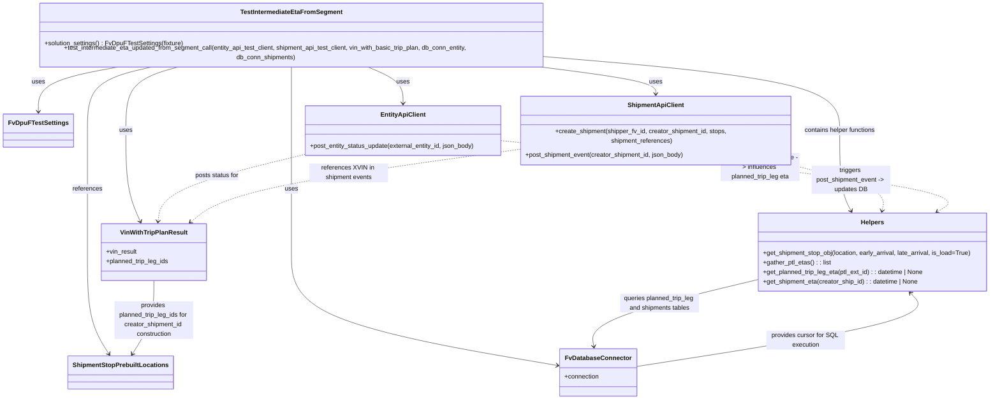

# Diagram: shipment_core/shipment_service/shipment_service/eta/e2e/test_intermediate_eta_from_segment.py

> Auto-generated by Obscura crawlers

## Mermaid

### SVG

<svg id="container" width="2525.76171875" xmlns="http://www.w3.org/2000/svg" class="classDiagram" height="976" viewBox="0 0 2525.76171875 976" role="graphics-document document" aria-roledescription="class"><g><defs><marker id="container_class-aggregationStart" class="marker aggregation class" refX="18" refY="7" markerWidth="190" markerHeight="240" orient="auto"><path d="M 18,7 L9,13 L1,7 L9,1 Z"></path></marker></defs><defs><marker id="container_class-aggregationEnd" class="marker aggregation class" refX="1" refY="7" markerWidth="20" markerHeight="28" orient="auto"><path d="M 18,7 L9,13 L1,7 L9,1 Z"></path></marker></defs><defs><marker id="container_class-extensionStart" class="marker extension class" refX="18" refY="7" markerWidth="190" markerHeight="240" orient="auto"><path d="M 1,7 L18,13 V 1 Z"></path></marker></defs><defs><marker id="container_class-extensionEnd" class="marker extension class" refX="1" refY="7" markerWidth="20" markerHeight="28" orient="auto"><path d="M 1,1 V 13 L18,7 Z"></path></marker></defs><defs><marker id="container_class-compositionStart" class="marker composition class" refX="18" refY="7" markerWidth="190" markerHeight="240" orient="auto"><path d="M 18,7 L9,13 L1,7 L9,1 Z"></path></marker></defs><defs><marker id="container_class-compositionEnd" class="marker composition class" refX="1" refY="7" markerWidth="20" markerHeight="28" orient="auto"><path d="M 18,7 L9,13 L1,7 L9,1 Z"></path></marker></defs><defs><marker id="container_class-dependencyStart" class="marker dependency class" refX="6" refY="7" markerWidth="190" markerHeight="240" orient="auto"><path d="M 5,7 L9,13 L1,7 L9,1 Z"></path></marker></defs><defs><marker id="container_class-dependencyEnd" class="marker dependency class" refX="13" refY="7" markerWidth="20" markerHeight="28" orient="auto"><path d="M 18,7 L9,13 L14,7 L9,1 Z"></path></marker></defs><defs><marker id="container_class-lollipopStart" class="marker lollipop class" refX="13" refY="7" markerWidth="190" markerHeight="240" orient="auto"><circle stroke="black" fill="transparent" cx="7" cy="7" r="6"></circle></marker></defs><defs><marker id="container_class-lollipopEnd" class="marker lollipop class" refX="1" refY="7" markerWidth="190" markerHeight="240" orient="auto"><circle stroke="black" fill="transparent" cx="7" cy="7" r="6"></circle></marker></defs><g class="root"><g class="clusters"></g><g class="edgePaths"><path d="M302.606,158L267.45,164.167C232.295,170.333,161.983,182.667,126.828,199.5C91.672,216.333,91.672,237.667,91.672,248.333L91.672,259" id="id_TestIntermediateEtaFromSegment_FvDpuFTestSettings_1" class="edge-thickness-normal edge-pattern-solid relation" style=";;;" data-edge="true" data-et="edge" data-id="id_TestIntermediateEtaFromSegment_FvDpuFTestSettings_1" data-points="W3sieCI6MzAyLjYwNjIwMTE3MTg3NSwieSI6MTU4fSx7IngiOjkxLjY3MTg3NSwieSI6MTk1fSx7IngiOjkxLjY3MTg3NSwieSI6MjY1fV0=" marker-end="url(#container_class-dependencyEnd)"></path><path d="M922.559,158L938.378,164.167C954.196,170.333,985.832,182.667,1001.651,196C1017.469,209.333,1017.469,223.667,1017.469,230.833L1017.469,238" id="id_TestIntermediateEtaFromSegment_EntityApiClient_2" class="edge-thickness-normal edge-pattern-solid relation" style=";;;" data-edge="true" data-et="edge" data-id="id_TestIntermediateEtaFromSegment_EntityApiClient_2" data-points="W3sieCI6OTIyLjU1OTQ2NTY4MDgwMzYsInkiOjE1OH0seyJ4IjoxMDE3LjQ2ODc1LCJ5IjoxOTV9LHsieCI6MTAxNy40Njg3NSwieSI6MjQ0fV0=" marker-end="url(#container_class-dependencyEnd)"></path><path d="M1357.513,158L1409.095,164.167C1460.676,170.333,1563.838,182.667,1615.419,194C1667,205.333,1667,215.667,1667,220.833L1667,226" id="id_TestIntermediateEtaFromSegment_ShipmentApiClient_3" class="edge-thickness-normal edge-pattern-solid relation" style=";;;" data-edge="true" data-et="edge" data-id="id_TestIntermediateEtaFromSegment_ShipmentApiClient_3" data-points="W3sieCI6MTM1Ny41MTM0Mjc3MzQzNzUsInkiOjE1OH0seyJ4IjoxNjY3LCJ5IjoxOTV9LHsieCI6MTY2NywieSI6MjMyfV0=" marker-end="url(#container_class-dependencyEnd)"></path><path d="M447.137,158L423.864,164.167C400.592,170.333,354.048,182.667,330.776,207.5C307.504,232.333,307.504,269.667,307.504,311C307.504,352.333,307.504,397.667,313.633,434.087C319.762,470.507,332.019,498.013,338.148,511.766L344.277,525.52" id="id_TestIntermediateEtaFromSegment_VinWithTripPlanResult_4" class="edge-thickness-normal edge-pattern-solid relation" style=";;;" data-edge="true" data-et="edge" data-id="id_TestIntermediateEtaFromSegment_VinWithTripPlanResult_4" data-points="W3sieCI6NDQ3LjEzNjU3OTI0MTA3MTQ0LCJ5IjoxNTh9LHsieCI6MzA3LjUwMzkwNjI1LCJ5IjoxOTV9LHsieCI6MzA3LjUwMzkwNjI1LCJ5IjozMDd9LHsieCI6MzA3LjUwMzkwNjI1LCJ5Ijo0NDN9LHsieCI6MzQ2LjcxOTMzNTkzNzUsInkiOjUzMX1d" marker-end="url(#container_class-dependencyEnd)"></path><path d="M730.176,158L730.176,164.167C730.176,170.333,730.176,182.667,730.176,207.5C730.176,232.333,730.176,269.667,730.176,311C730.176,352.333,730.176,397.667,730.176,447C730.176,496.333,730.176,549.667,730.176,605C730.176,660.333,730.176,717.667,844.455,765.63C958.735,813.594,1187.294,852.188,1301.574,871.485L1415.853,890.782" id="id_TestIntermediateEtaFromSegment_FvDatabaseConnector_5" class="edge-thickness-normal edge-pattern-solid relation" style=";;;" data-edge="true" data-et="edge" data-id="id_TestIntermediateEtaFromSegment_FvDatabaseConnector_5" data-points="W3sieCI6NzMwLjE3NTc4MTI1LCJ5IjoxNTh9LHsieCI6NzMwLjE3NTc4MTI1LCJ5IjoxOTV9LHsieCI6NzMwLjE3NTc4MTI1LCJ5IjozMDd9LHsieCI6NzMwLjE3NTc4MTI1LCJ5Ijo0NDN9LHsieCI6NzMwLjE3NTc4MTI1LCJ5Ijo2MDN9LHsieCI6NzMwLjE3NTc4MTI1LCJ5Ijo3NzV9LHsieCI6MTQyMS43Njk1MzEyNSwieSI6ODkxLjc4MTA2Njk2Njg3NjF9XQ==" marker-end="url(#container_class-dependencyEnd)"></path><path d="M382.074,158L353.452,164.167C324.831,170.333,267.587,182.667,238.965,207.5C210.344,232.333,210.344,269.667,210.344,311C210.344,352.333,210.344,397.667,210.344,447C210.344,496.333,210.344,549.667,210.344,605C210.344,660.333,210.344,717.667,219.414,760.655C228.484,803.644,246.625,832.287,255.695,846.609L264.765,860.931" id="id_TestIntermediateEtaFromSegment_ShipmentStopPrebuiltLocations_6" class="edge-thickness-normal edge-pattern-solid relation" style=";;;" data-edge="true" data-et="edge" data-id="id_TestIntermediateEtaFromSegment_ShipmentStopPrebuiltLocations_6" data-points="W3sieCI6MzgyLjA3Mzk3NDYwOTM3NSwieSI6MTU4fSx7IngiOjIxMC4zNDM3NSwieSI6MTk1fSx7IngiOjIxMC4zNDM3NSwieSI6MzA3fSx7IngiOjIxMC4zNDM3NSwieSI6NDQzfSx7IngiOjIxMC4zNDM3NSwieSI6NjAzfSx7IngiOjIxMC4zNDM3NSwieSI6Nzc1fSx7IngiOjI2Ny45NzUxMjMzNTUyNjMyLCJ5Ijo4NjZ9XQ==" marker-end="url(#container_class-dependencyEnd)"></path><path d="M1406.703,136.667L1529.261,146.389C1651.819,156.111,1896.935,175.556,2019.493,203.944C2142.051,232.333,2142.051,269.667,2142.051,311C2142.051,352.333,2142.051,397.667,2146.788,429.609C2151.525,461.552,2160.999,480.104,2165.736,489.38L2170.473,498.656" id="id_TestIntermediateEtaFromSegment_Helpers_7" class="edge-thickness-normal edge-pattern-solid relation" style=";;;" data-edge="true" data-et="edge" data-id="id_TestIntermediateEtaFromSegment_Helpers_7" data-points="W3sieCI6MTQwNi43MDMxMjUsInkiOjEzNi42NjY5NzY1MzgyOTEzfSx7IngiOjIxNDIuMDUwNzgxMjUsInkiOjE5NX0seyJ4IjoyMTQyLjA1MDc4MTI1LCJ5IjozMDd9LHsieCI6MjE0Mi4wNTA3ODEyNSwieSI6NDQzfSx7IngiOjIxNzMuMjAxNTg2OTE0MDYyMywieSI6NTA0fV0=" marker-end="url(#container_class-dependencyEnd)"></path><path d="M765.176,362.669L704.499,376.057C643.822,389.446,522.467,416.223,459.884,443.288C397.3,470.352,393.486,497.705,391.579,511.381L389.672,525.057" id="id_EntityApiClient_VinWithTripPlanResult_8" class="edge-thickness-normal edge-pattern-dashed relation" style=";;;" data-edge="true" data-et="edge" data-id="id_EntityApiClient_VinWithTripPlanResult_8" data-points="W3sieCI6NzY1LjE3NTc4MTI1LCJ5IjozNjIuNjY4OTIwNzYwMjY1NDV9LHsieCI6NDAxLjExMzI4MTI1LCJ5Ijo0NDN9LHsieCI6Mzg4Ljg0MzU1NDY4NzUsInkiOjUzMX1d" marker-end="url(#container_class-dependencyEnd)"></path><path d="M1319.762,350.353L1196.085,365.794C1072.408,381.235,825.053,412.118,683.923,441.599C542.794,471.08,507.888,499.159,490.435,513.199L472.982,527.239" id="id_ShipmentApiClient_VinWithTripPlanResult_9" class="edge-thickness-normal edge-pattern-dashed relation" style=";;;" data-edge="true" data-et="edge" data-id="id_ShipmentApiClient_VinWithTripPlanResult_9" data-points="W3sieCI6MTMxOS43NjE3MTg3NSwieSI6MzUwLjM1Mjk1MzYyMjA1NTQ1fSx7IngiOjU3Ny42OTkyMTg3NSwieSI6NDQzfSx7IngiOjQ2OC4zMDcyMjY1NjI1LCJ5Ijo1MzF9XQ==" marker-end="url(#container_class-dependencyEnd)"></path><path d="M1929.754,672.496L1857.48,689.58C1785.207,706.664,1640.66,740.832,1570.211,769.096C1499.763,797.359,1503.412,819.719,1505.237,830.899L1507.061,842.078" id="id_Helpers_FvDatabaseConnector_10" class="edge-thickness-normal edge-pattern-solid relation" style=";;;" data-edge="true" data-et="edge" data-id="id_Helpers_FvDatabaseConnector_10" data-points="W3sieCI6MTkyOS43NTM5MDYyNSwieSI6NjcyLjQ5NjM5NTE1MzQ1NDN9LHsieCI6MTQ5Ni4xMTMyODEyNSwieSI6Nzc1fSx7IngiOjE1MDguMDI3NjY2ODIzMzA4MiwieSI6ODQ4fV0=" marker-end="url(#container_class-dependencyEnd)"></path><path d="M378.805,675L378.805,691.667C378.805,708.333,378.805,741.667,369.734,772.655C360.664,803.644,342.524,832.287,333.454,846.609L324.384,860.931" id="id_VinWithTripPlanResult_ShipmentStopPrebuiltLocations_11" class="edge-thickness-normal edge-pattern-solid relation" style=";;;" data-edge="true" data-et="edge" data-id="id_VinWithTripPlanResult_ShipmentStopPrebuiltLocations_11" data-points="W3sieCI6Mzc4LjgwNDY4NzUsInkiOjY3NX0seyJ4IjozNzguODA0Njg3NSwieSI6Nzc1fSx7IngiOjMyMS4xNzMzMTQxNDQ3MzY4LCJ5Ijo4NjZ9XQ==" marker-end="url(#container_class-dependencyEnd)"></path><path d="M1995.153,382L2039.636,392.167C2084.119,402.333,2173.085,422.667,2215.367,442.027C2257.65,461.388,2253.249,479.777,2251.049,488.971L2248.848,498.165" id="id_ShipmentApiClient_Helpers_12" class="edge-thickness-normal edge-pattern-dashed relation" style=";;;" data-edge="true" data-et="edge" data-id="id_ShipmentApiClient_Helpers_12" data-points="W3sieCI6MTk5NS4xNTMwMDQzNjU4MDg4LCJ5IjozODJ9LHsieCI6MjI2Mi4wNTA3ODEyNSwieSI6NDQzfSx7IngiOjIyNDcuNDUxNTg2OTE0MDYyMywieSI6NTA0fV0=" marker-end="url(#container_class-dependencyEnd)"></path><path d="M1269.762,330.428L1471.81,349.19C1673.858,367.952,2077.954,405.476,2264.44,433.878C2450.926,462.28,2419.802,481.56,2404.24,491.2L2388.677,500.84" id="id_EntityApiClient_Helpers_13" class="edge-thickness-normal edge-pattern-dashed relation" style=";;;" data-edge="true" data-et="edge" data-id="id_EntityApiClient_Helpers_13" data-points="W3sieCI6MTI2OS43NjE3MTg3NSwieSI6MzMwLjQyNzczNzc1NTgxMjM2fSx7IngiOjI0ODIuMDUwNzgxMjUsInkiOjQ0M30seyJ4IjoyMzgzLjU3NjU4NjkxNDA2MjMsInkiOjUwNH1d" marker-end="url(#container_class-dependencyEnd)"></path><path d="M1613.871,893.247L1742.186,873.54C1870.5,853.832,2127.129,814.416,2244.807,783.273C2362.484,752.131,2341.211,729.262,2330.574,717.828L2319.937,706.393" id="id_FvDatabaseConnector_Helpers_14" class="edge-thickness-normal edge-pattern-solid relation" style=";;;" data-edge="true" data-et="edge" data-id="id_FvDatabaseConnector_Helpers_14" data-points="W3sieCI6MTYxMy44NzEwOTM3NSwieSI6ODkzLjI0NzQ4NzM2OTE4MDh9LHsieCI6MjM4My43NTc4MTI1LCJ5Ijo3NzV9LHsieCI6MjMxNS44NTA4MzU3NTU4MTQsInkiOjcwMn1d" marker-end="url(#container_class-dependencyEnd)"></path></g><g class="edgeLabels"><g class="edgeLabel" transform="translate(91.671875, 195)"><g class="label" data-id="id_TestIntermediateEtaFromSegment_FvDpuFTestSettings_1" transform="translate(-16.4921875, -12)"><foreignObject width="32.984375" height="24">

uses

</foreignObject></g></g><g class="edgeLabel" transform="translate(1017.46875, 195)"><g class="label" data-id="id_TestIntermediateEtaFromSegment_EntityApiClient_2" transform="translate(-16.4921875, -12)"><foreignObject width="32.984375" height="24">

uses

</foreignObject></g></g><g class="edgeLabel" transform="translate(1667, 195)"><g class="label" data-id="id_TestIntermediateEtaFromSegment_ShipmentApiClient_3" transform="translate(-16.4921875, -12)"><foreignObject width="32.984375" height="24">

uses

</foreignObject></g></g><g class="edgeLabel" transform="translate(307.50390625, 307)"><g class="label" data-id="id_TestIntermediateEtaFromSegment_VinWithTripPlanResult_4" transform="translate(-16.4921875, -12)"><foreignObject width="32.984375" height="24">

uses

</foreignObject></g></g><g class="edgeLabel" transform="translate(730.17578125, 443)"><g class="label" data-id="id_TestIntermediateEtaFromSegment_FvDatabaseConnector_5" transform="translate(-16.4921875, -12)"><foreignObject width="32.984375" height="24">

uses

</foreignObject></g></g><g class="edgeLabel" transform="translate(210.34375, 443)"><g class="label" data-id="id_TestIntermediateEtaFromSegment_ShipmentStopPrebuiltLocations_6" transform="translate(-37.828125, -12)"><foreignObject width="75.65625" height="24">

references

</foreignObject></g></g><g class="edgeLabel" transform="translate(2142.05078125, 307)"><g class="label" data-id="id_TestIntermediateEtaFromSegment_Helpers_7" transform="translate(-92.8125, -12)"><foreignObject width="185.625" height="24">

contains helper functions

</foreignObject></g></g><g class="edgeLabel" transform="translate(401.11328125, 443)"><g class="label" data-id="id_EntityApiClient_VinWithTripPlanResult_8" transform="translate(-56.5859375, -12)"><foreignObject width="113.171875" height="24">

posts status for

</foreignObject></g></g><g class="edgeLabel" transform="translate(879.07403, 405.37313)"><g class="label" data-id="id_ShipmentApiClient_VinWithTripPlanResult_9" transform="translate(-100, -24)"><foreignObject width="200" height="48">

references XVIN in shipment events

</foreignObject></g></g><g class="edgeLabel" transform="translate(1676.94249, 732.25575)"><g class="label" data-id="id_Helpers_FvDatabaseConnector_10" transform="translate(-100, -24)"><foreignObject width="200" height="48">

queries planned_trip_leg and shipments tables

</foreignObject></g></g><g class="edgeLabel" transform="translate(378.8046875, 775)"><g class="label" data-id="id_VinWithTripPlanResult_ShipmentStopPrebuiltLocations_11" transform="translate(-100, -48)"><foreignObject width="200" height="96">

provides planned_trip_leg_ids for creator_shipment_id construction

</foreignObject></g></g><g class="edgeLabel" transform="translate(2159.1749, 419.48752)"><g class="label" data-id="id_ShipmentApiClient_Helpers_12" transform="translate(-100, -36)"><foreignObject width="200" height="72">

triggers post_shipment_event -&gt; updates DB

</foreignObject></g></g><g class="edgeLabel" transform="translate(1933.57655, 392.06909)"><g class="label" data-id="id_EntityApiClient_Helpers_13" transform="translate(-100, -36)"><foreignObject width="200" height="72">

posts entity status update -&gt; influences planned_trip_leg eta

</foreignObject></g></g><g class="edgeLabel" transform="translate(2048.08733, 826.55588)"><g class="label" data-id="id_FvDatabaseConnector_Helpers_14" transform="translate(-100, -24)"><foreignObject width="200" height="48">

provides cursor for SQL execution

</foreignObject></g></g></g><g class="nodes"><g class="node default" id="classId-TestIntermediateEtaFromSegment-0" transform="translate(730.17578125, 83)"><g class="basic label-container"><path d="M-676.52734375 -75 L676.52734375 -75 L676.52734375 75 L-676.52734375 75" stroke="none" stroke-width="0" fill="#ECECFF" style=""></path><path d="M-676.52734375 -75 C-360.0785406511643 -75, -43.629737552328606 -75, 676.52734375 -75 M-676.52734375 -75 C-141.30432128492362 -75, 393.91870118015277 -75, 676.52734375 -75 M676.52734375 -75 C676.52734375 -22.38253140388231, 676.52734375 30.23493719223538, 676.52734375 75 M676.52734375 -75 C676.52734375 -37.005742906608084, 676.52734375 0.9885141867838314, 676.52734375 75 M676.52734375 75 C402.4081496454088 75, 128.2889555408176 75, -676.52734375 75 M676.52734375 75 C249.39002792358343 75, -177.74728790283314 75, -676.52734375 75 M-676.52734375 75 C-676.52734375 16.34918507331337, -676.52734375 -42.30162985337326, -676.52734375 -75 M-676.52734375 75 C-676.52734375 20.65143321580544, -676.52734375 -33.69713356838912, -676.52734375 -75" stroke="#9370DB" stroke-width="1.3" fill="none" stroke-dasharray="0 0" style=""></path></g><g class="annotation-group text" transform="translate(0, -51)"></g><g class="label-group text" transform="translate(-124.4921875, -51)"><g class="label" style="font-weight: bolder" transform="translate(0,-12)"><foreignObject width="248.984375" height="24">

TestIntermediateEtaFromSegment

</foreignObject></g></g><g class="members-group text" transform="translate(-664.52734375, -3)"></g><g class="methods-group text" transform="translate(-664.52734375, 27)"><g class="label" style="" transform="translate(0,-12)"><foreignObject width="353.03125" height="24">

+solution_settings() : FvDpuFTestSettings(fixture)

</foreignObject></g><g class="label" style="" transform="translate(0,12)"><foreignObject width="1204.5625" height="24">

+test_intermediate_eta_updated_from_segment_call(entity_api_test_client, shipment_api_test_client, vin_with_basic_trip_plan, db_conn_entity, db_conn_shipments)

</foreignObject></g></g><g class="divider" style=""><path d="M-676.52734375 -27 C-323.6770925559236 -27, 29.173158638152813 -27, 676.52734375 -27 M-676.52734375 -27 C-263.9345470468092 -27, 148.6582496563816 -27, 676.52734375 -27" stroke="#9370DB" stroke-width="1.3" fill="none" stroke-dasharray="0 0" style=""></path></g><g class="divider" style=""><path d="M-676.52734375 -3 C-339.43575957501855 -3, -2.344175400037102 -3, 676.52734375 -3 M-676.52734375 -3 C-289.65346324612506 -3, 97.22041725774989 -3, 676.52734375 -3" stroke="#9370DB" stroke-width="1.3" fill="none" stroke-dasharray="0 0" style=""></path></g></g><g class="node default" id="classId-FvDpuFTestSettings-1" transform="translate(91.671875, 307)"><g class="basic label-container"><path d="M-83.671875 -42 L83.671875 -42 L83.671875 42 L-83.671875 42" stroke="none" stroke-width="0" fill="#ECECFF" style=""></path><path d="M-83.671875 -42 C-29.156679537166752 -42, 25.358515925666495 -42, 83.671875 -42 M-83.671875 -42 C-38.68170592287748 -42, 6.308463154245047 -42, 83.671875 -42 M83.671875 -42 C83.671875 -14.699574841163297, 83.671875 12.600850317673405, 83.671875 42 M83.671875 -42 C83.671875 -8.598841412604664, 83.671875 24.802317174790673, 83.671875 42 M83.671875 42 C21.500943150909748 42, -40.669988698180504 42, -83.671875 42 M83.671875 42 C45.97254333273147 42, 8.273211665462938 42, -83.671875 42 M-83.671875 42 C-83.671875 10.252462925185966, -83.671875 -21.495074149628067, -83.671875 -42 M-83.671875 42 C-83.671875 12.746878962603105, -83.671875 -16.50624207479379, -83.671875 -42" stroke="#9370DB" stroke-width="1.3" fill="none" stroke-dasharray="0 0" style=""></path></g><g class="annotation-group text" transform="translate(0, -18)"></g><g class="label-group text" transform="translate(-71.671875, -18)"><g class="label" style="font-weight: bolder" transform="translate(0,-12)"><foreignObject width="143.34375" height="24">

FvDpuFTestSettings

</foreignObject></g></g><g class="members-group text" transform="translate(-71.671875, 30)"></g><g class="methods-group text" transform="translate(-71.671875, 60)"></g><g class="divider" style=""><path d="M-83.671875 6 C-33.91882095352529 6, 15.834233092949418 6, 83.671875 6 M-83.671875 6 C-19.305864800414426 6, 45.06014539917115 6, 83.671875 6" stroke="#9370DB" stroke-width="1.3" fill="none" stroke-dasharray="0 0" style=""></path></g><g class="divider" style=""><path d="M-83.671875 24 C-24.180208925561786 24, 35.31145714887643 24, 83.671875 24 M-83.671875 24 C-47.24373441689947 24, -10.815593833798943 24, 83.671875 24" stroke="#9370DB" stroke-width="1.3" fill="none" stroke-dasharray="0 0" style=""></path></g></g><g class="node default" id="classId-EntityApiClient-2" transform="translate(1017.46875, 307)"><g class="basic label-container"><path d="M-252.29296875 -63 L252.29296875 -63 L252.29296875 63 L-252.29296875 63" stroke="none" stroke-width="0" fill="#ECECFF" style=""></path><path d="M-252.29296875 -63 C-81.46539449074146 -63, 89.36217976851708 -63, 252.29296875 -63 M-252.29296875 -63 C-51.270819228997084 -63, 149.75133029200583 -63, 252.29296875 -63 M252.29296875 -63 C252.29296875 -29.79763509114305, 252.29296875 3.4047298177139, 252.29296875 63 M252.29296875 -63 C252.29296875 -33.192183262246864, 252.29296875 -3.3843665244937284, 252.29296875 63 M252.29296875 63 C90.47968448228491 63, -71.33359978543018 63, -252.29296875 63 M252.29296875 63 C64.85848584494656 63, -122.57599706010689 63, -252.29296875 63 M-252.29296875 63 C-252.29296875 28.821799411638167, -252.29296875 -5.356401176723665, -252.29296875 -63 M-252.29296875 63 C-252.29296875 22.481819783183475, -252.29296875 -18.03636043363305, -252.29296875 -63" stroke="#9370DB" stroke-width="1.3" fill="none" stroke-dasharray="0 0" style=""></path></g><g class="annotation-group text" transform="translate(0, -39)"></g><g class="label-group text" transform="translate(-54.3046875, -39)"><g class="label" style="font-weight: bolder" transform="translate(0,-12)"><foreignObject width="108.609375" height="24">

EntityApiClient

</foreignObject></g></g><g class="members-group text" transform="translate(-240.29296875, 9)"></g><g class="methods-group text" transform="translate(-240.29296875, 39)"><g class="label" style="" transform="translate(0,-12)"><foreignObject width="426.28125" height="24">

+post_entity_status_update(external_entity_id, json_body)

</foreignObject></g></g><g class="divider" style=""><path d="M-252.29296875 -15 C-83.86510120736958 -15, 84.56276633526085 -15, 252.29296875 -15 M-252.29296875 -15 C-135.71725765318922 -15, -19.141546556378415 -15, 252.29296875 -15" stroke="#9370DB" stroke-width="1.3" fill="none" stroke-dasharray="0 0" style=""></path></g><g class="divider" style=""><path d="M-252.29296875 9 C-53.71655798820592 9, 144.85985277358816 9, 252.29296875 9 M-252.29296875 9 C-56.810515959234635 9, 138.67193683153073 9, 252.29296875 9" stroke="#9370DB" stroke-width="1.3" fill="none" stroke-dasharray="0 0" style=""></path></g></g><g class="node default" id="classId-ShipmentApiClient-3" transform="translate(1667, 307)"><g class="basic label-container"><path d="M-347.23828125 -75 L347.23828125 -75 L347.23828125 75 L-347.23828125 75" stroke="none" stroke-width="0" fill="#ECECFF" style=""></path><path d="M-347.23828125 -75 C-99.17605506998518 -75, 148.88617111002964 -75, 347.23828125 -75 M-347.23828125 -75 C-195.42017516229575 -75, -43.6020690745915 -75, 347.23828125 -75 M347.23828125 -75 C347.23828125 -20.523041288513966, 347.23828125 33.95391742297207, 347.23828125 75 M347.23828125 -75 C347.23828125 -26.04888376879488, 347.23828125 22.90223246241024, 347.23828125 75 M347.23828125 75 C179.32660727403461 75, 11.41493329806923 75, -347.23828125 75 M347.23828125 75 C179.41198852251773 75, 11.585695795035463 75, -347.23828125 75 M-347.23828125 75 C-347.23828125 18.475768945757828, -347.23828125 -38.048462108484344, -347.23828125 -75 M-347.23828125 75 C-347.23828125 15.541415968807001, -347.23828125 -43.917168062386, -347.23828125 -75" stroke="#9370DB" stroke-width="1.3" fill="none" stroke-dasharray="0 0" style=""></path></g><g class="annotation-group text" transform="translate(0, -51)"></g><g class="label-group text" transform="translate(-68.1328125, -51)"><g class="label" style="font-weight: bolder" transform="translate(0,-12)"><foreignObject width="136.265625" height="24">

ShipmentApiClient

</foreignObject></g></g><g class="members-group text" transform="translate(-335.23828125, -3)"></g><g class="methods-group text" transform="translate(-335.23828125, 27)"><g class="label" style="" transform="translate(0,-12)"><foreignObject width="602.34375" height="24">

+create_shipment(shipper_fv_id, creator_shipment_id, stops, shipment_references)

</foreignObject></g><g class="label" style="" transform="translate(0,12)"><foreignObject width="408.46875" height="24">

+post_shipment_event(creator_shipment_id, json_body)

</foreignObject></g></g><g class="divider" style=""><path d="M-347.23828125 -27 C-113.17674442347655 -27, 120.8847924030469 -27, 347.23828125 -27 M-347.23828125 -27 C-72.96662631514329 -27, 201.30502861971343 -27, 347.23828125 -27" stroke="#9370DB" stroke-width="1.3" fill="none" stroke-dasharray="0 0" style=""></path></g><g class="divider" style=""><path d="M-347.23828125 -3 C-71.98591332953487 -3, 203.26645459093027 -3, 347.23828125 -3 M-347.23828125 -3 C-100.2036360724288 -3, 146.8310091051424 -3, 347.23828125 -3" stroke="#9370DB" stroke-width="1.3" fill="none" stroke-dasharray="0 0" style=""></path></g></g><g class="node default" id="classId-VinWithTripPlanResult-4" transform="translate(378.8046875, 603)"><g class="basic label-container"><path d="M-133.4609375 -72 L133.4609375 -72 L133.4609375 72 L-133.4609375 72" stroke="none" stroke-width="0" fill="#ECECFF" style=""></path><path d="M-133.4609375 -72 C-38.153696189433504 -72, 57.15354512113299 -72, 133.4609375 -72 M-133.4609375 -72 C-54.76925516833086 -72, 23.922427163338284 -72, 133.4609375 -72 M133.4609375 -72 C133.4609375 -17.64485579680119, 133.4609375 36.71028840639762, 133.4609375 72 M133.4609375 -72 C133.4609375 -29.195529926270495, 133.4609375 13.608940147459009, 133.4609375 72 M133.4609375 72 C78.39428433555314 72, 23.327631171106276 72, -133.4609375 72 M133.4609375 72 C41.73853256141581 72, -49.98387237716838 72, -133.4609375 72 M-133.4609375 72 C-133.4609375 38.96817461506729, -133.4609375 5.9363492301345815, -133.4609375 -72 M-133.4609375 72 C-133.4609375 15.5498111164923, -133.4609375 -40.9003777670154, -133.4609375 -72" stroke="#9370DB" stroke-width="1.3" fill="none" stroke-dasharray="0 0" style=""></path></g><g class="annotation-group text" transform="translate(0, -48)"></g><g class="label-group text" transform="translate(-81.6875, -48)"><g class="label" style="font-weight: bolder" transform="translate(0,-12)"><foreignObject width="163.375" height="24">

VinWithTripPlanResult

</foreignObject></g></g><g class="members-group text" transform="translate(-121.4609375, 0)"><g class="label" style="" transform="translate(0,-12)"><foreignObject width="79.578125" height="24">

+vin_result

</foreignObject></g><g class="label" style="" transform="translate(0,12)"><foreignObject width="161.234375" height="24">

+planned_trip_leg_ids

</foreignObject></g></g><g class="methods-group text" transform="translate(-121.4609375, 72)"></g><g class="divider" style=""><path d="M-133.4609375 -24 C-63.38796066523089 -24, 6.6850161695382155 -24, 133.4609375 -24 M-133.4609375 -24 C-53.68427445095185 -24, 26.092388598096306 -24, 133.4609375 -24" stroke="#9370DB" stroke-width="1.3" fill="none" stroke-dasharray="0 0" style=""></path></g><g class="divider" style=""><path d="M-133.4609375 48 C-33.779349737266756 48, 65.90223802546649 48, 133.4609375 48 M-133.4609375 48 C-42.621289665154876 48, 48.21835816969025 48, 133.4609375 48" stroke="#9370DB" stroke-width="1.3" fill="none" stroke-dasharray="0 0" style=""></path></g></g><g class="node default" id="classId-FvDatabaseConnector-5" transform="translate(1517.8203125, 908)"><g class="basic label-container"><path d="M-96.05078125 -60 L96.05078125 -60 L96.05078125 60 L-96.05078125 60" stroke="none" stroke-width="0" fill="#ECECFF" style=""></path><path d="M-96.05078125 -60 C-49.78009451849603 -60, -3.509407786992057 -60, 96.05078125 -60 M-96.05078125 -60 C-39.16619800783945 -60, 17.718385234321104 -60, 96.05078125 -60 M96.05078125 -60 C96.05078125 -27.706312065918787, 96.05078125 4.587375868162425, 96.05078125 60 M96.05078125 -60 C96.05078125 -34.38080426481347, 96.05078125 -8.76160852962694, 96.05078125 60 M96.05078125 60 C38.79266616471958 60, -18.465448920560846 60, -96.05078125 60 M96.05078125 60 C42.92773511689487 60, -10.195311016210255 60, -96.05078125 60 M-96.05078125 60 C-96.05078125 12.400702090676326, -96.05078125 -35.19859581864735, -96.05078125 -60 M-96.05078125 60 C-96.05078125 25.844390929692025, -96.05078125 -8.31121814061595, -96.05078125 -60" stroke="#9370DB" stroke-width="1.3" fill="none" stroke-dasharray="0 0" style=""></path></g><g class="annotation-group text" transform="translate(0, -36)"></g><g class="label-group text" transform="translate(-79.3046875, -36)"><g class="label" style="font-weight: bolder" transform="translate(0,-12)"><foreignObject width="158.609375" height="24">

FvDatabaseConnector

</foreignObject></g></g><g class="members-group text" transform="translate(-84.05078125, 12)"><g class="label" style="" transform="translate(0,-12)"><foreignObject width="88.796875" height="24">

+connection

</foreignObject></g></g><g class="methods-group text" transform="translate(-84.05078125, 60)"></g><g class="divider" style=""><path d="M-96.05078125 -12 C-20.122060109069935 -12, 55.80666103186013 -12, 96.05078125 -12 M-96.05078125 -12 C-23.47856302898016 -12, 49.09365519203968 -12, 96.05078125 -12" stroke="#9370DB" stroke-width="1.3" fill="none" stroke-dasharray="0 0" style=""></path></g><g class="divider" style=""><path d="M-96.05078125 36 C-34.831461894784226 36, 26.387857460431547 36, 96.05078125 36 M-96.05078125 36 C-50.564493761105815 36, -5.078206272211631 36, 96.05078125 36" stroke="#9370DB" stroke-width="1.3" fill="none" stroke-dasharray="0 0" style=""></path></g></g><g class="node default" id="classId-ShipmentStopPrebuiltLocations-6" transform="translate(294.57421875, 908)"><g class="basic label-container"><path d="M-128.3828125 -42 L128.3828125 -42 L128.3828125 42 L-128.3828125 42" stroke="none" stroke-width="0" fill="#ECECFF" style=""></path><path d="M-128.3828125 -42 C-53.029172763536224 -42, 22.324466972927553 -42, 128.3828125 -42 M-128.3828125 -42 C-70.93513836782758 -42, -13.487464235655153 -42, 128.3828125 -42 M128.3828125 -42 C128.3828125 -11.381323045387546, 128.3828125 19.237353909224908, 128.3828125 42 M128.3828125 -42 C128.3828125 -17.576590712662764, 128.3828125 6.846818574674472, 128.3828125 42 M128.3828125 42 C56.03932716005785 42, -16.304158179884297 42, -128.3828125 42 M128.3828125 42 C59.54949498435643 42, -9.283822531287143 42, -128.3828125 42 M-128.3828125 42 C-128.3828125 17.536522449581682, -128.3828125 -6.926955100836636, -128.3828125 -42 M-128.3828125 42 C-128.3828125 11.00686129250498, -128.3828125 -19.98627741499004, -128.3828125 -42" stroke="#9370DB" stroke-width="1.3" fill="none" stroke-dasharray="0 0" style=""></path></g><g class="annotation-group text" transform="translate(0, -18)"></g><g class="label-group text" transform="translate(-116.3828125, -18)"><g class="label" style="font-weight: bolder" transform="translate(0,-12)"><foreignObject width="232.765625" height="24">

ShipmentStopPrebuiltLocations

</foreignObject></g></g><g class="members-group text" transform="translate(-116.3828125, 30)"></g><g class="methods-group text" transform="translate(-116.3828125, 60)"></g><g class="divider" style=""><path d="M-128.3828125 6 C-63.78915786636715 6, 0.8044967672657037 6, 128.3828125 6 M-128.3828125 6 C-51.226474858869096 6, 25.929862782261807 6, 128.3828125 6" stroke="#9370DB" stroke-width="1.3" fill="none" stroke-dasharray="0 0" style=""></path></g><g class="divider" style=""><path d="M-128.3828125 24 C-65.3719080450629 24, -2.3610035901258044 24, 128.3828125 24 M-128.3828125 24 C-66.82878315213483 24, -5.2747538042696505 24, 128.3828125 24" stroke="#9370DB" stroke-width="1.3" fill="none" stroke-dasharray="0 0" style=""></path></g></g><g class="node default" id="classId-Helpers-7" transform="translate(2223.7578125, 603)"><g class="basic label-container"><path d="M-294.00390625 -99 L294.00390625 -99 L294.00390625 99 L-294.00390625 99" stroke="none" stroke-width="0" fill="#ECECFF" style=""></path><path d="M-294.00390625 -99 C-140.2664712603589 -99, 13.470963729282175 -99, 294.00390625 -99 M-294.00390625 -99 C-65.58856831164175 -99, 162.8267696267165 -99, 294.00390625 -99 M294.00390625 -99 C294.00390625 -49.90051853325461, 294.00390625 -0.8010370665092239, 294.00390625 99 M294.00390625 -99 C294.00390625 -26.061519443384924, 294.00390625 46.87696111323015, 294.00390625 99 M294.00390625 99 C139.73260331433204 99, -14.538699621335923 99, -294.00390625 99 M294.00390625 99 C138.2306816939942 99, -17.5425428620116 99, -294.00390625 99 M-294.00390625 99 C-294.00390625 43.94832706800321, -294.00390625 -11.103345863993582, -294.00390625 -99 M-294.00390625 99 C-294.00390625 37.978515280947434, -294.00390625 -23.042969438105132, -294.00390625 -99" stroke="#9370DB" stroke-width="1.3" fill="none" stroke-dasharray="0 0" style=""></path></g><g class="annotation-group text" transform="translate(0, -75)"></g><g class="label-group text" transform="translate(-28.2890625, -75)"><g class="label" style="font-weight: bolder" transform="translate(0,-12)"><foreignObject width="56.578125" height="24">

Helpers

</foreignObject></g></g><g class="members-group text" transform="translate(-282.00390625, -27)"></g><g class="methods-group text" transform="translate(-282.00390625, 3)"><g class="label" style="" transform="translate(0,-12)"><foreignObject width="535.71875" height="24">

+get_shipment_stop_obj(location, early_arrival, late_arrival, is_load=True)

</foreignObject></g><g class="label" style="" transform="translate(0,12)"><foreignObject width="173.21875" height="24">

+gather_ptl_etas() : : list

</foreignObject></g><g class="label" style="" transform="translate(0,36)"><foreignObject width="414.96875" height="24">

+get_planned_trip_leg_eta(ptl_ext_id) : : datetime | None

</foreignObject></g><g class="label" style="" transform="translate(0,60)"><foreignObject width="399.375" height="24">

+get_shipment_eta(creator_ship_id) : : datetime | None

</foreignObject></g></g><g class="divider" style=""><path d="M-294.00390625 -51 C-119.62030622893485 -51, 54.7632937921303 -51, 294.00390625 -51 M-294.00390625 -51 C-172.93203255324954 -51, -51.860158856499055 -51, 294.00390625 -51" stroke="#9370DB" stroke-width="1.3" fill="none" stroke-dasharray="0 0" style=""></path></g><g class="divider" style=""><path d="M-294.00390625 -27 C-163.97823740120958 -27, -33.952568552419166 -27, 294.00390625 -27 M-294.00390625 -27 C-81.56246828970379 -27, 130.87896967059243 -27, 294.00390625 -27" stroke="#9370DB" stroke-width="1.3" fill="none" stroke-dasharray="0 0" style=""></path></g></g></g></g></g></svg>
