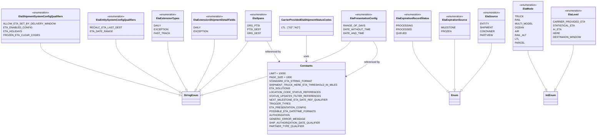

# Diagram: shipment_core/shipment_service/shipment_service/eta/eta_constants.py

> Auto-generated by Obscura crawlers

## Mermaid

```mermaid
classDiagram
    class StringEnum
    class IntEnum
    class Enum

    class EtaShipmentSystemConfigQualifiers <<enumeration>> {
      ALLOW_ETA_SET_BY_DELIVERY_WINDOW
      ETA_ENABLED_CONFIG
      ETA_HOLIDAYS
      FROZEN_ETA_CLEAR_CODES
    }
    class EtaEntitySystemConfigQualifiers <<enumeration>> {
      RECALC_ETA_LAST_DEST
      ETA_DATE_RANGE
    }
    class EtaExpirationSource <<enumeration>> {
      MILESTONE
      FROZEN
    }
    class EtaExpirationRecordStatus <<enumeration>> {
      PROCESSING
      PROCESSED
      QUEUED
    }
    class EtaSpans <<enumeration>> {
      ORG_PTSI
      PTSI_DEST
      ORG_DEST
    }
    class EtaMode <<enumeration>> {
      TRUCK
      RAIL
      MULTI_MODEL
      OCEAN
      AIR
      RAIL_ALT
      LTL
      PARCEL
    }
    class EtaSource <<enumeration>> {
      ENTITY
      SHIPMENT
      CONTAINER
      PARTVIEW
    }
    class EtaLevel <<enumeration>> {
      CARRIER_PROVIDED_ETA
      STATISTICAL_ETA
      AI_ETA
      HERE
      DESTINAION_WINDOW
    }
    class EtaExtensionTypes <<enumeration>> {
      DAILY
      EXCEPTION
      FAST_TRACK
    }
    class EtaExtensionShipmentDetailFields <<enumeration>> {
      DAILY
      EXCEPTION
    }
    class EtaPresentationConfig <<enumeration>> {
      RANGE_OF_DAYS
      DATE_WITHOUT_TIME
      DATE_AND_TIME
    }
    class CarrierProvidedEtaShipmentStatusCodes {
      LTL : ["X2","AG"]
    }
    class Constants {
      LIMIT = 10000
      PAGE_SIZE = 1000
      STANDARD_ETA_STRING_FORMAT
      SHIPMENT_TRUCK_HERE_ETA_THRESHOLD_IN_MILES
      ETA_SOLUTIONS
      LOCATION_CODE_STATUS_REFERENCES
      STATUS_UPDATES_FILTER_REFERENCES
      NEXT_MILESTONE_ETA_DATE_REF_QUALIFIER
      TRIGGER_TYPES
      ETA_PRESENTATION_CONFIG
      POSSIBLE_ETA_DATETIME_FORMATS
      AUTHORIZATION
      GENERIC_ERROR_MESSAGE
      SHIP_AUTHORIZATION_DATE_QUALIFIER
      PARTNER_TYPE_QUALIFIER
    }

    EtaShipmentSystemConfigQualifiers --|> StringEnum
    EtaEntitySystemConfigQualifiers --|> StringEnum
    EtaSpans --|> StringEnum
    EtaExtensionTypes --|> StringEnum
    EtaExtensionShipmentDetailFields --|> StringEnum
    EtaPresentationConfig --|> StringEnum

    EtaMode --|> IntEnum
    EtaLevel --|> IntEnum

    EtaExpirationRecordStatus --|> Enum
    EtaExpirationSource --|> Enum
    EtaSource --|> Enum

    CarrierProvidedEtaShipmentStatusCodes --> Constants : uses
    EtaSpans --> Constants : referenced by
    EtaPresentationConfig --> Constants : referenced by
```

> SVG rendering failed for this diagram.
