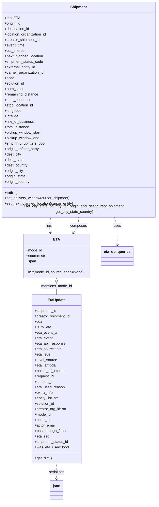

# Diagram: shipment_core/shipment_service/shipment_service/eta/eta_entities.py

> Auto-generated by Obscura crawlers

## Mermaid

### SVG

<svg id="container" width="700.796875" xmlns="http://www.w3.org/2000/svg" class="classDiagram" height="2194" viewBox="0 0 700.796875 2194" role="graphics-document document" aria-roledescription="class"><g><defs><marker id="container_class-aggregationStart" class="marker aggregation class" refX="18" refY="7" markerWidth="190" markerHeight="240" orient="auto"><path d="M 18,7 L9,13 L1,7 L9,1 Z"></path></marker></defs><defs><marker id="container_class-aggregationEnd" class="marker aggregation class" refX="1" refY="7" markerWidth="20" markerHeight="28" orient="auto"><path d="M 18,7 L9,13 L1,7 L9,1 Z"></path></marker></defs><defs><marker id="container_class-extensionStart" class="marker extension class" refX="18" refY="7" markerWidth="190" markerHeight="240" orient="auto"><path d="M 1,7 L18,13 V 1 Z"></path></marker></defs><defs><marker id="container_class-extensionEnd" class="marker extension class" refX="1" refY="7" markerWidth="20" markerHeight="28" orient="auto"><path d="M 1,1 V 13 L18,7 Z"></path></marker></defs><defs><marker id="container_class-compositionStart" class="marker composition class" refX="18" refY="7" markerWidth="190" markerHeight="240" orient="auto"><path d="M 18,7 L9,13 L1,7 L9,1 Z"></path></marker></defs><defs><marker id="container_class-compositionEnd" class="marker composition class" refX="1" refY="7" markerWidth="20" markerHeight="28" orient="auto"><path d="M 18,7 L9,13 L1,7 L9,1 Z"></path></marker></defs><defs><marker id="container_class-dependencyStart" class="marker dependency class" refX="6" refY="7" markerWidth="190" markerHeight="240" orient="auto"><path d="M 5,7 L9,13 L1,7 L9,1 Z"></path></marker></defs><defs><marker id="container_class-dependencyEnd" class="marker dependency class" refX="13" refY="7" markerWidth="20" markerHeight="28" orient="auto"><path d="M 18,7 L9,13 L14,7 L9,1 Z"></path></marker></defs><defs><marker id="container_class-lollipopStart" class="marker lollipop class" refX="13" refY="7" markerWidth="190" markerHeight="240" orient="auto"><circle stroke="black" fill="transparent" cx="7" cy="7" r="6"></circle></marker></defs><defs><marker id="container_class-lollipopEnd" class="marker lollipop class" refX="1" refY="7" markerWidth="190" markerHeight="240" orient="auto"><circle stroke="black" fill="transparent" cx="7" cy="7" r="6"></circle></marker></defs><g class="root"><g class="clusters"></g><g class="edgePaths"><path d="M230.356,944L228.774,950.167C227.192,956.333,224.029,968.667,223.799,980.032C223.568,991.398,226.272,1001.795,227.623,1006.994L228.975,1012.193" id="id_Shipment_ETA_1" class="edge-thickness-normal edge-pattern-solid relation" style=";;;" data-edge="true" data-et="edge" data-id="id_Shipment_ETA_1" data-points="W3sieCI6MjMwLjM1NTc4NTg5MTA4OTEsInkiOjk0NH0seyJ4IjoyMjAuODY1MjM0Mzc1LCJ5Ijo5ODF9LHsieCI6MjMwLjQ4NDcxMjc1ODQ1ODY0LCJ5IjoxMDE4fV0=" marker-end="url(#container_class-dependencyEnd)"></path><path d="M505.997,944L508.047,950.167C510.098,956.333,514.198,968.667,516.249,989C518.299,1009.333,518.299,1037.667,518.299,1051.833L518.299,1066" id="id_Shipment_eta_db_queries_2" class="edge-thickness-normal edge-pattern-dashed relation" style=";;;" data-edge="true" data-et="edge" data-id="id_Shipment_eta_db_queries_2" data-points="W3sieCI6NTA1Ljk5NzIxNTM0NjUzNDYzLCJ5Ijo5NDR9LHsieCI6NTE4LjI5ODgyODEyNSwieSI6OTgxfSx7IngiOjUxOC4yOTg4MjgxMjUsInkiOjEwNzJ9XQ==" marker-end="url(#container_class-dependencyEnd)"></path><path d="M350.398,944L350.398,950.167C350.398,956.333,350.398,968.667,346.577,980.186C342.755,991.706,335.112,1002.411,331.29,1007.764L327.469,1013.117" id="id_Shipment_ETA_3" class="edge-thickness-normal edge-pattern-dashed relation" style=";;;" data-edge="true" data-et="edge" data-id="id_Shipment_ETA_3" data-points="W3sieCI6MzUwLjM5ODQzNzUsInkiOjk0NH0seyJ4IjozNTAuMzk4NDM3NSwieSI6OTgxfSx7IngiOjMyMy45ODIzNjMxMzQzOTg1LCJ5IjoxMDE4fV0=" marker-end="url(#container_class-dependencyEnd)"></path><path d="M255.443,2028L255.443,2034.167C255.443,2040.333,255.443,2052.667,255.443,2064C255.443,2075.333,255.443,2085.667,255.443,2090.833L255.443,2096" id="id_EtaUpdate_json_4" class="edge-thickness-normal edge-pattern-dashed relation" style=";;;" data-edge="true" data-et="edge" data-id="id_EtaUpdate_json_4" data-points="W3sieCI6MjU1LjQ0MzM1OTM3NSwieSI6MjAyOH0seyJ4IjoyNTUuNDQzMzU5Mzc1LCJ5IjoyMDY1fSx7IngiOjI1NS40NDMzNTkzNzUsInkiOjIxMDJ9XQ==" marker-end="url(#container_class-dependencyEnd)"></path><path d="M255.443,1227.25L255.443,1230.542C255.443,1233.833,255.443,1240.417,255.443,1249.875C255.443,1259.333,255.443,1271.667,255.443,1277.833L255.443,1284" id="id_ETA_EtaUpdate_5" class="edge-thickness-normal edge-pattern-solid relation" style=";;;" data-edge="true" data-et="edge" data-id="id_ETA_EtaUpdate_5" data-points="W3sieCI6MjU1LjQ0MzM1OTM3NSwieSI6MTIxMH0seyJ4IjoyNTUuNDQzMzU5Mzc1LCJ5IjoxMjQ3fSx7IngiOjI1NS40NDMzNTkzNzUsInkiOjEyODR9XQ==" marker-start="url(#container_class-extensionStart)"></path></g><g class="edgeLabels"><g class="edgeLabel" transform="translate(220.86929, 981.0156)"><g class="label" data-id="id_Shipment_ETA_1" transform="translate(-12.703125, -12)"><foreignObject width="25.40625" height="24">

has

</foreignObject></g></g><g class="edgeLabel" transform="translate(518.298828125, 981)"><g class="label" data-id="id_Shipment_eta_db_queries_2" transform="translate(-16.4921875, -12)"><foreignObject width="32.984375" height="24">

uses

</foreignObject></g></g><g class="edgeLabel" transform="translate(350.3984375, 981)"><g class="label" data-id="id_Shipment_ETA_3" transform="translate(-36.453125, -12)"><foreignObject width="72.90625" height="24">

composes

</foreignObject></g></g><g class="edgeLabel" transform="translate(255.443359375, 2065)"><g class="label" data-id="id_EtaUpdate_json_4" transform="translate(-33.8515625, -12)"><foreignObject width="67.703125" height="24">

serializes

</foreignObject></g></g><g class="edgeLabel" transform="translate(255.443359375, 1247)"><g class="label" data-id="id_ETA_EtaUpdate_5" transform="translate(-69.859375, -12)"><foreignObject width="139.71875" height="24">

mentions_mode_id

</foreignObject></g></g></g><g class="nodes"><g class="node default" id="classId-ETA-0" transform="translate(255.443359375, 1114)"><g class="basic label-container"><path d="M-144.10546875 -96 L144.10546875 -96 L144.10546875 96 L-144.10546875 96" stroke="none" stroke-width="0" fill="#ECECFF" style=""></path><path d="M-144.10546875 -96 C-70.71140183529201 -96, 2.682665079415983 -96, 144.10546875 -96 M-144.10546875 -96 C-70.18894537072056 -96, 3.727578008558879 -96, 144.10546875 -96 M144.10546875 -96 C144.10546875 -43.54713042938934, 144.10546875 8.905739141221318, 144.10546875 96 M144.10546875 -96 C144.10546875 -42.82656462883481, 144.10546875 10.346870742330381, 144.10546875 96 M144.10546875 96 C33.37247004130636 96, -77.36052866738729 96, -144.10546875 96 M144.10546875 96 C62.890712132107765 96, -18.32404448578447 96, -144.10546875 96 M-144.10546875 96 C-144.10546875 52.574391239314316, -144.10546875 9.148782478628632, -144.10546875 -96 M-144.10546875 96 C-144.10546875 47.91852827012992, -144.10546875 -0.16294345974016267, -144.10546875 -96" stroke="#9370DB" stroke-width="1.3" fill="none" stroke-dasharray="0 0" style=""></path></g><g class="annotation-group text" transform="translate(0, -72)"></g><g class="label-group text" transform="translate(-12.8515625, -72)"><g class="label" style="font-weight: bolder" transform="translate(0,-12)"><foreignObject width="25.703125" height="24">

ETA

</foreignObject></g></g><g class="members-group text" transform="translate(-132.10546875, -24)"><g class="label" style="" transform="translate(0,-12)"><foreignObject width="71.421875" height="24">

+mode_id

</foreignObject></g><g class="label" style="" transform="translate(0,12)"><foreignObject width="83.375" height="24">

+source: str

</foreignObject></g><g class="label" style="" transform="translate(0,36)"><foreignObject width="42.890625" height="24">

+span

</foreignObject></g></g><g class="methods-group text" transform="translate(-132.10546875, 72)"><g class="label" style="" transform="translate(0,-12)"><foreignObject width="251.359375" height="24">

+<strong>init</strong>(mode_id, source, span=None)

</foreignObject></g></g><g class="divider" style=""><path d="M-144.10546875 -48 C-36.472023797797746 -48, 71.16142115440451 -48, 144.10546875 -48 M-144.10546875 -48 C-67.53938935668225 -48, 9.0266900366355 -48, 144.10546875 -48" stroke="#9370DB" stroke-width="1.3" fill="none" stroke-dasharray="0 0" style=""></path></g><g class="divider" style=""><path d="M-144.10546875 48 C-83.28610640006042 48, -22.466744050120823 48, 144.10546875 48 M-144.10546875 48 C-60.604010289991194 48, 22.89744817001761 48, 144.10546875 48" stroke="#9370DB" stroke-width="1.3" fill="none" stroke-dasharray="0 0" style=""></path></g></g><g class="node default" id="classId-Shipment-1" transform="translate(350.3984375, 476)"><g class="basic label-container"><path d="M-342.3984375 -468 L342.3984375 -468 L342.3984375 468 L-342.3984375 468" stroke="none" stroke-width="0" fill="#ECECFF" style=""></path><path d="M-342.3984375 -468 C-161.85654056847392 -468, 18.685356363052165 -468, 342.3984375 -468 M-342.3984375 -468 C-70.57043716908834 -468, 201.25756316182333 -468, 342.3984375 -468 M342.3984375 -468 C342.3984375 -254.39676440367242, 342.3984375 -40.79352880734484, 342.3984375 468 M342.3984375 -468 C342.3984375 -171.61624420151077, 342.3984375 124.76751159697847, 342.3984375 468 M342.3984375 468 C72.94954804309555 468, -196.4993414138089 468, -342.3984375 468 M342.3984375 468 C195.48693379428403 468, 48.575430088568055 468, -342.3984375 468 M-342.3984375 468 C-342.3984375 235.4809916403049, -342.3984375 2.961983280609786, -342.3984375 -468 M-342.3984375 468 C-342.3984375 195.8033395114424, -342.3984375 -76.3933209771152, -342.3984375 -468" stroke="#9370DB" stroke-width="1.3" fill="none" stroke-dasharray="0 0" style=""></path></g><g class="annotation-group text" transform="translate(0, -444)"></g><g class="label-group text" transform="translate(-35.109375, -444)"><g class="label" style="font-weight: bolder" transform="translate(0,-12)"><foreignObject width="70.21875" height="24">

Shipment

</foreignObject></g></g><g class="members-group text" transform="translate(-330.3984375, -396)"><g class="label" style="" transform="translate(0,-12)"><foreignObject width="64.359375" height="24">

+eta: ETA

</foreignObject></g><g class="label" style="" transform="translate(0,12)"><foreignObject width="72.625" height="24">

+origin_id

</foreignObject></g><g class="label" style="" transform="translate(0,36)"><foreignObject width="113.53125" height="24">

+destination_id

</foreignObject></g><g class="label" style="" transform="translate(0,60)"><foreignObject width="187.890625" height="24">

+location_organization_id

</foreignObject></g><g class="label" style="" transform="translate(0,84)"><foreignObject width="157.546875" height="24">

+creator_shipment_id

</foreignObject></g><g class="label" style="" transform="translate(0,108)"><foreignObject width="89.046875" height="24">

+event_time

</foreignObject></g><g class="label" style="" transform="translate(0,132)"><foreignObject width="94.546875" height="24">

+pts_interest

</foreignObject></g><g class="label" style="" transform="translate(0,156)"><foreignObject width="174.96875" height="24">

+next_planned_location

</foreignObject></g><g class="label" style="" transform="translate(0,180)"><foreignObject width="171.796875" height="24">

+shipment_status_code

</foreignObject></g><g class="label" style="" transform="translate(0,204)"><foreignObject width="139.234375" height="24">

+external_entity_id

</foreignObject></g><g class="label" style="" transform="translate(0,228)"><foreignObject width="175.421875" height="24">

+carrier_organization_id

</foreignObject></g><g class="label" style="" transform="translate(0,252)"><foreignObject width="39.296875" height="24">

+scac

</foreignObject></g><g class="label" style="" transform="translate(0,276)"><foreignObject width="90.21875" height="24">

+solution_id

</foreignObject></g><g class="label" style="" transform="translate(0,300)"><foreignObject width="88.046875" height="24">

+num_stops

</foreignObject></g><g class="label" style="" transform="translate(0,324)"><foreignObject width="150.328125" height="24">

+remaining_distance

</foreignObject></g><g class="label" style="" transform="translate(0,348)"><foreignObject width="117.0625" height="24">

+stop_sequence

</foreignObject></g><g class="label" style="" transform="translate(0,372)"><foreignObject width="129.234375" height="24">

+stop_location_id

</foreignObject></g><g class="label" style="" transform="translate(0,396)"><foreignObject width="77.53125" height="24">

+longitude

</foreignObject></g><g class="label" style="" transform="translate(0,420)"><foreignObject width="64.96875" height="24">

+latitude

</foreignObject></g><g class="label" style="" transform="translate(0,444)"><foreignObject width="129.1875" height="24">

+line_of_business

</foreignObject></g><g class="label" style="" transform="translate(0,468)"><foreignObject width="111.03125" height="24">

+total_distance

</foreignObject></g><g class="label" style="" transform="translate(0,492)"><foreignObject width="161.765625" height="24">

+pickup_window_start

</foreignObject></g><g class="label" style="" transform="translate(0,516)"><foreignObject width="155.3125" height="24">

+pickup_window_end

</foreignObject></g><g class="label" style="" transform="translate(0,540)"><foreignObject width="187.59375" height="24">

+ship_thru_upfitters: bool

</foreignObject></g><g class="label" style="" transform="translate(0,564)"><foreignObject width="157.28125" height="24">

+origin_upfitter_party

</foreignObject></g><g class="label" style="" transform="translate(0,588)"><foreignObject width="73.25" height="24">

+dest_city

</foreignObject></g><g class="label" style="" transform="translate(0,612)"><foreignObject width="83.9375" height="24">

+dest_state

</foreignObject></g><g class="label" style="" transform="translate(0,636)"><foreignObject width="102.71875" height="24">

+dest_country

</foreignObject></g><g class="label" style="" transform="translate(0,660)"><foreignObject width="83.953125" height="24">

+origin_city

</foreignObject></g><g class="label" style="" transform="translate(0,684)"><foreignObject width="94.640625" height="24">

+origin_state

</foreignObject></g><g class="label" style="" transform="translate(0,708)"><foreignObject width="113.421875" height="24">

+origin_country

</foreignObject></g></g><g class="methods-group text" transform="translate(-330.3984375, 372)"><g class="label" style="" transform="translate(0,-12)"><foreignObject width="54.3125" height="24">

+<strong>init</strong>(...)

</foreignObject></g><g class="label" style="" transform="translate(0,12)"><foreignObject width="290.875" height="24">

+set_delivery_window(cursor_shipment)

</foreignObject></g><g class="label" style="" transform="translate(0,36)"><foreignObject width="310.03125" height="24">

+set_next_planned_location(cursor_entity)

</foreignObject></g><g class="label" style="" transform="translate(0,60)"><foreignObject width="625.6875" height="24">

+set_city_state_country_for_origin_and_dest(cursor_shipment, get_city_state_country)

</foreignObject></g></g><g class="divider" style=""><path d="M-342.3984375 -420 C-102.47583350467974 -420, 137.44677049064052 -420, 342.3984375 -420 M-342.3984375 -420 C-154.3812787458876 -420, 33.635880008224774 -420, 342.3984375 -420" stroke="#9370DB" stroke-width="1.3" fill="none" stroke-dasharray="0 0" style=""></path></g><g class="divider" style=""><path d="M-342.3984375 348 C-137.18498245068963 348, 68.02847259862074 348, 342.3984375 348 M-342.3984375 348 C-118.77727844598573 348, 104.84388060802854 348, 342.3984375 348" stroke="#9370DB" stroke-width="1.3" fill="none" stroke-dasharray="0 0" style=""></path></g></g><g class="node default" id="classId-EtaUpdate-2" transform="translate(255.443359375, 1656)"><g class="basic label-container"><path d="M-109.7578125 -372 L109.7578125 -372 L109.7578125 372 L-109.7578125 372" stroke="none" stroke-width="0" fill="#ECECFF" style=""></path><path d="M-109.7578125 -372 C-36.45670726948035 -372, 36.844397961039306 -372, 109.7578125 -372 M-109.7578125 -372 C-58.05490130405969 -372, -6.351990108119381 -372, 109.7578125 -372 M109.7578125 -372 C109.7578125 -103.55898972609896, 109.7578125 164.88202054780209, 109.7578125 372 M109.7578125 -372 C109.7578125 -201.2308774353389, 109.7578125 -30.461754870677794, 109.7578125 372 M109.7578125 372 C28.44340735708046 372, -52.87099778583908 372, -109.7578125 372 M109.7578125 372 C25.244307459467464 372, -59.26919758106507 372, -109.7578125 372 M-109.7578125 372 C-109.7578125 96.04923308025064, -109.7578125 -179.9015338394987, -109.7578125 -372 M-109.7578125 372 C-109.7578125 149.86837563615714, -109.7578125 -72.26324872768572, -109.7578125 -372" stroke="#9370DB" stroke-width="1.3" fill="none" stroke-dasharray="0 0" style=""></path></g><g class="annotation-group text" transform="translate(0, -348)"></g><g class="label-group text" transform="translate(-37.96875, -348)"><g class="label" style="font-weight: bolder" transform="translate(0,-12)"><foreignObject width="75.9375" height="24">

EtaUpdate

</foreignObject></g></g><g class="members-group text" transform="translate(-97.7578125, -300)"><g class="label" style="" transform="translate(0,-12)"><foreignObject width="98.84375" height="24">

+shipment_id

</foreignObject></g><g class="label" style="" transform="translate(0,12)"><foreignObject width="157.546875" height="24">

+creator_shipment_id

</foreignObject></g><g class="label" style="" transform="translate(0,36)"><foreignObject width="31.078125" height="24">

+eta

</foreignObject></g><g class="label" style="" transform="translate(0,60)"><foreignObject width="71.5" height="24">

+is_fv_eta

</foreignObject></g><g class="label" style="" transform="translate(0,84)"><foreignObject width="100.65625" height="24">

+eta_event_ts

</foreignObject></g><g class="label" style="" transform="translate(0,108)"><foreignObject width="79.421875" height="24">

+eta_event

</foreignObject></g><g class="label" style="" transform="translate(0,132)"><foreignObject width="136.421875" height="24">

+eta_api_response

</foreignObject></g><g class="label" style="" transform="translate(0,156)"><foreignObject width="114.78125" height="24">

+eta_source: str

</foreignObject></g><g class="label" style="" transform="translate(0,180)"><foreignObject width="73.71875" height="24">

+eta_level

</foreignObject></g><g class="label" style="" transform="translate(0,204)"><foreignObject width="98.65625" height="24">

+level_source

</foreignObject></g><g class="label" style="" transform="translate(0,228)"><foreignObject width="94.046875" height="24">

+eta_lambda

</foreignObject></g><g class="label" style="" transform="translate(0,252)"><foreignObject width="140.015625" height="24">

+points_of_interest

</foreignObject></g><g class="label" style="" transform="translate(0,276)"><foreignObject width="85.65625" height="24">

+request_id

</foreignObject></g><g class="label" style="" transform="translate(0,300)"><foreignObject width="85.1875" height="24">

+lambda_id

</foreignObject></g><g class="label" style="" transform="translate(0,324)"><foreignObject width="131.46875" height="24">

+eta_used_reason

</foreignObject></g><g class="label" style="" transform="translate(0,348)"><foreignObject width="81.171875" height="24">

+extra_info

</foreignObject></g><g class="label" style="" transform="translate(0,372)"><foreignObject width="107.8125" height="24">

+entity_list_str

</foreignObject></g><g class="label" style="" transform="translate(0,396)"><foreignObject width="90.21875" height="24">

+solution_id

</foreignObject></g><g class="label" style="" transform="translate(0,420)"><foreignObject width="139.9375" height="24">

+creator_org_id: str

</foreignObject></g><g class="label" style="" transform="translate(0,444)"><foreignObject width="71.421875" height="24">

+mode_id

</foreignObject></g><g class="label" style="" transform="translate(0,468)"><foreignObject width="66.28125" height="24">

+actor_id

</foreignObject></g><g class="label" style="" transform="translate(0,492)"><foreignObject width="92.21875" height="24">

+actor_email

</foreignObject></g><g class="label" style="" transform="translate(0,516)"><foreignObject width="145.4375" height="24">

+passthrough_fields

</foreignObject></g><g class="label" style="" transform="translate(0,540)"><foreignObject width="61.375" height="24">

+eta_set

</foreignObject></g><g class="label" style="" transform="translate(0,564)"><foreignObject width="151.234375" height="24">

+shipment_status_id

</foreignObject></g><g class="label" style="" transform="translate(0,588)"><foreignObject width="150.09375" height="24">

+was_eta_used: bool

</foreignObject></g></g><g class="methods-group text" transform="translate(-97.7578125, 348)"><g class="label" style="" transform="translate(0,-12)"><foreignObject width="76.421875" height="24">

+get_dict()

</foreignObject></g></g><g class="divider" style=""><path d="M-109.7578125 -324 C-42.17468640473942 -324, 25.408439690521163 -324, 109.7578125 -324 M-109.7578125 -324 C-56.02144495409434 -324, -2.285077408188684 -324, 109.7578125 -324" stroke="#9370DB" stroke-width="1.3" fill="none" stroke-dasharray="0 0" style=""></path></g><g class="divider" style=""><path d="M-109.7578125 324 C-63.80213088381925 324, -17.846449267638505 324, 109.7578125 324 M-109.7578125 324 C-54.26092105873522 324, 1.2359703825295583 324, 109.7578125 324" stroke="#9370DB" stroke-width="1.3" fill="none" stroke-dasharray="0 0" style=""></path></g></g><g class="node default" id="classId-eta_db_queries-3" transform="translate(518.298828125, 1114)"><g class="basic label-container"><path d="M-68.75 -42 L68.75 -42 L68.75 42 L-68.75 42" stroke="none" stroke-width="0" fill="#ECECFF" style=""></path><path d="M-68.75 -42 C-30.0852628375669 -42, 8.579474324866197 -42, 68.75 -42 M-68.75 -42 C-21.028173961935288 -42, 26.693652076129425 -42, 68.75 -42 M68.75 -42 C68.75 -25.133788393280245, 68.75 -8.26757678656049, 68.75 42 M68.75 -42 C68.75 -13.050988347675506, 68.75 15.898023304648987, 68.75 42 M68.75 42 C31.180083589978153 42, -6.389832820043694 42, -68.75 42 M68.75 42 C33.02742343810675 42, -2.695153123786497 42, -68.75 42 M-68.75 42 C-68.75 13.160999121236369, -68.75 -15.678001757527262, -68.75 -42 M-68.75 42 C-68.75 24.313577850763142, -68.75 6.627155701526284, -68.75 -42" stroke="#9370DB" stroke-width="1.3" fill="none" stroke-dasharray="0 0" style=""></path></g><g class="annotation-group text" transform="translate(0, -18)"></g><g class="label-group text" transform="translate(-56.75, -18)"><g class="label" style="font-weight: bolder" transform="translate(0,-12)"><foreignObject width="113.5" height="24">

eta_db_queries

</foreignObject></g></g><g class="members-group text" transform="translate(-56.75, 30)"></g><g class="methods-group text" transform="translate(-56.75, 60)"></g><g class="divider" style=""><path d="M-68.75 6 C-21.51890685721878 6, 25.71218628556244 6, 68.75 6 M-68.75 6 C-28.55351801808351 6, 11.642963963832983 6, 68.75 6" stroke="#9370DB" stroke-width="1.3" fill="none" stroke-dasharray="0 0" style=""></path></g><g class="divider" style=""><path d="M-68.75 24 C-39.48984966158124 24, -10.229699323162478 24, 68.75 24 M-68.75 24 C-31.600234869639444 24, 5.549530260721113 24, 68.75 24" stroke="#9370DB" stroke-width="1.3" fill="none" stroke-dasharray="0 0" style=""></path></g></g><g class="node default" id="classId-json-4" transform="translate(255.443359375, 2144)"><g class="basic label-container"><path d="M-27.40625 -42 L27.40625 -42 L27.40625 42 L-27.40625 42" stroke="none" stroke-width="0" fill="#ECECFF" style=""></path><path d="M-27.40625 -42 C-14.613347521053614 -42, -1.8204450421072274 -42, 27.40625 -42 M-27.40625 -42 C-13.063534790141716 -42, 1.2791804197165675 -42, 27.40625 -42 M27.40625 -42 C27.40625 -22.44886683231299, 27.40625 -2.8977336646259815, 27.40625 42 M27.40625 -42 C27.40625 -23.54490496522161, 27.40625 -5.0898099304432165, 27.40625 42 M27.40625 42 C8.134510102364121 42, -11.137229795271757 42, -27.40625 42 M27.40625 42 C6.15581827747085 42, -15.0946134450583 42, -27.40625 42 M-27.40625 42 C-27.40625 13.615502690746709, -27.40625 -14.768994618506582, -27.40625 -42 M-27.40625 42 C-27.40625 12.511275305248539, -27.40625 -16.977449389502922, -27.40625 -42" stroke="#9370DB" stroke-width="1.3" fill="none" stroke-dasharray="0 0" style=""></path></g><g class="annotation-group text" transform="translate(0, -18)"></g><g class="label-group text" transform="translate(-15.40625, -18)"><g class="label" style="font-weight: bolder" transform="translate(0,-12)"><foreignObject width="30.8125" height="24">

json

</foreignObject></g></g><g class="members-group text" transform="translate(-15.40625, 30)"></g><g class="methods-group text" transform="translate(-15.40625, 60)"></g><g class="divider" style=""><path d="M-27.40625 6 C-13.04240532729614 6, 1.3214393454077182 6, 27.40625 6 M-27.40625 6 C-15.980775043545458 6, -4.555300087090917 6, 27.40625 6" stroke="#9370DB" stroke-width="1.3" fill="none" stroke-dasharray="0 0" style=""></path></g><g class="divider" style=""><path d="M-27.40625 24 C-15.99111982601018 24, -4.575989652020361 24, 27.40625 24 M-27.40625 24 C-11.62205133255841 24, 4.16214733488318 24, 27.40625 24" stroke="#9370DB" stroke-width="1.3" fill="none" stroke-dasharray="0 0" style=""></path></g></g></g></g></g></svg>
