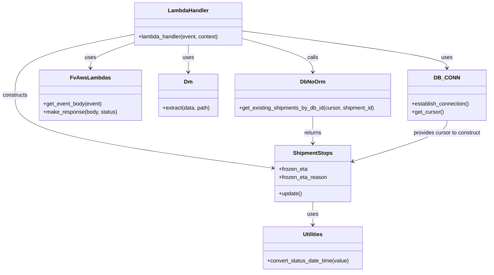

# Diagram: shipment_core/shipment_service/shipment_service/eta/eta_freeze_handler.py


> Auto-generated by Obscura crawlers

## Diagram 1

```mermaid
flowchart TD
    Event[Incoming Event] --> A[get_event_body(event)]
    A --> B[DB_CONN.establish_connection()]
    B --> C[DB_CONN.get_cursor()]
    C --> D[extract(pathParameters.shipment_id)]
    D -->|shipment_id present| E[set_frozen_eta_to_shipment(cursor, shipment_id, frozenEta, frozenEtaReason, stopIdentifier)]
    D -->|no shipment_id| F[raise NotImplementedError]
    E --> G[get_existing_shipments_by_db_id(cursor, shipment_id)]
    G --> H[ShipmentStops(cursor, current_shipment.shipment_stops[stopIdentifier])]
    H --> I[set frozen_eta / frozen_eta_reason]
    I --> J[update()]
    J --> K[make_response(None, 204)]
    style F stroke:#ff4d4d,stroke-width:2px
```

> SVG rendering failed for this diagram.

## Diagram 2



### SVG

<svg id="container" width="1452" xmlns="http://www.w3.org/2000/svg" class="classDiagram" height="832" viewBox="0 0 1452 832" role="graphics-document document" aria-roledescription="class"><style>#container{font-family:"trebuchet ms",verdana,arial,sans-serif;font-size:16px;fill:#333;}@keyframes edge-animation-frame{from{stroke-dashoffset:0;}}@keyframes dash{to{stroke-dashoffset:0;}}#container .edge-animation-slow{stroke-dasharray:9,5!important;stroke-dashoffset:900;animation:dash 50s linear infinite;stroke-linecap:round;}#container .edge-animation-fast{stroke-dasharray:9,5!important;stroke-dashoffset:900;animation:dash 20s linear infinite;stroke-linecap:round;}#container .error-icon{fill:#552222;}#container .error-text{fill:#552222;stroke:#552222;}#container .edge-thickness-normal{stroke-width:1px;}#container .edge-thickness-thick{stroke-width:3.5px;}#container .edge-pattern-solid{stroke-dasharray:0;}#container .edge-thickness-invisible{stroke-width:0;fill:none;}#container .edge-pattern-dashed{stroke-dasharray:3;}#container .edge-pattern-dotted{stroke-dasharray:2;}#container .marker{fill:#333333;stroke:#333333;}#container .marker.cross{stroke:#333333;}#container svg{font-family:"trebuchet ms",verdana,arial,sans-serif;font-size:16px;}#container p{margin:0;}#container g.classGroup text{fill:#9370DB;stroke:none;font-family:"trebuchet ms",verdana,arial,sans-serif;font-size:10px;}#container g.classGroup text .title{font-weight:bolder;}#container .nodeLabel,#container .edgeLabel{color:#131300;}#container .edgeLabel .label rect{fill:#ECECFF;}#container .label text{fill:#131300;}#container .labelBkg{background:#ECECFF;}#container .edgeLabel .label span{background:#ECECFF;}#container .classTitle{font-weight:bolder;}#container .node rect,#container .node circle,#container .node ellipse,#container .node polygon,#container .node path{fill:#ECECFF;stroke:#9370DB;stroke-width:1px;}#container .divider{stroke:#9370DB;stroke-width:1;}#container g.clickable{cursor:pointer;}#container g.classGroup rect{fill:#ECECFF;stroke:#9370DB;}#container g.classGroup line{stroke:#9370DB;stroke-width:1;}#container .classLabel .box{stroke:none;stroke-width:0;fill:#ECECFF;opacity:0.5;}#container .classLabel .label{fill:#9370DB;font-size:10px;}#container .relation{stroke:#333333;stroke-width:1;fill:none;}#container .dashed-line{stroke-dasharray:3;}#container .dotted-line{stroke-dasharray:1 2;}#container #compositionStart,#container .composition{fill:#333333!important;stroke:#333333!important;stroke-width:1;}#container #compositionEnd,#container .composition{fill:#333333!important;stroke:#333333!important;stroke-width:1;}#container #dependencyStart,#container .dependency{fill:#333333!important;stroke:#333333!important;stroke-width:1;}#container #dependencyStart,#container .dependency{fill:#333333!important;stroke:#333333!important;stroke-width:1;}#container #extensionStart,#container .extension{fill:transparent!important;stroke:#333333!important;stroke-width:1;}#container #extensionEnd,#container .extension{fill:transparent!important;stroke:#333333!important;stroke-width:1;}#container #aggregationStart,#container .aggregation{fill:transparent!important;stroke:#333333!important;stroke-width:1;}#container #aggregationEnd,#container .aggregation{fill:transparent!important;stroke:#333333!important;stroke-width:1;}#container #lollipopStart,#container .lollipop{fill:#ECECFF!important;stroke:#333333!important;stroke-width:1;}#container #lollipopEnd,#container .lollipop{fill:#ECECFF!important;stroke:#333333!important;stroke-width:1;}#container .edgeTerminals{font-size:11px;line-height:initial;}#container .classTitleText{text-anchor:middle;font-size:18px;fill:#333;}#container .label-icon{display:inline-block;height:1em;overflow:visible;vertical-align:-0.125em;}#container .node .label-icon path{fill:currentColor;stroke:revert;stroke-width:revert;}#container :root{--mermaid-font-family:"trebuchet ms",verdana,arial,sans-serif;}</style><g><defs><marker id="container_class-aggregationStart" class="marker aggregation class" refX="18" refY="7" markerWidth="190" markerHeight="240" orient="auto"><path d="M 18,7 L9,13 L1,7 L9,1 Z"></path></marker></defs><defs><marker id="container_class-aggregationEnd" class="marker aggregation class" refX="1" refY="7" markerWidth="20" markerHeight="28" orient="auto"><path d="M 18,7 L9,13 L1,7 L9,1 Z"></path></marker></defs><defs><marker id="container_class-extensionStart" class="marker extension class" refX="18" refY="7" markerWidth="190" markerHeight="240" orient="auto"><path d="M 1,7 L18,13 V 1 Z"></path></marker></defs><defs><marker id="container_class-extensionEnd" class="marker extension class" refX="1" refY="7" markerWidth="20" markerHeight="28" orient="auto"><path d="M 1,1 V 13 L18,7 Z"></path></marker></defs><defs><marker id="container_class-compositionStart" class="marker composition class" refX="18" refY="7" markerWidth="190" markerHeight="240" orient="auto"><path d="M 18,7 L9,13 L1,7 L9,1 Z"></path></marker></defs><defs><marker id="container_class-compositionEnd" class="marker composition class" refX="1" refY="7" markerWidth="20" markerHeight="28" orient="auto"><path d="M 18,7 L9,13 L1,7 L9,1 Z"></path></marker></defs><defs><marker id="container_class-dependencyStart" class="marker dependency class" refX="6" refY="7" markerWidth="190" markerHeight="240" orient="auto"><path d="M 5,7 L9,13 L1,7 L9,1 Z"></path></marker></defs><defs><marker id="container_class-dependencyEnd" class="marker dependency class" refX="13" refY="7" markerWidth="20" markerHeight="28" orient="auto"><path d="M 18,7 L9,13 L14,7 L9,1 Z"></path></marker></defs><defs><marker id="container_class-lollipopStart" class="marker lollipop class" refX="13" refY="7" markerWidth="190" markerHeight="240" orient="auto"><circle stroke="black" fill="transparent" cx="7" cy="7" r="6"></circle></marker></defs><defs><marker id="container_class-lollipopEnd" class="marker lollipop class" refX="1" refY="7" markerWidth="190" markerHeight="240" orient="auto"><circle stroke="black" fill="transparent" cx="7" cy="7" r="6"></circle></marker></defs><g class="root"><g class="clusters"></g><g class="edgePaths"><path d="M395.719,126.848L374.479,134.207C353.238,141.566,310.758,156.283,289.518,168.808C268.277,181.333,268.277,191.667,268.277,196.833L268.277,202" id="id_LambdaHandler_FvAwsLambdas_1" class="edge-thickness-normal edge-pattern-solid relation" style=";;;" data-edge="true" data-et="edge" data-id="id_LambdaHandler_FvAwsLambdas_1" data-points="W3sieCI6Mzk1LjcxODc1LCJ5IjoxMjYuODQ4MzIxMjIxMjI1Mjl9LHsieCI6MjY4LjI3NzM0Mzc1LCJ5IjoxNzF9LHsieCI6MjY4LjI3NzM0Mzc1LCJ5IjoyMDh9XQ==" marker-end="url(#container_class-dependencyEnd)"></path><path d="M718.125,91.902L819.798,105.085C921.471,118.268,1124.818,144.634,1226.491,162.984C1328.164,181.333,1328.164,191.667,1328.164,196.833L1328.164,202" id="id_LambdaHandler_DB_CONN_2" class="edge-thickness-normal edge-pattern-solid relation" style=";;;" data-edge="true" data-et="edge" data-id="id_LambdaHandler_DB_CONN_2" data-points="W3sieCI6NzE4LjEyNSwieSI6OTEuOTAxNzUxNDM1ODkzOH0seyJ4IjoxMzI4LjE2NDA2MjUsInkiOjE3MX0seyJ4IjoxMzI4LjE2NDA2MjUsInkiOjIwOH1d" marker-end="url(#container_class-dependencyEnd)"></path><path d="M556.922,134L556.922,140.167C556.922,146.333,556.922,158.667,556.922,172C556.922,185.333,556.922,199.667,556.922,206.833L556.922,214" id="id_LambdaHandler_Dm_3" class="edge-thickness-normal edge-pattern-solid relation" style=";;;" data-edge="true" data-et="edge" data-id="id_LambdaHandler_Dm_3" data-points="W3sieCI6NTU2LjkyMTg3NSwieSI6MTM0fSx7IngiOjU1Ni45MjE4NzUsInkiOjE3MX0seyJ4Ijo1NTYuOTIxODc1LCJ5IjoyMjB9XQ==" marker-end="url(#container_class-dependencyEnd)"></path><path d="M718.125,114.307L753.296,123.756C788.467,133.205,858.81,152.102,893.981,168.718C929.152,185.333,929.152,199.667,929.152,206.833L929.152,214" id="id_LambdaHandler_DbNoOrm_4" class="edge-thickness-normal edge-pattern-solid relation" style=";;;" data-edge="true" data-et="edge" data-id="id_LambdaHandler_DbNoOrm_4" data-points="W3sieCI6NzE4LjEyNSwieSI6MTE0LjMwNzM0Mjc3MTA5MDY2fSx7IngiOjkyOS4xNTIzNDM3NSwieSI6MTcxfSx7IngiOjkyOS4xNTIzNDM3NSwieSI6MjIwfV0=" marker-end="url(#container_class-dependencyEnd)"></path><path d="M395.719,102.542L337.406,113.951C279.094,125.361,162.469,148.181,104.156,178.257C45.844,208.333,45.844,245.667,45.844,285C45.844,324.333,45.844,365.667,173.626,405.574C301.409,445.481,556.974,483.961,684.757,503.201L812.54,522.442" id="id_LambdaHandler_ShipmentStops_5" class="edge-thickness-normal edge-pattern-solid relation" style=";;;" data-edge="true" data-et="edge" data-id="id_LambdaHandler_ShipmentStops_5" data-points="W3sieCI6Mzk1LjcxODc1LCJ5IjoxMDIuNTQxNzc3NDkyNDMzMjh9LHsieCI6NDUuODQzNzUsInkiOjE3MX0seyJ4Ijo0NS44NDM3NSwieSI6MjgzfSx7IngiOjQ1Ljg0Mzc1LCJ5Ijo0MDd9LHsieCI6ODE4LjQ3MjY1NjI1LCJ5Ijo1MjMuMzM0OTMxMjU1NDQ1fV0=" marker-end="url(#container_class-dependencyEnd)"></path><path d="M929.152,624L929.152,630.167C929.152,636.333,929.152,648.667,929.152,660C929.152,671.333,929.152,681.667,929.152,686.833L929.152,692" id="id_ShipmentStops_Utilities_6" class="edge-thickness-normal edge-pattern-solid relation" style=";;;" data-edge="true" data-et="edge" data-id="id_ShipmentStops_Utilities_6" data-points="W3sieCI6OTI5LjE1MjM0Mzc1LCJ5Ijo2MjR9LHsieCI6OTI5LjE1MjM0Mzc1LCJ5Ijo2NjF9LHsieCI6OTI5LjE1MjM0Mzc1LCJ5Ijo2OTh9XQ==" marker-end="url(#container_class-dependencyEnd)"></path><path d="M929.152,346L929.152,356.167C929.152,366.333,929.152,386.667,929.152,404C929.152,421.333,929.152,435.667,929.152,442.833L929.152,450" id="id_DbNoOrm_ShipmentStops_7" class="edge-thickness-normal edge-pattern-solid relation" style=";;;" data-edge="true" data-et="edge" data-id="id_DbNoOrm_ShipmentStops_7" data-points="W3sieCI6OTI5LjE1MjM0Mzc1LCJ5IjozNDZ9LHsieCI6OTI5LjE1MjM0Mzc1LCJ5Ijo0MDd9LHsieCI6OTI5LjE1MjM0Mzc1LCJ5Ijo0NTZ9XQ==" marker-end="url(#container_class-dependencyEnd)"></path><path d="M1328.164,358L1328.164,366.167C1328.164,374.333,1328.164,390.667,1281.057,414.535C1233.951,438.404,1139.737,469.807,1092.631,485.509L1045.524,501.211" id="id_DB_CONN_ShipmentStops_8" class="edge-thickness-normal edge-pattern-solid relation" style=";;;" data-edge="true" data-et="edge" data-id="id_DB_CONN_ShipmentStops_8" data-points="W3sieCI6MTMyOC4xNjQwNjI1LCJ5IjozNTh9LHsieCI6MTMyOC4xNjQwNjI1LCJ5Ijo0MDd9LHsieCI6MTAzOS44MzIwMzEyNSwieSI6NTAzLjEwNzg1NDM2Njc0Nn1d" marker-end="url(#container_class-dependencyEnd)"></path></g><g class="edgeLabels"><g class="edgeLabel" transform="translate(268.27734375, 171)"><g class="label" data-id="id_LambdaHandler_FvAwsLambdas_1" transform="translate(-16.4921875, -12)"><foreignObject width="32.984375" height="24"><div xmlns="http://www.w3.org/1999/xhtml" class="labelBkg" style="display: table-cell; white-space: nowrap; line-height: 1.5; max-width: 200px; text-align: center;"><span class="edgeLabel"><p>uses</p></span></div></foreignObject></g></g><g class="edgeLabel" transform="translate(1328.1640625, 171)"><g class="label" data-id="id_LambdaHandler_DB_CONN_2" transform="translate(-16.4921875, -12)"><foreignObject width="32.984375" height="24"><div xmlns="http://www.w3.org/1999/xhtml" class="labelBkg" style="display: table-cell; white-space: nowrap; line-height: 1.5; max-width: 200px; text-align: center;"><span class="edgeLabel"><p>uses</p></span></div></foreignObject></g></g><g class="edgeLabel" transform="translate(556.921875, 171)"><g class="label" data-id="id_LambdaHandler_Dm_3" transform="translate(-16.4921875, -12)"><foreignObject width="32.984375" height="24"><div xmlns="http://www.w3.org/1999/xhtml" class="labelBkg" style="display: table-cell; white-space: nowrap; line-height: 1.5; max-width: 200px; text-align: center;"><span class="edgeLabel"><p>uses</p></span></div></foreignObject></g></g><g class="edgeLabel" transform="translate(929.15234375, 171)"><g class="label" data-id="id_LambdaHandler_DbNoOrm_4" transform="translate(-16.4453125, -12)"><foreignObject width="32.890625" height="24"><div xmlns="http://www.w3.org/1999/xhtml" class="labelBkg" style="display: table-cell; white-space: nowrap; line-height: 1.5; max-width: 200px; text-align: center;"><span class="edgeLabel"><p>calls</p></span></div></foreignObject></g></g><g class="edgeLabel" transform="translate(45.84375, 283)"><g class="label" data-id="id_LambdaHandler_ShipmentStops_5" transform="translate(-37.84375, -12)"><foreignObject width="75.6875" height="24"><div xmlns="http://www.w3.org/1999/xhtml" class="labelBkg" style="display: table-cell; white-space: nowrap; line-height: 1.5; max-width: 200px; text-align: center;"><span class="edgeLabel"><p>constructs</p></span></div></foreignObject></g></g><g class="edgeLabel" transform="translate(929.15234375, 661)"><g class="label" data-id="id_ShipmentStops_Utilities_6" transform="translate(-16.4921875, -12)"><foreignObject width="32.984375" height="24"><div xmlns="http://www.w3.org/1999/xhtml" class="labelBkg" style="display: table-cell; white-space: nowrap; line-height: 1.5; max-width: 200px; text-align: center;"><span class="edgeLabel"><p>uses</p></span></div></foreignObject></g></g><g class="edgeLabel" transform="translate(929.15234375, 407)"><g class="label" data-id="id_DbNoOrm_ShipmentStops_7" transform="translate(-26.265625, -12)"><foreignObject width="52.53125" height="24"><div xmlns="http://www.w3.org/1999/xhtml" class="labelBkg" style="display: table-cell; white-space: nowrap; line-height: 1.5; max-width: 200px; text-align: center;"><span class="edgeLabel"><p>returns</p></span></div></foreignObject></g></g><g class="edgeLabel" transform="translate(1328.1640625, 407)"><g class="label" data-id="id_DB_CONN_ShipmentStops_8" transform="translate(-100, -24)"><foreignObject width="200" height="48"><div xmlns="http://www.w3.org/1999/xhtml" class="labelBkg" style="display: table; white-space: break-spaces; line-height: 1.5; max-width: 200px; text-align: center; width: 200px;"><span class="edgeLabel"><p>provides cursor to construct</p></span></div></foreignObject></g></g></g><g class="nodes"><g class="node default" id="classId-LambdaHandler-0" transform="translate(556.921875, 71)"><g class="basic label-container"><path d="M-161.203125 -63 L161.203125 -63 L161.203125 63 L-161.203125 63" stroke="none" stroke-width="0" fill="#ECECFF" style=""></path><path d="M-161.203125 -63 C-68.3208667850971 -63, 24.56139142980581 -63, 161.203125 -63 M-161.203125 -63 C-67.69406180098454 -63, 25.815001398030915 -63, 161.203125 -63 M161.203125 -63 C161.203125 -31.206315446378984, 161.203125 0.5873691072420328, 161.203125 63 M161.203125 -63 C161.203125 -34.31987506646708, 161.203125 -5.639750132934154, 161.203125 63 M161.203125 63 C61.01230980560153 63, -39.178505388796935 63, -161.203125 63 M161.203125 63 C74.92733696068655 63, -11.348451078626908 63, -161.203125 63 M-161.203125 63 C-161.203125 14.35247368667423, -161.203125 -34.29505262665154, -161.203125 -63 M-161.203125 63 C-161.203125 35.74567520481847, -161.203125 8.49135040963693, -161.203125 -63" stroke="#9370DB" stroke-width="1.3" fill="none" stroke-dasharray="0 0" style=""></path></g><g class="annotation-group text" transform="translate(0, -39)"></g><g class="label-group text" transform="translate(-58.21875, -39)"><g class="label" style="font-weight: bolder" transform="translate(0,-12)"><foreignObject width="116.4375" height="24"><div xmlns="http://www.w3.org/1999/xhtml" style="display: table-cell; white-space: nowrap; line-height: 1.5; max-width: 167px; text-align: center;"><span class="nodeLabel markdown-node-label" style=""><p>LambdaHandler</p></span></div></foreignObject></g></g><g class="members-group text" transform="translate(-149.203125, 9)"></g><g class="methods-group text" transform="translate(-149.203125, 39)"><g class="label" style="" transform="translate(0,-12)"><foreignObject width="240.1875" height="24"><div xmlns="http://www.w3.org/1999/xhtml" style="display: table-cell; white-space: nowrap; line-height: 1.5; max-width: 298px; text-align: center;"><span class="nodeLabel markdown-node-label" style=""><p>+lambda_handler(event, context)</p></span></div></foreignObject></g></g><g class="divider" style=""><path d="M-161.203125 -15 C-76.10237612291445 -15, 8.9983727541711 -15, 161.203125 -15 M-161.203125 -15 C-35.57618368479427 -15, 90.05075763041145 -15, 161.203125 -15" stroke="#9370DB" stroke-width="1.3" fill="none" stroke-dasharray="0 0" style=""></path></g><g class="divider" style=""><path d="M-161.203125 9 C-49.108433828669874 9, 62.98625734266025 9, 161.203125 9 M-161.203125 9 C-40.41130642590369 9, 80.38051214819262 9, 161.203125 9" stroke="#9370DB" stroke-width="1.3" fill="none" stroke-dasharray="0 0" style=""></path></g></g><g class="node default" id="classId-DB_CONN-1" transform="translate(1328.1640625, 283)"><g class="basic label-container"><path d="M-115.8359375 -75 L115.8359375 -75 L115.8359375 75 L-115.8359375 75" stroke="none" stroke-width="0" fill="#ECECFF" style=""></path><path d="M-115.8359375 -75 C-26.191810805378253 -75, 63.45231588924349 -75, 115.8359375 -75 M-115.8359375 -75 C-62.91561265954471 -75, -9.995287819089427 -75, 115.8359375 -75 M115.8359375 -75 C115.8359375 -20.61887892607566, 115.8359375 33.76224214784868, 115.8359375 75 M115.8359375 -75 C115.8359375 -28.967919098158596, 115.8359375 17.064161803682808, 115.8359375 75 M115.8359375 75 C31.0616133491594 75, -53.7127108016812 75, -115.8359375 75 M115.8359375 75 C35.57211288116639 75, -44.69171173766722 75, -115.8359375 75 M-115.8359375 75 C-115.8359375 38.75665168964123, -115.8359375 2.513303379282462, -115.8359375 -75 M-115.8359375 75 C-115.8359375 28.651379858824193, -115.8359375 -17.697240282351615, -115.8359375 -75" stroke="#9370DB" stroke-width="1.3" fill="none" stroke-dasharray="0 0" style=""></path></g><g class="annotation-group text" transform="translate(0, -51)"></g><g class="label-group text" transform="translate(-34.40625, -51)"><g class="label" style="font-weight: bolder" transform="translate(0,-12)"><foreignObject width="68.8125" height="24"><div xmlns="http://www.w3.org/1999/xhtml" style="display: table-cell; white-space: nowrap; line-height: 1.5; max-width: 119px; text-align: center;"><span class="nodeLabel markdown-node-label" style=""><p>DB_CONN</p></span></div></foreignObject></g></g><g class="members-group text" transform="translate(-103.8359375, -3)"></g><g class="methods-group text" transform="translate(-103.8359375, 27)"><g class="label" style="" transform="translate(0,-12)"><foreignObject width="173.265625" height="24"><div xmlns="http://www.w3.org/1999/xhtml" style="display: table-cell; white-space: nowrap; line-height: 1.5; max-width: 231px; text-align: center;"><span class="nodeLabel markdown-node-label" style=""><p>+establish_connection()</p></span></div></foreignObject></g><g class="label" style="" transform="translate(0,12)"><foreignObject width="94.640625" height="24"><div xmlns="http://www.w3.org/1999/xhtml" style="display: table-cell; white-space: nowrap; line-height: 1.5; max-width: 152px; text-align: center;"><span class="nodeLabel markdown-node-label" style=""><p>+get_cursor()</p></span></div></foreignObject></g></g><g class="divider" style=""><path d="M-115.8359375 -27 C-41.976411397445816 -27, 31.88311470510837 -27, 115.8359375 -27 M-115.8359375 -27 C-47.680581366305006 -27, 20.474774767389988 -27, 115.8359375 -27" stroke="#9370DB" stroke-width="1.3" fill="none" stroke-dasharray="0 0" style=""></path></g><g class="divider" style=""><path d="M-115.8359375 -3 C-27.881012054620825 -3, 60.07391339075835 -3, 115.8359375 -3 M-115.8359375 -3 C-38.88771237813714 -3, 38.060512743725724 -3, 115.8359375 -3" stroke="#9370DB" stroke-width="1.3" fill="none" stroke-dasharray="0 0" style=""></path></g></g><g class="node default" id="classId-FvAwsLambdas-2" transform="translate(268.27734375, 283)"><g class="basic label-container"><path d="M-149.58984375 -75 L149.58984375 -75 L149.58984375 75 L-149.58984375 75" stroke="none" stroke-width="0" fill="#ECECFF" style=""></path><path d="M-149.58984375 -75 C-30.869065479921503 -75, 87.851712790157 -75, 149.58984375 -75 M-149.58984375 -75 C-54.99496930426585 -75, 39.5999051414683 -75, 149.58984375 -75 M149.58984375 -75 C149.58984375 -25.129281258274858, 149.58984375 24.741437483450284, 149.58984375 75 M149.58984375 -75 C149.58984375 -19.295559642335938, 149.58984375 36.408880715328124, 149.58984375 75 M149.58984375 75 C53.18845611474451 75, -43.21293152051098 75, -149.58984375 75 M149.58984375 75 C86.31817859869227 75, 23.046513447384555 75, -149.58984375 75 M-149.58984375 75 C-149.58984375 17.522820161268967, -149.58984375 -39.954359677462065, -149.58984375 -75 M-149.58984375 75 C-149.58984375 34.37714748267235, -149.58984375 -6.245705034655302, -149.58984375 -75" stroke="#9370DB" stroke-width="1.3" fill="none" stroke-dasharray="0 0" style=""></path></g><g class="annotation-group text" transform="translate(0, -51)"></g><g class="label-group text" transform="translate(-55.2109375, -51)"><g class="label" style="font-weight: bolder" transform="translate(0,-12)"><foreignObject width="110.421875" height="24"><div xmlns="http://www.w3.org/1999/xhtml" style="display: table-cell; white-space: nowrap; line-height: 1.5; max-width: 159px; text-align: center;"><span class="nodeLabel markdown-node-label" style=""><p>FvAwsLambdas</p></span></div></foreignObject></g></g><g class="members-group text" transform="translate(-137.58984375, -3)"></g><g class="methods-group text" transform="translate(-137.58984375, 27)"><g class="label" style="" transform="translate(0,-12)"><foreignObject width="174.203125" height="24"><div xmlns="http://www.w3.org/1999/xhtml" style="display: table-cell; white-space: nowrap; line-height: 1.5; max-width: 232px; text-align: center;"><span class="nodeLabel markdown-node-label" style=""><p>+get_event_body(event)</p></span></div></foreignObject></g><g class="label" style="" transform="translate(0,12)"><foreignObject width="219.96875" height="24"><div xmlns="http://www.w3.org/1999/xhtml" style="display: table-cell; white-space: nowrap; line-height: 1.5; max-width: 277px; text-align: center;"><span class="nodeLabel markdown-node-label" style=""><p>+make_response(body, status)</p></span></div></foreignObject></g></g><g class="divider" style=""><path d="M-149.58984375 -27 C-68.42544818295495 -27, 12.738947384090096 -27, 149.58984375 -27 M-149.58984375 -27 C-46.59637559029629 -27, 56.39709256940742 -27, 149.58984375 -27" stroke="#9370DB" stroke-width="1.3" fill="none" stroke-dasharray="0 0" style=""></path></g><g class="divider" style=""><path d="M-149.58984375 -3 C-60.27840411692112 -3, 29.033035516157753 -3, 149.58984375 -3 M-149.58984375 -3 C-79.24426616344347 -3, -8.89868857688694 -3, 149.58984375 -3" stroke="#9370DB" stroke-width="1.3" fill="none" stroke-dasharray="0 0" style=""></path></g></g><g class="node default" id="classId-Dm-3" transform="translate(556.921875, 283)"><g class="basic label-container"><path d="M-89.0546875 -63 L89.0546875 -63 L89.0546875 63 L-89.0546875 63" stroke="none" stroke-width="0" fill="#ECECFF" style=""></path><path d="M-89.0546875 -63 C-18.69657702846183 -63, 51.66153344307634 -63, 89.0546875 -63 M-89.0546875 -63 C-37.07343771512037 -63, 14.90781206975926 -63, 89.0546875 -63 M89.0546875 -63 C89.0546875 -27.919031937424975, 89.0546875 7.161936125150049, 89.0546875 63 M89.0546875 -63 C89.0546875 -18.83577465696336, 89.0546875 25.328450686073282, 89.0546875 63 M89.0546875 63 C20.071521249147224 63, -48.91164500170555 63, -89.0546875 63 M89.0546875 63 C46.87279388773411 63, 4.690900275468223 63, -89.0546875 63 M-89.0546875 63 C-89.0546875 31.72567044262992, -89.0546875 0.45134088525983884, -89.0546875 -63 M-89.0546875 63 C-89.0546875 26.428847856202545, -89.0546875 -10.14230428759491, -89.0546875 -63" stroke="#9370DB" stroke-width="1.3" fill="none" stroke-dasharray="0 0" style=""></path></g><g class="annotation-group text" transform="translate(0, -39)"></g><g class="label-group text" transform="translate(-11.96875, -39)"><g class="label" style="font-weight: bolder" transform="translate(0,-12)"><foreignObject width="23.9375" height="24"><div xmlns="http://www.w3.org/1999/xhtml" style="display: table-cell; white-space: nowrap; line-height: 1.5; max-width: 74px; text-align: center;"><span class="nodeLabel markdown-node-label" style=""><p>Dm</p></span></div></foreignObject></g></g><g class="members-group text" transform="translate(-77.0546875, 9)"></g><g class="methods-group text" transform="translate(-77.0546875, 39)"><g class="label" style="" transform="translate(0,-12)"><foreignObject width="142.140625" height="24"><div xmlns="http://www.w3.org/1999/xhtml" style="display: table-cell; white-space: nowrap; line-height: 1.5; max-width: 200px; text-align: center;"><span class="nodeLabel markdown-node-label" style=""><p>+extract(data, path)</p></span></div></foreignObject></g></g><g class="divider" style=""><path d="M-89.0546875 -15 C-23.213585778910954 -15, 42.62751594217809 -15, 89.0546875 -15 M-89.0546875 -15 C-26.47016943913038 -15, 36.11434862173924 -15, 89.0546875 -15" stroke="#9370DB" stroke-width="1.3" fill="none" stroke-dasharray="0 0" style=""></path></g><g class="divider" style=""><path d="M-89.0546875 9 C-39.59464920633835 9, 9.865389087323294 9, 89.0546875 9 M-89.0546875 9 C-43.99378393041556 9, 1.0671196391688795 9, 89.0546875 9" stroke="#9370DB" stroke-width="1.3" fill="none" stroke-dasharray="0 0" style=""></path></g></g><g class="node default" id="classId-DbNoOrm-4" transform="translate(929.15234375, 283)"><g class="basic label-container"><path d="M-233.17578125 -63 L233.17578125 -63 L233.17578125 63 L-233.17578125 63" stroke="none" stroke-width="0" fill="#ECECFF" style=""></path><path d="M-233.17578125 -63 C-137.45970767820359 -63, -41.74363410640714 -63, 233.17578125 -63 M-233.17578125 -63 C-73.04764446074492 -63, 87.08049232851016 -63, 233.17578125 -63 M233.17578125 -63 C233.17578125 -31.43945500533725, 233.17578125 0.12108998932549753, 233.17578125 63 M233.17578125 -63 C233.17578125 -37.54492922496482, 233.17578125 -12.089858449929643, 233.17578125 63 M233.17578125 63 C134.9842570880752 63, 36.792732926150364 63, -233.17578125 63 M233.17578125 63 C113.24116324184324 63, -6.693454766313522 63, -233.17578125 63 M-233.17578125 63 C-233.17578125 21.92521789405066, -233.17578125 -19.149564211898678, -233.17578125 -63 M-233.17578125 63 C-233.17578125 13.472794187247843, -233.17578125 -36.054411625504315, -233.17578125 -63" stroke="#9370DB" stroke-width="1.3" fill="none" stroke-dasharray="0 0" style=""></path></g><g class="annotation-group text" transform="translate(0, -39)"></g><g class="label-group text" transform="translate(-35.4609375, -39)"><g class="label" style="font-weight: bolder" transform="translate(0,-12)"><foreignObject width="70.921875" height="24"><div xmlns="http://www.w3.org/1999/xhtml" style="display: table-cell; white-space: nowrap; line-height: 1.5; max-width: 121px; text-align: center;"><span class="nodeLabel markdown-node-label" style=""><p>DbNoOrm</p></span></div></foreignObject></g></g><g class="members-group text" transform="translate(-221.17578125, 9)"></g><g class="methods-group text" transform="translate(-221.17578125, 39)"><g class="label" style="" transform="translate(0,-12)"><foreignObject width="406.890625" height="24"><div xmlns="http://www.w3.org/1999/xhtml" style="display: table-cell; white-space: nowrap; line-height: 1.5; max-width: 464px; text-align: center;"><span class="nodeLabel markdown-node-label" style=""><p>+get_existing_shipments_by_db_id(cursor, shipment_id)</p></span></div></foreignObject></g></g><g class="divider" style=""><path d="M-233.17578125 -15 C-122.30542741052834 -15, -11.435073571056677 -15, 233.17578125 -15 M-233.17578125 -15 C-121.46948404300154 -15, -9.763186836003086 -15, 233.17578125 -15" stroke="#9370DB" stroke-width="1.3" fill="none" stroke-dasharray="0 0" style=""></path></g><g class="divider" style=""><path d="M-233.17578125 9 C-49.740338588396014 9, 133.69510407320797 9, 233.17578125 9 M-233.17578125 9 C-139.74065011826576 9, -46.305518986531524 9, 233.17578125 9" stroke="#9370DB" stroke-width="1.3" fill="none" stroke-dasharray="0 0" style=""></path></g></g><g class="node default" id="classId-ShipmentStops-5" transform="translate(929.15234375, 540)"><g class="basic label-container"><path d="M-110.6796875 -84 L110.6796875 -84 L110.6796875 84 L-110.6796875 84" stroke="none" stroke-width="0" fill="#ECECFF" style=""></path><path d="M-110.6796875 -84 C-45.858166762439595 -84, 18.96335397512081 -84, 110.6796875 -84 M-110.6796875 -84 C-48.56955872996232 -84, 13.540570040075366 -84, 110.6796875 -84 M110.6796875 -84 C110.6796875 -30.34601494902038, 110.6796875 23.307970101959242, 110.6796875 84 M110.6796875 -84 C110.6796875 -39.3328727938723, 110.6796875 5.3342544122554045, 110.6796875 84 M110.6796875 84 C47.15649868352116 84, -16.366690132957686 84, -110.6796875 84 M110.6796875 84 C29.633676249172566 84, -51.41233500165487 84, -110.6796875 84 M-110.6796875 84 C-110.6796875 37.17719330267854, -110.6796875 -9.645613394642922, -110.6796875 -84 M-110.6796875 84 C-110.6796875 47.12140357426536, -110.6796875 10.242807148530716, -110.6796875 -84" stroke="#9370DB" stroke-width="1.3" fill="none" stroke-dasharray="0 0" style=""></path></g><g class="annotation-group text" transform="translate(0, -60)"></g><g class="label-group text" transform="translate(-55.9375, -60)"><g class="label" style="font-weight: bolder" transform="translate(0,-12)"><foreignObject width="111.875" height="24"><div xmlns="http://www.w3.org/1999/xhtml" style="display: table-cell; white-space: nowrap; line-height: 1.5; max-width: 160px; text-align: center;"><span class="nodeLabel markdown-node-label" style=""><p>ShipmentStops</p></span></div></foreignObject></g></g><g class="members-group text" transform="translate(-98.6796875, -12)"><g class="label" style="" transform="translate(0,-12)"><foreignObject width="84.109375" height="24"><div xmlns="http://www.w3.org/1999/xhtml" style="display: table-cell; white-space: nowrap; line-height: 1.5; max-width: 141px; text-align: center;"><span class="nodeLabel markdown-node-label" style=""><p>+frozen_eta</p></span></div></foreignObject></g><g class="label" style="" transform="translate(0,12)"><foreignObject width="141.421875" height="24"><div xmlns="http://www.w3.org/1999/xhtml" style="display: table-cell; white-space: nowrap; line-height: 1.5; max-width: 199px; text-align: center;"><span class="nodeLabel markdown-node-label" style=""><p>+frozen_eta_reason</p></span></div></foreignObject></g></g><g class="methods-group text" transform="translate(-98.6796875, 60)"><g class="label" style="" transform="translate(0,-12)"><foreignObject width="69.703125" height="24"><div xmlns="http://www.w3.org/1999/xhtml" style="display: table-cell; white-space: nowrap; line-height: 1.5; max-width: 127px; text-align: center;"><span class="nodeLabel markdown-node-label" style=""><p>+update()</p></span></div></foreignObject></g></g><g class="divider" style=""><path d="M-110.6796875 -36 C-25.009942757941744 -36, 60.65980198411651 -36, 110.6796875 -36 M-110.6796875 -36 C-63.742583789622266 -36, -16.805480079244532 -36, 110.6796875 -36" stroke="#9370DB" stroke-width="1.3" fill="none" stroke-dasharray="0 0" style=""></path></g><g class="divider" style=""><path d="M-110.6796875 36 C-54.37380288138754 36, 1.9320817372249195 36, 110.6796875 36 M-110.6796875 36 C-47.176337558164846 36, 16.327012383670308 36, 110.6796875 36" stroke="#9370DB" stroke-width="1.3" fill="none" stroke-dasharray="0 0" style=""></path></g></g><g class="node default" id="classId-Utilities-6" transform="translate(929.15234375, 761)"><g class="basic label-container"><path d="M-148.8984375 -63 L148.8984375 -63 L148.8984375 63 L-148.8984375 63" stroke="none" stroke-width="0" fill="#ECECFF" style=""></path><path d="M-148.8984375 -63 C-83.96927694290298 -63, -19.04011638580596 -63, 148.8984375 -63 M-148.8984375 -63 C-71.82875000738227 -63, 5.240937485235463 -63, 148.8984375 -63 M148.8984375 -63 C148.8984375 -13.5843772589592, 148.8984375 35.8312454820816, 148.8984375 63 M148.8984375 -63 C148.8984375 -24.567343471508558, 148.8984375 13.865313056982885, 148.8984375 63 M148.8984375 63 C45.1335094583266 63, -58.6314185833468 63, -148.8984375 63 M148.8984375 63 C68.74129153665397 63, -11.41585442669205 63, -148.8984375 63 M-148.8984375 63 C-148.8984375 26.847281076668573, -148.8984375 -9.305437846662855, -148.8984375 -63 M-148.8984375 63 C-148.8984375 18.420550614384837, -148.8984375 -26.158898771230326, -148.8984375 -63" stroke="#9370DB" stroke-width="1.3" fill="none" stroke-dasharray="0 0" style=""></path></g><g class="annotation-group text" transform="translate(0, -39)"></g><g class="label-group text" transform="translate(-28.8125, -39)"><g class="label" style="font-weight: bolder" transform="translate(0,-12)"><foreignObject width="57.625" height="24"><div xmlns="http://www.w3.org/1999/xhtml" style="display: table-cell; white-space: nowrap; line-height: 1.5; max-width: 107px; text-align: center;"><span class="nodeLabel markdown-node-label" style=""><p>Utilities</p></span></div></foreignObject></g></g><g class="members-group text" transform="translate(-136.8984375, 9)"></g><g class="methods-group text" transform="translate(-136.8984375, 39)"><g class="label" style="" transform="translate(0,-12)"><foreignObject width="244.984375" height="24"><div xmlns="http://www.w3.org/1999/xhtml" style="display: table-cell; white-space: nowrap; line-height: 1.5; max-width: 302px; text-align: center;"><span class="nodeLabel markdown-node-label" style=""><p>+convert_status_date_time(value)</p></span></div></foreignObject></g></g><g class="divider" style=""><path d="M-148.8984375 -15 C-80.18504317535363 -15, -11.471648850707254 -15, 148.8984375 -15 M-148.8984375 -15 C-63.12326554642378 -15, 22.65190640715244 -15, 148.8984375 -15" stroke="#9370DB" stroke-width="1.3" fill="none" stroke-dasharray="0 0" style=""></path></g><g class="divider" style=""><path d="M-148.8984375 9 C-81.30113221672197 9, -13.703826933443935 9, 148.8984375 9 M-148.8984375 9 C-30.244230936510263 9, 88.40997562697947 9, 148.8984375 9" stroke="#9370DB" stroke-width="1.3" fill="none" stroke-dasharray="0 0" style=""></path></g></g></g></g></g></svg>
