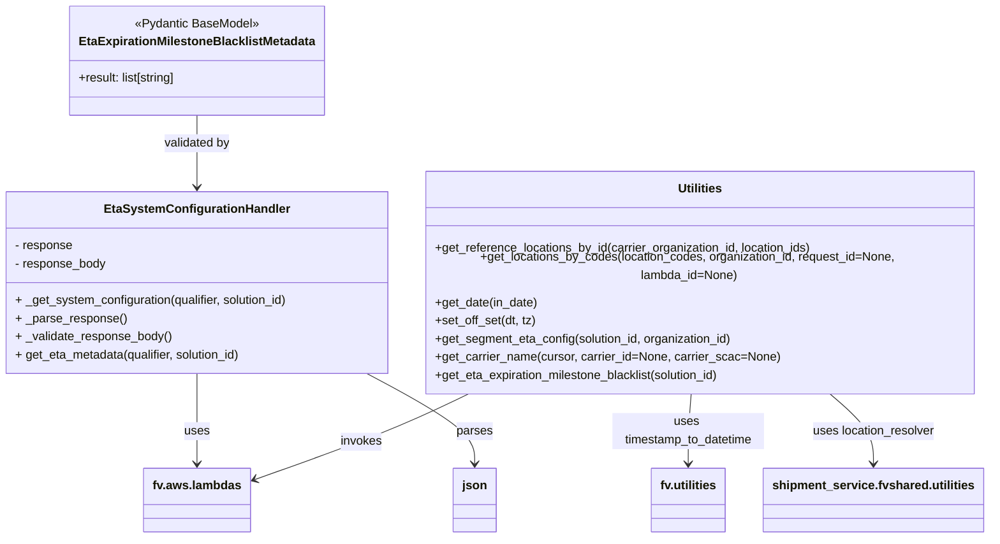

# Diagram: shipment_core/shipment_service/shipment_service/eta/eta_helper.py


> Auto-generated by Obscura crawlers

## Diagram 1

```mermaid
flowchart TD
    subgraph Functions
        GR1[get_reference_locations_by_id(location_ids)] -->|build event| EV1[get_sample_admin_event]
        GR1 -->|call| LR1[util.location_resolver]
        GL1[get_locations_by_codes(codes)] -->|build event_copy| EV2[get_sample_admin_event]
        GL1 -->|invoke| INV1[fv.aws.lambdas.invoke_lambda("locations-get")]
        INV1 -->|check statusCode| GB1{response.statusCode == "200"}
        GB1 -->|yes| BE1[fv.aws.lambdas.get_event_body(response)]
        GB1 -->|no| LOG1[logger.warning & return None]
        GS[get_segment_eta_config(solution_id)] -->|build event_copy| EV3[get_sample_admin_event]
        GS -->|invoke| INV2[fv.aws.lambdas.invoke_lambda("get_system_configuration")]
        INV2 -->|check statusCode| GB2{response.statusCode == "200"}
        GB2 -->|yes| BE2[fv.aws.lambdas.get_event_body(response)]
        BE2 -->|extract| SEG1[segmentETA]
        GB2 -->|no| LOG2[logger.warning & return None]
        GE[get_eta_expiration_milestone_blacklist(solution_id)] -->|create handler| H1[EtaSystemConfigurationHandler]
        GE -->|call| H1.get_eta_metadata
        H1.get_eta_metadata --> H1._get_system_configuration
        H1._get_system_configuration --> INV2
        H1.get_eta_metadata --> H1._parse_response
        H1.get_eta_metadata --> H1._validate_response_body
        GE -->|validate with Pydantic| PD1[EtaExpirationMilestoneBlacklistMetadata.model_validate]
        PD1 -->|on success| RET1[return validated result]
        PD1 -->|on ValidationError| LOG3[logger.info & return []]
    end
```

> SVG rendering failed for this diagram.

## Diagram 2



### SVG

<svg id="container" width="1310.390625" xmlns="http://www.w3.org/2000/svg" class="classDiagram" height="686" viewBox="0 0 1310.390625 686" role="graphics-document document" aria-roledescription="class"><style>#container{font-family:"trebuchet ms",verdana,arial,sans-serif;font-size:16px;fill:#333;}@keyframes edge-animation-frame{from{stroke-dashoffset:0;}}@keyframes dash{to{stroke-dashoffset:0;}}#container .edge-animation-slow{stroke-dasharray:9,5!important;stroke-dashoffset:900;animation:dash 50s linear infinite;stroke-linecap:round;}#container .edge-animation-fast{stroke-dasharray:9,5!important;stroke-dashoffset:900;animation:dash 20s linear infinite;stroke-linecap:round;}#container .error-icon{fill:#552222;}#container .error-text{fill:#552222;stroke:#552222;}#container .edge-thickness-normal{stroke-width:1px;}#container .edge-thickness-thick{stroke-width:3.5px;}#container .edge-pattern-solid{stroke-dasharray:0;}#container .edge-thickness-invisible{stroke-width:0;fill:none;}#container .edge-pattern-dashed{stroke-dasharray:3;}#container .edge-pattern-dotted{stroke-dasharray:2;}#container .marker{fill:#333333;stroke:#333333;}#container .marker.cross{stroke:#333333;}#container svg{font-family:"trebuchet ms",verdana,arial,sans-serif;font-size:16px;}#container p{margin:0;}#container g.classGroup text{fill:#9370DB;stroke:none;font-family:"trebuchet ms",verdana,arial,sans-serif;font-size:10px;}#container g.classGroup text .title{font-weight:bolder;}#container .nodeLabel,#container .edgeLabel{color:#131300;}#container .edgeLabel .label rect{fill:#ECECFF;}#container .label text{fill:#131300;}#container .labelBkg{background:#ECECFF;}#container .edgeLabel .label span{background:#ECECFF;}#container .classTitle{font-weight:bolder;}#container .node rect,#container .node circle,#container .node ellipse,#container .node polygon,#container .node path{fill:#ECECFF;stroke:#9370DB;stroke-width:1px;}#container .divider{stroke:#9370DB;stroke-width:1;}#container g.clickable{cursor:pointer;}#container g.classGroup rect{fill:#ECECFF;stroke:#9370DB;}#container g.classGroup line{stroke:#9370DB;stroke-width:1;}#container .classLabel .box{stroke:none;stroke-width:0;fill:#ECECFF;opacity:0.5;}#container .classLabel .label{fill:#9370DB;font-size:10px;}#container .relation{stroke:#333333;stroke-width:1;fill:none;}#container .dashed-line{stroke-dasharray:3;}#container .dotted-line{stroke-dasharray:1 2;}#container #compositionStart,#container .composition{fill:#333333!important;stroke:#333333!important;stroke-width:1;}#container #compositionEnd,#container .composition{fill:#333333!important;stroke:#333333!important;stroke-width:1;}#container #dependencyStart,#container .dependency{fill:#333333!important;stroke:#333333!important;stroke-width:1;}#container #dependencyStart,#container .dependency{fill:#333333!important;stroke:#333333!important;stroke-width:1;}#container #extensionStart,#container .extension{fill:transparent!important;stroke:#333333!important;stroke-width:1;}#container #extensionEnd,#container .extension{fill:transparent!important;stroke:#333333!important;stroke-width:1;}#container #aggregationStart,#container .aggregation{fill:transparent!important;stroke:#333333!important;stroke-width:1;}#container #aggregationEnd,#container .aggregation{fill:transparent!important;stroke:#333333!important;stroke-width:1;}#container #lollipopStart,#container .lollipop{fill:#ECECFF!important;stroke:#333333!important;stroke-width:1;}#container #lollipopEnd,#container .lollipop{fill:#ECECFF!important;stroke:#333333!important;stroke-width:1;}#container .edgeTerminals{font-size:11px;line-height:initial;}#container .classTitleText{text-anchor:middle;font-size:18px;fill:#333;}#container .label-icon{display:inline-block;height:1em;overflow:visible;vertical-align:-0.125em;}#container .node .label-icon path{fill:currentColor;stroke:revert;stroke-width:revert;}#container :root{--mermaid-font-family:"trebuchet ms",verdana,arial,sans-serif;}</style><g><defs><marker id="container_class-aggregationStart" class="marker aggregation class" refX="18" refY="7" markerWidth="190" markerHeight="240" orient="auto"><path d="M 18,7 L9,13 L1,7 L9,1 Z"></path></marker></defs><defs><marker id="container_class-aggregationEnd" class="marker aggregation class" refX="1" refY="7" markerWidth="20" markerHeight="28" orient="auto"><path d="M 18,7 L9,13 L1,7 L9,1 Z"></path></marker></defs><defs><marker id="container_class-extensionStart" class="marker extension class" refX="18" refY="7" markerWidth="190" markerHeight="240" orient="auto"><path d="M 1,7 L18,13 V 1 Z"></path></marker></defs><defs><marker id="container_class-extensionEnd" class="marker extension class" refX="1" refY="7" markerWidth="20" markerHeight="28" orient="auto"><path d="M 1,1 V 13 L18,7 Z"></path></marker></defs><defs><marker id="container_class-compositionStart" class="marker composition class" refX="18" refY="7" markerWidth="190" markerHeight="240" orient="auto"><path d="M 18,7 L9,13 L1,7 L9,1 Z"></path></marker></defs><defs><marker id="container_class-compositionEnd" class="marker composition class" refX="1" refY="7" markerWidth="20" markerHeight="28" orient="auto"><path d="M 18,7 L9,13 L1,7 L9,1 Z"></path></marker></defs><defs><marker id="container_class-dependencyStart" class="marker dependency class" refX="6" refY="7" markerWidth="190" markerHeight="240" orient="auto"><path d="M 5,7 L9,13 L1,7 L9,1 Z"></path></marker></defs><defs><marker id="container_class-dependencyEnd" class="marker dependency class" refX="13" refY="7" markerWidth="20" markerHeight="28" orient="auto"><path d="M 18,7 L9,13 L14,7 L9,1 Z"></path></marker></defs><defs><marker id="container_class-lollipopStart" class="marker lollipop class" refX="13" refY="7" markerWidth="190" markerHeight="240" orient="auto"><circle stroke="black" fill="transparent" cx="7" cy="7" r="6"></circle></marker></defs><defs><marker id="container_class-lollipopEnd" class="marker lollipop class" refX="1" refY="7" markerWidth="190" markerHeight="240" orient="auto"><circle stroke="black" fill="transparent" cx="7" cy="7" r="6"></circle></marker></defs><g class="root"><g class="clusters"></g><g class="edgePaths"><path d="M261.297,481L261.297,491.667C261.297,502.333,261.297,523.667,261.297,541.5C261.297,559.333,261.297,573.667,261.297,580.833L261.297,588" id="id_EtaSystemConfigurationHandler_fv.aws.lambdas_1" class="edge-thickness-normal edge-pattern-solid relation" style=";;;" data-edge="true" data-et="edge" data-id="id_EtaSystemConfigurationHandler_fv.aws.lambdas_1" data-points="W3sieCI6MjYxLjI5Njg3NSwieSI6NDgxfSx7IngiOjI2MS4yOTY4NzUsInkiOjU0NX0seyJ4IjoyNjEuMjk2ODc1LCJ5Ijo1OTR9XQ==" marker-end="url(#container_class-dependencyEnd)"></path><path d="M501.868,481L523.252,491.667C544.636,502.333,587.404,523.667,608.788,541.5C630.172,559.333,630.172,573.667,630.172,580.833L630.172,588" id="id_EtaSystemConfigurationHandler_json_2" class="edge-thickness-normal edge-pattern-solid relation" style=";;;" data-edge="true" data-et="edge" data-id="id_EtaSystemConfigurationHandler_json_2" data-points="W3sieCI6NTAxLjg2NzUyNzE3MzkxMywieSI6NDgxfSx7IngiOjYzMC4xNzE4NzUsInkiOjU0NX0seyJ4Ijo2MzAuMTcxODc1LCJ5Ijo1OTR9XQ==" marker-end="url(#container_class-dependencyEnd)"></path><path d="M261.297,152L261.297,158.167C261.297,164.333,261.297,176.667,261.297,190.5C261.297,204.333,261.297,219.667,261.297,227.333L261.297,235" id="id_EtaExpirationMilestoneBlacklistMetadata_EtaSystemConfigurationHandler_3" class="edge-thickness-normal edge-pattern-solid relation" style=";;;" data-edge="true" data-et="edge" data-id="id_EtaExpirationMilestoneBlacklistMetadata_EtaSystemConfigurationHandler_3" data-points="W3sieCI6MjYxLjI5Njg3NSwieSI6MTUyfSx7IngiOjI2MS4yOTY4NzUsInkiOjE4OX0seyJ4IjoyNjEuMjk2ODc1LCJ5IjoyNDF9XQ==" marker-end="url(#container_class-dependencyEnd)"></path><path d="M631.445,496L613.173,504.167C594.901,512.333,558.357,528.667,508.926,547.717C459.495,566.768,397.177,588.536,366.018,599.42L334.86,610.304" id="id_Utilities_fv.aws.lambdas_4" class="edge-thickness-normal edge-pattern-solid relation" style=";;;" data-edge="true" data-et="edge" data-id="id_Utilities_fv.aws.lambdas_4" data-points="W3sieCI6NjMxLjQ0NDU5MDY5MjkzNDgsInkiOjQ5Nn0seyJ4Ijo1MjEuODEyNSwieSI6NTQ1fSx7IngiOjMyOS4xOTUzMTI1LCJ5Ijo2MTIuMjgyNTgyNjE4NjA0OX1d" marker-end="url(#container_class-dependencyEnd)"></path><path d="M922.707,496L922.055,504.167C921.403,512.333,920.098,528.667,919.445,544C918.793,559.333,918.793,573.667,918.793,580.833L918.793,588" id="id_Utilities_fv.utilities_5" class="edge-thickness-normal edge-pattern-solid relation" style=";;;" data-edge="true" data-et="edge" data-id="id_Utilities_fv.utilities_5" data-points="W3sieCI6OTIyLjcwNzQzNDYxMjc3MTcsInkiOjQ5Nn0seyJ4Ijo5MTguNzkyOTY4NzUsInkiOjU0NX0seyJ4Ijo5MTguNzkyOTY4NzUsInkiOjU5NH1d" marker-end="url(#container_class-dependencyEnd)"></path><path d="M1097.9,496L1107.846,504.167C1117.792,512.333,1137.683,528.667,1147.629,544C1157.574,559.333,1157.574,573.667,1157.574,580.833L1157.574,588" id="id_Utilities_shipment_service.fvshared.utilities_6" class="edge-thickness-normal edge-pattern-solid relation" style=";;;" data-edge="true" data-et="edge" data-id="id_Utilities_shipment_service.fvshared.utilities_6" data-points="W3sieCI6MTA5Ny45MDAxOTk1NTg0MjQsInkiOjQ5Nn0seyJ4IjoxMTU3LjU3NDIxODc1LCJ5Ijo1NDV9LHsieCI6MTE1Ny41NzQyMTg3NSwieSI6NTk0fV0=" marker-end="url(#container_class-dependencyEnd)"></path></g><g class="edgeLabels"><g class="edgeLabel" transform="translate(261.296875, 545)"><g class="label" data-id="id_EtaSystemConfigurationHandler_fv.aws.lambdas_1" transform="translate(-16.4921875, -12)"><foreignObject width="32.984375" height="24"><div xmlns="http://www.w3.org/1999/xhtml" class="labelBkg" style="display: table-cell; white-space: nowrap; line-height: 1.5; max-width: 200px; text-align: center;"><span class="edgeLabel"><p>uses</p></span></div></foreignObject></g></g><g class="edgeLabel" transform="translate(630.171875, 545)"><g class="label" data-id="id_EtaSystemConfigurationHandler_json_2" transform="translate(-23.828125, -12)"><foreignObject width="47.65625" height="24"><div xmlns="http://www.w3.org/1999/xhtml" class="labelBkg" style="display: table-cell; white-space: nowrap; line-height: 1.5; max-width: 200px; text-align: center;"><span class="edgeLabel"><p>parses</p></span></div></foreignObject></g></g><g class="edgeLabel" transform="translate(261.296875, 189)"><g class="label" data-id="id_EtaExpirationMilestoneBlacklistMetadata_EtaSystemConfigurationHandler_3" transform="translate(-44.5078125, -12)"><foreignObject width="89.015625" height="24"><div xmlns="http://www.w3.org/1999/xhtml" class="labelBkg" style="display: table-cell; white-space: nowrap; line-height: 1.5; max-width: 200px; text-align: center;"><span class="edgeLabel"><p>validated by</p></span></div></foreignObject></g></g><g class="edgeLabel" transform="translate(482.18734, 558.84136)"><g class="label" data-id="id_Utilities_fv.aws.lambdas_4" transform="translate(-27.5859375, -12)"><foreignObject width="55.171875" height="24"><div xmlns="http://www.w3.org/1999/xhtml" class="labelBkg" style="display: table-cell; white-space: nowrap; line-height: 1.5; max-width: 200px; text-align: center;"><span class="edgeLabel"><p>invokes</p></span></div></foreignObject></g></g><g class="edgeLabel" transform="translate(918.79296875, 545)"><g class="label" data-id="id_Utilities_fv.utilities_5" transform="translate(-100, -24)"><foreignObject width="200" height="48"><div xmlns="http://www.w3.org/1999/xhtml" class="labelBkg" style="display: table; white-space: break-spaces; line-height: 1.5; max-width: 200px; text-align: center; width: 200px;"><span class="edgeLabel"><p>uses timestamp_to_datetime</p></span></div></foreignObject></g></g><g class="edgeLabel" transform="translate(1157.57421875, 545)"><g class="label" data-id="id_Utilities_shipment_service.fvshared.utilities_6" transform="translate(-81.578125, -12)"><foreignObject width="163.15625" height="24"><div xmlns="http://www.w3.org/1999/xhtml" class="labelBkg" style="display: table-cell; white-space: nowrap; line-height: 1.5; max-width: 200px; text-align: center;"><span class="edgeLabel"><p>uses location_resolver</p></span></div></foreignObject></g></g></g><g class="nodes"><g class="node default" id="classId-EtaSystemConfigurationHandler-0" transform="translate(261.296875, 361)"><g class="basic label-container"><path d="M-253.296875 -120 L253.296875 -120 L253.296875 120 L-253.296875 120" stroke="none" stroke-width="0" fill="#ECECFF" style=""></path><path d="M-253.296875 -120 C-109.03087654849583 -120, 35.23512190300835 -120, 253.296875 -120 M-253.296875 -120 C-118.30444320299586 -120, 16.68798859400829 -120, 253.296875 -120 M253.296875 -120 C253.296875 -34.398426810638895, 253.296875 51.20314637872221, 253.296875 120 M253.296875 -120 C253.296875 -43.1682394181107, 253.296875 33.6635211637786, 253.296875 120 M253.296875 120 C147.99235701930473 120, 42.687839038609496 120, -253.296875 120 M253.296875 120 C66.01342134701954 120, -121.27003230596091 120, -253.296875 120 M-253.296875 120 C-253.296875 33.69647648238126, -253.296875 -52.607047035237485, -253.296875 -120 M-253.296875 120 C-253.296875 25.08629675361692, -253.296875 -69.82740649276616, -253.296875 -120" stroke="#9370DB" stroke-width="1.3" fill="none" stroke-dasharray="0 0" style=""></path></g><g class="annotation-group text" transform="translate(0, -96)"></g><g class="label-group text" transform="translate(-116.453125, -96)"><g class="label" style="font-weight: bolder" transform="translate(0,-12)"><foreignObject width="232.90625" height="24"><div xmlns="http://www.w3.org/1999/xhtml" style="display: table-cell; white-space: nowrap; line-height: 1.5; max-width: 281px; text-align: center;"><span class="nodeLabel markdown-node-label" style=""><p>EtaSystemConfigurationHandler</p></span></div></foreignObject></g></g><g class="members-group text" transform="translate(-241.296875, -48)"><g class="label" style="" transform="translate(0,-12)"><foreignObject width="77" height="24"><div xmlns="http://www.w3.org/1999/xhtml" style="display: table-cell; white-space: nowrap; line-height: 1.5; max-width: 134px; text-align: center;"><span class="nodeLabel markdown-node-label" style=""><p>- response</p></span></div></foreignObject></g><g class="label" style="" transform="translate(0,12)"><foreignObject width="121.28125" height="24"><div xmlns="http://www.w3.org/1999/xhtml" style="display: table-cell; white-space: nowrap; line-height: 1.5; max-width: 179px; text-align: center;"><span class="nodeLabel markdown-node-label" style=""><p>- response_body</p></span></div></foreignObject></g></g><g class="methods-group text" transform="translate(-241.296875, 24)"><g class="label" style="" transform="translate(0,-12)"><foreignObject width="366.140625" height="24"><div xmlns="http://www.w3.org/1999/xhtml" style="display: table-cell; white-space: nowrap; line-height: 1.5; max-width: 424px; text-align: center;"><span class="nodeLabel markdown-node-label" style=""><p>+ _get_system_configuration(qualifier, solution_id)</p></span></div></foreignObject></g><g class="label" style="" transform="translate(0,12)"><foreignObject width="145.40625" height="24"><div xmlns="http://www.w3.org/1999/xhtml" style="display: table-cell; white-space: nowrap; line-height: 1.5; max-width: 203px; text-align: center;"><span class="nodeLabel markdown-node-label" style=""><p>+ _parse_response()</p></span></div></foreignObject></g><g class="label" style="" transform="translate(0,36)"><foreignObject width="206.921875" height="24"><div xmlns="http://www.w3.org/1999/xhtml" style="display: table-cell; white-space: nowrap; line-height: 1.5; max-width: 264px; text-align: center;"><span class="nodeLabel markdown-node-label" style=""><p>+ _validate_response_body()</p></span></div></foreignObject></g><g class="label" style="" transform="translate(0,60)"><foreignObject width="303.75" height="24"><div xmlns="http://www.w3.org/1999/xhtml" style="display: table-cell; white-space: nowrap; line-height: 1.5; max-width: 361px; text-align: center;"><span class="nodeLabel markdown-node-label" style=""><p>+ get_eta_metadata(qualifier, solution_id)</p></span></div></foreignObject></g></g><g class="divider" style=""><path d="M-253.296875 -72 C-113.23900289329146 -72, 26.818869213417088 -72, 253.296875 -72 M-253.296875 -72 C-115.8337204880834 -72, 21.6294340238332 -72, 253.296875 -72" stroke="#9370DB" stroke-width="1.3" fill="none" stroke-dasharray="0 0" style=""></path></g><g class="divider" style=""><path d="M-253.296875 0 C-131.99888938887838 0, -10.700903777756764 0, 253.296875 0 M-253.296875 0 C-72.11142443241278 0, 109.07402613517445 0, 253.296875 0" stroke="#9370DB" stroke-width="1.3" fill="none" stroke-dasharray="0 0" style=""></path></g></g><g class="node default" id="classId-EtaExpirationMilestoneBlacklistMetadata-1" transform="translate(261.296875, 80)"><g class="basic label-container"><path d="M-162.6640625 -72 L162.6640625 -72 L162.6640625 72 L-162.6640625 72" stroke="none" stroke-width="0" fill="#ECECFF" style=""></path><path d="M-162.6640625 -72 C-73.47695623071417 -72, 15.710150038571669 -72, 162.6640625 -72 M-162.6640625 -72 C-48.91990898558427 -72, 64.82424452883146 -72, 162.6640625 -72 M162.6640625 -72 C162.6640625 -14.849032558780536, 162.6640625 42.30193488243893, 162.6640625 72 M162.6640625 -72 C162.6640625 -16.1409053049399, 162.6640625 39.7181893901202, 162.6640625 72 M162.6640625 72 C37.11743938597064 72, -88.42918372805872 72, -162.6640625 72 M162.6640625 72 C94.30495008909085 72, 25.945837678181704 72, -162.6640625 72 M-162.6640625 72 C-162.6640625 29.260086241938062, -162.6640625 -13.479827516123876, -162.6640625 -72 M-162.6640625 72 C-162.6640625 27.308166857681684, -162.6640625 -17.383666284636632, -162.6640625 -72" stroke="#9370DB" stroke-width="1.3" fill="none" stroke-dasharray="0 0" style=""></path></g><g class="annotation-group text" transform="translate(-82.171875, -48)"><g class="label" style="" transform="translate(0,-12)"><foreignObject width="164.34375" height="24"><div xmlns="http://www.w3.org/1999/xhtml" style="display: table-cell; white-space: nowrap; line-height: 1.5; max-width: 214px; text-align: center;"><span class="nodeLabel markdown-node-label" style=""><p>«Pydantic BaseModel»</p></span></div></foreignObject></g></g><g class="label-group text" transform="translate(-150.6640625, -24)"><g class="label" style="font-weight: bolder" transform="translate(0,-12)"><foreignObject width="301.328125" height="24"><div xmlns="http://www.w3.org/1999/xhtml" style="display: table-cell; white-space: nowrap; line-height: 1.5; max-width: 347px; text-align: center;"><span class="nodeLabel markdown-node-label" style=""><p>EtaExpirationMilestoneBlacklistMetadata</p></span></div></foreignObject></g></g><g class="members-group text" transform="translate(-150.6640625, 24)"><g class="label" style="" transform="translate(0,-12)"><foreignObject width="132.1875" height="24"><div xmlns="http://www.w3.org/1999/xhtml" style="display: table-cell; white-space: nowrap; line-height: 1.5; max-width: 190px; text-align: center;"><span class="nodeLabel markdown-node-label" style=""><p>+result: list[string]</p></span></div></foreignObject></g></g><g class="methods-group text" transform="translate(-150.6640625, 72)"></g><g class="divider" style=""><path d="M-162.6640625 0 C-64.57361030675366 0, 33.51684188649267 0, 162.6640625 0 M-162.6640625 0 C-58.43827500267507 0, 45.78751249464986 0, 162.6640625 0" stroke="#9370DB" stroke-width="1.3" fill="none" stroke-dasharray="0 0" style=""></path></g><g class="divider" style=""><path d="M-162.6640625 48 C-59.07265490487404 48, 44.518752690251915 48, 162.6640625 48 M-162.6640625 48 C-54.973394828436355 48, 52.71727284312729 48, 162.6640625 48" stroke="#9370DB" stroke-width="1.3" fill="none" stroke-dasharray="0 0" style=""></path></g></g><g class="node default" id="classId-Utilities-2" transform="translate(933.4921875, 361)"><g class="basic label-container"><path d="M-368.8984375 -135 L368.8984375 -135 L368.8984375 135 L-368.8984375 135" stroke="none" stroke-width="0" fill="#ECECFF" style=""></path><path d="M-368.8984375 -135 C-125.2264118156551 -135, 118.4456138686898 -135, 368.8984375 -135 M-368.8984375 -135 C-114.14651688165051 -135, 140.60540373669897 -135, 368.8984375 -135 M368.8984375 -135 C368.8984375 -79.20908275626371, 368.8984375 -23.418165512527423, 368.8984375 135 M368.8984375 -135 C368.8984375 -38.24016202614639, 368.8984375 58.51967594770721, 368.8984375 135 M368.8984375 135 C144.16390226222936 135, -80.57063297554129 135, -368.8984375 135 M368.8984375 135 C171.27717677256348 135, -26.344083954873042 135, -368.8984375 135 M-368.8984375 135 C-368.8984375 54.080319731477644, -368.8984375 -26.839360537044712, -368.8984375 -135 M-368.8984375 135 C-368.8984375 40.43434582033858, -368.8984375 -54.131308359322844, -368.8984375 -135" stroke="#9370DB" stroke-width="1.3" fill="none" stroke-dasharray="0 0" style=""></path></g><g class="annotation-group text" transform="translate(0, -111)"></g><g class="label-group text" transform="translate(-28.8125, -111)"><g class="label" style="font-weight: bolder" transform="translate(0,-12)"><foreignObject width="57.625" height="24"><div xmlns="http://www.w3.org/1999/xhtml" style="display: table-cell; white-space: nowrap; line-height: 1.5; max-width: 107px; text-align: center;"><span class="nodeLabel markdown-node-label" style=""><p>Utilities</p></span></div></foreignObject></g></g><g class="members-group text" transform="translate(-356.8984375, -63)"></g><g class="methods-group text" transform="translate(-356.8984375, -33)"><g class="label" style="" transform="translate(0,-12)"><foreignObject width="503.640625" height="24"><div xmlns="http://www.w3.org/1999/xhtml" style="display: table-cell; white-space: nowrap; line-height: 1.5; max-width: 561px; text-align: center;"><span class="nodeLabel markdown-node-label" style=""><p>+get_reference_locations_by_id(carrier_organization_id, location_ids)</p></span></div></foreignObject></g><g class="label" style="" transform="translate(0,12)"><foreignObject width="684.984375" height="24"><div xmlns="http://www.w3.org/1999/xhtml" style="display: table-cell; white-space: nowrap; line-height: 1.5; max-width: 742px; text-align: center;"><span class="nodeLabel markdown-node-label" style=""><p>+get_locations_by_codes(location_codes, organization_id, request_id=None, lambda_id=None)</p></span></div></foreignObject></g><g class="label" style="" transform="translate(0,36)"><foreignObject width="135.859375" height="24"><div xmlns="http://www.w3.org/1999/xhtml" style="display: table-cell; white-space: nowrap; line-height: 1.5; max-width: 193px; text-align: center;"><span class="nodeLabel markdown-node-label" style=""><p>+get_date(in_date)</p></span></div></foreignObject></g><g class="label" style="" transform="translate(0,60)"><foreignObject width="134.453125" height="24"><div xmlns="http://www.w3.org/1999/xhtml" style="display: table-cell; white-space: nowrap; line-height: 1.5; max-width: 192px; text-align: center;"><span class="nodeLabel markdown-node-label" style=""><p>+set_off_set(dt, tz)</p></span></div></foreignObject></g><g class="label" style="" transform="translate(0,84)"><foreignObject width="397.046875" height="24"><div xmlns="http://www.w3.org/1999/xhtml" style="display: table-cell; white-space: nowrap; line-height: 1.5; max-width: 454px; text-align: center;"><span class="nodeLabel markdown-node-label" style=""><p>+get_segment_eta_config(solution_id, organization_id)</p></span></div></foreignObject></g><g class="label" style="" transform="translate(0,108)"><foreignObject width="452.671875" height="24"><div xmlns="http://www.w3.org/1999/xhtml" style="display: table-cell; white-space: nowrap; line-height: 1.5; max-width: 510px; text-align: center;"><span class="nodeLabel markdown-node-label" style=""><p>+get_carrier_name(cursor, carrier_id=None, carrier_scac=None)</p></span></div></foreignObject></g><g class="label" style="" transform="translate(0,132)"><foreignObject width="385.34375" height="24"><div xmlns="http://www.w3.org/1999/xhtml" style="display: table-cell; white-space: nowrap; line-height: 1.5; max-width: 443px; text-align: center;"><span class="nodeLabel markdown-node-label" style=""><p>+get_eta_expiration_milestone_blacklist(solution_id)</p></span></div></foreignObject></g></g><g class="divider" style=""><path d="M-368.8984375 -87 C-163.19006182646044 -87, 42.51831384707913 -87, 368.8984375 -87 M-368.8984375 -87 C-192.7547994109415 -87, -16.611161321883003 -87, 368.8984375 -87" stroke="#9370DB" stroke-width="1.3" fill="none" stroke-dasharray="0 0" style=""></path></g><g class="divider" style=""><path d="M-368.8984375 -63 C-116.10830998857139 -63, 136.68181752285722 -63, 368.8984375 -63 M-368.8984375 -63 C-143.65320228857357 -63, 81.59203292285287 -63, 368.8984375 -63" stroke="#9370DB" stroke-width="1.3" fill="none" stroke-dasharray="0 0" style=""></path></g></g><g class="node default" id="classId-fv.aws.lambdas-3" transform="translate(261.296875, 636)"><g class="basic label-container"><path d="M-67.8984375 -42 L67.8984375 -42 L67.8984375 42 L-67.8984375 42" stroke="none" stroke-width="0" fill="#ECECFF" style=""></path><path d="M-67.8984375 -42 C-14.494984353519875 -42, 38.90846879296025 -42, 67.8984375 -42 M-67.8984375 -42 C-30.973826355187917 -42, 5.950784789624166 -42, 67.8984375 -42 M67.8984375 -42 C67.8984375 -15.11613286361634, 67.8984375 11.76773427276732, 67.8984375 42 M67.8984375 -42 C67.8984375 -12.877324329474611, 67.8984375 16.245351341050778, 67.8984375 42 M67.8984375 42 C31.663509074936016 42, -4.571419350127968 42, -67.8984375 42 M67.8984375 42 C15.151395698287267 42, -37.595646103425466 42, -67.8984375 42 M-67.8984375 42 C-67.8984375 18.413993003933218, -67.8984375 -5.172013992133564, -67.8984375 -42 M-67.8984375 42 C-67.8984375 20.619952626599982, -67.8984375 -0.7600947468000356, -67.8984375 -42" stroke="#9370DB" stroke-width="1.3" fill="none" stroke-dasharray="0 0" style=""></path></g><g class="annotation-group text" transform="translate(0, -18)"></g><g class="label-group text" transform="translate(-55.8984375, -18)"><g class="label" style="font-weight: bolder" transform="translate(0,-12)"><foreignObject width="111.796875" height="24"><div xmlns="http://www.w3.org/1999/xhtml" style="display: table-cell; white-space: nowrap; line-height: 1.5; max-width: 160px; text-align: center;"><span class="nodeLabel markdown-node-label" style=""><p>fv.aws.lambdas</p></span></div></foreignObject></g></g><g class="members-group text" transform="translate(-55.8984375, 30)"></g><g class="methods-group text" transform="translate(-55.8984375, 60)"></g><g class="divider" style=""><path d="M-67.8984375 6 C-37.935897480076136 6, -7.973357460152272 6, 67.8984375 6 M-67.8984375 6 C-24.158218109028866 6, 19.58200128194227 6, 67.8984375 6" stroke="#9370DB" stroke-width="1.3" fill="none" stroke-dasharray="0 0" style=""></path></g><g class="divider" style=""><path d="M-67.8984375 24 C-33.94162129094811 24, 0.015194918103773603 24, 67.8984375 24 M-67.8984375 24 C-24.079535659627062 24, 19.739366180745876 24, 67.8984375 24" stroke="#9370DB" stroke-width="1.3" fill="none" stroke-dasharray="0 0" style=""></path></g></g><g class="node default" id="classId-json-4" transform="translate(630.171875, 636)"><g class="basic label-container"><path d="M-27.40625 -42 L27.40625 -42 L27.40625 42 L-27.40625 42" stroke="none" stroke-width="0" fill="#ECECFF" style=""></path><path d="M-27.40625 -42 C-6.667003062638106 -42, 14.072243874723789 -42, 27.40625 -42 M-27.40625 -42 C-7.543907134645245 -42, 12.31843573070951 -42, 27.40625 -42 M27.40625 -42 C27.40625 -21.94912376949803, 27.40625 -1.8982475389960598, 27.40625 42 M27.40625 -42 C27.40625 -14.814004970138015, 27.40625 12.37199005972397, 27.40625 42 M27.40625 42 C9.022760850629819 42, -9.360728298740362 42, -27.40625 42 M27.40625 42 C7.368856153164298 42, -12.668537693671404 42, -27.40625 42 M-27.40625 42 C-27.40625 12.966223375932476, -27.40625 -16.06755324813505, -27.40625 -42 M-27.40625 42 C-27.40625 19.732598592284745, -27.40625 -2.53480281543051, -27.40625 -42" stroke="#9370DB" stroke-width="1.3" fill="none" stroke-dasharray="0 0" style=""></path></g><g class="annotation-group text" transform="translate(0, -18)"></g><g class="label-group text" transform="translate(-15.40625, -18)"><g class="label" style="font-weight: bolder" transform="translate(0,-12)"><foreignObject width="30.8125" height="24"><div xmlns="http://www.w3.org/1999/xhtml" style="display: table-cell; white-space: nowrap; line-height: 1.5; max-width: 82px; text-align: center;"><span class="nodeLabel markdown-node-label" style=""><p>json</p></span></div></foreignObject></g></g><g class="members-group text" transform="translate(-15.40625, 30)"></g><g class="methods-group text" transform="translate(-15.40625, 60)"></g><g class="divider" style=""><path d="M-27.40625 6 C-5.685457534160715 6, 16.03533493167857 6, 27.40625 6 M-27.40625 6 C-12.745918362931084 6, 1.9144132741378321 6, 27.40625 6" stroke="#9370DB" stroke-width="1.3" fill="none" stroke-dasharray="0 0" style=""></path></g><g class="divider" style=""><path d="M-27.40625 24 C-7.588284417987211 24, 12.229681164025578 24, 27.40625 24 M-27.40625 24 C-10.106464923008573 24, 7.193320153982853 24, 27.40625 24" stroke="#9370DB" stroke-width="1.3" fill="none" stroke-dasharray="0 0" style=""></path></g></g><g class="node default" id="classId-fv.utilities-5" transform="translate(918.79296875, 636)"><g class="basic label-container"><path d="M-48.6484375 -42 L48.6484375 -42 L48.6484375 42 L-48.6484375 42" stroke="none" stroke-width="0" fill="#ECECFF" style=""></path><path d="M-48.6484375 -42 C-27.539250061930833 -42, -6.430062623861666 -42, 48.6484375 -42 M-48.6484375 -42 C-16.149217696891625 -42, 16.35000210621675 -42, 48.6484375 -42 M48.6484375 -42 C48.6484375 -13.6564779957625, 48.6484375 14.687044008474999, 48.6484375 42 M48.6484375 -42 C48.6484375 -24.561428339599672, 48.6484375 -7.122856679199344, 48.6484375 42 M48.6484375 42 C12.661990494808656 42, -23.32445651038269 42, -48.6484375 42 M48.6484375 42 C27.839842935687443 42, 7.031248371374886 42, -48.6484375 42 M-48.6484375 42 C-48.6484375 23.74528488693469, -48.6484375 5.490569773869382, -48.6484375 -42 M-48.6484375 42 C-48.6484375 20.79323348584084, -48.6484375 -0.4135330283183194, -48.6484375 -42" stroke="#9370DB" stroke-width="1.3" fill="none" stroke-dasharray="0 0" style=""></path></g><g class="annotation-group text" transform="translate(0, -18)"></g><g class="label-group text" transform="translate(-36.6484375, -18)"><g class="label" style="font-weight: bolder" transform="translate(0,-12)"><foreignObject width="73.296875" height="24"><div xmlns="http://www.w3.org/1999/xhtml" style="display: table-cell; white-space: nowrap; line-height: 1.5; max-width: 122px; text-align: center;"><span class="nodeLabel markdown-node-label" style=""><p>fv.utilities</p></span></div></foreignObject></g></g><g class="members-group text" transform="translate(-36.6484375, 30)"></g><g class="methods-group text" transform="translate(-36.6484375, 60)"></g><g class="divider" style=""><path d="M-48.6484375 6 C-18.70834832933785 6, 11.231740841324303 6, 48.6484375 6 M-48.6484375 6 C-10.312524982572846 6, 28.023387534854308 6, 48.6484375 6" stroke="#9370DB" stroke-width="1.3" fill="none" stroke-dasharray="0 0" style=""></path></g><g class="divider" style=""><path d="M-48.6484375 24 C-20.72501113493237 24, 7.198415230135261 24, 48.6484375 24 M-48.6484375 24 C-21.419920049801927 24, 5.808597400396145 24, 48.6484375 24" stroke="#9370DB" stroke-width="1.3" fill="none" stroke-dasharray="0 0" style=""></path></g></g><g class="node default" id="classId-shipment_service.fvshared.utilities-6" transform="translate(1157.57421875, 636)"><g class="basic label-container"><path d="M-140.1328125 -42 L140.1328125 -42 L140.1328125 42 L-140.1328125 42" stroke="none" stroke-width="0" fill="#ECECFF" style=""></path><path d="M-140.1328125 -42 C-73.66737088414291 -42, -7.201929268285824 -42, 140.1328125 -42 M-140.1328125 -42 C-67.55418072021803 -42, 5.024451059563944 -42, 140.1328125 -42 M140.1328125 -42 C140.1328125 -18.965750019991425, 140.1328125 4.068499960017149, 140.1328125 42 M140.1328125 -42 C140.1328125 -10.184420500772166, 140.1328125 21.631158998455668, 140.1328125 42 M140.1328125 42 C81.6551171033731 42, 23.177421706746202 42, -140.1328125 42 M140.1328125 42 C76.07255477586948 42, 12.012297051738955 42, -140.1328125 42 M-140.1328125 42 C-140.1328125 11.491919962700084, -140.1328125 -19.01616007459983, -140.1328125 -42 M-140.1328125 42 C-140.1328125 17.46058451286885, -140.1328125 -7.078830974262303, -140.1328125 -42" stroke="#9370DB" stroke-width="1.3" fill="none" stroke-dasharray="0 0" style=""></path></g><g class="annotation-group text" transform="translate(0, -18)"></g><g class="label-group text" transform="translate(-128.1328125, -18)"><g class="label" style="font-weight: bolder" transform="translate(0,-12)"><foreignObject width="256.265625" height="24"><div xmlns="http://www.w3.org/1999/xhtml" style="display: table-cell; white-space: nowrap; line-height: 1.5; max-width: 303px; text-align: center;"><span class="nodeLabel markdown-node-label" style=""><p>shipment_service.fvshared.utilities</p></span></div></foreignObject></g></g><g class="members-group text" transform="translate(-128.1328125, 30)"></g><g class="methods-group text" transform="translate(-128.1328125, 60)"></g><g class="divider" style=""><path d="M-140.1328125 6 C-79.03164942773971 6, -17.930486355479417 6, 140.1328125 6 M-140.1328125 6 C-51.9614668377194 6, 36.2098788245612 6, 140.1328125 6" stroke="#9370DB" stroke-width="1.3" fill="none" stroke-dasharray="0 0" style=""></path></g><g class="divider" style=""><path d="M-140.1328125 24 C-51.86706576384148 24, 36.39868097231704 24, 140.1328125 24 M-140.1328125 24 C-63.29555750424527 24, 13.541697491509467 24, 140.1328125 24" stroke="#9370DB" stroke-width="1.3" fill="none" stroke-dasharray="0 0" style=""></path></g></g></g></g></g></svg>
