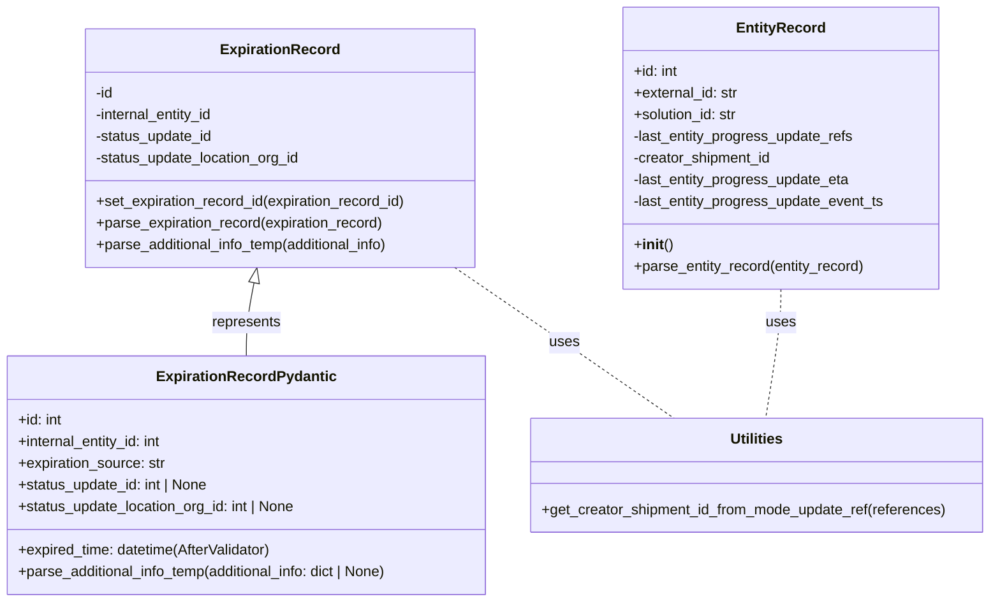

# Diagram: shipment_core/shipment_service/shipment_service/eta/eta_helper_objects.py


> Auto-generated by Obscura crawlers

## Diagram 1



### SVG

<svg id="container" width="1112.8984375" xmlns="http://www.w3.org/2000/svg" class="classDiagram" height="666" viewBox="0 0 1112.8984375 666" role="graphics-document document" aria-roledescription="class"><style>#container{font-family:"trebuchet ms",verdana,arial,sans-serif;font-size:16px;fill:#333;}@keyframes edge-animation-frame{from{stroke-dashoffset:0;}}@keyframes dash{to{stroke-dashoffset:0;}}#container .edge-animation-slow{stroke-dasharray:9,5!important;stroke-dashoffset:900;animation:dash 50s linear infinite;stroke-linecap:round;}#container .edge-animation-fast{stroke-dasharray:9,5!important;stroke-dashoffset:900;animation:dash 20s linear infinite;stroke-linecap:round;}#container .error-icon{fill:#552222;}#container .error-text{fill:#552222;stroke:#552222;}#container .edge-thickness-normal{stroke-width:1px;}#container .edge-thickness-thick{stroke-width:3.5px;}#container .edge-pattern-solid{stroke-dasharray:0;}#container .edge-thickness-invisible{stroke-width:0;fill:none;}#container .edge-pattern-dashed{stroke-dasharray:3;}#container .edge-pattern-dotted{stroke-dasharray:2;}#container .marker{fill:#333333;stroke:#333333;}#container .marker.cross{stroke:#333333;}#container svg{font-family:"trebuchet ms",verdana,arial,sans-serif;font-size:16px;}#container p{margin:0;}#container g.classGroup text{fill:#9370DB;stroke:none;font-family:"trebuchet ms",verdana,arial,sans-serif;font-size:10px;}#container g.classGroup text .title{font-weight:bolder;}#container .nodeLabel,#container .edgeLabel{color:#131300;}#container .edgeLabel .label rect{fill:#ECECFF;}#container .label text{fill:#131300;}#container .labelBkg{background:#ECECFF;}#container .edgeLabel .label span{background:#ECECFF;}#container .classTitle{font-weight:bolder;}#container .node rect,#container .node circle,#container .node ellipse,#container .node polygon,#container .node path{fill:#ECECFF;stroke:#9370DB;stroke-width:1px;}#container .divider{stroke:#9370DB;stroke-width:1;}#container g.clickable{cursor:pointer;}#container g.classGroup rect{fill:#ECECFF;stroke:#9370DB;}#container g.classGroup line{stroke:#9370DB;stroke-width:1;}#container .classLabel .box{stroke:none;stroke-width:0;fill:#ECECFF;opacity:0.5;}#container .classLabel .label{fill:#9370DB;font-size:10px;}#container .relation{stroke:#333333;stroke-width:1;fill:none;}#container .dashed-line{stroke-dasharray:3;}#container .dotted-line{stroke-dasharray:1 2;}#container #compositionStart,#container .composition{fill:#333333!important;stroke:#333333!important;stroke-width:1;}#container #compositionEnd,#container .composition{fill:#333333!important;stroke:#333333!important;stroke-width:1;}#container #dependencyStart,#container .dependency{fill:#333333!important;stroke:#333333!important;stroke-width:1;}#container #dependencyStart,#container .dependency{fill:#333333!important;stroke:#333333!important;stroke-width:1;}#container #extensionStart,#container .extension{fill:transparent!important;stroke:#333333!important;stroke-width:1;}#container #extensionEnd,#container .extension{fill:transparent!important;stroke:#333333!important;stroke-width:1;}#container #aggregationStart,#container .aggregation{fill:transparent!important;stroke:#333333!important;stroke-width:1;}#container #aggregationEnd,#container .aggregation{fill:transparent!important;stroke:#333333!important;stroke-width:1;}#container #lollipopStart,#container .lollipop{fill:#ECECFF!important;stroke:#333333!important;stroke-width:1;}#container #lollipopEnd,#container .lollipop{fill:#ECECFF!important;stroke:#333333!important;stroke-width:1;}#container .edgeTerminals{font-size:11px;line-height:initial;}#container .classTitleText{text-anchor:middle;font-size:18px;fill:#333;}#container .label-icon{display:inline-block;height:1em;overflow:visible;vertical-align:-0.125em;}#container .node .label-icon path{fill:currentColor;stroke:revert;stroke-width:revert;}#container :root{--mermaid-font-family:"trebuchet ms",verdana,arial,sans-serif;}</style><g><defs><marker id="container_class-aggregationStart" class="marker aggregation class" refX="18" refY="7" markerWidth="190" markerHeight="240" orient="auto"><path d="M 18,7 L9,13 L1,7 L9,1 Z"></path></marker></defs><defs><marker id="container_class-aggregationEnd" class="marker aggregation class" refX="1" refY="7" markerWidth="20" markerHeight="28" orient="auto"><path d="M 18,7 L9,13 L1,7 L9,1 Z"></path></marker></defs><defs><marker id="container_class-extensionStart" class="marker extension class" refX="18" refY="7" markerWidth="190" markerHeight="240" orient="auto"><path d="M 1,7 L18,13 V 1 Z"></path></marker></defs><defs><marker id="container_class-extensionEnd" class="marker extension class" refX="1" refY="7" markerWidth="20" markerHeight="28" orient="auto"><path d="M 1,1 V 13 L18,7 Z"></path></marker></defs><defs><marker id="container_class-compositionStart" class="marker composition class" refX="18" refY="7" markerWidth="190" markerHeight="240" orient="auto"><path d="M 18,7 L9,13 L1,7 L9,1 Z"></path></marker></defs><defs><marker id="container_class-compositionEnd" class="marker composition class" refX="1" refY="7" markerWidth="20" markerHeight="28" orient="auto"><path d="M 18,7 L9,13 L1,7 L9,1 Z"></path></marker></defs><defs><marker id="container_class-dependencyStart" class="marker dependency class" refX="6" refY="7" markerWidth="190" markerHeight="240" orient="auto"><path d="M 5,7 L9,13 L1,7 L9,1 Z"></path></marker></defs><defs><marker id="container_class-dependencyEnd" class="marker dependency class" refX="13" refY="7" markerWidth="20" markerHeight="28" orient="auto"><path d="M 18,7 L9,13 L14,7 L9,1 Z"></path></marker></defs><defs><marker id="container_class-lollipopStart" class="marker lollipop class" refX="13" refY="7" markerWidth="190" markerHeight="240" orient="auto"><circle stroke="black" fill="transparent" cx="7" cy="7" r="6"></circle></marker></defs><defs><marker id="container_class-lollipopEnd" class="marker lollipop class" refX="1" refY="7" markerWidth="190" markerHeight="240" orient="auto"><circle stroke="black" fill="transparent" cx="7" cy="7" r="6"></circle></marker></defs><g class="root"><g class="clusters"></g><g class="edgePaths"><path d="M287.262,312.933L285.833,320.277C284.405,327.622,281.548,342.311,280.12,355.822C278.691,369.333,278.691,381.667,278.691,387.833L278.691,394" id="id_ExpirationRecord_ExpirationRecordPydantic_1" class="edge-thickness-normal edge-pattern-solid relation" style=";;;" data-edge="true" data-et="edge" data-id="id_ExpirationRecord_ExpirationRecordPydantic_1" data-points="W3sieCI6MjkwLjU1NDg0OTQxNzA5ODQ3LCJ5IjoyOTZ9LHsieCI6Mjc4LjY5MTQwNjI1LCJ5IjozNTd9LHsieCI6Mjc4LjY5MTQwNjI1LCJ5IjozOTR9XQ==" marker-start="url(#container_class-extensionStart)"></path><path d="M878.633,320L878.633,326.167C878.633,332.333,878.633,344.667,875.863,368.5C873.094,392.333,867.555,427.667,864.786,445.333L862.016,463" id="id_EntityRecord_Utilities_2" class="edge-thickness-normal edge-pattern-dashed relation" style=";;;" data-edge="true" data-et="edge" data-id="id_EntityRecord_Utilities_2" data-points="W3sieCI6ODc4LjYzMjgxMjUsInkiOjMyMH0seyJ4Ijo4NzguNjMyODEyNSwieSI6MzU3fSx7IngiOjg2Mi4wMTY0MTA4NzI3ODExLCJ5Ijo0NjN9XQ=="></path><path d="M512.328,296L527.432,306.167C542.536,316.333,572.744,336.667,613.897,364.5C655.05,392.333,707.149,427.667,733.198,445.333L759.248,463" id="id_ExpirationRecord_Utilities_3" class="edge-thickness-normal edge-pattern-dashed relation" style=";;;" data-edge="true" data-et="edge" data-id="id_ExpirationRecord_Utilities_3" data-points="W3sieCI6NTEyLjMyODM2Nzg3NTY0NzcsInkiOjI5Nn0seyJ4Ijo2MDIuOTUxMTcxODc1LCJ5IjozNTd9LHsieCI6NzU5LjI0NzUxNTI1NTE3NzUsInkiOjQ2M31d"></path></g><g class="edgeLabels"><g class="edgeLabel" transform="translate(278.69140625, 357)"><g class="label" data-id="id_ExpirationRecord_ExpirationRecordPydantic_1" transform="translate(-38.578125, -12)"><foreignObject width="77.15625" height="24"><div xmlns="http://www.w3.org/1999/xhtml" class="labelBkg" style="display: table-cell; white-space: nowrap; line-height: 1.5; max-width: 200px; text-align: center;"><span class="edgeLabel"><p>represents</p></span></div></foreignObject></g></g><g class="edgeLabel" transform="translate(878.6328125, 357)"><g class="label" data-id="id_EntityRecord_Utilities_2" transform="translate(-16.4921875, -12)"><foreignObject width="32.984375" height="24"><div xmlns="http://www.w3.org/1999/xhtml" class="labelBkg" style="display: table-cell; white-space: nowrap; line-height: 1.5; max-width: 200px; text-align: center;"><span class="edgeLabel"><p>uses</p></span></div></foreignObject></g></g><g class="edgeLabel" transform="translate(635.89457, 379.34218)"><g class="label" data-id="id_ExpirationRecord_Utilities_3" transform="translate(-16.4921875, -12)"><foreignObject width="32.984375" height="24"><div xmlns="http://www.w3.org/1999/xhtml" class="labelBkg" style="display: table-cell; white-space: nowrap; line-height: 1.5; max-width: 200px; text-align: center;"><span class="edgeLabel"><p>uses</p></span></div></foreignObject></g></g></g><g class="nodes"><g class="node default" id="classId-ExpirationRecord-0" transform="translate(316.2265625, 164)"><g class="basic label-container"><path d="M-218.2265625 -132 L218.2265625 -132 L218.2265625 132 L-218.2265625 132" stroke="none" stroke-width="0" fill="#ECECFF" style=""></path><path d="M-218.2265625 -132 C-82.21815710687292 -132, 53.790248286254155 -132, 218.2265625 -132 M-218.2265625 -132 C-98.95139256605202 -132, 20.323777367895957 -132, 218.2265625 -132 M218.2265625 -132 C218.2265625 -50.73355751873699, 218.2265625 30.532884962526026, 218.2265625 132 M218.2265625 -132 C218.2265625 -49.105877911888484, 218.2265625 33.78824417622303, 218.2265625 132 M218.2265625 132 C89.7748208789497 132, -38.676920742100606 132, -218.2265625 132 M218.2265625 132 C117.36032753387249 132, 16.494092567744985 132, -218.2265625 132 M-218.2265625 132 C-218.2265625 32.58875387380141, -218.2265625 -66.82249225239718, -218.2265625 -132 M-218.2265625 132 C-218.2265625 34.49324731082149, -218.2265625 -63.013505378357024, -218.2265625 -132" stroke="#9370DB" stroke-width="1.3" fill="none" stroke-dasharray="0 0" style=""></path></g><g class="annotation-group text" transform="translate(0, -108)"></g><g class="label-group text" transform="translate(-62.625, -108)"><g class="label" style="font-weight: bolder" transform="translate(0,-12)"><foreignObject width="125.25" height="24"><div xmlns="http://www.w3.org/1999/xhtml" style="display: table-cell; white-space: nowrap; line-height: 1.5; max-width: 174px; text-align: center;"><span class="nodeLabel markdown-node-label" style=""><p>ExpirationRecord</p></span></div></foreignObject></g></g><g class="members-group text" transform="translate(-206.2265625, -60)"><g class="label" style="" transform="translate(0,-12)"><foreignObject width="20.53125" height="24"><div xmlns="http://www.w3.org/1999/xhtml" style="display: table-cell; white-space: nowrap; line-height: 1.5; max-width: 78px; text-align: center;"><span class="nodeLabel markdown-node-label" style=""><p>-id</p></span></div></foreignObject></g><g class="label" style="" transform="translate(0,12)"><foreignObject width="135.25" height="24"><div xmlns="http://www.w3.org/1999/xhtml" style="display: table-cell; white-space: nowrap; line-height: 1.5; max-width: 193px; text-align: center;"><span class="nodeLabel markdown-node-label" style=""><p>-internal_entity_id</p></span></div></foreignObject></g><g class="label" style="" transform="translate(0,36)"><foreignObject width="131.953125" height="24"><div xmlns="http://www.w3.org/1999/xhtml" style="display: table-cell; white-space: nowrap; line-height: 1.5; max-width: 189px; text-align: center;"><span class="nodeLabel markdown-node-label" style=""><p>-status_update_id</p></span></div></foreignObject></g><g class="label" style="" transform="translate(0,60)"><foreignObject width="230.9375" height="24"><div xmlns="http://www.w3.org/1999/xhtml" style="display: table-cell; white-space: nowrap; line-height: 1.5; max-width: 288px; text-align: center;"><span class="nodeLabel markdown-node-label" style=""><p>-status_update_location_org_id</p></span></div></foreignObject></g></g><g class="methods-group text" transform="translate(-206.2265625, 60)"><g class="label" style="" transform="translate(0,-12)"><foreignObject width="349.828125" height="24"><div xmlns="http://www.w3.org/1999/xhtml" style="display: table-cell; white-space: nowrap; line-height: 1.5; max-width: 407px; text-align: center;"><span class="nodeLabel markdown-node-label" style=""><p>+set_expiration_record_id(expiration_record_id)</p></span></div></foreignObject></g><g class="label" style="" transform="translate(0,12)"><foreignObject width="322.921875" height="24"><div xmlns="http://www.w3.org/1999/xhtml" style="display: table-cell; white-space: nowrap; line-height: 1.5; max-width: 380px; text-align: center;"><span class="nodeLabel markdown-node-label" style=""><p>+parse_expiration_record(expiration_record)</p></span></div></foreignObject></g><g class="label" style="" transform="translate(0,36)"><foreignObject width="334.0625" height="24"><div xmlns="http://www.w3.org/1999/xhtml" style="display: table-cell; white-space: nowrap; line-height: 1.5; max-width: 391px; text-align: center;"><span class="nodeLabel markdown-node-label" style=""><p>+parse_additional_info_temp(additional_info)</p></span></div></foreignObject></g></g><g class="divider" style=""><path d="M-218.2265625 -84 C-91.45989210421716 -84, 35.30677829156568 -84, 218.2265625 -84 M-218.2265625 -84 C-121.59690912081248 -84, -24.967255741624967 -84, 218.2265625 -84" stroke="#9370DB" stroke-width="1.3" fill="none" stroke-dasharray="0 0" style=""></path></g><g class="divider" style=""><path d="M-218.2265625 36 C-84.82170844241918 36, 48.58314561516164 36, 218.2265625 36 M-218.2265625 36 C-105.2933999883233 36, 7.639762523353397 36, 218.2265625 36" stroke="#9370DB" stroke-width="1.3" fill="none" stroke-dasharray="0 0" style=""></path></g></g><g class="node default" id="classId-ExpirationRecordPydantic-1" transform="translate(278.69140625, 526)"><g class="basic label-container"><path d="M-270.69140625 -132 L270.69140625 -132 L270.69140625 132 L-270.69140625 132" stroke="none" stroke-width="0" fill="#ECECFF" style=""></path><path d="M-270.69140625 -132 C-94.55740640524877 -132, 81.57659343950246 -132, 270.69140625 -132 M-270.69140625 -132 C-136.88119832181485 -132, -3.0709903936296996 -132, 270.69140625 -132 M270.69140625 -132 C270.69140625 -47.4646896215358, 270.69140625 37.070620756928406, 270.69140625 132 M270.69140625 -132 C270.69140625 -43.4536140552045, 270.69140625 45.092771889591006, 270.69140625 132 M270.69140625 132 C106.31446000364033 132, -58.06248624271933 132, -270.69140625 132 M270.69140625 132 C74.3294255127818 132, -122.03255522443641 132, -270.69140625 132 M-270.69140625 132 C-270.69140625 73.23890686930358, -270.69140625 14.477813738607168, -270.69140625 -132 M-270.69140625 132 C-270.69140625 58.37933875458512, -270.69140625 -15.24132249082976, -270.69140625 -132" stroke="#9370DB" stroke-width="1.3" fill="none" stroke-dasharray="0 0" style=""></path></g><g class="annotation-group text" transform="translate(0, -108)"></g><g class="label-group text" transform="translate(-94.4453125, -108)"><g class="label" style="font-weight: bolder" transform="translate(0,-12)"><foreignObject width="188.890625" height="24"><div xmlns="http://www.w3.org/1999/xhtml" style="display: table-cell; white-space: nowrap; line-height: 1.5; max-width: 237px; text-align: center;"><span class="nodeLabel markdown-node-label" style=""><p>ExpirationRecordPydantic</p></span></div></foreignObject></g></g><g class="members-group text" transform="translate(-258.69140625, -60)"><g class="label" style="" transform="translate(0,-12)"><foreignObject width="49.8125" height="24"><div xmlns="http://www.w3.org/1999/xhtml" style="display: table-cell; white-space: nowrap; line-height: 1.5; max-width: 107px; text-align: center;"><span class="nodeLabel markdown-node-label" style=""><p>+id: int</p></span></div></foreignObject></g><g class="label" style="" transform="translate(0,12)"><foreignObject width="164.53125" height="24"><div xmlns="http://www.w3.org/1999/xhtml" style="display: table-cell; white-space: nowrap; line-height: 1.5; max-width: 222px; text-align: center;"><span class="nodeLabel markdown-node-label" style=""><p>+internal_entity_id: int</p></span></div></foreignObject></g><g class="label" style="" transform="translate(0,36)"><foreignObject width="165.375" height="24"><div xmlns="http://www.w3.org/1999/xhtml" style="display: table-cell; white-space: nowrap; line-height: 1.5; max-width: 224px; text-align: center;"><span class="nodeLabel markdown-node-label" style=""><p>+expiration_source: str</p></span></div></foreignObject></g><g class="label" style="" transform="translate(0,60)"><foreignObject width="214.53125" height="24"><div xmlns="http://www.w3.org/1999/xhtml" style="display: table-cell; white-space: nowrap; line-height: 1.5; max-width: 272px; text-align: center;"><span class="nodeLabel markdown-node-label" style=""><p>+status_update_id: int | None</p></span></div></foreignObject></g><g class="label" style="" transform="translate(0,84)"><foreignObject width="313.515625" height="24"><div xmlns="http://www.w3.org/1999/xhtml" style="display: table-cell; white-space: nowrap; line-height: 1.5; max-width: 371px; text-align: center;"><span class="nodeLabel markdown-node-label" style=""><p>+status_update_location_org_id: int | None</p></span></div></foreignObject></g></g><g class="methods-group text" transform="translate(-258.69140625, 84)"><g class="label" style="" transform="translate(0,-12)"><foreignObject width="287.03125" height="24"><div xmlns="http://www.w3.org/1999/xhtml" style="display: table-cell; white-space: nowrap; line-height: 1.5; max-width: 344px; text-align: center;"><span class="nodeLabel markdown-node-label" style=""><p>+expired_time: datetime(AfterValidator)</p></span></div></foreignObject></g><g class="label" style="" transform="translate(0,12)"><foreignObject width="422.9375" height="24"><div xmlns="http://www.w3.org/1999/xhtml" style="display: table-cell; white-space: nowrap; line-height: 1.5; max-width: 480px; text-align: center;"><span class="nodeLabel markdown-node-label" style=""><p>+parse_additional_info_temp(additional_info: dict | None)</p></span></div></foreignObject></g></g><g class="divider" style=""><path d="M-270.69140625 -84 C-96.97917500927625 -84, 76.7330562314475 -84, 270.69140625 -84 M-270.69140625 -84 C-150.9222173707922 -84, -31.153028491584394 -84, 270.69140625 -84" stroke="#9370DB" stroke-width="1.3" fill="none" stroke-dasharray="0 0" style=""></path></g><g class="divider" style=""><path d="M-270.69140625 60 C-121.13164354143373 60, 28.428119167132536 60, 270.69140625 60 M-270.69140625 60 C-132.2750112508686 60, 6.141383748262797 60, 270.69140625 60" stroke="#9370DB" stroke-width="1.3" fill="none" stroke-dasharray="0 0" style=""></path></g></g><g class="node default" id="classId-EntityRecord-2" transform="translate(878.6328125, 164)"><g class="basic label-container"><path d="M-175.8125 -156 L175.8125 -156 L175.8125 156 L-175.8125 156" stroke="none" stroke-width="0" fill="#ECECFF" style=""></path><path d="M-175.8125 -156 C-57.181258373482166 -156, 61.44998325303567 -156, 175.8125 -156 M-175.8125 -156 C-100.30478570371073 -156, -24.79707140742147 -156, 175.8125 -156 M175.8125 -156 C175.8125 -63.04984366125245, 175.8125 29.900312677495094, 175.8125 156 M175.8125 -156 C175.8125 -38.780403136895956, 175.8125 78.43919372620809, 175.8125 156 M175.8125 156 C68.49397970797193 156, -38.82454058405614 156, -175.8125 156 M175.8125 156 C61.2891753319324 156, -53.234149336135204 156, -175.8125 156 M-175.8125 156 C-175.8125 73.36753458412602, -175.8125 -9.26493083174796, -175.8125 -156 M-175.8125 156 C-175.8125 90.96030367868349, -175.8125 25.920607357366976, -175.8125 -156" stroke="#9370DB" stroke-width="1.3" fill="none" stroke-dasharray="0 0" style=""></path></g><g class="annotation-group text" transform="translate(0, -132)"></g><g class="label-group text" transform="translate(-46.625, -132)"><g class="label" style="font-weight: bolder" transform="translate(0,-12)"><foreignObject width="93.25" height="24"><div xmlns="http://www.w3.org/1999/xhtml" style="display: table-cell; white-space: nowrap; line-height: 1.5; max-width: 142px; text-align: center;"><span class="nodeLabel markdown-node-label" style=""><p>EntityRecord</p></span></div></foreignObject></g></g><g class="members-group text" transform="translate(-163.8125, -84)"><g class="label" style="" transform="translate(0,-12)"><foreignObject width="49.8125" height="24"><div xmlns="http://www.w3.org/1999/xhtml" style="display: table-cell; white-space: nowrap; line-height: 1.5; max-width: 107px; text-align: center;"><span class="nodeLabel markdown-node-label" style=""><p>+id: int</p></span></div></foreignObject></g><g class="label" style="" transform="translate(0,12)"><foreignObject width="117.265625" height="24"><div xmlns="http://www.w3.org/1999/xhtml" style="display: table-cell; white-space: nowrap; line-height: 1.5; max-width: 175px; text-align: center;"><span class="nodeLabel markdown-node-label" style=""><p>+external_id: str</p></span></div></foreignObject></g><g class="label" style="" transform="translate(0,36)"><foreignObject width="117.71875" height="24"><div xmlns="http://www.w3.org/1999/xhtml" style="display: table-cell; white-space: nowrap; line-height: 1.5; max-width: 176px; text-align: center;"><span class="nodeLabel markdown-node-label" style=""><p>+solution_id: str</p></span></div></foreignObject></g><g class="label" style="" transform="translate(0,60)"><foreignObject width="246.90625" height="24"><div xmlns="http://www.w3.org/1999/xhtml" style="display: table-cell; white-space: nowrap; line-height: 1.5; max-width: 304px; text-align: center;"><span class="nodeLabel markdown-node-label" style=""><p>-last_entity_progress_update_refs</p></span></div></foreignObject></g><g class="label" style="" transform="translate(0,84)"><foreignObject width="156.015625" height="24"><div xmlns="http://www.w3.org/1999/xhtml" style="display: table-cell; white-space: nowrap; line-height: 1.5; max-width: 213px; text-align: center;"><span class="nodeLabel markdown-node-label" style=""><p>-creator_shipment_id</p></span></div></foreignObject></g><g class="label" style="" transform="translate(0,108)"><foreignObject width="242.5" height="24"><div xmlns="http://www.w3.org/1999/xhtml" style="display: table-cell; white-space: nowrap; line-height: 1.5; max-width: 300px; text-align: center;"><span class="nodeLabel markdown-node-label" style=""><p>-last_entity_progress_update_eta</p></span></div></foreignObject></g><g class="label" style="" transform="translate(0,132)"><foreignObject width="281" height="24"><div xmlns="http://www.w3.org/1999/xhtml" style="display: table-cell; white-space: nowrap; line-height: 1.5; max-width: 338px; text-align: center;"><span class="nodeLabel markdown-node-label" style=""><p>-last_entity_progress_update_event_ts</p></span></div></foreignObject></g></g><g class="methods-group text" transform="translate(-163.8125, 108)"><g class="label" style="" transform="translate(0,-12)"><foreignObject width="42.796875" height="24"><div xmlns="http://www.w3.org/1999/xhtml" style="display: table-cell; white-space: nowrap; line-height: 1.5; max-width: 132px; text-align: center;"><span class="nodeLabel markdown-node-label" style=""><p>+<strong>init</strong>()</p></span></div></foreignObject></g><g class="label" style="" transform="translate(0,12)"><foreignObject width="258.5" height="24"><div xmlns="http://www.w3.org/1999/xhtml" style="display: table-cell; white-space: nowrap; line-height: 1.5; max-width: 316px; text-align: center;"><span class="nodeLabel markdown-node-label" style=""><p>+parse_entity_record(entity_record)</p></span></div></foreignObject></g></g><g class="divider" style=""><path d="M-175.8125 -108 C-94.3955962815168 -108, -12.978692563033604 -108, 175.8125 -108 M-175.8125 -108 C-84.25427124488787 -108, 7.303957510224251 -108, 175.8125 -108" stroke="#9370DB" stroke-width="1.3" fill="none" stroke-dasharray="0 0" style=""></path></g><g class="divider" style=""><path d="M-175.8125 84 C-39.49841246666816 84, 96.81567506666369 84, 175.8125 84 M-175.8125 84 C-42.560084456067386 84, 90.69233108786523 84, 175.8125 84" stroke="#9370DB" stroke-width="1.3" fill="none" stroke-dasharray="0 0" style=""></path></g></g><g class="node default" id="classId-Utilities-3" transform="translate(852.140625, 526)"><g class="basic label-container"><path d="M-252.7578125 -63 L252.7578125 -63 L252.7578125 63 L-252.7578125 63" stroke="none" stroke-width="0" fill="#ECECFF" style=""></path><path d="M-252.7578125 -63 C-81.84148597629328 -63, 89.07484054741343 -63, 252.7578125 -63 M-252.7578125 -63 C-91.82943995264557 -63, 69.09893259470886 -63, 252.7578125 -63 M252.7578125 -63 C252.7578125 -28.75824437120773, 252.7578125 5.483511257584539, 252.7578125 63 M252.7578125 -63 C252.7578125 -34.591822370031764, 252.7578125 -6.183644740063528, 252.7578125 63 M252.7578125 63 C58.84157275290687 63, -135.07466699418626 63, -252.7578125 63 M252.7578125 63 C150.1161416338026 63, 47.474470767605254 63, -252.7578125 63 M-252.7578125 63 C-252.7578125 25.5419342682381, -252.7578125 -11.916131463523797, -252.7578125 -63 M-252.7578125 63 C-252.7578125 22.17507197422445, -252.7578125 -18.649856051551097, -252.7578125 -63" stroke="#9370DB" stroke-width="1.3" fill="none" stroke-dasharray="0 0" style=""></path></g><g class="annotation-group text" transform="translate(0, -39)"></g><g class="label-group text" transform="translate(-28.8125, -39)"><g class="label" style="font-weight: bolder" transform="translate(0,-12)"><foreignObject width="57.625" height="24"><div xmlns="http://www.w3.org/1999/xhtml" style="display: table-cell; white-space: nowrap; line-height: 1.5; max-width: 107px; text-align: center;"><span class="nodeLabel markdown-node-label" style=""><p>Utilities</p></span></div></foreignObject></g></g><g class="members-group text" transform="translate(-240.7578125, 9)"></g><g class="methods-group text" transform="translate(-240.7578125, 39)"><g class="label" style="" transform="translate(0,-12)"><foreignObject width="452.703125" height="24"><div xmlns="http://www.w3.org/1999/xhtml" style="display: table-cell; white-space: nowrap; line-height: 1.5; max-width: 510px; text-align: center;"><span class="nodeLabel markdown-node-label" style=""><p>+get_creator_shipment_id_from_mode_update_ref(references)</p></span></div></foreignObject></g></g><g class="divider" style=""><path d="M-252.7578125 -15 C-103.33945261294642 -15, 46.078907274107166 -15, 252.7578125 -15 M-252.7578125 -15 C-147.59565879763073 -15, -42.43350509526147 -15, 252.7578125 -15" stroke="#9370DB" stroke-width="1.3" fill="none" stroke-dasharray="0 0" style=""></path></g><g class="divider" style=""><path d="M-252.7578125 9 C-98.00901376126609 9, 56.73978497746782 9, 252.7578125 9 M-252.7578125 9 C-145.4611317441151 9, -38.16445098823024 9, 252.7578125 9" stroke="#9370DB" stroke-width="1.3" fill="none" stroke-dasharray="0 0" style=""></path></g></g></g></g></g></svg>

## Diagram 2

```mermaid
flowchart LR
    Start([start])
    CheckRefs{references is None?}
    ForLoop[/iterate references/]
    GetQual[/"qualifier = str(reference.get('qualifier'))"/]
    QualCheck{qualifier startsWith "mode_" AND endsWith "_update"?}
    ReturnValue["return reference.get('value')"]
    ContinueLoop["continue loop"]
    EndNull([return None])
    Start --> CheckRefs
    CheckRefs -- Yes --> EndNull
    CheckRefs -- No --> ForLoop
    ForLoop --> GetQual
    GetQual --> QualCheck
    QualCheck -- Yes --> ReturnValue
    QualCheck -- No --> ContinueLoop
    ContinueLoop --> ForLoop
    ForLoop --> EndNull
```

> SVG rendering failed for this diagram.
