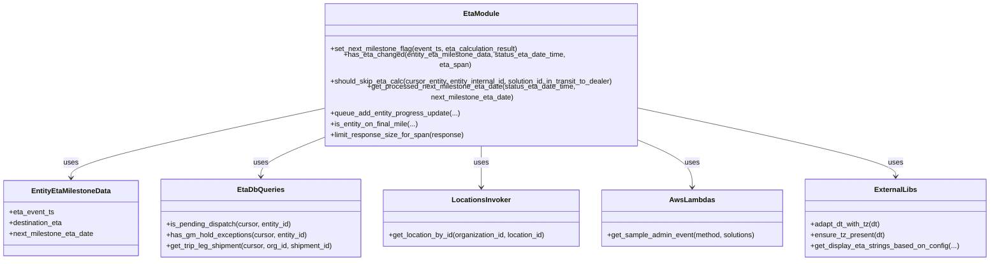

# Diagram: shipment_core/shipment_service/shipment_service/eta/eta_milestone_update/common.py


> Auto-generated by Obscura crawlers

## Diagram 1



### SVG

<svg id="container" width="2220.40625" xmlns="http://www.w3.org/2000/svg" class="classDiagram" height="534" viewBox="0 0 2220.40625 534" role="graphics-document document" aria-roledescription="class"><style>#container{font-family:"trebuchet ms",verdana,arial,sans-serif;font-size:16px;fill:#333;}@keyframes edge-animation-frame{from{stroke-dashoffset:0;}}@keyframes dash{to{stroke-dashoffset:0;}}#container .edge-animation-slow{stroke-dasharray:9,5!important;stroke-dashoffset:900;animation:dash 50s linear infinite;stroke-linecap:round;}#container .edge-animation-fast{stroke-dasharray:9,5!important;stroke-dashoffset:900;animation:dash 20s linear infinite;stroke-linecap:round;}#container .error-icon{fill:#552222;}#container .error-text{fill:#552222;stroke:#552222;}#container .edge-thickness-normal{stroke-width:1px;}#container .edge-thickness-thick{stroke-width:3.5px;}#container .edge-pattern-solid{stroke-dasharray:0;}#container .edge-thickness-invisible{stroke-width:0;fill:none;}#container .edge-pattern-dashed{stroke-dasharray:3;}#container .edge-pattern-dotted{stroke-dasharray:2;}#container .marker{fill:#333333;stroke:#333333;}#container .marker.cross{stroke:#333333;}#container svg{font-family:"trebuchet ms",verdana,arial,sans-serif;font-size:16px;}#container p{margin:0;}#container g.classGroup text{fill:#9370DB;stroke:none;font-family:"trebuchet ms",verdana,arial,sans-serif;font-size:10px;}#container g.classGroup text .title{font-weight:bolder;}#container .nodeLabel,#container .edgeLabel{color:#131300;}#container .edgeLabel .label rect{fill:#ECECFF;}#container .label text{fill:#131300;}#container .labelBkg{background:#ECECFF;}#container .edgeLabel .label span{background:#ECECFF;}#container .classTitle{font-weight:bolder;}#container .node rect,#container .node circle,#container .node ellipse,#container .node polygon,#container .node path{fill:#ECECFF;stroke:#9370DB;stroke-width:1px;}#container .divider{stroke:#9370DB;stroke-width:1;}#container g.clickable{cursor:pointer;}#container g.classGroup rect{fill:#ECECFF;stroke:#9370DB;}#container g.classGroup line{stroke:#9370DB;stroke-width:1;}#container .classLabel .box{stroke:none;stroke-width:0;fill:#ECECFF;opacity:0.5;}#container .classLabel .label{fill:#9370DB;font-size:10px;}#container .relation{stroke:#333333;stroke-width:1;fill:none;}#container .dashed-line{stroke-dasharray:3;}#container .dotted-line{stroke-dasharray:1 2;}#container #compositionStart,#container .composition{fill:#333333!important;stroke:#333333!important;stroke-width:1;}#container #compositionEnd,#container .composition{fill:#333333!important;stroke:#333333!important;stroke-width:1;}#container #dependencyStart,#container .dependency{fill:#333333!important;stroke:#333333!important;stroke-width:1;}#container #dependencyStart,#container .dependency{fill:#333333!important;stroke:#333333!important;stroke-width:1;}#container #extensionStart,#container .extension{fill:transparent!important;stroke:#333333!important;stroke-width:1;}#container #extensionEnd,#container .extension{fill:transparent!important;stroke:#333333!important;stroke-width:1;}#container #aggregationStart,#container .aggregation{fill:transparent!important;stroke:#333333!important;stroke-width:1;}#container #aggregationEnd,#container .aggregation{fill:transparent!important;stroke:#333333!important;stroke-width:1;}#container #lollipopStart,#container .lollipop{fill:#ECECFF!important;stroke:#333333!important;stroke-width:1;}#container #lollipopEnd,#container .lollipop{fill:#ECECFF!important;stroke:#333333!important;stroke-width:1;}#container .edgeTerminals{font-size:11px;line-height:initial;}#container .classTitleText{text-anchor:middle;font-size:18px;fill:#333;}#container .label-icon{display:inline-block;height:1em;overflow:visible;vertical-align:-0.125em;}#container .node .label-icon path{fill:currentColor;stroke:revert;stroke-width:revert;}#container :root{--mermaid-font-family:"trebuchet ms",verdana,arial,sans-serif;}</style><g><defs><marker id="container_class-aggregationStart" class="marker aggregation class" refX="18" refY="7" markerWidth="190" markerHeight="240" orient="auto"><path d="M 18,7 L9,13 L1,7 L9,1 Z"></path></marker></defs><defs><marker id="container_class-aggregationEnd" class="marker aggregation class" refX="1" refY="7" markerWidth="20" markerHeight="28" orient="auto"><path d="M 18,7 L9,13 L1,7 L9,1 Z"></path></marker></defs><defs><marker id="container_class-extensionStart" class="marker extension class" refX="18" refY="7" markerWidth="190" markerHeight="240" orient="auto"><path d="M 1,7 L18,13 V 1 Z"></path></marker></defs><defs><marker id="container_class-extensionEnd" class="marker extension class" refX="1" refY="7" markerWidth="20" markerHeight="28" orient="auto"><path d="M 1,1 V 13 L18,7 Z"></path></marker></defs><defs><marker id="container_class-compositionStart" class="marker composition class" refX="18" refY="7" markerWidth="190" markerHeight="240" orient="auto"><path d="M 18,7 L9,13 L1,7 L9,1 Z"></path></marker></defs><defs><marker id="container_class-compositionEnd" class="marker composition class" refX="1" refY="7" markerWidth="20" markerHeight="28" orient="auto"><path d="M 18,7 L9,13 L1,7 L9,1 Z"></path></marker></defs><defs><marker id="container_class-dependencyStart" class="marker dependency class" refX="6" refY="7" markerWidth="190" markerHeight="240" orient="auto"><path d="M 5,7 L9,13 L1,7 L9,1 Z"></path></marker></defs><defs><marker id="container_class-dependencyEnd" class="marker dependency class" refX="13" refY="7" markerWidth="20" markerHeight="28" orient="auto"><path d="M 18,7 L9,13 L14,7 L9,1 Z"></path></marker></defs><defs><marker id="container_class-lollipopStart" class="marker lollipop class" refX="13" refY="7" markerWidth="190" markerHeight="240" orient="auto"><circle stroke="black" fill="transparent" cx="7" cy="7" r="6"></circle></marker></defs><defs><marker id="container_class-lollipopEnd" class="marker lollipop class" refX="1" refY="7" markerWidth="190" markerHeight="240" orient="auto"><circle stroke="black" fill="transparent" cx="7" cy="7" r="6"></circle></marker></defs><g class="root"><g class="clusters"></g><g class="edgePaths"><path d="M721.418,210.3L627.558,227.75C533.698,245.2,345.978,280.1,252.118,303.217C158.258,326.333,158.258,337.667,158.258,343.333L158.258,349" id="id_EtaModule_EntityEtaMilestoneData_1" class="edge-thickness-normal edge-pattern-solid relation" style=";;;" data-edge="true" data-et="edge" data-id="id_EtaModule_EntityEtaMilestoneData_1" data-points="W3sieCI6NzIxLjQxNzk2ODc1LCJ5IjoyMTAuMjk5ODk1NzA5NzQzNzR9LHsieCI6MTU4LjI1NzgxMjUsInkiOjMxNX0seyJ4IjoxNTguMjU3ODEyNSwieSI6MzU1fV0=" marker-end="url(#container_class-dependencyEnd)"></path><path d="M721.418,267.854L698.636,275.712C675.854,283.569,630.29,299.285,607.508,312.309C584.727,325.333,584.727,335.667,584.727,340.833L584.727,346" id="id_EtaModule_EtaDbQueries_2" class="edge-thickness-normal edge-pattern-solid relation" style=";;;" data-edge="true" data-et="edge" data-id="id_EtaModule_EtaDbQueries_2" data-points="W3sieCI6NzIxLjQxNzk2ODc1LCJ5IjoyNjcuODU0MDI5NzUwMjAxN30seyJ4Ijo1ODQuNzI2NTYyNSwieSI6MzE1fSx7IngiOjU4NC43MjY1NjI1LCJ5IjozNTJ9XQ==" marker-end="url(#container_class-dependencyEnd)"></path><path d="M1083.41,278L1083.41,284.167C1083.41,290.333,1083.41,302.667,1083.41,318C1083.41,333.333,1083.41,351.667,1083.41,360.833L1083.41,370" id="id_EtaModule_LocationsInvoker_3" class="edge-thickness-normal edge-pattern-solid relation" style=";;;" data-edge="true" data-et="edge" data-id="id_EtaModule_LocationsInvoker_3" data-points="W3sieCI6MTA4My40MTAxNTYyNSwieSI6Mjc4fSx7IngiOjEwODMuNDEwMTU2MjUsInkiOjMxNX0seyJ4IjoxMDgzLjQxMDE1NjI1LCJ5IjozNzZ9XQ==" marker-end="url(#container_class-dependencyEnd)"></path><path d="M1445.402,273.804L1464.404,280.67C1483.405,287.536,1521.408,301.268,1540.409,317.301C1559.41,333.333,1559.41,351.667,1559.41,360.833L1559.41,370" id="id_EtaModule_AwsLambdas_4" class="edge-thickness-normal edge-pattern-solid relation" style=";;;" data-edge="true" data-et="edge" data-id="id_EtaModule_AwsLambdas_4" data-points="W3sieCI6MTQ0NS40MDIzNDM3NSwieSI6MjczLjgwMzg5OTY4NDg3Mzk1fSx7IngiOjE1NTkuNDEwMTU2MjUsInkiOjMxNX0seyJ4IjoxNTU5LjQxMDE1NjI1LCJ5IjozNzZ9XQ==" marker-end="url(#container_class-dependencyEnd)"></path><path d="M1445.402,210.002L1539.947,227.502C1634.492,245.002,1823.582,280.001,1918.127,302.667C2012.672,325.333,2012.672,335.667,2012.672,340.833L2012.672,346" id="id_EtaModule_ExternalLibs_5" class="edge-thickness-normal edge-pattern-solid relation" style=";;;" data-edge="true" data-et="edge" data-id="id_EtaModule_ExternalLibs_5" data-points="W3sieCI6MTQ0NS40MDIzNDM3NSwieSI6MjEwLjAwMjI4MjU1Nzk3ODIyfSx7IngiOjIwMTIuNjcxODc1LCJ5IjozMTV9LHsieCI6MjAxMi42NzE4NzUsInkiOjM1Mn1d" marker-end="url(#container_class-dependencyEnd)"></path></g><g class="edgeLabels"><g class="edgeLabel" transform="translate(158.2578125, 315)"><g class="label" data-id="id_EtaModule_EntityEtaMilestoneData_1" transform="translate(-16.4921875, -12)"><foreignObject width="32.984375" height="24"><div xmlns="http://www.w3.org/1999/xhtml" class="labelBkg" style="display: table-cell; white-space: nowrap; line-height: 1.5; max-width: 200px; text-align: center;"><span class="edgeLabel"><p>uses</p></span></div></foreignObject></g></g><g class="edgeLabel" transform="translate(584.7265625, 315)"><g class="label" data-id="id_EtaModule_EtaDbQueries_2" transform="translate(-16.4921875, -12)"><foreignObject width="32.984375" height="24"><div xmlns="http://www.w3.org/1999/xhtml" class="labelBkg" style="display: table-cell; white-space: nowrap; line-height: 1.5; max-width: 200px; text-align: center;"><span class="edgeLabel"><p>uses</p></span></div></foreignObject></g></g><g class="edgeLabel" transform="translate(1083.41015625, 315)"><g class="label" data-id="id_EtaModule_LocationsInvoker_3" transform="translate(-16.4921875, -12)"><foreignObject width="32.984375" height="24"><div xmlns="http://www.w3.org/1999/xhtml" class="labelBkg" style="display: table-cell; white-space: nowrap; line-height: 1.5; max-width: 200px; text-align: center;"><span class="edgeLabel"><p>uses</p></span></div></foreignObject></g></g><g class="edgeLabel" transform="translate(1559.41015625, 315)"><g class="label" data-id="id_EtaModule_AwsLambdas_4" transform="translate(-16.4921875, -12)"><foreignObject width="32.984375" height="24"><div xmlns="http://www.w3.org/1999/xhtml" class="labelBkg" style="display: table-cell; white-space: nowrap; line-height: 1.5; max-width: 200px; text-align: center;"><span class="edgeLabel"><p>uses</p></span></div></foreignObject></g></g><g class="edgeLabel" transform="translate(2012.671875, 315)"><g class="label" data-id="id_EtaModule_ExternalLibs_5" transform="translate(-16.4921875, -12)"><foreignObject width="32.984375" height="24"><div xmlns="http://www.w3.org/1999/xhtml" class="labelBkg" style="display: table-cell; white-space: nowrap; line-height: 1.5; max-width: 200px; text-align: center;"><span class="edgeLabel"><p>uses</p></span></div></foreignObject></g></g></g><g class="nodes"><g class="node default" id="classId-EtaModule-0" transform="translate(1083.41015625, 143)"><g class="basic label-container"><path d="M-361.9921875 -135 L361.9921875 -135 L361.9921875 135 L-361.9921875 135" stroke="none" stroke-width="0" fill="#ECECFF" style=""></path><path d="M-361.9921875 -135 C-74.7463163185048 -135, 212.4995548629904 -135, 361.9921875 -135 M-361.9921875 -135 C-191.73933136804874 -135, -21.486475236097476 -135, 361.9921875 -135 M361.9921875 -135 C361.9921875 -54.54047794954788, 361.9921875 25.919044100904244, 361.9921875 135 M361.9921875 -135 C361.9921875 -31.702502706962463, 361.9921875 71.59499458607507, 361.9921875 135 M361.9921875 135 C143.02204558538543 135, -75.94809632922914 135, -361.9921875 135 M361.9921875 135 C157.3358823755679 135, -47.32042274886419 135, -361.9921875 135 M-361.9921875 135 C-361.9921875 51.903419997748784, -361.9921875 -31.19316000450243, -361.9921875 -135 M-361.9921875 135 C-361.9921875 71.94022758750867, -361.9921875 8.88045517501736, -361.9921875 -135" stroke="#9370DB" stroke-width="1.3" fill="none" stroke-dasharray="0 0" style=""></path></g><g class="annotation-group text" transform="translate(0, -111)"></g><g class="label-group text" transform="translate(-38.53125, -111)"><g class="label" style="font-weight: bolder" transform="translate(0,-12)"><foreignObject width="77.0625" height="24"><div xmlns="http://www.w3.org/1999/xhtml" style="display: table-cell; white-space: nowrap; line-height: 1.5; max-width: 127px; text-align: center;"><span class="nodeLabel markdown-node-label" style=""><p>EtaModule</p></span></div></foreignObject></g></g><g class="members-group text" transform="translate(-349.9921875, -63)"></g><g class="methods-group text" transform="translate(-349.9921875, -33)"><g class="label" style="" transform="translate(0,-12)"><foreignObject width="424.890625" height="24"><div xmlns="http://www.w3.org/1999/xhtml" style="display: table-cell; white-space: nowrap; line-height: 1.5; max-width: 482px; text-align: center;"><span class="nodeLabel markdown-node-label" style=""><p>+set_next_milestone_flag(event_ts, eta_calculation_result)</p></span></div></foreignObject></g><g class="label" style="" transform="translate(0,12)"><foreignObject width="575.578125" height="24"><div xmlns="http://www.w3.org/1999/xhtml" style="display: table-cell; white-space: nowrap; line-height: 1.5; max-width: 633px; text-align: center;"><span class="nodeLabel markdown-node-label" style=""><p>+has_eta_changed(entity_eta_milestone_data, status_eta_date_time, eta_span)</p></span></div></foreignObject></g><g class="label" style="" transform="translate(0,36)"><foreignObject width="648.296875" height="24"><div xmlns="http://www.w3.org/1999/xhtml" style="display: table-cell; white-space: nowrap; line-height: 1.5; max-width: 706px; text-align: center;"><span class="nodeLabel markdown-node-label" style=""><p>+should_skip_eta_calc(cursor_entity, entity_internal_id, solution_id, in_transit_to_dealer)</p></span></div></foreignObject></g><g class="label" style="" transform="translate(0,60)"><foreignObject width="661.453125" height="24"><div xmlns="http://www.w3.org/1999/xhtml" style="display: table-cell; white-space: nowrap; line-height: 1.5; max-width: 719px; text-align: center;"><span class="nodeLabel markdown-node-label" style=""><p>+get_processed_next_milestone_eta_date(status_eta_date_time, next_milestone_eta_date)</p></span></div></foreignObject></g><g class="label" style="" transform="translate(0,84)"><foreignObject width="289.90625" height="24"><div xmlns="http://www.w3.org/1999/xhtml" style="display: table-cell; white-space: nowrap; line-height: 1.5; max-width: 347px; text-align: center;"><span class="nodeLabel markdown-node-label" style=""><p>+queue_add_entity_progress_update(...)</p></span></div></foreignObject></g><g class="label" style="" transform="translate(0,108)"><foreignObject width="197.421875" height="24"><div xmlns="http://www.w3.org/1999/xhtml" style="display: table-cell; white-space: nowrap; line-height: 1.5; max-width: 255px; text-align: center;"><span class="nodeLabel markdown-node-label" style=""><p>+is_entity_on_final_mile(...)</p></span></div></foreignObject></g><g class="label" style="" transform="translate(0,132)"><foreignObject width="298.40625" height="24"><div xmlns="http://www.w3.org/1999/xhtml" style="display: table-cell; white-space: nowrap; line-height: 1.5; max-width: 356px; text-align: center;"><span class="nodeLabel markdown-node-label" style=""><p>+limit_response_size_for_span(response)</p></span></div></foreignObject></g></g><g class="divider" style=""><path d="M-361.9921875 -87 C-169.1133470682252 -87, 23.76549336354958 -87, 361.9921875 -87 M-361.9921875 -87 C-148.0683509525066 -87, 65.85548559498682 -87, 361.9921875 -87" stroke="#9370DB" stroke-width="1.3" fill="none" stroke-dasharray="0 0" style=""></path></g><g class="divider" style=""><path d="M-361.9921875 -63 C-175.76565340812888 -63, 10.460880683742232 -63, 361.9921875 -63 M-361.9921875 -63 C-105.9474896741101 -63, 150.0972081517798 -63, 361.9921875 -63" stroke="#9370DB" stroke-width="1.3" fill="none" stroke-dasharray="0 0" style=""></path></g></g><g class="node default" id="classId-EntityEtaMilestoneData-1" transform="translate(158.2578125, 439)"><g class="basic label-container"><path d="M-150.2578125 -84 L150.2578125 -84 L150.2578125 84 L-150.2578125 84" stroke="none" stroke-width="0" fill="#ECECFF" style=""></path><path d="M-150.2578125 -84 C-62.89083497739183 -84, 24.476142545216334 -84, 150.2578125 -84 M-150.2578125 -84 C-39.80128865615208 -84, 70.65523518769584 -84, 150.2578125 -84 M150.2578125 -84 C150.2578125 -25.08127866253146, 150.2578125 33.83744267493708, 150.2578125 84 M150.2578125 -84 C150.2578125 -24.838259587663757, 150.2578125 34.32348082467249, 150.2578125 84 M150.2578125 84 C70.04477978574812 84, -10.168252928503762 84, -150.2578125 84 M150.2578125 84 C83.57254831615627 84, 16.887284132312544 84, -150.2578125 84 M-150.2578125 84 C-150.2578125 37.327272698705585, -150.2578125 -9.34545460258883, -150.2578125 -84 M-150.2578125 84 C-150.2578125 30.153971417255846, -150.2578125 -23.692057165488308, -150.2578125 -84" stroke="#9370DB" stroke-width="1.3" fill="none" stroke-dasharray="0 0" style=""></path></g><g class="annotation-group text" transform="translate(0, -60)"></g><g class="label-group text" transform="translate(-85.421875, -60)"><g class="label" style="font-weight: bolder" transform="translate(0,-12)"><foreignObject width="170.84375" height="24"><div xmlns="http://www.w3.org/1999/xhtml" style="display: table-cell; white-space: nowrap; line-height: 1.5; max-width: 218px; text-align: center;"><span class="nodeLabel markdown-node-label" style=""><p>EntityEtaMilestoneData</p></span></div></foreignObject></g></g><g class="members-group text" transform="translate(-138.2578125, -12)"><g class="label" style="" transform="translate(0,-12)"><foreignObject width="100.65625" height="24"><div xmlns="http://www.w3.org/1999/xhtml" style="display: table-cell; white-space: nowrap; line-height: 1.5; max-width: 158px; text-align: center;"><span class="nodeLabel markdown-node-label" style=""><p>+eta_event_ts</p></span></div></foreignObject></g><g class="label" style="" transform="translate(0,12)"><foreignObject width="122.21875" height="24"><div xmlns="http://www.w3.org/1999/xhtml" style="display: table-cell; white-space: nowrap; line-height: 1.5; max-width: 180px; text-align: center;"><span class="nodeLabel markdown-node-label" style=""><p>+destination_eta</p></span></div></foreignObject></g><g class="label" style="" transform="translate(0,36)"><foreignObject width="191.09375" height="24"><div xmlns="http://www.w3.org/1999/xhtml" style="display: table-cell; white-space: nowrap; line-height: 1.5; max-width: 248px; text-align: center;"><span class="nodeLabel markdown-node-label" style=""><p>+next_milestone_eta_date</p></span></div></foreignObject></g></g><g class="methods-group text" transform="translate(-138.2578125, 84)"></g><g class="divider" style=""><path d="M-150.2578125 -36 C-70.75014956184475 -36, 8.757513376310499 -36, 150.2578125 -36 M-150.2578125 -36 C-36.8684073404887 -36, 76.5209978190226 -36, 150.2578125 -36" stroke="#9370DB" stroke-width="1.3" fill="none" stroke-dasharray="0 0" style=""></path></g><g class="divider" style=""><path d="M-150.2578125 60 C-35.522730806357245 60, 79.21235088728551 60, 150.2578125 60 M-150.2578125 60 C-51.6014023169395 60, 47.055007866121 60, 150.2578125 60" stroke="#9370DB" stroke-width="1.3" fill="none" stroke-dasharray="0 0" style=""></path></g></g><g class="node default" id="classId-EtaDbQueries-2" transform="translate(584.7265625, 439)"><g class="basic label-container"><path d="M-226.2109375 -87 L226.2109375 -87 L226.2109375 87 L-226.2109375 87" stroke="none" stroke-width="0" fill="#ECECFF" style=""></path><path d="M-226.2109375 -87 C-106.10992209370539 -87, 13.991093312589214 -87, 226.2109375 -87 M-226.2109375 -87 C-57.186864923950566 -87, 111.83720765209887 -87, 226.2109375 -87 M226.2109375 -87 C226.2109375 -26.695978910909425, 226.2109375 33.60804217818115, 226.2109375 87 M226.2109375 -87 C226.2109375 -23.0296699052331, 226.2109375 40.9406601895338, 226.2109375 87 M226.2109375 87 C123.00340202369716 87, 19.795866547394326 87, -226.2109375 87 M226.2109375 87 C98.5045071088613 87, -29.20192328227739 87, -226.2109375 87 M-226.2109375 87 C-226.2109375 49.00406195832721, -226.2109375 11.008123916654426, -226.2109375 -87 M-226.2109375 87 C-226.2109375 31.776662959928245, -226.2109375 -23.44667408014351, -226.2109375 -87" stroke="#9370DB" stroke-width="1.3" fill="none" stroke-dasharray="0 0" style=""></path></g><g class="annotation-group text" transform="translate(0, -63)"></g><g class="label-group text" transform="translate(-49.6875, -63)"><g class="label" style="font-weight: bolder" transform="translate(0,-12)"><foreignObject width="99.375" height="24"><div xmlns="http://www.w3.org/1999/xhtml" style="display: table-cell; white-space: nowrap; line-height: 1.5; max-width: 148px; text-align: center;"><span class="nodeLabel markdown-node-label" style=""><p>EtaDbQueries</p></span></div></foreignObject></g></g><g class="members-group text" transform="translate(-214.2109375, -15)"></g><g class="methods-group text" transform="translate(-214.2109375, 15)"><g class="label" style="" transform="translate(0,-12)"><foreignObject width="284.34375" height="24"><div xmlns="http://www.w3.org/1999/xhtml" style="display: table-cell; white-space: nowrap; line-height: 1.5; max-width: 342px; text-align: center;"><span class="nodeLabel markdown-node-label" style=""><p>+is_pending_dispatch(cursor, entity_id)</p></span></div></foreignObject></g><g class="label" style="" transform="translate(0,12)"><foreignObject width="317.765625" height="24"><div xmlns="http://www.w3.org/1999/xhtml" style="display: table-cell; white-space: nowrap; line-height: 1.5; max-width: 375px; text-align: center;"><span class="nodeLabel markdown-node-label" style=""><p>+has_gm_hold_exceptions(cursor, entity_id)</p></span></div></foreignObject></g><g class="label" style="" transform="translate(0,36)"><foreignObject width="378.734375" height="24"><div xmlns="http://www.w3.org/1999/xhtml" style="display: table-cell; white-space: nowrap; line-height: 1.5; max-width: 436px; text-align: center;"><span class="nodeLabel markdown-node-label" style=""><p>+get_trip_leg_shipment(cursor, org_id, shipment_id)</p></span></div></foreignObject></g></g><g class="divider" style=""><path d="M-226.2109375 -39 C-51.324699166394566 -39, 123.56153916721087 -39, 226.2109375 -39 M-226.2109375 -39 C-94.84763002741991 -39, 36.51567744516018 -39, 226.2109375 -39" stroke="#9370DB" stroke-width="1.3" fill="none" stroke-dasharray="0 0" style=""></path></g><g class="divider" style=""><path d="M-226.2109375 -15 C-52.35960978791485 -15, 121.4917179241703 -15, 226.2109375 -15 M-226.2109375 -15 C-113.98554897955012 -15, -1.7601604591002342 -15, 226.2109375 -15" stroke="#9370DB" stroke-width="1.3" fill="none" stroke-dasharray="0 0" style=""></path></g></g><g class="node default" id="classId-LocationsInvoker-3" transform="translate(1083.41015625, 439)"><g class="basic label-container"><path d="M-222.47265625 -63 L222.47265625 -63 L222.47265625 63 L-222.47265625 63" stroke="none" stroke-width="0" fill="#ECECFF" style=""></path><path d="M-222.47265625 -63 C-46.151108569974014 -63, 130.17043911005197 -63, 222.47265625 -63 M-222.47265625 -63 C-97.70066589541854 -63, 27.071324459162923 -63, 222.47265625 -63 M222.47265625 -63 C222.47265625 -30.0775191170109, 222.47265625 2.844961765978198, 222.47265625 63 M222.47265625 -63 C222.47265625 -29.47631624382577, 222.47265625 4.047367512348458, 222.47265625 63 M222.47265625 63 C104.23140489033156 63, -14.009846469336878 63, -222.47265625 63 M222.47265625 63 C63.49593501184691 63, -95.48078622630618 63, -222.47265625 63 M-222.47265625 63 C-222.47265625 13.95540563503993, -222.47265625 -35.08918872992014, -222.47265625 -63 M-222.47265625 63 C-222.47265625 30.085357498888534, -222.47265625 -2.8292850022229317, -222.47265625 -63" stroke="#9370DB" stroke-width="1.3" fill="none" stroke-dasharray="0 0" style=""></path></g><g class="annotation-group text" transform="translate(0, -39)"></g><g class="label-group text" transform="translate(-62.7734375, -39)"><g class="label" style="font-weight: bolder" transform="translate(0,-12)"><foreignObject width="125.546875" height="24"><div xmlns="http://www.w3.org/1999/xhtml" style="display: table-cell; white-space: nowrap; line-height: 1.5; max-width: 174px; text-align: center;"><span class="nodeLabel markdown-node-label" style=""><p>LocationsInvoker</p></span></div></foreignObject></g></g><g class="members-group text" transform="translate(-210.47265625, 9)"></g><g class="methods-group text" transform="translate(-210.47265625, 39)"><g class="label" style="" transform="translate(0,-12)"><foreignObject width="358.171875" height="24"><div xmlns="http://www.w3.org/1999/xhtml" style="display: table-cell; white-space: nowrap; line-height: 1.5; max-width: 416px; text-align: center;"><span class="nodeLabel markdown-node-label" style=""><p>+get_location_by_id(organization_id, location_id)</p></span></div></foreignObject></g></g><g class="divider" style=""><path d="M-222.47265625 -15 C-88.25428780692667 -15, 45.96408063614666 -15, 222.47265625 -15 M-222.47265625 -15 C-64.77221974318624 -15, 92.92821676362752 -15, 222.47265625 -15" stroke="#9370DB" stroke-width="1.3" fill="none" stroke-dasharray="0 0" style=""></path></g><g class="divider" style=""><path d="M-222.47265625 9 C-53.112188326476996 9, 116.24827959704601 9, 222.47265625 9 M-222.47265625 9 C-44.82446818170601 9, 132.82371988658798 9, 222.47265625 9" stroke="#9370DB" stroke-width="1.3" fill="none" stroke-dasharray="0 0" style=""></path></g></g><g class="node default" id="classId-AwsLambdas-4" transform="translate(1559.41015625, 439)"><g class="basic label-container"><path d="M-203.52734375 -63 L203.52734375 -63 L203.52734375 63 L-203.52734375 63" stroke="none" stroke-width="0" fill="#ECECFF" style=""></path><path d="M-203.52734375 -63 C-77.80474455223782 -63, 47.91785464552436 -63, 203.52734375 -63 M-203.52734375 -63 C-57.6384787776077 -63, 88.2503861947846 -63, 203.52734375 -63 M203.52734375 -63 C203.52734375 -14.104403830406326, 203.52734375 34.79119233918735, 203.52734375 63 M203.52734375 -63 C203.52734375 -37.63511487125683, 203.52734375 -12.270229742513663, 203.52734375 63 M203.52734375 63 C118.93490311456955 63, 34.3424624791391 63, -203.52734375 63 M203.52734375 63 C42.10265473143971 63, -119.32203428712057 63, -203.52734375 63 M-203.52734375 63 C-203.52734375 32.49288050710571, -203.52734375 1.9857610142114197, -203.52734375 -63 M-203.52734375 63 C-203.52734375 14.293256668099446, -203.52734375 -34.41348666380111, -203.52734375 -63" stroke="#9370DB" stroke-width="1.3" fill="none" stroke-dasharray="0 0" style=""></path></g><g class="annotation-group text" transform="translate(0, -39)"></g><g class="label-group text" transform="translate(-47.4921875, -39)"><g class="label" style="font-weight: bolder" transform="translate(0,-12)"><foreignObject width="94.984375" height="24"><div xmlns="http://www.w3.org/1999/xhtml" style="display: table-cell; white-space: nowrap; line-height: 1.5; max-width: 143px; text-align: center;"><span class="nodeLabel markdown-node-label" style=""><p>AwsLambdas</p></span></div></foreignObject></g></g><g class="members-group text" transform="translate(-191.52734375, 9)"></g><g class="methods-group text" transform="translate(-191.52734375, 39)"><g class="label" style="" transform="translate(0,-12)"><foreignObject width="335.5625" height="24"><div xmlns="http://www.w3.org/1999/xhtml" style="display: table-cell; white-space: nowrap; line-height: 1.5; max-width: 393px; text-align: center;"><span class="nodeLabel markdown-node-label" style=""><p>+get_sample_admin_event(method, solutions)</p></span></div></foreignObject></g></g><g class="divider" style=""><path d="M-203.52734375 -15 C-103.85431988366426 -15, -4.1812960173285205 -15, 203.52734375 -15 M-203.52734375 -15 C-83.51373878368808 -15, 36.49986618262383 -15, 203.52734375 -15" stroke="#9370DB" stroke-width="1.3" fill="none" stroke-dasharray="0 0" style=""></path></g><g class="divider" style=""><path d="M-203.52734375 9 C-90.78241929570116 9, 21.96250515859768 9, 203.52734375 9 M-203.52734375 9 C-82.25210220483002 9, 39.02313934033995 9, 203.52734375 9" stroke="#9370DB" stroke-width="1.3" fill="none" stroke-dasharray="0 0" style=""></path></g></g><g class="node default" id="classId-ExternalLibs-5" transform="translate(2012.671875, 439)"><g class="basic label-container"><path d="M-199.734375 -87 L199.734375 -87 L199.734375 87 L-199.734375 87" stroke="none" stroke-width="0" fill="#ECECFF" style=""></path><path d="M-199.734375 -87 C-60.86039172075073 -87, 78.01359155849855 -87, 199.734375 -87 M-199.734375 -87 C-97.79888984866511 -87, 4.136595302669775 -87, 199.734375 -87 M199.734375 -87 C199.734375 -22.731057460757015, 199.734375 41.53788507848597, 199.734375 87 M199.734375 -87 C199.734375 -24.37591082100738, 199.734375 38.24817835798524, 199.734375 87 M199.734375 87 C51.116025652862476 87, -97.50232369427505 87, -199.734375 87 M199.734375 87 C80.8611693093303 87, -38.01203638133941 87, -199.734375 87 M-199.734375 87 C-199.734375 45.148298234960436, -199.734375 3.296596469920871, -199.734375 -87 M-199.734375 87 C-199.734375 40.50942219977402, -199.734375 -5.981155600451956, -199.734375 -87" stroke="#9370DB" stroke-width="1.3" fill="none" stroke-dasharray="0 0" style=""></path></g><g class="annotation-group text" transform="translate(0, -63)"></g><g class="label-group text" transform="translate(-45.171875, -63)"><g class="label" style="font-weight: bolder" transform="translate(0,-12)"><foreignObject width="90.34375" height="24"><div xmlns="http://www.w3.org/1999/xhtml" style="display: table-cell; white-space: nowrap; line-height: 1.5; max-width: 139px; text-align: center;"><span class="nodeLabel markdown-node-label" style=""><p>ExternalLibs</p></span></div></foreignObject></g></g><g class="members-group text" transform="translate(-187.734375, -15)"></g><g class="methods-group text" transform="translate(-187.734375, 15)"><g class="label" style="" transform="translate(0,-12)"><foreignObject width="158.96875" height="24"><div xmlns="http://www.w3.org/1999/xhtml" style="display: table-cell; white-space: nowrap; line-height: 1.5; max-width: 216px; text-align: center;"><span class="nodeLabel markdown-node-label" style=""><p>+adapt_dt_with_tz(dt)</p></span></div></foreignObject></g><g class="label" style="" transform="translate(0,12)"><foreignObject width="167.03125" height="24"><div xmlns="http://www.w3.org/1999/xhtml" style="display: table-cell; white-space: nowrap; line-height: 1.5; max-width: 224px; text-align: center;"><span class="nodeLabel markdown-node-label" style=""><p>+ensure_tz_present(dt)</p></span></div></foreignObject></g><g class="label" style="" transform="translate(0,36)"><foreignObject width="330.296875" height="24"><div xmlns="http://www.w3.org/1999/xhtml" style="display: table-cell; white-space: nowrap; line-height: 1.5; max-width: 388px; text-align: center;"><span class="nodeLabel markdown-node-label" style=""><p>+get_display_eta_strings_based_on_config(...)</p></span></div></foreignObject></g></g><g class="divider" style=""><path d="M-199.734375 -39 C-64.32464313175939 -39, 71.08508873648123 -39, 199.734375 -39 M-199.734375 -39 C-78.72203695133209 -39, 42.29030109733583 -39, 199.734375 -39" stroke="#9370DB" stroke-width="1.3" fill="none" stroke-dasharray="0 0" style=""></path></g><g class="divider" style=""><path d="M-199.734375 -15 C-109.5757616380845 -15, -19.417148276169 -15, 199.734375 -15 M-199.734375 -15 C-99.84359440016028 -15, 0.047186199679430274 -15, 199.734375 -15" stroke="#9370DB" stroke-width="1.3" fill="none" stroke-dasharray="0 0" style=""></path></g></g></g></g></g></svg>

## Diagram 2

```mermaid
graph TD
  Start([Start]) --> CheckSkip{should_skip_eta_calc?}
  CheckSkip -- "skip reason" --> EndSkip([End - Skipped])
  CheckSkip -- "proceed" --> CheckChange{has_eta_changed?}
  CheckChange -- "changed" --> CalcNext[get_processed_next_milestone_eta_date]
  CheckChange -- "unchanged" --> MaybeQueue{should queue update?}
  CalcNext --> BuildDisplay[get_display_eta_strings_based_on_config]
  BuildDisplay --> PrepareEvent[prepare sample_event & references]
  PrepareEvent --> SendSQS[queue.send_message(MessageBody)]
  MaybeQueue --> PrepareEvent
  SendSQS --> End([End - Message Sent])

  subgraph FinalMileCheck
    FMStart([is_entity_on_final_mile]) --> CheckResolved{resolved_entity_ult_dest_loc_id?}
    CheckResolved -- "null" --> FMFalse([False])
    CheckResolved -- "present" --> GetShipment[get_trip_leg_shipment]
    GetShipment -- "no result" --> FMFalse
    GetShipment --> CheckDest{destination_newloc_id?}
    CheckDest -- "null" --> FMFalse
    CheckDest --> ResolveLoc[get_location_by_id]
    ResolveLoc -- "no loc" --> FMFalse
    ResolveLoc --> Compare[resolved == resolved_referent_id?]
    Compare --> FMTrue([True]) 
  end
```

> SVG rendering failed for this diagram.
