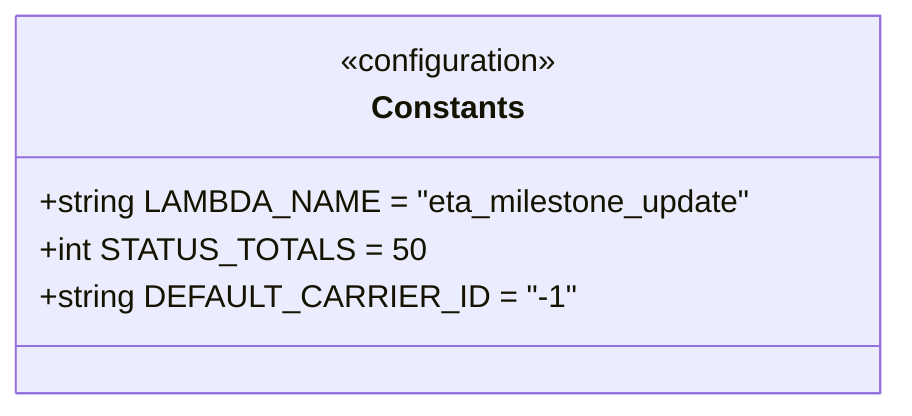

# Diagram: shipment_core/shipment_service/shipment_service/eta/eta_milestone_update/constants.py

> Auto-generated by Obscura crawlers

## Mermaid

### SVG

<svg id="container" width="450.2578125" xmlns="http://www.w3.org/2000/svg" class="classDiagram" height="208" viewBox="0 0 450.2578125 208" role="graphics-document document" aria-roledescription="class"><g><defs><marker id="container_class-aggregationStart" class="marker aggregation class" refX="18" refY="7" markerWidth="190" markerHeight="240" orient="auto"><path d="M 18,7 L9,13 L1,7 L9,1 Z"></path></marker></defs><defs><marker id="container_class-aggregationEnd" class="marker aggregation class" refX="1" refY="7" markerWidth="20" markerHeight="28" orient="auto"><path d="M 18,7 L9,13 L1,7 L9,1 Z"></path></marker></defs><defs><marker id="container_class-extensionStart" class="marker extension class" refX="18" refY="7" markerWidth="190" markerHeight="240" orient="auto"><path d="M 1,7 L18,13 V 1 Z"></path></marker></defs><defs><marker id="container_class-extensionEnd" class="marker extension class" refX="1" refY="7" markerWidth="20" markerHeight="28" orient="auto"><path d="M 1,1 V 13 L18,7 Z"></path></marker></defs><defs><marker id="container_class-compositionStart" class="marker composition class" refX="18" refY="7" markerWidth="190" markerHeight="240" orient="auto"><path d="M 18,7 L9,13 L1,7 L9,1 Z"></path></marker></defs><defs><marker id="container_class-compositionEnd" class="marker composition class" refX="1" refY="7" markerWidth="20" markerHeight="28" orient="auto"><path d="M 18,7 L9,13 L1,7 L9,1 Z"></path></marker></defs><defs><marker id="container_class-dependencyStart" class="marker dependency class" refX="6" refY="7" markerWidth="190" markerHeight="240" orient="auto"><path d="M 5,7 L9,13 L1,7 L9,1 Z"></path></marker></defs><defs><marker id="container_class-dependencyEnd" class="marker dependency class" refX="13" refY="7" markerWidth="20" markerHeight="28" orient="auto"><path d="M 18,7 L9,13 L14,7 L9,1 Z"></path></marker></defs><defs><marker id="container_class-lollipopStart" class="marker lollipop class" refX="13" refY="7" markerWidth="190" markerHeight="240" orient="auto"><circle stroke="black" fill="transparent" cx="7" cy="7" r="6"></circle></marker></defs><defs><marker id="container_class-lollipopEnd" class="marker lollipop class" refX="1" refY="7" markerWidth="190" markerHeight="240" orient="auto"><circle stroke="black" fill="transparent" cx="7" cy="7" r="6"></circle></marker></defs><g class="root"><g class="clusters"></g><g class="edgePaths"></g><g class="edgeLabels"></g><g class="nodes"><g class="node default" id="classId-Constants-0" transform="translate(225.12890625, 104)"><g class="basic label-container"><path d="M-217.12890625 -96 L217.12890625 -96 L217.12890625 96 L-217.12890625 96" stroke="none" stroke-width="0" fill="#ECECFF" style=""></path><path d="M-217.12890625 -96 C-127.49645493535023 -96, -37.86400362070046 -96, 217.12890625 -96 M-217.12890625 -96 C-87.29785883406427 -96, 42.53318858187146 -96, 217.12890625 -96 M217.12890625 -96 C217.12890625 -39.01236168547099, 217.12890625 17.975276629058015, 217.12890625 96 M217.12890625 -96 C217.12890625 -37.09262235718856, 217.12890625 21.81475528562288, 217.12890625 96 M217.12890625 96 C58.969060250597835 96, -99.19078574880433 96, -217.12890625 96 M217.12890625 96 C66.51159707322299 96, -84.10571210355403 96, -217.12890625 96 M-217.12890625 96 C-217.12890625 55.45945246973735, -217.12890625 14.9189049394747, -217.12890625 -96 M-217.12890625 96 C-217.12890625 47.453855674321396, -217.12890625 -1.092288651357208, -217.12890625 -96" stroke="#9370DB" stroke-width="1.3" fill="none" stroke-dasharray="0 0" style=""></path></g><g class="annotation-group text" transform="translate(-56.9921875, -72)"><g class="label" style="" transform="translate(0,-12)"><foreignObject width="113.984375" height="24">

«configuration»

</foreignObject></g></g><g class="label-group text" transform="translate(-36.5390625, -48)"><g class="label" style="font-weight: bolder" transform="translate(0,-12)"><foreignObject width="73.078125" height="24">

Constants

</foreignObject></g></g><g class="members-group text" transform="translate(-205.12890625, 0)"><g class="label" style="" transform="translate(0,-12)"><foreignObject width="353.265625" height="24">

+string LAMBDA_NAME = "eta_milestone_update"

</foreignObject></g><g class="label" style="" transform="translate(0,12)"><foreignObject width="175.359375" height="24">

+int STATUS_TOTALS = 50

</foreignObject></g><g class="label" style="" transform="translate(0,36)"><foreignObject width="246.46875" height="24">

+string DEFAULT_CARRIER_ID = "-1"

</foreignObject></g></g><g class="methods-group text" transform="translate(-205.12890625, 96)"></g><g class="divider" style=""><path d="M-217.12890625 -24 C-90.54014674028163 -24, 36.048612769436744 -24, 217.12890625 -24 M-217.12890625 -24 C-102.5074735975606 -24, 12.11395905487879 -24, 217.12890625 -24" stroke="#9370DB" stroke-width="1.3" fill="none" stroke-dasharray="0 0" style=""></path></g><g class="divider" style=""><path d="M-217.12890625 72 C-59.03440627432778 72, 99.06009370134444 72, 217.12890625 72 M-217.12890625 72 C-55.69640157326643 72, 105.73610310346714 72, 217.12890625 72" stroke="#9370DB" stroke-width="1.3" fill="none" stroke-dasharray="0 0" style=""></path></g></g></g></g></g></svg>
