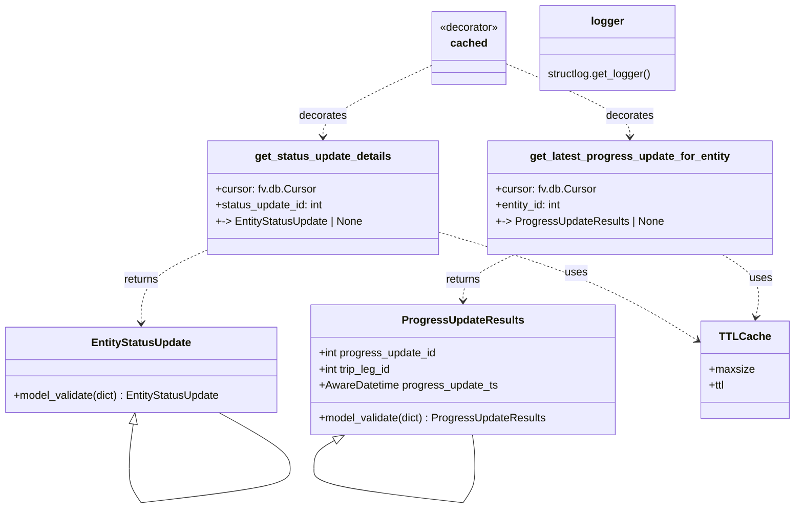

# Diagram: shipment_core/shipment_service/shipment_service/eta/eta_milestone_update/db_queries.py


> Auto-generated by Obscura crawlers

## Diagram 1



> SVG rendering failed for this diagram.

## Diagram 2

```mermaid
flowchart LR
    A[Call get_status_update_details(cursor, status_update_id)] --> B[Build SQL query with qualifiers]
    B --> C[cursor.mogrify(sql, query_parameters)]
    C --> D[cursor.execute(query)]
    D --> E[cursor.fetchone()]
    E -->|None| F[return None]
    E -->|row| G[result._asdict()]
    G --> H[EntityStatusUpdate.model_validate(result_dict)]
    H -->|success| I[return EntityStatusUpdate instance]
    H -->|ValidationError| J[trace.get_current_span() -> span.add_event(...)]
    J --> K[logger.info("Invalid status update data", result_dict)]
    K --> F[return None]
```

> SVG rendering failed for this diagram.
