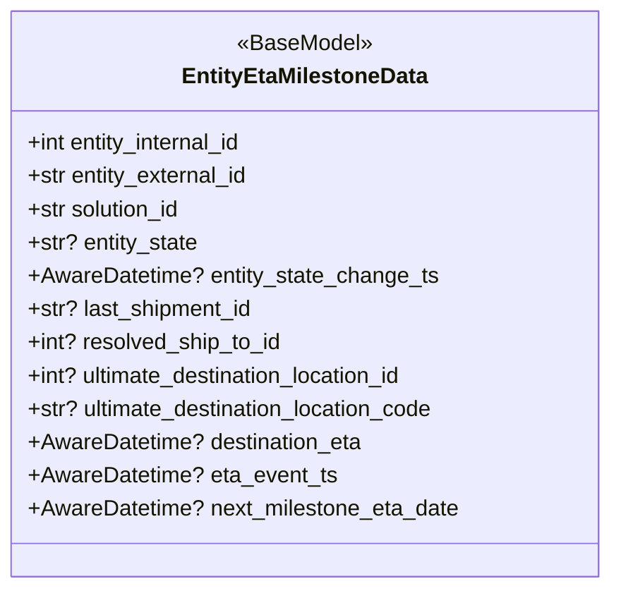

# Diagram: shipment_core/shipment_service/shipment_service/eta/eta_milestone_update/entity_eta_milestone.py


> Auto-generated by Obscura crawlers

## Diagram 1



### SVG

<svg id="container" width="436.6875" xmlns="http://www.w3.org/2000/svg" class="classDiagram" height="424" viewBox="0 0 436.6875 424" role="graphics-document document" aria-roledescription="class"><style>#container{font-family:"trebuchet ms",verdana,arial,sans-serif;font-size:16px;fill:#333;}@keyframes edge-animation-frame{from{stroke-dashoffset:0;}}@keyframes dash{to{stroke-dashoffset:0;}}#container .edge-animation-slow{stroke-dasharray:9,5!important;stroke-dashoffset:900;animation:dash 50s linear infinite;stroke-linecap:round;}#container .edge-animation-fast{stroke-dasharray:9,5!important;stroke-dashoffset:900;animation:dash 20s linear infinite;stroke-linecap:round;}#container .error-icon{fill:#552222;}#container .error-text{fill:#552222;stroke:#552222;}#container .edge-thickness-normal{stroke-width:1px;}#container .edge-thickness-thick{stroke-width:3.5px;}#container .edge-pattern-solid{stroke-dasharray:0;}#container .edge-thickness-invisible{stroke-width:0;fill:none;}#container .edge-pattern-dashed{stroke-dasharray:3;}#container .edge-pattern-dotted{stroke-dasharray:2;}#container .marker{fill:#333333;stroke:#333333;}#container .marker.cross{stroke:#333333;}#container svg{font-family:"trebuchet ms",verdana,arial,sans-serif;font-size:16px;}#container p{margin:0;}#container g.classGroup text{fill:#9370DB;stroke:none;font-family:"trebuchet ms",verdana,arial,sans-serif;font-size:10px;}#container g.classGroup text .title{font-weight:bolder;}#container .nodeLabel,#container .edgeLabel{color:#131300;}#container .edgeLabel .label rect{fill:#ECECFF;}#container .label text{fill:#131300;}#container .labelBkg{background:#ECECFF;}#container .edgeLabel .label span{background:#ECECFF;}#container .classTitle{font-weight:bolder;}#container .node rect,#container .node circle,#container .node ellipse,#container .node polygon,#container .node path{fill:#ECECFF;stroke:#9370DB;stroke-width:1px;}#container .divider{stroke:#9370DB;stroke-width:1;}#container g.clickable{cursor:pointer;}#container g.classGroup rect{fill:#ECECFF;stroke:#9370DB;}#container g.classGroup line{stroke:#9370DB;stroke-width:1;}#container .classLabel .box{stroke:none;stroke-width:0;fill:#ECECFF;opacity:0.5;}#container .classLabel .label{fill:#9370DB;font-size:10px;}#container .relation{stroke:#333333;stroke-width:1;fill:none;}#container .dashed-line{stroke-dasharray:3;}#container .dotted-line{stroke-dasharray:1 2;}#container #compositionStart,#container .composition{fill:#333333!important;stroke:#333333!important;stroke-width:1;}#container #compositionEnd,#container .composition{fill:#333333!important;stroke:#333333!important;stroke-width:1;}#container #dependencyStart,#container .dependency{fill:#333333!important;stroke:#333333!important;stroke-width:1;}#container #dependencyStart,#container .dependency{fill:#333333!important;stroke:#333333!important;stroke-width:1;}#container #extensionStart,#container .extension{fill:transparent!important;stroke:#333333!important;stroke-width:1;}#container #extensionEnd,#container .extension{fill:transparent!important;stroke:#333333!important;stroke-width:1;}#container #aggregationStart,#container .aggregation{fill:transparent!important;stroke:#333333!important;stroke-width:1;}#container #aggregationEnd,#container .aggregation{fill:transparent!important;stroke:#333333!important;stroke-width:1;}#container #lollipopStart,#container .lollipop{fill:#ECECFF!important;stroke:#333333!important;stroke-width:1;}#container #lollipopEnd,#container .lollipop{fill:#ECECFF!important;stroke:#333333!important;stroke-width:1;}#container .edgeTerminals{font-size:11px;line-height:initial;}#container .classTitleText{text-anchor:middle;font-size:18px;fill:#333;}#container .label-icon{display:inline-block;height:1em;overflow:visible;vertical-align:-0.125em;}#container .node .label-icon path{fill:currentColor;stroke:revert;stroke-width:revert;}#container :root{--mermaid-font-family:"trebuchet ms",verdana,arial,sans-serif;}</style><g><defs><marker id="container_class-aggregationStart" class="marker aggregation class" refX="18" refY="7" markerWidth="190" markerHeight="240" orient="auto"><path d="M 18,7 L9,13 L1,7 L9,1 Z"></path></marker></defs><defs><marker id="container_class-aggregationEnd" class="marker aggregation class" refX="1" refY="7" markerWidth="20" markerHeight="28" orient="auto"><path d="M 18,7 L9,13 L1,7 L9,1 Z"></path></marker></defs><defs><marker id="container_class-extensionStart" class="marker extension class" refX="18" refY="7" markerWidth="190" markerHeight="240" orient="auto"><path d="M 1,7 L18,13 V 1 Z"></path></marker></defs><defs><marker id="container_class-extensionEnd" class="marker extension class" refX="1" refY="7" markerWidth="20" markerHeight="28" orient="auto"><path d="M 1,1 V 13 L18,7 Z"></path></marker></defs><defs><marker id="container_class-compositionStart" class="marker composition class" refX="18" refY="7" markerWidth="190" markerHeight="240" orient="auto"><path d="M 18,7 L9,13 L1,7 L9,1 Z"></path></marker></defs><defs><marker id="container_class-compositionEnd" class="marker composition class" refX="1" refY="7" markerWidth="20" markerHeight="28" orient="auto"><path d="M 18,7 L9,13 L1,7 L9,1 Z"></path></marker></defs><defs><marker id="container_class-dependencyStart" class="marker dependency class" refX="6" refY="7" markerWidth="190" markerHeight="240" orient="auto"><path d="M 5,7 L9,13 L1,7 L9,1 Z"></path></marker></defs><defs><marker id="container_class-dependencyEnd" class="marker dependency class" refX="13" refY="7" markerWidth="20" markerHeight="28" orient="auto"><path d="M 18,7 L9,13 L14,7 L9,1 Z"></path></marker></defs><defs><marker id="container_class-lollipopStart" class="marker lollipop class" refX="13" refY="7" markerWidth="190" markerHeight="240" orient="auto"><circle stroke="black" fill="transparent" cx="7" cy="7" r="6"></circle></marker></defs><defs><marker id="container_class-lollipopEnd" class="marker lollipop class" refX="1" refY="7" markerWidth="190" markerHeight="240" orient="auto"><circle stroke="black" fill="transparent" cx="7" cy="7" r="6"></circle></marker></defs><g class="root"><g class="clusters"></g><g class="edgePaths"></g><g class="edgeLabels"></g><g class="nodes"><g class="node default" id="classId-EntityEtaMilestoneData-0" transform="translate(218.34375, 212)"><g class="basic label-container"><path d="M-210.34375 -204 L210.34375 -204 L210.34375 204 L-210.34375 204" stroke="none" stroke-width="0" fill="#ECECFF" style=""></path><path d="M-210.34375 -204 C-47.67654083792516 -204, 114.99066832414968 -204, 210.34375 -204 M-210.34375 -204 C-124.33442204039909 -204, -38.32509408079818 -204, 210.34375 -204 M210.34375 -204 C210.34375 -69.69869578874687, 210.34375 64.60260842250625, 210.34375 204 M210.34375 -204 C210.34375 -86.91570474878543, 210.34375 30.16859050242914, 210.34375 204 M210.34375 204 C96.47365978342151 204, -17.39643043315698 204, -210.34375 204 M210.34375 204 C74.87979877113696 204, -60.58415245772608 204, -210.34375 204 M-210.34375 204 C-210.34375 70.47081436771262, -210.34375 -63.05837126457476, -210.34375 -204 M-210.34375 204 C-210.34375 96.75007310929449, -210.34375 -10.49985378141102, -210.34375 -204" stroke="#9370DB" stroke-width="1.3" fill="none" stroke-dasharray="0 0" style=""></path></g><g class="annotation-group text" transform="translate(-48.75, -180)"><g class="label" style="" transform="translate(0,-12)"><foreignObject width="97.5" height="24"><div xmlns="http://www.w3.org/1999/xhtml" style="display: table-cell; white-space: nowrap; line-height: 1.5; max-width: 148px; text-align: center;"><span class="nodeLabel markdown-node-label" style=""><p>«BaseModel»</p></span></div></foreignObject></g></g><g class="label-group text" transform="translate(-85.421875, -156)"><g class="label" style="font-weight: bolder" transform="translate(0,-12)"><foreignObject width="170.84375" height="24"><div xmlns="http://www.w3.org/1999/xhtml" style="display: table-cell; white-space: nowrap; line-height: 1.5; max-width: 218px; text-align: center;"><span class="nodeLabel markdown-node-label" style=""><p>EntityEtaMilestoneData</p></span></div></foreignObject></g></g><g class="members-group text" transform="translate(-198.34375, -108)"><g class="label" style="" transform="translate(0,-12)"><foreignObject width="161.015625" height="24"><div xmlns="http://www.w3.org/1999/xhtml" style="display: table-cell; white-space: nowrap; line-height: 1.5; max-width: 218px; text-align: center;"><span class="nodeLabel markdown-node-label" style=""><p>+int entity_internal_id</p></span></div></foreignObject></g><g class="label" style="" transform="translate(0,12)"><foreignObject width="162.90625" height="24"><div xmlns="http://www.w3.org/1999/xhtml" style="display: table-cell; white-space: nowrap; line-height: 1.5; max-width: 220px; text-align: center;"><span class="nodeLabel markdown-node-label" style=""><p>+str entity_external_id</p></span></div></foreignObject></g><g class="label" style="" transform="translate(0,36)"><foreignObject width="113.875" height="24"><div xmlns="http://www.w3.org/1999/xhtml" style="display: table-cell; white-space: nowrap; line-height: 1.5; max-width: 171px; text-align: center;"><span class="nodeLabel markdown-node-label" style=""><p>+str solution_id</p></span></div></foreignObject></g><g class="label" style="" transform="translate(0,60)"><foreignObject width="124.40625" height="24"><div xmlns="http://www.w3.org/1999/xhtml" style="display: table-cell; white-space: nowrap; line-height: 1.5; max-width: 182px; text-align: center;"><span class="nodeLabel markdown-node-label" style=""><p>+str? entity_state</p></span></div></foreignObject></g><g class="label" style="" transform="translate(0,84)"><foreignObject width="294.546875" height="24"><div xmlns="http://www.w3.org/1999/xhtml" style="display: table-cell; white-space: nowrap; line-height: 1.5; max-width: 352px; text-align: center;"><span class="nodeLabel markdown-node-label" style=""><p>+AwareDatetime? entity_state_change_ts</p></span></div></foreignObject></g><g class="label" style="" transform="translate(0,108)"><foreignObject width="164.09375" height="24"><div xmlns="http://www.w3.org/1999/xhtml" style="display: table-cell; white-space: nowrap; line-height: 1.5; max-width: 221px; text-align: center;"><span class="nodeLabel markdown-node-label" style=""><p>+str? last_shipment_id</p></span></div></foreignObject></g><g class="label" style="" transform="translate(0,132)"><foreignObject width="184.4375" height="24"><div xmlns="http://www.w3.org/1999/xhtml" style="display: table-cell; white-space: nowrap; line-height: 1.5; max-width: 242px; text-align: center;"><span class="nodeLabel markdown-node-label" style=""><p>+int? resolved_ship_to_id</p></span></div></foreignObject></g><g class="label" style="" transform="translate(0,156)"><foreignObject width="280.25" height="24"><div xmlns="http://www.w3.org/1999/xhtml" style="display: table-cell; white-space: nowrap; line-height: 1.5; max-width: 338px; text-align: center;"><span class="nodeLabel markdown-node-label" style=""><p>+int? ultimate_destination_location_id</p></span></div></foreignObject></g><g class="label" style="" transform="translate(0,180)"><foreignObject width="300.5625" height="24"><div xmlns="http://www.w3.org/1999/xhtml" style="display: table-cell; white-space: nowrap; line-height: 1.5; max-width: 358px; text-align: center;"><span class="nodeLabel markdown-node-label" style=""><p>+str? ultimate_destination_location_code</p></span></div></foreignObject></g><g class="label" style="" transform="translate(0,204)"><foreignObject width="242.390625" height="24"><div xmlns="http://www.w3.org/1999/xhtml" style="display: table-cell; white-space: nowrap; line-height: 1.5; max-width: 300px; text-align: center;"><span class="nodeLabel markdown-node-label" style=""><p>+AwareDatetime? destination_eta</p></span></div></foreignObject></g><g class="label" style="" transform="translate(0,228)"><foreignObject width="220.84375" height="24"><div xmlns="http://www.w3.org/1999/xhtml" style="display: table-cell; white-space: nowrap; line-height: 1.5; max-width: 278px; text-align: center;"><span class="nodeLabel markdown-node-label" style=""><p>+AwareDatetime? eta_event_ts</p></span></div></foreignObject></g><g class="label" style="" transform="translate(0,252)"><foreignObject width="311.265625" height="24"><div xmlns="http://www.w3.org/1999/xhtml" style="display: table-cell; white-space: nowrap; line-height: 1.5; max-width: 369px; text-align: center;"><span class="nodeLabel markdown-node-label" style=""><p>+AwareDatetime? next_milestone_eta_date</p></span></div></foreignObject></g></g><g class="methods-group text" transform="translate(-198.34375, 204)"></g><g class="divider" style=""><path d="M-210.34375 -132 C-91.96748166248103 -132, 26.40878667503793 -132, 210.34375 -132 M-210.34375 -132 C-118.65478047061389 -132, -26.965810941227772 -132, 210.34375 -132" stroke="#9370DB" stroke-width="1.3" fill="none" stroke-dasharray="0 0" style=""></path></g><g class="divider" style=""><path d="M-210.34375 180 C-61.39611209392581 180, 87.55152581214838 180, 210.34375 180 M-210.34375 180 C-48.03627190352873 180, 114.27120619294254 180, 210.34375 180" stroke="#9370DB" stroke-width="1.3" fill="none" stroke-dasharray="0 0" style=""></path></g></g></g></g></g></svg>

## Diagram 2

```mermaid
flowchart TD
    Start([Start]) --> CheckType{isinstance(entity_id, str)?}
    CheckType -- yes --> UseExternalId[Set id_field = "e.external_id"]
    CheckType -- no --> UseInternalId[Set id_field = "e.id"]
    UseExternalId --> CheckSkip
    UseInternalId --> CheckSkip
    CheckSkip{skip_status_update_check?} --> SkipTrue[sql_status_update = "true"]
    CheckSkip --> SkipFalse[sql_status_update = "(select exists(...))"]
    SkipTrue --> BuildSQL[Build SQL query string]
    SkipFalse --> BuildSQL
    BuildSQL --> Mogrify[mogrify(sql, params)]
    Mogrify --> LogDebug[logger.debug(query.decode())]
    LogDebug --> Execute[cursor_entity.execute(query)]
    Execute --> Fetch[cursor_entity.fetchone()]
    Fetch --> IsNone{entity_db_result is None?}
    IsNone -- yes --> ReturnNone([return None])
    IsNone -- no --> CreateModel[EntityEtaMilestoneData(**entity_db_result._asdict())]
    CreateModel --> ReturnModel([return EntityEtaMilestoneData])
    ReturnNone --> End([End])
    ReturnModel --> End
```

> SVG rendering failed for this diagram.
