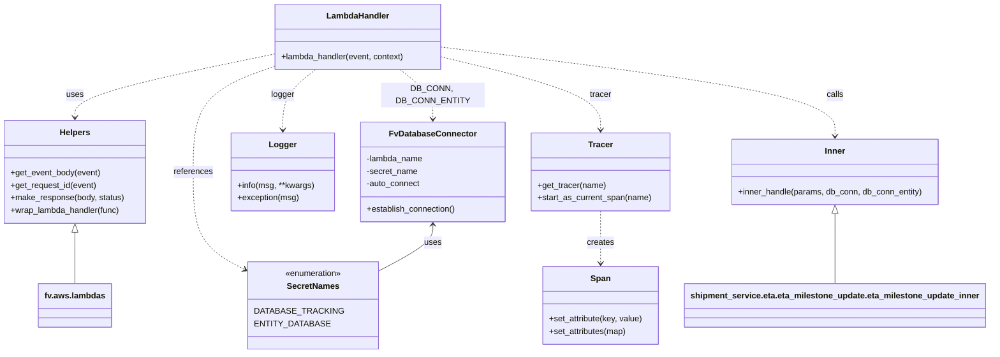
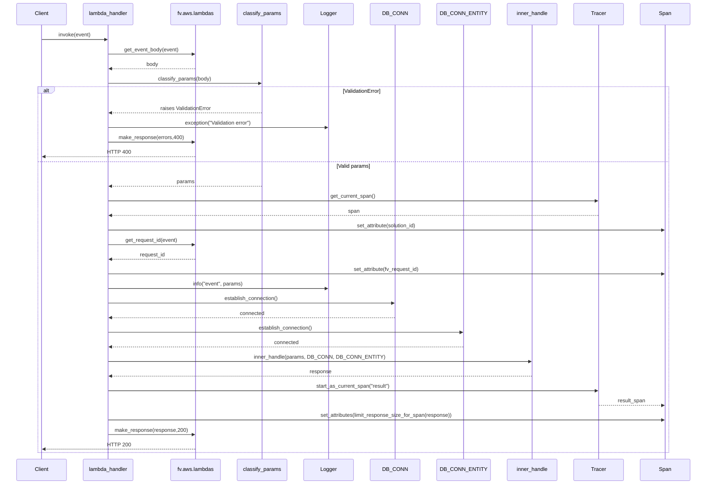

# Diagram: shipment_core/shipment_service/shipment_service/eta/eta_milestone_update/eta_milestone_update.py


> Auto-generated by Obscura crawlers

## Diagram 1

```mermaid
flowchart TD
  Start([Lambda invoked])
  A[get_event_body(event)]
  B[classify_params(body)]
  C{ValidationError?}
  D[logger.exception("Validation error")]
  E[make_response({"errors": e.errors()}, 400)]
  F[trace.get_current_span()]
  G[set_attribute("solution_id", params.solution_id)]
  H[set_attribute("fv_request_id", get_request_id(event))]
  I[logger.info("event", params=params.model_dump())]
  J[DB_CONN.establish_connection()]
  K[DB_CONN_ENTITY.establish_connection()]
  L[inner_handle(params, DB_CONN, DB_CONN_ENTITY)]
  M[start_as_current_span("result")]
  N[set_attributes(limit_response_size_for_span(response))]
  O[make_response(response, 200)]
  P[Decorators: fv.datadog.wrap_lambda_handler, rollbar.lambda_function]

  Start --> P
  P --> A
  A --> B
  B --> C
  C -- yes --> D --> E
  C -- no --> F
  F --> G --> H --> I
  I --> J --> K --> L
  L --> M
  M --> N --> O
  O --> End([Return])
```

> SVG rendering failed for this diagram.

## Diagram 2



### SVG

<svg id="container" width="1876.98828125" xmlns="http://www.w3.org/2000/svg" class="classDiagram" height="680" viewBox="0 0 1876.98828125 680" role="graphics-document document" aria-roledescription="class"><style>#container{font-family:"trebuchet ms",verdana,arial,sans-serif;font-size:16px;fill:#333;}@keyframes edge-animation-frame{from{stroke-dashoffset:0;}}@keyframes dash{to{stroke-dashoffset:0;}}#container .edge-animation-slow{stroke-dasharray:9,5!important;stroke-dashoffset:900;animation:dash 50s linear infinite;stroke-linecap:round;}#container .edge-animation-fast{stroke-dasharray:9,5!important;stroke-dashoffset:900;animation:dash 20s linear infinite;stroke-linecap:round;}#container .error-icon{fill:#552222;}#container .error-text{fill:#552222;stroke:#552222;}#container .edge-thickness-normal{stroke-width:1px;}#container .edge-thickness-thick{stroke-width:3.5px;}#container .edge-pattern-solid{stroke-dasharray:0;}#container .edge-thickness-invisible{stroke-width:0;fill:none;}#container .edge-pattern-dashed{stroke-dasharray:3;}#container .edge-pattern-dotted{stroke-dasharray:2;}#container .marker{fill:#333333;stroke:#333333;}#container .marker.cross{stroke:#333333;}#container svg{font-family:"trebuchet ms",verdana,arial,sans-serif;font-size:16px;}#container p{margin:0;}#container g.classGroup text{fill:#9370DB;stroke:none;font-family:"trebuchet ms",verdana,arial,sans-serif;font-size:10px;}#container g.classGroup text .title{font-weight:bolder;}#container .nodeLabel,#container .edgeLabel{color:#131300;}#container .edgeLabel .label rect{fill:#ECECFF;}#container .label text{fill:#131300;}#container .labelBkg{background:#ECECFF;}#container .edgeLabel .label span{background:#ECECFF;}#container .classTitle{font-weight:bolder;}#container .node rect,#container .node circle,#container .node ellipse,#container .node polygon,#container .node path{fill:#ECECFF;stroke:#9370DB;stroke-width:1px;}#container .divider{stroke:#9370DB;stroke-width:1;}#container g.clickable{cursor:pointer;}#container g.classGroup rect{fill:#ECECFF;stroke:#9370DB;}#container g.classGroup line{stroke:#9370DB;stroke-width:1;}#container .classLabel .box{stroke:none;stroke-width:0;fill:#ECECFF;opacity:0.5;}#container .classLabel .label{fill:#9370DB;font-size:10px;}#container .relation{stroke:#333333;stroke-width:1;fill:none;}#container .dashed-line{stroke-dasharray:3;}#container .dotted-line{stroke-dasharray:1 2;}#container #compositionStart,#container .composition{fill:#333333!important;stroke:#333333!important;stroke-width:1;}#container #compositionEnd,#container .composition{fill:#333333!important;stroke:#333333!important;stroke-width:1;}#container #dependencyStart,#container .dependency{fill:#333333!important;stroke:#333333!important;stroke-width:1;}#container #dependencyStart,#container .dependency{fill:#333333!important;stroke:#333333!important;stroke-width:1;}#container #extensionStart,#container .extension{fill:transparent!important;stroke:#333333!important;stroke-width:1;}#container #extensionEnd,#container .extension{fill:transparent!important;stroke:#333333!important;stroke-width:1;}#container #aggregationStart,#container .aggregation{fill:transparent!important;stroke:#333333!important;stroke-width:1;}#container #aggregationEnd,#container .aggregation{fill:transparent!important;stroke:#333333!important;stroke-width:1;}#container #lollipopStart,#container .lollipop{fill:#ECECFF!important;stroke:#333333!important;stroke-width:1;}#container #lollipopEnd,#container .lollipop{fill:#ECECFF!important;stroke:#333333!important;stroke-width:1;}#container .edgeTerminals{font-size:11px;line-height:initial;}#container .classTitleText{text-anchor:middle;font-size:18px;fill:#333;}#container .label-icon{display:inline-block;height:1em;overflow:visible;vertical-align:-0.125em;}#container .node .label-icon path{fill:currentColor;stroke:revert;stroke-width:revert;}#container :root{--mermaid-font-family:"trebuchet ms",verdana,arial,sans-serif;}</style><g><defs><marker id="container_class-aggregationStart" class="marker aggregation class" refX="18" refY="7" markerWidth="190" markerHeight="240" orient="auto"><path d="M 18,7 L9,13 L1,7 L9,1 Z"></path></marker></defs><defs><marker id="container_class-aggregationEnd" class="marker aggregation class" refX="1" refY="7" markerWidth="20" markerHeight="28" orient="auto"><path d="M 18,7 L9,13 L1,7 L9,1 Z"></path></marker></defs><defs><marker id="container_class-extensionStart" class="marker extension class" refX="18" refY="7" markerWidth="190" markerHeight="240" orient="auto"><path d="M 1,7 L18,13 V 1 Z"></path></marker></defs><defs><marker id="container_class-extensionEnd" class="marker extension class" refX="1" refY="7" markerWidth="20" markerHeight="28" orient="auto"><path d="M 1,1 V 13 L18,7 Z"></path></marker></defs><defs><marker id="container_class-compositionStart" class="marker composition class" refX="18" refY="7" markerWidth="190" markerHeight="240" orient="auto"><path d="M 18,7 L9,13 L1,7 L9,1 Z"></path></marker></defs><defs><marker id="container_class-compositionEnd" class="marker composition class" refX="1" refY="7" markerWidth="20" markerHeight="28" orient="auto"><path d="M 18,7 L9,13 L1,7 L9,1 Z"></path></marker></defs><defs><marker id="container_class-dependencyStart" class="marker dependency class" refX="6" refY="7" markerWidth="190" markerHeight="240" orient="auto"><path d="M 5,7 L9,13 L1,7 L9,1 Z"></path></marker></defs><defs><marker id="container_class-dependencyEnd" class="marker dependency class" refX="13" refY="7" markerWidth="20" markerHeight="28" orient="auto"><path d="M 18,7 L9,13 L14,7 L9,1 Z"></path></marker></defs><defs><marker id="container_class-lollipopStart" class="marker lollipop class" refX="13" refY="7" markerWidth="190" markerHeight="240" orient="auto"><circle stroke="black" fill="transparent" cx="7" cy="7" r="6"></circle></marker></defs><defs><marker id="container_class-lollipopEnd" class="marker lollipop class" refX="1" refY="7" markerWidth="190" markerHeight="240" orient="auto"><circle stroke="black" fill="transparent" cx="7" cy="7" r="6"></circle></marker></defs><g class="root"><g class="clusters"></g><g class="edgePaths"><path d="M518.521,104.71L456.123,117.758C393.724,130.806,268.926,156.903,206.528,177.118C144.129,197.333,144.129,211.667,144.129,218.833L144.129,226" id="id_LambdaHandler_Helpers_1" class="edge-thickness-normal edge-pattern-dashed relation" style=";;;" data-edge="true" data-et="edge" data-id="id_LambdaHandler_Helpers_1" data-points="W3sieCI6NTE4LjUyMTQ4NDM3NSwieSI6MTA0LjcwOTY2MTc3NDA5MDYyfSx7IngiOjE0NC4xMjg5MDYyNSwieSI6MTgzfSx7IngiOjE0NC4xMjg5MDYyNSwieSI6MjMyfV0=" marker-end="url(#container_class-dependencyEnd)"></path><path d="M760.401,134L770.859,142.167C781.316,150.333,802.232,166.667,812.69,182.5C823.148,198.333,823.148,213.667,823.148,221.333L823.148,229" id="id_LambdaHandler_FvDatabaseConnector_2" class="edge-thickness-normal edge-pattern-dashed relation" style=";;;" data-edge="true" data-et="edge" data-id="id_LambdaHandler_FvDatabaseConnector_2" data-points="W3sieCI6NzYwLjQwMDUxMjY5NTMxMjUsInkiOjEzNH0seyJ4Ijo4MjMuMTQ4NDM3NSwieSI6MTgzfSx7IngiOjgyMy4xNDg0Mzc1LCJ5IjoyMzV9XQ==" marker-end="url(#container_class-dependencyEnd)"></path><path d="M518.521,128.35L492.92,137.459C467.318,146.567,416.114,164.783,390.512,198.558C364.91,232.333,364.91,281.667,364.91,329C364.91,376.333,364.91,421.667,383.095,453.937C401.279,486.207,437.648,505.413,455.832,515.017L474.017,524.62" id="id_LambdaHandler_SecretNames_3" class="edge-thickness-normal edge-pattern-dashed relation" style=";;;" data-edge="true" data-et="edge" data-id="id_LambdaHandler_SecretNames_3" data-points="W3sieCI6NTE4LjUyMTQ4NDM3NSwieSI6MTI4LjM1MDQ0ODI0MjcwMjV9LHsieCI6MzY0LjkxMDE1NjI1LCJ5IjoxODN9LHsieCI6MzY0LjkxMDE1NjI1LCJ5IjozMzF9LHsieCI6MzY0LjkxMDE1NjI1LCJ5Ijo0Njd9LHsieCI6NDc5LjMyMjI2NTYyNSwieSI6NTI3LjQyMjEyNDQ3NDY3OH1d" marker-end="url(#container_class-dependencyEnd)"></path><path d="M840.928,109.817L891.58,122.015C942.233,134.212,1043.538,158.606,1094.191,181.97C1144.844,205.333,1144.844,227.667,1144.844,238.833L1144.844,250" id="id_LambdaHandler_Tracer_4" class="edge-thickness-normal edge-pattern-dashed relation" style=";;;" data-edge="true" data-et="edge" data-id="id_LambdaHandler_Tracer_4" data-points="W3sieCI6ODQwLjkyNzczNDM3NSwieSI6MTA5LjgxNzQ3MzY4MTU1ODR9LHsieCI6MTE0NC44NDM3NSwieSI6MTgzfSx7IngiOjExNDQuODQzNzUsInkiOjI1Nn1d" marker-end="url(#container_class-dependencyEnd)"></path><path d="M599.049,134L588.591,142.167C578.133,150.333,557.217,166.667,546.759,186C536.301,205.333,536.301,227.667,536.301,238.833L536.301,250" id="id_LambdaHandler_Logger_5" class="edge-thickness-normal edge-pattern-dashed relation" style=";;;" data-edge="true" data-et="edge" data-id="id_LambdaHandler_Logger_5" data-points="W3sieCI6NTk5LjA0ODcwNjA1NDY4NzUsInkiOjEzNH0seyJ4Ijo1MzYuMzAwNzgxMjUsInkiOjE4M30seyJ4Ijo1MzYuMzAwNzgxMjUsInkiOjI1Nn1d" marker-end="url(#container_class-dependencyEnd)"></path><path d="M840.928,90.872L965.489,106.226C1090.049,121.581,1339.171,152.291,1463.732,180.812C1588.293,209.333,1588.293,235.667,1588.293,248.833L1588.293,262" id="id_LambdaHandler_Inner_6" class="edge-thickness-normal edge-pattern-dashed relation" style=";;;" data-edge="true" data-et="edge" data-id="id_LambdaHandler_Inner_6" data-points="W3sieCI6ODQwLjkyNzczNDM3NSwieSI6OTAuODcxNjQ3MzE2MDI1Nn0seyJ4IjoxNTg4LjI5Mjk2ODc1LCJ5IjoxODN9LHsieCI6MTU4OC4yOTI5Njg3NSwieSI6MjY4fV0=" marker-end="url(#container_class-dependencyEnd)"></path><path d="M1144.844,406L1144.844,416.167C1144.844,426.333,1144.844,446.667,1144.844,463.5C1144.844,480.333,1144.844,493.667,1144.844,500.333L1144.844,507" id="id_Tracer_Span_7" class="edge-thickness-normal edge-pattern-dashed relation" style=";;;" data-edge="true" data-et="edge" data-id="id_Tracer_Span_7" data-points="W3sieCI6MTE0NC44NDM3NSwieSI6NDA2fSx7IngiOjExNDQuODQzNzUsInkiOjQ2N30seyJ4IjoxMTQ0Ljg0Mzc1LCJ5Ijo1MTN9XQ==" marker-end="url(#container_class-dependencyEnd)"></path><path d="M823.148,433L823.148,438.667C823.148,444.333,823.148,455.667,804.08,471.404C785.011,487.141,746.874,507.281,727.805,517.352L708.736,527.422" id="id_FvDatabaseConnector_SecretNames_8" class="edge-thickness-normal edge-pattern-solid relation" style=";;;" data-edge="true" data-et="edge" data-id="id_FvDatabaseConnector_SecretNames_8" data-points="W3sieCI6ODIzLjE0ODQzNzUsInkiOjQyN30seyJ4Ijo4MjMuMTQ4NDM3NSwieSI6NDY3fSx7IngiOjcwOC43MzYzMjgxMjUsInkiOjUyNy40MjIxMjQ0NzQ2Nzh9XQ==" marker-start="url(#container_class-dependencyStart)"></path><path d="M144.129,447.25L144.129,450.542C144.129,453.833,144.129,460.417,144.129,476.875C144.129,493.333,144.129,519.667,144.129,532.833L144.129,546" id="id_Helpers_fv.aws.lambdas_9" class="edge-thickness-normal edge-pattern-solid relation" style=";;;" data-edge="true" data-et="edge" data-id="id_Helpers_fv.aws.lambdas_9" data-points="W3sieCI6MTQ0LjEyODkwNjI1LCJ5Ijo0MzB9LHsieCI6MTQ0LjEyODkwNjI1LCJ5Ijo0Njd9LHsieCI6MTQ0LjEyODkwNjI1LCJ5Ijo1NDZ9XQ==" marker-start="url(#container_class-extensionStart)"></path><path d="M1588.293,411.25L1588.293,420.542C1588.293,429.833,1588.293,448.417,1588.293,470.875C1588.293,493.333,1588.293,519.667,1588.293,532.833L1588.293,546" id="id_Inner_shipment_service.eta.eta_milestone_update.eta_milestone_update_inner_10" class="edge-thickness-normal edge-pattern-solid relation" style=";;;" data-edge="true" data-et="edge" data-id="id_Inner_shipment_service.eta.eta_milestone_update.eta_milestone_update_inner_10" data-points="W3sieCI6MTU4OC4yOTI5Njg3NSwieSI6Mzk0fSx7IngiOjE1ODguMjkyOTY4NzUsInkiOjQ2N30seyJ4IjoxNTg4LjI5Mjk2ODc1LCJ5Ijo1NDZ9XQ==" marker-start="url(#container_class-extensionStart)"></path></g><g class="edgeLabels"><g class="edgeLabel" transform="translate(144.12890625, 183)"><g class="label" data-id="id_LambdaHandler_Helpers_1" transform="translate(-16.4921875, -12)"><foreignObject width="32.984375" height="24"><div xmlns="http://www.w3.org/1999/xhtml" class="labelBkg" style="display: table-cell; white-space: nowrap; line-height: 1.5; max-width: 200px; text-align: center;"><span class="edgeLabel"><p>uses</p></span></div></foreignObject></g></g><g class="edgeLabel" transform="translate(823.1484375, 183)"><g class="label" data-id="id_LambdaHandler_FvDatabaseConnector_2" transform="translate(-100, -24)"><foreignObject width="200" height="48"><div xmlns="http://www.w3.org/1999/xhtml" class="labelBkg" style="display: table; white-space: break-spaces; line-height: 1.5; max-width: 200px; text-align: center; width: 200px;"><span class="edgeLabel"><p>DB_CONN, DB_CONN_ENTITY</p></span></div></foreignObject></g></g><g class="edgeLabel" transform="translate(364.91015625, 331)"><g class="label" data-id="id_LambdaHandler_SecretNames_3" transform="translate(-37.828125, -12)"><foreignObject width="75.65625" height="24"><div xmlns="http://www.w3.org/1999/xhtml" class="labelBkg" style="display: table-cell; white-space: nowrap; line-height: 1.5; max-width: 200px; text-align: center;"><span class="edgeLabel"><p>references</p></span></div></foreignObject></g></g><g class="edgeLabel" transform="translate(1144.84375, 183)"><g class="label" data-id="id_LambdaHandler_Tracer_4" transform="translate(-21.1640625, -12)"><foreignObject width="42.328125" height="24"><div xmlns="http://www.w3.org/1999/xhtml" class="labelBkg" style="display: table-cell; white-space: nowrap; line-height: 1.5; max-width: 200px; text-align: center;"><span class="edgeLabel"><p>tracer</p></span></div></foreignObject></g></g><g class="edgeLabel" transform="translate(536.30078125, 183)"><g class="label" data-id="id_LambdaHandler_Logger_5" transform="translate(-22.6171875, -12)"><foreignObject width="45.234375" height="24"><div xmlns="http://www.w3.org/1999/xhtml" class="labelBkg" style="display: table-cell; white-space: nowrap; line-height: 1.5; max-width: 200px; text-align: center;"><span class="edgeLabel"><p>logger</p></span></div></foreignObject></g></g><g class="edgeLabel" transform="translate(1588.29296875, 183)"><g class="label" data-id="id_LambdaHandler_Inner_6" transform="translate(-16.4453125, -12)"><foreignObject width="32.890625" height="24"><div xmlns="http://www.w3.org/1999/xhtml" class="labelBkg" style="display: table-cell; white-space: nowrap; line-height: 1.5; max-width: 200px; text-align: center;"><span class="edgeLabel"><p>calls</p></span></div></foreignObject></g></g><g class="edgeLabel" transform="translate(1144.84375, 467)"><g class="label" data-id="id_Tracer_Span_7" transform="translate(-26.171875, -12)"><foreignObject width="52.34375" height="24"><div xmlns="http://www.w3.org/1999/xhtml" class="labelBkg" style="display: table-cell; white-space: nowrap; line-height: 1.5; max-width: 200px; text-align: center;"><span class="edgeLabel"><p>creates</p></span></div></foreignObject></g></g><g class="edgeLabel" transform="translate(823.1484375, 467)"><g class="label" data-id="id_FvDatabaseConnector_SecretNames_8" transform="translate(-16.4921875, -12)"><foreignObject width="32.984375" height="24"><div xmlns="http://www.w3.org/1999/xhtml" class="labelBkg" style="display: table-cell; white-space: nowrap; line-height: 1.5; max-width: 200px; text-align: center;"><span class="edgeLabel"><p>uses</p></span></div></foreignObject></g></g><g class="edgeLabel"><g class="label" data-id="id_Helpers_fv.aws.lambdas_9" transform="translate(0, 0)"><foreignObject width="0" height="0"><div xmlns="http://www.w3.org/1999/xhtml" class="labelBkg" style="display: table-cell; white-space: nowrap; line-height: 1.5; max-width: 200px; text-align: center;"><span class="edgeLabel"></span></div></foreignObject></g></g><g class="edgeLabel"><g class="label" data-id="id_Inner_shipment_service.eta.eta_milestone_update.eta_milestone_update_inner_10" transform="translate(0, 0)"><foreignObject width="0" height="0"><div xmlns="http://www.w3.org/1999/xhtml" class="labelBkg" style="display: table-cell; white-space: nowrap; line-height: 1.5; max-width: 200px; text-align: center;"><span class="edgeLabel"></span></div></foreignObject></g></g></g><g class="nodes"><g class="node default" id="classId-LambdaHandler-0" transform="translate(679.724609375, 71)"><g class="basic label-container"><path d="M-161.203125 -63 L161.203125 -63 L161.203125 63 L-161.203125 63" stroke="none" stroke-width="0" fill="#ECECFF" style=""></path><path d="M-161.203125 -63 C-37.549023794841546 -63, 86.10507741031691 -63, 161.203125 -63 M-161.203125 -63 C-71.51600516425903 -63, 18.171114671481945 -63, 161.203125 -63 M161.203125 -63 C161.203125 -15.950372874588062, 161.203125 31.099254250823876, 161.203125 63 M161.203125 -63 C161.203125 -14.284973579944072, 161.203125 34.430052840111856, 161.203125 63 M161.203125 63 C67.94167840066541 63, -25.31976819866918 63, -161.203125 63 M161.203125 63 C69.61919461773182 63, -21.964735764536357 63, -161.203125 63 M-161.203125 63 C-161.203125 19.960125260637398, -161.203125 -23.079749478725205, -161.203125 -63 M-161.203125 63 C-161.203125 26.701884115625987, -161.203125 -9.596231768748027, -161.203125 -63" stroke="#9370DB" stroke-width="1.3" fill="none" stroke-dasharray="0 0" style=""></path></g><g class="annotation-group text" transform="translate(0, -39)"></g><g class="label-group text" transform="translate(-58.21875, -39)"><g class="label" style="font-weight: bolder" transform="translate(0,-12)"><foreignObject width="116.4375" height="24"><div xmlns="http://www.w3.org/1999/xhtml" style="display: table-cell; white-space: nowrap; line-height: 1.5; max-width: 167px; text-align: center;"><span class="nodeLabel markdown-node-label" style=""><p>LambdaHandler</p></span></div></foreignObject></g></g><g class="members-group text" transform="translate(-149.203125, 9)"></g><g class="methods-group text" transform="translate(-149.203125, 39)"><g class="label" style="" transform="translate(0,-12)"><foreignObject width="240.1875" height="24"><div xmlns="http://www.w3.org/1999/xhtml" style="display: table-cell; white-space: nowrap; line-height: 1.5; max-width: 298px; text-align: center;"><span class="nodeLabel markdown-node-label" style=""><p>+lambda_handler(event, context)</p></span></div></foreignObject></g></g><g class="divider" style=""><path d="M-161.203125 -15 C-87.50059422886005 -15, -13.798063457720104 -15, 161.203125 -15 M-161.203125 -15 C-39.19592287117702 -15, 82.81127925764596 -15, 161.203125 -15" stroke="#9370DB" stroke-width="1.3" fill="none" stroke-dasharray="0 0" style=""></path></g><g class="divider" style=""><path d="M-161.203125 9 C-50.60774417080749 9, 59.987636658385014 9, 161.203125 9 M-161.203125 9 C-56.45547193711728 9, 48.29218112576544 9, 161.203125 9" stroke="#9370DB" stroke-width="1.3" fill="none" stroke-dasharray="0 0" style=""></path></g></g><g class="node default" id="classId-FvDatabaseConnector-1" transform="translate(823.1484375, 331)"><g class="basic label-container"><path d="M-138.28515625 -96 L138.28515625 -96 L138.28515625 96 L-138.28515625 96" stroke="none" stroke-width="0" fill="#ECECFF" style=""></path><path d="M-138.28515625 -96 C-42.9490950425122 -96, 52.386966164975604 -96, 138.28515625 -96 M-138.28515625 -96 C-69.20020103500289 -96, -0.1152458200057822 -96, 138.28515625 -96 M138.28515625 -96 C138.28515625 -51.45797828768269, 138.28515625 -6.915956575365385, 138.28515625 96 M138.28515625 -96 C138.28515625 -30.35279694971713, 138.28515625 35.29440610056574, 138.28515625 96 M138.28515625 96 C59.25649196239199 96, -19.77217232521602 96, -138.28515625 96 M138.28515625 96 C39.634736387402896 96, -59.01568347519421 96, -138.28515625 96 M-138.28515625 96 C-138.28515625 54.86287308871464, -138.28515625 13.725746177429286, -138.28515625 -96 M-138.28515625 96 C-138.28515625 42.840795602924146, -138.28515625 -10.318408794151708, -138.28515625 -96" stroke="#9370DB" stroke-width="1.3" fill="none" stroke-dasharray="0 0" style=""></path></g><g class="annotation-group text" transform="translate(0, -72)"></g><g class="label-group text" transform="translate(-79.3046875, -72)"><g class="label" style="font-weight: bolder" transform="translate(0,-12)"><foreignObject width="158.609375" height="24"><div xmlns="http://www.w3.org/1999/xhtml" style="display: table-cell; white-space: nowrap; line-height: 1.5; max-width: 207px; text-align: center;"><span class="nodeLabel markdown-node-label" style=""><p>FvDatabaseConnector</p></span></div></foreignObject></g></g><g class="members-group text" transform="translate(-126.28515625, -24)"><g class="label" style="" transform="translate(0,-12)"><foreignObject width="110.09375" height="24"><div xmlns="http://www.w3.org/1999/xhtml" style="display: table-cell; white-space: nowrap; line-height: 1.5; max-width: 167px; text-align: center;"><span class="nodeLabel markdown-node-label" style=""><p>-lambda_name</p></span></div></foreignObject></g><g class="label" style="" transform="translate(0,12)"><foreignObject width="99.3125" height="24"><div xmlns="http://www.w3.org/1999/xhtml" style="display: table-cell; white-space: nowrap; line-height: 1.5; max-width: 157px; text-align: center;"><span class="nodeLabel markdown-node-label" style=""><p>-secret_name</p></span></div></foreignObject></g><g class="label" style="" transform="translate(0,36)"><foreignObject width="104.359375" height="24"><div xmlns="http://www.w3.org/1999/xhtml" style="display: table-cell; white-space: nowrap; line-height: 1.5; max-width: 162px; text-align: center;"><span class="nodeLabel markdown-node-label" style=""><p>-auto_connect</p></span></div></foreignObject></g></g><g class="methods-group text" transform="translate(-126.28515625, 72)"><g class="label" style="" transform="translate(0,-12)"><foreignObject width="173.265625" height="24"><div xmlns="http://www.w3.org/1999/xhtml" style="display: table-cell; white-space: nowrap; line-height: 1.5; max-width: 231px; text-align: center;"><span class="nodeLabel markdown-node-label" style=""><p>+establish_connection()</p></span></div></foreignObject></g></g><g class="divider" style=""><path d="M-138.28515625 -48 C-72.55678275769104 -48, -6.828409265382078 -48, 138.28515625 -48 M-138.28515625 -48 C-30.084962932858787 -48, 78.11523038428243 -48, 138.28515625 -48" stroke="#9370DB" stroke-width="1.3" fill="none" stroke-dasharray="0 0" style=""></path></g><g class="divider" style=""><path d="M-138.28515625 48 C-59.51386912670044 48, 19.257417996599116 48, 138.28515625 48 M-138.28515625 48 C-51.202618897015455 48, 35.87991845596909 48, 138.28515625 48" stroke="#9370DB" stroke-width="1.3" fill="none" stroke-dasharray="0 0" style=""></path></g></g><g class="node default" id="classId-SecretNames-2" transform="translate(594.029296875, 588)"><g class="basic label-container"><path d="M-114.70703125 -84 L114.70703125 -84 L114.70703125 84 L-114.70703125 84" stroke="none" stroke-width="0" fill="#ECECFF" style=""></path><path d="M-114.70703125 -84 C-36.66364824638491 -84, 41.37973475723018 -84, 114.70703125 -84 M-114.70703125 -84 C-44.841119090443996 -84, 25.024793069112008 -84, 114.70703125 -84 M114.70703125 -84 C114.70703125 -30.031466430276147, 114.70703125 23.937067139447706, 114.70703125 84 M114.70703125 -84 C114.70703125 -34.219218595622266, 114.70703125 15.561562808755468, 114.70703125 84 M114.70703125 84 C40.525762974682166 84, -33.65550530063567 84, -114.70703125 84 M114.70703125 84 C60.3843649233193 84, 6.061698596638607 84, -114.70703125 84 M-114.70703125 84 C-114.70703125 30.8011429161428, -114.70703125 -22.397714167714398, -114.70703125 -84 M-114.70703125 84 C-114.70703125 28.584513341602275, -114.70703125 -26.83097331679545, -114.70703125 -84" stroke="#9370DB" stroke-width="1.3" fill="none" stroke-dasharray="0 0" style=""></path></g><g class="annotation-group text" transform="translate(-55.5546875, -60)"><g class="label" style="" transform="translate(0,-12)"><foreignObject width="111.109375" height="24"><div xmlns="http://www.w3.org/1999/xhtml" style="display: table-cell; white-space: nowrap; line-height: 1.5; max-width: 161px; text-align: center;"><span class="nodeLabel markdown-node-label" style=""><p>«enumeration»</p></span></div></foreignObject></g></g><g class="label-group text" transform="translate(-48.03125, -36)"><g class="label" style="font-weight: bolder" transform="translate(0,-12)"><foreignObject width="96.0625" height="24"><div xmlns="http://www.w3.org/1999/xhtml" style="display: table-cell; white-space: nowrap; line-height: 1.5; max-width: 145px; text-align: center;"><span class="nodeLabel markdown-node-label" style=""><p>SecretNames</p></span></div></foreignObject></g></g><g class="members-group text" transform="translate(-102.70703125, 12)"><g class="label" style="" transform="translate(0,-12)"><foreignObject width="149.859375" height="24"><div xmlns="http://www.w3.org/1999/xhtml" style="display: table-cell; white-space: nowrap; line-height: 1.5; max-width: 200px; text-align: center;"><span class="nodeLabel markdown-node-label" style=""><p>DATABASE_TRACKING</p></span></div></foreignObject></g><g class="label" style="" transform="translate(0,12)"><foreignObject width="127.84375" height="24"><div xmlns="http://www.w3.org/1999/xhtml" style="display: table-cell; white-space: nowrap; line-height: 1.5; max-width: 178px; text-align: center;"><span class="nodeLabel markdown-node-label" style=""><p>ENTITY_DATABASE</p></span></div></foreignObject></g></g><g class="methods-group text" transform="translate(-102.70703125, 84)"></g><g class="divider" style=""><path d="M-114.70703125 -12 C-33.807034679460486 -12, 47.09296189107903 -12, 114.70703125 -12 M-114.70703125 -12 C-43.057059751023885 -12, 28.59291174795223 -12, 114.70703125 -12" stroke="#9370DB" stroke-width="1.3" fill="none" stroke-dasharray="0 0" style=""></path></g><g class="divider" style=""><path d="M-114.70703125 60 C-49.70966779848233 60, 15.287695653035343 60, 114.70703125 60 M-114.70703125 60 C-62.19329313714537 60, -9.679555024290735 60, 114.70703125 60" stroke="#9370DB" stroke-width="1.3" fill="none" stroke-dasharray="0 0" style=""></path></g></g><g class="node default" id="classId-Tracer-3" transform="translate(1144.84375, 331)"><g class="basic label-container"><path d="M-133.41015625 -75 L133.41015625 -75 L133.41015625 75 L-133.41015625 75" stroke="none" stroke-width="0" fill="#ECECFF" style=""></path><path d="M-133.41015625 -75 C-56.03397843923406 -75, 21.342199371531876 -75, 133.41015625 -75 M-133.41015625 -75 C-34.500620158332765 -75, 64.40891593333447 -75, 133.41015625 -75 M133.41015625 -75 C133.41015625 -18.421503367722465, 133.41015625 38.15699326455507, 133.41015625 75 M133.41015625 -75 C133.41015625 -16.980579212450024, 133.41015625 41.03884157509995, 133.41015625 75 M133.41015625 75 C33.94165213414195 75, -65.5268519817161 75, -133.41015625 75 M133.41015625 75 C29.41465350405528 75, -74.58084924188944 75, -133.41015625 75 M-133.41015625 75 C-133.41015625 21.714602438006224, -133.41015625 -31.57079512398755, -133.41015625 -75 M-133.41015625 75 C-133.41015625 42.27459167599462, -133.41015625 9.549183351989242, -133.41015625 -75" stroke="#9370DB" stroke-width="1.3" fill="none" stroke-dasharray="0 0" style=""></path></g><g class="annotation-group text" transform="translate(0, -51)"></g><g class="label-group text" transform="translate(-22.6953125, -51)"><g class="label" style="font-weight: bolder" transform="translate(0,-12)"><foreignObject width="45.390625" height="24"><div xmlns="http://www.w3.org/1999/xhtml" style="display: table-cell; white-space: nowrap; line-height: 1.5; max-width: 95px; text-align: center;"><span class="nodeLabel markdown-node-label" style=""><p>Tracer</p></span></div></foreignObject></g></g><g class="members-group text" transform="translate(-121.41015625, -3)"></g><g class="methods-group text" transform="translate(-121.41015625, 27)"><g class="label" style="" transform="translate(0,-12)"><foreignObject width="131.75" height="24"><div xmlns="http://www.w3.org/1999/xhtml" style="display: table-cell; white-space: nowrap; line-height: 1.5; max-width: 189px; text-align: center;"><span class="nodeLabel markdown-node-label" style=""><p>+get_tracer(name)</p></span></div></foreignObject></g><g class="label" style="" transform="translate(0,12)"><foreignObject width="220.125" height="24"><div xmlns="http://www.w3.org/1999/xhtml" style="display: table-cell; white-space: nowrap; line-height: 1.5; max-width: 277px; text-align: center;"><span class="nodeLabel markdown-node-label" style=""><p>+start_as_current_span(name)</p></span></div></foreignObject></g></g><g class="divider" style=""><path d="M-133.41015625 -27 C-72.58544649294672 -27, -11.760736735893445 -27, 133.41015625 -27 M-133.41015625 -27 C-38.957770960079074 -27, 55.49461432984185 -27, 133.41015625 -27" stroke="#9370DB" stroke-width="1.3" fill="none" stroke-dasharray="0 0" style=""></path></g><g class="divider" style=""><path d="M-133.41015625 -3 C-56.047202362434604 -3, 21.315751525130793 -3, 133.41015625 -3 M-133.41015625 -3 C-77.49387250075772 -3, -21.577588751515435 -3, 133.41015625 -3" stroke="#9370DB" stroke-width="1.3" fill="none" stroke-dasharray="0 0" style=""></path></g></g><g class="node default" id="classId-Span-4" transform="translate(1144.84375, 588)"><g class="basic label-container"><path d="M-112.75390625 -75 L112.75390625 -75 L112.75390625 75 L-112.75390625 75" stroke="none" stroke-width="0" fill="#ECECFF" style=""></path><path d="M-112.75390625 -75 C-56.19675729902939 -75, 0.3603916519412138 -75, 112.75390625 -75 M-112.75390625 -75 C-24.554245484586005 -75, 63.64541528082799 -75, 112.75390625 -75 M112.75390625 -75 C112.75390625 -40.63602167131744, 112.75390625 -6.272043342634873, 112.75390625 75 M112.75390625 -75 C112.75390625 -21.000055165283932, 112.75390625 32.999889669432136, 112.75390625 75 M112.75390625 75 C23.584017908704595 75, -65.58587043259081 75, -112.75390625 75 M112.75390625 75 C63.174914185071636 75, 13.595922120143271 75, -112.75390625 75 M-112.75390625 75 C-112.75390625 29.792444589255858, -112.75390625 -15.415110821488284, -112.75390625 -75 M-112.75390625 75 C-112.75390625 26.065843987651064, -112.75390625 -22.86831202469787, -112.75390625 -75" stroke="#9370DB" stroke-width="1.3" fill="none" stroke-dasharray="0 0" style=""></path></g><g class="annotation-group text" transform="translate(0, -51)"></g><g class="label-group text" transform="translate(-18.2734375, -51)"><g class="label" style="font-weight: bolder" transform="translate(0,-12)"><foreignObject width="36.546875" height="24"><div xmlns="http://www.w3.org/1999/xhtml" style="display: table-cell; white-space: nowrap; line-height: 1.5; max-width: 86px; text-align: center;"><span class="nodeLabel markdown-node-label" style=""><p>Span</p></span></div></foreignObject></g></g><g class="members-group text" transform="translate(-100.75390625, -3)"></g><g class="methods-group text" transform="translate(-100.75390625, 27)"><g class="label" style="" transform="translate(0,-12)"><foreignObject width="183.234375" height="24"><div xmlns="http://www.w3.org/1999/xhtml" style="display: table-cell; white-space: nowrap; line-height: 1.5; max-width: 241px; text-align: center;"><span class="nodeLabel markdown-node-label" style=""><p>+set_attribute(key, value)</p></span></div></foreignObject></g><g class="label" style="" transform="translate(0,12)"><foreignObject width="151.734375" height="24"><div xmlns="http://www.w3.org/1999/xhtml" style="display: table-cell; white-space: nowrap; line-height: 1.5; max-width: 209px; text-align: center;"><span class="nodeLabel markdown-node-label" style=""><p>+set_attributes(map)</p></span></div></foreignObject></g></g><g class="divider" style=""><path d="M-112.75390625 -27 C-39.370519271564135 -27, 34.01286770687173 -27, 112.75390625 -27 M-112.75390625 -27 C-34.3346544225533 -27, 44.0845974048934 -27, 112.75390625 -27" stroke="#9370DB" stroke-width="1.3" fill="none" stroke-dasharray="0 0" style=""></path></g><g class="divider" style=""><path d="M-112.75390625 -3 C-49.1277281419757 -3, 14.498449966048597 -3, 112.75390625 -3 M-112.75390625 -3 C-60.318494919232265 -3, -7.88308358846453 -3, 112.75390625 -3" stroke="#9370DB" stroke-width="1.3" fill="none" stroke-dasharray="0 0" style=""></path></g></g><g class="node default" id="classId-Logger-5" transform="translate(536.30078125, 331)"><g class="basic label-container"><path d="M-98.5625 -75 L98.5625 -75 L98.5625 75 L-98.5625 75" stroke="none" stroke-width="0" fill="#ECECFF" style=""></path><path d="M-98.5625 -75 C-36.28488484201401 -75, 25.992730315971983 -75, 98.5625 -75 M-98.5625 -75 C-24.93592901709303 -75, 48.69064196581394 -75, 98.5625 -75 M98.5625 -75 C98.5625 -39.90464786214167, 98.5625 -4.809295724283345, 98.5625 75 M98.5625 -75 C98.5625 -31.281805225568448, 98.5625 12.436389548863104, 98.5625 75 M98.5625 75 C56.878230763474065 75, 15.19396152694813 75, -98.5625 75 M98.5625 75 C21.163194843350183 75, -56.23611031329963 75, -98.5625 75 M-98.5625 75 C-98.5625 34.59904437436745, -98.5625 -5.801911251265096, -98.5625 -75 M-98.5625 75 C-98.5625 28.987804953495974, -98.5625 -17.02439009300805, -98.5625 -75" stroke="#9370DB" stroke-width="1.3" fill="none" stroke-dasharray="0 0" style=""></path></g><g class="annotation-group text" transform="translate(0, -51)"></g><g class="label-group text" transform="translate(-24.84375, -51)"><g class="label" style="font-weight: bolder" transform="translate(0,-12)"><foreignObject width="49.6875" height="24"><div xmlns="http://www.w3.org/1999/xhtml" style="display: table-cell; white-space: nowrap; line-height: 1.5; max-width: 99px; text-align: center;"><span class="nodeLabel markdown-node-label" style=""><p>Logger</p></span></div></foreignObject></g></g><g class="members-group text" transform="translate(-86.5625, -3)"></g><g class="methods-group text" transform="translate(-86.5625, 27)"><g class="label" style="" transform="translate(0,-12)"><foreignObject width="148.28125" height="24"><div xmlns="http://www.w3.org/1999/xhtml" style="display: table-cell; white-space: nowrap; line-height: 1.5; max-width: 206px; text-align: center;"><span class="nodeLabel markdown-node-label" style=""><p>+info(msg, **kwargs)</p></span></div></foreignObject></g><g class="label" style="" transform="translate(0,12)"><foreignObject width="118.609375" height="24"><div xmlns="http://www.w3.org/1999/xhtml" style="display: table-cell; white-space: nowrap; line-height: 1.5; max-width: 176px; text-align: center;"><span class="nodeLabel markdown-node-label" style=""><p>+exception(msg)</p></span></div></foreignObject></g></g><g class="divider" style=""><path d="M-98.5625 -27 C-47.891437746218664 -27, 2.779624507562673 -27, 98.5625 -27 M-98.5625 -27 C-22.193431674947732 -27, 54.175636650104536 -27, 98.5625 -27" stroke="#9370DB" stroke-width="1.3" fill="none" stroke-dasharray="0 0" style=""></path></g><g class="divider" style=""><path d="M-98.5625 -3 C-49.984297057499575 -3, -1.4060941149991493 -3, 98.5625 -3 M-98.5625 -3 C-31.06469693286985 -3, 36.4331061342603 -3, 98.5625 -3" stroke="#9370DB" stroke-width="1.3" fill="none" stroke-dasharray="0 0" style=""></path></g></g><g class="node default" id="classId-Helpers-6" transform="translate(144.12890625, 331)"><g class="basic label-container"><path d="M-136.12890625 -99 L136.12890625 -99 L136.12890625 99 L-136.12890625 99" stroke="none" stroke-width="0" fill="#ECECFF" style=""></path><path d="M-136.12890625 -99 C-45.66665430284739 -99, 44.79559764430522 -99, 136.12890625 -99 M-136.12890625 -99 C-70.7202399280629 -99, -5.3115736061257905 -99, 136.12890625 -99 M136.12890625 -99 C136.12890625 -40.26052320774936, 136.12890625 18.478953584501284, 136.12890625 99 M136.12890625 -99 C136.12890625 -37.54898088263631, 136.12890625 23.902038234727385, 136.12890625 99 M136.12890625 99 C38.66634313630411 99, -58.796219977391786 99, -136.12890625 99 M136.12890625 99 C53.959083637246934 99, -28.210738975506132 99, -136.12890625 99 M-136.12890625 99 C-136.12890625 25.331398665274378, -136.12890625 -48.337202669451244, -136.12890625 -99 M-136.12890625 99 C-136.12890625 48.97153019485879, -136.12890625 -1.056939610282413, -136.12890625 -99" stroke="#9370DB" stroke-width="1.3" fill="none" stroke-dasharray="0 0" style=""></path></g><g class="annotation-group text" transform="translate(0, -75)"></g><g class="label-group text" transform="translate(-28.2890625, -75)"><g class="label" style="font-weight: bolder" transform="translate(0,-12)"><foreignObject width="56.578125" height="24"><div xmlns="http://www.w3.org/1999/xhtml" style="display: table-cell; white-space: nowrap; line-height: 1.5; max-width: 106px; text-align: center;"><span class="nodeLabel markdown-node-label" style=""><p>Helpers</p></span></div></foreignObject></g></g><g class="members-group text" transform="translate(-124.12890625, -27)"></g><g class="methods-group text" transform="translate(-124.12890625, 3)"><g class="label" style="" transform="translate(0,-12)"><foreignObject width="174.203125" height="24"><div xmlns="http://www.w3.org/1999/xhtml" style="display: table-cell; white-space: nowrap; line-height: 1.5; max-width: 232px; text-align: center;"><span class="nodeLabel markdown-node-label" style=""><p>+get_event_body(event)</p></span></div></foreignObject></g><g class="label" style="" transform="translate(0,12)"><foreignObject width="167.234375" height="24"><div xmlns="http://www.w3.org/1999/xhtml" style="display: table-cell; white-space: nowrap; line-height: 1.5; max-width: 225px; text-align: center;"><span class="nodeLabel markdown-node-label" style=""><p>+get_request_id(event)</p></span></div></foreignObject></g><g class="label" style="" transform="translate(0,36)"><foreignObject width="219.96875" height="24"><div xmlns="http://www.w3.org/1999/xhtml" style="display: table-cell; white-space: nowrap; line-height: 1.5; max-width: 277px; text-align: center;"><span class="nodeLabel markdown-node-label" style=""><p>+make_response(body, status)</p></span></div></foreignObject></g><g class="label" style="" transform="translate(0,60)"><foreignObject width="212.84375" height="24"><div xmlns="http://www.w3.org/1999/xhtml" style="display: table-cell; white-space: nowrap; line-height: 1.5; max-width: 270px; text-align: center;"><span class="nodeLabel markdown-node-label" style=""><p>+wrap_lambda_handler(func)</p></span></div></foreignObject></g></g><g class="divider" style=""><path d="M-136.12890625 -51 C-29.726689596992728 -51, 76.67552705601454 -51, 136.12890625 -51 M-136.12890625 -51 C-52.002808076491235 -51, 32.12329009701753 -51, 136.12890625 -51" stroke="#9370DB" stroke-width="1.3" fill="none" stroke-dasharray="0 0" style=""></path></g><g class="divider" style=""><path d="M-136.12890625 -27 C-54.504754739648206 -27, 27.119396770703588 -27, 136.12890625 -27 M-136.12890625 -27 C-65.84277858391097 -27, 4.4433490821780595 -27, 136.12890625 -27" stroke="#9370DB" stroke-width="1.3" fill="none" stroke-dasharray="0 0" style=""></path></g></g><g class="node default" id="classId-Inner-7" transform="translate(1588.29296875, 331)"><g class="basic label-container"><path d="M-200.5625 -63 L200.5625 -63 L200.5625 63 L-200.5625 63" stroke="none" stroke-width="0" fill="#ECECFF" style=""></path><path d="M-200.5625 -63 C-93.98186820232695 -63, 12.5987635953461 -63, 200.5625 -63 M-200.5625 -63 C-87.92001161587913 -63, 24.722476768241734 -63, 200.5625 -63 M200.5625 -63 C200.5625 -21.70615079616521, 200.5625 19.587698407669578, 200.5625 63 M200.5625 -63 C200.5625 -22.916284819197536, 200.5625 17.16743036160493, 200.5625 63 M200.5625 63 C45.86332816306421 63, -108.83584367387158 63, -200.5625 63 M200.5625 63 C86.91885811045283 63, -26.724783779094338 63, -200.5625 63 M-200.5625 63 C-200.5625 22.321101800267456, -200.5625 -18.357796399465087, -200.5625 -63 M-200.5625 63 C-200.5625 37.42837528256856, -200.5625 11.85675056513712, -200.5625 -63" stroke="#9370DB" stroke-width="1.3" fill="none" stroke-dasharray="0 0" style=""></path></g><g class="annotation-group text" transform="translate(0, -39)"></g><g class="label-group text" transform="translate(-19.203125, -39)"><g class="label" style="font-weight: bolder" transform="translate(0,-12)"><foreignObject width="38.40625" height="24"><div xmlns="http://www.w3.org/1999/xhtml" style="display: table-cell; white-space: nowrap; line-height: 1.5; max-width: 89px; text-align: center;"><span class="nodeLabel markdown-node-label" style=""><p>Inner</p></span></div></foreignObject></g></g><g class="members-group text" transform="translate(-188.5625, 9)"></g><g class="methods-group text" transform="translate(-188.5625, 39)"><g class="label" style="" transform="translate(0,-12)"><foreignObject width="357.921875" height="24"><div xmlns="http://www.w3.org/1999/xhtml" style="display: table-cell; white-space: nowrap; line-height: 1.5; max-width: 415px; text-align: center;"><span class="nodeLabel markdown-node-label" style=""><p>+inner_handle(params, db_conn, db_conn_entity)</p></span></div></foreignObject></g></g><g class="divider" style=""><path d="M-200.5625 -15 C-44.859980557928395 -15, 110.84253888414321 -15, 200.5625 -15 M-200.5625 -15 C-107.70499283181783 -15, -14.847485663635666 -15, 200.5625 -15" stroke="#9370DB" stroke-width="1.3" fill="none" stroke-dasharray="0 0" style=""></path></g><g class="divider" style=""><path d="M-200.5625 9 C-49.12711046552701 9, 102.30827906894598 9, 200.5625 9 M-200.5625 9 C-47.39723616945153 9, 105.76802766109694 9, 200.5625 9" stroke="#9370DB" stroke-width="1.3" fill="none" stroke-dasharray="0 0" style=""></path></g></g><g class="node default" id="classId-fv.aws.lambdas-8" transform="translate(144.12890625, 588)"><g class="basic label-container"><path d="M-67.8984375 -42 L67.8984375 -42 L67.8984375 42 L-67.8984375 42" stroke="none" stroke-width="0" fill="#ECECFF" style=""></path><path d="M-67.8984375 -42 C-14.293179331605224 -42, 39.31207883678955 -42, 67.8984375 -42 M-67.8984375 -42 C-36.53851780525592 -42, -5.1785981105118495 -42, 67.8984375 -42 M67.8984375 -42 C67.8984375 -22.575328781745963, 67.8984375 -3.150657563491926, 67.8984375 42 M67.8984375 -42 C67.8984375 -24.843539626377087, 67.8984375 -7.687079252754174, 67.8984375 42 M67.8984375 42 C33.61307379871215 42, -0.6722899025756988 42, -67.8984375 42 M67.8984375 42 C27.68214601359051 42, -12.534145472818977 42, -67.8984375 42 M-67.8984375 42 C-67.8984375 10.024409393519214, -67.8984375 -21.951181212961572, -67.8984375 -42 M-67.8984375 42 C-67.8984375 18.310051936534958, -67.8984375 -5.379896126930085, -67.8984375 -42" stroke="#9370DB" stroke-width="1.3" fill="none" stroke-dasharray="0 0" style=""></path></g><g class="annotation-group text" transform="translate(0, -18)"></g><g class="label-group text" transform="translate(-55.8984375, -18)"><g class="label" style="font-weight: bolder" transform="translate(0,-12)"><foreignObject width="111.796875" height="24"><div xmlns="http://www.w3.org/1999/xhtml" style="display: table-cell; white-space: nowrap; line-height: 1.5; max-width: 160px; text-align: center;"><span class="nodeLabel markdown-node-label" style=""><p>fv.aws.lambdas</p></span></div></foreignObject></g></g><g class="members-group text" transform="translate(-55.8984375, 30)"></g><g class="methods-group text" transform="translate(-55.8984375, 60)"></g><g class="divider" style=""><path d="M-67.8984375 6 C-39.423478296299955 6, -10.94851909259991 6, 67.8984375 6 M-67.8984375 6 C-39.30999797225577 6, -10.721558444511551 6, 67.8984375 6" stroke="#9370DB" stroke-width="1.3" fill="none" stroke-dasharray="0 0" style=""></path></g><g class="divider" style=""><path d="M-67.8984375 24 C-35.85860616462199 24, -3.818774829243978 24, 67.8984375 24 M-67.8984375 24 C-19.190741248866637 24, 29.516955002266727 24, 67.8984375 24" stroke="#9370DB" stroke-width="1.3" fill="none" stroke-dasharray="0 0" style=""></path></g></g><g class="node default" id="classId-shipment_service.eta.eta_milestone_update.eta_milestone_update_inner-9" transform="translate(1588.29296875, 588)"><g class="basic label-container"><path d="M-280.6953125 -42 L280.6953125 -42 L280.6953125 42 L-280.6953125 42" stroke="none" stroke-width="0" fill="#ECECFF" style=""></path><path d="M-280.6953125 -42 C-136.0501686051291 -42, 8.594975289741797 -42, 280.6953125 -42 M-280.6953125 -42 C-147.9217047968633 -42, -15.14809709372662 -42, 280.6953125 -42 M280.6953125 -42 C280.6953125 -12.282013104509407, 280.6953125 17.435973790981187, 280.6953125 42 M280.6953125 -42 C280.6953125 -9.593187986120412, 280.6953125 22.813624027759175, 280.6953125 42 M280.6953125 42 C139.6748123561408 42, -1.3456877877184183 42, -280.6953125 42 M280.6953125 42 C96.60311129514702 42, -87.48908990970597 42, -280.6953125 42 M-280.6953125 42 C-280.6953125 11.122090288050725, -280.6953125 -19.75581942389855, -280.6953125 -42 M-280.6953125 42 C-280.6953125 19.38549265726483, -280.6953125 -3.2290146854703394, -280.6953125 -42" stroke="#9370DB" stroke-width="1.3" fill="none" stroke-dasharray="0 0" style=""></path></g><g class="annotation-group text" transform="translate(0, -18)"></g><g class="label-group text" transform="translate(-268.6953125, -18)"><g class="label" style="font-weight: bolder" transform="translate(0,-12)"><foreignObject width="537.390625" height="24"><div xmlns="http://www.w3.org/1999/xhtml" style="display: table-cell; white-space: nowrap; line-height: 1.5; max-width: 583px; text-align: center;"><span class="nodeLabel markdown-node-label" style=""><p>shipment_service.eta.eta_milestone_update.eta_milestone_update_inner</p></span></div></foreignObject></g></g><g class="members-group text" transform="translate(-268.6953125, 30)"></g><g class="methods-group text" transform="translate(-268.6953125, 60)"></g><g class="divider" style=""><path d="M-280.6953125 6 C-125.70098455016233 6, 29.293343399675337 6, 280.6953125 6 M-280.6953125 6 C-76.5905600637704 6, 127.5141923724592 6, 280.6953125 6" stroke="#9370DB" stroke-width="1.3" fill="none" stroke-dasharray="0 0" style=""></path></g><g class="divider" style=""><path d="M-280.6953125 24 C-102.41117971331423 24, 75.87295307337155 24, 280.6953125 24 M-280.6953125 24 C-73.62648324802461 24, 133.44234600395077 24, 280.6953125 24" stroke="#9370DB" stroke-width="1.3" fill="none" stroke-dasharray="0 0" style=""></path></g></g></g></g></g></svg>

## Diagram 3



### SVG

<svg id="container" width="2140" xmlns="http://www.w3.org/2000/svg" height="1567" viewBox="-50 -10 2140 1567" role="graphics-document document" aria-roledescription="sequence"><g><rect x="1890" y="1481" fill="#eaeaea" stroke="#666" width="150" height="65" name="Span" rx="3" ry="3" class="actor actor-bottom"></rect><text x="1965" y="1513.5" dominant-baseline="central" alignment-baseline="central" class="actor actor-box" style="text-anchor: middle; font-size: 16px; font-weight: 400;"><tspan x="1965" dy="0">Span</tspan></text></g><g><rect x="1690" y="1481" fill="#eaeaea" stroke="#666" width="150" height="65" name="Tracer" rx="3" ry="3" class="actor actor-bottom"></rect><text x="1765" y="1513.5" dominant-baseline="central" alignment-baseline="central" class="actor actor-box" style="text-anchor: middle; font-size: 16px; font-weight: 400;"><tspan x="1765" dy="0">Tracer</tspan></text></g><g><rect x="1490" y="1481" fill="#eaeaea" stroke="#666" width="150" height="65" name="Inner" rx="3" ry="3" class="actor actor-bottom"></rect><text x="1565" y="1513.5" dominant-baseline="central" alignment-baseline="central" class="actor actor-box" style="text-anchor: middle; font-size: 16px; font-weight: 400;"><tspan x="1565" dy="0">inner_handle</tspan></text></g><g><rect x="1290" y="1481" fill="#eaeaea" stroke="#666" width="150" height="65" name="DB_CONN_ENTITY" rx="3" ry="3" class="actor actor-bottom"></rect><text x="1365" y="1513.5" dominant-baseline="central" alignment-baseline="central" class="actor actor-box" style="text-anchor: middle; font-size: 16px; font-weight: 400;"><tspan x="1365" dy="0">DB_CONN_ENTITY</tspan></text></g><g><rect x="1090" y="1481" fill="#eaeaea" stroke="#666" width="150" height="65" name="DB_CONN" rx="3" ry="3" class="actor actor-bottom"></rect><text x="1165" y="1513.5" dominant-baseline="central" alignment-baseline="central" class="actor actor-box" style="text-anchor: middle; font-size: 16px; font-weight: 400;"><tspan x="1165" dy="0">DB_CONN</tspan></text></g><g><rect x="890" y="1481" fill="#eaeaea" stroke="#666" width="150" height="65" name="Logger" rx="3" ry="3" class="actor actor-bottom"></rect><text x="965" y="1513.5" dominant-baseline="central" alignment-baseline="central" class="actor actor-box" style="text-anchor: middle; font-size: 16px; font-weight: 400;"><tspan x="965" dy="0">Logger</tspan></text></g><g><rect x="690" y="1481" fill="#eaeaea" stroke="#666" width="150" height="65" name="Validator" rx="3" ry="3" class="actor actor-bottom"></rect><text x="765" y="1513.5" dominant-baseline="central" alignment-baseline="central" class="actor actor-box" style="text-anchor: middle; font-size: 16px; font-weight: 400;"><tspan x="765" dy="0">classify_params</tspan></text></g><g><rect x="490" y="1481" fill="#eaeaea" stroke="#666" width="150" height="65" name="AWS" rx="3" ry="3" class="actor actor-bottom"></rect><text x="565" y="1513.5" dominant-baseline="central" alignment-baseline="central" class="actor actor-box" style="text-anchor: middle; font-size: 16px; font-weight: 400;"><tspan x="565" dy="0">fv.aws.lambdas</tspan></text></g><g><rect x="200" y="1481" fill="#eaeaea" stroke="#666" width="150" height="65" name="Lambda" rx="3" ry="3" class="actor actor-bottom"></rect><text x="275" y="1513.5" dominant-baseline="central" alignment-baseline="central" class="actor actor-box" style="text-anchor: middle; font-size: 16px; font-weight: 400;"><tspan x="275" dy="0">lambda_handler</tspan></text></g><g><rect x="0" y="1481" fill="#eaeaea" stroke="#666" width="150" height="65" name="Client" rx="3" ry="3" class="actor actor-bottom"></rect><text x="75" y="1513.5" dominant-baseline="central" alignment-baseline="central" class="actor actor-box" style="text-anchor: middle; font-size: 16px; font-weight: 400;"><tspan x="75" dy="0">Client</tspan></text></g><g><line id="actor9" x1="1965" y1="65" x2="1965" y2="1481" class="actor-line 200" stroke-width="0.5px" stroke="#999" name="Span"></line><g id="root-9"><rect x="1890" y="0" fill="#eaeaea" stroke="#666" width="150" height="65" name="Span" rx="3" ry="3" class="actor actor-top"></rect><text x="1965" y="32.5" dominant-baseline="central" alignment-baseline="central" class="actor actor-box" style="text-anchor: middle; font-size: 16px; font-weight: 400;"><tspan x="1965" dy="0">Span</tspan></text></g></g><g><line id="actor8" x1="1765" y1="65" x2="1765" y2="1481" class="actor-line 200" stroke-width="0.5px" stroke="#999" name="Tracer"></line><g id="root-8"><rect x="1690" y="0" fill="#eaeaea" stroke="#666" width="150" height="65" name="Tracer" rx="3" ry="3" class="actor actor-top"></rect><text x="1765" y="32.5" dominant-baseline="central" alignment-baseline="central" class="actor actor-box" style="text-anchor: middle; font-size: 16px; font-weight: 400;"><tspan x="1765" dy="0">Tracer</tspan></text></g></g><g><line id="actor7" x1="1565" y1="65" x2="1565" y2="1481" class="actor-line 200" stroke-width="0.5px" stroke="#999" name="Inner"></line><g id="root-7"><rect x="1490" y="0" fill="#eaeaea" stroke="#666" width="150" height="65" name="Inner" rx="3" ry="3" class="actor actor-top"></rect><text x="1565" y="32.5" dominant-baseline="central" alignment-baseline="central" class="actor actor-box" style="text-anchor: middle; font-size: 16px; font-weight: 400;"><tspan x="1565" dy="0">inner_handle</tspan></text></g></g><g><line id="actor6" x1="1365" y1="65" x2="1365" y2="1481" class="actor-line 200" stroke-width="0.5px" stroke="#999" name="DB_CONN_ENTITY"></line><g id="root-6"><rect x="1290" y="0" fill="#eaeaea" stroke="#666" width="150" height="65" name="DB_CONN_ENTITY" rx="3" ry="3" class="actor actor-top"></rect><text x="1365" y="32.5" dominant-baseline="central" alignment-baseline="central" class="actor actor-box" style="text-anchor: middle; font-size: 16px; font-weight: 400;"><tspan x="1365" dy="0">DB_CONN_ENTITY</tspan></text></g></g><g><line id="actor5" x1="1165" y1="65" x2="1165" y2="1481" class="actor-line 200" stroke-width="0.5px" stroke="#999" name="DB_CONN"></line><g id="root-5"><rect x="1090" y="0" fill="#eaeaea" stroke="#666" width="150" height="65" name="DB_CONN" rx="3" ry="3" class="actor actor-top"></rect><text x="1165" y="32.5" dominant-baseline="central" alignment-baseline="central" class="actor actor-box" style="text-anchor: middle; font-size: 16px; font-weight: 400;"><tspan x="1165" dy="0">DB_CONN</tspan></text></g></g><g><line id="actor4" x1="965" y1="65" x2="965" y2="1481" class="actor-line 200" stroke-width="0.5px" stroke="#999" name="Logger"></line><g id="root-4"><rect x="890" y="0" fill="#eaeaea" stroke="#666" width="150" height="65" name="Logger" rx="3" ry="3" class="actor actor-top"></rect><text x="965" y="32.5" dominant-baseline="central" alignment-baseline="central" class="actor actor-box" style="text-anchor: middle; font-size: 16px; font-weight: 400;"><tspan x="965" dy="0">Logger</tspan></text></g></g><g><line id="actor3" x1="765" y1="65" x2="765" y2="1481" class="actor-line 200" stroke-width="0.5px" stroke="#999" name="Validator"></line><g id="root-3"><rect x="690" y="0" fill="#eaeaea" stroke="#666" width="150" height="65" name="Validator" rx="3" ry="3" class="actor actor-top"></rect><text x="765" y="32.5" dominant-baseline="central" alignment-baseline="central" class="actor actor-box" style="text-anchor: middle; font-size: 16px; font-weight: 400;"><tspan x="765" dy="0">classify_params</tspan></text></g></g><g><line id="actor2" x1="565" y1="65" x2="565" y2="1481" class="actor-line 200" stroke-width="0.5px" stroke="#999" name="AWS"></line><g id="root-2"><rect x="490" y="0" fill="#eaeaea" stroke="#666" width="150" height="65" name="AWS" rx="3" ry="3" class="actor actor-top"></rect><text x="565" y="32.5" dominant-baseline="central" alignment-baseline="central" class="actor actor-box" style="text-anchor: middle; font-size: 16px; font-weight: 400;"><tspan x="565" dy="0">fv.aws.lambdas</tspan></text></g></g><g><line id="actor1" x1="275" y1="65" x2="275" y2="1481" class="actor-line 200" stroke-width="0.5px" stroke="#999" name="Lambda"></line><g id="root-1"><rect x="200" y="0" fill="#eaeaea" stroke="#666" width="150" height="65" name="Lambda" rx="3" ry="3" class="actor actor-top"></rect><text x="275" y="32.5" dominant-baseline="central" alignment-baseline="central" class="actor actor-box" style="text-anchor: middle; font-size: 16px; font-weight: 400;"><tspan x="275" dy="0">lambda_handler</tspan></text></g></g><g><line id="actor0" x1="75" y1="65" x2="75" y2="1481" class="actor-line 200" stroke-width="0.5px" stroke="#999" name="Client"></line><g id="root-0"><rect x="0" y="0" fill="#eaeaea" stroke="#666" width="150" height="65" name="Client" rx="3" ry="3" class="actor actor-top"></rect><text x="75" y="32.5" dominant-baseline="central" alignment-baseline="central" class="actor actor-box" style="text-anchor: middle; font-size: 16px; font-weight: 400;"><tspan x="75" dy="0">Client</tspan></text></g></g><style>#container{font-family:"trebuchet ms",verdana,arial,sans-serif;font-size:16px;fill:#333;}@keyframes edge-animation-frame{from{stroke-dashoffset:0;}}@keyframes dash{to{stroke-dashoffset:0;}}#container .edge-animation-slow{stroke-dasharray:9,5!important;stroke-dashoffset:900;animation:dash 50s linear infinite;stroke-linecap:round;}#container .edge-animation-fast{stroke-dasharray:9,5!important;stroke-dashoffset:900;animation:dash 20s linear infinite;stroke-linecap:round;}#container .error-icon{fill:#552222;}#container .error-text{fill:#552222;stroke:#552222;}#container .edge-thickness-normal{stroke-width:1px;}#container .edge-thickness-thick{stroke-width:3.5px;}#container .edge-pattern-solid{stroke-dasharray:0;}#container .edge-thickness-invisible{stroke-width:0;fill:none;}#container .edge-pattern-dashed{stroke-dasharray:3;}#container .edge-pattern-dotted{stroke-dasharray:2;}#container .marker{fill:#333333;stroke:#333333;}#container .marker.cross{stroke:#333333;}#container svg{font-family:"trebuchet ms",verdana,arial,sans-serif;font-size:16px;}#container p{margin:0;}#container .actor{stroke:hsl(259.6261682243, 59.7765363128%, 87.9019607843%);fill:#ECECFF;}#container text.actor&gt;tspan{fill:black;stroke:none;}#container .actor-line{stroke:hsl(259.6261682243, 59.7765363128%, 87.9019607843%);}#container .innerArc{stroke-width:1.5;stroke-dasharray:none;}#container .messageLine0{stroke-width:1.5;stroke-dasharray:none;stroke:#333;}#container .messageLine1{stroke-width:1.5;stroke-dasharray:2,2;stroke:#333;}#container #arrowhead path{fill:#333;stroke:#333;}#container .sequenceNumber{fill:white;}#container #sequencenumber{fill:#333;}#container #crosshead path{fill:#333;stroke:#333;}#container .messageText{fill:#333;stroke:none;}#container .labelBox{stroke:hsl(259.6261682243, 59.7765363128%, 87.9019607843%);fill:#ECECFF;}#container .labelText,#container .labelText&gt;tspan{fill:black;stroke:none;}#container .loopText,#container .loopText&gt;tspan{fill:black;stroke:none;}#container .loopLine{stroke-width:2px;stroke-dasharray:2,2;stroke:hsl(259.6261682243, 59.7765363128%, 87.9019607843%);fill:hsl(259.6261682243, 59.7765363128%, 87.9019607843%);}#container .note{stroke:#aaaa33;fill:#fff5ad;}#container .noteText,#container .noteText&gt;tspan{fill:black;stroke:none;}#container .activation0{fill:#f4f4f4;stroke:#666;}#container .activation1{fill:#f4f4f4;stroke:#666;}#container .activation2{fill:#f4f4f4;stroke:#666;}#container .actorPopupMenu{position:absolute;}#container .actorPopupMenuPanel{position:absolute;fill:#ECECFF;box-shadow:0px 8px 16px 0px rgba(0,0,0,0.2);filter:drop-shadow(3px 5px 2px rgb(0 0 0 / 0.4));}#container .actor-man line{stroke:hsl(259.6261682243, 59.7765363128%, 87.9019607843%);fill:#ECECFF;}#container .actor-man circle,#container line{stroke:hsl(259.6261682243, 59.7765363128%, 87.9019607843%);fill:#ECECFF;stroke-width:2px;}#container :root{--mermaid-font-family:"trebuchet ms",verdana,arial,sans-serif;}</style><g></g><defs><symbol id="computer" width="24" height="24"><path transform="scale(.5)" d="M2 2v13h20v-13h-20zm18 11h-16v-9h16v9zm-10.228 6l.466-1h3.524l.467 1h-4.457zm14.228 3h-24l2-6h2.104l-1.33 4h18.45l-1.297-4h2.073l2 6zm-5-10h-14v-7h14v7z"></path></symbol></defs><defs><symbol id="database" fill-rule="evenodd" clip-rule="evenodd"><path transform="scale(.5)" d="M12.258.001l.256.004.255.005.253.008.251.01.249.012.247.015.246.016.242.019.241.02.239.023.236.024.233.027.231.028.229.031.225.032.223.034.22.036.217.038.214.04.211.041.208.043.205.045.201.046.198.048.194.05.191.051.187.053.183.054.18.056.175.057.172.059.168.06.163.061.16.063.155.064.15.066.074.033.073.033.071.034.07.034.069.035.068.035.067.035.066.035.064.036.064.036.062.036.06.036.06.037.058.037.058.037.055.038.055.038.053.038.052.038.051.039.05.039.048.039.047.039.045.04.044.04.043.04.041.04.04.041.039.041.037.041.036.041.034.041.033.042.032.042.03.042.029.042.027.042.026.043.024.043.023.043.021.043.02.043.018.044.017.043.015.044.013.044.012.044.011.045.009.044.007.045.006.045.004.045.002.045.001.045v17l-.001.045-.002.045-.004.045-.006.045-.007.045-.009.044-.011.045-.012.044-.013.044-.015.044-.017.043-.018.044-.02.043-.021.043-.023.043-.024.043-.026.043-.027.042-.029.042-.03.042-.032.042-.033.042-.034.041-.036.041-.037.041-.039.041-.04.041-.041.04-.043.04-.044.04-.045.04-.047.039-.048.039-.05.039-.051.039-.052.038-.053.038-.055.038-.055.038-.058.037-.058.037-.06.037-.06.036-.062.036-.064.036-.064.036-.066.035-.067.035-.068.035-.069.035-.07.034-.071.034-.073.033-.074.033-.15.066-.155.064-.16.063-.163.061-.168.06-.172.059-.175.057-.18.056-.183.054-.187.053-.191.051-.194.05-.198.048-.201.046-.205.045-.208.043-.211.041-.214.04-.217.038-.22.036-.223.034-.225.032-.229.031-.231.028-.233.027-.236.024-.239.023-.241.02-.242.019-.246.016-.247.015-.249.012-.251.01-.253.008-.255.005-.256.004-.258.001-.258-.001-.256-.004-.255-.005-.253-.008-.251-.01-.249-.012-.247-.015-.245-.016-.243-.019-.241-.02-.238-.023-.236-.024-.234-.027-.231-.028-.228-.031-.226-.032-.223-.034-.22-.036-.217-.038-.214-.04-.211-.041-.208-.043-.204-.045-.201-.046-.198-.048-.195-.05-.19-.051-.187-.053-.184-.054-.179-.056-.176-.057-.172-.059-.167-.06-.164-.061-.159-.063-.155-.064-.151-.066-.074-.033-.072-.033-.072-.034-.07-.034-.069-.035-.068-.035-.067-.035-.066-.035-.064-.036-.063-.036-.062-.036-.061-.036-.06-.037-.058-.037-.057-.037-.056-.038-.055-.038-.053-.038-.052-.038-.051-.039-.049-.039-.049-.039-.046-.039-.046-.04-.044-.04-.043-.04-.041-.04-.04-.041-.039-.041-.037-.041-.036-.041-.034-.041-.033-.042-.032-.042-.03-.042-.029-.042-.027-.042-.026-.043-.024-.043-.023-.043-.021-.043-.02-.043-.018-.044-.017-.043-.015-.044-.013-.044-.012-.044-.011-.045-.009-.044-.007-.045-.006-.045-.004-.045-.002-.045-.001-.045v-17l.001-.045.002-.045.004-.045.006-.045.007-.045.009-.044.011-.045.012-.044.013-.044.015-.044.017-.043.018-.044.02-.043.021-.043.023-.043.024-.043.026-.043.027-.042.029-.042.03-.042.032-.042.033-.042.034-.041.036-.041.037-.041.039-.041.04-.041.041-.04.043-.04.044-.04.046-.04.046-.039.049-.039.049-.039.051-.039.052-.038.053-.038.055-.038.056-.038.057-.037.058-.037.06-.037.061-.036.062-.036.063-.036.064-.036.066-.035.067-.035.068-.035.069-.035.07-.034.072-.034.072-.033.074-.033.151-.066.155-.064.159-.063.164-.061.167-.06.172-.059.176-.057.179-.056.184-.054.187-.053.19-.051.195-.05.198-.048.201-.046.204-.045.208-.043.211-.041.214-.04.217-.038.22-.036.223-.034.226-.032.228-.031.231-.028.234-.027.236-.024.238-.023.241-.02.243-.019.245-.016.247-.015.249-.012.251-.01.253-.008.255-.005.256-.004.258-.001.258.001zm-9.258 20.499v.01l.001.021.003.021.004.022.005.021.006.022.007.022.009.023.01.022.011.023.012.023.013.023.015.023.016.024.017.023.018.024.019.024.021.024.022.025.023.024.024.025.052.049.056.05.061.051.066.051.07.051.075.051.079.052.084.052.088.052.092.052.097.052.102.051.105.052.11.052.114.051.119.051.123.051.127.05.131.05.135.05.139.048.144.049.147.047.152.047.155.047.16.045.163.045.167.043.171.043.176.041.178.041.183.039.187.039.19.037.194.035.197.035.202.033.204.031.209.03.212.029.216.027.219.025.222.024.226.021.23.02.233.018.236.016.24.015.243.012.246.01.249.008.253.005.256.004.259.001.26-.001.257-.004.254-.005.25-.008.247-.011.244-.012.241-.014.237-.016.233-.018.231-.021.226-.021.224-.024.22-.026.216-.027.212-.028.21-.031.205-.031.202-.034.198-.034.194-.036.191-.037.187-.039.183-.04.179-.04.175-.042.172-.043.168-.044.163-.045.16-.046.155-.046.152-.047.148-.048.143-.049.139-.049.136-.05.131-.05.126-.05.123-.051.118-.052.114-.051.11-.052.106-.052.101-.052.096-.052.092-.052.088-.053.083-.051.079-.052.074-.052.07-.051.065-.051.06-.051.056-.05.051-.05.023-.024.023-.025.021-.024.02-.024.019-.024.018-.024.017-.024.015-.023.014-.024.013-.023.012-.023.01-.023.01-.022.008-.022.006-.022.006-.022.004-.022.004-.021.001-.021.001-.021v-4.127l-.077.055-.08.053-.083.054-.085.053-.087.052-.09.052-.093.051-.095.05-.097.05-.1.049-.102.049-.105.048-.106.047-.109.047-.111.046-.114.045-.115.045-.118.044-.12.043-.122.042-.124.042-.126.041-.128.04-.13.04-.132.038-.134.038-.135.037-.138.037-.139.035-.142.035-.143.034-.144.033-.147.032-.148.031-.15.03-.151.03-.153.029-.154.027-.156.027-.158.026-.159.025-.161.024-.162.023-.163.022-.165.021-.166.02-.167.019-.169.018-.169.017-.171.016-.173.015-.173.014-.175.013-.175.012-.177.011-.178.01-.179.008-.179.008-.181.006-.182.005-.182.004-.184.003-.184.002h-.37l-.184-.002-.184-.003-.182-.004-.182-.005-.181-.006-.179-.008-.179-.008-.178-.01-.176-.011-.176-.012-.175-.013-.173-.014-.172-.015-.171-.016-.17-.017-.169-.018-.167-.019-.166-.02-.165-.021-.163-.022-.162-.023-.161-.024-.159-.025-.157-.026-.156-.027-.155-.027-.153-.029-.151-.03-.15-.03-.148-.031-.146-.032-.145-.033-.143-.034-.141-.035-.14-.035-.137-.037-.136-.037-.134-.038-.132-.038-.13-.04-.128-.04-.126-.041-.124-.042-.122-.042-.12-.044-.117-.043-.116-.045-.113-.045-.112-.046-.109-.047-.106-.047-.105-.048-.102-.049-.1-.049-.097-.05-.095-.05-.093-.052-.09-.051-.087-.052-.085-.053-.083-.054-.08-.054-.077-.054v4.127zm0-5.654v.011l.001.021.003.021.004.021.005.022.006.022.007.022.009.022.01.022.011.023.012.023.013.023.015.024.016.023.017.024.018.024.019.024.021.024.022.024.023.025.024.024.052.05.056.05.061.05.066.051.07.051.075.052.079.051.084.052.088.052.092.052.097.052.102.052.105.052.11.051.114.051.119.052.123.05.127.051.131.05.135.049.139.049.144.048.147.048.152.047.155.046.16.045.163.045.167.044.171.042.176.042.178.04.183.04.187.038.19.037.194.036.197.034.202.033.204.032.209.03.212.028.216.027.219.025.222.024.226.022.23.02.233.018.236.016.24.014.243.012.246.01.249.008.253.006.256.003.259.001.26-.001.257-.003.254-.006.25-.008.247-.01.244-.012.241-.015.237-.016.233-.018.231-.02.226-.022.224-.024.22-.025.216-.027.212-.029.21-.03.205-.032.202-.033.198-.035.194-.036.191-.037.187-.039.183-.039.179-.041.175-.042.172-.043.168-.044.163-.045.16-.045.155-.047.152-.047.148-.048.143-.048.139-.05.136-.049.131-.05.126-.051.123-.051.118-.051.114-.052.11-.052.106-.052.101-.052.096-.052.092-.052.088-.052.083-.052.079-.052.074-.051.07-.052.065-.051.06-.05.056-.051.051-.049.023-.025.023-.024.021-.025.02-.024.019-.024.018-.024.017-.024.015-.023.014-.023.013-.024.012-.022.01-.023.01-.023.008-.022.006-.022.006-.022.004-.021.004-.022.001-.021.001-.021v-4.139l-.077.054-.08.054-.083.054-.085.052-.087.053-.09.051-.093.051-.095.051-.097.05-.1.049-.102.049-.105.048-.106.047-.109.047-.111.046-.114.045-.115.044-.118.044-.12.044-.122.042-.124.042-.126.041-.128.04-.13.039-.132.039-.134.038-.135.037-.138.036-.139.036-.142.035-.143.033-.144.033-.147.033-.148.031-.15.03-.151.03-.153.028-.154.028-.156.027-.158.026-.159.025-.161.024-.162.023-.163.022-.165.021-.166.02-.167.019-.169.018-.169.017-.171.016-.173.015-.173.014-.175.013-.175.012-.177.011-.178.009-.179.009-.179.007-.181.007-.182.005-.182.004-.184.003-.184.002h-.37l-.184-.002-.184-.003-.182-.004-.182-.005-.181-.007-.179-.007-.179-.009-.178-.009-.176-.011-.176-.012-.175-.013-.173-.014-.172-.015-.171-.016-.17-.017-.169-.018-.167-.019-.166-.02-.165-.021-.163-.022-.162-.023-.161-.024-.159-.025-.157-.026-.156-.027-.155-.028-.153-.028-.151-.03-.15-.03-.148-.031-.146-.033-.145-.033-.143-.033-.141-.035-.14-.036-.137-.036-.136-.037-.134-.038-.132-.039-.13-.039-.128-.04-.126-.041-.124-.042-.122-.043-.12-.043-.117-.044-.116-.044-.113-.046-.112-.046-.109-.046-.106-.047-.105-.048-.102-.049-.1-.049-.097-.05-.095-.051-.093-.051-.09-.051-.087-.053-.085-.052-.083-.054-.08-.054-.077-.054v4.139zm0-5.666v.011l.001.02.003.022.004.021.005.022.006.021.007.022.009.023.01.022.011.023.012.023.013.023.015.023.016.024.017.024.018.023.019.024.021.025.022.024.023.024.024.025.052.05.056.05.061.05.066.051.07.051.075.052.079.051.084.052.088.052.092.052.097.052.102.052.105.051.11.052.114.051.119.051.123.051.127.05.131.05.135.05.139.049.144.048.147.048.152.047.155.046.16.045.163.045.167.043.171.043.176.042.178.04.183.04.187.038.19.037.194.036.197.034.202.033.204.032.209.03.212.028.216.027.219.025.222.024.226.021.23.02.233.018.236.017.24.014.243.012.246.01.249.008.253.006.256.003.259.001.26-.001.257-.003.254-.006.25-.008.247-.01.244-.013.241-.014.237-.016.233-.018.231-.02.226-.022.224-.024.22-.025.216-.027.212-.029.21-.03.205-.032.202-.033.198-.035.194-.036.191-.037.187-.039.183-.039.179-.041.175-.042.172-.043.168-.044.163-.045.16-.045.155-.047.152-.047.148-.048.143-.049.139-.049.136-.049.131-.051.126-.05.123-.051.118-.052.114-.051.11-.052.106-.052.101-.052.096-.052.092-.052.088-.052.083-.052.079-.052.074-.052.07-.051.065-.051.06-.051.056-.05.051-.049.023-.025.023-.025.021-.024.02-.024.019-.024.018-.024.017-.024.015-.023.014-.024.013-.023.012-.023.01-.022.01-.023.008-.022.006-.022.006-.022.004-.022.004-.021.001-.021.001-.021v-4.153l-.077.054-.08.054-.083.053-.085.053-.087.053-.09.051-.093.051-.095.051-.097.05-.1.049-.102.048-.105.048-.106.048-.109.046-.111.046-.114.046-.115.044-.118.044-.12.043-.122.043-.124.042-.126.041-.128.04-.13.039-.132.039-.134.038-.135.037-.138.036-.139.036-.142.034-.143.034-.144.033-.147.032-.148.032-.15.03-.151.03-.153.028-.154.028-.156.027-.158.026-.159.024-.161.024-.162.023-.163.023-.165.021-.166.02-.167.019-.169.018-.169.017-.171.016-.173.015-.173.014-.175.013-.175.012-.177.01-.178.01-.179.009-.179.007-.181.006-.182.006-.182.004-.184.003-.184.001-.185.001-.185-.001-.184-.001-.184-.003-.182-.004-.182-.006-.181-.006-.179-.007-.179-.009-.178-.01-.176-.01-.176-.012-.175-.013-.173-.014-.172-.015-.171-.016-.17-.017-.169-.018-.167-.019-.166-.02-.165-.021-.163-.023-.162-.023-.161-.024-.159-.024-.157-.026-.156-.027-.155-.028-.153-.028-.151-.03-.15-.03-.148-.032-.146-.032-.145-.033-.143-.034-.141-.034-.14-.036-.137-.036-.136-.037-.134-.038-.132-.039-.13-.039-.128-.041-.126-.041-.124-.041-.122-.043-.12-.043-.117-.044-.116-.044-.113-.046-.112-.046-.109-.046-.106-.048-.105-.048-.102-.048-.1-.05-.097-.049-.095-.051-.093-.051-.09-.052-.087-.052-.085-.053-.083-.053-.08-.054-.077-.054v4.153zm8.74-8.179l-.257.004-.254.005-.25.008-.247.011-.244.012-.241.014-.237.016-.233.018-.231.021-.226.022-.224.023-.22.026-.216.027-.212.028-.21.031-.205.032-.202.033-.198.034-.194.036-.191.038-.187.038-.183.04-.179.041-.175.042-.172.043-.168.043-.163.045-.16.046-.155.046-.152.048-.148.048-.143.048-.139.049-.136.05-.131.05-.126.051-.123.051-.118.051-.114.052-.11.052-.106.052-.101.052-.096.052-.092.052-.088.052-.083.052-.079.052-.074.051-.07.052-.065.051-.06.05-.056.05-.051.05-.023.025-.023.024-.021.024-.02.025-.019.024-.018.024-.017.023-.015.024-.014.023-.013.023-.012.023-.01.023-.01.022-.008.022-.006.023-.006.021-.004.022-.004.021-.001.021-.001.021.001.021.001.021.004.021.004.022.006.021.006.023.008.022.01.022.01.023.012.023.013.023.014.023.015.024.017.023.018.024.019.024.02.025.021.024.023.024.023.025.051.05.056.05.06.05.065.051.07.052.074.051.079.052.083.052.088.052.092.052.096.052.101.052.106.052.11.052.114.052.118.051.123.051.126.051.131.05.136.05.139.049.143.048.148.048.152.048.155.046.16.046.163.045.168.043.172.043.175.042.179.041.183.04.187.038.191.038.194.036.198.034.202.033.205.032.21.031.212.028.216.027.22.026.224.023.226.022.231.021.233.018.237.016.241.014.244.012.247.011.25.008.254.005.257.004.26.001.26-.001.257-.004.254-.005.25-.008.247-.011.244-.012.241-.014.237-.016.233-.018.231-.021.226-.022.224-.023.22-.026.216-.027.212-.028.21-.031.205-.032.202-.033.198-.034.194-.036.191-.038.187-.038.183-.04.179-.041.175-.042.172-.043.168-.043.163-.045.16-.046.155-.046.152-.048.148-.048.143-.048.139-.049.136-.05.131-.05.126-.051.123-.051.118-.051.114-.052.11-.052.106-.052.101-.052.096-.052.092-.052.088-.052.083-.052.079-.052.074-.051.07-.052.065-.051.06-.05.056-.05.051-.05.023-.025.023-.024.021-.024.02-.025.019-.024.018-.024.017-.023.015-.024.014-.023.013-.023.012-.023.01-.023.01-.022.008-.022.006-.023.006-.021.004-.022.004-.021.001-.021.001-.021-.001-.021-.001-.021-.004-.021-.004-.022-.006-.021-.006-.023-.008-.022-.01-.022-.01-.023-.012-.023-.013-.023-.014-.023-.015-.024-.017-.023-.018-.024-.019-.024-.02-.025-.021-.024-.023-.024-.023-.025-.051-.05-.056-.05-.06-.05-.065-.051-.07-.052-.074-.051-.079-.052-.083-.052-.088-.052-.092-.052-.096-.052-.101-.052-.106-.052-.11-.052-.114-.052-.118-.051-.123-.051-.126-.051-.131-.05-.136-.05-.139-.049-.143-.048-.148-.048-.152-.048-.155-.046-.16-.046-.163-.045-.168-.043-.172-.043-.175-.042-.179-.041-.183-.04-.187-.038-.191-.038-.194-.036-.198-.034-.202-.033-.205-.032-.21-.031-.212-.028-.216-.027-.22-.026-.224-.023-.226-.022-.231-.021-.233-.018-.237-.016-.241-.014-.244-.012-.247-.011-.25-.008-.254-.005-.257-.004-.26-.001-.26.001z"></path></symbol></defs><defs><symbol id="clock" width="24" height="24"><path transform="scale(.5)" d="M12 2c5.514 0 10 4.486 10 10s-4.486 10-10 10-10-4.486-10-10 4.486-10 10-10zm0-2c-6.627 0-12 5.373-12 12s5.373 12 12 12 12-5.373 12-12-5.373-12-12-12zm5.848 12.459c.202.038.202.333.001.372-1.907.361-6.045 1.111-6.547 1.111-.719 0-1.301-.582-1.301-1.301 0-.512.77-5.447 1.125-7.445.034-.192.312-.181.343.014l.985 6.238 5.394 1.011z"></path></symbol></defs><defs><marker id="arrowhead" refX="7.9" refY="5" markerUnits="userSpaceOnUse" markerWidth="12" markerHeight="12" orient="auto-start-reverse"><path d="M -1 0 L 10 5 L 0 10 z"></path></marker></defs><defs><marker id="crosshead" markerWidth="15" markerHeight="8" orient="auto" refX="4" refY="4.5"><path fill="none" stroke="#000000" stroke-width="1pt" d="M 1,2 L 6,7 M 6,2 L 1,7" style="stroke-dasharray: 0, 0;"></path></marker></defs><defs><marker id="filled-head" refX="15.5" refY="7" markerWidth="20" markerHeight="28" orient="auto"><path d="M 18,7 L9,13 L14,7 L9,1 Z"></path></marker></defs><defs><marker id="sequencenumber" refX="15" refY="15" markerWidth="60" markerHeight="40" orient="auto"><circle cx="15" cy="15" r="6"></circle></marker></defs><g><line x1="64" y1="267" x2="1976" y2="267" class="loopLine"></line><line x1="1976" y1="267" x2="1976" y2="1461" class="loopLine"></line><line x1="64" y1="1461" x2="1976" y2="1461" class="loopLine"></line><line x1="64" y1="267" x2="64" y2="1461" class="loopLine"></line><line x1="64" y1="509" x2="1976" y2="509" class="loopLine" style="stroke-dasharray: 3, 3;"></line><polygon points="64,267 114,267 114,280 105.6,287 64,287" class="labelBox"></polygon><text x="89" y="280" text-anchor="middle" dominant-baseline="middle" alignment-baseline="middle" class="labelText" style="font-size: 16px; font-weight: 400;">alt</text><text x="1045" y="285" text-anchor="middle" class="loopText" style="font-size: 16px; font-weight: 400;"><tspan x="1045">[ValidationError]</tspan></text><text x="1020" y="527" text-anchor="middle" class="loopText" style="font-size: 16px; font-weight: 400;">[Valid params]</text></g><text x="174" y="80" text-anchor="middle" dominant-baseline="middle" alignment-baseline="middle" class="messageText" dy="1em" style="font-size: 16px; font-weight: 400;">invoke(event)</text><line x1="76" y1="113" x2="271" y2="113" class="messageLine0" stroke-width="2" stroke="none" marker-end="url(#arrowhead)" style="fill: none;"></line><text x="419" y="128" text-anchor="middle" dominant-baseline="middle" alignment-baseline="middle" class="messageText" dy="1em" style="font-size: 16px; font-weight: 400;">get_event_body(event)</text><line x1="276" y1="161" x2="561" y2="161" class="messageLine0" stroke-width="2" stroke="none" marker-end="url(#arrowhead)" style="fill: none;"></line><text x="422" y="176" text-anchor="middle" dominant-baseline="middle" alignment-baseline="middle" class="messageText" dy="1em" style="font-size: 16px; font-weight: 400;">body</text><line x1="564" y1="209" x2="279" y2="209" class="messageLine1" stroke-width="2" stroke="none" marker-end="url(#arrowhead)" style="stroke-dasharray: 3, 3; fill: none;"></line><text x="519" y="224" text-anchor="middle" dominant-baseline="middle" alignment-baseline="middle" class="messageText" dy="1em" style="font-size: 16px; font-weight: 400;">classify_params(body)</text><line x1="276" y1="257" x2="761" y2="257" class="messageLine0" stroke-width="2" stroke="none" marker-end="url(#arrowhead)" style="fill: none;"></line><text x="522" y="317" text-anchor="middle" dominant-baseline="middle" alignment-baseline="middle" class="messageText" dy="1em" style="font-size: 16px; font-weight: 400;">raises ValidationError</text><line x1="764" y1="350" x2="279" y2="350" class="messageLine1" stroke-width="2" stroke="none" marker-end="url(#arrowhead)" style="stroke-dasharray: 3, 3; fill: none;"></line><text x="619" y="365" text-anchor="middle" dominant-baseline="middle" alignment-baseline="middle" class="messageText" dy="1em" style="font-size: 16px; font-weight: 400;">exception("Validation error")</text><line x1="276" y1="398" x2="961" y2="398" class="messageLine0" stroke-width="2" stroke="none" marker-end="url(#arrowhead)" style="fill: none;"></line><text x="419" y="413" text-anchor="middle" dominant-baseline="middle" alignment-baseline="middle" class="messageText" dy="1em" style="font-size: 16px; font-weight: 400;">make_response(errors,400)</text><line x1="276" y1="446" x2="561" y2="446" class="messageLine0" stroke-width="2" stroke="none" marker-end="url(#arrowhead)" style="fill: none;"></line><text x="322" y="461" text-anchor="middle" dominant-baseline="middle" alignment-baseline="middle" class="messageText" dy="1em" style="font-size: 16px; font-weight: 400;">HTTP 400</text><line x1="564" y1="494" x2="79" y2="494" class="messageLine1" stroke-width="2" stroke="none" marker-end="url(#arrowhead)" style="stroke-dasharray: 3, 3; fill: none;"></line><text x="522" y="554" text-anchor="middle" dominant-baseline="middle" alignment-baseline="middle" class="messageText" dy="1em" style="font-size: 16px; font-weight: 400;">params</text><line x1="764" y1="587" x2="279" y2="587" class="messageLine1" stroke-width="2" stroke="none" marker-end="url(#arrowhead)" style="stroke-dasharray: 3, 3; fill: none;"></line><text x="1019" y="602" text-anchor="middle" dominant-baseline="middle" alignment-baseline="middle" class="messageText" dy="1em" style="font-size: 16px; font-weight: 400;">get_current_span()</text><line x1="276" y1="635" x2="1761" y2="635" class="messageLine0" stroke-width="2" stroke="none" marker-end="url(#arrowhead)" style="fill: none;"></line><text x="1022" y="650" text-anchor="middle" dominant-baseline="middle" alignment-baseline="middle" class="messageText" dy="1em" style="font-size: 16px; font-weight: 400;">span</text><line x1="1764" y1="683" x2="279" y2="683" class="messageLine1" stroke-width="2" stroke="none" marker-end="url(#arrowhead)" style="stroke-dasharray: 3, 3; fill: none;"></line><text x="1119" y="698" text-anchor="middle" dominant-baseline="middle" alignment-baseline="middle" class="messageText" dy="1em" style="font-size: 16px; font-weight: 400;">set_attribute(solution_id)</text><line x1="276" y1="731" x2="1961" y2="731" class="messageLine0" stroke-width="2" stroke="none" marker-end="url(#arrowhead)" style="fill: none;"></line><text x="419" y="746" text-anchor="middle" dominant-baseline="middle" alignment-baseline="middle" class="messageText" dy="1em" style="font-size: 16px; font-weight: 400;">get_request_id(event)</text><line x1="276" y1="779" x2="561" y2="779" class="messageLine0" stroke-width="2" stroke="none" marker-end="url(#arrowhead)" style="fill: none;"></line><text x="422" y="794" text-anchor="middle" dominant-baseline="middle" alignment-baseline="middle" class="messageText" dy="1em" style="font-size: 16px; font-weight: 400;">request_id</text><line x1="564" y1="827" x2="279" y2="827" class="messageLine1" stroke-width="2" stroke="none" marker-end="url(#arrowhead)" style="stroke-dasharray: 3, 3; fill: none;"></line><text x="1119" y="842" text-anchor="middle" dominant-baseline="middle" alignment-baseline="middle" class="messageText" dy="1em" style="font-size: 16px; font-weight: 400;">set_attribute(fv_request_id)</text><line x1="276" y1="875" x2="1961" y2="875" class="messageLine0" stroke-width="2" stroke="none" marker-end="url(#arrowhead)" style="fill: none;"></line><text x="619" y="890" text-anchor="middle" dominant-baseline="middle" alignment-baseline="middle" class="messageText" dy="1em" style="font-size: 16px; font-weight: 400;">info("event", params)</text><line x1="276" y1="923" x2="961" y2="923" class="messageLine0" stroke-width="2" stroke="none" marker-end="url(#arrowhead)" style="fill: none;"></line><text x="719" y="938" text-anchor="middle" dominant-baseline="middle" alignment-baseline="middle" class="messageText" dy="1em" style="font-size: 16px; font-weight: 400;">establish_connection()</text><line x1="276" y1="971" x2="1161" y2="971" class="messageLine0" stroke-width="2" stroke="none" marker-end="url(#arrowhead)" style="fill: none;"></line><text x="722" y="986" text-anchor="middle" dominant-baseline="middle" alignment-baseline="middle" class="messageText" dy="1em" style="font-size: 16px; font-weight: 400;">connected</text><line x1="1164" y1="1019" x2="279" y2="1019" class="messageLine1" stroke-width="2" stroke="none" marker-end="url(#arrowhead)" style="stroke-dasharray: 3, 3; fill: none;"></line><text x="819" y="1034" text-anchor="middle" dominant-baseline="middle" alignment-baseline="middle" class="messageText" dy="1em" style="font-size: 16px; font-weight: 400;">establish_connection()</text><line x1="276" y1="1067" x2="1361" y2="1067" class="messageLine0" stroke-width="2" stroke="none" marker-end="url(#arrowhead)" style="fill: none;"></line><text x="822" y="1082" text-anchor="middle" dominant-baseline="middle" alignment-baseline="middle" class="messageText" dy="1em" style="font-size: 16px; font-weight: 400;">connected</text><line x1="1364" y1="1115" x2="279" y2="1115" class="messageLine1" stroke-width="2" stroke="none" marker-end="url(#arrowhead)" style="stroke-dasharray: 3, 3; fill: none;"></line><text x="919" y="1130" text-anchor="middle" dominant-baseline="middle" alignment-baseline="middle" class="messageText" dy="1em" style="font-size: 16px; font-weight: 400;">inner_handle(params, DB_CONN, DB_CONN_ENTITY)</text><line x1="276" y1="1163" x2="1561" y2="1163" class="messageLine0" stroke-width="2" stroke="none" marker-end="url(#arrowhead)" style="fill: none;"></line><text x="922" y="1178" text-anchor="middle" dominant-baseline="middle" alignment-baseline="middle" class="messageText" dy="1em" style="font-size: 16px; font-weight: 400;">response</text><line x1="1564" y1="1211" x2="279" y2="1211" class="messageLine1" stroke-width="2" stroke="none" marker-end="url(#arrowhead)" style="stroke-dasharray: 3, 3; fill: none;"></line><text x="1019" y="1226" text-anchor="middle" dominant-baseline="middle" alignment-baseline="middle" class="messageText" dy="1em" style="font-size: 16px; font-weight: 400;">start_as_current_span("result")</text><line x1="276" y1="1259" x2="1761" y2="1259" class="messageLine0" stroke-width="2" stroke="none" marker-end="url(#arrowhead)" style="fill: none;"></line><text x="1864" y="1274" text-anchor="middle" dominant-baseline="middle" alignment-baseline="middle" class="messageText" dy="1em" style="font-size: 16px; font-weight: 400;">result_span</text><line x1="1766" y1="1307" x2="1961" y2="1307" class="messageLine1" stroke-width="2" stroke="none" marker-end="url(#arrowhead)" style="stroke-dasharray: 3, 3; fill: none;"></line><text x="1119" y="1322" text-anchor="middle" dominant-baseline="middle" alignment-baseline="middle" class="messageText" dy="1em" style="font-size: 16px; font-weight: 400;">set_attributes(limit_response_size_for_span(response))</text><line x1="276" y1="1355" x2="1961" y2="1355" class="messageLine0" stroke-width="2" stroke="none" marker-end="url(#arrowhead)" style="fill: none;"></line><text x="419" y="1370" text-anchor="middle" dominant-baseline="middle" alignment-baseline="middle" class="messageText" dy="1em" style="font-size: 16px; font-weight: 400;">make_response(response,200)</text><line x1="276" y1="1403" x2="561" y2="1403" class="messageLine0" stroke-width="2" stroke="none" marker-end="url(#arrowhead)" style="fill: none;"></line><text x="322" y="1418" text-anchor="middle" dominant-baseline="middle" alignment-baseline="middle" class="messageText" dy="1em" style="font-size: 16px; font-weight: 400;">HTTP 200</text><line x1="564" y1="1451" x2="79" y2="1451" class="messageLine1" stroke-width="2" stroke="none" marker-end="url(#arrowhead)" style="stroke-dasharray: 3, 3; fill: none;"></line></svg>
