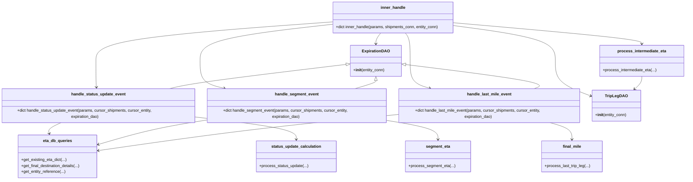

# Diagram: shipment_core/shipment_service/shipment_service/eta/eta_milestone_update/eta_milestone_update_inner.py


> Auto-generated by Obscura crawlers

## Diagram 1

```mermaid
flowchart TD
    IH[inner_handle(params, shipments_conn, entity_conn)] --> MATCH{params type}
    MATCH -->|StatusUpdateParameters| T(transformation: transform_params_to_segment_if_enabled)
    T --> HSU[handle_status_update_event(params, cursor_shipments, cursor_entity, expiration_dao)]
    HSU --> Q1[eta_db_queries.get_existing_eta_dict(cursor_entity, [external_entity_id])]
    HSU --> Q2[eta_db_queries.get_final_destination_details(cursor_entity, [external_entity_id])]
    HSU --> Q3[eta_db_queries.get_entity_reference(..., qualifier="ShipThruUpfitters")]
    HSU --> Q4[eta_db_queries.get_entity_reference(..., qualifier="OriginUpfitterParty")]
    HSU --> SUC[status_update_calculation.process_status_update(...)]
    MATCH -->|SegmentParameters| HS[handle_segment_event(params, cursor_shipments, cursor_entity, expiration_dao)]
    HS --> S1[eta_db_queries.get_existing_eta_dict(cursor_entity, params.entity_list)]
    HS --> S2[eta_db_queries.get_final_destination_details(cursor_entity, params.entity_list)]
    HS --> S3[eta_db_queries.get_entity_reference(..., qualifier="ShipThruUpfitters")]
    HS --> S4[eta_db_queries.get_entity_reference(..., qualifier="OriginUpfitterParty")]
    HS --> SEC[segment_eta.process_segment_eta(...)]
    MATCH -->|LastMileParameters| HLM[handle_last_mile_event(params, cursor_shipments, cursor_entity, expiration_dao)]
    HLM --> L1[eta_db_queries.get_existing_eta_dict(cursor_entity, params.entity_list)]
    HLM --> L2[eta_db_queries.get_final_destination_details(cursor_entity, params.entity_list)]
    HLM --> FML[final_mile.process_last_trip_leg(...)]
    MATCH -->|IntermediateEtaUpdateParameters| IM(process_intermediate_eta(params, cursor_entity, trip_leg_dao, expiration_dao))
    MATCH -->|RailArrivalEtaToEntitiesParameters| NI[raise NotImplementedError]
    subgraph DB
        Q1
        Q2
        Q3
        Q4
        S1
        S2
        S3
        S4
        L1
        L2
    end
    subgraph Processing
        SUC
        SEC
        FML
        IM
    end
    IH -.-> Tracer[tracer.get_tracer / spans]
    IH -.-> Logger[structlog logger]
```

> SVG rendering failed for this diagram.

## Diagram 2



### SVG

<svg id="container" width="2813.525390625" xmlns="http://www.w3.org/2000/svg" class="classDiagram" height="718" viewBox="0 0 2813.525390625 718" role="graphics-document document" aria-roledescription="class"><style>#container{font-family:"trebuchet ms",verdana,arial,sans-serif;font-size:16px;fill:#333;}@keyframes edge-animation-frame{from{stroke-dashoffset:0;}}@keyframes dash{to{stroke-dashoffset:0;}}#container .edge-animation-slow{stroke-dasharray:9,5!important;stroke-dashoffset:900;animation:dash 50s linear infinite;stroke-linecap:round;}#container .edge-animation-fast{stroke-dasharray:9,5!important;stroke-dashoffset:900;animation:dash 20s linear infinite;stroke-linecap:round;}#container .error-icon{fill:#552222;}#container .error-text{fill:#552222;stroke:#552222;}#container .edge-thickness-normal{stroke-width:1px;}#container .edge-thickness-thick{stroke-width:3.5px;}#container .edge-pattern-solid{stroke-dasharray:0;}#container .edge-thickness-invisible{stroke-width:0;fill:none;}#container .edge-pattern-dashed{stroke-dasharray:3;}#container .edge-pattern-dotted{stroke-dasharray:2;}#container .marker{fill:#333333;stroke:#333333;}#container .marker.cross{stroke:#333333;}#container svg{font-family:"trebuchet ms",verdana,arial,sans-serif;font-size:16px;}#container p{margin:0;}#container g.classGroup text{fill:#9370DB;stroke:none;font-family:"trebuchet ms",verdana,arial,sans-serif;font-size:10px;}#container g.classGroup text .title{font-weight:bolder;}#container .nodeLabel,#container .edgeLabel{color:#131300;}#container .edgeLabel .label rect{fill:#ECECFF;}#container .label text{fill:#131300;}#container .labelBkg{background:#ECECFF;}#container .edgeLabel .label span{background:#ECECFF;}#container .classTitle{font-weight:bolder;}#container .node rect,#container .node circle,#container .node ellipse,#container .node polygon,#container .node path{fill:#ECECFF;stroke:#9370DB;stroke-width:1px;}#container .divider{stroke:#9370DB;stroke-width:1;}#container g.clickable{cursor:pointer;}#container g.classGroup rect{fill:#ECECFF;stroke:#9370DB;}#container g.classGroup line{stroke:#9370DB;stroke-width:1;}#container .classLabel .box{stroke:none;stroke-width:0;fill:#ECECFF;opacity:0.5;}#container .classLabel .label{fill:#9370DB;font-size:10px;}#container .relation{stroke:#333333;stroke-width:1;fill:none;}#container .dashed-line{stroke-dasharray:3;}#container .dotted-line{stroke-dasharray:1 2;}#container #compositionStart,#container .composition{fill:#333333!important;stroke:#333333!important;stroke-width:1;}#container #compositionEnd,#container .composition{fill:#333333!important;stroke:#333333!important;stroke-width:1;}#container #dependencyStart,#container .dependency{fill:#333333!important;stroke:#333333!important;stroke-width:1;}#container #dependencyStart,#container .dependency{fill:#333333!important;stroke:#333333!important;stroke-width:1;}#container #extensionStart,#container .extension{fill:transparent!important;stroke:#333333!important;stroke-width:1;}#container #extensionEnd,#container .extension{fill:transparent!important;stroke:#333333!important;stroke-width:1;}#container #aggregationStart,#container .aggregation{fill:transparent!important;stroke:#333333!important;stroke-width:1;}#container #aggregationEnd,#container .aggregation{fill:transparent!important;stroke:#333333!important;stroke-width:1;}#container #lollipopStart,#container .lollipop{fill:#ECECFF!important;stroke:#333333!important;stroke-width:1;}#container #lollipopEnd,#container .lollipop{fill:#ECECFF!important;stroke:#333333!important;stroke-width:1;}#container .edgeTerminals{font-size:11px;line-height:initial;}#container .classTitleText{text-anchor:middle;font-size:18px;fill:#333;}#container .label-icon{display:inline-block;height:1em;overflow:visible;vertical-align:-0.125em;}#container .node .label-icon path{fill:currentColor;stroke:revert;stroke-width:revert;}#container :root{--mermaid-font-family:"trebuchet ms",verdana,arial,sans-serif;}</style><g><defs><marker id="container_class-aggregationStart" class="marker aggregation class" refX="18" refY="7" markerWidth="190" markerHeight="240" orient="auto"><path d="M 18,7 L9,13 L1,7 L9,1 Z"></path></marker></defs><defs><marker id="container_class-aggregationEnd" class="marker aggregation class" refX="1" refY="7" markerWidth="20" markerHeight="28" orient="auto"><path d="M 18,7 L9,13 L1,7 L9,1 Z"></path></marker></defs><defs><marker id="container_class-extensionStart" class="marker extension class" refX="18" refY="7" markerWidth="190" markerHeight="240" orient="auto"><path d="M 1,7 L18,13 V 1 Z"></path></marker></defs><defs><marker id="container_class-extensionEnd" class="marker extension class" refX="1" refY="7" markerWidth="20" markerHeight="28" orient="auto"><path d="M 1,1 V 13 L18,7 Z"></path></marker></defs><defs><marker id="container_class-compositionStart" class="marker composition class" refX="18" refY="7" markerWidth="190" markerHeight="240" orient="auto"><path d="M 18,7 L9,13 L1,7 L9,1 Z"></path></marker></defs><defs><marker id="container_class-compositionEnd" class="marker composition class" refX="1" refY="7" markerWidth="20" markerHeight="28" orient="auto"><path d="M 18,7 L9,13 L1,7 L9,1 Z"></path></marker></defs><defs><marker id="container_class-dependencyStart" class="marker dependency class" refX="6" refY="7" markerWidth="190" markerHeight="240" orient="auto"><path d="M 5,7 L9,13 L1,7 L9,1 Z"></path></marker></defs><defs><marker id="container_class-dependencyEnd" class="marker dependency class" refX="13" refY="7" markerWidth="20" markerHeight="28" orient="auto"><path d="M 18,7 L9,13 L14,7 L9,1 Z"></path></marker></defs><defs><marker id="container_class-lollipopStart" class="marker lollipop class" refX="13" refY="7" markerWidth="190" markerHeight="240" orient="auto"><circle stroke="black" fill="transparent" cx="7" cy="7" r="6"></circle></marker></defs><defs><marker id="container_class-lollipopEnd" class="marker lollipop class" refX="1" refY="7" markerWidth="190" markerHeight="240" orient="auto"><circle stroke="black" fill="transparent" cx="7" cy="7" r="6"></circle></marker></defs><g class="root"><g class="clusters"></g><g class="edgePaths"><path d="M1375.951,88.657L1212.915,100.381C1049.879,112.105,723.807,135.552,560.771,161.943C397.734,188.333,397.734,217.667,397.734,247C397.734,276.333,397.734,305.667,398.095,323.506C398.456,341.346,399.177,347.692,399.537,350.865L399.898,354.038" id="id_inner_handle_handle_status_update_event_1" class="edge-thickness-normal edge-pattern-solid relation" style=";;;" data-edge="true" data-et="edge" data-id="id_inner_handle_handle_status_update_event_1" data-points="W3sieCI6MTM3NS45NTExNzE4NzUsInkiOjg4LjY1Njg4MTU2ODU1MjM0fSx7IngiOjM5Ny43MzQzNzUsInkiOjE1OX0seyJ4IjozOTcuNzM0Mzc1LCJ5IjoyNDd9LHsieCI6Mzk3LjczNDM3NSwieSI6MzM1fSx7IngiOjQwMC41NzUyODQwOTA5MDkwNywieSI6MzYwfV0=" marker-end="url(#container_class-dependencyEnd)"></path><path d="M1375.951,98.198L1284.463,108.331C1192.974,118.465,1009.997,138.733,918.508,163.533C827.02,188.333,827.02,217.667,827.02,247C827.02,276.333,827.02,305.667,844.949,324.285C862.877,342.903,898.735,350.806,916.664,354.757L934.593,358.709" id="id_inner_handle_handle_segment_event_2" class="edge-thickness-normal edge-pattern-solid relation" style=";;;" data-edge="true" data-et="edge" data-id="id_inner_handle_handle_segment_event_2" data-points="W3sieCI6MTM3NS45NTExNzE4NzUsInkiOjk4LjE5NzU3MzA4MTY2MDJ9LHsieCI6ODI3LjAxOTUzMTI1LCJ5IjoxNTl9LHsieCI6ODI3LjAxOTUzMTI1LCJ5IjoyNDd9LHsieCI6ODI3LjAxOTUzMTI1LCJ5IjozMzV9LHsieCI6OTQwLjQ1MjgxNDI3NTU2ODIsInkiOjM2MH1d" marker-end="url(#container_class-dependencyEnd)"></path><path d="M1670.581,134L1673.828,138.167C1677.074,142.333,1683.568,150.667,1686.814,169.5C1690.061,188.333,1690.061,217.667,1690.061,247C1690.061,276.333,1690.061,305.667,1704.56,324.24C1719.06,342.813,1748.059,350.626,1762.558,354.533L1777.058,358.439" id="id_inner_handle_handle_last_mile_event_3" class="edge-thickness-normal edge-pattern-solid relation" style=";;;" data-edge="true" data-et="edge" data-id="id_inner_handle_handle_last_mile_event_3" data-points="W3sieCI6MTY3MC41ODE0NTQxOTAzNDEsInkiOjEzNH0seyJ4IjoxNjkwLjA2MDU0Njg3NSwieSI6MTU5fSx7IngiOjE2OTAuMDYwNTQ2ODc1LCJ5IjoyNDd9LHsieCI6MTY5MC4wNjA1NDY4NzUsInkiOjMzNX0seyJ4IjoxNzgyLjg1MTE4NTE5MTc2MTUsInkiOjM2MH1d" marker-end="url(#container_class-dependencyEnd)"></path><path d="M1867.037,92.278L1995.365,103.398C2123.693,114.518,2380.35,136.759,2508.678,151.046C2637.006,165.333,2637.006,171.667,2637.006,174.833L2637.006,178" id="id_inner_handle_process_intermediate_eta_4" class="edge-thickness-normal edge-pattern-solid relation" style=";;;" data-edge="true" data-et="edge" data-id="id_inner_handle_process_intermediate_eta_4" data-points="W3sieCI6MTg2Ny4wMzcxMDkzNzUsInkiOjkyLjI3NzcyNzEzMTEwMzA5fSx7IngiOjI2MzcuMDA1ODU5Mzc1LCJ5IjoxNTl9LHsieCI6MjYzNy4wMDU4NTkzNzUsInkiOjE4NH1d" marker-end="url(#container_class-dependencyEnd)"></path><path d="M1572.407,134L1569.16,138.167C1565.914,142.333,1559.421,150.667,1556.174,158C1552.928,165.333,1552.928,171.667,1552.928,174.833L1552.928,178" id="id_inner_handle_ExpirationDAO_5" class="edge-thickness-normal edge-pattern-solid relation" style=";;;" data-edge="true" data-et="edge" data-id="id_inner_handle_ExpirationDAO_5" data-points="W3sieCI6MTU3Mi40MDY4MjcwNTk2NTksInkiOjEzNH0seyJ4IjoxNTUyLjkyNzczNDM3NSwieSI6MTU5fSx7IngiOjE1NTIuOTI3NzM0Mzc1LCJ5IjoxODR9XQ==" marker-end="url(#container_class-dependencyEnd)"></path><path d="M1867.037,103.519L1936.858,112.766C2006.68,122.013,2146.322,140.506,2216.144,164.42C2285.965,188.333,2285.965,217.667,2285.965,247C2285.965,276.333,2285.965,305.667,2310.399,328.959C2334.833,352.251,2383.701,369.502,2408.135,378.128L2432.569,386.753" id="id_inner_handle_TripLegDAO_6" class="edge-thickness-normal edge-pattern-solid relation" style=";;;" data-edge="true" data-et="edge" data-id="id_inner_handle_TripLegDAO_6" data-points="W3sieCI6MTg2Ny4wMzcxMDkzNzUsInkiOjEwMy41MTg3ODY5ODA5NDQwN30seyJ4IjoyMjg1Ljk2NDg0Mzc1LCJ5IjoxNTl9LHsieCI6MjI4NS45NjQ4NDM3NSwieSI6MjQ3fSx7IngiOjIyODUuOTY0ODQzNzUsInkiOjMzNX0seyJ4IjoyNDM4LjIyNjU2MjUsInkiOjM4OC43NTA2NTgxNDIxNTg3fV0=" marker-end="url(#container_class-dependencyEnd)"></path><path d="M261.227,486L251.538,490.167C241.848,494.333,222.469,502.667,213.931,510.058C205.393,517.45,207.697,523.9,208.849,527.125L210,530.35" id="id_handle_status_update_event_eta_db_queries_7" class="edge-thickness-normal edge-pattern-solid relation" style=";;;" data-edge="true" data-et="edge" data-id="id_handle_status_update_event_eta_db_queries_7" data-points="W3sieCI6MjYxLjIyNzQ5NDY3MzI5NTUsInkiOjQ4Nn0seyJ4IjoyMDMuMDg5ODQzNzUsInkiOjUxMX0seyJ4IjoyMTIuMDE4NDE1MTc4NTcxNDIsInkiOjUzNn1d" marker-end="url(#container_class-dependencyEnd)"></path><path d="M807.469,466.189L876.592,473.658C945.715,481.126,1083.962,496.063,1153.086,510.698C1222.209,525.333,1222.209,539.667,1222.209,546.833L1222.209,554" id="id_handle_status_update_event_status_update_calculation_8" class="edge-thickness-normal edge-pattern-solid relation" style=";;;" data-edge="true" data-et="edge" data-id="id_handle_status_update_event_status_update_calculation_8" data-points="W3sieCI6ODA3LjQ2ODc1LCJ5Ijo0NjYuMTg5MzQ1MTI1MTg4NTR9LHsieCI6MTIyMi4yMDg5ODQzNzUsInkiOjUxMX0seyJ4IjoxMjIyLjIwODk4NDM3NSwieSI6NTYwfV0=" marker-end="url(#container_class-dependencyEnd)"></path><path d="M857.469,477.649L819.953,483.207C782.438,488.766,707.406,499.883,632.76,516.124C558.113,532.366,483.852,553.731,446.721,564.414L409.59,575.097" id="id_handle_segment_event_eta_db_queries_9" class="edge-thickness-normal edge-pattern-solid relation" style=";;;" data-edge="true" data-et="edge" data-id="id_handle_segment_event_eta_db_queries_9" data-points="W3sieCI6ODU3LjQ2ODc1LCJ5Ijo0NzcuNjQ4ODI5OTU5MzU0NDN9LHsieCI6NjMyLjM3NSwieSI6NTExfSx7IngiOjQwMy44MjQyMTg3NSwieSI6NTc2Ljc1NTYyMTc4MjcxNDd9XQ==" marker-end="url(#container_class-dependencyEnd)"></path><path d="M1595.141,479.554L1629.321,484.795C1663.501,490.036,1731.862,500.518,1766.042,512.926C1800.223,525.333,1800.223,539.667,1800.223,546.833L1800.223,554" id="id_handle_segment_event_segment_eta_10" class="edge-thickness-normal edge-pattern-solid relation" style=";;;" data-edge="true" data-et="edge" data-id="id_handle_segment_event_segment_eta_10" data-points="W3sieCI6MTU5NS4xNDA2MjUsInkiOjQ3OS41NTQzNTg0MDU0MjMzfSx7IngiOjE4MDAuMjIyNjU2MjUsInkiOjUxMX0seyJ4IjoxODAwLjIyMjY1NjI1LCJ5Ijo1NjB9XQ==" marker-end="url(#container_class-dependencyEnd)"></path><path d="M1645.141,456.393L1543.878,465.494C1442.615,474.595,1240.09,492.798,1034.194,516.649C828.298,540.501,619.032,570.002,514.399,584.753L409.765,599.503" id="id_handle_last_mile_event_eta_db_queries_11" class="edge-thickness-normal edge-pattern-solid relation" style=";;;" data-edge="true" data-et="edge" data-id="id_handle_last_mile_event_eta_db_queries_11" data-points="W3sieCI6MTY0NS4xNDA2MjUsInkiOjQ1Ni4zOTMwNTY5NzY4MzQ2Nn0seyJ4IjoxMDM3LjU2NDQ1MzEyNSwieSI6NTExfSx7IngiOjQwMy44MjQyMTg3NSwieSI6NjAwLjM0MDY4NTU0NTQyOTh9XQ==" marker-end="url(#container_class-dependencyEnd)"></path><path d="M2252.163,486L2267.737,490.167C2283.311,494.333,2314.459,502.667,2330.033,514C2345.607,525.333,2345.607,539.667,2345.607,546.833L2345.607,554" id="id_handle_last_mile_event_final_mile_12" class="edge-thickness-normal edge-pattern-solid relation" style=";;;" data-edge="true" data-et="edge" data-id="id_handle_last_mile_event_final_mile_12" data-points="W3sieCI6MjI1Mi4xNjMxNTI1MjEzMDcsInkiOjQ4Nn0seyJ4IjoyMzQ1LjYwNzQyMTg3NSwieSI6NTExfSx7IngiOjIzNDUuNjA3NDIxODc1LCJ5Ijo1NjB9XQ==" marker-end="url(#container_class-dependencyEnd)"></path><path d="M2637.006,310L2637.006,314.167C2637.006,318.333,2637.006,326.667,2632.944,334.346C2628.882,342.025,2620.759,349.05,2616.697,352.563L2612.635,356.075" id="id_process_intermediate_eta_TripLegDAO_13" class="edge-thickness-normal edge-pattern-solid relation" style=";;;" data-edge="true" data-et="edge" data-id="id_process_intermediate_eta_TripLegDAO_13" data-points="W3sieCI6MjYzNy4wMDU4NTkzNzUsInkiOjMxMH0seyJ4IjoyNjM3LjAwNTg1OTM3NSwieSI6MzM1fSx7IngiOjI2MDguMDk2ODM1MDQ5NzE2LCJ5IjozNjB9XQ==" marker-end="url(#container_class-dependencyEnd)"></path><path d="M1433.664,261.07L1329.223,273.392C1224.782,285.714,1015.901,310.357,892.555,326.845C769.208,343.333,731.397,351.667,712.492,355.833L693.586,360" id="id_ExpirationDAO_handle_status_update_event_14" class="edge-thickness-normal edge-pattern-solid relation" style=";;;" data-edge="true" data-et="edge" data-id="id_ExpirationDAO_handle_status_update_event_14" data-points="W3sieCI6MTQ1MC43OTQ5MjE4NzUsInkiOjI1OS4wNDkzMjExNjYyNTg2fSx7IngiOjgwNy4wMTk1MzEyNSwieSI6MzM1fSx7IngiOjY5My41ODYyNDgyMjQ0MzE4LCJ5IjozNjB9XQ==" marker-start="url(#container_class-extensionStart)"></path><path d="M1552.928,327.25L1552.928,328.542C1552.928,329.833,1552.928,332.417,1537.463,337.875C1521.998,343.333,1491.067,351.667,1475.602,355.833L1460.137,360" id="id_ExpirationDAO_handle_segment_event_15" class="edge-thickness-normal edge-pattern-solid relation" style=";;;" data-edge="true" data-et="edge" data-id="id_ExpirationDAO_handle_segment_event_15" data-points="W3sieCI6MTU1Mi45Mjc3MzQzNzUsInkiOjMxMH0seyJ4IjoxNTUyLjkyNzczNDM3NSwieSI6MzM1fSx7IngiOjE0NjAuMTM3MDk2MDU4MjM4NSwieSI6MzYwfV0=" marker-start="url(#container_class-extensionStart)"></path><path d="M1672.181,261.718L1771.145,273.931C1870.109,286.145,2068.037,310.573,2155.198,326.953C2242.359,343.333,2218.752,351.667,2206.949,355.833L2195.146,360" id="id_ExpirationDAO_handle_last_mile_event_16" class="edge-thickness-normal edge-pattern-solid relation" style=";;;" data-edge="true" data-et="edge" data-id="id_ExpirationDAO_handle_last_mile_event_16" data-points="W3sieCI6MTY1NS4wNjA1NDY4NzUsInkiOjI1OS42MDQ3OTYyNzQ3MzgxfSx7IngiOjIyNjUuOTY0ODQzNzUsInkiOjMzNX0seyJ4IjoyMTk1LjE0NjMwNjgxODE4MiwieSI6MzYwfV0=" marker-start="url(#container_class-extensionStart)"></path></g><g class="edgeLabels"><g class="edgeLabel"><g class="label" data-id="id_inner_handle_handle_status_update_event_1" transform="translate(0, 0)"><foreignObject width="0" height="0"><div xmlns="http://www.w3.org/1999/xhtml" class="labelBkg" style="display: table-cell; white-space: nowrap; line-height: 1.5; max-width: 200px; text-align: center;"><span class="edgeLabel"></span></div></foreignObject></g></g><g class="edgeLabel"><g class="label" data-id="id_inner_handle_handle_segment_event_2" transform="translate(0, 0)"><foreignObject width="0" height="0"><div xmlns="http://www.w3.org/1999/xhtml" class="labelBkg" style="display: table-cell; white-space: nowrap; line-height: 1.5; max-width: 200px; text-align: center;"><span class="edgeLabel"></span></div></foreignObject></g></g><g class="edgeLabel"><g class="label" data-id="id_inner_handle_handle_last_mile_event_3" transform="translate(0, 0)"><foreignObject width="0" height="0"><div xmlns="http://www.w3.org/1999/xhtml" class="labelBkg" style="display: table-cell; white-space: nowrap; line-height: 1.5; max-width: 200px; text-align: center;"><span class="edgeLabel"></span></div></foreignObject></g></g><g class="edgeLabel"><g class="label" data-id="id_inner_handle_process_intermediate_eta_4" transform="translate(0, 0)"><foreignObject width="0" height="0"><div xmlns="http://www.w3.org/1999/xhtml" class="labelBkg" style="display: table-cell; white-space: nowrap; line-height: 1.5; max-width: 200px; text-align: center;"><span class="edgeLabel"></span></div></foreignObject></g></g><g class="edgeLabel"><g class="label" data-id="id_inner_handle_ExpirationDAO_5" transform="translate(0, 0)"><foreignObject width="0" height="0"><div xmlns="http://www.w3.org/1999/xhtml" class="labelBkg" style="display: table-cell; white-space: nowrap; line-height: 1.5; max-width: 200px; text-align: center;"><span class="edgeLabel"></span></div></foreignObject></g></g><g class="edgeLabel"><g class="label" data-id="id_inner_handle_TripLegDAO_6" transform="translate(0, 0)"><foreignObject width="0" height="0"><div xmlns="http://www.w3.org/1999/xhtml" class="labelBkg" style="display: table-cell; white-space: nowrap; line-height: 1.5; max-width: 200px; text-align: center;"><span class="edgeLabel"></span></div></foreignObject></g></g><g class="edgeLabel"><g class="label" data-id="id_handle_status_update_event_eta_db_queries_7" transform="translate(0, 0)"><foreignObject width="0" height="0"><div xmlns="http://www.w3.org/1999/xhtml" class="labelBkg" style="display: table-cell; white-space: nowrap; line-height: 1.5; max-width: 200px; text-align: center;"><span class="edgeLabel"></span></div></foreignObject></g></g><g class="edgeLabel"><g class="label" data-id="id_handle_status_update_event_status_update_calculation_8" transform="translate(0, 0)"><foreignObject width="0" height="0"><div xmlns="http://www.w3.org/1999/xhtml" class="labelBkg" style="display: table-cell; white-space: nowrap; line-height: 1.5; max-width: 200px; text-align: center;"><span class="edgeLabel"></span></div></foreignObject></g></g><g class="edgeLabel"><g class="label" data-id="id_handle_segment_event_eta_db_queries_9" transform="translate(0, 0)"><foreignObject width="0" height="0"><div xmlns="http://www.w3.org/1999/xhtml" class="labelBkg" style="display: table-cell; white-space: nowrap; line-height: 1.5; max-width: 200px; text-align: center;"><span class="edgeLabel"></span></div></foreignObject></g></g><g class="edgeLabel"><g class="label" data-id="id_handle_segment_event_segment_eta_10" transform="translate(0, 0)"><foreignObject width="0" height="0"><div xmlns="http://www.w3.org/1999/xhtml" class="labelBkg" style="display: table-cell; white-space: nowrap; line-height: 1.5; max-width: 200px; text-align: center;"><span class="edgeLabel"></span></div></foreignObject></g></g><g class="edgeLabel"><g class="label" data-id="id_handle_last_mile_event_eta_db_queries_11" transform="translate(0, 0)"><foreignObject width="0" height="0"><div xmlns="http://www.w3.org/1999/xhtml" class="labelBkg" style="display: table-cell; white-space: nowrap; line-height: 1.5; max-width: 200px; text-align: center;"><span class="edgeLabel"></span></div></foreignObject></g></g><g class="edgeLabel"><g class="label" data-id="id_handle_last_mile_event_final_mile_12" transform="translate(0, 0)"><foreignObject width="0" height="0"><div xmlns="http://www.w3.org/1999/xhtml" class="labelBkg" style="display: table-cell; white-space: nowrap; line-height: 1.5; max-width: 200px; text-align: center;"><span class="edgeLabel"></span></div></foreignObject></g></g><g class="edgeLabel"><g class="label" data-id="id_process_intermediate_eta_TripLegDAO_13" transform="translate(0, 0)"><foreignObject width="0" height="0"><div xmlns="http://www.w3.org/1999/xhtml" class="labelBkg" style="display: table-cell; white-space: nowrap; line-height: 1.5; max-width: 200px; text-align: center;"><span class="edgeLabel"></span></div></foreignObject></g></g><g class="edgeLabel"><g class="label" data-id="id_ExpirationDAO_handle_status_update_event_14" transform="translate(0, 0)"><foreignObject width="0" height="0"><div xmlns="http://www.w3.org/1999/xhtml" class="labelBkg" style="display: table-cell; white-space: nowrap; line-height: 1.5; max-width: 200px; text-align: center;"><span class="edgeLabel"></span></div></foreignObject></g></g><g class="edgeLabel"><g class="label" data-id="id_ExpirationDAO_handle_segment_event_15" transform="translate(0, 0)"><foreignObject width="0" height="0"><div xmlns="http://www.w3.org/1999/xhtml" class="labelBkg" style="display: table-cell; white-space: nowrap; line-height: 1.5; max-width: 200px; text-align: center;"><span class="edgeLabel"></span></div></foreignObject></g></g><g class="edgeLabel"><g class="label" data-id="id_ExpirationDAO_handle_last_mile_event_16" transform="translate(0, 0)"><foreignObject width="0" height="0"><div xmlns="http://www.w3.org/1999/xhtml" class="labelBkg" style="display: table-cell; white-space: nowrap; line-height: 1.5; max-width: 200px; text-align: center;"><span class="edgeLabel"></span></div></foreignObject></g></g></g><g class="nodes"><g class="node default" id="classId-inner_handle-0" transform="translate(1621.494140625, 71)"><g class="basic label-container"><path d="M-245.54296875 -63 L245.54296875 -63 L245.54296875 63 L-245.54296875 63" stroke="none" stroke-width="0" fill="#ECECFF" style=""></path><path d="M-245.54296875 -63 C-130.36662457358776 -63, -15.190280397175513 -63, 245.54296875 -63 M-245.54296875 -63 C-147.20909906508308 -63, -48.87522938016619 -63, 245.54296875 -63 M245.54296875 -63 C245.54296875 -13.24593585155177, 245.54296875 36.50812829689646, 245.54296875 63 M245.54296875 -63 C245.54296875 -13.863805627316566, 245.54296875 35.27238874536687, 245.54296875 63 M245.54296875 63 C94.93019320816856 63, -55.68258233366288 63, -245.54296875 63 M245.54296875 63 C99.6350582063153 63, -46.272852337369386 63, -245.54296875 63 M-245.54296875 63 C-245.54296875 24.972907434145156, -245.54296875 -13.054185131709687, -245.54296875 -63 M-245.54296875 63 C-245.54296875 22.05196532288568, -245.54296875 -18.896069354228644, -245.54296875 -63" stroke="#9370DB" stroke-width="1.3" fill="none" stroke-dasharray="0 0" style=""></path></g><g class="annotation-group text" transform="translate(0, -39)"></g><g class="label-group text" transform="translate(-47.8046875, -39)"><g class="label" style="font-weight: bolder" transform="translate(0,-12)"><foreignObject width="95.609375" height="24"><div xmlns="http://www.w3.org/1999/xhtml" style="display: table-cell; white-space: nowrap; line-height: 1.5; max-width: 146px; text-align: center;"><span class="nodeLabel markdown-node-label" style=""><p>inner_handle</p></span></div></foreignObject></g></g><g class="members-group text" transform="translate(-233.54296875, 9)"></g><g class="methods-group text" transform="translate(-233.54296875, 39)"><g class="label" style="" transform="translate(0,-12)"><foreignObject width="419.28125" height="24"><div xmlns="http://www.w3.org/1999/xhtml" style="display: table-cell; white-space: nowrap; line-height: 1.5; max-width: 477px; text-align: center;"><span class="nodeLabel markdown-node-label" style=""><p>+dict inner_handle(params, shipments_conn, entity_conn)</p></span></div></foreignObject></g></g><g class="divider" style=""><path d="M-245.54296875 -15 C-85.33740475083758 -15, 74.86815924832484 -15, 245.54296875 -15 M-245.54296875 -15 C-144.56153124197638 -15, -43.580093733952765 -15, 245.54296875 -15" stroke="#9370DB" stroke-width="1.3" fill="none" stroke-dasharray="0 0" style=""></path></g><g class="divider" style=""><path d="M-245.54296875 9 C-138.6613158675078 9, -31.77966298501559 9, 245.54296875 9 M-245.54296875 9 C-139.96409344123168 9, -34.385218132463365 9, 245.54296875 9" stroke="#9370DB" stroke-width="1.3" fill="none" stroke-dasharray="0 0" style=""></path></g></g><g class="node default" id="classId-handle_status_update_event-1" transform="translate(407.734375, 423)"><g class="basic label-container"><path d="M-399.734375 -63 L399.734375 -63 L399.734375 63 L-399.734375 63" stroke="none" stroke-width="0" fill="#ECECFF" style=""></path><path d="M-399.734375 -63 C-192.17656380241755 -63, 15.381247395164905 -63, 399.734375 -63 M-399.734375 -63 C-159.28741313317846 -63, 81.15954873364308 -63, 399.734375 -63 M399.734375 -63 C399.734375 -14.60301429971598, 399.734375 33.79397140056804, 399.734375 63 M399.734375 -63 C399.734375 -16.67990729545071, 399.734375 29.640185409098578, 399.734375 63 M399.734375 63 C233.8010071279004 63, 67.86763925580078 63, -399.734375 63 M399.734375 63 C168.51216903660867 63, -62.710036926782664 63, -399.734375 63 M-399.734375 63 C-399.734375 15.110381094824248, -399.734375 -32.7792378103515, -399.734375 -63 M-399.734375 63 C-399.734375 27.786464775975134, -399.734375 -7.427070448049733, -399.734375 -63" stroke="#9370DB" stroke-width="1.3" fill="none" stroke-dasharray="0 0" style=""></path></g><g class="annotation-group text" transform="translate(0, -39)"></g><g class="label-group text" transform="translate(-106.03125, -39)"><g class="label" style="font-weight: bolder" transform="translate(0,-12)"><foreignObject width="212.0625" height="24"><div xmlns="http://www.w3.org/1999/xhtml" style="display: table-cell; white-space: nowrap; line-height: 1.5; max-width: 260px; text-align: center;"><span class="nodeLabel markdown-node-label" style=""><p>handle_status_update_event</p></span></div></foreignObject></g></g><g class="members-group text" transform="translate(-387.734375, 9)"></g><g class="methods-group text" transform="translate(-387.734375, 39)"><g class="label" style="" transform="translate(0,-12)"><foreignObject width="669.4375" height="24"><div xmlns="http://www.w3.org/1999/xhtml" style="display: table-cell; white-space: nowrap; line-height: 1.5; max-width: 727px; text-align: center;"><span class="nodeLabel markdown-node-label" style=""><p>+dict handle_status_update_event(params, cursor_shipments, cursor_entity, expiration_dao)</p></span></div></foreignObject></g></g><g class="divider" style=""><path d="M-399.734375 -15 C-208.12321314038212 -15, -16.51205128076424 -15, 399.734375 -15 M-399.734375 -15 C-153.97871765301252 -15, 91.77693969397495 -15, 399.734375 -15" stroke="#9370DB" stroke-width="1.3" fill="none" stroke-dasharray="0 0" style=""></path></g><g class="divider" style=""><path d="M-399.734375 9 C-238.60683236711347 9, -77.47928973422694 9, 399.734375 9 M-399.734375 9 C-149.22203815468268 9, 101.29029869063464 9, 399.734375 9" stroke="#9370DB" stroke-width="1.3" fill="none" stroke-dasharray="0 0" style=""></path></g></g><g class="node default" id="classId-handle_segment_event-2" transform="translate(1226.3046875, 423)"><g class="basic label-container"><path d="M-368.8359375 -63 L368.8359375 -63 L368.8359375 63 L-368.8359375 63" stroke="none" stroke-width="0" fill="#ECECFF" style=""></path><path d="M-368.8359375 -63 C-102.91799991942338 -63, 162.99993766115324 -63, 368.8359375 -63 M-368.8359375 -63 C-199.7842189987506 -63, -30.732500497501178 -63, 368.8359375 -63 M368.8359375 -63 C368.8359375 -33.89882654937928, 368.8359375 -4.797653098758559, 368.8359375 63 M368.8359375 -63 C368.8359375 -34.65124683264837, 368.8359375 -6.30249366529673, 368.8359375 63 M368.8359375 63 C145.085549163636 63, -78.66483917272802 63, -368.8359375 63 M368.8359375 63 C156.00152040828456 63, -56.832896683430874 63, -368.8359375 63 M-368.8359375 63 C-368.8359375 24.78717415303082, -368.8359375 -13.425651693938363, -368.8359375 -63 M-368.8359375 63 C-368.8359375 28.61597476357783, -368.8359375 -5.768050472844337, -368.8359375 -63" stroke="#9370DB" stroke-width="1.3" fill="none" stroke-dasharray="0 0" style=""></path></g><g class="annotation-group text" transform="translate(0, -39)"></g><g class="label-group text" transform="translate(-85.25, -39)"><g class="label" style="font-weight: bolder" transform="translate(0,-12)"><foreignObject width="170.5" height="24"><div xmlns="http://www.w3.org/1999/xhtml" style="display: table-cell; white-space: nowrap; line-height: 1.5; max-width: 219px; text-align: center;"><span class="nodeLabel markdown-node-label" style=""><p>handle_segment_event</p></span></div></foreignObject></g></g><g class="members-group text" transform="translate(-356.8359375, 9)"></g><g class="methods-group text" transform="translate(-356.8359375, 39)"><g class="label" style="" transform="translate(0,-12)"><foreignObject width="628.421875" height="24"><div xmlns="http://www.w3.org/1999/xhtml" style="display: table-cell; white-space: nowrap; line-height: 1.5; max-width: 686px; text-align: center;"><span class="nodeLabel markdown-node-label" style=""><p>+dict handle_segment_event(params, cursor_shipments, cursor_entity, expiration_dao)</p></span></div></foreignObject></g></g><g class="divider" style=""><path d="M-368.8359375 -15 C-162.41444001828256 -15, 44.007057463434876 -15, 368.8359375 -15 M-368.8359375 -15 C-92.79488209666255 -15, 183.2461733066749 -15, 368.8359375 -15" stroke="#9370DB" stroke-width="1.3" fill="none" stroke-dasharray="0 0" style=""></path></g><g class="divider" style=""><path d="M-368.8359375 9 C-106.36448865409284 9, 156.10696019181432 9, 368.8359375 9 M-368.8359375 9 C-80.10975242681468 9, 208.61643264637064 9, 368.8359375 9" stroke="#9370DB" stroke-width="1.3" fill="none" stroke-dasharray="0 0" style=""></path></g></g><g class="node default" id="classId-handle_last_mile_event-3" transform="translate(2016.68359375, 423)"><g class="basic label-container"><path d="M-371.54296875 -63 L371.54296875 -63 L371.54296875 63 L-371.54296875 63" stroke="none" stroke-width="0" fill="#ECECFF" style=""></path><path d="M-371.54296875 -63 C-84.2774052461981 -63, 202.9881582576038 -63, 371.54296875 -63 M-371.54296875 -63 C-144.36160749175698 -63, 82.81975376648603 -63, 371.54296875 -63 M371.54296875 -63 C371.54296875 -36.07021323809238, 371.54296875 -9.140426476184764, 371.54296875 63 M371.54296875 -63 C371.54296875 -21.21951849130989, 371.54296875 20.560963017380217, 371.54296875 63 M371.54296875 63 C191.85967442849196 63, 12.176380106983913 63, -371.54296875 63 M371.54296875 63 C202.33448278089182 63, 33.12599681178364 63, -371.54296875 63 M-371.54296875 63 C-371.54296875 29.927788694503178, -371.54296875 -3.1444226109936437, -371.54296875 -63 M-371.54296875 63 C-371.54296875 37.07632356793962, -371.54296875 11.152647135879235, -371.54296875 -63" stroke="#9370DB" stroke-width="1.3" fill="none" stroke-dasharray="0 0" style=""></path></g><g class="annotation-group text" transform="translate(0, -39)"></g><g class="label-group text" transform="translate(-86.9609375, -39)"><g class="label" style="font-weight: bolder" transform="translate(0,-12)"><foreignObject width="173.921875" height="24"><div xmlns="http://www.w3.org/1999/xhtml" style="display: table-cell; white-space: nowrap; line-height: 1.5; max-width: 223px; text-align: center;"><span class="nodeLabel markdown-node-label" style=""><p>handle_last_mile_event</p></span></div></foreignObject></g></g><g class="members-group text" transform="translate(-359.54296875, 9)"></g><g class="methods-group text" transform="translate(-359.54296875, 39)"><g class="label" style="" transform="translate(0,-12)"><foreignObject width="632.125" height="24"><div xmlns="http://www.w3.org/1999/xhtml" style="display: table-cell; white-space: nowrap; line-height: 1.5; max-width: 689px; text-align: center;"><span class="nodeLabel markdown-node-label" style=""><p>+dict handle_last_mile_event(params, cursor_shipments, cursor_entity, expiration_dao)</p></span></div></foreignObject></g></g><g class="divider" style=""><path d="M-371.54296875 -15 C-155.9902663358082 -15, 59.5624360783836 -15, 371.54296875 -15 M-371.54296875 -15 C-119.6075276761436 -15, 132.3279133977128 -15, 371.54296875 -15" stroke="#9370DB" stroke-width="1.3" fill="none" stroke-dasharray="0 0" style=""></path></g><g class="divider" style=""><path d="M-371.54296875 9 C-215.2004713897596 9, -58.8579740295192 9, 371.54296875 9 M-371.54296875 9 C-106.21970431850053 9, 159.10356011299893 9, 371.54296875 9" stroke="#9370DB" stroke-width="1.3" fill="none" stroke-dasharray="0 0" style=""></path></g></g><g class="node default" id="classId-ExpirationDAO-4" transform="translate(1552.927734375, 247)"><g class="basic label-container"><path d="M-102.1328125 -63 L102.1328125 -63 L102.1328125 63 L-102.1328125 63" stroke="none" stroke-width="0" fill="#ECECFF" style=""></path><path d="M-102.1328125 -63 C-55.025092644128286 -63, -7.917372788256571 -63, 102.1328125 -63 M-102.1328125 -63 C-31.242465980194723 -63, 39.647880539610554 -63, 102.1328125 -63 M102.1328125 -63 C102.1328125 -30.760309980004685, 102.1328125 1.4793800399906303, 102.1328125 63 M102.1328125 -63 C102.1328125 -31.249787857332137, 102.1328125 0.5004242853357255, 102.1328125 63 M102.1328125 63 C36.917025458768535 63, -28.29876158246293 63, -102.1328125 63 M102.1328125 63 C54.31419034497797 63, 6.4955681899559465 63, -102.1328125 63 M-102.1328125 63 C-102.1328125 14.696803384584918, -102.1328125 -33.606393230830164, -102.1328125 -63 M-102.1328125 63 C-102.1328125 13.75930188794387, -102.1328125 -35.48139622411226, -102.1328125 -63" stroke="#9370DB" stroke-width="1.3" fill="none" stroke-dasharray="0 0" style=""></path></g><g class="annotation-group text" transform="translate(0, -39)"></g><g class="label-group text" transform="translate(-52.578125, -39)"><g class="label" style="font-weight: bolder" transform="translate(0,-12)"><foreignObject width="105.15625" height="24"><div xmlns="http://www.w3.org/1999/xhtml" style="display: table-cell; white-space: nowrap; line-height: 1.5; max-width: 154px; text-align: center;"><span class="nodeLabel markdown-node-label" style=""><p>ExpirationDAO</p></span></div></foreignObject></g></g><g class="members-group text" transform="translate(-90.1328125, 9)"></g><g class="methods-group text" transform="translate(-90.1328125, 39)"><g class="label" style="" transform="translate(0,-12)"><foreignObject width="127.6875" height="24"><div xmlns="http://www.w3.org/1999/xhtml" style="display: table-cell; white-space: nowrap; line-height: 1.5; max-width: 216px; text-align: center;"><span class="nodeLabel markdown-node-label" style=""><p>+<strong>init</strong>(entity_conn)</p></span></div></foreignObject></g></g><g class="divider" style=""><path d="M-102.1328125 -15 C-37.60618278403442 -15, 26.920446931931167 -15, 102.1328125 -15 M-102.1328125 -15 C-50.61843659474503 -15, 0.8959393105099451 -15, 102.1328125 -15" stroke="#9370DB" stroke-width="1.3" fill="none" stroke-dasharray="0 0" style=""></path></g><g class="divider" style=""><path d="M-102.1328125 9 C-53.42317730388157 9, -4.713542107763146 9, 102.1328125 9 M-102.1328125 9 C-37.79879330527919 9, 26.53522588944162 9, 102.1328125 9" stroke="#9370DB" stroke-width="1.3" fill="none" stroke-dasharray="0 0" style=""></path></g></g><g class="node default" id="classId-TripLegDAO-5" transform="translate(2535.24609375, 423)"><g class="basic label-container"><path d="M-97.01953125 -63 L97.01953125 -63 L97.01953125 63 L-97.01953125 63" stroke="none" stroke-width="0" fill="#ECECFF" style=""></path><path d="M-97.01953125 -63 C-35.717480132036826 -63, 25.584570985926348 -63, 97.01953125 -63 M-97.01953125 -63 C-28.94720210853032 -63, 39.12512703293936 -63, 97.01953125 -63 M97.01953125 -63 C97.01953125 -36.4412216504858, 97.01953125 -9.882443300971602, 97.01953125 63 M97.01953125 -63 C97.01953125 -24.395993428022706, 97.01953125 14.208013143954588, 97.01953125 63 M97.01953125 63 C42.60605518465688 63, -11.807420880686237 63, -97.01953125 63 M97.01953125 63 C48.41031265803898 63, -0.1989059339220347 63, -97.01953125 63 M-97.01953125 63 C-97.01953125 27.369750446308785, -97.01953125 -8.26049910738243, -97.01953125 -63 M-97.01953125 63 C-97.01953125 17.93656807802102, -97.01953125 -27.126863843957963, -97.01953125 -63" stroke="#9370DB" stroke-width="1.3" fill="none" stroke-dasharray="0 0" style=""></path></g><g class="annotation-group text" transform="translate(0, -39)"></g><g class="label-group text" transform="translate(-42.3515625, -39)"><g class="label" style="font-weight: bolder" transform="translate(0,-12)"><foreignObject width="84.703125" height="24"><div xmlns="http://www.w3.org/1999/xhtml" style="display: table-cell; white-space: nowrap; line-height: 1.5; max-width: 133px; text-align: center;"><span class="nodeLabel markdown-node-label" style=""><p>TripLegDAO</p></span></div></foreignObject></g></g><g class="members-group text" transform="translate(-85.01953125, 9)"></g><g class="methods-group text" transform="translate(-85.01953125, 39)"><g class="label" style="" transform="translate(0,-12)"><foreignObject width="127.6875" height="24"><div xmlns="http://www.w3.org/1999/xhtml" style="display: table-cell; white-space: nowrap; line-height: 1.5; max-width: 216px; text-align: center;"><span class="nodeLabel markdown-node-label" style=""><p>+<strong>init</strong>(entity_conn)</p></span></div></foreignObject></g></g><g class="divider" style=""><path d="M-97.01953125 -15 C-37.567564019312364 -15, 21.884403211375272 -15, 97.01953125 -15 M-97.01953125 -15 C-44.58631410259566 -15, 7.846903044808684 -15, 97.01953125 -15" stroke="#9370DB" stroke-width="1.3" fill="none" stroke-dasharray="0 0" style=""></path></g><g class="divider" style=""><path d="M-97.01953125 9 C-46.020009624394966 9, 4.979512001210068 9, 97.01953125 9 M-97.01953125 9 C-32.8968821108659 9, 31.225767028268194 9, 97.01953125 9" stroke="#9370DB" stroke-width="1.3" fill="none" stroke-dasharray="0 0" style=""></path></g></g><g class="node default" id="classId-eta_db_queries-6" transform="translate(243.08984375, 623)"><g class="basic label-container"><path d="M-160.734375 -87 L160.734375 -87 L160.734375 87 L-160.734375 87" stroke="none" stroke-width="0" fill="#ECECFF" style=""></path><path d="M-160.734375 -87 C-45.249681866125044 -87, 70.23501126774991 -87, 160.734375 -87 M-160.734375 -87 C-44.80979334255004 -87, 71.11478831489993 -87, 160.734375 -87 M160.734375 -87 C160.734375 -35.93438155061071, 160.734375 15.131236898778582, 160.734375 87 M160.734375 -87 C160.734375 -26.991434285423473, 160.734375 33.01713142915305, 160.734375 87 M160.734375 87 C42.592852074595186 87, -75.54867085080963 87, -160.734375 87 M160.734375 87 C66.57190389373068 87, -27.590567212538645 87, -160.734375 87 M-160.734375 87 C-160.734375 48.50917845272753, -160.734375 10.018356905455065, -160.734375 -87 M-160.734375 87 C-160.734375 23.855819185949443, -160.734375 -39.288361628101114, -160.734375 -87" stroke="#9370DB" stroke-width="1.3" fill="none" stroke-dasharray="0 0" style=""></path></g><g class="annotation-group text" transform="translate(0, -63)"></g><g class="label-group text" transform="translate(-56.75, -63)"><g class="label" style="font-weight: bolder" transform="translate(0,-12)"><foreignObject width="113.5" height="24"><div xmlns="http://www.w3.org/1999/xhtml" style="display: table-cell; white-space: nowrap; line-height: 1.5; max-width: 162px; text-align: center;"><span class="nodeLabel markdown-node-label" style=""><p>eta_db_queries</p></span></div></foreignObject></g></g><g class="members-group text" transform="translate(-148.734375, -15)"></g><g class="methods-group text" transform="translate(-148.734375, 15)"><g class="label" style="" transform="translate(0,-12)"><foreignObject width="183.40625" height="24"><div xmlns="http://www.w3.org/1999/xhtml" style="display: table-cell; white-space: nowrap; line-height: 1.5; max-width: 241px; text-align: center;"><span class="nodeLabel markdown-node-label" style=""><p>+get_existing_eta_dict(...)</p></span></div></foreignObject></g><g class="label" style="" transform="translate(0,12)"><foreignObject width="240.71875" height="24"><div xmlns="http://www.w3.org/1999/xhtml" style="display: table-cell; white-space: nowrap; line-height: 1.5; max-width: 298px; text-align: center;"><span class="nodeLabel markdown-node-label" style=""><p>+get_final_destination_details(...)</p></span></div></foreignObject></g><g class="label" style="" transform="translate(0,36)"><foreignObject width="178.40625" height="24"><div xmlns="http://www.w3.org/1999/xhtml" style="display: table-cell; white-space: nowrap; line-height: 1.5; max-width: 236px; text-align: center;"><span class="nodeLabel markdown-node-label" style=""><p>+get_entity_reference(...)</p></span></div></foreignObject></g></g><g class="divider" style=""><path d="M-160.734375 -39 C-90.56676085117026 -39, -20.399146702340516 -39, 160.734375 -39 M-160.734375 -39 C-88.06113761588539 -39, -15.387900231770772 -39, 160.734375 -39" stroke="#9370DB" stroke-width="1.3" fill="none" stroke-dasharray="0 0" style=""></path></g><g class="divider" style=""><path d="M-160.734375 -15 C-73.77507256673277 -15, 13.184229866534452 -15, 160.734375 -15 M-160.734375 -15 C-56.69414310570971 -15, 47.34608878858057 -15, 160.734375 -15" stroke="#9370DB" stroke-width="1.3" fill="none" stroke-dasharray="0 0" style=""></path></g></g><g class="node default" id="classId-status_update_calculation-7" transform="translate(1222.208984375, 623)"><g class="basic label-container"><path d="M-158.5546875 -63 L158.5546875 -63 L158.5546875 63 L-158.5546875 63" stroke="none" stroke-width="0" fill="#ECECFF" style=""></path><path d="M-158.5546875 -63 C-86.00550334664887 -63, -13.45631919329773 -63, 158.5546875 -63 M-158.5546875 -63 C-87.42803155212151 -63, -16.30137560424302 -63, 158.5546875 -63 M158.5546875 -63 C158.5546875 -15.27910465683577, 158.5546875 32.44179068632846, 158.5546875 63 M158.5546875 -63 C158.5546875 -27.559387283588357, 158.5546875 7.881225432823285, 158.5546875 63 M158.5546875 63 C66.49464488969033 63, -25.56539772061933 63, -158.5546875 63 M158.5546875 63 C64.95309209093226 63, -28.648503318135482 63, -158.5546875 63 M-158.5546875 63 C-158.5546875 21.174807015185124, -158.5546875 -20.650385969629752, -158.5546875 -63 M-158.5546875 63 C-158.5546875 16.381175415881103, -158.5546875 -30.237649168237795, -158.5546875 -63" stroke="#9370DB" stroke-width="1.3" fill="none" stroke-dasharray="0 0" style=""></path></g><g class="annotation-group text" transform="translate(0, -39)"></g><g class="label-group text" transform="translate(-96.421875, -39)"><g class="label" style="font-weight: bolder" transform="translate(0,-12)"><foreignObject width="192.84375" height="24"><div xmlns="http://www.w3.org/1999/xhtml" style="display: table-cell; white-space: nowrap; line-height: 1.5; max-width: 241px; text-align: center;"><span class="nodeLabel markdown-node-label" style=""><p>status_update_calculation</p></span></div></foreignObject></g></g><g class="members-group text" transform="translate(-146.5546875, 9)"></g><g class="methods-group text" transform="translate(-146.5546875, 39)"><g class="label" style="" transform="translate(0,-12)"><foreignObject width="196.6875" height="24"><div xmlns="http://www.w3.org/1999/xhtml" style="display: table-cell; white-space: nowrap; line-height: 1.5; max-width: 254px; text-align: center;"><span class="nodeLabel markdown-node-label" style=""><p>+process_status_update(...)</p></span></div></foreignObject></g></g><g class="divider" style=""><path d="M-158.5546875 -15 C-73.00309860566676 -15, 12.548490288666471 -15, 158.5546875 -15 M-158.5546875 -15 C-43.221902929777045 -15, 72.11088164044591 -15, 158.5546875 -15" stroke="#9370DB" stroke-width="1.3" fill="none" stroke-dasharray="0 0" style=""></path></g><g class="divider" style=""><path d="M-158.5546875 9 C-70.56845225457218 9, 17.417782990855642 9, 158.5546875 9 M-158.5546875 9 C-67.375874383644 9, 23.802938732711993 9, 158.5546875 9" stroke="#9370DB" stroke-width="1.3" fill="none" stroke-dasharray="0 0" style=""></path></g></g><g class="node default" id="classId-segment_eta-8" transform="translate(1800.22265625, 623)"><g class="basic label-container"><path d="M-128.90234375 -63 L128.90234375 -63 L128.90234375 63 L-128.90234375 63" stroke="none" stroke-width="0" fill="#ECECFF" style=""></path><path d="M-128.90234375 -63 C-62.20833716301284 -63, 4.485669423974315 -63, 128.90234375 -63 M-128.90234375 -63 C-65.13234804984766 -63, -1.3623523496953283 -63, 128.90234375 -63 M128.90234375 -63 C128.90234375 -28.795301675108476, 128.90234375 5.409396649783048, 128.90234375 63 M128.90234375 -63 C128.90234375 -16.17478413118687, 128.90234375 30.650431737626263, 128.90234375 63 M128.90234375 63 C38.25812831642273 63, -52.386087117154545 63, -128.90234375 63 M128.90234375 63 C41.454979070662404 63, -45.99238560867519 63, -128.90234375 63 M-128.90234375 63 C-128.90234375 25.7939509092364, -128.90234375 -11.412098181527199, -128.90234375 -63 M-128.90234375 63 C-128.90234375 35.30124211672056, -128.90234375 7.602484233441125, -128.90234375 -63" stroke="#9370DB" stroke-width="1.3" fill="none" stroke-dasharray="0 0" style=""></path></g><g class="annotation-group text" transform="translate(0, -39)"></g><g class="label-group text" transform="translate(-47.3671875, -39)"><g class="label" style="font-weight: bolder" transform="translate(0,-12)"><foreignObject width="94.734375" height="24"><div xmlns="http://www.w3.org/1999/xhtml" style="display: table-cell; white-space: nowrap; line-height: 1.5; max-width: 143px; text-align: center;"><span class="nodeLabel markdown-node-label" style=""><p>segment_eta</p></span></div></foreignObject></g></g><g class="members-group text" transform="translate(-116.90234375, 9)"></g><g class="methods-group text" transform="translate(-116.90234375, 39)"><g class="label" style="" transform="translate(0,-12)"><foreignObject width="186.4375" height="24"><div xmlns="http://www.w3.org/1999/xhtml" style="display: table-cell; white-space: nowrap; line-height: 1.5; max-width: 244px; text-align: center;"><span class="nodeLabel markdown-node-label" style=""><p>+process_segment_eta(...)</p></span></div></foreignObject></g></g><g class="divider" style=""><path d="M-128.90234375 -15 C-40.58872522190288 -15, 47.72489330619425 -15, 128.90234375 -15 M-128.90234375 -15 C-64.56484646532027 -15, -0.22734918064054455 -15, 128.90234375 -15" stroke="#9370DB" stroke-width="1.3" fill="none" stroke-dasharray="0 0" style=""></path></g><g class="divider" style=""><path d="M-128.90234375 9 C-65.0537460171461 9, -1.2051482842921928 9, 128.90234375 9 M-128.90234375 9 C-28.8912030302005 9, 71.119937689599 9, 128.90234375 9" stroke="#9370DB" stroke-width="1.3" fill="none" stroke-dasharray="0 0" style=""></path></g></g><g class="node default" id="classId-final_mile-9" transform="translate(2345.607421875, 623)"><g class="basic label-container"><path d="M-121.48828125 -63 L121.48828125 -63 L121.48828125 63 L-121.48828125 63" stroke="none" stroke-width="0" fill="#ECECFF" style=""></path><path d="M-121.48828125 -63 C-27.81572089603661 -63, 65.85683945792678 -63, 121.48828125 -63 M-121.48828125 -63 C-65.97325972679118 -63, -10.458238203582383 -63, 121.48828125 -63 M121.48828125 -63 C121.48828125 -25.495827972193077, 121.48828125 12.008344055613847, 121.48828125 63 M121.48828125 -63 C121.48828125 -22.70712728508979, 121.48828125 17.58574542982042, 121.48828125 63 M121.48828125 63 C52.10459772562288 63, -17.279085798754238 63, -121.48828125 63 M121.48828125 63 C72.4691851926771 63, 23.450089135354204 63, -121.48828125 63 M-121.48828125 63 C-121.48828125 14.753796720577789, -121.48828125 -33.49240655884442, -121.48828125 -63 M-121.48828125 63 C-121.48828125 17.96599865961452, -121.48828125 -27.06800268077096, -121.48828125 -63" stroke="#9370DB" stroke-width="1.3" fill="none" stroke-dasharray="0 0" style=""></path></g><g class="annotation-group text" transform="translate(0, -39)"></g><g class="label-group text" transform="translate(-36.0234375, -39)"><g class="label" style="font-weight: bolder" transform="translate(0,-12)"><foreignObject width="72.046875" height="24"><div xmlns="http://www.w3.org/1999/xhtml" style="display: table-cell; white-space: nowrap; line-height: 1.5; max-width: 122px; text-align: center;"><span class="nodeLabel markdown-node-label" style=""><p>final_mile</p></span></div></foreignObject></g></g><g class="members-group text" transform="translate(-109.48828125, 9)"></g><g class="methods-group text" transform="translate(-109.48828125, 39)"><g class="label" style="" transform="translate(0,-12)"><foreignObject width="182.953125" height="24"><div xmlns="http://www.w3.org/1999/xhtml" style="display: table-cell; white-space: nowrap; line-height: 1.5; max-width: 240px; text-align: center;"><span class="nodeLabel markdown-node-label" style=""><p>+process_last_trip_leg(...)</p></span></div></foreignObject></g></g><g class="divider" style=""><path d="M-121.48828125 -15 C-70.29825715335261 -15, -19.10823305670523 -15, 121.48828125 -15 M-121.48828125 -15 C-53.580934539935726 -15, 14.326412170128549 -15, 121.48828125 -15" stroke="#9370DB" stroke-width="1.3" fill="none" stroke-dasharray="0 0" style=""></path></g><g class="divider" style=""><path d="M-121.48828125 9 C-38.40735214119856 9, 44.673576967602884 9, 121.48828125 9 M-121.48828125 9 C-35.239012658280174 9, 51.01025593343965 9, 121.48828125 9" stroke="#9370DB" stroke-width="1.3" fill="none" stroke-dasharray="0 0" style=""></path></g></g><g class="node default" id="classId-process_intermediate_eta-10" transform="translate(2637.005859375, 247)"><g class="basic label-container"><path d="M-168.51953125 -63 L168.51953125 -63 L168.51953125 63 L-168.51953125 63" stroke="none" stroke-width="0" fill="#ECECFF" style=""></path><path d="M-168.51953125 -63 C-42.82992275125737 -63, 82.85968574748526 -63, 168.51953125 -63 M-168.51953125 -63 C-67.51616412780022 -63, 33.48720299439955 -63, 168.51953125 -63 M168.51953125 -63 C168.51953125 -33.98015290248818, 168.51953125 -4.9603058049763575, 168.51953125 63 M168.51953125 -63 C168.51953125 -16.850299844510296, 168.51953125 29.299400310979408, 168.51953125 63 M168.51953125 63 C84.91168074190294 63, 1.3038302338058827 63, -168.51953125 63 M168.51953125 63 C81.94950516399823 63, -4.62052092200355 63, -168.51953125 63 M-168.51953125 63 C-168.51953125 24.723495765052945, -168.51953125 -13.55300846989411, -168.51953125 -63 M-168.51953125 63 C-168.51953125 21.58982671646355, -168.51953125 -19.820346567072903, -168.51953125 -63" stroke="#9370DB" stroke-width="1.3" fill="none" stroke-dasharray="0 0" style=""></path></g><g class="annotation-group text" transform="translate(0, -39)"></g><g class="label-group text" transform="translate(-95.2265625, -39)"><g class="label" style="font-weight: bolder" transform="translate(0,-12)"><foreignObject width="190.453125" height="24"><div xmlns="http://www.w3.org/1999/xhtml" style="display: table-cell; white-space: nowrap; line-height: 1.5; max-width: 238px; text-align: center;"><span class="nodeLabel markdown-node-label" style=""><p>process_intermediate_eta</p></span></div></foreignObject></g></g><g class="members-group text" transform="translate(-156.51953125, 9)"></g><g class="methods-group text" transform="translate(-156.51953125, 39)"><g class="label" style="" transform="translate(0,-12)"><foreignObject width="217.8125" height="24"><div xmlns="http://www.w3.org/1999/xhtml" style="display: table-cell; white-space: nowrap; line-height: 1.5; max-width: 275px; text-align: center;"><span class="nodeLabel markdown-node-label" style=""><p>+process_intermediate_eta(...)</p></span></div></foreignObject></g></g><g class="divider" style=""><path d="M-168.51953125 -15 C-93.16606368135608 -15, -17.812596112712157 -15, 168.51953125 -15 M-168.51953125 -15 C-82.09744283119697 -15, 4.3246455876060566 -15, 168.51953125 -15" stroke="#9370DB" stroke-width="1.3" fill="none" stroke-dasharray="0 0" style=""></path></g><g class="divider" style=""><path d="M-168.51953125 9 C-47.199242109131944 9, 74.12104703173611 9, 168.51953125 9 M-168.51953125 9 C-96.93615219801575 9, -25.352773146031495 9, 168.51953125 9" stroke="#9370DB" stroke-width="1.3" fill="none" stroke-dasharray="0 0" style=""></path></g></g></g></g></g></svg>
