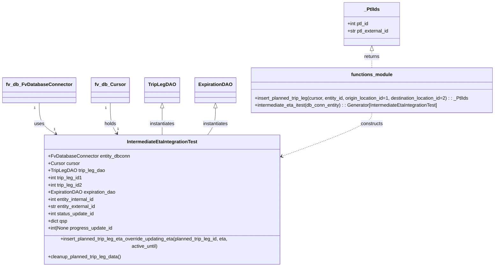

# Diagram: shipment_core/shipment_service/shipment_service/eta/eta_milestone_update/intermediate_eta/conftest.py


> Auto-generated by Obscura crawlers

## Diagram 1



### SVG

<svg id="container" width="1624.6328125" xmlns="http://www.w3.org/2000/svg" class="classDiagram" height="866" viewBox="0 0 1624.6328125 866" role="graphics-document document" aria-roledescription="class"><style>#container{font-family:"trebuchet ms",verdana,arial,sans-serif;font-size:16px;fill:#333;}@keyframes edge-animation-frame{from{stroke-dashoffset:0;}}@keyframes dash{to{stroke-dashoffset:0;}}#container .edge-animation-slow{stroke-dasharray:9,5!important;stroke-dashoffset:900;animation:dash 50s linear infinite;stroke-linecap:round;}#container .edge-animation-fast{stroke-dasharray:9,5!important;stroke-dashoffset:900;animation:dash 20s linear infinite;stroke-linecap:round;}#container .error-icon{fill:#552222;}#container .error-text{fill:#552222;stroke:#552222;}#container .edge-thickness-normal{stroke-width:1px;}#container .edge-thickness-thick{stroke-width:3.5px;}#container .edge-pattern-solid{stroke-dasharray:0;}#container .edge-thickness-invisible{stroke-width:0;fill:none;}#container .edge-pattern-dashed{stroke-dasharray:3;}#container .edge-pattern-dotted{stroke-dasharray:2;}#container .marker{fill:#333333;stroke:#333333;}#container .marker.cross{stroke:#333333;}#container svg{font-family:"trebuchet ms",verdana,arial,sans-serif;font-size:16px;}#container p{margin:0;}#container g.classGroup text{fill:#9370DB;stroke:none;font-family:"trebuchet ms",verdana,arial,sans-serif;font-size:10px;}#container g.classGroup text .title{font-weight:bolder;}#container .nodeLabel,#container .edgeLabel{color:#131300;}#container .edgeLabel .label rect{fill:#ECECFF;}#container .label text{fill:#131300;}#container .labelBkg{background:#ECECFF;}#container .edgeLabel .label span{background:#ECECFF;}#container .classTitle{font-weight:bolder;}#container .node rect,#container .node circle,#container .node ellipse,#container .node polygon,#container .node path{fill:#ECECFF;stroke:#9370DB;stroke-width:1px;}#container .divider{stroke:#9370DB;stroke-width:1;}#container g.clickable{cursor:pointer;}#container g.classGroup rect{fill:#ECECFF;stroke:#9370DB;}#container g.classGroup line{stroke:#9370DB;stroke-width:1;}#container .classLabel .box{stroke:none;stroke-width:0;fill:#ECECFF;opacity:0.5;}#container .classLabel .label{fill:#9370DB;font-size:10px;}#container .relation{stroke:#333333;stroke-width:1;fill:none;}#container .dashed-line{stroke-dasharray:3;}#container .dotted-line{stroke-dasharray:1 2;}#container #compositionStart,#container .composition{fill:#333333!important;stroke:#333333!important;stroke-width:1;}#container #compositionEnd,#container .composition{fill:#333333!important;stroke:#333333!important;stroke-width:1;}#container #dependencyStart,#container .dependency{fill:#333333!important;stroke:#333333!important;stroke-width:1;}#container #dependencyStart,#container .dependency{fill:#333333!important;stroke:#333333!important;stroke-width:1;}#container #extensionStart,#container .extension{fill:transparent!important;stroke:#333333!important;stroke-width:1;}#container #extensionEnd,#container .extension{fill:transparent!important;stroke:#333333!important;stroke-width:1;}#container #aggregationStart,#container .aggregation{fill:transparent!important;stroke:#333333!important;stroke-width:1;}#container #aggregationEnd,#container .aggregation{fill:transparent!important;stroke:#333333!important;stroke-width:1;}#container #lollipopStart,#container .lollipop{fill:#ECECFF!important;stroke:#333333!important;stroke-width:1;}#container #lollipopEnd,#container .lollipop{fill:#ECECFF!important;stroke:#333333!important;stroke-width:1;}#container .edgeTerminals{font-size:11px;line-height:initial;}#container .classTitleText{text-anchor:middle;font-size:18px;fill:#333;}#container .label-icon{display:inline-block;height:1em;overflow:visible;vertical-align:-0.125em;}#container .node .label-icon path{fill:currentColor;stroke:revert;stroke-width:revert;}#container :root{--mermaid-font-family:"trebuchet ms",verdana,arial,sans-serif;}</style><g><defs><marker id="container_class-aggregationStart" class="marker aggregation class" refX="18" refY="7" markerWidth="190" markerHeight="240" orient="auto"><path d="M 18,7 L9,13 L1,7 L9,1 Z"></path></marker></defs><defs><marker id="container_class-aggregationEnd" class="marker aggregation class" refX="1" refY="7" markerWidth="20" markerHeight="28" orient="auto"><path d="M 18,7 L9,13 L1,7 L9,1 Z"></path></marker></defs><defs><marker id="container_class-extensionStart" class="marker extension class" refX="18" refY="7" markerWidth="190" markerHeight="240" orient="auto"><path d="M 1,7 L18,13 V 1 Z"></path></marker></defs><defs><marker id="container_class-extensionEnd" class="marker extension class" refX="1" refY="7" markerWidth="20" markerHeight="28" orient="auto"><path d="M 1,1 V 13 L18,7 Z"></path></marker></defs><defs><marker id="container_class-compositionStart" class="marker composition class" refX="18" refY="7" markerWidth="190" markerHeight="240" orient="auto"><path d="M 18,7 L9,13 L1,7 L9,1 Z"></path></marker></defs><defs><marker id="container_class-compositionEnd" class="marker composition class" refX="1" refY="7" markerWidth="20" markerHeight="28" orient="auto"><path d="M 18,7 L9,13 L1,7 L9,1 Z"></path></marker></defs><defs><marker id="container_class-dependencyStart" class="marker dependency class" refX="6" refY="7" markerWidth="190" markerHeight="240" orient="auto"><path d="M 5,7 L9,13 L1,7 L9,1 Z"></path></marker></defs><defs><marker id="container_class-dependencyEnd" class="marker dependency class" refX="13" refY="7" markerWidth="20" markerHeight="28" orient="auto"><path d="M 18,7 L9,13 L14,7 L9,1 Z"></path></marker></defs><defs><marker id="container_class-lollipopStart" class="marker lollipop class" refX="13" refY="7" markerWidth="190" markerHeight="240" orient="auto"><circle stroke="black" fill="transparent" cx="7" cy="7" r="6"></circle></marker></defs><defs><marker id="container_class-lollipopEnd" class="marker lollipop class" refX="1" refY="7" markerWidth="190" markerHeight="240" orient="auto"><circle stroke="black" fill="transparent" cx="7" cy="7" r="6"></circle></marker></defs><g class="root"><g class="clusters"></g><g class="edgePaths"><path d="M123.594,343L123.594,354.667C123.594,366.333,123.594,389.667,132.715,406.974C141.836,424.281,160.078,435.563,169.199,441.203L178.319,446.844" id="id_fv_db_FvDatabaseConnector_IntermediateEtaIntegrationTest_1" class="edge-thickness-normal edge-pattern-solid relation" style=";;;" data-edge="true" data-et="edge" data-id="id_fv_db_FvDatabaseConnector_IntermediateEtaIntegrationTest_1" data-points="W3sieCI6MTIzLjU5Mzc1LCJ5IjozNDN9LHsieCI6MTIzLjU5Mzc1LCJ5Ijo0MTN9LHsieCI6MTgzLjQyMjQ5MDkyMzIzNjUyLCJ5Ijo0NTB9XQ==" marker-end="url(#container_class-dependencyEnd)"></path><path d="M349.063,343L349.063,354.667C349.063,366.333,349.063,389.667,352.702,406.674C356.341,423.681,363.619,434.361,367.258,439.701L370.897,445.042" id="id_fv_db_Cursor_IntermediateEtaIntegrationTest_2" class="edge-thickness-normal edge-pattern-solid relation" style=";;;" data-edge="true" data-et="edge" data-id="id_fv_db_Cursor_IntermediateEtaIntegrationTest_2" data-points="W3sieCI6MzQ5LjA2MjUsInkiOjM0M30seyJ4IjozNDkuMDYyNSwieSI6NDEzfSx7IngiOjM3NC4yNzU3MDY2OTA4NzE0LCJ5Ijo0NTB9XQ==" marker-end="url(#container_class-dependencyEnd)"></path><path d="M513.289,360.25L513.289,369.042C513.289,377.833,513.289,395.417,513.289,410.375C513.289,425.333,513.289,437.667,513.289,443.833L513.289,450" id="id_TripLegDAO_IntermediateEtaIntegrationTest_3" class="edge-thickness-normal edge-pattern-solid relation" style=";;;" data-edge="true" data-et="edge" data-id="id_TripLegDAO_IntermediateEtaIntegrationTest_3" data-points="W3sieCI6NTEzLjI4OTA2MjUsInkiOjM0M30seyJ4Ijo1MTMuMjg5MDYyNSwieSI6NDEzfSx7IngiOjUxMy4yODkwNjI1LCJ5Ijo0NTB9XQ==" marker-start="url(#container_class-extensionStart)"></path><path d="M682.219,360.25L682.219,369.042C682.219,377.833,682.219,395.417,677.896,410.375C673.574,425.333,664.929,437.667,660.606,443.833L656.283,450" id="id_ExpirationDAO_IntermediateEtaIntegrationTest_4" class="edge-thickness-normal edge-pattern-solid relation" style=";;;" data-edge="true" data-et="edge" data-id="id_ExpirationDAO_IntermediateEtaIntegrationTest_4" data-points="W3sieCI6NjgyLjIxODc1LCJ5IjozNDN9LHsieCI6NjgyLjIxODc1LCJ5Ijo0MTN9LHsieCI6NjU2LjI4MzQ4Njc3Mzg1OSwieSI6NDUwfV0=" marker-start="url(#container_class-extensionStart)"></path><path d="M1206.715,376L1206.715,382.167C1206.715,388.333,1206.715,400.667,1159.126,423.373C1111.536,446.079,1016.358,479.159,968.768,495.698L921.179,512.238" id="id_functions_module_IntermediateEtaIntegrationTest_5" class="edge-thickness-normal edge-pattern-dashed relation" style=";;;" data-edge="true" data-et="edge" data-id="id_functions_module_IntermediateEtaIntegrationTest_5" data-points="W3sieCI6MTIwNi43MTQ4NDM3NSwieSI6Mzc2fSx7IngiOjEyMDYuNzE0ODQzNzUsInkiOjQxM30seyJ4Ijo5MTUuNTExNzE4NzUsInkiOjUxNC4yMDc1OTEzODU2MTM4fV0=" marker-end="url(#container_class-dependencyEnd)"></path><path d="M1206.715,169.25L1206.715,172.542C1206.715,175.833,1206.715,182.417,1206.715,191.875C1206.715,201.333,1206.715,213.667,1206.715,219.833L1206.715,226" id="id__PtlIds_functions_module_6" class="edge-thickness-normal edge-pattern-dashed relation" style=";;;" data-edge="true" data-et="edge" data-id="id__PtlIds_functions_module_6" data-points="W3sieCI6MTIwNi43MTQ4NDM3NSwieSI6MTUyfSx7IngiOjEyMDYuNzE0ODQzNzUsInkiOjE4OX0seyJ4IjoxMjA2LjcxNDg0Mzc1LCJ5IjoyMjZ9XQ==" marker-start="url(#container_class-extensionStart)"></path></g><g class="edgeLabels"><g class="edgeLabel" transform="translate(123.59375, 413)"><g class="label" data-id="id_fv_db_FvDatabaseConnector_IntermediateEtaIntegrationTest_1" transform="translate(-16.4921875, -12)"><foreignObject width="32.984375" height="24"><div xmlns="http://www.w3.org/1999/xhtml" class="labelBkg" style="display: table-cell; white-space: nowrap; line-height: 1.5; max-width: 200px; text-align: center;"><span class="edgeLabel"><p>uses</p></span></div></foreignObject></g></g><g class="edgeLabel" transform="translate(349.0625, 413)"><g class="label" data-id="id_fv_db_Cursor_IntermediateEtaIntegrationTest_2" transform="translate(-20.1875, -12)"><foreignObject width="40.375" height="24"><div xmlns="http://www.w3.org/1999/xhtml" class="labelBkg" style="display: table-cell; white-space: nowrap; line-height: 1.5; max-width: 200px; text-align: center;"><span class="edgeLabel"><p>holds</p></span></div></foreignObject></g></g><g class="edgeLabel" transform="translate(513.2890625, 413)"><g class="label" data-id="id_TripLegDAO_IntermediateEtaIntegrationTest_3" transform="translate(-42.9140625, -12)"><foreignObject width="85.828125" height="24"><div xmlns="http://www.w3.org/1999/xhtml" class="labelBkg" style="display: table-cell; white-space: nowrap; line-height: 1.5; max-width: 200px; text-align: center;"><span class="edgeLabel"><p>instantiates</p></span></div></foreignObject></g></g><g class="edgeLabel" transform="translate(682.21875, 413)"><g class="label" data-id="id_ExpirationDAO_IntermediateEtaIntegrationTest_4" transform="translate(-42.9140625, -12)"><foreignObject width="85.828125" height="24"><div xmlns="http://www.w3.org/1999/xhtml" class="labelBkg" style="display: table-cell; white-space: nowrap; line-height: 1.5; max-width: 200px; text-align: center;"><span class="edgeLabel"><p>instantiates</p></span></div></foreignObject></g></g><g class="edgeLabel" transform="translate(1206.71484375, 413)"><g class="label" data-id="id_functions_module_IntermediateEtaIntegrationTest_5" transform="translate(-37.84375, -12)"><foreignObject width="75.6875" height="24"><div xmlns="http://www.w3.org/1999/xhtml" class="labelBkg" style="display: table-cell; white-space: nowrap; line-height: 1.5; max-width: 200px; text-align: center;"><span class="edgeLabel"><p>constructs</p></span></div></foreignObject></g></g><g class="edgeLabel" transform="translate(1206.71484375, 189)"><g class="label" data-id="id__PtlIds_functions_module_6" transform="translate(-26.265625, -12)"><foreignObject width="52.53125" height="24"><div xmlns="http://www.w3.org/1999/xhtml" class="labelBkg" style="display: table-cell; white-space: nowrap; line-height: 1.5; max-width: 200px; text-align: center;"><span class="edgeLabel"><p>returns</p></span></div></foreignObject></g></g><g class="edgeTerminals" transform="translate(108.59375, 360.5)"><g class="inner" transform="translate(0, 0)"><foreignObject style="width: 9px; height: 12px;"><div xmlns="http://www.w3.org/1999/xhtml" style="display: inline-block; padding-right: 1px; white-space: nowrap;"><span class="edgeLabel">1</span></div></foreignObject></g></g><g class="edgeTerminals" transform="translate(334.0625, 360.5)"><g class="inner" transform="translate(0, 0)"><foreignObject style="width: 9px; height: 12px;"><div xmlns="http://www.w3.org/1999/xhtml" style="display: inline-block; padding-right: 1px; white-space: nowrap;"><span class="edgeLabel">1</span></div></foreignObject></g></g><g class="edgeTerminals" transform="translate(171.42839016399898, 423.03792865700404)"><g class="inner" transform="translate(0, 0)"></g><foreignObject style="width: 9px; height: 12px;"><div xmlns="http://www.w3.org/1999/xhtml" style="display: inline-block; padding-right: 1px; white-space: nowrap;"><span class="edgeLabel">1</span></div></foreignObject></g><g class="edgeTerminals" transform="translate(371.8166649759398, 422.09162770916475)"><g class="inner" transform="translate(0, 0)"></g><foreignObject style="width: 9px; height: 12px;"><div xmlns="http://www.w3.org/1999/xhtml" style="display: inline-block; padding-right: 1px; white-space: nowrap;"><span class="edgeLabel">1</span></div></foreignObject></g></g><g class="nodes"><g class="node default" id="classId-IntermediateEtaIntegrationTest-0" transform="translate(513.2890625, 654)"><g class="basic label-container"><path d="M-402.22265625 -204 L402.22265625 -204 L402.22265625 204 L-402.22265625 204" stroke="none" stroke-width="0" fill="#ECECFF" style=""></path><path d="M-402.22265625 -204 C-118.23650708884946 -204, 165.74964207230107 -204, 402.22265625 -204 M-402.22265625 -204 C-84.75984758232403 -204, 232.70296108535194 -204, 402.22265625 -204 M402.22265625 -204 C402.22265625 -117.21964272443336, 402.22265625 -30.439285448866713, 402.22265625 204 M402.22265625 -204 C402.22265625 -77.86306394714893, 402.22265625 48.27387210570214, 402.22265625 204 M402.22265625 204 C141.8052308488957 204, -118.61219455220862 204, -402.22265625 204 M402.22265625 204 C227.40450384914425 204, 52.5863514482885 204, -402.22265625 204 M-402.22265625 204 C-402.22265625 108.1699004468083, -402.22265625 12.339800893616598, -402.22265625 -204 M-402.22265625 204 C-402.22265625 51.24887518852307, -402.22265625 -101.50224962295385, -402.22265625 -204" stroke="#9370DB" stroke-width="1.3" fill="none" stroke-dasharray="0 0" style=""></path></g><g class="annotation-group text" transform="translate(0, -180)"></g><g class="label-group text" transform="translate(-114.8671875, -180)"><g class="label" style="font-weight: bolder" transform="translate(0,-12)"><foreignObject width="229.734375" height="24"><div xmlns="http://www.w3.org/1999/xhtml" style="display: table-cell; white-space: nowrap; line-height: 1.5; max-width: 276px; text-align: center;"><span class="nodeLabel markdown-node-label" style=""><p>IntermediateEtaIntegrationTest</p></span></div></foreignObject></g></g><g class="members-group text" transform="translate(-390.22265625, -132)"><g class="label" style="" transform="translate(0,-12)"><foreignObject width="272.828125" height="24"><div xmlns="http://www.w3.org/1999/xhtml" style="display: table-cell; white-space: nowrap; line-height: 1.5; max-width: 330px; text-align: center;"><span class="nodeLabel markdown-node-label" style=""><p>+FvDatabaseConnector entity_dbconn</p></span></div></foreignObject></g><g class="label" style="" transform="translate(0,12)"><foreignObject width="104.890625" height="24"><div xmlns="http://www.w3.org/1999/xhtml" style="display: table-cell; white-space: nowrap; line-height: 1.5; max-width: 163px; text-align: center;"><span class="nodeLabel markdown-node-label" style=""><p>+Cursor cursor</p></span></div></foreignObject></g><g class="label" style="" transform="translate(0,36)"><foreignObject width="185.390625" height="24"><div xmlns="http://www.w3.org/1999/xhtml" style="display: table-cell; white-space: nowrap; line-height: 1.5; max-width: 243px; text-align: center;"><span class="nodeLabel markdown-node-label" style=""><p>+TripLegDAO trip_leg_dao</p></span></div></foreignObject></g><g class="label" style="" transform="translate(0,60)"><foreignObject width="116.75" height="24"><div xmlns="http://www.w3.org/1999/xhtml" style="display: table-cell; white-space: nowrap; line-height: 1.5; max-width: 174px; text-align: center;"><span class="nodeLabel markdown-node-label" style=""><p>+int trip_leg_id1</p></span></div></foreignObject></g><g class="label" style="" transform="translate(0,84)"><foreignObject width="117.734375" height="24"><div xmlns="http://www.w3.org/1999/xhtml" style="display: table-cell; white-space: nowrap; line-height: 1.5; max-width: 175px; text-align: center;"><span class="nodeLabel markdown-node-label" style=""><p>+int trip_leg_id2</p></span></div></foreignObject></g><g class="label" style="" transform="translate(0,108)"><foreignObject width="225.421875" height="24"><div xmlns="http://www.w3.org/1999/xhtml" style="display: table-cell; white-space: nowrap; line-height: 1.5; max-width: 283px; text-align: center;"><span class="nodeLabel markdown-node-label" style=""><p>+ExpirationDAO expiration_dao</p></span></div></foreignObject></g><g class="label" style="" transform="translate(0,132)"><foreignObject width="161.015625" height="24"><div xmlns="http://www.w3.org/1999/xhtml" style="display: table-cell; white-space: nowrap; line-height: 1.5; max-width: 218px; text-align: center;"><span class="nodeLabel markdown-node-label" style=""><p>+int entity_internal_id</p></span></div></foreignObject></g><g class="label" style="" transform="translate(0,156)"><foreignObject width="162.90625" height="24"><div xmlns="http://www.w3.org/1999/xhtml" style="display: table-cell; white-space: nowrap; line-height: 1.5; max-width: 220px; text-align: center;"><span class="nodeLabel markdown-node-label" style=""><p>+str entity_external_id</p></span></div></foreignObject></g><g class="label" style="" transform="translate(0,180)"><foreignObject width="157.40625" height="24"><div xmlns="http://www.w3.org/1999/xhtml" style="display: table-cell; white-space: nowrap; line-height: 1.5; max-width: 215px; text-align: center;"><span class="nodeLabel markdown-node-label" style=""><p>+int status_update_id</p></span></div></foreignObject></g><g class="label" style="" transform="translate(0,204)"><foreignObject width="66.28125" height="24"><div xmlns="http://www.w3.org/1999/xhtml" style="display: table-cell; white-space: nowrap; line-height: 1.5; max-width: 124px; text-align: center;"><span class="nodeLabel markdown-node-label" style=""><p>+dict qsp</p></span></div></foreignObject></g><g class="label" style="" transform="translate(0,228)"><foreignObject width="219.875" height="24"><div xmlns="http://www.w3.org/1999/xhtml" style="display: table-cell; white-space: nowrap; line-height: 1.5; max-width: 277px; text-align: center;"><span class="nodeLabel markdown-node-label" style=""><p>+int|None progress_update_id</p></span></div></foreignObject></g></g><g class="methods-group text" transform="translate(-390.22265625, 156)"><g class="label" style="" transform="translate(0,-12)"><foreignObject width="665.578125" height="24"><div xmlns="http://www.w3.org/1999/xhtml" style="display: table-cell; white-space: nowrap; line-height: 1.5; max-width: 723px; text-align: center;"><span class="nodeLabel markdown-node-label" style=""><p>+insert_planned_trip_leg_eta_override_updating_eta(planned_trip_leg_id, eta, active_until)</p></span></div></foreignObject></g><g class="label" style="" transform="translate(0,12)"><foreignObject width="248.09375" height="24"><div xmlns="http://www.w3.org/1999/xhtml" style="display: table-cell; white-space: nowrap; line-height: 1.5; max-width: 305px; text-align: center;"><span class="nodeLabel markdown-node-label" style=""><p>+cleanup_planned_trip_leg_data()</p></span></div></foreignObject></g></g><g class="divider" style=""><path d="M-402.22265625 -156 C-237.52946287833683 -156, -72.83626950667366 -156, 402.22265625 -156 M-402.22265625 -156 C-83.1650514254888 -156, 235.8925533990224 -156, 402.22265625 -156" stroke="#9370DB" stroke-width="1.3" fill="none" stroke-dasharray="0 0" style=""></path></g><g class="divider" style=""><path d="M-402.22265625 132 C-168.94473232687676 132, 64.33319159624648 132, 402.22265625 132 M-402.22265625 132 C-234.56935610834938 132, -66.91605596669876 132, 402.22265625 132" stroke="#9370DB" stroke-width="1.3" fill="none" stroke-dasharray="0 0" style=""></path></g></g><g class="node default" id="classId-_PtlIds-1" transform="translate(1206.71484375, 80)"><g class="basic label-container"><path d="M-95.2734375 -72 L95.2734375 -72 L95.2734375 72 L-95.2734375 72" stroke="none" stroke-width="0" fill="#ECECFF" style=""></path><path d="M-95.2734375 -72 C-32.982200445886015 -72, 29.30903660822797 -72, 95.2734375 -72 M-95.2734375 -72 C-56.33716255727235 -72, -17.4008876145447 -72, 95.2734375 -72 M95.2734375 -72 C95.2734375 -16.75211588795395, 95.2734375 38.4957682240921, 95.2734375 72 M95.2734375 -72 C95.2734375 -31.97888834072669, 95.2734375 8.042223318546618, 95.2734375 72 M95.2734375 72 C24.867851836619394 72, -45.53773382676121 72, -95.2734375 72 M95.2734375 72 C40.56669089530479 72, -14.140055709390424 72, -95.2734375 72 M-95.2734375 72 C-95.2734375 40.4127941256568, -95.2734375 8.825588251313604, -95.2734375 -72 M-95.2734375 72 C-95.2734375 39.78719167714124, -95.2734375 7.574383354282475, -95.2734375 -72" stroke="#9370DB" stroke-width="1.3" fill="none" stroke-dasharray="0 0" style=""></path></g><g class="annotation-group text" transform="translate(0, -48)"></g><g class="label-group text" transform="translate(-25.3125, -48)"><g class="label" style="font-weight: bolder" transform="translate(0,-12)"><foreignObject width="50.625" height="24"><div xmlns="http://www.w3.org/1999/xhtml" style="display: table-cell; white-space: nowrap; line-height: 1.5; max-width: 100px; text-align: center;"><span class="nodeLabel markdown-node-label" style=""><p>_PtlIds</p></span></div></foreignObject></g></g><g class="members-group text" transform="translate(-83.2734375, 0)"><g class="label" style="" transform="translate(0,-12)"><foreignObject width="74.109375" height="24"><div xmlns="http://www.w3.org/1999/xhtml" style="display: table-cell; white-space: nowrap; line-height: 1.5; max-width: 131px; text-align: center;"><span class="nodeLabel markdown-node-label" style=""><p>+int ptl_id</p></span></div></foreignObject></g><g class="label" style="" transform="translate(0,12)"><foreignObject width="141.234375" height="24"><div xmlns="http://www.w3.org/1999/xhtml" style="display: table-cell; white-space: nowrap; line-height: 1.5; max-width: 199px; text-align: center;"><span class="nodeLabel markdown-node-label" style=""><p>+str ptl_external_id</p></span></div></foreignObject></g></g><g class="methods-group text" transform="translate(-83.2734375, 72)"></g><g class="divider" style=""><path d="M-95.2734375 -24 C-20.670565650058904 -24, 53.93230619988219 -24, 95.2734375 -24 M-95.2734375 -24 C-42.47179210941667 -24, 10.329853281166663 -24, 95.2734375 -24" stroke="#9370DB" stroke-width="1.3" fill="none" stroke-dasharray="0 0" style=""></path></g><g class="divider" style=""><path d="M-95.2734375 48 C-31.152634798585623 48, 32.96816790282875 48, 95.2734375 48 M-95.2734375 48 C-39.2991633956788 48, 16.675110708642407 48, 95.2734375 48" stroke="#9370DB" stroke-width="1.3" fill="none" stroke-dasharray="0 0" style=""></path></g></g><g class="node default" id="classId-TripLegDAO-2" transform="translate(513.2890625, 301)"><g class="basic label-container"><path d="M-54.3515625 -42 L54.3515625 -42 L54.3515625 42 L-54.3515625 42" stroke="none" stroke-width="0" fill="#ECECFF" style=""></path><path d="M-54.3515625 -42 C-26.627908175886276 -42, 1.0957461482274482 -42, 54.3515625 -42 M-54.3515625 -42 C-19.69448359898675 -42, 14.9625953020265 -42, 54.3515625 -42 M54.3515625 -42 C54.3515625 -19.68506872337251, 54.3515625 2.6298625532549806, 54.3515625 42 M54.3515625 -42 C54.3515625 -19.38935962842452, 54.3515625 3.221280743150963, 54.3515625 42 M54.3515625 42 C30.69164902838543 42, 7.031735556770862 42, -54.3515625 42 M54.3515625 42 C19.533910471352435 42, -15.28374155729513 42, -54.3515625 42 M-54.3515625 42 C-54.3515625 14.850224991658052, -54.3515625 -12.299550016683895, -54.3515625 -42 M-54.3515625 42 C-54.3515625 12.697240532643221, -54.3515625 -16.605518934713558, -54.3515625 -42" stroke="#9370DB" stroke-width="1.3" fill="none" stroke-dasharray="0 0" style=""></path></g><g class="annotation-group text" transform="translate(0, -18)"></g><g class="label-group text" transform="translate(-42.3515625, -18)"><g class="label" style="font-weight: bolder" transform="translate(0,-12)"><foreignObject width="84.703125" height="24"><div xmlns="http://www.w3.org/1999/xhtml" style="display: table-cell; white-space: nowrap; line-height: 1.5; max-width: 133px; text-align: center;"><span class="nodeLabel markdown-node-label" style=""><p>TripLegDAO</p></span></div></foreignObject></g></g><g class="members-group text" transform="translate(-42.3515625, 30)"></g><g class="methods-group text" transform="translate(-42.3515625, 60)"></g><g class="divider" style=""><path d="M-54.3515625 6 C-27.50006206307197 6, -0.6485616261439375 6, 54.3515625 6 M-54.3515625 6 C-11.605488661600205 6, 31.14058517679959 6, 54.3515625 6" stroke="#9370DB" stroke-width="1.3" fill="none" stroke-dasharray="0 0" style=""></path></g><g class="divider" style=""><path d="M-54.3515625 24 C-28.3962571322615 24, -2.4409517645229997 24, 54.3515625 24 M-54.3515625 24 C-29.49770753695828 24, -4.643852573916561 24, 54.3515625 24" stroke="#9370DB" stroke-width="1.3" fill="none" stroke-dasharray="0 0" style=""></path></g></g><g class="node default" id="classId-ExpirationDAO-3" transform="translate(682.21875, 301)"><g class="basic label-container"><path d="M-64.578125 -42 L64.578125 -42 L64.578125 42 L-64.578125 42" stroke="none" stroke-width="0" fill="#ECECFF" style=""></path><path d="M-64.578125 -42 C-38.38157082402363 -42, -12.185016648047267 -42, 64.578125 -42 M-64.578125 -42 C-21.90792229771938 -42, 20.76228040456124 -42, 64.578125 -42 M64.578125 -42 C64.578125 -10.547930804628248, 64.578125 20.904138390743505, 64.578125 42 M64.578125 -42 C64.578125 -12.547696044175503, 64.578125 16.904607911648995, 64.578125 42 M64.578125 42 C16.77370296345518 42, -31.030719073089642 42, -64.578125 42 M64.578125 42 C23.05815116858873 42, -18.46182266282254 42, -64.578125 42 M-64.578125 42 C-64.578125 9.591413776744261, -64.578125 -22.817172446511478, -64.578125 -42 M-64.578125 42 C-64.578125 25.069208960922836, -64.578125 8.138417921845672, -64.578125 -42" stroke="#9370DB" stroke-width="1.3" fill="none" stroke-dasharray="0 0" style=""></path></g><g class="annotation-group text" transform="translate(0, -18)"></g><g class="label-group text" transform="translate(-52.578125, -18)"><g class="label" style="font-weight: bolder" transform="translate(0,-12)"><foreignObject width="105.15625" height="24"><div xmlns="http://www.w3.org/1999/xhtml" style="display: table-cell; white-space: nowrap; line-height: 1.5; max-width: 154px; text-align: center;"><span class="nodeLabel markdown-node-label" style=""><p>ExpirationDAO</p></span></div></foreignObject></g></g><g class="members-group text" transform="translate(-52.578125, 30)"></g><g class="methods-group text" transform="translate(-52.578125, 60)"></g><g class="divider" style=""><path d="M-64.578125 6 C-37.57227517090112 6, -10.566425341802237 6, 64.578125 6 M-64.578125 6 C-15.196289468304222 6, 34.185546063391556 6, 64.578125 6" stroke="#9370DB" stroke-width="1.3" fill="none" stroke-dasharray="0 0" style=""></path></g><g class="divider" style=""><path d="M-64.578125 24 C-22.20119073221845 24, 20.1757435355631 24, 64.578125 24 M-64.578125 24 C-14.312381460159934 24, 35.95336207968013 24, 64.578125 24" stroke="#9370DB" stroke-width="1.3" fill="none" stroke-dasharray="0 0" style=""></path></g></g><g class="node default" id="classId-fv_db_FvDatabaseConnector-4" transform="translate(123.59375, 301)"><g class="basic label-container"><path d="M-115.59375 -42 L115.59375 -42 L115.59375 42 L-115.59375 42" stroke="none" stroke-width="0" fill="#ECECFF" style=""></path><path d="M-115.59375 -42 C-49.73540313373151 -42, 16.12294373253698 -42, 115.59375 -42 M-115.59375 -42 C-67.56396500743665 -42, -19.534180014873286 -42, 115.59375 -42 M115.59375 -42 C115.59375 -8.400309793699542, 115.59375 25.199380412600917, 115.59375 42 M115.59375 -42 C115.59375 -15.069857190824436, 115.59375 11.860285618351128, 115.59375 42 M115.59375 42 C34.44425125147632 42, -46.70524749704737 42, -115.59375 42 M115.59375 42 C57.8950855143113 42, 0.19642102862259492 42, -115.59375 42 M-115.59375 42 C-115.59375 22.23930937942586, -115.59375 2.4786187588517166, -115.59375 -42 M-115.59375 42 C-115.59375 10.165330416089557, -115.59375 -21.669339167820887, -115.59375 -42" stroke="#9370DB" stroke-width="1.3" fill="none" stroke-dasharray="0 0" style=""></path></g><g class="annotation-group text" transform="translate(0, -18)"></g><g class="label-group text" transform="translate(-103.59375, -18)"><g class="label" style="font-weight: bolder" transform="translate(0,-12)"><foreignObject width="207.1875" height="24"><div xmlns="http://www.w3.org/1999/xhtml" style="display: table-cell; white-space: nowrap; line-height: 1.5; max-width: 255px; text-align: center;"><span class="nodeLabel markdown-node-label" style=""><p>fv_db_FvDatabaseConnector</p></span></div></foreignObject></g></g><g class="members-group text" transform="translate(-103.59375, 30)"></g><g class="methods-group text" transform="translate(-103.59375, 60)"></g><g class="divider" style=""><path d="M-115.59375 6 C-29.104471136423854 6, 57.38480772715229 6, 115.59375 6 M-115.59375 6 C-25.137468228038315 6, 65.31881354392337 6, 115.59375 6" stroke="#9370DB" stroke-width="1.3" fill="none" stroke-dasharray="0 0" style=""></path></g><g class="divider" style=""><path d="M-115.59375 24 C-53.66736003191228 24, 8.259029936175438 24, 115.59375 24 M-115.59375 24 C-53.6929637823783 24, 8.2078224352434 24, 115.59375 24" stroke="#9370DB" stroke-width="1.3" fill="none" stroke-dasharray="0 0" style=""></path></g></g><g class="node default" id="classId-fv_db_Cursor-5" transform="translate(349.0625, 301)"><g class="basic label-container"><path d="M-59.875 -42 L59.875 -42 L59.875 42 L-59.875 42" stroke="none" stroke-width="0" fill="#ECECFF" style=""></path><path d="M-59.875 -42 C-16.827752436186394 -42, 26.219495127627212 -42, 59.875 -42 M-59.875 -42 C-29.257316540088656 -42, 1.3603669198226882 -42, 59.875 -42 M59.875 -42 C59.875 -20.719581050983468, 59.875 0.5608378980330642, 59.875 42 M59.875 -42 C59.875 -18.210975489856, 59.875 5.578049020287999, 59.875 42 M59.875 42 C33.237035927512046 42, 6.599071855024093 42, -59.875 42 M59.875 42 C13.276304813597108 42, -33.322390372805785 42, -59.875 42 M-59.875 42 C-59.875 23.300865572912787, -59.875 4.601731145825575, -59.875 -42 M-59.875 42 C-59.875 17.354906389624812, -59.875 -7.290187220750376, -59.875 -42" stroke="#9370DB" stroke-width="1.3" fill="none" stroke-dasharray="0 0" style=""></path></g><g class="annotation-group text" transform="translate(0, -18)"></g><g class="label-group text" transform="translate(-47.875, -18)"><g class="label" style="font-weight: bolder" transform="translate(0,-12)"><foreignObject width="95.75" height="24"><div xmlns="http://www.w3.org/1999/xhtml" style="display: table-cell; white-space: nowrap; line-height: 1.5; max-width: 145px; text-align: center;"><span class="nodeLabel markdown-node-label" style=""><p>fv_db_Cursor</p></span></div></foreignObject></g></g><g class="members-group text" transform="translate(-47.875, 30)"></g><g class="methods-group text" transform="translate(-47.875, 60)"></g><g class="divider" style=""><path d="M-59.875 6 C-26.660894324245618 6, 6.553211351508764 6, 59.875 6 M-59.875 6 C-25.78328805451303 6, 8.308423890973941 6, 59.875 6" stroke="#9370DB" stroke-width="1.3" fill="none" stroke-dasharray="0 0" style=""></path></g><g class="divider" style=""><path d="M-59.875 24 C-20.077216853395427 24, 19.720566293209146 24, 59.875 24 M-59.875 24 C-24.463929161174967 24, 10.947141677650066 24, 59.875 24" stroke="#9370DB" stroke-width="1.3" fill="none" stroke-dasharray="0 0" style=""></path></g></g><g class="node default" id="classId-functions_module-6" transform="translate(1206.71484375, 301)"><g class="basic label-container"><path d="M-409.91796875 -75 L409.91796875 -75 L409.91796875 75 L-409.91796875 75" stroke="none" stroke-width="0" fill="#ECECFF" style=""></path><path d="M-409.91796875 -75 C-90.51543964247065 -75, 228.8870894650587 -75, 409.91796875 -75 M-409.91796875 -75 C-135.1140453138309 -75, 139.6898781223382 -75, 409.91796875 -75 M409.91796875 -75 C409.91796875 -42.024731480016534, 409.91796875 -9.049462960033068, 409.91796875 75 M409.91796875 -75 C409.91796875 -36.74396399252307, 409.91796875 1.5120720149538585, 409.91796875 75 M409.91796875 75 C221.67997090489274 75, 33.44197305978548 75, -409.91796875 75 M409.91796875 75 C234.77837980168468 75, 59.63879085336936 75, -409.91796875 75 M-409.91796875 75 C-409.91796875 37.47918922917767, -409.91796875 -0.04162154164465903, -409.91796875 -75 M-409.91796875 75 C-409.91796875 29.033062860106412, -409.91796875 -16.933874279787176, -409.91796875 -75" stroke="#9370DB" stroke-width="1.3" fill="none" stroke-dasharray="0 0" style=""></path></g><g class="annotation-group text" transform="translate(0, -51)"></g><g class="label-group text" transform="translate(-65.9296875, -51)"><g class="label" style="font-weight: bolder" transform="translate(0,-12)"><foreignObject width="131.859375" height="24"><div xmlns="http://www.w3.org/1999/xhtml" style="display: table-cell; white-space: nowrap; line-height: 1.5; max-width: 181px; text-align: center;"><span class="nodeLabel markdown-node-label" style=""><p>functions_module</p></span></div></foreignObject></g></g><g class="members-group text" transform="translate(-397.91796875, -3)"></g><g class="methods-group text" transform="translate(-397.91796875, 27)"><g class="label" style="" transform="translate(0,-12)"><foreignObject width="729.90625" height="24"><div xmlns="http://www.w3.org/1999/xhtml" style="display: table-cell; white-space: nowrap; line-height: 1.5; max-width: 787px; text-align: center;"><span class="nodeLabel markdown-node-label" style=""><p>+insert_planned_trip_leg(cursor, entity_id, origin_location_id=1, destination_location_id=2) : : _PtlIds</p></span></div></foreignObject></g><g class="label" style="" transform="translate(0,12)"><foreignObject width="624.59375" height="24"><div xmlns="http://www.w3.org/1999/xhtml" style="display: table-cell; white-space: nowrap; line-height: 1.5; max-width: 682px; text-align: center;"><span class="nodeLabel markdown-node-label" style=""><p>+intermediate_eta_itest(db_conn_entity) : : Generator[IntermediateEtaIntegrationTest]</p></span></div></foreignObject></g></g><g class="divider" style=""><path d="M-409.91796875 -27 C-98.17547743769126 -27, 213.5670138746175 -27, 409.91796875 -27 M-409.91796875 -27 C-138.74633593540813 -27, 132.42529687918375 -27, 409.91796875 -27" stroke="#9370DB" stroke-width="1.3" fill="none" stroke-dasharray="0 0" style=""></path></g><g class="divider" style=""><path d="M-409.91796875 -3 C-173.81188407547887 -3, 62.294200599042256 -3, 409.91796875 -3 M-409.91796875 -3 C-118.31275533733896 -3, 173.2924580753221 -3, 409.91796875 -3" stroke="#9370DB" stroke-width="1.3" fill="none" stroke-dasharray="0 0" style=""></path></g></g></g></g></g></svg>

## Diagram 2

```mermaid
graph TD
    A[db_conn_entity.get_cursor()] --> B[TripLegDAO(db_conn_entity)]
    A --> C[ExpirationDAO(db_conn_entity)]
    A --> D[generate_test_vin(wmi="AAA")]
    D --> E[INSERT INTO entity (external_id...) -> active_entity]
    E --> F[entity_internal_id := cursor.fetchone().id]
    F --> G[insert_planned_trip_leg(ptl1) -> INSERT planned_trip_stop/leg/entity_planned_trip_leg]
    F --> H[insert_planned_trip_leg(ptl2) -> INSERT planned_trip_stop/leg/entity_planned_trip_leg]
    G --> I[qsp = intermediate_eta_qsp() | {... "trip_leg_ids": [ptl1, "fvGenerated", ptl2] }]
    H --> I
    I --> J[INSERT INTO status_update(... event_ts = now -1 day) RETURNING id]
    J --> K[UPDATE entity SET last_status_update = json.dumps(su)]
    K --> L[yield IntermediateEtaIntegrationTest(...)]
    L --> M[on teardown -> cleanup_planned_trip_leg_data()]
    M --> N[DELETE FROM entity; DELETE FROM active_entity]
```

> SVG rendering failed for this diagram.
