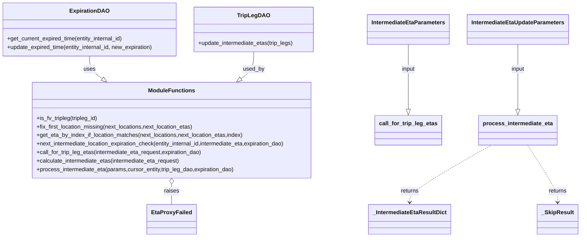
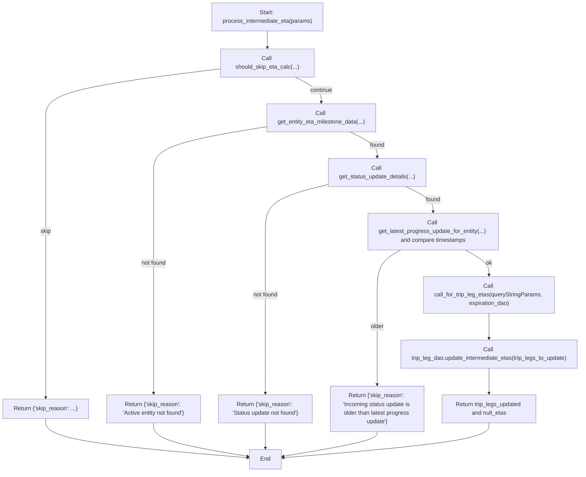

# Diagram: shipment_core/shipment_service/shipment_service/eta/eta_milestone_update/intermediate_eta/intermediate_eta.py

> Auto-generated by Obscura crawlers

## Diagram 1

### SVG

<svg id="container" width="1636.302734375" xmlns="http://www.w3.org/2000/svg" class="classDiagram" height="668" viewBox="0 0 1636.302734375 668" role="graphics-document document" aria-roledescription="class"><g><defs><marker id="container_class-aggregationStart" class="marker aggregation class" refX="18" refY="7" markerWidth="190" markerHeight="240" orient="auto"><path d="M 18,7 L9,13 L1,7 L9,1 Z"></path></marker></defs><defs><marker id="container_class-aggregationEnd" class="marker aggregation class" refX="1" refY="7" markerWidth="20" markerHeight="28" orient="auto"><path d="M 18,7 L9,13 L1,7 L9,1 Z"></path></marker></defs><defs><marker id="container_class-extensionStart" class="marker extension class" refX="18" refY="7" markerWidth="190" markerHeight="240" orient="auto"><path d="M 1,7 L18,13 V 1 Z"></path></marker></defs><defs><marker id="container_class-extensionEnd" class="marker extension class" refX="1" refY="7" markerWidth="20" markerHeight="28" orient="auto"><path d="M 1,1 V 13 L18,7 Z"></path></marker></defs><defs><marker id="container_class-compositionStart" class="marker composition class" refX="18" refY="7" markerWidth="190" markerHeight="240" orient="auto"><path d="M 18,7 L9,13 L1,7 L9,1 Z"></path></marker></defs><defs><marker id="container_class-compositionEnd" class="marker composition class" refX="1" refY="7" markerWidth="20" markerHeight="28" orient="auto"><path d="M 18,7 L9,13 L1,7 L9,1 Z"></path></marker></defs><defs><marker id="container_class-dependencyStart" class="marker dependency class" refX="6" refY="7" markerWidth="190" markerHeight="240" orient="auto"><path d="M 5,7 L9,13 L1,7 L9,1 Z"></path></marker></defs><defs><marker id="container_class-dependencyEnd" class="marker dependency class" refX="13" refY="7" markerWidth="20" markerHeight="28" orient="auto"><path d="M 18,7 L9,13 L14,7 L9,1 Z"></path></marker></defs><defs><marker id="container_class-lollipopStart" class="marker lollipop class" refX="13" refY="7" markerWidth="190" markerHeight="240" orient="auto"><circle stroke="black" fill="transparent" cx="7" cy="7" r="6"></circle></marker></defs><defs><marker id="container_class-lollipopEnd" class="marker lollipop class" refX="1" refY="7" markerWidth="190" markerHeight="240" orient="auto"><circle stroke="black" fill="transparent" cx="7" cy="7" r="6"></circle></marker></defs><g class="root"><g class="clusters"></g><g class="edgePaths"><path d="M256.57,158L256.57,164.167C256.57,170.333,256.57,182.667,262.642,193.297C268.714,203.928,280.859,212.855,286.931,217.319L293.003,221.783" id="id_ExpirationDAO_ModuleFunctions_1" class="edge-thickness-normal edge-pattern-solid relation" style=";;;" data-edge="true" data-et="edge" data-id="id_ExpirationDAO_ModuleFunctions_1" data-points="W3sieCI6MjU2LjU3MDMxMjUsInkiOjE1OH0seyJ4IjoyNTYuNTcwMzEyNSwieSI6MTk1fSx7IngiOjMwNi45MDEyMTk1Njc1ODcyLCJ5IjoyMzJ9XQ==" marker-end="url(#container_class-extensionEnd)"></path><path d="M724.512,146L724.512,154.167C724.512,162.333,724.512,178.667,718.44,191.297C712.368,203.928,700.223,212.855,694.151,217.319L688.079,221.783" id="id_TripLegDAO_ModuleFunctions_2" class="edge-thickness-normal edge-pattern-solid relation" style=";;;" data-edge="true" data-et="edge" data-id="id_TripLegDAO_ModuleFunctions_2" data-points="W3sieCI6NzI0LjUxMTcxODc1LCJ5IjoxNDZ9LHsieCI6NzI0LjUxMTcxODc1LCJ5IjoxOTV9LHsieCI6Njc0LjE4MDgxMTY4MjQxMjgsInkiOjIzMn1d" marker-end="url(#container_class-extensionEnd)"></path><path d="M1162.635,125L1162.635,136.667C1162.635,148.333,1162.635,171.667,1162.635,202.125C1162.635,232.583,1162.635,270.167,1162.635,288.958L1162.635,307.75" id="id_IntermediateEtaParameters_call_for_trip_leg_etas_3" class="edge-thickness-normal edge-pattern-solid relation" style=";;;" data-edge="true" data-et="edge" data-id="id_IntermediateEtaParameters_call_for_trip_leg_etas_3" data-points="W3sieCI6MTE2Mi42MzQ3NjU2MjUsInkiOjEyNX0seyJ4IjoxMTYyLjYzNDc2NTYyNSwieSI6MTk1fSx7IngiOjExNjIuNjM0NzY1NjI1LCJ5IjozMjV9XQ==" marker-end="url(#container_class-extensionEnd)"></path><path d="M1464.244,125L1464.244,136.667C1464.244,148.333,1464.244,171.667,1464.244,202.125C1464.244,232.583,1464.244,270.167,1464.244,288.958L1464.244,307.75" id="id_IntermediateEtaUpdateParameters_process_intermediate_eta_4" class="edge-thickness-normal edge-pattern-solid relation" style=";;;" data-edge="true" data-et="edge" data-id="id_IntermediateEtaUpdateParameters_process_intermediate_eta_4" data-points="W3sieCI6MTQ2NC4yNDQxNDA2MjUsInkiOjEyNX0seyJ4IjoxNDY0LjI0NDE0MDYyNSwieSI6MTk1fSx7IngiOjE0NjQuMjQ0MTQwNjI1LCJ5IjozMjV9XQ==" marker-end="url(#container_class-extensionEnd)"></path><path d="M490.541,519.25L490.541,522.542C490.541,525.833,490.541,532.417,490.541,541.875C490.541,551.333,490.541,563.667,490.541,569.833L490.541,576" id="id_ModuleFunctions_EtaProxyFailed_5" class="edge-thickness-normal edge-pattern-solid relation" style=";;;" data-edge="true" data-et="edge" data-id="id_ModuleFunctions_EtaProxyFailed_5" data-points="W3sieCI6NDkwLjU0MTAxNTYyNSwieSI6NTAyfSx7IngiOjQ5MC41NDEwMTU2MjUsInkiOjUzOX0seyJ4Ijo0OTAuNTQxMDE1NjI1LCJ5Ijo1NzZ9XQ==" marker-start="url(#container_class-aggregationStart)"></path><path d="M1388.809,409L1349.894,430.667C1310.979,452.333,1233.148,495.667,1194.233,522.5C1155.318,549.333,1155.318,559.667,1155.318,564.833L1155.318,570" id="id_process_intermediate_eta__IntermediateEtaResultDict_6" class="edge-thickness-normal edge-pattern-dashed relation" style=";;;" data-edge="true" data-et="edge" data-id="id_process_intermediate_eta__IntermediateEtaResultDict_6" data-points="W3sieCI6MTM4OC44MDg3NzU0MzYwNDY1LCJ5Ijo0MDl9LHsieCI6MTE1NS4zMTgzNTkzNzUsInkiOjUzOX0seyJ4IjoxMTU1LjMxODM1OTM3NSwieSI6NTc2fV0=" marker-end="url(#container_class-dependencyEnd)"></path><path d="M1490.835,409L1504.552,430.667C1518.269,452.333,1545.704,495.667,1559.421,522.5C1573.139,549.333,1573.139,559.667,1573.139,564.833L1573.139,570" id="id_process_intermediate_eta__SkipResult_7" class="edge-thickness-normal edge-pattern-dashed relation" style=";;;" data-edge="true" data-et="edge" data-id="id_process_intermediate_eta__SkipResult_7" data-points="W3sieCI6MTQ5MC44MzQ2NjU2OTc2NzQ0LCJ5Ijo0MDl9LHsieCI6MTU3My4xMzg2NzE4NzUsInkiOjUzOX0seyJ4IjoxNTczLjEzODY3MTg3NSwieSI6NTc2fV0=" marker-end="url(#container_class-dependencyEnd)"></path></g><g class="edgeLabels"><g class="edgeLabel" transform="translate(256.5703125, 195)"><g class="label" data-id="id_ExpirationDAO_ModuleFunctions_1" transform="translate(-16.4921875, -12)"><foreignObject width="32.984375" height="24">

uses

</foreignObject></g></g><g class="edgeLabel" transform="translate(724.51171875, 195)"><g class="label" data-id="id_TripLegDAO_ModuleFunctions_2" transform="translate(-30.359375, -12)"><foreignObject width="60.71875" height="24">

used_by

</foreignObject></g></g><g class="edgeLabel" transform="translate(1162.634765625, 195)"><g class="label" data-id="id_IntermediateEtaParameters_call_for_trip_leg_etas_3" transform="translate(-19.2421875, -12)"><foreignObject width="38.484375" height="24">

input

</foreignObject></g></g><g class="edgeLabel" transform="translate(1464.244140625, 195)"><g class="label" data-id="id_IntermediateEtaUpdateParameters_process_intermediate_eta_4" transform="translate(-19.2421875, -12)"><foreignObject width="38.484375" height="24">

input

</foreignObject></g></g><g class="edgeLabel" transform="translate(490.541015625, 539)"><g class="label" data-id="id_ModuleFunctions_EtaProxyFailed_5" transform="translate(-21.25, -12)"><foreignObject width="42.5" height="24">

raises

</foreignObject></g></g><g class="edgeLabel" transform="translate(1155.318359375, 539)"><g class="label" data-id="id_process_intermediate_eta__IntermediateEtaResultDict_6" transform="translate(-26.265625, -12)"><foreignObject width="52.53125" height="24">

returns

</foreignObject></g></g><g class="edgeLabel" transform="translate(1573.138671875, 539)"><g class="label" data-id="id_process_intermediate_eta__SkipResult_7" transform="translate(-26.265625, -12)"><foreignObject width="52.53125" height="24">

returns

</foreignObject></g></g></g><g class="nodes"><g class="node default" id="classId-ExpirationDAO-0" transform="translate(256.5703125, 83)"><g class="basic label-container"><path d="M-248.5703125 -75 L248.5703125 -75 L248.5703125 75 L-248.5703125 75" stroke="none" stroke-width="0" fill="#ECECFF" style=""></path><path d="M-248.5703125 -75 C-119.22918801315669 -75, 10.111936473686626 -75, 248.5703125 -75 M-248.5703125 -75 C-57.989217222868206 -75, 132.5918780542636 -75, 248.5703125 -75 M248.5703125 -75 C248.5703125 -29.008340333678646, 248.5703125 16.983319332642708, 248.5703125 75 M248.5703125 -75 C248.5703125 -21.798336576012275, 248.5703125 31.40332684797545, 248.5703125 75 M248.5703125 75 C83.79761302272937 75, -80.97508645454127 75, -248.5703125 75 M248.5703125 75 C86.56301783717618 75, -75.44427682564765 75, -248.5703125 75 M-248.5703125 75 C-248.5703125 38.05187248788734, -248.5703125 1.1037449757746742, -248.5703125 -75 M-248.5703125 75 C-248.5703125 32.636366503455484, -248.5703125 -9.727266993089032, -248.5703125 -75" stroke="#9370DB" stroke-width="1.3" fill="none" stroke-dasharray="0 0" style=""></path></g><g class="annotation-group text" transform="translate(0, -51)"></g><g class="label-group text" transform="translate(-52.578125, -51)"><g class="label" style="font-weight: bolder" transform="translate(0,-12)"><foreignObject width="105.15625" height="24">

ExpirationDAO

</foreignObject></g></g><g class="members-group text" transform="translate(-236.5703125, -3)"></g><g class="methods-group text" transform="translate(-236.5703125, 27)"><g class="label" style="" transform="translate(0,-12)"><foreignObject width="333.640625" height="24">

+get_current_expired_time(entity_internal_id)

</foreignObject></g><g class="label" style="" transform="translate(0,12)"><foreignObject width="420.5625" height="24">

+update_expired_time(entity_internal_id, new_expiration)

</foreignObject></g></g><g class="divider" style=""><path d="M-248.5703125 -27 C-57.76659457647662 -27, 133.03712334704676 -27, 248.5703125 -27 M-248.5703125 -27 C-57.956755815353716 -27, 132.65680086929257 -27, 248.5703125 -27" stroke="#9370DB" stroke-width="1.3" fill="none" stroke-dasharray="0 0" style=""></path></g><g class="divider" style=""><path d="M-248.5703125 -3 C-56.93793668050574 -3, 134.6944391389885 -3, 248.5703125 -3 M-248.5703125 -3 C-92.8838409760188 -3, 62.802630547962394 -3, 248.5703125 -3" stroke="#9370DB" stroke-width="1.3" fill="none" stroke-dasharray="0 0" style=""></path></g></g><g class="node default" id="classId-TripLegDAO-1" transform="translate(724.51171875, 83)"><g class="basic label-container"><path d="M-169.37109375 -63 L169.37109375 -63 L169.37109375 63 L-169.37109375 63" stroke="none" stroke-width="0" fill="#ECECFF" style=""></path><path d="M-169.37109375 -63 C-82.49418081497832 -63, 4.382732120043357 -63, 169.37109375 -63 M-169.37109375 -63 C-85.0682422567053 -63, -0.7653907634106076 -63, 169.37109375 -63 M169.37109375 -63 C169.37109375 -16.645502682510035, 169.37109375 29.70899463497993, 169.37109375 63 M169.37109375 -63 C169.37109375 -32.354614954232076, 169.37109375 -1.7092299084641525, 169.37109375 63 M169.37109375 63 C98.67096634435099 63, 27.970838938701974 63, -169.37109375 63 M169.37109375 63 C71.75788857718692 63, -25.855316595626164 63, -169.37109375 63 M-169.37109375 63 C-169.37109375 33.84158650459807, -169.37109375 4.683173009196146, -169.37109375 -63 M-169.37109375 63 C-169.37109375 28.469555186743982, -169.37109375 -6.060889626512036, -169.37109375 -63" stroke="#9370DB" stroke-width="1.3" fill="none" stroke-dasharray="0 0" style=""></path></g><g class="annotation-group text" transform="translate(0, -39)"></g><g class="label-group text" transform="translate(-42.3515625, -39)"><g class="label" style="font-weight: bolder" transform="translate(0,-12)"><foreignObject width="84.703125" height="24">

TripLegDAO

</foreignObject></g></g><g class="members-group text" transform="translate(-157.37109375, 9)"></g><g class="methods-group text" transform="translate(-157.37109375, 39)"><g class="label" style="" transform="translate(0,-12)"><foreignObject width="272.390625" height="24">

+update_intermediate_etas(trip_legs)

</foreignObject></g></g><g class="divider" style=""><path d="M-169.37109375 -15 C-100.92518309829637 -15, -32.479272446592745 -15, 169.37109375 -15 M-169.37109375 -15 C-75.09717799313475 -15, 19.1767377637305 -15, 169.37109375 -15" stroke="#9370DB" stroke-width="1.3" fill="none" stroke-dasharray="0 0" style=""></path></g><g class="divider" style=""><path d="M-169.37109375 9 C-38.50756110226132 9, 92.35597154547736 9, 169.37109375 9 M-169.37109375 9 C-72.63837666957431 9, 24.094340410851373 9, 169.37109375 9" stroke="#9370DB" stroke-width="1.3" fill="none" stroke-dasharray="0 0" style=""></path></g></g><g class="node default" id="classId-IntermediateEtaParameters-2" transform="translate(1162.634765625, 83)"><g class="basic label-container"><path d="M-112.5390625 -42 L112.5390625 -42 L112.5390625 42 L-112.5390625 42" stroke="none" stroke-width="0" fill="#ECECFF" style=""></path><path d="M-112.5390625 -42 C-56.80421807208313 -42, -1.0693736441662622 -42, 112.5390625 -42 M-112.5390625 -42 C-51.84016436015775 -42, 8.8587337796845 -42, 112.5390625 -42 M112.5390625 -42 C112.5390625 -21.790796019984874, 112.5390625 -1.581592039969749, 112.5390625 42 M112.5390625 -42 C112.5390625 -9.349338534049537, 112.5390625 23.301322931900927, 112.5390625 42 M112.5390625 42 C46.24057396313833 42, -20.057914573723338 42, -112.5390625 42 M112.5390625 42 C50.02557007012302 42, -12.487922359753966 42, -112.5390625 42 M-112.5390625 42 C-112.5390625 11.816376547062273, -112.5390625 -18.367246905875454, -112.5390625 -42 M-112.5390625 42 C-112.5390625 19.938327424188007, -112.5390625 -2.1233451516239867, -112.5390625 -42" stroke="#9370DB" stroke-width="1.3" fill="none" stroke-dasharray="0 0" style=""></path></g><g class="annotation-group text" transform="translate(0, -18)"></g><g class="label-group text" transform="translate(-100.5390625, -18)"><g class="label" style="font-weight: bolder" transform="translate(0,-12)"><foreignObject width="201.078125" height="24">

IntermediateEtaParameters

</foreignObject></g></g><g class="members-group text" transform="translate(-100.5390625, 30)"></g><g class="methods-group text" transform="translate(-100.5390625, 60)"></g><g class="divider" style=""><path d="M-112.5390625 6 C-24.89847026993145 6, 62.7421219601371 6, 112.5390625 6 M-112.5390625 6 C-63.475711634017784 6, -14.412360768035569 6, 112.5390625 6" stroke="#9370DB" stroke-width="1.3" fill="none" stroke-dasharray="0 0" style=""></path></g><g class="divider" style=""><path d="M-112.5390625 24 C-54.33368219381475 24, 3.8716981123704954 24, 112.5390625 24 M-112.5390625 24 C-23.636777590160037 24, 65.26550731967993 24, 112.5390625 24" stroke="#9370DB" stroke-width="1.3" fill="none" stroke-dasharray="0 0" style=""></path></g></g><g class="node default" id="classId-IntermediateEtaUpdateParameters-3" transform="translate(1464.244140625, 83)"><g class="basic label-container"><path d="M-139.0703125 -42 L139.0703125 -42 L139.0703125 42 L-139.0703125 42" stroke="none" stroke-width="0" fill="#ECECFF" style=""></path><path d="M-139.0703125 -42 C-48.66628933638299 -42, 41.737733827234024 -42, 139.0703125 -42 M-139.0703125 -42 C-63.07657158280993 -42, 12.917169334380134 -42, 139.0703125 -42 M139.0703125 -42 C139.0703125 -8.434425429570716, 139.0703125 25.131149140858568, 139.0703125 42 M139.0703125 -42 C139.0703125 -8.47102092265537, 139.0703125 25.05795815468926, 139.0703125 42 M139.0703125 42 C58.48870429063855 42, -22.092903918722897 42, -139.0703125 42 M139.0703125 42 C55.312954750108034 42, -28.444402999783932 42, -139.0703125 42 M-139.0703125 42 C-139.0703125 24.965193383391462, -139.0703125 7.930386766782924, -139.0703125 -42 M-139.0703125 42 C-139.0703125 19.7239698741755, -139.0703125 -2.552060251649003, -139.0703125 -42" stroke="#9370DB" stroke-width="1.3" fill="none" stroke-dasharray="0 0" style=""></path></g><g class="annotation-group text" transform="translate(0, -18)"></g><g class="label-group text" transform="translate(-127.0703125, -18)"><g class="label" style="font-weight: bolder" transform="translate(0,-12)"><foreignObject width="254.140625" height="24">

IntermediateEtaUpdateParameters

</foreignObject></g></g><g class="members-group text" transform="translate(-127.0703125, 30)"></g><g class="methods-group text" transform="translate(-127.0703125, 60)"></g><g class="divider" style=""><path d="M-139.0703125 6 C-71.50326517675676 6, -3.9362178535135115 6, 139.0703125 6 M-139.0703125 6 C-38.773632442332385 6, 61.52304761533523 6, 139.0703125 6" stroke="#9370DB" stroke-width="1.3" fill="none" stroke-dasharray="0 0" style=""></path></g><g class="divider" style=""><path d="M-139.0703125 24 C-31.56802255787251 24, 75.93426738425498 24, 139.0703125 24 M-139.0703125 24 C-71.06700020460079 24, -3.063687909201576 24, 139.0703125 24" stroke="#9370DB" stroke-width="1.3" fill="none" stroke-dasharray="0 0" style=""></path></g></g><g class="node default" id="classId-EtaProxyFailed-4" transform="translate(490.541015625, 618)"><g class="basic label-container"><path d="M-65.46875 -42 L65.46875 -42 L65.46875 42 L-65.46875 42" stroke="none" stroke-width="0" fill="#ECECFF" style=""></path><path d="M-65.46875 -42 C-25.356062826370803 -42, 14.756624347258395 -42, 65.46875 -42 M-65.46875 -42 C-31.54480246143811 -42, 2.3791450771237805 -42, 65.46875 -42 M65.46875 -42 C65.46875 -21.366698016817455, 65.46875 -0.7333960336349108, 65.46875 42 M65.46875 -42 C65.46875 -13.94248005912797, 65.46875 14.11503988174406, 65.46875 42 M65.46875 42 C15.058574522727518 42, -35.35160095454496 42, -65.46875 42 M65.46875 42 C30.0684927769691 42, -5.331764446061797 42, -65.46875 42 M-65.46875 42 C-65.46875 23.242688005221424, -65.46875 4.485376010442849, -65.46875 -42 M-65.46875 42 C-65.46875 20.243595757398243, -65.46875 -1.5128084852035144, -65.46875 -42" stroke="#9370DB" stroke-width="1.3" fill="none" stroke-dasharray="0 0" style=""></path></g><g class="annotation-group text" transform="translate(0, -18)"></g><g class="label-group text" transform="translate(-53.46875, -18)"><g class="label" style="font-weight: bolder" transform="translate(0,-12)"><foreignObject width="106.9375" height="24">

EtaProxyFailed

</foreignObject></g></g><g class="members-group text" transform="translate(-53.46875, 30)"></g><g class="methods-group text" transform="translate(-53.46875, 60)"></g><g class="divider" style=""><path d="M-65.46875 6 C-34.53696162252354 6, -3.6051732450470837 6, 65.46875 6 M-65.46875 6 C-14.088362513220751 6, 37.2920249735585 6, 65.46875 6" stroke="#9370DB" stroke-width="1.3" fill="none" stroke-dasharray="0 0" style=""></path></g><g class="divider" style=""><path d="M-65.46875 24 C-33.81357183520772 24, -2.1583936704154354 24, 65.46875 24 M-65.46875 24 C-18.12428386647003 24, 29.22018226705994 24, 65.46875 24" stroke="#9370DB" stroke-width="1.3" fill="none" stroke-dasharray="0 0" style=""></path></g></g><g class="node default" id="classId-_IntermediateEtaResultDict-5" transform="translate(1155.318359375, 618)"><g class="basic label-container"><path d="M-112.625 -42 L112.625 -42 L112.625 42 L-112.625 42" stroke="none" stroke-width="0" fill="#ECECFF" style=""></path><path d="M-112.625 -42 C-60.23561000830951 -42, -7.846220016619014 -42, 112.625 -42 M-112.625 -42 C-42.12027034116008 -42, 28.38445931767984 -42, 112.625 -42 M112.625 -42 C112.625 -21.36915274548376, 112.625 -0.7383054909675195, 112.625 42 M112.625 -42 C112.625 -16.611086048730453, 112.625 8.777827902539094, 112.625 42 M112.625 42 C43.396404532875295 42, -25.83219093424941 42, -112.625 42 M112.625 42 C59.17976223554913 42, 5.734524471098254 42, -112.625 42 M-112.625 42 C-112.625 22.422909523537932, -112.625 2.8458190470758638, -112.625 -42 M-112.625 42 C-112.625 20.424138844441146, -112.625 -1.1517223111177088, -112.625 -42" stroke="#9370DB" stroke-width="1.3" fill="none" stroke-dasharray="0 0" style=""></path></g><g class="annotation-group text" transform="translate(0, -18)"></g><g class="label-group text" transform="translate(-100.625, -18)"><g class="label" style="font-weight: bolder" transform="translate(0,-12)"><foreignObject width="201.25" height="24">

_IntermediateEtaResultDict

</foreignObject></g></g><g class="members-group text" transform="translate(-100.625, 30)"></g><g class="methods-group text" transform="translate(-100.625, 60)"></g><g class="divider" style=""><path d="M-112.625 6 C-56.96481146808682 6, -1.3046229361736437 6, 112.625 6 M-112.625 6 C-60.65982097696585 6, -8.694641953931693 6, 112.625 6" stroke="#9370DB" stroke-width="1.3" fill="none" stroke-dasharray="0 0" style=""></path></g><g class="divider" style=""><path d="M-112.625 24 C-61.90282740746191 24, -11.180654814923827 24, 112.625 24 M-112.625 24 C-45.263048073473655 24, 22.09890385305269 24, 112.625 24" stroke="#9370DB" stroke-width="1.3" fill="none" stroke-dasharray="0 0" style=""></path></g></g><g class="node default" id="classId-_SkipResult-6" transform="translate(1573.138671875, 618)"><g class="basic label-container"><path d="M-55.1640625 -42 L55.1640625 -42 L55.1640625 42 L-55.1640625 42" stroke="none" stroke-width="0" fill="#ECECFF" style=""></path><path d="M-55.1640625 -42 C-13.690250912300634 -42, 27.783560675398732 -42, 55.1640625 -42 M-55.1640625 -42 C-20.994154917141067 -42, 13.175752665717866 -42, 55.1640625 -42 M55.1640625 -42 C55.1640625 -13.344911533107563, 55.1640625 15.310176933784874, 55.1640625 42 M55.1640625 -42 C55.1640625 -10.44086641397855, 55.1640625 21.1182671720429, 55.1640625 42 M55.1640625 42 C28.846621432253038 42, 2.5291803645060753 42, -55.1640625 42 M55.1640625 42 C16.190772401536577 42, -22.782517696926845 42, -55.1640625 42 M-55.1640625 42 C-55.1640625 17.52848558883315, -55.1640625 -6.9430288223337016, -55.1640625 -42 M-55.1640625 42 C-55.1640625 16.55808817689558, -55.1640625 -8.883823646208839, -55.1640625 -42" stroke="#9370DB" stroke-width="1.3" fill="none" stroke-dasharray="0 0" style=""></path></g><g class="annotation-group text" transform="translate(0, -18)"></g><g class="label-group text" transform="translate(-43.1640625, -18)"><g class="label" style="font-weight: bolder" transform="translate(0,-12)"><foreignObject width="86.328125" height="24">

_SkipResult

</foreignObject></g></g><g class="members-group text" transform="translate(-43.1640625, 30)"></g><g class="methods-group text" transform="translate(-43.1640625, 60)"></g><g class="divider" style=""><path d="M-55.1640625 6 C-20.875910511436587 6, 13.412241477126827 6, 55.1640625 6 M-55.1640625 6 C-23.057538459129994 6, 9.048985581740013 6, 55.1640625 6" stroke="#9370DB" stroke-width="1.3" fill="none" stroke-dasharray="0 0" style=""></path></g><g class="divider" style=""><path d="M-55.1640625 24 C-28.362713089928686 24, -1.5613636798573722 24, 55.1640625 24 M-55.1640625 24 C-30.873477133542796 24, -6.5828917670855915 24, 55.1640625 24" stroke="#9370DB" stroke-width="1.3" fill="none" stroke-dasharray="0 0" style=""></path></g></g><g class="node default" id="classId-ModuleFunctions-7" transform="translate(490.541015625, 367)"><g class="basic label-container"><path d="M-403.46875 -135 L403.46875 -135 L403.46875 135 L-403.46875 135" stroke="none" stroke-width="0" fill="#ECECFF" style=""></path><path d="M-403.46875 -135 C-107.89250135999646 -135, 187.68374728000708 -135, 403.46875 -135 M-403.46875 -135 C-195.5387114373554 -135, 12.391327125289195 -135, 403.46875 -135 M403.46875 -135 C403.46875 -46.88717941011167, 403.46875 41.22564117977666, 403.46875 135 M403.46875 -135 C403.46875 -72.07817129808245, 403.46875 -9.15634259616489, 403.46875 135 M403.46875 135 C195.32283574425932 135, -12.823078511481356 135, -403.46875 135 M403.46875 135 C118.86116212286049 135, -165.74642575427902 135, -403.46875 135 M-403.46875 135 C-403.46875 41.60077979041448, -403.46875 -51.798440419171044, -403.46875 -135 M-403.46875 135 C-403.46875 54.07981962639043, -403.46875 -26.840360747219137, -403.46875 -135" stroke="#9370DB" stroke-width="1.3" fill="none" stroke-dasharray="0 0" style=""></path></g><g class="annotation-group text" transform="translate(0, -111)"></g><g class="label-group text" transform="translate(-62.21875, -111)"><g class="label" style="font-weight: bolder" transform="translate(0,-12)"><foreignObject width="124.4375" height="24">

ModuleFunctions

</foreignObject></g></g><g class="members-group text" transform="translate(-391.46875, -63)"></g><g class="methods-group text" transform="translate(-391.46875, -33)"><g class="label" style="" transform="translate(0,-12)"><foreignObject width="176.46875" height="24">

+is_fv_tripleg(tripleg_id)

</foreignObject></g><g class="label" style="" transform="translate(0,12)"><foreignObject width="449.625" height="24">

+fix_first_location_missing(next_locations,next_location_etas)

</foreignObject></g><g class="label" style="" transform="translate(0,36)"><foreignObject width="590.734375" height="24">

+get_eta_by_index_if_location_matches(next_locations,next_location_etas,index)

</foreignObject></g><g class="label" style="" transform="translate(0,60)"><foreignObject width="720.71875" height="24">

+next_intermediate_location_expiration_check(entity_internal_id,intermediate_eta,expiration_dao)

</foreignObject></g><g class="label" style="" transform="translate(0,84)"><foreignObject width="474.3125" height="24">

+call_for_trip_leg_etas(intermediate_eta_request,expiration_dao)

</foreignObject></g><g class="label" style="" transform="translate(0,108)"><foreignObject width="411.390625" height="24">

+calculate_intermediate_etas(intermediate_eta_request)

</foreignObject></g><g class="label" style="" transform="translate(0,132)"><foreignObject width="564.59375" height="24">

+process_intermediate_eta(params,cursor_entity,trip_leg_dao,expiration_dao)

</foreignObject></g></g><g class="divider" style=""><path d="M-403.46875 -87 C-130.23971729229686 -87, 142.98931541540628 -87, 403.46875 -87 M-403.46875 -87 C-150.52021474200794 -87, 102.42832051598413 -87, 403.46875 -87" stroke="#9370DB" stroke-width="1.3" fill="none" stroke-dasharray="0 0" style=""></path></g><g class="divider" style=""><path d="M-403.46875 -63 C-116.48404843761108 -63, 170.50065312477784 -63, 403.46875 -63 M-403.46875 -63 C-188.922376029629 -63, 25.623997940742015 -63, 403.46875 -63" stroke="#9370DB" stroke-width="1.3" fill="none" stroke-dasharray="0 0" style=""></path></g></g><g class="node default" id="classId-call_for_trip_leg_etas-8" transform="translate(1162.634765625, 367)"><g class="basic label-container"><path d="M-90.8671875 -42 L90.8671875 -42 L90.8671875 42 L-90.8671875 42" stroke="none" stroke-width="0" fill="#ECECFF" style=""></path><path d="M-90.8671875 -42 C-43.61223153838236 -42, 3.642724423235279 -42, 90.8671875 -42 M-90.8671875 -42 C-23.98345795251798 -42, 42.90027159496404 -42, 90.8671875 -42 M90.8671875 -42 C90.8671875 -19.637026148176208, 90.8671875 2.7259477036475843, 90.8671875 42 M90.8671875 -42 C90.8671875 -12.891427368391383, 90.8671875 16.217145263217233, 90.8671875 42 M90.8671875 42 C20.81179494330604 42, -49.24359761338792 42, -90.8671875 42 M90.8671875 42 C35.77807811869198 42, -19.31103126261604 42, -90.8671875 42 M-90.8671875 42 C-90.8671875 14.472059620517793, -90.8671875 -13.055880758964413, -90.8671875 -42 M-90.8671875 42 C-90.8671875 13.705344810376932, -90.8671875 -14.589310379246136, -90.8671875 -42" stroke="#9370DB" stroke-width="1.3" fill="none" stroke-dasharray="0 0" style=""></path></g><g class="annotation-group text" transform="translate(0, -18)"></g><g class="label-group text" transform="translate(-78.8671875, -18)"><g class="label" style="font-weight: bolder" transform="translate(0,-12)"><foreignObject width="157.734375" height="24">

call_for_trip_leg_etas

</foreignObject></g></g><g class="members-group text" transform="translate(-78.8671875, 30)"></g><g class="methods-group text" transform="translate(-78.8671875, 60)"></g><g class="divider" style=""><path d="M-90.8671875 6 C-43.8313503141994 6, 3.2044868716012047 6, 90.8671875 6 M-90.8671875 6 C-29.944528081908125 6, 30.97813133618375 6, 90.8671875 6" stroke="#9370DB" stroke-width="1.3" fill="none" stroke-dasharray="0 0" style=""></path></g><g class="divider" style=""><path d="M-90.8671875 24 C-51.440383667266794 24, -12.013579834533587 24, 90.8671875 24 M-90.8671875 24 C-18.926315495540806 24, 53.01455650891839 24, 90.8671875 24" stroke="#9370DB" stroke-width="1.3" fill="none" stroke-dasharray="0 0" style=""></path></g></g><g class="node default" id="classId-process_intermediate_eta-9" transform="translate(1464.244140625, 367)"><g class="basic label-container"><path d="M-107.2265625 -42 L107.2265625 -42 L107.2265625 42 L-107.2265625 42" stroke="none" stroke-width="0" fill="#ECECFF" style=""></path><path d="M-107.2265625 -42 C-50.24161854657378 -42, 6.743325406852435 -42, 107.2265625 -42 M-107.2265625 -42 C-28.99060180561068 -42, 49.24535888877864 -42, 107.2265625 -42 M107.2265625 -42 C107.2265625 -22.098259642406397, 107.2265625 -2.196519284812794, 107.2265625 42 M107.2265625 -42 C107.2265625 -15.729185601937107, 107.2265625 10.541628796125785, 107.2265625 42 M107.2265625 42 C54.87872402749645 42, 2.5308855549929063 42, -107.2265625 42 M107.2265625 42 C22.841996004164443 42, -61.542570491671114 42, -107.2265625 42 M-107.2265625 42 C-107.2265625 22.652716934244662, -107.2265625 3.305433868489324, -107.2265625 -42 M-107.2265625 42 C-107.2265625 8.404399062443296, -107.2265625 -25.191201875113407, -107.2265625 -42" stroke="#9370DB" stroke-width="1.3" fill="none" stroke-dasharray="0 0" style=""></path></g><g class="annotation-group text" transform="translate(0, -18)"></g><g class="label-group text" transform="translate(-95.2265625, -18)"><g class="label" style="font-weight: bolder" transform="translate(0,-12)"><foreignObject width="190.453125" height="24">

process_intermediate_eta

</foreignObject></g></g><g class="members-group text" transform="translate(-95.2265625, 30)"></g><g class="methods-group text" transform="translate(-95.2265625, 60)"></g><g class="divider" style=""><path d="M-107.2265625 6 C-46.915070386895394 6, 13.396421726209212 6, 107.2265625 6 M-107.2265625 6 C-46.53589129101195 6, 14.1547799179761 6, 107.2265625 6" stroke="#9370DB" stroke-width="1.3" fill="none" stroke-dasharray="0 0" style=""></path></g><g class="divider" style=""><path d="M-107.2265625 24 C-51.61347588980606 24, 3.999610720387878 24, 107.2265625 24 M-107.2265625 24 C-55.884039670709406 24, -4.541516841418812 24, 107.2265625 24" stroke="#9370DB" stroke-width="1.3" fill="none" stroke-dasharray="0 0" style=""></path></g></g></g></g></g></svg>

## Diagram 2

### SVG

<svg id="container" width="1612.7890625" xmlns="http://www.w3.org/2000/svg" class="flowchart" height="1310" viewBox="0 0 1612.7890625 1310" role="graphics-document document" aria-roledescription="flowchart-v2"><g><marker id="container_flowchart-v2-pointEnd" class="marker flowchart-v2" viewBox="0 0 10 10" refX="5" refY="5" markerUnits="userSpaceOnUse" markerWidth="8" markerHeight="8" orient="auto"><path d="M 0 0 L 10 5 L 0 10 z" class="arrowMarkerPath" style="stroke-width: 1; stroke-dasharray: 1, 0;"></path></marker><marker id="container_flowchart-v2-pointStart" class="marker flowchart-v2" viewBox="0 0 10 10" refX="4.5" refY="5" markerUnits="userSpaceOnUse" markerWidth="8" markerHeight="8" orient="auto"><path d="M 0 5 L 10 10 L 10 0 z" class="arrowMarkerPath" style="stroke-width: 1; stroke-dasharray: 1, 0;"></path></marker><marker id="container_flowchart-v2-circleEnd" class="marker flowchart-v2" viewBox="0 0 10 10" refX="11" refY="5" markerUnits="userSpaceOnUse" markerWidth="11" markerHeight="11" orient="auto"><circle cx="5" cy="5" r="5" class="arrowMarkerPath" style="stroke-width: 1; stroke-dasharray: 1, 0;"></circle></marker><marker id="container_flowchart-v2-circleStart" class="marker flowchart-v2" viewBox="0 0 10 10" refX="-1" refY="5" markerUnits="userSpaceOnUse" markerWidth="11" markerHeight="11" orient="auto"><circle cx="5" cy="5" r="5" class="arrowMarkerPath" style="stroke-width: 1; stroke-dasharray: 1, 0;"></circle></marker><marker id="container_flowchart-v2-crossEnd" class="marker cross flowchart-v2" viewBox="0 0 11 11" refX="12" refY="5.2" markerUnits="userSpaceOnUse" markerWidth="11" markerHeight="11" orient="auto"><path d="M 1,1 l 9,9 M 10,1 l -9,9" class="arrowMarkerPath" style="stroke-width: 2; stroke-dasharray: 1, 0;"></path></marker><marker id="container_flowchart-v2-crossStart" class="marker cross flowchart-v2" viewBox="0 0 11 11" refX="-1" refY="5.2" markerUnits="userSpaceOnUse" markerWidth="11" markerHeight="11" orient="auto"><path d="M 1,1 l 9,9 M 10,1 l -9,9" class="arrowMarkerPath" style="stroke-width: 2; stroke-dasharray: 1, 0;"></path></marker><g class="root"><g class="clusters"></g><g class="edgePaths"><path d="M740.352,86L740.352,90.167C740.352,94.333,740.352,102.667,740.352,110.333C740.352,118,740.352,125,740.352,128.5L740.352,132" id="L_Start_CheckSkip_0" class="edge-thickness-normal edge-pattern-solid edge-thickness-normal edge-pattern-solid flowchart-link" style=";" data-edge="true" data-et="edge" data-id="L_Start_CheckSkip_0" data-points="W3sieCI6NzQwLjM1MTU2MjUsInkiOjg2fSx7IngiOjc0MC4zNTE1NjI1LCJ5IjoxMTF9LHsieCI6NzQwLjM1MTU2MjUsInkiOjEzNn1d" marker-end="url(#container_flowchart-v2-pointEnd)"></path><path d="M610.352,191.088L529.665,201.073C448.979,211.059,287.607,231.029,206.921,253.681C126.234,276.333,126.234,301.667,126.234,327C126.234,352.333,126.234,377.667,126.234,403C126.234,428.333,126.234,453.667,126.234,479C126.234,504.333,126.234,529.667,126.234,557C126.234,584.333,126.234,613.667,126.234,643C126.234,672.333,126.234,701.667,126.234,731C126.234,760.333,126.234,789.667,126.234,819C126.234,848.333,126.234,877.667,126.234,905C126.234,932.333,126.234,957.667,126.234,981C126.234,1004.333,126.234,1025.667,126.234,1045.833C126.234,1066,126.234,1085,126.234,1094.5L126.234,1104" id="L_CheckSkip_SkipReturn_0" class="edge-thickness-normal edge-pattern-solid edge-thickness-normal edge-pattern-solid flowchart-link" style=";" data-edge="true" data-et="edge" data-id="L_CheckSkip_SkipReturn_0" data-points="W3sieCI6NjEwLjM1MTU2MjUsInkiOjE5MS4wODgxMzQ2NDQ0OTczfSx7IngiOjEyNi4yMzQzNzUsInkiOjI1MX0seyJ4IjoxMjYuMjM0Mzc1LCJ5IjozMjd9LHsieCI6MTI2LjIzNDM3NSwieSI6NDAzfSx7IngiOjEyNi4yMzQzNzUsInkiOjQ3OX0seyJ4IjoxMjYuMjM0Mzc1LCJ5Ijo1NTV9LHsieCI6MTI2LjIzNDM3NSwieSI6NjQzfSx7IngiOjEyNi4yMzQzNzUsInkiOjczMX0seyJ4IjoxMjYuMjM0Mzc1LCJ5Ijo4MTl9LHsieCI6MTI2LjIzNDM3NSwieSI6OTA3fSx7IngiOjEyNi4yMzQzNzUsInkiOjk4M30seyJ4IjoxMjYuMjM0Mzc1LCJ5IjoxMDQ3fSx7IngiOjEyNi4yMzQzNzUsInkiOjExMDh9XQ==" marker-end="url(#container_flowchart-v2-pointEnd)"></path><path d="M816.872,214L828.972,220.167C841.071,226.333,865.27,238.667,877.369,250.333C889.469,262,889.469,273,889.469,278.5L889.469,284" id="L_CheckSkip_GetEntity_0" class="edge-thickness-normal edge-pattern-solid edge-thickness-normal edge-pattern-solid flowchart-link" style=";" data-edge="true" data-et="edge" data-id="L_CheckSkip_GetEntity_0" data-points="W3sieCI6ODE2Ljg3MjIyNDUwNjU3OSwieSI6MjE0fSx7IngiOjg4OS40Njg3NSwieSI6MjUxfSx7IngiOjg4OS40Njg3NSwieSI6Mjg4fV0=" marker-end="url(#container_flowchart-v2-pointEnd)"></path><path d="M736.648,351.977L684.618,360.481C632.589,368.985,528.529,385.992,476.499,407.163C424.469,428.333,424.469,453.667,424.469,479C424.469,504.333,424.469,529.667,424.469,557C424.469,584.333,424.469,613.667,424.469,643C424.469,672.333,424.469,701.667,424.469,731C424.469,760.333,424.469,789.667,424.469,819C424.469,848.333,424.469,877.667,424.469,905C424.469,932.333,424.469,957.667,424.469,981C424.469,1004.333,424.469,1025.667,424.469,1043.833C424.469,1062,424.469,1077,424.469,1084.5L424.469,1092" id="L_GetEntity_NotFoundEntity_0" class="edge-thickness-normal edge-pattern-solid edge-thickness-normal edge-pattern-solid flowchart-link" style=";" data-edge="true" data-et="edge" data-id="L_GetEntity_NotFoundEntity_0" data-points="W3sieCI6NzM2LjY0ODQzNzUsInkiOjM1MS45NzcwODMzMzMzMzMzfSx7IngiOjQyNC40Njg3NSwieSI6NDAzfSx7IngiOjQyNC40Njg3NSwieSI6NDc5fSx7IngiOjQyNC40Njg3NSwieSI6NTU1fSx7IngiOjQyNC40Njg3NSwieSI6NjQzfSx7IngiOjQyNC40Njg3NSwieSI6NzMxfSx7IngiOjQyNC40Njg3NSwieSI6ODE5fSx7IngiOjQyNC40Njg3NSwieSI6OTA3fSx7IngiOjQyNC40Njg3NSwieSI6OTgzfSx7IngiOjQyNC40Njg3NSwieSI6MTA0N30seyJ4Ijo0MjQuNDY4NzUsInkiOjEwOTZ9XQ==" marker-end="url(#container_flowchart-v2-pointEnd)"></path><path d="M969.008,366L981.585,372.167C994.162,378.333,1019.315,390.667,1031.892,402.333C1044.469,414,1044.469,425,1044.469,430.5L1044.469,436" id="L_GetEntity_GetStatus_0" class="edge-thickness-normal edge-pattern-solid edge-thickness-normal edge-pattern-solid flowchart-link" style=";" data-edge="true" data-et="edge" data-id="L_GetEntity_GetStatus_0" data-points="W3sieCI6OTY5LjAwODIyMzY4NDIxMDUsInkiOjM2Nn0seyJ4IjoxMDQ0LjQ2ODc1LCJ5Ijo0MDN9LHsieCI6MTA0NC40Njg3NSwieSI6NDQwfV0=" marker-end="url(#container_flowchart-v2-pointEnd)"></path><path d="M907.867,512.489L878.967,519.575C850.068,526.66,792.268,540.83,763.368,562.582C734.469,584.333,734.469,613.667,734.469,643C734.469,672.333,734.469,701.667,734.469,731C734.469,760.333,734.469,789.667,734.469,819C734.469,848.333,734.469,877.667,734.469,905C734.469,932.333,734.469,957.667,734.469,981C734.469,1004.333,734.469,1025.667,734.469,1043.833C734.469,1062,734.469,1077,734.469,1084.5L734.469,1092" id="L_GetStatus_NotFoundStatus_0" class="edge-thickness-normal edge-pattern-solid edge-thickness-normal edge-pattern-solid flowchart-link" style=";" data-edge="true" data-et="edge" data-id="L_GetStatus_NotFoundStatus_0" data-points="W3sieCI6OTA3Ljg2NzE4NzUsInkiOjUxMi40ODk0MTUzMjI1ODA2fSx7IngiOjczNC40Njg3NSwieSI6NTU1fSx7IngiOjczNC40Njg3NSwieSI6NjQzfSx7IngiOjczNC40Njg3NSwieSI6NzMxfSx7IngiOjczNC40Njg3NSwieSI6ODE5fSx7IngiOjczNC40Njg3NSwieSI6OTA3fSx7IngiOjczNC40Njg3NSwieSI6OTgzfSx7IngiOjczNC40Njg3NSwieSI6MTA0N30seyJ4Ijo3MzQuNDY4NzUsInkiOjEwOTZ9XQ==" marker-end="url(#container_flowchart-v2-pointEnd)"></path><path d="M1124.008,518L1136.585,524.167C1149.162,530.333,1174.315,542.667,1186.892,554.333C1199.469,566,1199.469,577,1199.469,582.5L1199.469,588" id="L_GetStatus_LatestProgress_0" class="edge-thickness-normal edge-pattern-solid edge-thickness-normal edge-pattern-solid flowchart-link" style=";" data-edge="true" data-et="edge" data-id="L_GetStatus_LatestProgress_0" data-points="W3sieCI6MTEyNC4wMDgyMjM2ODQyMTA0LCJ5Ijo1MTh9LHsieCI6MTE5OS40Njg3NSwieSI6NTU1fSx7IngiOjExOTkuNDY4NzUsInkiOjU5Mn1d" marker-end="url(#container_flowchart-v2-pointEnd)"></path><path d="M1109.639,694L1098.777,700.167C1087.916,706.333,1066.192,718.667,1055.33,739.5C1044.469,760.333,1044.469,789.667,1044.469,819C1044.469,848.333,1044.469,877.667,1044.469,905C1044.469,932.333,1044.469,957.667,1044.469,981C1044.469,1004.333,1044.469,1025.667,1044.469,1039.833C1044.469,1054,1044.469,1061,1044.469,1064.5L1044.469,1068" id="L_LatestProgress_OlderUpdate_0" class="edge-thickness-normal edge-pattern-solid edge-thickness-normal edge-pattern-solid flowchart-link" style=";" data-edge="true" data-et="edge" data-id="L_LatestProgress_OlderUpdate_0" data-points="W3sieCI6MTEwOS42MzkyMDQ1NDU0NTQ1LCJ5Ijo2OTR9LHsieCI6MTA0NC40Njg3NSwieSI6NzMxfSx7IngiOjEwNDQuNDY4NzUsInkiOjgxOX0seyJ4IjoxMDQ0LjQ2ODc1LCJ5Ijo5MDd9LHsieCI6MTA0NC40Njg3NSwieSI6OTgzfSx7IngiOjEwNDQuNDY4NzUsInkiOjEwNDd9LHsieCI6MTA0NC40Njg3NSwieSI6MTA3Mn1d" marker-end="url(#container_flowchart-v2-pointEnd)"></path><path d="M1289.298,694L1300.16,700.167C1311.022,706.333,1332.745,718.667,1343.607,730.333C1354.469,742,1354.469,753,1354.469,758.5L1354.469,764" id="L_LatestProgress_CallETAs_0" class="edge-thickness-normal edge-pattern-solid edge-thickness-normal edge-pattern-solid flowchart-link" style=";" data-edge="true" data-et="edge" data-id="L_LatestProgress_CallETAs_0" data-points="W3sieCI6MTI4OS4yOTgyOTU0NTQ1NDU1LCJ5Ijo2OTR9LHsieCI6MTM1NC40Njg3NSwieSI6NzMxfSx7IngiOjEzNTQuNDY4NzUsInkiOjc2OH1d" marker-end="url(#container_flowchart-v2-pointEnd)"></path><path d="M1354.469,870L1354.469,876.167C1354.469,882.333,1354.469,894.667,1354.469,906.333C1354.469,918,1354.469,929,1354.469,934.5L1354.469,940" id="L_CallETAs_UpdateDAO_0" class="edge-thickness-normal edge-pattern-solid edge-thickness-normal edge-pattern-solid flowchart-link" style=";" data-edge="true" data-et="edge" data-id="L_CallETAs_UpdateDAO_0" data-points="W3sieCI6MTM1NC40Njg3NSwieSI6ODcwfSx7IngiOjEzNTQuNDY4NzUsInkiOjkwN30seyJ4IjoxMzU0LjQ2ODc1LCJ5Ijo5NDR9XQ==" marker-end="url(#container_flowchart-v2-pointEnd)"></path><path d="M1354.469,1022L1354.469,1026.167C1354.469,1030.333,1354.469,1038.667,1354.469,1050.333C1354.469,1062,1354.469,1077,1354.469,1084.5L1354.469,1092" id="L_UpdateDAO_SuccessResult_0" class="edge-thickness-normal edge-pattern-solid edge-thickness-normal edge-pattern-solid flowchart-link" style=";" data-edge="true" data-et="edge" data-id="L_UpdateDAO_SuccessResult_0" data-points="W3sieCI6MTM1NC40Njg3NSwieSI6MTAyMn0seyJ4IjoxMzU0LjQ2ODc1LCJ5IjoxMDQ3fSx7IngiOjEzNTQuNDY4NzUsInkiOjEwOTZ9XQ==" marker-end="url(#container_flowchart-v2-pointEnd)"></path><path d="M126.234,1162L126.234,1172.167C126.234,1182.333,126.234,1202.667,219.663,1220.821C313.091,1238.975,499.947,1254.95,593.375,1262.937L686.804,1270.925" id="L_SkipReturn_End_0" class="edge-thickness-normal edge-pattern-solid edge-thickness-normal edge-pattern-solid flowchart-link" style=";" data-edge="true" data-et="edge" data-id="L_SkipReturn_End_0" data-points="W3sieCI6MTI2LjIzNDM3NSwieSI6MTE2Mn0seyJ4IjoxMjYuMjM0Mzc1LCJ5IjoxMjIzfSx7IngiOjY5MC43ODkwNjI1LCJ5IjoxMjcxLjI2NTY3Njc3OTYxMzJ9XQ==" marker-end="url(#container_flowchart-v2-pointEnd)"></path><path d="M424.469,1174L424.469,1182.167C424.469,1190.333,424.469,1206.667,468.198,1222.169C511.927,1237.67,599.386,1252.341,643.115,1259.676L686.844,1267.011" id="L_NotFoundEntity_End_0" class="edge-thickness-normal edge-pattern-solid edge-thickness-normal edge-pattern-solid flowchart-link" style=";" data-edge="true" data-et="edge" data-id="L_NotFoundEntity_End_0" data-points="W3sieCI6NDI0LjQ2ODc1LCJ5IjoxMTc0fSx7IngiOjQyNC40Njg3NSwieSI6MTIyM30seyJ4Ijo2OTAuNzg5MDYyNSwieSI6MTI2Ny42NzMwODQ2Nzc0MTk0fV0=" marker-end="url(#container_flowchart-v2-pointEnd)"></path><path d="M734.469,1174L734.469,1182.167C734.469,1190.333,734.469,1206.667,734.469,1218.333C734.469,1230,734.469,1237,734.469,1240.5L734.469,1244" id="L_NotFoundStatus_End_0" class="edge-thickness-normal edge-pattern-solid edge-thickness-normal edge-pattern-solid flowchart-link" style=";" data-edge="true" data-et="edge" data-id="L_NotFoundStatus_End_0" data-points="W3sieCI6NzM0LjQ2ODc1LCJ5IjoxMTc0fSx7IngiOjczNC40Njg3NSwieSI6MTIyM30seyJ4Ijo3MzQuNDY4NzUsInkiOjEyNDh9XQ==" marker-end="url(#container_flowchart-v2-pointEnd)"></path><path d="M1044.469,1198L1044.469,1202.167C1044.469,1206.333,1044.469,1214.667,1000.74,1226.169C957.01,1237.67,869.552,1252.341,825.823,1259.676L782.093,1267.011" id="L_OlderUpdate_End_0" class="edge-thickness-normal edge-pattern-solid edge-thickness-normal edge-pattern-solid flowchart-link" style=";" data-edge="true" data-et="edge" data-id="L_OlderUpdate_End_0" data-points="W3sieCI6MTA0NC40Njg3NSwieSI6MTE5OH0seyJ4IjoxMDQ0LjQ2ODc1LCJ5IjoxMjIzfSx7IngiOjc3OC4xNDg0Mzc1LCJ5IjoxMjY3LjY3MzA4NDY3NzQxOTR9XQ==" marker-end="url(#container_flowchart-v2-pointEnd)"></path><path d="M1354.469,1174L1354.469,1182.167C1354.469,1190.333,1354.469,1206.667,1259.08,1222.834C1163.691,1239.001,972.913,1255.001,877.523,1263.002L782.134,1271.002" id="L_SuccessResult_End_0" class="edge-thickness-normal edge-pattern-solid edge-thickness-normal edge-pattern-solid flowchart-link" style=";" data-edge="true" data-et="edge" data-id="L_SuccessResult_End_0" data-points="W3sieCI6MTM1NC40Njg3NSwieSI6MTE3NH0seyJ4IjoxMzU0LjQ2ODc1LCJ5IjoxMjIzfSx7IngiOjc3OC4xNDg0Mzc1LCJ5IjoxMjcxLjMzNjU0MjMzODcwOTd9XQ==" marker-end="url(#container_flowchart-v2-pointEnd)"></path></g><g class="edgeLabels"><g class="edgeLabel"><g class="label" data-id="L_Start_CheckSkip_0" transform="translate(0, 0)"><foreignObject width="0" height="0">

</foreignObject></g></g><g class="edgeLabel" transform="translate(126.234375, 643)"><g class="label" data-id="L_CheckSkip_SkipReturn_0" transform="translate(-14.84375, -12)"><foreignObject width="29.6875" height="24">

skip

</foreignObject></g></g><g class="edgeLabel" transform="translate(889.46875, 251)"><g class="label" data-id="L_CheckSkip_GetEntity_0" transform="translate(-31.875, -12)"><foreignObject width="63.75" height="24">

continue

</foreignObject></g></g><g class="edgeLabel" transform="translate(424.46875, 731)"><g class="label" data-id="L_GetEntity_NotFoundEntity_0" transform="translate(-35.7734375, -12)"><foreignObject width="71.546875" height="24">

not found

</foreignObject></g></g><g class="edgeLabel" transform="translate(1044.46875, 403)"><g class="label" data-id="L_GetEntity_GetStatus_0" transform="translate(-21.40625, -12)"><foreignObject width="42.8125" height="24">

found

</foreignObject></g></g><g class="edgeLabel" transform="translate(734.46875, 819)"><g class="label" data-id="L_GetStatus_NotFoundStatus_0" transform="translate(-35.7734375, -12)"><foreignObject width="71.546875" height="24">

not found

</foreignObject></g></g><g class="edgeLabel" transform="translate(1199.46875, 555)"><g class="label" data-id="L_GetStatus_LatestProgress_0" transform="translate(-21.40625, -12)"><foreignObject width="42.8125" height="24">

found

</foreignObject></g></g><g class="edgeLabel" transform="translate(1044.46875, 907)"><g class="label" data-id="L_LatestProgress_OlderUpdate_0" transform="translate(-19.2109375, -12)"><foreignObject width="38.421875" height="24">

older

</foreignObject></g></g><g class="edgeLabel" transform="translate(1354.46875, 731)"><g class="label" data-id="L_LatestProgress_CallETAs_0" transform="translate(-8.7734375, -12)"><foreignObject width="17.546875" height="24">

ok

</foreignObject></g></g><g class="edgeLabel"><g class="label" data-id="L_CallETAs_UpdateDAO_0" transform="translate(0, 0)"><foreignObject width="0" height="0">

</foreignObject></g></g><g class="edgeLabel"><g class="label" data-id="L_UpdateDAO_SuccessResult_0" transform="translate(0, 0)"><foreignObject width="0" height="0">

</foreignObject></g></g><g class="edgeLabel"><g class="label" data-id="L_SkipReturn_End_0" transform="translate(0, 0)"><foreignObject width="0" height="0">

</foreignObject></g></g><g class="edgeLabel"><g class="label" data-id="L_NotFoundEntity_End_0" transform="translate(0, 0)"><foreignObject width="0" height="0">

</foreignObject></g></g><g class="edgeLabel"><g class="label" data-id="L_NotFoundStatus_End_0" transform="translate(0, 0)"><foreignObject width="0" height="0">

</foreignObject></g></g><g class="edgeLabel"><g class="label" data-id="L_OlderUpdate_End_0" transform="translate(0, 0)"><foreignObject width="0" height="0">

</foreignObject></g></g><g class="edgeLabel"><g class="label" data-id="L_SuccessResult_End_0" transform="translate(0, 0)"><foreignObject width="0" height="0">

</foreignObject></g></g></g><g class="nodes"><g class="node default" id="flowchart-Start-0" transform="translate(740.3515625, 47)"><rect class="basic label-container" style="" x="-155.9296875" y="-39" width="311.859375" height="78"></rect><g class="label" style="" transform="translate(-125.9296875, -24)"><rect></rect><foreignObject width="251.859375" height="48">

Start: process_intermediate_eta(params)

</foreignObject></g></g><g class="node default" id="flowchart-CheckSkip-1" transform="translate(740.3515625, 175)"><rect class="basic label-container" style="" x="-130" y="-39" width="260" height="78"></rect><g class="label" style="" transform="translate(-100, -24)"><rect></rect><foreignObject width="200" height="48">

Call should_skip_eta_calc(...)

</foreignObject></g></g><g class="node default" id="flowchart-SkipReturn-2" transform="translate(126.234375, 1135)"><rect class="basic label-container" style="" x="-118.234375" y="-27" width="236.46875" height="54"></rect><g class="label" style="" transform="translate(-88.234375, -12)"><rect></rect><foreignObject width="176.46875" height="24">

Return {'skip_reason': ...}

</foreignObject></g></g><g class="node default" id="flowchart-GetEntity-3" transform="translate(889.46875, 327)"><rect class="basic label-container" style="" x="-152.8203125" y="-39" width="305.640625" height="78"></rect><g class="label" style="" transform="translate(-122.8203125, -24)"><rect></rect><foreignObject width="245.640625" height="48">

Call get_entity_eta_milestone_data(...)

</foreignObject></g></g><g class="node default" id="flowchart-NotFoundEntity-4" transform="translate(424.46875, 1135)"><rect class="basic label-container" style="" x="-130" y="-39" width="260" height="78"></rect><g class="label" style="" transform="translate(-100, -24)"><rect></rect><foreignObject width="200" height="48">

Return {'skip_reason': 'Active entity not found'}

</foreignObject></g></g><g class="node default" id="flowchart-GetStatus-5" transform="translate(1044.46875, 479)"><rect class="basic label-container" style="" x="-136.6015625" y="-39" width="273.203125" height="78"></rect><g class="label" style="" transform="translate(-106.6015625, -24)"><rect></rect><foreignObject width="213.203125" height="48">

Call get_status_update_details(...)

</foreignObject></g></g><g class="node default" id="flowchart-NotFoundStatus-6" transform="translate(734.46875, 1135)"><rect class="basic label-container" style="" x="-130" y="-39" width="260" height="78"></rect><g class="label" style="" transform="translate(-100, -24)"><rect></rect><foreignObject width="200" height="48">

Return {'skip_reason': 'Status update not found'}

</foreignObject></g></g><g class="node default" id="flowchart-LatestProgress-7" transform="translate(1199.46875, 643)"><rect class="basic label-container" style="" x="-182.0703125" y="-51" width="364.140625" height="102"></rect><g class="label" style="" transform="translate(-152.0703125, -36)"><rect></rect><foreignObject width="304.140625" height="72">

Call get_latest_progress_update_for_entity(...) and compare timestamps

</foreignObject></g></g><g class="node default" id="flowchart-OlderUpdate-8" transform="translate(1044.46875, 1135)"><rect class="basic label-container" style="" x="-130" y="-63" width="260" height="126"></rect><g class="label" style="" transform="translate(-100, -48)"><rect></rect><foreignObject width="200" height="96">

Return {'skip_reason': 'Incoming status update is older than latest progress update'}

</foreignObject></g></g><g class="node default" id="flowchart-CallETAs-9" transform="translate(1354.46875, 819)"><rect class="basic label-container" style="" x="-182.59375" y="-51" width="365.1875" height="102"></rect><g class="label" style="" transform="translate(-152.59375, -36)"><rect></rect><foreignObject width="305.1875" height="72">

Call call_for_trip_leg_etas(queryStringParams, expiration_dao)

</foreignObject></g></g><g class="node default" id="flowchart-UpdateDAO-10" transform="translate(1354.46875, 983)"><rect class="basic label-container" style="" x="-250.3203125" y="-39" width="500.640625" height="78"></rect><g class="label" style="" transform="translate(-220.3203125, -24)"><rect></rect><foreignObject width="440.640625" height="48">

Call trip_leg_dao.update_intermediate_etas(trip_legs_to_update)

</foreignObject></g></g><g class="node default" id="flowchart-SuccessResult-11" transform="translate(1354.46875, 1135)"><rect class="basic label-container" style="" x="-130" y="-39" width="260" height="78"></rect><g class="label" style="" transform="translate(-100, -24)"><rect></rect><foreignObject width="200" height="48">

Return trip_legs_updated and null_etas

</foreignObject></g></g><g class="node default" id="flowchart-End-12" transform="translate(734.46875, 1275)"><rect class="basic label-container" style="" x="-43.6796875" y="-27" width="87.359375" height="54"></rect><g class="label" style="" transform="translate(-13.6796875, -12)"><rect></rect><foreignObject width="27.359375" height="24">

End

</foreignObject></g></g></g></g></g></svg>
