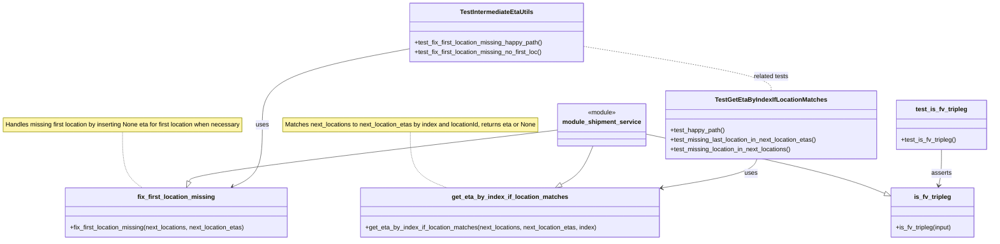
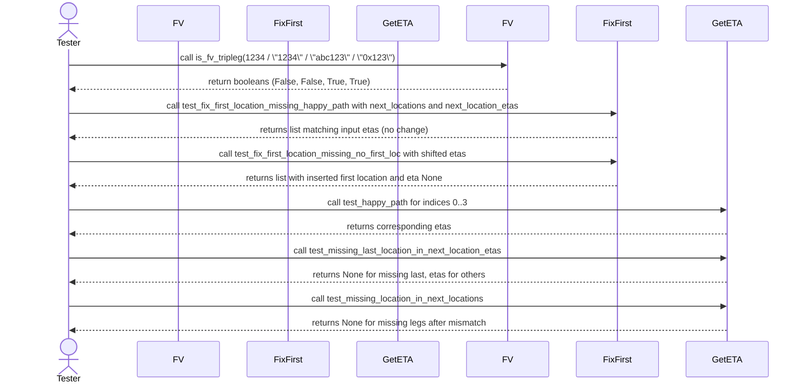

# Diagram: shipment_core/shipment_service/shipment_service/eta/eta_milestone_update/intermediate_eta/tests/test_intermediate_eta_utils.py

> Auto-generated by Obscura crawlers

## Diagram 1

### SVG

<svg id="container" width="2548.4765625" xmlns="http://www.w3.org/2000/svg" class="classDiagram" height="614" viewBox="0 0 2548.4765625 614" role="graphics-document document" aria-roledescription="class"><g><defs><marker id="container_class-aggregationStart" class="marker aggregation class" refX="18" refY="7" markerWidth="190" markerHeight="240" orient="auto"><path d="M 18,7 L9,13 L1,7 L9,1 Z"></path></marker></defs><defs><marker id="container_class-aggregationEnd" class="marker aggregation class" refX="1" refY="7" markerWidth="20" markerHeight="28" orient="auto"><path d="M 18,7 L9,13 L1,7 L9,1 Z"></path></marker></defs><defs><marker id="container_class-extensionStart" class="marker extension class" refX="18" refY="7" markerWidth="190" markerHeight="240" orient="auto"><path d="M 1,7 L18,13 V 1 Z"></path></marker></defs><defs><marker id="container_class-extensionEnd" class="marker extension class" refX="1" refY="7" markerWidth="20" markerHeight="28" orient="auto"><path d="M 1,1 V 13 L18,7 Z"></path></marker></defs><defs><marker id="container_class-compositionStart" class="marker composition class" refX="18" refY="7" markerWidth="190" markerHeight="240" orient="auto"><path d="M 18,7 L9,13 L1,7 L9,1 Z"></path></marker></defs><defs><marker id="container_class-compositionEnd" class="marker composition class" refX="1" refY="7" markerWidth="20" markerHeight="28" orient="auto"><path d="M 18,7 L9,13 L1,7 L9,1 Z"></path></marker></defs><defs><marker id="container_class-dependencyStart" class="marker dependency class" refX="6" refY="7" markerWidth="190" markerHeight="240" orient="auto"><path d="M 5,7 L9,13 L1,7 L9,1 Z"></path></marker></defs><defs><marker id="container_class-dependencyEnd" class="marker dependency class" refX="13" refY="7" markerWidth="20" markerHeight="28" orient="auto"><path d="M 18,7 L9,13 L14,7 L9,1 Z"></path></marker></defs><defs><marker id="container_class-lollipopStart" class="marker lollipop class" refX="13" refY="7" markerWidth="190" markerHeight="240" orient="auto"><circle stroke="black" fill="transparent" cx="7" cy="7" r="6"></circle></marker></defs><defs><marker id="container_class-lollipopEnd" class="marker lollipop class" refX="1" refY="7" markerWidth="190" markerHeight="240" orient="auto"><circle stroke="black" fill="transparent" cx="7" cy="7" r="6"></circle></marker></defs><g class="root"><g class="clusters"></g><g class="edgePaths"><path d="M321.352,337L321.352,354.667C321.352,372.333,321.352,407.667,329.958,431.5C338.565,455.333,355.779,467.667,364.386,473.833L372.993,480" id="edgeNote1" class="edge-thickness-normal edge-pattern-dotted relation" style="fill: none;;;fill: none" data-edge="true" data-et="edge" data-id="edgeNote1" data-points="W3sieCI6MzIxLjM1MTU2MjUsInkiOjMzN30seyJ4IjozMjEuMzUxNTYyNSwieSI6NDQzfSx7IngiOjM3Mi45OTI1NzgxMjUsInkiOjQ4MH1d"></path><path d="M1071.906,337L1071.906,354.667C1071.906,372.333,1071.906,407.667,1087.701,431.5C1103.496,455.333,1135.087,467.667,1150.882,473.833L1166.677,480" id="edgeNote2" class="edge-thickness-normal edge-pattern-dotted relation" style="fill: none;;;fill: none" data-edge="true" data-et="edge" data-id="edgeNote2" data-points="W3sieCI6MTA3MS45MDYyNSwieSI6MzM3fSx7IngiOjEwNzEuOTA2MjUsInkiOjQ0M30seyJ4IjoxMTY2LjY3NjgzNTkzNzUsInkiOjQ4MH1d"></path><path d="M1672.234,341.831L1752.037,358.692C1831.84,375.554,1991.447,409.277,2092.686,434.656C2193.925,460.035,2236.797,477.07,2258.232,485.588L2279.668,494.106" id="id_module_shipment_service_is_fv_tripleg_1" class="edge-thickness-normal edge-pattern-solid relation" style=";;;" data-edge="true" data-et="edge" data-id="id_module_shipment_service_is_fv_tripleg_1" data-points="W3sieCI6MTY3Mi4yMzQzNzUsInkiOjM0MS44MzA4MDAxNTU3NTEzfSx7IngiOjIxNTEuMDUyNzM0Mzc1LCJ5Ijo0NDN9LHsieCI6MjI5NS42OTkyMTg3NSwieSI6NTAwLjQ3NTU3MjkzOTcwNjQ3fV0=" marker-end="url(#container_class-extensionEnd)"></path><path d="M1456.125,331.636L1297.4,350.196C1138.674,368.757,821.224,405.879,660.989,427.963C500.753,450.048,497.733,457.096,496.223,460.62L494.713,464.144" id="id_module_shipment_service_fix_first_location_missing_2" class="edge-thickness-normal edge-pattern-solid relation" style=";;;" data-edge="true" data-et="edge" data-id="id_module_shipment_service_fix_first_location_missing_2" data-points="W3sieCI6MTQ1Ni4xMjUsInkiOjMzMS42MzU1MTcwNDgzMDEwNH0seyJ4Ijo1MDMuNzczNDM3NSwieSI6NDQzfSx7IngiOjQ4Ny45MTgzNTkzNzUsInkiOjQ4MH1d" marker-end="url(#container_class-extensionEnd)"></path><path d="M1541.164,373L1536.191,384.667C1531.218,396.333,1521.273,419.667,1507.522,436.123C1493.771,452.579,1476.213,462.159,1467.434,466.948L1458.655,471.738" id="id_module_shipment_service_get_eta_by_index_if_location_matches_3" class="edge-thickness-normal edge-pattern-solid relation" style=";;;" data-edge="true" data-et="edge" data-id="id_module_shipment_service_get_eta_by_index_if_location_matches_3" data-points="W3sieCI6MTU0MS4xNjM2ODQ0NzU4MDYzLCJ5IjozNzN9LHsieCI6MTUxMS4zMjgxMjUsInkiOjQ0M30seyJ4IjoxNDQzLjUxMjYxNzE4NzUsInkiOjQ4MH1d" marker-end="url(#container_class-extensionEnd)"></path><path d="M1062.34,124.761L999.649,136.468C936.958,148.174,811.577,171.587,748.886,203.96C686.195,236.333,686.195,277.667,686.195,319C686.195,360.333,686.195,401.667,673.217,428.094C660.24,454.522,634.284,466.044,621.306,471.805L608.328,477.566" id="id_TestIntermediateEtaUtils_fix_first_location_missing_4" class="edge-thickness-normal edge-pattern-solid relation" style=";;;" data-edge="true" data-et="edge" data-id="id_TestIntermediateEtaUtils_fix_first_location_missing_4" data-points="W3sieCI6MTA2Mi4zMzk4NDM3NSwieSI6MTI0Ljc2MTIwMzU1NTk2MDc5fSx7IngiOjY4Ni4xOTUzMTI1LCJ5IjoxOTV9LHsieCI6Njg2LjE5NTMxMjUsInkiOjMxOX0seyJ4Ijo2ODYuMTk1MzEyNSwieSI6NDQzfSx7IngiOjYwMi44NDQxNDA2MjUsInkiOjQ4MH1d" marker-end="url(#container_class-dependencyEnd)"></path><path d="M1954.387,406L1951.759,412.167C1949.131,418.333,1943.874,430.667,1904.271,442.889C1864.668,455.111,1790.718,467.223,1753.744,473.279L1716.769,479.334" id="id_TestGetEtaByIndexIfLocationMatches_get_eta_by_index_if_location_matches_5" class="edge-thickness-normal edge-pattern-solid relation" style=";;;" data-edge="true" data-et="edge" data-id="id_TestGetEtaByIndexIfLocationMatches_get_eta_by_index_if_location_matches_5" data-points="W3sieCI6MTk1NC4zODc0MTE3OTQzNTQ5LCJ5Ijo0MDZ9LHsieCI6MTkzOC42MTcxODc1LCJ5Ijo0NDN9LHsieCI6MTcxMC44NDc2NTYyNSwieSI6NDgwLjMwNDE1MTQ0NTU1MjYzfV0=" marker-end="url(#container_class-dependencyEnd)"></path><path d="M2425.59,382L2425.59,392.167C2425.59,402.333,2425.59,422.667,2424.402,438.025C2423.215,453.384,2420.84,463.767,2419.653,468.959L2418.465,474.151" id="id_test_is_fv_tripleg_is_fv_tripleg_6" class="edge-thickness-normal edge-pattern-solid relation" style=";;;" data-edge="true" data-et="edge" data-id="id_test_is_fv_tripleg_is_fv_tripleg_6" data-points="W3sieCI6MjQyNS41ODk4NDM3NSwieSI6MzgyfSx7IngiOjI0MjUuNTg5ODQzNzUsInkiOjQ0M30seyJ4IjoyNDE3LjEyNzUzOTA2MjUsInkiOjQ4MH1d" marker-end="url(#container_class-dependencyEnd)"></path><path d="M1509.621,118.504L1589.929,131.253C1670.237,144.003,1830.853,169.501,1911.161,188.417C1991.469,207.333,1991.469,219.667,1991.469,225.833L1991.469,232" id="id_TestIntermediateEtaUtils_TestGetEtaByIndexIfLocationMatches_7" class="edge-thickness-normal edge-pattern-dashed relation" style=";;;" data-edge="true" data-et="edge" data-id="id_TestIntermediateEtaUtils_TestGetEtaByIndexIfLocationMatches_7" data-points="W3sieCI6MTUwOS42MjEwOTM3NSwieSI6MTE4LjUwNDEzMzMyOTY0MjAzfSx7IngiOjE5OTEuNDY4NzUsInkiOjE5NX0seyJ4IjoxOTkxLjQ2ODc1LCJ5IjoyMzJ9XQ=="></path></g><g class="edgeLabels"><g class="edgeLabel"><g class="label" data-id="edgeNote1" transform="translate(0, 0)"><foreignObject width="0" height="0">

</foreignObject></g></g><g class="edgeLabel"><g class="label" data-id="edgeNote2" transform="translate(0, 0)"><foreignObject width="0" height="0">

</foreignObject></g></g><g class="edgeLabel"><g class="label" data-id="id_module_shipment_service_is_fv_tripleg_1" transform="translate(0, 0)"><foreignObject width="0" height="0">

</foreignObject></g></g><g class="edgeLabel"><g class="label" data-id="id_module_shipment_service_fix_first_location_missing_2" transform="translate(0, 0)"><foreignObject width="0" height="0">

</foreignObject></g></g><g class="edgeLabel"><g class="label" data-id="id_module_shipment_service_get_eta_by_index_if_location_matches_3" transform="translate(0, 0)"><foreignObject width="0" height="0">

</foreignObject></g></g><g class="edgeLabel" transform="translate(686.1953125, 319)"><g class="label" data-id="id_TestIntermediateEtaUtils_fix_first_location_missing_4" transform="translate(-16.4921875, -12)"><foreignObject width="32.984375" height="24">

uses

</foreignObject></g></g><g class="edgeLabel" transform="translate(1938.6171875, 443)"><g class="label" data-id="id_TestGetEtaByIndexIfLocationMatches_get_eta_by_index_if_location_matches_5" transform="translate(-16.4921875, -12)"><foreignObject width="32.984375" height="24">

uses

</foreignObject></g></g><g class="edgeLabel" transform="translate(2425.58984375, 443)"><g class="label" data-id="id_test_is_fv_tripleg_is_fv_tripleg_6" transform="translate(-25.7421875, -12)"><foreignObject width="51.484375" height="24">

asserts

</foreignObject></g></g><g class="edgeLabel" transform="translate(1991.46875, 195)"><g class="label" data-id="id_TestIntermediateEtaUtils_TestGetEtaByIndexIfLocationMatches_7" transform="translate(-45.390625, -12)"><foreignObject width="90.78125" height="24">

related tests

</foreignObject></g></g></g><g class="nodes"><g class="node default" id="classId-module_shipment_service-0" transform="translate(1564.1796875, 319)"><g class="basic label-container"><path d="M-108.0546875 -54 L108.0546875 -54 L108.0546875 54 L-108.0546875 54" stroke="none" stroke-width="0" fill="#ECECFF" style=""></path><path d="M-108.0546875 -54 C-33.346644379832696 -54, 41.36139874033461 -54, 108.0546875 -54 M-108.0546875 -54 C-47.719529934271826 -54, 12.615627631456348 -54, 108.0546875 -54 M108.0546875 -54 C108.0546875 -16.56997224475827, 108.0546875 20.860055510483463, 108.0546875 54 M108.0546875 -54 C108.0546875 -31.343862284581956, 108.0546875 -8.687724569163912, 108.0546875 54 M108.0546875 54 C46.072641653532 54, -15.909404192935995 54, -108.0546875 54 M108.0546875 54 C22.297232480044713 54, -63.460222539910575 54, -108.0546875 54 M-108.0546875 54 C-108.0546875 26.377140928460314, -108.0546875 -1.2457181430793725, -108.0546875 -54 M-108.0546875 54 C-108.0546875 27.719477169297885, -108.0546875 1.4389543385957708, -108.0546875 -54" stroke="#9370DB" stroke-width="1.3" fill="none" stroke-dasharray="0 0" style=""></path></g><g class="annotation-group text" transform="translate(-36.6015625, -30)"><g class="label" style="" transform="translate(0,-12)"><foreignObject width="73.203125" height="24">

«module»

</foreignObject></g></g><g class="label-group text" transform="translate(-96.0546875, -6)"><g class="label" style="font-weight: bolder" transform="translate(0,-12)"><foreignObject width="192.109375" height="24">

module_shipment_service

</foreignObject></g></g><g class="members-group text" transform="translate(-96.0546875, 42)"></g><g class="methods-group text" transform="translate(-96.0546875, 72)"></g><g class="divider" style=""><path d="M-108.0546875 18 C-35.19630506228833 18, 37.66207737542334 18, 108.0546875 18 M-108.0546875 18 C-40.076204998907926 18, 27.90227750218415 18, 108.0546875 18" stroke="#9370DB" stroke-width="1.3" fill="none" stroke-dasharray="0 0" style=""></path></g><g class="divider" style=""><path d="M-108.0546875 36 C-24.47173712230142 36, 59.11121325539716 36, 108.0546875 36 M-108.0546875 36 C-47.9063046257121 36, 12.242078248575794 36, 108.0546875 36" stroke="#9370DB" stroke-width="1.3" fill="none" stroke-dasharray="0 0" style=""></path></g></g><g class="node default" id="classId-is_fv_tripleg-1" transform="translate(2402.71875, 543)"><g class="basic label-container"><path d="M-107.01953125 -63 L107.01953125 -63 L107.01953125 63 L-107.01953125 63" stroke="none" stroke-width="0" fill="#ECECFF" style=""></path><path d="M-107.01953125 -63 C-60.71810704092674 -63, -14.416682831853478 -63, 107.01953125 -63 M-107.01953125 -63 C-37.71694569074988 -63, 31.585639868500238 -63, 107.01953125 -63 M107.01953125 -63 C107.01953125 -35.31598122610279, 107.01953125 -7.631962452205578, 107.01953125 63 M107.01953125 -63 C107.01953125 -22.034136938985917, 107.01953125 18.931726122028167, 107.01953125 63 M107.01953125 63 C38.41846233357349 63, -30.182606582853026 63, -107.01953125 63 M107.01953125 63 C62.83820435549684 63, 18.656877460993684 63, -107.01953125 63 M-107.01953125 63 C-107.01953125 32.98875888737295, -107.01953125 2.9775177747458983, -107.01953125 -63 M-107.01953125 63 C-107.01953125 16.523664011403326, -107.01953125 -29.952671977193347, -107.01953125 -63" stroke="#9370DB" stroke-width="1.3" fill="none" stroke-dasharray="0 0" style=""></path></g><g class="annotation-group text" transform="translate(0, -39)"></g><g class="label-group text" transform="translate(-45.1640625, -39)"><g class="label" style="font-weight: bolder" transform="translate(0,-12)"><foreignObject width="90.328125" height="24">

is_fv_tripleg

</foreignObject></g></g><g class="members-group text" transform="translate(-95.01953125, 9)"></g><g class="methods-group text" transform="translate(-95.01953125, 39)"><g class="label" style="" transform="translate(0,-12)"><foreignObject width="144.875" height="24">

+is_fv_tripleg(input)

</foreignObject></g></g><g class="divider" style=""><path d="M-107.01953125 -15 C-41.979247321936825 -15, 23.06103660612635 -15, 107.01953125 -15 M-107.01953125 -15 C-43.98740639317876 -15, 19.044718463642482 -15, 107.01953125 -15" stroke="#9370DB" stroke-width="1.3" fill="none" stroke-dasharray="0 0" style=""></path></g><g class="divider" style=""><path d="M-107.01953125 9 C-38.82629833882659 9, 29.36693457234682 9, 107.01953125 9 M-107.01953125 9 C-38.959840880701506 9, 29.099849488596988 9, 107.01953125 9" stroke="#9370DB" stroke-width="1.3" fill="none" stroke-dasharray="0 0" style=""></path></g></g><g class="node default" id="classId-fix_first_location_missing-2" transform="translate(460.921875, 543)"><g class="basic label-container"><path d="M-285.796875 -63 L285.796875 -63 L285.796875 63 L-285.796875 63" stroke="none" stroke-width="0" fill="#ECECFF" style=""></path><path d="M-285.796875 -63 C-157.01488623524918 -63, -28.232897470498358 -63, 285.796875 -63 M-285.796875 -63 C-122.46601384047327 -63, 40.86484731905347 -63, 285.796875 -63 M285.796875 -63 C285.796875 -15.560149699027662, 285.796875 31.879700601944677, 285.796875 63 M285.796875 -63 C285.796875 -17.331154888198064, 285.796875 28.33769022360387, 285.796875 63 M285.796875 63 C112.45461875701065 63, -60.8876374859787 63, -285.796875 63 M285.796875 63 C147.33723980235825 63, 8.87760460471651 63, -285.796875 63 M-285.796875 63 C-285.796875 25.654127175675505, -285.796875 -11.69174564864899, -285.796875 -63 M-285.796875 63 C-285.796875 18.38849803632464, -285.796875 -26.223003927350717, -285.796875 -63" stroke="#9370DB" stroke-width="1.3" fill="none" stroke-dasharray="0 0" style=""></path></g><g class="annotation-group text" transform="translate(0, -39)"></g><g class="label-group text" transform="translate(-93.734375, -39)"><g class="label" style="font-weight: bolder" transform="translate(0,-12)"><foreignObject width="187.46875" height="24">

fix_first_location_missing

</foreignObject></g></g><g class="members-group text" transform="translate(-273.796875, 9)"></g><g class="methods-group text" transform="translate(-273.796875, 39)"><g class="label" style="" transform="translate(0,-12)"><foreignObject width="453.859375" height="24">

+fix_first_location_missing(next_locations, next_location_etas)

</foreignObject></g></g><g class="divider" style=""><path d="M-285.796875 -15 C-132.20712204460568 -15, 21.382630910788635 -15, 285.796875 -15 M-285.796875 -15 C-134.70873239677528 -15, 16.37941020644945 -15, 285.796875 -15" stroke="#9370DB" stroke-width="1.3" fill="none" stroke-dasharray="0 0" style=""></path></g><g class="divider" style=""><path d="M-285.796875 9 C-81.37130238145016 9, 123.05427023709967 9, 285.796875 9 M-285.796875 9 C-77.64744953565221 9, 130.50197592869557 9, 285.796875 9" stroke="#9370DB" stroke-width="1.3" fill="none" stroke-dasharray="0 0" style=""></path></g></g><g class="node default" id="classId-get_eta_by_index_if_location_matches-3" transform="translate(1328.04296875, 543)"><g class="basic label-container"><path d="M-382.8046875 -63 L382.8046875 -63 L382.8046875 63 L-382.8046875 63" stroke="none" stroke-width="0" fill="#ECECFF" style=""></path><path d="M-382.8046875 -63 C-116.54864419841385 -63, 149.7073991031723 -63, 382.8046875 -63 M-382.8046875 -63 C-100.16016337185317 -63, 182.48436075629365 -63, 382.8046875 -63 M382.8046875 -63 C382.8046875 -32.25926416655589, 382.8046875 -1.5185283331117745, 382.8046875 63 M382.8046875 -63 C382.8046875 -35.841925320368134, 382.8046875 -8.683850640736267, 382.8046875 63 M382.8046875 63 C103.75589052701912 63, -175.29290644596176 63, -382.8046875 63 M382.8046875 63 C216.56626083088454 63, 50.32783416176909 63, -382.8046875 63 M-382.8046875 63 C-382.8046875 26.44236288860006, -382.8046875 -10.115274222799883, -382.8046875 -63 M-382.8046875 63 C-382.8046875 34.49233398777252, -382.8046875 5.984667975545037, -382.8046875 -63" stroke="#9370DB" stroke-width="1.3" fill="none" stroke-dasharray="0 0" style=""></path></g><g class="annotation-group text" transform="translate(0, -39)"></g><g class="label-group text" transform="translate(-142.40625, -39)"><g class="label" style="font-weight: bolder" transform="translate(0,-12)"><foreignObject width="284.8125" height="24">

get_eta_by_index_if_location_matches

</foreignObject></g></g><g class="members-group text" transform="translate(-370.8046875, 9)"></g><g class="methods-group text" transform="translate(-370.8046875, 39)"><g class="label" style="" transform="translate(0,-12)"><foreignObject width="599.203125" height="24">

+get_eta_by_index_if_location_matches(next_locations, next_location_etas, index)

</foreignObject></g></g><g class="divider" style=""><path d="M-382.8046875 -15 C-190.29664385856506 -15, 2.2113997828698757 -15, 382.8046875 -15 M-382.8046875 -15 C-95.95053816877208 -15, 190.90361116245583 -15, 382.8046875 -15" stroke="#9370DB" stroke-width="1.3" fill="none" stroke-dasharray="0 0" style=""></path></g><g class="divider" style=""><path d="M-382.8046875 9 C-79.43916544541992 9, 223.92635660916017 9, 382.8046875 9 M-382.8046875 9 C-178.04220652498634 9, 26.72027445002732 9, 382.8046875 9" stroke="#9370DB" stroke-width="1.3" fill="none" stroke-dasharray="0 0" style=""></path></g></g><g class="node default" id="classId-TestIntermediateEtaUtils-4" transform="translate(1285.98046875, 83)"><g class="basic label-container"><path d="M-223.640625 -75 L223.640625 -75 L223.640625 75 L-223.640625 75" stroke="none" stroke-width="0" fill="#ECECFF" style=""></path><path d="M-223.640625 -75 C-106.15009151184496 -75, 11.340441976310075 -75, 223.640625 -75 M-223.640625 -75 C-63.639744918564105 -75, 96.36113516287179 -75, 223.640625 -75 M223.640625 -75 C223.640625 -17.020103940853687, 223.640625 40.959792118292626, 223.640625 75 M223.640625 -75 C223.640625 -37.70674770496789, 223.640625 -0.41349540993577705, 223.640625 75 M223.640625 75 C97.70304722165348 75, -28.234530556693045 75, -223.640625 75 M223.640625 75 C112.0976348898702 75, 0.5546447797404142 75, -223.640625 75 M-223.640625 75 C-223.640625 43.10774440218513, -223.640625 11.215488804370267, -223.640625 -75 M-223.640625 75 C-223.640625 24.19219489523128, -223.640625 -26.615610209537437, -223.640625 -75" stroke="#9370DB" stroke-width="1.3" fill="none" stroke-dasharray="0 0" style=""></path></g><g class="annotation-group text" transform="translate(0, -51)"></g><g class="label-group text" transform="translate(-90.984375, -51)"><g class="label" style="font-weight: bolder" transform="translate(0,-12)"><foreignObject width="181.96875" height="24">

TestIntermediateEtaUtils

</foreignObject></g></g><g class="members-group text" transform="translate(-211.640625, -3)"></g><g class="methods-group text" transform="translate(-211.640625, 27)"><g class="label" style="" transform="translate(0,-12)"><foreignObject width="332.296875" height="24">

+test_fix_first_location_missing_happy_path()

</foreignObject></g><g class="label" style="" transform="translate(0,12)"><foreignObject width="330.90625" height="24">

+test_fix_first_location_missing_no_first_loc()

</foreignObject></g></g><g class="divider" style=""><path d="M-223.640625 -27 C-61.6598349269012 -27, 100.3209551461976 -27, 223.640625 -27 M-223.640625 -27 C-44.73941698478808 -27, 134.16179103042384 -27, 223.640625 -27" stroke="#9370DB" stroke-width="1.3" fill="none" stroke-dasharray="0 0" style=""></path></g><g class="divider" style=""><path d="M-223.640625 -3 C-133.551171380082 -3, -43.46171776016402 -3, 223.640625 -3 M-223.640625 -3 C-89.80245195965227 -3, 44.03572108069545 -3, 223.640625 -3" stroke="#9370DB" stroke-width="1.3" fill="none" stroke-dasharray="0 0" style=""></path></g></g><g class="node default" id="classId-TestGetEtaByIndexIfLocationMatches-5" transform="translate(1991.46875, 319)"><g class="basic label-container"><path d="M-269.234375 -87 L269.234375 -87 L269.234375 87 L-269.234375 87" stroke="none" stroke-width="0" fill="#ECECFF" style=""></path><path d="M-269.234375 -87 C-72.85241819112716 -87, 123.52953861774569 -87, 269.234375 -87 M-269.234375 -87 C-102.98356379324667 -87, 63.26724741350665 -87, 269.234375 -87 M269.234375 -87 C269.234375 -24.923746565324954, 269.234375 37.15250686935009, 269.234375 87 M269.234375 -87 C269.234375 -20.946927443670674, 269.234375 45.10614511265865, 269.234375 87 M269.234375 87 C64.13537106959097 87, -140.96363286081805 87, -269.234375 87 M269.234375 87 C71.2085258265914 87, -126.8173233468172 87, -269.234375 87 M-269.234375 87 C-269.234375 32.024047999130616, -269.234375 -22.951904001738768, -269.234375 -87 M-269.234375 87 C-269.234375 21.849575428402986, -269.234375 -43.30084914319403, -269.234375 -87" stroke="#9370DB" stroke-width="1.3" fill="none" stroke-dasharray="0 0" style=""></path></g><g class="annotation-group text" transform="translate(0, -63)"></g><g class="label-group text" transform="translate(-135.484375, -63)"><g class="label" style="font-weight: bolder" transform="translate(0,-12)"><foreignObject width="270.96875" height="24">

TestGetEtaByIndexIfLocationMatches

</foreignObject></g></g><g class="members-group text" transform="translate(-257.234375, -15)"></g><g class="methods-group text" transform="translate(-257.234375, 15)"><g class="label" style="" transform="translate(0,-12)"><foreignObject width="140.046875" height="24">

+test_happy_path()

</foreignObject></g><g class="label" style="" transform="translate(0,12)"><foreignObject width="378.984375" height="24">

+test_missing_last_location_in_next_location_etas()

</foreignObject></g><g class="label" style="" transform="translate(0,36)"><foreignObject width="313.5" height="24">

+test_missing_location_in_next_locations()

</foreignObject></g></g><g class="divider" style=""><path d="M-269.234375 -39 C-142.88878938088266 -39, -16.543203761765312 -39, 269.234375 -39 M-269.234375 -39 C-107.93528607294266 -39, 53.36380285411468 -39, 269.234375 -39" stroke="#9370DB" stroke-width="1.3" fill="none" stroke-dasharray="0 0" style=""></path></g><g class="divider" style=""><path d="M-269.234375 -15 C-79.49218274693527 -15, 110.25000950612946 -15, 269.234375 -15 M-269.234375 -15 C-87.14357893941943 -15, 94.94721712116115 -15, 269.234375 -15" stroke="#9370DB" stroke-width="1.3" fill="none" stroke-dasharray="0 0" style=""></path></g></g><g class="node default" id="classId-test_is_fv_tripleg-6" transform="translate(2425.58984375, 319)"><g class="basic label-container"><path d="M-114.88671875 -63 L114.88671875 -63 L114.88671875 63 L-114.88671875 63" stroke="none" stroke-width="0" fill="#ECECFF" style=""></path><path d="M-114.88671875 -63 C-49.63735670209654 -63, 15.61200534580692 -63, 114.88671875 -63 M-114.88671875 -63 C-41.70239645362534 -63, 31.48192584274932 -63, 114.88671875 -63 M114.88671875 -63 C114.88671875 -31.364081089552972, 114.88671875 0.2718378208940564, 114.88671875 63 M114.88671875 -63 C114.88671875 -31.24292629908703, 114.88671875 0.5141474018259373, 114.88671875 63 M114.88671875 63 C62.17470480379467 63, 9.462690857589337 63, -114.88671875 63 M114.88671875 63 C34.85375348299344 63, -45.17921178401312 63, -114.88671875 63 M-114.88671875 63 C-114.88671875 36.70250647853119, -114.88671875 10.405012957062382, -114.88671875 -63 M-114.88671875 63 C-114.88671875 35.09398351418356, -114.88671875 7.187967028367126, -114.88671875 -63" stroke="#9370DB" stroke-width="1.3" fill="none" stroke-dasharray="0 0" style=""></path></g><g class="annotation-group text" transform="translate(0, -39)"></g><g class="label-group text" transform="translate(-63.6328125, -39)"><g class="label" style="font-weight: bolder" transform="translate(0,-12)"><foreignObject width="127.265625" height="24">

test_is_fv_tripleg

</foreignObject></g></g><g class="members-group text" transform="translate(-102.88671875, 9)"></g><g class="methods-group text" transform="translate(-102.88671875, 39)"><g class="label" style="" transform="translate(0,-12)"><foreignObject width="142.140625" height="24">

+test_is_fv_tripleg()

</foreignObject></g></g><g class="divider" style=""><path d="M-114.88671875 -15 C-57.40995330626667 -15, 0.06681213746665549 -15, 114.88671875 -15 M-114.88671875 -15 C-28.084707962878582 -15, 58.717302824242836 -15, 114.88671875 -15" stroke="#9370DB" stroke-width="1.3" fill="none" stroke-dasharray="0 0" style=""></path></g><g class="divider" style=""><path d="M-114.88671875 9 C-58.70480489062807 9, -2.522891031256137 9, 114.88671875 9 M-114.88671875 9 C-31.057293430251548 9, 52.772131889496904 9, 114.88671875 9" stroke="#9370DB" stroke-width="1.3" fill="none" stroke-dasharray="0 0" style=""></path></g></g><g class="node undefined" id="note0" transform="translate(321.3515625, 319)"><g class="basic label-container"><path d="M-313.3515625 -18 L313.3515625 -18 L313.3515625 18 L-313.3515625 18" stroke="none" stroke-width="0" fill="#fff5ad" style="fill:#fff5ad !important;stroke:#aaaa33 !important"></path><path d="M-313.3515625 -18 C-138.73082665841014 -18, 35.889909183179725 -18, 313.3515625 -18 M-313.3515625 -18 C-94.218128883936 -18, 124.91530473212799 -18, 313.3515625 -18 M313.3515625 -18 C313.3515625 -9.196838323315825, 313.3515625 -0.3936766466316506, 313.3515625 18 M313.3515625 -18 C313.3515625 -6.693501577344254, 313.3515625 4.612996845311493, 313.3515625 18 M313.3515625 18 C84.75688473807207 18, -143.83779302385585 18, -313.3515625 18 M313.3515625 18 C143.56399828747715 18, -26.223565925045705 18, -313.3515625 18 M-313.3515625 18 C-313.3515625 9.292615485334872, -313.3515625 0.5852309706697447, -313.3515625 -18 M-313.3515625 18 C-313.3515625 7.792754717190716, -313.3515625 -2.414490565618568, -313.3515625 -18" stroke="#aaaa33" stroke-width="1.3" fill="none" stroke-dasharray="0 0" style="fill:#fff5ad !important;stroke:#aaaa33 !important"></path></g><g class="label" style="text-align:left !important;white-space:nowrap !important" transform="translate(-307.3515625, -12)"><rect></rect><foreignObject width="614.703125" height="24">

Handles missing first location by inserting None eta for first location when necessary

</foreignObject></g></g><g class="node undefined" id="note1" transform="translate(1071.90625, 319)"><g class="basic label-container"><path d="M-334.21875 -18 L334.21875 -18 L334.21875 18 L-334.21875 18" stroke="none" stroke-width="0" fill="#fff5ad" style="fill:#fff5ad !important;stroke:#aaaa33 !important"></path><path d="M-334.21875 -18 C-83.72794157647425 -18, 166.7628668470515 -18, 334.21875 -18 M-334.21875 -18 C-171.68676235618787 -18, -9.15477471237574 -18, 334.21875 -18 M334.21875 -18 C334.21875 -9.984092366584461, 334.21875 -1.968184733168922, 334.21875 18 M334.21875 -18 C334.21875 -7.55695961306569, 334.21875 2.8860807738686205, 334.21875 18 M334.21875 18 C147.95633057218265 18, -38.3060888556347 18, -334.21875 18 M334.21875 18 C83.35645792320662 18, -167.50583415358676 18, -334.21875 18 M-334.21875 18 C-334.21875 6.4102534473479, -334.21875 -5.1794931053042, -334.21875 -18 M-334.21875 18 C-334.21875 4.157363531460103, -334.21875 -9.685272937079795, -334.21875 -18" stroke="#aaaa33" stroke-width="1.3" fill="none" stroke-dasharray="0 0" style="fill:#fff5ad !important;stroke:#aaaa33 !important"></path></g><g class="label" style="text-align:left !important;white-space:nowrap !important" transform="translate(-328.21875, -12)"><rect></rect><foreignObject width="656.4375" height="24">

Matches next_locations to next_location_etas by index and locationId, returns eta or None

</foreignObject></g></g></g></g></g></svg>

## Diagram 2

### SVG

<svg id="container" width="1450" xmlns="http://www.w3.org/2000/svg" height="747" viewBox="-50 -10 1450 747" role="graphics-document document" aria-roledescription="sequence"><g><rect x="1200" y="661" fill="#eaeaea" stroke="#666" width="150" height="65" name="GetETA" rx="3" ry="3" class="actor actor-bottom"></rect><text x="1275" y="693.5" dominant-baseline="central" alignment-baseline="central" class="actor actor-box" style="text-anchor: middle; font-size: 16px; font-weight: 400;"><tspan x="1275" dy="0">GetETA</tspan></text></g><g><rect x="1000" y="661" fill="#eaeaea" stroke="#666" width="150" height="65" name="FixFirst" rx="3" ry="3" class="actor actor-bottom"></rect><text x="1075" y="693.5" dominant-baseline="central" alignment-baseline="central" class="actor actor-box" style="text-anchor: middle; font-size: 16px; font-weight: 400;"><tspan x="1075" dy="0">FixFirst</tspan></text></g><g><rect x="800" y="661" fill="#eaeaea" stroke="#666" width="150" height="65" name="FV" rx="3" ry="3" class="actor actor-bottom"></rect><text x="875" y="693.5" dominant-baseline="central" alignment-baseline="central" class="actor actor-box" style="text-anchor: middle; font-size: 16px; font-weight: 400;"><tspan x="875" dy="0">FV</tspan></text></g><g><rect x="600" y="661" fill="#eaeaea" stroke="#666" width="150" height="65" name="get_eta_by_index_if_location_matches" rx="3" ry="3" class="actor actor-bottom"></rect><text x="675" y="693.5" dominant-baseline="central" alignment-baseline="central" class="actor actor-box" style="text-anchor: middle; font-size: 16px; font-weight: 400;"><tspan x="675" dy="0">GetETA</tspan></text></g><g><rect x="400" y="661" fill="#eaeaea" stroke="#666" width="150" height="65" name="fix_first_location_missing" rx="3" ry="3" class="actor actor-bottom"></rect><text x="475" y="693.5" dominant-baseline="central" alignment-baseline="central" class="actor actor-box" style="text-anchor: middle; font-size: 16px; font-weight: 400;"><tspan x="475" dy="0">FixFirst</tspan></text></g><g><rect x="200" y="661" fill="#eaeaea" stroke="#666" width="150" height="65" name="is_fv_tripleg" rx="3" ry="3" class="actor actor-bottom"></rect><text x="275" y="693.5" dominant-baseline="central" alignment-baseline="central" class="actor actor-box" style="text-anchor: middle; font-size: 16px; font-weight: 400;"><tspan x="275" dy="0">FV</tspan></text></g><g></g><g><line id="actor6" x1="1275" y1="65" x2="1275" y2="661" class="actor-line 200" stroke-width="0.5px" stroke="#999" name="GetETA"></line><g id="root-6"><rect x="1200" y="0" fill="#eaeaea" stroke="#666" width="150" height="65" name="GetETA" rx="3" ry="3" class="actor actor-top"></rect><text x="1275" y="32.5" dominant-baseline="central" alignment-baseline="central" class="actor actor-box" style="text-anchor: middle; font-size: 16px; font-weight: 400;"><tspan x="1275" dy="0">GetETA</tspan></text></g></g><g><line id="actor5" x1="1075" y1="65" x2="1075" y2="661" class="actor-line 200" stroke-width="0.5px" stroke="#999" name="FixFirst"></line><g id="root-5"><rect x="1000" y="0" fill="#eaeaea" stroke="#666" width="150" height="65" name="FixFirst" rx="3" ry="3" class="actor actor-top"></rect><text x="1075" y="32.5" dominant-baseline="central" alignment-baseline="central" class="actor actor-box" style="text-anchor: middle; font-size: 16px; font-weight: 400;"><tspan x="1075" dy="0">FixFirst</tspan></text></g></g><g><line id="actor4" x1="875" y1="65" x2="875" y2="661" class="actor-line 200" stroke-width="0.5px" stroke="#999" name="FV"></line><g id="root-4"><rect x="800" y="0" fill="#eaeaea" stroke="#666" width="150" height="65" name="FV" rx="3" ry="3" class="actor actor-top"></rect><text x="875" y="32.5" dominant-baseline="central" alignment-baseline="central" class="actor actor-box" style="text-anchor: middle; font-size: 16px; font-weight: 400;"><tspan x="875" dy="0">FV</tspan></text></g></g><g><line id="actor3" x1="675" y1="65" x2="675" y2="661" class="actor-line 200" stroke-width="0.5px" stroke="#999" name="get_eta_by_index_if_location_matches"></line><g id="root-3"><rect x="600" y="0" fill="#eaeaea" stroke="#666" width="150" height="65" name="get_eta_by_index_if_location_matches" rx="3" ry="3" class="actor actor-top"></rect><text x="675" y="32.5" dominant-baseline="central" alignment-baseline="central" class="actor actor-box" style="text-anchor: middle; font-size: 16px; font-weight: 400;"><tspan x="675" dy="0">GetETA</tspan></text></g></g><g><line id="actor2" x1="475" y1="65" x2="475" y2="661" class="actor-line 200" stroke-width="0.5px" stroke="#999" name="fix_first_location_missing"></line><g id="root-2"><rect x="400" y="0" fill="#eaeaea" stroke="#666" width="150" height="65" name="fix_first_location_missing" rx="3" ry="3" class="actor actor-top"></rect><text x="475" y="32.5" dominant-baseline="central" alignment-baseline="central" class="actor actor-box" style="text-anchor: middle; font-size: 16px; font-weight: 400;"><tspan x="475" dy="0">FixFirst</tspan></text></g></g><g><line id="actor1" x1="275" y1="65" x2="275" y2="661" class="actor-line 200" stroke-width="0.5px" stroke="#999" name="is_fv_tripleg"></line><g id="root-1"><rect x="200" y="0" fill="#eaeaea" stroke="#666" width="150" height="65" name="is_fv_tripleg" rx="3" ry="3" class="actor actor-top"></rect><text x="275" y="32.5" dominant-baseline="central" alignment-baseline="central" class="actor actor-box" style="text-anchor: middle; font-size: 16px; font-weight: 400;"><tspan x="275" dy="0">FV</tspan></text></g></g><g><line id="actor0" x1="75" y1="80" x2="75" y2="661" class="actor-line 200" stroke-width="0.5px" stroke="#999" name="Tester"></line></g><g></g><defs><symbol id="computer" width="24" height="24"><path transform="scale(.5)" d="M2 2v13h20v-13h-20zm18 11h-16v-9h16v9zm-10.228 6l.466-1h3.524l.467 1h-4.457zm14.228 3h-24l2-6h2.104l-1.33 4h18.45l-1.297-4h2.073l2 6zm-5-10h-14v-7h14v7z"></path></symbol></defs><defs><symbol id="database" fill-rule="evenodd" clip-rule="evenodd"><path transform="scale(.5)" d="M12.258.001l.256.004.255.005.253.008.251.01.249.012.247.015.246.016.242.019.241.02.239.023.236.024.233.027.231.028.229.031.225.032.223.034.22.036.217.038.214.04.211.041.208.043.205.045.201.046.198.048.194.05.191.051.187.053.183.054.18.056.175.057.172.059.168.06.163.061.16.063.155.064.15.066.074.033.073.033.071.034.07.034.069.035.068.035.067.035.066.035.064.036.064.036.062.036.06.036.06.037.058.037.058.037.055.038.055.038.053.038.052.038.051.039.05.039.048.039.047.039.045.04.044.04.043.04.041.04.04.041.039.041.037.041.036.041.034.041.033.042.032.042.03.042.029.042.027.042.026.043.024.043.023.043.021.043.02.043.018.044.017.043.015.044.013.044.012.044.011.045.009.044.007.045.006.045.004.045.002.045.001.045v17l-.001.045-.002.045-.004.045-.006.045-.007.045-.009.044-.011.045-.012.044-.013.044-.015.044-.017.043-.018.044-.02.043-.021.043-.023.043-.024.043-.026.043-.027.042-.029.042-.03.042-.032.042-.033.042-.034.041-.036.041-.037.041-.039.041-.04.041-.041.04-.043.04-.044.04-.045.04-.047.039-.048.039-.05.039-.051.039-.052.038-.053.038-.055.038-.055.038-.058.037-.058.037-.06.037-.06.036-.062.036-.064.036-.064.036-.066.035-.067.035-.068.035-.069.035-.07.034-.071.034-.073.033-.074.033-.15.066-.155.064-.16.063-.163.061-.168.06-.172.059-.175.057-.18.056-.183.054-.187.053-.191.051-.194.05-.198.048-.201.046-.205.045-.208.043-.211.041-.214.04-.217.038-.22.036-.223.034-.225.032-.229.031-.231.028-.233.027-.236.024-.239.023-.241.02-.242.019-.246.016-.247.015-.249.012-.251.01-.253.008-.255.005-.256.004-.258.001-.258-.001-.256-.004-.255-.005-.253-.008-.251-.01-.249-.012-.247-.015-.245-.016-.243-.019-.241-.02-.238-.023-.236-.024-.234-.027-.231-.028-.228-.031-.226-.032-.223-.034-.22-.036-.217-.038-.214-.04-.211-.041-.208-.043-.204-.045-.201-.046-.198-.048-.195-.05-.19-.051-.187-.053-.184-.054-.179-.056-.176-.057-.172-.059-.167-.06-.164-.061-.159-.063-.155-.064-.151-.066-.074-.033-.072-.033-.072-.034-.07-.034-.069-.035-.068-.035-.067-.035-.066-.035-.064-.036-.063-.036-.062-.036-.061-.036-.06-.037-.058-.037-.057-.037-.056-.038-.055-.038-.053-.038-.052-.038-.051-.039-.049-.039-.049-.039-.046-.039-.046-.04-.044-.04-.043-.04-.041-.04-.04-.041-.039-.041-.037-.041-.036-.041-.034-.041-.033-.042-.032-.042-.03-.042-.029-.042-.027-.042-.026-.043-.024-.043-.023-.043-.021-.043-.02-.043-.018-.044-.017-.043-.015-.044-.013-.044-.012-.044-.011-.045-.009-.044-.007-.045-.006-.045-.004-.045-.002-.045-.001-.045v-17l.001-.045.002-.045.004-.045.006-.045.007-.045.009-.044.011-.045.012-.044.013-.044.015-.044.017-.043.018-.044.02-.043.021-.043.023-.043.024-.043.026-.043.027-.042.029-.042.03-.042.032-.042.033-.042.034-.041.036-.041.037-.041.039-.041.04-.041.041-.04.043-.04.044-.04.046-.04.046-.039.049-.039.049-.039.051-.039.052-.038.053-.038.055-.038.056-.038.057-.037.058-.037.06-.037.061-.036.062-.036.063-.036.064-.036.066-.035.067-.035.068-.035.069-.035.07-.034.072-.034.072-.033.074-.033.151-.066.155-.064.159-.063.164-.061.167-.06.172-.059.176-.057.179-.056.184-.054.187-.053.19-.051.195-.05.198-.048.201-.046.204-.045.208-.043.211-.041.214-.04.217-.038.22-.036.223-.034.226-.032.228-.031.231-.028.234-.027.236-.024.238-.023.241-.02.243-.019.245-.016.247-.015.249-.012.251-.01.253-.008.255-.005.256-.004.258-.001.258.001zm-9.258 20.499v.01l.001.021.003.021.004.022.005.021.006.022.007.022.009.023.01.022.011.023.012.023.013.023.015.023.016.024.017.023.018.024.019.024.021.024.022.025.023.024.024.025.052.049.056.05.061.051.066.051.07.051.075.051.079.052.084.052.088.052.092.052.097.052.102.051.105.052.11.052.114.051.119.051.123.051.127.05.131.05.135.05.139.048.144.049.147.047.152.047.155.047.16.045.163.045.167.043.171.043.176.041.178.041.183.039.187.039.19.037.194.035.197.035.202.033.204.031.209.03.212.029.216.027.219.025.222.024.226.021.23.02.233.018.236.016.24.015.243.012.246.01.249.008.253.005.256.004.259.001.26-.001.257-.004.254-.005.25-.008.247-.011.244-.012.241-.014.237-.016.233-.018.231-.021.226-.021.224-.024.22-.026.216-.027.212-.028.21-.031.205-.031.202-.034.198-.034.194-.036.191-.037.187-.039.183-.04.179-.04.175-.042.172-.043.168-.044.163-.045.16-.046.155-.046.152-.047.148-.048.143-.049.139-.049.136-.05.131-.05.126-.05.123-.051.118-.052.114-.051.11-.052.106-.052.101-.052.096-.052.092-.052.088-.053.083-.051.079-.052.074-.052.07-.051.065-.051.06-.051.056-.05.051-.05.023-.024.023-.025.021-.024.02-.024.019-.024.018-.024.017-.024.015-.023.014-.024.013-.023.012-.023.01-.023.01-.022.008-.022.006-.022.006-.022.004-.022.004-.021.001-.021.001-.021v-4.127l-.077.055-.08.053-.083.054-.085.053-.087.052-.09.052-.093.051-.095.05-.097.05-.1.049-.102.049-.105.048-.106.047-.109.047-.111.046-.114.045-.115.045-.118.044-.12.043-.122.042-.124.042-.126.041-.128.04-.13.04-.132.038-.134.038-.135.037-.138.037-.139.035-.142.035-.143.034-.144.033-.147.032-.148.031-.15.03-.151.03-.153.029-.154.027-.156.027-.158.026-.159.025-.161.024-.162.023-.163.022-.165.021-.166.02-.167.019-.169.018-.169.017-.171.016-.173.015-.173.014-.175.013-.175.012-.177.011-.178.01-.179.008-.179.008-.181.006-.182.005-.182.004-.184.003-.184.002h-.37l-.184-.002-.184-.003-.182-.004-.182-.005-.181-.006-.179-.008-.179-.008-.178-.01-.176-.011-.176-.012-.175-.013-.173-.014-.172-.015-.171-.016-.17-.017-.169-.018-.167-.019-.166-.02-.165-.021-.163-.022-.162-.023-.161-.024-.159-.025-.157-.026-.156-.027-.155-.027-.153-.029-.151-.03-.15-.03-.148-.031-.146-.032-.145-.033-.143-.034-.141-.035-.14-.035-.137-.037-.136-.037-.134-.038-.132-.038-.13-.04-.128-.04-.126-.041-.124-.042-.122-.042-.12-.044-.117-.043-.116-.045-.113-.045-.112-.046-.109-.047-.106-.047-.105-.048-.102-.049-.1-.049-.097-.05-.095-.05-.093-.052-.09-.051-.087-.052-.085-.053-.083-.054-.08-.054-.077-.054v4.127zm0-5.654v.011l.001.021.003.021.004.021.005.022.006.022.007.022.009.022.01.022.011.023.012.023.013.023.015.024.016.023.017.024.018.024.019.024.021.024.022.024.023.025.024.024.052.05.056.05.061.05.066.051.07.051.075.052.079.051.084.052.088.052.092.052.097.052.102.052.105.052.11.051.114.051.119.052.123.05.127.051.131.05.135.049.139.049.144.048.147.048.152.047.155.046.16.045.163.045.167.044.171.042.176.042.178.04.183.04.187.038.19.037.194.036.197.034.202.033.204.032.209.03.212.028.216.027.219.025.222.024.226.022.23.02.233.018.236.016.24.014.243.012.246.01.249.008.253.006.256.003.259.001.26-.001.257-.003.254-.006.25-.008.247-.01.244-.012.241-.015.237-.016.233-.018.231-.02.226-.022.224-.024.22-.025.216-.027.212-.029.21-.03.205-.032.202-.033.198-.035.194-.036.191-.037.187-.039.183-.039.179-.041.175-.042.172-.043.168-.044.163-.045.16-.045.155-.047.152-.047.148-.048.143-.048.139-.05.136-.049.131-.05.126-.051.123-.051.118-.051.114-.052.11-.052.106-.052.101-.052.096-.052.092-.052.088-.052.083-.052.079-.052.074-.051.07-.052.065-.051.06-.05.056-.051.051-.049.023-.025.023-.024.021-.025.02-.024.019-.024.018-.024.017-.024.015-.023.014-.023.013-.024.012-.022.01-.023.01-.023.008-.022.006-.022.006-.022.004-.021.004-.022.001-.021.001-.021v-4.139l-.077.054-.08.054-.083.054-.085.052-.087.053-.09.051-.093.051-.095.051-.097.05-.1.049-.102.049-.105.048-.106.047-.109.047-.111.046-.114.045-.115.044-.118.044-.12.044-.122.042-.124.042-.126.041-.128.04-.13.039-.132.039-.134.038-.135.037-.138.036-.139.036-.142.035-.143.033-.144.033-.147.033-.148.031-.15.03-.151.03-.153.028-.154.028-.156.027-.158.026-.159.025-.161.024-.162.023-.163.022-.165.021-.166.02-.167.019-.169.018-.169.017-.171.016-.173.015-.173.014-.175.013-.175.012-.177.011-.178.009-.179.009-.179.007-.181.007-.182.005-.182.004-.184.003-.184.002h-.37l-.184-.002-.184-.003-.182-.004-.182-.005-.181-.007-.179-.007-.179-.009-.178-.009-.176-.011-.176-.012-.175-.013-.173-.014-.172-.015-.171-.016-.17-.017-.169-.018-.167-.019-.166-.02-.165-.021-.163-.022-.162-.023-.161-.024-.159-.025-.157-.026-.156-.027-.155-.028-.153-.028-.151-.03-.15-.03-.148-.031-.146-.033-.145-.033-.143-.033-.141-.035-.14-.036-.137-.036-.136-.037-.134-.038-.132-.039-.13-.039-.128-.04-.126-.041-.124-.042-.122-.043-.12-.043-.117-.044-.116-.044-.113-.046-.112-.046-.109-.046-.106-.047-.105-.048-.102-.049-.1-.049-.097-.05-.095-.051-.093-.051-.09-.051-.087-.053-.085-.052-.083-.054-.08-.054-.077-.054v4.139zm0-5.666v.011l.001.02.003.022.004.021.005.022.006.021.007.022.009.023.01.022.011.023.012.023.013.023.015.023.016.024.017.024.018.023.019.024.021.025.022.024.023.024.024.025.052.05.056.05.061.05.066.051.07.051.075.052.079.051.084.052.088.052.092.052.097.052.102.052.105.051.11.052.114.051.119.051.123.051.127.05.131.05.135.05.139.049.144.048.147.048.152.047.155.046.16.045.163.045.167.043.171.043.176.042.178.04.183.04.187.038.19.037.194.036.197.034.202.033.204.032.209.03.212.028.216.027.219.025.222.024.226.021.23.02.233.018.236.017.24.014.243.012.246.01.249.008.253.006.256.003.259.001.26-.001.257-.003.254-.006.25-.008.247-.01.244-.013.241-.014.237-.016.233-.018.231-.02.226-.022.224-.024.22-.025.216-.027.212-.029.21-.03.205-.032.202-.033.198-.035.194-.036.191-.037.187-.039.183-.039.179-.041.175-.042.172-.043.168-.044.163-.045.16-.045.155-.047.152-.047.148-.048.143-.049.139-.049.136-.049.131-.051.126-.05.123-.051.118-.052.114-.051.11-.052.106-.052.101-.052.096-.052.092-.052.088-.052.083-.052.079-.052.074-.052.07-.051.065-.051.06-.051.056-.05.051-.049.023-.025.023-.025.021-.024.02-.024.019-.024.018-.024.017-.024.015-.023.014-.024.013-.023.012-.023.01-.022.01-.023.008-.022.006-.022.006-.022.004-.022.004-.021.001-.021.001-.021v-4.153l-.077.054-.08.054-.083.053-.085.053-.087.053-.09.051-.093.051-.095.051-.097.05-.1.049-.102.048-.105.048-.106.048-.109.046-.111.046-.114.046-.115.044-.118.044-.12.043-.122.043-.124.042-.126.041-.128.04-.13.039-.132.039-.134.038-.135.037-.138.036-.139.036-.142.034-.143.034-.144.033-.147.032-.148.032-.15.03-.151.03-.153.028-.154.028-.156.027-.158.026-.159.024-.161.024-.162.023-.163.023-.165.021-.166.02-.167.019-.169.018-.169.017-.171.016-.173.015-.173.014-.175.013-.175.012-.177.01-.178.01-.179.009-.179.007-.181.006-.182.006-.182.004-.184.003-.184.001-.185.001-.185-.001-.184-.001-.184-.003-.182-.004-.182-.006-.181-.006-.179-.007-.179-.009-.178-.01-.176-.01-.176-.012-.175-.013-.173-.014-.172-.015-.171-.016-.17-.017-.169-.018-.167-.019-.166-.02-.165-.021-.163-.023-.162-.023-.161-.024-.159-.024-.157-.026-.156-.027-.155-.028-.153-.028-.151-.03-.15-.03-.148-.032-.146-.032-.145-.033-.143-.034-.141-.034-.14-.036-.137-.036-.136-.037-.134-.038-.132-.039-.13-.039-.128-.041-.126-.041-.124-.041-.122-.043-.12-.043-.117-.044-.116-.044-.113-.046-.112-.046-.109-.046-.106-.048-.105-.048-.102-.048-.1-.05-.097-.049-.095-.051-.093-.051-.09-.052-.087-.052-.085-.053-.083-.053-.08-.054-.077-.054v4.153zm8.74-8.179l-.257.004-.254.005-.25.008-.247.011-.244.012-.241.014-.237.016-.233.018-.231.021-.226.022-.224.023-.22.026-.216.027-.212.028-.21.031-.205.032-.202.033-.198.034-.194.036-.191.038-.187.038-.183.04-.179.041-.175.042-.172.043-.168.043-.163.045-.16.046-.155.046-.152.048-.148.048-.143.048-.139.049-.136.05-.131.05-.126.051-.123.051-.118.051-.114.052-.11.052-.106.052-.101.052-.096.052-.092.052-.088.052-.083.052-.079.052-.074.051-.07.052-.065.051-.06.05-.056.05-.051.05-.023.025-.023.024-.021.024-.02.025-.019.024-.018.024-.017.023-.015.024-.014.023-.013.023-.012.023-.01.023-.01.022-.008.022-.006.023-.006.021-.004.022-.004.021-.001.021-.001.021.001.021.001.021.004.021.004.022.006.021.006.023.008.022.01.022.01.023.012.023.013.023.014.023.015.024.017.023.018.024.019.024.02.025.021.024.023.024.023.025.051.05.056.05.06.05.065.051.07.052.074.051.079.052.083.052.088.052.092.052.096.052.101.052.106.052.11.052.114.052.118.051.123.051.126.051.131.05.136.05.139.049.143.048.148.048.152.048.155.046.16.046.163.045.168.043.172.043.175.042.179.041.183.04.187.038.191.038.194.036.198.034.202.033.205.032.21.031.212.028.216.027.22.026.224.023.226.022.231.021.233.018.237.016.241.014.244.012.247.011.25.008.254.005.257.004.26.001.26-.001.257-.004.254-.005.25-.008.247-.011.244-.012.241-.014.237-.016.233-.018.231-.021.226-.022.224-.023.22-.026.216-.027.212-.028.21-.031.205-.032.202-.033.198-.034.194-.036.191-.038.187-.038.183-.04.179-.041.175-.042.172-.043.168-.043.163-.045.16-.046.155-.046.152-.048.148-.048.143-.048.139-.049.136-.05.131-.05.126-.051.123-.051.118-.051.114-.052.11-.052.106-.052.101-.052.096-.052.092-.052.088-.052.083-.052.079-.052.074-.051.07-.052.065-.051.06-.05.056-.05.051-.05.023-.025.023-.024.021-.024.02-.025.019-.024.018-.024.017-.023.015-.024.014-.023.013-.023.012-.023.01-.023.01-.022.008-.022.006-.023.006-.021.004-.022.004-.021.001-.021.001-.021-.001-.021-.001-.021-.004-.021-.004-.022-.006-.021-.006-.023-.008-.022-.01-.022-.01-.023-.012-.023-.013-.023-.014-.023-.015-.024-.017-.023-.018-.024-.019-.024-.02-.025-.021-.024-.023-.024-.023-.025-.051-.05-.056-.05-.06-.05-.065-.051-.07-.052-.074-.051-.079-.052-.083-.052-.088-.052-.092-.052-.096-.052-.101-.052-.106-.052-.11-.052-.114-.052-.118-.051-.123-.051-.126-.051-.131-.05-.136-.05-.139-.049-.143-.048-.148-.048-.152-.048-.155-.046-.16-.046-.163-.045-.168-.043-.172-.043-.175-.042-.179-.041-.183-.04-.187-.038-.191-.038-.194-.036-.198-.034-.202-.033-.205-.032-.21-.031-.212-.028-.216-.027-.22-.026-.224-.023-.226-.022-.231-.021-.233-.018-.237-.016-.241-.014-.244-.012-.247-.011-.25-.008-.254-.005-.257-.004-.26-.001-.26.001z"></path></symbol></defs><defs><symbol id="clock" width="24" height="24"><path transform="scale(.5)" d="M12 2c5.514 0 10 4.486 10 10s-4.486 10-10 10-10-4.486-10-10 4.486-10 10-10zm0-2c-6.627 0-12 5.373-12 12s5.373 12 12 12 12-5.373 12-12-5.373-12-12-12zm5.848 12.459c.202.038.202.333.001.372-1.907.361-6.045 1.111-6.547 1.111-.719 0-1.301-.582-1.301-1.301 0-.512.77-5.447 1.125-7.445.034-.192.312-.181.343.014l.985 6.238 5.394 1.011z"></path></symbol></defs><defs><marker id="arrowhead" refX="7.9" refY="5" markerUnits="userSpaceOnUse" markerWidth="12" markerHeight="12" orient="auto-start-reverse"><path d="M -1 0 L 10 5 L 0 10 z"></path></marker></defs><defs><marker id="crosshead" markerWidth="15" markerHeight="8" orient="auto" refX="4" refY="4.5"><path fill="none" stroke="#000000" stroke-width="1pt" d="M 1,2 L 6,7 M 6,2 L 1,7" style="stroke-dasharray: 0, 0;"></path></marker></defs><defs><marker id="filled-head" refX="15.5" refY="7" markerWidth="20" markerHeight="28" orient="auto"><path d="M 18,7 L9,13 L14,7 L9,1 Z"></path></marker></defs><defs><marker id="sequencenumber" refX="15" refY="15" markerWidth="60" markerHeight="40" orient="auto"><circle cx="15" cy="15" r="6"></circle></marker></defs><g class="actor-man actor-top" name="Tester"><line id="actor-man-torso0" x1="75" y1="25" x2="75" y2="45"></line><line id="actor-man-arms0" x1="57" y1="33" x2="93" y2="33"></line><line x1="57" y1="60" x2="75" y2="45"></line><line x1="75" y1="45" x2="91" y2="60"></line><circle cx="75" cy="10" r="15" width="150" height="65"></circle><text x="75" y="67.5" dominant-baseline="central" alignment-baseline="central" class="actor actor-man" style="text-anchor: middle; font-size: 16px; font-weight: 400;"><tspan x="75" dy="0">Tester</tspan></text></g><text x="474" y="80" text-anchor="middle" dominant-baseline="middle" alignment-baseline="middle" class="messageText" dy="1em" style="font-size: 16px; font-weight: 400;">call is_fv_tripleg(1234 / \"1234\" / \"abc123\" / \"0x123\")</text><line x1="76" y1="113" x2="871" y2="113" class="messageLine0" stroke-width="2" stroke="none" marker-end="url(#arrowhead)" style="fill: none;"></line><text x="477" y="128" text-anchor="middle" dominant-baseline="middle" alignment-baseline="middle" class="messageText" dy="1em" style="font-size: 16px; font-weight: 400;">return booleans (False, False, True, True)</text><line x1="874" y1="161" x2="79" y2="161" class="messageLine1" stroke-width="2" stroke="none" marker-end="url(#arrowhead)" style="stroke-dasharray: 3, 3; fill: none;"></line><text x="574" y="176" text-anchor="middle" dominant-baseline="middle" alignment-baseline="middle" class="messageText" dy="1em" style="font-size: 16px; font-weight: 400;">call test_fix_first_location_missing_happy_path with next_locations and next_location_etas</text><line x1="76" y1="209" x2="1071" y2="209" class="messageLine0" stroke-width="2" stroke="none" marker-end="url(#arrowhead)" style="fill: none;"></line><text x="577" y="224" text-anchor="middle" dominant-baseline="middle" alignment-baseline="middle" class="messageText" dy="1em" style="font-size: 16px; font-weight: 400;">returns list matching input etas (no change)</text><line x1="1074" y1="257" x2="79" y2="257" class="messageLine1" stroke-width="2" stroke="none" marker-end="url(#arrowhead)" style="stroke-dasharray: 3, 3; fill: none;"></line><text x="574" y="272" text-anchor="middle" dominant-baseline="middle" alignment-baseline="middle" class="messageText" dy="1em" style="font-size: 16px; font-weight: 400;">call test_fix_first_location_missing_no_first_loc with shifted etas</text><line x1="76" y1="305" x2="1071" y2="305" class="messageLine0" stroke-width="2" stroke="none" marker-end="url(#arrowhead)" style="fill: none;"></line><text x="577" y="320" text-anchor="middle" dominant-baseline="middle" alignment-baseline="middle" class="messageText" dy="1em" style="font-size: 16px; font-weight: 400;">returns list with inserted first location and eta None</text><line x1="1074" y1="353" x2="79" y2="353" class="messageLine1" stroke-width="2" stroke="none" marker-end="url(#arrowhead)" style="stroke-dasharray: 3, 3; fill: none;"></line><text x="674" y="368" text-anchor="middle" dominant-baseline="middle" alignment-baseline="middle" class="messageText" dy="1em" style="font-size: 16px; font-weight: 400;">call test_happy_path for indices 0..3</text><line x1="76" y1="401" x2="1271" y2="401" class="messageLine0" stroke-width="2" stroke="none" marker-end="url(#arrowhead)" style="fill: none;"></line><text x="677" y="416" text-anchor="middle" dominant-baseline="middle" alignment-baseline="middle" class="messageText" dy="1em" style="font-size: 16px; font-weight: 400;">returns corresponding etas</text><line x1="1274" y1="449" x2="79" y2="449" class="messageLine1" stroke-width="2" stroke="none" marker-end="url(#arrowhead)" style="stroke-dasharray: 3, 3; fill: none;"></line><text x="674" y="464" text-anchor="middle" dominant-baseline="middle" alignment-baseline="middle" class="messageText" dy="1em" style="font-size: 16px; font-weight: 400;">call test_missing_last_location_in_next_location_etas</text><line x1="76" y1="497" x2="1271" y2="497" class="messageLine0" stroke-width="2" stroke="none" marker-end="url(#arrowhead)" style="fill: none;"></line><text x="677" y="512" text-anchor="middle" dominant-baseline="middle" alignment-baseline="middle" class="messageText" dy="1em" style="font-size: 16px; font-weight: 400;">returns None for missing last, etas for others</text><line x1="1274" y1="545" x2="79" y2="545" class="messageLine1" stroke-width="2" stroke="none" marker-end="url(#arrowhead)" style="stroke-dasharray: 3, 3; fill: none;"></line><text x="674" y="560" text-anchor="middle" dominant-baseline="middle" alignment-baseline="middle" class="messageText" dy="1em" style="font-size: 16px; font-weight: 400;">call test_missing_location_in_next_locations</text><line x1="76" y1="593" x2="1271" y2="593" class="messageLine0" stroke-width="2" stroke="none" marker-end="url(#arrowhead)" style="fill: none;"></line><text x="677" y="608" text-anchor="middle" dominant-baseline="middle" alignment-baseline="middle" class="messageText" dy="1em" style="font-size: 16px; font-weight: 400;">returns None for missing legs after mismatch</text><line x1="1274" y1="641" x2="79" y2="641" class="messageLine1" stroke-width="2" stroke="none" marker-end="url(#arrowhead)" style="stroke-dasharray: 3, 3; fill: none;"></line><g class="actor-man actor-bottom" name="Tester"><line id="actor-man-torso6" x1="75" y1="686" x2="75" y2="706"></line><line id="actor-man-arms6" x1="57" y1="694" x2="93" y2="694"></line><line x1="57" y1="721" x2="75" y2="706"></line><line x1="75" y1="706" x2="91" y2="721"></line><circle cx="75" cy="671" r="15" width="150" height="65"></circle><text x="75" y="728.5" dominant-baseline="central" alignment-baseline="central" class="actor actor-man" style="text-anchor: middle; font-size: 16px; font-weight: 400;"><tspan x="75" dy="0">Tester</tspan></text></g></svg>
