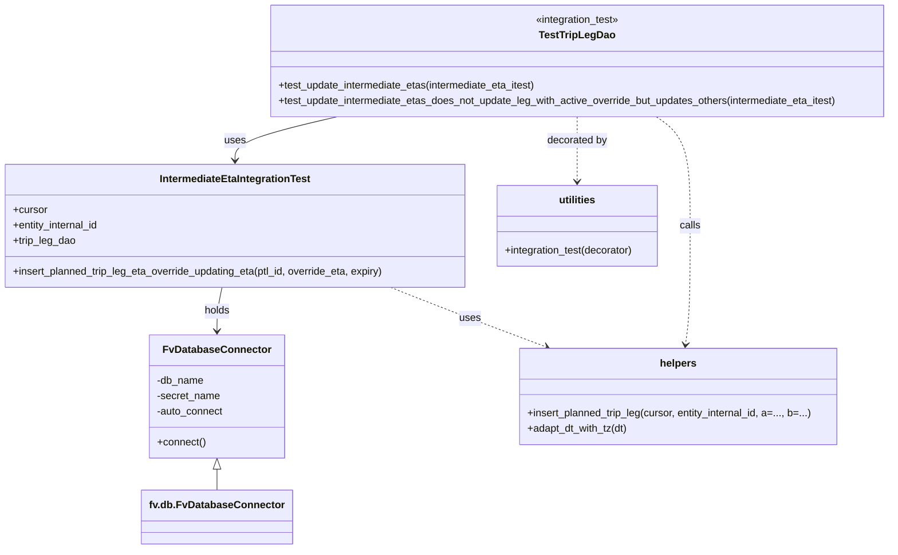
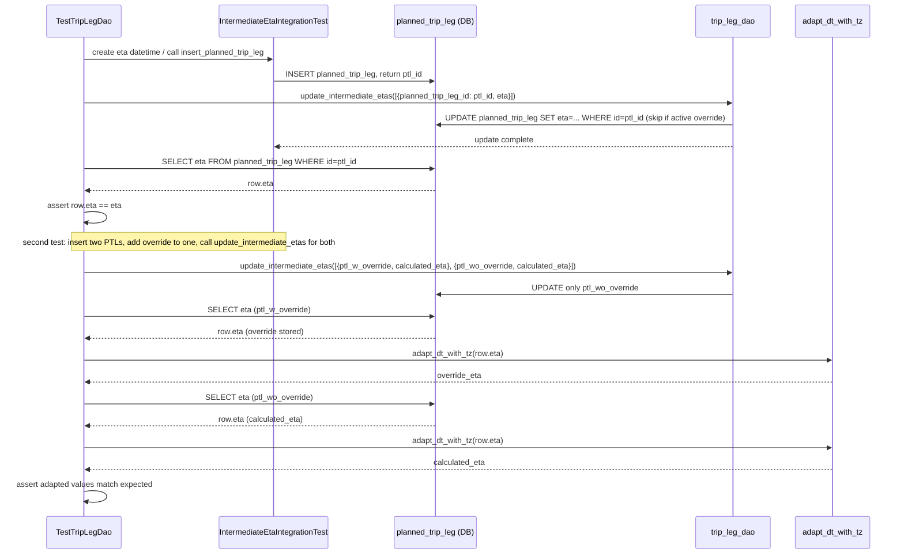

# Diagram: shipment_core/shipment_service/shipment_service/eta/eta_milestone_update/intermediate_eta/tests/test_trip_leg_dao.py

> Auto-generated by Obscura crawlers

## Diagram 1

### SVG

<svg id="container" width="1412.24609375" xmlns="http://www.w3.org/2000/svg" class="classDiagram" height="856" viewBox="0 0 1412.24609375 856" role="graphics-document document" aria-roledescription="class"><g><defs><marker id="container_class-aggregationStart" class="marker aggregation class" refX="18" refY="7" markerWidth="190" markerHeight="240" orient="auto"><path d="M 18,7 L9,13 L1,7 L9,1 Z"></path></marker></defs><defs><marker id="container_class-aggregationEnd" class="marker aggregation class" refX="1" refY="7" markerWidth="20" markerHeight="28" orient="auto"><path d="M 18,7 L9,13 L1,7 L9,1 Z"></path></marker></defs><defs><marker id="container_class-extensionStart" class="marker extension class" refX="18" refY="7" markerWidth="190" markerHeight="240" orient="auto"><path d="M 1,7 L18,13 V 1 Z"></path></marker></defs><defs><marker id="container_class-extensionEnd" class="marker extension class" refX="1" refY="7" markerWidth="20" markerHeight="28" orient="auto"><path d="M 1,1 V 13 L18,7 Z"></path></marker></defs><defs><marker id="container_class-compositionStart" class="marker composition class" refX="18" refY="7" markerWidth="190" markerHeight="240" orient="auto"><path d="M 18,7 L9,13 L1,7 L9,1 Z"></path></marker></defs><defs><marker id="container_class-compositionEnd" class="marker composition class" refX="1" refY="7" markerWidth="20" markerHeight="28" orient="auto"><path d="M 18,7 L9,13 L1,7 L9,1 Z"></path></marker></defs><defs><marker id="container_class-dependencyStart" class="marker dependency class" refX="6" refY="7" markerWidth="190" markerHeight="240" orient="auto"><path d="M 5,7 L9,13 L1,7 L9,1 Z"></path></marker></defs><defs><marker id="container_class-dependencyEnd" class="marker dependency class" refX="13" refY="7" markerWidth="20" markerHeight="28" orient="auto"><path d="M 18,7 L9,13 L14,7 L9,1 Z"></path></marker></defs><defs><marker id="container_class-lollipopStart" class="marker lollipop class" refX="13" refY="7" markerWidth="190" markerHeight="240" orient="auto"><circle stroke="black" fill="transparent" cx="7" cy="7" r="6"></circle></marker></defs><defs><marker id="container_class-lollipopEnd" class="marker lollipop class" refX="1" refY="7" markerWidth="190" markerHeight="240" orient="auto"><circle stroke="black" fill="transparent" cx="7" cy="7" r="6"></circle></marker></defs><g class="root"><g class="clusters"></g><g class="edgePaths"><path d="M534.66,182L507.667,188.167C480.673,194.333,426.686,206.667,399.693,218C372.699,229.333,372.699,239.667,372.699,244.833L372.699,250" id="id_TestTripLegDao_IntermediateEtaIntegrationTest_1" class="edge-thickness-normal edge-pattern-solid relation" style=";;;" data-edge="true" data-et="edge" data-id="id_TestTripLegDao_IntermediateEtaIntegrationTest_1" data-points="W3sieCI6NTM0LjY2MDQ3MTI3MDE2MTIsInkiOjE4Mn0seyJ4IjozNzIuNjk5MjE4NzUsInkiOjIxOX0seyJ4IjozNzIuNjk5MjE4NzUsInkiOjI1Nn1d" marker-end="url(#container_class-dependencyEnd)"></path><path d="M352.243,448L350.929,454.167C349.615,460.333,346.987,472.667,345.673,484C344.359,495.333,344.359,505.667,344.359,510.833L344.359,516" id="id_IntermediateEtaIntegrationTest_FvDatabaseConnector_2" class="edge-thickness-normal edge-pattern-solid relation" style=";;;" data-edge="true" data-et="edge" data-id="id_IntermediateEtaIntegrationTest_FvDatabaseConnector_2" data-points="W3sieCI6MzUyLjI0MzM5MTY4MjMzMDgsInkiOjQ0OH0seyJ4IjozNDQuMzU5Mzc1LCJ5Ijo0ODV9LHsieCI6MzQ0LjM1OTM3NSwieSI6NTIyfV0=" marker-end="url(#container_class-dependencyEnd)"></path><path d="M915.488,182L915.488,188.167C915.488,194.333,915.488,206.667,915.488,223.5C915.488,240.333,915.488,261.667,915.488,272.333L915.488,283" id="id_TestTripLegDao_utilities_3" class="edge-thickness-normal edge-pattern-dashed relation" style=";;;" data-edge="true" data-et="edge" data-id="id_TestTripLegDao_utilities_3" data-points="W3sieCI6OTE1LjQ4ODI4MTI1LCJ5IjoxODJ9LHsieCI6OTE1LjQ4ODI4MTI1LCJ5IjoyMTl9LHsieCI6OTE1LjQ4ODI4MTI1LCJ5IjoyODl9XQ==" marker-end="url(#container_class-dependencyEnd)"></path><path d="M1041.452,182L1050.381,188.167C1059.309,194.333,1077.166,206.667,1086.095,235C1095.023,263.333,1095.023,307.667,1095.023,352C1095.023,396.333,1095.023,440.667,1093.833,471.509C1092.643,502.352,1090.262,519.704,1089.072,528.38L1087.882,537.056" id="id_TestTripLegDao_helpers_4" class="edge-thickness-normal edge-pattern-dashed relation" style=";;;" data-edge="true" data-et="edge" data-id="id_TestTripLegDao_helpers_4" data-points="W3sieCI6MTA0MS40NTI0NjM0NTc2NjEyLCJ5IjoxODJ9LHsieCI6MTA5NS4wMjM0Mzc1LCJ5IjoyMTl9LHsieCI6MTA5NS4wMjM0Mzc1LCJ5IjozNTJ9LHsieCI6MTA5NS4wMjM0Mzc1LCJ5Ijo0ODV9LHsieCI6MTA4Ny4wNjY0OTQzNjA5MDIyLCJ5Ijo1NDN9XQ==" marker-end="url(#container_class-dependencyEnd)"></path><path d="M620.218,448L636.117,454.167C652.017,460.333,683.816,472.667,725.027,488.154C766.238,503.642,816.861,522.284,842.173,531.605L867.484,540.927" id="id_IntermediateEtaIntegrationTest_helpers_5" class="edge-thickness-normal edge-pattern-dashed relation" style=";;;" data-edge="true" data-et="edge" data-id="id_IntermediateEtaIntegrationTest_helpers_5" data-points="W3sieCI6NjIwLjIxNzU0NTgxNzY2OTEsInkiOjQ0OH0seyJ4Ijo3MTUuNjE1MjM0Mzc1LCJ5Ijo0ODV9LHsieCI6ODczLjExNDUwMDExNzQ4MTIsInkiOjU0M31d" marker-end="url(#container_class-dependencyEnd)"></path><path d="M344.359,731.25L344.359,732.542C344.359,733.833,344.359,736.417,344.359,741.875C344.359,747.333,344.359,755.667,344.359,759.833L344.359,764" id="id_FvDatabaseConnector_fv.db.FvDatabaseConnector_6" class="edge-thickness-normal edge-pattern-solid relation" style=";;;" data-edge="true" data-et="edge" data-id="id_FvDatabaseConnector_fv.db.FvDatabaseConnector_6" data-points="W3sieCI6MzQ0LjM1OTM3NSwieSI6NzE0fSx7IngiOjM0NC4zNTkzNzUsInkiOjczOX0seyJ4IjozNDQuMzU5Mzc1LCJ5Ijo3NjR9XQ==" marker-start="url(#container_class-extensionStart)"></path></g><g class="edgeLabels"><g class="edgeLabel" transform="translate(372.69921875, 219)"><g class="label" data-id="id_TestTripLegDao_IntermediateEtaIntegrationTest_1" transform="translate(-16.4921875, -12)"><foreignObject width="32.984375" height="24">

uses

</foreignObject></g></g><g class="edgeLabel" transform="translate(344.359375, 485)"><g class="label" data-id="id_IntermediateEtaIntegrationTest_FvDatabaseConnector_2" transform="translate(-20.1875, -12)"><foreignObject width="40.375" height="24">

holds

</foreignObject></g></g><g class="edgeLabel" transform="translate(915.48828125, 219)"><g class="label" data-id="id_TestTripLegDao_utilities_3" transform="translate(-47.328125, -12)"><foreignObject width="94.65625" height="24">

decorated by

</foreignObject></g></g><g class="edgeLabel" transform="translate(1095.0234375, 352)"><g class="label" data-id="id_TestTripLegDao_helpers_4" transform="translate(-16.4453125, -12)"><foreignObject width="32.890625" height="24">

calls

</foreignObject></g></g><g class="edgeLabel" transform="translate(746.35589, 496.32042)"><g class="label" data-id="id_IntermediateEtaIntegrationTest_helpers_5" transform="translate(-16.4921875, -12)"><foreignObject width="32.984375" height="24">

uses

</foreignObject></g></g><g class="edgeLabel"><g class="label" data-id="id_FvDatabaseConnector_fv.db.FvDatabaseConnector_6" transform="translate(0, 0)"><foreignObject width="0" height="0">

</foreignObject></g></g></g><g class="nodes"><g class="node default" id="classId-TestTripLegDao-0" transform="translate(915.48828125, 95)"><g class="basic label-container"><path d="M-488.7578125 -87 L488.7578125 -87 L488.7578125 87 L-488.7578125 87" stroke="none" stroke-width="0" fill="#ECECFF" style=""></path><path d="M-488.7578125 -87 C-151.2473844491248 -87, 186.26304360175038 -87, 488.7578125 -87 M-488.7578125 -87 C-181.96524648410178 -87, 124.82731953179643 -87, 488.7578125 -87 M488.7578125 -87 C488.7578125 -20.249047893156614, 488.7578125 46.50190421368677, 488.7578125 87 M488.7578125 -87 C488.7578125 -46.02957481872386, 488.7578125 -5.059149637447717, 488.7578125 87 M488.7578125 87 C292.6183678780017 87, 96.47892325600344 87, -488.7578125 87 M488.7578125 87 C233.38131486929439 87, -21.99518276141123 87, -488.7578125 87 M-488.7578125 87 C-488.7578125 43.5397996392505, -488.7578125 0.07959927850099291, -488.7578125 -87 M-488.7578125 87 C-488.7578125 43.40120645650375, -488.7578125 -0.19758708699249894, -488.7578125 -87" stroke="#9370DB" stroke-width="1.3" fill="none" stroke-dasharray="0 0" style=""></path></g><g class="annotation-group text" transform="translate(-66.78125, -63)"><g class="label" style="" transform="translate(0,-12)"><foreignObject width="133.5625" height="24">

«integration_test»

</foreignObject></g></g><g class="label-group text" transform="translate(-56.484375, -39)"><g class="label" style="font-weight: bolder" transform="translate(0,-12)"><foreignObject width="112.96875" height="24">

TestTripLegDao

</foreignObject></g></g><g class="members-group text" transform="translate(-476.7578125, 9)"></g><g class="methods-group text" transform="translate(-476.7578125, 39)"><g class="label" style="" transform="translate(0,-12)"><foreignObject width="409.890625" height="24">

+test_update_intermediate_etas(intermediate_eta_itest)

</foreignObject></g><g class="label" style="" transform="translate(0,12)"><foreignObject width="886.734375" height="24">

+test_update_intermediate_etas_does_not_update_leg_with_active_override_but_updates_others(intermediate_eta_itest)

</foreignObject></g></g><g class="divider" style=""><path d="M-488.7578125 -15 C-252.5781176778526 -15, -16.398422855705178 -15, 488.7578125 -15 M-488.7578125 -15 C-142.46173615901483 -15, 203.83434018197033 -15, 488.7578125 -15" stroke="#9370DB" stroke-width="1.3" fill="none" stroke-dasharray="0 0" style=""></path></g><g class="divider" style=""><path d="M-488.7578125 9 C-270.27195537381056 9, -51.78609824762111 9, 488.7578125 9 M-488.7578125 9 C-168.31935643135972 9, 152.11909963728056 9, 488.7578125 9" stroke="#9370DB" stroke-width="1.3" fill="none" stroke-dasharray="0 0" style=""></path></g></g><g class="node default" id="classId-IntermediateEtaIntegrationTest-1" transform="translate(372.69921875, 352)"><g class="basic label-container"><path d="M-364.69921875 -96 L364.69921875 -96 L364.69921875 96 L-364.69921875 96" stroke="none" stroke-width="0" fill="#ECECFF" style=""></path><path d="M-364.69921875 -96 C-193.70810975081915 -96, -22.717000751638295 -96, 364.69921875 -96 M-364.69921875 -96 C-159.4647470843225 -96, 45.76972458135498 -96, 364.69921875 -96 M364.69921875 -96 C364.69921875 -20.3573799156959, 364.69921875 55.2852401686082, 364.69921875 96 M364.69921875 -96 C364.69921875 -43.195564083486566, 364.69921875 9.608871833026868, 364.69921875 96 M364.69921875 96 C163.20472948075795 96, -38.289759788484105 96, -364.69921875 96 M364.69921875 96 C211.52334860886373 96, 58.347478467727456 96, -364.69921875 96 M-364.69921875 96 C-364.69921875 26.082214594410928, -364.69921875 -43.835570811178144, -364.69921875 -96 M-364.69921875 96 C-364.69921875 28.68055846668716, -364.69921875 -38.63888306662568, -364.69921875 -96" stroke="#9370DB" stroke-width="1.3" fill="none" stroke-dasharray="0 0" style=""></path></g><g class="annotation-group text" transform="translate(0, -72)"></g><g class="label-group text" transform="translate(-114.8671875, -72)"><g class="label" style="font-weight: bolder" transform="translate(0,-12)"><foreignObject width="229.734375" height="24">

IntermediateEtaIntegrationTest

</foreignObject></g></g><g class="members-group text" transform="translate(-352.69921875, -24)"><g class="label" style="" transform="translate(0,-12)"><foreignObject width="53.71875" height="24">

+cursor

</foreignObject></g><g class="label" style="" transform="translate(0,12)"><foreignObject width="137.109375" height="24">

+entity_internal_id

</foreignObject></g><g class="label" style="" transform="translate(0,36)"><foreignObject width="99.046875" height="24">

+trip_leg_dao

</foreignObject></g></g><g class="methods-group text" transform="translate(-352.69921875, 72)"><g class="label" style="" transform="translate(0,-12)"><foreignObject width="590.53125" height="24">

+insert_planned_trip_leg_eta_override_updating_eta(ptl_id, override_eta, expiry)

</foreignObject></g></g><g class="divider" style=""><path d="M-364.69921875 -48 C-78.32982204344478 -48, 208.03957466311044 -48, 364.69921875 -48 M-364.69921875 -48 C-91.56888344421992 -48, 181.56145186156016 -48, 364.69921875 -48" stroke="#9370DB" stroke-width="1.3" fill="none" stroke-dasharray="0 0" style=""></path></g><g class="divider" style=""><path d="M-364.69921875 48 C-201.74341162499775 48, -38.787604499995496 48, 364.69921875 48 M-364.69921875 48 C-174.99230895126192 48, 14.714600847476163 48, 364.69921875 48" stroke="#9370DB" stroke-width="1.3" fill="none" stroke-dasharray="0 0" style=""></path></g></g><g class="node default" id="classId-FvDatabaseConnector-2" transform="translate(344.359375, 618)"><g class="basic label-container"><path d="M-103.83203125 -96 L103.83203125 -96 L103.83203125 96 L-103.83203125 96" stroke="none" stroke-width="0" fill="#ECECFF" style=""></path><path d="M-103.83203125 -96 C-48.357374954721074 -96, 7.117281340557852 -96, 103.83203125 -96 M-103.83203125 -96 C-28.32811470635663 -96, 47.17580183728674 -96, 103.83203125 -96 M103.83203125 -96 C103.83203125 -31.95880628964244, 103.83203125 32.08238742071512, 103.83203125 96 M103.83203125 -96 C103.83203125 -41.80715276271491, 103.83203125 12.385694474570187, 103.83203125 96 M103.83203125 96 C52.4811718855483 96, 1.1303125210965987 96, -103.83203125 96 M103.83203125 96 C21.291249077747338 96, -61.249533094505324 96, -103.83203125 96 M-103.83203125 96 C-103.83203125 26.088349869268114, -103.83203125 -43.82330026146377, -103.83203125 -96 M-103.83203125 96 C-103.83203125 41.79769543160011, -103.83203125 -12.404609136799778, -103.83203125 -96" stroke="#9370DB" stroke-width="1.3" fill="none" stroke-dasharray="0 0" style=""></path></g><g class="annotation-group text" transform="translate(0, -72)"></g><g class="label-group text" transform="translate(-79.3046875, -72)"><g class="label" style="font-weight: bolder" transform="translate(0,-12)"><foreignObject width="158.609375" height="24">

FvDatabaseConnector

</foreignObject></g></g><g class="members-group text" transform="translate(-91.83203125, -24)"><g class="label" style="" transform="translate(0,-12)"><foreignObject width="74.046875" height="24">

-db_name

</foreignObject></g><g class="label" style="" transform="translate(0,12)"><foreignObject width="99.3125" height="24">

-secret_name

</foreignObject></g><g class="label" style="" transform="translate(0,36)"><foreignObject width="104.359375" height="24">

-auto_connect

</foreignObject></g></g><g class="methods-group text" transform="translate(-91.83203125, 72)"><g class="label" style="" transform="translate(0,-12)"><foreignObject width="75.921875" height="24">

+connect()

</foreignObject></g></g><g class="divider" style=""><path d="M-103.83203125 -48 C-36.857189410809355 -48, 30.11765242838129 -48, 103.83203125 -48 M-103.83203125 -48 C-36.83288498627749 -48, 30.166261277445017 -48, 103.83203125 -48" stroke="#9370DB" stroke-width="1.3" fill="none" stroke-dasharray="0 0" style=""></path></g><g class="divider" style=""><path d="M-103.83203125 48 C-54.08353294996009 48, -4.335034649920175 48, 103.83203125 48 M-103.83203125 48 C-26.86613256262423 48, 50.09976612475154 48, 103.83203125 48" stroke="#9370DB" stroke-width="1.3" fill="none" stroke-dasharray="0 0" style=""></path></g></g><g class="node default" id="classId-utilities-3" transform="translate(915.48828125, 352)"><g class="basic label-container"><path d="M-128.08984375 -63 L128.08984375 -63 L128.08984375 63 L-128.08984375 63" stroke="none" stroke-width="0" fill="#ECECFF" style=""></path><path d="M-128.08984375 -63 C-27.42629659025222 -63, 73.23725056949556 -63, 128.08984375 -63 M-128.08984375 -63 C-51.08910420128235 -63, 25.911635347435293 -63, 128.08984375 -63 M128.08984375 -63 C128.08984375 -37.58256312813154, 128.08984375 -12.165126256263079, 128.08984375 63 M128.08984375 -63 C128.08984375 -22.892636192787492, 128.08984375 17.214727614425016, 128.08984375 63 M128.08984375 63 C33.48816877157108 63, -61.113506206857835 63, -128.08984375 63 M128.08984375 63 C42.356639075719286 63, -43.37656559856143 63, -128.08984375 63 M-128.08984375 63 C-128.08984375 24.447927854341422, -128.08984375 -14.104144291317155, -128.08984375 -63 M-128.08984375 63 C-128.08984375 37.735476583106355, -128.08984375 12.470953166212709, -128.08984375 -63" stroke="#9370DB" stroke-width="1.3" fill="none" stroke-dasharray="0 0" style=""></path></g><g class="annotation-group text" transform="translate(0, -39)"></g><g class="label-group text" transform="translate(-28.1796875, -39)"><g class="label" style="font-weight: bolder" transform="translate(0,-12)"><foreignObject width="56.359375" height="24">

utilities

</foreignObject></g></g><g class="members-group text" transform="translate(-116.08984375, 9)"></g><g class="methods-group text" transform="translate(-116.08984375, 39)"><g class="label" style="" transform="translate(0,-12)"><foreignObject width="204" height="24">

+integration_test(decorator)

</foreignObject></g></g><g class="divider" style=""><path d="M-128.08984375 -15 C-69.16246842562941 -15, -10.235093101258826 -15, 128.08984375 -15 M-128.08984375 -15 C-56.74075287885199 -15, 14.608337992296015 -15, 128.08984375 -15" stroke="#9370DB" stroke-width="1.3" fill="none" stroke-dasharray="0 0" style=""></path></g><g class="divider" style=""><path d="M-128.08984375 9 C-70.58741082102677 9, -13.08497789205353 9, 128.08984375 9 M-128.08984375 9 C-69.07813520857559 9, -10.066426667151163 9, 128.08984375 9" stroke="#9370DB" stroke-width="1.3" fill="none" stroke-dasharray="0 0" style=""></path></g></g><g class="node default" id="classId-helpers-4" transform="translate(1076.77734375, 618)"><g class="basic label-container"><path d="M-249.328125 -75 L249.328125 -75 L249.328125 75 L-249.328125 75" stroke="none" stroke-width="0" fill="#ECECFF" style=""></path><path d="M-249.328125 -75 C-93.95225148585803 -75, 61.423622028283944 -75, 249.328125 -75 M-249.328125 -75 C-124.0310798160897 -75, 1.2659653678205984 -75, 249.328125 -75 M249.328125 -75 C249.328125 -39.58893363768825, 249.328125 -4.177867275376499, 249.328125 75 M249.328125 -75 C249.328125 -34.33691364289874, 249.328125 6.326172714202514, 249.328125 75 M249.328125 75 C133.49466408532084 75, 17.66120317064167 75, -249.328125 75 M249.328125 75 C109.4273155321969 75, -30.4734939356062 75, -249.328125 75 M-249.328125 75 C-249.328125 32.48972544065937, -249.328125 -10.02054911868126, -249.328125 -75 M-249.328125 75 C-249.328125 36.49780026865095, -249.328125 -2.004399462698103, -249.328125 -75" stroke="#9370DB" stroke-width="1.3" fill="none" stroke-dasharray="0 0" style=""></path></g><g class="annotation-group text" transform="translate(0, -51)"></g><g class="label-group text" transform="translate(-27.578125, -51)"><g class="label" style="font-weight: bolder" transform="translate(0,-12)"><foreignObject width="55.15625" height="24">

helpers

</foreignObject></g></g><g class="members-group text" transform="translate(-237.328125, -3)"></g><g class="methods-group text" transform="translate(-237.328125, 27)"><g class="label" style="" transform="translate(0,-12)"><foreignObject width="447.078125" height="24">

+insert_planned_trip_leg(cursor, entity_internal_id, a=..., b=...)

</foreignObject></g><g class="label" style="" transform="translate(0,12)"><foreignObject width="158.96875" height="24">

+adapt_dt_with_tz(dt)

</foreignObject></g></g><g class="divider" style=""><path d="M-249.328125 -27 C-96.29115919211432 -27, 56.74580661577136 -27, 249.328125 -27 M-249.328125 -27 C-109.70486033853442 -27, 29.918404322931167 -27, 249.328125 -27" stroke="#9370DB" stroke-width="1.3" fill="none" stroke-dasharray="0 0" style=""></path></g><g class="divider" style=""><path d="M-249.328125 -3 C-53.091877687218386 -3, 143.14436962556323 -3, 249.328125 -3 M-249.328125 -3 C-68.93534526882056 -3, 111.45743446235889 -3, 249.328125 -3" stroke="#9370DB" stroke-width="1.3" fill="none" stroke-dasharray="0 0" style=""></path></g></g><g class="node default" id="classId-fv.db.FvDatabaseConnector-5" transform="translate(344.359375, 806)"><g class="basic label-container"><path d="M-111.1953125 -42 L111.1953125 -42 L111.1953125 42 L-111.1953125 42" stroke="none" stroke-width="0" fill="#ECECFF" style=""></path><path d="M-111.1953125 -42 C-27.626439961590464 -42, 55.94243257681907 -42, 111.1953125 -42 M-111.1953125 -42 C-58.27611142775716 -42, -5.356910355514316 -42, 111.1953125 -42 M111.1953125 -42 C111.1953125 -14.417233635648738, 111.1953125 13.165532728702523, 111.1953125 42 M111.1953125 -42 C111.1953125 -13.27622761548422, 111.1953125 15.447544769031559, 111.1953125 42 M111.1953125 42 C63.349561161980766 42, 15.503809823961532 42, -111.1953125 42 M111.1953125 42 C46.063440396343736 42, -19.068431707312527 42, -111.1953125 42 M-111.1953125 42 C-111.1953125 19.81890761780044, -111.1953125 -2.3621847643991174, -111.1953125 -42 M-111.1953125 42 C-111.1953125 13.647605183993342, -111.1953125 -14.704789632013316, -111.1953125 -42" stroke="#9370DB" stroke-width="1.3" fill="none" stroke-dasharray="0 0" style=""></path></g><g class="annotation-group text" transform="translate(0, -18)"></g><g class="label-group text" transform="translate(-99.1953125, -18)"><g class="label" style="font-weight: bolder" transform="translate(0,-12)"><foreignObject width="198.390625" height="24">

fv.db.FvDatabaseConnector

</foreignObject></g></g><g class="members-group text" transform="translate(-99.1953125, 30)"></g><g class="methods-group text" transform="translate(-99.1953125, 60)"></g><g class="divider" style=""><path d="M-111.1953125 6 C-40.12347759953934 6, 30.948357300921316 6, 111.1953125 6 M-111.1953125 6 C-65.83178886008497 6, -20.468265220169926 6, 111.1953125 6" stroke="#9370DB" stroke-width="1.3" fill="none" stroke-dasharray="0 0" style=""></path></g><g class="divider" style=""><path d="M-111.1953125 24 C-26.889066696176585 24, 57.41717910764683 24, 111.1953125 24 M-111.1953125 24 C-33.12444221131835 24, 44.946428077363294 24, 111.1953125 24" stroke="#9370DB" stroke-width="1.3" fill="none" stroke-dasharray="0 0" style=""></path></g></g></g></g></g></svg>

## Diagram 2

### SVG

<svg id="container" width="1917.5" xmlns="http://www.w3.org/2000/svg" height="1192" viewBox="-113.5 -10 1917.5 1192" role="graphics-document document" aria-roledescription="sequence"><g><rect x="1604" y="1106" fill="#eaeaea" stroke="#666" width="150" height="65" name="Utils" rx="3" ry="3" class="actor actor-bottom"></rect><text x="1679" y="1138.5" dominant-baseline="central" alignment-baseline="central" class="actor actor-box" style="text-anchor: middle; font-size: 16px; font-weight: 400;"><tspan x="1679" dy="0">adapt_dt_with_tz</tspan></text></g><g><rect x="1404" y="1106" fill="#eaeaea" stroke="#666" width="150" height="65" name="DAO" rx="3" ry="3" class="actor actor-bottom"></rect><text x="1479" y="1138.5" dominant-baseline="central" alignment-baseline="central" class="actor actor-box" style="text-anchor: middle; font-size: 16px; font-weight: 400;"><tspan x="1479" dy="0">trip_leg_dao</tspan></text></g><g><rect x="766" y="1106" fill="#eaeaea" stroke="#666" width="178" height="65" name="DB" rx="3" ry="3" class="actor actor-bottom"></rect><text x="855" y="1138.5" dominant-baseline="central" alignment-baseline="central" class="actor actor-box" style="text-anchor: middle; font-size: 16px; font-weight: 400;"><tspan x="855" dy="0">planned_trip_leg (DB)</tspan></text></g><g><rect x="384" y="1106" fill="#eaeaea" stroke="#666" width="246" height="65" name="Fixture" rx="3" ry="3" class="actor actor-bottom"></rect><text x="507" y="1138.5" dominant-baseline="central" alignment-baseline="central" class="actor actor-box" style="text-anchor: middle; font-size: 16px; font-weight: 400;"><tspan x="507" dy="0">IntermediateEtaIntegrationTest</tspan></text></g><g><rect x="0" y="1106" fill="#eaeaea" stroke="#666" width="150" height="65" name="Test" rx="3" ry="3" class="actor actor-bottom"></rect><text x="75" y="1138.5" dominant-baseline="central" alignment-baseline="central" class="actor actor-box" style="text-anchor: middle; font-size: 16px; font-weight: 400;"><tspan x="75" dy="0">TestTripLegDao</tspan></text></g><g><line id="actor4" x1="1679" y1="65" x2="1679" y2="1106" class="actor-line 200" stroke-width="0.5px" stroke="#999" name="Utils"></line><g id="root-4"><rect x="1604" y="0" fill="#eaeaea" stroke="#666" width="150" height="65" name="Utils" rx="3" ry="3" class="actor actor-top"></rect><text x="1679" y="32.5" dominant-baseline="central" alignment-baseline="central" class="actor actor-box" style="text-anchor: middle; font-size: 16px; font-weight: 400;"><tspan x="1679" dy="0">adapt_dt_with_tz</tspan></text></g></g><g><line id="actor3" x1="1479" y1="65" x2="1479" y2="1106" class="actor-line 200" stroke-width="0.5px" stroke="#999" name="DAO"></line><g id="root-3"><rect x="1404" y="0" fill="#eaeaea" stroke="#666" width="150" height="65" name="DAO" rx="3" ry="3" class="actor actor-top"></rect><text x="1479" y="32.5" dominant-baseline="central" alignment-baseline="central" class="actor actor-box" style="text-anchor: middle; font-size: 16px; font-weight: 400;"><tspan x="1479" dy="0">trip_leg_dao</tspan></text></g></g><g><line id="actor2" x1="855" y1="65" x2="855" y2="1106" class="actor-line 200" stroke-width="0.5px" stroke="#999" name="DB"></line><g id="root-2"><rect x="766" y="0" fill="#eaeaea" stroke="#666" width="178" height="65" name="DB" rx="3" ry="3" class="actor actor-top"></rect><text x="855" y="32.5" dominant-baseline="central" alignment-baseline="central" class="actor actor-box" style="text-anchor: middle; font-size: 16px; font-weight: 400;"><tspan x="855" dy="0">planned_trip_leg (DB)</tspan></text></g></g><g><line id="actor1" x1="507" y1="65" x2="507" y2="1106" class="actor-line 200" stroke-width="0.5px" stroke="#999" name="Fixture"></line><g id="root-1"><rect x="384" y="0" fill="#eaeaea" stroke="#666" width="246" height="65" name="Fixture" rx="3" ry="3" class="actor actor-top"></rect><text x="507" y="32.5" dominant-baseline="central" alignment-baseline="central" class="actor actor-box" style="text-anchor: middle; font-size: 16px; font-weight: 400;"><tspan x="507" dy="0">IntermediateEtaIntegrationTest</tspan></text></g></g><g><line id="actor0" x1="75" y1="65" x2="75" y2="1106" class="actor-line 200" stroke-width="0.5px" stroke="#999" name="Test"></line><g id="root-0"><rect x="0" y="0" fill="#eaeaea" stroke="#666" width="150" height="65" name="Test" rx="3" ry="3" class="actor actor-top"></rect><text x="75" y="32.5" dominant-baseline="central" alignment-baseline="central" class="actor actor-box" style="text-anchor: middle; font-size: 16px; font-weight: 400;"><tspan x="75" dy="0">TestTripLegDao</tspan></text></g></g><g></g><defs><symbol id="computer" width="24" height="24"><path transform="scale(.5)" d="M2 2v13h20v-13h-20zm18 11h-16v-9h16v9zm-10.228 6l.466-1h3.524l.467 1h-4.457zm14.228 3h-24l2-6h2.104l-1.33 4h18.45l-1.297-4h2.073l2 6zm-5-10h-14v-7h14v7z"></path></symbol></defs><defs><symbol id="database" fill-rule="evenodd" clip-rule="evenodd"><path transform="scale(.5)" d="M12.258.001l.256.004.255.005.253.008.251.01.249.012.247.015.246.016.242.019.241.02.239.023.236.024.233.027.231.028.229.031.225.032.223.034.22.036.217.038.214.04.211.041.208.043.205.045.201.046.198.048.194.05.191.051.187.053.183.054.18.056.175.057.172.059.168.06.163.061.16.063.155.064.15.066.074.033.073.033.071.034.07.034.069.035.068.035.067.035.066.035.064.036.064.036.062.036.06.036.06.037.058.037.058.037.055.038.055.038.053.038.052.038.051.039.05.039.048.039.047.039.045.04.044.04.043.04.041.04.04.041.039.041.037.041.036.041.034.041.033.042.032.042.03.042.029.042.027.042.026.043.024.043.023.043.021.043.02.043.018.044.017.043.015.044.013.044.012.044.011.045.009.044.007.045.006.045.004.045.002.045.001.045v17l-.001.045-.002.045-.004.045-.006.045-.007.045-.009.044-.011.045-.012.044-.013.044-.015.044-.017.043-.018.044-.02.043-.021.043-.023.043-.024.043-.026.043-.027.042-.029.042-.03.042-.032.042-.033.042-.034.041-.036.041-.037.041-.039.041-.04.041-.041.04-.043.04-.044.04-.045.04-.047.039-.048.039-.05.039-.051.039-.052.038-.053.038-.055.038-.055.038-.058.037-.058.037-.06.037-.06.036-.062.036-.064.036-.064.036-.066.035-.067.035-.068.035-.069.035-.07.034-.071.034-.073.033-.074.033-.15.066-.155.064-.16.063-.163.061-.168.06-.172.059-.175.057-.18.056-.183.054-.187.053-.191.051-.194.05-.198.048-.201.046-.205.045-.208.043-.211.041-.214.04-.217.038-.22.036-.223.034-.225.032-.229.031-.231.028-.233.027-.236.024-.239.023-.241.02-.242.019-.246.016-.247.015-.249.012-.251.01-.253.008-.255.005-.256.004-.258.001-.258-.001-.256-.004-.255-.005-.253-.008-.251-.01-.249-.012-.247-.015-.245-.016-.243-.019-.241-.02-.238-.023-.236-.024-.234-.027-.231-.028-.228-.031-.226-.032-.223-.034-.22-.036-.217-.038-.214-.04-.211-.041-.208-.043-.204-.045-.201-.046-.198-.048-.195-.05-.19-.051-.187-.053-.184-.054-.179-.056-.176-.057-.172-.059-.167-.06-.164-.061-.159-.063-.155-.064-.151-.066-.074-.033-.072-.033-.072-.034-.07-.034-.069-.035-.068-.035-.067-.035-.066-.035-.064-.036-.063-.036-.062-.036-.061-.036-.06-.037-.058-.037-.057-.037-.056-.038-.055-.038-.053-.038-.052-.038-.051-.039-.049-.039-.049-.039-.046-.039-.046-.04-.044-.04-.043-.04-.041-.04-.04-.041-.039-.041-.037-.041-.036-.041-.034-.041-.033-.042-.032-.042-.03-.042-.029-.042-.027-.042-.026-.043-.024-.043-.023-.043-.021-.043-.02-.043-.018-.044-.017-.043-.015-.044-.013-.044-.012-.044-.011-.045-.009-.044-.007-.045-.006-.045-.004-.045-.002-.045-.001-.045v-17l.001-.045.002-.045.004-.045.006-.045.007-.045.009-.044.011-.045.012-.044.013-.044.015-.044.017-.043.018-.044.02-.043.021-.043.023-.043.024-.043.026-.043.027-.042.029-.042.03-.042.032-.042.033-.042.034-.041.036-.041.037-.041.039-.041.04-.041.041-.04.043-.04.044-.04.046-.04.046-.039.049-.039.049-.039.051-.039.052-.038.053-.038.055-.038.056-.038.057-.037.058-.037.06-.037.061-.036.062-.036.063-.036.064-.036.066-.035.067-.035.068-.035.069-.035.07-.034.072-.034.072-.033.074-.033.151-.066.155-.064.159-.063.164-.061.167-.06.172-.059.176-.057.179-.056.184-.054.187-.053.19-.051.195-.05.198-.048.201-.046.204-.045.208-.043.211-.041.214-.04.217-.038.22-.036.223-.034.226-.032.228-.031.231-.028.234-.027.236-.024.238-.023.241-.02.243-.019.245-.016.247-.015.249-.012.251-.01.253-.008.255-.005.256-.004.258-.001.258.001zm-9.258 20.499v.01l.001.021.003.021.004.022.005.021.006.022.007.022.009.023.01.022.011.023.012.023.013.023.015.023.016.024.017.023.018.024.019.024.021.024.022.025.023.024.024.025.052.049.056.05.061.051.066.051.07.051.075.051.079.052.084.052.088.052.092.052.097.052.102.051.105.052.11.052.114.051.119.051.123.051.127.05.131.05.135.05.139.048.144.049.147.047.152.047.155.047.16.045.163.045.167.043.171.043.176.041.178.041.183.039.187.039.19.037.194.035.197.035.202.033.204.031.209.03.212.029.216.027.219.025.222.024.226.021.23.02.233.018.236.016.24.015.243.012.246.01.249.008.253.005.256.004.259.001.26-.001.257-.004.254-.005.25-.008.247-.011.244-.012.241-.014.237-.016.233-.018.231-.021.226-.021.224-.024.22-.026.216-.027.212-.028.21-.031.205-.031.202-.034.198-.034.194-.036.191-.037.187-.039.183-.04.179-.04.175-.042.172-.043.168-.044.163-.045.16-.046.155-.046.152-.047.148-.048.143-.049.139-.049.136-.05.131-.05.126-.05.123-.051.118-.052.114-.051.11-.052.106-.052.101-.052.096-.052.092-.052.088-.053.083-.051.079-.052.074-.052.07-.051.065-.051.06-.051.056-.05.051-.05.023-.024.023-.025.021-.024.02-.024.019-.024.018-.024.017-.024.015-.023.014-.024.013-.023.012-.023.01-.023.01-.022.008-.022.006-.022.006-.022.004-.022.004-.021.001-.021.001-.021v-4.127l-.077.055-.08.053-.083.054-.085.053-.087.052-.09.052-.093.051-.095.05-.097.05-.1.049-.102.049-.105.048-.106.047-.109.047-.111.046-.114.045-.115.045-.118.044-.12.043-.122.042-.124.042-.126.041-.128.04-.13.04-.132.038-.134.038-.135.037-.138.037-.139.035-.142.035-.143.034-.144.033-.147.032-.148.031-.15.03-.151.03-.153.029-.154.027-.156.027-.158.026-.159.025-.161.024-.162.023-.163.022-.165.021-.166.02-.167.019-.169.018-.169.017-.171.016-.173.015-.173.014-.175.013-.175.012-.177.011-.178.01-.179.008-.179.008-.181.006-.182.005-.182.004-.184.003-.184.002h-.37l-.184-.002-.184-.003-.182-.004-.182-.005-.181-.006-.179-.008-.179-.008-.178-.01-.176-.011-.176-.012-.175-.013-.173-.014-.172-.015-.171-.016-.17-.017-.169-.018-.167-.019-.166-.02-.165-.021-.163-.022-.162-.023-.161-.024-.159-.025-.157-.026-.156-.027-.155-.027-.153-.029-.151-.03-.15-.03-.148-.031-.146-.032-.145-.033-.143-.034-.141-.035-.14-.035-.137-.037-.136-.037-.134-.038-.132-.038-.13-.04-.128-.04-.126-.041-.124-.042-.122-.042-.12-.044-.117-.043-.116-.045-.113-.045-.112-.046-.109-.047-.106-.047-.105-.048-.102-.049-.1-.049-.097-.05-.095-.05-.093-.052-.09-.051-.087-.052-.085-.053-.083-.054-.08-.054-.077-.054v4.127zm0-5.654v.011l.001.021.003.021.004.021.005.022.006.022.007.022.009.022.01.022.011.023.012.023.013.023.015.024.016.023.017.024.018.024.019.024.021.024.022.024.023.025.024.024.052.05.056.05.061.05.066.051.07.051.075.052.079.051.084.052.088.052.092.052.097.052.102.052.105.052.11.051.114.051.119.052.123.05.127.051.131.05.135.049.139.049.144.048.147.048.152.047.155.046.16.045.163.045.167.044.171.042.176.042.178.04.183.04.187.038.19.037.194.036.197.034.202.033.204.032.209.03.212.028.216.027.219.025.222.024.226.022.23.02.233.018.236.016.24.014.243.012.246.01.249.008.253.006.256.003.259.001.26-.001.257-.003.254-.006.25-.008.247-.01.244-.012.241-.015.237-.016.233-.018.231-.02.226-.022.224-.024.22-.025.216-.027.212-.029.21-.03.205-.032.202-.033.198-.035.194-.036.191-.037.187-.039.183-.039.179-.041.175-.042.172-.043.168-.044.163-.045.16-.045.155-.047.152-.047.148-.048.143-.048.139-.05.136-.049.131-.05.126-.051.123-.051.118-.051.114-.052.11-.052.106-.052.101-.052.096-.052.092-.052.088-.052.083-.052.079-.052.074-.051.07-.052.065-.051.06-.05.056-.051.051-.049.023-.025.023-.024.021-.025.02-.024.019-.024.018-.024.017-.024.015-.023.014-.023.013-.024.012-.022.01-.023.01-.023.008-.022.006-.022.006-.022.004-.021.004-.022.001-.021.001-.021v-4.139l-.077.054-.08.054-.083.054-.085.052-.087.053-.09.051-.093.051-.095.051-.097.05-.1.049-.102.049-.105.048-.106.047-.109.047-.111.046-.114.045-.115.044-.118.044-.12.044-.122.042-.124.042-.126.041-.128.04-.13.039-.132.039-.134.038-.135.037-.138.036-.139.036-.142.035-.143.033-.144.033-.147.033-.148.031-.15.03-.151.03-.153.028-.154.028-.156.027-.158.026-.159.025-.161.024-.162.023-.163.022-.165.021-.166.02-.167.019-.169.018-.169.017-.171.016-.173.015-.173.014-.175.013-.175.012-.177.011-.178.009-.179.009-.179.007-.181.007-.182.005-.182.004-.184.003-.184.002h-.37l-.184-.002-.184-.003-.182-.004-.182-.005-.181-.007-.179-.007-.179-.009-.178-.009-.176-.011-.176-.012-.175-.013-.173-.014-.172-.015-.171-.016-.17-.017-.169-.018-.167-.019-.166-.02-.165-.021-.163-.022-.162-.023-.161-.024-.159-.025-.157-.026-.156-.027-.155-.028-.153-.028-.151-.03-.15-.03-.148-.031-.146-.033-.145-.033-.143-.033-.141-.035-.14-.036-.137-.036-.136-.037-.134-.038-.132-.039-.13-.039-.128-.04-.126-.041-.124-.042-.122-.043-.12-.043-.117-.044-.116-.044-.113-.046-.112-.046-.109-.046-.106-.047-.105-.048-.102-.049-.1-.049-.097-.05-.095-.051-.093-.051-.09-.051-.087-.053-.085-.052-.083-.054-.08-.054-.077-.054v4.139zm0-5.666v.011l.001.02.003.022.004.021.005.022.006.021.007.022.009.023.01.022.011.023.012.023.013.023.015.023.016.024.017.024.018.023.019.024.021.025.022.024.023.024.024.025.052.05.056.05.061.05.066.051.07.051.075.052.079.051.084.052.088.052.092.052.097.052.102.052.105.051.11.052.114.051.119.051.123.051.127.05.131.05.135.05.139.049.144.048.147.048.152.047.155.046.16.045.163.045.167.043.171.043.176.042.178.04.183.04.187.038.19.037.194.036.197.034.202.033.204.032.209.03.212.028.216.027.219.025.222.024.226.021.23.02.233.018.236.017.24.014.243.012.246.01.249.008.253.006.256.003.259.001.26-.001.257-.003.254-.006.25-.008.247-.01.244-.013.241-.014.237-.016.233-.018.231-.02.226-.022.224-.024.22-.025.216-.027.212-.029.21-.03.205-.032.202-.033.198-.035.194-.036.191-.037.187-.039.183-.039.179-.041.175-.042.172-.043.168-.044.163-.045.16-.045.155-.047.152-.047.148-.048.143-.049.139-.049.136-.049.131-.051.126-.05.123-.051.118-.052.114-.051.11-.052.106-.052.101-.052.096-.052.092-.052.088-.052.083-.052.079-.052.074-.052.07-.051.065-.051.06-.051.056-.05.051-.049.023-.025.023-.025.021-.024.02-.024.019-.024.018-.024.017-.024.015-.023.014-.024.013-.023.012-.023.01-.022.01-.023.008-.022.006-.022.006-.022.004-.022.004-.021.001-.021.001-.021v-4.153l-.077.054-.08.054-.083.053-.085.053-.087.053-.09.051-.093.051-.095.051-.097.05-.1.049-.102.048-.105.048-.106.048-.109.046-.111.046-.114.046-.115.044-.118.044-.12.043-.122.043-.124.042-.126.041-.128.04-.13.039-.132.039-.134.038-.135.037-.138.036-.139.036-.142.034-.143.034-.144.033-.147.032-.148.032-.15.03-.151.03-.153.028-.154.028-.156.027-.158.026-.159.024-.161.024-.162.023-.163.023-.165.021-.166.02-.167.019-.169.018-.169.017-.171.016-.173.015-.173.014-.175.013-.175.012-.177.01-.178.01-.179.009-.179.007-.181.006-.182.006-.182.004-.184.003-.184.001-.185.001-.185-.001-.184-.001-.184-.003-.182-.004-.182-.006-.181-.006-.179-.007-.179-.009-.178-.01-.176-.01-.176-.012-.175-.013-.173-.014-.172-.015-.171-.016-.17-.017-.169-.018-.167-.019-.166-.02-.165-.021-.163-.023-.162-.023-.161-.024-.159-.024-.157-.026-.156-.027-.155-.028-.153-.028-.151-.03-.15-.03-.148-.032-.146-.032-.145-.033-.143-.034-.141-.034-.14-.036-.137-.036-.136-.037-.134-.038-.132-.039-.13-.039-.128-.041-.126-.041-.124-.041-.122-.043-.12-.043-.117-.044-.116-.044-.113-.046-.112-.046-.109-.046-.106-.048-.105-.048-.102-.048-.1-.05-.097-.049-.095-.051-.093-.051-.09-.052-.087-.052-.085-.053-.083-.053-.08-.054-.077-.054v4.153zm8.74-8.179l-.257.004-.254.005-.25.008-.247.011-.244.012-.241.014-.237.016-.233.018-.231.021-.226.022-.224.023-.22.026-.216.027-.212.028-.21.031-.205.032-.202.033-.198.034-.194.036-.191.038-.187.038-.183.04-.179.041-.175.042-.172.043-.168.043-.163.045-.16.046-.155.046-.152.048-.148.048-.143.048-.139.049-.136.05-.131.05-.126.051-.123.051-.118.051-.114.052-.11.052-.106.052-.101.052-.096.052-.092.052-.088.052-.083.052-.079.052-.074.051-.07.052-.065.051-.06.05-.056.05-.051.05-.023.025-.023.024-.021.024-.02.025-.019.024-.018.024-.017.023-.015.024-.014.023-.013.023-.012.023-.01.023-.01.022-.008.022-.006.023-.006.021-.004.022-.004.021-.001.021-.001.021.001.021.001.021.004.021.004.022.006.021.006.023.008.022.01.022.01.023.012.023.013.023.014.023.015.024.017.023.018.024.019.024.02.025.021.024.023.024.023.025.051.05.056.05.06.05.065.051.07.052.074.051.079.052.083.052.088.052.092.052.096.052.101.052.106.052.11.052.114.052.118.051.123.051.126.051.131.05.136.05.139.049.143.048.148.048.152.048.155.046.16.046.163.045.168.043.172.043.175.042.179.041.183.04.187.038.191.038.194.036.198.034.202.033.205.032.21.031.212.028.216.027.22.026.224.023.226.022.231.021.233.018.237.016.241.014.244.012.247.011.25.008.254.005.257.004.26.001.26-.001.257-.004.254-.005.25-.008.247-.011.244-.012.241-.014.237-.016.233-.018.231-.021.226-.022.224-.023.22-.026.216-.027.212-.028.21-.031.205-.032.202-.033.198-.034.194-.036.191-.038.187-.038.183-.04.179-.041.175-.042.172-.043.168-.043.163-.045.16-.046.155-.046.152-.048.148-.048.143-.048.139-.049.136-.05.131-.05.126-.051.123-.051.118-.051.114-.052.11-.052.106-.052.101-.052.096-.052.092-.052.088-.052.083-.052.079-.052.074-.051.07-.052.065-.051.06-.05.056-.05.051-.05.023-.025.023-.024.021-.024.02-.025.019-.024.018-.024.017-.023.015-.024.014-.023.013-.023.012-.023.01-.023.01-.022.008-.022.006-.023.006-.021.004-.022.004-.021.001-.021.001-.021-.001-.021-.001-.021-.004-.021-.004-.022-.006-.021-.006-.023-.008-.022-.01-.022-.01-.023-.012-.023-.013-.023-.014-.023-.015-.024-.017-.023-.018-.024-.019-.024-.02-.025-.021-.024-.023-.024-.023-.025-.051-.05-.056-.05-.06-.05-.065-.051-.07-.052-.074-.051-.079-.052-.083-.052-.088-.052-.092-.052-.096-.052-.101-.052-.106-.052-.11-.052-.114-.052-.118-.051-.123-.051-.126-.051-.131-.05-.136-.05-.139-.049-.143-.048-.148-.048-.152-.048-.155-.046-.16-.046-.163-.045-.168-.043-.172-.043-.175-.042-.179-.041-.183-.04-.187-.038-.191-.038-.194-.036-.198-.034-.202-.033-.205-.032-.21-.031-.212-.028-.216-.027-.22-.026-.224-.023-.226-.022-.231-.021-.233-.018-.237-.016-.241-.014-.244-.012-.247-.011-.25-.008-.254-.005-.257-.004-.26-.001-.26.001z"></path></symbol></defs><defs><symbol id="clock" width="24" height="24"><path transform="scale(.5)" d="M12 2c5.514 0 10 4.486 10 10s-4.486 10-10 10-10-4.486-10-10 4.486-10 10-10zm0-2c-6.627 0-12 5.373-12 12s5.373 12 12 12 12-5.373 12-12-5.373-12-12-12zm5.848 12.459c.202.038.202.333.001.372-1.907.361-6.045 1.111-6.547 1.111-.719 0-1.301-.582-1.301-1.301 0-.512.77-5.447 1.125-7.445.034-.192.312-.181.343.014l.985 6.238 5.394 1.011z"></path></symbol></defs><defs><marker id="arrowhead" refX="7.9" refY="5" markerUnits="userSpaceOnUse" markerWidth="12" markerHeight="12" orient="auto-start-reverse"><path d="M -1 0 L 10 5 L 0 10 z"></path></marker></defs><defs><marker id="crosshead" markerWidth="15" markerHeight="8" orient="auto" refX="4" refY="4.5"><path fill="none" stroke="#000000" stroke-width="1pt" d="M 1,2 L 6,7 M 6,2 L 1,7" style="stroke-dasharray: 0, 0;"></path></marker></defs><defs><marker id="filled-head" refX="15.5" refY="7" markerWidth="20" markerHeight="28" orient="auto"><path d="M 18,7 L9,13 L14,7 L9,1 Z"></path></marker></defs><defs><marker id="sequencenumber" refX="15" refY="15" markerWidth="60" markerHeight="40" orient="auto"><circle cx="15" cy="15" r="6"></circle></marker></defs><g><rect x="50" y="489" fill="#EDF2AE" stroke="#666" width="482" height="39" class="note"></rect><text x="291" y="494" text-anchor="middle" dominant-baseline="middle" alignment-baseline="middle" class="noteText" dy="1em" style="font-size: 16px; font-weight: 400;"><tspan x="291">second test: insert two PTLs, add override to one, call update_intermediate_etas for both</tspan></text></g><text x="290" y="80" text-anchor="middle" dominant-baseline="middle" alignment-baseline="middle" class="messageText" dy="1em" style="font-size: 16px; font-weight: 400;">create eta datetime / call insert_planned_trip_leg</text><line x1="76" y1="113" x2="503" y2="113" class="messageLine0" stroke-width="2" stroke="none" marker-end="url(#arrowhead)" style="fill: none;"></line><text x="680" y="128" text-anchor="middle" dominant-baseline="middle" alignment-baseline="middle" class="messageText" dy="1em" style="font-size: 16px; font-weight: 400;">INSERT planned_trip_leg, return ptl_id</text><line x1="508" y1="161" x2="851" y2="161" class="messageLine0" stroke-width="2" stroke="none" marker-end="url(#arrowhead)" style="fill: none;"></line><text x="776" y="176" text-anchor="middle" dominant-baseline="middle" alignment-baseline="middle" class="messageText" dy="1em" style="font-size: 16px; font-weight: 400;">update_intermediate_etas([{planned_trip_leg_id: ptl_id, eta}])</text><line x1="76" y1="209" x2="1475" y2="209" class="messageLine0" stroke-width="2" stroke="none" marker-end="url(#arrowhead)" style="fill: none;"></line><text x="1169" y="224" text-anchor="middle" dominant-baseline="middle" alignment-baseline="middle" class="messageText" dy="1em" style="font-size: 16px; font-weight: 400;">UPDATE planned_trip_leg SET eta=... WHERE id=ptl_id (skip if active override)</text><line x1="1478" y1="257" x2="859" y2="257" class="messageLine0" stroke-width="2" stroke="none" marker-end="url(#arrowhead)" style="fill: none;"></line><text x="995" y="272" text-anchor="middle" dominant-baseline="middle" alignment-baseline="middle" class="messageText" dy="1em" style="font-size: 16px; font-weight: 400;">update complete</text><line x1="1478" y1="305" x2="511" y2="305" class="messageLine1" stroke-width="2" stroke="none" marker-end="url(#arrowhead)" style="stroke-dasharray: 3, 3; fill: none;"></line><text x="464" y="320" text-anchor="middle" dominant-baseline="middle" alignment-baseline="middle" class="messageText" dy="1em" style="font-size: 16px; font-weight: 400;">SELECT eta FROM planned_trip_leg WHERE id=ptl_id</text><line x1="76" y1="353" x2="851" y2="353" class="messageLine0" stroke-width="2" stroke="none" marker-end="url(#arrowhead)" style="fill: none;"></line><text x="467" y="368" text-anchor="middle" dominant-baseline="middle" alignment-baseline="middle" class="messageText" dy="1em" style="font-size: 16px; font-weight: 400;">row.eta</text><line x1="854" y1="401" x2="79" y2="401" class="messageLine1" stroke-width="2" stroke="none" marker-end="url(#arrowhead)" style="stroke-dasharray: 3, 3; fill: none;"></line><text x="76" y="416" text-anchor="middle" dominant-baseline="middle" alignment-baseline="middle" class="messageText" dy="1em" style="font-size: 16px; font-weight: 400;">assert row.eta == eta</text><path d="M 76,449 C 136,439 136,479 76,469" class="messageLine0" stroke-width="2" stroke="none" marker-end="url(#arrowhead)" style="fill: none;"></path><text x="776" y="543" text-anchor="middle" dominant-baseline="middle" alignment-baseline="middle" class="messageText" dy="1em" style="font-size: 16px; font-weight: 400;">update_intermediate_etas([{ptl_w_override, calculated_eta}, {ptl_wo_override, calculated_eta}])</text><line x1="76" y1="576" x2="1475" y2="576" class="messageLine0" stroke-width="2" stroke="none" marker-end="url(#arrowhead)" style="fill: none;"></line><text x="1169" y="591" text-anchor="middle" dominant-baseline="middle" alignment-baseline="middle" class="messageText" dy="1em" style="font-size: 16px; font-weight: 400;">UPDATE only ptl_wo_override</text><line x1="1478" y1="624" x2="859" y2="624" class="messageLine0" stroke-width="2" stroke="none" marker-end="url(#arrowhead)" style="fill: none;"></line><text x="464" y="639" text-anchor="middle" dominant-baseline="middle" alignment-baseline="middle" class="messageText" dy="1em" style="font-size: 16px; font-weight: 400;">SELECT eta (ptl_w_override)</text><line x1="76" y1="672" x2="851" y2="672" class="messageLine0" stroke-width="2" stroke="none" marker-end="url(#arrowhead)" style="fill: none;"></line><text x="467" y="687" text-anchor="middle" dominant-baseline="middle" alignment-baseline="middle" class="messageText" dy="1em" style="font-size: 16px; font-weight: 400;">row.eta (override stored)</text><line x1="854" y1="720" x2="79" y2="720" class="messageLine1" stroke-width="2" stroke="none" marker-end="url(#arrowhead)" style="stroke-dasharray: 3, 3; fill: none;"></line><text x="876" y="735" text-anchor="middle" dominant-baseline="middle" alignment-baseline="middle" class="messageText" dy="1em" style="font-size: 16px; font-weight: 400;">adapt_dt_with_tz(row.eta)</text><line x1="76" y1="768" x2="1675" y2="768" class="messageLine0" stroke-width="2" stroke="none" marker-end="url(#arrowhead)" style="fill: none;"></line><text x="879" y="783" text-anchor="middle" dominant-baseline="middle" alignment-baseline="middle" class="messageText" dy="1em" style="font-size: 16px; font-weight: 400;">override_eta</text><line x1="1678" y1="816" x2="79" y2="816" class="messageLine1" stroke-width="2" stroke="none" marker-end="url(#arrowhead)" style="stroke-dasharray: 3, 3; fill: none;"></line><text x="464" y="831" text-anchor="middle" dominant-baseline="middle" alignment-baseline="middle" class="messageText" dy="1em" style="font-size: 16px; font-weight: 400;">SELECT eta (ptl_wo_override)</text><line x1="76" y1="864" x2="851" y2="864" class="messageLine0" stroke-width="2" stroke="none" marker-end="url(#arrowhead)" style="fill: none;"></line><text x="467" y="879" text-anchor="middle" dominant-baseline="middle" alignment-baseline="middle" class="messageText" dy="1em" style="font-size: 16px; font-weight: 400;">row.eta (calculated_eta)</text><line x1="854" y1="912" x2="79" y2="912" class="messageLine1" stroke-width="2" stroke="none" marker-end="url(#arrowhead)" style="stroke-dasharray: 3, 3; fill: none;"></line><text x="876" y="927" text-anchor="middle" dominant-baseline="middle" alignment-baseline="middle" class="messageText" dy="1em" style="font-size: 16px; font-weight: 400;">adapt_dt_with_tz(row.eta)</text><line x1="76" y1="960" x2="1675" y2="960" class="messageLine0" stroke-width="2" stroke="none" marker-end="url(#arrowhead)" style="fill: none;"></line><text x="879" y="975" text-anchor="middle" dominant-baseline="middle" alignment-baseline="middle" class="messageText" dy="1em" style="font-size: 16px; font-weight: 400;">calculated_eta</text><line x1="1678" y1="1008" x2="79" y2="1008" class="messageLine1" stroke-width="2" stroke="none" marker-end="url(#arrowhead)" style="stroke-dasharray: 3, 3; fill: none;"></line><text x="76" y="1023" text-anchor="middle" dominant-baseline="middle" alignment-baseline="middle" class="messageText" dy="1em" style="font-size: 16px; font-weight: 400;">assert adapted values match expected</text><path d="M 76,1056 C 136,1046 136,1086 76,1076" class="messageLine0" stroke-width="2" stroke="none" marker-end="url(#arrowhead)" style="fill: none;"></path></svg>
