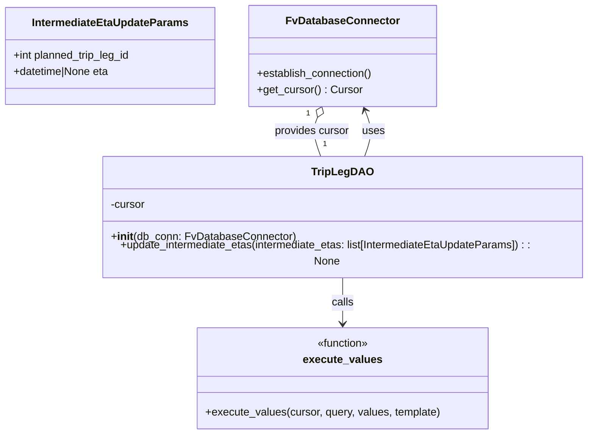

# Diagram: shipment_core/shipment_service/shipment_service/eta/eta_milestone_update/intermediate_eta/trip_leg_dao.py


> Auto-generated by Obscura crawlers

## Diagram 1



### SVG

<svg id="container" width="882.8125" xmlns="http://www.w3.org/2000/svg" class="classDiagram" height="632" viewBox="0 0 882.8125 632" role="graphics-document document" aria-roledescription="class"><style>#container{font-family:"trebuchet ms",verdana,arial,sans-serif;font-size:16px;fill:#333;}@keyframes edge-animation-frame{from{stroke-dashoffset:0;}}@keyframes dash{to{stroke-dashoffset:0;}}#container .edge-animation-slow{stroke-dasharray:9,5!important;stroke-dashoffset:900;animation:dash 50s linear infinite;stroke-linecap:round;}#container .edge-animation-fast{stroke-dasharray:9,5!important;stroke-dashoffset:900;animation:dash 20s linear infinite;stroke-linecap:round;}#container .error-icon{fill:#552222;}#container .error-text{fill:#552222;stroke:#552222;}#container .edge-thickness-normal{stroke-width:1px;}#container .edge-thickness-thick{stroke-width:3.5px;}#container .edge-pattern-solid{stroke-dasharray:0;}#container .edge-thickness-invisible{stroke-width:0;fill:none;}#container .edge-pattern-dashed{stroke-dasharray:3;}#container .edge-pattern-dotted{stroke-dasharray:2;}#container .marker{fill:#333333;stroke:#333333;}#container .marker.cross{stroke:#333333;}#container svg{font-family:"trebuchet ms",verdana,arial,sans-serif;font-size:16px;}#container p{margin:0;}#container g.classGroup text{fill:#9370DB;stroke:none;font-family:"trebuchet ms",verdana,arial,sans-serif;font-size:10px;}#container g.classGroup text .title{font-weight:bolder;}#container .nodeLabel,#container .edgeLabel{color:#131300;}#container .edgeLabel .label rect{fill:#ECECFF;}#container .label text{fill:#131300;}#container .labelBkg{background:#ECECFF;}#container .edgeLabel .label span{background:#ECECFF;}#container .classTitle{font-weight:bolder;}#container .node rect,#container .node circle,#container .node ellipse,#container .node polygon,#container .node path{fill:#ECECFF;stroke:#9370DB;stroke-width:1px;}#container .divider{stroke:#9370DB;stroke-width:1;}#container g.clickable{cursor:pointer;}#container g.classGroup rect{fill:#ECECFF;stroke:#9370DB;}#container g.classGroup line{stroke:#9370DB;stroke-width:1;}#container .classLabel .box{stroke:none;stroke-width:0;fill:#ECECFF;opacity:0.5;}#container .classLabel .label{fill:#9370DB;font-size:10px;}#container .relation{stroke:#333333;stroke-width:1;fill:none;}#container .dashed-line{stroke-dasharray:3;}#container .dotted-line{stroke-dasharray:1 2;}#container #compositionStart,#container .composition{fill:#333333!important;stroke:#333333!important;stroke-width:1;}#container #compositionEnd,#container .composition{fill:#333333!important;stroke:#333333!important;stroke-width:1;}#container #dependencyStart,#container .dependency{fill:#333333!important;stroke:#333333!important;stroke-width:1;}#container #dependencyStart,#container .dependency{fill:#333333!important;stroke:#333333!important;stroke-width:1;}#container #extensionStart,#container .extension{fill:transparent!important;stroke:#333333!important;stroke-width:1;}#container #extensionEnd,#container .extension{fill:transparent!important;stroke:#333333!important;stroke-width:1;}#container #aggregationStart,#container .aggregation{fill:transparent!important;stroke:#333333!important;stroke-width:1;}#container #aggregationEnd,#container .aggregation{fill:transparent!important;stroke:#333333!important;stroke-width:1;}#container #lollipopStart,#container .lollipop{fill:#ECECFF!important;stroke:#333333!important;stroke-width:1;}#container #lollipopEnd,#container .lollipop{fill:#ECECFF!important;stroke:#333333!important;stroke-width:1;}#container .edgeTerminals{font-size:11px;line-height:initial;}#container .classTitleText{text-anchor:middle;font-size:18px;fill:#333;}#container .label-icon{display:inline-block;height:1em;overflow:visible;vertical-align:-0.125em;}#container .node .label-icon path{fill:currentColor;stroke:revert;stroke-width:revert;}#container :root{--mermaid-font-family:"trebuchet ms",verdana,arial,sans-serif;}</style><g><defs><marker id="container_class-aggregationStart" class="marker aggregation class" refX="18" refY="7" markerWidth="190" markerHeight="240" orient="auto"><path d="M 18,7 L9,13 L1,7 L9,1 Z"></path></marker></defs><defs><marker id="container_class-aggregationEnd" class="marker aggregation class" refX="1" refY="7" markerWidth="20" markerHeight="28" orient="auto"><path d="M 18,7 L9,13 L1,7 L9,1 Z"></path></marker></defs><defs><marker id="container_class-extensionStart" class="marker extension class" refX="18" refY="7" markerWidth="190" markerHeight="240" orient="auto"><path d="M 1,7 L18,13 V 1 Z"></path></marker></defs><defs><marker id="container_class-extensionEnd" class="marker extension class" refX="1" refY="7" markerWidth="20" markerHeight="28" orient="auto"><path d="M 1,1 V 13 L18,7 Z"></path></marker></defs><defs><marker id="container_class-compositionStart" class="marker composition class" refX="18" refY="7" markerWidth="190" markerHeight="240" orient="auto"><path d="M 18,7 L9,13 L1,7 L9,1 Z"></path></marker></defs><defs><marker id="container_class-compositionEnd" class="marker composition class" refX="1" refY="7" markerWidth="20" markerHeight="28" orient="auto"><path d="M 18,7 L9,13 L1,7 L9,1 Z"></path></marker></defs><defs><marker id="container_class-dependencyStart" class="marker dependency class" refX="6" refY="7" markerWidth="190" markerHeight="240" orient="auto"><path d="M 5,7 L9,13 L1,7 L9,1 Z"></path></marker></defs><defs><marker id="container_class-dependencyEnd" class="marker dependency class" refX="13" refY="7" markerWidth="20" markerHeight="28" orient="auto"><path d="M 18,7 L9,13 L14,7 L9,1 Z"></path></marker></defs><defs><marker id="container_class-lollipopStart" class="marker lollipop class" refX="13" refY="7" markerWidth="190" markerHeight="240" orient="auto"><circle stroke="black" fill="transparent" cx="7" cy="7" r="6"></circle></marker></defs><defs><marker id="container_class-lollipopEnd" class="marker lollipop class" refX="1" refY="7" markerWidth="190" markerHeight="240" orient="auto"><circle stroke="black" fill="transparent" cx="7" cy="7" r="6"></circle></marker></defs><g class="root"><g class="clusters"></g><g class="edgePaths"><path d="M542.344,232L544.709,225.833C547.073,219.667,551.802,207.333,551.995,195.924C552.188,184.514,547.844,174.029,545.672,168.786L543.501,163.543" id="id_TripLegDAO_FvDatabaseConnector_1" class="edge-thickness-normal edge-pattern-solid relation" style=";;;" data-edge="true" data-et="edge" data-id="id_TripLegDAO_FvDatabaseConnector_1" data-points="W3sieCI6NTQyLjM0NDQ5MjUxMDMzMDYsInkiOjIzMn0seyJ4Ijo1NTYuNTMxMjUsInkiOjE5NX0seyJ4Ijo1NDEuMjA0NDg1MjEyMDUzNiwieSI6MTU4fV0=" marker-end="url(#container_class-dependencyEnd)"></path><path d="M510.137,400L510.137,406.167C510.137,412.333,510.137,424.667,510.137,436C510.137,447.333,510.137,457.667,510.137,462.833L510.137,468" id="id_TripLegDAO_execute_values_2" class="edge-thickness-normal edge-pattern-solid relation" style=";;;" data-edge="true" data-et="edge" data-id="id_TripLegDAO_execute_values_2" data-points="W3sieCI6NTEwLjEzNjcxODc1LCJ5Ijo0MDB9LHsieCI6NTEwLjEzNjcxODc1LCJ5Ijo0Mzd9LHsieCI6NTEwLjEzNjcxODc1LCJ5Ijo0NzR9XQ==" marker-end="url(#container_class-dependencyEnd)"></path><path d="M472.467,173.937L471.013,177.447C469.559,180.958,466.651,187.979,467.561,197.656C468.471,207.333,473.2,219.667,475.564,225.833L477.929,232" id="id_FvDatabaseConnector_TripLegDAO_3" class="edge-thickness-normal edge-pattern-solid relation" style=";;;" data-edge="true" data-et="edge" data-id="id_FvDatabaseConnector_TripLegDAO_3" data-points="W3sieCI6NDc5LjA2ODk1MjI4Nzk0NjQ0LCJ5IjoxNTh9LHsieCI6NDYzLjc0MjE4NzUsInkiOjE5NX0seyJ4Ijo0NzcuOTI4OTQ0OTg5NjY5NCwieSI6MjMyfV0=" marker-start="url(#container_class-aggregationStart)"></path></g><g class="edgeLabels"><g class="edgeLabel" transform="translate(556.45045, 194.80493)"><g class="label" data-id="id_TripLegDAO_FvDatabaseConnector_1" transform="translate(-16.4921875, -12)"><foreignObject width="32.984375" height="24"><div xmlns="http://www.w3.org/1999/xhtml" class="labelBkg" style="display: table-cell; white-space: nowrap; line-height: 1.5; max-width: 200px; text-align: center;"><span class="edgeLabel"><p>uses</p></span></div></foreignObject></g></g><g class="edgeLabel" transform="translate(510.13671875, 437)"><g class="label" data-id="id_TripLegDAO_execute_values_2" transform="translate(-16.4453125, -12)"><foreignObject width="32.890625" height="24"><div xmlns="http://www.w3.org/1999/xhtml" class="labelBkg" style="display: table-cell; white-space: nowrap; line-height: 1.5; max-width: 200px; text-align: center;"><span class="edgeLabel"><p>calls</p></span></div></foreignObject></g></g><g class="edgeLabel" transform="translate(463.82299, 194.80493)"><g class="label" data-id="id_FvDatabaseConnector_TripLegDAO_3" transform="translate(-56.296875, -12)"><foreignObject width="112.59375" height="24"><div xmlns="http://www.w3.org/1999/xhtml" class="labelBkg" style="display: table-cell; white-space: nowrap; line-height: 1.5; max-width: 200px; text-align: center;"><span class="edgeLabel"><p>provides cursor</p></span></div></foreignObject></g></g><g class="edgeTerminals" transform="translate(458.5135920068851, 168.42723366261566)"><g class="inner" transform="translate(0, 0)"><foreignObject style="width: 9px; height: 12px;"><div xmlns="http://www.w3.org/1999/xhtml" style="display: inline-block; padding-right: 1px; white-space: nowrap;"><span class="edgeLabel">1</span></div></foreignObject></g></g><g class="edgeTerminals" transform="translate(480.6695061548464, 205.28978013699682)"><g class="inner" transform="translate(0, 0)"></g><foreignObject style="width: 9px; height: 12px;"><div xmlns="http://www.w3.org/1999/xhtml" style="display: inline-block; padding-right: 1px; white-space: nowrap;"><span class="edgeLabel">1</span></div></foreignObject></g></g><g class="nodes"><g class="node default" id="classId-IntermediateEtaUpdateParams-0" transform="translate(164.92578125, 83)"><g class="basic label-container"><path d="M-156.92578125 -72 L156.92578125 -72 L156.92578125 72 L-156.92578125 72" stroke="none" stroke-width="0" fill="#ECECFF" style=""></path><path d="M-156.92578125 -72 C-49.11479082923536 -72, 58.69619959152928 -72, 156.92578125 -72 M-156.92578125 -72 C-69.53358929398337 -72, 17.858602662033263 -72, 156.92578125 -72 M156.92578125 -72 C156.92578125 -27.564509225165786, 156.92578125 16.87098154966843, 156.92578125 72 M156.92578125 -72 C156.92578125 -18.068623311671374, 156.92578125 35.86275337665725, 156.92578125 72 M156.92578125 72 C65.4623796879592 72, -26.0010218740816 72, -156.92578125 72 M156.92578125 72 C93.6245685914096 72, 30.32335593281921 72, -156.92578125 72 M-156.92578125 72 C-156.92578125 33.46839774531888, -156.92578125 -5.063204509362237, -156.92578125 -72 M-156.92578125 72 C-156.92578125 40.88471415375619, -156.92578125 9.769428307512385, -156.92578125 -72" stroke="#9370DB" stroke-width="1.3" fill="none" stroke-dasharray="0 0" style=""></path></g><g class="annotation-group text" transform="translate(0, -48)"></g><g class="label-group text" transform="translate(-112.1796875, -48)"><g class="label" style="font-weight: bolder" transform="translate(0,-12)"><foreignObject width="224.359375" height="24"><div xmlns="http://www.w3.org/1999/xhtml" style="display: table-cell; white-space: nowrap; line-height: 1.5; max-width: 272px; text-align: center;"><span class="nodeLabel markdown-node-label" style=""><p>IntermediateEtaUpdateParams</p></span></div></foreignObject></g></g><g class="members-group text" transform="translate(-144.92578125, 0)"><g class="label" style="" transform="translate(0,-12)"><foreignObject width="177.671875" height="24"><div xmlns="http://www.w3.org/1999/xhtml" style="display: table-cell; white-space: nowrap; line-height: 1.5; max-width: 235px; text-align: center;"><span class="nodeLabel markdown-node-label" style=""><p>+int planned_trip_leg_id</p></span></div></foreignObject></g><g class="label" style="" transform="translate(0,12)"><foreignObject width="145.390625" height="24"><div xmlns="http://www.w3.org/1999/xhtml" style="display: table-cell; white-space: nowrap; line-height: 1.5; max-width: 203px; text-align: center;"><span class="nodeLabel markdown-node-label" style=""><p>+datetime|None eta</p></span></div></foreignObject></g></g><g class="methods-group text" transform="translate(-144.92578125, 72)"></g><g class="divider" style=""><path d="M-156.92578125 -24 C-44.63488998250098 -24, 67.65600128499804 -24, 156.92578125 -24 M-156.92578125 -24 C-90.61973201343125 -24, -24.313682776862493 -24, 156.92578125 -24" stroke="#9370DB" stroke-width="1.3" fill="none" stroke-dasharray="0 0" style=""></path></g><g class="divider" style=""><path d="M-156.92578125 48 C-31.651450649590828 48, 93.62287995081834 48, 156.92578125 48 M-156.92578125 48 C-44.8403667714645 48, 67.245047707071 48, 156.92578125 48" stroke="#9370DB" stroke-width="1.3" fill="none" stroke-dasharray="0 0" style=""></path></g></g><g class="node default" id="classId-FvDatabaseConnector-1" transform="translate(510.13671875, 83)"><g class="basic label-container"><path d="M-138.28515625 -75 L138.28515625 -75 L138.28515625 75 L-138.28515625 75" stroke="none" stroke-width="0" fill="#ECECFF" style=""></path><path d="M-138.28515625 -75 C-82.10083428862028 -75, -25.916512327240554 -75, 138.28515625 -75 M-138.28515625 -75 C-45.647248049711095 -75, 46.99066015057781 -75, 138.28515625 -75 M138.28515625 -75 C138.28515625 -25.469569893470116, 138.28515625 24.06086021305977, 138.28515625 75 M138.28515625 -75 C138.28515625 -38.26880113666494, 138.28515625 -1.537602273329881, 138.28515625 75 M138.28515625 75 C61.75269616769839 75, -14.779763914603222 75, -138.28515625 75 M138.28515625 75 C82.41825274883399 75, 26.551349247668 75, -138.28515625 75 M-138.28515625 75 C-138.28515625 18.13714768180536, -138.28515625 -38.72570463638928, -138.28515625 -75 M-138.28515625 75 C-138.28515625 24.11667564466513, -138.28515625 -26.76664871066974, -138.28515625 -75" stroke="#9370DB" stroke-width="1.3" fill="none" stroke-dasharray="0 0" style=""></path></g><g class="annotation-group text" transform="translate(0, -51)"></g><g class="label-group text" transform="translate(-79.3046875, -51)"><g class="label" style="font-weight: bolder" transform="translate(0,-12)"><foreignObject width="158.609375" height="24"><div xmlns="http://www.w3.org/1999/xhtml" style="display: table-cell; white-space: nowrap; line-height: 1.5; max-width: 207px; text-align: center;"><span class="nodeLabel markdown-node-label" style=""><p>FvDatabaseConnector</p></span></div></foreignObject></g></g><g class="members-group text" transform="translate(-126.28515625, -3)"></g><g class="methods-group text" transform="translate(-126.28515625, 27)"><g class="label" style="" transform="translate(0,-12)"><foreignObject width="173.265625" height="24"><div xmlns="http://www.w3.org/1999/xhtml" style="display: table-cell; white-space: nowrap; line-height: 1.5; max-width: 231px; text-align: center;"><span class="nodeLabel markdown-node-label" style=""><p>+establish_connection()</p></span></div></foreignObject></g><g class="label" style="" transform="translate(0,12)"><foreignObject width="153.890625" height="24"><div xmlns="http://www.w3.org/1999/xhtml" style="display: table-cell; white-space: nowrap; line-height: 1.5; max-width: 212px; text-align: center;"><span class="nodeLabel markdown-node-label" style=""><p>+get_cursor() : Cursor</p></span></div></foreignObject></g></g><g class="divider" style=""><path d="M-138.28515625 -27 C-38.017147116035986 -27, 62.25086201792803 -27, 138.28515625 -27 M-138.28515625 -27 C-62.880367569407156 -27, 12.524421111185688 -27, 138.28515625 -27" stroke="#9370DB" stroke-width="1.3" fill="none" stroke-dasharray="0 0" style=""></path></g><g class="divider" style=""><path d="M-138.28515625 -3 C-73.94195940204078 -3, -9.59876255408156 -3, 138.28515625 -3 M-138.28515625 -3 C-82.54427491776656 -3, -26.80339358553313 -3, 138.28515625 -3" stroke="#9370DB" stroke-width="1.3" fill="none" stroke-dasharray="0 0" style=""></path></g></g><g class="node default" id="classId-TripLegDAO-2" transform="translate(510.13671875, 316)"><g class="basic label-container"><path d="M-364.67578125 -84 L364.67578125 -84 L364.67578125 84 L-364.67578125 84" stroke="none" stroke-width="0" fill="#ECECFF" style=""></path><path d="M-364.67578125 -84 C-86.00695303484417 -84, 192.66187518031165 -84, 364.67578125 -84 M-364.67578125 -84 C-103.20335973496935 -84, 158.2690617800613 -84, 364.67578125 -84 M364.67578125 -84 C364.67578125 -40.87834048040266, 364.67578125 2.243319039194674, 364.67578125 84 M364.67578125 -84 C364.67578125 -45.62312344360853, 364.67578125 -7.246246887217055, 364.67578125 84 M364.67578125 84 C167.95544139358202 84, -28.76489846283596 84, -364.67578125 84 M364.67578125 84 C148.85566575399207 84, -66.96444974201586 84, -364.67578125 84 M-364.67578125 84 C-364.67578125 26.1604412910809, -364.67578125 -31.6791174178382, -364.67578125 -84 M-364.67578125 84 C-364.67578125 34.43236298150216, -364.67578125 -15.135274036995682, -364.67578125 -84" stroke="#9370DB" stroke-width="1.3" fill="none" stroke-dasharray="0 0" style=""></path></g><g class="annotation-group text" transform="translate(0, -60)"></g><g class="label-group text" transform="translate(-42.3515625, -60)"><g class="label" style="font-weight: bolder" transform="translate(0,-12)"><foreignObject width="84.703125" height="24"><div xmlns="http://www.w3.org/1999/xhtml" style="display: table-cell; white-space: nowrap; line-height: 1.5; max-width: 133px; text-align: center;"><span class="nodeLabel markdown-node-label" style=""><p>TripLegDAO</p></span></div></foreignObject></g></g><g class="members-group text" transform="translate(-352.67578125, -12)"><g class="label" style="" transform="translate(0,-12)"><foreignObject width="52.1875" height="24"><div xmlns="http://www.w3.org/1999/xhtml" style="display: table-cell; white-space: nowrap; line-height: 1.5; max-width: 110px; text-align: center;"><span class="nodeLabel markdown-node-label" style=""><p>-cursor</p></span></div></foreignObject></g></g><g class="methods-group text" transform="translate(-352.67578125, 36)"><g class="label" style="" transform="translate(0,-12)"><foreignObject width="269.671875" height="24"><div xmlns="http://www.w3.org/1999/xhtml" style="display: table-cell; white-space: nowrap; line-height: 1.5; max-width: 358px; text-align: center;"><span class="nodeLabel markdown-node-label" style=""><p>+<strong>init</strong>(db_conn: FvDatabaseConnector)</p></span></div></foreignObject></g><g class="label" style="" transform="translate(0,12)"><foreignObject width="663" height="24"><div xmlns="http://www.w3.org/1999/xhtml" style="display: table-cell; white-space: nowrap; line-height: 1.5; max-width: 720px; text-align: center;"><span class="nodeLabel markdown-node-label" style=""><p>+update_intermediate_etas(intermediate_etas: list[IntermediateEtaUpdateParams]) : : None</p></span></div></foreignObject></g></g><g class="divider" style=""><path d="M-364.67578125 -36 C-181.50476429237233 -36, 1.6662526652553424 -36, 364.67578125 -36 M-364.67578125 -36 C-78.69333498911146 -36, 207.28911127177707 -36, 364.67578125 -36" stroke="#9370DB" stroke-width="1.3" fill="none" stroke-dasharray="0 0" style=""></path></g><g class="divider" style=""><path d="M-364.67578125 12 C-193.2334678835361 12, -21.791154517072187 12, 364.67578125 12 M-364.67578125 12 C-79.02123879982628 12, 206.63330365034744 12, 364.67578125 12" stroke="#9370DB" stroke-width="1.3" fill="none" stroke-dasharray="0 0" style=""></path></g></g><g class="node default" id="classId-execute_values-3" transform="translate(510.13671875, 549)"><g class="basic label-container"><path d="M-214.45703125 -75 L214.45703125 -75 L214.45703125 75 L-214.45703125 75" stroke="none" stroke-width="0" fill="#ECECFF" style=""></path><path d="M-214.45703125 -75 C-77.91711960081679 -75, 58.62279204836642 -75, 214.45703125 -75 M-214.45703125 -75 C-118.24506266546524 -75, -22.033094080930482 -75, 214.45703125 -75 M214.45703125 -75 C214.45703125 -38.003501383897564, 214.45703125 -1.0070027677951288, 214.45703125 75 M214.45703125 -75 C214.45703125 -32.22530571646359, 214.45703125 10.549388567072825, 214.45703125 75 M214.45703125 75 C113.1782979394931 75, 11.899564628986212 75, -214.45703125 75 M214.45703125 75 C125.04009907843428 75, 35.62316690686856 75, -214.45703125 75 M-214.45703125 75 C-214.45703125 44.780763268094994, -214.45703125 14.561526536189987, -214.45703125 -75 M-214.45703125 75 C-214.45703125 23.782269051130882, -214.45703125 -27.435461897738236, -214.45703125 -75" stroke="#9370DB" stroke-width="1.3" fill="none" stroke-dasharray="0 0" style=""></path></g><g class="annotation-group text" transform="translate(-39.484375, -51)"><g class="label" style="" transform="translate(0,-12)"><foreignObject width="78.96875" height="24"><div xmlns="http://www.w3.org/1999/xhtml" style="display: table-cell; white-space: nowrap; line-height: 1.5; max-width: 129px; text-align: center;"><span class="nodeLabel markdown-node-label" style=""><p>«function»</p></span></div></foreignObject></g></g><g class="label-group text" transform="translate(-55.6328125, -27)"><g class="label" style="font-weight: bolder" transform="translate(0,-12)"><foreignObject width="111.265625" height="24"><div xmlns="http://www.w3.org/1999/xhtml" style="display: table-cell; white-space: nowrap; line-height: 1.5; max-width: 160px; text-align: center;"><span class="nodeLabel markdown-node-label" style=""><p>execute_values</p></span></div></foreignObject></g></g><g class="members-group text" transform="translate(-202.45703125, 21)"></g><g class="methods-group text" transform="translate(-202.45703125, 51)"><g class="label" style="" transform="translate(0,-12)"><foreignObject width="349.28125" height="24"><div xmlns="http://www.w3.org/1999/xhtml" style="display: table-cell; white-space: nowrap; line-height: 1.5; max-width: 407px; text-align: center;"><span class="nodeLabel markdown-node-label" style=""><p>+execute_values(cursor, query, values, template)</p></span></div></foreignObject></g></g><g class="divider" style=""><path d="M-214.45703125 -3 C-116.87144470797352 -3, -19.285858165947047 -3, 214.45703125 -3 M-214.45703125 -3 C-66.33297678798345 -3, 81.79107767403309 -3, 214.45703125 -3" stroke="#9370DB" stroke-width="1.3" fill="none" stroke-dasharray="0 0" style=""></path></g><g class="divider" style=""><path d="M-214.45703125 21 C-49.055788868500315 21, 116.34545351299937 21, 214.45703125 21 M-214.45703125 21 C-44.87477262568416 21, 124.70748599863168 21, 214.45703125 21" stroke="#9370DB" stroke-width="1.3" fill="none" stroke-dasharray="0 0" style=""></path></g></g></g></g></g></svg>

## Diagram 2

```mermaid
flowchart TD
    Start(("Start"))
    Establish[/"db_conn.establish_connection()"/]
    GetCursor[/"self.cursor = db_conn.get_cursor()"/]
    PrepareQuery[[Prepare UPDATE query with VALUES and template "(%(planned_trip_leg_id)s, %(eta)s)"]]
    Execute{Call execute_values(self.cursor, query, intermediate_etas, template)}
    DecisionOverride{"Override exists for trip_leg?\n(pto.active_until >= NOW_UTC())"}
    UpdateDB([Update planned_trip_leg.eta = updated_etas.eta::timestamp])
    SkipUpdate([Skip update for this leg])
    End(("End"))

    Start --> Establish --> GetCursor --> PrepareQuery --> Execute --> DecisionOverride
    DecisionOverride -- No --> UpdateDB --> End
    DecisionOverride -- Yes --> SkipUpdate --> End
```

> SVG rendering failed for this diagram.
