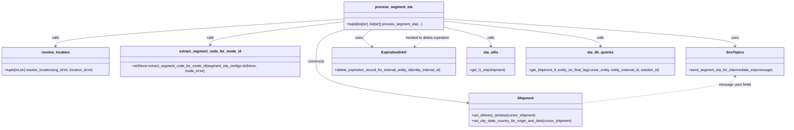

# Diagram: shipment_core/shipment_service/shipment_service/eta/eta_milestone_update/segment_eta.py


> Auto-generated by Obscura crawlers

## Diagram 1

```mermaid
flowchart LR
  Start([start process_segment_eta])
  A[resolve_location(org_id, location_id)]
  B{for each entity_external_id in params.entity_list}
  C[get_entity_eta_milestone_data(cursor_entity, entity_id)]
  D[should_skip_eta_calc(...) or on_final_mile?]
  E[build Shipment object & set delivery window / city/state/country]
  F{segment_eta_code_for_current_mode?}
  G[already_calculated_segment_etas lookup]
  H[get_l1_eta(shipment)]
  I{status_eta_date_time is not None}
  J{has_eta_changed?}
  K[queue_add_entity_progress_update(...)]
  L[expiration_dao.delete_expiration_record_for_internal_entity_id(...)]
  M{non-truck & segment_code present?}
  N[sns_topics.send_segment_eta_for_intermediate_eta(...)]
  O[set_next_milestone_flag(...)]
  End([return entities_with_etas, logs])

  Start --> A --> B
  B --> C
  C -->|None -> skip| B
  C --> D
  D -->|skip -> log_skip| B
  D --> E
  E --> F
  F -->|no| B
  F -->|yes| G
  G -->|found| H
  G -->|not found| H
  H --> I
  I -->|no| O
  I -->|yes| J
  J -->|no -> log ETA unchanged| O
  J -->|yes| K
  K --> L
  L --> M
  M -->|yes| N
  M -->|no| O
  O --> B
  B -->|done| End
```

> SVG rendering failed for this diagram.

## Diagram 2



### SVG

<svg id="container" width="3592.484375" xmlns="http://www.w3.org/2000/svg" class="classDiagram" height="590" viewBox="0 0 3592.484375 590" role="graphics-document document" aria-roledescription="class"><style>#container{font-family:"trebuchet ms",verdana,arial,sans-serif;font-size:16px;fill:#333;}@keyframes edge-animation-frame{from{stroke-dashoffset:0;}}@keyframes dash{to{stroke-dashoffset:0;}}#container .edge-animation-slow{stroke-dasharray:9,5!important;stroke-dashoffset:900;animation:dash 50s linear infinite;stroke-linecap:round;}#container .edge-animation-fast{stroke-dasharray:9,5!important;stroke-dashoffset:900;animation:dash 20s linear infinite;stroke-linecap:round;}#container .error-icon{fill:#552222;}#container .error-text{fill:#552222;stroke:#552222;}#container .edge-thickness-normal{stroke-width:1px;}#container .edge-thickness-thick{stroke-width:3.5px;}#container .edge-pattern-solid{stroke-dasharray:0;}#container .edge-thickness-invisible{stroke-width:0;fill:none;}#container .edge-pattern-dashed{stroke-dasharray:3;}#container .edge-pattern-dotted{stroke-dasharray:2;}#container .marker{fill:#333333;stroke:#333333;}#container .marker.cross{stroke:#333333;}#container svg{font-family:"trebuchet ms",verdana,arial,sans-serif;font-size:16px;}#container p{margin:0;}#container g.classGroup text{fill:#9370DB;stroke:none;font-family:"trebuchet ms",verdana,arial,sans-serif;font-size:10px;}#container g.classGroup text .title{font-weight:bolder;}#container .nodeLabel,#container .edgeLabel{color:#131300;}#container .edgeLabel .label rect{fill:#ECECFF;}#container .label text{fill:#131300;}#container .labelBkg{background:#ECECFF;}#container .edgeLabel .label span{background:#ECECFF;}#container .classTitle{font-weight:bolder;}#container .node rect,#container .node circle,#container .node ellipse,#container .node polygon,#container .node path{fill:#ECECFF;stroke:#9370DB;stroke-width:1px;}#container .divider{stroke:#9370DB;stroke-width:1;}#container g.clickable{cursor:pointer;}#container g.classGroup rect{fill:#ECECFF;stroke:#9370DB;}#container g.classGroup line{stroke:#9370DB;stroke-width:1;}#container .classLabel .box{stroke:none;stroke-width:0;fill:#ECECFF;opacity:0.5;}#container .classLabel .label{fill:#9370DB;font-size:10px;}#container .relation{stroke:#333333;stroke-width:1;fill:none;}#container .dashed-line{stroke-dasharray:3;}#container .dotted-line{stroke-dasharray:1 2;}#container #compositionStart,#container .composition{fill:#333333!important;stroke:#333333!important;stroke-width:1;}#container #compositionEnd,#container .composition{fill:#333333!important;stroke:#333333!important;stroke-width:1;}#container #dependencyStart,#container .dependency{fill:#333333!important;stroke:#333333!important;stroke-width:1;}#container #dependencyStart,#container .dependency{fill:#333333!important;stroke:#333333!important;stroke-width:1;}#container #extensionStart,#container .extension{fill:transparent!important;stroke:#333333!important;stroke-width:1;}#container #extensionEnd,#container .extension{fill:transparent!important;stroke:#333333!important;stroke-width:1;}#container #aggregationStart,#container .aggregation{fill:transparent!important;stroke:#333333!important;stroke-width:1;}#container #aggregationEnd,#container .aggregation{fill:transparent!important;stroke:#333333!important;stroke-width:1;}#container #lollipopStart,#container .lollipop{fill:#ECECFF!important;stroke:#333333!important;stroke-width:1;}#container #lollipopEnd,#container .lollipop{fill:#ECECFF!important;stroke:#333333!important;stroke-width:1;}#container .edgeTerminals{font-size:11px;line-height:initial;}#container .classTitleText{text-anchor:middle;font-size:18px;fill:#333;}#container .label-icon{display:inline-block;height:1em;overflow:visible;vertical-align:-0.125em;}#container .node .label-icon path{fill:currentColor;stroke:revert;stroke-width:revert;}#container :root{--mermaid-font-family:"trebuchet ms",verdana,arial,sans-serif;}</style><g><defs><marker id="container_class-aggregationStart" class="marker aggregation class" refX="18" refY="7" markerWidth="190" markerHeight="240" orient="auto"><path d="M 18,7 L9,13 L1,7 L9,1 Z"></path></marker></defs><defs><marker id="container_class-aggregationEnd" class="marker aggregation class" refX="1" refY="7" markerWidth="20" markerHeight="28" orient="auto"><path d="M 18,7 L9,13 L1,7 L9,1 Z"></path></marker></defs><defs><marker id="container_class-extensionStart" class="marker extension class" refX="18" refY="7" markerWidth="190" markerHeight="240" orient="auto"><path d="M 1,7 L18,13 V 1 Z"></path></marker></defs><defs><marker id="container_class-extensionEnd" class="marker extension class" refX="1" refY="7" markerWidth="20" markerHeight="28" orient="auto"><path d="M 1,1 V 13 L18,7 Z"></path></marker></defs><defs><marker id="container_class-compositionStart" class="marker composition class" refX="18" refY="7" markerWidth="190" markerHeight="240" orient="auto"><path d="M 18,7 L9,13 L1,7 L9,1 Z"></path></marker></defs><defs><marker id="container_class-compositionEnd" class="marker composition class" refX="1" refY="7" markerWidth="20" markerHeight="28" orient="auto"><path d="M 18,7 L9,13 L1,7 L9,1 Z"></path></marker></defs><defs><marker id="container_class-dependencyStart" class="marker dependency class" refX="6" refY="7" markerWidth="190" markerHeight="240" orient="auto"><path d="M 5,7 L9,13 L1,7 L9,1 Z"></path></marker></defs><defs><marker id="container_class-dependencyEnd" class="marker dependency class" refX="13" refY="7" markerWidth="20" markerHeight="28" orient="auto"><path d="M 18,7 L9,13 L14,7 L9,1 Z"></path></marker></defs><defs><marker id="container_class-lollipopStart" class="marker lollipop class" refX="13" refY="7" markerWidth="190" markerHeight="240" orient="auto"><circle stroke="black" fill="transparent" cx="7" cy="7" r="6"></circle></marker></defs><defs><marker id="container_class-lollipopEnd" class="marker lollipop class" refX="1" refY="7" markerWidth="190" markerHeight="240" orient="auto"><circle stroke="black" fill="transparent" cx="7" cy="7" r="6"></circle></marker></defs><g class="root"><g class="clusters"></g><g class="edgePaths"><path d="M1582.645,87.411L1361.889,103.342C1141.133,119.274,699.621,151.137,478.865,174.235C258.109,197.333,258.109,211.667,258.109,218.833L258.109,226" id="id_process_segment_eta_resolve_location_1" class="edge-thickness-normal edge-pattern-solid relation" style=";;;" data-edge="true" data-et="edge" data-id="id_process_segment_eta_resolve_location_1" data-points="W3sieCI6MTU4Mi42NDQ1MzEyNSwieSI6ODcuNDEwNjU4MTAyMDYwNDR9LHsieCI6MjU4LjEwOTM3NSwieSI6MTgzfSx7IngiOjI1OC4xMDkzNzUsInkiOjIzMn1d" marker-end="url(#container_class-dependencyEnd)"></path><path d="M1582.645,101.269L1480.313,114.891C1377.982,128.513,1173.319,155.756,1070.988,176.545C968.656,197.333,968.656,211.667,968.656,218.833L968.656,226" id="id_process_segment_eta_extract_segment_code_for_mode_id_2" class="edge-thickness-normal edge-pattern-solid relation" style=";;;" data-edge="true" data-et="edge" data-id="id_process_segment_eta_extract_segment_code_for_mode_id_2" data-points="W3sieCI6MTU4Mi42NDQ1MzEyNSwieSI6MTAxLjI2OTQ0MTExNzIwODQ2fSx7IngiOjk2OC42NTYyNSwieSI6MTgzfSx7IngiOjk2OC42NTYyNSwieSI6MjMyfV0=" marker-end="url(#container_class-dependencyEnd)"></path><path d="M1608.607,134L1582.495,142.167C1556.384,150.333,1504.161,166.667,1478.049,193.5C1451.938,220.333,1451.938,257.667,1451.938,293C1451.938,328.333,1451.938,361.667,1567.608,391.874C1683.278,422.081,1914.618,449.162,2030.288,462.703L2145.959,476.243" id="id_process_segment_eta_Shipment_3" class="edge-thickness-normal edge-pattern-solid relation" style=";;;" data-edge="true" data-et="edge" data-id="id_process_segment_eta_Shipment_3" data-points="W3sieCI6MTYwOC42MDY5MzM1OTM3NSwieSI6MTM0fSx7IngiOjE0NTEuOTM3NSwieSI6MTgzfSx7IngiOjE0NTEuOTM3NSwieSI6Mjk1fSx7IngiOjE0NTEuOTM3NSwieSI6Mzk1fSx7IngiOjIxNTEuOTE3OTY4NzUsInkiOjQ3Ni45NDA3OTE0ODgyMTUwNH1d" marker-end="url(#container_class-dependencyEnd)"></path><path d="M2037.434,128.47L2073.394,137.558C2109.354,146.647,2181.275,164.823,2217.235,181.078C2253.195,197.333,2253.195,211.667,2253.195,218.833L2253.195,226" id="id_process_segment_eta_eta_utils_4" class="edge-thickness-normal edge-pattern-solid relation" style=";;;" data-edge="true" data-et="edge" data-id="id_process_segment_eta_eta_utils_4" data-points="W3sieCI6MjAzNy40MzM1OTM3NSwieSI6MTI4LjQ2OTk5NTA2MzgxNzc4fSx7IngiOjIyNTMuMTk1MzEyNSwieSI6MTgzfSx7IngiOjIyNTMuMTk1MzEyNSwieSI6MjMyfV0=" marker-end="url(#container_class-dependencyEnd)"></path><path d="M2037.434,97.987L2156.822,112.156C2276.211,126.325,2514.988,154.662,2634.377,175.998C2753.766,197.333,2753.766,211.667,2753.766,218.833L2753.766,226" id="id_process_segment_eta_eta_db_queries_5" class="edge-thickness-normal edge-pattern-solid relation" style=";;;" data-edge="true" data-et="edge" data-id="id_process_segment_eta_eta_db_queries_5" data-points="W3sieCI6MjAzNy40MzM1OTM3NSwieSI6OTcuOTg2ODI5MTQzMTA3ODV9LHsieCI6Mjc1My43NjU2MjUsInkiOjE4M30seyJ4IjoyNzUzLjc2NTYyNSwieSI6MjMyfV0=" marker-end="url(#container_class-dependencyEnd)"></path><path d="M2037.434,87.374L2258.771,103.312C2480.109,119.249,2922.785,151.125,3144.123,174.229C3365.461,197.333,3365.461,211.667,3365.461,218.833L3365.461,226" id="id_process_segment_eta_SnsTopics_6" class="edge-thickness-normal edge-pattern-solid relation" style=";;;" data-edge="true" data-et="edge" data-id="id_process_segment_eta_SnsTopics_6" data-points="W3sieCI6MjAzNy40MzM1OTM3NSwieSI6ODcuMzczODEzMzc0NTg2ODd9LHsieCI6MzM2NS40NjA5Mzc1LCJ5IjoxODN9LHsieCI6MzM2NS40NjA5Mzc1LCJ5IjoyMzJ9XQ==" marker-end="url(#container_class-dependencyEnd)"></path><path d="M1719.586,134L1707.861,142.167C1696.136,150.333,1672.685,166.667,1671.864,182.428C1671.044,198.19,1692.853,213.381,1703.758,220.976L1714.663,228.571" id="id_process_segment_eta_ExpirationDAO_7" class="edge-thickness-normal edge-pattern-solid relation" style=";;;" data-edge="true" data-et="edge" data-id="id_process_segment_eta_ExpirationDAO_7" data-points="W3sieCI6MTcxOS41ODY0MjU3ODEyNSwieSI6MTM0fSx7IngiOjE2NDkuMjM0Mzc1LCJ5IjoxODN9LHsieCI6MTcxOS41ODY0MjU3ODEyNSwieSI6MjMyfV0=" marker-end="url(#container_class-dependencyEnd)"></path><path d="M3365.461,364L3365.461,369.167C3365.461,374.333,3365.461,384.667,3248.798,403.49C3132.134,422.314,2898.807,449.627,2782.144,463.284L2665.48,476.941" id="id_SnsTopics_Shipment_8" class="edge-thickness-normal edge-pattern-dashed relation" style=";;;" data-edge="true" data-et="edge" data-id="id_SnsTopics_Shipment_8" data-points="W3sieCI6MzM2NS40NjA5Mzc1LCJ5IjozNTh9LHsieCI6MzM2NS40NjA5Mzc1LCJ5IjozOTV9LHsieCI6MjY2NS40ODA0Njg3NSwieSI6NDc2Ljk0MDc5MTQ4ODIxNTA0fV0=" marker-start="url(#container_class-dependencyStart)"></path><path d="M1901.147,228.461L1911.521,220.884C1921.896,213.308,1942.645,198.154,1941.838,182.41C1941.03,166.667,1918.666,150.333,1907.484,142.167L1896.302,134" id="id_ExpirationDAO_process_segment_eta_9" class="edge-thickness-normal edge-pattern-dashed relation" style=";;;" data-edge="true" data-et="edge" data-id="id_ExpirationDAO_process_segment_eta_9" data-points="W3sieCI6MTg5Ni4zMDE1MTM2NzE4NzUsInkiOjIzMn0seyJ4IjoxOTYzLjM5NDUzMTI1LCJ5IjoxODN9LHsieCI6MTg5Ni4zMDE1MTM2NzE4NzUsInkiOjEzNH1d" marker-start="url(#container_class-dependencyStart)"></path></g><g class="edgeLabels"><g class="edgeLabel" transform="translate(258.109375, 183)"><g class="label" data-id="id_process_segment_eta_resolve_location_1" transform="translate(-16.4453125, -12)"><foreignObject width="32.890625" height="24"><div xmlns="http://www.w3.org/1999/xhtml" class="labelBkg" style="display: table-cell; white-space: nowrap; line-height: 1.5; max-width: 200px; text-align: center;"><span class="edgeLabel"><p>calls</p></span></div></foreignObject></g></g><g class="edgeLabel" transform="translate(968.65625, 183)"><g class="label" data-id="id_process_segment_eta_extract_segment_code_for_mode_id_2" transform="translate(-16.4453125, -12)"><foreignObject width="32.890625" height="24"><div xmlns="http://www.w3.org/1999/xhtml" class="labelBkg" style="display: table-cell; white-space: nowrap; line-height: 1.5; max-width: 200px; text-align: center;"><span class="edgeLabel"><p>calls</p></span></div></foreignObject></g></g><g class="edgeLabel" transform="translate(1451.9375, 295)"><g class="label" data-id="id_process_segment_eta_Shipment_3" transform="translate(-37.84375, -12)"><foreignObject width="75.6875" height="24"><div xmlns="http://www.w3.org/1999/xhtml" class="labelBkg" style="display: table-cell; white-space: nowrap; line-height: 1.5; max-width: 200px; text-align: center;"><span class="edgeLabel"><p>constructs</p></span></div></foreignObject></g></g><g class="edgeLabel" transform="translate(2253.1953125, 183)"><g class="label" data-id="id_process_segment_eta_eta_utils_4" transform="translate(-16.4453125, -12)"><foreignObject width="32.890625" height="24"><div xmlns="http://www.w3.org/1999/xhtml" class="labelBkg" style="display: table-cell; white-space: nowrap; line-height: 1.5; max-width: 200px; text-align: center;"><span class="edgeLabel"><p>calls</p></span></div></foreignObject></g></g><g class="edgeLabel" transform="translate(2753.765625, 183)"><g class="label" data-id="id_process_segment_eta_eta_db_queries_5" transform="translate(-16.4453125, -12)"><foreignObject width="32.890625" height="24"><div xmlns="http://www.w3.org/1999/xhtml" class="labelBkg" style="display: table-cell; white-space: nowrap; line-height: 1.5; max-width: 200px; text-align: center;"><span class="edgeLabel"><p>calls</p></span></div></foreignObject></g></g><g class="edgeLabel" transform="translate(3365.4609375, 183)"><g class="label" data-id="id_process_segment_eta_SnsTopics_6" transform="translate(-16.4921875, -12)"><foreignObject width="32.984375" height="24"><div xmlns="http://www.w3.org/1999/xhtml" class="labelBkg" style="display: table-cell; white-space: nowrap; line-height: 1.5; max-width: 200px; text-align: center;"><span class="edgeLabel"><p>uses</p></span></div></foreignObject></g></g><g class="edgeLabel" transform="translate(1649.234375, 183)"><g class="label" data-id="id_process_segment_eta_ExpirationDAO_7" transform="translate(-16.4921875, -12)"><foreignObject width="32.984375" height="24"><div xmlns="http://www.w3.org/1999/xhtml" class="labelBkg" style="display: table-cell; white-space: nowrap; line-height: 1.5; max-width: 200px; text-align: center;"><span class="edgeLabel"><p>uses</p></span></div></foreignObject></g></g><g class="edgeLabel" transform="translate(3365.4609375, 395)"><g class="label" data-id="id_SnsTopics_Shipment_8" transform="translate(-71.7109375, -12)"><foreignObject width="143.421875" height="24"><div xmlns="http://www.w3.org/1999/xhtml" class="labelBkg" style="display: table-cell; white-space: nowrap; line-height: 1.5; max-width: 200px; text-align: center;"><span class="edgeLabel"><p>message uses fields</p></span></div></foreignObject></g></g><g class="edgeLabel" transform="translate(1963.39453125, 183)"><g class="label" data-id="id_ExpirationDAO_process_segment_eta_9" transform="translate(-100, -24)"><foreignObject width="200" height="48"><div xmlns="http://www.w3.org/1999/xhtml" class="labelBkg" style="display: table; white-space: break-spaces; line-height: 1.5; max-width: 200px; text-align: center; width: 200px;"><span class="edgeLabel"><p>invoked to delete expiration</p></span></div></foreignObject></g></g></g><g class="nodes"><g class="node default" id="classId-process_segment_eta-0" transform="translate(1810.0390625, 71)"><g class="basic label-container"><path d="M-227.39453125 -63 L227.39453125 -63 L227.39453125 63 L-227.39453125 63" stroke="none" stroke-width="0" fill="#ECECFF" style=""></path><path d="M-227.39453125 -63 C-74.02834213782182 -63, 79.33784697435635 -63, 227.39453125 -63 M-227.39453125 -63 C-67.6207478247398 -63, 92.15303560052041 -63, 227.39453125 -63 M227.39453125 -63 C227.39453125 -20.728453245068813, 227.39453125 21.543093509862373, 227.39453125 63 M227.39453125 -63 C227.39453125 -18.988239438047977, 227.39453125 25.023521123904047, 227.39453125 63 M227.39453125 63 C84.06940144737234 63, -59.255728355255314 63, -227.39453125 63 M227.39453125 63 C97.08761387020724 63, -33.21930350958553 63, -227.39453125 63 M-227.39453125 63 C-227.39453125 27.909213660512656, -227.39453125 -7.181572678974689, -227.39453125 -63 M-227.39453125 63 C-227.39453125 16.558247967907988, -227.39453125 -29.883504064184024, -227.39453125 -63" stroke="#9370DB" stroke-width="1.3" fill="none" stroke-dasharray="0 0" style=""></path></g><g class="annotation-group text" transform="translate(0, -39)"></g><g class="label-group text" transform="translate(-79.5390625, -39)"><g class="label" style="font-weight: bolder" transform="translate(0,-12)"><foreignObject width="159.078125" height="24"><div xmlns="http://www.w3.org/1999/xhtml" style="display: table-cell; white-space: nowrap; line-height: 1.5; max-width: 207px; text-align: center;"><span class="nodeLabel markdown-node-label" style=""><p>process_segment_eta</p></span></div></foreignObject></g></g><g class="members-group text" transform="translate(-215.39453125, 9)"></g><g class="methods-group text" transform="translate(-215.39453125, 39)"><g class="label" style="" transform="translate(0,-12)"><foreignObject width="351.25" height="24"><div xmlns="http://www.w3.org/1999/xhtml" style="display: table-cell; white-space: nowrap; line-height: 1.5; max-width: 409px; text-align: center;"><span class="nodeLabel markdown-node-label" style=""><p>+tuple[list[str], list[str]] process_segment_eta(...)</p></span></div></foreignObject></g></g><g class="divider" style=""><path d="M-227.39453125 -15 C-135.59901835934645 -15, -43.80350546869289 -15, 227.39453125 -15 M-227.39453125 -15 C-86.98350819121617 -15, 53.42751486756765 -15, 227.39453125 -15" stroke="#9370DB" stroke-width="1.3" fill="none" stroke-dasharray="0 0" style=""></path></g><g class="divider" style=""><path d="M-227.39453125 9 C-56.22994950411095 9, 114.9346322417781 9, 227.39453125 9 M-227.39453125 9 C-101.58159193406017 9, 24.231347381879658 9, 227.39453125 9" stroke="#9370DB" stroke-width="1.3" fill="none" stroke-dasharray="0 0" style=""></path></g></g><g class="node default" id="classId-resolve_location-1" transform="translate(258.109375, 295)"><g class="basic label-container"><path d="M-250.109375 -63 L250.109375 -63 L250.109375 63 L-250.109375 63" stroke="none" stroke-width="0" fill="#ECECFF" style=""></path><path d="M-250.109375 -63 C-80.05631385450917 -63, 89.99674729098166 -63, 250.109375 -63 M-250.109375 -63 C-55.76108396329772 -63, 138.58720707340456 -63, 250.109375 -63 M250.109375 -63 C250.109375 -30.993743269888462, 250.109375 1.0125134602230759, 250.109375 63 M250.109375 -63 C250.109375 -22.34601465894798, 250.109375 18.30797068210404, 250.109375 63 M250.109375 63 C71.20899036843227 63, -107.69139426313546 63, -250.109375 63 M250.109375 63 C73.1739657956534 63, -103.7614434086932 63, -250.109375 63 M-250.109375 63 C-250.109375 13.948575614309746, -250.109375 -35.10284877138051, -250.109375 -63 M-250.109375 63 C-250.109375 35.970010025098276, -250.109375 8.940020050196559, -250.109375 -63" stroke="#9370DB" stroke-width="1.3" fill="none" stroke-dasharray="0 0" style=""></path></g><g class="annotation-group text" transform="translate(0, -39)"></g><g class="label-group text" transform="translate(-60.375, -39)"><g class="label" style="font-weight: bolder" transform="translate(0,-12)"><foreignObject width="120.75" height="24"><div xmlns="http://www.w3.org/1999/xhtml" style="display: table-cell; white-space: nowrap; line-height: 1.5; max-width: 169px; text-align: center;"><span class="nodeLabel markdown-node-label" style=""><p>resolve_location</p></span></div></foreignObject></g></g><g class="members-group text" transform="translate(-238.109375, 9)"></g><g class="methods-group text" transform="translate(-238.109375, 39)"><g class="label" style="" transform="translate(0,-12)"><foreignObject width="415.84375" height="24"><div xmlns="http://www.w3.org/1999/xhtml" style="display: table-cell; white-space: nowrap; line-height: 1.5; max-width: 473px; text-align: center;"><span class="nodeLabel markdown-node-label" style=""><p>+tuple[int,str] resolve_location(org_id:int, location_id:int)</p></span></div></foreignObject></g></g><g class="divider" style=""><path d="M-250.109375 -15 C-55.939480380331275 -15, 138.23041423933745 -15, 250.109375 -15 M-250.109375 -15 C-96.95518384590582 -15, 56.19900730818836 -15, 250.109375 -15" stroke="#9370DB" stroke-width="1.3" fill="none" stroke-dasharray="0 0" style=""></path></g><g class="divider" style=""><path d="M-250.109375 9 C-132.77636470711764 9, -15.443354414235245 9, 250.109375 9 M-250.109375 9 C-138.75606048877242 9, -27.40274597754484 9, 250.109375 9" stroke="#9370DB" stroke-width="1.3" fill="none" stroke-dasharray="0 0" style=""></path></g></g><g class="node default" id="classId-extract_segment_code_for_mode_id-2" transform="translate(968.65625, 295)"><g class="basic label-container"><path d="M-410.4375 -63 L410.4375 -63 L410.4375 63 L-410.4375 63" stroke="none" stroke-width="0" fill="#ECECFF" style=""></path><path d="M-410.4375 -63 C-243.6967025288532 -63, -76.95590505770639 -63, 410.4375 -63 M-410.4375 -63 C-92.15792523977353 -63, 226.12164952045293 -63, 410.4375 -63 M410.4375 -63 C410.4375 -22.719701750893506, 410.4375 17.560596498212988, 410.4375 63 M410.4375 -63 C410.4375 -34.96164383350388, 410.4375 -6.923287667007756, 410.4375 63 M410.4375 63 C171.04391043420893 63, -68.34967913158215 63, -410.4375 63 M410.4375 63 C115.39001312205664 63, -179.6574737558867 63, -410.4375 63 M-410.4375 63 C-410.4375 15.191552706191871, -410.4375 -32.61689458761626, -410.4375 -63 M-410.4375 63 C-410.4375 14.396749550561097, -410.4375 -34.206500898877806, -410.4375 -63" stroke="#9370DB" stroke-width="1.3" fill="none" stroke-dasharray="0 0" style=""></path></g><g class="annotation-group text" transform="translate(0, -39)"></g><g class="label-group text" transform="translate(-132.734375, -39)"><g class="label" style="font-weight: bolder" transform="translate(0,-12)"><foreignObject width="265.46875" height="24"><div xmlns="http://www.w3.org/1999/xhtml" style="display: table-cell; white-space: nowrap; line-height: 1.5; max-width: 312px; text-align: center;"><span class="nodeLabel markdown-node-label" style=""><p>extract_segment_code_for_mode_id</p></span></div></foreignObject></g></g><g class="members-group text" transform="translate(-398.4375, 9)"></g><g class="methods-group text" transform="translate(-398.4375, 39)"><g class="label" style="" transform="translate(0,-12)"><foreignObject width="664.140625" height="24"><div xmlns="http://www.w3.org/1999/xhtml" style="display: table-cell; white-space: nowrap; line-height: 1.5; max-width: 722px; text-align: center;"><span class="nodeLabel markdown-node-label" style=""><p>+str|None extract_segment_code_for_mode_id(segment_eta_configs:str|None, mode_id:int)</p></span></div></foreignObject></g></g><g class="divider" style=""><path d="M-410.4375 -15 C-214.39502022999628 -15, -18.352540459992554 -15, 410.4375 -15 M-410.4375 -15 C-226.2206094404331 -15, -42.00371888086619 -15, 410.4375 -15" stroke="#9370DB" stroke-width="1.3" fill="none" stroke-dasharray="0 0" style=""></path></g><g class="divider" style=""><path d="M-410.4375 9 C-183.772133051537 9, 42.893233896926006 9, 410.4375 9 M-410.4375 9 C-105.95262633854986 9, 198.53224732290028 9, 410.4375 9" stroke="#9370DB" stroke-width="1.3" fill="none" stroke-dasharray="0 0" style=""></path></g></g><g class="node default" id="classId-Shipment-3" transform="translate(2408.69921875, 507)"><g class="basic label-container"><path d="M-256.78125 -75 L256.78125 -75 L256.78125 75 L-256.78125 75" stroke="none" stroke-width="0" fill="#ECECFF" style=""></path><path d="M-256.78125 -75 C-122.03185863750585 -75, 12.717532724988303 -75, 256.78125 -75 M-256.78125 -75 C-142.20247067077963 -75, -27.623691341559294 -75, 256.78125 -75 M256.78125 -75 C256.78125 -42.89432237040217, 256.78125 -10.788644740804344, 256.78125 75 M256.78125 -75 C256.78125 -15.988386291775583, 256.78125 43.02322741644883, 256.78125 75 M256.78125 75 C93.17004490617092 75, -70.44116018765817 75, -256.78125 75 M256.78125 75 C76.84664030225503 75, -103.08796939548995 75, -256.78125 75 M-256.78125 75 C-256.78125 26.612082984868252, -256.78125 -21.775834030263496, -256.78125 -75 M-256.78125 75 C-256.78125 25.497511496695118, -256.78125 -24.004977006609764, -256.78125 -75" stroke="#9370DB" stroke-width="1.3" fill="none" stroke-dasharray="0 0" style=""></path></g><g class="annotation-group text" transform="translate(0, -51)"></g><g class="label-group text" transform="translate(-35.109375, -51)"><g class="label" style="font-weight: bolder" transform="translate(0,-12)"><foreignObject width="70.21875" height="24"><div xmlns="http://www.w3.org/1999/xhtml" style="display: table-cell; white-space: nowrap; line-height: 1.5; max-width: 120px; text-align: center;"><span class="nodeLabel markdown-node-label" style=""><p>Shipment</p></span></div></foreignObject></g></g><g class="members-group text" transform="translate(-244.78125, -3)"></g><g class="methods-group text" transform="translate(-244.78125, 27)"><g class="label" style="" transform="translate(0,-12)"><foreignObject width="290.875" height="24"><div xmlns="http://www.w3.org/1999/xhtml" style="display: table-cell; white-space: nowrap; line-height: 1.5; max-width: 348px; text-align: center;"><span class="nodeLabel markdown-node-label" style=""><p>+set_delivery_window(cursor_shipment)</p></span></div></foreignObject></g><g class="label" style="" transform="translate(0,12)"><foreignObject width="454.453125" height="24"><div xmlns="http://www.w3.org/1999/xhtml" style="display: table-cell; white-space: nowrap; line-height: 1.5; max-width: 512px; text-align: center;"><span class="nodeLabel markdown-node-label" style=""><p>+set_city_state_country_for_origin_and_dest(cursor_shipment)</p></span></div></foreignObject></g></g><g class="divider" style=""><path d="M-256.78125 -27 C-110.60797087940492 -27, 35.565308241190166 -27, 256.78125 -27 M-256.78125 -27 C-74.38565385638881 -27, 108.00994228722237 -27, 256.78125 -27" stroke="#9370DB" stroke-width="1.3" fill="none" stroke-dasharray="0 0" style=""></path></g><g class="divider" style=""><path d="M-256.78125 -3 C-56.23325284705203 -3, 144.31474430589594 -3, 256.78125 -3 M-256.78125 -3 C-70.24069083585425 -3, 116.2998683282915 -3, 256.78125 -3" stroke="#9370DB" stroke-width="1.3" fill="none" stroke-dasharray="0 0" style=""></path></g></g><g class="node default" id="classId-SnsTopics-4" transform="translate(3365.4609375, 295)"><g class="basic label-container"><path d="M-219.0234375 -63 L219.0234375 -63 L219.0234375 63 L-219.0234375 63" stroke="none" stroke-width="0" fill="#ECECFF" style=""></path><path d="M-219.0234375 -63 C-72.1866101603411 -63, 74.65021717931779 -63, 219.0234375 -63 M-219.0234375 -63 C-49.21280013297843 -63, 120.59783723404314 -63, 219.0234375 -63 M219.0234375 -63 C219.0234375 -18.05894639409962, 219.0234375 26.882107211800758, 219.0234375 63 M219.0234375 -63 C219.0234375 -13.912323047512643, 219.0234375 35.17535390497471, 219.0234375 63 M219.0234375 63 C83.1634317365945 63, -52.69657402681099 63, -219.0234375 63 M219.0234375 63 C102.89520677736668 63, -13.233023945266638 63, -219.0234375 63 M-219.0234375 63 C-219.0234375 18.785776389905138, -219.0234375 -25.428447220189724, -219.0234375 -63 M-219.0234375 63 C-219.0234375 14.870157678877433, -219.0234375 -33.25968464224513, -219.0234375 -63" stroke="#9370DB" stroke-width="1.3" fill="none" stroke-dasharray="0 0" style=""></path></g><g class="annotation-group text" transform="translate(0, -39)"></g><g class="label-group text" transform="translate(-36.34375, -39)"><g class="label" style="font-weight: bolder" transform="translate(0,-12)"><foreignObject width="72.6875" height="24"><div xmlns="http://www.w3.org/1999/xhtml" style="display: table-cell; white-space: nowrap; line-height: 1.5; max-width: 121px; text-align: center;"><span class="nodeLabel markdown-node-label" style=""><p>SnsTopics</p></span></div></foreignObject></g></g><g class="members-group text" transform="translate(-207.0234375, 9)"></g><g class="methods-group text" transform="translate(-207.0234375, 39)"><g class="label" style="" transform="translate(0,-12)"><foreignObject width="377.703125" height="24"><div xmlns="http://www.w3.org/1999/xhtml" style="display: table-cell; white-space: nowrap; line-height: 1.5; max-width: 435px; text-align: center;"><span class="nodeLabel markdown-node-label" style=""><p>+send_segment_eta_for_intermediate_eta(message)</p></span></div></foreignObject></g></g><g class="divider" style=""><path d="M-219.0234375 -15 C-50.93729582343707 -15, 117.14884585312586 -15, 219.0234375 -15 M-219.0234375 -15 C-54.63163978163871 -15, 109.76015793672258 -15, 219.0234375 -15" stroke="#9370DB" stroke-width="1.3" fill="none" stroke-dasharray="0 0" style=""></path></g><g class="divider" style=""><path d="M-219.0234375 9 C-87.49367993591079 9, 44.03607762817842 9, 219.0234375 9 M-219.0234375 9 C-130.83281240573194 9, -42.64218731146386 9, 219.0234375 9" stroke="#9370DB" stroke-width="1.3" fill="none" stroke-dasharray="0 0" style=""></path></g></g><g class="node default" id="classId-ExpirationDAO-5" transform="translate(1810.0390625, 295)"><g class="basic label-container"><path d="M-285.2578125 -63 L285.2578125 -63 L285.2578125 63 L-285.2578125 63" stroke="none" stroke-width="0" fill="#ECECFF" style=""></path><path d="M-285.2578125 -63 C-123.20045594338049 -63, 38.85690061323902 -63, 285.2578125 -63 M-285.2578125 -63 C-94.3165343442524 -63, 96.6247438114952 -63, 285.2578125 -63 M285.2578125 -63 C285.2578125 -12.813941048974044, 285.2578125 37.37211790205191, 285.2578125 63 M285.2578125 -63 C285.2578125 -27.142800805623573, 285.2578125 8.714398388752855, 285.2578125 63 M285.2578125 63 C60.89756664056725 63, -163.4626792188655 63, -285.2578125 63 M285.2578125 63 C148.95560453665922 63, 12.653396573318446 63, -285.2578125 63 M-285.2578125 63 C-285.2578125 32.91627511444521, -285.2578125 2.832550228890433, -285.2578125 -63 M-285.2578125 63 C-285.2578125 15.069264096533345, -285.2578125 -32.86147180693331, -285.2578125 -63" stroke="#9370DB" stroke-width="1.3" fill="none" stroke-dasharray="0 0" style=""></path></g><g class="annotation-group text" transform="translate(0, -39)"></g><g class="label-group text" transform="translate(-52.578125, -39)"><g class="label" style="font-weight: bolder" transform="translate(0,-12)"><foreignObject width="105.15625" height="24"><div xmlns="http://www.w3.org/1999/xhtml" style="display: table-cell; white-space: nowrap; line-height: 1.5; max-width: 154px; text-align: center;"><span class="nodeLabel markdown-node-label" style=""><p>ExpirationDAO</p></span></div></foreignObject></g></g><g class="members-group text" transform="translate(-273.2578125, 9)"></g><g class="methods-group text" transform="translate(-273.2578125, 39)"><g class="label" style="" transform="translate(0,-12)"><foreignObject width="493.9375" height="24"><div xmlns="http://www.w3.org/1999/xhtml" style="display: table-cell; white-space: nowrap; line-height: 1.5; max-width: 551px; text-align: center;"><span class="nodeLabel markdown-node-label" style=""><p>+delete_expiration_record_for_internal_entity_id(entity_internal_id)</p></span></div></foreignObject></g></g><g class="divider" style=""><path d="M-285.2578125 -15 C-119.95317181508557 -15, 45.351468869828864 -15, 285.2578125 -15 M-285.2578125 -15 C-161.05946917160418 -15, -36.861125843208384 -15, 285.2578125 -15" stroke="#9370DB" stroke-width="1.3" fill="none" stroke-dasharray="0 0" style=""></path></g><g class="divider" style=""><path d="M-285.2578125 9 C-57.113660086488466 9, 171.03049232702307 9, 285.2578125 9 M-285.2578125 9 C-101.04253409444917 9, 83.17274431110167 9, 285.2578125 9" stroke="#9370DB" stroke-width="1.3" fill="none" stroke-dasharray="0 0" style=""></path></g></g><g class="node default" id="classId-eta_utils-6" transform="translate(2253.1953125, 295)"><g class="basic label-container"><path d="M-107.8984375 -63 L107.8984375 -63 L107.8984375 63 L-107.8984375 63" stroke="none" stroke-width="0" fill="#ECECFF" style=""></path><path d="M-107.8984375 -63 C-62.60058019979204 -63, -17.302722899584083 -63, 107.8984375 -63 M-107.8984375 -63 C-26.598474223655884 -63, 54.70148905268823 -63, 107.8984375 -63 M107.8984375 -63 C107.8984375 -17.026248378518055, 107.8984375 28.94750324296389, 107.8984375 63 M107.8984375 -63 C107.8984375 -22.628350685031265, 107.8984375 17.74329862993747, 107.8984375 63 M107.8984375 63 C51.8735065447572 63, -4.151424410485603 63, -107.8984375 63 M107.8984375 63 C23.597243325460852 63, -60.703950849078296 63, -107.8984375 63 M-107.8984375 63 C-107.8984375 34.770349847318116, -107.8984375 6.540699694636238, -107.8984375 -63 M-107.8984375 63 C-107.8984375 34.96118219600384, -107.8984375 6.92236439200768, -107.8984375 -63" stroke="#9370DB" stroke-width="1.3" fill="none" stroke-dasharray="0 0" style=""></path></g><g class="annotation-group text" transform="translate(0, -39)"></g><g class="label-group text" transform="translate(-31.953125, -39)"><g class="label" style="font-weight: bolder" transform="translate(0,-12)"><foreignObject width="63.90625" height="24"><div xmlns="http://www.w3.org/1999/xhtml" style="display: table-cell; white-space: nowrap; line-height: 1.5; max-width: 113px; text-align: center;"><span class="nodeLabel markdown-node-label" style=""><p>eta_utils</p></span></div></foreignObject></g></g><g class="members-group text" transform="translate(-95.8984375, 9)"></g><g class="methods-group text" transform="translate(-95.8984375, 39)"><g class="label" style="" transform="translate(0,-12)"><foreignObject width="159.84375" height="24"><div xmlns="http://www.w3.org/1999/xhtml" style="display: table-cell; white-space: nowrap; line-height: 1.5; max-width: 217px; text-align: center;"><span class="nodeLabel markdown-node-label" style=""><p>+get_l1_eta(shipment)</p></span></div></foreignObject></g></g><g class="divider" style=""><path d="M-107.8984375 -15 C-43.849784353966115 -15, 20.19886879206777 -15, 107.8984375 -15 M-107.8984375 -15 C-26.648744233349746 -15, 54.60094903330051 -15, 107.8984375 -15" stroke="#9370DB" stroke-width="1.3" fill="none" stroke-dasharray="0 0" style=""></path></g><g class="divider" style=""><path d="M-107.8984375 9 C-35.98258970833916 9, 35.933258083321675 9, 107.8984375 9 M-107.8984375 9 C-56.3121287144767 9, -4.725819928953399 9, 107.8984375 9" stroke="#9370DB" stroke-width="1.3" fill="none" stroke-dasharray="0 0" style=""></path></g></g><g class="node default" id="classId-eta_db_queries-7" transform="translate(2753.765625, 295)"><g class="basic label-container"><path d="M-342.671875 -63 L342.671875 -63 L342.671875 63 L-342.671875 63" stroke="none" stroke-width="0" fill="#ECECFF" style=""></path><path d="M-342.671875 -63 C-141.025794725355 -63, 60.620285549289974 -63, 342.671875 -63 M-342.671875 -63 C-108.58150980415988 -63, 125.50885539168024 -63, 342.671875 -63 M342.671875 -63 C342.671875 -34.13824145990087, 342.671875 -5.27648291980173, 342.671875 63 M342.671875 -63 C342.671875 -25.653171960440922, 342.671875 11.693656079118156, 342.671875 63 M342.671875 63 C166.98955129386698 63, -8.692772412266038 63, -342.671875 63 M342.671875 63 C173.31134931883324 63, 3.950823637666474 63, -342.671875 63 M-342.671875 63 C-342.671875 13.880167332593196, -342.671875 -35.23966533481361, -342.671875 -63 M-342.671875 63 C-342.671875 25.830998551648804, -342.671875 -11.338002896702392, -342.671875 -63" stroke="#9370DB" stroke-width="1.3" fill="none" stroke-dasharray="0 0" style=""></path></g><g class="annotation-group text" transform="translate(0, -39)"></g><g class="label-group text" transform="translate(-56.75, -39)"><g class="label" style="font-weight: bolder" transform="translate(0,-12)"><foreignObject width="113.5" height="24"><div xmlns="http://www.w3.org/1999/xhtml" style="display: table-cell; white-space: nowrap; line-height: 1.5; max-width: 162px; text-align: center;"><span class="nodeLabel markdown-node-label" style=""><p>eta_db_queries</p></span></div></foreignObject></g></g><g class="members-group text" transform="translate(-330.671875, 9)"></g><g class="methods-group text" transform="translate(-330.671875, 39)"><g class="label" style="" transform="translate(0,-12)"><foreignObject width="604.59375" height="24"><div xmlns="http://www.w3.org/1999/xhtml" style="display: table-cell; white-space: nowrap; line-height: 1.5; max-width: 662px; text-align: center;"><span class="nodeLabel markdown-node-label" style=""><p>+get_shipment_if_entity_on_final_leg(cursor_entity, entity_external_id, solution_id)</p></span></div></foreignObject></g></g><g class="divider" style=""><path d="M-342.671875 -15 C-143.07128767815405 -15, 56.5292996436919 -15, 342.671875 -15 M-342.671875 -15 C-149.0962551856883 -15, 44.47936462862339 -15, 342.671875 -15" stroke="#9370DB" stroke-width="1.3" fill="none" stroke-dasharray="0 0" style=""></path></g><g class="divider" style=""><path d="M-342.671875 9 C-87.07188006990631 9, 168.52811486018737 9, 342.671875 9 M-342.671875 9 C-131.10846624584124 9, 80.45494250831752 9, 342.671875 9" stroke="#9370DB" stroke-width="1.3" fill="none" stroke-dasharray="0 0" style=""></path></g></g></g></g></g></svg>
