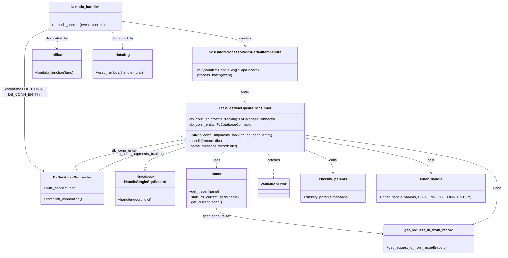

# Diagram: shipment_core/shipment_service/shipment_service/eta/eta_milestone_update/sqs_consumer.py


> Auto-generated by Obscura crawlers

## Diagram 1



### SVG

<svg id="container" width="2182.3203125" xmlns="http://www.w3.org/2000/svg" class="classDiagram" height="1128" viewBox="0 0 2182.3203125 1128" role="graphics-document document" aria-roledescription="class"><style>#container{font-family:"trebuchet ms",verdana,arial,sans-serif;font-size:16px;fill:#333;}@keyframes edge-animation-frame{from{stroke-dashoffset:0;}}@keyframes dash{to{stroke-dashoffset:0;}}#container .edge-animation-slow{stroke-dasharray:9,5!important;stroke-dashoffset:900;animation:dash 50s linear infinite;stroke-linecap:round;}#container .edge-animation-fast{stroke-dasharray:9,5!important;stroke-dashoffset:900;animation:dash 20s linear infinite;stroke-linecap:round;}#container .error-icon{fill:#552222;}#container .error-text{fill:#552222;stroke:#552222;}#container .edge-thickness-normal{stroke-width:1px;}#container .edge-thickness-thick{stroke-width:3.5px;}#container .edge-pattern-solid{stroke-dasharray:0;}#container .edge-thickness-invisible{stroke-width:0;fill:none;}#container .edge-pattern-dashed{stroke-dasharray:3;}#container .edge-pattern-dotted{stroke-dasharray:2;}#container .marker{fill:#333333;stroke:#333333;}#container .marker.cross{stroke:#333333;}#container svg{font-family:"trebuchet ms",verdana,arial,sans-serif;font-size:16px;}#container p{margin:0;}#container g.classGroup text{fill:#9370DB;stroke:none;font-family:"trebuchet ms",verdana,arial,sans-serif;font-size:10px;}#container g.classGroup text .title{font-weight:bolder;}#container .nodeLabel,#container .edgeLabel{color:#131300;}#container .edgeLabel .label rect{fill:#ECECFF;}#container .label text{fill:#131300;}#container .labelBkg{background:#ECECFF;}#container .edgeLabel .label span{background:#ECECFF;}#container .classTitle{font-weight:bolder;}#container .node rect,#container .node circle,#container .node ellipse,#container .node polygon,#container .node path{fill:#ECECFF;stroke:#9370DB;stroke-width:1px;}#container .divider{stroke:#9370DB;stroke-width:1;}#container g.clickable{cursor:pointer;}#container g.classGroup rect{fill:#ECECFF;stroke:#9370DB;}#container g.classGroup line{stroke:#9370DB;stroke-width:1;}#container .classLabel .box{stroke:none;stroke-width:0;fill:#ECECFF;opacity:0.5;}#container .classLabel .label{fill:#9370DB;font-size:10px;}#container .relation{stroke:#333333;stroke-width:1;fill:none;}#container .dashed-line{stroke-dasharray:3;}#container .dotted-line{stroke-dasharray:1 2;}#container #compositionStart,#container .composition{fill:#333333!important;stroke:#333333!important;stroke-width:1;}#container #compositionEnd,#container .composition{fill:#333333!important;stroke:#333333!important;stroke-width:1;}#container #dependencyStart,#container .dependency{fill:#333333!important;stroke:#333333!important;stroke-width:1;}#container #dependencyStart,#container .dependency{fill:#333333!important;stroke:#333333!important;stroke-width:1;}#container #extensionStart,#container .extension{fill:transparent!important;stroke:#333333!important;stroke-width:1;}#container #extensionEnd,#container .extension{fill:transparent!important;stroke:#333333!important;stroke-width:1;}#container #aggregationStart,#container .aggregation{fill:transparent!important;stroke:#333333!important;stroke-width:1;}#container #aggregationEnd,#container .aggregation{fill:transparent!important;stroke:#333333!important;stroke-width:1;}#container #lollipopStart,#container .lollipop{fill:#ECECFF!important;stroke:#333333!important;stroke-width:1;}#container #lollipopEnd,#container .lollipop{fill:#ECECFF!important;stroke:#333333!important;stroke-width:1;}#container .edgeTerminals{font-size:11px;line-height:initial;}#container .classTitleText{text-anchor:middle;font-size:18px;fill:#333;}#container .label-icon{display:inline-block;height:1em;overflow:visible;vertical-align:-0.125em;}#container .node .label-icon path{fill:currentColor;stroke:revert;stroke-width:revert;}#container :root{--mermaid-font-family:"trebuchet ms",verdana,arial,sans-serif;}</style><g><defs><marker id="container_class-aggregationStart" class="marker aggregation class" refX="18" refY="7" markerWidth="190" markerHeight="240" orient="auto"><path d="M 18,7 L9,13 L1,7 L9,1 Z"></path></marker></defs><defs><marker id="container_class-aggregationEnd" class="marker aggregation class" refX="1" refY="7" markerWidth="20" markerHeight="28" orient="auto"><path d="M 18,7 L9,13 L1,7 L9,1 Z"></path></marker></defs><defs><marker id="container_class-extensionStart" class="marker extension class" refX="18" refY="7" markerWidth="190" markerHeight="240" orient="auto"><path d="M 1,7 L18,13 V 1 Z"></path></marker></defs><defs><marker id="container_class-extensionEnd" class="marker extension class" refX="1" refY="7" markerWidth="20" markerHeight="28" orient="auto"><path d="M 1,1 V 13 L18,7 Z"></path></marker></defs><defs><marker id="container_class-compositionStart" class="marker composition class" refX="18" refY="7" markerWidth="190" markerHeight="240" orient="auto"><path d="M 18,7 L9,13 L1,7 L9,1 Z"></path></marker></defs><defs><marker id="container_class-compositionEnd" class="marker composition class" refX="1" refY="7" markerWidth="20" markerHeight="28" orient="auto"><path d="M 18,7 L9,13 L1,7 L9,1 Z"></path></marker></defs><defs><marker id="container_class-dependencyStart" class="marker dependency class" refX="6" refY="7" markerWidth="190" markerHeight="240" orient="auto"><path d="M 5,7 L9,13 L1,7 L9,1 Z"></path></marker></defs><defs><marker id="container_class-dependencyEnd" class="marker dependency class" refX="13" refY="7" markerWidth="20" markerHeight="28" orient="auto"><path d="M 18,7 L9,13 L14,7 L9,1 Z"></path></marker></defs><defs><marker id="container_class-lollipopStart" class="marker lollipop class" refX="13" refY="7" markerWidth="190" markerHeight="240" orient="auto"><circle stroke="black" fill="transparent" cx="7" cy="7" r="6"></circle></marker></defs><defs><marker id="container_class-lollipopEnd" class="marker lollipop class" refX="1" refY="7" markerWidth="190" markerHeight="240" orient="auto"><circle stroke="black" fill="transparent" cx="7" cy="7" r="6"></circle></marker></defs><g class="root"><g class="clusters"></g><g class="edgePaths"><path d="M826.215,649.539L796.223,659.449C766.232,669.359,706.249,689.18,676.257,704.382C646.266,719.583,646.266,730.167,646.266,735.458L646.266,740.75" id="id_EtaMilestoneUpdateConsumer_HandleSingleSqsRecord_1" class="edge-thickness-normal edge-pattern-solid relation" style=";;;" data-edge="true" data-et="edge" data-id="id_EtaMilestoneUpdateConsumer_HandleSingleSqsRecord_1" data-points="W3sieCI6ODI2LjIxNDg0Mzc1LCJ5Ijo2NDkuNTM5MTMxOTA1NDk5NX0seyJ4Ijo2NDYuMjY1NjI1LCJ5Ijo3MDl9LHsieCI6NjQ2LjI2NTYyNSwieSI6NzU4fV0=" marker-end="url(#container_class-extensionEnd)"></path><path d="M809.497,634.062L760.369,646.552C711.241,659.041,612.985,684.021,550.744,705.177C488.504,726.333,462.279,743.667,449.167,752.333L436.054,761" id="id_EtaMilestoneUpdateConsumer_FvDatabaseConnector_2" class="edge-thickness-normal edge-pattern-solid relation" style=";;;" data-edge="true" data-et="edge" data-id="id_EtaMilestoneUpdateConsumer_FvDatabaseConnector_2" data-points="W3sieCI6ODI2LjIxNDg0Mzc1LCJ5Ijo2MjkuODExOTA1MjI2NjQzMX0seyJ4Ijo1MTQuNzI4NTE1NjI1LCJ5Ijo3MDl9LHsieCI6NDM2LjA1NDQzNTQ4Mzg3MSwieSI6NzYxfV0=" marker-start="url(#container_class-aggregationStart)"></path><path d="M809.276,617.142L729.819,632.452C650.362,647.762,491.448,678.381,411.612,702.357C331.777,726.333,331.02,743.667,330.642,752.333L330.264,761" id="id_EtaMilestoneUpdateConsumer_FvDatabaseConnector_3" class="edge-thickness-normal edge-pattern-solid relation" style=";;;" data-edge="true" data-et="edge" data-id="id_EtaMilestoneUpdateConsumer_FvDatabaseConnector_3" data-points="W3sieCI6ODI2LjIxNDg0Mzc1LCJ5Ijo2MTMuODc4NjQyMjI1NTV9LHsieCI6MzMyLjUzMzIwMzEyNSwieSI6NzA5fSx7IngiOjMzMC4yNjM2MDg4NzA5Njc3NCwieSI6NzYxfV0=" marker-start="url(#container_class-aggregationStart)"></path><path d="M544.02,94.051L634.197,106.876C724.375,119.701,904.73,145.35,994.908,163.342C1085.086,181.333,1085.086,191.667,1085.086,196.833L1085.086,202" id="id_lambda_handler_SqsBatchProcessorWithPartialItemFailure_4" class="edge-thickness-normal edge-pattern-solid relation" style=";;;" data-edge="true" data-et="edge" data-id="id_lambda_handler_SqsBatchProcessorWithPartialItemFailure_4" data-points="W3sieCI6NTQ0LjAxOTUzMTI1LCJ5Ijo5NC4wNTA4OTgzMDMzODk4OX0seyJ4IjoxMDg1LjA4NTkzNzUsInkiOjE3MX0seyJ4IjoxMDg1LjA4NTkzNzUsInkiOjIwOH1d" marker-end="url(#container_class-dependencyEnd)"></path><path d="M1085.086,358L1085.086,366.167C1085.086,374.333,1085.086,390.667,1085.086,406C1085.086,421.333,1085.086,435.667,1085.086,442.833L1085.086,450" id="id_SqsBatchProcessorWithPartialItemFailure_EtaMilestoneUpdateConsumer_5" class="edge-thickness-normal edge-pattern-solid relation" style=";;;" data-edge="true" data-et="edge" data-id="id_SqsBatchProcessorWithPartialItemFailure_EtaMilestoneUpdateConsumer_5" data-points="W3sieCI6MTA4NS4wODU5Mzc1LCJ5IjozNTh9LHsieCI6MTA4NS4wODU5Mzc1LCJ5Ijo0MDd9LHsieCI6MTA4NS4wODU5Mzc1LCJ5Ijo0NTZ9XQ==" marker-end="url(#container_class-dependencyEnd)"></path><path d="M219.855,130.168L201.213,136.973C182.57,143.778,145.285,157.389,126.643,182.861C108,208.333,108,245.667,108,285C108,324.333,108,365.667,108,412.5C108,459.333,108,511.667,108,562C108,612.333,108,660.667,122.445,693.007C136.889,725.348,165.778,741.697,180.223,749.871L194.668,758.045" id="id_lambda_handler_FvDatabaseConnector_6" class="edge-thickness-normal edge-pattern-solid relation" style=";;;" data-edge="true" data-et="edge" data-id="id_lambda_handler_FvDatabaseConnector_6" data-points="W3sieCI6MjE5Ljg1NTQ2ODc1LCJ5IjoxMzAuMTY3NTIyMjQ1MDM3NjV9LHsieCI6MTA4LCJ5IjoxNzF9LHsieCI6MTA4LCJ5IjoyODN9LHsieCI6MTA4LCJ5Ijo0MDd9LHsieCI6MTA4LCJ5Ijo1NjR9LHsieCI6MTA4LCJ5Ijo3MDl9LHsieCI6MTk5Ljg4OTQ5MDkyNzQxOTM2LCJ5Ijo3NjF9XQ==" marker-end="url(#container_class-dependencyEnd)"></path><path d="M1343.957,662.488L1364.333,670.24C1384.708,677.992,1425.46,693.496,1445.835,710.415C1466.211,727.333,1466.211,745.667,1466.211,754.833L1466.211,764" id="id_EtaMilestoneUpdateConsumer_classify_params_7" class="edge-thickness-normal edge-pattern-solid relation" style=";;;" data-edge="true" data-et="edge" data-id="id_EtaMilestoneUpdateConsumer_classify_params_7" data-points="W3sieCI6MTM0My45NTcwMzEyNSwieSI6NjYyLjQ4ODE4MjYwMDg1Mjd9LHsieCI6MTQ2Ni4yMTA5Mzc1LCJ5Ijo3MDl9LHsieCI6MTQ2Ni4yMTA5Mzc1LCJ5Ijo3NzB9XQ==" marker-end="url(#container_class-dependencyEnd)"></path><path d="M1343.957,611.178L1433.418,627.481C1522.879,643.785,1701.801,676.393,1791.262,701.863C1880.723,727.333,1880.723,745.667,1880.723,754.833L1880.723,764" id="id_EtaMilestoneUpdateConsumer_inner_handle_8" class="edge-thickness-normal edge-pattern-solid relation" style=";;;" data-edge="true" data-et="edge" data-id="id_EtaMilestoneUpdateConsumer_inner_handle_8" data-points="W3sieCI6MTM0My45NTcwMzEyNSwieSI6NjExLjE3NzY5NzY5NjkxMTR9LHsieCI6MTg4MC43MjI2NTYyNSwieSI6NzA5fSx7IngiOjE4ODAuNzIyNjU2MjUsInkiOjc3MH1d" marker-end="url(#container_class-dependencyEnd)"></path><path d="M1343.957,598.991L1479.602,617.326C1615.247,635.661,1886.538,672.33,2022.183,711.332C2157.828,750.333,2157.828,791.667,2157.828,833C2157.828,874.333,2157.828,915.667,2141.354,942.166C2124.88,968.666,2091.931,980.332,2075.457,986.165L2058.983,991.997" id="id_EtaMilestoneUpdateConsumer_get_request_id_from_record_9" class="edge-thickness-normal edge-pattern-solid relation" style=";;;" data-edge="true" data-et="edge" data-id="id_EtaMilestoneUpdateConsumer_get_request_id_from_record_9" data-points="W3sieCI6MTM0My45NTcwMzEyNSwieSI6NTk4Ljk5MDk4NzYxMjA2MzF9LHsieCI6MjE1Ny44MjgxMjUsInkiOjcwOX0seyJ4IjoyMTU3LjgyODEyNSwieSI6ODMzfSx7IngiOjIxNTcuODI4MTI1LCJ5Ijo5NTd9LHsieCI6MjA1My4zMjY5NzI2NTYyNSwieSI6OTk0fV0=" marker-end="url(#container_class-dependencyEnd)"></path><path d="M1178.224,672L1183.542,678.167C1188.86,684.333,1199.497,696.667,1204.815,715.5C1210.133,734.333,1210.133,759.667,1210.133,772.333L1210.133,785" id="id_EtaMilestoneUpdateConsumer_ValidationError_10" class="edge-thickness-normal edge-pattern-dashed relation" style=";;;" data-edge="true" data-et="edge" data-id="id_EtaMilestoneUpdateConsumer_ValidationError_10" data-points="W3sieCI6MTE3OC4yMjQyOTk1Njg5NjU1LCJ5Ijo2NzJ9LHsieCI6MTIxMC4xMzI4MTI1LCJ5Ijo3MDl9LHsieCI6MTIxMC4xMzI4MTI1LCJ5Ijo3OTF9XQ==" marker-end="url(#container_class-dependencyEnd)"></path><path d="M487.12,134L497.416,140.167C507.712,146.333,528.303,158.667,538.599,172C548.895,185.333,548.895,199.667,548.895,206.833L548.895,214" id="id_lambda_handler_datadog_11" class="edge-thickness-normal edge-pattern-dashed relation" style=";;;" data-edge="true" data-et="edge" data-id="id_lambda_handler_datadog_11" data-points="W3sieCI6NDg3LjEyMDQyOTY4NzUsInkiOjEzNH0seyJ4Ijo1NDguODk0NTMxMjUsInkiOjE3MX0seyJ4Ijo1NDguODk0NTMxMjUsInkiOjIyMH1d" marker-end="url(#container_class-dependencyEnd)"></path><path d="M301.416,134L293.534,140.167C285.652,146.333,269.889,158.667,262.007,172C254.125,185.333,254.125,199.667,254.125,206.833L254.125,214" id="id_lambda_handler_rollbar_12" class="edge-thickness-normal edge-pattern-dashed relation" style=";;;" data-edge="true" data-et="edge" data-id="id_lambda_handler_rollbar_12" data-points="W3sieCI6MzAxLjQxNTYyNSwieSI6MTM0fSx7IngiOjI1NC4xMjUsInkiOjE3MX0seyJ4IjoyNTQuMTI1LCJ5IjoyMjB9XQ==" marker-end="url(#container_class-dependencyEnd)"></path><path d="M991.948,672L986.629,678.167C981.311,684.333,970.675,696.667,965.357,708C960.039,719.333,960.039,729.667,960.039,734.833L960.039,740" id="id_EtaMilestoneUpdateConsumer_tracer_13" class="edge-thickness-normal edge-pattern-dashed relation" style=";;;" data-edge="true" data-et="edge" data-id="id_EtaMilestoneUpdateConsumer_tracer_13" data-points="W3sieCI6OTkxLjk0NzU3NTQzMTAzNDUsInkiOjY3Mn0seyJ4Ijo5NjAuMDM5MDYyNSwieSI6NzA5fSx7IngiOjk2MC4wMzkwNjI1LCJ5Ijo3NDZ9XQ==" marker-end="url(#container_class-dependencyEnd)"></path><path d="M960.039,920L960.039,926.167C960.039,932.333,960.039,944.667,1078.421,963.766C1196.803,982.866,1433.567,1008.732,1551.949,1021.665L1670.33,1034.597" id="id_tracer_get_request_id_from_record_14" class="edge-thickness-normal edge-pattern-solid relation" style=";;;" data-edge="true" data-et="edge" data-id="id_tracer_get_request_id_from_record_14" data-points="W3sieCI6OTYwLjAzOTA2MjUsInkiOjkyMH0seyJ4Ijo5NjAuMDM5MDYyNSwieSI6OTU3fSx7IngiOjE2NzYuMjk0OTIxODc1LCJ5IjoxMDM1LjI0OTA5Njg5NTE5NzJ9XQ==" marker-end="url(#container_class-dependencyEnd)"></path></g><g class="edgeLabels"><g class="edgeLabel"><g class="label" data-id="id_EtaMilestoneUpdateConsumer_HandleSingleSqsRecord_1" transform="translate(0, 0)"><foreignObject width="0" height="0"><div xmlns="http://www.w3.org/1999/xhtml" class="labelBkg" style="display: table-cell; white-space: nowrap; line-height: 1.5; max-width: 200px; text-align: center;"><span class="edgeLabel"></span></div></foreignObject></g></g><g class="edgeLabel" transform="translate(624.77239, 681.02393)"><g class="label" data-id="id_EtaMilestoneUpdateConsumer_FvDatabaseConnector_2" transform="translate(-106.125, -12)"><foreignObject width="212.25" height="24"><div xmlns="http://www.w3.org/1999/xhtml" class="labelBkg" style="display: table; white-space: break-spaces; line-height: 1.5; max-width: 200px; text-align: center; width: 200px;"><span class="edgeLabel"><p>db_conn_shipments_tracking</p></span></div></foreignObject></g></g><g class="edgeLabel" transform="translate(553.8193, 666.36314)"><g class="label" data-id="id_EtaMilestoneUpdateConsumer_FvDatabaseConnector_3" transform="translate(-56.0703125, -12)"><foreignObject width="112.140625" height="24"><div xmlns="http://www.w3.org/1999/xhtml" class="labelBkg" style="display: table-cell; white-space: nowrap; line-height: 1.5; max-width: 200px; text-align: center;"><span class="edgeLabel"><p>db_conn_entity</p></span></div></foreignObject></g></g><g class="edgeLabel" transform="translate(1085.0859375, 171)"><g class="label" data-id="id_lambda_handler_SqsBatchProcessorWithPartialItemFailure_4" transform="translate(-26.171875, -12)"><foreignObject width="52.34375" height="24"><div xmlns="http://www.w3.org/1999/xhtml" class="labelBkg" style="display: table-cell; white-space: nowrap; line-height: 1.5; max-width: 200px; text-align: center;"><span class="edgeLabel"><p>creates</p></span></div></foreignObject></g></g><g class="edgeLabel" transform="translate(1085.0859375, 407)"><g class="label" data-id="id_SqsBatchProcessorWithPartialItemFailure_EtaMilestoneUpdateConsumer_5" transform="translate(-16.4921875, -12)"><foreignObject width="32.984375" height="24"><div xmlns="http://www.w3.org/1999/xhtml" class="labelBkg" style="display: table-cell; white-space: nowrap; line-height: 1.5; max-width: 200px; text-align: center;"><span class="edgeLabel"><p>uses</p></span></div></foreignObject></g></g><g class="edgeLabel" transform="translate(108, 407)"><g class="label" data-id="id_lambda_handler_FvDatabaseConnector_6" transform="translate(-100, -24)"><foreignObject width="200" height="48"><div xmlns="http://www.w3.org/1999/xhtml" class="labelBkg" style="display: table; white-space: break-spaces; line-height: 1.5; max-width: 200px; text-align: center; width: 200px;"><span class="edgeLabel"><p>establishes DB_CONN, DB_CONN_ENTITY</p></span></div></foreignObject></g></g><g class="edgeLabel" transform="translate(1466.2109375, 709)"><g class="label" data-id="id_EtaMilestoneUpdateConsumer_classify_params_7" transform="translate(-16.4453125, -12)"><foreignObject width="32.890625" height="24"><div xmlns="http://www.w3.org/1999/xhtml" class="labelBkg" style="display: table-cell; white-space: nowrap; line-height: 1.5; max-width: 200px; text-align: center;"><span class="edgeLabel"><p>calls</p></span></div></foreignObject></g></g><g class="edgeLabel" transform="translate(1880.72265625, 709)"><g class="label" data-id="id_EtaMilestoneUpdateConsumer_inner_handle_8" transform="translate(-16.4453125, -12)"><foreignObject width="32.890625" height="24"><div xmlns="http://www.w3.org/1999/xhtml" class="labelBkg" style="display: table-cell; white-space: nowrap; line-height: 1.5; max-width: 200px; text-align: center;"><span class="edgeLabel"><p>calls</p></span></div></foreignObject></g></g><g class="edgeLabel" transform="translate(2157.828125, 833)"><g class="label" data-id="id_EtaMilestoneUpdateConsumer_get_request_id_from_record_9" transform="translate(-16.4921875, -12)"><foreignObject width="32.984375" height="24"><div xmlns="http://www.w3.org/1999/xhtml" class="labelBkg" style="display: table-cell; white-space: nowrap; line-height: 1.5; max-width: 200px; text-align: center;"><span class="edgeLabel"><p>uses</p></span></div></foreignObject></g></g><g class="edgeLabel" transform="translate(1210.1328125, 709)"><g class="label" data-id="id_EtaMilestoneUpdateConsumer_ValidationError_10" transform="translate(-27.4765625, -12)"><foreignObject width="54.953125" height="24"><div xmlns="http://www.w3.org/1999/xhtml" class="labelBkg" style="display: table-cell; white-space: nowrap; line-height: 1.5; max-width: 200px; text-align: center;"><span class="edgeLabel"><p>catches</p></span></div></foreignObject></g></g><g class="edgeLabel" transform="translate(548.89453125, 171)"><g class="label" data-id="id_lambda_handler_datadog_11" transform="translate(-49.375, -12)"><foreignObject width="98.75" height="24"><div xmlns="http://www.w3.org/1999/xhtml" class="labelBkg" style="display: table-cell; white-space: nowrap; line-height: 1.5; max-width: 200px; text-align: center;"><span class="edgeLabel"><p>decorated_by</p></span></div></foreignObject></g></g><g class="edgeLabel" transform="translate(254.125, 171)"><g class="label" data-id="id_lambda_handler_rollbar_12" transform="translate(-49.375, -12)"><foreignObject width="98.75" height="24"><div xmlns="http://www.w3.org/1999/xhtml" class="labelBkg" style="display: table-cell; white-space: nowrap; line-height: 1.5; max-width: 200px; text-align: center;"><span class="edgeLabel"><p>decorated_by</p></span></div></foreignObject></g></g><g class="edgeLabel" transform="translate(960.0390625, 709)"><g class="label" data-id="id_EtaMilestoneUpdateConsumer_tracer_13" transform="translate(-16.4921875, -12)"><foreignObject width="32.984375" height="24"><div xmlns="http://www.w3.org/1999/xhtml" class="labelBkg" style="display: table-cell; white-space: nowrap; line-height: 1.5; max-width: 200px; text-align: center;"><span class="edgeLabel"><p>uses</p></span></div></foreignObject></g></g><g class="edgeLabel" transform="translate(960.0390625, 957)"><g class="label" data-id="id_tracer_get_request_id_from_record_14" transform="translate(-64.6875, -12)"><foreignObject width="129.375" height="24"><div xmlns="http://www.w3.org/1999/xhtml" class="labelBkg" style="display: table-cell; white-space: nowrap; line-height: 1.5; max-width: 200px; text-align: center;"><span class="edgeLabel"><p>span attribute set</p></span></div></foreignObject></g></g><g class="edgeTerminals" transform="translate(805.5585167765206, 619.5861473795953)"><g class="inner" transform="translate(0, 0)"><foreignObject style="width: 9px; height: 12px;"><div xmlns="http://www.w3.org/1999/xhtml" style="display: inline-block; padding-right: 1px; white-space: nowrap;"><span class="edgeLabel">1</span></div></foreignObject></g></g><g class="edgeTerminals" transform="translate(806.1929469451125, 602.4605157692539)"><g class="inner" transform="translate(0, 0)"><foreignObject style="width: 9px; height: 12px;"><div xmlns="http://www.w3.org/1999/xhtml" style="display: inline-block; padding-right: 1px; white-space: nowrap;"><span class="edgeLabel">1</span></div></foreignObject></g></g><g class="edgeTerminals" transform="translate(453.92464120265373, 758.8642007058138)"><g class="inner" transform="translate(0, 0)"></g><foreignObject style="width: 9px; height: 12px;"><div xmlns="http://www.w3.org/1999/xhtml" style="display: inline-block; padding-right: 1px; white-space: nowrap;"><span class="edgeLabel">1</span></div></foreignObject></g><g class="edgeTerminals" transform="translate(341.01242243932865, 739.1707140617024)"><g class="inner" transform="translate(0, 0)"></g><foreignObject style="width: 9px; height: 12px;"><div xmlns="http://www.w3.org/1999/xhtml" style="display: inline-block; padding-right: 1px; white-space: nowrap;"><span class="edgeLabel">1</span></div></foreignObject></g></g><g class="nodes"><g class="node default" id="classId-EtaMilestoneUpdateConsumer-0" transform="translate(1085.0859375, 564)"><g class="basic label-container"><path d="M-258.87109375 -108 L258.87109375 -108 L258.87109375 108 L-258.87109375 108" stroke="none" stroke-width="0" fill="#ECECFF" style=""></path><path d="M-258.87109375 -108 C-55.45460445178165 -108, 147.9618848464367 -108, 258.87109375 -108 M-258.87109375 -108 C-104.10034496980549 -108, 50.67040381038902 -108, 258.87109375 -108 M258.87109375 -108 C258.87109375 -22.845192731251416, 258.87109375 62.30961453749717, 258.87109375 108 M258.87109375 -108 C258.87109375 -61.3613582482951, 258.87109375 -14.722716496590195, 258.87109375 108 M258.87109375 108 C146.51844973442323 108, 34.16580571884646 108, -258.87109375 108 M258.87109375 108 C92.53298215115055 108, -73.8051294476989 108, -258.87109375 108 M-258.87109375 108 C-258.87109375 46.32165828869561, -258.87109375 -15.356683422608782, -258.87109375 -108 M-258.87109375 108 C-258.87109375 55.11022613292358, -258.87109375 2.2204522658471575, -258.87109375 -108" stroke="#9370DB" stroke-width="1.3" fill="none" stroke-dasharray="0 0" style=""></path></g><g class="annotation-group text" transform="translate(0, -84)"></g><g class="label-group text" transform="translate(-110.3359375, -84)"><g class="label" style="font-weight: bolder" transform="translate(0,-12)"><foreignObject width="220.671875" height="24"><div xmlns="http://www.w3.org/1999/xhtml" style="display: table-cell; white-space: nowrap; line-height: 1.5; max-width: 270px; text-align: center;"><span class="nodeLabel markdown-node-label" style=""><p>EtaMilestoneUpdateConsumer</p></span></div></foreignObject></g></g><g class="members-group text" transform="translate(-246.87109375, -36)"><g class="label" style="" transform="translate(0,-12)"><foreignObject width="383.40625" height="24"><div xmlns="http://www.w3.org/1999/xhtml" style="display: table-cell; white-space: nowrap; line-height: 1.5; max-width: 442px; text-align: center;"><span class="nodeLabel markdown-node-label" style=""><p>-db_conn_shipments_tracking: FvDatabaseConnector</p></span></div></foreignObject></g><g class="label" style="" transform="translate(0,12)"><foreignObject width="283.359375" height="24"><div xmlns="http://www.w3.org/1999/xhtml" style="display: table-cell; white-space: nowrap; line-height: 1.5; max-width: 342px; text-align: center;"><span class="nodeLabel markdown-node-label" style=""><p>-db_conn_entity: FvDatabaseConnector</p></span></div></foreignObject></g></g><g class="methods-group text" transform="translate(-246.87109375, 36)"><g class="label" style="" transform="translate(0,-12)"><foreignObject width="375.25" height="24"><div xmlns="http://www.w3.org/1999/xhtml" style="display: table-cell; white-space: nowrap; line-height: 1.5; max-width: 464px; text-align: center;"><span class="nodeLabel markdown-node-label" style=""><p>+<strong>init</strong>(db_conn_shipments_tracking, db_conn_entity)</p></span></div></foreignObject></g><g class="label" style="" transform="translate(0,12)"><foreignObject width="150.640625" height="24"><div xmlns="http://www.w3.org/1999/xhtml" style="display: table-cell; white-space: nowrap; line-height: 1.5; max-width: 208px; text-align: center;"><span class="nodeLabel markdown-node-label" style=""><p>+handle(record: dict)</p></span></div></foreignObject></g><g class="label" style="" transform="translate(0,36)"><foreignObject width="210.859375" height="24"><div xmlns="http://www.w3.org/1999/xhtml" style="display: table-cell; white-space: nowrap; line-height: 1.5; max-width: 268px; text-align: center;"><span class="nodeLabel markdown-node-label" style=""><p>+parse_message(record: dict)</p></span></div></foreignObject></g></g><g class="divider" style=""><path d="M-258.87109375 -60 C-127.70610313085311 -60, 3.458887488293783 -60, 258.87109375 -60 M-258.87109375 -60 C-67.39778849511583 -60, 124.07551675976833 -60, 258.87109375 -60" stroke="#9370DB" stroke-width="1.3" fill="none" stroke-dasharray="0 0" style=""></path></g><g class="divider" style=""><path d="M-258.87109375 12 C-109.89268913691419 12, 39.08571547617163 12, 258.87109375 12 M-258.87109375 12 C-74.92100018862894 12, 109.02909337274212 12, 258.87109375 12" stroke="#9370DB" stroke-width="1.3" fill="none" stroke-dasharray="0 0" style=""></path></g></g><g class="node default" id="classId-FvDatabaseConnector-1" transform="translate(327.12109375, 833)"><g class="basic label-container"><path d="M-138.28515625 -72 L138.28515625 -72 L138.28515625 72 L-138.28515625 72" stroke="none" stroke-width="0" fill="#ECECFF" style=""></path><path d="M-138.28515625 -72 C-82.33393003007404 -72, -26.382703810148087 -72, 138.28515625 -72 M-138.28515625 -72 C-52.79659170323555 -72, 32.6919728435289 -72, 138.28515625 -72 M138.28515625 -72 C138.28515625 -27.108344615885095, 138.28515625 17.78331076822981, 138.28515625 72 M138.28515625 -72 C138.28515625 -42.522863546641815, 138.28515625 -13.045727093283631, 138.28515625 72 M138.28515625 72 C55.63141406105194 72, -27.022328127896117 72, -138.28515625 72 M138.28515625 72 C35.519464404344276 72, -67.24622744131145 72, -138.28515625 72 M-138.28515625 72 C-138.28515625 27.02449203497246, -138.28515625 -17.95101593005508, -138.28515625 -72 M-138.28515625 72 C-138.28515625 15.631331128883375, -138.28515625 -40.73733774223325, -138.28515625 -72" stroke="#9370DB" stroke-width="1.3" fill="none" stroke-dasharray="0 0" style=""></path></g><g class="annotation-group text" transform="translate(0, -48)"></g><g class="label-group text" transform="translate(-79.3046875, -48)"><g class="label" style="font-weight: bolder" transform="translate(0,-12)"><foreignObject width="158.609375" height="24"><div xmlns="http://www.w3.org/1999/xhtml" style="display: table-cell; white-space: nowrap; line-height: 1.5; max-width: 207px; text-align: center;"><span class="nodeLabel markdown-node-label" style=""><p>FvDatabaseConnector</p></span></div></foreignObject></g></g><g class="members-group text" transform="translate(-126.28515625, 0)"><g class="label" style="" transform="translate(0,-12)"><foreignObject width="146.921875" height="24"><div xmlns="http://www.w3.org/1999/xhtml" style="display: table-cell; white-space: nowrap; line-height: 1.5; max-width: 205px; text-align: center;"><span class="nodeLabel markdown-node-label" style=""><p>+auto_connect: bool</p></span></div></foreignObject></g></g><g class="methods-group text" transform="translate(-126.28515625, 48)"><g class="label" style="" transform="translate(0,-12)"><foreignObject width="173.265625" height="24"><div xmlns="http://www.w3.org/1999/xhtml" style="display: table-cell; white-space: nowrap; line-height: 1.5; max-width: 231px; text-align: center;"><span class="nodeLabel markdown-node-label" style=""><p>+establish_connection()</p></span></div></foreignObject></g></g><g class="divider" style=""><path d="M-138.28515625 -24 C-45.890714391212995 -24, 46.50372746757401 -24, 138.28515625 -24 M-138.28515625 -24 C-34.2390722543566 -24, 69.8070117412868 -24, 138.28515625 -24" stroke="#9370DB" stroke-width="1.3" fill="none" stroke-dasharray="0 0" style=""></path></g><g class="divider" style=""><path d="M-138.28515625 24 C-36.81932201613395 24, 64.6465122177321 24, 138.28515625 24 M-138.28515625 24 C-57.65403970967709 24, 22.977076830645814 24, 138.28515625 24" stroke="#9370DB" stroke-width="1.3" fill="none" stroke-dasharray="0 0" style=""></path></g></g><g class="node default" id="classId-SqsBatchProcessorWithPartialItemFailure-2" transform="translate(1085.0859375, 283)"><g class="basic label-container"><path d="M-227.5 -75 L227.5 -75 L227.5 75 L-227.5 75" stroke="none" stroke-width="0" fill="#ECECFF" style=""></path><path d="M-227.5 -75 C-109.71991281860893 -75, 8.060174362782135 -75, 227.5 -75 M-227.5 -75 C-108.64430849175967 -75, 10.211383016480653 -75, 227.5 -75 M227.5 -75 C227.5 -27.80681830113233, 227.5 19.386363397735337, 227.5 75 M227.5 -75 C227.5 -41.631129108999346, 227.5 -8.262258217998692, 227.5 75 M227.5 75 C121.05882210666816 75, 14.61764421333632 75, -227.5 75 M227.5 75 C63.67631041912159 75, -100.14737916175682 75, -227.5 75 M-227.5 75 C-227.5 29.279828488151658, -227.5 -16.440343023696684, -227.5 -75 M-227.5 75 C-227.5 17.28816736892412, -227.5 -40.42366526215176, -227.5 -75" stroke="#9370DB" stroke-width="1.3" fill="none" stroke-dasharray="0 0" style=""></path></g><g class="annotation-group text" transform="translate(0, -51)"></g><g class="label-group text" transform="translate(-151.46875, -51)"><g class="label" style="font-weight: bolder" transform="translate(0,-12)"><foreignObject width="302.9375" height="24"><div xmlns="http://www.w3.org/1999/xhtml" style="display: table-cell; white-space: nowrap; line-height: 1.5; max-width: 348px; text-align: center;"><span class="nodeLabel markdown-node-label" style=""><p>SqsBatchProcessorWithPartialItemFailure</p></span></div></foreignObject></g></g><g class="members-group text" transform="translate(-215.5, -3)"></g><g class="methods-group text" transform="translate(-215.5, 27)"><g class="label" style="" transform="translate(0,-12)"><foreignObject width="279.53125" height="24"><div xmlns="http://www.w3.org/1999/xhtml" style="display: table-cell; white-space: nowrap; line-height: 1.5; max-width: 368px; text-align: center;"><span class="nodeLabel markdown-node-label" style=""><p>+<strong>init</strong>(handler: HandleSingleSqsRecord)</p></span></div></foreignObject></g><g class="label" style="" transform="translate(0,12)"><foreignObject width="162.6875" height="24"><div xmlns="http://www.w3.org/1999/xhtml" style="display: table-cell; white-space: nowrap; line-height: 1.5; max-width: 220px; text-align: center;"><span class="nodeLabel markdown-node-label" style=""><p>+process_batch(event)</p></span></div></foreignObject></g></g><g class="divider" style=""><path d="M-227.5 -27 C-93.47422065304445 -27, 40.55155869391109 -27, 227.5 -27 M-227.5 -27 C-92.1064871156436 -27, 43.287025768712795 -27, 227.5 -27" stroke="#9370DB" stroke-width="1.3" fill="none" stroke-dasharray="0 0" style=""></path></g><g class="divider" style=""><path d="M-227.5 -3 C-92.67525201298028 -3, 42.14949597403944 -3, 227.5 -3 M-227.5 -3 C-57.26442493020963 -3, 112.97115013958074 -3, 227.5 -3" stroke="#9370DB" stroke-width="1.3" fill="none" stroke-dasharray="0 0" style=""></path></g></g><g class="node default" id="classId-HandleSingleSqsRecord-3" transform="translate(646.265625, 833)"><g class="basic label-container"><path d="M-130.859375 -75 L130.859375 -75 L130.859375 75 L-130.859375 75" stroke="none" stroke-width="0" fill="#ECECFF" style=""></path><path d="M-130.859375 -75 C-27.103561199394605 -75, 76.65225260121079 -75, 130.859375 -75 M-130.859375 -75 C-47.95548062695087 -75, 34.948413746098254 -75, 130.859375 -75 M130.859375 -75 C130.859375 -28.420951505408922, 130.859375 18.158096989182155, 130.859375 75 M130.859375 -75 C130.859375 -15.223302561506543, 130.859375 44.553394876986914, 130.859375 75 M130.859375 75 C49.95517278447949 75, -30.949029431041026 75, -130.859375 75 M130.859375 75 C50.66815514680117 75, -29.523064706397662 75, -130.859375 75 M-130.859375 75 C-130.859375 15.598437734255604, -130.859375 -43.80312453148879, -130.859375 -75 M-130.859375 75 C-130.859375 29.877032324600115, -130.859375 -15.245935350799769, -130.859375 -75" stroke="#9370DB" stroke-width="1.3" fill="none" stroke-dasharray="0 0" style=""></path></g><g class="annotation-group text" transform="translate(-41.015625, -51)"><g class="label" style="" transform="translate(0,-12)"><foreignObject width="82.03125" height="24"><div xmlns="http://www.w3.org/1999/xhtml" style="display: table-cell; white-space: nowrap; line-height: 1.5; max-width: 132px; text-align: center;"><span class="nodeLabel markdown-node-label" style=""><p>«interface»</p></span></div></foreignObject></g></g><g class="label-group text" transform="translate(-87.078125, -27)"><g class="label" style="font-weight: bolder" transform="translate(0,-12)"><foreignObject width="174.15625" height="24"><div xmlns="http://www.w3.org/1999/xhtml" style="display: table-cell; white-space: nowrap; line-height: 1.5; max-width: 222px; text-align: center;"><span class="nodeLabel markdown-node-label" style=""><p>HandleSingleSqsRecord</p></span></div></foreignObject></g></g><g class="members-group text" transform="translate(-118.859375, 21)"></g><g class="methods-group text" transform="translate(-118.859375, 51)"><g class="label" style="" transform="translate(0,-12)"><foreignObject width="150.640625" height="24"><div xmlns="http://www.w3.org/1999/xhtml" style="display: table-cell; white-space: nowrap; line-height: 1.5; max-width: 208px; text-align: center;"><span class="nodeLabel markdown-node-label" style=""><p>+handle(record: dict)</p></span></div></foreignObject></g></g><g class="divider" style=""><path d="M-130.859375 -3 C-52.28226199164274 -3, 26.294851016714517 -3, 130.859375 -3 M-130.859375 -3 C-39.93954973233842 -3, 50.98027553532316 -3, 130.859375 -3" stroke="#9370DB" stroke-width="1.3" fill="none" stroke-dasharray="0 0" style=""></path></g><g class="divider" style=""><path d="M-130.859375 21 C-74.35385855967809 21, -17.84834211935619 21, 130.859375 21 M-130.859375 21 C-46.389438287384294 21, 38.08049842523141 21, 130.859375 21" stroke="#9370DB" stroke-width="1.3" fill="none" stroke-dasharray="0 0" style=""></path></g></g><g class="node default" id="classId-rollbar-4" transform="translate(254.125, 283)"><g class="basic label-container"><path d="M-111.125 -63 L111.125 -63 L111.125 63 L-111.125 63" stroke="none" stroke-width="0" fill="#ECECFF" style=""></path><path d="M-111.125 -63 C-36.019441430706436 -63, 39.08611713858713 -63, 111.125 -63 M-111.125 -63 C-29.76029582953123 -63, 51.60440834093754 -63, 111.125 -63 M111.125 -63 C111.125 -29.27112786866293, 111.125 4.45774426267414, 111.125 63 M111.125 -63 C111.125 -33.33259331502454, 111.125 -3.665186630049078, 111.125 63 M111.125 63 C35.13359337879626 63, -40.857813242407474 63, -111.125 63 M111.125 63 C39.37466859923585 63, -32.37566280152831 63, -111.125 63 M-111.125 63 C-111.125 22.48100456130193, -111.125 -18.03799087739614, -111.125 -63 M-111.125 63 C-111.125 37.133290607783344, -111.125 11.266581215566688, -111.125 -63" stroke="#9370DB" stroke-width="1.3" fill="none" stroke-dasharray="0 0" style=""></path></g><g class="annotation-group text" transform="translate(0, -39)"></g><g class="label-group text" transform="translate(-24.6875, -39)"><g class="label" style="font-weight: bolder" transform="translate(0,-12)"><foreignObject width="49.375" height="24"><div xmlns="http://www.w3.org/1999/xhtml" style="display: table-cell; white-space: nowrap; line-height: 1.5; max-width: 99px; text-align: center;"><span class="nodeLabel markdown-node-label" style=""><p>rollbar</p></span></div></foreignObject></g></g><g class="members-group text" transform="translate(-99.125, 9)"></g><g class="methods-group text" transform="translate(-99.125, 39)"><g class="label" style="" transform="translate(0,-12)"><foreignObject width="173.5625" height="24"><div xmlns="http://www.w3.org/1999/xhtml" style="display: table-cell; white-space: nowrap; line-height: 1.5; max-width: 231px; text-align: center;"><span class="nodeLabel markdown-node-label" style=""><p>+lambda_function(func)</p></span></div></foreignObject></g></g><g class="divider" style=""><path d="M-111.125 -15 C-31.282676329569398 -15, 48.559647340861204 -15, 111.125 -15 M-111.125 -15 C-60.44027394306139 -15, -9.755547886122784 -15, 111.125 -15" stroke="#9370DB" stroke-width="1.3" fill="none" stroke-dasharray="0 0" style=""></path></g><g class="divider" style=""><path d="M-111.125 9 C-49.869502139715685 9, 11.38599572056863 9, 111.125 9 M-111.125 9 C-52.21802424361801 9, 6.688951512763978 9, 111.125 9" stroke="#9370DB" stroke-width="1.3" fill="none" stroke-dasharray="0 0" style=""></path></g></g><g class="node default" id="classId-datadog-5" transform="translate(548.89453125, 283)"><g class="basic label-container"><path d="M-133.64453125 -63 L133.64453125 -63 L133.64453125 63 L-133.64453125 63" stroke="none" stroke-width="0" fill="#ECECFF" style=""></path><path d="M-133.64453125 -63 C-48.57210089249858 -63, 36.500329465002835 -63, 133.64453125 -63 M-133.64453125 -63 C-69.75771932557194 -63, -5.8709074011438815 -63, 133.64453125 -63 M133.64453125 -63 C133.64453125 -27.073490796497822, 133.64453125 8.853018407004356, 133.64453125 63 M133.64453125 -63 C133.64453125 -31.169640876228485, 133.64453125 0.6607182475430307, 133.64453125 63 M133.64453125 63 C42.94370619015072 63, -47.75711886969856 63, -133.64453125 63 M133.64453125 63 C73.17352046021483 63, 12.702509670429663 63, -133.64453125 63 M-133.64453125 63 C-133.64453125 31.53867430878175, -133.64453125 0.07734861756350142, -133.64453125 -63 M-133.64453125 63 C-133.64453125 14.699906435376555, -133.64453125 -33.60018712924689, -133.64453125 -63" stroke="#9370DB" stroke-width="1.3" fill="none" stroke-dasharray="0 0" style=""></path></g><g class="annotation-group text" transform="translate(0, -39)"></g><g class="label-group text" transform="translate(-30.4453125, -39)"><g class="label" style="font-weight: bolder" transform="translate(0,-12)"><foreignObject width="60.890625" height="24"><div xmlns="http://www.w3.org/1999/xhtml" style="display: table-cell; white-space: nowrap; line-height: 1.5; max-width: 111px; text-align: center;"><span class="nodeLabel markdown-node-label" style=""><p>datadog</p></span></div></foreignObject></g></g><g class="members-group text" transform="translate(-121.64453125, 9)"></g><g class="methods-group text" transform="translate(-121.64453125, 39)"><g class="label" style="" transform="translate(0,-12)"><foreignObject width="212.84375" height="24"><div xmlns="http://www.w3.org/1999/xhtml" style="display: table-cell; white-space: nowrap; line-height: 1.5; max-width: 270px; text-align: center;"><span class="nodeLabel markdown-node-label" style=""><p>+wrap_lambda_handler(func)</p></span></div></foreignObject></g></g><g class="divider" style=""><path d="M-133.64453125 -15 C-73.74910384227739 -15, -13.853676434554785 -15, 133.64453125 -15 M-133.64453125 -15 C-61.774405059009965 -15, 10.09572113198007 -15, 133.64453125 -15" stroke="#9370DB" stroke-width="1.3" fill="none" stroke-dasharray="0 0" style=""></path></g><g class="divider" style=""><path d="M-133.64453125 9 C-36.883978797873155 9, 59.87657365425369 9, 133.64453125 9 M-133.64453125 9 C-45.451503317534005 9, 42.74152461493199 9, 133.64453125 9" stroke="#9370DB" stroke-width="1.3" fill="none" stroke-dasharray="0 0" style=""></path></g></g><g class="node default" id="classId-tracer-6" transform="translate(960.0390625, 833)"><g class="basic label-container"><path d="M-132.9140625 -87 L132.9140625 -87 L132.9140625 87 L-132.9140625 87" stroke="none" stroke-width="0" fill="#ECECFF" style=""></path><path d="M-132.9140625 -87 C-72.93948839991177 -87, -12.964914299823533 -87, 132.9140625 -87 M-132.9140625 -87 C-46.5785688031786 -87, 39.756924893642804 -87, 132.9140625 -87 M132.9140625 -87 C132.9140625 -32.300665597026466, 132.9140625 22.398668805947068, 132.9140625 87 M132.9140625 -87 C132.9140625 -42.39068822142909, 132.9140625 2.218623557141825, 132.9140625 87 M132.9140625 87 C46.141053013116206 87, -40.63195647376759 87, -132.9140625 87 M132.9140625 87 C49.193928982464854 87, -34.52620453507029 87, -132.9140625 87 M-132.9140625 87 C-132.9140625 23.336109012174077, -132.9140625 -40.327781975651845, -132.9140625 -87 M-132.9140625 87 C-132.9140625 50.641701547936286, -132.9140625 14.283403095872572, -132.9140625 -87" stroke="#9370DB" stroke-width="1.3" fill="none" stroke-dasharray="0 0" style=""></path></g><g class="annotation-group text" transform="translate(0, -63)"></g><g class="label-group text" transform="translate(-21.703125, -63)"><g class="label" style="font-weight: bolder" transform="translate(0,-12)"><foreignObject width="43.40625" height="24"><div xmlns="http://www.w3.org/1999/xhtml" style="display: table-cell; white-space: nowrap; line-height: 1.5; max-width: 93px; text-align: center;"><span class="nodeLabel markdown-node-label" style=""><p>tracer</p></span></div></foreignObject></g></g><g class="members-group text" transform="translate(-120.9140625, -15)"></g><g class="methods-group text" transform="translate(-120.9140625, 15)"><g class="label" style="" transform="translate(0,-12)"><foreignObject width="131.75" height="24"><div xmlns="http://www.w3.org/1999/xhtml" style="display: table-cell; white-space: nowrap; line-height: 1.5; max-width: 189px; text-align: center;"><span class="nodeLabel markdown-node-label" style=""><p>+get_tracer(name)</p></span></div></foreignObject></g><g class="label" style="" transform="translate(0,12)"><foreignObject width="220.125" height="24"><div xmlns="http://www.w3.org/1999/xhtml" style="display: table-cell; white-space: nowrap; line-height: 1.5; max-width: 277px; text-align: center;"><span class="nodeLabel markdown-node-label" style=""><p>+start_as_current_span(name)</p></span></div></foreignObject></g><g class="label" style="" transform="translate(0,36)"><foreignObject width="144.6875" height="24"><div xmlns="http://www.w3.org/1999/xhtml" style="display: table-cell; white-space: nowrap; line-height: 1.5; max-width: 202px; text-align: center;"><span class="nodeLabel markdown-node-label" style=""><p>+get_current_span()</p></span></div></foreignObject></g></g><g class="divider" style=""><path d="M-132.9140625 -39 C-27.687592133328806 -39, 77.53887823334239 -39, 132.9140625 -39 M-132.9140625 -39 C-74.9639036760812 -39, -17.013744852162418 -39, 132.9140625 -39" stroke="#9370DB" stroke-width="1.3" fill="none" stroke-dasharray="0 0" style=""></path></g><g class="divider" style=""><path d="M-132.9140625 -15 C-69.19363173071346 -15, -5.473200961426926 -15, 132.9140625 -15 M-132.9140625 -15 C-64.98936777051556 -15, 2.9353269589688864 -15, 132.9140625 -15" stroke="#9370DB" stroke-width="1.3" fill="none" stroke-dasharray="0 0" style=""></path></g></g><g class="node default" id="classId-ValidationError-7" transform="translate(1210.1328125, 833)"><g class="basic label-container"><path d="M-67.1796875 -42 L67.1796875 -42 L67.1796875 42 L-67.1796875 42" stroke="none" stroke-width="0" fill="#ECECFF" style=""></path><path d="M-67.1796875 -42 C-26.660716415371866 -42, 13.858254669256269 -42, 67.1796875 -42 M-67.1796875 -42 C-15.584187712820345 -42, 36.01131207435931 -42, 67.1796875 -42 M67.1796875 -42 C67.1796875 -10.242010047347158, 67.1796875 21.515979905305684, 67.1796875 42 M67.1796875 -42 C67.1796875 -12.955876401608698, 67.1796875 16.088247196782604, 67.1796875 42 M67.1796875 42 C39.067037674191624 42, 10.954387848383242 42, -67.1796875 42 M67.1796875 42 C22.561376272216037 42, -22.056934955567925 42, -67.1796875 42 M-67.1796875 42 C-67.1796875 15.128839107514079, -67.1796875 -11.742321784971843, -67.1796875 -42 M-67.1796875 42 C-67.1796875 8.408023394101669, -67.1796875 -25.183953211796663, -67.1796875 -42" stroke="#9370DB" stroke-width="1.3" fill="none" stroke-dasharray="0 0" style=""></path></g><g class="annotation-group text" transform="translate(0, -18)"></g><g class="label-group text" transform="translate(-55.1796875, -18)"><g class="label" style="font-weight: bolder" transform="translate(0,-12)"><foreignObject width="110.359375" height="24"><div xmlns="http://www.w3.org/1999/xhtml" style="display: table-cell; white-space: nowrap; line-height: 1.5; max-width: 160px; text-align: center;"><span class="nodeLabel markdown-node-label" style=""><p>ValidationError</p></span></div></foreignObject></g></g><g class="members-group text" transform="translate(-55.1796875, 30)"></g><g class="methods-group text" transform="translate(-55.1796875, 60)"></g><g class="divider" style=""><path d="M-67.1796875 6 C-21.79583825053897 6, 23.58801099892206 6, 67.1796875 6 M-67.1796875 6 C-39.891684527561594 6, -12.603681555123195 6, 67.1796875 6" stroke="#9370DB" stroke-width="1.3" fill="none" stroke-dasharray="0 0" style=""></path></g><g class="divider" style=""><path d="M-67.1796875 24 C-13.805118858019398 24, 39.569449783961204 24, 67.1796875 24 M-67.1796875 24 C-33.6756747260924 24, -0.17166195218480595 24, 67.1796875 24" stroke="#9370DB" stroke-width="1.3" fill="none" stroke-dasharray="0 0" style=""></path></g></g><g class="node default" id="classId-classify_params-8" transform="translate(1466.2109375, 833)"><g class="basic label-container"><path d="M-138.8984375 -63 L138.8984375 -63 L138.8984375 63 L-138.8984375 63" stroke="none" stroke-width="0" fill="#ECECFF" style=""></path><path d="M-138.8984375 -63 C-40.67451385971674 -63, 57.54940978056652 -63, 138.8984375 -63 M-138.8984375 -63 C-77.42691628021187 -63, -15.95539506042374 -63, 138.8984375 -63 M138.8984375 -63 C138.8984375 -14.428209550144182, 138.8984375 34.14358089971164, 138.8984375 63 M138.8984375 -63 C138.8984375 -29.554801198095888, 138.8984375 3.890397603808225, 138.8984375 63 M138.8984375 63 C33.326206096247006 63, -72.24602530750599 63, -138.8984375 63 M138.8984375 63 C60.03116957785825 63, -18.8360983442835 63, -138.8984375 63 M-138.8984375 63 C-138.8984375 32.48276606168056, -138.8984375 1.9655321233611147, -138.8984375 -63 M-138.8984375 63 C-138.8984375 14.966040951568623, -138.8984375 -33.067918096862755, -138.8984375 -63" stroke="#9370DB" stroke-width="1.3" fill="none" stroke-dasharray="0 0" style=""></path></g><g class="annotation-group text" transform="translate(0, -39)"></g><g class="label-group text" transform="translate(-58.328125, -39)"><g class="label" style="font-weight: bolder" transform="translate(0,-12)"><foreignObject width="116.65625" height="24"><div xmlns="http://www.w3.org/1999/xhtml" style="display: table-cell; white-space: nowrap; line-height: 1.5; max-width: 165px; text-align: center;"><span class="nodeLabel markdown-node-label" style=""><p>classify_params</p></span></div></foreignObject></g></g><g class="members-group text" transform="translate(-126.8984375, 9)"></g><g class="methods-group text" transform="translate(-126.8984375, 39)"><g class="label" style="" transform="translate(0,-12)"><foreignObject width="195.46875" height="24"><div xmlns="http://www.w3.org/1999/xhtml" style="display: table-cell; white-space: nowrap; line-height: 1.5; max-width: 253px; text-align: center;"><span class="nodeLabel markdown-node-label" style=""><p>+classify_params(message)</p></span></div></foreignObject></g></g><g class="divider" style=""><path d="M-138.8984375 -15 C-73.50449259637735 -15, -8.110547692754693 -15, 138.8984375 -15 M-138.8984375 -15 C-83.25809409150722 -15, -27.61775068301442 -15, 138.8984375 -15" stroke="#9370DB" stroke-width="1.3" fill="none" stroke-dasharray="0 0" style=""></path></g><g class="divider" style=""><path d="M-138.8984375 9 C-62.935296143883335 9, 13.02784521223333 9, 138.8984375 9 M-138.8984375 9 C-53.241714551372056 9, 32.41500839725589 9, 138.8984375 9" stroke="#9370DB" stroke-width="1.3" fill="none" stroke-dasharray="0 0" style=""></path></g></g><g class="node default" id="classId-inner_handle-9" transform="translate(1880.72265625, 833)"><g class="basic label-container"><path d="M-225.61328125 -63 L225.61328125 -63 L225.61328125 63 L-225.61328125 63" stroke="none" stroke-width="0" fill="#ECECFF" style=""></path><path d="M-225.61328125 -63 C-81.4854963450712 -63, 62.642288559857604 -63, 225.61328125 -63 M-225.61328125 -63 C-73.91821339649019 -63, 77.77685445701962 -63, 225.61328125 -63 M225.61328125 -63 C225.61328125 -35.633240223493395, 225.61328125 -8.26648044698679, 225.61328125 63 M225.61328125 -63 C225.61328125 -35.018993244881585, 225.61328125 -7.0379864897631705, 225.61328125 63 M225.61328125 63 C117.69882416625568 63, 9.784367082511352 63, -225.61328125 63 M225.61328125 63 C52.916826601395 63, -119.77962804721 63, -225.61328125 63 M-225.61328125 63 C-225.61328125 21.324702561752716, -225.61328125 -20.35059487649457, -225.61328125 -63 M-225.61328125 63 C-225.61328125 25.564992048631034, -225.61328125 -11.870015902737933, -225.61328125 -63" stroke="#9370DB" stroke-width="1.3" fill="none" stroke-dasharray="0 0" style=""></path></g><g class="annotation-group text" transform="translate(0, -39)"></g><g class="label-group text" transform="translate(-47.8046875, -39)"><g class="label" style="font-weight: bolder" transform="translate(0,-12)"><foreignObject width="95.609375" height="24"><div xmlns="http://www.w3.org/1999/xhtml" style="display: table-cell; white-space: nowrap; line-height: 1.5; max-width: 146px; text-align: center;"><span class="nodeLabel markdown-node-label" style=""><p>inner_handle</p></span></div></foreignObject></g></g><g class="members-group text" transform="translate(-213.61328125, 9)"></g><g class="methods-group text" transform="translate(-213.61328125, 39)"><g class="label" style="" transform="translate(0,-12)"><foreignObject width="379.421875" height="24"><div xmlns="http://www.w3.org/1999/xhtml" style="display: table-cell; white-space: nowrap; line-height: 1.5; max-width: 437px; text-align: center;"><span class="nodeLabel markdown-node-label" style=""><p>+inner_handle(params, DB_CONN, DB_CONN_ENTITY)</p></span></div></foreignObject></g></g><g class="divider" style=""><path d="M-225.61328125 -15 C-72.74327866543717 -15, 80.12672391912565 -15, 225.61328125 -15 M-225.61328125 -15 C-52.023456361024074 -15, 121.56636852795185 -15, 225.61328125 -15" stroke="#9370DB" stroke-width="1.3" fill="none" stroke-dasharray="0 0" style=""></path></g><g class="divider" style=""><path d="M-225.61328125 9 C-126.57340609941308 9, -27.533530948826154 9, 225.61328125 9 M-225.61328125 9 C-59.335398035274096 9, 106.94248517945181 9, 225.61328125 9" stroke="#9370DB" stroke-width="1.3" fill="none" stroke-dasharray="0 0" style=""></path></g></g><g class="node default" id="classId-get_request_id_from_record-10" transform="translate(1875.392578125, 1057)"><g class="basic label-container"><path d="M-199.09765625 -63 L199.09765625 -63 L199.09765625 63 L-199.09765625 63" stroke="none" stroke-width="0" fill="#ECECFF" style=""></path><path d="M-199.09765625 -63 C-86.52487364422733 -63, 26.047908961545346 -63, 199.09765625 -63 M-199.09765625 -63 C-80.51579600709306 -63, 38.06606423581388 -63, 199.09765625 -63 M199.09765625 -63 C199.09765625 -22.165371623342352, 199.09765625 18.669256753315295, 199.09765625 63 M199.09765625 -63 C199.09765625 -17.460922984162146, 199.09765625 28.07815403167571, 199.09765625 63 M199.09765625 63 C75.81847431008457 63, -47.460707629830864 63, -199.09765625 63 M199.09765625 63 C57.26133103741637 63, -84.57499417516726 63, -199.09765625 63 M-199.09765625 63 C-199.09765625 29.617814363426312, -199.09765625 -3.7643712731473755, -199.09765625 -63 M-199.09765625 63 C-199.09765625 30.905824666289767, -199.09765625 -1.1883506674204654, -199.09765625 -63" stroke="#9370DB" stroke-width="1.3" fill="none" stroke-dasharray="0 0" style=""></path></g><g class="annotation-group text" transform="translate(0, -39)"></g><g class="label-group text" transform="translate(-104.1484375, -39)"><g class="label" style="font-weight: bolder" transform="translate(0,-12)"><foreignObject width="208.296875" height="24"><div xmlns="http://www.w3.org/1999/xhtml" style="display: table-cell; white-space: nowrap; line-height: 1.5; max-width: 255px; text-align: center;"><span class="nodeLabel markdown-node-label" style=""><p>get_request_id_from_record</p></span></div></foreignObject></g></g><g class="members-group text" transform="translate(-187.09765625, 9)"></g><g class="methods-group text" transform="translate(-187.09765625, 39)"><g class="label" style="" transform="translate(0,-12)"><foreignObject width="270.046875" height="24"><div xmlns="http://www.w3.org/1999/xhtml" style="display: table-cell; white-space: nowrap; line-height: 1.5; max-width: 327px; text-align: center;"><span class="nodeLabel markdown-node-label" style=""><p>+get_request_id_from_record(record)</p></span></div></foreignObject></g></g><g class="divider" style=""><path d="M-199.09765625 -15 C-88.66756446849882 -15, 21.76252731300235 -15, 199.09765625 -15 M-199.09765625 -15 C-65.78395942881576 -15, 67.52973739236847 -15, 199.09765625 -15" stroke="#9370DB" stroke-width="1.3" fill="none" stroke-dasharray="0 0" style=""></path></g><g class="divider" style=""><path d="M-199.09765625 9 C-94.34809001537364 9, 10.401476219252714 9, 199.09765625 9 M-199.09765625 9 C-69.421734540909 9, 60.254187168182 9, 199.09765625 9" stroke="#9370DB" stroke-width="1.3" fill="none" stroke-dasharray="0 0" style=""></path></g></g><g class="node default" id="classId-lambda_handler-11" transform="translate(381.9375, 71)"><g class="basic label-container"><path d="M-162.08203125 -63 L162.08203125 -63 L162.08203125 63 L-162.08203125 63" stroke="none" stroke-width="0" fill="#ECECFF" style=""></path><path d="M-162.08203125 -63 C-88.76143252308543 -63, -15.440833796170864 -63, 162.08203125 -63 M-162.08203125 -63 C-78.62194799158029 -63, 4.83813526683943 -63, 162.08203125 -63 M162.08203125 -63 C162.08203125 -32.77060575873362, 162.08203125 -2.5412115174672536, 162.08203125 63 M162.08203125 -63 C162.08203125 -34.87691238685048, 162.08203125 -6.7538247737009485, 162.08203125 63 M162.08203125 63 C49.75882184475225 63, -62.564387560495504 63, -162.08203125 63 M162.08203125 63 C55.20478357627859 63, -51.67246409744283 63, -162.08203125 63 M-162.08203125 63 C-162.08203125 21.423395139705484, -162.08203125 -20.153209720589032, -162.08203125 -63 M-162.08203125 63 C-162.08203125 30.63180016796762, -162.08203125 -1.7363996640647628, -162.08203125 -63" stroke="#9370DB" stroke-width="1.3" fill="none" stroke-dasharray="0 0" style=""></path></g><g class="annotation-group text" transform="translate(0, -39)"></g><g class="label-group text" transform="translate(-59.9765625, -39)"><g class="label" style="font-weight: bolder" transform="translate(0,-12)"><foreignObject width="119.953125" height="24"><div xmlns="http://www.w3.org/1999/xhtml" style="display: table-cell; white-space: nowrap; line-height: 1.5; max-width: 170px; text-align: center;"><span class="nodeLabel markdown-node-label" style=""><p>lambda_handler</p></span></div></foreignObject></g></g><g class="members-group text" transform="translate(-150.08203125, 9)"></g><g class="methods-group text" transform="translate(-150.08203125, 39)"><g class="label" style="" transform="translate(0,-12)"><foreignObject width="240.1875" height="24"><div xmlns="http://www.w3.org/1999/xhtml" style="display: table-cell; white-space: nowrap; line-height: 1.5; max-width: 298px; text-align: center;"><span class="nodeLabel markdown-node-label" style=""><p>+lambda_handler(event, context)</p></span></div></foreignObject></g></g><g class="divider" style=""><path d="M-162.08203125 -15 C-88.26296235284573 -15, -14.443893455691466 -15, 162.08203125 -15 M-162.08203125 -15 C-65.39789569841221 -15, 31.286239853175573 -15, 162.08203125 -15" stroke="#9370DB" stroke-width="1.3" fill="none" stroke-dasharray="0 0" style=""></path></g><g class="divider" style=""><path d="M-162.08203125 9 C-72.67914738441179 9, 16.723736481176417 9, 162.08203125 9 M-162.08203125 9 C-47.04003874209393 9, 68.00195376581215 9, 162.08203125 9" stroke="#9370DB" stroke-width="1.3" fill="none" stroke-dasharray="0 0" style=""></path></g></g></g></g></g></svg>

## Diagram 2

```mermaid
flowchart TD
    A[Lambda invocation: event, context] --> B[lambda_handler]
    B --> C[DB_CONN.establish_connection()]
    B --> D[DB_CONN_ENTITY.establish_connection()]
    B --> E[Instantiate EtaMilestoneUpdateConsumer]
    E --> F[SqsBatchProcessorWithPartialItemFailure.process_batch(event)]
    F --> G[iterate records]
    G --> H[handler.handle(record)]
    H --> I[parse_message(record)]
    I --> J[classify_params(message)]
    J -->|ValidationError| K[log exception and return]
    J --> L[params]
    L --> M[set span attributes: fv_request_id, solution_id]
    M --> N[logger.info(params)]
    N --> O[inner_handle(params, DB_CONN, DB_CONN_ENTITY)]
    O --> P[with tracer.start_as_current_span("result") set attributes limit_response_size_for_span(response)]
    P --> Q[return processing result]
```

> SVG rendering failed for this diagram.
