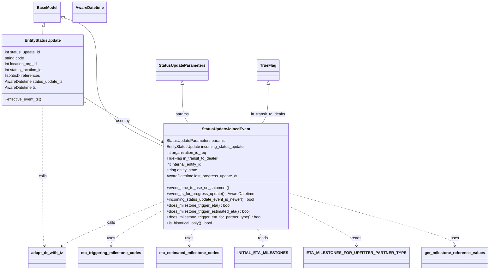

# Diagram: shipment_core/shipment_service/shipment_service/eta/eta_milestone_update/status_update/models.py

> Auto-generated by Obscura crawlers

## Mermaid

### SVG

<svg id="container" width="1891.265625" xmlns="http://www.w3.org/2000/svg" class="classDiagram" height="1102" viewBox="0 0 1891.265625 1102" role="graphics-document document" aria-roledescription="class"><g><defs><marker id="container_class-aggregationStart" class="marker aggregation class" refX="18" refY="7" markerWidth="190" markerHeight="240" orient="auto"><path d="M 18,7 L9,13 L1,7 L9,1 Z"></path></marker></defs><defs><marker id="container_class-aggregationEnd" class="marker aggregation class" refX="1" refY="7" markerWidth="20" markerHeight="28" orient="auto"><path d="M 18,7 L9,13 L1,7 L9,1 Z"></path></marker></defs><defs><marker id="container_class-extensionStart" class="marker extension class" refX="18" refY="7" markerWidth="190" markerHeight="240" orient="auto"><path d="M 1,7 L18,13 V 1 Z"></path></marker></defs><defs><marker id="container_class-extensionEnd" class="marker extension class" refX="1" refY="7" markerWidth="20" markerHeight="28" orient="auto"><path d="M 1,1 V 13 L18,7 Z"></path></marker></defs><defs><marker id="container_class-compositionStart" class="marker composition class" refX="18" refY="7" markerWidth="190" markerHeight="240" orient="auto"><path d="M 18,7 L9,13 L1,7 L9,1 Z"></path></marker></defs><defs><marker id="container_class-compositionEnd" class="marker composition class" refX="1" refY="7" markerWidth="20" markerHeight="28" orient="auto"><path d="M 18,7 L9,13 L1,7 L9,1 Z"></path></marker></defs><defs><marker id="container_class-dependencyStart" class="marker dependency class" refX="6" refY="7" markerWidth="190" markerHeight="240" orient="auto"><path d="M 5,7 L9,13 L1,7 L9,1 Z"></path></marker></defs><defs><marker id="container_class-dependencyEnd" class="marker dependency class" refX="13" refY="7" markerWidth="20" markerHeight="28" orient="auto"><path d="M 18,7 L9,13 L14,7 L9,1 Z"></path></marker></defs><defs><marker id="container_class-lollipopStart" class="marker lollipop class" refX="13" refY="7" markerWidth="190" markerHeight="240" orient="auto"><circle stroke="black" fill="transparent" cx="7" cy="7" r="6"></circle></marker></defs><defs><marker id="container_class-lollipopEnd" class="marker lollipop class" refX="1" refY="7" markerWidth="190" markerHeight="240" orient="auto"><circle stroke="black" fill="transparent" cx="7" cy="7" r="6"></circle></marker></defs><g class="root"><g class="clusters"></g><g class="edgePaths"><path d="M176.917,108.645L176.538,110.038C176.159,111.43,175.402,114.215,175.023,119.774C174.645,125.333,174.645,133.667,174.645,137.833L174.645,142" id="id_BaseModel_EntityStatusUpdate_1" class="edge-thickness-normal edge-pattern-solid relation" style=";;;" data-edge="true" data-et="edge" data-id="id_BaseModel_EntityStatusUpdate_1" data-points="W3sieCI6MTgxLjQ0NDAyOTg1MDc0NjI2LCJ5Ijo5Mn0seyJ4IjoxNzQuNjQ0NTMxMjUsInkiOjExN30seyJ4IjoxNzQuNjQ0NTMxMjUsInkiOjE0Mn1d" marker-start="url(#container_class-extensionStart)"></path><path d="M261.334,72.481L283.933,79.9C306.531,87.32,351.727,102.16,374.326,137.747C396.924,173.333,396.924,229.667,396.924,288C396.924,346.333,396.924,406.667,438.379,457.655C479.833,508.644,562.743,550.287,604.198,571.109L645.652,591.931" id="id_BaseModel_StatusUpdateJoinedEvent_2" class="edge-thickness-normal edge-pattern-solid relation" style=";;;" data-edge="true" data-et="edge" data-id="id_BaseModel_StatusUpdateJoinedEvent_2" data-points="W3sieCI6MjQ0Ljk0NTMxMjUsInkiOjY3LjA5OTM0MjQzOTAwNTcxfSx7IngiOjM5Ni45MjM4MjgxMjUsInkiOjExN30seyJ4IjozOTYuOTIzODI4MTI1LCJ5IjoyODZ9LHsieCI6Mzk2LjkyMzgyODEyNSwieSI6NDY3fSx7IngiOjY0NS42NTIzNDM3NSwieSI6NTkxLjkzMDg3MTYyNzA0NDl9XQ==" marker-start="url(#container_class-extensionStart)"></path><path d="M341.289,394.425L359.88,406.521C378.471,418.617,415.652,442.808,465.509,472.569C515.365,502.33,577.897,537.659,609.163,555.324L640.428,572.989" id="id_EntityStatusUpdate_StatusUpdateJoinedEvent_3" class="edge-thickness-normal edge-pattern-solid relation" style=";;;" data-edge="true" data-et="edge" data-id="id_EntityStatusUpdate_StatusUpdateJoinedEvent_3" data-points="W3sieCI6MzQxLjI4OTA2MjUsInkiOjM5NC40MjQ4ODc0OTA5NjA2Nn0seyJ4Ijo0NTIuODMzOTg0Mzc1LCJ5Ijo0Njd9LHsieCI6NjQ1LjY1MjM0Mzc1LCJ5Ijo1NzUuOTQwNTk0MzE4NTEzOH1d" marker-end="url(#container_class-dependencyEnd)"></path><path d="M735.824,345.25L735.824,365.542C735.824,385.833,735.824,426.417,739.841,452.875C743.858,479.333,751.892,491.667,755.909,497.833L759.926,504" id="id_StatusUpdateParameters_StatusUpdateJoinedEvent_4" class="edge-thickness-normal edge-pattern-solid relation" style=";;;" data-edge="true" data-et="edge" data-id="id_StatusUpdateParameters_StatusUpdateJoinedEvent_4" data-points="W3sieCI6NzM1LjgyNDIxODc1LCJ5IjozMjh9LHsieCI6NzM1LjgyNDIxODc1LCJ5Ijo0Njd9LHsieCI6NzU5LjkyNjA5MDA0NDQ2NjQsInkiOjUwNH1d" marker-start="url(#container_class-extensionStart)"></path><path d="M1068.305,345.25L1068.305,365.542C1068.305,385.833,1068.305,426.417,1064.218,452.875C1060.131,479.333,1051.957,491.667,1047.87,497.833L1043.783,504" id="id_TrueFlag_StatusUpdateJoinedEvent_5" class="edge-thickness-normal edge-pattern-solid relation" style=";;;" data-edge="true" data-et="edge" data-id="id_TrueFlag_StatusUpdateJoinedEvent_5" data-points="W3sieCI6MTA2OC4zMDQ2ODc1LCJ5IjozMjh9LHsieCI6MTA2OC4zMDQ2ODc1LCJ5Ijo0Njd9LHsieCI6MTA0My43ODI5MzI5Mjk4NDIsInkiOjUwNH1d" marker-start="url(#container_class-extensionStart)"></path><path d="M174.645,430L174.645,436.167C174.645,442.333,174.645,454.667,174.645,503C174.645,551.333,174.645,635.667,174.645,720C174.645,804.333,174.645,888.667,175.842,936.026C177.04,983.385,179.435,993.769,180.633,998.961L181.831,1004.154" id="id_EntityStatusUpdate_adapt_dt_with_tz_6" class="edge-thickness-normal edge-pattern-dashed relation" style=";;;" data-edge="true" data-et="edge" data-id="id_EntityStatusUpdate_adapt_dt_with_tz_6" data-points="W3sieCI6MTc0LjY0NDUzMTI1LCJ5Ijo0MzB9LHsieCI6MTc0LjY0NDUzMTI1LCJ5Ijo0Njd9LHsieCI6MTc0LjY0NDUzMTI1LCJ5Ijo3MjB9LHsieCI6MTc0LjY0NDUzMTI1LCJ5Ijo5NzN9LHsieCI6MTgzLjE3OTE5MzAzNzk3NDY3LCJ5IjoxMDEwfV0=" marker-end="url(#container_class-dependencyEnd)"></path><path d="M645.652,826.384L587.085,850.82C528.518,875.256,411.384,924.128,345.692,954.116C280,984.104,265.75,995.208,258.625,1000.76L251.5,1006.312" id="id_StatusUpdateJoinedEvent_adapt_dt_with_tz_7" class="edge-thickness-normal edge-pattern-dashed relation" style=";;;" data-edge="true" data-et="edge" data-id="id_StatusUpdateJoinedEvent_adapt_dt_with_tz_7" data-points="W3sieCI6NjQ1LjY1MjM0Mzc1LCJ5Ijo4MjYuMzg0MDkzNTg4MzQ3OH0seyJ4IjoyOTQuMjUsInkiOjk3M30seyJ4IjoyNDYuNzY2OTEwNjAxMjY1OCwieSI6MTAxMH1d" marker-end="url(#container_class-dependencyEnd)"></path><path d="M645.652,862.701L612.805,881.084C579.958,899.467,514.264,936.234,481.417,959.783C448.57,983.333,448.57,993.667,448.57,998.833L448.57,1004" id="id_StatusUpdateJoinedEvent_eta_triggering_milestone_codes_8" class="edge-thickness-normal edge-pattern-dashed relation" style=";;;" data-edge="true" data-et="edge" data-id="id_StatusUpdateJoinedEvent_eta_triggering_milestone_codes_8" data-points="W3sieCI6NjQ1LjY1MjM0Mzc1LCJ5Ijo4NjIuNzAwNjgzNTA1MTQ1N30seyJ4Ijo0NDguNTcwMzEyNSwieSI6OTczfSx7IngiOjQ0OC41NzAzMTI1LCJ5IjoxMDEwfV0=" marker-end="url(#container_class-dependencyEnd)"></path><path d="M779.426,936L775.965,942.167C772.505,948.333,765.585,960.667,762.124,972C758.664,983.333,758.664,993.667,758.664,998.833L758.664,1004" id="id_StatusUpdateJoinedEvent_eta_estimated_milestone_codes_9" class="edge-thickness-normal edge-pattern-dashed relation" style=";;;" data-edge="true" data-et="edge" data-id="id_StatusUpdateJoinedEvent_eta_estimated_milestone_codes_9" data-points="W3sieCI6Nzc5LjQyNTcxOTQ5MTEwNjcsInkiOjkzNn0seyJ4Ijo3NTguNjY0MDYyNSwieSI6OTczfSx7IngiOjc1OC42NjQwNjI1LCJ5IjoxMDEwfV0=" marker-end="url(#container_class-dependencyEnd)"></path><path d="M1021.832,936L1025.292,942.167C1028.753,948.333,1035.673,960.667,1039.133,972C1042.594,983.333,1042.594,993.667,1042.594,998.833L1042.594,1004" id="id_StatusUpdateJoinedEvent_INITIAL_ETA_MILESTONES_10" class="edge-thickness-normal edge-pattern-dashed relation" style=";;;" data-edge="true" data-et="edge" data-id="id_StatusUpdateJoinedEvent_INITIAL_ETA_MILESTONES_10" data-points="W3sieCI6MTAyMS44MzIwOTMwMDg4OTMzLCJ5Ijo5MzZ9LHsieCI6MTA0Mi41OTM3NSwieSI6OTczfSx7IngiOjEwNDIuNTkzNzUsInkiOjEwMTB9XQ==" marker-end="url(#container_class-dependencyEnd)"></path><path d="M1155.605,853.286L1193.774,873.239C1231.943,893.191,1308.28,933.095,1346.449,958.214C1384.617,983.333,1384.617,993.667,1384.617,998.833L1384.617,1004" id="id_StatusUpdateJoinedEvent_ETA_MILESTONES_FOR_UPFITTER_PARTNER_TYPE_11" class="edge-thickness-normal edge-pattern-dashed relation" style=";;;" data-edge="true" data-et="edge" data-id="id_StatusUpdateJoinedEvent_ETA_MILESTONES_FOR_UPFITTER_PARTNER_TYPE_11" data-points="W3sieCI6MTE1NS42MDU0Njg3NSwieSI6ODUzLjI4NjQzMDI5NTE1NX0seyJ4IjoxMzg0LjYxNzE4NzUsInkiOjk3M30seyJ4IjoxMzg0LjYxNzE4NzUsInkiOjEwMTB9XQ==" marker-end="url(#container_class-dependencyEnd)"></path><path d="M1155.605,795.664L1255.205,825.22C1354.805,854.776,1554.004,913.888,1653.604,948.611C1753.203,983.333,1753.203,993.667,1753.203,998.833L1753.203,1004" id="id_StatusUpdateJoinedEvent_get_milestone_reference_values_12" class="edge-thickness-normal edge-pattern-dashed relation" style=";;;" data-edge="true" data-et="edge" data-id="id_StatusUpdateJoinedEvent_get_milestone_reference_values_12" data-points="W3sieCI6MTE1NS42MDU0Njg3NSwieSI6Nzk1LjY2Mzg3NjQwMzcyMjJ9LHsieCI6MTc1My4yMDMxMjUsInkiOjk3M30seyJ4IjoxNzUzLjIwMzEyNSwieSI6MTAxMH1d" marker-end="url(#container_class-dependencyEnd)"></path></g><g class="edgeLabels"><g class="edgeLabel"><g class="label" data-id="id_BaseModel_EntityStatusUpdate_1" transform="translate(0, 0)"><foreignObject width="0" height="0">

</foreignObject></g></g><g class="edgeLabel"><g class="label" data-id="id_BaseModel_StatusUpdateJoinedEvent_2" transform="translate(0, 0)"><foreignObject width="0" height="0">

</foreignObject></g></g><g class="edgeLabel" transform="translate(491.31171, 488.73956)"><g class="label" data-id="id_EntityStatusUpdate_StatusUpdateJoinedEvent_3" transform="translate(-28.3125, -12)"><foreignObject width="56.625" height="24">

used by

</foreignObject></g></g><g class="edgeLabel" transform="translate(735.82421875, 467)"><g class="label" data-id="id_StatusUpdateParameters_StatusUpdateJoinedEvent_4" transform="translate(-26.78125, -12)"><foreignObject width="53.5625" height="24">

params

</foreignObject></g></g><g class="edgeLabel" transform="translate(1068.3046875, 467)"><g class="label" data-id="id_TrueFlag_StatusUpdateJoinedEvent_5" transform="translate(-72.9296875, -12)"><foreignObject width="145.859375" height="24">

in_transit_to_dealer

</foreignObject></g></g><g class="edgeLabel" transform="translate(174.64453125, 720)"><g class="label" data-id="id_EntityStatusUpdate_adapt_dt_with_tz_6" transform="translate(-16.4453125, -12)"><foreignObject width="32.890625" height="24">

calls

</foreignObject></g></g><g class="edgeLabel" transform="translate(442.17364, 911.28169)"><g class="label" data-id="id_StatusUpdateJoinedEvent_adapt_dt_with_tz_7" transform="translate(-16.4453125, -12)"><foreignObject width="32.890625" height="24">

calls

</foreignObject></g></g><g class="edgeLabel" transform="translate(448.5703125, 973)"><g class="label" data-id="id_StatusUpdateJoinedEvent_eta_triggering_milestone_codes_8" transform="translate(-16.4921875, -12)"><foreignObject width="32.984375" height="24">

uses

</foreignObject></g></g><g class="edgeLabel" transform="translate(758.6640625, 973)"><g class="label" data-id="id_StatusUpdateJoinedEvent_eta_estimated_milestone_codes_9" transform="translate(-16.4921875, -12)"><foreignObject width="32.984375" height="24">

uses

</foreignObject></g></g><g class="edgeLabel" transform="translate(1042.59375, 973)"><g class="label" data-id="id_StatusUpdateJoinedEvent_INITIAL_ETA_MILESTONES_10" transform="translate(-20.0078125, -12)"><foreignObject width="40.015625" height="24">

reads

</foreignObject></g></g><g class="edgeLabel" transform="translate(1384.6171875, 973)"><g class="label" data-id="id_StatusUpdateJoinedEvent_ETA_MILESTONES_FOR_UPFITTER_PARTNER_TYPE_11" transform="translate(-20.0078125, -12)"><foreignObject width="40.015625" height="24">

reads

</foreignObject></g></g><g class="edgeLabel" transform="translate(1753.203125, 973)"><g class="label" data-id="id_StatusUpdateJoinedEvent_get_milestone_reference_values_12" transform="translate(-16.4921875, -12)"><foreignObject width="32.984375" height="24">

uses

</foreignObject></g></g><g class="edgeTerminals" transform="translate(347.7771166811113, 416.5417386522384)"><g class="inner" transform="translate(0, 0)"><foreignObject style="width: 9px; height: 12px;">
1
</foreignObject></g></g><g class="edgeTerminals" transform="translate(632.7946346072195, 549.2724981134254)"><g class="inner" transform="translate(0, 0)"></g><foreignObject style="width: 9px; height: 12px;">
1
</foreignObject></g></g><g class="nodes"><g class="node default" id="classId-BaseModel-0" transform="translate(192.8671875, 50)"><g class="basic label-container"><path d="M-52.078125 -42 L52.078125 -42 L52.078125 42 L-52.078125 42" stroke="none" stroke-width="0" fill="#ECECFF" style=""></path><path d="M-52.078125 -42 C-20.85779549134805 -42, 10.3625340173039 -42, 52.078125 -42 M-52.078125 -42 C-15.841573604864635 -42, 20.39497779027073 -42, 52.078125 -42 M52.078125 -42 C52.078125 -9.594612230251087, 52.078125 22.810775539497826, 52.078125 42 M52.078125 -42 C52.078125 -22.72010465092513, 52.078125 -3.4402093018502597, 52.078125 42 M52.078125 42 C21.23497073538818 42, -9.608183529223638 42, -52.078125 42 M52.078125 42 C27.27715857387944 42, 2.47619214775888 42, -52.078125 42 M-52.078125 42 C-52.078125 22.331745448652633, -52.078125 2.663490897305266, -52.078125 -42 M-52.078125 42 C-52.078125 24.61188359192045, -52.078125 7.2237671838408986, -52.078125 -42" stroke="#9370DB" stroke-width="1.3" fill="none" stroke-dasharray="0 0" style=""></path></g><g class="annotation-group text" transform="translate(0, -18)"></g><g class="label-group text" transform="translate(-40.078125, -18)"><g class="label" style="font-weight: bolder" transform="translate(0,-12)"><foreignObject width="80.15625" height="24">

BaseModel

</foreignObject></g></g><g class="members-group text" transform="translate(-40.078125, 30)"></g><g class="methods-group text" transform="translate(-40.078125, 60)"></g><g class="divider" style=""><path d="M-52.078125 6 C-10.984691966330104 6, 30.108741067339793 6, 52.078125 6 M-52.078125 6 C-10.997680265087197 6, 30.082764469825605 6, 52.078125 6" stroke="#9370DB" stroke-width="1.3" fill="none" stroke-dasharray="0 0" style=""></path></g><g class="divider" style=""><path d="M-52.078125 24 C-16.224230372013245 24, 19.62966425597351 24, 52.078125 24 M-52.078125 24 C-10.865830921036796 24, 30.346463157926408 24, 52.078125 24" stroke="#9370DB" stroke-width="1.3" fill="none" stroke-dasharray="0 0" style=""></path></g></g><g class="node default" id="classId-AwareDatetime-1" transform="translate(362.7109375, 50)"><g class="basic label-container"><path d="M-67.765625 -42 L67.765625 -42 L67.765625 42 L-67.765625 42" stroke="none" stroke-width="0" fill="#ECECFF" style=""></path><path d="M-67.765625 -42 C-16.507178901304847 -42, 34.751267197390305 -42, 67.765625 -42 M-67.765625 -42 C-36.643153656635135 -42, -5.520682313270271 -42, 67.765625 -42 M67.765625 -42 C67.765625 -8.681637931848655, 67.765625 24.63672413630269, 67.765625 42 M67.765625 -42 C67.765625 -12.368291397502954, 67.765625 17.26341720499409, 67.765625 42 M67.765625 42 C22.51088826263569 42, -22.743848474728622 42, -67.765625 42 M67.765625 42 C13.596576849528425 42, -40.57247130094315 42, -67.765625 42 M-67.765625 42 C-67.765625 12.294198186808927, -67.765625 -17.411603626382146, -67.765625 -42 M-67.765625 42 C-67.765625 25.010078329306314, -67.765625 8.020156658612628, -67.765625 -42" stroke="#9370DB" stroke-width="1.3" fill="none" stroke-dasharray="0 0" style=""></path></g><g class="annotation-group text" transform="translate(0, -18)"></g><g class="label-group text" transform="translate(-55.765625, -18)"><g class="label" style="font-weight: bolder" transform="translate(0,-12)"><foreignObject width="111.53125" height="24">

AwareDatetime

</foreignObject></g></g><g class="members-group text" transform="translate(-55.765625, 30)"></g><g class="methods-group text" transform="translate(-55.765625, 60)"></g><g class="divider" style=""><path d="M-67.765625 6 C-16.476271391043696 6, 34.81308221791261 6, 67.765625 6 M-67.765625 6 C-25.85978489474126 6, 16.04605521051748 6, 67.765625 6" stroke="#9370DB" stroke-width="1.3" fill="none" stroke-dasharray="0 0" style=""></path></g><g class="divider" style=""><path d="M-67.765625 24 C-26.99855082279724 24, 13.768523354405517 24, 67.765625 24 M-67.765625 24 C-32.128976435313156 24, 3.507672129373688 24, 67.765625 24" stroke="#9370DB" stroke-width="1.3" fill="none" stroke-dasharray="0 0" style=""></path></g></g><g class="node default" id="classId-StatusUpdateParameters-2" transform="translate(735.82421875, 286)"><g class="basic label-container"><path d="M-103.6015625 -42 L103.6015625 -42 L103.6015625 42 L-103.6015625 42" stroke="none" stroke-width="0" fill="#ECECFF" style=""></path><path d="M-103.6015625 -42 C-47.348467183840846 -42, 8.904628132318308 -42, 103.6015625 -42 M-103.6015625 -42 C-23.16794616837001 -42, 57.26567016325998 -42, 103.6015625 -42 M103.6015625 -42 C103.6015625 -20.0760775503538, 103.6015625 1.8478448992923973, 103.6015625 42 M103.6015625 -42 C103.6015625 -9.432902214128518, 103.6015625 23.134195571742964, 103.6015625 42 M103.6015625 42 C60.60984555732427 42, 17.61812861464854 42, -103.6015625 42 M103.6015625 42 C25.22498999468101 42, -53.15158251063798 42, -103.6015625 42 M-103.6015625 42 C-103.6015625 11.58615669115332, -103.6015625 -18.82768661769336, -103.6015625 -42 M-103.6015625 42 C-103.6015625 16.541948914431973, -103.6015625 -8.916102171136053, -103.6015625 -42" stroke="#9370DB" stroke-width="1.3" fill="none" stroke-dasharray="0 0" style=""></path></g><g class="annotation-group text" transform="translate(0, -18)"></g><g class="label-group text" transform="translate(-91.6015625, -18)"><g class="label" style="font-weight: bolder" transform="translate(0,-12)"><foreignObject width="183.203125" height="24">

StatusUpdateParameters

</foreignObject></g></g><g class="members-group text" transform="translate(-91.6015625, 30)"></g><g class="methods-group text" transform="translate(-91.6015625, 60)"></g><g class="divider" style=""><path d="M-103.6015625 6 C-59.76313041799446 6, -15.924698335988921 6, 103.6015625 6 M-103.6015625 6 C-51.58876438034713 6, 0.4240337393057416 6, 103.6015625 6" stroke="#9370DB" stroke-width="1.3" fill="none" stroke-dasharray="0 0" style=""></path></g><g class="divider" style=""><path d="M-103.6015625 24 C-46.5270700402292 24, 10.547422419541604 24, 103.6015625 24 M-103.6015625 24 C-33.09202950331316 24, 37.41750349337369 24, 103.6015625 24" stroke="#9370DB" stroke-width="1.3" fill="none" stroke-dasharray="0 0" style=""></path></g></g><g class="node default" id="classId-TrueFlag-3" transform="translate(1068.3046875, 286)"><g class="basic label-container"><path d="M-43.1484375 -42 L43.1484375 -42 L43.1484375 42 L-43.1484375 42" stroke="none" stroke-width="0" fill="#ECECFF" style=""></path><path d="M-43.1484375 -42 C-13.352905302100705 -42, 16.44262689579859 -42, 43.1484375 -42 M-43.1484375 -42 C-14.687225718159155 -42, 13.77398606368169 -42, 43.1484375 -42 M43.1484375 -42 C43.1484375 -8.767918073682509, 43.1484375 24.464163852634982, 43.1484375 42 M43.1484375 -42 C43.1484375 -24.1131279781592, 43.1484375 -6.226255956318397, 43.1484375 42 M43.1484375 42 C20.67956132377576 42, -1.7893148524484772 42, -43.1484375 42 M43.1484375 42 C18.51854416860824 42, -6.111349162783519 42, -43.1484375 42 M-43.1484375 42 C-43.1484375 21.937484611386207, -43.1484375 1.874969222772414, -43.1484375 -42 M-43.1484375 42 C-43.1484375 22.499633939953306, -43.1484375 2.9992678799066113, -43.1484375 -42" stroke="#9370DB" stroke-width="1.3" fill="none" stroke-dasharray="0 0" style=""></path></g><g class="annotation-group text" transform="translate(0, -18)"></g><g class="label-group text" transform="translate(-31.1484375, -18)"><g class="label" style="font-weight: bolder" transform="translate(0,-12)"><foreignObject width="62.296875" height="24">

TrueFlag

</foreignObject></g></g><g class="members-group text" transform="translate(-31.1484375, 30)"></g><g class="methods-group text" transform="translate(-31.1484375, 60)"></g><g class="divider" style=""><path d="M-43.1484375 6 C-9.413713031170992 6, 24.321011437658015 6, 43.1484375 6 M-43.1484375 6 C-18.8628849131286 6, 5.422667673742801 6, 43.1484375 6" stroke="#9370DB" stroke-width="1.3" fill="none" stroke-dasharray="0 0" style=""></path></g><g class="divider" style=""><path d="M-43.1484375 24 C-17.979637253535035 24, 7.18916299292993 24, 43.1484375 24 M-43.1484375 24 C-20.756876185157303 24, 1.6346851296853941 24, 43.1484375 24" stroke="#9370DB" stroke-width="1.3" fill="none" stroke-dasharray="0 0" style=""></path></g></g><g class="node default" id="classId-EntityStatusUpdate-4" transform="translate(174.64453125, 286)"><g class="basic label-container"><path d="M-166.64453125 -144 L166.64453125 -144 L166.64453125 144 L-166.64453125 144" stroke="none" stroke-width="0" fill="#ECECFF" style=""></path><path d="M-166.64453125 -144 C-78.4413679687109 -144, 9.761795312578187 -144, 166.64453125 -144 M-166.64453125 -144 C-45.11122310787897 -144, 76.42208503424206 -144, 166.64453125 -144 M166.64453125 -144 C166.64453125 -74.67575937310981, 166.64453125 -5.351518746219625, 166.64453125 144 M166.64453125 -144 C166.64453125 -56.90564366013969, 166.64453125 30.188712679720624, 166.64453125 144 M166.64453125 144 C63.94891323293099 144, -38.74670478413802 144, -166.64453125 144 M166.64453125 144 C47.57125259410593 144, -71.50202606178814 144, -166.64453125 144 M-166.64453125 144 C-166.64453125 46.87199877211087, -166.64453125 -50.25600245577826, -166.64453125 -144 M-166.64453125 144 C-166.64453125 84.0168263437015, -166.64453125 24.03365268740299, -166.64453125 -144" stroke="#9370DB" stroke-width="1.3" fill="none" stroke-dasharray="0 0" style=""></path></g><g class="annotation-group text" transform="translate(0, -120)"></g><g class="label-group text" transform="translate(-71.2890625, -120)"><g class="label" style="font-weight: bolder" transform="translate(0,-12)"><foreignObject width="142.578125" height="24">

EntityStatusUpdate

</foreignObject></g></g><g class="members-group text" transform="translate(-154.64453125, -72)"><g class="label" style="" transform="translate(0,-12)"><foreignObject width="149.421875" height="24">

int status_update_id

</foreignObject></g><g class="label" style="" transform="translate(0,12)"><foreignObject width="80.84375" height="24">

string code

</foreignObject></g><g class="label" style="" transform="translate(0,36)"><foreignObject width="137.125" height="24">

int location_org_id

</foreignObject></g><g class="label" style="" transform="translate(0,60)"><foreignObject width="157.703125" height="24">

int status_location_id

</foreignObject></g><g class="label" style="" transform="translate(0,84)"><foreignObject width="145.84375" height="24">

list&lt;dict&gt; references

</foreignObject></g><g class="label" style="" transform="translate(0,108)"><foreignObject width="238" height="24">

AwareDatetime status_update_ts

</foreignObject></g><g class="label" style="" transform="translate(0,132)"><foreignObject width="126.890625" height="24">

AwareDatetime ts

</foreignObject></g></g><g class="methods-group text" transform="translate(-154.64453125, 120)"><g class="label" style="" transform="translate(0,-12)"><foreignObject width="150.09375" height="24">

+effective_event_ts()

</foreignObject></g></g><g class="divider" style=""><path d="M-166.64453125 -96 C-63.43040817577673 -96, 39.78371489844653 -96, 166.64453125 -96 M-166.64453125 -96 C-39.52078217853082 -96, 87.60296689293835 -96, 166.64453125 -96" stroke="#9370DB" stroke-width="1.3" fill="none" stroke-dasharray="0 0" style=""></path></g><g class="divider" style=""><path d="M-166.64453125 96 C-34.00566852875468 96, 98.63319419249063 96, 166.64453125 96 M-166.64453125 96 C-86.29042972555283 96, -5.936328201105653 96, 166.64453125 96" stroke="#9370DB" stroke-width="1.3" fill="none" stroke-dasharray="0 0" style=""></path></g></g><g class="node default" id="classId-StatusUpdateJoinedEvent-5" transform="translate(900.62890625, 720)"><g class="basic label-container"><path d="M-254.9765625 -216 L254.9765625 -216 L254.9765625 216 L-254.9765625 216" stroke="none" stroke-width="0" fill="#ECECFF" style=""></path><path d="M-254.9765625 -216 C-114.17787222307626 -216, 26.620818053847472 -216, 254.9765625 -216 M-254.9765625 -216 C-117.24618440972816 -216, 20.484193680543683 -216, 254.9765625 -216 M254.9765625 -216 C254.9765625 -63.46219845972263, 254.9765625 89.07560308055474, 254.9765625 216 M254.9765625 -216 C254.9765625 -50.74715292715058, 254.9765625 114.50569414569884, 254.9765625 216 M254.9765625 216 C108.22922256816454 216, -38.51811736367091 216, -254.9765625 216 M254.9765625 216 C138.82971883064687 216, 22.682875161293765 216, -254.9765625 216 M-254.9765625 216 C-254.9765625 77.67900375270739, -254.9765625 -60.641992494585224, -254.9765625 -216 M-254.9765625 216 C-254.9765625 109.90955051813833, -254.9765625 3.8191010362766633, -254.9765625 -216" stroke="#9370DB" stroke-width="1.3" fill="none" stroke-dasharray="0 0" style=""></path></g><g class="annotation-group text" transform="translate(0, -192)"></g><g class="label-group text" transform="translate(-93.515625, -192)"><g class="label" style="font-weight: bolder" transform="translate(0,-12)"><foreignObject width="187.03125" height="24">

StatusUpdateJoinedEvent

</foreignObject></g></g><g class="members-group text" transform="translate(-242.9765625, -144)"><g class="label" style="" transform="translate(0,-12)"><foreignObject width="237.609375" height="24">

StatusUpdateParameters params

</foreignObject></g><g class="label" style="" transform="translate(0,12)"><foreignObject width="322.4375" height="24">

EntityStatusUpdate incoming_status_update

</foreignObject></g><g class="label" style="" transform="translate(0,36)"><foreignObject width="168.96875" height="24">

int organization_id_req

</foreignObject></g><g class="label" style="" transform="translate(0,60)"><foreignObject width="211.265625" height="24">

TrueFlag in_transit_to_dealer

</foreignObject></g><g class="label" style="" transform="translate(0,84)"><foreignObject width="152.71875" height="24">

int internal_entity_id

</foreignObject></g><g class="label" style="" transform="translate(0,108)"><foreignObject width="131.765625" height="24">

string entity_state

</foreignObject></g><g class="label" style="" transform="translate(0,132)"><foreignObject width="292.46875" height="24">

AwareDatetime last_progress_update_dt

</foreignObject></g></g><g class="methods-group text" transform="translate(-242.9765625, 48)"><g class="label" style="" transform="translate(0,-12)"><foreignObject width="258.328125" height="24">

+event_time_to_use_on_shipment()

</foreignObject></g><g class="label" style="" transform="translate(0,12)"><foreignObject width="358.1875" height="24">

+event_ts_for_progress_update() : AwareDatetime

</foreignObject></g><g class="label" style="" transform="translate(0,36)"><foreignObject width="362.625" height="24">

+incoming_status_update_event_is_newer() : bool

</foreignObject></g><g class="label" style="" transform="translate(0,60)"><foreignObject width="263.890625" height="24">

+does_milestone_trigger_eta() : bool

</foreignObject></g><g class="label" style="" transform="translate(0,84)"><foreignObject width="344.609375" height="24">

+does_milestone_trigger_estimated_eta() : bool

</foreignObject></g><g class="label" style="" transform="translate(0,108)"><foreignObject width="392.4375" height="24">

+does_milestone_trigger_eta_for_partner_type() : bool

</foreignObject></g><g class="label" style="" transform="translate(0,132)"><foreignObject width="190.3125" height="24">

+is_historical_only() : bool

</foreignObject></g></g><g class="divider" style=""><path d="M-254.9765625 -168 C-149.24057405000167 -168, -43.50458560000334 -168, 254.9765625 -168 M-254.9765625 -168 C-79.19140504048121 -168, 96.59375241903757 -168, 254.9765625 -168" stroke="#9370DB" stroke-width="1.3" fill="none" stroke-dasharray="0 0" style=""></path></g><g class="divider" style=""><path d="M-254.9765625 24 C-104.21161757728285 24, 46.5533273454343 24, 254.9765625 24 M-254.9765625 24 C-113.66158036740723 24, 27.65340176518555 24, 254.9765625 24" stroke="#9370DB" stroke-width="1.3" fill="none" stroke-dasharray="0 0" style=""></path></g></g><g class="node default" id="classId-adapt_dt_with_tz-6" transform="translate(192.8671875, 1052)"><g class="basic label-container"><path d="M-76.0390625 -42 L76.0390625 -42 L76.0390625 42 L-76.0390625 42" stroke="none" stroke-width="0" fill="#ECECFF" style=""></path><path d="M-76.0390625 -42 C-26.578557835250642 -42, 22.881946829498716 -42, 76.0390625 -42 M-76.0390625 -42 C-42.32863264190429 -42, -8.618202783808584 -42, 76.0390625 -42 M76.0390625 -42 C76.0390625 -13.330957655918077, 76.0390625 15.338084688163846, 76.0390625 42 M76.0390625 -42 C76.0390625 -21.058863985692987, 76.0390625 -0.11772797138597468, 76.0390625 42 M76.0390625 42 C21.89671164883255 42, -32.2456392023349 42, -76.0390625 42 M76.0390625 42 C36.53241115999985 42, -2.9742401800002938 42, -76.0390625 42 M-76.0390625 42 C-76.0390625 18.26706813531119, -76.0390625 -5.465863729377617, -76.0390625 -42 M-76.0390625 42 C-76.0390625 11.865125773606906, -76.0390625 -18.26974845278619, -76.0390625 -42" stroke="#9370DB" stroke-width="1.3" fill="none" stroke-dasharray="0 0" style=""></path></g><g class="annotation-group text" transform="translate(0, -18)"></g><g class="label-group text" transform="translate(-64.0390625, -18)"><g class="label" style="font-weight: bolder" transform="translate(0,-12)"><foreignObject width="128.078125" height="24">

adapt_dt_with_tz

</foreignObject></g></g><g class="members-group text" transform="translate(-64.0390625, 30)"></g><g class="methods-group text" transform="translate(-64.0390625, 60)"></g><g class="divider" style=""><path d="M-76.0390625 6 C-37.39663811406914 6, 1.2457862718617179 6, 76.0390625 6 M-76.0390625 6 C-24.181422756606395 6, 27.67621698678721 6, 76.0390625 6" stroke="#9370DB" stroke-width="1.3" fill="none" stroke-dasharray="0 0" style=""></path></g><g class="divider" style=""><path d="M-76.0390625 24 C-34.68430190435259 24, 6.670458691294826 24, 76.0390625 24 M-76.0390625 24 C-16.95347981414706 24, 42.13210287170588 24, 76.0390625 24" stroke="#9370DB" stroke-width="1.3" fill="none" stroke-dasharray="0 0" style=""></path></g></g><g class="node default" id="classId-eta_triggering_milestone_codes-7" transform="translate(448.5703125, 1052)"><g class="basic label-container"><path d="M-129.6640625 -42 L129.6640625 -42 L129.6640625 42 L-129.6640625 42" stroke="none" stroke-width="0" fill="#ECECFF" style=""></path><path d="M-129.6640625 -42 C-31.584820131850705 -42, 66.49442223629859 -42, 129.6640625 -42 M-129.6640625 -42 C-73.14048112719286 -42, -16.616899754385727 -42, 129.6640625 -42 M129.6640625 -42 C129.6640625 -16.86052356351386, 129.6640625 8.278952872972283, 129.6640625 42 M129.6640625 -42 C129.6640625 -11.516344106791077, 129.6640625 18.967311786417845, 129.6640625 42 M129.6640625 42 C42.18906511682587 42, -45.285932266348254 42, -129.6640625 42 M129.6640625 42 C38.73622599991266 42, -52.191610500174676 42, -129.6640625 42 M-129.6640625 42 C-129.6640625 13.42206699826152, -129.6640625 -15.155866003476959, -129.6640625 -42 M-129.6640625 42 C-129.6640625 15.066743337048091, -129.6640625 -11.866513325903817, -129.6640625 -42" stroke="#9370DB" stroke-width="1.3" fill="none" stroke-dasharray="0 0" style=""></path></g><g class="annotation-group text" transform="translate(0, -18)"></g><g class="label-group text" transform="translate(-117.6640625, -18)"><g class="label" style="font-weight: bolder" transform="translate(0,-12)"><foreignObject width="235.328125" height="24">

eta_triggering_milestone_codes

</foreignObject></g></g><g class="members-group text" transform="translate(-117.6640625, 30)"></g><g class="methods-group text" transform="translate(-117.6640625, 60)"></g><g class="divider" style=""><path d="M-129.6640625 6 C-28.56512355689162 6, 72.53381538621676 6, 129.6640625 6 M-129.6640625 6 C-26.15410544658951 6, 77.35585160682098 6, 129.6640625 6" stroke="#9370DB" stroke-width="1.3" fill="none" stroke-dasharray="0 0" style=""></path></g><g class="divider" style=""><path d="M-129.6640625 24 C-45.93150108911999 24, 37.80106032176002 24, 129.6640625 24 M-129.6640625 24 C-49.334408622275845 24, 30.99524525544831 24, 129.6640625 24" stroke="#9370DB" stroke-width="1.3" fill="none" stroke-dasharray="0 0" style=""></path></g></g><g class="node default" id="classId-eta_estimated_milestone_codes-8" transform="translate(758.6640625, 1052)"><g class="basic label-container"><path d="M-130.4296875 -42 L130.4296875 -42 L130.4296875 42 L-130.4296875 42" stroke="none" stroke-width="0" fill="#ECECFF" style=""></path><path d="M-130.4296875 -42 C-62.10834310545397 -42, 6.2130012890920625 -42, 130.4296875 -42 M-130.4296875 -42 C-58.03298869638907 -42, 14.363710107221863 -42, 130.4296875 -42 M130.4296875 -42 C130.4296875 -19.864020405672083, 130.4296875 2.271959188655835, 130.4296875 42 M130.4296875 -42 C130.4296875 -20.950186838733696, 130.4296875 0.0996263225326075, 130.4296875 42 M130.4296875 42 C40.22776646675983 42, -49.97415456648034 42, -130.4296875 42 M130.4296875 42 C65.12744442870638 42, -0.1747986425872341 42, -130.4296875 42 M-130.4296875 42 C-130.4296875 14.366880458003351, -130.4296875 -13.266239083993298, -130.4296875 -42 M-130.4296875 42 C-130.4296875 11.008255467483366, -130.4296875 -19.983489065033268, -130.4296875 -42" stroke="#9370DB" stroke-width="1.3" fill="none" stroke-dasharray="0 0" style=""></path></g><g class="annotation-group text" transform="translate(0, -18)"></g><g class="label-group text" transform="translate(-118.4296875, -18)"><g class="label" style="font-weight: bolder" transform="translate(0,-12)"><foreignObject width="236.859375" height="24">

eta_estimated_milestone_codes

</foreignObject></g></g><g class="members-group text" transform="translate(-118.4296875, 30)"></g><g class="methods-group text" transform="translate(-118.4296875, 60)"></g><g class="divider" style=""><path d="M-130.4296875 6 C-77.43571673624172 6, -24.441745972483446 6, 130.4296875 6 M-130.4296875 6 C-66.40981731348423 6, -2.389947126968451 6, 130.4296875 6" stroke="#9370DB" stroke-width="1.3" fill="none" stroke-dasharray="0 0" style=""></path></g><g class="divider" style=""><path d="M-130.4296875 24 C-71.37608559906238 24, -12.32248369812477 24, 130.4296875 24 M-130.4296875 24 C-78.23941959089744 24, -26.049151681794882 24, 130.4296875 24" stroke="#9370DB" stroke-width="1.3" fill="none" stroke-dasharray="0 0" style=""></path></g></g><g class="node default" id="classId-INITIAL_ETA_MILESTONES-9" transform="translate(1042.59375, 1052)"><g class="basic label-container"><path d="M-103.5 -42 L103.5 -42 L103.5 42 L-103.5 42" stroke="none" stroke-width="0" fill="#ECECFF" style=""></path><path d="M-103.5 -42 C-42.40468755360859 -42, 18.69062489278282 -42, 103.5 -42 M-103.5 -42 C-62.03339957414301 -42, -20.566799148286023 -42, 103.5 -42 M103.5 -42 C103.5 -15.771775229994724, 103.5 10.456449540010553, 103.5 42 M103.5 -42 C103.5 -11.962363450852628, 103.5 18.075273098294744, 103.5 42 M103.5 42 C52.305492187879906 42, 1.1109843757598128 42, -103.5 42 M103.5 42 C48.10148243334165 42, -7.297035133316697 42, -103.5 42 M-103.5 42 C-103.5 13.050883964829119, -103.5 -15.898232070341763, -103.5 -42 M-103.5 42 C-103.5 22.65878659894797, -103.5 3.317573197895939, -103.5 -42" stroke="#9370DB" stroke-width="1.3" fill="none" stroke-dasharray="0 0" style=""></path></g><g class="annotation-group text" transform="translate(0, -18)"></g><g class="label-group text" transform="translate(-91.5, -18)"><g class="label" style="font-weight: bolder" transform="translate(0,-12)"><foreignObject width="183" height="24">

INITIAL_ETA_MILESTONES

</foreignObject></g></g><g class="members-group text" transform="translate(-91.5, 30)"></g><g class="methods-group text" transform="translate(-91.5, 60)"></g><g class="divider" style=""><path d="M-103.5 6 C-28.56636777524696 6, 46.36726444950608 6, 103.5 6 M-103.5 6 C-61.907132309376934 6, -20.314264618753867 6, 103.5 6" stroke="#9370DB" stroke-width="1.3" fill="none" stroke-dasharray="0 0" style=""></path></g><g class="divider" style=""><path d="M-103.5 24 C-55.06253006465371 24, -6.625060129307414 24, 103.5 24 M-103.5 24 C-48.76696195730116 24, 5.966076085397674 24, 103.5 24" stroke="#9370DB" stroke-width="1.3" fill="none" stroke-dasharray="0 0" style=""></path></g></g><g class="node default" id="classId-ETA_MILESTONES_FOR_UPFITTER_PARTNER_TYPE-10" transform="translate(1384.6171875, 1052)"><g class="basic label-container"><path d="M-188.5234375 -42 L188.5234375 -42 L188.5234375 42 L-188.5234375 42" stroke="none" stroke-width="0" fill="#ECECFF" style=""></path><path d="M-188.5234375 -42 C-66.9918264363442 -42, 54.539784627311604 -42, 188.5234375 -42 M-188.5234375 -42 C-108.99699559368167 -42, -29.47055368736335 -42, 188.5234375 -42 M188.5234375 -42 C188.5234375 -12.90709637843382, 188.5234375 16.18580724313236, 188.5234375 42 M188.5234375 -42 C188.5234375 -16.221858769958658, 188.5234375 9.556282460082684, 188.5234375 42 M188.5234375 42 C73.83991312697233 42, -40.84361124605533 42, -188.5234375 42 M188.5234375 42 C56.96359714837803 42, -74.59624320324394 42, -188.5234375 42 M-188.5234375 42 C-188.5234375 20.510237746187634, -188.5234375 -0.9795245076247312, -188.5234375 -42 M-188.5234375 42 C-188.5234375 18.078314566072663, -188.5234375 -5.843370867854674, -188.5234375 -42" stroke="#9370DB" stroke-width="1.3" fill="none" stroke-dasharray="0 0" style=""></path></g><g class="annotation-group text" transform="translate(0, -18)"></g><g class="label-group text" transform="translate(-176.5234375, -18)"><g class="label" style="font-weight: bolder" transform="translate(0,-12)"><foreignObject width="353.046875" height="24">

ETA_MILESTONES_FOR_UPFITTER_PARTNER_TYPE

</foreignObject></g></g><g class="members-group text" transform="translate(-176.5234375, 30)"></g><g class="methods-group text" transform="translate(-176.5234375, 60)"></g><g class="divider" style=""><path d="M-188.5234375 6 C-95.85072133078013 6, -3.1780051615602645 6, 188.5234375 6 M-188.5234375 6 C-89.82380919639525 6, 8.875819107209509 6, 188.5234375 6" stroke="#9370DB" stroke-width="1.3" fill="none" stroke-dasharray="0 0" style=""></path></g><g class="divider" style=""><path d="M-188.5234375 24 C-98.2448118051097 24, -7.966186110219411 24, 188.5234375 24 M-188.5234375 24 C-91.19194052592167 24, 6.139556448156668 24, 188.5234375 24" stroke="#9370DB" stroke-width="1.3" fill="none" stroke-dasharray="0 0" style=""></path></g></g><g class="node default" id="classId-get_milestone_reference_values-11" transform="translate(1753.203125, 1052)"><g class="basic label-container"><path d="M-130.0625 -42 L130.0625 -42 L130.0625 42 L-130.0625 42" stroke="none" stroke-width="0" fill="#ECECFF" style=""></path><path d="M-130.0625 -42 C-73.1666239678446 -42, -16.270747935689215 -42, 130.0625 -42 M-130.0625 -42 C-43.923147415800216 -42, 42.21620516839957 -42, 130.0625 -42 M130.0625 -42 C130.0625 -13.589137793565833, 130.0625 14.821724412868335, 130.0625 42 M130.0625 -42 C130.0625 -24.163432045664415, 130.0625 -6.326864091328829, 130.0625 42 M130.0625 42 C37.71056623338082 42, -54.641367533238366 42, -130.0625 42 M130.0625 42 C52.37611240403359 42, -25.310275191932817 42, -130.0625 42 M-130.0625 42 C-130.0625 9.012414934708012, -130.0625 -23.975170130583976, -130.0625 -42 M-130.0625 42 C-130.0625 14.007132874620165, -130.0625 -13.98573425075967, -130.0625 -42" stroke="#9370DB" stroke-width="1.3" fill="none" stroke-dasharray="0 0" style=""></path></g><g class="annotation-group text" transform="translate(0, -18)"></g><g class="label-group text" transform="translate(-118.0625, -18)"><g class="label" style="font-weight: bolder" transform="translate(0,-12)"><foreignObject width="236.125" height="24">

get_milestone_reference_values

</foreignObject></g></g><g class="members-group text" transform="translate(-118.0625, 30)"></g><g class="methods-group text" transform="translate(-118.0625, 60)"></g><g class="divider" style=""><path d="M-130.0625 6 C-43.61366307927602 6, 42.835173841447954 6, 130.0625 6 M-130.0625 6 C-34.486033787063334 6, 61.09043242587333 6, 130.0625 6" stroke="#9370DB" stroke-width="1.3" fill="none" stroke-dasharray="0 0" style=""></path></g><g class="divider" style=""><path d="M-130.0625 24 C-30.178506762704373 24, 69.70548647459125 24, 130.0625 24 M-130.0625 24 C-73.25669694388984 24, -16.450893887779657 24, 130.0625 24" stroke="#9370DB" stroke-width="1.3" fill="none" stroke-dasharray="0 0" style=""></path></g></g></g></g></g></svg>
