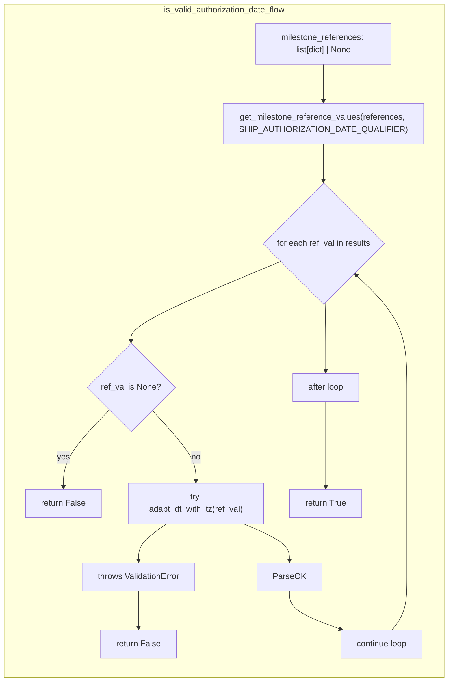
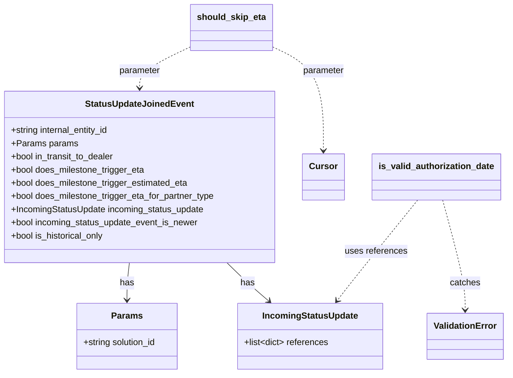

# Diagram: shipment_core/shipment_service/shipment_service/eta/eta_milestone_update/status_update/status_update_filters.py


> Auto-generated by Obscura crawlers

## Diagram 1

```mermaid
flowchart LR
  Start([start]) --> ShouldSkip[/"should_skip_eta(joined_event)"/]
  ShouldSkip --> CallCommon{call should_skip_eta_calc(...)}
  CallCommon -- yes --> ReturnCommon["return common_skip_reason"]
  CallCommon -- no --> CheckTriggers{does milestone trigger any ETA?}
  CheckTriggers -- no --> ReturnTrigger["return \"Milestone doesn't trigger eta or estimated eta\""]
  CheckTriggers -- yes --> CheckAuth[/"is_valid_authorization_date(references)"/]
  CheckAuth --> AuthValid{authorization date valid?}
  AuthValid -- no --> ReturnAuth["return \"shipToAuthorizationError\""]
  AuthValid -- yes --> CheckRecency{incoming_event_is_newer OR is_historical_only?}
  CheckRecency -- no --> ReturnOld["return \"Old status message\""]
  CheckRecency -- yes --> ReturnNone["return None"]
  ReturnCommon --> End([end])
  ReturnTrigger --> End
  ReturnAuth --> End
  ReturnOld --> End
  ReturnNone --> End
```

> SVG rendering failed for this diagram.

## Diagram 2



### SVG

<svg id="container" width="862.0234375" xmlns="http://www.w3.org/2000/svg" class="flowchart" height="1311.515625" viewBox="0 0 862.0234375 1311.515625" role="graphics-document document" aria-roledescription="flowchart-v2"><style>#container{font-family:"trebuchet ms",verdana,arial,sans-serif;font-size:16px;fill:#333;}@keyframes edge-animation-frame{from{stroke-dashoffset:0;}}@keyframes dash{to{stroke-dashoffset:0;}}#container .edge-animation-slow{stroke-dasharray:9,5!important;stroke-dashoffset:900;animation:dash 50s linear infinite;stroke-linecap:round;}#container .edge-animation-fast{stroke-dasharray:9,5!important;stroke-dashoffset:900;animation:dash 20s linear infinite;stroke-linecap:round;}#container .error-icon{fill:#552222;}#container .error-text{fill:#552222;stroke:#552222;}#container .edge-thickness-normal{stroke-width:1px;}#container .edge-thickness-thick{stroke-width:3.5px;}#container .edge-pattern-solid{stroke-dasharray:0;}#container .edge-thickness-invisible{stroke-width:0;fill:none;}#container .edge-pattern-dashed{stroke-dasharray:3;}#container .edge-pattern-dotted{stroke-dasharray:2;}#container .marker{fill:#333333;stroke:#333333;}#container .marker.cross{stroke:#333333;}#container svg{font-family:"trebuchet ms",verdana,arial,sans-serif;font-size:16px;}#container p{margin:0;}#container .label{font-family:"trebuchet ms",verdana,arial,sans-serif;color:#333;}#container .cluster-label text{fill:#333;}#container .cluster-label span{color:#333;}#container .cluster-label span p{background-color:transparent;}#container .label text,#container span{fill:#333;color:#333;}#container .node rect,#container .node circle,#container .node ellipse,#container .node polygon,#container .node path{fill:#ECECFF;stroke:#9370DB;stroke-width:1px;}#container .rough-node .label text,#container .node .label text,#container .image-shape .label,#container .icon-shape .label{text-anchor:middle;}#container .node .katex path{fill:#000;stroke:#000;stroke-width:1px;}#container .rough-node .label,#container .node .label,#container .image-shape .label,#container .icon-shape .label{text-align:center;}#container .node.clickable{cursor:pointer;}#container .root .anchor path{fill:#333333!important;stroke-width:0;stroke:#333333;}#container .arrowheadPath{fill:#333333;}#container .edgePath .path{stroke:#333333;stroke-width:2.0px;}#container .flowchart-link{stroke:#333333;fill:none;}#container .edgeLabel{background-color:rgba(232,232,232, 0.8);text-align:center;}#container .edgeLabel p{background-color:rgba(232,232,232, 0.8);}#container .edgeLabel rect{opacity:0.5;background-color:rgba(232,232,232, 0.8);fill:rgba(232,232,232, 0.8);}#container .labelBkg{background-color:rgba(232, 232, 232, 0.5);}#container .cluster rect{fill:#ffffde;stroke:#aaaa33;stroke-width:1px;}#container .cluster text{fill:#333;}#container .cluster span{color:#333;}#container div.mermaidTooltip{position:absolute;text-align:center;max-width:200px;padding:2px;font-family:"trebuchet ms",verdana,arial,sans-serif;font-size:12px;background:hsl(80, 100%, 96.2745098039%);border:1px solid #aaaa33;border-radius:2px;pointer-events:none;z-index:100;}#container .flowchartTitleText{text-anchor:middle;font-size:18px;fill:#333;}#container rect.text{fill:none;stroke-width:0;}#container .icon-shape,#container .image-shape{background-color:rgba(232,232,232, 0.8);text-align:center;}#container .icon-shape p,#container .image-shape p{background-color:rgba(232,232,232, 0.8);padding:2px;}#container .icon-shape rect,#container .image-shape rect{opacity:0.5;background-color:rgba(232,232,232, 0.8);fill:rgba(232,232,232, 0.8);}#container .label-icon{display:inline-block;height:1em;overflow:visible;vertical-align:-0.125em;}#container .node .label-icon path{fill:currentColor;stroke:revert;stroke-width:revert;}#container :root{--mermaid-font-family:"trebuchet ms",verdana,arial,sans-serif;}</style><g><marker id="container_flowchart-v2-pointEnd" class="marker flowchart-v2" viewBox="0 0 10 10" refX="5" refY="5" markerUnits="userSpaceOnUse" markerWidth="8" markerHeight="8" orient="auto"><path d="M 0 0 L 10 5 L 0 10 z" class="arrowMarkerPath" style="stroke-width: 1; stroke-dasharray: 1, 0;"></path></marker><marker id="container_flowchart-v2-pointStart" class="marker flowchart-v2" viewBox="0 0 10 10" refX="4.5" refY="5" markerUnits="userSpaceOnUse" markerWidth="8" markerHeight="8" orient="auto"><path d="M 0 5 L 10 10 L 10 0 z" class="arrowMarkerPath" style="stroke-width: 1; stroke-dasharray: 1, 0;"></path></marker><marker id="container_flowchart-v2-circleEnd" class="marker flowchart-v2" viewBox="0 0 10 10" refX="11" refY="5" markerUnits="userSpaceOnUse" markerWidth="11" markerHeight="11" orient="auto"><circle cx="5" cy="5" r="5" class="arrowMarkerPath" style="stroke-width: 1; stroke-dasharray: 1, 0;"></circle></marker><marker id="container_flowchart-v2-circleStart" class="marker flowchart-v2" viewBox="0 0 10 10" refX="-1" refY="5" markerUnits="userSpaceOnUse" markerWidth="11" markerHeight="11" orient="auto"><circle cx="5" cy="5" r="5" class="arrowMarkerPath" style="stroke-width: 1; stroke-dasharray: 1, 0;"></circle></marker><marker id="container_flowchart-v2-crossEnd" class="marker cross flowchart-v2" viewBox="0 0 11 11" refX="12" refY="5.2" markerUnits="userSpaceOnUse" markerWidth="11" markerHeight="11" orient="auto"><path d="M 1,1 l 9,9 M 10,1 l -9,9" class="arrowMarkerPath" style="stroke-width: 2; stroke-dasharray: 1, 0;"></path></marker><marker id="container_flowchart-v2-crossStart" class="marker cross flowchart-v2" viewBox="0 0 11 11" refX="-1" refY="5.2" markerUnits="userSpaceOnUse" markerWidth="11" markerHeight="11" orient="auto"><path d="M 1,1 l 9,9 M 10,1 l -9,9" class="arrowMarkerPath" style="stroke-width: 2; stroke-dasharray: 1, 0;"></path></marker><g class="root"><g class="clusters"></g><g class="edgePaths"></g><g class="edgeLabels"></g><g class="nodes"><g class="root" transform="translate(0, 0)"><g class="clusters"><g class="cluster" id="is_valid_authorization_date_flow" data-look="classic"><rect style="" x="8" y="8" width="846.0234375" height="1295.515625"></rect><g class="cluster-label" transform="translate(311.75390625, 8)"><foreignObject width="238.515625" height="24"><div xmlns="http://www.w3.org/1999/xhtml" style="display: table; white-space: break-spaces; line-height: 1.5; max-width: 200px; text-align: center; width: 200px;"><span class="nodeLabel"><p>is_valid_authorization_date_flow</p></span></div></foreignObject></g></g></g><g class="edgePaths"><path d="M625.977,123.5L625.977,129.75C625.977,136,625.977,148.5,625.977,160.333C625.977,172.167,625.977,183.333,625.977,188.917L625.977,194.5" id="L_A_B_0" class="edge-thickness-normal edge-pattern-solid edge-thickness-normal edge-pattern-solid flowchart-link" style=";" data-edge="true" data-et="edge" data-id="L_A_B_0" data-points="W3sieCI6NjI1Ljk3NjU2MjUsInkiOjEyMy41fSx7IngiOjYyNS45NzY1NjI1LCJ5IjoxNjF9LHsieCI6NjI1Ljk3NjU2MjUsInkiOjE5OC41fV0=" marker-end="url(#container_flowchart-v2-pointEnd)"></path><path d="M625.977,276.5L625.977,282.75C625.977,289,625.977,301.5,625.977,313.333C625.977,325.167,625.977,336.333,625.977,341.917L625.977,347.5" id="L_B_ForEach_0" class="edge-thickness-normal edge-pattern-solid edge-thickness-normal edge-pattern-solid flowchart-link" style=";" data-edge="true" data-et="edge" data-id="L_B_ForEach_0" data-points="W3sieCI6NjI1Ljk3NjU2MjUsInkiOjI3Ni41fSx7IngiOjYyNS45NzY1NjI1LCJ5IjozMTR9LHsieCI6NjI1Ljk3NjU2MjUsInkiOjM1MS41fV0=" marker-end="url(#container_flowchart-v2-pointEnd)"></path><path d="M542.349,504.856L493.924,525.044C445.499,545.232,348.65,585.608,300.225,611.38C251.801,637.151,251.801,648.318,251.801,653.901L251.801,659.484" id="L_ForEach_IfNull_0" class="edge-thickness-normal edge-pattern-solid edge-thickness-normal edge-pattern-solid flowchart-link" style=";" data-edge="true" data-et="edge" data-id="L_ForEach_IfNull_0" data-points="W3sieCI6NTQyLjM0ODUyNDg5MDc3MDEsInkiOjUwNC44NTYzMzczOTA3NzAyfSx7IngiOjI1MS44MDA3ODEyNSwieSI6NjI1Ljk4NDM3NX0seyJ4IjoyNTEuODAwNzgxMjUsInkiOjY2My40ODQzNzV9XQ==" marker-end="url(#container_flowchart-v2-pointEnd)"></path><path d="M210.355,789.57L195.511,804.728C180.667,819.885,150.978,850.2,136.133,874.941C121.289,899.682,121.289,918.849,121.289,928.432L121.289,938.016" id="L_IfNull_ReturnFalse1_0" class="edge-thickness-normal edge-pattern-solid edge-thickness-normal edge-pattern-solid flowchart-link" style=";" data-edge="true" data-et="edge" data-id="L_IfNull_ReturnFalse1_0" data-points="W3sieCI6MjEwLjM1NTIzNjU1MTIxMjg0LCJ5Ijo3ODkuNTcwMDgwMzAxMjEyOX0seyJ4IjoxMjEuMjg5MDYyNSwieSI6ODgwLjUxNTYyNX0seyJ4IjoxMjEuMjg5MDYyNSwieSI6OTQyLjAxNTYyNX1d" marker-end="url(#container_flowchart-v2-pointEnd)"></path><path d="M292.452,790.364L306.619,805.39C320.786,820.415,349.119,850.465,363.286,873.074C377.453,895.682,377.453,910.849,377.453,918.432L377.453,926.016" id="L_IfNull_TryParse_0" class="edge-thickness-normal edge-pattern-solid edge-thickness-normal edge-pattern-solid flowchart-link" style=";" data-edge="true" data-et="edge" data-id="L_IfNull_TryParse_0" data-points="W3sieCI6MjkyLjQ1MjA2MjI2Mjg1NCwieSI6NzkwLjM2NDM0Mzk4NzE0NjF9LHsieCI6Mzc3LjQ1MzEyNSwieSI6ODgwLjUxNTYyNX0seyJ4IjozNzcuNDUzMTI1LCJ5Ijo5MzAuMDE1NjI1fV0=" marker-end="url(#container_flowchart-v2-pointEnd)"></path><path d="M469.517,1008.016L484.27,1014.266C499.024,1020.516,528.532,1033.016,543.285,1044.849C558.039,1056.682,558.039,1067.849,558.039,1073.432L558.039,1079.016" id="L_TryParse_ParseOK_0" class="edge-thickness-normal edge-pattern-solid edge-thickness-normal edge-pattern-solid flowchart-link" style=";" data-edge="true" data-et="edge" data-id="L_TryParse_ParseOK_0" data-points="W3sieCI6NDY5LjUxNjU0NDExNzY0NzEsInkiOjEwMDguMDE1NjI1fSx7IngiOjU1OC4wMzkwNjI1LCJ5IjoxMDQ1LjUxNTYyNX0seyJ4Ijo1NTguMDM5MDYyNSwieSI6MTA4My4wMTU2MjV9XQ==" marker-end="url(#container_flowchart-v2-pointEnd)"></path><path d="M321.094,1008.016L312.062,1014.266C303.03,1020.516,284.966,1033.016,275.934,1044.849C266.902,1056.682,266.902,1067.849,266.902,1073.432L266.902,1079.016" id="L_TryParse_ParseFail_0" class="edge-thickness-normal edge-pattern-solid edge-thickness-normal edge-pattern-solid flowchart-link" style=";" data-edge="true" data-et="edge" data-id="L_TryParse_ParseFail_0" data-points="W3sieCI6MzIxLjA5MzkwMzE4NjI3NDUzLCJ5IjoxMDA4LjAxNTYyNX0seyJ4IjoyNjYuOTAyMzQzNzUsInkiOjEwNDUuNTE1NjI1fSx7IngiOjI2Ni45MDIzNDM3NSwieSI6MTA4My4wMTU2MjV9XQ==" marker-end="url(#container_flowchart-v2-pointEnd)"></path><path d="M266.902,1137.016L266.902,1143.266C266.902,1149.516,266.902,1162.016,266.902,1173.849C266.902,1185.682,266.902,1196.849,266.902,1202.432L266.902,1208.016" id="L_ParseFail_ReturnFalse2_0" class="edge-thickness-normal edge-pattern-solid edge-thickness-normal edge-pattern-solid flowchart-link" style=";" data-edge="true" data-et="edge" data-id="L_ParseFail_ReturnFalse2_0" data-points="W3sieCI6MjY2LjkwMjM0Mzc1LCJ5IjoxMTM3LjAxNTYyNX0seyJ4IjoyNjYuOTAyMzQzNzUsInkiOjExNzQuNTE1NjI1fSx7IngiOjI2Ni45MDIzNDM3NSwieSI6MTIxMi4wMTU2MjV9XQ==" marker-end="url(#container_flowchart-v2-pointEnd)"></path><path d="M558.039,1137.016L558.039,1143.266C558.039,1149.516,558.039,1162.016,574.675,1174.289C591.31,1186.562,624.581,1198.608,641.217,1204.631L657.853,1210.654" id="L_ParseOK_LoopContinue_0" class="edge-thickness-normal edge-pattern-solid edge-thickness-normal edge-pattern-solid flowchart-link" style=";" data-edge="true" data-et="edge" data-id="L_ParseOK_LoopContinue_0" data-points="W3sieCI6NTU4LjAzOTA2MjUsInkiOjExMzcuMDE1NjI1fSx7IngiOjU1OC4wMzkwNjI1LCJ5IjoxMTc0LjUxNTYyNX0seyJ4Ijo2NjEuNjEzNzM1NDY1MTE2MywieSI6MTIxMi4wMTU2MjV9XQ==" marker-end="url(#container_flowchart-v2-pointEnd)"></path><path d="M756.155,1212.016L760.777,1205.766C765.399,1199.516,774.643,1187.016,779.265,1170.016C783.887,1153.016,783.887,1131.516,783.887,1110.016C783.887,1088.516,783.887,1067.016,783.887,1043.516C783.887,1020.016,783.887,994.516,783.887,967.016C783.887,939.516,783.887,910.016,783.887,873.055C783.887,836.094,783.887,791.672,783.887,749.25C783.887,706.828,783.887,666.406,767.977,630.479C752.068,594.552,720.249,563.12,704.34,547.404L688.43,531.687" id="L_LoopContinue_ForEach_0" class="edge-thickness-normal edge-pattern-solid edge-thickness-normal edge-pattern-solid flowchart-link" style=";" data-edge="true" data-et="edge" data-id="L_LoopContinue_ForEach_0" data-points="W3sieCI6NzU2LjE1NDYxNDgyNTU4MTMsInkiOjEyMTIuMDE1NjI1fSx7IngiOjc4My44ODY3MTg3NSwieSI6MTE3NC41MTU2MjV9LHsieCI6NzgzLjg4NjcxODc1LCJ5IjoxMTEwLjAxNTYyNX0seyJ4Ijo3ODMuODg2NzE4NzUsInkiOjEwNDUuNTE1NjI1fSx7IngiOjc4My44ODY3MTg3NSwieSI6OTY5LjAxNTYyNX0seyJ4Ijo3ODMuODg2NzE4NzUsInkiOjg4MC41MTU2MjV9LHsieCI6NzgzLjg4NjcxODc1LCJ5Ijo3NDcuMjV9LHsieCI6NzgzLjg4NjcxODc1LCJ5Ijo2MjUuOTg0Mzc1fSx7IngiOjY4NS41ODQ2NTQ2ODI0MjUxLCJ5Ijo1MjguODc2MjgyODE3NTc0OX1d" marker-end="url(#container_flowchart-v2-pointEnd)"></path><path d="M627.569,586.892L627.658,593.407C627.747,599.923,627.924,612.954,628.013,634.513C628.102,656.073,628.102,686.161,628.102,701.206L628.102,716.25" id="L_ForEach_AfterLoop_0" class="edge-thickness-normal edge-pattern-solid edge-thickness-normal edge-pattern-solid flowchart-link" style=";" data-edge="true" data-et="edge" data-id="L_ForEach_AfterLoop_0" data-points="W3sieCI6NjI3LjU2OTAyNjMwNzUwMDQsInkiOjU4Ni44OTE5MTExOTI0OTk2fSx7IngiOjYyOC4xMDE1NjI1LCJ5Ijo2MjUuOTg0Mzc1fSx7IngiOjYyOC4xMDE1NjI1LCJ5Ijo3MjAuMjV9XQ==" marker-end="url(#container_flowchart-v2-pointEnd)"></path><path d="M628.102,774.25L628.102,791.961C628.102,809.672,628.102,845.094,628.102,872.388C628.102,899.682,628.102,918.849,628.102,928.432L628.102,938.016" id="L_AfterLoop_ReturnTrue_0" class="edge-thickness-normal edge-pattern-solid edge-thickness-normal edge-pattern-solid flowchart-link" style=";" data-edge="true" data-et="edge" data-id="L_AfterLoop_ReturnTrue_0" data-points="W3sieCI6NjI4LjEwMTU2MjUsInkiOjc3NC4yNX0seyJ4Ijo2MjguMTAxNTYyNSwieSI6ODgwLjUxNTYyNX0seyJ4Ijo2MjguMTAxNTYyNSwieSI6OTQyLjAxNTYyNX1d" marker-end="url(#container_flowchart-v2-pointEnd)"></path></g><g class="edgeLabels"><g class="edgeLabel"><g class="label" data-id="L_A_B_0" transform="translate(0, 0)"><foreignObject width="0" height="0"><div xmlns="http://www.w3.org/1999/xhtml" class="labelBkg" style="display: table-cell; white-space: nowrap; line-height: 1.5; max-width: 200px; text-align: center;"><span class="edgeLabel"></span></div></foreignObject></g></g><g class="edgeLabel"><g class="label" data-id="L_B_ForEach_0" transform="translate(0, 0)"><foreignObject width="0" height="0"><div xmlns="http://www.w3.org/1999/xhtml" class="labelBkg" style="display: table-cell; white-space: nowrap; line-height: 1.5; max-width: 200px; text-align: center;"><span class="edgeLabel"></span></div></foreignObject></g></g><g class="edgeLabel"><g class="label" data-id="L_ForEach_IfNull_0" transform="translate(0, 0)"><foreignObject width="0" height="0"><div xmlns="http://www.w3.org/1999/xhtml" class="labelBkg" style="display: table-cell; white-space: nowrap; line-height: 1.5; max-width: 200px; text-align: center;"><span class="edgeLabel"></span></div></foreignObject></g></g><g class="edgeLabel" transform="translate(121.2890625, 880.515625)"><g class="label" data-id="L_IfNull_ReturnFalse1_0" transform="translate(-12.0078125, -12)"><foreignObject width="24.015625" height="24"><div xmlns="http://www.w3.org/1999/xhtml" class="labelBkg" style="display: table-cell; white-space: nowrap; line-height: 1.5; max-width: 200px; text-align: center;"><span class="edgeLabel"><p>yes</p></span></div></foreignObject></g></g><g class="edgeLabel" transform="translate(377.453125, 880.515625)"><g class="label" data-id="L_IfNull_TryParse_0" transform="translate(-9.3671875, -12)"><foreignObject width="18.734375" height="24"><div xmlns="http://www.w3.org/1999/xhtml" class="labelBkg" style="display: table-cell; white-space: nowrap; line-height: 1.5; max-width: 200px; text-align: center;"><span class="edgeLabel"><p>no</p></span></div></foreignObject></g></g><g class="edgeLabel"><g class="label" data-id="L_TryParse_ParseOK_0" transform="translate(0, 0)"><foreignObject width="0" height="0"><div xmlns="http://www.w3.org/1999/xhtml" class="labelBkg" style="display: table-cell; white-space: nowrap; line-height: 1.5; max-width: 200px; text-align: center;"><span class="edgeLabel"></span></div></foreignObject></g></g><g class="edgeLabel"><g class="label" data-id="L_TryParse_ParseFail_0" transform="translate(0, 0)"><foreignObject width="0" height="0"><div xmlns="http://www.w3.org/1999/xhtml" class="labelBkg" style="display: table-cell; white-space: nowrap; line-height: 1.5; max-width: 200px; text-align: center;"><span class="edgeLabel"></span></div></foreignObject></g></g><g class="edgeLabel"><g class="label" data-id="L_ParseFail_ReturnFalse2_0" transform="translate(0, 0)"><foreignObject width="0" height="0"><div xmlns="http://www.w3.org/1999/xhtml" class="labelBkg" style="display: table-cell; white-space: nowrap; line-height: 1.5; max-width: 200px; text-align: center;"><span class="edgeLabel"></span></div></foreignObject></g></g><g class="edgeLabel"><g class="label" data-id="L_ParseOK_LoopContinue_0" transform="translate(0, 0)"><foreignObject width="0" height="0"><div xmlns="http://www.w3.org/1999/xhtml" class="labelBkg" style="display: table-cell; white-space: nowrap; line-height: 1.5; max-width: 200px; text-align: center;"><span class="edgeLabel"></span></div></foreignObject></g></g><g class="edgeLabel"><g class="label" data-id="L_LoopContinue_ForEach_0" transform="translate(0, 0)"><foreignObject width="0" height="0"><div xmlns="http://www.w3.org/1999/xhtml" class="labelBkg" style="display: table-cell; white-space: nowrap; line-height: 1.5; max-width: 200px; text-align: center;"><span class="edgeLabel"></span></div></foreignObject></g></g><g class="edgeLabel"><g class="label" data-id="L_ForEach_AfterLoop_0" transform="translate(0, 0)"><foreignObject width="0" height="0"><div xmlns="http://www.w3.org/1999/xhtml" class="labelBkg" style="display: table-cell; white-space: nowrap; line-height: 1.5; max-width: 200px; text-align: center;"><span class="edgeLabel"></span></div></foreignObject></g></g><g class="edgeLabel"><g class="label" data-id="L_AfterLoop_ReturnTrue_0" transform="translate(0, 0)"><foreignObject width="0" height="0"><div xmlns="http://www.w3.org/1999/xhtml" class="labelBkg" style="display: table-cell; white-space: nowrap; line-height: 1.5; max-width: 200px; text-align: center;"><span class="edgeLabel"></span></div></foreignObject></g></g></g><g class="nodes"><g class="node default" id="flowchart-A-0" transform="translate(625.9765625, 84.5)"><rect class="basic label-container" style="" x="-130" y="-39" width="260" height="78"></rect><g class="label" style="" transform="translate(-100, -24)"><rect></rect><foreignObject width="200" height="48"><div xmlns="http://www.w3.org/1999/xhtml" style="display: table; white-space: break-spaces; line-height: 1.5; max-width: 200px; text-align: center; width: 200px;"><span class="nodeLabel"><p>milestone_references: list[dict] | None</p></span></div></foreignObject></g></g><g class="node default" id="flowchart-B-1" transform="translate(625.9765625, 237.5)"><rect class="basic label-container" style="" x="-190.921875" y="-39" width="381.84375" height="78"></rect><g class="label" style="" transform="translate(-160.921875, -24)"><rect></rect><foreignObject width="321.84375" height="48"><div xmlns="http://www.w3.org/1999/xhtml" style="display: table; white-space: break-spaces; line-height: 1.5; max-width: 200px; text-align: center; width: 200px;"><span class="nodeLabel"><p>get_milestone_reference_values(references, SHIP_AUTHORIZATION_DATE_QUALIFIER)</p></span></div></foreignObject></g></g><g class="node default" id="flowchart-ForEach-3" transform="translate(625.9765625, 469.9921875)"><polygon points="118.4921875,0 236.984375,-118.4921875 118.4921875,-236.984375 0,-118.4921875" class="label-container" transform="translate(-117.9921875, 118.4921875)"></polygon><g class="label" style="" transform="translate(-91.4921875, -12)"><rect></rect><foreignObject width="182.984375" height="24"><div xmlns="http://www.w3.org/1999/xhtml" style="display: table-cell; white-space: nowrap; line-height: 1.5; max-width: 200px; text-align: center;"><span class="nodeLabel"><p>for each ref_val in results</p></span></div></foreignObject></g></g><g class="node default" id="flowchart-IfNull-5" transform="translate(251.80078125, 747.25)"><polygon points="83.765625,0 167.53125,-83.765625 83.765625,-167.53125 0,-83.765625" class="label-container" transform="translate(-83.265625, 83.765625)"></polygon><g class="label" style="" transform="translate(-56.765625, -12)"><rect></rect><foreignObject width="113.53125" height="24"><div xmlns="http://www.w3.org/1999/xhtml" style="display: table-cell; white-space: nowrap; line-height: 1.5; max-width: 200px; text-align: center;"><span class="nodeLabel"><p>ref_val is None?</p></span></div></foreignObject></g></g><g class="node default" id="flowchart-ReturnFalse1-7" transform="translate(121.2890625, 969.015625)"><rect class="basic label-container" style="" x="-72.8125" y="-27" width="145.625" height="54"></rect><g class="label" style="" transform="translate(-42.8125, -12)"><rect></rect><foreignObject width="85.625" height="24"><div xmlns="http://www.w3.org/1999/xhtml" style="display: table-cell; white-space: nowrap; line-height: 1.5; max-width: 200px; text-align: center;"><span class="nodeLabel"><p>return False</p></span></div></foreignObject></g></g><g class="node default" id="flowchart-TryParse-9" transform="translate(377.453125, 969.015625)"><rect class="basic label-container" style="" x="-130" y="-39" width="260" height="78"></rect><g class="label" style="" transform="translate(-100, -24)"><rect></rect><foreignObject width="200" height="48"><div xmlns="http://www.w3.org/1999/xhtml" style="display: table; white-space: break-spaces; line-height: 1.5; max-width: 200px; text-align: center; width: 200px;"><span class="nodeLabel"><p>try adapt_dt_with_tz(ref_val)</p></span></div></foreignObject></g></g><g class="node default" id="flowchart-ParseOK-11" transform="translate(558.0390625, 1110.015625)"><rect class="basic label-container" style="" x="-59.875" y="-27" width="119.75" height="54"></rect><g class="label" style="" transform="translate(-29.875, -12)"><rect></rect><foreignObject width="59.75" height="24"><div xmlns="http://www.w3.org/1999/xhtml" style="display: table-cell; white-space: nowrap; line-height: 1.5; max-width: 200px; text-align: center;"><span class="nodeLabel"><p>ParseOK</p></span></div></foreignObject></g></g><g class="node default" id="flowchart-ParseFail-13" transform="translate(266.90234375, 1110.015625)"><rect class="basic label-container" style="" x="-111.2265625" y="-27" width="222.453125" height="54"></rect><g class="label" style="" transform="translate(-81.2265625, -12)"><rect></rect><foreignObject width="162.453125" height="24"><div xmlns="http://www.w3.org/1999/xhtml" style="display: table-cell; white-space: nowrap; line-height: 1.5; max-width: 200px; text-align: center;"><span class="nodeLabel"><p>throws ValidationError</p></span></div></foreignObject></g></g><g class="node default" id="flowchart-ReturnFalse2-15" transform="translate(266.90234375, 1239.015625)"><rect class="basic label-container" style="" x="-72.8125" y="-27" width="145.625" height="54"></rect><g class="label" style="" transform="translate(-42.8125, -12)"><rect></rect><foreignObject width="85.625" height="24"><div xmlns="http://www.w3.org/1999/xhtml" style="display: table-cell; white-space: nowrap; line-height: 1.5; max-width: 200px; text-align: center;"><span class="nodeLabel"><p>return False</p></span></div></foreignObject></g></g><g class="node default" id="flowchart-LoopContinue-17" transform="translate(736.1875, 1239.015625)"><rect class="basic label-container" style="" x="-80.3984375" y="-27" width="160.796875" height="54"></rect><g class="label" style="" transform="translate(-50.3984375, -12)"><rect></rect><foreignObject width="100.796875" height="24"><div xmlns="http://www.w3.org/1999/xhtml" style="display: table-cell; white-space: nowrap; line-height: 1.5; max-width: 200px; text-align: center;"><span class="nodeLabel"><p>continue loop</p></span></div></foreignObject></g></g><g class="node default" id="flowchart-AfterLoop-21" transform="translate(628.1015625, 747.25)"><rect class="basic label-container" style="" x="-65.7734375" y="-27" width="131.546875" height="54"></rect><g class="label" style="" transform="translate(-35.7734375, -12)"><rect></rect><foreignObject width="71.546875" height="24"><div xmlns="http://www.w3.org/1999/xhtml" style="display: table-cell; white-space: nowrap; line-height: 1.5; max-width: 200px; text-align: center;"><span class="nodeLabel"><p>after loop</p></span></div></foreignObject></g></g><g class="node default" id="flowchart-ReturnTrue-23" transform="translate(628.1015625, 969.015625)"><rect class="basic label-container" style="" x="-70.6484375" y="-27" width="141.296875" height="54"></rect><g class="label" style="" transform="translate(-40.6484375, -12)"><rect></rect><foreignObject width="81.296875" height="24"><div xmlns="http://www.w3.org/1999/xhtml" style="display: table-cell; white-space: nowrap; line-height: 1.5; max-width: 200px; text-align: center;"><span class="nodeLabel"><p>return True</p></span></div></foreignObject></g></g></g></g></g></g></g></svg>

## Diagram 3



### SVG

<svg id="container" width="911.92578125" xmlns="http://www.w3.org/2000/svg" class="classDiagram" height="680" viewBox="0 0 911.92578125 680" role="graphics-document document" aria-roledescription="class"><style>#container{font-family:"trebuchet ms",verdana,arial,sans-serif;font-size:16px;fill:#333;}@keyframes edge-animation-frame{from{stroke-dashoffset:0;}}@keyframes dash{to{stroke-dashoffset:0;}}#container .edge-animation-slow{stroke-dasharray:9,5!important;stroke-dashoffset:900;animation:dash 50s linear infinite;stroke-linecap:round;}#container .edge-animation-fast{stroke-dasharray:9,5!important;stroke-dashoffset:900;animation:dash 20s linear infinite;stroke-linecap:round;}#container .error-icon{fill:#552222;}#container .error-text{fill:#552222;stroke:#552222;}#container .edge-thickness-normal{stroke-width:1px;}#container .edge-thickness-thick{stroke-width:3.5px;}#container .edge-pattern-solid{stroke-dasharray:0;}#container .edge-thickness-invisible{stroke-width:0;fill:none;}#container .edge-pattern-dashed{stroke-dasharray:3;}#container .edge-pattern-dotted{stroke-dasharray:2;}#container .marker{fill:#333333;stroke:#333333;}#container .marker.cross{stroke:#333333;}#container svg{font-family:"trebuchet ms",verdana,arial,sans-serif;font-size:16px;}#container p{margin:0;}#container g.classGroup text{fill:#9370DB;stroke:none;font-family:"trebuchet ms",verdana,arial,sans-serif;font-size:10px;}#container g.classGroup text .title{font-weight:bolder;}#container .nodeLabel,#container .edgeLabel{color:#131300;}#container .edgeLabel .label rect{fill:#ECECFF;}#container .label text{fill:#131300;}#container .labelBkg{background:#ECECFF;}#container .edgeLabel .label span{background:#ECECFF;}#container .classTitle{font-weight:bolder;}#container .node rect,#container .node circle,#container .node ellipse,#container .node polygon,#container .node path{fill:#ECECFF;stroke:#9370DB;stroke-width:1px;}#container .divider{stroke:#9370DB;stroke-width:1;}#container g.clickable{cursor:pointer;}#container g.classGroup rect{fill:#ECECFF;stroke:#9370DB;}#container g.classGroup line{stroke:#9370DB;stroke-width:1;}#container .classLabel .box{stroke:none;stroke-width:0;fill:#ECECFF;opacity:0.5;}#container .classLabel .label{fill:#9370DB;font-size:10px;}#container .relation{stroke:#333333;stroke-width:1;fill:none;}#container .dashed-line{stroke-dasharray:3;}#container .dotted-line{stroke-dasharray:1 2;}#container #compositionStart,#container .composition{fill:#333333!important;stroke:#333333!important;stroke-width:1;}#container #compositionEnd,#container .composition{fill:#333333!important;stroke:#333333!important;stroke-width:1;}#container #dependencyStart,#container .dependency{fill:#333333!important;stroke:#333333!important;stroke-width:1;}#container #dependencyStart,#container .dependency{fill:#333333!important;stroke:#333333!important;stroke-width:1;}#container #extensionStart,#container .extension{fill:transparent!important;stroke:#333333!important;stroke-width:1;}#container #extensionEnd,#container .extension{fill:transparent!important;stroke:#333333!important;stroke-width:1;}#container #aggregationStart,#container .aggregation{fill:transparent!important;stroke:#333333!important;stroke-width:1;}#container #aggregationEnd,#container .aggregation{fill:transparent!important;stroke:#333333!important;stroke-width:1;}#container #lollipopStart,#container .lollipop{fill:#ECECFF!important;stroke:#333333!important;stroke-width:1;}#container #lollipopEnd,#container .lollipop{fill:#ECECFF!important;stroke:#333333!important;stroke-width:1;}#container .edgeTerminals{font-size:11px;line-height:initial;}#container .classTitleText{text-anchor:middle;font-size:18px;fill:#333;}#container .label-icon{display:inline-block;height:1em;overflow:visible;vertical-align:-0.125em;}#container .node .label-icon path{fill:currentColor;stroke:revert;stroke-width:revert;}#container :root{--mermaid-font-family:"trebuchet ms",verdana,arial,sans-serif;}</style><g><defs><marker id="container_class-aggregationStart" class="marker aggregation class" refX="18" refY="7" markerWidth="190" markerHeight="240" orient="auto"><path d="M 18,7 L9,13 L1,7 L9,1 Z"></path></marker></defs><defs><marker id="container_class-aggregationEnd" class="marker aggregation class" refX="1" refY="7" markerWidth="20" markerHeight="28" orient="auto"><path d="M 18,7 L9,13 L1,7 L9,1 Z"></path></marker></defs><defs><marker id="container_class-extensionStart" class="marker extension class" refX="18" refY="7" markerWidth="190" markerHeight="240" orient="auto"><path d="M 1,7 L18,13 V 1 Z"></path></marker></defs><defs><marker id="container_class-extensionEnd" class="marker extension class" refX="1" refY="7" markerWidth="20" markerHeight="28" orient="auto"><path d="M 1,1 V 13 L18,7 Z"></path></marker></defs><defs><marker id="container_class-compositionStart" class="marker composition class" refX="18" refY="7" markerWidth="190" markerHeight="240" orient="auto"><path d="M 18,7 L9,13 L1,7 L9,1 Z"></path></marker></defs><defs><marker id="container_class-compositionEnd" class="marker composition class" refX="1" refY="7" markerWidth="20" markerHeight="28" orient="auto"><path d="M 18,7 L9,13 L1,7 L9,1 Z"></path></marker></defs><defs><marker id="container_class-dependencyStart" class="marker dependency class" refX="6" refY="7" markerWidth="190" markerHeight="240" orient="auto"><path d="M 5,7 L9,13 L1,7 L9,1 Z"></path></marker></defs><defs><marker id="container_class-dependencyEnd" class="marker dependency class" refX="13" refY="7" markerWidth="20" markerHeight="28" orient="auto"><path d="M 18,7 L9,13 L14,7 L9,1 Z"></path></marker></defs><defs><marker id="container_class-lollipopStart" class="marker lollipop class" refX="13" refY="7" markerWidth="190" markerHeight="240" orient="auto"><circle stroke="black" fill="transparent" cx="7" cy="7" r="6"></circle></marker></defs><defs><marker id="container_class-lollipopEnd" class="marker lollipop class" refX="1" refY="7" markerWidth="190" markerHeight="240" orient="auto"><circle stroke="black" fill="transparent" cx="7" cy="7" r="6"></circle></marker></defs><g class="root"><g class="clusters"></g><g class="edgePaths"><path d="M235.407,478L234.682,484.167C233.956,490.333,232.505,502.667,231.78,514C231.055,525.333,231.055,535.667,231.055,540.833L231.055,546" id="id_StatusUpdateJoinedEvent_Params_1" class="edge-thickness-normal edge-pattern-solid relation" style=";;;" data-edge="true" data-et="edge" data-id="id_StatusUpdateJoinedEvent_Params_1" data-points="W3sieCI6MjM1LjQwNzEwMDA2NDc2Njg0LCJ5Ijo0Nzh9LHsieCI6MjMxLjA1NDY4NzUsInkiOjUxNX0seyJ4IjoyMzEuMDU0Njg3NSwieSI6NTUyfV0=" marker-end="url(#container_class-dependencyEnd)"></path><path d="M410.231,478L416.417,484.167C422.602,490.333,434.973,502.667,447.662,514.353C460.351,526.039,473.359,537.078,479.862,542.598L486.366,548.118" id="id_StatusUpdateJoinedEvent_IncomingStatusUpdate_2" class="edge-thickness-normal edge-pattern-solid relation" style=";;;" data-edge="true" data-et="edge" data-id="id_StatusUpdateJoinedEvent_IncomingStatusUpdate_2" data-points="W3sieCI6NDEwLjIzMTQyMDAxMjk1MzQsInkiOjQ3OH0seyJ4Ijo0NDcuMzQzNzUsInkiOjUxNX0seyJ4Ijo0OTAuOTQwNzgyMDU1NDEyMzQsInkiOjU1Mn1d" marker-end="url(#container_class-dependencyEnd)"></path><path d="M347.621,84.285L331.977,91.737C316.333,99.19,285.046,114.095,269.402,126.714C253.758,139.333,253.758,149.667,253.758,154.833L253.758,160" id="id_should_skip_eta_StatusUpdateJoinedEvent_3" class="edge-thickness-normal edge-pattern-dashed relation" style=";;;" data-edge="true" data-et="edge" data-id="id_should_skip_eta_StatusUpdateJoinedEvent_3" data-points="W3sieCI6MzQ3LjYyMTA5Mzc1LCJ5Ijo4NC4yODQ4Nzk3NDkzNjk4OX0seyJ4IjoyNTMuNzU3ODEyNSwieSI6MTI5fSx7IngiOjI1My43NTc4MTI1LCJ5IjoxNjZ9XQ==" marker-end="url(#container_class-dependencyEnd)"></path><path d="M491.559,84.285L507.202,91.737C522.846,99.19,554.134,114.095,569.778,145.714C585.422,177.333,585.422,225.667,585.422,249.833L585.422,274" id="id_should_skip_eta_Cursor_4" class="edge-thickness-normal edge-pattern-dashed relation" style=";;;" data-edge="true" data-et="edge" data-id="id_should_skip_eta_Cursor_4" data-points="W3sieCI6NDkxLjU1ODU5Mzc1LCJ5Ijo4NC4yODQ4Nzk3NDkzNjk4OX0seyJ4Ijo1ODUuNDIxODc1LCJ5IjoxMjl9LHsieCI6NTg1LjQyMTg3NSwieSI6MjgwfV0=" marker-end="url(#container_class-dependencyEnd)"></path><path d="M796.096,364L802.871,389.167C809.646,414.333,823.196,464.667,829.971,498C836.746,531.333,836.746,547.667,836.746,555.833L836.746,564" id="id_is_valid_authorization_date_ValidationError_5" class="edge-thickness-normal edge-pattern-dashed relation" style=";;;" data-edge="true" data-et="edge" data-id="id_is_valid_authorization_date_ValidationError_5" data-points="W3sieCI6Nzk2LjA5NTc3Mzk2MzczMDYsInkiOjM2NH0seyJ4Ijo4MzYuNzQ2MDkzNzUsInkiOjUxNX0seyJ4Ijo4MzYuNzQ2MDkzNzUsInkiOjU3MH1d" marker-end="url(#container_class-dependencyEnd)"></path><path d="M751.881,364L732.162,389.167C712.443,414.333,673.006,464.667,649.31,495.197C625.614,525.727,617.66,536.454,613.682,541.817L609.705,547.181" id="id_is_valid_authorization_date_IncomingStatusUpdate_6" class="edge-thickness-normal edge-pattern-dashed relation" style=";;;" data-edge="true" data-et="edge" data-id="id_is_valid_authorization_date_IncomingStatusUpdate_6" data-points="W3sieCI6NzUxLjg4MDkzMDIxMzczMDYsInkiOjM2NH0seyJ4Ijo2MzMuNTY4MzU5Mzc1LCJ5Ijo1MTV9LHsieCI6NjA2LjEzMTI2MjA4MTE4NTYsInkiOjU1Mn1d" marker-end="url(#container_class-dependencyEnd)"></path></g><g class="edgeLabels"><g class="edgeLabel" transform="translate(231.0546875, 515)"><g class="label" data-id="id_StatusUpdateJoinedEvent_Params_1" transform="translate(-12.703125, -12)"><foreignObject width="25.40625" height="24"><div xmlns="http://www.w3.org/1999/xhtml" class="labelBkg" style="display: table-cell; white-space: nowrap; line-height: 1.5; max-width: 200px; text-align: center;"><span class="edgeLabel"><p>has</p></span></div></foreignObject></g></g><g class="edgeLabel" transform="translate(449.16441, 516.54516)"><g class="label" data-id="id_StatusUpdateJoinedEvent_IncomingStatusUpdate_2" transform="translate(-12.703125, -12)"><foreignObject width="25.40625" height="24"><div xmlns="http://www.w3.org/1999/xhtml" class="labelBkg" style="display: table-cell; white-space: nowrap; line-height: 1.5; max-width: 200px; text-align: center;"><span class="edgeLabel"><p>has</p></span></div></foreignObject></g></g><g class="edgeLabel" transform="translate(253.7578125, 129)"><g class="label" data-id="id_should_skip_eta_StatusUpdateJoinedEvent_3" transform="translate(-37.6171875, -12)"><foreignObject width="75.234375" height="24"><div xmlns="http://www.w3.org/1999/xhtml" class="labelBkg" style="display: table-cell; white-space: nowrap; line-height: 1.5; max-width: 200px; text-align: center;"><span class="edgeLabel"><p>parameter</p></span></div></foreignObject></g></g><g class="edgeLabel" transform="translate(585.421875, 129)"><g class="label" data-id="id_should_skip_eta_Cursor_4" transform="translate(-37.6171875, -12)"><foreignObject width="75.234375" height="24"><div xmlns="http://www.w3.org/1999/xhtml" class="labelBkg" style="display: table-cell; white-space: nowrap; line-height: 1.5; max-width: 200px; text-align: center;"><span class="edgeLabel"><p>parameter</p></span></div></foreignObject></g></g><g class="edgeLabel" transform="translate(836.74609375, 515)"><g class="label" data-id="id_is_valid_authorization_date_ValidationError_5" transform="translate(-27.4765625, -12)"><foreignObject width="54.953125" height="24"><div xmlns="http://www.w3.org/1999/xhtml" class="labelBkg" style="display: table-cell; white-space: nowrap; line-height: 1.5; max-width: 200px; text-align: center;"><span class="edgeLabel"><p>catches</p></span></div></foreignObject></g></g><g class="edgeLabel" transform="translate(678.51984, 457.62931)"><g class="label" data-id="id_is_valid_authorization_date_IncomingStatusUpdate_6" transform="translate(-56.4375, -12)"><foreignObject width="112.875" height="24"><div xmlns="http://www.w3.org/1999/xhtml" class="labelBkg" style="display: table-cell; white-space: nowrap; line-height: 1.5; max-width: 200px; text-align: center;"><span class="edgeLabel"><p>uses references</p></span></div></foreignObject></g></g></g><g class="nodes"><g class="node default" id="classId-StatusUpdateJoinedEvent-0" transform="translate(253.7578125, 322)"><g class="basic label-container"><path d="M-245.7578125 -156 L245.7578125 -156 L245.7578125 156 L-245.7578125 156" stroke="none" stroke-width="0" fill="#ECECFF" style=""></path><path d="M-245.7578125 -156 C-79.08392024432843 -156, 87.58997201134315 -156, 245.7578125 -156 M-245.7578125 -156 C-141.37425299257438 -156, -36.99069348514874 -156, 245.7578125 -156 M245.7578125 -156 C245.7578125 -53.666728267633616, 245.7578125 48.66654346473277, 245.7578125 156 M245.7578125 -156 C245.7578125 -86.78624118688676, 245.7578125 -17.57248237377351, 245.7578125 156 M245.7578125 156 C94.42845068653617 156, -56.90091112692767 156, -245.7578125 156 M245.7578125 156 C112.24087811618409 156, -21.276056267631816 156, -245.7578125 156 M-245.7578125 156 C-245.7578125 65.38407590226407, -245.7578125 -25.231848195471855, -245.7578125 -156 M-245.7578125 156 C-245.7578125 59.3971479969487, -245.7578125 -37.20570400610259, -245.7578125 -156" stroke="#9370DB" stroke-width="1.3" fill="none" stroke-dasharray="0 0" style=""></path></g><g class="annotation-group text" transform="translate(0, -132)"></g><g class="label-group text" transform="translate(-93.515625, -132)"><g class="label" style="font-weight: bolder" transform="translate(0,-12)"><foreignObject width="187.03125" height="24"><div xmlns="http://www.w3.org/1999/xhtml" style="display: table-cell; white-space: nowrap; line-height: 1.5; max-width: 235px; text-align: center;"><span class="nodeLabel markdown-node-label" style=""><p>StatusUpdateJoinedEvent</p></span></div></foreignObject></g></g><g class="members-group text" transform="translate(-233.7578125, -84)"><g class="label" style="" transform="translate(0,-12)"><foreignObject width="182.671875" height="24"><div xmlns="http://www.w3.org/1999/xhtml" style="display: table-cell; white-space: nowrap; line-height: 1.5; max-width: 240px; text-align: center;"><span class="nodeLabel markdown-node-label" style=""><p>+string internal_entity_id</p></span></div></foreignObject></g><g class="label" style="" transform="translate(0,12)"><foreignObject width="118.40625" height="24"><div xmlns="http://www.w3.org/1999/xhtml" style="display: table-cell; white-space: nowrap; line-height: 1.5; max-width: 176px; text-align: center;"><span class="nodeLabel markdown-node-label" style=""><p>+Params params</p></span></div></foreignObject></g><g class="label" style="" transform="translate(0,36)"><foreignObject width="190.96875" height="24"><div xmlns="http://www.w3.org/1999/xhtml" style="display: table-cell; white-space: nowrap; line-height: 1.5; max-width: 249px; text-align: center;"><span class="nodeLabel markdown-node-label" style=""><p>+bool in_transit_to_dealer</p></span></div></foreignObject></g><g class="label" style="" transform="translate(0,60)"><foreignObject width="245.453125" height="24"><div xmlns="http://www.w3.org/1999/xhtml" style="display: table-cell; white-space: nowrap; line-height: 1.5; max-width: 303px; text-align: center;"><span class="nodeLabel markdown-node-label" style=""><p>+bool does_milestone_trigger_eta</p></span></div></foreignObject></g><g class="label" style="" transform="translate(0,84)"><foreignObject width="326.171875" height="24"><div xmlns="http://www.w3.org/1999/xhtml" style="display: table-cell; white-space: nowrap; line-height: 1.5; max-width: 384px; text-align: center;"><span class="nodeLabel markdown-node-label" style=""><p>+bool does_milestone_trigger_estimated_eta</p></span></div></foreignObject></g><g class="label" style="" transform="translate(0,108)"><foreignObject width="374" height="24"><div xmlns="http://www.w3.org/1999/xhtml" style="display: table-cell; white-space: nowrap; line-height: 1.5; max-width: 431px; text-align: center;"><span class="nodeLabel markdown-node-label" style=""><p>+bool does_milestone_trigger_eta_for_partner_type</p></span></div></foreignObject></g><g class="label" style="" transform="translate(0,132)"><foreignObject width="355.484375" height="24"><div xmlns="http://www.w3.org/1999/xhtml" style="display: table-cell; white-space: nowrap; line-height: 1.5; max-width: 413px; text-align: center;"><span class="nodeLabel markdown-node-label" style=""><p>+IncomingStatusUpdate incoming_status_update</p></span></div></foreignObject></g><g class="label" style="" transform="translate(0,156)"><foreignObject width="344.1875" height="24"><div xmlns="http://www.w3.org/1999/xhtml" style="display: table-cell; white-space: nowrap; line-height: 1.5; max-width: 402px; text-align: center;"><span class="nodeLabel markdown-node-label" style=""><p>+bool incoming_status_update_event_is_newer</p></span></div></foreignObject></g><g class="label" style="" transform="translate(0,180)"><foreignObject width="171.859375" height="24"><div xmlns="http://www.w3.org/1999/xhtml" style="display: table-cell; white-space: nowrap; line-height: 1.5; max-width: 229px; text-align: center;"><span class="nodeLabel markdown-node-label" style=""><p>+bool is_historical_only</p></span></div></foreignObject></g></g><g class="methods-group text" transform="translate(-233.7578125, 156)"></g><g class="divider" style=""><path d="M-245.7578125 -108 C-62.31106642512691 -108, 121.13567964974618 -108, 245.7578125 -108 M-245.7578125 -108 C-54.506398594190244 -108, 136.7450153116195 -108, 245.7578125 -108" stroke="#9370DB" stroke-width="1.3" fill="none" stroke-dasharray="0 0" style=""></path></g><g class="divider" style=""><path d="M-245.7578125 132 C-85.15325450637556 132, 75.45130348724888 132, 245.7578125 132 M-245.7578125 132 C-102.22525189706346 132, 41.30730870587308 132, 245.7578125 132" stroke="#9370DB" stroke-width="1.3" fill="none" stroke-dasharray="0 0" style=""></path></g></g><g class="node default" id="classId-Params-1" transform="translate(231.0546875, 612)"><g class="basic label-container"><path d="M-93.40234375 -60 L93.40234375 -60 L93.40234375 60 L-93.40234375 60" stroke="none" stroke-width="0" fill="#ECECFF" style=""></path><path d="M-93.40234375 -60 C-28.916913382631947 -60, 35.56851698473611 -60, 93.40234375 -60 M-93.40234375 -60 C-51.472861876915026 -60, -9.543380003830052 -60, 93.40234375 -60 M93.40234375 -60 C93.40234375 -20.55303313039365, 93.40234375 18.8939337392127, 93.40234375 60 M93.40234375 -60 C93.40234375 -20.391071268242413, 93.40234375 19.217857463515173, 93.40234375 60 M93.40234375 60 C49.58073727061385 60, 5.7591307912277045 60, -93.40234375 60 M93.40234375 60 C31.559100071741582 60, -30.284143606516835 60, -93.40234375 60 M-93.40234375 60 C-93.40234375 16.566816883316932, -93.40234375 -26.866366233366136, -93.40234375 -60 M-93.40234375 60 C-93.40234375 25.665627333578257, -93.40234375 -8.668745332843486, -93.40234375 -60" stroke="#9370DB" stroke-width="1.3" fill="none" stroke-dasharray="0 0" style=""></path></g><g class="annotation-group text" transform="translate(0, -36)"></g><g class="label-group text" transform="translate(-26.7109375, -36)"><g class="label" style="font-weight: bolder" transform="translate(0,-12)"><foreignObject width="53.421875" height="24"><div xmlns="http://www.w3.org/1999/xhtml" style="display: table-cell; white-space: nowrap; line-height: 1.5; max-width: 103px; text-align: center;"><span class="nodeLabel markdown-node-label" style=""><p>Params</p></span></div></foreignObject></g></g><g class="members-group text" transform="translate(-81.40234375, 12)"><g class="label" style="" transform="translate(0,-12)"><foreignObject width="136.09375" height="24"><div xmlns="http://www.w3.org/1999/xhtml" style="display: table-cell; white-space: nowrap; line-height: 1.5; max-width: 193px; text-align: center;"><span class="nodeLabel markdown-node-label" style=""><p>+string solution_id</p></span></div></foreignObject></g></g><g class="methods-group text" transform="translate(-81.40234375, 60)"></g><g class="divider" style=""><path d="M-93.40234375 -12 C-55.10125645599541 -12, -16.800169161990823 -12, 93.40234375 -12 M-93.40234375 -12 C-47.718380875612276 -12, -2.0344180012245516 -12, 93.40234375 -12" stroke="#9370DB" stroke-width="1.3" fill="none" stroke-dasharray="0 0" style=""></path></g><g class="divider" style=""><path d="M-93.40234375 36 C-32.961041722033066 36, 27.480260305933868 36, 93.40234375 36 M-93.40234375 36 C-28.25771890927615 36, 36.8869059314477 36, 93.40234375 36" stroke="#9370DB" stroke-width="1.3" fill="none" stroke-dasharray="0 0" style=""></path></g></g><g class="node default" id="classId-IncomingStatusUpdate-2" transform="translate(561.638671875, 612)"><g class="basic label-container"><path d="M-130.59375 -60 L130.59375 -60 L130.59375 60 L-130.59375 60" stroke="none" stroke-width="0" fill="#ECECFF" style=""></path><path d="M-130.59375 -60 C-57.94111630194658 -60, 14.711517396106842 -60, 130.59375 -60 M-130.59375 -60 C-49.67995902695006 -60, 31.233831946099883 -60, 130.59375 -60 M130.59375 -60 C130.59375 -33.85190544244007, 130.59375 -7.7038108848801485, 130.59375 60 M130.59375 -60 C130.59375 -19.489277558479245, 130.59375 21.02144488304151, 130.59375 60 M130.59375 60 C31.004178970222966 60, -68.58539205955407 60, -130.59375 60 M130.59375 60 C35.65498858592841 60, -59.283772828143185 60, -130.59375 60 M-130.59375 60 C-130.59375 17.853739742780718, -130.59375 -24.292520514438564, -130.59375 -60 M-130.59375 60 C-130.59375 18.514901332592146, -130.59375 -22.97019733481571, -130.59375 -60" stroke="#9370DB" stroke-width="1.3" fill="none" stroke-dasharray="0 0" style=""></path></g><g class="annotation-group text" transform="translate(0, -36)"></g><g class="label-group text" transform="translate(-83.359375, -36)"><g class="label" style="font-weight: bolder" transform="translate(0,-12)"><foreignObject width="166.71875" height="24"><div xmlns="http://www.w3.org/1999/xhtml" style="display: table-cell; white-space: nowrap; line-height: 1.5; max-width: 215px; text-align: center;"><span class="nodeLabel markdown-node-label" style=""><p>IncomingStatusUpdate</p></span></div></foreignObject></g></g><g class="members-group text" transform="translate(-118.59375, 12)"><g class="label" style="" transform="translate(0,-12)"><foreignObject width="153.828125" height="24"><div xmlns="http://www.w3.org/1999/xhtml" style="display: table-cell; white-space: nowrap; line-height: 1.5; max-width: 251px; text-align: center;"><span class="nodeLabel markdown-node-label" style=""><p>+list&lt;dict&gt; references</p></span></div></foreignObject></g></g><g class="methods-group text" transform="translate(-118.59375, 60)"></g><g class="divider" style=""><path d="M-130.59375 -12 C-60.12282557973617 -12, 10.348098840527655 -12, 130.59375 -12 M-130.59375 -12 C-70.62127336152119 -12, -10.64879672304238 -12, 130.59375 -12" stroke="#9370DB" stroke-width="1.3" fill="none" stroke-dasharray="0 0" style=""></path></g><g class="divider" style=""><path d="M-130.59375 36 C-33.235902337097784 36, 64.12194532580443 36, 130.59375 36 M-130.59375 36 C-49.61322342259115 36, 31.367303154817705 36, 130.59375 36" stroke="#9370DB" stroke-width="1.3" fill="none" stroke-dasharray="0 0" style=""></path></g></g><g class="node default" id="classId-Cursor-3" transform="translate(585.421875, 322)"><g class="basic label-container"><path d="M-35.90625 -42 L35.90625 -42 L35.90625 42 L-35.90625 42" stroke="none" stroke-width="0" fill="#ECECFF" style=""></path><path d="M-35.90625 -42 C-21.503469756218543 -42, -7.100689512437082 -42, 35.90625 -42 M-35.90625 -42 C-18.405590846781966 -42, -0.9049316935639311 -42, 35.90625 -42 M35.90625 -42 C35.90625 -17.566839200558196, 35.90625 6.866321598883609, 35.90625 42 M35.90625 -42 C35.90625 -19.00811730486899, 35.90625 3.983765390262022, 35.90625 42 M35.90625 42 C7.21792784450987 42, -21.47039431098026 42, -35.90625 42 M35.90625 42 C19.348387227864308 42, 2.7905244557286153 42, -35.90625 42 M-35.90625 42 C-35.90625 21.266561329551084, -35.90625 0.5331226591021689, -35.90625 -42 M-35.90625 42 C-35.90625 16.499506238754652, -35.90625 -9.000987522490696, -35.90625 -42" stroke="#9370DB" stroke-width="1.3" fill="none" stroke-dasharray="0 0" style=""></path></g><g class="annotation-group text" transform="translate(0, -18)"></g><g class="label-group text" transform="translate(-23.90625, -18)"><g class="label" style="font-weight: bolder" transform="translate(0,-12)"><foreignObject width="47.8125" height="24"><div xmlns="http://www.w3.org/1999/xhtml" style="display: table-cell; white-space: nowrap; line-height: 1.5; max-width: 98px; text-align: center;"><span class="nodeLabel markdown-node-label" style=""><p>Cursor</p></span></div></foreignObject></g></g><g class="members-group text" transform="translate(-23.90625, 30)"></g><g class="methods-group text" transform="translate(-23.90625, 60)"></g><g class="divider" style=""><path d="M-35.90625 6 C-20.92514401161057 6, -5.944038023221143 6, 35.90625 6 M-35.90625 6 C-19.217380866734693 6, -2.5285117334693865 6, 35.90625 6" stroke="#9370DB" stroke-width="1.3" fill="none" stroke-dasharray="0 0" style=""></path></g><g class="divider" style=""><path d="M-35.90625 24 C-8.216470891230106 24, 19.47330821753979 24, 35.90625 24 M-35.90625 24 C-15.22563447450495 24, 5.454981050990099 24, 35.90625 24" stroke="#9370DB" stroke-width="1.3" fill="none" stroke-dasharray="0 0" style=""></path></g></g><g class="node default" id="classId-ValidationError-4" transform="translate(836.74609375, 612)"><g class="basic label-container"><path d="M-67.1796875 -42 L67.1796875 -42 L67.1796875 42 L-67.1796875 42" stroke="none" stroke-width="0" fill="#ECECFF" style=""></path><path d="M-67.1796875 -42 C-20.67281071717656 -42, 25.83406606564688 -42, 67.1796875 -42 M-67.1796875 -42 C-16.389867016401162 -42, 34.399953467197676 -42, 67.1796875 -42 M67.1796875 -42 C67.1796875 -9.23842257015803, 67.1796875 23.52315485968394, 67.1796875 42 M67.1796875 -42 C67.1796875 -11.697324884459672, 67.1796875 18.605350231080656, 67.1796875 42 M67.1796875 42 C15.871119671181908 42, -35.43744815763618 42, -67.1796875 42 M67.1796875 42 C22.986375786070354 42, -21.20693592785929 42, -67.1796875 42 M-67.1796875 42 C-67.1796875 21.094185354474497, -67.1796875 0.18837070894899455, -67.1796875 -42 M-67.1796875 42 C-67.1796875 22.580971861768035, -67.1796875 3.1619437235360692, -67.1796875 -42" stroke="#9370DB" stroke-width="1.3" fill="none" stroke-dasharray="0 0" style=""></path></g><g class="annotation-group text" transform="translate(0, -18)"></g><g class="label-group text" transform="translate(-55.1796875, -18)"><g class="label" style="font-weight: bolder" transform="translate(0,-12)"><foreignObject width="110.359375" height="24"><div xmlns="http://www.w3.org/1999/xhtml" style="display: table-cell; white-space: nowrap; line-height: 1.5; max-width: 160px; text-align: center;"><span class="nodeLabel markdown-node-label" style=""><p>ValidationError</p></span></div></foreignObject></g></g><g class="members-group text" transform="translate(-55.1796875, 30)"></g><g class="methods-group text" transform="translate(-55.1796875, 60)"></g><g class="divider" style=""><path d="M-67.1796875 6 C-37.38441680058485 6, -7.589146101169703 6, 67.1796875 6 M-67.1796875 6 C-27.89844944293808 6, 11.38278861412384 6, 67.1796875 6" stroke="#9370DB" stroke-width="1.3" fill="none" stroke-dasharray="0 0" style=""></path></g><g class="divider" style=""><path d="M-67.1796875 24 C-19.408722646535722 24, 28.362242206928556 24, 67.1796875 24 M-67.1796875 24 C-15.942200290003854 24, 35.29528691999229 24, 67.1796875 24" stroke="#9370DB" stroke-width="1.3" fill="none" stroke-dasharray="0 0" style=""></path></g></g><g class="node default" id="classId-should_skip_eta-5" transform="translate(419.58984375, 50)"><g class="basic label-container"><path d="M-71.96875 -42 L71.96875 -42 L71.96875 42 L-71.96875 42" stroke="none" stroke-width="0" fill="#ECECFF" style=""></path><path d="M-71.96875 -42 C-19.7865343332168 -42, 32.3956813335664 -42, 71.96875 -42 M-71.96875 -42 C-28.012037937008877 -42, 15.944674125982246 -42, 71.96875 -42 M71.96875 -42 C71.96875 -13.095944455161199, 71.96875 15.808111089677602, 71.96875 42 M71.96875 -42 C71.96875 -19.94202614450073, 71.96875 2.1159477109985403, 71.96875 42 M71.96875 42 C22.148292292613036 42, -27.67216541477393 42, -71.96875 42 M71.96875 42 C35.77123660166046 42, -0.42627679667907614 42, -71.96875 42 M-71.96875 42 C-71.96875 15.52416472972228, -71.96875 -10.95167054055544, -71.96875 -42 M-71.96875 42 C-71.96875 24.9140196624279, -71.96875 7.828039324855801, -71.96875 -42" stroke="#9370DB" stroke-width="1.3" fill="none" stroke-dasharray="0 0" style=""></path></g><g class="annotation-group text" transform="translate(0, -18)"></g><g class="label-group text" transform="translate(-59.96875, -18)"><g class="label" style="font-weight: bolder" transform="translate(0,-12)"><foreignObject width="119.9375" height="24"><div xmlns="http://www.w3.org/1999/xhtml" style="display: table-cell; white-space: nowrap; line-height: 1.5; max-width: 168px; text-align: center;"><span class="nodeLabel markdown-node-label" style=""><p>should_skip_eta</p></span></div></foreignObject></g></g><g class="members-group text" transform="translate(-59.96875, 30)"></g><g class="methods-group text" transform="translate(-59.96875, 60)"></g><g class="divider" style=""><path d="M-71.96875 6 C-25.145949617892903 6, 21.676850764214194 6, 71.96875 6 M-71.96875 6 C-17.30809837753261 6, 37.35255324493478 6, 71.96875 6" stroke="#9370DB" stroke-width="1.3" fill="none" stroke-dasharray="0 0" style=""></path></g><g class="divider" style=""><path d="M-71.96875 24 C-32.52817897916982 24, 6.912392041660354 24, 71.96875 24 M-71.96875 24 C-26.46471391785058 24, 19.039322164298838 24, 71.96875 24" stroke="#9370DB" stroke-width="1.3" fill="none" stroke-dasharray="0 0" style=""></path></g></g><g class="node default" id="classId-is_valid_authorization_date-6" transform="translate(784.7890625, 322)"><g class="basic label-container"><path d="M-113.4609375 -42 L113.4609375 -42 L113.4609375 42 L-113.4609375 42" stroke="none" stroke-width="0" fill="#ECECFF" style=""></path><path d="M-113.4609375 -42 C-56.65136228674034 -42, 0.15821292651932595 -42, 113.4609375 -42 M-113.4609375 -42 C-38.45432658965706 -42, 36.552284320685885 -42, 113.4609375 -42 M113.4609375 -42 C113.4609375 -24.555917792124905, 113.4609375 -7.11183558424981, 113.4609375 42 M113.4609375 -42 C113.4609375 -16.276092472405743, 113.4609375 9.447815055188514, 113.4609375 42 M113.4609375 42 C27.238005452169816 42, -58.98492659566037 42, -113.4609375 42 M113.4609375 42 C35.35292291595695 42, -42.755091668086095 42, -113.4609375 42 M-113.4609375 42 C-113.4609375 17.257309677468648, -113.4609375 -7.485380645062705, -113.4609375 -42 M-113.4609375 42 C-113.4609375 13.909344535504271, -113.4609375 -14.181310928991458, -113.4609375 -42" stroke="#9370DB" stroke-width="1.3" fill="none" stroke-dasharray="0 0" style=""></path></g><g class="annotation-group text" transform="translate(0, -18)"></g><g class="label-group text" transform="translate(-101.4609375, -18)"><g class="label" style="font-weight: bolder" transform="translate(0,-12)"><foreignObject width="202.921875" height="24"><div xmlns="http://www.w3.org/1999/xhtml" style="display: table-cell; white-space: nowrap; line-height: 1.5; max-width: 251px; text-align: center;"><span class="nodeLabel markdown-node-label" style=""><p>is_valid_authorization_date</p></span></div></foreignObject></g></g><g class="members-group text" transform="translate(-101.4609375, 30)"></g><g class="methods-group text" transform="translate(-101.4609375, 60)"></g><g class="divider" style=""><path d="M-113.4609375 6 C-29.406004349790535 6, 54.64892880041893 6, 113.4609375 6 M-113.4609375 6 C-47.39861978043089 6, 18.663697939138217 6, 113.4609375 6" stroke="#9370DB" stroke-width="1.3" fill="none" stroke-dasharray="0 0" style=""></path></g><g class="divider" style=""><path d="M-113.4609375 24 C-24.15665320847107 24, 65.14763108305786 24, 113.4609375 24 M-113.4609375 24 C-31.883401108116274 24, 49.69413528376745 24, 113.4609375 24" stroke="#9370DB" stroke-width="1.3" fill="none" stroke-dasharray="0 0" style=""></path></g></g></g></g></g></svg>
