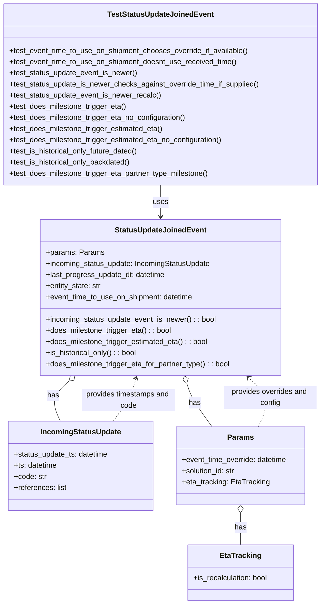

# Diagram: shipment_core/shipment_service/shipment_service/eta/eta_milestone_update/status_update/tests/test_models.py

> Auto-generated by Obscura crawlers

## Mermaid

### SVG

<svg id="container" width="692.875" xmlns="http://www.w3.org/2000/svg" class="classDiagram" height="1300" viewBox="0 0 692.875 1300" role="graphics-document document" aria-roledescription="class"><g><defs><marker id="container_class-aggregationStart" class="marker aggregation class" refX="18" refY="7" markerWidth="190" markerHeight="240" orient="auto"><path d="M 18,7 L9,13 L1,7 L9,1 Z"></path></marker></defs><defs><marker id="container_class-aggregationEnd" class="marker aggregation class" refX="1" refY="7" markerWidth="20" markerHeight="28" orient="auto"><path d="M 18,7 L9,13 L1,7 L9,1 Z"></path></marker></defs><defs><marker id="container_class-extensionStart" class="marker extension class" refX="18" refY="7" markerWidth="190" markerHeight="240" orient="auto"><path d="M 1,7 L18,13 V 1 Z"></path></marker></defs><defs><marker id="container_class-extensionEnd" class="marker extension class" refX="1" refY="7" markerWidth="20" markerHeight="28" orient="auto"><path d="M 1,1 V 13 L18,7 Z"></path></marker></defs><defs><marker id="container_class-compositionStart" class="marker composition class" refX="18" refY="7" markerWidth="190" markerHeight="240" orient="auto"><path d="M 18,7 L9,13 L1,7 L9,1 Z"></path></marker></defs><defs><marker id="container_class-compositionEnd" class="marker composition class" refX="1" refY="7" markerWidth="20" markerHeight="28" orient="auto"><path d="M 18,7 L9,13 L1,7 L9,1 Z"></path></marker></defs><defs><marker id="container_class-dependencyStart" class="marker dependency class" refX="6" refY="7" markerWidth="190" markerHeight="240" orient="auto"><path d="M 5,7 L9,13 L1,7 L9,1 Z"></path></marker></defs><defs><marker id="container_class-dependencyEnd" class="marker dependency class" refX="13" refY="7" markerWidth="20" markerHeight="28" orient="auto"><path d="M 18,7 L9,13 L14,7 L9,1 Z"></path></marker></defs><defs><marker id="container_class-lollipopStart" class="marker lollipop class" refX="13" refY="7" markerWidth="190" markerHeight="240" orient="auto"><circle stroke="black" fill="transparent" cx="7" cy="7" r="6"></circle></marker></defs><defs><marker id="container_class-lollipopEnd" class="marker lollipop class" refX="1" refY="7" markerWidth="190" markerHeight="240" orient="auto"><circle stroke="black" fill="transparent" cx="7" cy="7" r="6"></circle></marker></defs><g class="root"><g class="clusters"></g><g class="edgePaths"><path d="M346.438,398L346.438,404.167C346.438,410.333,346.438,422.667,346.438,434C346.438,445.333,346.438,455.667,346.438,460.833L346.438,466" id="id_TestStatusUpdateJoinedEvent_StatusUpdateJoinedEvent_1" class="edge-thickness-normal edge-pattern-solid relation" style=";;;" data-edge="true" data-et="edge" data-id="id_TestStatusUpdateJoinedEvent_StatusUpdateJoinedEvent_1" data-points="W3sieCI6MzQ2LjQzNzUsInkiOjM5OH0seyJ4IjozNDYuNDM3NSwieSI6NDM1fSx7IngiOjM0Ni40Mzc1LCJ5Ijo0NzJ9XQ==" marker-end="url(#container_class-dependencyEnd)"></path><path d="M402.85,824.496L404.507,829.913C406.163,835.331,409.476,846.165,418.659,861.749C427.841,877.333,442.893,897.667,450.419,907.833L457.945,918" id="id_StatusUpdateJoinedEvent_Params_2" class="edge-thickness-normal edge-pattern-solid relation" style=";;;" data-edge="true" data-et="edge" data-id="id_StatusUpdateJoinedEvent_Params_2" data-points="W3sieCI6Mzk3LjgwNjQ1MTYxMjkwMzIzLCJ5Ijo4MDh9LHsieCI6NDEyLjc4OTA2MjUsInkiOjg1N30seyJ4Ijo0NTcuOTQ1MDAyNjkzOTY1NTMsInkiOjkxOH1d" marker-start="url(#container_class-aggregationStart)"></path><path d="M147.803,819.568L140.902,825.807C134.001,832.045,120.199,844.523,117.035,858.928C113.871,873.333,121.345,889.667,125.082,897.833L128.819,906" id="id_StatusUpdateJoinedEvent_IncomingStatusUpdate_3" class="edge-thickness-normal edge-pattern-solid relation" style=";;;" data-edge="true" data-et="edge" data-id="id_StatusUpdateJoinedEvent_IncomingStatusUpdate_3" data-points="W3sieCI6MTYwLjU5OTI5NDM1NDgzODcyLCJ5Ijo4MDh9LHsieCI6MTA2LjM5NjQ4NDM3NSwieSI6ODU3fSx7IngiOjEyOC44MTg3MzY1MzAxNzI0MywieSI6OTA2fV0=" marker-start="url(#container_class-aggregationStart)"></path><path d="M520.127,1103.25L520.127,1108.542C520.127,1113.833,520.127,1124.417,520.127,1135.875C520.127,1147.333,520.127,1159.667,520.127,1165.833L520.127,1172" id="id_Params_EtaTracking_4" class="edge-thickness-normal edge-pattern-solid relation" style=";;;" data-edge="true" data-et="edge" data-id="id_Params_EtaTracking_4" data-points="W3sieCI6NTIwLjEyNjk1MzEyNSwieSI6MTA4Nn0seyJ4Ijo1MjAuMTI2OTUzMTI1LCJ5IjoxMTM1fSx7IngiOjUyMC4xMjY5NTMxMjUsInkiOjExNzJ9XQ==" marker-start="url(#container_class-aggregationStart)"></path><path d="M243.813,906L249.859,897.833C255.904,889.667,267.995,873.333,276.245,857.956C284.495,842.579,288.905,828.159,291.109,820.948L293.314,813.738" id="id_IncomingStatusUpdate_StatusUpdateJoinedEvent_5" class="edge-thickness-normal edge-pattern-dashed relation" style=";;;" data-edge="true" data-et="edge" data-id="id_IncomingStatusUpdate_StatusUpdateJoinedEvent_5" data-points="W3sieCI6MjQzLjgxMzEzMzA4MTg5NjU1LCJ5Ijo5MDZ9LHsieCI6MjgwLjA4NTkzNzUsInkiOjg1N30seyJ4IjoyOTUuMDY4NTQ4Mzg3MDk2NzcsInkiOjgwOH1d" marker-end="url(#container_class-dependencyEnd)"></path><path d="M558.565,918L563.217,907.833C567.87,897.667,577.174,877.333,573.534,859.671C569.895,842.008,553.311,827.016,545.019,819.52L536.727,812.024" id="id_Params_StatusUpdateJoinedEvent_6" class="edge-thickness-normal edge-pattern-dashed relation" style=";;;" data-edge="true" data-et="edge" data-id="id_Params_StatusUpdateJoinedEvent_6" data-points="W3sieCI6NTU4LjU2NTA5OTY3NjcyNDEsInkiOjkxOH0seyJ4Ijo1ODYuNDc4NTE1NjI1LCJ5Ijo4NTd9LHsieCI6NTMyLjI3NTcwNTY0NTE2MTIsInkiOjgwOH1d" marker-end="url(#container_class-dependencyEnd)"></path></g><g class="edgeLabels"><g class="edgeLabel" transform="translate(346.4375, 435)"><g class="label" data-id="id_TestStatusUpdateJoinedEvent_StatusUpdateJoinedEvent_1" transform="translate(-16.4921875, -12)"><foreignObject width="32.984375" height="24">

uses

</foreignObject></g></g><g class="edgeLabel" transform="translate(420.12385, 866.90838)"><g class="label" data-id="id_StatusUpdateJoinedEvent_Params_2" transform="translate(-12.703125, -12)"><foreignObject width="25.40625" height="24">

has

</foreignObject></g></g><g class="edgeLabel" transform="translate(113.51104, 850.56835)"><g class="label" data-id="id_StatusUpdateJoinedEvent_IncomingStatusUpdate_3" transform="translate(-12.703125, -12)"><foreignObject width="25.40625" height="24">

has

</foreignObject></g></g><g class="edgeLabel" transform="translate(520.126953125, 1135)"><g class="label" data-id="id_Params_EtaTracking_4" transform="translate(-12.703125, -12)"><foreignObject width="25.40625" height="24">

has

</foreignObject></g></g><g class="edgeLabel" transform="translate(277.19272, 860.90838)"><g class="label" data-id="id_IncomingStatusUpdate_StatusUpdateJoinedEvent_5" transform="translate(-100, -24)"><foreignObject width="200" height="48">

provides timestamps and code

</foreignObject></g></g><g class="edgeLabel" transform="translate(584.25869, 854.99325)"><g class="label" data-id="id_Params_StatusUpdateJoinedEvent_6" transform="translate(-100, -24)"><foreignObject width="200" height="48">

provides overrides and config

</foreignObject></g></g></g><g class="nodes"><g class="node default" id="classId-TestStatusUpdateJoinedEvent-0" transform="translate(346.4375, 203)"><g class="basic label-container"><path d="M-338.4375 -195 L338.4375 -195 L338.4375 195 L-338.4375 195" stroke="none" stroke-width="0" fill="#ECECFF" style=""></path><path d="M-338.4375 -195 C-124.7695571759678 -195, 88.89838564806439 -195, 338.4375 -195 M-338.4375 -195 C-103.80936057959431 -195, 130.81877884081138 -195, 338.4375 -195 M338.4375 -195 C338.4375 -100.3124804905876, 338.4375 -5.624960981175207, 338.4375 195 M338.4375 -195 C338.4375 -43.38986694724531, 338.4375 108.22026610550938, 338.4375 195 M338.4375 195 C136.14644229575816 195, -66.14461540848367 195, -338.4375 195 M338.4375 195 C181.91375601523507 195, 25.390012030470132 195, -338.4375 195 M-338.4375 195 C-338.4375 86.05216532304537, -338.4375 -22.895669353909256, -338.4375 -195 M-338.4375 195 C-338.4375 83.06583101862125, -338.4375 -28.868337962757494, -338.4375 -195" stroke="#9370DB" stroke-width="1.3" fill="none" stroke-dasharray="0 0" style=""></path></g><g class="annotation-group text" transform="translate(0, -171)"></g><g class="label-group text" transform="translate(-108.765625, -171)"><g class="label" style="font-weight: bolder" transform="translate(0,-12)"><foreignObject width="217.53125" height="24">

TestStatusUpdateJoinedEvent

</foreignObject></g></g><g class="members-group text" transform="translate(-326.4375, -123)"></g><g class="methods-group text" transform="translate(-326.4375, -93)"><g class="label" style="" transform="translate(0,-12)"><foreignObject width="520.59375" height="24">

+test_event_time_to_use_on_shipment_chooses_override_if_available()

</foreignObject></g><g class="label" style="" transform="translate(0,12)"><foreignObject width="495.3125" height="24">

+test_event_time_to_use_on_shipment_doesnt_use_received_time()

</foreignObject></g><g class="label" style="" transform="translate(0,36)"><foreignObject width="278.3125" height="24">

+test_status_update_event_is_newer()

</foreignObject></g><g class="label" style="" transform="translate(0,60)"><foreignObject width="544.109375" height="24">

+test_status_update_is_newer_checks_against_override_time_if_supplied()

</foreignObject></g><g class="label" style="" transform="translate(0,84)"><foreignObject width="328.0625" height="24">

+test_status_update_event_is_newer_recalc()

</foreignObject></g><g class="label" style="" transform="translate(0,108)"><foreignObject width="254.125" height="24">

+test_does_milestone_trigger_eta()

</foreignObject></g><g class="label" style="" transform="translate(0,132)"><foreignObject width="384.890625" height="24">

+test_does_milestone_trigger_eta_no_configuration()

</foreignObject></g><g class="label" style="" transform="translate(0,156)"><foreignObject width="334.84375" height="24">

+test_does_milestone_trigger_estimated_eta()

</foreignObject></g><g class="label" style="" transform="translate(0,180)"><foreignObject width="465.609375" height="24">

+test_does_milestone_trigger_estimated_eta_no_configuration()

</foreignObject></g><g class="label" style="" transform="translate(0,204)"><foreignObject width="282.328125" height="24">

+test_is_historical_only_future_dated()

</foreignObject></g><g class="label" style="" transform="translate(0,228)"><foreignObject width="264.53125" height="24">

+test_is_historical_only_backdated()

</foreignObject></g><g class="label" style="" transform="translate(0,252)"><foreignObject width="435.21875" height="24">

+test_does_milestone_trigger_eta_partner_type_milestone()

</foreignObject></g></g><g class="divider" style=""><path d="M-338.4375 -147 C-188.49412740533182 -147, -38.55075481066365 -147, 338.4375 -147 M-338.4375 -147 C-159.8606899843787 -147, 18.71612003124261 -147, 338.4375 -147" stroke="#9370DB" stroke-width="1.3" fill="none" stroke-dasharray="0 0" style=""></path></g><g class="divider" style=""><path d="M-338.4375 -123 C-120.00983700092112 -123, 98.41782599815775 -123, 338.4375 -123 M-338.4375 -123 C-139.06050476285245 -123, 60.31649047429511 -123, 338.4375 -123" stroke="#9370DB" stroke-width="1.3" fill="none" stroke-dasharray="0 0" style=""></path></g></g><g class="node default" id="classId-StatusUpdateJoinedEvent-1" transform="translate(346.4375, 640)"><g class="basic label-container"><path d="M-259.015625 -168 L259.015625 -168 L259.015625 168 L-259.015625 168" stroke="none" stroke-width="0" fill="#ECECFF" style=""></path><path d="M-259.015625 -168 C-75.23871735024707 -168, 108.53819029950586 -168, 259.015625 -168 M-259.015625 -168 C-81.49136541395677 -168, 96.03289417208646 -168, 259.015625 -168 M259.015625 -168 C259.015625 -37.89770808560468, 259.015625 92.20458382879065, 259.015625 168 M259.015625 -168 C259.015625 -80.44710752295767, 259.015625 7.105784954084669, 259.015625 168 M259.015625 168 C75.56141095404001 168, -107.89280309191997 168, -259.015625 168 M259.015625 168 C147.1325902795815 168, 35.249555559163014 168, -259.015625 168 M-259.015625 168 C-259.015625 90.5828968995134, -259.015625 13.165793799026801, -259.015625 -168 M-259.015625 168 C-259.015625 59.239762886643504, -259.015625 -49.52047422671299, -259.015625 -168" stroke="#9370DB" stroke-width="1.3" fill="none" stroke-dasharray="0 0" style=""></path></g><g class="annotation-group text" transform="translate(0, -144)"></g><g class="label-group text" transform="translate(-93.515625, -144)"><g class="label" style="font-weight: bolder" transform="translate(0,-12)"><foreignObject width="187.03125" height="24">

StatusUpdateJoinedEvent

</foreignObject></g></g><g class="members-group text" transform="translate(-247.015625, -96)"><g class="label" style="" transform="translate(0,-12)"><foreignObject width="122.25" height="24">

+params: Params

</foreignObject></g><g class="label" style="" transform="translate(0,12)"><foreignObject width="359.328125" height="24">

+incoming_status_update: IncomingStatusUpdate

</foreignObject></g><g class="label" style="" transform="translate(0,36)"><foreignObject width="260.21875" height="24">

+last_progress_update_dt: datetime

</foreignObject></g><g class="label" style="" transform="translate(0,60)"><foreignObject width="121.390625" height="24">

+entity_state: str

</foreignObject></g><g class="label" style="" transform="translate(0,84)"><foreignObject width="321.359375" height="24">

+event_time_to_use_on_shipment: datetime

</foreignObject></g></g><g class="methods-group text" transform="translate(-247.015625, 48)"><g class="label" style="" transform="translate(0,-12)"><foreignObject width="370.71875" height="24">

+incoming_status_update_event_is_newer() : : bool

</foreignObject></g><g class="label" style="" transform="translate(0,12)"><foreignObject width="271.96875" height="24">

+does_milestone_trigger_eta() : : bool

</foreignObject></g><g class="label" style="" transform="translate(0,36)"><foreignObject width="352.703125" height="24">

+does_milestone_trigger_estimated_eta() : : bool

</foreignObject></g><g class="label" style="" transform="translate(0,60)"><foreignObject width="198.390625" height="24">

+is_historical_only() : : bool

</foreignObject></g><g class="label" style="" transform="translate(0,84)"><foreignObject width="400.515625" height="24">

+does_milestone_trigger_eta_for_partner_type() : : bool

</foreignObject></g></g><g class="divider" style=""><path d="M-259.015625 -120 C-53.746922251093594 -120, 151.5217804978128 -120, 259.015625 -120 M-259.015625 -120 C-117.74735784051086 -120, 23.520909318978283 -120, 259.015625 -120" stroke="#9370DB" stroke-width="1.3" fill="none" stroke-dasharray="0 0" style=""></path></g><g class="divider" style=""><path d="M-259.015625 24 C-139.65068510882992 24, -20.28574521765981 24, 259.015625 24 M-259.015625 24 C-143.45079406130117 24, -27.885963122602305 24, 259.015625 24" stroke="#9370DB" stroke-width="1.3" fill="none" stroke-dasharray="0 0" style=""></path></g></g><g class="node default" id="classId-IncomingStatusUpdate-2" transform="translate(172.748046875, 1002)"><g class="basic label-container"><path d="M-156.515625 -96 L156.515625 -96 L156.515625 96 L-156.515625 96" stroke="none" stroke-width="0" fill="#ECECFF" style=""></path><path d="M-156.515625 -96 C-44.002389279815276 -96, 68.51084644036945 -96, 156.515625 -96 M-156.515625 -96 C-78.20734362287213 -96, 0.10093775425573881 -96, 156.515625 -96 M156.515625 -96 C156.515625 -52.17166868531458, 156.515625 -8.343337370629158, 156.515625 96 M156.515625 -96 C156.515625 -30.502361860755357, 156.515625 34.995276278489285, 156.515625 96 M156.515625 96 C77.75503174101381 96, -1.0055615179723816 96, -156.515625 96 M156.515625 96 C67.62432700477231 96, -21.266970990455377 96, -156.515625 96 M-156.515625 96 C-156.515625 20.02199076481243, -156.515625 -55.95601847037514, -156.515625 -96 M-156.515625 96 C-156.515625 32.51810307635371, -156.515625 -30.963793847292578, -156.515625 -96" stroke="#9370DB" stroke-width="1.3" fill="none" stroke-dasharray="0 0" style=""></path></g><g class="annotation-group text" transform="translate(0, -72)"></g><g class="label-group text" transform="translate(-83.359375, -72)"><g class="label" style="font-weight: bolder" transform="translate(0,-12)"><foreignObject width="166.71875" height="24">

IncomingStatusUpdate

</foreignObject></g></g><g class="members-group text" transform="translate(-144.515625, -24)"><g class="label" style="" transform="translate(0,-12)"><foreignObject width="205.671875" height="24">

+status_update_ts: datetime

</foreignObject></g><g class="label" style="" transform="translate(0,12)"><foreignObject width="94.484375" height="24">

+ts: datetime

</foreignObject></g><g class="label" style="" transform="translate(0,36)"><foreignObject width="70.453125" height="24">

+code: str

</foreignObject></g><g class="label" style="" transform="translate(0,60)"><foreignObject width="114.171875" height="24">

+references: list

</foreignObject></g></g><g class="methods-group text" transform="translate(-144.515625, 96)"></g><g class="divider" style=""><path d="M-156.515625 -48 C-32.21678684329292 -48, 92.08205131341415 -48, 156.515625 -48 M-156.515625 -48 C-73.61132984948182 -48, 9.29296530103636 -48, 156.515625 -48" stroke="#9370DB" stroke-width="1.3" fill="none" stroke-dasharray="0 0" style=""></path></g><g class="divider" style=""><path d="M-156.515625 72 C-86.44819434622 72, -16.380763692440013 72, 156.515625 72 M-156.515625 72 C-48.91455833845765 72, 58.686508323084695 72, 156.515625 72" stroke="#9370DB" stroke-width="1.3" fill="none" stroke-dasharray="0 0" style=""></path></g></g><g class="node default" id="classId-Params-3" transform="translate(520.126953125, 1002)"><g class="basic label-container"><path d="M-140.86328125 -84 L140.86328125 -84 L140.86328125 84 L-140.86328125 84" stroke="none" stroke-width="0" fill="#ECECFF" style=""></path><path d="M-140.86328125 -84 C-31.13051970869246 -84, 78.60224183261508 -84, 140.86328125 -84 M-140.86328125 -84 C-31.04784581006608 -84, 78.76758962986784 -84, 140.86328125 -84 M140.86328125 -84 C140.86328125 -28.60957057375375, 140.86328125 26.7808588524925, 140.86328125 84 M140.86328125 -84 C140.86328125 -33.33739511710089, 140.86328125 17.32520976579822, 140.86328125 84 M140.86328125 84 C41.73632218050571 84, -57.39063688898858 84, -140.86328125 84 M140.86328125 84 C57.11134167049333 84, -26.640597909013337 84, -140.86328125 84 M-140.86328125 84 C-140.86328125 45.82687082738525, -140.86328125 7.653741654770499, -140.86328125 -84 M-140.86328125 84 C-140.86328125 46.393945437352215, -140.86328125 8.78789087470443, -140.86328125 -84" stroke="#9370DB" stroke-width="1.3" fill="none" stroke-dasharray="0 0" style=""></path></g><g class="annotation-group text" transform="translate(0, -60)"></g><g class="label-group text" transform="translate(-26.7109375, -60)"><g class="label" style="font-weight: bolder" transform="translate(0,-12)"><foreignObject width="53.421875" height="24">

Params

</foreignObject></g></g><g class="members-group text" transform="translate(-128.86328125, -12)"><g class="label" style="" transform="translate(0,-12)"><foreignObject width="231.015625" height="24">

+event_time_override: datetime

</foreignObject></g><g class="label" style="" transform="translate(0,12)"><foreignObject width="117.71875" height="24">

+solution_id: str

</foreignObject></g><g class="label" style="" transform="translate(0,36)"><foreignObject width="188.171875" height="24">

+eta_tracking: EtaTracking

</foreignObject></g></g><g class="methods-group text" transform="translate(-128.86328125, 84)"></g><g class="divider" style=""><path d="M-140.86328125 -36 C-38.41101894190234 -36, 64.04124336619532 -36, 140.86328125 -36 M-140.86328125 -36 C-68.18603134085107 -36, 4.491218568297853 -36, 140.86328125 -36" stroke="#9370DB" stroke-width="1.3" fill="none" stroke-dasharray="0 0" style=""></path></g><g class="divider" style=""><path d="M-140.86328125 60 C-50.92917425901322 60, 39.004932731973554 60, 140.86328125 60 M-140.86328125 60 C-51.73391355791664 60, 37.39545413416673 60, 140.86328125 60" stroke="#9370DB" stroke-width="1.3" fill="none" stroke-dasharray="0 0" style=""></path></g></g><g class="node default" id="classId-EtaTracking-4" transform="translate(520.126953125, 1232)"><g class="basic label-container"><path d="M-114.73828125 -60 L114.73828125 -60 L114.73828125 60 L-114.73828125 60" stroke="none" stroke-width="0" fill="#ECECFF" style=""></path><path d="M-114.73828125 -60 C-61.74455916218079 -60, -8.750837074361584 -60, 114.73828125 -60 M-114.73828125 -60 C-46.03368593098871 -60, 22.67090938802258 -60, 114.73828125 -60 M114.73828125 -60 C114.73828125 -34.896365719151504, 114.73828125 -9.792731438303015, 114.73828125 60 M114.73828125 -60 C114.73828125 -18.617043668909993, 114.73828125 22.765912662180014, 114.73828125 60 M114.73828125 60 C42.85194885938712 60, -29.034383531225757 60, -114.73828125 60 M114.73828125 60 C57.53322754378814 60, 0.32817383757628704 60, -114.73828125 60 M-114.73828125 60 C-114.73828125 27.47207181991284, -114.73828125 -5.055856360174317, -114.73828125 -60 M-114.73828125 60 C-114.73828125 19.7290882983158, -114.73828125 -20.541823403368397, -114.73828125 -60" stroke="#9370DB" stroke-width="1.3" fill="none" stroke-dasharray="0 0" style=""></path></g><g class="annotation-group text" transform="translate(0, -36)"></g><g class="label-group text" transform="translate(-42.3671875, -36)"><g class="label" style="font-weight: bolder" transform="translate(0,-12)"><foreignObject width="84.734375" height="24">

EtaTracking

</foreignObject></g></g><g class="members-group text" transform="translate(-102.73828125, 12)"><g class="label" style="" transform="translate(0,-12)"><foreignObject width="163.109375" height="24">

+is_recalculation: bool

</foreignObject></g></g><g class="methods-group text" transform="translate(-102.73828125, 60)"></g><g class="divider" style=""><path d="M-114.73828125 -12 C-32.877351782989834 -12, 48.98357768402033 -12, 114.73828125 -12 M-114.73828125 -12 C-64.95607960434498 -12, -15.173877958689971 -12, 114.73828125 -12" stroke="#9370DB" stroke-width="1.3" fill="none" stroke-dasharray="0 0" style=""></path></g><g class="divider" style=""><path d="M-114.73828125 36 C-66.6832863542098 36, -18.628291458419582 36, 114.73828125 36 M-114.73828125 36 C-60.638387987572074 36, -6.538494725144147 36, 114.73828125 36" stroke="#9370DB" stroke-width="1.3" fill="none" stroke-dasharray="0 0" style=""></path></g></g></g></g></g></svg>
