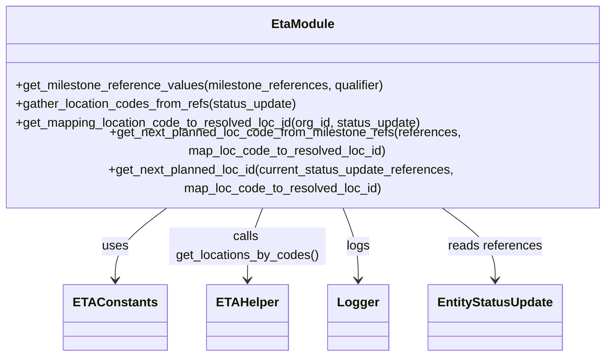

# Diagram: shipment_core/shipment_service/shipment_service/eta/eta_milestone_update/status_update/utils.py


> Auto-generated by Obscura crawlers

## Diagram 1



### SVG

<svg id="container" width="790.0625" xmlns="http://www.w3.org/2000/svg" class="classDiagram" height="420" viewBox="0 0 790.0625 420" role="graphics-document document" aria-roledescription="class"><style>#container{font-family:"trebuchet ms",verdana,arial,sans-serif;font-size:16px;fill:#333;}@keyframes edge-animation-frame{from{stroke-dashoffset:0;}}@keyframes dash{to{stroke-dashoffset:0;}}#container .edge-animation-slow{stroke-dasharray:9,5!important;stroke-dashoffset:900;animation:dash 50s linear infinite;stroke-linecap:round;}#container .edge-animation-fast{stroke-dasharray:9,5!important;stroke-dashoffset:900;animation:dash 20s linear infinite;stroke-linecap:round;}#container .error-icon{fill:#552222;}#container .error-text{fill:#552222;stroke:#552222;}#container .edge-thickness-normal{stroke-width:1px;}#container .edge-thickness-thick{stroke-width:3.5px;}#container .edge-pattern-solid{stroke-dasharray:0;}#container .edge-thickness-invisible{stroke-width:0;fill:none;}#container .edge-pattern-dashed{stroke-dasharray:3;}#container .edge-pattern-dotted{stroke-dasharray:2;}#container .marker{fill:#333333;stroke:#333333;}#container .marker.cross{stroke:#333333;}#container svg{font-family:"trebuchet ms",verdana,arial,sans-serif;font-size:16px;}#container p{margin:0;}#container g.classGroup text{fill:#9370DB;stroke:none;font-family:"trebuchet ms",verdana,arial,sans-serif;font-size:10px;}#container g.classGroup text .title{font-weight:bolder;}#container .nodeLabel,#container .edgeLabel{color:#131300;}#container .edgeLabel .label rect{fill:#ECECFF;}#container .label text{fill:#131300;}#container .labelBkg{background:#ECECFF;}#container .edgeLabel .label span{background:#ECECFF;}#container .classTitle{font-weight:bolder;}#container .node rect,#container .node circle,#container .node ellipse,#container .node polygon,#container .node path{fill:#ECECFF;stroke:#9370DB;stroke-width:1px;}#container .divider{stroke:#9370DB;stroke-width:1;}#container g.clickable{cursor:pointer;}#container g.classGroup rect{fill:#ECECFF;stroke:#9370DB;}#container g.classGroup line{stroke:#9370DB;stroke-width:1;}#container .classLabel .box{stroke:none;stroke-width:0;fill:#ECECFF;opacity:0.5;}#container .classLabel .label{fill:#9370DB;font-size:10px;}#container .relation{stroke:#333333;stroke-width:1;fill:none;}#container .dashed-line{stroke-dasharray:3;}#container .dotted-line{stroke-dasharray:1 2;}#container #compositionStart,#container .composition{fill:#333333!important;stroke:#333333!important;stroke-width:1;}#container #compositionEnd,#container .composition{fill:#333333!important;stroke:#333333!important;stroke-width:1;}#container #dependencyStart,#container .dependency{fill:#333333!important;stroke:#333333!important;stroke-width:1;}#container #dependencyStart,#container .dependency{fill:#333333!important;stroke:#333333!important;stroke-width:1;}#container #extensionStart,#container .extension{fill:transparent!important;stroke:#333333!important;stroke-width:1;}#container #extensionEnd,#container .extension{fill:transparent!important;stroke:#333333!important;stroke-width:1;}#container #aggregationStart,#container .aggregation{fill:transparent!important;stroke:#333333!important;stroke-width:1;}#container #aggregationEnd,#container .aggregation{fill:transparent!important;stroke:#333333!important;stroke-width:1;}#container #lollipopStart,#container .lollipop{fill:#ECECFF!important;stroke:#333333!important;stroke-width:1;}#container #lollipopEnd,#container .lollipop{fill:#ECECFF!important;stroke:#333333!important;stroke-width:1;}#container .edgeTerminals{font-size:11px;line-height:initial;}#container .classTitleText{text-anchor:middle;font-size:18px;fill:#333;}#container .label-icon{display:inline-block;height:1em;overflow:visible;vertical-align:-0.125em;}#container .node .label-icon path{fill:currentColor;stroke:revert;stroke-width:revert;}#container :root{--mermaid-font-family:"trebuchet ms",verdana,arial,sans-serif;}</style><g><defs><marker id="container_class-aggregationStart" class="marker aggregation class" refX="18" refY="7" markerWidth="190" markerHeight="240" orient="auto"><path d="M 18,7 L9,13 L1,7 L9,1 Z"></path></marker></defs><defs><marker id="container_class-aggregationEnd" class="marker aggregation class" refX="1" refY="7" markerWidth="20" markerHeight="28" orient="auto"><path d="M 18,7 L9,13 L1,7 L9,1 Z"></path></marker></defs><defs><marker id="container_class-extensionStart" class="marker extension class" refX="18" refY="7" markerWidth="190" markerHeight="240" orient="auto"><path d="M 1,7 L18,13 V 1 Z"></path></marker></defs><defs><marker id="container_class-extensionEnd" class="marker extension class" refX="1" refY="7" markerWidth="20" markerHeight="28" orient="auto"><path d="M 1,1 V 13 L18,7 Z"></path></marker></defs><defs><marker id="container_class-compositionStart" class="marker composition class" refX="18" refY="7" markerWidth="190" markerHeight="240" orient="auto"><path d="M 18,7 L9,13 L1,7 L9,1 Z"></path></marker></defs><defs><marker id="container_class-compositionEnd" class="marker composition class" refX="1" refY="7" markerWidth="20" markerHeight="28" orient="auto"><path d="M 18,7 L9,13 L1,7 L9,1 Z"></path></marker></defs><defs><marker id="container_class-dependencyStart" class="marker dependency class" refX="6" refY="7" markerWidth="190" markerHeight="240" orient="auto"><path d="M 5,7 L9,13 L1,7 L9,1 Z"></path></marker></defs><defs><marker id="container_class-dependencyEnd" class="marker dependency class" refX="13" refY="7" markerWidth="20" markerHeight="28" orient="auto"><path d="M 18,7 L9,13 L14,7 L9,1 Z"></path></marker></defs><defs><marker id="container_class-lollipopStart" class="marker lollipop class" refX="13" refY="7" markerWidth="190" markerHeight="240" orient="auto"><circle stroke="black" fill="transparent" cx="7" cy="7" r="6"></circle></marker></defs><defs><marker id="container_class-lollipopEnd" class="marker lollipop class" refX="1" refY="7" markerWidth="190" markerHeight="240" orient="auto"><circle stroke="black" fill="transparent" cx="7" cy="7" r="6"></circle></marker></defs><g class="root"><g class="clusters"></g><g class="edgePaths"><path d="M236.309,230L224.631,238.167C212.953,246.333,189.598,262.667,177.92,278C166.242,293.333,166.242,307.667,166.242,314.833L166.242,322" id="id_EtaModule_ETAConstants_1" class="edge-thickness-normal edge-pattern-solid relation" style=";;;" data-edge="true" data-et="edge" data-id="id_EtaModule_ETAConstants_1" data-points="W3sieCI6MjM2LjMwODgzNzg5MDYyNSwieSI6MjMwfSx7IngiOjE2Ni4yNDIxODc1LCJ5IjoyNzl9LHsieCI6MTY2LjI0MjE4NzUsInkiOjMyOH1d" marker-end="url(#container_class-dependencyEnd)"></path><path d="M347.78,230L344.304,238.167C340.828,246.333,333.875,262.667,330.398,278C326.922,293.333,326.922,307.667,326.922,314.833L326.922,322" id="id_EtaModule_ETAHelper_2" class="edge-thickness-normal edge-pattern-solid relation" style=";;;" data-edge="true" data-et="edge" data-id="id_EtaModule_ETAHelper_2" data-points="W3sieCI6MzQ3Ljc4MDM3MTA5Mzc1LCJ5IjoyMzB9LHsieCI6MzI2LjkyMTg3NSwieSI6Mjc5fSx7IngiOjMyNi45MjE4NzUsInkiOjMyOH1d" marker-end="url(#container_class-dependencyEnd)"></path><path d="M442.282,230L445.759,238.167C449.235,246.333,456.188,262.667,459.664,278C463.141,293.333,463.141,307.667,463.141,314.833L463.141,322" id="id_EtaModule_Logger_3" class="edge-thickness-normal edge-pattern-solid relation" style=";;;" data-edge="true" data-et="edge" data-id="id_EtaModule_Logger_3" data-points="W3sieCI6NDQyLjI4MjEyODkwNjI1LCJ5IjoyMzB9LHsieCI6NDYzLjE0MDYyNSwieSI6Mjc5fSx7IngiOjQ2My4xNDA2MjUsInkiOjMyOH1d" marker-end="url(#container_class-dependencyEnd)"></path><path d="M560.312,230L572.472,238.167C584.632,246.333,608.953,262.667,621.113,278C633.273,293.333,633.273,307.667,633.273,314.833L633.273,322" id="id_EtaModule_EntityStatusUpdate_4" class="edge-thickness-normal edge-pattern-solid relation" style=";;;" data-edge="true" data-et="edge" data-id="id_EtaModule_EntityStatusUpdate_4" data-points="W3sieCI6NTYwLjMxMTc2NzU3ODEyNSwieSI6MjMwfSx7IngiOjYzMy4yNzM0Mzc1LCJ5IjoyNzl9LHsieCI6NjMzLjI3MzQzNzUsInkiOjMyOH1d" marker-end="url(#container_class-dependencyEnd)"></path></g><g class="edgeLabels"><g class="edgeLabel" transform="translate(166.2421875, 279)"><g class="label" data-id="id_EtaModule_ETAConstants_1" transform="translate(-16.4921875, -12)"><foreignObject width="32.984375" height="24"><div xmlns="http://www.w3.org/1999/xhtml" class="labelBkg" style="display: table-cell; white-space: nowrap; line-height: 1.5; max-width: 200px; text-align: center;"><span class="edgeLabel"><p>uses</p></span></div></foreignObject></g></g><g class="edgeLabel" transform="translate(326.921875, 279)"><g class="label" data-id="id_EtaModule_ETAHelper_2" transform="translate(-100, -24)"><foreignObject width="200" height="48"><div xmlns="http://www.w3.org/1999/xhtml" class="labelBkg" style="display: table; white-space: break-spaces; line-height: 1.5; max-width: 200px; text-align: center; width: 200px;"><span class="edgeLabel"><p>calls get_locations_by_codes()</p></span></div></foreignObject></g></g><g class="edgeLabel" transform="translate(463.140625, 279)"><g class="label" data-id="id_EtaModule_Logger_3" transform="translate(-14.8203125, -12)"><foreignObject width="29.640625" height="24"><div xmlns="http://www.w3.org/1999/xhtml" class="labelBkg" style="display: table-cell; white-space: nowrap; line-height: 1.5; max-width: 200px; text-align: center;"><span class="edgeLabel"><p>logs</p></span></div></foreignObject></g></g><g class="edgeLabel" transform="translate(633.2734375, 279)"><g class="label" data-id="id_EtaModule_EntityStatusUpdate_4" transform="translate(-59.9453125, -12)"><foreignObject width="119.890625" height="24"><div xmlns="http://www.w3.org/1999/xhtml" class="labelBkg" style="display: table-cell; white-space: nowrap; line-height: 1.5; max-width: 200px; text-align: center;"><span class="edgeLabel"><p>reads references</p></span></div></foreignObject></g></g></g><g class="nodes"><g class="node default" id="classId-EtaModule-0" transform="translate(395.03125, 119)"><g class="basic label-container"><path d="M-387.03125 -111 L387.03125 -111 L387.03125 111 L-387.03125 111" stroke="none" stroke-width="0" fill="#ECECFF" style=""></path><path d="M-387.03125 -111 C-220.85414112727665 -111, -54.677032254553296 -111, 387.03125 -111 M-387.03125 -111 C-148.524148159142 -111, 89.98295368171603 -111, 387.03125 -111 M387.03125 -111 C387.03125 -59.3982712422293, 387.03125 -7.796542484458598, 387.03125 111 M387.03125 -111 C387.03125 -43.54823922332454, 387.03125 23.903521553350913, 387.03125 111 M387.03125 111 C151.282791793881 111, -84.46566641223802 111, -387.03125 111 M387.03125 111 C185.6793395516653 111, -15.672570896669413 111, -387.03125 111 M-387.03125 111 C-387.03125 54.791129631237325, -387.03125 -1.4177407375253495, -387.03125 -111 M-387.03125 111 C-387.03125 35.640260145726856, -387.03125 -39.71947970854629, -387.03125 -111" stroke="#9370DB" stroke-width="1.3" fill="none" stroke-dasharray="0 0" style=""></path></g><g class="annotation-group text" transform="translate(0, -87)"></g><g class="label-group text" transform="translate(-38.53125, -87)"><g class="label" style="font-weight: bolder" transform="translate(0,-12)"><foreignObject width="77.0625" height="24"><div xmlns="http://www.w3.org/1999/xhtml" style="display: table-cell; white-space: nowrap; line-height: 1.5; max-width: 127px; text-align: center;"><span class="nodeLabel markdown-node-label" style=""><p>EtaModule</p></span></div></foreignObject></g></g><g class="members-group text" transform="translate(-375.03125, -39)"></g><g class="methods-group text" transform="translate(-375.03125, -9)"><g class="label" style="" transform="translate(0,-12)"><foreignObject width="475.734375" height="24"><div xmlns="http://www.w3.org/1999/xhtml" style="display: table-cell; white-space: nowrap; line-height: 1.5; max-width: 533px; text-align: center;"><span class="nodeLabel markdown-node-label" style=""><p>+get_milestone_reference_values(milestone_references, qualifier)</p></span></div></foreignObject></g><g class="label" style="" transform="translate(0,12)"><foreignObject width="362.296875" height="24"><div xmlns="http://www.w3.org/1999/xhtml" style="display: table-cell; white-space: nowrap; line-height: 1.5; max-width: 420px; text-align: center;"><span class="nodeLabel markdown-node-label" style=""><p>+gather_location_codes_from_refs(status_update)</p></span></div></foreignObject></g><g class="label" style="" transform="translate(0,36)"><foreignObject width="525.359375" height="24"><div xmlns="http://www.w3.org/1999/xhtml" style="display: table-cell; white-space: nowrap; line-height: 1.5; max-width: 583px; text-align: center;"><span class="nodeLabel markdown-node-label" style=""><p>+get_mapping_location_code_to_resolved_loc_id(org_id, status_update)</p></span></div></foreignObject></g><g class="label" style="" transform="translate(0,60)"><foreignObject width="711.53125" height="24"><div xmlns="http://www.w3.org/1999/xhtml" style="display: table-cell; white-space: nowrap; line-height: 1.5; max-width: 769px; text-align: center;"><span class="nodeLabel markdown-node-label" style=""><p>+get_next_planned_loc_code_from_milestone_refs(references, map_loc_code_to_resolved_loc_id)</p></span></div></foreignObject></g><g class="label" style="" transform="translate(0,84)"><foreignObject width="705.984375" height="24"><div xmlns="http://www.w3.org/1999/xhtml" style="display: table-cell; white-space: nowrap; line-height: 1.5; max-width: 763px; text-align: center;"><span class="nodeLabel markdown-node-label" style=""><p>+get_next_planned_loc_id(current_status_update_references, map_loc_code_to_resolved_loc_id)</p></span></div></foreignObject></g></g><g class="divider" style=""><path d="M-387.03125 -63 C-219.3467438907169 -63, -51.66223778143382 -63, 387.03125 -63 M-387.03125 -63 C-220.24666722755245 -63, -53.4620844551049 -63, 387.03125 -63" stroke="#9370DB" stroke-width="1.3" fill="none" stroke-dasharray="0 0" style=""></path></g><g class="divider" style=""><path d="M-387.03125 -39 C-104.00357645988726 -39, 179.0240970802255 -39, 387.03125 -39 M-387.03125 -39 C-190.7323295166514 -39, 5.56659096669722 -39, 387.03125 -39" stroke="#9370DB" stroke-width="1.3" fill="none" stroke-dasharray="0 0" style=""></path></g></g><g class="node default" id="classId-ETAConstants-1" transform="translate(166.2421875, 370)"><g class="basic label-container"><path d="M-61.3046875 -42 L61.3046875 -42 L61.3046875 42 L-61.3046875 42" stroke="none" stroke-width="0" fill="#ECECFF" style=""></path><path d="M-61.3046875 -42 C-33.19260983467038 -42, -5.080532169340749 -42, 61.3046875 -42 M-61.3046875 -42 C-34.60416986721967 -42, -7.903652234439328 -42, 61.3046875 -42 M61.3046875 -42 C61.3046875 -18.860215067625994, 61.3046875 4.279569864748012, 61.3046875 42 M61.3046875 -42 C61.3046875 -8.730755924168726, 61.3046875 24.53848815166255, 61.3046875 42 M61.3046875 42 C29.651632589119846 42, -2.001422321760309 42, -61.3046875 42 M61.3046875 42 C14.492774352425592 42, -32.31913879514882 42, -61.3046875 42 M-61.3046875 42 C-61.3046875 20.30045901961991, -61.3046875 -1.3990819607601779, -61.3046875 -42 M-61.3046875 42 C-61.3046875 22.979911877977077, -61.3046875 3.9598237559541545, -61.3046875 -42" stroke="#9370DB" stroke-width="1.3" fill="none" stroke-dasharray="0 0" style=""></path></g><g class="annotation-group text" transform="translate(0, -18)"></g><g class="label-group text" transform="translate(-49.3046875, -18)"><g class="label" style="font-weight: bolder" transform="translate(0,-12)"><foreignObject width="98.609375" height="24"><div xmlns="http://www.w3.org/1999/xhtml" style="display: table-cell; white-space: nowrap; line-height: 1.5; max-width: 147px; text-align: center;"><span class="nodeLabel markdown-node-label" style=""><p>ETAConstants</p></span></div></foreignObject></g></g><g class="members-group text" transform="translate(-49.3046875, 30)"></g><g class="methods-group text" transform="translate(-49.3046875, 60)"></g><g class="divider" style=""><path d="M-61.3046875 6 C-34.38566175730631 6, -7.466636014612618 6, 61.3046875 6 M-61.3046875 6 C-12.371960229870417 6, 36.560767040259165 6, 61.3046875 6" stroke="#9370DB" stroke-width="1.3" fill="none" stroke-dasharray="0 0" style=""></path></g><g class="divider" style=""><path d="M-61.3046875 24 C-17.913883467050432 24, 25.476920565899135 24, 61.3046875 24 M-61.3046875 24 C-19.08998984663652 24, 23.12470780672696 24, 61.3046875 24" stroke="#9370DB" stroke-width="1.3" fill="none" stroke-dasharray="0 0" style=""></path></g></g><g class="node default" id="classId-ETAHelper-2" transform="translate(326.921875, 370)"><g class="basic label-container"><path d="M-49.375 -42 L49.375 -42 L49.375 42 L-49.375 42" stroke="none" stroke-width="0" fill="#ECECFF" style=""></path><path d="M-49.375 -42 C-16.591194299938394 -42, 16.192611400123212 -42, 49.375 -42 M-49.375 -42 C-28.999920638558397 -42, -8.624841277116793 -42, 49.375 -42 M49.375 -42 C49.375 -9.584481361686258, 49.375 22.831037276627484, 49.375 42 M49.375 -42 C49.375 -9.27593276842326, 49.375 23.44813446315348, 49.375 42 M49.375 42 C28.63712544015759 42, 7.899250880315179 42, -49.375 42 M49.375 42 C13.192934304603376 42, -22.989131390793247 42, -49.375 42 M-49.375 42 C-49.375 16.237327693598864, -49.375 -9.525344612802272, -49.375 -42 M-49.375 42 C-49.375 14.312358302554504, -49.375 -13.375283394890992, -49.375 -42" stroke="#9370DB" stroke-width="1.3" fill="none" stroke-dasharray="0 0" style=""></path></g><g class="annotation-group text" transform="translate(0, -18)"></g><g class="label-group text" transform="translate(-37.375, -18)"><g class="label" style="font-weight: bolder" transform="translate(0,-12)"><foreignObject width="74.75" height="24"><div xmlns="http://www.w3.org/1999/xhtml" style="display: table-cell; white-space: nowrap; line-height: 1.5; max-width: 125px; text-align: center;"><span class="nodeLabel markdown-node-label" style=""><p>ETAHelper</p></span></div></foreignObject></g></g><g class="members-group text" transform="translate(-37.375, 30)"></g><g class="methods-group text" transform="translate(-37.375, 60)"></g><g class="divider" style=""><path d="M-49.375 6 C-24.406868400671616 6, 0.5612631986567678 6, 49.375 6 M-49.375 6 C-11.236356574258359 6, 26.902286851483282 6, 49.375 6" stroke="#9370DB" stroke-width="1.3" fill="none" stroke-dasharray="0 0" style=""></path></g><g class="divider" style=""><path d="M-49.375 24 C-18.49575701445089 24, 12.383485971098217 24, 49.375 24 M-49.375 24 C-29.46309303542268 24, -9.551186070845361 24, 49.375 24" stroke="#9370DB" stroke-width="1.3" fill="none" stroke-dasharray="0 0" style=""></path></g></g><g class="node default" id="classId-EntityStatusUpdate-3" transform="translate(633.2734375, 370)"><g class="basic label-container"><path d="M-83.2890625 -42 L83.2890625 -42 L83.2890625 42 L-83.2890625 42" stroke="none" stroke-width="0" fill="#ECECFF" style=""></path><path d="M-83.2890625 -42 C-17.53664638354276 -42, 48.21576973291448 -42, 83.2890625 -42 M-83.2890625 -42 C-21.701164023575714 -42, 39.88673445284857 -42, 83.2890625 -42 M83.2890625 -42 C83.2890625 -9.297109850162236, 83.2890625 23.405780299675527, 83.2890625 42 M83.2890625 -42 C83.2890625 -20.24041208224004, 83.2890625 1.519175835519917, 83.2890625 42 M83.2890625 42 C20.262146612910414 42, -42.76476927417917 42, -83.2890625 42 M83.2890625 42 C36.51767577007687 42, -10.25371095984626 42, -83.2890625 42 M-83.2890625 42 C-83.2890625 22.38801812839218, -83.2890625 2.7760362567843586, -83.2890625 -42 M-83.2890625 42 C-83.2890625 8.890055480154423, -83.2890625 -24.219889039691154, -83.2890625 -42" stroke="#9370DB" stroke-width="1.3" fill="none" stroke-dasharray="0 0" style=""></path></g><g class="annotation-group text" transform="translate(0, -18)"></g><g class="label-group text" transform="translate(-71.2890625, -18)"><g class="label" style="font-weight: bolder" transform="translate(0,-12)"><foreignObject width="142.578125" height="24"><div xmlns="http://www.w3.org/1999/xhtml" style="display: table-cell; white-space: nowrap; line-height: 1.5; max-width: 190px; text-align: center;"><span class="nodeLabel markdown-node-label" style=""><p>EntityStatusUpdate</p></span></div></foreignObject></g></g><g class="members-group text" transform="translate(-71.2890625, 30)"></g><g class="methods-group text" transform="translate(-71.2890625, 60)"></g><g class="divider" style=""><path d="M-83.2890625 6 C-23.529163144262277 6, 36.230736211475445 6, 83.2890625 6 M-83.2890625 6 C-23.728815593498688 6, 35.831431313002625 6, 83.2890625 6" stroke="#9370DB" stroke-width="1.3" fill="none" stroke-dasharray="0 0" style=""></path></g><g class="divider" style=""><path d="M-83.2890625 24 C-40.436236540863284 24, 2.416589418273432 24, 83.2890625 24 M-83.2890625 24 C-29.768657944633674 24, 23.751746610732653 24, 83.2890625 24" stroke="#9370DB" stroke-width="1.3" fill="none" stroke-dasharray="0 0" style=""></path></g></g><g class="node default" id="classId-Logger-4" transform="translate(463.140625, 370)"><g class="basic label-container"><path d="M-36.84375 -42 L36.84375 -42 L36.84375 42 L-36.84375 42" stroke="none" stroke-width="0" fill="#ECECFF" style=""></path><path d="M-36.84375 -42 C-17.158726058897624 -42, 2.5262978822047515 -42, 36.84375 -42 M-36.84375 -42 C-13.559993201530585 -42, 9.72376359693883 -42, 36.84375 -42 M36.84375 -42 C36.84375 -15.86228718018323, 36.84375 10.27542563963354, 36.84375 42 M36.84375 -42 C36.84375 -21.045167232122566, 36.84375 -0.09033446424513158, 36.84375 42 M36.84375 42 C19.948502055758336 42, 3.0532541115166723 42, -36.84375 42 M36.84375 42 C22.087813512231037 42, 7.331877024462077 42, -36.84375 42 M-36.84375 42 C-36.84375 13.108056577988858, -36.84375 -15.783886844022284, -36.84375 -42 M-36.84375 42 C-36.84375 15.092008135117165, -36.84375 -11.81598372976567, -36.84375 -42" stroke="#9370DB" stroke-width="1.3" fill="none" stroke-dasharray="0 0" style=""></path></g><g class="annotation-group text" transform="translate(0, -18)"></g><g class="label-group text" transform="translate(-24.84375, -18)"><g class="label" style="font-weight: bolder" transform="translate(0,-12)"><foreignObject width="49.6875" height="24"><div xmlns="http://www.w3.org/1999/xhtml" style="display: table-cell; white-space: nowrap; line-height: 1.5; max-width: 99px; text-align: center;"><span class="nodeLabel markdown-node-label" style=""><p>Logger</p></span></div></foreignObject></g></g><g class="members-group text" transform="translate(-24.84375, 30)"></g><g class="methods-group text" transform="translate(-24.84375, 60)"></g><g class="divider" style=""><path d="M-36.84375 6 C-18.338554905133144 6, 0.16664018973371242 6, 36.84375 6 M-36.84375 6 C-13.050729982498122 6, 10.742290035003755 6, 36.84375 6" stroke="#9370DB" stroke-width="1.3" fill="none" stroke-dasharray="0 0" style=""></path></g><g class="divider" style=""><path d="M-36.84375 24 C-9.92694617456361 24, 16.98985765087278 24, 36.84375 24 M-36.84375 24 C-9.608239108862197 24, 17.627271782275606 24, 36.84375 24" stroke="#9370DB" stroke-width="1.3" fill="none" stroke-dasharray="0 0" style=""></path></g></g></g></g></g></svg>

## Diagram 2

```mermaid
flowchart TD
Start[get_next_planned_loc_id(current_status_update_references, map_loc_code_to_resolved_loc_id)] --> CallCode[get_next_planned_loc_code_from_milestone_refs(references, map)]
CallCode --> QualLoop{iterate eta_constants.LOCATION_CODE_STATUS_REFERENCES}
QualLoop --> TryRef[try to get ref.value for qualifier]
TryRef --> FoundVal{value found?}
FoundVal -->|yes| CheckMap[is value in map_loc_code_to_resolved_loc_id keys?]
FoundVal -->|no| LogMissing[log qualifier not found] --> QualLoop
CheckMap -->|yes| LogValid[log valid location code] --> ReturnCode[return value]
CheckMap -->|no| LogInvalid[log invalid code] --> QualLoop
ReturnCode --> EndCode[returns location code]
QualLoop --> EndNone[no valid qualifier found -> return None]
EndCode --> Decision{next_planned_loc_code is not None?}
EndNone --> Decision
Decision -->|yes| LookupID[next_planned_location_id = map_loc_code_to_resolved_loc_id.get(code)] --> ReturnID[return resolved id]
Decision -->|no| ReturnDefault[return -1]
```

> SVG rendering failed for this diagram.
