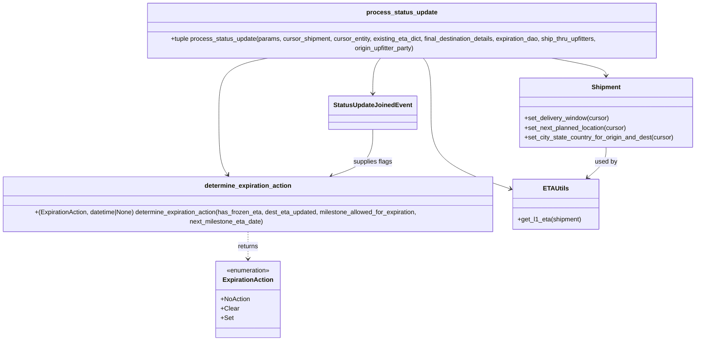

# Diagram: shipment_core/shipment_service/shipment_service/eta/eta_milestone_update/status_update_calculation.py


> Auto-generated by Obscura crawlers

## Diagram 1

```mermaid
flowchart TD
    A[process_status_update(params)] --> B[get_entity_eta_milestone_data]
    B -->|None| Z[log_skip & return False]
    B --> C[get_status_update_details]
    C -->|None| Z
    C --> D[StatusUpdateJoinedEvent(joined_event)]
    D --> E{should_skip_eta?}
    E -->|yes| Z
    E --> F[get_mapping_location_code_to_resolved_loc_id]
    F --> G[get_next_planned_loc_id]
    G --> H[Build Shipment entity]
    H --> I[set_delivery_window / set_next_planned_location / set_city_state_country]
    I --> J[get_l1_eta -> status_eta_date_time, eta_calculation_multi]
    J --> K[get_l1_eta(proxy_response_next_milestone_eta_date)]
    K --> L[get_processed_next_milestone_eta_date]
    L --> M{joined_event.is_historical_only?}
    M -->|no| N{has_eta_changed or etaSetToNoneByCode?}
    N -->|yes| O[set_next_milestone_flag & queue_add_entity_progress_update]
    O --> P[get_eta_expiration_milestone_blacklist]
    P --> Q[check_entity_for_frozen_eta]
    Q --> R[determine_expiration_action]
    R --> S[ExpirationDAO persist/delete based on action]
    M -->|yes| T[logging_in_response add historical log]
    O --> U[maybe update expiration]
    U --> V[return dest_eta_updated, next_milestone_eta_updated, logs]
    Z --> V
```

> SVG rendering failed for this diagram.

## Diagram 2



### SVG

<svg id="container" width="1823.07421875" xmlns="http://www.w3.org/2000/svg" class="classDiagram" height="832" viewBox="0 0 1823.07421875 832" role="graphics-document document" aria-roledescription="class"><style>#container{font-family:"trebuchet ms",verdana,arial,sans-serif;font-size:16px;fill:#333;}@keyframes edge-animation-frame{from{stroke-dashoffset:0;}}@keyframes dash{to{stroke-dashoffset:0;}}#container .edge-animation-slow{stroke-dasharray:9,5!important;stroke-dashoffset:900;animation:dash 50s linear infinite;stroke-linecap:round;}#container .edge-animation-fast{stroke-dasharray:9,5!important;stroke-dashoffset:900;animation:dash 20s linear infinite;stroke-linecap:round;}#container .error-icon{fill:#552222;}#container .error-text{fill:#552222;stroke:#552222;}#container .edge-thickness-normal{stroke-width:1px;}#container .edge-thickness-thick{stroke-width:3.5px;}#container .edge-pattern-solid{stroke-dasharray:0;}#container .edge-thickness-invisible{stroke-width:0;fill:none;}#container .edge-pattern-dashed{stroke-dasharray:3;}#container .edge-pattern-dotted{stroke-dasharray:2;}#container .marker{fill:#333333;stroke:#333333;}#container .marker.cross{stroke:#333333;}#container svg{font-family:"trebuchet ms",verdana,arial,sans-serif;font-size:16px;}#container p{margin:0;}#container g.classGroup text{fill:#9370DB;stroke:none;font-family:"trebuchet ms",verdana,arial,sans-serif;font-size:10px;}#container g.classGroup text .title{font-weight:bolder;}#container .nodeLabel,#container .edgeLabel{color:#131300;}#container .edgeLabel .label rect{fill:#ECECFF;}#container .label text{fill:#131300;}#container .labelBkg{background:#ECECFF;}#container .edgeLabel .label span{background:#ECECFF;}#container .classTitle{font-weight:bolder;}#container .node rect,#container .node circle,#container .node ellipse,#container .node polygon,#container .node path{fill:#ECECFF;stroke:#9370DB;stroke-width:1px;}#container .divider{stroke:#9370DB;stroke-width:1;}#container g.clickable{cursor:pointer;}#container g.classGroup rect{fill:#ECECFF;stroke:#9370DB;}#container g.classGroup line{stroke:#9370DB;stroke-width:1;}#container .classLabel .box{stroke:none;stroke-width:0;fill:#ECECFF;opacity:0.5;}#container .classLabel .label{fill:#9370DB;font-size:10px;}#container .relation{stroke:#333333;stroke-width:1;fill:none;}#container .dashed-line{stroke-dasharray:3;}#container .dotted-line{stroke-dasharray:1 2;}#container #compositionStart,#container .composition{fill:#333333!important;stroke:#333333!important;stroke-width:1;}#container #compositionEnd,#container .composition{fill:#333333!important;stroke:#333333!important;stroke-width:1;}#container #dependencyStart,#container .dependency{fill:#333333!important;stroke:#333333!important;stroke-width:1;}#container #dependencyStart,#container .dependency{fill:#333333!important;stroke:#333333!important;stroke-width:1;}#container #extensionStart,#container .extension{fill:transparent!important;stroke:#333333!important;stroke-width:1;}#container #extensionEnd,#container .extension{fill:transparent!important;stroke:#333333!important;stroke-width:1;}#container #aggregationStart,#container .aggregation{fill:transparent!important;stroke:#333333!important;stroke-width:1;}#container #aggregationEnd,#container .aggregation{fill:transparent!important;stroke:#333333!important;stroke-width:1;}#container #lollipopStart,#container .lollipop{fill:#ECECFF!important;stroke:#333333!important;stroke-width:1;}#container #lollipopEnd,#container .lollipop{fill:#ECECFF!important;stroke:#333333!important;stroke-width:1;}#container .edgeTerminals{font-size:11px;line-height:initial;}#container .classTitleText{text-anchor:middle;font-size:18px;fill:#333;}#container .label-icon{display:inline-block;height:1em;overflow:visible;vertical-align:-0.125em;}#container .node .label-icon path{fill:currentColor;stroke:revert;stroke-width:revert;}#container :root{--mermaid-font-family:"trebuchet ms",verdana,arial,sans-serif;}</style><g><defs><marker id="container_class-aggregationStart" class="marker aggregation class" refX="18" refY="7" markerWidth="190" markerHeight="240" orient="auto"><path d="M 18,7 L9,13 L1,7 L9,1 Z"></path></marker></defs><defs><marker id="container_class-aggregationEnd" class="marker aggregation class" refX="1" refY="7" markerWidth="20" markerHeight="28" orient="auto"><path d="M 18,7 L9,13 L1,7 L9,1 Z"></path></marker></defs><defs><marker id="container_class-extensionStart" class="marker extension class" refX="18" refY="7" markerWidth="190" markerHeight="240" orient="auto"><path d="M 1,7 L18,13 V 1 Z"></path></marker></defs><defs><marker id="container_class-extensionEnd" class="marker extension class" refX="1" refY="7" markerWidth="20" markerHeight="28" orient="auto"><path d="M 1,1 V 13 L18,7 Z"></path></marker></defs><defs><marker id="container_class-compositionStart" class="marker composition class" refX="18" refY="7" markerWidth="190" markerHeight="240" orient="auto"><path d="M 18,7 L9,13 L1,7 L9,1 Z"></path></marker></defs><defs><marker id="container_class-compositionEnd" class="marker composition class" refX="1" refY="7" markerWidth="20" markerHeight="28" orient="auto"><path d="M 18,7 L9,13 L1,7 L9,1 Z"></path></marker></defs><defs><marker id="container_class-dependencyStart" class="marker dependency class" refX="6" refY="7" markerWidth="190" markerHeight="240" orient="auto"><path d="M 5,7 L9,13 L1,7 L9,1 Z"></path></marker></defs><defs><marker id="container_class-dependencyEnd" class="marker dependency class" refX="13" refY="7" markerWidth="20" markerHeight="28" orient="auto"><path d="M 18,7 L9,13 L14,7 L9,1 Z"></path></marker></defs><defs><marker id="container_class-lollipopStart" class="marker lollipop class" refX="13" refY="7" markerWidth="190" markerHeight="240" orient="auto"><circle stroke="black" fill="transparent" cx="7" cy="7" r="6"></circle></marker></defs><defs><marker id="container_class-lollipopEnd" class="marker lollipop class" refX="1" refY="7" markerWidth="190" markerHeight="240" orient="auto"><circle stroke="black" fill="transparent" cx="7" cy="7" r="6"></circle></marker></defs><g class="root"><g class="clusters"></g><g class="edgePaths"><path d="M1014.288,134L1010.961,138.167C1007.635,142.333,1000.981,150.667,997.655,165.5C994.328,180.333,994.328,201.667,994.328,212.333L994.328,223" id="id_process_status_update_StatusUpdateJoinedEvent_1" class="edge-thickness-normal edge-pattern-solid relation" style=";;;" data-edge="true" data-et="edge" data-id="id_process_status_update_StatusUpdateJoinedEvent_1" data-points="W3sieCI6MTAxNC4yODc3MzA4MjM4NjM2LCJ5IjoxMzR9LHsieCI6OTk0LjMyODEyNSwieSI6MTU5fSx7IngiOjk5NC4zMjgxMjUsInkiOjIyOX1d" marker-end="url(#container_class-dependencyEnd)"></path><path d="M1445.055,134L1470.219,138.167C1495.382,142.333,1545.709,150.667,1570.872,158C1596.035,165.333,1596.035,171.667,1596.035,174.833L1596.035,178" id="id_process_status_update_Shipment_2" class="edge-thickness-normal edge-pattern-solid relation" style=";;;" data-edge="true" data-et="edge" data-id="id_process_status_update_Shipment_2" data-points="W3sieCI6MTQ0NS4wNTUyNjQ1NTk2NTksInkiOjEzNH0seyJ4IjoxNTk2LjAzNTE1NjI1LCJ5IjoxNTl9LHsieCI6MTU5Ni4wMzUxNTYyNSwieSI6MTg0fV0=" marker-end="url(#container_class-dependencyEnd)"></path><path d="M1114.884,134L1118.211,138.167C1121.537,142.333,1128.191,150.667,1131.517,173.5C1134.844,196.333,1134.844,233.667,1134.844,273C1134.844,312.333,1134.844,353.667,1171.797,385.392C1208.751,417.116,1282.657,439.233,1319.611,450.291L1356.564,461.349" id="id_process_status_update_ETAUtils_3" class="edge-thickness-normal edge-pattern-solid relation" style=";;;" data-edge="true" data-et="edge" data-id="id_process_status_update_ETAUtils_3" data-points="W3sieCI6MTExNC44ODQxNDQxNzYxMzYzLCJ5IjoxMzR9LHsieCI6MTEzNC44NDM3NSwieSI6MTU5fSx7IngiOjExMzQuODQzNzUsInkiOjI3MX0seyJ4IjoxMTM0Ljg0Mzc1LCJ5IjozOTV9LHsieCI6MTM2Mi4zMTI1LCJ5Ijo0NjMuMDY5Mzg3OTQ1OTQ4NDV9XQ==" marker-end="url(#container_class-dependencyEnd)"></path><path d="M724.753,134L702.277,138.167C679.801,142.333,634.85,150.667,612.374,173.5C589.898,196.333,589.898,233.667,589.898,273C589.898,312.333,589.898,353.667,593.656,379.682C597.414,405.697,604.929,416.394,608.687,421.742L612.445,427.091" id="id_process_status_update_determine_expiration_action_4" class="edge-thickness-normal edge-pattern-solid relation" style=";;;" data-edge="true" data-et="edge" data-id="id_process_status_update_determine_expiration_action_4" data-points="W3sieCI6NzI0Ljc1Mjg0MDkwOTA5MSwieSI6MTM0fSx7IngiOjU4OS44OTg0Mzc1LCJ5IjoxNTl9LHsieCI6NTg5Ljg5ODQzNzUsInkiOjI3MX0seyJ4Ijo1ODkuODk4NDM3NSwieSI6Mzk1fSx7IngiOjYxNS44OTM4MjgxMjUsInkiOjQzMn1d" marker-end="url(#container_class-dependencyEnd)"></path><path d="M660.156,558L660.156,564.167C660.156,570.333,660.156,582.667,660.156,594C660.156,605.333,660.156,615.667,660.156,620.833L660.156,626" id="id_determine_expiration_action_ExpirationAction_5" class="edge-thickness-normal edge-pattern-dashed relation" style=";;;" data-edge="true" data-et="edge" data-id="id_determine_expiration_action_ExpirationAction_5" data-points="W3sieCI6NjYwLjE1NjI1LCJ5Ijo1NTh9LHsieCI6NjYwLjE1NjI1LCJ5Ijo1OTV9LHsieCI6NjYwLjE1NjI1LCJ5Ijo2MzJ9XQ==" marker-end="url(#container_class-dependencyEnd)"></path><path d="M1596.035,358L1596.035,364.167C1596.035,370.333,1596.035,382.667,1588.988,394.381C1581.941,406.096,1567.847,417.192,1560.799,422.74L1553.752,428.289" id="id_Shipment_ETAUtils_6" class="edge-thickness-normal edge-pattern-solid relation" style=";;;" data-edge="true" data-et="edge" data-id="id_Shipment_ETAUtils_6" data-points="W3sieCI6MTU5Ni4wMzUxNTYyNSwieSI6MzU4fSx7IngiOjE1OTYuMDM1MTU2MjUsInkiOjM5NX0seyJ4IjoxNTQ5LjAzNzkyOTY4NzUsInkiOjQzMn1d" marker-end="url(#container_class-dependencyEnd)"></path><path d="M994.328,313L994.328,326.667C994.328,340.333,994.328,367.667,974.679,387.213C955.03,406.76,915.731,418.52,896.082,424.4L876.433,430.28" id="id_StatusUpdateJoinedEvent_determine_expiration_action_7" class="edge-thickness-normal edge-pattern-solid relation" style=";;;" data-edge="true" data-et="edge" data-id="id_StatusUpdateJoinedEvent_determine_expiration_action_7" data-points="W3sieCI6OTk0LjMyODEyNSwieSI6MzEzfSx7IngiOjk5NC4zMjgxMjUsInkiOjM5NX0seyJ4Ijo4NzAuNjg0NTMxMjUsInkiOjQzMn1d" marker-end="url(#container_class-dependencyEnd)"></path></g><g class="edgeLabels"><g class="edgeLabel"><g class="label" data-id="id_process_status_update_StatusUpdateJoinedEvent_1" transform="translate(0, 0)"><foreignObject width="0" height="0"><div xmlns="http://www.w3.org/1999/xhtml" class="labelBkg" style="display: table-cell; white-space: nowrap; line-height: 1.5; max-width: 200px; text-align: center;"><span class="edgeLabel"></span></div></foreignObject></g></g><g class="edgeLabel"><g class="label" data-id="id_process_status_update_Shipment_2" transform="translate(0, 0)"><foreignObject width="0" height="0"><div xmlns="http://www.w3.org/1999/xhtml" class="labelBkg" style="display: table-cell; white-space: nowrap; line-height: 1.5; max-width: 200px; text-align: center;"><span class="edgeLabel"></span></div></foreignObject></g></g><g class="edgeLabel"><g class="label" data-id="id_process_status_update_ETAUtils_3" transform="translate(0, 0)"><foreignObject width="0" height="0"><div xmlns="http://www.w3.org/1999/xhtml" class="labelBkg" style="display: table-cell; white-space: nowrap; line-height: 1.5; max-width: 200px; text-align: center;"><span class="edgeLabel"></span></div></foreignObject></g></g><g class="edgeLabel"><g class="label" data-id="id_process_status_update_determine_expiration_action_4" transform="translate(0, 0)"><foreignObject width="0" height="0"><div xmlns="http://www.w3.org/1999/xhtml" class="labelBkg" style="display: table-cell; white-space: nowrap; line-height: 1.5; max-width: 200px; text-align: center;"><span class="edgeLabel"></span></div></foreignObject></g></g><g class="edgeLabel" transform="translate(660.15625, 595)"><g class="label" data-id="id_determine_expiration_action_ExpirationAction_5" transform="translate(-26.265625, -12)"><foreignObject width="52.53125" height="24"><div xmlns="http://www.w3.org/1999/xhtml" class="labelBkg" style="display: table-cell; white-space: nowrap; line-height: 1.5; max-width: 200px; text-align: center;"><span class="edgeLabel"><p>returns</p></span></div></foreignObject></g></g><g class="edgeLabel" transform="translate(1596.03515625, 395)"><g class="label" data-id="id_Shipment_ETAUtils_6" transform="translate(-28.3125, -12)"><foreignObject width="56.625" height="24"><div xmlns="http://www.w3.org/1999/xhtml" class="labelBkg" style="display: table-cell; white-space: nowrap; line-height: 1.5; max-width: 200px; text-align: center;"><span class="edgeLabel"><p>used by</p></span></div></foreignObject></g></g><g class="edgeLabel" transform="translate(994.328125, 395)"><g class="label" data-id="id_StatusUpdateJoinedEvent_determine_expiration_action_7" transform="translate(-49.5234375, -12)"><foreignObject width="99.046875" height="24"><div xmlns="http://www.w3.org/1999/xhtml" class="labelBkg" style="display: table-cell; white-space: nowrap; line-height: 1.5; max-width: 200px; text-align: center;"><span class="edgeLabel"><p>supplies flags</p></span></div></foreignObject></g></g></g><g class="nodes"><g class="node default" id="classId-process_status_update-0" transform="translate(1064.5859375, 71)"><g class="basic label-container"><path d="M-680.7265625 -63 L680.7265625 -63 L680.7265625 63 L-680.7265625 63" stroke="none" stroke-width="0" fill="#ECECFF" style=""></path><path d="M-680.7265625 -63 C-350.68317010554125 -63, -20.639777711082502 -63, 680.7265625 -63 M-680.7265625 -63 C-273.50989836817536 -63, 133.7067657636493 -63, 680.7265625 -63 M680.7265625 -63 C680.7265625 -27.631891474579994, 680.7265625 7.736217050840011, 680.7265625 63 M680.7265625 -63 C680.7265625 -25.787458039866024, 680.7265625 11.425083920267951, 680.7265625 63 M680.7265625 63 C200.726174384037 63, -279.274213731926 63, -680.7265625 63 M680.7265625 63 C201.4389164853352 63, -277.8487295293296 63, -680.7265625 63 M-680.7265625 63 C-680.7265625 36.052192393408035, -680.7265625 9.104384786816077, -680.7265625 -63 M-680.7265625 63 C-680.7265625 32.3791016441118, -680.7265625 1.7582032882235978, -680.7265625 -63" stroke="#9370DB" stroke-width="1.3" fill="none" stroke-dasharray="0 0" style=""></path></g><g class="annotation-group text" transform="translate(0, -39)"></g><g class="label-group text" transform="translate(-84.6875, -39)"><g class="label" style="font-weight: bolder" transform="translate(0,-12)"><foreignObject width="169.375" height="24"><div xmlns="http://www.w3.org/1999/xhtml" style="display: table-cell; white-space: nowrap; line-height: 1.5; max-width: 217px; text-align: center;"><span class="nodeLabel markdown-node-label" style=""><p>process_status_update</p></span></div></foreignObject></g></g><g class="members-group text" transform="translate(-668.7265625, 9)"></g><g class="methods-group text" transform="translate(-668.7265625, 39)"><g class="label" style="" transform="translate(0,-12)"><foreignObject width="1252.765625" height="24"><div xmlns="http://www.w3.org/1999/xhtml" style="display: table-cell; white-space: nowrap; line-height: 1.5; max-width: 1310px; text-align: center;"><span class="nodeLabel markdown-node-label" style=""><p>+tuple process_status_update(params, cursor_shipment, cursor_entity, existing_eta_dict, final_destination_details, expiration_dao, ship_thru_upfitters, origin_upfitter_party)</p></span></div></foreignObject></g></g><g class="divider" style=""><path d="M-680.7265625 -15 C-366.3270891887598 -15, -51.927615877519656 -15, 680.7265625 -15 M-680.7265625 -15 C-143.27511842746333 -15, 394.17632564507335 -15, 680.7265625 -15" stroke="#9370DB" stroke-width="1.3" fill="none" stroke-dasharray="0 0" style=""></path></g><g class="divider" style=""><path d="M-680.7265625 9 C-248.75571165375135 9, 183.2151391924973 9, 680.7265625 9 M-680.7265625 9 C-332.238236225976 9, 16.250090048048037 9, 680.7265625 9" stroke="#9370DB" stroke-width="1.3" fill="none" stroke-dasharray="0 0" style=""></path></g></g><g class="node default" id="classId-ExpirationAction-1" transform="translate(660.15625, 728)"><g class="basic label-container"><path d="M-79.28125 -96 L79.28125 -96 L79.28125 96 L-79.28125 96" stroke="none" stroke-width="0" fill="#ECECFF" style=""></path><path d="M-79.28125 -96 C-28.330207050249108 -96, 22.620835899501785 -96, 79.28125 -96 M-79.28125 -96 C-24.73221188092181 -96, 29.81682623815638 -96, 79.28125 -96 M79.28125 -96 C79.28125 -42.456017144962246, 79.28125 11.087965710075508, 79.28125 96 M79.28125 -96 C79.28125 -55.184908449861474, 79.28125 -14.369816899722949, 79.28125 96 M79.28125 96 C45.9581252368974 96, 12.635000473794804 96, -79.28125 96 M79.28125 96 C38.660917949606855 96, -1.9594141007862902 96, -79.28125 96 M-79.28125 96 C-79.28125 52.41095820852106, -79.28125 8.821916417042118, -79.28125 -96 M-79.28125 96 C-79.28125 43.69477088050327, -79.28125 -8.61045823899346, -79.28125 -96" stroke="#9370DB" stroke-width="1.3" fill="none" stroke-dasharray="0 0" style=""></path></g><g class="annotation-group text" transform="translate(-55.5546875, -72)"><g class="label" style="" transform="translate(0,-12)"><foreignObject width="111.109375" height="24"><div xmlns="http://www.w3.org/1999/xhtml" style="display: table-cell; white-space: nowrap; line-height: 1.5; max-width: 161px; text-align: center;"><span class="nodeLabel markdown-node-label" style=""><p>«enumeration»</p></span></div></foreignObject></g></g><g class="label-group text" transform="translate(-60.46875, -48)"><g class="label" style="font-weight: bolder" transform="translate(0,-12)"><foreignObject width="120.9375" height="24"><div xmlns="http://www.w3.org/1999/xhtml" style="display: table-cell; white-space: nowrap; line-height: 1.5; max-width: 170px; text-align: center;"><span class="nodeLabel markdown-node-label" style=""><p>ExpirationAction</p></span></div></foreignObject></g></g><g class="members-group text" transform="translate(-67.28125, 0)"><g class="label" style="" transform="translate(0,-12)"><foreignObject width="74.09375" height="24"><div xmlns="http://www.w3.org/1999/xhtml" style="display: table-cell; white-space: nowrap; line-height: 1.5; max-width: 131px; text-align: center;"><span class="nodeLabel markdown-node-label" style=""><p>+NoAction</p></span></div></foreignObject></g><g class="label" style="" transform="translate(0,12)"><foreignObject width="44.84375" height="24"><div xmlns="http://www.w3.org/1999/xhtml" style="display: table-cell; white-space: nowrap; line-height: 1.5; max-width: 103px; text-align: center;"><span class="nodeLabel markdown-node-label" style=""><p>+Clear</p></span></div></foreignObject></g><g class="label" style="" transform="translate(0,36)"><foreignObject width="30.5625" height="24"><div xmlns="http://www.w3.org/1999/xhtml" style="display: table-cell; white-space: nowrap; line-height: 1.5; max-width: 88px; text-align: center;"><span class="nodeLabel markdown-node-label" style=""><p>+Set</p></span></div></foreignObject></g></g><g class="methods-group text" transform="translate(-67.28125, 96)"></g><g class="divider" style=""><path d="M-79.28125 -24 C-44.2330857231481 -24, -9.184921446296201 -24, 79.28125 -24 M-79.28125 -24 C-26.685283841594398 -24, 25.910682316811204 -24, 79.28125 -24" stroke="#9370DB" stroke-width="1.3" fill="none" stroke-dasharray="0 0" style=""></path></g><g class="divider" style=""><path d="M-79.28125 72 C-42.92045360573925 72, -6.559657211478495 72, 79.28125 72 M-79.28125 72 C-24.598630014121817 72, 30.083989971756367 72, 79.28125 72" stroke="#9370DB" stroke-width="1.3" fill="none" stroke-dasharray="0 0" style=""></path></g></g><g class="node default" id="classId-determine_expiration_action-2" transform="translate(660.15625, 495)"><g class="basic label-container"><path d="M-652.15625 -63 L652.15625 -63 L652.15625 63 L-652.15625 63" stroke="none" stroke-width="0" fill="#ECECFF" style=""></path><path d="M-652.15625 -63 C-205.14737822917255 -63, 241.8614935416549 -63, 652.15625 -63 M-652.15625 -63 C-358.2108739524805 -63, -64.26549790496097 -63, 652.15625 -63 M652.15625 -63 C652.15625 -25.823917694831856, 652.15625 11.352164610336288, 652.15625 63 M652.15625 -63 C652.15625 -32.97688171076237, 652.15625 -2.953763421524748, 652.15625 63 M652.15625 63 C336.54319120617566 63, 20.930132412351327 63, -652.15625 63 M652.15625 63 C196.45462960495314 63, -259.2469907900937 63, -652.15625 63 M-652.15625 63 C-652.15625 34.69041471748351, -652.15625 6.380829434967026, -652.15625 -63 M-652.15625 63 C-652.15625 13.762506230619458, -652.15625 -35.474987538761084, -652.15625 -63" stroke="#9370DB" stroke-width="1.3" fill="none" stroke-dasharray="0 0" style=""></path></g><g class="annotation-group text" transform="translate(0, -39)"></g><g class="label-group text" transform="translate(-105.90625, -39)"><g class="label" style="font-weight: bolder" transform="translate(0,-12)"><foreignObject width="211.8125" height="24"><div xmlns="http://www.w3.org/1999/xhtml" style="display: table-cell; white-space: nowrap; line-height: 1.5; max-width: 260px; text-align: center;"><span class="nodeLabel markdown-node-label" style=""><p>determine_expiration_action</p></span></div></foreignObject></g></g><g class="members-group text" transform="translate(-640.15625, 9)"></g><g class="methods-group text" transform="translate(-640.15625, 39)"><g class="label" style="" transform="translate(0,-12)"><foreignObject width="1174.40625" height="24"><div xmlns="http://www.w3.org/1999/xhtml" style="display: table-cell; white-space: nowrap; line-height: 1.5; max-width: 1232px; text-align: center;"><span class="nodeLabel markdown-node-label" style=""><p>+(ExpirationAction, datetime|None) determine_expiration_action(has_frozen_eta, dest_eta_updated, milestone_allowed_for_expiration, next_milestone_eta_date)</p></span></div></foreignObject></g></g><g class="divider" style=""><path d="M-652.15625 -15 C-203.54740649675222 -15, 245.06143700649557 -15, 652.15625 -15 M-652.15625 -15 C-159.11282300224332 -15, 333.93060399551337 -15, 652.15625 -15" stroke="#9370DB" stroke-width="1.3" fill="none" stroke-dasharray="0 0" style=""></path></g><g class="divider" style=""><path d="M-652.15625 9 C-331.9544130354569 9, -11.752576070913847 9, 652.15625 9 M-652.15625 9 C-208.19284115476904 9, 235.77056769046192 9, 652.15625 9" stroke="#9370DB" stroke-width="1.3" fill="none" stroke-dasharray="0 0" style=""></path></g></g><g class="node default" id="classId-StatusUpdateJoinedEvent-3" transform="translate(994.328125, 271)"><g class="basic label-container"><path d="M-105.515625 -42 L105.515625 -42 L105.515625 42 L-105.515625 42" stroke="none" stroke-width="0" fill="#ECECFF" style=""></path><path d="M-105.515625 -42 C-45.55562485782416 -42, 14.404375284351687 -42, 105.515625 -42 M-105.515625 -42 C-59.26817493989607 -42, -13.02072487979214 -42, 105.515625 -42 M105.515625 -42 C105.515625 -19.558150466819654, 105.515625 2.883699066360691, 105.515625 42 M105.515625 -42 C105.515625 -19.281083529691514, 105.515625 3.437832940616971, 105.515625 42 M105.515625 42 C60.02323589503114 42, 14.530846790062284 42, -105.515625 42 M105.515625 42 C57.76390857256072 42, 10.012192145121446 42, -105.515625 42 M-105.515625 42 C-105.515625 21.570111491560244, -105.515625 1.1402229831204878, -105.515625 -42 M-105.515625 42 C-105.515625 16.684902741930774, -105.515625 -8.630194516138452, -105.515625 -42" stroke="#9370DB" stroke-width="1.3" fill="none" stroke-dasharray="0 0" style=""></path></g><g class="annotation-group text" transform="translate(0, -18)"></g><g class="label-group text" transform="translate(-93.515625, -18)"><g class="label" style="font-weight: bolder" transform="translate(0,-12)"><foreignObject width="187.03125" height="24"><div xmlns="http://www.w3.org/1999/xhtml" style="display: table-cell; white-space: nowrap; line-height: 1.5; max-width: 235px; text-align: center;"><span class="nodeLabel markdown-node-label" style=""><p>StatusUpdateJoinedEvent</p></span></div></foreignObject></g></g><g class="members-group text" transform="translate(-93.515625, 30)"></g><g class="methods-group text" transform="translate(-93.515625, 60)"></g><g class="divider" style=""><path d="M-105.515625 6 C-43.40303671595147 6, 18.709551568097055 6, 105.515625 6 M-105.515625 6 C-26.98604592425862 6, 51.54353315148276 6, 105.515625 6" stroke="#9370DB" stroke-width="1.3" fill="none" stroke-dasharray="0 0" style=""></path></g><g class="divider" style=""><path d="M-105.515625 24 C-31.167871681390693 24, 43.179881637218614 24, 105.515625 24 M-105.515625 24 C-57.11054524248416 24, -8.705465484968315 24, 105.515625 24" stroke="#9370DB" stroke-width="1.3" fill="none" stroke-dasharray="0 0" style=""></path></g></g><g class="node default" id="classId-Shipment-4" transform="translate(1596.03515625, 271)"><g class="basic label-container"><path d="M-219.0390625 -87 L219.0390625 -87 L219.0390625 87 L-219.0390625 87" stroke="none" stroke-width="0" fill="#ECECFF" style=""></path><path d="M-219.0390625 -87 C-59.23411776861499 -87, 100.57082696277001 -87, 219.0390625 -87 M-219.0390625 -87 C-60.90605202912715 -87, 97.2269584417457 -87, 219.0390625 -87 M219.0390625 -87 C219.0390625 -49.52650164188126, 219.0390625 -12.053003283762521, 219.0390625 87 M219.0390625 -87 C219.0390625 -23.789220322193295, 219.0390625 39.42155935561341, 219.0390625 87 M219.0390625 87 C75.59419207444472 87, -67.85067835111056 87, -219.0390625 87 M219.0390625 87 C77.0601487097909 87, -64.91876508041821 87, -219.0390625 87 M-219.0390625 87 C-219.0390625 38.65688742376211, -219.0390625 -9.686225152475785, -219.0390625 -87 M-219.0390625 87 C-219.0390625 42.61604161923623, -219.0390625 -1.7679167615275446, -219.0390625 -87" stroke="#9370DB" stroke-width="1.3" fill="none" stroke-dasharray="0 0" style=""></path></g><g class="annotation-group text" transform="translate(0, -63)"></g><g class="label-group text" transform="translate(-35.109375, -63)"><g class="label" style="font-weight: bolder" transform="translate(0,-12)"><foreignObject width="70.21875" height="24"><div xmlns="http://www.w3.org/1999/xhtml" style="display: table-cell; white-space: nowrap; line-height: 1.5; max-width: 120px; text-align: center;"><span class="nodeLabel markdown-node-label" style=""><p>Shipment</p></span></div></foreignObject></g></g><g class="members-group text" transform="translate(-207.0390625, -15)"></g><g class="methods-group text" transform="translate(-207.0390625, 15)"><g class="label" style="" transform="translate(0,-12)"><foreignObject width="215.390625" height="24"><div xmlns="http://www.w3.org/1999/xhtml" style="display: table-cell; white-space: nowrap; line-height: 1.5; max-width: 273px; text-align: center;"><span class="nodeLabel markdown-node-label" style=""><p>+set_delivery_window(cursor)</p></span></div></foreignObject></g><g class="label" style="" transform="translate(0,12)"><foreignObject width="261.359375" height="24"><div xmlns="http://www.w3.org/1999/xhtml" style="display: table-cell; white-space: nowrap; line-height: 1.5; max-width: 319px; text-align: center;"><span class="nodeLabel markdown-node-label" style=""><p>+set_next_planned_location(cursor)</p></span></div></foreignObject></g><g class="label" style="" transform="translate(0,36)"><foreignObject width="378.96875" height="24"><div xmlns="http://www.w3.org/1999/xhtml" style="display: table-cell; white-space: nowrap; line-height: 1.5; max-width: 436px; text-align: center;"><span class="nodeLabel markdown-node-label" style=""><p>+set_city_state_country_for_origin_and_dest(cursor)</p></span></div></foreignObject></g></g><g class="divider" style=""><path d="M-219.0390625 -39 C-120.60748886069555 -39, -22.175915221391108 -39, 219.0390625 -39 M-219.0390625 -39 C-59.92530012253661 -39, 99.18846225492678 -39, 219.0390625 -39" stroke="#9370DB" stroke-width="1.3" fill="none" stroke-dasharray="0 0" style=""></path></g><g class="divider" style=""><path d="M-219.0390625 -15 C-116.12308403407161 -15, -13.20710556814322 -15, 219.0390625 -15 M-219.0390625 -15 C-59.29613671406699 -15, 100.44678907186602 -15, 219.0390625 -15" stroke="#9370DB" stroke-width="1.3" fill="none" stroke-dasharray="0 0" style=""></path></g></g><g class="node default" id="classId-ETAUtils-5" transform="translate(1469.015625, 495)"><g class="basic label-container"><path d="M-106.703125 -63 L106.703125 -63 L106.703125 63 L-106.703125 63" stroke="none" stroke-width="0" fill="#ECECFF" style=""></path><path d="M-106.703125 -63 C-47.75687599623056 -63, 11.189373007538876 -63, 106.703125 -63 M-106.703125 -63 C-27.45627165059682 -63, 51.79058169880636 -63, 106.703125 -63 M106.703125 -63 C106.703125 -13.592546738568899, 106.703125 35.8149065228622, 106.703125 63 M106.703125 -63 C106.703125 -29.925119290551827, 106.703125 3.1497614188963468, 106.703125 63 M106.703125 63 C40.509355290209626 63, -25.684414419580747 63, -106.703125 63 M106.703125 63 C26.41298796806808 63, -53.87714906386384 63, -106.703125 63 M-106.703125 63 C-106.703125 28.89215032418263, -106.703125 -5.21569935163474, -106.703125 -63 M-106.703125 63 C-106.703125 16.80921644229244, -106.703125 -29.381567115415123, -106.703125 -63" stroke="#9370DB" stroke-width="1.3" fill="none" stroke-dasharray="0 0" style=""></path></g><g class="annotation-group text" transform="translate(0, -39)"></g><g class="label-group text" transform="translate(-29.5625, -39)"><g class="label" style="font-weight: bolder" transform="translate(0,-12)"><foreignObject width="59.125" height="24"><div xmlns="http://www.w3.org/1999/xhtml" style="display: table-cell; white-space: nowrap; line-height: 1.5; max-width: 108px; text-align: center;"><span class="nodeLabel markdown-node-label" style=""><p>ETAUtils</p></span></div></foreignObject></g></g><g class="members-group text" transform="translate(-94.703125, 9)"></g><g class="methods-group text" transform="translate(-94.703125, 39)"><g class="label" style="" transform="translate(0,-12)"><foreignObject width="159.84375" height="24"><div xmlns="http://www.w3.org/1999/xhtml" style="display: table-cell; white-space: nowrap; line-height: 1.5; max-width: 217px; text-align: center;"><span class="nodeLabel markdown-node-label" style=""><p>+get_l1_eta(shipment)</p></span></div></foreignObject></g></g><g class="divider" style=""><path d="M-106.703125 -15 C-41.688845726266734 -15, 23.32543354746653 -15, 106.703125 -15 M-106.703125 -15 C-31.24209010693535 -15, 44.2189447861293 -15, 106.703125 -15" stroke="#9370DB" stroke-width="1.3" fill="none" stroke-dasharray="0 0" style=""></path></g><g class="divider" style=""><path d="M-106.703125 9 C-39.224134509737524 9, 28.25485598052495 9, 106.703125 9 M-106.703125 9 C-27.966762397212406 9, 50.76960020557519 9, 106.703125 9" stroke="#9370DB" stroke-width="1.3" fill="none" stroke-dasharray="0 0" style=""></path></g></g></g></g></g></svg>
